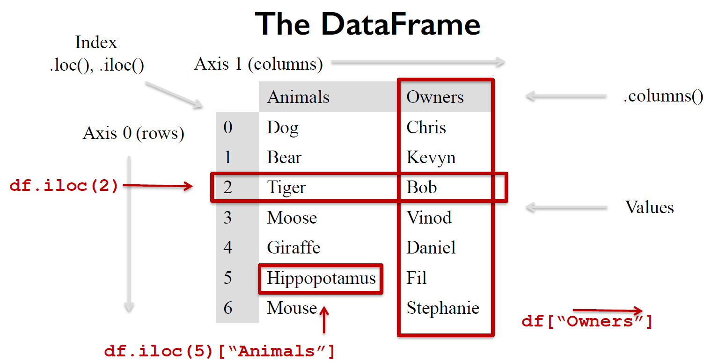
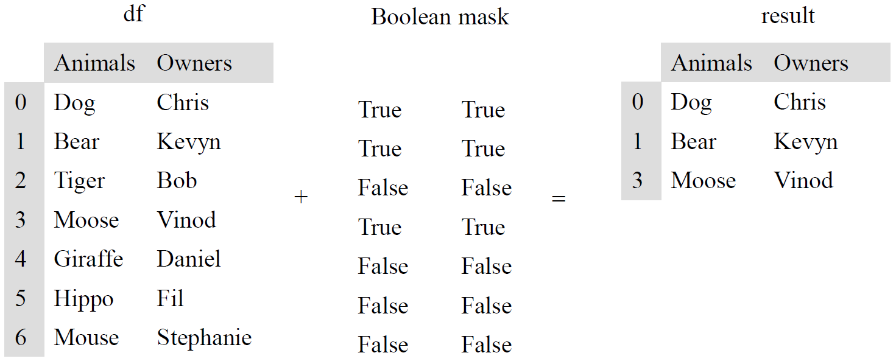

# Basic Data Processing with Pandas

## Introduction

+ Pandas
    + Created in 2008 by Wes McKinney
    + Open source New BSD license
    + 100+ different contributors
+ References
    + Stack Overflow
        + http://stackoverflow.com
        + Massive knowledge forum of python and pandas related content
        + Free to join and participate in
        + Heavily used by pandas developers instead of a mailing list
    + Books
        + Wes McKinney, 'Python for Data Analysis', O'Reilly
        + Matt Harrison, 'Learning the Pandas Library'
    + Planet Python
        + http://planetpython.org/
        + Excellent blog aggregator for python related news
        + Significant number of data science and python tutorials as posted
        + Great blend of applied beginner and higher level python postings

[](https://d3c33hcgiwev3.cloudfront.net/ThPPKZeOEeaK1Q4gRyvE8A.processed/full/540p/index.mp4?Expires=1525478400&Signature=NYPazMrxmZWOy9hKKwMPe8J2PYvD8l7oWRsWCpNaCe30bNglWeval5sYOl6KWmHf8~C3PWCsRyAMhTMfPhe0UaHLSax9lUbIRd2rFWOPgL9ryQ0RPM2lgP5cQ9lKOYJrRE9AEfMemDma~wUeENMyrCExe8tb0HxEhf88hAJPhL4_&Key-Pair-Id=APKAJLTNE6QMUY6HBC5A){:target="_blank"}

## Week 2 Lectures Jupyter Notebook

To download notebooks and datafiles, as well as get help on Jupyter notebooks in the Coursera platform, visit the [Jupyter Notebook FAQ](https://www.coursera.org/learn/python-data-analysis/resources/0dhYG) course resource.

## The Series Data Structure


+ The Series
    + Name: label of a column
    + Index: the index of a row
    + Value: the element

+ Demo
    ```python
    import pandas as pd
    get_ipython().magic('pinfo pd.Series')

    animals = ['Tiger', 'Bear', 'Moose']
    pd.Series(animals)

    numbers = [1, 2, 3]
    pd.Series(numbers)

    animals = ['Tiger', 'Bear', None]
    pd.Series(animals)      # None --> None; dtype: object

    numbers = [1, 2, None]
    pd.Series(numbers)      # None --> NaN; dtype: float64

    import numpy as np
    np.nan == None          # False

    np.nan == np.nan        # False

    np.isnan(np.nan)

    sports = {'Archery': 'Bhutan',
            'Golf': 'Scotland',
            'Sumo': 'Japan',
            'Taekwondo': 'South Korea'}
    s = pd.Series(sports)

    s.index         # Index(['Archery', 'Golf', 'Sumo', 'Taekwondo'], dtype='object')

    s = pd.Series(['Tiger', 'Bear', 'Moose'], index=['India', 'America', 'Canada'])

    sports = {'Archery': 'Bhutan',
            'Golf': 'Scotland',
            'Sumo': 'Japan',
            'Taekwondo': 'South Korea'}
    s = pd.Series(sports, index=['Golf', 'Sumo', 'Hockey']) # only last three taken
    ```

[](https://d3c33hcgiwev3.cloudfront.net/deR9JZmEEeaToA55AQb91A.processed/full/540p/index.mp4?Expires=1525478400&Signature=KsI8ZLjCILliqC04ox1NQDk76fV-CCnCsJA3FeP~J55DpQR6dRMcvN6ffqUJ6Prk00ecOnm8TUMudKNsbiR6A2e7pC0XV1wAArn6rNh~rGyoICswJLp2MHSPUKTWuimK2gNzPpXbH06ucv0T~2s9S-QCQwGqyY7QGsAY-EuJO2w_&Key-Pair-Id=APKAJLTNE6QMUY6HBC5A){:target="_blank"}

## Querying a Series

+ Demo
    ```python
    sports = {'Archery': 'Bhutan',
            'Golf': 'Scotland',
            'Sumo': 'Japan',
            'Taekwondo': 'South Korea'}
    s = pd.Series(sports)

    s.iloc[3]       # index location
    s.loc['Golf']   # value location
    s[3]            # index location
    s['Golf']       # value location

    sports = {99: 'Bhutan',
            100: 'Scotland',
            101: 'Japan',
            102: 'South Korea'}
    s = pd.Series(sports)

    s[0] #This won't call s.iloc[0] as one might expect, it generates an error instead

    s = pd.Series([100.00, 120.00, 101.00, 3.00])   # auto index w/ number sequence from 0

    # np.sum and iteration
    total = 0
    for item in s:
        total+=item
    print(total)

    total = np.sum(s)
    print(total)

    #this creates a big series of random numbers
    s = pd.Series(np.random.randint(0,1000,10000))
    s.head()

    len(s)

    # run to times and get the average time to execute the code
    %%timeit -n 100
    summary = 0
    for item in s:
        summary += item
    # 1.07 ms ± 95.2 µs per loop (mean ± std. dev. of 7 runs, 100 loops each)

    # get_ipython().run_cell_magic('timeit', '-n 100', 'summary = 0\nfor item in s:\n    summary+=item')

    # generate random series for 10 times
    %%timeit -n 100
    summary = np.sum(s)
    # 144 µs ± 24.1 µs per loop (mean ± std. dev. of 7 runs, 100 loops each)

    # get_ipython().run_cell_magic('timeit', '-n 100', 'summary = np.sum(s)')

    s+=2 #adds two to each item in s using broadcasting
    s.head()

    for label, value in s.iteritems():
        s.set_value(label, value+2)
    s.head()

    %%timeit -n 10
    s = pd.Series(np.random.randint(0,1000,10000))
    for label, value in s.iteritems():
        s.loc[label]= value+2

    # get_ipython().run_cell_magic('timeit', '-n 10', 's = pd.Series(np.random.randint(0,1000,10000))\nfor label, value in s.iteritems():\n    s.loc[label]= value+2')

    %%timeit -n 10
    s = pd.Series(np.random.randint(0,1000,10000))
    s+=2

    # get_ipython().run_cell_magic('timeit', '-n 10', 's = pd.Series(np.random.randint(0,1000,10000))\ns+=2')

    s = pd.Series([1, 2, 3])
    s.loc['Animal'] = 'Bears'

    original_sports = pd.Series({'Archery': 'Bhutan',
                                'Golf': 'Scotland',
                                'Sumo': 'Japan',
                                'Taekwondo': 'South Korea'})
    cricket_loving_countries = pd.Series(['Australia',
                                        'Barbados',
                                        'Pakistan',
                                        'England'], 
                                    index=['Cricket',
                                            'Cricket',
                                            'Cricket',
                                            'Cricket'])
    all_countries = original_sports.append(cricket_loving_countries)

    original_sports
    cricket_loving_countries
    all_countries
    all_countries.loc['Cricket']
    ```

[](https://d3c33hcgiwev3.cloudfront.net/nE8CiJePEea_cQqzDLeQwg.processed/full/540p/index.mp4?Expires=1525564800&Signature=eml1y2DEZSD3DW4FUnrzfUiypGLnp8kIOTr43m7-sobpf4sXW80ltXDAyktfSfoZuuNMaifteEJuEvFBtf52LUwKIoug-CwAYNIy-eJxzSeQzKCpQvFRcj1DRU~q~il6LL4R31z3WtjZSeOZZM6T~q--KijBe-0ksPF7ftnH2Ko_&Key-Pair-Id=APKAJLTNE6QMUY6HBC5A){:target="_blank"}

## The DataFrame Data Structure



+ Demo
    ```python
    purchase_1 = pd.Series({'Name': 'Chris',
                            'Item Purchased': 'Dog Food',
                            'Cost': 22.50})
    purchase_2 = pd.Series({'Name': 'Kevyn',
                            'Item Purchased': 'Kitty Litter',
                            'Cost': 2.50})
    purchase_3 = pd.Series({'Name': 'Vinod',
                            'Item Purchased': 'Bird Seed',
                            'Cost': 5.00})
    df = pd.DataFrame([purchase_1, purchase_2, purchase_3], index=['Store 1', 'Store 1', 'Store 2'])
    df.head()

    df.loc['Store 2']           # 'Store 2' row
    type(df.loc['Store 2'])     # pandas.core.series.Series
    df.loc['Store 1']           # 'Store 1' row
    df.loc['Store 1', 'Cost']   # ('Store 1', Cost) element
    df.T.loc['Cost']            # Cost column
    df['Cost']                  # Cost column
    df.loc['Store 1']['Cost']   # ('Store 1', Cost) element
    df.loc[:,['Name', 'Cost']]  # 
    df.drop('Store 1')

    copy_df = df.copy()
    copy_df = copy_df.drop('Store 1')
    copy_df

    help(opy_df.drop)

    del copy_df['Name']
    copy_df

    df['Location'] = None
    ```
+ Quiz
    + For the purchase records from the pet store, how would you get a list of all items which had been purchased (regardless of where they might have been purchased, or by whom)?
        ```python
        purchase_1 = pd.Series({'Name': 'Chris',
                                'Item Purchased': 'Dog Food',
                                'Cost': 22.50})
        purchase_2 = pd.Series({'Name': 'Kevyn',
                                'Item Purchased': 'Kitty Litter',
                                'Cost': 2.50})
        purchase_3 = pd.Series({'Name': 'Vinod',
                                'Item Purchased': 'Bird Seed',
                                'Cost': 5.00})

        df = pd.DataFrame([purchase_1, purchase_2, purchase_3], index=['Store 1', 'Store 1', 'Store 2'])

        # Your code here
        ```
    + Answer: 
        ```python
        df['Item Purchased']
        ```
    + For the purchase records from the pet store, how would you update the DataFrame, applying a discount of 20% across all the values in the 'Cost' column?
        ```python
        purchase_1 = pd.Series({'Name': 'Chris',
                                'Item Purchased': 'Dog Food',
                                'Cost': 22.50})
        purchase_2 = pd.Series({'Name': 'Kevyn',
                                'Item Purchased': 'Kitty Litter',
                                'Cost': 2.50})
        purchase_3 = pd.Series({'Name': 'Vinod',
                                'Item Purchased': 'Bird Seed',
                                'Cost': 5.00})

        df = pd.DataFrame([purchase_1, purchase_2, purchase_3], index=['Store 1', 'Store 1', 'Store 2'])

        # Your code here
        ```
    + Answer:
        ```python
        df['Cost'] *= 0.8
        ptint(df)
        ```


[](https://d3c33hcgiwev3.cloudfront.net/w6PVAZmGEeaagxL7xdFKxA.processed/full/540p/index.mp4?Expires=1525564800&Signature=cI~uPCjTpOVibCfdgKjXSUO2fSV5tMmHRPm578h5Gfms2Dd08CDs8xYtFW~5uDiS9PwP6SUWTp03wT2h3Ks0OeLf4FmmRAcb9OiFU3x-nkBQv2WjJw7iD13EiRJoRQNN04RMpFTmh5xkALYvwUsoTaweFMTBo9zF2WbtKJnQgwQ_&Key-Pair-Id=APKAJLTNE6QMUY6HBC5A){:target="_blank"}

## DataFrame Indexing and Loading

+ Demo
    ```python

    !cat olympics.csv # shell cmd execution

    # CSV file loading
    df = pd.read_csv('olympics.csv')
    df.head()

    # CSV file loading w/ index and row skipping
    df = pd.read_csv('olympics.csv', index_col = 0, skiprows=1)
    df.head()

    df.columns

    for col in df.columns:
        if col[:2]=='01':
            df.rename(columns={col:'Gold' + col[4:]}, inplace=True)
        if col[:2]=='02':
            df.rename(columns={col:'Silver' + col[4:]}, inplace=True)
        if col[:2]=='03':
            df.rename(columns={col:'Bronze' + col[4:]}, inplace=True)
        if col[:1]=='№':
            df.rename(columns={col:'#' + col[1:]}, inplace=True) 

    df.head()
    ```

+ Quiz
    + Suppose we have a CSV file exercise.csv that looks like this:

        Exercise CSV  
        Week 1 Exercises  
        | Activity ID | Activity Type | Activity Duration | Calories | 
        |-------------|---------------|-------------------|----------|
        | 125 | Running | 65 | 450 | 
        | 126 | Biking | 40 | 280 | 
        | 127 | Running | 90 | 850 | 
        | 128 | Walking | 30 | 160 | 

        Which of the following would return a DataFrame with the columns = ['Activity Type', 'Activity Duration', 'Calories'] and index = [125, 126, 127, 128] with the name 'Activity ID'?  
        a. `pd.read_csv('exercise.csv', skiprows=2, index_col=0)`
        b. `pd.read_excel('exercise.csv', skiprows=2, index_col=0)`
        c. `pd.read_excel('exercise.csv', skiprows=2, sep='\t')`
        d. `pd.read_csv('exercise.csv', skiprows=2, sep=',')`
    + Answer:  
        a


[](https://d3c33hcgiwev3.cloudfront.net/zFPMm5ePEea2tg7d5YqbXg.processed/full/540p/index.mp4?Expires=1525564800&Signature=BW85AthCkYtHJ9xLHWM4xnWm9yoYWWVy1WEu1J4mVtFugzdS76x49rkoaL0JJP3xhAaTVuACmjbxmbnUQyMsp0B8-7Uf2PqaJ6xNy5PHdK-kJepTL48FKWd8C5N-JHo6lkDp6cGhKgm~pC79NPt~OTu9cBzjHPPmT1PZFZtn2Sk_&Key-Pair-Id=APKAJLTNE6QMUY6HBC5A){:target="_blank"}

## Querying a DataFrame

+ Boolean Masking
    + conceptually efficient and cornerstone of efficient NumPy
    + an array or dataframe  w/ `True` or `False` on each element

    

+ Demo
    ```python
    df['Gold'] > 0      # create boolean mask

    # apply boolean mask to dataframe w/ where function
    only_gold = df.where(df['Gold'] > 0)
    only_gold.head()

    # some countries do not have gold medal
    only_gold['Gold'].count()
    df['Gold'].count()

    # drop rows w/ NaN
    only_gold = only_gold.dropna()
    only_gold.head()

    only_gold = df[df['Gold'] > 0]
    only_gold.head()

    # countries won gold medals in summer or winter
    len(df[(df['Gold'] > 0) | (df['Gold.1'] > 0)])

    # counties won golf medal only in winter
    df[(df['Gold.1'] > 0) & (df['Gold'] == 0)]
    ```
+ Quiz
    + Write a query to return all of the names of people who bought products worth more than $3.00
        ```python
        purchase_1 = pd.Series({'Name': 'Chris',
                                'Item Purchased': 'Dog Food',
                                'Cost': 22.50})
        purchase_2 = pd.Series({'Name': 'Kevyn',
                                'Item Purchased': 'Kitty Litter',
                                'Cost': 2.50})
        purchase_3 = pd.Series({'Name': 'Vinod',
                                'Item Purchased': 'Bird Seed',
                                'Cost': 5.00})

        df = pd.DataFrame([purchase_1, purchase_2, purchase_3], index=['Store 1', 'Store 1', 'Store 2'])

        # Your code here
        ```
    + Answer: `df['Name'][df['Cost']>3]`

[](https://d3c33hcgiwev3.cloudfront.net/LHzOC5mHEeaqggpsvkGGZA.processed/full/540p/index.mp4?Expires=1525564800&Signature=BflZUCj82jZiMQn4jQihd5IuGFo8ZCcK6HwJ9CGkISeYIMzYGnAf91Lo44uTmeUPlxfKhRlHV8GNCs2RPu1iO1lw0V7fzk3fTXeybs3qq8QckukBBhaIyoEZt6SZi3OzXK7zARHJOueBkLSYow1m2LY0fBxlROJUKOXl~YtKqdQ_&Key-Pair-Id=APKAJLTNE6QMUY6HBC5A){:target="_blank"}

## Indexing Dataframes


[](){:target="_blank"}

## Missing Values


[](){:target="_blank"}

## Hacked Data


[](){:target="_blank"}
