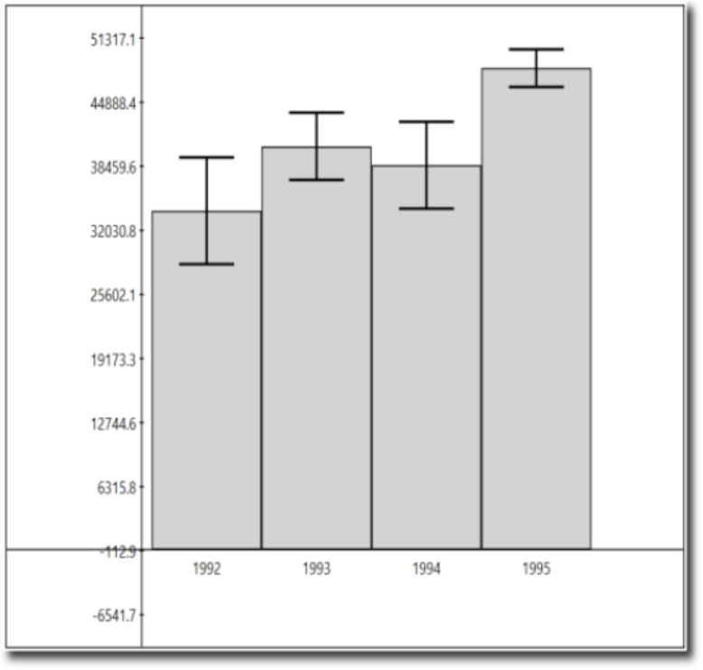
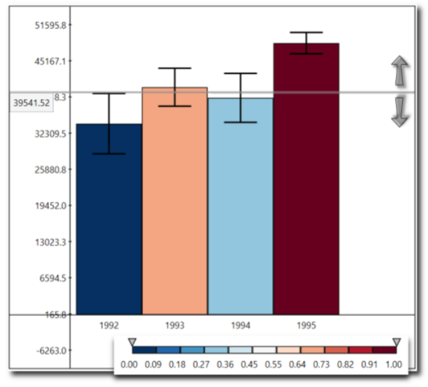

# Practice Assignment

## Practice Assignment: Understanding Distributions Through Sampling

+ [Launch Web Page](https://www.coursera.org/learn/python-plotting/notebook/W3OXw/practice-assignment-understanding-distributions-through-sampling)
+ [Web Notebook](https://hub.coursera-notebooks.org/user/pkfpwscjcemdtitwkaxuvv/notebooks/UnderstandingDistributionsThroughSampling.ipynb)
+ [Local Notebook](./notebooks/UnderstandingDistributionsThroughSampling.ipynb)

## Useful Links

+ [Getting creative on practice assignment](https://www.coursera.org/learn/python-plotting/discussions/weeks/3/threads/A6ntUGUBEeeA2A7nkPb23A)

    I misunderstood the practice assignment in the beginning, but decided to go through the track to just see how far i can go. Here is the result: you can choose which two distributions and their means from left and right top charts, and the script will calculate overlap in density area.
    <br/>

## Practice Peer-graded Assignment: Practice Assignment: Understanding Distributions Through Sampling

### Instruction

This assignment is optional, and I encourage you to share your solutions with me and your peers in the discussion forums!

To complete this assignment, follow the instructions in the Jupyter notebook.

### Practice Assignment: Understanding Distributions Through Sampling

This assignment is optional, and I encourage you to share your solutions with me and your peers in the discussion forums!

To complete this assignment, create a code cell that:

+ Creates a number of subplots using the pyplot subplots or matplotlib gridspec functionality.
+ Creates an animation, pulling between 100 and 1000 samples from each of the random variables (x1, x2, x3, x4) for each plot and plotting this as we did in the lecture on animation.
+ Bonus: Go above and beyond and "wow" your classmates (and me!) by looking into matplotlib widgets and adding a widget which allows for parameterization of the distributions behind the sampling animations.

Tips:

+ Before you start, think about the different ways you can create this visualization to be as interesting and effective as possible.
+ Take a look at the histograms below to get an idea of what the random variables look like, as well as their positioning with respect to one another. This is just a guide, so be creative in how you lay things out!
+ Try to keep the length of your animation reasonable (roughly between 10 and 30 seconds).

```python
import matplotlib.pyplot as plt
import numpy as np

%matplotlib notebook

# generate 4 random variables from the random, gamma, exponential, and uniform distributions
x1 = np.random.normal(-2.5, 1, 10000)
x2 = np.random.gamma(2, 1.5, 10000)
x3 = np.random.exponential(2, 10000)+7
x4 = np.random.uniform(14,20, 10000)

# plot the histograms
plt.figure(figsize=(9,3))
plt.hist(x1, normed=True, bins=20, alpha=0.5)
plt.hist(x2, normed=True, bins=20, alpha=0.5)
plt.hist(x3, normed=True, bins=20, alpha=0.5)
plt.hist(x4, normed=True, bins=20, alpha=0.5);
plt.axis([-7,21,0,0.6])

plt.text(x1.mean()-1.5, 0.5, 'x1\nNormal')
plt.text(x2.mean()-1.5, 0.5, 'x2\nGamma')
plt.text(x3.mean()-1.5, 0.5, 'x3\nExponential')
plt.text(x4.mean()-1.5, 0.5, 'x4\nUniform')
```

## Assignment 3

## Building a Custom Visualization

+ [Web Launch Page](https://www.coursera.org/learn/python-plotting/notebook/OMUVV/building-a-custom-visualization)
+ [Web Notebook](https://hub.coursera-notebooks.org/hub/coursera_login?token=x_a6Zl0sSvS2umZdLBr0bA&next=%2Fnotebooks%2FAssignment3.ipynb)
+ [Local Notebook](./notebooks/Assignment04.ipynb)

## Assignment Reading

Ferreira, N., Fisher, D., & Konig, A. C. (2014, April). [Sample-oriented task-driven visualizations: allowing users to make better, more confident decisions](https://drive.google.com/file/d/0B7Tj31nhk4BAeFJ1Y1lwQmpMQVk/view). In Proceedings of the SIGCHI Conference on Human Factors in Computing Systems (pp. 571-580). ACM

The authors have provided a related video which may be of further value in explaining the research.

### Inuroduction

+ Goal of data analysis: describe attributes if a population based on quantifiable properties
+ An uncertain value does not necessarily help reason about uncertain values. -> uncertainty ranges
+ Heights of two bar charts can be difficult to compute the probability of a nearly-overlapping set of uncertainty regions.
+ Visual encoding and interactions with the goal of allowing data analyst not only to identify the presence and magnitude of uncertainty, but to carry out common data exploration tasks.
+ Two common visualizations: bar chart & ranked list

### Background and Related Literature

+ Visual data analysis ignores uncertainty
    + Data analysist often deal with samples or selections of data [12]
+ Visualization techniques that handle uncertainty
    + People make incorrect decisions when presented with probabilistic choices. [21]
    + It is possible to make more accurate decisions about data analysis when provided with confidence intervals and sample size information.
    + Most researcher misuse confidence intervals; they discuss "rules of eye" for reading and comparing confidence intervals on printed bar charts.[07]
    + While it may be complex, representing uncertainty can help users understand the risk and value of making decisions with data. [14]
    + Analysts can use uncertainty ranges, in the form of confidence intervals on bar charts, to help decide when to terminate an incremental computation. [08]
    + The idea of visualization techniques that can handle uncertainty is a popular one in the visualization field. [16]
    + A taxonomy of source of uncertainty
    + Quantitative uncertainty derived from examining samples of a population
+ Annotating visualizations to address tasks
    + Using overlays to help users accomplish specific tasks on pie charts, bar charts, and line charts. [13]
    + Useful to highlight a specific data point in a chart


### Uncertainty Visualizations from Sampled Data

+ A core operation in understanding a dataset is examining the filtered and grouped average, sum, and count of a column.
+ Sample-based analysis: 
    + Estimate the expected average, sum or count of dataset based on the sample
    + Infer a distribution on the _expected_ value
+ The average value and CI represent a _distribution_ of possible values.
+ The distribution for each value represents the possible values once all of the data has been seen.
+ Extract info from probability distributions modeled from the samples.
+ Collect a series of different tasks that are commonly performed during the exploratory data analysis process.
+ List includes low-level task, like _retrieve value, find extremes (minimum and maximum), sort values, and compare values_.
+ Without uncertainty, find the minimum value in  the bar chart.
+ Example Question: "what aggregates are _likely_ to be the maximum or minimum? --> A user would need to estimate how much uncertainty is represented by error bars and how likely that makes a  minimum or maximum.

### The Visual Analysis Environment

+ Selected core data visualizations
    + Bar charts: ubiquitous and used to represent many spots of data
    + Ranked lists: used tio represent sorted elements and often showing top few bars of a broad histogram
+ A visual treatment for showing how a ranked list changes across different attributes, but not uncertain rankings. [10]
+ __Uncertain ranked lists__: partial order - certain that some items will be greater than others but uncertain about other pairwise relationships
+ Tasks for visual analysis [01, 02]
    + goal: design a visual data analysis environment containing summaries for bar charts and ranked lists that supported sample based analysis
    + __bar cart__: compare pair of bars; find extrema; compare values to a constant; compare to a range
    + __rankedlist__: 
        + identify which items are likely to fall between a given pair of rankings
        + identify which items are likely to fall between a given pair of ranking
+ Computational Framework: Two-phase computational framework:
    1. __uncertainty quantification phase__:
        + estimate the probability probability distribution from the aggregate interested in
        + use Central Limit Theory (CLT) to estimate  CI based on the count, standard deviation, and running average of items seen so far
    2. __Monte-Carlo approach__:
        + represent each task by a corresponding non-probabilistic predicate that refers to samples
        + repeatedly draw samples and evaluate the predicate against the samples for each distribution
        + approximate the probability of an event as the fraction of those iterations in which the predicate is true.

### Design Goads

1. _Easy to interpret_
    + Uncertainty is a complex concept for users to interpret.
    + Visualization should add minimal additional complex.
    + Useful test: wether the visualization converges to a single form when all the data has arrived.
2. _ Consistency across Task_
    + bar chart: users can carry out multiple tasks with it.
    + bar chart:  able to change between tasks without losing context on the dataset
3. _Spatial Stability across Sample Size_
    + Incremental analysis [08, 11]
    + Samples grow larger over time, the visualization should be change as little as possible.
    + Smoothly animate between the data at two successive time intervals
    + Changes in the visualization should be proportionate to the size of change in the data
4. _Minimum Visual Noise_
    + Ensure that the visualization is not confusing.
    + E.g., the base data displayed as a bar chart, showing probabilities with bar chart is more likely confusing than other visual representation.

+ Solution: ineravtive annotation [13]
    + The annotations will show the results of task-based queries against the dataset.
+ Visual annotations:
    + _Compare Bars to Each Other_
        + See Fig.2(a)
        + Each bar is colored by the probability that its distribution is larger than the selected bar.
    + _Identity Minimum and Maximum_
        + The Extrema tool, Fig 2(b)
        + Used to quantify the proability that any bar would be either the maximum or minimum among all the distributions
        + A quantitative color mapping is used to identify bars and the regions in the pie charts.
    + _Compare to Constant_
        + See Fig. 2(c)
        + A horizontal line representing a constant value
        + The probability that the distribution is larger than this constant value is mapped as a color to the corresponding bar.
    + _Compare to Range_
        + Range tool, Fig. 2(d)
        + Evaluate the probability of distribution's value falling within a range
        + The probability that the distribution represented by the error bar is contained in the region is mapped as a color to the corresponding bar.

        
    
    + _Find Items at Given Rank_
        + Ranking probability distribution, Fig. 3(b)
        + Each line of the list is a single rank.
        + The line is populated by the set if items that have some probability of having that rank.
        + The bars are sorted in a stable order.
    + _Find Items within Ranks_
        + See Fig. 3(c)
        + Find what items fall within a range of ranks.
        + Learn the set of items that are likely to fall in the top five - without regard for individual rank.

        

+ Design Discussion
    + In a standard bar chart, these tasks can largely be addressed.
    + All the interactions are light weighted: users need only select the tool and choose the relevant value.
    + Sort tool:
        + more complex
        + a list, in which every row represents all the possible values of that row
        + probability maps to height, width and color
            + _width_: very small bars fall off the chart
            + _height_: easily read across to find heigh bars - comparing lengths is much harder
            + _color_: highlighting regions of the list where the rank is certain


### References

[07]: G. Cumming, S. Finch. Inference by eye: Confidence intervals and how to read pictures of data. American Psychologist, 60(2), 170–18, 2005.
[08]: D. Fisher, I. Popov, S. M. Drucker, and mc schraefel. Trust Me, I'm Partially Right: Incremental Visualization Lets Analysts Explore Large Datasets Faster. ACM Conf. on Human Factors in Comp. Systems. CHI 2012. (pp. 1673-1682).
[10]: S. Gratzl, A. Lex, N. Gehlenborg. LineUp: Visual Analysis of Multi-Attribute Rankings. IEEE Trans. on Vis. and Comp. Graphics 2013
[11]: J. Hellerstein, R. Avnur, A. Chou, C. Olston, V. Raman, T. Roth, C. Hidber, P. Haas. Interactive Data Analysis with CONTROL. IEEE Computer, 32(8), 51-59, 1999.
[12]: S. Kandel, A. Paepcke, J. M. Hellerstein, J. Heer. Enterprise data analysis and visualization: An interview study. IEEE Trans. on Vis. and Comp. Graphics, 18(12), 2917-2926.
[13]: N. Kong, M. Agrawala. Graphical Overlays: Using Layered Elements to Aid Chart Reading. IEEE Trans. on Vis. and Comp. Graphics, 18(12), 2631-2638.
[14]: A. M. MacEachren, A. Robinson, S. Hopper, S. Gardner, R. Murray, M. Gahegan, E. Hetzler. Visualizing geospatial information uncertainty: What we know and what we need to know. Cartography and Geographic Information Science, 32(3), 139-160.
[16]: M. Skeels, B. Lee, G. Smith, and G. Robertson. Revealing Uncertainty for Information Visualization. In Proc. of the Working Conf. on Advanced Visual Interfaces. ACM, New York, NY, USA. 2008, 376-379.
[21]: A. Tversky, D. Kahneman. Judgment under Uncertainty: Heuristics and Biases. Science, 185 (1974). 1124-1131.


## Assignment 3 - Building a Custom Visualization

In this assignment you must choose one of the options presented below and submit a visual as well as your source code for peer grading. The details of how you solve the assignment are up to you, although your assignment must use matplotlib so that your peers can evaluate your work. The options differ in challenge level, but there are no grades associated with the challenge level you chose. However, your peers will be asked to ensure you at least met a minimum quality for a given technique in order to pass. Implement the technique fully (or exceed it!) and you should be able to earn full grades for the assignment.

> Ferreira, N., Fisher, D., & Konig, A. C. (2014, April). [Sample-oriented task-driven visualizations: allowing users to make better, more confident decisions.](https://www.microsoft.com/en-us/research/wp-content/uploads/2016/02/Ferreira_Fisher_Sample_Oriented_Tasks.pdf) 
&nbsp;&nbsp;&nbsp;&nbsp;&nbsp;&nbsp;In Proceedings of the SIGCHI Conference on Human Factors in Computing Systems (pp. 571-580). ACM. ([video](https://www.youtube.com/watch?v=BI7GAs-va-Q))

In this [paper](https://www.microsoft.com/en-us/research/wp-content/uploads/2016/02/Ferreira_Fisher_Sample_Oriented_Tasks.pdf) the authors describe the challenges users face when trying to make judgements about probabilistic data generated through samples. As an example, they look at a bar chart of four years of data (replicated below in Figure 1). Each year has a y-axis value, which is derived from a sample of a larger dataset. For instance, the first value might be the number votes in a given district or riding for 1992, with the average being around 33,000. On top of this is plotted the 95% confidence interval for the mean (see the boxplot lectures for more information, and the `yerr` parameter of barcharts).
<br>


A challenge that users face is that, for a given y-axis value (e.g. 42,000), it is difficult to know which x-axis values are most likely to be representative, because the confidence levels overlap and their distributions are different (the lengths of the confidence interval bars are unequal). One of the solutions the authors propose for this problem (Figure 2c) is to allow users to indicate the y-axis value of interest (e.g. 42,000) and then draw a horizontal line and color bars based on this value. So bars might be colored red if they are definitely above this value (given the confidence interval), blue if they are definitely below this value, or white if they contain this value.
<br>
<br/>
Figure 2c from (Ferreira et al. 2014). Note that the colorbar legend at the bottom as well as the arrows are not required in the assignment descriptions below.</h4>

<br>
<br>

**Easiest option:** Implement the bar coloring as described above - a color scale with only three colors, (e.g. blue, white, and red). Assume the user provides the y axis value of interest as a parameter or variable.


**Harder option:** Implement the bar coloring as described in the paper, where the color of the bar is actually based on the amount of data covered (e.g. a gradient ranging from dark blue for the distribution being certainly below this y-axis, to white if the value is certainly contained, to dark red if the value is certainly not contained as the distribution is above the axis).

**Even Harder option:** Add interactivity to the above, which allows the user to click on the y axis to set the value of interest. The bar colors should change with respect to what value the user has selected.

**Hardest option:** Allow the user to interactively set a range of y values they are interested in, and recolor based on this (e.g. a y-axis band, see the paper for more details).

---

*Note: The data given for this assignment is not the same as the data used in the article and as a result the visualizations may look a little different.*

```python
# Use the following data for this assignment:

import pandas as pd
import numpy as np

np.random.seed(12345)

df = pd.DataFrame([np.random.normal(32000,200000,3650), 
                   np.random.normal(43000,100000,3650), 
                   np.random.normal(43500,140000,3650), 
                   np.random.normal(48000,70000,3650)], 
                  index=[1992,1993,1994,1995])
df
```

## Peer-graded Assignment: Building a Custom Visualization

### Instruction

In this assignment you must implement a visualization of sample data as described in Ferreria et al (2014). The details of how you solve the assignment are up to you, although your assignment must use matplotlib so that your peers can evaluate your work.

The options differ in challenge level, but there are no grades associated with the challenge level you chose.

Download the attachment for a preview of how the assignment will be graded.

[assignment3_rubric.pdf](https://d3c33hcgiwev3.cloudfront.net/_b5171d970a52dc86e7b1da5ea8bf55ea_assignment3_rubric.pdf?Expires=1529280000&Signature=SkWFoLC0H031cfPQMQQwDxMhd-Lq5~6O2PCFwsAYOeif2pzOgd1KfbXSWMN0wQ~XV4LPvzpiPOLv75A1GaEFPYaMlMUYAjEUCfP6cEDJmN4yKVG8oe9VacFHfARYTIvMfKpKipi7GOt5QnZyHyxsaoFfB723n7fmGpI5CK6dv9k_&Key-Pair-Id=APKAJLTNE6QMUY6HBC5A)

+ Identify the challenge level that you chose for the assignment:
    + Easiest
    + Harder
    + Even harder
    + Hardest

+ Did the learner identify the challenge level that they chose for the assignment (e.g., easiest, harder, even harder, or hardest)?
    + 0 pts: No, the learner did not identify the challenge level that they chose for the assignment.
    + 1 pt: Yes, the learner did identify the challenge level that they chose for the assignment

+ Did the learner upload their visual?
    + 0 pts: No, the learner did not upload their visual.
    + 1 pt: Yes, the learner did upload their visual

+ Did the learner implement the bar coloring using a color scale with at least three colors?
    + 0 pts: No, the learner did not implement the bar coloring using a scars.
    + 3 pts: Yes, the learner did implement the bar coloring using a scale with at least three colors.

+ Did the learner provide a y-axis value of interest in the visual? Note: The hardest option will have a range of y values.
    + 0 pts: No, the learner did not provide a y-axis value of interest in the visual.
    + 3 pts: Yes, the learner did provide a y-axis value of interest in the visual.

+ Did the bar colors reflect the bar's position with respect to the y value? Note: The hardest option will have a range of y values.
    + 0 pts: No, the bar colors do not reflect the bar's position with respect to they y value.
    + 3 pts: Yes, the bar colors do reflect the bar's position with respect to they y value.

+ Based on the challenge level that the learner chose for this assignment, comment on the quality of the elements that are specific to each option:
    + __Easier option__: The bar colors reflect the bar’s position with respect to the y-axis value (e.g. blue if the bar is below the y value, white if the bar is the same as the y value, and red if the bar value is above the y value).
    + __Harder option__: The bar colors reflect the bar’s position with respect to the y-axis value (e.g. a gradient ranging from dark blue for the distribution being certainly below this y-axis, to white if the value is certainly contained, to dark red if the value is certainly not contained as the distribution is above the axis).<br/>
    Note: for the remaining two options, you will need to run the code that the learner has uploaded in order to test the interactivity. We recommend that you run the code on the Jupyter notebook system on the Coursera platform.
    + __Even harder__: Added interactivity that allows the user to click on the y axis to set the value of interestThe bar colors change appropriately with respect to what value the user has selected.
    + __Hardest__: Added interactivity that allows the user to interactively set a range of y values they are interested in, and recolor based on this (e.g. a y-axis band, see the paper for more details).

### Useful Links for Assignment 3

+ [Changes To Assignment 3 Description](https://www.coursera.org/learn/python-plotting/discussions/weeks/3/threads/bl2XmTFjEeebrBIWZEFM5A)

    The assignment had some ambiguity with regards to the confidence interval, the assignment description was edited to clarify that the 95% confidence intervals for the mean values are expected.

    Also the data has been modified to better match the article's data, but learners should expect their visuals may look a little different because the data is not the same.

    If you would like to view the edited assignment, change the name of Assignment3 then restart server and the updated copy will be retrieve automatically

    click on the assignment name, append the name then click OK
    <br/>

    restart server by clicking on the Control Panel button up right, and once it's loaded on the red Stop My Server button. The red button will disappear, then click the green My Server to restart it.

    
    <br/>


+ [How to open learner's source code through Jupyter Notebook on Coursera platform?](https://www.coursera.org/learn/python-plotting/discussions/weeks/3/threads/ihlirjvdEeewQg63RcQI7A)

    There is no direct way to open the uploaded assignments directly.

    If the submission is a python script (.py), click on the link to open the file, select the code then copy and paste to a notebook on your learner workspace

    If the submission is a notebook; You'll have to download the ipynb file first, then . upload it to your online platform

    1. right click on the link and save the file to your local machine
        <br/>

    2. go your home folder, by clicking File->Open or clicking on the coursera logo then in the home folder click the upload button on the top right hand side of the page
        <br/>

    3. a file selection window will show, browse to the file you downloaded in step 1, select it, then click open, the click upload to confirm (step 6), the uploaded notebook will show in the list of files, click to view the notebook
        <br/>


+ [Setting color to bars using cmap](https://www.coursera.org/learn/python-plotting/discussions/weeks/3/threads/IumZbSJNEee6ugr9raNa5A)

    here is the example from before modified to include the sign in the remapped/interpolated values
    <br/>

    In the select colour column , I used plain english to describe what need to be done in each case

    the simplest way to go about this is to use the Reds and Blues cmaps and pass them the absolute value of x

    here is an example of how to get a cmap and use the shade value to get the desired colour
    <br/>
    
    HTH!

    ScalarMappable() is used to create a customised colorbar

    your aim here is to generate the colours of each bar in a bar chart based on certain conditions with respect to the mean/ confidence interval

    according to the paper,

    ```python
    (ci['Ci_low'] > y)  #use dark red colors

    (ci['Ci_low'] < y) &
    (ci['Ci_high'] > y )&
    (ci['mean'] > y)  #use light blue colors

    (ci['Ci_low'] < y) & 
    (ci['Ci_high'] > y )&
    (ci['mean'] < y) #use light red colors

    (ci['Ci_high'] < y)  #use dark blue colors
    (ci['mean'] == y) #use white color
    ```

    I found that using the y-mean is simpler, the difference is interpolated to the interval [.4,1], using numpy.interp,

    here are a couple of screenshots

    <br/>
    
    


    The mean and the dotted line position y, to determine the colour of the bar i.e
    ```python
    if y - (mean) < 0:
    color = reds
    elif y - (mean) >0:
    colors = blues
    else:
    colors = whites
    ```
    and the absolute difference (|mean -y|)determines the colour shade or intensity.
    <br/>

+ [How to calculate Confidence Interval](https://www.coursera.org/learn/python-plotting/discussions/weeks/3/threads/MYBNJGIQEee2fg6zpf5eMg)

    First the deadline is for guide, your can take as much time as you need for each of the assignments (help centre [article on deadlines](https://learner.coursera.help/hc/en-us/articles/208279866-Assignment-deadlines))

    Second, the minimal requirement is clearly stated in the rubrics please use that as your guide

    1. calculate mean `m` and margin of error `yerr` for each of the rows in the data frame

        PS. `yerr = the margin of error`

        where `margin of error = standard error* C` (C is a constant determined by the 95% (Critical value or T-value of 95% of a normal distribution) i.e.abs(qnorm( (1-.95)/2 percentile)), for a normal distribution C is approximately 1.96

        and the __standard error__ of the sampling distribution is `std_sample/sqrt(Number of samples)`

    2. plot a bar chart using m and ci, the chart should look like the __Figure 1 from (Ferreira et al, 2014)__ shown in the assignment description

    3. plot a horizontal line Y

    4. based on the value of `y` (this can be inputed through the update function of the animation or manually) set the colour of each of the columns in the bar chart, this can be done using an if or switch statement

    5. when y is changed, the horizontal line needs to be redrawn and the colours of the bars need to be changes based on the new value of `y`. (changing a bar colour was introduced in the lecture)

    in the easiest option the value of `y` can be hard coded, given step 4 is implemented. the colour of any bar will be

    + red if y<bar_height i.e. mean
    + white or green with low alpha if y ==bar_height
    + blue if y> bar_height

    P.S. there are many threads in this forum that discusses this assignment in details, feel free to consult these if have any issues during the implementation


    The sigma provided to the normal distribution function is the population sigma.

    According to the central limit theorem the sampling sigma also known as standard error is population sigma/sqrt(number of samples). the sampling mean is approximately the same as the population mean.

    in code

    ```python
    sampling mean = np.mean(the samples generated by the normal distribution generator)
    standard error = np.std(the samples generated by the normal distribution generator)/sqrt(the number of samples generated by the normal distribution generator)
    or
    standard error = np.sem(the samples generated by the normal distribution generator)
    ```

    A common misunderstanding is trying to related the population to the confidence interval. the confidence interval is related to the observed data i.e. the samples

    Conf Int = the sampling mean +- margin of error

    where the margin of error is the Z value for 95% multiplied by the standard error

    Z can be calculated using qnorm or using a table, for a normal distribution its around 1.9602

    see https://en.wikipedia.org/wiki/Confidence_interval


    As I explained in the highlighted post.

    1. the bar height is the mean of each row
    2. The yerr = margin of error which is related to the 95% ci because if ci = [ci_low,ci_high], then the margin of error = (ci_high-ci_low)/2. where the margin of error = standard error for each row * C(at 95%). see above for details.

    `plt.bar` will take the year (parameter `left`), the mean (parameter `height`) and the margin of error (parameter yerr) for each row and draw a bar with `height =mean`, and `confidence interval = [mean-margin of error , mean+margin of error]`


## Review Your Peers: Building a Custom Visualization


