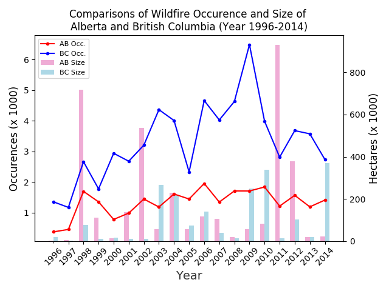

 # Project - Assignment 4

## Becoming an Independent Data Scientist

<a href="https://d3c33hcgiwev3.cloudfront.net/pJlsSONsEeaTbQ4K5ehm4A.processed/full/360p/index.mp4?Expires=1529798400&Signature=UD7Bxi7Jm2Cak8aqXhfYuFlkiIGb-iRbX59NlPyg8LQiiII7TMJa~S8k-lR5~iUlLWM9HF7uDYghMib3Zy9BC00GJgbSlfqu3iTz216Lc9o3UhK7SmOO4JjDQ4sr-FwQjtb08H0RJUmjkC15YScttoxiR6CaRbXAyWlhFlBhxvI_&Key-Pair-Id=APKAJLTNE6QMUY6HBC5A" alt="Becoming an Independent Data Scientist" target="_blank">
   
</a>

## Project Description

+ [Project Launch Page](https://www.coursera.org/learn/python-plotting/notebook/lVxma/project-description)
+ [Web Notebook](https://hub.coursera-notebooks.org/user/pkfpwscjcemdtitwkaxuvv/notebooks/Assignment4.ipynb)
+ [Local Notebook](./notebooks/Assignment04.ipynb)

### Assignment 4

Before working on this assignment please read these instructions fully. In the submission area, you will notice that you can click the link to **Preview the Grading** for each step of the assignment. This is the criteria that will be used for peer grading. Please familiarize yourself with the criteria before beginning the assignment.

This assignment requires that you to find **at least** two datasets on the web which are related, and that you visualize these datasets to answer a question with the broad topic of **weather phenomena** (see below) for the region of **Ann Arbor, Michigan, United States**, or **United States** more broadly.

You can merge these datasets with data from different regions if you like! For instance, you might want to compare **Ann Arbor, Michigan, United States** to Ann Arbor, USA. In that case at least one source file must be about **Ann Arbor, Michigan, United States**.

You are welcome to choose datasets at your discretion, but keep in mind **they will be shared with your peers**, so choose appropriate datasets. Sensitive, confidential, illicit, and proprietary materials are not good choices for datasets for this assignment. You are welcome to upload datasets of your own as well, and link to them using a third party repository such as github, bitbucket, pastebin, etc. Please be aware of the Coursera terms of service with respect to intellectual property.

Also, you are welcome to preserve data in its original language, but for the purposes of grading you should provide english translations. You are welcome to provide multiple visuals in different languages if you would like!

As this assignment is for the whole course, you must incorporate principles discussed in the first week, such as having as high data-ink ratio (Tufte) and aligning with Cairo’s principles of truth, beauty, function, and insight.

Here are the assignment instructions:

 * State the region and the domain category that your data sets are about (e.g., **Ann Arbor, Michigan, United States** and **weather phenomena**).
 * You must state a question about the domain category and region that you identified as being interesting.
 * You must provide at least two links to available datasets. These could be links to files such as CSV or Excel files, or links to websites which might have data in tabular form, such as Wikipedia pages.
 * You must upload an image which addresses the research question you stated. In addition to addressing the question, this visual should follow Cairo's principles of truthfulness, functionality, beauty, and insightfulness.
 * You must contribute a short (1-2 paragraph) written justification of how your visualization addresses your stated research question.

What do we mean by **weather phenomena**?  For this category you might want to consider seasonal changes, natural disasters, or historical trends.

### Tips
* Wikipedia is an excellent source of data, and I strongly encourage you to explore it for new data sources.
* Many governments run open data initiatives at the city, region, and country levels, and these are wonderful resources for localized data sources.
* Several international agencies, such as the [United Nations](http://data.un.org/), the [World Bank](http://data.worldbank.org/), the [Global Open Data Index](http://index.okfn.org/place/) are other great places to look for data.
* This assignment requires you to convert and clean datafiles. Check out the discussion forums for tips on how to do this from various sources, and share your successes with your fellow students!

### Example
Looking for an example? Here's what our course assistant put together for the **Ann Arbor, MI, USA** area using **sports and athletics** as the topic. [Example Solution File](./notebooks/Assignment4_example.pdf)

## Peer-graded Assignment: Becoming an Independent Data Scientist

### Instruction

This assignment requires that you identify at least two publicly accessible datasets from the same region that are consistent across a meaningful dimension. You will state a research question that can be answered using these data sets and then create a visual using matplotlib that addresses your stated research question. You will then be asked to justify how your visual addresses your research question.

As this assignment is for the whole course, you must incorporate and defend the principles discussed in the first week and align with Cairo’s principles of truth, beauty, function, and insight.

Download the [attachment](https://d3c33hcgiwev3.cloudfront.net/_f4c1865acab51d22302364ff027c8e5d_assignment4_rubric.pdf?Expires=1529798400&Signature=SBYTchkTTNsvekOSv2KhQDmvSEhxrUcFrb~DtIzLl~AiihmwUaMF5mdMXHhjSynGNy76UTqp2bffRWsFgFR~4iqolB8WOGCFLF02r1Wp9SJ13qFVYHE9g~4aG2ZoxwM5UVPm15IklPRj24Cen1SIlLpu82a5~KTODxfSX4rixcs_&Key-Pair-Id=APKAJLTNE6QMUY6HBC5A) for a preview of how the assignment will be graded.

### Rubric Preview

From time to time, Dr. Chris Brooks may want to share your work anonymously (via social media channels such as Twitter), to highlight some of the accomplishments of learners in this course.
If you agree that you are comfortable with instructor sharing your

Assignment #4 as an example of great work, please type YES in the text box. The submitter's response goes here. <br/>
Has the learner identified the region and the domain category that their data sets are about (e.g., Chaohu, China and sports or athletics)?
+ 0 pts: The learner did not identify the region and domain category that their data sets are about.
+ 2 pts: The learner identified the region and domain category that their data sets are about.

Create a research question about the domain category and region that you identified. <br/>
Has the learner stated a research question about the domain category and region that they identified?
+ 0 pts: The learner did not state a research question that related to the domain category and region they identified.
+ 2pts: The learner did state a research question that related to the domain category and region they identified.

Provide at least two links to publicly accessible datasets. These could be links to files such as CSV or Excel files, or links to websites which might have data in tabular form, such as Wikipedia pages. <br/> Has the learner provided at least two links to available datasets? These could be links to files such as CSV or Excel files, or links to websites which might have data in tabular form, such as Wikipedia pages.
+ 0 pts: The learner did not provide at least two working links to publicly available data sets (including links to CSV or Excel files).
+ 2 pts: The learner did provide links to at least two working links to publicly available data sets (including links to CSV or Excel files).

Upload an image which addresses your research question.<br/>
In addition to addressing your research question, this visual should addressCairo's principles of truthfulness, functionality, beauty, and insightfulness. <br/>
Has the learner uploaded an image that addresses their stated question?
+ 0 pts: The learner did not upload an image that addresses their stated question.
+ 2 pts: The learner uploaded an image that addresses their stated question.

Provide a short (1-2 paragraphs) justification of how your visual addresses your research question. <br/>
Has the learner written a short (1-2 paragraph) justification of how their visualization addresses their question?
+ 0 pts: The learner has not written a short (1-2 paragraph) justification of howtheir visualization addresses their question.
+ 3 pts: The learner has written a short (1-2 paragraph) justification of how their visualization addresses their question.

As this assignment is for the whole course, you must incorporate and defend the principles discussed in the first week, specifically, Cairo’s principles of truth, beauty, function, and insight. <br/>
For each of the following prompts, please provide a response that links each principle to one or more elements of your visual.
+ Describe your design choices for your visual in regards to Cairo's principle of __truthfulness__.
+ Describe your design choices for your visual in regards to Cairo's principle of __beauty__.
+ Describe your design choices for your visual in regards to Cairo's principle of __functionality__.
+ Describe your design choices for your visual in regards to Cairo's principle of __insightfulness__.
<br/>

+ Did the learner describe their design choices in regards to Cairo's principle of __truthfulness__ (e.g., avoiding misleading representations) and relate them to one or more elements of their visual?
    + 0 pts: No, the learner did not describe their design choices in regards to Cairo's principle of truthfulness (e.g., avoiding misleading representations) and did not relate them to one or more elements of their visual?
    + 1 pt: Yes, the learner did describe their design choices in regards to Cairo's principle of truthfulness (e.g., avoiding misleading representations) and relate them to one or more elements of their visual?

+ Did the learner describe their design choices in regards to Cairo's principle of __beauty__ (e.g., using fonts, colors, and layout that are appropriate and aesthetically pleasing) and relate them to one or more elements of their visual?
    + 0 pts: No, the learner did not describe their design choices in regards to Cairo's principle of beauty (e.g., using fonts, colors, and layout that are appropriate and aesthetically pleasing) and did not relate them to one or more elements of their visual?
    + 1 pt: Yes, the learner did describe their design choices in regards to Cairo's principle of beauty (e.g., using fonts, colors, and layout that are appropriate and aesthetically pleasing) and did relate them to one or more elements of their visual?

+ Did the learner describe their design choices in regards to Cairo's principle of __functionality__ (e.g., choosing a charting type that is appropriate for the stated research question) and relate them to one or more elements of their visual?
    + 0 pts: No, the learner did not describe their design choices in regards to Cairo's principle of functionality (e.g., choosing a charting type that is appropriate for the stated research question) and did not relate them to one or more elements of their visual?
    + 1 pt: Yes, the learner did describe their design choices in regards to Cairo's principle of functionality (e.g., choosing a charting type that is appropriate for the stated research question) and did relate them to one or more elements of their visual

+ Did the learner link Cairo's principle of __insightfulness__ (i.e., producing a "eureka" or "aha" response in the viewer) with one or more elements of their visual?
    + 0 pts: No, the learner did not make any connections between Cairo's principle of insightfulness with one or more elements of their visual.
    + 1 pt: Yes, the learner did make a connection between Cairo's principle of insightfulness with one or more elements of their visual.

If you want to look at the learner's code, we recommend that you open it through the Jupyter notebook system on the Coursera platform.

In this assignment the focus is more on the mechanics of creating charts, so there is no requirement to create an enlightening chart as described by Cairo. But to explore the issue, please provide comments to the learner on the following:
1. Did the chart created teach you something new about the city/region/country? What did you learn?
2. Do you think this chart answers an interesting question? Why?
3. Name one thing which works and one which could be improved, and how would you improve it.

## Discussion Forum Useful Links

+ [Choosing our own topic?](https://www.coursera.org/learn/python-plotting/discussions/weeks/4/threads/aVnbtaUHEeeSgBIYX3zlwA)

    > As long as your submission satisfies the different rubrics, this should not be an issue.
    >
    > If you look at the rubrics (summary below), the choice of subject and location are not being evaluated. the assignment provide suggestions but learners are free to change the topic and/or location.
    > 
    > >>>>>>>>>>>>>>>>>>
    > 
    > + Has the learner identified the region and the domain category that their data sets are about (e.g., Chaohu, China and sports or athletics)?
    > + Has the learner stated a research question about the domain category and region that they identified?
    > + Has the learner provided at least two links to available datasets? These could be links to files such as CSV or Excel files, or links to websites which might have data in tabular form, such as Wikipedia pages.
    > + Has the learner uploaded an image that addresses their stated question?
    > + Has the learner written a short (1-2 paragraph) justification of how their visualization addresses their question?
    >
    > Did the learner describe their design choices in regards to Cairo's principle of truthfulness (e.g., avoiding misleading representations) beauty (e.g., using fonts, colors, and layout that are appropriate and aesthetically pleasing) insightfulness (i.e., producing a "eureka" or "aha" response in the viewer) with one or more elements of their visual?
    >
    > >>>>>>>>>>>>>>>>>>

+ [Data upload for assignment 4](https://www.coursera.org/learn/python-plotting/discussions/weeks/4/threads/IZ1vZQ5pEeeijwrAcoNCCA)

    > yes, if the files are already in csv/excel formal
    >
    > you can use the upload feature in Jupyter home page
    >
    > click on the coursera logo or from the main menu File->open
    <br/>
    > 
    > click on upload and choose the files to upload from your local machine's file system
    <br/>
    >
    > alternatively, you can read the data from the links into dataframes then save the dataframes into local files, here's an example

+ [Need data? Try data.world](https://www.coursera.org/learn/python-plotting/discussions/weeks/4/threads/tofGEBCsEeeLeQqR3315Cg)

    > In case someone is having trouble finding a dataset to use, I thought I'd post about data.world. It seems to have quite a few datasets that are appliciable to this assignment. [This article](http://www.dataquest.io/blog/datadotworld-python-tutorial/) on dataquest.io also gives a decent overview of how to import the data through the api - probably easier if you are using your own notebook locally.

    > From the UK you can query previous census data (most detail for 2011) here: https://www.nomisweb.co.uk/query/select/getdatasetbytheme.asp?opt=3&theme=&subgrp=

    > Another great source for publicly available datasets is the European Data Portal aggregator (https://www.europeandataportal.eu).
    > 
    > Also, try the websites of several official national statistics institutes. Germany has the GENESIS (https://www-genesis.destatis.de), which also offers datasets in English.

+ [How to download data from a website into a CSV file?](https://www.coursera.org/learn/python-plotting/discussions/weeks/4/threads/yMT7zw2KEeeqzRJFs29uDA)

    > If you have a link to the CSV file, pandas read_csv can be used exactly the same way, instead of the file name, you pass the url
    > 
    > here is an example
    <br/>
    >
    > If you have a web page containing a table and you want to read that table you can use read_html. You will need to load the missing modules like lxml in the online platform, that said, the changes are not permanent, i.e. the modules you install will be deleted when you log out /restart the Jupyter server
    >
    > I've written a script that can help load the needed modules automatically
    ```python
    import pandas as pd
    from IPython.display import display, HTML

    def install_module(module):
        ! conda install "$module" -y
        js_cmd = ['IPython.notebook.kernel.restart();',
                'IPython.notebook.select(1);',
                'IPython.notebook.execute_cell();'
                ]
        js = "<script>{0}</script>".format(' '.join(js_cmd))
        display(HTML(js))

    url = 'https://simple.wikipedia.org/wiki/List_of_U.S._states'
    try:
        df_list = pd.read_html(url)
    except Exception as e:
        print(e)
        # #install necessary modules for read_html
        module = str(e).split()[0]
        install_module(module)
    print('Number of Data Frames {}'.format(len(df_list)))
    df_list[0].columns = df_list[0].iloc[0]
    df = df_list[0].iloc[1:]
    df.head()
    ```
    > the script will automatically restart the kernel to propagate the changes and will return the list tables available in the input url page
    <br/>
    >
    > This way your peer reviewers will be able to run the code in the online platform without issues
    > 
    > If you want to save the html table you read using read-html to datafile you can use
    ```python
    #csv
    df.to_csv('filename.csv')
    #or excel might need module xlwt installed
    df.to_excel('file.xls')
    ```

    > If you use the online coursera platform, the code is not guaranteed to work, because the online platform have not internet connection
    > 
    > so you can either run it locally (Anaconda 3 version 4.3 is required). If you 're already running the code locally, you can use anaconda navigator or conda to install lxml
    > 
    > or
    > 
    > you can save the file to your local disk, (this will work for html in some cases and not others), then upload the file to the online platform. here is how to do so
    > 
    > 1. open any of the your coursera notebooks, then go to your home folder by clicking on the coursera logo or File->Open from the main menu
    <br/>
    > 
    > 2. In your home folder page, click on the Upload button (located on the right)
    > 
    > 3. The file selection window of your local OS will pop-up, browse through your local files to the file you want to upload, select the file and 
    <br/>
    > 
    > 4. The home folder will show the name of the file and a blue upload button, click it to confirm,
    <br/>
    > 
    > 5. The file will show in your home folder and you'll be able to use it in your notebook
    <br/>
    > 
    > If you have problems with the read_html or saving the html page, feel free to post a link and I'll be happy to help

    > The problem is in the code you use to set the columns and select the data
    > 
    > here is what I got
    <br/>
    
    > 
    > It turns out, df_list[1] is the same as df, so you can use df_list[1] without needing any processing
    <br/>

    ```python
    # I have modified this code so that it doesn't interfere with the actual source code below.
    # You will need to run this once and then run the actual source code below.

    import pandas as pd
    from IPython.display import display, HTML

    def install_module(module):
        ! conda install "$module" -y
        js_cmd = ['IPython.notebook.kernel.restart();',
                'IPython.notebook.select(1);',
                'IPython.notebook.execute_cell();'
                ]
        js = "<script>{0}</script>".format(' '.join(js_cmd))
        display(HTML(js))

    url = 'https://simple.wikipedia.org/wiki/List_of_U.S._states'
    try:
        df_list = pd.read_html(url)
    except Exception as e:
        print(e)
        # #install necessary modules for read_html
        module = str(e).split()[0]
        install_module(module)
    '''
    print('Number of Data Frames {}'.format(len(df_list)))
    df_list[0].columns = df_list[0].iloc[0]
    df = df_list[0].iloc[1:]
    df.head()
    '''
    del df_list, display, HTML, pd, url
    ```

+ [last date to submit all assignments](https://www.coursera.org/learn/python-plotting/discussions/weeks/4/threads/a5XUlxFwEeeLeQqR3315Cg)

    > No need to worry, Coursera's deadlines arelines.
    > If you miss a deadline, your grade won't be affected, you can keep working in your current session until it ends.
    > After the final deadline for your session , you can simply switch to a future sesur assignments.
    > For more information please refer to the help centre [article on deadlines](https://learner.coursera.help/hc/en-us/articles/208279866-Assignment-deadlines) and [switching sessions](https://learner.coursera.help/hc/en-us/articles/208279776-Switch-to-a-different-session)

+ [Spurious Correlations](https://www.coursera.org/learn/python-plotting/discussions/weeks/4/threads/M6Wdg62_EeeB2hJL-yunuA)

    > I think the next chart could have not be an spurious one :
    <br/>
    > It amezed me to find a paper in the "Journal of Socio-Economics" of elSevier that relates public spending and sucide.
    > 
    > https://www.sciencedirect.com/science/article/pii/S1053535706000813
    > 
    > Maybe more knowledgeable people find this society chaos unsupportable and decide to not living in to it.
    > 
    > I am not agree, but could be possible :-P


### My submission

+ Region and Domain:
    + Alberta & British Columbia
    + Wildfire

+ Research Question: <br/>
    What are the wirldfire occurrences and fire size of Alberta and British Columbia between 1996 and 2004?

+ Links for Project Data
    + [Alberta Wildfire Historical Data 1999-2014](http://wildfire.alberta.ca/resources/historical-data/documents/HistoricalWildfireDatabase-1999-2014.xlsx)
    + [British Columbia Historical Wildfire Data](https://catalogue.data.gov.bc.ca/dataset/fire-incident-locations-historical/resource/219490d7-da49-46b4-a958-1df6aa07f823)

+ Image
    <br/>

+ Discussion

    The figures illustrates the occurrences and size of wildfire in Alberta and British Columbia, Canada, from 1996 to 2014.  The sources of the wildfire historical data are gathered from Provincial governments.  For Alberta, the historical data is divided into a couple of files while British Columbia's data from as early as 1900.  Meanwhile, Alberta's data contains more fields of information than BC one.  However, We cannot find a metadata for Alberta's dataset while BC's data is more straight forward.  After using the definition of fire class and fire size, we can decide to use 'uc_hectares' field as the appropriate one for fire size.

    The plot compares these two provinces' wildfire occurrences (left y-axis scale x 1000) and aggregated fire size in hectares (right y-axis scale x 1000).  Two line graphs represent the occurrences of wildfire while two side-by-side bar charts for each year indicate the aggregated fire size.  In general, we can conclude that BC had more wildfire occurrences while Alberta had larger fire size except for year 2003, 2009, 2010, and 2014.  Derived from the information, we can draw a rough conclusion that BC had much more small wildfire occurrences while Alberta had larger damage by each occurrence.

+ Cairo’s principles
    + Truthfulness
        1. The datasets are gather from the government's open data
        2. All data are simple counts and summarization.  
        3. Comparisons are based on the datasets

    + Beauty
        1. The aggregated fire size of each province are illustrated side-by-side for comparison.
        2. The occurrences of wildfire are depicted with line graphs for comparison.
        3. The scales of line graphs and bar charts are displayed on each side of the figure.

    + Functionality
        1. The line graphs show the occurrences of each province from 1999-2014 and indicates BC had more wildfire occurrences than Alberta.
        2. The bar charts indicate that Alberta had far more damages than BC, except for a couple of individual years.
        3. British Columbia had more fluctuated occurrences than Alberta.
        4. Occurrence of huge wildfire size happened more in Alberta.

    + Insightfulness
        1. The wildfire in Alberta was harder to control than BC.
        2. British Columbia had far more wildfire caused by Residential.
        3. In average, Alberta has larger fire size than BC.

## Review Your Peers: Becoming an Independent Data Scientist

### Review #1

+ United States, and weather phenomena
+ How much people is displaced by floods each year compared to the total poblation displaced in the united states?
+ Links
    + https://data.world/idmc/3e6a5027-6665-4fb0-a9d9-0543399ba8c6/workspace/file?filename=disaster-data-2.json
    + https://data.world/idmc/3e6a5027-6665-4fb0-a9d9-0543399ba8c6/workspace/file?filename=displacement-data-1.json
+ This visualization was concerned with answering the question of how much people is displaced by floods each year compared to the total poblation displaced in the united states, the data was taken from data.world site and it shows that the total poblation displaced has 3 high points but floods aren't a very big part of the total in general, but in 2013 it was a peak and mostly of the displaced people were because of floods
+ Principles
    + My visual respects the principle of truthfulness because it is not misleading with its data.
    + My visual respects the principle of beauty because it respects design patterns and intends to be visual friendly.
    + My visual respects the principle of functionality because it is comprehensive.
    + My visual respects the principle of insightfulness because it gives functional information.
+ [Source code](./notebooks/Assignment4-r1.py)

### Review #2

+ Central America; Migration to US
+ Are the high murder rates in the originating countries the reason for the migration of unaccompanied children?
+ Links
    + https://dataunodc.un.org/sites/dataunodc.un.org/files/homicide_report_total_and_sex.xlsx
    + https://www.acf.hhs.gov/orr/about/ucs/facts-and-data#countryoforigin 
+ Justification

    The data provided by the data sets in the two links had five years and 5 countries in common: 2012 - 2016 and the countries El Salvador, Honduras, Guatemala, Mexico and Colombia. In the case migration data, Colombia was lumped with well over a 190 countries under the label "All Others". However, the numbers were so small in comparison to those of the first 4 countries listed above, I adopted them as numbers for Colombia.

    The visuals show murder rates and migration percents for El Salvador and Colombia. The El Salvador chart supports the hypothesis that high murder rates encourage the migration in question, whereas the Colombia chart disagrees with it. Data for Honduras and Guatemala is similar to that of El Salvador. This suggests that whereas high homicidal rates may be a factor in migration, there may be other factors as well. For example, proximity of the country to the US, Economy of the country, etc.

+ Principles:
    + Charts must reflect the data and should not be allowed to draw false conclusions.
    + Simple uncluttered and visually pleasing charts are the best.
    + Must present information ina way to grasp it quickly for possible followup actions.
    + Conclusions should be straightforward and allow for visibility into information hidden in the data,
+ [Source Notebook](./notebooks/Assignment4-r3.ipynb)

### Review #4

+ Beijing, China.; Temperature in Beijing against Global Surface Ocean temperature in each month.
+ Whether there is a correlation between temperature in Beijing against Global Ocean Surface temperature in each month.
+ Datasets
    1. data/C2A2_data/BinnedCsvs_d25/9bc594d0d6bf5fec16beb2afb02a3b859b7d804548c77d614b2a6b9b.csv
    2. https://raw.githubusercontent.com/datasets/global-temp/master/data/monthly.csv

+ This project deals with whether there is a correlation between temperature in Beijing against Global Surface temperature in each month. We have used data from 2000 to 2015 and found that no correlation exists between the two and hence conclude china is not the sole major contributor to the surface ocean temperature.

+ Insightfulness and beauty

+ [Source code](./notebooks/Assignment4-r3.py)

### Review #4

+ Eastern United States, Metropolitan NHL division
+ Compare Points gained in NHL seasons 1975-2018 between Washington Capitals and their biggest rival Pittsburgh Penguins
+ Data
    + ttps://en.wikipedia.org/wiki/List_of_Washington_Capitals_seasons
    + https://en.wikipedia.org/wiki/List_of_Pittsburgh_Penguins_seasons
+ Justification

    The purpose of this visualization was to compare Points that are awarded for each game won gained in NHL seasons 1975-2018 between Washington Capitals and their biggest rival Pittsburgh Penguins. The source of the data was Wikipedia pages listing NHL seasons for each team. A 5 year moving average was was plotted in helping to visualize the data trends. The 2005 and 2013 seasons where dropped from the data due to the NHL lockouts since those years affected the number of games played. They year at which the comparison has begun is 1975 at which the Capitals started playing in the NHL. Penguins are an older team and started playing in the NHL in 1968 which is not shown on the graph.

    In the first 7 years Capitals as the new team in the NHL were catching up to the points the Penguins had. Capitals managed to surpass the number of points the Penguins had from around 1983 till around 1991. After that both teams hand relatively similar scores with interchanging periods of one team having more points than the other. What is interesting is that in some periods like around 1994 till around 1998 the increase or decrease of points happened simultaneously for both teams while the Penguins maintained a higher number of points over the Capitals.

+ Principles:
    + Truthfulness: Data taken directly from the source. The 2005 and 2013 seasons where dropped from the data due to the NHL lockouts - those years that affected the number of games played - depicting them would have gave the wrong impression in terms of a much lower number of points scored. The y-axis has not been cut and is starting from 0 points to show the appropriate scale. The x-axis shows years in 5 year intervals for readability. No other modification has been done to the data.
    + Functionality: The seasons have been adjusted from the format say 2017-2018 to 2018 for readability purposes. The x-axis shows years in 5 year intervals for readability and identifying trends and not for specific year to NHL points comparisons. The alpha values on the axis, labels, lines have been adjusted for visibility purposes. The top and left spine have been set to not visible. The choice of line colors for Capitals and Penguins was based on the primary colors of these teams which aids familiarity. Provided label, removed the label border, adjusted placement. Set figure size to better show the image.
    + Beauty: adjusted the colors and alpha values of the labels and line charts. Line colors were adjusted and chosen to represent the primary team colors of the teams. Removed the top an left spine to make the image more visually pleasing.
    + Insightfulness: The line plot is useful for depicting trends across a period of time. The plot shows that form the most part both teams usually have very similar NHL seasons. This is not true in the initial time period when the Capitals were a new team in NHL and did not get that many points. Also the time period around 1985 showing Penguins decline does not relate to the general trend.

