# Module 1: Fundamentals of Machine Learning - Intro to SciKit Learn

## Course Syllabus

### Prerequisites

In order to be successful in this course, you will need to know how to program in Python. The expectation is that you have completed [Introduction to Data Science in Python](https://www.coursera.org/learn/python-data-analysis) and [Applied Plotting, Charting & Data Representation in Python](https://www.coursera.org/learn/python-plotting), so that you are familiar with the numpy and pandas Python libraries for data manipulation, and matplotlib for plotting.

### Week by week

__In Module One__, you will be introduced to basic machine learning concepts, tasks, and workflow using an example classification problem based on the K-nearest neighbors method, and implemented using the scikit-learn library. This week’s assignment has you work through the process of loading and examining a dataset, training a k-nearest neighbors classifier on the dataset, and then evaluating the accuracy of the classifier and using it to classify new data.

__In Module Two__, you will delve into a wider variety of supervised learning methods for both classification and regression, learning about the connection between model complexity and generalization performance, the importance of proper feature scaling, and how to control model complexity by applying techniques like regularization to avoid overfitting. In addition to k-nearest neighbors, this week covers linear regression (least-squares, ridge, lasso, and polynomial regression), logistic regression, support vector machines, decision trees, and the use of cross-validation for model evaluation. For this week’s assignment, you’ll explore the relationship between model complexity and generalization performance, by looking at the effect of key parameters on the accuracy of different classification and regression models.

__In Module Three__, you will cover evaluation and model selection methods that you can use to help understand and optimize the performance of your machine learning models. For this week’s assignment, you will train a classifier to detect fraudulent financial transactions, analyze its performance with different evaluation metrics, and then optimize the classifier’s performance based on different evaluation metrics, depending on the goals of the detection task (e.g. to minimize false positives vs false negatives).

__In Module Four__, you will cover more advanced supervised learning methods that include ensembles of trees (random forests, gradient boosted trees), and neural networks (with an optional summary on deep learning). You will also learn about the critical problem of data leakage in machine learning and how to detect and avoid it. The final assignment brings everything together: you will design features for, and build your own classifier on, a prediction problem on a complex real-world dataset.

### Enrollment Options

Coursera has made the decision to make Specializations available by monthly subscription. This means you can choose to pay a monthly fee to access all of the courses in a specific Specialization.

Coursera’s switch to monthly subscriptions comes with another change -- for those learners who choose the “Audit Only” enrollment, you will no longer be able to submit assignments for grades nor see answers for those assignments. You will still have access to all the course materials but you will not be graded on your work, nor see answers to graded assignments.

For further information on the different enrollment options for Coursera courses, please visit the [Enrollment Options Help](https://learner.coursera.help/hc/en-us/articles/209818613-Enrollment-options) page. If you have feedback about the enrollment options shared on the Enrollment Options page, you can share your thoughts with Coursera in this [survey](https://www.surveymonkey.com/r/65DPLHG).

### Grading and Assignments

The lectures will provide you with some guidance for completing assignments, but you will need to take initiative and look beyond assignment instructions in order to be successful. You'll need to know how to ask questions in the discussion forums of your peers, and seek out new information through web searches and [Stack Overflow](http://stackoverflow.com/questions/tagged/matplotlib). Be sure to also check out the [Additional Resources](https://www.coursera.org/learn/python-machine-learning/resources/NJFSV).

If you are not sure what kind of output is required, or think there is a need for more clarity, please head to the course discussion forums. Note that some assignments and in video quizzes may not be mobile friendly.

Some assignments allow you to download and view your fellow learner’s code and/or data. If you want to look at the learner's code, we recommend that you open it through the Jupyter notebook system on the Coursera platform as that will be more secure. Please ensure that all data you share is publicly available, since you will be sharing these data with other learners.

| Course Item | Percentage of Final Grade | Passing Threshold |
|-------------|---------------------------|-------------------|
| Week 1 Quiz | 5% | 80% |
| Week 1 Jupyter Notebook Assignment | 15% |
| Week 2 Quiz | 5% | 80% |
| Week 2 Jupyter Notebook Assignment | 20% |
| Week 3 Quiz | 5% | 80% |
| Week 3 Jupyter Notebook Assignment | 20% |
| Week 4 Quiz | 5% | 80% |
| Week 4 Jupyter Notebook Assignment | 25% |

### Code of Conduct

Visit Coursera’s [Code of Conduct](https://learner.coursera.help/hc/en-us/articles/208280036-Coursera-Code-of-Conduct) and to abide by guidelines there. It is important when giving feedback to your peers to be polite and to be sensitive to the diversity of cultures and backgrounds of learners in your course.

### Working Offline

While the Coursera platform has an integrated Jupyter Notebook system, you can work offline on your own computer by installing Python 3.5+ and the Jupyter software packages. For more details, consult the [Jupyter Notebook FAQ](https://www.coursera.org/learn/python-machine-learning/resources/bANLa).

Note that this course uses matplotlib 2.0.

### Accessibility

We strive to develop fully accessible courses. Occasionally, some of our content does not fully meet our accessibility goals. Please use [this form](https://goo.gl/forms/XqKzVUMTn62yrarU2) to inform us of any accessibility issues you are experiencing in this course.

### Help!

If you're having problems, here are a couple of great places to go for help:

+ If the problem is with the Coursera platform such as verification on assignments, in video quiz problems, or the Jupyter Notebooks, please check out the [Coursera Learner Support Forums](https://learner.coursera.help/hc/en-us/requests).
+ If the problem deals with understanding the assignment or how to use the Jupyter Notebooks, please read our [Jupyter Notebook FAQ](https://www.coursera.org/learn/python-machine-learning/resources/bANLa) page in the course resources
+ If you have questions with the content of the course, or questions about programming in python or with the toolkits described, you can contact your peers and the course instructors in the discussion forums, or go to [Stack Overflow](http://stackoverflow.com/questions/tagged/python).
+ Having trouble accessing your previously submitted assignments? If your session has ended, you can access these again by selecting the "Switch Session" option. Details for how to select this can be found in this [learner help center article](https://learner.coursera.help/hc/en-us/articles/208279776-Switch-to-a-different-session). If you still have issues accessing your materials after switching sessions, please reach out to Coursera learner support via our online chat forums in the [Learner Help Center](https://learner.coursera.help/hc/en-us).

### In-Video Questions (IVQs)

In this course, in-video questions or IVQs may appear during lectures to help you learn as well as assess your understanding of the content. IVQs are optional and do not count towards your overall course grade.

#### Types of in-video questions

Many of the lectures contain in-video questions (IVQs). These questions are presented in a variety of formats. Some will ask you to write or think about a concept from the video. Others will ask for a short answer. Still others may ask you to choose from a multiple-choice list of answers. If an IVQ is a survey or a poll, you will see a summary of responses from other learners after you respond. You can look at the question again later to see new summary data as more of your peers answer.

Some IVQs also contain runnable code blocks. These IVQs allow you to practice the coding concepts during the lecture. In this course, these types of IVQs will usually be directly followed with the solution code.

### Recommended Text

The following book is not required to complete the course, but we recommend it as an additional resource that may be useful to you as you progress, and for later reference. Like this course, the book focuses on the practical details of building your own solutions to machine learning tasks using scikit-learn in Python. It provides further background on machine learning concepts, more depth on specific topics covered in this course (as well as a number of additional topics), and additional coding examples.

Introduction to Machine Learning with Python

by Andreas C. Müller and Sarah Guido

Publisher: O'Reilly Media

Available at: http://shop.oreilly.com/product/0636920030515.do

Print ISBN:978-1-4493-6941-5 | ISBN 10:1-4493-6941-3

Ebook ISBN:978-1-4493-6940-8 | ISBN 10:1-4493-6940-5


### Additional Resources

+ Dr Chuck Severance's Coursera Specialization, [Python for Everybody](https://www.coursera.org/specializations/python)
+ [Python Docs](https://docs.python.org/3/) (for general Python documentation)
+ [Python Classes Docs](https://docs.python.org/3.5/tutorial/classes.html)
+ [Scipy](http://scipy.org/) (for [IPython](http://ipython.org/), [Numpy](http://www.numpy.org/), [Pandas](http://pandas.pydata.org/), and [Matplotlib](http://matplotlib.org/))
+ [scitkit-learn Docs](http://scikit-learn.org/stable/documentation.html)
+ [scikit-learn Cheat Sheet](https://s3.amazonaws.com/assets.datacamp.com/blog_assets/Scikit_Learn_Cheat_Sheet_Python.pdf)
+ Don't forget to check [Stack Overflow](https://stackoverflow.com/questions/tagged/scikit-learn) and [Cross Validated](https://stats.stackexchange.com/)!


## Introduction

+ What is Machine Learning (ML)?
    + The study of computer programs (algorithms) that can learn by example
    + ML algorithms can generalize from existing examples of a task
        + e.g. after seeing a training set of labeled images, an image classifier can figure out how to apply labels accurately to new, previously unseen images

+ Speech Recognition
    <a href="url">
        <br/>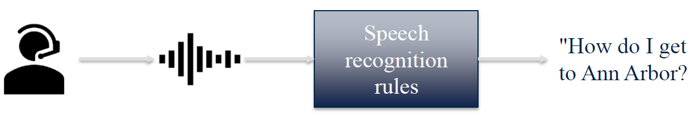
    </a>

+ Machine Learning models can learn by example
    + Algorithms learn rules from labelled examples
    + A set of labelled examples used for learning is called training data.
    + The learned rules should also be able to generalize to correctly recognize or predict new examples not in the training set.

+ Machine Learning models learn from experience
    + Labeled examples (Email spam detection)
    + User feedback (Clicks on a search page)
    + Surrounding environment (self-driving cars)

+ Machine Learning brings together statistics, computer science, and more..
    + Statistical methods
        + Infer conclusions from data
        + Estimate reliability of predictions
    + Computer science
        + Large-scale computing architectures
        + Algorithms for capturing, manipulating, indexing, combining, retrieving and performing predictions on data
        + Software pipelines that manage the complexity of multiple subtasks
    + Economics, biology, psychology
        + How can an individual or system efficiently improve their performance in a given environment?
        + What is learning and how can it be optimized?

+ Machine Learning for fraud detection and credit scoring
    <a href="url">
        <br/>
    </a>

+ Web search: query spell-checking, result ranking, content classification and selection, advertising placement

+ Machine Learning for Speech Recognition
    <a href="url">
        <br/>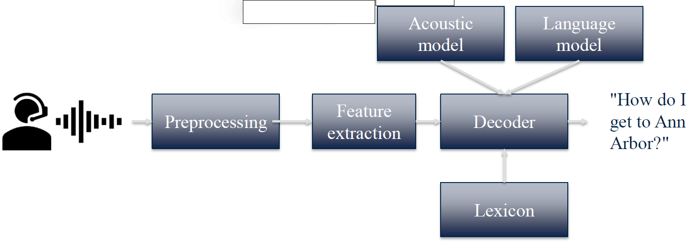
    </a>

+ Machine Learning algorithms are at the heart of the information economy
    + Finance: fraud detection, credit scoring
    + Web search
    + Speech recognition
    + eCommerce: Product recommendations
    + Email spam filtering
    + Health applications: drug design and discovery
    + Education: Automated essay scoring

+ What is __Applied__ Machine Learning?
    + Understand basic ML concepts and workflow
    + How to properly apply 'black-box' machine learning components and features
    + Learn how to apply machine learning algorithms in Python using the _scikit-learn_ package
    + What is not covered in this course:
        + Underlying theory of statistical machine learning
        + Lower-level details of how particular ML components work
        + In-depth material on more advanced concepts like deep learning

+ Q: A key goal of effective machine learning algorithms is to have good generalization ability. This refers to a learning algorithm’s ability to:
    1. Predict the training data perfectly.
    2. Make accurate predictions for new objects that weren’t seen during training.
    3. Only require labels on some of the training data samples.
    4. Find clusters of similar items.

    Ans: 2

+ Recommended text for this course

    Introduction to Machine Learning with Python: A Guide for Data Scientists <br/>
    By Andreas C. Müller and Sarah Guido <br/>
    O'Reilly Media


### Lecture Video

<a href="https://d3c33hcgiwev3.cloudfront.net/Xn_zgzmaEeeRKQp2xLWbhg.processed/full/540p/index.mp4?Expires=1535587200&Signature=hqR~HN7tM5ibdp2D7WR779QxRI1FFVd6dsPPNCucoIDWcbvjZ6aGZ3nrultVso2C1I20wp5kQFJjU7v5uWP8RX0adT8BDqEuBvLUXA07dMaw-ESoMRSQP0aE6uTP3-xfvFaoy-Mc7nyKgN3EEzpm7MkxeI1Ybq7a3FBjMHNod0U_&Key-Pair-Id=APKAJLTNE6QMUY6HBC5A" alt="Introduction" target="_blank">
     
</a>


## Key Concepts in Machine Learning

+ Key types of Machine Learning problems <br/>
    + __Supervised__ machine learning: Learn to predict __target values__ from labelled data.
        + Classification (target values are discrete classes)
        + Regression (target values are continuous values)
    + __Unsupervised__ machine learning: Find structure in unlabeled data
        + Find groups of similar instances in the data (clustering)
        + Finding unusual patterns (outlier detection)

+ Supervised Learning (classification example)
    <a href="https://www.coursera.org/learn/python-machine-learning/lecture/hrHXm/key-concepts-in-machine-learning">
        <br/>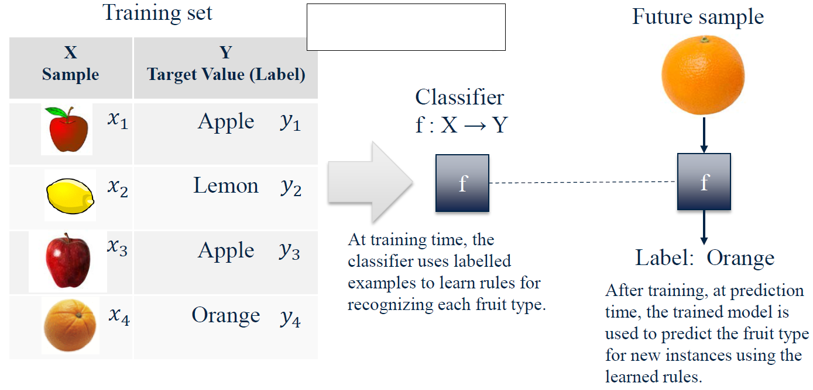
    </a>

+ Examples of explicit and implicit label sources
    <a href="https://www.coursera.org/learn/python-machine-learning/lecture/hrHXm/key-concepts-in-machine-learning">
        <br/>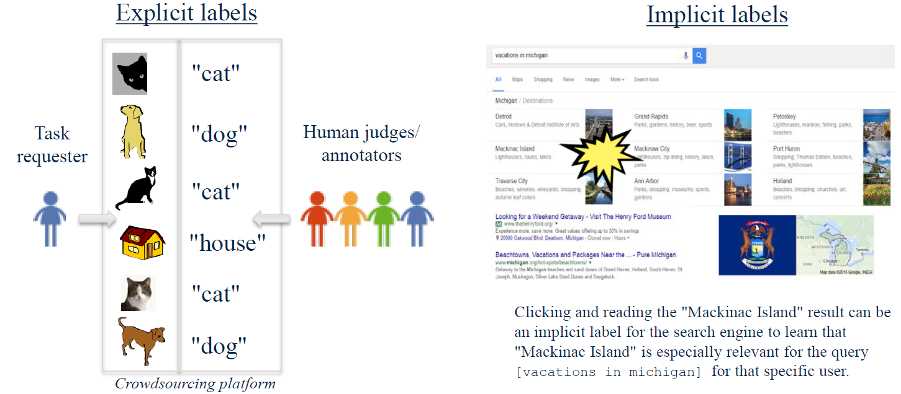
    </a>

+ Unsupervised learning: finding useful structure or knowledge in data when no labels are available
    + Finding clusters of similar users (clustering)
    + Detecting abnormal server access patterns (unsupervised outlier detection)
    <a href="https://sklearn.org/modules/decomposition.html">
        <br/>
    </a>
    <a href="https://datascience.stackexchange.com/questions/18450/which-outlier-detection-can-detect-these-outliers">
        
    </a>

+ Q: Which of the following are examples of __supervised machine__ learning? Select all that apply.

    1. Analyzing sales data to find groups of customers with similar buying habits.
    2. Making online movie recommendations based on the “star” ratings that other users provided with their online movie reviews.
    3. A face recognition system that was trained using images with crowdsourced labels.
    4. A search engine that uses user clicks on the results page to learn which pages are most relevant to popular queries.

    Ans: 2, 3, 4
    1. This is an example of clustering, which is an unsupervised machine learning task.

+ A Basic Machine Learning Workflow
    <a href="https://www.coursera.org/learn/python-machine-learning/lecture/hrHXm/key-concepts-in-machine-learning">
        <br/>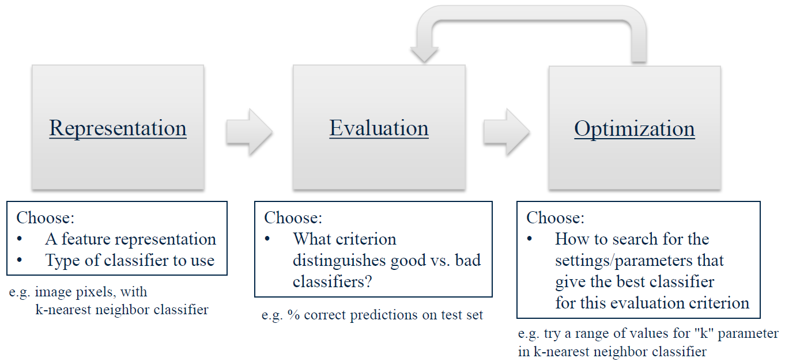
    </a>

+ Feature Representations
    <a href="https://www.coursera.org/learn/python-machine-learning/lecture/hrHXm/key-concepts-in-machine-learning">
        <br/>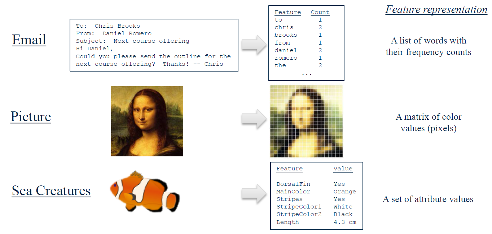
    </a>

+ Representing a piece of fruit as an array of features (plus label information)
    <a href="https://www.coursera.org/learn/python-machine-learning/lecture/hrHXm/key-concepts-in-machine-learning">
        <br/>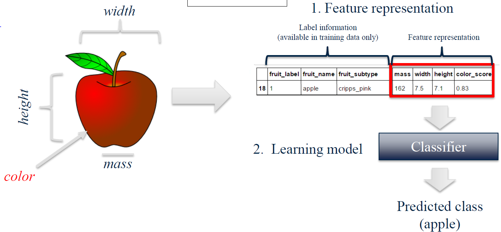
    </a>

+ Represent / Train / Evaluate / Refine Cycle
    <a href="https://www.coursera.org/learn/python-machine-learning/lecture/hrHXm/key-concepts-in-machine-learning">
        <br/>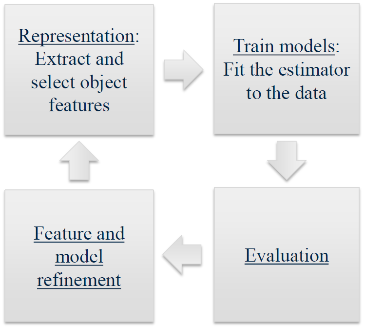
    </a>

### Lecture Video

<a href="https://d3c33hcgiwev3.cloudfront.net/Fcm_hlzsEeeQywpoSy5QrA.processed/full/540p/index.mp4?Expires=1535587200&Signature=jDu4qL7QSvu3D-PCh5x8XoByv3l1uZAU9tBVifdTVWMig-StCMMtQN3HSzvgSCuiHOPuJ8KF4HDiwqXcn0~-zUG2rLQhjM~JSrVkCiGx~3FdzGKsBdZ3V5qO-XNSCxzBoH1NXImJ4PEIPFvea~yQea~Puamv8IGnH9WHmDqQ5bo_&Key-Pair-Id=APKAJLTNE6QMUY6HBC5A" alt="Key Concepts in Machine Learning" target="_blank">
     
</a>


## Python Tools for Machine Learning

+ `scikit-learn`: Python Machine Learning Library
    + [scikit-learn Homepage](http://scikit-learn.org/)
    + [scikit-learn User Guide](http://scikit-learn.org/stable/user_guide.html)
    + [scikit-learn API reference](http://scikit-learn.org/stable/modules/classes.html)
    + In Python, we typically import classes and functions we need like this:
        ```python
        from sklearn.model_selection import train_test_split
        from sklearn.tree import DecisionTreeClassifier
        ```

+ [SciPy Library](http://www.scipy.org/): Scientific Computing Tools
    + Provides a variety of useful scientific computing tools, including statistical distributions, optimization of functions, linear algebra, and a variety of specialized mathematical functions.
    + With `scikit-learn`, it provides support for _sparse matrices_, a way to store large tables that consist mostly of zeros.
    + Example import: `import scipy as sp`

+ [NumPy](http://www.numpy.org/): Scientific Computing Library
    + Provides fundamental data structures used by `scikit-learn`, particularly multi-dimensional arrays.
    + Typically, data that is input to `scikit-learn` will be in the form of a NumPy array.
    + Example import: `import numpy as np`

+ [Pandas](http://pandas.pydata.org/): Data Manipulation and Analysis
    + Provides key data structures like `DataFrame`
    + Also, support for reading/writing data in different formats
    + Example import: `import pandas as pd`

+ [matplotlib](http://matplotlib.org/) and other plotting libraries
    + We typically use matplotlib's __pyplot__ module: `import matplotlib.pyplot as plt`
    + We also sometimes use the __seaborn__ visualization library (http://seaborn.pydata.org/) `import seaborn as sn`
    + And sometimes the __graphviz__ plotting library: `import graphviz`

+ Versions of main libraries used in this course

    | Library name    | Minimum version |
    |----------------|------------------|
    | scikit-learn    | 0.18.1 |
    | scipy           | 0.19.0 |
    | numpy           | 1.12.1 |
    | pandas          | 0.19.2 |
    | matplotlib      | 2.0.1 |
    | seaborn         | 0.7.1 |
    | graphviz        | 0.7 |

    It’s okay if your versions of these don’t match ours exactly, as long as the version of `scikit-learn` and other libraries you’re using is the same or greater than listed here.


### Lecture Video

<a href="https://d3c33hcgiwev3.cloudfront.net/4NaQeVzqEeeliw7ADgKLdA.processed/full/540p/index.mp4?Expires=1535673600&Signature=TvSRdaMnMc5~~cj~DTGMO2s~EO58sd2lNmcWaK-aOJ1wtV~8L9ZgMBas7ErdohPtklsutnMogqiOg04nHiEWHLYC6IP~0dxcUv6v6~Sh7NgGaSTzcdXYRqXjr5LgFpi5-Cs0RezpmQuBeL7RVNWtATbFsJAs8dy-ADfHQqXtbRI_&Key-Pair-Id=APKAJLTNE6QMUY6HBC5A" alt="Python Tools for Machine Learning" target="_blank">
     
</a>


## Module 1 Notebook

+ [Web Notebook](https://hub.coursera-notebooks.org/user/elkljxyoytcwjbmkgctrtg/notebooks/Module%201.ipynb#)
+ [Local Notebook](notebooks/Module01.ipynb)
+ [Local Python Code](notebooks/Module01.py)


## An Example Machine Learning Problem

+ The Fruit Dataset
    <a href="https://d3c33hcgiwev3.cloudfront.net/hTmWWzmaEee7AA7Ncgm5Cg.processed/full/540p/index.mp4?Expires=1535673600&Signature=VYuFss4hE4zwTHrV9Bv8Odm~3zX7r3pCwu7yHXX1R2gZNjqdt7YeV-02VEHPoqfNMnY~b3dfdPp31UlrE4WgSOCoEcDHwpdD1UOujTRCRKGTW~3Zh4q6zOmHAzDBCEsSsZ5H4p4RPSOxY8Roj-ex1SLEFPPT9GtTPPWM-jG5qwc_&Key-Pair-Id=APKAJLTNE6QMUY6HBC5A">
        <br/>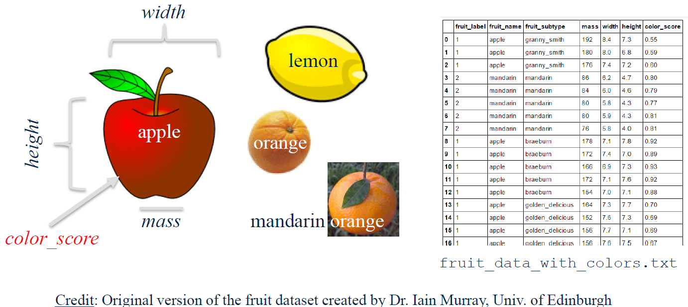
    </a>

+ The input data as a table
    <a href="https://d3c33hcgiwev3.cloudfront.net/hTmWWzmaEee7AA7Ncgm5Cg.processed/full/540p/index.mp4?Expires=1535673600&Signature=VYuFss4hE4zwTHrV9Bv8Odm~3zX7r3pCwu7yHXX1R2gZNjqdt7YeV-02VEHPoqfNMnY~b3dfdPp31UlrE4WgSOCoEcDHwpdD1UOujTRCRKGTW~3Zh4q6zOmHAzDBCEsSsZ5H4p4RPSOxY8Roj-ex1SLEFPPT9GtTPPWM-jG5qwc_&Key-Pair-Id=APKAJLTNE6QMUY6HBC5A">
        <br/>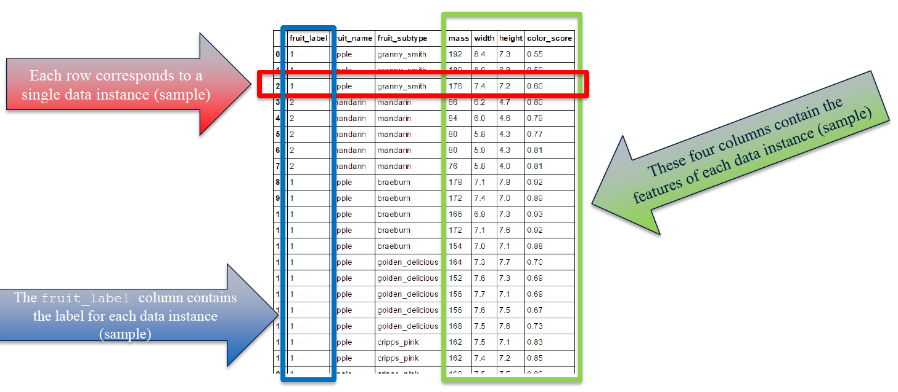
    </a>

    ```python
    %matplotlib notebook
    import numpy as np+[Web notebook]()
    import matplotlib.pyplot as plt
    import pandas as pd
    from sklearn.model_selection import train_test_split

    fruits = pd.read_table('fruit_data_with_colors.txt')

    fruits.head()
    # | fruit_| fruit_   | fruit_       | mass  | width | height | color_ |
    # | label | name     | subtype      |       |       |        | score  |
    # | 1     | apple    | granny_smith | 192   | 8.4   | 7.3    | 0.55   |
    # | 1     | apple    | granny_smith | 180   | 8.0   | 6.8    | 0.59   |
    # | 1     | apple    | granny_smith | 176   | 7.4   | 7.2    | 0.60   |
    # | 2     | mandarin | mandarin     | 86    | 6.2   | 4.7    | 0.80   |
    # | 2     | mandarin | mandarin     | 84    | 6.0   | 4.6    | 0.79   |

    # create a mapping from fruit label value to fruit name to make results easier to interpret
    lookup_fruit_name = dict(zip(fruits.fruit_label.unique(), fruits.fruit_name.unique()))
    # {1: 'apple', 2: 'mandarin', 3: 'orange', 4: 'lemon'}
    ```

+ The scale for the (simplistic) `color_score` feature used in the fruit dataset
    <a href="https://d3c33hcgiwev3.cloudfront.net/hTmWWzmaEee7AA7Ncgm5Cg.processed/full/540p/index.mp4?Expires=1535673600&Signature=VYuFss4hE4zwTHrV9Bv8Odm~3zX7r3pCwu7yHXX1R2gZNjqdt7YeV-02VEHPoqfNMnY~b3dfdPp31UlrE4WgSOCoEcDHwpdD1UOujTRCRKGTW~3Zh4q6zOmHAzDBCEsSsZ5H4p4RPSOxY8Roj-ex1SLEFPPT9GtTPPWM-jG5qwc_&Key-Pair-Id=APKAJLTNE6QMUY6HBC5A">
        <br/>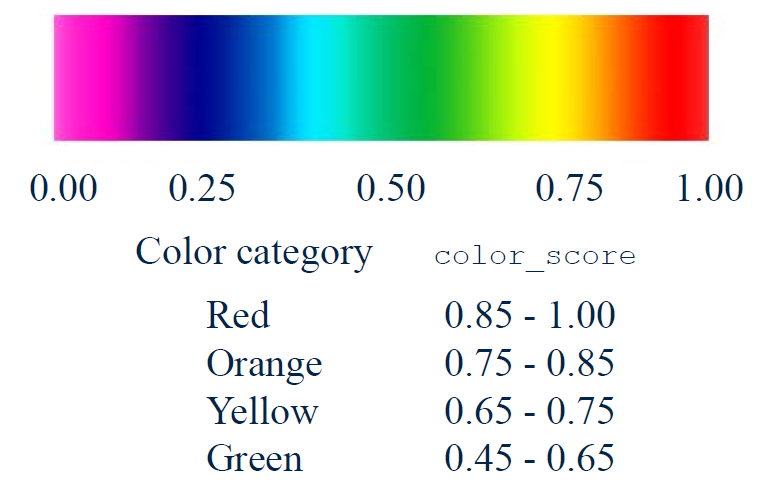
    </a>

+ Creating Training and Testing Sets
    <a href="https://d3c33hcgiwev3.cloudfront.net/hTmWWzmaEee7AA7Ncgm5Cg.processed/full/540p/index.mp4?Expires=1535673600&Signature=VYuFss4hE4zwTHrV9Bv8Odm~3zX7r3pCwu7yHXX1R2gZNjqdt7YeV-02VEHPoqfNMnY~b3dfdPp31UlrE4WgSOCoEcDHwpdD1UOujTRCRKGTW~3Zh4q6zOmHAzDBCEsSsZ5H4p4RPSOxY8Roj-ex1SLEFPPT9GtTPPWM-jG5qwc_&Key-Pair-Id=APKAJLTNE6QMUY6HBC5A">
        <br/>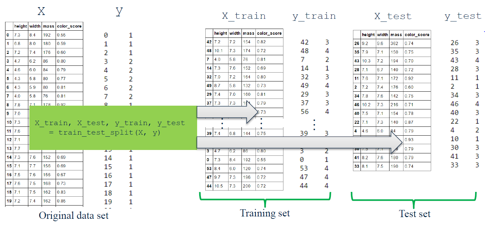
    </a>
    ```python
    X = fruits[['height', 'width', 'mass', 'color_score']]
    y = fruits['fruit_label']
    X_train, X_test, y_train, y_test = train_test_split(X, y, random_state=0)
    ```

+ `train_test_split` function
    + Signature: `train_test_split(*arrays, **options)`
    + Docstring: Split arrays or matrices into random train and test subsets <br/>
        Quick utility that wraps input validation and  `next(ShuffleSplit().split(X, y))` and application to input data into a single call for splitting (and optionally subsampling) data in a oneliner.
    + Parameters
        + `*arrays` (sequence of indexables with same length / shape[0] <br/>): Allowed inputs are lists, numpy arrays, scipy-sparse matrices or pandas dataframes.
        + `test_size` (float, int, None, optional): 
            + If float, should be between 0.0 and 1.0 and represent the proportion of the dataset to include in the test split. 
            + If int, represents the absolute number of test samples.
            + If None, the value is set to the complement of the train size. By default, the value is set to $0.25$. The default will change in version 0.21. It will remain $0.25$ only if `train_size` is unspecified, otherwise it will complement the specified `train_size`.
        + `train_size` (float, int, or None, default None): 
            + If float, should be between 0.0 and 1.0 and represent the proportion of the dataset to include in the train split. 
            + If int, represents the absolute number of train samples. 
            + If None, the value is automatically set to the complement of the test size.
        + `random_state` (int, RandomState instance or None, optional (default=None)): 
            + If int, random_state is the seed used by the random number generator;
            + If RandomState instance, random_state is the random number generator;
            + If None, the random number generator is the RandomState instance used by `np.random`.
        + `shuffle` (boolean, optional (default=True)): Whether or not to shuffle the data before splitting. If shuffle=False then stratify must be None.
        + `stratify` (array-like or None (default is None)):  If not None, data is split in a stratified fashion, using this as the class labels.

    + Returns: splitting : list, length=2 * len(arrays); List containing train-test split of inputs.


### Lecture Video

<a href="https://d3c33hcgiwev3.cloudfront.net/hTmWWzmaEee7AA7Ncgm5Cg.processed/full/540p/index.mp4?Expires=1535673600&Signature=VYuFss4hE4zwTHrV9Bv8Odm~3zX7r3pCwu7yHXX1R2gZNjqdt7YeV-02VEHPoqfNMnY~b3dfdPp31UlrE4WgSOCoEcDHwpdD1UOujTRCRKGTW~3Zh4q6zOmHAzDBCEsSsZ5H4p4RPSOxY8Roj-ex1SLEFPPT9GtTPPWM-jG5qwc_&Key-Pair-Id=APKAJLTNE6QMUY6HBC5A" alt="An Example Machine Learning Problem" target="_blank">
     
</a>


## Examining the Data

+ Some reasons why looking at the data initially is important
    + Inspecting feature values may help identify _what cleaning or preprocessing still needs_ to be done once you can see the range or distribution of values that is typical for each attribute.
    + You might notice _missing or noisy data_, or _inconsistencies_ such as the wrong data type being used for a column, incorrect units of measurements for a particular column, or that there aren’t enough examples of a particular class.
    + You may realize that your _problem_ is actually solvable without machine learning.
    <a href="url">
        <br/>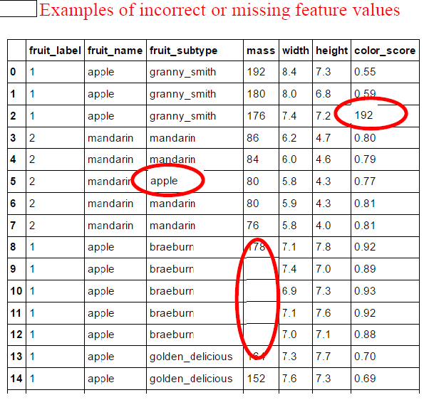
    </a>

+ Q: Why is it important to examine your dataset before starting to work with it for a machine learning task?
    1. To understand how much missing data there is in the dataset
    2. To get an idea of whether the features need further cleaning
    3. It may turn out the problem doesn't require machine learning.
    4. It's not important; most machine learning methods can learn to work with the raw data without further processing.

    Ans: 1, 2, 3

+ Benefits of visualization in training data set
    + get an idea of the range of values that each feature takes on -> outliers
    + get a better idea how likely a machine learning algorithm could do well at predicting the different classes

+ Feature pair plots
    + A pairwise feature scatterplot visualizes the data using all possible pairs of features, with one scatterplot per feature pair, and histograms for each feature along the diagonal.
    <a href="https://d3c33hcgiwev3.cloudfront.net/d_CORDmaEeeRMwreAZ0UVg.processed/full/540p/index.mp4?Expires=1535673600&Signature=La411GGE4Wg3PH1EHmh90OL3gIvVTR1XLxvSi3JsVmJCmI8kG66neYZtMBrkoIOG-76Yhfy~2O607f6xy4Ra8jAwRKWkdFWJaGpbJsjxE059XoEoh61ORDchGJR-gKZgweCTYe0MS2uRL9cazJJKwEZp4t4U76jrERlPojtKejE_&Key-Pair-Id=APKAJLTNE6QMUY6HBC5A">
        <br/>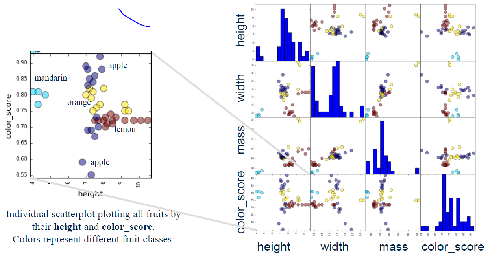
    </a>
    ```python
    cmap = cm.get_cmap('gnuplot')
    scatter = pd.scatter_matrix(X_train, c= y_train, marker = 'o', s=40, hist_kwds={'bins':15}, figsize=(9,9), cmap=cmap)
    ```

+ A three-dimensional feature scatterplot
    <a href="https://d3c33hcgiwev3.cloudfront.net/d_CORDmaEeeRMwreAZ0UVg.processed/full/540p/index.mp4?Expires=1535673600&Signature=La411GGE4Wg3PH1EHmh90OL3gIvVTR1XLxvSi3JsVmJCmI8kG66neYZtMBrkoIOG-76Yhfy~2O607f6xy4Ra8jAwRKWkdFWJaGpbJsjxE059XoEoh61ORDchGJR-gKZgweCTYe0MS2uRL9cazJJKwEZp4t4U76jrERlPojtKejE_&Key-Pair-Id=APKAJLTNE6QMUY6HBC5A">
        <br/>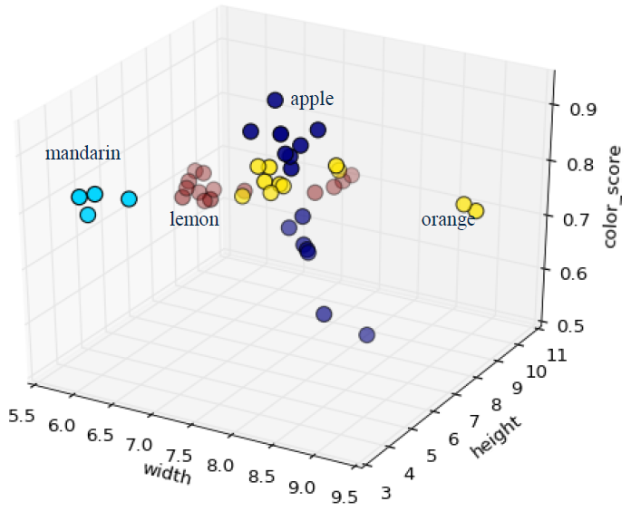
    </a>
    ```python
    from mpl_toolkits.mplot3d import Axes3D

    fig = plt.figure()
    ax = fig.add_subplot(111, projection = '3d')
    ax.scatter(X_train['width'], X_train['height'], X_train['color_score'], c = y_train, marker = 'o', s=100)
    ax.set_xlabel('width')
    ax.set_ylabel('height')
    ax.set_zlabel('color_score')
    plt.show()
    ```

+ `cm.get_cmap` method
    + Signature: `cm.get_cmap(name=None, lut=None)`
    + Docstring: Get a colormap instance, defaulting to rc values if *name* is None.
    + Parameters:
        + `name` (`matplotlib.colors.Colormap` instance): it will be returned.
        + `lut`: If *lut* is not None it must be an integer giving the number of entries desired in the lookup table, and *name* must be a standard mpl colormap name.

+ `pd.scatter_matrix` method
    + Signature: `pd.scatter_matrix(frame, alpha=0.5, figsize=None, ax=None, grid=False, diagonal='hist', marker='.', density_kwds=None, hist_kwds=None, range_padding=0.05, **kwds)`
    + Docstring: Draw a matrix of scatter plots
    + Parameters:
        + `frame` (DataFrame)
        + `alpha` (float, optional): amount of transparency applied
        + `figsize` (float,float): a tuple (width, height) in inches
        + `ax` (Matplotlib axis object, optional)
        + `grid` (bool, optional): setting this to True will show the grid
        + `diagonal` ( {‘hist’, ‘kde’}): pick between ‘kde’ and ‘hist’ for either Kernel Density Estimation or Histogram plot in the diagonal
        + `marker` (str, optional): Matplotlib marker type, default ‘.’
        + `hist_kwds`: other plotting keyword arguments; To be passed to hist function
        + `density_kwds`: other plotting keyword arguments; To be passed to kernel density estimate plot
        + `range_padding` (float, optional): relative extension of axis range in x and y with respect to (x_max - x_min) or (y_max - y_min), default 0.05
        + `kwds`: other plotting keyword arguments; To be passed to scatter function

+ `plt.savefig` function
    + Signature: `savefig(fname, *kwargs*)`
    + Docstring: Save the current figure.
    + Arguments:
        + `fname`: A string containing a path to a filename, or a Python file-like object, or possibly some backend-dependent object such as `~matplotlib.backends.backend_pdf.PdfPages`.
            + If *format* is *None* and *fname* is a string, the output format is deduced from the extension of the filename. 
            + If the filename has no extension, the value of the rc parameter `savefig.format` is used.
            + If *fname* is not a string, remember to specify *format* to ensure that the correct backend is used.
    + Keyword arguments:
        + `dpi` ([ *None* | ``scalar > 0`` | 'figure']): The resolution in dots per inch.  
            + If *None* it will default to the value `savefig.dpi` in the matplotlibrc file. 
            + If 'figure' it will set the dpi to be the value of the figure.
        + `facecolor`, `edgecolor`: the colors of the figure rectangle
        + `orientation` ([ 'landscape' | 'portrait' ]): not supported on all backends; currently only on postscript output
        + `papertype`: One of 'letter', 'legal', 'executive', 'ledger', 'a0' through 'a10', 'b0' through 'b10'. Only supported for postscript output.
        + `format`: One of the file extensions supported by the active backend.  Most backends support png, pdf, ps, eps and svg.
        + `transparent`:
            + If *True*, the axes patches will all be transparent; the figure patch will also be transparent unless facecolor and/or edgecolor are specified via kwargs. This is useful, for example, for displaying a plot on top of a colored background on a web page.  The transparency of these patches will be restored to their original values upon exit of this function.
        + `frameon`: 
            + If *True*, the figure patch will be colored, if *False*, the figure background will be transparent.  
            + If not provided, the rcParam 'savefig.frameon' will be used.
        + `bbox_inches`: Bbox in inches. Only the given portion of the figure is saved. If 'tight', try to figure out the tight bbox of the figure.
        + `pad_inches`: Amount of padding around the figure when bbox_inches is 'tight'.
        + `bbox_extra_artists`: A list of extra artists that will be considered when the tight bbox is calculated.


### Lecture Video

<a href="https://d3c33hcgiwev3.cloudfront.net/d_CORDmaEeeRMwreAZ0UVg.processed/full/540p/index.mp4?Expires=1535673600&Signature=La411GGE4Wg3PH1EHmh90OL3gIvVTR1XLxvSi3JsVmJCmI8kG66neYZtMBrkoIOG-76Yhfy~2O607f6xy4Ra8jAwRKWkdFWJaGpbJsjxE059XoEoh61ORDchGJR-gKZgweCTYe0MS2uRL9cazJJKwEZp4t4U76jrERlPojtKejE_&Key-Pair-Id=APKAJLTNE6QMUY6HBC5A" alt="Examining the Data" target="_blank">
     
</a>


## K-Nearest Neighbors Classification

+ K-NN Algorithm
    + used for classification and regression
    + instance-based or memory-based supervised learning
    + memorizing the labeled examples of training set
    + `k`: the number of nearest neighbor the classifier will retrieve and use to make decision

+ The k-Nearest Neighbor (k-NN) Classifier Algorithm <br/>
    Given a training set X_train with labels y_train, and given a new instance x_test to be classified:
    1. Find the most similar instances (let's call them X_NN) to x_test that are in X_train.
    2. Get the labels y_NN for the instances in X_NN
    3. Predict the label for x_test by combining the labels y_NN e.g. simple majority vote

+ A visual explanation of k-NN
    <a href="https://www.coursera.org/learn/python-machine-learning/lecture/MwsUM/k-nearest-neighbors-classification">
        <br/>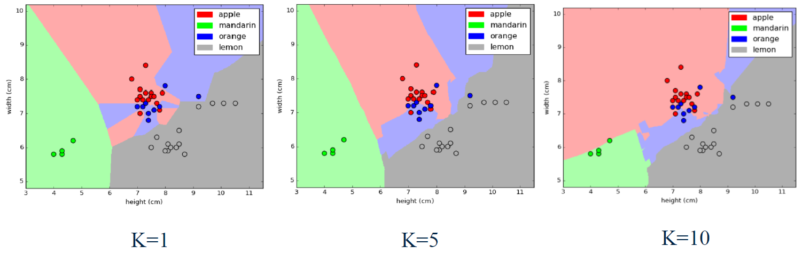
    </a>

+ A nearest neighbor algorithm needs four things specified
    1. A distance metric
    2. How many 'nearest' neighbors to look at?
    3. Optional weighting function on the neighbor points
    4. Method for aggregating the classes of neighbor points

+ A nearest neighbor algorithm needs four things specified
    1. A distance metric: __Typically Euclidean (Minkowski with p = 2)__
    2. How many 'nearest' neighbors to look at?: _e.g. five__
    3. Optional weighting function on the neighbor points: __Ignored__
    4. How to aggregate the classes of neighbor points: __Simple majority vote__ <br/>(Class with the most representatives among nearest neighbors)

+ Python Code for K-NN
    ```python
    X = fruits[['mass', 'width', 'height']]
    y = fruits['fruit_label']

    # default is 75% / 25% train-test split
    X_train, X_test, y_train, y_test = train_test_split(X, y, random_state=0)

    # Create classifier object
    from sklearn.neighbors import KNeighborsClassifier

    knn = KNeighborsClassifier(n_neighbors = 5)

    # Train the classifier (fit the estimator) using the training data
    knn.fit(X_train, y_train)
    # KNeighborsClassifier(algorithm='auto', leaf_size=30, metric='minkowski',
    #       metric_params=None, n_jobs=1, n_neighbors=5, p=2,
    #       weights='uniform')

    # Estimate the accuracy of the classifier on future data, using the test data
    knn.score(X_test, y_test)
    # 0.53333333333333333

    # Use the trained k-NN classifier model to classify new, previously unseen objects
    # first example: a small fruit with mass 20g, width 4.3 cm, height 5.5 cm
    fruit_prediction = knn.predict([[20, 4.3, 5.5]])
    lookup_fruit_name[fruit_prediction[0]]          # 'mandarin'

    # second example: a larger, elongated fruit with mass 100g, width 6.3 cm, height 8.5 cm
    fruit_prediction = knn.predict([[100, 6.3, 8.5]])
    lookup_fruit_name[fruit_prediction[0]]          # 'lemon'

    # Plot the decision boundaries of the k-NN classifier
    from adspy_shared_utilities import plot_fruit_knn

    plot_fruit_knn(X_train, y_train, 5, 'uniform')   # we choose 5 nearest neighbors

    #  How sensitive is k-NN classification accuracy to the choice of the 'k' parameter?
    k_range = range(1,20)
    scores = []

    for k in k_range:
        knn = KNeighborsClassifier(n_neighbors = k)
        knn.fit(X_train, y_train)
        scores.append(knn.score(X_test, y_test))

    plt.figure()
    plt.xlabel('k')
    plt.ylabel('accuracy')
    plt.scatter(k_range, scores)
    plt.xticks([0,5,10,15,20]);

    # ### How sensitive is k-NN classification accuracy to the train/test split proportion?
    t = [0.8, 0.7, 0.6, 0.5, 0.4, 0.3, 0.2]

    knn = KNeighborsClassifier(n_neighbors = 5)

    plt.figure()

    for s in t:

        scores = []
        for i in range(1,1000):
            X_train, X_test, y_train, y_test = train_test_split(X, y, test_size = 1-s)
            knn.fit(X_train, y_train)
            scores.append(knn.score(X_test, y_test))
        plt.plot(s, np.mean(scores), 'bo')

    plt.xlabel('Training set proportion (%)')
    plt.ylabel('accuracy');
    ```

+ K-NN Analysis with `k` value:
    + smaller `k`: 
        + good at learning the classess for individual points in the training set
        + decision boundary: fragmented with considerable variation
        + sensitive to noise, outliers, mislabeled data and other sources of variations iin individual data points
    + larger `k`:
        + area assigned to different classes - smother and not as fragmented and more robust to 
        + possibly with some mistakes, more mistakes in individual points
        + supress the effect of noisey individual labels
        + less detailed classification boundaries
    + Bias tradeoff

+ How sensitive is k-NN classifier accuracy to the choice of 'k' parameter?
    <a href="https://www.coursera.org/learn/python-machine-learning/lecture/MwsUM/k-nearest-neighbors-classification">
        <br/>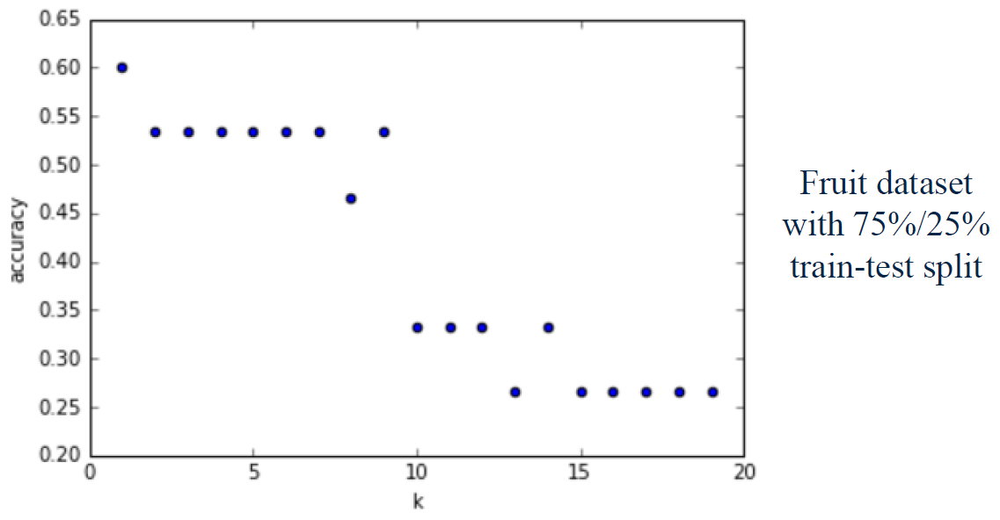
    </a>
    + Best choise of `k`: highest accuracy - depending on the data set


+ Q: Which of these could be an acceptable sequence of operations using scikit-learn to apply the k-nearest neighbors classification method?
    1. read_table, train_test_split, fit, KNeighborsClassifier, score
    2. read_table, train_test_split, KNeighborsClassifier, fit, score
    3. read_table, fit, train_test_split, KNeighborsClassifier, score
    4. KNeighborsClassifier, train_test_split, fit, score, read_table

    Ans: 2

+ Q: Which of the following is true about the k-nearest neighbors classification algorithm, assuming uniform weighting on the k neighbors? Select all that apply.
    1. A low value of “k” (close to 1) is more likely to overfit the training data and lead to worse accuracy on the test data, compared to higher values of “k”.
    2. A low value of “k” (close to 1) is less likely to overfit the training data and lead to better accuracy on the test data, compared to higher values of “k”.
    3. Setting “k” to the number of points in the training set will result in a classifier that always predicts the majority class.
    4. Setting “k” to the number of points in the training set will result in a classifier that never predicts the majority class.
    5. The k-nearest neighbors classification algorithm has to memorize all of the training examples to make a prediction.
    6. The performance of a k-nearest neighbors classifier is relatively insensitive to the choice of “k” on most datasets.

    Ans: 1, 3, 5

+ `KNeighborsClassifier` init method
    + Init signature: `KNeighborsClassifier(n_neighbors=5, weights='uniform', algorithm='auto', leaf_size=30, p=2, metric='minkowski', metric_params=None, n_jobs=1, **kwargs)`
    + Docstring: Classifier implementing the k-nearest neighbors vote.
    + Parameters
        + `n_neighbors` (int, optional, default = 5): Number of neighbors to use by default for :meth:`kneighbors` queries.
        + `weights` (str or callable, optional, default = 'uniform'): weight function used in prediction.  Possible values:
            - 'uniform' : uniform weights.  All points in each neighborhood are weighted equally.
            - 'distance' : weight points by the inverse of their distance. in this case, closer neighbors of a query point will have a greater influence than neighbors which are further away.
            - [callable] : a user-defined function which accepts an array of distances, and returns an array of the same shape containing the weights.
        + `algorithm` ({'auto', 'ball_tree', 'kd_tree', 'brute'}, optional): Algorithm used to compute the nearest neighbors:
            - 'ball_tree' will use :class:`BallTree`
            - 'kd_tree' will use :class:`KDTree`
            - 'brute' will use a brute-force search.
            - 'auto' will attempt to decide the most appropriate algorithm based on the values passed to :meth:`fit` method.

            Note: fitting on sparse input will override the setting of this parameter, using brute force.

        + `leaf_size` (int, optional, default = 30): Leaf size passed to BallTree or KDTree.  This can affect the speed of the construction and query, as well as the memory required to store the tree.  The optimal value depends on the nature of the problem.

        + `p` (integer, optional, default = 2): Power parameter for the Minkowski metric. When p = 1, this is equivalent to using manhattan_distance (l1), and euclidean_distance (l2) for p = 2. For arbitrary p, minkowski_distance (l_p) is used.
        + `metric` (string or callable, default 'minkowski'): the distance metric to use for the tree.  The default metric is minkowski, and with p=2 is equivalent to the standard Euclidean metric. See the documentation of the DistanceMetric class for a list of available metrics.
        + `metric_params` (dict, optional, default = None): Additional keyword arguments for the metric function.
        + `n_jobs` (int, optional, default = 1): The number of parallel jobs to run for neighbors search. If ``-1``, then the number of jobs is set to the number of CPU cores. Doesn't affect :meth:`fit` method.

+ `knn.fit` method
    + Signature: `knn.fit(X, y)`
    + Docstring: Fit the model using X as training data and y as target values
    + Parameters
        + `X` ({array-like, sparse matrix, BallTree, KDTree}): Training data. If array or matrix, shape [n_samples, n_features], or [n_samples, n_samples] if metric='precomputed'.
        + `y` ({array-like, sparse matrix}): Target values of shape = [n_samples] or [n_samples, n_outputs]

+ `knn.score` method
    + Signature: `knn.score(X, y, sample_weight=None)`
    + Docstring: Returns the mean accuracy on the given test data and labels.
    + Parameters
        + `X` (array-like, shape = (n_samples, n_features)): Test samples.
        + `y` (array-like, shape = (n_samples) or (n_samples, n_outputs)): True labels for X.
        + `sample_weight` (array-like, shape = [n_samples], optional): Sample weights.
    + Returns: score (float): Mean accuracy of self.predict(X) wrt. y.

+ `knn.predict` method
    + Signature: `knn.predict(X)`
    + Docstring: Predict the class labels for the provided data
    + Parameters: 
        + `X` (array-like, shape (n_query, n_features), or (n_query, n_indexed) if metric == 'precomputed') : Test samples.
    + Returns: `y` (array of shape [n_samples] or [n_samples, n_outputs]): Class labels for each data sample.


### Lecture Video 

<a href="https://d3c33hcgiwev3.cloudfront.net/i3r_FTmaEeeRKQp2xLWbhg.processed/full/540p/index.mp4?Expires=1535673600&Signature=RRZR0EXP~aIBtsdFAPN7EHU80x6RSIt4iSq7BkjnFPV9gH8ZfUE04vYr2Lqq7MOIueQYDWFXn~wyu86CkrCIIIS5vygYuPhDzyDyGCkJuIOG9usaYp9THL6ZK8IXOuj6H0t9IZnh0lunnUN96loUC8Poi~Bjrkh7fXjUsrv2y5U_&Key-Pair-Id=APKAJLTNE6QMUY6HBC5A" alt="K-Nearest Neighbors Classification
" target="_blank">
     
</a>


## Zachary Lipton: The Foundations of Algorithmic Bias (optional)

This Nov. 2016 article by Zachary C. Lipton from the blog Approximately Correct discusses why and how automated processes for decision-making, particularly applications of machine learning, can exhibit bias in subtle and not-so-subtle ways. It's self-contained and includes a mini-review of machine learning concepts that reinforces what's covered in Module 1. This reading is optional for completion of the course.

http://approximatelycorrect.com/2016/11/07/the-foundations-of-algorithmic-bias/

If you're interested in the more general topic of ethics in data science, we recommend this online course in Data Science Ethics by Prof. H.V. Jagadish of the University of Michigan.

https://www.edx.org/course/data-science-ethics-michiganx-ds101x-1


## Quiz: Module 1 Quiz


Q1. Select the option that correctly completes the sentence:<br/>
    Training a model using labeled data and using this model to predict the labels for new data is known as ____________.

    a. Density Estimation
    b. Unsupervised Learning
    c. Clustering
    d. Supervised Learning

    Ans: d


Q2. Select the option that correctly completes the sentence: <br/>
Modeling the features of an unlabeled dataset to find hidden structure is known as ____________.

    a. Unsupervised Learning
    b. Supervised Learning
    c. Regression
    d. Classification

    Ans: a


Q3. Select the option that correctly completes the sentence: <br/>
Training a model using categorically labelled data to predict labels for new data is known as __________.

    a. Regression
    b. Classification
    c. Feature Extraction
    d. Clustering

    Ans: b


Q4. Select the option that correctly completes the sentence:<br/>
Training a model using labelled data where the labels are continuous quantities to predict labels for new data is known as __________.

    a. Classification
    b. Clustering
    c. Regression
    d. Feature Extraction

    Ans: c


Q5. Using the data for classes 0, 1, and 2 plotted below, what class would a KNeighborsClassifier classify the new point as for k = 1 and k = 3?
<a href="https://www.coursera.org/learn/python-machine-learning/exam/W3RV7/module-1-quiz">
    <br/>
</a>

    a. k=1: Class 1; k=3: Class 2
    b. k=1: Class 0; k=3: Class 2
    c. k=1: Class 0; k=3: Class 1
    d. k=1: Class 1; k=3: Class 0
    e. k=1: Class 2; k=3: Class 1

    Ans: a

Q6. Which of the following is true for the nearest neighbor classifier (Select all that apply):

    a. Given a data instance to classify, computes the probability of each possible class using a statistical model of the input features
    b. A higher value of k leads to a more complex decision boundary
    c. Partitions observations into k clusters where each observation belongs to the cluster with the nearest mean
    d. Memorizes the entire training set

    Ans: (x - c. d)


Q7. Why is it important to examine your dataset as a first step in applying machine learning? (Select all that apply): <br/>

    a. See what type of cleaning or preprocessing still needs to be done
    b. You might notice missing data
    c. Gain insight on what machine learning model might be appropriate, if any
    d. Get a sense for how difficult the problem might be
    e. It is not important

    Ans: (x- a, b, d)


Q8. The key purpose of splitting the dataset into training and test sets is:

    a. To reduce the amount of labelled data needed for evaluating classifier accuracy
    b. To reduce the number of features we need to consider as input to the learning algorithm
    c. To speed up the training process
    d. To estimate how well the learned model will generalize to new data

    Ans: d


Q9. The purpose of setting the random_state parameter in train_test_split is: (Select all that apply)

    a. To make experiments easily reproducible by always using the same partitioning of the data
    b. To avoid bias in data splitting
    c. To avoid predictable splitting of the data
    d. To split the data into similar subsets so that bias is not introduced into the final results

    Ans: (x - a, d)


Q10. Given a dataset with 10,000 observations and 50 features plus one label, what would be the dimensions of X_train, y_train, X_test, and y_test? Assume a train/test split of 75%/25%.

    a. X_train: (10000, 50), y_train: (10000, ), X_test: (10000, 50), y_test: (10000, )
    b. X_train: (2500, ), y_train: (2500, 50), X_test: (7500, ), y_test: (7500, 50)
    c. X_train: (2500, 50), y_train: (2500, ), X_test: (7500, 50), y_test: (7500, )
    d. X_train: (10000, 28), y_train: (10000, ), X_test: (10000, 12), y_test: (10000, )
    e. X_train: (7500, 50), y_train: (7500, ), X_test: (2500, 50), y_test: (2500, )

    Ans: e


