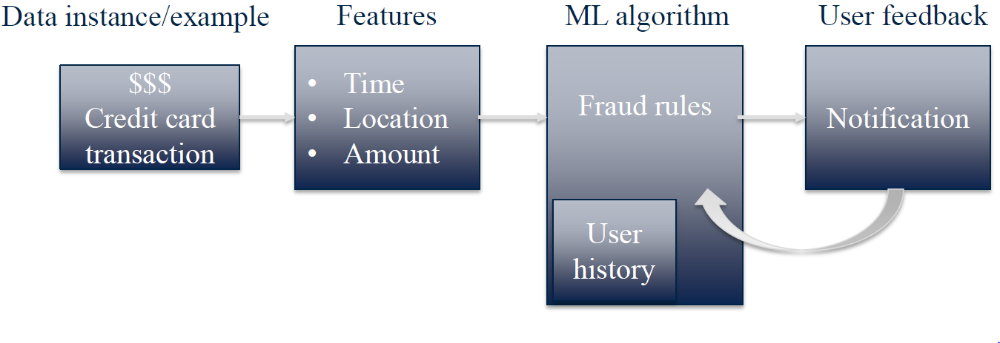

# Module 1: Fundamentals of Machine Learning - Intro to SciKit Learn

## Course Syllabus

### Prerequisites

In order to be successful in this course, you will need to know how to program in Python. The expectation is that you have completed [Introduction to Data Science in Python](https://www.coursera.org/learn/python-data-analysis) and [Applied Plotting, Charting & Data Representation in Python](https://www.coursera.org/learn/python-plotting), so that you are familiar with the numpy and pandas Python libraries for data manipulation, and matplotlib for plotting.

### Week by week

__In Module One__, you will be introduced to basic machine learning concepts, tasks, and workflow using an example classification problem based on the K-nearest neighbors method, and implemented using the scikit-learn library. This week’s assignment has you work through the process of loading and examining a dataset, training a k-nearest neighbors classifier on the dataset, and then evaluating the accuracy of the classifier and using it to classify new data.

__In Module Two__, you will delve into a wider variety of supervised learning methods for both classification and regression, learning about the connection between model complexity and generalization performance, the importance of proper feature scaling, and how to control model complexity by applying techniques like regularization to avoid overfitting. In addition to k-nearest neighbors, this week covers linear regression (least-squares, ridge, lasso, and polynomial regression), logistic regression, support vector machines, decision trees, and the use of cross-validation for model evaluation. For this week’s assignment, you’ll explore the relationship between model complexity and generalization performance, by looking at the effect of key parameters on the accuracy of different classification and regression models.

__In Module Three__, you will cover evaluation and model selection methods that you can use to help understand and optimize the performance of your machine learning models. For this week’s assignment, you will train a classifier to detect fraudulent financial transactions, analyze its performance with different evaluation metrics, and then optimize the classifier’s performance based on different evaluation metrics, depending on the goals of the detection task (e.g. to minimize false positives vs false negatives).

__In Module Four__, you will cover more advanced supervised learning methods that include ensembles of trees (random forests, gradient boosted trees), and neural networks (with an optional summary on deep learning). You will also learn about the critical problem of data leakage in machine learning and how to detect and avoid it. The final assignment brings everything together: you will design features for, and build your own classifier on, a prediction problem on a complex real-world dataset.

### Enrollment Options

Coursera has made the decision to make Specializations available by monthly subscription. This means you can choose to pay a monthly fee to access all of the courses in a specific Specialization.

Coursera’s switch to monthly subscriptions comes with another change -- for those learners who choose the “Audit Only” enrollment, you will no longer be able to submit assignments for grades nor see answers for those assignments. You will still have access to all the course materials but you will not be graded on your work, nor see answers to graded assignments.

For further information on the different enrollment options for Coursera courses, please visit the [Enrollment Options Help](https://learner.coursera.help/hc/en-us/articles/209818613-Enrollment-options) page. If you have feedback about the enrollment options shared on the Enrollment Options page, you can share your thoughts with Coursera in this [survey](https://www.surveymonkey.com/r/65DPLHG).

### Grading and Assignments

The lectures will provide you with some guidance for completing assignments, but you will need to take initiative and look beyond assignment instructions in order to be successful. You'll need to know how to ask questions in the discussion forums of your peers, and seek out new information through web searches and [Stack Overflow](http://stackoverflow.com/questions/tagged/matplotlib). Be sure to also check out the [Additional Resources](https://www.coursera.org/learn/python-machine-learning/resources/NJFSV).

If you are not sure what kind of output is required, or think there is a need for more clarity, please head to the course discussion forums. Note that some assignments and in video quizzes may not be mobile friendly.

Some assignments allow you to download and view your fellow learner’s code and/or data. If you want to look at the learner's code, we recommend that you open it through the Jupyter notebook system on the Coursera platform as that will be more secure. Please ensure that all data you share is publicly available, since you will be sharing these data with other learners.

| Course Item | Percentage of Final Grade | Passing Threshold |
|-------------|---------------------------|-------------------|
| Week 1 Quiz | 5% | 80% |
| Week 1 Jupyter Notebook Assignment | 15% |
| Week 2 Quiz | 5% | 80% |
| Week 2 Jupyter Notebook Assignment | 20% |
| Week 3 Quiz | 5% | 80% |
| Week 3 Jupyter Notebook Assignment | 20% |
| Week 4 Quiz | 5% | 80% |
| Week 4 Jupyter Notebook Assignment | 25% |

### Code of Conduct

Visit Coursera’s [Code of Conduct](https://learner.coursera.help/hc/en-us/articles/208280036-Coursera-Code-of-Conduct) and to abide by guidelines there. It is important when giving feedback to your peers to be polite and to be sensitive to the diversity of cultures and backgrounds of learners in your course.

### Working Offline

While the Coursera platform has an integrated Jupyter Notebook system, you can work offline on your own computer by installing Python 3.5+ and the Jupyter software packages. For more details, consult the [Jupyter Notebook FAQ](https://www.coursera.org/learn/python-machine-learning/resources/bANLa).

Note that this course uses matplotlib 2.0.

### Accessibility

We strive to develop fully accessible courses. Occasionally, some of our content does not fully meet our accessibility goals. Please use [this form](https://goo.gl/forms/XqKzVUMTn62yrarU2) to inform us of any accessibility issues you are experiencing in this course.

### Help!

If you're having problems, here are a couple of great places to go for help:

+ If the problem is with the Coursera platform such as verification on assignments, in video quiz problems, or the Jupyter Notebooks, please check out the [Coursera Learner Support Forums](https://learner.coursera.help/hc/en-us/requests).
+ If the problem deals with understanding the assignment or how to use the Jupyter Notebooks, please read our [Jupyter Notebook FAQ](https://www.coursera.org/learn/python-machine-learning/resources/bANLa) page in the course resources
+ If you have questions with the content of the course, or questions about programming in python or with the toolkits described, you can contact your peers and the course instructors in the discussion forums, or go to [Stack Overflow](http://stackoverflow.com/questions/tagged/python).
+ Having trouble accessing your previously submitted assignments? If your session has ended, you can access these again by selecting the "Switch Session" option. Details for how to select this can be found in this [learner help center article](https://learner.coursera.help/hc/en-us/articles/208279776-Switch-to-a-different-session). If you still have issues accessing your materials after switching sessions, please reach out to Coursera learner support via our online chat forums in the [Learner Help Center](https://learner.coursera.help/hc/en-us).

### In-Video Questions (IVQs)

In this course, in-video questions or IVQs may appear during lectures to help you learn as well as assess your understanding of the content. IVQs are optional and do not count towards your overall course grade.

#### Types of in-video questions

Many of the lectures contain in-video questions (IVQs). These questions are presented in a variety of formats. Some will ask you to write or think about a concept from the video. Others will ask for a short answer. Still others may ask you to choose from a multiple-choice list of answers. If an IVQ is a survey or a poll, you will see a summary of responses from other learners after you respond. You can look at the question again later to see new summary data as more of your peers answer.

Some IVQs also contain runnable code blocks. These IVQs allow you to practice the coding concepts during the lecture. In this course, these types of IVQs will usually be directly followed with the solution code.

### Recommended Text

The following book is not required to complete the course, but we recommend it as an additional resource that may be useful to you as you progress, and for later reference. Like this course, the book focuses on the practical details of building your own solutions to machine learning tasks using scikit-learn in Python. It provides further background on machine learning concepts, more depth on specific topics covered in this course (as well as a number of additional topics), and additional coding examples.

Introduction to Machine Learning with Python

by Andreas C. Müller and Sarah Guido

Publisher: O'Reilly Media

Available at: http://shop.oreilly.com/product/0636920030515.do

Print ISBN:978-1-4493-6941-5 | ISBN 10:1-4493-6941-3

Ebook ISBN:978-1-4493-6940-8 | ISBN 10:1-4493-6940-5

### Additional Resources

+ Dr Chuck Severance's Coursera Specialization, [Python for Everybody](https://www.coursera.org/specializations/python)
+ [Python Docs](https://docs.python.org/3/) (for general Python documentation)
+ [Python Classes Docs](https://docs.python.org/3.5/tutorial/classes.html)
+ [Scipy](http://scipy.org/) (for [IPython](http://ipython.org/), [Numpy](http://www.numpy.org/), [Pandas](http://pandas.pydata.org/), and [Matplotlib](http://matplotlib.org/))
+ [scitkit-learn Docs](http://scikit-learn.org/stable/documentation.html)
+ [scikit-learn Cheat Sheet](https://s3.amazonaws.com/assets.datacamp.com/blog_assets/Scikit_Learn_Cheat_Sheet_Python.pdf)
+ Don't forget to check [Stack Overflow](https://stackoverflow.com/questions/tagged/scikit-learn) and [Cross Validated](https://stats.stackexchange.com/)!

## Introduction

+ What is Machine Learning (ML)?
    + The study of computer programs (algorithms) that can learn by example
    + ML algorithms can generalize from existing examples of a task
        + e.g. after seeing a training set of labeled images, an image classifier can figure out how to apply labels accurately to new, previously unseen images

+ Speech Recognition
    <a href="url">
         
    </a>

+ Machine Learning models can learn by example
    + Algorithms learn rules from labelled examples
    + A set of labelled examples used for learning is called training data.
    + The learned rules should also be able to generalize to correctly recognize or predict new examples not in the training set.

+ Machine Learning models learn from experience
    + Labeled examples (Email spam detection)
    + User feedback (Clicks on a search page)
    + Surrounding environment (self-driving cars)

+ Machine Learning brings together statistics, computer science, and more..
    + Statistical methods
        + Infer conclusions from data
        + Estimate reliability of predictions
    + Computer science
        + Large-scale computing architectures
        + Algorithms for capturing, manipulating, indexing, combining, retrieving and performing predictions on data
        + Software pipelines that manage the complexity of multiple subtasks
    + Economics, biology, psychology
        + How can an individual or system efficiently improve their performance in a given environment?
        + What is learning and how can it be optimized?

+ Machine Learning for fraud detection and credit scoring
    <a href="url">
         
    </a>

+ Web search: query spell-checking, result ranking, content classification and selection, advertising placement

+ Machine Learning for Speech Recognition
    <a href="url">
         
    </a>

+ Machine Learning algorithms are at the heart of the information economy
    + Finance: fraud detection, credit scoring
    + Web search
    + Speech recognition
    + eCommerce: Product recommendations
    + Email spam filtering
    + Health applications: drug design and discovery
    + Education: Automated essay scoring

+ What is __Applied__ Machine Learning?
    + Understand basic ML concepts and workflow
    + How to properly apply 'black-box' machine learning components and features
    + Learn how to apply machine learning algorithms in Python using the _scikit-learn_ package
    + What is not covered in this course:
        + Underlying theory of statistical machine learning
        + Lower-level details of how particular ML components work
        + In-depth material on more advanced concepts like deep learning

+ Q: A key goal of effective machine learning algorithms is to have good generalization ability. This refers to a learning algorithm’s ability to:
    1. Predict the training data perfectly.
    2. Make accurate predictions for new objects that weren’t seen during training.
    3. Only require labels on some of the training data samples.
    4. Find clusters of similar items.

    Ans: 2

+ Recommended text for this course

    Introduction to Machine Learning with Python: A Guide for Data Scientists  
    By Andreas C. Müller and Sarah Guido  
    O'Reilly Media

## Key Concepts in Machine Learning

<a href="url">
     
</a>

## Python Tools for Machine Learning

<a href="url">
     
</a>

## Notice for Auditing Learners: Assignment Submission

<a href="url">
     
</a>

## Module 1 Notebook

<a href="url">
     
</a>

## An Example Machine Learning Problem

<a href="url">
     
</a>

## Examining the Data

<a href="url">
     
</a>

## LectureK-Nearest Neighbors Classification

<a href="url">
     
</a>

## Zachary Lipton: The Foundations of Algorithmic Bias (optional)

<a href="url">
     
</a>

## Quiz: Module 1 Quiz

