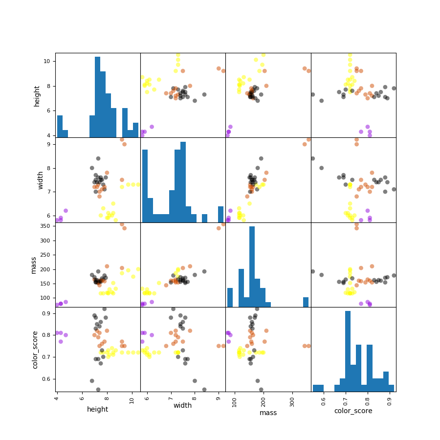
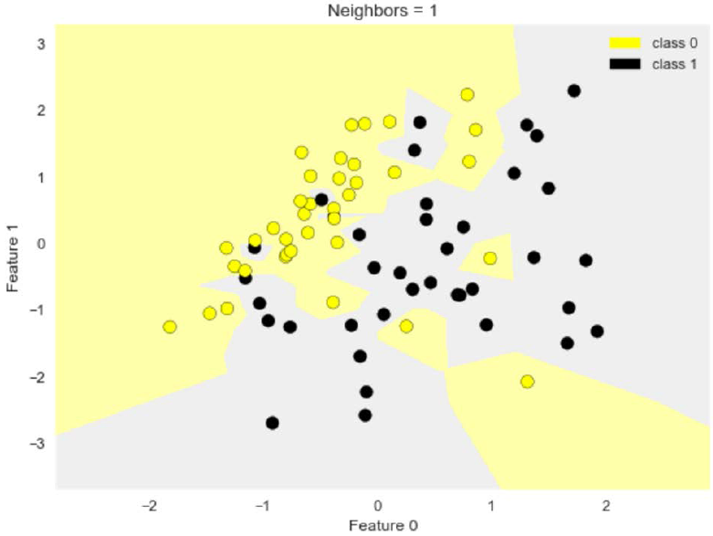
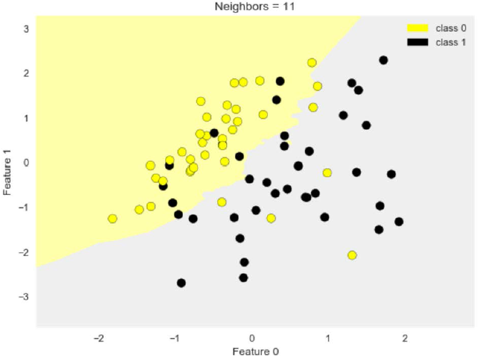

# Module 2: [Supervised Machine Learning](./02-Supervised1.md)

## Module 2 Notebook

+ [Launching Web Page](https://www.coursera.org/learn/python-machine-learning/notebook/7u2va/module-2-notebook)
+ [Web Notebook](https://hub.coursera-notebooks.org/hub/coursera_login?token=n1itCiowSXKYrQoqMPly9A&next=%2Fnotebooks%2FModule%25202.ipynb)
+ [Local Notebook](notebooks/Module02.ipynb)
+ [Local Python Code](notebooks/Module02.py)


## Introduction to Supervised Machine Learning

+ Learning objectives
    + Understand how a number of different supervised learning algorithms learn by estimating their parameters from data to make new predictions.
    + Understand the strengths and weaknesses of particular supervised learning methods.
    + Learn how to apply specific supervised machine learning algorithms in Python with scikit-learn.
    + Learn about general principles of supervised machine learning, like overfitting and how to avoid it.

+ Review of important terms
    + Feature representation, e.g. `mass`, `width`, `height`, `color_score`
    + Data instances/samples/examples (X); i.e., rows, e.g. row(0) = `| 1 | 0 | 1 | apple | granny_smith | 192 | 8.4 | 7.3 | 0.55 |`, row(2) = `| 3 | 2 | 1 | apple | granny_smith | 176 | 7.4 | 7.2 | 0.60 |`; in Python `X` represent the set of features, e.g., row(0) = `| 192 | 8.4 | 7.3 | 0.55 |`
    + Target value (y), e.g., label = `fruit_label`, `fruit_name` & `fruit_subtype`: only for labeling purpose as more readable for humans
    + Training and test sets: using `train_test_split` function from `sklearn.model_selection` module, default as $75\%:25\%$, e.g., `X_train, X_test, y_train, y_test = train_test_split(X_fruits, y_fruits, random_state=0)`
    + Model/Estimator
        + Model fitting produces a 'trained model'
        + Training is the process of estimating model parameters
        + Example
            ```python
            # estimator/model - Classifier selection
            knn = KNeighborsClassifier(n_neighbors = 5)
            # model fit - training to get model parameters with given training data set
            knn.fit(X_train_scaled, y_train)
            # Apply model to predict a given instance
            knn.predict(example_fruit_scaled)
            ```
    + Evaluation method
        ```python
        # accuracy of the model
        knn.score(X_test_scaled, y_test)
        ```
    + Example - Table terminologies
        |   | fruit_label | fruit_name | fruit_subtype | mass | width | height | color_score |
        |---|-------------|------------|---------------|------|-------|--------|-------------|
        | 0 | 0 | 1 | apple | granny_smith | 192 | 8.4 | 7.3 | 0.55 |
        | 1 | 1 | 1 | apple | granny_smith | 180 | 8.0 | 6.8 | 0.59 |
        | 2 | 2 | 1 | apple | granny_smith | 176 | 7.4 | 7.2 | 0.60 |
        | 3 | 3 | 2 | mandarin | mandarin | 86 | 6.2 | 4.7 | 0.80 |
        | 4 | 4 | 2 | mandarin | mandarin | 84 | 6.0 | 4.6 | 0.79 |

+ Classification and Regression
    + Both classificationa dn regression take a set of training instances and learn a mapping to a __target value__.
    + For classification, the target value is a _discrete_ class value
        + Binary: target value = $0$ (negative class) or $1$ (positive class), e.g., detecting a fraudulent credit card transaction
        + Multi-class: target value is one of a set of discrete values, e.g., labelling the type of fruit from physical attributes
        + Multi-label: there are multiple target values (labels), e.g., labelling the topics discussed ion a Web page
    + For regression, that target value is _continuous_ (floating point/real-value), e.g., predicting the selling price of house from its attributes
    + Looking at the target value's type will guide you on what supervised learning method to use
    + Many supervised learning methods have 'flavors' for both classification and regression

+ Supervised learning methods: Overview
    + To start with, we'll look at two simple but powerful prediction algorithms
        + K-nearest neighbors (review from week 1, plus regression)
        + Linear model fit using least-squares
    + These represent two complementary approaches to supervised learning
        + K-nearest neighbors makes few assumptions about the structure of the data and gives potentially accurate but sometimes unstable predictions (sensitive to small changes in the training data)
        + Linear models make strong assumptions about structure of the data and give stable but potentially inaccurate predictions
    + Other models: decision trees, kernelized supported vector machines (SVM) and neural networks

+ The relationship between model complexity and training/test performance
    <a href="https://datascience.stackexchange.com/questions/33720/i-am-trying-to-make-a-classifier-using-machine-learning-to-detect-malwares-am-i">
        <br/>
    </a>

+ Models and Variables
    + Model: a specific mathematical or computational description that express the relationship between a set of input variables and one or more outcome variables that are being studied or predicted
    + Statistics: input variables = independent variables; output variable = dependent variables
    + Machine learning: input variables = features; output variables = target values / target labels
    + Unsupervised learning models used to understand and explore the structure within a given dataset
    + Supervised learning used to develop predict models that can accurately predict the outcomes, target values/target labels


### Lecture Video

<a href="https://d3c33hcgiwev3.cloudfront.net/tPIu3lzrEeeQywpoSy5QrA.processed/full/360p/index.mp4?Expires=1536278400&Signature=QJpYlD0vOtufdV2wDh49dA7eMIu7XUHPJLOoxIwvPDpcsGrjhSZvac1dgTn0dD1UpdLkCkcYtUqBvOKklUEfMDAkMnp8Sz4vKiLHVSnAcKQ96B0xhfpMG3KORoWOo7i3~XcRC5oDpYNN-P-B35xYGJsPDyAEkpEi2oFbEuCCnOw_&Key-Pair-Id=APKAJLTNE6QMUY6HBC5A" alt="Introduction to Supervised Machine Learning" target="_blank">
     
</a>


## Overfitting and Underfitting

+ Generalization, Overfitting, and Underfitting
    + __Generalization ability__ refers to an algorithm's ability to give accurate predictions for new, previously unseen data.
    + Assumptions:
        + Future unseen data (test set) will have the _same properties_c as the current training sets.
        + Thus, models that are accurate on the training set are expected to be accurate on the test set.
        + But that may not happen if the trained model is tuned too specifically to the training set.
    + Models that are too complex for the amount of training data available are said to __overfit__ and are not likely to generalize well to new examples.
    + Models that are too simple, that don't even do well on the training data, are said to __underfit__ and also not likely to generalize well.
    + Not enough training data to constraint the mode to respect these global trends -> Training set accuracy is a hopelessly optimistic indicator for likely test set accuracy if the mode is overfitting
    + Understanding, detecting, and avoiding overfitting is perhaps the most important aspect of applying supervised machine learning algorithms

+ Overfitting vs. Underfitting in Regression
    <a href="http://scikit-learn.org/stable/auto_examples/model_selection/plot_underfitting_overfitting.html">
        <br/>
    </a>

+ Underfitting and Overfitting in Classification
    <a href="https://www.safaribooksonline.com/library/view/deep-learning/9781491924570/ch01.html">
        <br/>
    </a>

+ Overfitting with k-NN classifiers
    <a href="https://www.coursera.org/learn/python-machine-learning/lecture/fVStr/overfitting-and-underfitting">
        <br/>
    </a>

### Lecture Video

<a href="https://d3c33hcgiwev3.cloudfront.net/Ygb0LT7yEee4_A7ezGAgwg.processed/full/360p/index.mp4?Expires=1536278400&Signature=agNy6H49Wn~dvZEbWoshbc1ODtxp160Y6PadOwWaOHgBJh6yBCSZyVuGCHco4TZ0HBsmDF6KMEX45tR8baj8o~pbe8JoLkQangbEwbpbFAWP4uDVtK0BqOYHS1Yj6EZJYtBM~ULx3I~x9Ns~yP8bmBPqz3odlskrWf6bCdnayis_&Key-Pair-Id=APKAJLTNE6QMUY6HBC5A" alt="Overfitting and Underfitting" target="_blank">
     
</a>


## Supervised Learning: Datasets

+ Simple Regression Dataset
    <a href="https://docs.microsoft.com/en-us/azure/machine-learning/studio/algorithm-choice">
        <br/>
    </a> 
    + Demo
        ```python
        cmap_bold = ListedColormap(['#FFFF00', '#00FF00', '#0000FF', '#000000'])

        fruits = pd.read_table('fruit_data_with_colors.txt')

        feature_names_fruits = ['height', 'width', 'mass', 'color_score']
        X_fruits = fruits[feature_name_fruits]
        y_fruits = fruits['fruit_label']
        target_names_fruits = ['apple', 'mandarin', 'orange', 'lemon']

        X_fruits_2d = fruits['height', 'width']
        y_fruits_2d = fruits['fruit_label']

        from sklearn.datasets import make_regression
        plt.figure()
        plt.title('Sample regression problem with one input variable')
        X_R1, y_R1 = make_regression(n_samples=100, n_features=1, 
            n_informative=1, bias=150.0, noise=30, random_state=0)
        plt.scatter(X_R1, y_R1, marker='o', s=50)
        plt.show()
        ```

+ Simple Binary Classification Dataset
    <a href="https://blogs.sas.com/content/iml/2017/07/17/prediction-regions-classification.html">
        <br/>
    </a>
    + Demo
        ```python
        from sklearn.datasets import make_friedman1
        plt.figure()
        plt.title('Complex regression problem with one input variable')
        X_F1, y_F1 = make_friedman1(n_samples=100, n_features=7, random_state=0)

        plt.scatter(X_F1[:, 2], y_F1, marker='o', s=50)
        plt.show()
        plt.figure()
        plt.title('Sample binary classification problem with two informative features')
        X_C2, y_C2 = make_classification(
            n_samples=100, n_features=2, n_redundant=2, n_informative=1, 
            n_clusters_per_class=1, flip_y=0.1, classs_sep=0.5, random_state=0
        )
        ```

+ Complex Binary Classification Dataset
    <a href="https://towardsdatascience.com/applied-deep-learning-part-1-artificial-neural-networks-d7834f67a4f6">
        <br/>
    </a>
    + Demo
        ```python
        X_D2, y_D2 = make_blobs(N-samples=100, n_features=2,
            cenetrs=8, cluster_std=1.3, random_state=0)
        y_D2 = y_D2 % 2
        plt.figure()
        plt.title('Sample binary classification problem with non-linear separable classes')
        plt.scatter(X_D2[:, 0], X_D2[:, 1], c=y_D2,
                    marker='o', s=50, camp_camp_bold)
        plt.show()

        cancer = load_breast_cancer()
        (X_cancer, y_cancer) = load_breast_cancer(return_X_y = True)

        (X_crime, y_crime) = load_crime_dataset()
        ```
 
+ Fruit Multi-class Classification Dataset  
    <a href="https://www.coursera.org/learn/python-machine-learning/lecture/71PMP/supervised-learning-datasets">
        
    </a>
    + Features: width, height, mass, color_score
    + Classes: 0: apple; 1: mandarin orange; 2: orange; 3: lemon
    

+ Supervised Learning: Datasets
    <a href="https://www.coursera.org/learn/python-machine-learning/lecture/71PMP/supervised-learning-datasets">
        <br/>
    </a>
    + Input features: socio-economic data by location from U.S. Census
    + Target variable: Per capita violent crimes
    + Derived from the original UCI dataset at: https://archive.ics.uci.edu/ml/datasets/Communities+and+Crime+Unnormalized
    + Import Python code
        ```python
        from adspy_shared_utilities import load_crime_dataset
        crime = load_crime_dataset()
        ```


    <a href="url">
        <br/>
    </a>

### Lecture Video

<a href="https://d3c33hcgiwev3.cloudfront.net/9W-NIzzCEeeW0g5QrK3QnA.processed/full/360p/index.mp4?Expires=1536278400&Signature=hiR0kqhBB1RBP4F4Sxe0W9i2CMCQrKugrV0J15f1npMuvmTGJVy96VvZtirnb-iUzkMWtptbFLwg-R73k6Gizk8tb7G0bgFIkht1U5IGPiHEJvmVbFYtg1HK2apYvQqWd1xoYvl2zKvo2tAIiUKeqRyvhKE09jxODtXz3ofpfWk_&Key-Pair-Id=APKAJLTNE6QMUY6HBC5A" alt="Supervised Learning: Datasets" target="_blank">
     
</a>


## K-Nearest Neighbors: Classification and Regression

+ The k-Nearest Neighbor (k-NN) Classifier Algorithm <br/>
    Given a training set `X_train` with labels `y_train`, and given a new instance `x_test` to be classified:
    1. Find the most similar instances (let's call them `X_NN`) to `x_test` that are in `X_train`.
    2. Get the labels `y_NN` for the instances in `X_NN`
    3. Predict the label for `x_test` by combining the labels `y_NN` e.g. simple majority vote

+ Nearest Neighbors Classification (k=1 & 11)
    <a href="https://www.coursera.org/learn/python-machine-learning/lecture/I1cfu/k-nearest-neighbors-classification-and-regression">
        <br/>
    </a>
    <a href="https://www.coursera.org/learn/python-machine-learning/lecture/I1cfu/k-nearest-neighbors-classification-and-regression">
        
    </a>
    + K = 1: variant decision boundary; high model complexity; overfitting
    + K = 11: smoother decision boundary; lower model complexity; underfitting (?)
    + Python code
        ```python
        from adspy_shared_utilities import plot_two_class_knn

        X_train, X_test, y_train, y_test = train_test_split(X_C2, y_C2, random_state=0)
        
        plot_two_class_knn(X_train, y_train, 1, 'uniform', X_test, y_test)
        # scores: training = 1.00, test = 0.80
        plot_two_class_knn(X_train, y_train, 3, 'uniform', X_test, y_test)
        # scores: training = 0.88, test = 0.88
        plot_two_class_knn(X_train, y_train, 11, 'uniform', X_test, y_test)
        # scores: training = 0.61, test = 0.92
        ```

+ k-Nearest Neighbors Regression
    <a href="https://www.coursera.org/learn/python-machine-learning/lecture/I1cfu/k-nearest-neighbors-classification-and-regression">
        <br/>
    </a>
    + Diagrams: original, k = 1, k = 3
    + Green dot = training point; blue triangle = test point
    + For k=1, $\text{x_test} = -0.6$ and the nearest point is $(-0.5, 105)$, therefore, $\text{predict} = 105$
    + For k=3, $\text{x_test} = -1.25$ and 3 nearest points $(-1.6, 55)$, $(-1.4, 90)$, and $(-0.9, 90)$, $\text{predict} = (55+90+90)/3$
    + Demo
        ```python
        from sklearn.neighbors import KNeighborsRegressor

        X_train, X_test, y_train, y_test = train_test_split(X_R1, y_R1, random_state=0)

        knnreg = KNeighborsRegressor(n_neighbors=5).fit(X_train, y_train)

        print(knnreg.predict(X_test))
        print(('R-squared test score: {:.3f}'
            .format(knnreg.score(X_test, y_test))))
        # [ 231.71  148.36  150.59  150.59   72.15  166.51  141.91  235.57  208.26
        #   102.1   191.32  134.5   228.32  148.36  159.17  113.47  144.04  199.23
        #   143.19  166.51  132.71  208.26  128.02  123.14  141.91]
        # R-suqared test score: 0.425
        ```

+ The $R^2$ ("r-squared") Regression Score
    + Measures how well a prediction model for regression fits the given data.
    + The score is between $0$ and $1$:
        + A value of $0$ corresponds to a constant model that predicts the mean value of all training target values.
        + A value of $1$ corresponds to perfect prediction
    + Also known as "__coefficient of determination__"
    + Demo - Regression model complexity as a function of K
        ```python
        fig, subaxes = plt.subplots(5, 1, figsize=(5, 20))
        X_predict_input = np.linspace(-3, 3, 500).reshape(-1, 1)
        X_train, X_test, y_train, y_test = train_test_split(X_R1, y_R1, random_state=0)

        for thisaxis, k in zip(subaxes, [1, 3, 7, 15, 55]):
            knnreg = KNeighborsRegressor(n_neighbors=K).fit(X_train, y_train)
            y_predict_output = knnreg.predict(X_predict_input)
            train_score = knnreg.score(X_train, y_train)
            test_score = knnreg.score(X_test, y_test)
            thisaxis.plot(X_predict_input, y_predict_output)
            thisaxes.plot(X_train, y_train, 'o', alpha=0.9, label='Train')
            thisaxes.plot(X_test, y_test, '^', alpha=0.9, label='Test')
            thisaxes.set_xlabel('Input feature')
            thisaxes.set_ylabel('Tragte value')
            thisaxes.set_title('KNN Regression (K={})\nTrain $R^2 = {:.3f}$,  Test $R^2 = {:.3f}$'
                .format(K, train_score, test_score))
            thisaxes.legend()
            plt.tight_layout(pad=0.4, w_pad=0.5, h_pad=1.0)
        ```

+ KNeighborsClassifierand KNeighborsRegressor: important parameters

    + Model complexity
        + `n_neighbors`: number of nearest neighbors ($k$) to consider: Default = 5
    + Model fitting
        + `metric`: distance function between data points: Default: Minkowski distance with power parameter p = 2 (Euclidean)


    <a href="url">
        <br/>
    </a>


### Lecture Video 

<a href="https://d3c33hcgiwev3.cloudfront.net/qdyBZzy_Eee_fhKOKKDDtA.processed/full/360p/index.mp4?Expires=1536278400&Signature=MnTBLit6pHuRL1oyKq6YuXJHdS3iZdP6W52ounY5OQSLlNiXdEMzoHn~6P7u-uTPi~oQosRPFPnH8MkfeSV~gr91Xtbnt3Xl8Dy-OuynwnqX197xvbtVp7kebdjHiohYSMmwBKw-sFUfKb6q-TskZyX-p3yiYdeYYL66QKojfbw_&Key-Pair-Id=APKAJLTNE6QMUY6HBC5A" alt="K-Nearest Neighbors: Classification and Regression" target="_blank">
     
</a>


## Linear Regression: Least-Squares


<a href="url">
    <br/>
</a>

<a href="url" alt="text" target="_blank">
     
</a>


## Linear Regression: Ridge, Lasso, and Polynomial Regression


<a href="url">
    <br/>
</a>

<a href="url" alt="text" target="_blank">
     
</a>


## Logistic Regression


<a href="url">
    <br/>
</a>

<a href="url" alt="text" target="_blank">
     
</a>


## Linear Classifiers: Support Vector Machines


<a href="url">
    <br/>
</a>

<a href="url" alt="text" target="_blank">
     
</a>


## Multi-Class Classification


<a href="url">
    <br/>
</a>

<a href="url" alt="text" target="_blank">
     
</a>


## Kernelized Support Vector Machines


<a href="url">
    <br/>
</a>

<a href="url" alt="text" target="_blank">
     
</a>


## Cross-Validation


<a href="url">
    <br/>
</a>

<a href="url" alt="text" target="_blank">
     
</a>


## Decision Trees


<a href="url">
    <br/>
</a>

<a href="url" alt="text" target="_blank">
     
</a>


## A Few Useful Things to Know about Machine Learning


<a href="url">
    <br/>
</a>

<a href="url" alt="text" target="_blank">
     
</a>


## Ed Yong: Genetic Test for Autism Refuted (optional)


<a href="url">
    <br/>
</a>

<a href="url" alt="text" target="_blank">
     
</a>


## Quiz: Module 2 Quiz


<a href="url">
    <br/>
</a>

<a href="url" alt="text" target="_blank">
     
</a>


## Classifier Visualization Playspace


<a href="url">
    <br/>
</a>

<a href="url" alt="text" target="_blank">
     
</a>

