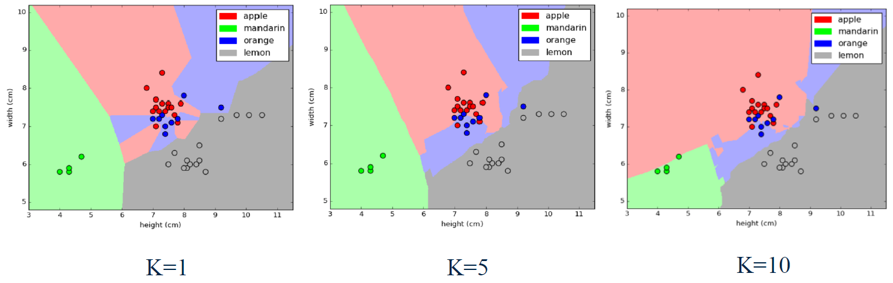

# Module 2: [Supervised Machine Learning](./02-Supervised1.md)

## Module 2 Notebook

+ [Launching Web Page](https://www.coursera.org/learn/python-machine-learning/notebook/7u2va/module-2-notebook)
+ [Web Notebook](https://hub.coursera-notebooks.org/hub/coursera_login?token=n1itCiowSXKYrQoqMPly9A&next=%2Fnotebooks%2FModule%25202.ipynb)
+ [Local Notebook](notebooks/Module02.ipynb)
+ [Local Python Code](notebooks/Module02.py)


## Introduction to Supervised Machine Learning

+ Learning objectives
    + Understand how a number of different supervised learning algorithms learn by estimating their parameters from data to make new predictions.
    + Understand the strengths and weaknesses of particular supervised learning methods.
    + Learn how to apply specific supervised machine learning algorithms in Python with scikit-learn.
    + Learn about general principles of supervised machine learning, like overfitting and how to avoid it.

+ Review of important terms
    + Feature representation, e.g. `mass`, `width`, `height`, `color_score`
    + Data instances/samples/examples (X); i.e., rows, e.g. row(0) = `| 1 | 0 | 1 | apple | granny_smith | 192 | 8.4 | 7.3 | 0.55 |`, row(2) = `| 3 | 2 | 1 | apple | granny_smith | 176 | 7.4 | 7.2 | 0.60 |`; in Python `X` represent the set of features, e.g., row(0) = `| 192 | 8.4 | 7.3 | 0.55 |`
    + Target value (y), e.g., label = `fruit_label`, `fruit_name` & `fruit_subtype`: only for labeling purpose as more readable for humans
    + Training and test sets: using `train_test_split` function from `sklearn.model_selection` module, default as $75\%:25\%$, e.g., `X_train, X_test, y_train, y_test = train_test_split(X_fruits, y_fruits, random_state=0)`
    + Model/Estimator
        + Model fitting produces a 'trained model'
        + Training is the process of estimating model parameters
        + Demo
            ```python
            # estimator/model - Classifier selection
            knn = KNeighborsClassifier(n_neighbors = 5)
            # model fit - training to get model parameters with given training data set
            knn.fit(X_train_scaled, y_train)
            # Apply model to predict a given instance
            knn.predict(example_fruit_scaled)
            ```
    + Evaluation method
        ```python
        # accuracy of the model
        knn.score(X_test_scaled, y_test)
        ```
    + Example - Table terminologies
        |   | fruit_label | fruit_name | fruit_subtype | mass | width | height | color_score |
        |---|-------------|------------|---------------|------|-------|--------|-------------|
        | 0 | 0 | 1 | apple | granny_smith | 192 | 8.4 | 7.3 | 0.55 |
        | 1 | 1 | 1 | apple | granny_smith | 180 | 8.0 | 6.8 | 0.59 |
        | 2 | 2 | 1 | apple | granny_smith | 176 | 7.4 | 7.2 | 0.60 |
        | 3 | 3 | 2 | mandarin | mandarin | 86 | 6.2 | 4.7 | 0.80 |
        | 4 | 4 | 2 | mandarin | mandarin | 84 | 6.0 | 4.6 | 0.79 |

+ Classification and Regression
    + Both classification and regression take a set of training instances and learn a mapping to a __target value__.
    + For classification, the target value is a _discrete_ class value
        + Binary: target value = $0$ (negative class) or $1$ (positive class), e.g., detecting a fraudulent credit card transaction
        + Multi-class: target value is one of a set of discrete values, e.g., labelling the type of fruit from physical attributes
        + Multi-label: there are multiple target values (labels), e.g., labelling the topics discussed ion a Web page
    + For regression, that target value is _continuous_ (floating point/real-value), e.g., predicting the selling price of house from its attributes
    + Looking at the target value's type will guide you on what supervised learning method to use
    + Many supervised learning methods have 'flavors' for both classification and regression

+ Supervised learning methods: Overview
    + To start with, we'll look at two simple but powerful prediction algorithms
        + K-nearest neighbors (review from week 1, plus regression)
        + Linear model fit using least-squares
    + These represent two complementary approaches to supervised learning
        + K-nearest neighbors makes few assumptions about the structure of the data and gives potentially accurate but sometimes unstable predictions (sensitive to small changes in the training data)
        + Linear models make strong assumptions about structure of the data and give stable but potentially inaccurate predictions
    

+ Supervised learning methods: Overview
    + To start with, we'll look at two simple but powerful prediction algorithms:
        + K-nearest neighbors (review from week 1, plus regression)
        + Linear model fit using least-squares
    + These represent two complementary approaches to supervised learning:
        + K-nearest neighbors makes few assumptions about the structure of the data and gives potentially accurate but sometimes unstable predictions (sensitive to small changes in the training data).
        + Linear models make strong assumptions about the structure of the data and give stable but potentially inaccurate predictions.
    + We'll cover a number of widely-used supervised learning methods for classification and regression.
    + For each supervised learning method we'll explore:
        + How the method works conceptually at a high level.
        + What kind of feature preprocessing is typically needed.
        + Key parameters that control model complexity, to avoid under-and over-fitting.
        + Positives and negatives of the learning method.
    + Other models: decision trees, kernelized supported vector machines (SVM) and neural networks

+ The relationship between model complexity and training/test performance
    <a href="https://datascience.stackexchange.com/questions/33720/i-am-trying-to-make-a-classifier-using-machine-learning-to-detect-malwares-am-i">
        <br/>
    </a>
        <a href="https://www.coursera.org/learn/python-machine-learning/lecture/EiQjD/linear-regression-least-squares">
        
    </a>

+ Models and Variables
    + Model: a specific mathematical or computational description that express the relationship between a set of input variables and one or more outcome variables that are being studied or predicted
    + Statistics: input variables = independent variables; output variable = dependent variables
    + Machine learning: input variables = features; output variables = target values / target labels
    + Unsupervised learning models used to understand and explore the structure within a given dataset
    + Supervised learning used to develop predict models that can accurately predict the outcomes, target values/target labels

+ Demo: Preamble and Review
    ```python
    %matplotlib notebook
    import numpy as np
    import pandas as pd
    import seaborn as sn
    import matplotlib.pyplot as plt

    from sklearn.model_selection import train_test_split
    from sklearn.neighbors import KNeighborsClassifier

    np.set_printoptions(precision=2)


    fruits = pd.read_table('fruit_data_with_colors.txt')

    feature_names_fruits = ['height', 'width', 'mass', 'color_score']
    X_fruits = fruits[feature_names_fruits]
    y_fruits = fruits['fruit_label']
    target_names_fruits = ['apple', 'mandarin', 'orange', 'lemon']

    X_fruits_2d = fruits[['height', 'width']]
    y_fruits_2d = fruits['fruit_label']

    X_train, X_test, y_train, y_test = \
        train_test_split(X_fruits, y_fruits, random_state=0)

    from sklearn.preprocessing import MinMaxScaler
    scaler = MinMaxScaler()
    X_train_scaled = scaler.fit_transform(X_train)
    # we must apply the scaling to the test set that we computed for the training set
    X_test_scaled = scaler.transform(X_test)

    knn = KNeighborsClassifier(n_neighbors = 5)
    knn.fit(X_train_scaled, y_train)
    print('Accuracy of K-NN classifier on training set: {:.2f}'
        .format(knn.score(X_train_scaled, y_train)))
    print('Accuracy of K-NN classifier on test set: {:.2f}'
        .format(knn.score(X_test_scaled, y_test)))

    example_fruit = [[5.5, 2.2, 10, 0.70]]
    example_fruit_scaled = scaler.transform(example_fruit)
    print('Predicted fruit type for ', example_fruit, ' is ', 
            target_names_fruits[knn.predict(example_fruit_scaled)[0]-1])
    # Accuracy of K-NN classifier on training set: 0.95
    # Accuracy of K-NN classifier on test set: 1.00
    # Predicted fruit type for  [[5.5, 2.2, 10, 0.7]]  is  mandarin
    ```

### Lecture Video

<a href="https://d3c33hcgiwev3.cloudfront.net/tPIu3lzrEeeQywpoSy5QrA.processed/full/360p/index.mp4?Expires=1536278400&Signature=QJpYlD0vOtufdV2wDh49dA7eMIu7XUHPJLOoxIwvPDpcsGrjhSZvac1dgTn0dD1UpdLkCkcYtUqBvOKklUEfMDAkMnp8Sz4vKiLHVSnAcKQ96B0xhfpMG3KORoWOo7i3~XcRC5oDpYNN-P-B35xYGJsPDyAEkpEi2oFbEuCCnOw_&Key-Pair-Id=APKAJLTNE6QMUY6HBC5A" alt="Introduction to Supervised Machine Learning" target="_blank">
     
</a>


## Overfitting and Underfitting

+ Generalization, Overfitting, and Underfitting
    + __Generalization ability__ refers to an algorithm's ability to give accurate predictions for new, previously unseen data.
    + Assumptions:
        + Future unseen data (test set) will have the _same properties_c as the current training sets.
        + Thus, models that are accurate on the training set are expected to be accurate on the test set.
        + But that may not happen if the trained model is tuned too specifically to the training set.
    + Models that are too complex for the amount of training data available are said to __overfit__ and are not likely to generalize well to new examples.
    + Models that are too simple, that don't even do well on the training data, are said to __underfit__ and also not likely to generalize well.
    + Not enough training data to constraint the mode to respect these global trends -> Training set accuracy is a hopelessly optimistic indicator for likely test set accuracy if the mode is overfitting
    + Understanding, detecting, and avoiding overfitting is perhaps the most important aspect of applying supervised machine learning algorithms

+ Overfitting vs. Underfitting in Regression
    <a href="http://scikit-learn.org/stable/auto_examples/model_selection/plot_underfitting_overfitting.html">
        <br/>
    </a>

+ Underfitting and Overfitting in Classification
    <a href="https://www.safaribooksonline.com/library/view/deep-learning/9781491924570/ch01.html">
        <br/>
    </a>

+ Overfitting with k-NN classifiers
    <a href="https://www.coursera.org/learn/python-machine-learning/lecture/fVStr/overfitting-and-underfitting">
        <br/>
    </a>

### Lecture Video

<a href="https://d3c33hcgiwev3.cloudfront.net/Ygb0LT7yEee4_A7ezGAgwg.processed/full/360p/index.mp4?Expires=1536278400&Signature=agNy6H49Wn~dvZEbWoshbc1ODtxp160Y6PadOwWaOHgBJh6yBCSZyVuGCHco4TZ0HBsmDF6KMEX45tR8baj8o~pbe8JoLkQangbEwbpbFAWP4uDVtK0BqOYHS1Yj6EZJYtBM~ULx3I~x9Ns~yP8bmBPqz3odlskrWf6bCdnayis_&Key-Pair-Id=APKAJLTNE6QMUY6HBC5A" alt="Overfitting and Underfitting" target="_blank">
     
</a>


## Supervised Learning: Datasets

+ Simple Regression Dataset
    + Demo - Dataset
        ```python
        from sklearn.datasets import make_classification, make_blobs
        from matplotlib.colors import ListedColormap
        from sklearn.datasets import load_breast_cancer
        from adspy_shared_utilities import load_crime_dataset

        cmap_bold = ListedColormap(['#FFFF00', '#00FF00', '#0000FF','#000000'])

        # synthetic dataset for simple regression
        from sklearn.datasets import make_regression
        plt.figure()
        plt.title('Sample regression problem with one input variable')
        X_R1, y_R1 = make_regression(
            n_samples = 100, n_features=1, n_informative=1, 
            bias = 150.0, noise = 30, random_state=0)
        plt.scatter(X_R1, y_R1, marker= 'o', s=50)
        plt.show()

        # synthetic dataset for more complex regression
        from sklearn.datasets import make_friedman1
        plt.figure()
        plt.title('Complex regression problem with one input variable')
        X_F1, y_F1 = make_friedman1(
            n_samples = 100, n_features = 7, random_state=0)

        plt.scatter(X_F1[:, 2], y_F1, marker= 'o', s=50)
        plt.show()
        ```
    &nbsp;&nbsp;&nbsp;&nbsp;
    


+ Simple Binary Classification Dataset
    + Demo
        ```python
        # synthetic dataset for classification (binary) 
        plt.figure()
        plt.title('Sample binary classification problem with two informative features')
        X_C2, y_C2 = make_classification(
            n_samples = 100, n_features=2, n_redundant=0, n_informative=2,
            n_clusters_per_class=1, flip_y = 0.1, class_sep = 0.5, random_state=0)
        plt.scatter(X_C2[:, 0], X_C2[:, 1], c=y_C2,
                marker= 'o', s=50, cmap=cmap_bold)
        plt.show()
        ```
    

+ Complex Binary Classification Dataset
    + Demo
        ```python
        # more difficult synthetic dataset for classification (binary) 
        # with classes that are not linearly separable
        X_D2, y_D2 = make_blobs(n_samples = 100, n_features = 2, centers = 8,
                            cluster_std = 1.3, random_state = 4)
        y_D2 = y_D2 % 2
        plt.figure()
        plt.title('Sample binary classification problem with non-linearly separable classes')
        plt.scatter(X_D2[:,0], X_D2[:,1], c=y_D2,
                marker= 'o', s=50, cmap=cmap_bold)
        plt.show()

        # Breast cancer dataset for classification
        cancer = load_breast_cancer()
        (X_cancer, y_cancer) = load_breast_cancer(return_X_y = True)

        # Communities and Crime dataset
        (X_crime, y_crime) = load_crime_dataset()
        ```
    
 
+ Fruit Multi-class Classification Dataset  
    <a href="https://www.coursera.org/learn/python-machine-learning/lecture/71PMP/supervised-learning-datasets">
        
    </a>
    + Features: width, height, mass, color_score
    + Classes: 0: apple; 1: mandarin orange; 2: orange; 3: lemon
    

+ Supervised Learning: Datasets
    <a href="https://www.coursera.org/learn/python-machine-learning/lecture/71PMP/supervised-learning-datasets">
        <br/>
    </a>
    + Input features: socio-economic data by location from U.S. Census
    + Target variable: Per capita violent crimes
    + Derived from the original UCI dataset at: https://archive.ics.uci.edu/ml/datasets/Communities+and+Crime+Unnormalized
    + Import Python code
        ```python
        from adspy_shared_utilities import load_crime_dataset
        crime = load_crime_dataset()
        ```

### Lecture Video

<a href="https://d3c33hcgiwev3.cloudfront.net/9W-NIzzCEeeW0g5QrK3QnA.processed/full/360p/index.mp4?Expires=1536278400&Signature=hiR0kqhBB1RBP4F4Sxe0W9i2CMCQrKugrV0J15f1npMuvmTGJVy96VvZtirnb-iUzkMWtptbFLwg-R73k6Gizk8tb7G0bgFIkht1U5IGPiHEJvmVbFYtg1HK2apYvQqWd1xoYvl2zKvo2tAIiUKeqRyvhKE09jxODtXz3ofpfWk_&Key-Pair-Id=APKAJLTNE6QMUY6HBC5A" alt="Supervised Learning: Datasets" target="_blank">
     
</a>


## K-Nearest Neighbors: Classification and Regression

+ The k-Nearest Neighbor (k-NN) Classifier Algorithm <br/>
    Given a training set `X_train` with labels `y_train`, and given a new instance `x_test` to be classified:
    1. Find the most similar instances (let's call them `X_NN`) to `x_test` that are in `X_train`.
    2. Get the labels `y_NN` for the instances in `X_NN`
    3. Predict the label for `x_test` by combining the labels `y_NN` e.g. simple majority vote

+ Nearest Neighbors Classification (k=1 & 11)
    + K = 1: variant decision boundary; high model complexity; overfitting
    + K = 11: smoother decision boundary; lower model complexity; underfitting (?)
    + Python code
        ```python
        from adspy_shared_utilities import plot_two_class_knn

        X_train, X_test, y_train, y_test = train_test_split(X_C2, y_C2, random_state=0)

        plot_two_class_knn(X_train, y_train, 1, 'uniform', X_test, y_test)
        plot_two_class_knn(X_train, y_train, 3, 'uniform', X_test, y_test)
        plot_two_class_knn(X_train, y_train, 11, 'uniform', X_test, y_test)
        ```
    
    
    

+ k-Nearest Neighbors Regression
    <a href="https://www.coursera.org/learn/python-machine-learning/lecture/I1cfu/k-nearest-neighbors-classification-and-regression">
        <br/>
    </a>
    + Diagrams: original, k = 1, k = 3
    + Green dot = training point; blue triangle = test point
    + For k=1, $\text{x_test} = -0.6$ and the nearest point is $(-0.5, 105)$, therefore, $\text{predict} = 105$
    + For k=3, $\text{x_test} = -1.25$ and 3 nearest points $(-1.6, 55)$, $(-1.4, 90)$, and $(-0.9, 90)$, $\text{predict} = (55+90+90)/3$
    + Demo
        ```python
        from sklearn.neighbors import KNeighborsRegressor

        X_train, X_test, y_train, y_test = train_test_split(X_R1, y_R1, random_state = 0)

        knnreg = KNeighborsRegressor(n_neighbors = 5).fit(X_train, y_train)

        print(knnreg.predict(X_test))
        print('R-squared test score: {:.3f}'.format(knnreg.score(X_test, y_test)))
        # [ 231.71  148.36  150.59  150.59   72.15  166.51  141.91  235.57  208.26
        #   102.1   191.32  134.5   228.32  148.36  159.17  113.47  144.04  199.23
        #   143.19  166.51  231.71  208.26  128.02  123.14  141.91]
        # R-squared test score: 0.425
        ```

+ The $R^2$ ("r-squared") Regression Score
    + Measures how well a prediction model for regression fits the given data.
    + The score is between $0$ and $1$:
        + A value of $0$ corresponds to a constant model that predicts the mean value of all training target values.
        + A value of $1$ corresponds to perfect prediction
    + Also known as "__coefficient of determination__"
    + Demo - Regression model complexity as a function of K
        ```python
        fig, subaxes = plt.subplots(1, 2, figsize=(8,4))
        X_predict_input = np.linspace(-3, 3, 50).reshape(-1,1)
        X_train, X_test, y_train, y_test = train_test_split(X_R1[0::5], y_R1[0::5], random_state = 0)

        for thisaxis, K in zip(subaxes, [1, 3]):
            knnreg = KNeighborsRegressor(n_neighbors = K).fit(X_train, y_train)
            y_predict_output = knnreg.predict(X_predict_input)
            thisaxis.set_xlim([-2.5, 0.75])
            thisaxis.plot(X_predict_input, y_predict_output, '^', markersize = 10,
                    label='Predicted', alpha=0.8)
            thisaxis.plot(X_train, y_train, 'o', label='True Value', alpha=0.8)
            thisaxis.set_xlabel('Input feature')
            thisaxis.set_ylabel('Target value')
            thisaxis.set_title('KNN regression (K={})'.format(K))
            thisaxis.legend()
        plt.tight_layout()
        ```
    

+ KNeighborsClassifierand KNeighborsRegressor: important parameters

    + Model complexity
        + `n_neighbors`: number of nearest neighbors ($k$) to consider: Default = 5
    + Model fitting
        + `metric`: distance function between data points: Default: Minkowski distance with power parameter p = 2 (Euclidean)

    + Demo: Regression model complexity as a function of K¶
        ```python
        # plot k-NN regression on sample dataset for different values of K
        fig, subaxes = plt.subplots(1, 5, figsize=(20, 5))
        X_predict_input = np.linspace(-3, 3, 500).reshape(-1,1)
        X_train, X_test, y_train, y_test = train_test_split(X_R1, y_R1, random_state = 0)
        for thisaxis, K in zip(subaxes, [1, 3, 7, 15, 55]):
            knnreg = KNeighborsRegressor(n_neighbors = K).fit(X_train, y_train)
            y_predict_output = knnreg.predict(X_predict_input)
            train_score = knnreg.score(X_train, y_train)
            test_score = knnreg.score(X_test, y_test)
            thisaxis.plot(X_predict_input, y_predict_output)
            thisaxis.plot(X_train, y_train, 'o', alpha=0.9, label='Train')
            thisaxis.plot(X_test, y_test, '^', alpha=0.9, label='Test')
            thisaxis.set_xlabel('Input feature')
            thisaxis.set_ylabel('Target value')
            thisaxis.set_title('KNN Regression (K={})\nTrain $R^2 = {:.3f}$,  Test $R^2 = {:.3f}$'
                .format(K, train_score, test_score))
            thisaxis.legend()
            plt.tight_layout(pad=0.4, w_pad=0.5, h_pad=1.0)
        ```
    


### Lecture Video 

<a href="https://d3c33hcgiwev3.cloudfront.net/qdyBZzy_Eee_fhKOKKDDtA.processed/full/360p/index.mp4?Expires=1536278400&Signature=MnTBLit6pHuRL1oyKq6YuXJHdS3iZdP6W52ounY5OQSLlNiXdEMzoHn~6P7u-uTPi~oQosRPFPnH8MkfeSV~gr91Xtbnt3Xl8Dy-OuynwnqX197xvbtVp7kebdjHiohYSMmwBKw-sFUfKb6q-TskZyX-p3yiYdeYYL66QKojfbw_&Key-Pair-Id=APKAJLTNE6QMUY6HBC5A" alt="K-Nearest Neighbors: Classification and Regression" target="_blank">
     
</a>


## Linear Regression: Least-Squares

+ Linear Models
    + A linear model is a sum of weighted variablesthat predicts a target output value given an input data instance. 
    + Example: predicting housing prices
        + House features: taxes per year ($X_{TAX}$), age in years ($X_{AGE}$)

            $$\hat{Y_{PRICE}} = 21200 + 109 \cdot X_{TAX} - 2000 \cdot X_{AGE}$$ 
        + A house with feature values $(X_{TAX}, X_{AGE})$ of $(10000, 75)$ would have a predicted selling price of:

            $$\hat{Y_{PRICE}} = 21200 + 109 \cdot 1000 - 2000 \cdot 75 = 1,152,000$$

+ Linear Regression is an Example of a Linear Model
    + Input instance - feature vector: $ {\bf x} = (x_0, x_1, \cdots, x_n)$
    + Predict output: $\hat{y} = \hat(w_0) x_0 + \hat{w_1} x_1 + \cdots + \hat{w_n} x_n + b$
    + Parameters to estimate: train parameters or coefficients
        + $\hat{\bf w} = (\hat{w_0}, \hat{w_1}, \cdots , \hat{w_n})$: feature weights/model coefficients
        + $\hat{\bf b}$: constant bias term / intercept
    + Example - house price: $\hat{w_0} = 109$, $x_0$ = tax paid, $\hat{w_1} = -20$, $x_1$ = house age, $\hat{b} = 212,000$

+ A Linear Regression Model with one Variable (Feature)
    + Input instance: ${\bf x} = (x_0)$
    + Predicted output: $\hat{y} = \hat{w_0} x_0 + \hat{b}$
    + Parameters to estimate: $\hat{w_0}$ (slope, $\hat{b}$ (y-intercept)
    <a href="https://www.coursera.org/learn/python-machine-learning/lecture/EiQjD/linear-regression-least-squares">
        <br/>
    </a>

+ Least-Squares Linear Regression("Ordinary least-squares")
    + Finds $w$ and $b$ that minimizes the mean squared error of the linear model: the sum of squared differences between predicted target and actual target values.
    + No parameters to control model complexity.
    <a href="https://rasbt.github.io/mlxtend/user_guide/regressor/LinearRegression/">
        <br/>
    </a>

+ How are Linear Regression Parameters w, bEstimated?
    + Parameters are estimated from training data.
    + There are many different ways to estimate wand b:
        + Different methods correspond to different "fit" criteria and goals and ways to control model complexity.
    + The learning algorithm finds the parameters that optimize an __objective function__, typically to minimize some kind of __loss function__ of the predicted target values vs.actual target values.


+ Least-Squares Linear Regression("Ordinary least-squares")
    + Finds $w$ and $b$ that minimizes the __sum of squared differences(RSS)__ over the training data between predicted target and actual target values.
    + a.k.a. mean squared error of the linear model
    + No parameters to control model complexity.

    $$RSS({\bf w}, b) = \sum^N_{i=1} ({\bf y_i} - ({\bf w \cdot x_i} + b))^2$$

    + Training set target value: ${\bf y_i}$
    + Predicted target value using model: $({\bf w \cdot x_i} + b)$

+ Least-Squares Linear Regression in Scikit-Learn
    + `linreg.coef_`: ${\bf w_0}$
    + `linreg.intercept_`: $b$
    + Underscore denotes a quantity derived from training data, as opposed to a user setting
    + Demo: Linear regression
        ```python
        from sklearn.linear_model import LinearRegression

        X_train, X_test, y_train, y_test = train_test_split(X_R1, y_R1, random_state = 0)
        linreg = LinearRegression().fit(X_train, y_train)

        print('linear model coeff (w): {}'.format(linreg.coef_))
        print('linear model intercept (b): {:.3f}'.format(linreg.intercept_))
        print('R-squared score (training): {:.3f}'.format(linreg.score(X_train, y_train)))
        print('R-squared score (test): {:.3f}'.format(linreg.score(X_test, y_test)))
        # linear model coeff (w): [ 45.71]
        # linear model intercept (b): 148.446
        # R-squared score (training): 0.679
        # R-squared score (test): 0.492
        ```
    + Demo: Linear regression: example plot
        ```python
        plt.figure(figsize=(5,4))
        plt.scatter(X_R1, y_R1, marker= 'o', s=50, alpha=0.8)
        plt.plot(X_R1, linreg.coef_ * X_R1 + linreg.intercept_, 'r-')
        plt.title('Least-squares linear regression')
        plt.xlabel('Feature value (x)')
        plt.ylabel('Target value (y)')
        plt.show()
        ```
    

+ K-NN Regression vs Least-Squares Linear Regression
    <a href="https://www.coursera.org/learn/python-machine-learning/lecture/EiQjD/linear-regression-least-squares">
        <br/>
    </a>

+ Demo: Linear model 
    ```python
    X_train, X_test, y_train, y_test = train_test_split(X_crime, y_crime, random_state = 0)
    linreg = LinearRegression().fit(X_train, y_train)

    print('Crime dataset')
    print('linear model intercept: {}'.format(linreg.intercept_))
    print('linear model coeff:\n{}'.format(linreg.coef_))
    print('R-squared score (training): {:.3f}'.format(linreg.score(X_train, y_train)))
    print('R-squared score (test): {:.3f}'.format(linreg.score(X_test, y_test)))
    # Crime dataset
    # linear model intercept: -1728.1306725806212
    # linear model coeff:
    # [  1.62e-03  -9.43e+01   1.36e+01  -3.13e+01  -8.15e-02  -1.69e+01
    #   -2.43e-03   1.53e+00  -1.39e-02  -7.72e+00   2.28e+01  -5.66e+00
    #    ...        ...        ...          ...         ...      ...
    #    5.97e-01   1.98e+00  -1.36e-01  -1.85e+00]
    # R-squared score (training): 0.673
    # R-squared score (test): 0.496
    ```


### Lecture Video

<a href="https://d3c33hcgiwev3.cloudfront.net/mmfAvlzrEeejtgqYK5OBTg.processed/full/360p/index.mp4?Expires=1536278400&Signature=c5t~aFcm-nbBmSXNiFUsgAp~0t12pE3u-SXSLqQ2-I5lJxWg7xu3g1N6HK18H6RTdYhCKm2WzBbKR70jmLyWki4w87Yn8oxGPot-BXE7e5WSFJLk1~4CnyFJcy5NIuSkyaDoizDCKhxjis-69LMwUOwfIjGbP2NSCAPrxAXgZVQ_&Key-Pair-Id=APKAJLTNE6QMUY6HBC5A" alt="Linear Regression: Least-Squares" target="_blank">
     
</a>


## Linear Regression: Ridge, Lasso, and Polynomial Regression

+ Ridge Regression
    + Ridge regression learns $w$, $b$ using the same least-squares criterion but adds a penalty for large variations in $w$ parameters

        $$ RSS_{RIDGE}({\bf w}, b) = \sum_{i=1}^N ({\bf y_i} - ({\bf w \cdot x_i} + b))^2 + \alpha \sum_{j=1}^p w_j^2$$
        
        where $\alpha \sum_{j=1}^p w_j^2$ is the penalty
    + Once the parameters are learned, the __ridge regression prediction formula__ is the __same__ as ordinary least-squares.
    + The addition of a parameter penalty is called __regularization__. Regularization prevents overfitting by restricting the model, typically to reduce its complexity.
    + Ridge regression uses __L2 regularization__: minimize sum of squares of $w$ entries
    + The influence of the regularization term is controlled by the $\alpha$ parameter.
    + Higher alpha means more regularization and simpler models.
    + Demo: Ridge regression
        ```python
        from sklearn.linear_model import Ridge
        X_train, X_test, y_train, y_test = train_test_split(X_crime, y_crime, random_state = 0)

        linridge = Ridge(alpha=20.0).fit(X_train, y_train)

        print('Crime dataset')
        print('ridge regression linear model intercept: {}'.format(linridge.intercept_))
        print('ridge regression linear model coeff:\n{}'.format(linridge.coef_))
        print('R-squared score (training): {:.3f}'.format(linridge.score(X_train, y_train)))
        print('R-squared score (test): {:.3f}'.format(linridge.score(X_test, y_test)))
        print('Number of non-zero features: {}'.format(np.sum(linridge.coef_ != 0)))
        # Crime dataset
        # ridge regression linear model intercept: -3352.4230358466525
        # ridge regression linear model coeff:
        # [  1.95e-03   2.19e+01   9.56e+00  -3.59e+01   6.36e+00  -1.97e+01
        #   -2.81e-03   1.66e+00  -6.61e-03  -6.95e+00   1.72e+01  -5.63e+00
        #     ...         ...         ...     ...         ...         ...
        #    3.31e-01   3.36e+00   1.61e-01  -2.68e+00]
        # R-squared score (training): 0.671
        # R-squared score (test): 0.494
        # Number of non-zero features: 88
        ```

+ The Need for Feature Normalization
    + Important for some machine learning methods that all features are on the same scale (e.g. faster convergence in learning, more uniform or 'fair' influence for all weights)
        + e.g. regularized regression, k-NN, support vector machines, neural networks, …
    + Can also depend on the data. More on feature engineering later in the course. For now, we do MinMax scaling of the features:
        + For each feature $x_i$: compute the min value $x_i^{MIN}$ and the max value $x_i^{MAX}$ achieved across all instances in the training set.
        + For each feature: transform a given feature $x_i$ value to a scaled version $x_i^{\prime}$ using the formula

            $$ x_i^{\prime} = (x_i - x_i^{MIN}) / (x_i^{MAX} - x_i^{MIN}) $$
    + Demo: 
        ```python
        from sklearn.preprocessing import MinMaxScaler
        scaler = MinMaxScaler()

        from sklearn.linear_model import Ridge
        X_train, X_test, y_train, y_test = train_test_split(X_crime, y_crime,random_state = 0)

        X_train_scaled = scaler.fit_transform(X_train)
        X_test_scaled = scaler.transform(X_test)

        linridge = Ridge(alpha=20.0).fit(X_train_scaled, y_train)

        print('Crime dataset')
        print('ridge regression linear model intercept: {}'.format(linridge.intercept_))
        print('ridge regression linear model coeff:\n{}'.format(linridge.coef_))
        print('R-squared score (training): {:.3f}'.format(linridge.score(X_train_scaled, y_train)))
        print('R-squared score (test): {:.3f}'.format(linridge.score(X_test_scaled, y_test)))
        print('Number of non-zero features: {}'.format(np.sum(linridge.coef_ != 0)))
        # Crime dataset
        # ridge regression linear model intercept: 933.3906385044163
        # ridge regression linear model coeff:
        # [  88.69   16.49  -50.3   -82.91  -65.9    -2.28   87.74  150.95   18.88
        #   -31.06  -43.14 -189.44   -4.53  107.98  -76.53    2.86   34.95   90.14
        #    ...      ...     ...     ...     ...     ...     ...     ...     ...
        #   205.2    75.97   61.38  -79.83   67.27   95.67  -11.88]
        # R-squared score (training): 0.615
        # R-squared score (test): 0.599
        # Number of non-zero features: 88
        ```

+ Feature Normalization with MinMaxScaler
    <a href="https://www.coursera.org/learn/python-machine-learning/lecture/M7yUQ/linear-regression-ridge-lasso-and-polynomial-regression">
        <br/>
    </a>

+ Demo: Using a scaler object - fit and transform methods
    ```python
    from sklearn.preprocessing import MinMaxScaler
    scaler = MinMaxScaler()
    scaler.fit(X_train)
    X_train_scaled= scaler.transform(X_train)
    X_test_scaled= scaler.transform(X_test)
    clf= Ridge().fit(X_train_scaled, y_train)
    r2_score = clf.score(X_test_scaled, y_test)

    # Tip: It can be more efficient to do fitting and transforming together on the training set using the fit_transform method.
    scaler = MinMaxScaler()
    X_train_scaled= scaler.fit_transform(X_train)
    ```

+ Feature Normalization: The test set must use identical scaling to the training set
    + Fit the scaler using the training set, then apply the same scaler to transform the test set.
    + Do not scale the training and test sets using different scalers: this could lead to random skew in the data.
    + Do not fit the scaler using any part of the test data: referencing the test data can lead to a form of _data leakage_. More on this issue later in the course.


+ Demo: Ridge regression with regularization parameter - alpha
    ```python
        print('Ridge regression: effect of alpha regularization parameter\n')
        for this_alpha in [0, 1, 10, 20, 50, 100, 1000]:
            linridge = Ridge(alpha = this_alpha).fit(X_train_scaled, y_train)
            r2_train = linridge.score(X_train_scaled, y_train)
            r2_test = linridge.score(X_test_scaled, y_test)
            num_coeff_bigger = np.sum(abs(linridge.coef_) > 1.0)
            print('Alpha = {:.2f}\n  num abs(coeff) > 1.0: {}, \
                r-squared training: {:.2f}, r-squared test: {:.2f}'
                .format(this_alpha, num_coeff_bigger, r2_train, r2_test))

        # Ridge regression: effect of alpha regularization parameter
        # 
        # Alpha = 0.00
        #   num abs(coeff) > 1.0: 88, r-squared training: 0.67, r-squared test: 0.50
        # Alpha = 1.00
        #   num abs(coeff) > 1.0: 87, r-squared training: 0.66, r-squared test: 0.56
        # Alpha = 10.00
        #   num abs(coeff) > 1.0: 87, r-squared training: 0.63, r-squared test: 0.59
        # Alpha = 20.00
        #   num abs(coeff) > 1.0: 88, r-squared training: 0.61, r-squared test: 0.60
        # Alpha = 50.00
        #   num abs(coeff) > 1.0: 86, r-squared training: 0.58, r-squared test: 0.58
        # Alpha = 100.00
        #   num abs(coeff) > 1.0: 87, r-squared training: 0.55, r-squared test: 0.55
        # Alpha = 1000.00
        #   num abs(coeff) > 1.0: 84, r-squared training: 0.31, r-squared test: 0.30
    ```

+ Lasso regression is another form of regularized linear regression that uses an L1 regularization penalty for training (instead of ridge's L2 penalty)
    + __L1 penalty__: Minimize the sum of the __absolute values__ of the coefficients

        $$ RSS_{LASSO} = ({\bf w}, b) = \sum_{i=1}^N ({\bf y_i} - ({\bf w \cdot x_i} + b))^2 + \alpha \sum_{j=1}^p |w_j|$$
    + This has the effect of setting parameter weights in $w$ to __zero__ for the least influential variables. This is called a __sparse solution__: a kind of feature selection
    + The parameter $\alpha$ controls amount of L1 regularization (default = 1.0).
    + The prediction formula is the same as ordinary least-squares.
    + When to use ridge vs lasso regression:
        + Many small/medium sized effects: use _ridge_.
        + Only a few variables with medium/large effect: use _lasso_.
    + Demo: Lasson Regression
        ```python
        from sklearn.linear_model import Lasso
        from sklearn.preprocessing import MinMaxScaler
        scaler = MinMaxScaler()

        X_train, X_test, y_train, y_test = train_test_split(X_crime, y_crime, random_state = 0)

        X_train_scaled = scaler.fit_transform(X_train)
        X_test_scaled = scaler.transform(X_test)

        linlasso = Lasso(alpha=2.0, max_iter = 10000).fit(X_train_scaled, y_train)

        print('Crime dataset')
        print('lasso regression linear model intercept: {}'.format(linlasso.intercept_))
        print('lasso regression linear model coeff:\n{}'.format(linlasso.coef_))
        print('Non-zero features: {}'.format(np.sum(linlasso.coef_ != 0)))
        print('R-squared score (training): {:.3f}'.format(linlasso.score(X_train_scaled, y_train)))
        print('R-squared score (test): {:.3f}\n'.format(linlasso.score(X_test_scaled, y_test)))
        print('Features with non-zero weight (sorted by absolute magnitude):')

        for e in sorted (list(zip(list(X_crime), linlasso.coef_)),
                        key = lambda e: -abs(e[1])):
            if e[1] != 0:
                print('\t{}, {:.3f}'.format(e[0], e[1]))
        # Crime dataset
        # lasso regression linear model intercept: 1186.6120619985786
        # lasso regression linear model coeff:
        # [    0.       0.      -0.    -168.18    -0.      -0.       0.     119.69
        #      0.      -0.       0.    -169.68    -0.       0.      -0.       0.
        #      ...      ...     ...     ...       ...       ...     ...     ...
        #   -104.57   264.93     0.      23.45   -49.39     0.       5.2      0.  ]
        # Non-zero features: 20
        # R-squared score (training): 0.631
        # R-squared score (test): 0.624
        # 
        # Features with non-zero weight (sorted by absolute magnitude):
        # 	PctKidsBornNeverMar, 1488.365
        # 	PctKids2Par, -1188.740
        #   ...
        # 	PctLargHouseFam, 20.144
        # 	PctSameCity85, 5.198
        ```

+ Demo: Lasso regression with regularization parameter - alpha
    ```python
    print('Lasso regression: effect of alpha regularization\n\
    parameter on number of features kept in final model\n')
    
    for alpha in [0.5, 1, 2, 3, 5, 10, 20, 50]:
        linlasso = Lasso(alpha, max_iter = 10000).fit(X_train_scaled, y_train)
        r2_train = linlasso.score(X_train_scaled, y_train)
        r2_test = linlasso.score(X_test_scaled, y_test)
        
        print('Alpha = {:.2f}\n  Features kept: {}, r-squared training: {:.2f}, \
    r-squared test: {:.2f}'
             .format(alpha, np.sum(linlasso.coef_ != 0), r2_train, r2_test))
    # Lasso regression: effect of alpha regularization
    # parameter on number of features kept in final model
    # 
    # Alpha = 0.50
    #   Features kept: 35, r-squared training: 0.65, r-squared test: 0.58
    # Alpha = 1.00
    #   Features kept: 25, r-squared training: 0.64, r-squared test: 0.60
    # Alpha = 2.00
    #   Features kept: 20, r-squared training: 0.63, r-squared test: 0.62
    # Alpha = 3.00
    #   Features kept: 17, r-squared training: 0.62, r-squared test: 0.63
    # Alpha = 5.00
    #   Features kept: 12, r-squared training: 0.60, r-squared test: 0.61
    # Alpha = 10.00
    #   Features kept: 6, r-squared training: 0.57, r-squared test: 0.58
    # Alpha = 20.00
    #   Features kept: 2, r-squared training: 0.51, r-squared test: 0.50
    # Alpha = 50.00
    #   Features kept: 1, r-squared training: 0.31, r-squared test: 0.30
    ```

+ Lasso Regression on the Communities and Crime Dataset
    + For alpha = $2.0$, $20$ out of $88$ features have non-zero weight.
    + Top features (sorted by abs. magnitude):
        
        > PctKidsBornNeverMar, 1488.365 # percentage of kids born to people who never married  
        > <span style="color:red"> PctKids2Par, -1188.740 </span> # percentage of kids in family housing with two parents  
        > HousVacant, 459.538 # number of vacant households  
        > PctPersDenseHous, 339.045 # percent of persons in dense housing (more than 1 person/room)  
        > NumInShelters, 264.932 # number of people in homeless shelters  

+ Polynomial Features with Linear

    $$ {\bf x} = (x_0, x_1) \Longrightarrow {\bf x^{\prime}} = (x_0, x_1, x_0^2, x_0 x_1, x_1^2)$$

    $$ \hat{y} = \hat{w_0}x_0 + \hat{w_1}x_1 + \hat{w_{00}}x_0^2 + \hat{w_{01}} x_0 x_1 + \hat{w_{11}}x_1^2 + b$$
    + Generate new features consisting of all polynomial combinations of the original two features $(x_0, x_1)$.
    + The _degree_ of the polynomial specifies how many variables participate at a time in each new feature (above example: degree 2)
    + This is still a weighted linear combination of features, so it's __still a linear model__, and can use same least-squares estimation method for $w$  and $b$.

+ Least-Squares Polynomial Regression
    <a href="https://www.coursera.org/learn/python-machine-learning/lecture/M7yUQ/linear-regression-ridge-lasso-and-polynomial-regression">
        <br/>
    </a>

+ Polynomial Features with Linear Regression
    + Why would we want to transform our data this way?
        + To capture interactions between the original features by adding them as features to the linear model.
        + To make a classification problem easier (we'll see this later).
        + E.g., housing price as a quadratic function of house size and tax paid
    + More generally, we can apply other non-linear transformations to create new features
        + (Technically, these are called _non-linear basis functions_)
    + Beware of polynomial feature expansion with high as this can lead to complex models that overfit
        + Thus, polynomial feature expansion is often combined with a regularized learning method like ridge regression.

+ Demo: Polynomial regression
    ```python
    from sklearn.linear_model import LinearRegression
    from sklearn.linear_model import Ridge
    from sklearn.preprocessing import PolynomialFeatures


    X_train, X_test, y_train, y_test = train_test_split(X_F1, y_F1,
                                                    random_state = 0)
    linreg = LinearRegression().fit(X_train, y_train)

    print('linear model coeff (w): {}'
        .format(linreg.coef_))
    print('linear model intercept (b): {:.3f}'
        .format(linreg.intercept_))
    print('R-squared score (training): {:.3f}'
        .format(linreg.score(X_train, y_train)))
    print('R-squared score (test): {:.3f}'
        .format(linreg.score(X_test, y_test)))

    print('\nNow we transform the original input data to add\n\
    polynomial features up to degree 2 (quadratic)\n')
    poly = PolynomialFeatures(degree=2)
    X_F1_poly = poly.fit_transform(X_F1)

    X_train, X_test, y_train, y_test = train_test_split(X_F1_poly, y_F1,
                                                    random_state = 0)
    linreg = LinearRegression().fit(X_train, y_train)

    print('(poly deg 2) linear model coeff (w):\n{}'
        .format(linreg.coef_))
    print('(poly deg 2) linear model intercept (b): {:.3f}'
        .format(linreg.intercept_))
    print('(poly deg 2) R-squared score (training): {:.3f}'
        .format(linreg.score(X_train, y_train)))
    print('(poly deg 2) R-squared score (test): {:.3f}\n'
        .format(linreg.score(X_test, y_test)))

    print('\nAddition of many polynomial features often leads to\n\
    overfitting, so we often use polynomial features in combination\n\
    with regression that has a regularization penalty, like ridge\n\
    regression.\n')

    X_train, X_test, y_train, y_test = train_test_split(X_F1_poly, y_F1,
                                                    random_state = 0)
    linreg = Ridge().fit(X_train, y_train)

    print('(poly deg 2 + ridge) linear model coeff (w):\n{}'
        .format(linreg.coef_))
    print('(poly deg 2 + ridge) linear model intercept (b): {:.3f}'
        .format(linreg.intercept_))
    print('(poly deg 2 + ridge) R-squared score (training): {:.3f}'
        .format(linreg.score(X_train, y_train)))
    print('(poly deg 2 + ridge) R-squared score (test): {:.3f}'
        .format(linreg.score(X_test, y_test)))
    # linear model coeff (w): [  4.42   6.     0.53  10.24   6.55  -2.02  -0.32]
    # linear model intercept (b): 1.543
    # R-squared score (training): 0.722
    # R-squared score (test): 0.722
    # 
    # Now we transform the original input data to add
    # polynomial features up to degree 2 (quadratic)
    # 
    # (poly deg 2) linear model coeff (w):
    # [  3.41e-12   1.66e+01   2.67e+01  -2.21e+01   1.24e+01   6.93e+00
    # 1.05e+00   3.71e+00  -1.34e+01  -5.73e+00   1.62e+00   3.66e+00
    # 5.05e+00  -1.46e+00   1.95e+00  -1.51e+01   4.87e+00  -2.97e+00
    # -7.78e+00   5.15e+00  -4.65e+00   1.84e+01  -2.22e+00   2.17e+00
    # -1.28e+00   1.88e+00   1.53e-01   5.62e-01  -8.92e-01  -2.18e+00
    # 1.38e+00  -4.90e+00  -2.24e+00   1.38e+00  -5.52e-01  -1.09e+00]
    # (poly deg 2) linear model intercept (b): -3.206
    # (poly deg 2) R-squared score (training): 0.969
    # (poly deg 2) R-squared score (test): 0.805
    # 
    # Addition of many polynomial features often leads to
    # overfitting, so we often use polynomial features in combination
    # with regression that has a regularization penalty, like ridge
    # regression.
    # 
    # (poly deg 2 + ridge) linear model coeff (w):
    # [ 0.    2.23  4.73 -3.15  3.86  1.61 -0.77 -0.15 -1.75  1.6   1.37  2.52
    # 2.72  0.49 -1.94 -1.63  1.51  0.89  0.26  2.05 -1.93  3.62 -0.72  0.63
    # -3.16  1.29  3.55  1.73  0.94 -0.51  1.7  -1.98  1.81 -0.22  2.88 -0.89]
    # (poly deg 2 + ridge) linear model intercept (b): 5.418
    # (poly deg 2 + ridge) R-squared score (training): 0.826
    # (poly deg 2 + ridge) R-squared score (test): 0.825
    ```


### Lecture Video

<a href="https://d3c33hcgiwev3.cloudfront.net/zySS11zrEeeP6hLXsz0H0g.processed/full/360p/index.mp4?Expires=1536364800&Signature=itQQbJ3rem54AhQiqzXxstWOb1YeMTRmDGNQEs-QGR~jGfV2qhQNCyMAprFfG-~0qXs5xonMYBaqvqj8ZiqG5Oi5~gH5Y8AcImrh5e~Aijk1~QCsE40vIJJUG2u8S5atWtd6qAQ0mdDl7mSIrf3eagahYyHX5L0B1UZJuHeD0aw_&Key-Pair-Id=APKAJLTNE6QMUY6HBC5A" alt="Linear Regression: Ridge, Lasso, and Polynomial Regression" target="_blank">
     
</a>


## Logistic Regression

+ Linear regression 
    <a href="https://www.coursera.org/learn/python-machine-learning/lecture/bEtYh/logistic-regression">
        <br/>
    </a>

+ Linear models for classification: Logistic Regression
    + a kind of generalized linear model
    + take a set of variables, the features, and estimate a target value
    + binary variable instead of a continuous value, generalized to multi-class categorical variable
    <a href="https://www.coursera.org/learn/python-machine-learning/lecture/bEtYh/logistic-regression">
        <br/>
    </a>
    + The logistic function transforms real-valued input to an output number $y$ between $0$ and $1$, interpreted as the __probability__ the input object belongs to the positive class, given its input features $x_0, x_1, \cdots,x_n)$

+ Linear models for classification: Logistic Regression
    <a href="https://www.coursera.org/learn/python-machine-learning/lecture/bEtYh/logistic-regression">
        <br/>
    </a>
    + Training set to represent the hours of study and passing/failing of the exam: red dot = negative class = failing = 0; blue dot = positive class = passing = 1

+ Logistic Regression for binary classification
    <a href="https://helloacm.com/a-short-introduction-logistic-regression-algorithm/">
        <br/>
    </a>
    <a href="https://www.coursera.org/learn/python-machine-learning/lecture/bEtYh/logistic-regression">
        
    </a>
    <a href="https://www.coursera.org/learn/python-machine-learning/lecture/bEtYh/logistic-regression">
        
    </a>


+ Simple logistic regression problem: two-class, two-feature version of the fruit dataset
    <a href="https://www.coursera.org/learn/python-machine-learning/lecture/bEtYh/logistic-regression">
        <br/>
    </a>
    + Demo: Logistic regression for binary classification on fruits dataset using height, width features (positive class: apple, negative class: others)
        ```python
        from sklearn.linear_model import LogisticRegression
        from adspy_shared_utilities import (plot_class_regions_for_classifier_subplot)

        fig, subaxes = plt.subplots(1, 1, figsize=(7, 5))
        y_fruits_apple = y_fruits_2d == 1
        X_train, X_test, y_train, y_test = train_test_split(
            X_fruits_2d.as_matrix(), y_druits_apple.as_matrix(), random_state=0)
        
        clf = LogisticRegression (C=100).fit(X_train, y_train)
        plot_class_regions_for_classifier_subplot(clf, X_train, y_train, None, None, 
            'Logistic regression for binary classification\nFruit dataset: Apple vs Others', subaxes)

        h = 6; w = 8
        print('A fruit with height {} and with width {} is predicted to be: {}'
            .format(h, w, [not and apple', 'an apple'][clf.predict([[h, w]])[0]]))
        h = 10; w= 7
        print('A fruit with height {} and with width {} is predicted to be: {}'
            .format(h, w, [not and apple', 'an apple'][clf.predict([[h, w]])[0]]))

        subaxes.set_xlabel('height')
        subaxes.set_ylabel('width)
        print('Accuracy of Logistic regression classifier on training set: {:.2f}'
            .format(clf.score(X_train, y_train)))
        print('Accuracy of Logistic regression classifier on test set: {:.2f}'
            .format(clf.score(X_test, y_test)))
        ```

+ Logistic Regression: Regularization
    + L2 regularization is 'on' by default (like ridge regression)
    + Parameter C controls amount of regularization (default 1.0)
    + As with regularized linear regression, it can be important to normalize all features so that they are on the same scale.
    <a href="https://www.coursera.org/learn/python-machine-learning/lecture/bEtYh/logistic-regression">
        <br/>
    </a>
    + Demo: Application to real dataset
        ```python
        from sklearn.linear_model import LogisticRegression

        X_train, X_test, y_train, y_test = train_test_split(X_cancer, y_cancer, random_state = 0)

        clf = LogisticRegression().fit(X_train, y_train)
        print('Breast cancer dataset')
        print('Accuracy of Logistic regression classifier on training set: {:.2f}'
            .format(clf.score(X_train, y_train)))
        print('Accuracy of Logistic regression classifier on test set: {:.2f}'
            .format(clf.score(X_test, y_test)))
        ```

+ Logistic and linear functions
    <a href="https://www.saedsayad.com/logistic_regression.htm">
        <br/>
    </a>


### Lecture Video

<a href="https://d3c33hcgiwev3.cloudfront.net/c_rluz6DEee4_A7ezGAgwg.processed/full/360p/index.mp4?Expires=1536364800&Signature=XiNruM5NmiNHvjmKhBpfVD~RyzSa3QAiX-AwMnpz9~d6WjmKkmUQyteS4xAINTNQiHqqfjL8hXz2cFjImhMbm9yrhfZEfjNKgcsF0Clo0AHH14DOTOgbdLzSlquvLw9F9Zt8gQQ4hNGTGkPUOkxTNAiwA-cNTIUvX49CxLAWaE4_&Key-Pair-Id=APKAJLTNE6QMUY6HBC5A" alt="Logistic Regression" target="_blank">
     
</a>


## Linear Classifiers: Support Vector Machines


<a href="url">
    <br/>
</a>

<a href="url" alt="text" target="_blank">
     
</a>


## Multi-Class Classification


<a href="url">
    <br/>
</a>

<a href="url" alt="text" target="_blank">
     
</a>


## Kernelized Support Vector Machines


<a href="url">
    <br/>
</a>

<a href="url" alt="text" target="_blank">
     
</a>


## Cross-Validation


<a href="url">
    <br/>
</a>

<a href="url" alt="text" target="_blank">
     
</a>


## Decision Trees


<a href="url">
    <br/>
</a>

<a href="url" alt="text" target="_blank">
     
</a>


## A Few Useful Things to Know about Machine Learning


<a href="url">
    <br/>
</a>

<a href="url" alt="text" target="_blank">
     
</a>


## Ed Yong: Genetic Test for Autism Refuted (optional)


<a href="url">
    <br/>
</a>

<a href="url" alt="text" target="_blank">
     
</a>


## Quiz: Module 2 Quiz


<a href="url">
    <br/>
</a>

<a href="url" alt="text" target="_blank">
     
</a>


## Classifier Visualization Playspace


<a href="url">
    <br/>
</a>

<a href="url" alt="text" target="_blank">
     
</a>

