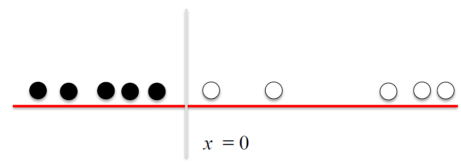
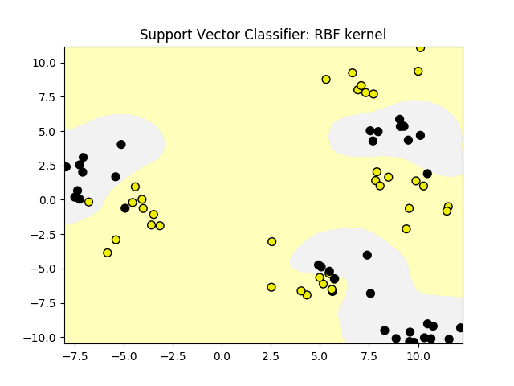

# Module 2: [Supervised Machine Learning](./02-Supervised1.md)

## Module 2 Notebook

+ [Launching Web Page](https://www.coursera.org/learn/python-machine-learning/notebook/7u2va/module-2-notebook)
+ [Web Notebook](https://hub.coursera-notebooks.org/hub/coursera_login?token=n1itCiowSXKYrQoqMPly9A&next=%2Fnotebooks%2FModule%25202.ipynb)
+ [Local Notebook](notebooks/Module02.ipynb)
+ [Local Python Code](notebooks/Module02.py)


## Introduction to Supervised Machine Learning

+ Learning objectives
    + Understand how a number of different supervised learning algorithms learn by estimating their parameters from data to make new predictions.
    + Understand the strengths and weaknesses of particular supervised learning methods.
    + Learn how to apply specific supervised machine learning algorithms in Python with scikit-learn.
    + Learn about general principles of supervised machine learning, like overfitting and how to avoid it.

+ Review of important terms
    + Feature representation, e.g. `mass`, `width`, `height`, `color_score`
    + Data instances/samples/examples (X); i.e., rows, e.g. row(0) = `| 1 | 0 | 1 | apple | granny_smith | 192 | 8.4 | 7.3 | 0.55 |`, row(2) = `| 3 | 2 | 1 | apple | granny_smith | 176 | 7.4 | 7.2 | 0.60 |`; in Python `X` represent the set of features, e.g., row(0) = `| 192 | 8.4 | 7.3 | 0.55 |`
    + Target value (y), e.g., label = `fruit_label`, `fruit_name` & `fruit_subtype`: only for labeling purpose as more readable for humans
    + Training and test sets: using `train_test_split` function from `sklearn.model_selection` module, default as $75\%:25\%$, e.g., `X_train, X_test, y_train, y_test = train_test_split(X_fruits, y_fruits, random_state=0)`
    + Model/Estimator
        + Model fitting produces a 'trained model'
        + Training is the process of estimating model parameters
        + Demo
            ```python
            # estimator/model - Classifier selection
            knn = KNeighborsClassifier(n_neighbors = 5)
            # model fit - training to get model parameters with given training data set
            knn.fit(X_train_scaled, y_train)
            # Apply model to predict a given instance
            knn.predict(example_fruit_scaled)
            ```
    + Evaluation method
        ```python
        # accuracy of the model
        knn.score(X_test_scaled, y_test)
        ```
    + Example - Table terminologies

        |   | fruit_label | fruit_name | fruit_subtype | mass | width | height | color_score |
        |---|-------------|------------|---------------|------|-------|--------|-------------|
        | 0 | 0 | 1 | apple | granny_smith | 192 | 8.4 | 7.3 | 0.55 |
        | 1 | 1 | 1 | apple | granny_smith | 180 | 8.0 | 6.8 | 0.59 |
        | 2 | 2 | 1 | apple | granny_smith | 176 | 7.4 | 7.2 | 0.60 |
        | 3 | 3 | 2 | mandarin | mandarin | 86 | 6.2 | 4.7 | 0.80 |
        | 4 | 4 | 2 | mandarin | mandarin | 84 | 6.0 | 4.6 | 0.79 |

+ Classification and Regression
    + Both classification and regression take a set of training instances and learn a mapping to a __target value__.
    + For classification, the target value is a _discrete_ class value
        + Binary: target value = $0$ (negative class) or $1$ (positive class), e.g., detecting a fraudulent credit card transaction
        + Multi-class: target value is one of a set of discrete values, e.g., labelling the type of fruit from physical attributes
        + Multi-label: there are multiple target values (labels), e.g., labelling the topics discussed ion a Web page
    + For regression, that target value is _continuous_ (floating point/real-value), e.g., predicting the selling price of house from its attributes
    + Looking at the target value's type will guide you on what supervised learning method to use
    + Many supervised learning methods have 'flavors' for both classification and regression

+ Supervised learning methods: Overview
    + To start with, we'll look at two simple but powerful prediction algorithms
        + K-nearest neighbors (review from week 1, plus regression)
        + Linear model fit using least-squares
    + These represent two complementary approaches to supervised learning
        + K-nearest neighbors makes few assumptions about the structure of the data and gives potentially accurate but sometimes unstable predictions (sensitive to small changes in the training data)
        + Linear models make strong assumptions about structure of the data and give stable but potentially inaccurate predictions
    

+ Supervised learning methods: Overview
    + To start with, we'll look at two simple but powerful prediction algorithms:
        + K-nearest neighbors (review from week 1, plus regression)
        + Linear model fit using least-squares
    + These represent two complementary approaches to supervised learning:
        + K-nearest neighbors makes few assumptions about the structure of the data and gives potentially accurate but sometimes unstable predictions (sensitive to small changes in the training data).
        + Linear models make strong assumptions about the structure of the data and give stable but potentially inaccurate predictions.
    + We'll cover a number of widely-used supervised learning methods for classification and regression.
    + For each supervised learning method we'll explore:
        + How the method works conceptually at a high level.
        + What kind of feature preprocessing is typically needed.
        + Key parameters that control model complexity, to avoid under-and over-fitting.
        + Positives and negatives of the learning method.
    + Other models: decision trees, kernelized supported vector machines (SVM) and neural networks

+ The relationship between model complexity and training/test performance
    <a href="https://datascience.stackexchange.com/questions/33720/i-am-trying-to-make-a-classifier-using-machine-learning-to-detect-malwares-am-i">
        <br/>
    </a>
        <a href="https://www.coursera.org/learn/python-machine-learning/lecture/EiQjD/linear-regression-least-squares">
        
    </a>

+ Models and Variables
    + Model: a specific mathematical or computational description that express the relationship between a set of input variables and one or more outcome variables that are being studied or predicted
    + Statistics: input variables = independent variables; output variable = dependent variables
    + Machine learning: input variables = features; output variables = target values / target labels
    + Unsupervised learning models used to understand and explore the structure within a given dataset
    + Supervised learning used to develop predict models that can accurately predict the outcomes, target values/target labels

+ Demo: Preamble and Review
    ```python
    %matplotlib notebook
    import numpy as np
    import pandas as pd
    import seaborn as sn
    import matplotlib.pyplot as plt

    from sklearn.model_selection import train_test_split
    from sklearn.neighbors import KNeighborsClassifier

    np.set_printoptions(precision=2)


    fruits = pd.read_table('fruit_data_with_colors.txt')

    feature_names_fruits = ['height', 'width', 'mass', 'color_score']
    X_fruits = fruits[feature_names_fruits]
    y_fruits = fruits['fruit_label']
    target_names_fruits = ['apple', 'mandarin', 'orange', 'lemon']

    X_fruits_2d = fruits[['height', 'width']]
    y_fruits_2d = fruits['fruit_label']

    X_train, X_test, y_train, y_test = \
        train_test_split(X_fruits, y_fruits, random_state=0)

    from sklearn.preprocessing import MinMaxScaler
    scaler = MinMaxScaler()
    X_train_scaled = scaler.fit_transform(X_train)
    # we must apply the scaling to the test set that we computed for the training set
    X_test_scaled = scaler.transform(X_test)

    knn = KNeighborsClassifier(n_neighbors = 5)
    knn.fit(X_train_scaled, y_train)
    print('Accuracy of K-NN classifier on training set: {:.2f}'
        .format(knn.score(X_train_scaled, y_train)))
    print('Accuracy of K-NN classifier on test set: {:.2f}'
        .format(knn.score(X_test_scaled, y_test)))

    example_fruit = [[5.5, 2.2, 10, 0.70]]
    example_fruit_scaled = scaler.transform(example_fruit)
    print('Predicted fruit type for ', example_fruit, ' is ', 
            target_names_fruits[knn.predict(example_fruit_scaled)[0]-1])
    # Accuracy of K-NN classifier on training set: 0.95
    # Accuracy of K-NN classifier on test set: 1.00
    # Predicted fruit type for  [[5.5, 2.2, 10, 0.7]]  is  mandarin
    ```

### Lecture Video

<a href="https://d3c33hcgiwev3.cloudfront.net/tPIu3lzrEeeQywpoSy5QrA.processed/full/360p/index.mp4?Expires=1536278400&Signature=QJpYlD0vOtufdV2wDh49dA7eMIu7XUHPJLOoxIwvPDpcsGrjhSZvac1dgTn0dD1UpdLkCkcYtUqBvOKklUEfMDAkMnp8Sz4vKiLHVSnAcKQ96B0xhfpMG3KORoWOo7i3~XcRC5oDpYNN-P-B35xYGJsPDyAEkpEi2oFbEuCCnOw_&Key-Pair-Id=APKAJLTNE6QMUY6HBC5A" alt="Introduction to Supervised Machine Learning" target="_blank">
     
</a>


## Overfitting and Underfitting

+ Generalization, Overfitting, and Underfitting
    + __Generalization ability__ refers to an algorithm's ability to give accurate predictions for new, previously unseen data.
    + Assumptions:
        + Future unseen data (test set) will have the _same properties_c as the current training sets.
        + Thus, models that are accurate on the training set are expected to be accurate on the test set.
        + But that may not happen if the trained model is tuned too specifically to the training set.
    + Models that are too complex for the amount of training data available are said to __overfit__ and are not likely to generalize well to new examples.
    + Models that are too simple, that don't even do well on the training data, are said to __underfit__ and also not likely to generalize well.
    + Not enough training data to constraint the mode to respect these global trends -> Training set accuracy is a hopelessly optimistic indicator for likely test set accuracy if the mode is overfitting
    + Understanding, detecting, and avoiding overfitting is perhaps the most important aspect of applying supervised machine learning algorithms

+ Overfitting vs. Underfitting in Regression
    <a href="http://scikit-learn.org/stable/auto_examples/model_selection/plot_underfitting_overfitting.html">
        <br/>
    </a>

+ Underfitting and Overfitting in Classification
    <a href="https://www.safaribooksonline.com/library/view/deep-learning/9781491924570/ch01.html">
        <br/>
    </a>

+ Overfitting with k-NN classifiers
    <a href="https://www.coursera.org/learn/python-machine-learning/lecture/fVStr/overfitting-and-underfitting">
        <br/>
    </a>

### Lecture Video

<a href="https://d3c33hcgiwev3.cloudfront.net/Ygb0LT7yEee4_A7ezGAgwg.processed/full/360p/index.mp4?Expires=1536278400&Signature=agNy6H49Wn~dvZEbWoshbc1ODtxp160Y6PadOwWaOHgBJh6yBCSZyVuGCHco4TZ0HBsmDF6KMEX45tR8baj8o~pbe8JoLkQangbEwbpbFAWP4uDVtK0BqOYHS1Yj6EZJYtBM~ULx3I~x9Ns~yP8bmBPqz3odlskrWf6bCdnayis_&Key-Pair-Id=APKAJLTNE6QMUY6HBC5A" alt="Overfitting and Underfitting" target="_blank">
     
</a>


## Supervised Learning: Datasets

+ Simple Regression Dataset
    + Demo - Dataset
        ```python
        from sklearn.datasets import make_classification, make_blobs
        from matplotlib.colors import ListedColormap
        from sklearn.datasets import load_breast_cancer
        from adspy_shared_utilities import load_crime_dataset

        cmap_bold = ListedColormap(['#FFFF00', '#00FF00', '#0000FF','#000000'])

        # synthetic dataset for simple regression
        from sklearn.datasets import make_regression
        plt.figure()
        plt.title('Sample regression problem with one input variable')
        X_R1, y_R1 = make_regression(
            n_samples = 100, n_features=1, n_informative=1, 
            bias = 150.0, noise = 30, random_state=0)
        plt.scatter(X_R1, y_R1, marker= 'o', s=50)
        plt.show()

        # synthetic dataset for more complex regression
        from sklearn.datasets import make_friedman1
        plt.figure()
        plt.title('Complex regression problem with one input variable')
        X_F1, y_F1 = make_friedman1(
            n_samples = 100, n_features = 7, random_state=0)

        plt.scatter(X_F1[:, 2], y_F1, marker= 'o', s=50)
        plt.show()
        ```
    &nbsp;&nbsp;&nbsp;&nbsp;
    


+ Simple Binary Classification Dataset
    + Demo
        ```python
        # synthetic dataset for classification (binary) 
        plt.figure()
        plt.title('Sample binary classification problem with two informative features')
        X_C2, y_C2 = make_classification(
            n_samples = 100, n_features=2, n_redundant=0, n_informative=2,
            n_clusters_per_class=1, flip_y = 0.1, class_sep = 0.5, random_state=0)
        plt.scatter(X_C2[:, 0], X_C2[:, 1], c=y_C2,
                marker= 'o', s=50, cmap=cmap_bold)
        plt.show()
        ```
    

+ Complex Binary Classification Dataset
    + Demo
        ```python
        # more difficult synthetic dataset for classification (binary) 
        # with classes that are not linearly separable
        X_D2, y_D2 = make_blobs(n_samples = 100, n_features = 2, centers = 8,
                            cluster_std = 1.3, random_state = 4)
        y_D2 = y_D2 % 2
        plt.figure()
        plt.title('Sample binary classification problem with non-linearly separable classes')
        plt.scatter(X_D2[:,0], X_D2[:,1], c=y_D2,
                marker= 'o', s=50, cmap=cmap_bold)
        plt.show()

        # Breast cancer dataset for classification
        cancer = load_breast_cancer()
        (X_cancer, y_cancer) = load_breast_cancer(return_X_y = True)

        # Communities and Crime dataset
        (X_crime, y_crime) = load_crime_dataset()
        ```
    
 
+ Fruit Multi-class Classification Dataset  
    <a href="https://www.coursera.org/learn/python-machine-learning/lecture/71PMP/supervised-learning-datasets">
        
    </a>
    + Features: width, height, mass, color_score
    + Classes: 0: apple; 1: mandarin orange; 2: orange; 3: lemon


+ Supervised Learning: Datasets
    <a href="https://www.coursera.org/learn/python-machine-learning/lecture/71PMP/supervised-learning-datasets">
        <br/>
    </a>
    + Input features: socio-economic data by location from U.S. Census
    + Target variable: Per capita violent crimes
    + Derived from the original UCI dataset at: https://archive.ics.uci.edu/ml/datasets/Communities+and+Crime+Unnormalized
    + Import Python code
        ```python
        from adspy_shared_utilities import load_crime_dataset
        crime = load_crime_dataset()
        ```

### Lecture Video

<a href="https://d3c33hcgiwev3.cloudfront.net/9W-NIzzCEeeW0g5QrK3QnA.processed/full/360p/index.mp4?Expires=1536278400&Signature=hiR0kqhBB1RBP4F4Sxe0W9i2CMCQrKugrV0J15f1npMuvmTGJVy96VvZtirnb-iUzkMWtptbFLwg-R73k6Gizk8tb7G0bgFIkht1U5IGPiHEJvmVbFYtg1HK2apYvQqWd1xoYvl2zKvo2tAIiUKeqRyvhKE09jxODtXz3ofpfWk_&Key-Pair-Id=APKAJLTNE6QMUY6HBC5A" alt="Supervised Learning: Datasets" target="_blank">
     
</a>


## K-Nearest Neighbors: Classification and Regression

+ The k-Nearest Neighbor (k-NN) Classifier Algorithm <br/>
    Given a training set `X_train` with labels `y_train`, and given a new instance `x_test` to be classified:
    1. Find the most similar instances (let's call them `X_NN`) to `x_test` that are in `X_train`.
    2. Get the labels `y_NN` for the instances in `X_NN`
    3. Predict the label for `x_test` by combining the labels `y_NN` e.g. simple majority vote

+ Nearest Neighbors Classification (k=1 & 11)
    + K = 1: variant decision boundary; high model complexity; overfitting
    + K = 11: smoother decision boundary; lower model complexity; underfitting (?)
    + Python code
        ```python
        from adspy_shared_utilities import plot_two_class_knn

        X_train, X_test, y_train, y_test = train_test_split(X_C2, y_C2, random_state=0)

        plot_two_class_knn(X_train, y_train, 1, 'uniform', X_test, y_test)
        plot_two_class_knn(X_train, y_train, 3, 'uniform', X_test, y_test)
        plot_two_class_knn(X_train, y_train, 11, 'uniform', X_test, y_test)
        ```
    
    
    

+ k-Nearest Neighbors Regression
    <a href="https://www.coursera.org/learn/python-machine-learning/lecture/I1cfu/k-nearest-neighbors-classification-and-regression">
        <br/>
    </a>
    + Diagrams: original, k = 1, k = 3
    + Green dot = training point; blue triangle = test point
    + For k=1, $\text{x_test} = -0.6$ and the nearest point is $(-0.5, 105)$, therefore, $\text{predict} = 105$
    + For k=3, $\text{x_test} = -1.25$ and 3 nearest points $(-1.6, 55)$, $(-1.4, 90)$, and $(-0.9, 90)$, $\text{predict} = (55+90+90)/3$
    + Demo
        ```python
        from sklearn.neighbors import KNeighborsRegressor

        X_train, X_test, y_train, y_test = train_test_split(X_R1, y_R1, random_state = 0)

        knnreg = KNeighborsRegressor(n_neighbors = 5).fit(X_train, y_train)

        print(knnreg.predict(X_test))
        print('R-squared test score: {:.3f}'.format(knnreg.score(X_test, y_test)))
        # [ 231.71  148.36  150.59  150.59   72.15  166.51  141.91  235.57  208.26
        #   102.1   191.32  134.5   228.32  148.36  159.17  113.47  144.04  199.23
        #   143.19  166.51  231.71  208.26  128.02  123.14  141.91]
        # R-squared test score: 0.425
        ```

+ The $R^2$ ("r-squared") Regression Score
    + Measures how well a prediction model for regression fits the given data.
    + The score is between $0$ and $1$:
        + A value of $0$ corresponds to a constant model that predicts the mean value of all training target values.
        + A value of $1$ corresponds to perfect prediction
    + Also known as "__coefficient of determination__"
    + Demo: Regression model complexity as a function of K
        ```python
        fig, subaxes = plt.subplots(1, 2, figsize=(8,4))
        X_predict_input = np.linspace(-3, 3, 50).reshape(-1,1)
        X_train, X_test, y_train, y_test = train_test_split(X_R1[0::5], y_R1[0::5], random_state = 0)

        for thisaxis, K in zip(subaxes, [1, 3]):
            knnreg = KNeighborsRegressor(n_neighbors = K).fit(X_train, y_train)
            y_predict_output = knnreg.predict(X_predict_input)
            thisaxis.set_xlim([-2.5, 0.75])
            thisaxis.plot(X_predict_input, y_predict_output, '^', markersize = 10,
                    label='Predicted', alpha=0.8)
            thisaxis.plot(X_train, y_train, 'o', label='True Value', alpha=0.8)
            thisaxis.set_xlabel('Input feature')
            thisaxis.set_ylabel('Target value')
            thisaxis.set_title('KNN regression (K={})'.format(K))
            thisaxis.legend()
        plt.tight_layout()
        ```
    

+ KNeighborsClassifier and KNeighborsRegressor: important parameters
    + Model complexity
        + `n_neighbors`: number of nearest neighbors ($k$) to consider: Default = 5
    + Model fitting
        + `metric`: distance function between data points: Default: Minkowski distance with power parameter p = 2 (Euclidean)

    + Demo: Regression model complexity as a function of K¶
        ```python
        # plot k-NN regression on sample dataset for different values of K
        fig, subaxes = plt.subplots(1, 5, figsize=(20, 5))
        X_predict_input = np.linspace(-3, 3, 500).reshape(-1,1)
        X_train, X_test, y_train, y_test = train_test_split(X_R1, y_R1, random_state = 0)
        for thisaxis, K in zip(subaxes, [1, 3, 7, 15, 55]):
            knnreg = KNeighborsRegressor(n_neighbors = K).fit(X_train, y_train)
            y_predict_output = knnreg.predict(X_predict_input)
            train_score = knnreg.score(X_train, y_train)
            test_score = knnreg.score(X_test, y_test)
            thisaxis.plot(X_predict_input, y_predict_output)
            thisaxis.plot(X_train, y_train, 'o', alpha=0.9, label='Train')
            thisaxis.plot(X_test, y_test, '^', alpha=0.9, label='Test')
            thisaxis.set_xlabel('Input feature')
            thisaxis.set_ylabel('Target value')
            thisaxis.set_title('KNN Regression (K={})\nTrain $R^2 = {:.3f}$,  Test $R^2 = {:.3f}$'
                .format(K, train_score, test_score))
            thisaxis.legend()
            plt.tight_layout(pad=0.4, w_pad=0.5, h_pad=1.0)
        ```
        


### Lecture Video 

<a href="https://d3c33hcgiwev3.cloudfront.net/qdyBZzy_Eee_fhKOKKDDtA.processed/full/360p/index.mp4?Expires=1536278400&Signature=MnTBLit6pHuRL1oyKq6YuXJHdS3iZdP6W52ounY5OQSLlNiXdEMzoHn~6P7u-uTPi~oQosRPFPnH8MkfeSV~gr91Xtbnt3Xl8Dy-OuynwnqX197xvbtVp7kebdjHiohYSMmwBKw-sFUfKb6q-TskZyX-p3yiYdeYYL66QKojfbw_&Key-Pair-Id=APKAJLTNE6QMUY6HBC5A" alt="K-Nearest Neighbors: Classification and Regression" target="_blank">
     
</a>


## Linear Regression: Least-Squares

+ Linear Models
    + A linear model is a sum of weighted variablesthat predicts a target output value given an input data instance. 
    + Example: predicting housing prices
        + House features: taxes per year ($X_{TAX}$), age in years ($X_{AGE}$)

            $$\hat{Y_{PRICE}} = 21200 + 109 \cdot X_{TAX} - 2000 \cdot X_{AGE}$$ 
        + A house with feature values $(X_{TAX}, X_{AGE})$ of $(10000, 75)$ would have a predicted selling price of:

            $$\hat{Y_{PRICE}} = 21200 + 109 \cdot 1000 - 2000 \cdot 75 = 1,152,000$$

+ Linear Regression is an Example of a Linear Model
    + Input instance - feature vector: $ {\bf x} = (x_0, x_1, \cdots, x_n)$
    + Predict output: $\hat{y} = \hat(w_0) x_0 + \hat{w_1} x_1 + \cdots + \hat{w_n} x_n + b$
    + Parameters to estimate: train parameters or coefficients
        + $\hat{\bf w} = (\hat{w_0}, \hat{w_1}, \cdots , \hat{w_n})$: feature weights/model coefficients
        + $\hat{\bf b}$: constant bias term / intercept
    + Example - house price: $\hat{w_0} = 109$, $x_0$ = tax paid, $\hat{w_1} = -20$, $x_1$ = house age, $\hat{b} = 212,000$

+ A Linear Regression Model with one Variable (Feature)
    + Input instance: ${\bf x} = (x_0)$
    + Predicted output: $\hat{y} = \hat{w_0} x_0 + \hat{b}$
    + Parameters to estimate: $\hat{w_0}$ (slope, $\hat{b}$ (y-intercept)
    <a href="https://www.coursera.org/learn/python-machine-learning/lecture/EiQjD/linear-regression-least-squares">
        <br/>
    </a>

+ Least-Squares Linear Regression("Ordinary least-squares")
    + Finds $w$ and $b$ that minimizes the mean squared error of the linear model: the sum of squared differences between predicted target and actual target values.
    + No parameters to control model complexity.
    <a href="https://rasbt.github.io/mlxtend/user_guide/regressor/LinearRegression/">
        <br/>
    </a>

+ How are Linear Regression Parameters w, bEstimated?
    + Parameters are estimated from training data.
    + There are many different ways to estimate wand b:
        + Different methods correspond to different "fit" criteria and goals and ways to control model complexity.
    + The learning algorithm finds the parameters that optimize an __objective function__, typically to minimize some kind of __loss function__ of the predicted target values vs.actual target values.


+ Least-Squares Linear Regression("Ordinary least-squares")
    + Finds $w$ and $b$ that minimizes the __sum of squared differences(RSS)__ over the training data between predicted target and actual target values.
    + a.k.a. mean squared error of the linear model
    + No parameters to control model complexity.

    $$RSS({\bf w}, b) = \sum^N_{i=1} (y_i - (w_i \cdot x_i + b))^2$$

    + Training set target value: ${\bf y_i}$
    + Predicted target value using model: $({\bf w \cdot x_i} + b)$

+ Least-Squares Linear Regression in Scikit-Learn
    + `linreg.coef_`: ${\bf w_0}$
    + `linreg.intercept_`: $b$
    + Underscore denotes a quantity derived from training data, as opposed to a user setting
    + Demo: Linear regression
        ```python
        from sklearn.linear_model import LinearRegression

        X_train, X_test, y_train, y_test = train_test_split(X_R1, y_R1, random_state = 0)
        linreg = LinearRegression().fit(X_train, y_train)

        print('linear model coeff (w): {}'.format(linreg.coef_))
        print('linear model intercept (b): {:.3f}'.format(linreg.intercept_))
        print('R-squared score (training): {:.3f}'.format(linreg.score(X_train, y_train)))
        print('R-squared score (test): {:.3f}'.format(linreg.score(X_test, y_test)))
        # linear model coeff (w): [ 45.71]
        # linear model intercept (b): 148.446
        # R-squared score (training): 0.679
        # R-squared score (test): 0.492
        ```
    + Demo: Linear regression: example plot
        ```python
        plt.figure(figsize=(5,4))
        plt.scatter(X_R1, y_R1, marker= 'o', s=50, alpha=0.8)
        plt.plot(X_R1, linreg.coef_ * X_R1 + linreg.intercept_, 'r-')
        plt.title('Least-squares linear regression')
        plt.xlabel('Feature value (x)')
        plt.ylabel('Target value (y)')
        plt.show()
        ```
    

+ K-NN Regression vs Least-Squares Linear Regression
    <a href="https://www.coursera.org/learn/python-machine-learning/lecture/EiQjD/linear-regression-least-squares">
        <br/>
    </a>

+ Demo: Linear model
    ```python
    X_train, X_test, y_train, y_test = train_test_split(X_crime, y_crime, random_state = 0)
    linreg = LinearRegression().fit(X_train, y_train)

    print('Crime dataset')
    print('linear model intercept: {}'.format(linreg.intercept_))
    print('linear model coeff:\n{}'.format(linreg.coef_))
    print('R-squared score (training): {:.3f}'.format(linreg.score(X_train, y_train)))
    print('R-squared score (test): {:.3f}'.format(linreg.score(X_test, y_test)))
    # Crime dataset
    # linear model intercept: -1728.1306725806212
    # linear model coeff:
    # [  1.62e-03  -9.43e+01   1.36e+01  -3.13e+01  -8.15e-02  -1.69e+01
    #   -2.43e-03   1.53e+00  -1.39e-02  -7.72e+00   2.28e+01  -5.66e+00
    #    ...        ...        ...          ...         ...      ...
    #    5.97e-01   1.98e+00  -1.36e-01  -1.85e+00]
    # R-squared score (training): 0.673
    # R-squared score (test): 0.496
    ```


### Lecture Video

<a href="https://d3c33hcgiwev3.cloudfront.net/mmfAvlzrEeejtgqYK5OBTg.processed/full/360p/index.mp4?Expires=1536278400&Signature=c5t~aFcm-nbBmSXNiFUsgAp~0t12pE3u-SXSLqQ2-I5lJxWg7xu3g1N6HK18H6RTdYhCKm2WzBbKR70jmLyWki4w87Yn8oxGPot-BXE7e5WSFJLk1~4CnyFJcy5NIuSkyaDoizDCKhxjis-69LMwUOwfIjGbP2NSCAPrxAXgZVQ_&Key-Pair-Id=APKAJLTNE6QMUY6HBC5A" alt="Linear Regression: Least-Squares" target="_blank">
     
</a>


## Linear Regression: Ridge, Lasso, and Polynomial Regression

+ Ridge Regression
    + Ridge regression learns $w$, $b$ using the same least-squares criterion but adds a penalty for large variations in $w$ parameters

        $$ RSS_{RIDGE}({\bf w}, b) = \sum_{i=1}^N ({\bf y_i} - (w_i \cdot x_i + b))^2 + \alpha \sum_{j=1}^p w_j^2$$
        
        where $\alpha \sum_{j=1}^p w_j^2$ is the penalty
    + Once the parameters are learned, the __ridge regression prediction formula__ is the __same__ as ordinary least-squares.
    + The addition of a parameter penalty is called __regularization__. Regularization prevents overfitting by restricting the model, typically to reduce its complexity.
    + Ridge regression uses __L2 regularization__: minimize sum of squares of $w$ entries
    + The influence of the regularization term is controlled by the $\alpha$ parameter.
    + Higher alpha means more regularization and simpler models.
    + Demo: Ridge regression
        ```python
        from sklearn.linear_model import Ridge
        X_train, X_test, y_train, y_test = train_test_split(X_crime, y_crime, random_state = 0)

        linridge = Ridge(alpha=20.0).fit(X_train, y_train)

        print('Crime dataset')
        print('ridge regression linear model intercept: {}'.format(linridge.intercept_))
        print('ridge regression linear model coeff:\n{}'.format(linridge.coef_))
        print('R-squared score (training): {:.3f}'.format(linridge.score(X_train, y_train)))
        print('R-squared score (test): {:.3f}'.format(linridge.score(X_test, y_test)))
        print('Number of non-zero features: {}'.format(np.sum(linridge.coef_ != 0)))
        # Crime dataset
        # ridge regression linear model intercept: -3352.4230358466525
        # ridge regression linear model coeff:
        # [  1.95e-03   2.19e+01   9.56e+00  -3.59e+01   6.36e+00  -1.97e+01
        #   -2.81e-03   1.66e+00  -6.61e-03  -6.95e+00   1.72e+01  -5.63e+00
        #     ...         ...         ...     ...         ...         ...
        #    3.31e-01   3.36e+00   1.61e-01  -2.68e+00]
        # R-squared score (training): 0.671
        # R-squared score (test): 0.494
        # Number of non-zero features: 88
        ```

+ The Need for Feature Normalization
    + Important for some machine learning methods that all features are on the same scale (e.g. faster convergence in learning, more uniform or 'fair' influence for all weights)
        + e.g. regularized regression, k-NN, support vector machines, neural networks, …
    + Can also depend on the data. More on feature engineering later in the course. For now, we do MinMax scaling of the features:
        + For each feature $x_i$: compute the min value $x_i^{MIN}$ and the max value $x_i^{MAX}$ achieved across all instances in the training set.
        + For each feature: transform a given feature $x_i$ value to a scaled version $x_i^{\prime}$ using the formula

            $$ x_i^{\prime} = (x_i - x_i^{MIN}) / (x_i^{MAX} - x_i^{MIN}) $$
    + Demo: 
        ```python
        from sklearn.preprocessing import MinMaxScaler
        scaler = MinMaxScaler()

        from sklearn.linear_model import Ridge
        X_train, X_test, y_train, y_test = train_test_split(X_crime, y_crime,random_state = 0)

        X_train_scaled = scaler.fit_transform(X_train)
        X_test_scaled = scaler.transform(X_test)

        linridge = Ridge(alpha=20.0).fit(X_train_scaled, y_train)

        print('Crime dataset')
        print('ridge regression linear model intercept: {}'.format(linridge.intercept_))
        print('ridge regression linear model coeff:\n{}'.format(linridge.coef_))
        print('R-squared score (training): {:.3f}'.format(linridge.score(X_train_scaled, y_train)))
        print('R-squared score (test): {:.3f}'.format(linridge.score(X_test_scaled, y_test)))
        print('Number of non-zero features: {}'.format(np.sum(linridge.coef_ != 0)))
        # Crime dataset
        # ridge regression linear model intercept: 933.3906385044163
        # ridge regression linear model coeff:
        # [  88.69   16.49  -50.3   -82.91  -65.9    -2.28   87.74  150.95   18.88
        #   -31.06  -43.14 -189.44   -4.53  107.98  -76.53    2.86   34.95   90.14
        #    ...      ...     ...     ...     ...     ...     ...     ...     ...
        #   205.2    75.97   61.38  -79.83   67.27   95.67  -11.88]
        # R-squared score (training): 0.615
        # R-squared score (test): 0.599
        # Number of non-zero features: 88
        ```

+ Feature Normalization with MinMaxScaler
    <a href="https://www.coursera.org/learn/python-machine-learning/lecture/M7yUQ/linear-regression-ridge-lasso-and-polynomial-regression">
        <br/>
    </a>

+ Demo: Using a scaler object - fit and transform methods
    ```python
    from sklearn.preprocessing import MinMaxScaler
    scaler = MinMaxScaler()
    scaler.fit(X_train)
    X_train_scaled= scaler.transform(X_train)
    X_test_scaled= scaler.transform(X_test)
    clf= Ridge().fit(X_train_scaled, y_train)
    r2_score = clf.score(X_test_scaled, y_test)

    # Tip: It can be more efficient to do fitting and transforming together 
    # on the training set using the fit_transform method.
    scaler = MinMaxScaler()
    X_train_scaled= scaler.fit_transform(X_train)
    ```

+ Feature Normalization: The test set must use identical scaling to the training set
    + Fit the scaler using the training set, then apply the same scaler to transform the test set.
    + Do not scale the training and test sets using different scalers: this could lead to random skew in the data.
    + Do not fit the scaler using any part of the test data: referencing the test data can lead to a form of _data leakage_. More on this issue later in the course.


+ Demo: Ridge regression with regularization parameter - alpha
    ```python
        print('Ridge regression: effect of alpha regularization parameter\n')
        for this_alpha in [0, 1, 10, 20, 50, 100, 1000]:
            linridge = Ridge(alpha = this_alpha).fit(X_train_scaled, y_train)
            r2_train = linridge.score(X_train_scaled, y_train)
            r2_test = linridge.score(X_test_scaled, y_test)
            num_coeff_bigger = np.sum(abs(linridge.coef_) > 1.0)
            print('Alpha = {:.2f}\n  num abs(coeff) > 1.0: {}, \
                r-squared training: {:.2f}, r-squared test: {:.2f}'
                .format(this_alpha, num_coeff_bigger, r2_train, r2_test))

        # Ridge regression: effect of alpha regularization parameter
        # 
        # Alpha = 0.00
        #   num abs(coeff) > 1.0: 88, r-squared training: 0.67, r-squared test: 0.50
        # Alpha = 1.00
        #   num abs(coeff) > 1.0: 87, r-squared training: 0.66, r-squared test: 0.56
        # Alpha = 10.00
        #   num abs(coeff) > 1.0: 87, r-squared training: 0.63, r-squared test: 0.59
        # Alpha = 20.00
        #   num abs(coeff) > 1.0: 88, r-squared training: 0.61, r-squared test: 0.60
        # Alpha = 50.00
        #   num abs(coeff) > 1.0: 86, r-squared training: 0.58, r-squared test: 0.58
        # Alpha = 100.00
        #   num abs(coeff) > 1.0: 87, r-squared training: 0.55, r-squared test: 0.55
        # Alpha = 1000.00
        #   num abs(coeff) > 1.0: 84, r-squared training: 0.31, r-squared test: 0.30
    ```

+ Lasso regression is another form of regularized linear regression that uses an L1 regularization penalty for training (instead of ridge's L2 penalty)
    + __L1 penalty__: Minimize the sum of the __absolute values__ of the coefficients

        $$ RSS_{LASSO} ({\bf w}, b) = \sum_{i=1}^N (y_i - (w_i \cdot x_i + b))^2 + \alpha \sum_{j=1}^p |w_j|$$
    + This has the effect of setting parameter weights in $w$ to __zero__ for the least influential variables. This is called a __sparse solution__: a kind of feature selection
    + The parameter $\alpha$ controls amount of L1 regularization (default = 1.0).
    + The prediction formula is the same as ordinary least-squares.
    + When to use ridge vs lasso regression:
        + Many small/medium sized effects: use _ridge_.
        + Only a few variables with medium/large effect: use _lasso_.
    + Demo: Lasson Regression
        ```python
        from sklearn.linear_model import Lasso
        from sklearn.preprocessing import MinMaxScaler
        scaler = MinMaxScaler()

        X_train, X_test, y_train, y_test = train_test_split(X_crime, y_crime, random_state = 0)

        X_train_scaled = scaler.fit_transform(X_train)
        X_test_scaled = scaler.transform(X_test)

        linlasso = Lasso(alpha=2.0, max_iter = 10000).fit(X_train_scaled, y_train)

        print('Crime dataset')
        print('lasso regression linear model intercept: {}'.format(linlasso.intercept_))
        print('lasso regression linear model coeff:\n{}'.format(linlasso.coef_))
        print('Non-zero features: {}'.format(np.sum(linlasso.coef_ != 0)))
        print('R-squared score (training): {:.3f}'.format(linlasso.score(X_train_scaled, y_train)))
        print('R-squared score (test): {:.3f}\n'.format(linlasso.score(X_test_scaled, y_test)))
        print('Features with non-zero weight (sorted by absolute magnitude):')

        for e in sorted (list(zip(list(X_crime), linlasso.coef_)),
                        key = lambda e: -abs(e[1])):
            if e[1] != 0:
                print('\t{}, {:.3f}'.format(e[0], e[1]))
        # Crime dataset
        # lasso regression linear model intercept: 1186.6120619985786
        # lasso regression linear model coeff:
        # [    0.       0.      -0.    -168.18    -0.      -0.       0.     119.69
        #      0.      -0.       0.    -169.68    -0.       0.      -0.       0.
        #      ...      ...     ...     ...       ...       ...     ...     ...
        #   -104.57   264.93     0.      23.45   -49.39     0.       5.2      0.  ]
        # Non-zero features: 20
        # R-squared score (training): 0.631
        # R-squared score (test): 0.624
        # 
        # Features with non-zero weight (sorted by absolute magnitude):
        #  | PctKidsBornNeverMar, 1488.365
        #  | PctKids2Par, -1188.740
        #   ...
        #  | PctLargHouseFam, 20.144
        #  | PctSameCity85, 5.198
        ```

+ Demo: Lasso regression with regularization parameter - alpha
    ```python
    print('Lasso regression: effect of alpha regularization\n\
    parameter on number of features kept in final model\n')
    
    for alpha in [0.5, 1, 2, 3, 5, 10, 20, 50]:
        linlasso = Lasso(alpha, max_iter = 10000).fit(X_train_scaled, y_train)
        r2_train = linlasso.score(X_train_scaled, y_train)
        r2_test = linlasso.score(X_test_scaled, y_test)
        
        print('Alpha = {:.2f}\n  Features kept: {}, r-squared training: {:.2f}, \
    r-squared test: {:.2f}'
             .format(alpha, np.sum(linlasso.coef_ != 0), r2_train, r2_test))
    # Lasso regression: effect of alpha regularization
    # parameter on number of features kept in final model
    # 
    # Alpha = 0.50
    #   Features kept: 35, r-squared training: 0.65, r-squared test: 0.58
    # Alpha = 1.00
    #   Features kept: 25, r-squared training: 0.64, r-squared test: 0.60
    # Alpha = 2.00
    #   Features kept: 20, r-squared training: 0.63, r-squared test: 0.62
    # Alpha = 3.00
    #   Features kept: 17, r-squared training: 0.62, r-squared test: 0.63
    # Alpha = 5.00
    #   Features kept: 12, r-squared training: 0.60, r-squared test: 0.61
    # Alpha = 10.00
    #   Features kept: 6, r-squared training: 0.57, r-squared test: 0.58
    # Alpha = 20.00
    #   Features kept: 2, r-squared training: 0.51, r-squared test: 0.50
    # Alpha = 50.00
    #   Features kept: 1, r-squared training: 0.31, r-squared test: 0.30
    ```

+ Lasso Regression on the Communities and Crime Dataset
    + For alpha = $2.0$, $20$ out of $88$ features have non-zero weight.
    + Top features (sorted by abs. magnitude):
        
        > PctKidsBornNeverMar, 1488.365 # percentage of kids born to people who never married  
        > <span style="color:red"> PctKids2Par, -1188.740 </span> # percentage of kids in family housing with two parents  
        > HousVacant, 459.538 # number of vacant households  
        > PctPersDenseHous, 339.045 # percent of persons in dense housing (more than 1 person/room)  
        > NumInShelters, 264.932 # number of people in homeless shelters  

+ Polynomial Features with Linear

    $$ {\bf x} = (x_0, x_1) \Longrightarrow {\bf x^{\prime}} = (x_0, x_1, x_0^2, x_0 x_1, x_1^2)$$

    $$ \hat{y} = \hat{w_0}x_0 + \hat{w_1}x_1 + \hat{w_{00}}x_0^2 + \hat{w_{01}} x_0 x_1 + \hat{w_{11}}x_1^2 + b$$
    + Generate new features consisting of all polynomial combinations of the original two features $(x_0, x_1)$.
    + The _degree_ of the polynomial specifies how many variables participate at a time in each new feature (above example: degree 2)
    + This is still a weighted linear combination of features, so it's __still a linear model__, and can use same least-squares estimation method for $w$  and $b$.

+ Least-Squares Polynomial Regression
    <a href="https://www.coursera.org/learn/python-machine-learning/lecture/M7yUQ/linear-regression-ridge-lasso-and-polynomial-regression">
        <br/>
    </a>

+ Polynomial Features with Linear Regression
    + Why would we want to transform our data this way?
        + To capture interactions between the original features by adding them as features to the linear model.
        + To make a classification problem easier (we'll see this later).
        + E.g., housing price as a quadratic function of house size and tax paid
    + More generally, we can apply other non-linear transformations to create new features
        + (Technically, these are called _non-linear basis functions_)
    + Beware of polynomial feature expansion with high as this can lead to complex models that overfit
        + Thus, polynomial feature expansion is often combined with a regularized learning method like ridge regression.

+ Demo: Polynomial regression
    ```python
    from sklearn.linear_model import LinearRegression
    from sklearn.linear_model import Ridge
    from sklearn.preprocessing import PolynomialFeatures

    X_train, X_test, y_train, y_test = train_test_split(X_F1, y_F1,
                                                    random_state = 0)
    linreg = LinearRegression().fit(X_train, y_train)

    print('linear model coeff (w): {}'.format(linreg.coef_))
    print('linear model intercept (b): {:.3f}'.format(linreg.intercept_))
    print('R-squared score (training): {:.3f}'.format(linreg.score(X_train, y_train)))
    print('R-squared score (test): {:.3f}'.format(linreg.score(X_test, y_test)))

    print('\nNow we transform the original input data to add\n\
    polynomial features up to degree 2 (quadratic)\n')
    poly = PolynomialFeatures(degree=2)
    X_F1_poly = poly.fit_transform(X_F1)

    X_train, X_test, y_train, y_test = train_test_split(X_F1_poly, y_F1, random_state = 0)
    linreg = LinearRegression().fit(X_train, y_train)

    print('(poly deg 2) linear model coeff (w):\n{}'.format(linreg.coef_))
    print('(poly deg 2) linear model intercept (b): {:.3f}'.format(linreg.intercept_))
    print('(poly deg 2) R-squared score (training): {:.3f}'.format(linreg.score(X_train, y_train)))
    print('(poly deg 2) R-squared score (test): {:.3f}\n'.format(linreg.score(X_test, y_test)))

    print('\nAddition of many polynomial features often leads to\n\
    overfitting, so we often use polynomial features in combination\n\
    with regression that has a regularization penalty, like ridge\n\
    regression.\n')

    X_train, X_test, y_train, y_test = train_test_split(X_F1_poly, y_F1,
                                                    random_state = 0)
    linreg = Ridge().fit(X_train, y_train)

    print('(poly deg 2 + ridge) linear model coeff (w):\n{}'
        .format(linreg.coef_))
    print('(poly deg 2 + ridge) linear model intercept (b): {:.3f}'
        .format(linreg.intercept_))
    print('(poly deg 2 + ridge) R-squared score (training): {:.3f}'
        .format(linreg.score(X_train, y_train)))
    print('(poly deg 2 + ridge) R-squared score (test): {:.3f}'
        .format(linreg.score(X_test, y_test)))
    # linear model coeff (w): [  4.42   6.     0.53  10.24   6.55  -2.02  -0.32]
    # linear model intercept (b): 1.543
    # R-squared score (training): 0.722
    # R-squared score (test): 0.722
    # 
    # Now we transform the original input data to add
    # polynomial features up to degree 2 (quadratic)
    # 
    # (poly deg 2) linear model coeff (w):
    # [  3.41e-12   1.66e+01   2.67e+01  -2.21e+01   1.24e+01   6.93e+00
    # 1.05e+00   3.71e+00  -1.34e+01  -5.73e+00   1.62e+00   3.66e+00
    # 5.05e+00  -1.46e+00   1.95e+00  -1.51e+01   4.87e+00  -2.97e+00
    # -7.78e+00   5.15e+00  -4.65e+00   1.84e+01  -2.22e+00   2.17e+00
    # -1.28e+00   1.88e+00   1.53e-01   5.62e-01  -8.92e-01  -2.18e+00
    # 1.38e+00  -4.90e+00  -2.24e+00   1.38e+00  -5.52e-01  -1.09e+00]
    # (poly deg 2) linear model intercept (b): -3.206
    # (poly deg 2) R-squared score (training): 0.969
    # (poly deg 2) R-squared score (test): 0.805
    # 
    # Addition of many polynomial features often leads to
    # overfitting, so we often use polynomial features in combination
    # with regression that has a regularization penalty, like ridge
    # regression.
    # 
    # (poly deg 2 + ridge) linear model coeff (w):
    # [ 0.    2.23  4.73 -3.15  3.86  1.61 -0.77 -0.15 -1.75  1.6   1.37  2.52
    # 2.72  0.49 -1.94 -1.63  1.51  0.89  0.26  2.05 -1.93  3.62 -0.72  0.63
    # -3.16  1.29  3.55  1.73  0.94 -0.51  1.7  -1.98  1.81 -0.22  2.88 -0.89]
    # (poly deg 2 + ridge) linear model intercept (b): 5.418
    # (poly deg 2 + ridge) R-squared score (training): 0.826
    # (poly deg 2 + ridge) R-squared score (test): 0.825
    ```


### Lecture Video

<a href="https://d3c33hcgiwev3.cloudfront.net/zySS11zrEeeP6hLXsz0H0g.processed/full/360p/index.mp4?Expires=1536364800&Signature=itQQbJ3rem54AhQiqzXxstWOb1YeMTRmDGNQEs-QGR~jGfV2qhQNCyMAprFfG-~0qXs5xonMYBaqvqj8ZiqG5Oi5~gH5Y8AcImrh5e~Aijk1~QCsE40vIJJUG2u8S5atWtd6qAQ0mdDl7mSIrf3eagahYyHX5L0B1UZJuHeD0aw_&Key-Pair-Id=APKAJLTNE6QMUY6HBC5A" alt="Linear Regression: Ridge, Lasso, and Polynomial Regression" target="_blank">
     
</a>


## Logistic Regression

+ Linear regression 
    <a href="https://www.coursera.org/learn/python-machine-learning/lecture/bEtYh/logistic-regression">
        <br/>
    </a>

+ Linear models for classification: Logistic Regression
    + a kind of generalized linear model
    + take a set of variables, the features, and estimate a target value
    + binary variable instead of a continuous value, generalized to multi-class categorical variable
    <a href="https://www.coursera.org/learn/python-machine-learning/lecture/bEtYh/logistic-regression">
        <br/>
    </a>

    + The logistic function transforms real-valued input to an output number $y$ between $0$ and $1$, interpreted as the __probability__ the input object belongs to the positive class, given its input features $x_0, x_1, \cdots,x_n)$

+ Linear models for classification: Logistic Regression
    <a href="https://www.coursera.org/learn/python-machine-learning/lecture/bEtYh/logistic-regression">
        <br/>
    </a>
    + Training set to represent the hours of study and passing/failing of the exam: red dot = negative class = failing = 0; blue dot = positive class = passing = 1

+ Logistic Regression for binary classification
    <a href="https://helloacm.com/a-short-introduction-logistic-regression-algorithm/">
        <br/>
    </a>
    <a href="https://www.coursera.org/learn/python-machine-learning/lecture/bEtYh/logistic-regression">
        
    </a>
    <a href="https://www.coursera.org/learn/python-machine-learning/lecture/bEtYh/logistic-regression">
        
    </a>


+ Simple logistic regression problem: two-class, two-feature version of the fruit dataset
    + Demo: Logistic regression for binary classification on fruits dataset using height, width features (positive class: apple, negative class: others) (below left)
        ```python
        from sklearn.linear_model import LogisticRegression
        from adspy_shared_utilities import (
        plot_class_regions_for_classifier_subplot)

        fig, subaxes = plt.subplots(1, 1, figsize=(7, 5))
        y_fruits_apple = y_fruits_2d == 1   # make into a binary problem: apples vs everything else
        X_train, X_test, y_train, y_test = (
        train_test_split(X_fruits_2d.as_matrix(),
                        y_fruits_apple.as_matrix(),
                        random_state = 0))

        clf = LogisticRegression(C=100).fit(X_train, y_train)
        plot_class_regions_for_classifier_subplot(clf, X_train, y_train, None, None, \
            'Logistic regression for binary classification\nFruit dataset: Apple vs others', subaxes)

        h = ; w = 8
        print('A fruit with height {} and width {} is predicted to be: {}'
            .format(h,w, ['not an apple', 'an apple'][clf.predict([[h,w]])[0]]))

        h = 10; w = 7
        print('A fruit with height {} and width {} is predicted to be: {}'
            .format(h,w, ['not an apple', 'an apple'][clf.predict([[h,w]])[0]]))
        subaxes.set_xlabel('height')
        subaxes.set_ylabel('width')

        print('Accuracy of Logistic regression classifier on training set: {:.2f}'
            .format(clf.score(X_train, y_train)))
        print('Accuracy of Logistic regression classifier on test set: {:.2f}'
            .format(clf.score(X_test, y_test)))
        # A fruit with height 6 and width 8 is predicted to be: an apple
        # A fruit with height 10 and width 7 is predicted to be: not an apple
        # Accuracy of Logistic regression classifier on training set: 0.77
        # Accuracy of Logistic regression classifier on test set: 0.73
        ```
        
        
    
    + Demo: Logistic regression on simple synthetic dataset (above right)
        ```python
        from sklearn.linear_model import LogisticRegression
        from adspy_shared_utilities import plot_class_regions_for_classifier_subplot

        X_train, X_test, y_train, y_test = train_test_split(X_C2, y_C2, random_state = 0)

        fig, subaxes = plt.subplots(1, 1, figsize=(7, 5))
        clf = LogisticRegression().fit(X_train, y_train)
        title = 'Logistic regression, simple synthetic dataset C = {:.3f}'.format(1.0)
        plot_class_regions_for_classifier_subplot(clf, X_train, y_train,
                                                None, None, title, subaxes)

        print('Accuracy of Logistic regression classifier on training set: {:.2f}'
            .format(clf.score(X_train, y_train)))
        print('Accuracy of Logistic regression classifier on test set: {:.2f}'
            .format(clf.score(X_test, y_test)))
        # Accuracy of Logistic regression classifier on training set: 0.80
        # Accuracy of Logistic regression classifier on test set: 0.80
        ```

+ Logistic Regression: Regularization
    + L2 regularization is 'on' by default (like ridge regression)
    + Parameter C controls amount of regularization (default 1.0)
    + As with regularized linear regression, it can be important to normalize all features so that they are on the same scale.
    + Demo: Logistic regression regularization: C parameter
        ```python 
        X_train, X_test, y_train, y_test = (
            train_test_split(X_fruits_2d.as_matrix(), y_fruits_apple.as_matrix(),
            random_state=0))

        fig, subaxes = plt.subplots(1, 3, figsize=(13, 4))

        for this_C, subplot in zip([0.1, 1, 100], subaxes):
            clf = LogisticRegression(C=this_C).fit(X_train, y_train)
            title ='Logistic regression (apple vs rest), C = {:.3f}'.format(this_C)
            
            plot_class_regions_for_classifier_subplot(
                clf, X_train, y_train, X_test, y_test, title, subplot)
        plt.tight_layout()
        ```
        

    + Demo: Application to real dataset
        ```python
        from sklearn.linear_model import LogisticRegression

        X_train, X_test, y_train, y_test = train_test_split(X_cancer, y_cancer, random_state = 0)

        clf = LogisticRegression().fit(X_train, y_train)
        print('Breast cancer dataset')
        print('Accuracy of Logistic regression classifier on training set: {:.2f}'
            .format(clf.score(X_train, y_train)))
        print('Accuracy of Logistic regression classifier on test set: {:.2f}'
            .format(clf.score(X_test, y_test)))
        # Breast cancer dataset
        # Accuracy of Logistic regression classifier on training set: 0.96
        # Accuracy of Logistic regression classifier on test set: 0.96
        ```

+ Logistic and linear functions
    <a href="https://www.saedsayad.com/logistic_regression.htm">
        <br/>
    </a>


### Lecture Video

<a href="https://d3c33hcgiwev3.cloudfront.net/c_rluz6DEee4_A7ezGAgwg.processed/full/360p/index.mp4?Expires=1536364800&Signature=XiNruM5NmiNHvjmKhBpfVD~RyzSa3QAiX-AwMnpz9~d6WjmKkmUQyteS4xAINTNQiHqqfjL8hXz2cFjImhMbm9yrhfZEfjNKgcsF0Clo0AHH14DOTOgbdLzSlquvLw9F9Zt8gQQ4hNGTGkPUOkxTNAiwA-cNTIUvX49CxLAWaE4_&Key-Pair-Id=APKAJLTNE6QMUY6HBC5A" alt="Logistic Regression" target="_blank">
     
</a>


## Linear Classifiers: Support Vector Machines

+ Linear classifiers: how would you separate these two groups of training examples with a straight line?
    <a href="https://www.coursera.org/learn/python-machine-learning/lecture/uClaN/linear-classifiers-support-vector-machines">
        <br/>
    </a>
    + A linear classifier is a function that maps an input data point $x$ to an output class value $y$ (+1 or -1) using a linear function (with weight parameters $w$ of the input point's features.
    + `sign` function: $+1 \text{ if } \hat{y} > 0$ and $-1 \text{ if } \hat{y} < 0$
    + General linear classifier equation: $f(x, w, b) = sign(w \circ x + b) = sign(\sum w[i]x[i] + b)$ where $w$ is a vector of weights, $x$ is a vector of feature values, and $b$ is a bias term
    + operator $\circ$: $[w_1, w_2] \circ [x_1, x_2] = w_1 x_1 + w2 x_2$

+ Linear classifiers: how would you separate these two groups of training examples with a line?
    <a href="https://www.coursera.org/learn/python-machine-learning/lecture/uClaN/linear-classifiers-support-vector-machines">
        <br/>
    </a>
    + Suppose $w=[1, -1]$ and $b = 0$, it is depicted as diagonal line where $[w_1, w_2] = [1, -1]$, therefore $x_1 - x_2 = 0$
    + Suppose to classify $[-0.75, -2.25]$, 

        $$f([-0.75, -2.25], w, b) = sign(1 \cdot -0.75 + (-1) \cdot (-2.25) + 0) =  sign(-0.75 + 2.25 = 1.50) = +1$$
    + Suppose to classify $[-1.75, -0.25]$

        $$f([-1.75, -0.25], w, b) = sign(1 \cdot -1.75 + (-1) \cdot (-0.25) + 0) =  sign(-1.75 + 0.25 = -1.50) = -1$$


+ Linear Classifiers & Classifier Margin
    <a href="https://www.coursera.org/learn/python-machine-learning/lecture/uClaN/linear-classifiers-support-vector-machines">
        <br/>
    </a> &nbsp;&nbsp;&nbsp;&nbsp;
    <a href="https://www.coursera.org/learn/python-machine-learning/lecture/uClaN/linear-classifiers-support-vector-machines">
        
    </a>
    + __Classifier margin__: Defined as the maximum width the decision boundary area can be increased before hitting a data point.

+ Maximum margin linear classifier: Linear Support Vector Machines
    + $f(x, w, b) = sign(w \circ x + b)$
    + Maximum margin classifier: The linear classifier with maximum margin is a linear Support Vector Machine (LSVM).
    + Demo: Linear Support Vector Machine
        ```python
        from sklearn.svm import SVC
        from adspy_shared_utilities import plot_class_regions_for_classifier_subplot

        X_train, X_test, y_train, y_test = train_test_split(X_C2, y_C2, random_state = 0)

        fig, subaxes = plt.subplots(1, 1, figsize=(7, 5))
        this_C = 1.0
        clf = SVC(kernel = 'linear', C=this_C).fit(X_train, y_train)
        title = 'Linear SVC, C = {:.3f}'.format(this_C)
        plot_class_regions_for_classifier_subplot(clf, X_train, y_train, None, None, title, subaxes)
        ```
        


+ Regularization for SVMs: the $C$ parameter
    + The strength of regularization is determined by $C$
    + Larger values of $C$: less regularization
        + Fit the training data as well as possible
        + Each individual data point is important to classify correctly
    + Smaller values of $C$: more regularization
        + More tolerant of errors on individual data points
    + Demo: Linear Support Vector Machine: C parameter
        ```python
        from sklearn.svm import LinearSVC
        from adspy_shared_utilities import plot_class_regions_for_classifier

        X_train, X_test, y_train, y_test = train_test_split(X_C2, y_C2, random_state = 0)
        fig, subaxes = plt.subplots(1, 2, figsize=(8, 4))

        for this_C, subplot in zip([0.00001, 100], subaxes):
            clf = LinearSVC(C=this_C).fit(X_train, y_train)
            title = 'Linear SVC, C = {:.5f}'.format(this_C)
            plot_class_regions_for_classifier_subplot(clf, X_train, y_train, 
                None, None, title, subplot)
        plt.tight_layout()
        ```
        

+ Demo: Application to real dataset
    ```python
    from sklearn.svm import LinearSVC
    X_train, X_test, y_train, y_test = train_test_split(X_cancer, y_cancer, random_state = 0)
    
    clf = LinearSVC().fit(X_train, y_train)
    print('Breast cancer dataset')
    print('Accuracy of Linear SVC classifier on training set: {:.2f}'
         .format(clf.score(X_train, y_train)))
    print('Accuracy of Linear SVC classifier on test set: {:.2f}'
         .format(clf.score(X_test, y_test)))
    # Breast cancer dataset
    # Accuracy of Linear SVC classifier on training set: 0.90
    # Accuracy of Linear SVC classifier on test set: 0.92
    ```

+ Linear Models: Pros and Cons
    + Pros:
        + Simple and easy to train.
        + Fast prediction
            + linear nature of prediction function
            + LSVM effectly performed on high dimensional dataset, in particular, sparse data instances
        + Scales well to very large datasets.
            + LSVM only using subset of training points (support vectors) and decision function
        + Works well with sparse data.
        + Reasons for prediction are relatively easy to interpret.
    + Cons:
        + For lower-dimensional data, other models may have superior generalization performance.
        + For classification, data may not be linearly separable (more on this in SVMs with non-linear kernels)

+ linear_model: Important Parameters
    + Model complexity
        + __alpha__: weight given to the L1 or L2 regularization term in regression models
        + default = 1.0
    + __C__: regularization weight for `LinearSVC` and `LogisticRegression` classification models
        + default = 1.0


### Lecture Video

<a href="https://d3c33hcgiwev3.cloudfront.net/3thhjT6DEeeR4AqenwJvyA.processed/full/360p/index.mp4?Expires=1536364800&Signature=WQwyPHi2C1RMpNioL4xmscAFMLvoymVrEG3CeWUSUm6HTlCkOAKBgJgFcSA1ffjum~caEbRzIn-0YfRQye2hz~3-HAD9CH99Kx97DBd9c8PR2qDgUTgcV2Xnmialwy6nsdQcYIjtZgSmlNf9Blxvu-AH71E7~PhKbkDLWeORc7g_&Key-Pair-Id=APKAJLTNE6QMUY6HBC5A" alt="Linear Classifiers: Support Vector Machines" target="_blank">
     
</a>


## Multi-Class Classification

+ Multi-Class classification with linear Models
    + Converting multi-class  classification problem into a series of binary problems
    + Binary class: one class selected and others as another class
    + Suppose $(height, weight) = (2, 6)$ for apple, $y_apple = -0.23401135 * height + 0.72246123 * weight - 3.31753728 = 0.549$, therefore, $(0.549) = +1$
    ```python
    from sklearn.svm import LinearSVC

    X_train, X_test, y_train, y_test = train_test_split(X_fruits_2d, y_fruits_2d, random_state = 0)

    clf = LinearSVC(C=5, random_state = 67).fit(X_train, y_train)
    print('Coefficients:\n', clf.coef_)
    print('Intercepts:\n', clf.intercept_)
    # Coefficients: (4 sets)
    #  [[-0.23  0.72]   apple vs others
    #  [-1.63  1.15]    
    #  [ 0.08  0.31]
    #  [ 1.26 -1.68]]
    # Intercepts: (4 sets)
    #  [-3.32  1.2  -2.75  1.16] (apple  )

    # Multi-class results on the fruit dataset
    plt.figure(figsize=(6,6))
    colors = ['r', 'g', 'b', 'y']
    cmap_fruits = ListedColormap(['#FF0000', '#00FF00', '#0000FF','#FFFF00'])

    plt.scatter(X_fruits_2d[['height']], X_fruits_2d[['width']],
            c=y_fruits_2d, cmap=cmap_fruits, edgecolor = 'black', alpha=.7)

    x_0_range = np.linspace(-10, 15)

    for w, b, color in zip(clf.coef_, clf.intercept_, ['r', 'g', 'b', 'y']):
        # Since class prediction with a linear model uses the formula y = w_0 x_0 + w_1 x_1 + b, 
        # and the decision boundary is defined as being all points with y = 0, to plot x_1 as a 
        # function of x_0 we just solve w_0 x_0 + w_1 x_1 + b = 0 for x_1:
        plt.plot(x_0_range, -(x_0_range * w[0] + b) / w[1], c=color, alpha=.8)
        
    plt.legend(target_names_fruits)
    plt.xlabel('height')
    plt.ylabel('width')
    plt.xlim(-2, 12)
    plt.ylim(-2, 15)
    plt.show()
    ```
    


### Lecture Video

<a href="https://d3c33hcgiwev3.cloudfront.net/OBB7qD6LEeeHpAqQsW8qwg.processed/full/360p/index.mp4?Expires=1536451200&Signature=huODEN23nuyNbAIfAYczsZvToxIs7jP49viV1anUdYxMjfwH23wxq6BNcCZZA5Ek8HmlNxBt34~YJhNHmwBhWoKryMF9E-i7NbXuNegAVlMCfxEy6EGT85HwVvhAzuPfoTOM3eTYr4u45~bZziLysjxNF0GvTvHy9V2SU9hT7Js_&Key-Pair-Id=APKAJLTNE6QMUY6HBC5A" alt="Multi-Class Classification" target="_blank">
     
</a>


## Kernelized Support Vector Machines

+ Complex binary classification problems
    + We saw how linear support vector classifiers could effectively find a decision boundary with maximum margin
    + But what about more complex binary classification problems?
    <a href="https://www.coursera.org/learn/python-machine-learning/lecture/lCUeA/kernelized-support-vector-machines">
        <br/>
    </a>

    + Kernalized Supported Vector Machine a.k.a. Supported Vector Machine (SVM)
    + SVM applied for classification and regression, but only classification cocered here
    + Take original dataset and transform it to a new higher dimensional feature space, where it becomes much easier to classify the transform to data using a linear classifier

+ Way to deal with Complex classification problems
    + A simple 1-dimensional classification problemfor a linear classifier (fig.1)
    + A more perplexing 1-d classification problem for a linear classifier (fig.2)
    + Let's transform the data by adding a second dimension/feature(set to the squared value of the first feature) (fig.3)
    + The data transformation makes it possible to solve this with a linear classifier (fig.4)
    + What does the linear decision boundary in feature space correspond to in the original input space? (fig.5)
    + What does the linear decision boundary correspond to in the original input space? (fig.6) <br/>
        &nbsp;&nbsp;&nbsp;&nbsp;
        &nbsp;&nbsp;&nbsp;&nbsp;
        <br/>
        &nbsp;&nbsp;&nbsp;&nbsp;
        &nbsp;&nbsp;&nbsp;&nbsp;
        


+ Example of mapping a 2D classification problem to a 3D feature space to make it linearly separable

    &nbsp;&nbsp;&nbsp;&nbsp;
    &nbsp;&nbsp;&nbsp;&nbsp;
    

    + Transforming the data can make it much easier for a linear classifier. (fig.7)
        <a href="https://en.wikipedia.org/wiki/Kernel_method">
            <br/>
        </a>

+ Redial Basis Function Kernel
    + Mapping function: $K({\bf x, x^{\prime}}) = exp [-\gamma \cdot \| {\bf x} - {\bf x^{\prime}} \|^2])$
    + A __kernel__ is a similarity measure (modified dot product) between data points<br/>
    

+ Applying the SVM with RBF kernel
    <a href="https://www.coursera.org/learn/python-machine-learning/lecture/lCUeA/kernelized-support-vector-machines">
        <br/>
    </a>
    + Demo: Radial Basis Kernel vs Polynomial Kernel
        ```python
        from sklearn.svm import SVC
        from adspy_shared_utilities import plot_class_regions_for_classifier

        X_train, X_test, y_train, y_test = train_test_split(X_D2, y_D2, random_state = 0)

        # The default SVC kernel is radial basis function (RBF)
        plot_class_regions_for_classifier(SVC().fit(X_train, y_train),
            X_train, y_train, None, None, 'Support Vector Classifier: RBF kernel')

        # Compare decision boundries with polynomial kernel, degree = 3
        plot_class_regions_for_classifier(SVC(kernel = 'poly', degree = 3)
            .fit(X_train, y_train), X_train, y_train, None, None,
            'Support Vector Classifier: Polynomial kernel, degree = 3')
        ```
        
        


+ Radial Basis Function kernel: Gamma Parameter
    <a href="https://www.coursera.org/learn/python-machine-learning/lecture/lCUeA/kernelized-support-vector-machines">
        <br/>
    </a>
    + Demo: The effect of the RBF gamma parameter on decision boundaries
        ```python
        # Support Vector Machine with RBF kernel: gamma parameter
        from adspy_shared_utilities import plot_class_regions_for_classifier

        X_train, X_test, y_train, y_test = train_test_split(X_D2, y_D2, random_state = 0)
        fig, subaxes = plt.subplots(3, 1, figsize=(4, 11))

        for this_gamma, subplot in zip([0.01, 1.0, 10.0], subaxes):
            clf = SVC(kernel = 'rbf', gamma=this_gamma).fit(X_train, y_train)
            title = 'Support Vector Classifier: \nRBF kernel, gamma = {:.2f}'.format(this_gamma)
            plot_class_regions_for_classifier_subplot(
                clf, X_train, y_train, None, None, title, subplot)
            plt.tight_layout()
        ```
        

+ Demo: Effect of C and gamma parameters (horizontal: increasing C, vertical: increasing $\gamma$)
    ```python
    # Support Vector Machine with RBF kernel: using both C and gamma parameter 
    from sklearn.svm import SVC
    from adspy_shared_utilities import plot_class_regions_for_classifier_subplot
    from sklearn.model_selection import train_test_split

    X_train, X_test, y_train, y_test = train_test_split(X_D2, y_D2, random_state = 0)
    fig, subaxes = plt.subplots(3, 4, figsize=(15, 10), dpi=50)

    for this_gamma, this_axis in zip([0.01, 1, 5], subaxes):
        for this_C, subplot in zip([0.1, 1, 15, 250], this_axis):
            title = 'gamma = {:.2f}, C = {:.2f}'.format(this_gamma, this_C)
            clf = SVC(kernel = 'rbf', gamma = this_gamma, C = this_C)
                .fit(X_train, y_train)
            plot_class_regions_for_classifier_subplot(
                clf, X_train, y_train, X_test, y_test, title, subplot)
            plt.tight_layout(pad=0.4, w_pad=0.5, h_pad=1.0)
    ```
    

+ Reminder: Using a scaler object: fit and transform methods
    ```python
    from sklearn.preprocessingimport MinMaxScaler
    scaler = MinMaxScaler()
    scaler.fit(X_train)
    X_train_scaled= scaler.transform(X_train)
    X_test_scaled= scaler.transform(X_test)
    clf= SVC().fit(X_train_scaled, y_train)
    accuracy = clf.score(X_test_scaled, y_test)

    # Tip: It can be more efficient to do fitting and transforming together on the training set using the `fit_transform` method.
    scaler = MinMaxScaler()
    X_train_scaled= scaler.fit_transform(X_train)
    ```

    + Demo: Application of SVMs to a real dataset: unnormalized data -> overfitting
        ```python
        from sklearn.svm import SVC
        X_train, X_test, y_train, y_test = train_test_split(X_cancer, y_cancer, random_state = 0)

        clf = SVC(C=10).fit(X_train, y_train)
        print('Breast cancer dataset (unnormalized features)')
        print('Accuracy of RBF-kernel SVC on training set: {:.2f}'
            .format(clf.score(X_train, y_train)))
        print('Accuracy of RBF-kernel SVC on test set: {:.2f}'
            .format(clf.score(X_test, y_test)))
        # Breast cancer dataset (unnormalized features)
        # Accuracy of RBF-kernel SVC on training set: 1.00
        # Accuracy of RBF-kernel SVC on test set: 0.63
        ```

    + Demo: Application of SVMs to a real dataset: normalized data with feature preprocessing using minmax scaling
        ```python
        from sklearn.preprocessing import MinMaxScaler
        scaler = MinMaxScaler()
        X_train_scaled = scaler.fit_transform(X_train)
        X_test_scaled = scaler.transform(X_test)

        clf = SVC(C=10).fit(X_train_scaled, y_train)
        print('Breast cancer dataset (normalized with MinMax scaling)')
        print('RBF-kernel SVC (with MinMax scaling) training set accuracy: {:.2f}'
            .format(clf.score(X_train_scaled, y_train)))
        print('RBF-kernel SVC (with MinMax scaling) test set accuracy: {:.2f}'
            .format(clf.score(X_test_scaled, y_test)))
        # Breast cancer dataset (normalized with MinMax scaling)
        # RBF-kernel SVC (with MinMax scaling) training set accuracy: 0.98
        # RBF-kernel SVC (with MinMax scaling) test set accuracy: 0.96
        ```

+ Kernelized Support Vector Machines: pros and cons
    + Pros:
        + Can perform well on a range of datasets.
        + Versatile: different kernel functions can be specified, or custom kernels can be defined for specific data types.
        + Works well for both low-and high-dimensional data.
    + Cons:
        + Efficiency (runtime speed and memory usage) decreases as training set size increases (e.g. over 50000 samples).
        + Needs careful normalization of input data and parameter tuning.
        + Does not provide direct probability estimates (but can be estimated using e.g. Platt scaling).
        + Difficult to interpret why a prediction was made.


+ Kernelized Support Vector Machines (SVC): Important parameters <br/>
    Model complexity
    + kernel: Type of kernel function to be used
        + Default = 'rbf' for radial basis function
        + Other types include 'polynomial'
    + kernel parameters
        + `gamma`($\gamma$): RBF kernel width
    + `C`: regularization parameter
    + Typically `C` and `gamma` are tuned at the same time.
    + [RBF SVM parameters](http://scikit-learn.org/stable/auto_examples/svm/plot_rbf_parameters.html)
        + Intuitively, the `gamma` parameter defines how far the influence of a single training example reaches, with low values meaning ‘far’ and high values meaning ‘close’. The `gamma` parameters can be seen as the inverse of the radius of influence of samples selected by the model as support vectors.
        + The `C` parameter trades off misclassification of training examples against simplicity of the decision surface. A low `C` makes the decision surface smooth, while a high `C` aims at classifying all training examples correctly by giving the model freedom to select more samples as support vectors.


### Lecture Video

<a href="https://d3c33hcgiwev3.cloudfront.net/0F-tskyCEeeGww6XbaTymg.processed/full/360p/index.mp4?Expires=1536451200&Signature=OelcTkr3mv6FwSRwSKqNcVjTw6txXZlDVNFdvOjG~G2MJ5EGApSg3gF9skDE-XVF4NjsWJdRhp4TfZy9NDG6HFXNRoHg~1iXUcOzgEAZ3j3kA2UPTTPpYkQr-MkVTLqG6oHnCwfnoKk0c9Qf7enkEt4wCwI2OK5UtFoz0Ffrs9s_&Key-Pair-Id=APKAJLTNE6QMUY6HBC5A" alt="Kernelized Support Vector Machines" target="_blank">
     
</a>


## Cross-Validation

+ Cross-validation
    + Uses multiple train-test splits, not just a single one
    + Each split used to train & evaluate a separate model
    + Why is this better?
        + The accuracy score of a supervised learning method can vary, depending on which samples happen to end up in the training set.
        + Using multiple train-test splits gives more stable and reliable estimates for how the classifier is likely to perform on average.
        + Results are averaged over multiple different training sets instead of relying on a single model trained on a particular training set.
    + Accuracy of k-NN classifier (k=5) on fruit data test set for different random_statevalues in train_test_split.

        | random_state | Test set accuracy |
        |--------------|-------------------|
        |  0 | 1.00 |
        |  1 | 0.93 |
        |  5 | 0.93 |
        |  7 | 0.67 |
        | 10 | 0.87 |

+ Cross-validation Example (5-fold)
    <a href="https://www.coursera.org/learn/python-machine-learning/lecture/Vm0Ie/cross-validation">
        <br/>
    </a>
    + Demo: Example based on k-NN classifier with fruit dataset (2 features)
        ```python
        from sklearn.model_selection import cross_val_score

        clf = KNeighborsClassifier(n_neighbors = 5)
        X = X_fruits_2d.as_matrix()
        y = y_fruits_2d.as_matrix()
        cv_scores = cross_val_score(clf, X, y)

        print('Cross-validation scores (3-fold):', cv_scores)
        print('Mean cross-validation score (3-fold): {:.3f}'.format(np.mean(cv_scores)))
        # Cross-validation scores (3-fold): [ 0.77  0.74  0.83]
        # Mean cross-validation score (3-fold): 0.781
        ```
    + A note on performing cross-validation for more advanced scenarios.<br/> In some cases (e.g. when feature values have very different ranges), we've seen the need to scale or normalize the training and test sets before use with a classifier. The proper way to do cross-validation when you need to scale the data is not to scale the entire dataset with a single transform, since this will indirectly leak information into the training data about the whole dataset, including the test data (see the lecture on data leakage later in the course). Instead, scaling/normalizing must be computed and applied for each cross-validation fold separately. To do this, the easiest way in scikit-learn is to use pipelines. While these are beyond the scope of this course, further information is available in the scikit-learn documentation here: <br/> http://scikit-learn.org/stable/modules/generated/sklearn.pipeline.Pipeline.html

+ Stratified Cross-validation
    <a href="https://www.coursera.org/learn/python-machine-learning/lecture/Vm0Ie/cross-validation">
        <br/>
    </a> &nbsp;&nbsp;&nbsp;&nbsp;
    <a href="https://www.coursera.org/learn/python-machine-learning/lecture/Vm0Ie/cross-validation">
        
    </a>
    + Stratified folds each contain a proportion of classes that matches the overall dataset. Now, all classes will be fairly represented in the test set.

+ Leave-one-out cross-validation (with N samples in dataset)
    <a href="https://www.coursera.org/learn/python-machine-learning/lecture/Vm0Ie/cross-validation">
        <br/>
    </a>

+ Validation curves show sensitivity to changes in an important parameter
    ```python
    # Validation curve example
    from sklearn.svm import SVC
    from sklearn.model_selection import validation_curve

    param_range = np.logspace(-3, 3, 4)
    train_scores, test_scores = validation_curve(
        SVC(), X, y, param_name='gamma', param_range=param_range, cv=3)

    print(train_scores)
    # [[ 0.49  0.42  0.41]
    #  [ 0.84  0.72  0.76]
    #  [ 0.92  0.9   0.93]
    #  [ 1.    1.    0.98]]
    print(test_scores)
    # [[ 0.45  0.32  0.33]
    #  [ 0.82  0.68  0.61]
    #  [ 0.41  0.84  0.67]
    #  [ 0.36  0.21  0.39]]
    ```
    + One row per parameter sweep value, One column per CV fold.

+ Validation Curve Example
    + The validation curve shows the mean cross-validation accuracy (solid lines) for training (orange) and test (blue) sets as a function of the SVM parameter (gamma). It also shows the variation around the mean (shaded region) as computed from k-fold cross-validation scores.
    + Demo: scikit-learn validation_plot example
        ```python
        #  See:  http://scikit-learn.org/stable/auto_examples/model_selection/plot_validation_curve.html
        plt.figure()

        train_scores_mean = np.mean(train_scores, axis=1)
        train_scores_std = np.std(train_scores, axis=1)
        test_scores_mean = np.mean(test_scores, axis=1)
        test_scores_std = np.std(test_scores, axis=1)

        plt.title('Validation Curve with SVM')
        plt.xlabel('$\gamma$ (gamma)')
        plt.ylabel('Score')
        plt.ylim(0.0, 1.1)
        lw = 2

        plt.semilogx(param_range, train_scores_mean, label='Training score',
            color='darkorange', lw=lw)
        plt.fill_between(param_range, train_scores_mean - train_scores_std,
            train_scores_mean + train_scores_std, alpha=0.2, color='darkorange', lw=lw)
        plt.semilogx(param_range, test_scores_mean, label='Cross-validation score',
                    color='navy', lw=lw)
        plt.fill_between(param_range, test_scores_mean - test_scores_std,
            test_scores_mean + test_scores_std, alpha=0.2, color='navy', lw=lw)

        plt.legend(loc='best')
        plt.show()
        ```
        


### LEcture Video

<a href="https://d3c33hcgiwev3.cloudfront.net/uHP16UGREeeR4AqenwJvyA.processed/full/360p/index.mp4?Expires=1536451200&Signature=JgcWFHJDdoYJKqb8s-G3Aclm4012Y~b0Xoqoren5qFhHLIOsq8u9W2f8Tf7cdsV9H5liu9RinW2Q-dRRUXeRJLXHo0Dgr6Fb-Ad6CoXlrd7UDwrSj6TOpZA5mcfQVNvWV8fFv-bXGLqx7FlJVcvkkkcXxrUJtWj5ieestVBVlzY_&Key-Pair-Id=APKAJLTNE6QMUY6HBC5A" alt="Cross-Validation" target="_blank">
     
</a>


## Decision Trees

+ Decision Trees
    + popular supervised learning method
    + learn a series of explicit if then rules on feature values that result in a decision that predicts the target value

+ Decision Tree Example
    <a href="https://www.coursera.org/learn/python-machine-learning/lecture/Zj96A/decision-trees">
        <br/>&nbsp;&nbsp;&nbsp;&nbsp;
    </a>
    <a href="https://www.coursera.org/learn/python-machine-learning/lecture/Zj96A/decision-trees">
        
    </a>

+ The [Iris Daatset](https://en.wikipedia.org/wiki/Iris_flower_data_set)
    + The dataset contains a set of 150 records under 5 attributes - Petal Length , Petal Width , Sepal Length , Sepal width and Class.
    + Species: Iris setosa, Iris versicolor, Iris virginica
    + 50 examples/species

+ Decision Tree Splits
    <a href="https://www.coursera.org/learn/python-machine-learning/lecture/Zj96A/decision-trees">
        <br/>
    </a>

+ Informativenessof Splits
    + The _value_ list gives the number of samples of each class that end up at this leaf node during training.
    + The iris dataset has 3 classes, so there are three counts.
    + Sample = 37, value = [37, 0, 0], class = setosa:
        + This leaf has 37 setosa samples, zero versicolor, and zero virginicasamples.
    + Sample = 36, value = [0, 33, 3], class = versicolor
        + This leaf has 0 setosa, 33 versicolor, and 3 virginicasamples.
    + Sample = 39, value = [0, 1, 38], class = virginica
        + This leaf has 0 setosa, 1 versicolor, and 38 virginicasamples.
        <!---
        
        
        --->
        
    + Demo: Decision Trees
        ```python
        from sklearn.datasets import load_iris
        from sklearn.tree import DecisionTreeClassifier
        from adspy_shared_utilities import plot_decision_tree
        from sklearn.model_selection import train_test_split

        iris = load_iris()

        X_train, X_test, y_train, y_test = train_test_split(iris.data, iris.target, random_state = 3)
        clf = DecisionTreeClassifier().fit(X_train, y_train)

        print('Accuracy of Decision Tree classifier on training set: {:.2f}'
            .format(clf.score(X_train, y_train)))
        print('Accuracy of Decision Tree classifier on test set: {:.2f}'
            .format(clf.score(X_test, y_test)))
        # Accuracy of Decision Tree classifier on training set: 1.00
        # Accuracy of Decision Tree classifier on test set: 0.97
        ```

+ Decision tree for regression
    + using the same process of testing the future values at each node and predicting the target value based on the contents of the leafnode
    + the leafnode prediction would be the mean value of the target values for the training points in that leaf

+ Controlling the Model Complexity of Decision Trees
    <a href="https://www.coursera.org/learn/python-machine-learning/lecture/Zj96A/decision-trees">
        <br/>
    </a>
    + Demo:Setting max decision tree depth to help avoid overfitting
        ```python
        clf2 = DecisionTreeClassifier(max_depth = 3).fit(X_train, y_train)

        print('Accuracy of Decision Tree classifier on training set: {:.2f}'
             .format(clf2.score(X_train, y_train)))
        print('Accuracy of Decision Tree classifier on test set: {:.2f}'
             .format(clf2.score(X_test, y_test)))
        # Accuracy of Decision Tree classifier on training set: 0.98
        # Accuracy of Decision Tree classifier on test set: 0.92
        ```

+ Visualizing Decision Trees
    <a href="https://www.coursera.org/learn/python-machine-learning/lecture/Zj96A/decision-trees">
        <br/>
    </a>
    + See: `plot_decision_tree()` function in `adspy_shared_utilities.py` code
    + Demo: 
        ```python
        # Visualizing decision trees
        plot_decision_tree(clf, iris.feature_names, iris.target_names)

        # #### Pre-pruned version (max_depth = 3)
        plot_decision_tree(clf2, iris.feature_names, iris.target_names)
        ```

+ Feature Importance: How important is a feature to overall prediction accuracy?
    + A number between 0 and 1 assigned to each feature.
    + Feature importance of 0 --> the feature was not used in prediction.
    + Feature importance of 1 --> the feature predicts the target perfectly.
    + All feature importancesare normalized to sum to 1.


+ Feature Importance Chart
    </a>
    + See: `plot_feature_importances()` function in `adspy_shared_utilities.py` code
    + Demo: # Feature importance
        ```python
        from adspy_shared_utilities import plot_feature_importances

        plt.figure(figsize=(10,4), dpi=80)
        plot_feature_importances(clf, iris.feature_names)
        plt.show()

        print('Feature importances: {}'.format(clf.feature_importances_))

        from sklearn.tree import DecisionTreeClassifier
        from adspy_shared_utilities import plot_class_regions_for_classifier_subplot

        X_train, X_test, y_train, y_test = train_test_split(iris.data, iris.target, random_state = 0)
        fig, subaxes = plt.subplots(6, 1, figsize=(6, 32))

        pair_list = [[0,1], [0,2], [0,3], [1,2], [1,3], [2,3]]
        tree_max_depth = 4

        for pair, axis in zip(pair_list, subaxes):
            X = X_train[:, pair]
            y = y_train
            
            clf = DecisionTreeClassifier(max_depth=tree_max_depth).fit(X, y)
            title = 'Decision Tree, max_depth = {:d}'.format(tree_max_depth)
            plot_class_regions_for_classifier_subplot(
                clf, X, y, None, None, title, axis, iris.target_names)
            
            axis.set_xlabel(iris.feature_names[pair[0]])
            axis.set_ylabel(iris.feature_names[pair[1]])
            
        plt.tight_layout()
        plt.show()
        ```
     <br/>
    

+ Demo: # Decision Trees on a real-world dataset
    ```python
    from sklearn.tree import DecisionTreeClassifier
    from adspy_shared_utilities import plot_decision_tree
    from adspy_shared_utilities import plot_feature_importances

    X_train, X_test, y_train, y_test = train_test_split(X_cancer, y_cancer, random_state = 0)

    clf = DecisionTreeClassifier(max_depth = 4, min_samples_leaf = 8,
        random_state = 0).fit(X_train, y_train)

    plot_decision_tree(clf, cancer.feature_names, cancer.target_names)

    print('Breast cancer dataset: decision tree')
    print('Accuracy of DT classifier on training set: {:.2f}'
        .format(clf.score(X_train, y_train)))
    print('Accuracy of DT classifier on test set: {:.2f}'
        .format(clf.score(X_test, y_test)))

    plt.figure(figsize=(10,6),dpi=80)
    plot_feature_importances(clf, cancer.feature_names)
    plt.tight_layout()

    plt.show()
    ```
    


+ Decision Trees: Pros and Cons
    + Pros:
        + Easily visualized and interpreted.
        + No feature normalization or scaling typically needed.
        + Work well with datasets using a mixture of feature types (continuous, categorical, binary)
    + Cons:
        + Even after tuning, decision trees can often still overfit.
        + Usually need an ensemble of trees for better generalization performance.


+ Decision Trees: DecisionTreeClassifierKey Parameters
    + `max_depth`: controls maximum depth (number of split points). Most common way to reduce tree complexity and overfitting.
    + `min_samples_leaf`: threshold for the minimum # of data instances a leaf can have to avoid further splitting.
    + `max_leaf_nodes`: limits total number of leaves in the tree.
    + In practice, adjusting only one of these (e.g. `max_depth`) is enough to reduce overfitting.


### Lecture Video

<a href="https://d3c33hcgiwev3.cloudfront.net/kIeJZUG_EeedLxJ0mGjb9g.processed/full/360p/index.mp4?Expires=1536451200&Signature=LxQjbCiWUOn2-o4lzUBh~JjSBUcEL5FfUG9aoDwpx-rzOjsRAqBhQTQj61GjHIVNDil5xYU2QUu1m9h-KT4F7ivg3GUuE69RfcR8k6dt8QF3~3jD4ndauZM9ppD~6afpHl3gFUaA-KBLC78SB1kEZzWREEnBWDmlD0~Yumjx46w_&Key-Pair-Id=APKAJLTNE6QMUY6HBC5A" alt="Decision Trees" target="_blank">
     
</a>


## A Few Useful Things to Know about Machine Learning

This article by Prof. Pedro Domingos provides a bit more background and discussion of the essential concepts in machine learning covered in Modules 1 and 2. It covers topics such as overfitting, the role of data vs model vs features, and the use of ensembles, where many models are learned instead of just one (something we look at with random forests).

Domingos, P. (2012). [A few useful things to know about machine learning](https://homes.cs.washington.edu/~pedrod/papers/cacm12.pdf). Communications of the ACM, 55(10), 78. doi:10.1145/2347736.2347755

## Ed Yong: Genetic Test for Autism Refuted (optional)

This article by Ed Yong in The Scientist is included because it describes a real-world example of a prediction problem in the health/medical sciences domain - training a classifier to predict risk of autism spectrum disorder (ASD) based on genetic markers - as well as including discussion of potential overfitting of the classifier (by training and testing on the same data) as one possible issue, among other factors, by researchers attempting to replicate the study.

[Genetic Test for Autism Refuted](http://www.the-scientist.com/?articles.view/articleNo/38030/title/Genetic-Test-for-Autism-Refuted/)


## Quiz: Module 2 Quiz

Q1. After training a ridge regression model, you find that the training and test set accuracies are 0.98 and 0.54 respectively. Which of the following would be the best choice for the next ridge regression model you train?

    a. You are overfitting, the next model trained should have a lower value for alpha
    b. You are overfitting, the next model trained should have a higher value for alpha
    c. You are underfitting, the next model trained should have a lower value for alpha
    d. You are underfitting, the next model trained should have a higher value for alpha

    Ans: b


Q2. After training a Radial Basis Function (RBF) kernel SVM, you decide to increase the influence of each training point and to simplify the decision surface. Which of the following would be the best choice for the next RBF SVM you train?

    a. Decrease C and gamma
    b. Increase C and gamma
    c. Increase C, decrease gamma
    d. Decrease C, increase gamma

    Ans: a, xc, xd, xb
    The trick here is to simplify the decision surface. Remember when c is low, the SVM will allow more misclassified pts.


Q3. Which of the following is an example of multiclass classification? (Select all that apply)

    a. Classify a set of fruits as apples, oranges, bananas, or lemons
    b. Predict whether an article is relevant to one or more topics (e.g. sports, politics, finance, science)
    c. Predicting both the rating and profit of soon to be released movie
    d. Classify a voice recording as an authorized user or not an authorized user.

    Ans: a, xabc
    Normally, multi stands for >=3. For two labels, it's called binary classification in most situations.


Q4. Looking at the plot below which shows accuracy scores for different values of a regularization parameter lambda, what value of lambda is the best choice for generalization?


    Ans: 10


Q5. Suppose you are interested in finding a parsimonious model (the model that accomplishes the desired level of prediction with as few predictor variables as possible) to predict housing prices. Which of the following would be the best choice?

    a. Lasso Regression
    b. Logistic Regression
    c. Ridge Regression
    d. Ordinary Least Squares Regression

    Ans: a


Q6. Match the plots of SVM margins below to the values of the C parameter that correspond to them.


    a. 1, 0.1, 10
    b. 0.1, 1, 10
    c. 10, 0.1, 1
    d. 10, 1, 0.1


    Ans: b


Use Figures A and B below to answer questions 7, 8, 9, and 10.


Q7. Looking at the two figures (Figure A, Figure B), determine which linear model each figure corresponds to:

    a. Figure A: Ridge Regression, Figure B: Lasso Regression
    b. Figure A: Lasso Regression, Figure B: Ridge Regression
    c. Figure A: Ordinary Least Squares Regression, Figure B: Ridge Regression
    d. Figure A: Ridge Regression, Figure B: Ordinary Least Squares Regression
    e. Figure A: Ordinary Least Squares Regression, Figure B: Lasso Regression
    f. Figure A: Lasso Regression, Figure B: Ordinary Least Squares Regression

    Ans: a


Q8. Looking at Figure A and B, what is a value of alpha that optimizes the $R^2$ score for the Ridge Model?

    Ans: 3


Q9. Looking at Figure A and B, what is a value of alpha that optimizes the $R^2$ score for the Lasso Model?

    Ans: 11, x20, x110


Q10. When running a LinearRegression() model with default parameters on the same data that generated Figures A and B the output coefficients are:

    Coef 0      -19.5
    Coef 1      48.8
    Coef 2      9.7
    Coef 3      24.6
    Coef 4      13.2
    Coef 5      5.1

For what value of Coef 3 is $R^2$ score maximized for the Ridge Model?


    Ans: 0, x40, x35
    1. you need to identify which figure correspond to the Lasso model (Q7)
    2. Find the alpha that maximize the R2 of the Lasso model (Q8/9)
    3. Identify the lines at default value (1.0): Coef 1 > Coef 3 > Coef 4 > Coef 2 > Coef 5 > Coef 0 (Orange, Red, Green, Purple, Brown, Blue)
    3. find the value of Coef 3 at the alpha that maximized the R2 of the Lasso model. (Red @ 11)


Q11. Which of the following is true of cross-validation? (Select all that apply)

    a. Increases generalization ability and reduces computational complexity
    b. Removes need for training and test sets
    c. Helps prevent knowledge about the test set from leaking into the model
    d. Increases generalization ability and computational complexity
    e. Fits multiple models on different splits of the data

    Ans: cde, xace-0.6, xac-0.4
    There is no pm functionality. You could always think about that and resubmit the quiz in a few hours.


## Classifier Visualization Playspace


<a href="url">
    <br/>
</a>

<a href="url" alt="text" target="_blank">
     
</a>

