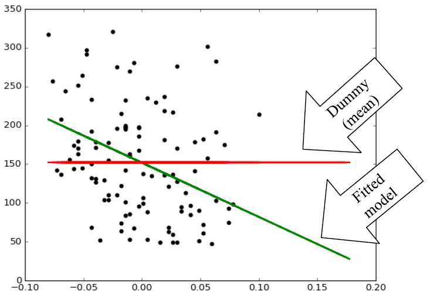
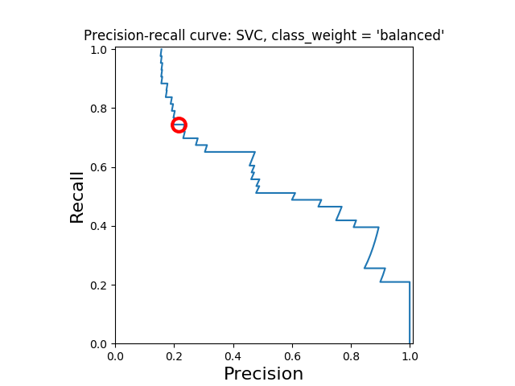
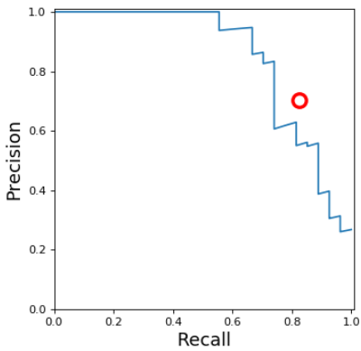
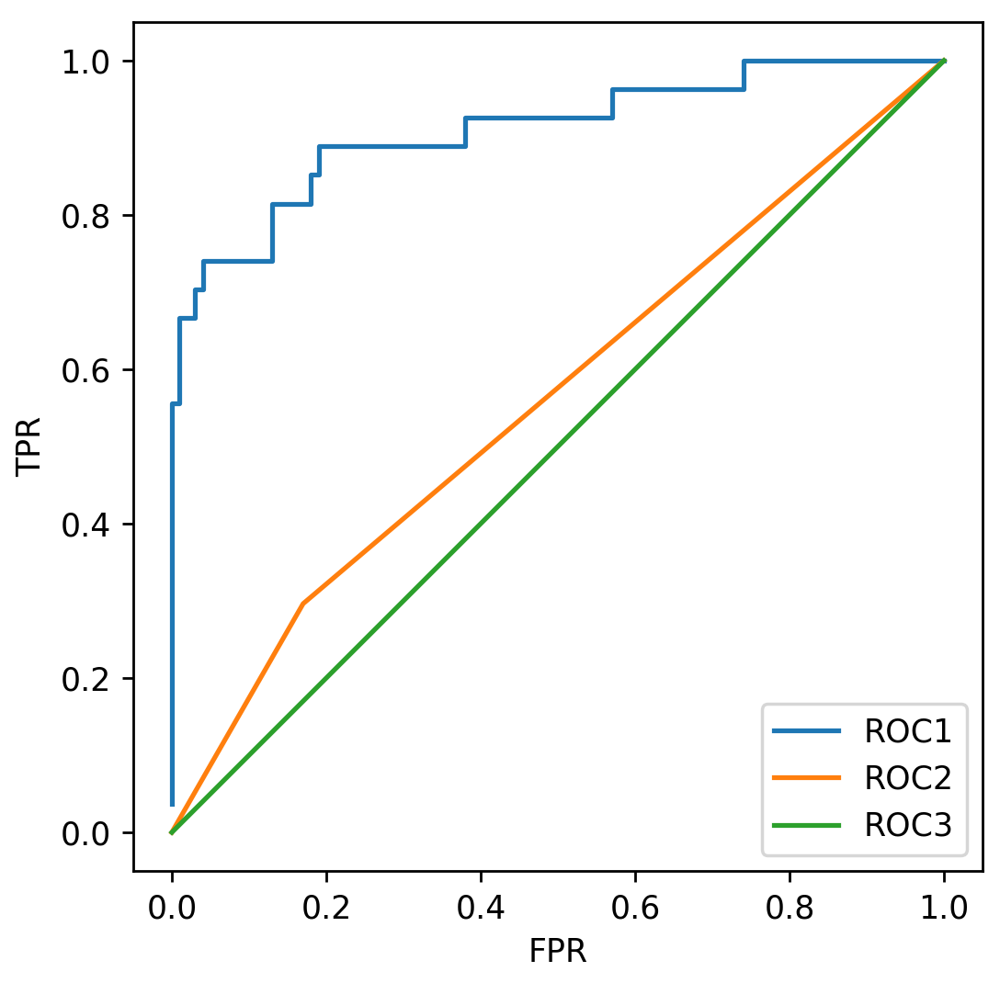

# Module 3: [Evaluation](./03-Evaluation.md)

## Module 3 Notebook

+ [Web Note Launch Page](https://www.coursera.org/learn/python-machine-learning/notebook/g7cJG/module-3-notebook)
+ [Web Notebook](https://hub.coursera-notebooks.org/user/elkljxyoytcwjbmkgctrtg/notebooks/Module%203.ipynb)
+ [Local Notebook](./notebooks/Module03.ipynb)
+ [Local Python Code](./notebooks/Module03.py)

## Model Evaluation & Selection

### Note

+ Learning objectives
    + Understand why accuracy only gives a partial picture of a classifier's performance.
    + Understand the motivation and definition of important evaluation metrics in machine learning.
    + Learn how to use a variety of evaluation metrics to evaluate supervised machine learning models.
    + Learn about choosing the right metric for selecting between models or for doing parameter tuning.

+ Represent / Train / Evaluate / Refine Cycle
    <a href="https://www.coursera.org/learn/python-machine-learning/lecture/BE2l9/model-evaluation-selection">
        <br/>
    </a>
    + surrogate metric: the objective function that's optimized during the training phase may be a different

+ Evaluation
    + Different applications have very different goals
    + Accuracy is widely used, but many others are possible, e.g.:
        + User satisfaction (Web search)
        + Amount of revenue (e-commerce)
        + Increase in patient survival rates (medical)
    + It's very important to choose evaluation methods that match the goal of your application.
    + Compute your selected evaluation metric for multiple different models.
    + Then select the model with 'best' value of evaluation metric.

+ Accuracy with __imbalanced classes__
    + Suppose you have two classes:
        + Relevant (__R__): the _positive_ class
        + Not_Relevant(__N__): the _negative_ class
    + Out of 1000 randomly selected items, on average
        + One item is relevant and has an R label
        + The rest of the items (999 of them) are not relevant and labelled N.
    + Recall that:

        $$\text{Accuracy} = \frac{\text{\# correct predictions}}{\text{\# total instances}}$$
    + You build a classifier to predict relevant items, and see that its accuracy on a test set is $99.9\%$.
    + Wow! Amazingly good, right?
    + For comparison, suppose we had a "dummy" classifier that didn't look at the features at all, and always just blindly predicted the most frequent class (i.e. the negative N class).
    + Assuming a test set of $1000$ instances, what would this dummy classifier's accuracy be?
    + Answer: $\text{Accuracy}_{\text{DUMMY}} = 999 / 1000 = 99.9\%$

+ Dummy classifiers completely ignore the input data!
    + Dummy classifiers serve as a sanity check on your classifier's performance.
    + They provide a __null metric__ (e.g. null accuracy) baseline.
    + Dummy classifiers should not be used for real problems.
    + Some commonly-used settings for the `strategy` parameter for `DummyClassifier` in scikit-learn:
        + __most_frequent__: predicts the most frequent label in the training set.
        + __stratified__: random predictions based on training set class distribution.
        + __uniform__: generates predictions uniformly at random.
        + __constant__: always predicts a constant label provided by the user.
            + A major motivation of this method is F1-scoring, when the positive class is in the minority.
    + Use metrics other than accuracy
    + AUC: under the curve

+ What if my classifier accuracy is close to the null accuracy baseline? <br/>
    This could be a sign of:
    + Ineffective, erroneous or missing features
    + Poor choice of kernel or hyperparameter
    + Large class imbalance 

+ Dummy regressors <br/>
    + `DummyRegression` for Regression as counterpart of `DummyClassifier` for Classifier
    + `strategy` parameter options:
        + _mean_: predicts the mean of the training targets.
        + _median_: predicts the median of the training targets.
        + _quantile_: predicts a user-provided quantile of the training targets.
        + _constant_: predicts a constant user-provided value.

+ Binary prediction outcomes
    <a href="https://www.coursera.org/learn/python-machine-learning/lecture/BE2l9/model-evaluation-selection">
        <br/>
    </a>
    <a href="https://www.researchgate.net/publication/230614354_How_to_evaluate_performance_of_prediction_methods_Measures_and_their_interpretation_in_variation_effect_analysis/figures?lo=1">
        
    </a>
    + confusion matrix: This matrix of all combinations of predicted label and true label
    + N: total number of instances

+ Confusion matrix for binary prediction task
    <a href="https://www.coursera.org/learn/python-machine-learning/lecture/BE2l9/model-evaluation-selection">
        <br/>
    </a>
    + Every test instance is in exactly one box (integer counts).
    + Breaks down classifier results by error type.
    + Thus, provides more information than simple accuracy.
    + Helps you choose an evaluation metric that matches project goals.
    + Not a single number like accuracy.. but there are many possible metrics that can be derived from the confusion matrix.
    + Multi-class classifier with k classes: $k x k$ matrix


+ Demo
    ```python
    %matplotlib notebook
    import numpy as np
    import pandas as pd
    import seaborn as sns
    import matplotlib.pyplot as plt
    from sklearn.model_selection import train_test_split
    from sklearn.datasets import load_digits

    dataset = load_digits()
    X, y = dataset.data, dataset.target

    for class_name, class_count in zip(dataset.target_names, np.bincount(dataset.target)):
        print(class_name,class_count)
    # 0 178
    # 1 182
    # 2 177
    # 3 183
    # 4 181
    # 5 182
    # 6 181
    # 7 179
    # 8 174
    # 9 180

    # Creating a dataset with imbalanced binary classes:  
    # Negative class (0) is 'not digit 1' 
    # Positive class (1) is 'digit 1'
    y_binary_imbalanced = y.copy()
    y_binary_imbalanced[y_binary_imbalanced != 1] = 0

    print('Original labels:\t', y[1:30])
    print('New binary labels:\t', y_binary_imbalanced[1:30])
    # Original labels:  [1 2 3 4 5 6 7 8 9 0 1 2 3 4 5 6 7 8 9 0 1 2 3 4 5 6 7 8 9]
    # New binary labels:  [1 0 0 0 0 0 0 0 0 0 1 0 0 0 0 0 0 0 0 0 1 0 0 0 0 0 0 0 0]

    np.bincount(y_binary_imbalanced)    # Negative class (0) is the most frequent class
    # array([1615,  182], dtype=int64)

    X_train, X_test, y_train, y_test = train_test_split(X, y_binary_imbalanced, random_state=0)
    # 0.90888888888888886

    # Accuracy of Support Vector Machine classifier
    from sklearn.svm import SVC

    svm = SVC(kernel='rbf', C=1).fit(X_train, y_train)
    svm.score(X_test, y_test)

    # ### Dummy Classifiers
    # DummyClassifier is a classifier that makes predictions using simple rules, which 
    # can be useful as a baseline for comparison against actual classifiers, especially 
    # with imbalanced classes.
    from sklearn.dummy import DummyClassifier

    # Negative class (0) is most frequent
    dummy_majority = DummyClassifier(strategy = 'most_frequent').fit(X_train, y_train)
    # Therefore the dummy 'most_frequent' classifier always predicts class 0
    y_dummy_predictions = dummy_majority.predict(X_test)
    # array([0, 0, 0, 0, 0, 0, 0, 0, 0, 0, 0, 0, 0, 0, 0, 0, 0, 0, 0, 0, 0, 0, 0,
    #        0, 0, 0, 0, 0, 0, 0, 0, 0, 0, 0, 0, 0, 0, 0, 0, 0, 0, 0, 0, 0, 0, 0,
    #        0, 0, 0, 0, 0, 0, 0, 0, 0, 0, 0, 0, 0, 0, 0, 0, 0, 0, 0, 0, 0, 0, 0,
    #        ...    ...     ...     ...     ...     ...     ...     ...     ...
    #        0, 0, 0, 0, 0, 0, 0, 0, 0, 0, 0, 0, 0, 0, 0, 0, 0, 0, 0, 0, 0, 0, 0,
    #        0, 0, 0, 0, 0, 0, 0, 0, 0, 0, 0, 0, 0])

    dummy_majority.score(X_test, y_test)

    svm = SVC(kernel='linear', C=1).fit(X_train, y_train)   # 0.9044444444444445
    svm.score(X_test, y_test)                               # 0.97777777777777775

    # ### Confusion matrices
    # #### Binary (two-class) confusion matrix
    from sklearn.metrics import confusion_matrix

    # Negative class (0) is most frequent
    dummy_majority = DummyClassifier(strategy = 'most_frequent').fit(X_train, y_train)
    y_majority_predicted = dummy_majority.predict(X_test)
    confusion = confusion_matrix(y_test, y_majority_predicted)
    print('Most frequent class (dummy classifier)\n', confusion)
    # Most frequent class (dummy classifier)
    #  [[407   0]
    #  [ 43   0]]

    # produces random predictions w/ same class proportion as training set
    dummy_classprop = DummyClassifier(strategy='stratified').fit(X_train, y_train)
    y_classprop_predicted = dummy_classprop.predict(X_test)
    confusion = confusion_matrix(y_test, y_classprop_predicted)
    print('Random class-proportional prediction (dummy classifier)\n', confusion)
    # Random class-proportional prediction (dummy classifier)
    #  [[372  35]
    #  [ 39   4]]

    svm = SVC(kernel='linear', C=1).fit(X_train, y_train)
    svm_predicted = svm.predict(X_test)
    confusion = confusion_matrix(y_test, svm_predicted)
    print('Support vector machine classifier (linear kernel, C=1)\n', confusion)
    # Support vector machine classifier (linear kernel, C=1)
    #  [[402   5]
    #  [  5  38]]

    from sklearn.linear_model import LogisticRegression

    lr = LogisticRegression().fit(X_train, y_train)
    lr_predicted = lr.predict(X_test)
    confusion = confusion_matrix(y_test, lr_predicted)
    print('Logistic regression classifier (default settings)\n', confusion)
    # Logistic regression classifier (default settings)
    #  [[401   6]
    #  [  6  37]]

    from sklearn.tree import DecisionTreeClassifier

    dt = DecisionTreeClassifier(max_depth=2).fit(X_train, y_train)
    tree_predicted = dt.predict(X_test)
    confusion = confusion_matrix(y_test, tree_predicted)
    print('Decision tree classifier (max_depth = 2)\n', confusion)
    # Decision tree classifier (max_depth = 2)
    #  [[400   7]
    #  [ 17  26]]
    ```

### Lecture Video

<a href="https://d3c33hcgiwev3.cloudfront.net/n4ge2T6FEee3MRIl4lCYSA.processed/full/360p/index.mp4?Expires=1536883200&Signature=Nb8qRgdnN4JrgKmkaiI7JXbQdRBVWFNvWfW4peY5JQTJg9wL4OeM0ny5Vj9q8~BuvfXsdWtAlGjQUUtQH2hRv6~byZbIbUbZR-~8yuPM14ecmjoQL2oGeaFjnX3B7u-mPaQqgiZf-ZxJ0kptP5Pbo51Lhk0J2BeVK0SmMIIKeSo_&Key-Pair-Id=APKAJLTNE6QMUY6HBC5A" alt="Model Evaluation & Selection" target="_blank">
     
</a>


## Confusion Matrices & Basic Evaluation Metrics

### Note

+ Confusion Matrix for Binary Prediction Task
    <a href="https://www.coursera.org/learn/python-machine-learning/lecture/BE2l9/model-evaluation-selection">
        <br/>
    </a>

    + Always look at the confusion matrix for your classifier

+ Visualization of Different Error Types
    <a href="https://www.coursera.org/learn/python-machine-learning/lecture/BE2l9/model-evaluation-selection"> 
        <br/>
    </a>
    + Black points: True class positive, namely digit one
    + White pointss: True class negative
    + Black line: a hypothetical linear classifier's decision boundary, positive class on left and negative class on right
    + True Positive (TP): black points in the positive prediction region
    + True Negative (TF): white points in the positive prediction region
    + False Positive (FP): white points in the positive prediction region
    + False Negative (FN): black points in the positive prediction region

+ Confusion Matrix for Binary Prediction Task
    <a href="https://www.coursera.org/learn/python-machine-learning/lecture/BE2l9/model-evaluation-selection"> <br/> &nbsp;&nbsp;&nbsp;&nbsp;&nbsp;&nbsp;&nbsp;&nbsp;&nbsp;&nbsp;&nbsp;&nbsp;&nbsp;&nbsp;&nbsp;&nbsp;&nbsp;&nbsp;
        
    </a>
    + __Accuracy__: for what fraction of all instances is the classifier's prediction correct (for either positive or negative class)?

        $$\text{Accuracy} = \frac{NP + T{}{TN + TP + FN + FP}} = \frac{400 + 26}{400 + 26 + 17 + 7} = 0.95$$
    + __Classification error (1 – Accuracy)__: for what fraction of all instances is the classifier's prediction incorrect?

        $$ ClassificationError = \frac{FP + FN}{TN + TP + FN + FP} = \frac{7 + 17}{400 + 26 + 17 + 7} = 0.060$$
    + __Recall__, or __True Positive Rate (TPR)__: what fraction of all positive instances does the classifier correctlyidentify as positive?

        $$Recall = \frac{TP}{TP + FN} = \frac{26}{26 + 17} = 0.60$$
        + Recall is also known as
            + True Positive Rate (TPR)
            + Sensitivity
            + Probability of detection
    + __Precision__: what fraction of positive predictions are correct?

        $$ Precision = \frac{TP}{TP + FP} = \frac{26}{26 + 7} = 0.79 $$
    + __False positive rate (FPR)__: what fraction of all negative instances does the classifier incorrectly identify as positive?

        $$ FPR = \frac{FP}{TN + FP} = \frac{7}{400 + 7} = 0.02$$
        + a.k.a. __Specificity__

+ A Graphical Illustration of Precision & Recall
    <a href="https://www.coursera.org/learn/python-machine-learning/lecture/BE2l9/model-evaluation-selection">
        <br/>
    </a>

    + The Precision-Recall Tradeoff
        <a href="https://www.coursera.org/learn/python-machine-learning/lecture/BE2l9/model-evaluation-selection">
            <br/>
        </a>

    + High Precision, Lower Recall
        <a href="https://www.coursera.org/learn/python-machine-learning/lecture/BE2l9/model-evaluation-selection">
            <br/>
        </a>

    + Low Precision, High Recall
        <a href="https://www.coursera.org/learn/python-machine-learning/lecture/BE2l9/model-evaluation-selection">
            <br/>
        </a>

+ There is often a tradeoff between precision and recall
    + Recall-oriented machine learning tasks:
        + Search and information extraction in legal discovery
        + Tumor detection
        + Often paired with a human expert to filter out false positives
    + Precision-oriented machine learning tasks:
        + Search engine ranking, query suggestion
        + Document classification
        + Many customer-facing tasks (users remember failures!)

+ F-score
    + F1-score: combining precision & recall into a single number

        $$ F_1 = 2 \cdot \frac{Precision \cdot Recall}{precision + Recall} = \frac{2 \cdot TP}{2 \cdot TP + FN + FP}$$
    + F-score: generalizes F1-score for combining precision & recall into a single number

        $$F_{\beta} = (1 + \beta^2) \cdot \frac{Precision \cdot Recall}{(\beta^2 \cdot Precision) + Recall} = \frac{(1 + \beta^2) \cdot TP}{(1 + \beta^2) \cdot TP + \beta \cdot FN + FP}$$
        + $\beta$ allows adjustment of the metric to control the emphasis on recall vs precision:
            + Precision-oriented users: $\beta = 0.5$ (false positives hurt performance more than false negatives)
            + Recall-oriented users: $\beta = 2$ (false negatives hurt performance more than false positives)

+ Demo
    ```python
    from sklearn.metrics import accuracy_score, precision_score, recall_score, f1_score
    # Accuracy = TP + TN / (TP + TN + FP + FN)
    # Precision = TP / (TP + FP)
    # Recall = TP / (TP + FN)  Also known as sensitivity, or True Positive Rate
    # F1 = 2 * Precision * Recall / (Precision + Recall) 
    print('Accuracy: {:.2f}'.format(accuracy_score(y_test, tree_predicted)))
    print('Precision: {:.2f}'.format(precision_score(y_test, tree_predicted)))
    print('Recall: {:.2f}'.format(recall_score(y_test, tree_predicted)))
    print('F1: {:.2f}'.format(f1_score(y_test, tree_predicted)))
    # Accuracy: 0.95
    # Precision: 0.79
    # Recall: 0.60
    # F1: 0.68

    # Combined report with all above metrics
    from sklearn.metrics import classification_report

    print(classification_report(y_test, tree_predicted, target_names=['not 1', '1']))
    #                 precision  recall  f1-score   support
    #       not 1     0.96       0.98    0.97       407
    #           1     0.79       0.60    0.68        43
    # avg / total     0.94       0.95    0.94       450

    print('Random class-proportional (dummy)\n', 
        classification_report(y_test, y_classprop_predicted, target_names=['not 1', '1']))
    print('SVM\n', 
        classification_report(y_test, svm_predicted, target_names = ['not 1', '1']))
    print('Logistic regression\n', 
        classification_report(y_test, lr_predicted, target_names = ['not 1', '1']))
    print('Decision tree\n', 
        classification_report(y_test, tree_predicted, target_names = ['not 1', '1']))
    # Random class-proportional (dummy)
    #               precision    recall  f1-score   support
    # 
    #       not 1       0.91      0.91      0.91       407
    #           1       0.10      0.09      0.10        43
    # 
    # avg / total       0.83      0.84      0.83       450
    # 
    # SVM
    #               precision    recall  f1-score   support
    # 
    #       not 1       0.99      0.99      0.99       407
    #           1       0.88      0.88      0.88        43
    # 
    # avg / total       0.98      0.98      0.98       450
    # 
    # Logistic regression
    #               precision    recall  f1-score   support
    # 
    #       not 1       0.99      0.99      0.99       407
    #           1       0.86      0.86      0.86        43
    # 
    # avg / total       0.97      0.97      0.97       450
    # 
    # Decision tree
    #               precision    recall  f1-score   support
    # 
    #       not 1       0.96      0.98      0.97       407
    #           1       0.79      0.60      0.68        43
    # 
    # avg / total       0.94      0.95      0.94       450
    ```

### Lecture Video

<a href="https://d3c33hcgiwev3.cloudfront.net/4gasyz6FEee2TA5yccyTSg.processed/full/360p/index.mp4?Expires=1536883200&Signature=JVw~A~1O9I1P2g8TM3V8w9flpCq037msbx0ihmQ24tyZoOv11XNoZbOTdW7i1TWp062vIUh8Coo3Nc~2mtLgmhD820CdHVqkLYkjH1zn0hgGaE09SMkQhYiJmUnANXQmQFp52qjadBJ5zbKonXrk~AErCYcX02y2Z01L2nr96gE_&Key-Pair-Id=APKAJLTNE6QMUY6HBC5A" alt="Confusion Matrices & Basic Evaluation Metrics" target="_blank">
     
</a>


## Classifier Decision Functions

### Note

+ Decision Functions (decision_function)
    + Each classifier score value per test point indicates how confidently the classifier predicts the positive class (large-magnitude positive values) or the negative class (large-magnitude negative values).
    + Choosing a fixed decision threshold gives a classification rule.
    + By sweeping the decision threshold through the entire range of possible score values, we get a series of classification outcomes that form a curve.

+ Predicted Probability of Class Membership (predict_proba)
    + Typical rule: choose most likely class
        + e.gclass 1 if threshold > 0.50.
    + Adjusting threshold affects predictions of classifier.
    + Higher threshold results in a more conservative classifier
        + e.g. only predict Class 1 if estimated probability of class 1 is above 70%
        + This increases precision. Doesn't predict class 1 as often, but when it does, it gets high proportion of class 1 instances correct.
    + Not all models provide realistic probability estimates

+ Varying the Decision Threshold

    | True Label | Classifier score | | True Label | Classifier score |
    |------------|------------------|-|------------|------------------|
    | 0 | -27.6457 | | 0 | -25.8486 |
    | 0 | -25.1011 | | 0 | -24.1511 |
    | 0 | -23.1765 | | 0 | -22.575 |
    | 0 | -21.8271 | | 0 | -21.7226 |
    | 0 | -19.7361 | | 0 | -19.5768 |
    | 0 | -19.3071 | | 0 | -18.9077 |
    | 0 | -13.5411 | | 0 | -12.8594 |
    | 1 | -3.9128 |  | 0 | -1.9798 |
    | 1 | 1.824 |  | 0 | 4.74931 |
    | 1 | 15.234624 |  | 1 | 21.20597 |

    | Classifier score threshold | Precision | Recall |
    |----------------------------|-----------|--------|
    | -20 | 4/12=0.34 | 4/4=1.00 |
    | -10 | 4/6=0.67 | 4/4=1.00 |
    | 0 | 3/4=0.75 | 3/4=0.75 |
    | 10 | 2/2=1.0 | 2/4=0.50 |
    | 20 | 1/1=1.0 | 1/4 = 0.25 |

    <a href="https://www.coursera.org/learn/python-machine-learning/lecture/0YPe1/classifier-decision-functions">
        
    </a>


+ Demo
    ```python
    # ### Decision functions
    X_train, X_test, y_train, y_test = train_test_split(X, y_binary_imbalanced, random_state=0)
    y_scores_lr = lr.fit(X_train, y_train).decision_function(X_test)
    y_score_list = list(zip(y_test[0:20], y_scores_lr[0:20]))
    # [(0, -23.176547400757663), (0, -13.541223742469006), (0, -21.722500473360618),
    #  (0, -18.907578437722535), (0, -19.736034587372778), (0, -9.7493459511792651),
    #  (1, 5.2349002124953099),  (0, -19.30716117885968),  (0, -25.101015601857377),
    #  (0, -21.827250934235906), (0, -24.150855663826746), (0, -19.576844844946265),
    #  (0, -22.574902551102674), (0, -10.823739601445064), (0, -11.912425566043064),
    #  (0, -10.97956652705531),  (1, 11.205846086251944),  (0, -27.645770221552823),
    #  (0, -12.859636015637092), (0, -25.848590145556187)]

    X_train, X_test, y_train, y_test = train_test_split(X, y_binary_imbalanced, random_state=0)
    y_proba_lr = lr.fit(X_train, y_train).predict_proba(X_test)
    y_proba_list = list(zip(y_test[0:20], y_proba_lr[0:20,1]))
    # [(0, 8.6010872706740499e-11), (0, 1.3155903495453823e-06), (0, 3.6816111034009875e-10),
    #  (0, 6.1452989618944584e-09), (0, 2.6837934145133791e-09), (0, 5.8329401240781557e-05),
    #  (1, 0.99470087426871634),    (0, 4.1210362715903745e-09)  (0, 1.2553575357627774e-11),
    #  (0, 3.3154719959007555e-10), (0, 3.2465093048358345e-11), (0, 3.1469099051059103e-09),
    #  (0, 1.5698002448420801e-10), (0, 1.9920533537070619e-05), (0, 6.706507243234968e-06),
    #  (0, 1.7046194538057202e-05), (1, 0.99998640569605668),    (0, 9.8535912965519826e-13),
    #  (0, 2.6009374594983658e-06), (0, 5.9442892596185542e-12)]

    # ### Precision-recall curves
    from sklearn.metrics import precision_recall_curve

    precision, recall, thresholds = precision_recall_curve(y_test, y_scores_lr)
    closest_zero = np.argmin(np.abs(thresholds))
    closest_zero_p = precision[closest_zero]
    closest_zero_r = recall[closest_zero]

    plt.figure()
    plt.xlim([0.0, 1.01])
    plt.ylim([0.0, 1.01])
    plt.plot(precision, recall, label='Precision-Recall Curve')
    plt.plot(closest_zero_p, closest_zero_r, 'o', markersize = 12, fillstyle = 'none', c='r', mew=3)
    plt.xlabel('Precision', fontsize=16)
    plt.ylabel('Recall', fontsize=16)
    plt.axes().set_aspect('equal')
    plt.show()
    ```
    <a href="https://www.coursera.org/learn/python-machine-learning/lecture/0YPe1/classifier-decision-functions">
        
    </a>

### Lecture Video

<a href="https://d3c33hcgiwev3.cloudfront.net/zxFPUz6FEeeR4AqenwJvyA.processed/full/360p/index.mp4?Expires=1536883200&Signature=KjE0qGwonCOca4-bh2ZZFfNBML6WyABR4RGyijJbKA~S7HS1YwuL9R4LEvzg0Ii2Mv78SBveugPxUgLO8qLD01Lu49MgwxuhaiRYi9doGLWccg2v7gmn3a8acWR5Zks7GcO-1i-ZpPZXNvNArbYOjnSqVq2jERGPTzp47Zzjyng_&Key-Pair-Id=APKAJLTNE6QMUY6HBC5A" alt="Classifier Decision Functions" target="_blank">
     
</a>


## Precision-recall and ROC curves

### Note


+ Classifier Decision Functions
    + X-axis: Precision
    + Y-axis: Recall
    + Top right corner:
        + The “ideal” point
        + Precision = 1.0
        + Recall = 1.0
    + “Steepness” of P-R curves is important:
        + Maximize precision
        + while maximizing recall
    <a href="https://www.coursera.org/learn/python-machine-learning/lecture/8v6DL/precision-recall-and-roc-curves"><br/>
        
    </a>

+ ROC Curves
    + ROC: Receiver Operating Characteristics
    + X-axis: False Positive Rate
    + Y-axis: True Positive Rate
    + Top left corner:
        + The “ideal” point
        + False positive rate of zero
        + True positive rate of one
    + “Steepness” of ROC curves is important:
        + Maximize the true positive rate
        + while minimizing the false positive rate
    <a href="https://www.coursera.org/learn/python-machine-learning/lecture/8v6DL/precision-recall-and-roc-curves"><br/>
        
    </a>

+ ROC curve examples
    + Random guessing
        <a href="https://www.coursera.org/learn/python-machine-learning/lecture/8v6DL/precision-recall-and-roc-curves"><br/>
            
        </a>
    + Perfect classifier
        <a href="https://www.coursera.org/learn/python-machine-learning/lecture/8v6DL/precision-recall-and-roc-curves"><br/>
            
        </a>
    + Bad, okay,
        <a href="https://www.coursera.org/learn/python-machine-learning/lecture/8v6DL/precision-recall-and-roc-curves"><br/>
            
        </a>

+ Summarizing an ROC curve in one number: Area Under the Curve (AUC)
    + AUC = 0 (worst) AUC = 1 (best)
    + AUC can be interpreted as:
        1. The total area under the ROC curve.
        2. The probability that the classifier will assign a higher score to a randomly chosen positive example than to a randomly chosen   + negative example.
    + Advantages:
        + Gives a single number for easy comparison.
        + Does not require specifying a decision threshold.
    + Drawbacks:
        + As with other single-number metrics, AUC loses information, e.g. about tradeoffs and the shape of the ROC curve.
        + This may be a factor to consider when e.g. wanting to compare the performance of classifiers with overlapping ROC curves.
    <a href="https://www.coursera.org/learn/python-machine-learning/lecture/8v6DL/precision-recall-and-roc-curves"><br/>
        
    </a>


+ Demo 1
    ```python
    from sklearn.metrics import roc_curve, auc

    X_train, X_test, y_train, y_test = train_test_split(X, y_binary_imbalanced, random_state=0)

    y_score_lr = lr.fit(X_train, y_train).decision_function(X_test)
    fpr_lr, tpr_lr, _ = roc_curve(y_test, y_score_lr)
    roc_auc_lr = auc(fpr_lr, tpr_lr)

    plt.figure()
    plt.xlim([-0.01, 1.00])
    plt.ylim([-0.01, 1.01])
    plt.plot(fpr_lr, tpr_lr, lw=3, label='LogRegr ROC curve (area = {:0.2f})'.format(roc_auc_lr))
    plt.xlabel('False Positive Rate', fontsize=16)
    plt.ylabel('True Positive Rate', fontsize=16)
    plt.title('ROC curve (1-of-10 digits classifier)', fontsize=16)
    plt.legend(loc='lower right', fontsize=13)
    plt.plot([0, 1], [0, 1], color='navy', lw=3, linestyle='--')
    plt.axes().set_aspect('equal')  # left plot

    from matplotlib import cm

    X_train, X_test, y_train, y_test = train_test_split(X, y_binary_imbalanced, random_state=0)

    plt.figure()
    plt.xlim([-0.01, 1.00])
    plt.ylim([-0.01, 1.01])
    for g in [0.01, 0.1, 0.20, 1]:
        svm = SVC(gamma=g).fit(X_train, y_train)
        y_score_svm = svm.decision_function(X_test)
        fpr_svm, tpr_svm, _ = roc_curve(y_test, y_score_svm)
        roc_auc_svm = auc(fpr_svm, tpr_svm)
        accuracy_svm = svm.score(X_test, y_test)
        print("gamma = {:.2f}  accuracy = {:.2f}   AUC = {:.2f}".format(g, accuracy_svm, roc_auc_svm))
        plt.plot(fpr_svm, tpr_svm, lw=3, alpha=0.7, 
                label='SVM (gamma = {:0.2f}, area = {:0.2f})'.format(g, roc_auc_svm))

    plt.xlabel('False Positive Rate', fontsize=16)
    plt.ylabel('True Positive Rate (Recall)', fontsize=16)
    plt.plot([0, 1], [0, 1], color='k', lw=0.5, linestyle='--')
    plt.legend(loc="lower right", fontsize=11)
    plt.title('ROC curve: (1-of-10 digits classifier)', fontsize=16)
    plt.axes().set_aspect('equal')

    plt.show()                      # right plt
    # gamma = 0.01  accuracy = 0.91   AUC = 1.00
    # gamma = 0.10  accuracy = 0.90   AUC = 0.98
    # gamma = 0.20  accuracy = 0.90   AUC = 0.66
    # gamma = 1.00  accuracy = 0.90   AUC = 0.50
    ```
    <a href="url"> <br/>
        
    </a>
    <a href="url">
        
    </a>

### Lecture Video

<a href="https://d3c33hcgiwev3.cloudfront.net/7QzJvD6FEee2TA5yccyTSg.processed/full/360p/index.mp4?Expires=1536883200&Signature=Z7qcBxZq7~rGuyqNG14q2NjuUodasmZjY8vnrHJFlisdQ0vfvAt07NkmrP-F2UM3LsvPYgW~L-9Oasbz9604aV2MF~wqka2F7dmbjQSyfuwWSrElXeNkx41nFo2ObEmynogoyk~LuFwriGcvfWJNj37uGR5Rqk4Cy3OE8Rrlnkg_&Key-Pair-Id=APKAJLTNE6QMUY6HBC5A" alt="Precision-recall and ROC curves" target="_blank">
     
</a>


## Multi-Class Evaluation

### Note


+ Multi-Class Evaluation
    + Multi-class evaluation is an extension of the binary case.
        + A collection of true vs predicted binary outcomes, one per class
        + Confusion matrices are especially useful
        + Classification report
    + Overall evaluation metrics are averages across classes
        + But there are different ways to average multi-class results: we will cover these shortly.
        + The support (number of instances) for each class is important to consider, e.g. in case of imbalanced classes
    + Multi-label classification: each instance can have multiple labels (not covered here)

+ Multi-Class Confusion Matrix
    <a href="https://www.coursera.org/learn/python-machine-learning/lecture/1ugJR/multi-class-evaluation"><br/>
        
    </a>

+ Micro vs Macro Average - Example

    | Class | Predicted Class | Correct? |
    |-------|-----------------|----------|
    | orange | lemon | 0 |
    | orange | lemon | 0 |
    | orange | apple | 0 |
    | orange | orange | 1 |
    | orange | apple | 0 |
    | lemon | lemon | 1 |
    | lemon | apple | 0 |
    | apple | apple | 1 |
    | apple | apple | 1 |

    + Macro-average:
        + Each __class__ has equal weight.
        + Procedures:
            1. Compute metric within each class
            2. Average resulting metrics across classes <br/>&nbsp;&nbsp;&nbsp;&nbsp;
                Class       &nbsp;&nbsp;&nbsp;&nbsp;&nbsp;&nbsp;&nbsp;&nbsp;Precision<br/>&nbsp;&nbsp;&nbsp;&nbsp;
                `--------------`<br/>&nbsp;&nbsp;&nbsp;&nbsp;
                orange      &nbsp;&nbsp;&nbsp;&nbsp;$1/5 = 0.20$ <br/>&nbsp;&nbsp;&nbsp;&nbsp;
                lemon       &nbsp;&nbsp;&nbsp;&nbsp;&nbsp;$1/2 = 0.50$ <br/>&nbsp;&nbsp;&nbsp;&nbsp;
                apple       &nbsp;&nbsp;&nbsp;&nbsp;&nbsp;&nbsp;$2/2 = 1.00$ <br/>
            Macro-average precision: $(0.20 + 0.50 + 1.00) / 3 = 0.57$

    + Micro-average:
        + Each __instance__ has equal weight.
        + Largest classes have most influence
        + Procedures:
            1. Aggregrateoutcomes across all classes
            2. Compute metric with aggregate outcomes
        
            Micro-average precision: $4 / 9 = 0.44$

+ Macro-Average vs Micro-Average
    + If the classes have about the same number of instances, macro-and micro-average will be about the same.
    + If some classes are much larger (more instances) than others, and you want to:
        + Weight your metric toward the largest ones, use micro-averaging.
        + Weight your metric toward the smallest ones, use macro-averaging.
    + If the micro-average is much lower than the macro-average then examine the larger classes for poor metric performance.
    + If the macro-average is much lower than the micro-average then examine the smaller classes for poor metric performance.

+ Multi-class Evaluation Metrics via the "Average" Parameter for a Scoring Function
    + Micro: Metric on aggregated instances
    + Macro: Mean per-class metric, classes have equal weight
    + Weighted: Mean per-class metric, weighted by support
    + Samples: for multi-label problems only


+ Demo
    ```python
    # #### Multi-class confusion matrix
    dataset = load_digits()
    X, y = dataset.data, dataset.target
    X_train_mc, X_test_mc, y_train_mc, y_test_mc = train_test_split(X, y, random_state=0)

    svm = SVC(kernel = 'linear').fit(X_train_mc, y_train_mc)
    svm_predicted_mc = svm.predict(X_test_mc)
    confusion_mc = confusion_matrix(y_test_mc, svm_predicted_mc)
    df_cm = pd.DataFrame(confusion_mc, 
        index = [i for i in range(0,10)], columns = [i for i in range(0,10)])

    plt.figure(figsize=(5.5,4))
    sns.heatmap(df_cm, annot=True)
    plt.title('SVM Linear Kernel \nAccuracy:{0:.3f}'
        .format(accuracy_score(y_test_mc, svm_predicted_mc)))
    plt.ylabel('True label')
    plt.xlabel('Predicted label')       # left plot

    svm = SVC(kernel = 'rbf').fit(X_train_mc, y_train_mc)
    svm_predicted_mc = svm.predict(X_test_mc)
    confusion_mc = confusion_matrix(y_test_mc, svm_predicted_mc)
    df_cm = pd.DataFrame(confusion_mc, index = [i for i in range(0,10)],
                    columns = [i for i in range(0,10)])

    plt.figure(figsize = (5.5,4))
    sns.heatmap(df_cm, annot=True)
    plt.title('SVM RBF Kernel \nAccuracy:{0:.3f}'
        .format(accuracy_score(y_test_mc, svm_predicted_mc)))
    plt.ylabel('True label')
    plt.xlabel('Predicted label');      # right plot
    ```
    <a href="https://www.coursera.org/learn/python-machine-learning/lecture/1ugJR/multi-class-evaluation"><br/>
        
    </a>
    <a href="https://www.coursera.org/learn/python-machine-learning/lecture/1ugJR/multi-class-evaluation">
        
    </a>

+ Demo 2: 
    ```python
    # #### Multi-class classification report
    print(classification_report(y_test_mc, svm_predicted_mc))
    #              precision    recall  f1-score   support
    #           0       1.00      0.65      0.79        37
    #           1       1.00      0.23      0.38        43
    #           2       1.00      0.39      0.56        44
    #           3       1.00      0.93      0.97        45
    #           4       0.14      1.00      0.25        38
    #           5       1.00      0.33      0.50        48
    #           6       1.00      0.54      0.70        52
    #           7       1.00      0.35      0.52        48
    #           8       1.00      0.02      0.04        48
    #           9       1.00      0.55      0.71        47
    # 
    # avg / total       0.93      0.49      0.54       450

    # #### Micro- vs. macro-averaged metrics
    print('Micro-averaged precision = {:.2f} (treat instances equally)'
        .format(precision_score(y_test_mc, svm_predicted_mc, average = 'micro')))
    print('Macro-averaged precision = {:.2f} (treat classes equally)'
        .format(precision_score(y_test_mc, svm_predicted_mc, average = 'macro')))
    # Micro-averaged precision = 0.49 (treat instances equally)
    # Macro-averaged precision = 0.91 (treat classes equally)

    print('Micro-averaged f1 = {:.2f} (treat instances equally)'
        .format(f1_score(y_test_mc, svm_predicted_mc, average = 'micro')))
    print('Macro-averaged f1 = {:.2f} (treat classes equally)'
        .format(f1_score(y_test_mc, svm_predicted_mc, average = 'macro')))
    # Micro-averaged f1 = 0.49 (treat instances equally)
    # Macro-averaged f1 = 0.54 (treat classes equally)
    ```

### Lecture Video

<a href="https://d3c33hcgiwev3.cloudfront.net/N52UsEC9EeekFhJ0WUQQxA.processed/full/360p/index.mp4?Expires=1536883200&Signature=DriAPvEKQbp1KLc1wiQsvkx3kFgtNf249Z665mq2R39GliDcpBUNeVZXypgAUNlVuitLs~5qjfaAirNVMhEddbyc5sCTOCvqVLNDGA5dpYBfmV-I4zj99b9l~rsg~Uq20bHqtSybIwFbNWhJ~Z0t1Oor0mMZ1RGvLz7n81M6ahM_&Key-Pair-Id=APKAJLTNE6QMUY6HBC5A" alt="Multi-Class Evaluation" target="_blank">
     
</a>


## Regression Evaluation

### Note

+ Regression metrics
    + Typically r2_score is enough
        + Reminder: computes how well future instances will be predicted
        + Best possible score is $1.0$
        + Constant prediction score is $0.0$
    + Alternative metrics include:
        + `mean_absolute_error` (absolute difference of target & predicted values)
        + `mean_squared_error` (squared difference of target & predicted values)
        + `median_absolute_error` (robust to outliers)

+ Dummy regressors
    + As in classification, comparison to a 'dummy' prediction model that uses a fixed rule can be useful. 
    + For this, scikit.learn provides __dummy regressors__.
    <a href="https://www.coursera.org/learn/python-machine-learning/lecture/iKS4j/regression-evaluation"><br/>
        
    </a>
    <a href="https://www.coursera.org/learn/python-machine-learning/lecture/iKS4j/regression-evaluation">
        
    </a>
        + Linear model, coefficients: [-698.80206267]
        + Mean squared error (dummy): 4965.13
        + Mean squared error (linear model): 4646.74
        + r2_score (dummy): -0.00
        + r2_score (linear model): 0.06
    + The `DummyRegressorclass` implements four simple baseline rules for regression, using the strategy parameter:
        + `mean` predicts the mean of the training target values.
        + `median` predicts the median of the training target values.
        + `quantile` predicts a user-provided quantile of the training target values (e.g. value at the 75th percentile)
        + `constant` predicts a custom constant value provided by the user.

+ Demo
    ```python
    # ### Regression evaluation metrics
    %matplotlib notebook
    import matplotlib.pyplot as plt
    import numpy as np
    from sklearn.model_selection import train_test_split
    from sklearn import datasets
    from sklearn.linear_model import LinearRegression
    from sklearn.metrics import mean_squared_error, r2_score
    from sklearn.dummy import DummyRegressor

    diabetes = datasets.load_diabetes()

    X = diabetes.data[:, None, 6]
    y = diabetes.target

    X_train, X_test, y_train, y_test = train_test_split(X, y, random_state=0)

    lm = LinearRegression().fit(X_train, y_train)
    lm_dummy_mean = DummyRegressor(strategy = 'mean').fit(X_train, y_train)

    y_predict = lm.predict(X_test)
    y_predict_dummy_mean = lm_dummy_mean.predict(X_test)

    print('Linear model, coefficients: ', lm.coef_)
    print("Mean squared error (dummy): {:.2f}"
        .format(mean_squared_error(y_test, y_predict_dummy_mean)))
    print("Mean squared error (linear model): {:.2f}".format(mean_squared_error(y_test, y_predict)))
    print("r2_score (dummy): {:.2f}".format(r2_score(y_test, y_predict_dummy_mean)))
    print("r2_score (linear model): {:.2f}".format(r2_score(y_test, y_predict)))

    # Plot outputs
    plt.scatter(X_test, y_test,  color='black')
    plt.plot(X_test, y_predict, color='green', linewidth=2)
    plt.plot(X_test, y_predict_dummy_mean, color='red', 
        linestyle = 'dashed', linewidth=2, label = 'dummy')

    plt.show()
    # Linear model, coefficients:  [-698.80206267]
    # Mean squared error (dummy): 4965.13
    # Mean squared error (linear model): 4646.74
    # r2_score (dummy): -0.00
    # r2_score (linear model): 0.06
    ```
    <a href="https://www.coursera.org/learn/python-machine-learning/lecture/iKS4j/regression-evaluation"><br/>
        
    </a>

### Lecture Video

<a href="https://d3c33hcgiwev3.cloudfront.net/ED9ofT6GEee2TA5yccyTSg.processed/full/360p/index.mp4?Expires=1536969600&Signature=JFEiRHjHOY~FTPTkDQI1MbR-UQ6YsgMUVrnd~U8bRDWYNySnaeRn4wiVvulOxrUsOB6Pb6eul15Ccb9-PFTCQVKn8KxF28AE2MEV1j81bHd5vwSb2ZRV5KfPU6z6XnqYlYXrd~0nReKhhYBD1PmxeA1La0KauoVwTHbTElbyNcA_&Key-Pair-Id=APKAJLTNE6QMUY6HBC5A" alt="Regression Evaluation" target="_blank">
     
</a>


## Practical Guide to Controlled Experiments on the Web (optional)

Beyond the essential evaluation metrics covered in this course, online controlled experiments, which involve A-B testing and other techniques, are perhaps the most important way that machine learning algorithms are evaluated for real-world use in Web and other online applications. This article by Ron Kohavi, Randal Henne, and Dan Sommerfield, reviews the key points of running controlled experiments, along with important engineering issues and limitations to keep in mind when using them.

Kohavi, R., Henne, R. M., & Sommerfield, D. (2007). [Practical guide to controlled experiments on the web](https://ai.stanford.edu/~ronnyk/2007GuideControlledExperiments.pdf). Proceedings of the 13th ACM SIGKDD international conference on Knowledge discovery and data mining - KDD '07. doi:10.1145/1281192.1281295


## Model Selection: Optimizing Classifiers for Different Evaluation Metrics

### Note

+ Model Selection Using Evaluation Metrics
    + Train/test on same data
        + Single metric.
        + Typically overfits and likely won't generalize well to new data.
        + But can serve as a sanity check: low accuracy on the training set may indicate an implementation problem.
    + Single train/test split
        + Single metric.
        + Speed and simplicity.
        + Lack of variance information
    + K-fold cross-validation
        + K train-test splits.
        + Average metric over all splits.
        + Can be combined with parameter grid search: `GridSearchCV` (def. cv = 3)

+ Example: Optimizing a Classifier Using Different Evaluation Metrics
    <a href="https://www.coursera.org/learn/python-machine-learning/lecture/meBKr/model-selection-optimizing-classifiers-for-different-evaluation-metrics">
        <br/>
    </a>

+ Example: Precision-Recall Curve of Default Support Vector Classifier
    <a href="https://www.coursera.org/learn/python-machine-learning/lecture/meBKr/model-selection-optimizing-classifiers-for-different-evaluation-metrics">
        <br/>
    </a>

+ Training, Validation, and Test Frameworkfor Model Selection and Evaluation
    + Using only cross-validation or a test set to do model selection may lead to more subtle overfitting / optimistic generalization estimates
    + Instead, use three data splits:
        1. Training set (model building)
        2. Validation set (model selection)
        3. Test set (final evaluation)
    + In practice:
        + Create an initial training/test split
        + Do cross-validation on the training data for model/parameter selection
        + Save the held-out test set for final model evaluation

+ Concluding Notes
    + Accuracy is often not the right evaluation metric for many real-world machine learning tasks
        + False positives and false negatives may need to be treated very differently
        + Make sure you understand the needs of your application and choose an evaluation metric that matches your application, user, or business goals.
    + Examples of additional evaluation methods include:
        + Learning curve: How much does accuracy (or other metric) change as a function of the amount of training data?
        + Sensitivity analysis: How much does accuracy (or other metric) change as a function of key learning parameter values?


+ Demo 1
    ```python
    # #### Cross-validation example
    from sklearn.model_selection import cross_val_score
    from sklearn.svm import SVC

    dataset = load_digits()
    # again, making this a binary problem with 'digit 1' as positive class 
    # and 'not 1' as negative class
    X, y = dataset.data, dataset.target == 1
    clf = SVC(kernel='linear', C=1)

    # accuracy is the default scoring metric
    print('Cross-validation (accuracy)', cross_val_score(clf, X, y, cv=5))
    # use AUC as scoring metric
    print('Cross-validation (AUC)', cross_val_score(clf, X, y, cv=5, scoring = 'roc_auc'))
    # use recall as scoring metric
    print('Cross-validation (recall)', cross_val_score(clf, X, y, cv=5, scoring = 'recall'))
    # Cross-validation (accuracy) [ 0.91944444  0.98611111  0.97214485  0.97493036  0.96935933]
    # Cross-validation (AUC) [ 0.9641871   0.9976571   0.99372205  0.99699002  0.98675611]
    # Cross-validation (recall) [ 0.81081081  0.89189189  0.83333333  0.83333333  0.83333333]

    # #### Grid search example
    from sklearn.svm import SVC
    from sklearn.model_selection import GridSearchCV
    from sklearn.metrics import roc_auc_score

    dataset = load_digits()
    X, y = dataset.data, dataset.target == 1
    X_train, X_test, y_train, y_test = train_test_split(X, y, random_state=0)

    clf = SVC(kernel='rbf')
    grid_values = {'gamma': [0.001, 0.01, 0.05, 0.1, 1, 10, 100]}

    # default metric to optimize over grid parameters: accuracy
    grid_clf_acc = GridSearchCV(clf, param_grid = grid_values)
    grid_clf_acc.fit(X_train, y_train)
    y_decision_fn_scores_acc = grid_clf_acc.decision_function(X_test) 

    print('Grid best parameter (max. accuracy): ', grid_clf_acc.best_params_)
    print('Grid best score (accuracy): ', grid_clf_acc.best_score_)

    # alternative metric to optimize over grid parameters: AUC
    grid_clf_auc = GridSearchCV(clf, param_grid = grid_values, scoring = 'roc_auc')
    grid_clf_auc.fit(X_train, y_train)
    y_decision_fn_scores_auc = grid_clf_auc.decision_function(X_test) 

    print('Test set AUC: ', roc_auc_score(y_test, y_decision_fn_scores_auc))
    print('Grid best parameter (max. AUC): ', grid_clf_auc.best_params_)
    print('Grid best score (AUC): ', grid_clf_auc.best_score_)
    # Grid best parameter (max. accuracy):  {'gamma': 0.001}
    # Grid best score (accuracy):  0.996288047513
    # Test set AUC:  0.999828581224
    # Grid best parameter (max. AUC):  {'gamma': 0.001}
    # Grid best score (AUC):  0.99987412783

    # #### Evaluation metrics supported for model selection
    from sklearn.metrics.scorer import SCORERS

    print(sorted(list(SCORERS.keys())))
    # ['accuracy', 'adjusted_mutual_info_score', 'adjusted_rand_score', 'average_precision', 
    # 'completeness_score', 'explained_variance', 'f1', 'f1_macro', 'f1_micro', 'f1_samples', 
    # 'f1_weighted', 'fowlkes_mallows_score', 'homogeneity_score', 'log_loss', 
    # 'mean_absolute_error', 'mean_squared_error', 'median_absolute_error', 'mutual_info_score', 
    # 'neg_log_loss', 'neg_mean_absolute_error', 'neg_mean_squared_error', 
    # 'neg_mean_squared_log_error', 'neg_median_absolute_error', 'normalized_mutual_info_score', 
    # 'precision', 'precision_macro', 'precision_micro', 'precision_samples', 
    # 'precision_weighted', 'r2', 'recall', 'recall_macro', 'recall_micro', 'recall_samples', 
    # 'recall_weighted', 'roc_auc', 'v_measure_score']

    # ### Two-feature classification example using the digits dataset
    # #### Optimizing a classifier using different evaluation metrics
    from sklearn.datasets import load_digits
    from sklearn.model_selection import train_test_split
    from adspy_shared_utilities import plot_class_regions_for_classifier_subplot
    from sklearn.svm import SVC
    from sklearn.model_selection import GridSearchCV

    dataset = load_digits()
    X, y = dataset.data, dataset.target == 1
    X_train, X_test, y_train, y_test = train_test_split(X, y, random_state=0)

    # Create a two-feature input vector matching the example plot above
    # We jitter the points (add a small amount of random noise) in case there are areas
    # in feature space where many instances have the same features.
    jitter_delta = 0.25
    X_twovar_train = X_train[:,[20,59]]+ np.random.rand(X_train.shape[0], 2) - jitter_delta
    X_twovar_test  = X_test[:,[20,59]] + np.random.rand(X_test.shape[0], 2) - jitter_delta

    clf = SVC(kernel = 'linear').fit(X_twovar_train, y_train)
    grid_values = {'class_weight':['balanced', {1:2},{1:3},{1:4},{1:5},{1:10},{1:20},{1:50}]}
    plt.figure(figsize=(9,6))
    for i, eval_metric in enumerate(('precision','recall', 'f1','roc_auc')):
        grid_clf_custom = GridSearchCV(clf, param_grid=grid_values, scoring=eval_metric)
        grid_clf_custom.fit(X_twovar_train, y_train)
        print('Grid best parameter (max. {0}): {1}'
            .format(eval_metric, grid_clf_custom.best_params_))
        print('Grid best score ({0}): {1}'
            .format(eval_metric, grid_clf_custom.best_score_))
        plt.subplots_adjust(wspace=0.3, hspace=0.3)
        plot_class_regions_for_classifier_subplot(grid_clf_custom, X_twovar_test, y_test, 
            None, None, None,  plt.subplot(2, 2, i+1))
        
        plt.title(eval_metric+'-oriented SVC')
    plt.tight_layout()
    plt.show()      # left plot
    # Grid best parameter (max. precision): {'class_weight': {1: 2}}
    # Grid best score (precision): 0.5364331779495704
    # Grid best parameter (max. recall): {'class_weight': {1: 50}}
    # Grid best score (recall): 0.9284149447808437
    # Grid best parameter (max. f1): {'class_weight': {1: 3}}
    # Grid best score (f1): 0.4955650747228387
    # Grid best parameter (max. roc_auc): {'class_weight': {1: 20}}

    # #### Precision-recall curve for the default SVC classifier (with balanced class weights)
    from sklearn.model_selection import train_test_split
    from sklearn.metrics import precision_recall_curve
    from adspy_shared_utilities import plot_class_regions_for_classifier
    from sklearn.svm import SVC

    dataset = load_digits()
    X, y = dataset.data, dataset.target == 1
    X_train, X_test, y_train, y_test = train_test_split(X, y, random_state=0)

    # create a two-feature input vector matching the example plot above
    jitter_delta = 0.25
    X_twovar_train = X_train[:,[20,59]]+ np.random.rand(X_train.shape[0], 2) - jitter_delta
    X_twovar_test  = X_test[:,[20,59]] + np.random.rand(X_test.shape[0], 2) - jitter_delta

    clf = SVC(kernel='linear', class_weight='balanced').fit(X_twovar_train, y_train)

    y_scores = clf.decision_function(X_twovar_test)

    precision, recall, thresholds = precision_recall_curve(y_test, y_scores)
    closest_zero = np.argmin(np.abs(thresholds))
    closest_zero_p = precision[closest_zero]
    closest_zero_r = recall[closest_zero]

    plot_class_regions_for_classifier(clf, X_twovar_test, y_test)
    plt.title("SVC, class_weight = 'balanced', optimized for accuracy")
    plt.show()      # right plot
    ```
    <a href="https://www.coursera.org/learn/python-machine-learning/lecture/meBKr/model-selection-optimizing-classifiers-for-different-evaluation-metrics">
        <br/>
    </a>
    <a href="https://www.coursera.org/learn/python-machine-learning/lecture/meBKr/model-selection-optimizing-classifiers-for-different-evaluation-metrics">
        
    </a>

+ Demo 2:
    ```python
    plt.figure()
    plt.xlim([0.0, 1.01])
    plt.ylim([0.0, 1.01])
    plt.title ("Precision-recall curve: SVC, class_weight = 'balanced'")
    plt.plot(precision, recall, label = 'Precision-Recall Curve')
    plt.plot(closest_zero_p, closest_zero_r, 'o', markersize=12, fillstyle='none', c='r', mew=3)
    plt.xlabel('Precision', fontsize=16)
    plt.ylabel('Recall', fontsize=16)
    plt.axes().set_aspect('equal')
    plt.show()
    print('At zero threshold, precision: {:.2f}, recall: {:.2f}'
        .format(closest_zero_p, closest_zero_r))
    # At zero threshold, precision: 0.22, recall: 0.74
    ```
    <a href="https://www.coursera.org/learn/python-machine-learning/lecture/meBKr/model-selection-optimizing-classifiers-for-different-evaluation-metrics">
        <br/>
    </a>

### Lecture Video

<a href="https://d3c33hcgiwev3.cloudfront.net/MTn7gFzsEeejtgqYK5OBTg.processed/full/360p/index.mp4?Expires=1536969600&Signature=Z7XuYqumT9d1~wNhneDuGyxXiVhHYbh-OACyXjT1jIVpIf7~pnGcsWvoEojpvID~VXM8hS~JIUSr1Xps~KIJcw74WzxuGCKQQI7vKPGmqiS2AkoyNfH3bBWz-CIDGSGcoevmKDtS73FkEXAZhFTMn53VIcgtjk1QHfYe4E-vHJ0_&Key-Pair-Id=APKAJLTNE6QMUY6HBC5A" alt="Model Selection: Optimizing Classifiers for Different Evaluation Metrics" target="_blank">
     
</a>


## Quiz: Module 3 Quiz

Q1. A supervised learning model has been built to predict whether someone is infected with a new strain of a virus. 0.5The probability of any one person having the virus is 1%. Using accuracy as a metric, what would be a good choice for a baseline accuracy score that the new model would want to outperform?

    Ans: x0.5

+ [Q1](https://www.coursera.org/learn/python-machine-learning/discussions/weeks/3/threads/yAQZrFB_EeeHCRK3oa8qzA)

    Think back to the imbalanced classes example in the first lecture of week3, the base Accuracy was chosen based on the majority class

    for example

    let the probability of heads result in an unfair coin toss be 10%. If the classifier tried just to guess the result based in the probability(i.e. the majority class) e.i. if we had 100 samples which are tails, the classifier is likely to predict 90 to be tails correctly, this is simply because the likelihood of getting tails is the majority. The base accuracy in this case will be samples predicted correctly/samples =90% and you will expect any classifier to achieve an accuracy of at least 90%

    like I stated above, the accuracy is the probability of the majority class (the larger class), i..e The probability of any one person not having the virus.

    recall that P(A)+P(Not A) =1, since P(any one person having the virus.) is given, the rest is a matter of subtraction.

    At the beginning of the notebook, the following is stated:

    In this assignment you'll train several models and evaluate how effectively they predict instances of fraud.

    The above is meant to tell you that we have a binary classification task (i.e. fraud/not fraud).

    It also indicates that the positive class i.e. the class represented as 1 in the target column(it may not be named target but it usually is the last column and you'll expect it to have only two values 0 or 1); corresponds to cases (rows) that belong to a fraud case.


Q2. Given the following confusion matrix:

| Predicted Positive | Predicted Negative |
|--------------------|--------------------|
| Condition Positive | 96 | 4 |
| Condition Negative | 8 | 19 |

Compute the accuracy to three decimal places.

    Ans: 0.923

Q3. Given the following confusion matrix:

| Predicted Positive | Predicted Negative |
|--------------------|--------------------|
| Condition Positive | 96 | 4 |
| Condition Negative | 8 | 19 |

Compute the precision to three decimal places.

    Ans: 0.923

Q4. Given the following confusion matrix:

| Predicted Positive | Predicted Negative |
|--------------------|--------------------|
| Condition Positive | 96 | 4 |
| Condition Negative | 8 | 19 |

Compute the recall to three decimal places.

    Ans: 0.960

Q5. Using the fitted model `m` create a precision-recall curve to answer the following question:

For the fitted model `m`, approximately what precision can we expect for a recall of 0.8?

(Use y_test and X_test to compute the precision-recall curve. If you wish to view a plot, you can use `plt.show()` )

    Ans: 0.7, x0.75

+ [Q5](https://www.coursera.org/learn/python-machine-learning/discussions/weeks/3/threads/o8gc4nK0EeeWGQ6jD8LE1g)

    the question asks what the expected precision would be if recall was .8

    this means we need to find the precision, recall then plot then and use the plot to find precision

    1. the classifier(m) is already defined no need to define it
    2. calculate y_decision using the decision function on X_test. m has already been fitted so there is no need for fitting
    3. plug y_test and y_decision into precision_recall_curve to find precision and recall arrays
    4. plot precision vs recall (x = recall, y=precision) using matplotlib.pyplot plot function
    5. find .8 on the x axis then find the corresponding value on the y axis

    ```python
    from sklearn.metrics import precision_recall_curve

    y_scores_lr = m.fit(X_train, y_train).decision_function(X_test)
    precision, recall, thresholds = precision_recall_curve(y_test, y_scores_lr)
    closest_zero = np.argmin(np.abs(thresholds))
    closest_zero_p = precision[closest_zero]
    closest_zero_r = recall[closest_zero]

    plt.figure()
    plt.xlim([0.0, 1.01])
    plt.ylim([0.0, 1.01])
    plt.plot(precision, recall, label='Precision-Recall Curve')
    plt.plot(closest_zero_p, closest_zero_r, 'o', markersize = 12, fillstyle = 'none', c='r', mew=3)
    plt.xlabel('Precision', fontsize=16)
    plt.ylabel('Recall', fontsize=16)
    plt.axes().set_aspect('equal')
    plt.show()
    ```
    


Q6. Given the following models and AUC scores, match each model to its corresponding ROC curve.

+ Model 1 test set AUC score: 0.91
+ Model 2 test set AUC score: 0.50
+ Model 3 test set AUC score: 0.56

<a href="https://www.coursera.org/learn/python-machine-learning/exam/Wxgra/module-3-quiz"> <br/>
    
</a>

    a. Model 1: Roc 1, Model 2: Roc 2, Model 3: Roc 3
    b. Model 1: Roc 1, Model 2: Roc 3, Model 3: Roc 2
    c. Model 1: Roc 2, Model 2: Roc 3, Model 3: Roc 1
    d. Model 1: Roc 3, Model 2: Roc 2, Model 3: Roc 1
    e. Not enough information is given.

    Ans: b

Q7. Given the following models and accuracy scores, match each model to its corresponding ROC curve.

+ Model 1 test set AUC score: 0.91
+ Model 2 test set AUC score: 0.50
+ Model 3 test set AUC score: 0.56

<a href="https://www.coursera.org/learn/python-machine-learning/exam/Wxgra/module-3-quiz"> <br/>
    
</a>

    a. Model 1: Roc 1, Model 2: Roc 2, Model 3: Roc 3
    b. Model 1: Roc 1, Model 2: Roc 3, Model 3: Roc 2
    c. Model 1: Roc 2, Model 2: Roc 3, Model 3: Roc 1
    d. Model 1: Roc 3, Model 2: Roc 2, Model 3: Roc 1
    e. Not enough information is given.

    Ans: e

+ [Q7](https://www.coursera.org/learn/python-machine-learning/discussions/weeks/3/threads/Rps2MlBCEeeFiQ58IQLPLA)

    ROC is the graph resulting from plotting True Positive Rate([sensitivity](https://en.wikipedia.org/wiki/Sensitivity_(tests)) vs. False Positive Rate(1 − [specificity](https://en.wikipedia.org/wiki/Specificity_(tests))), AUC is the area under that curve, not sure what you mean by dx, the mathematical relationship between TPR and FPR is described [here](https://en.wikipedia.org/wiki/Receiver_operating_characteristic)

    I don't think you can represent the relationship Accuracy vs ROC mathematically, they are two different metrics, you may find this [validated article](https://stats.stackexchange.com/questions/68893/area-under-curve-of-roc-vs-overall-accuracy) useful in clarifying the difference between the two.


    We cannot conclude a high AUC will result in a high accuracy and vice versa. Just to say we have a sample of 10 positive examples and 9990 negative examples, it is possible that we get a high accuracy(predict almost all with negative) but a low AUROC(predict not well on positive data points).

    There are some discussions that could be found here.

    https://stats.stackexchange.com/questions/90659/why-is-auc-higher-for-a-classifier-that-is-less-accurate-than-for-one-that-is-mo

    https://datascience.stackexchange.com/questions/806/advantages-of-auc-vs-standard-accuracy


Q8. Using the fitted model `m` what is the micro precision score?

(Use y_test and X_test to compute the precision score.)

    Ans: x0.74
    
+ [Q8](https://www.coursera.org/learn/python-machine-learning/discussions/weeks/3/threads/o8gc4nK0EeeWGQ6jD8LE1g)
    **** could be micro or macro

    m is already a fitted model on X_train and y_train, there is no need to create a new model, to see the parameters of m you can use print ,

    here is what you need to do

    1. use m.predict on X_test to find y_predict
    2. use precision_score function with the required averaging on y_test and y_predict
    3. copy the result into the text box
    4. the order in which y_test(y_true) and y_predict are passed to the precision_score function is important, when in doubt use

    ```python
    svm_predicted_mc = m.predict(X_test)

    print('Micro-averaged precision = {:.2f} (treat instances equally)'
            .format(precision_score(y_test, svm_predicted_mc, average = 'micro')))
    print('Macro-averaged precision = {:.2f} (treat classes equally)'
            .format(precision_score(y_test, svm_predicted_mc, average = 'macro')))
    # Micro-averaged precision = 0.74 (treat instances equally)
    # Macro-averaged precision = 0.81 (treat classes equally)
    ```

Q9. Which of the following is true of the R-Squared metric? (Select all that apply)

    a. A model that always predicts the mean of y would get a negative score
    b. A model that always predicts the mean of y would get a score of 0.0
    c. The best possible score is 1.0
    d. The worst possible score is 0.0

    Ans: xcd-0.5 

Q10. In a future society, a machine is used to predict a crime before it occurs. If you were responsible for tuning this machine, what evaluation metric would you want to maximize to ensure no innocent people (people not about to commit a crime) are imprisoned (where crime is the positive label)?

    a. Accuracy
    b. Precision
    c. Recall
    d. F1
    e. AUC

    Ans: xc


Q11. Consider the machine from the previous question. If you were responsible for tuning this machine, what evaluation metric would you want to maximize to ensure all criminals (people about to commit a crime) are imprisoned (where crime is the positive label)?

    a. Accuracy
    b. Precision
    c. Recall
    d. F1
    e. AUC

    Ans: xb

Q12. A classifier is trained on an imbalanced multiclass dataset. After looking at the model’s precision scores, you find that the micro averaging is much smaller than the macro averaging score. Which of the following is most likely happening?

    a. The model is probably misclassifying the frequent labels more than the infrequent labels.
    b. The model is probably misclassifying the infrequent labels more than the frequent labels.

    Ans: a

Q13. Using the already defined RBF SVC model `m`, run a grid search on the parameters C and gamma, for values [0.01, 0.1, 1, 10]. The grid search should find the model that best optimizes for recall. How much better is the recall of this model than the precision? (Compute recall - precision to 3 decimal places)

(Use y_test and X_test to compute precision and recall.)

    Ans: x0.8

```python

grid_values = {'gamma': [0.01, 0.1, 1, 10], 'C':  [0.01, 0.1, 1, 10]}

for i, eval_metric in enumerate(('precision','recall', 'f1','roc_auc')):
    grid_clf_custom = GridSearchCV(m, param_grid=grid_values, scoring=eval_metric)
    grid_clf_custom.fit(X_test, y_test)
    print('Grid best parameter (max. {0}): {1}'
        .format(eval_metric, grid_clf_custom.best_params_))
    print('Grid best score ({0}): {1}'
        .format(eval_metric, grid_clf_custom.best_score_))

# Grid best parameter (max. precision): {'C': 0.1, 'gamma': 1}
# Grid best score (precision): 1.0
# Grid best parameter (max. recall): {'C': 1, 'gamma': 1}
# Grid best score (recall): 0.8
# Grid best parameter (max. f1): {'C': 1, 'gamma': 10}
# Grid best score (f1): 0.8053333333333333
# Grid best parameter (max. roc_auc): {'C': 10, 'gamma': 0.1}
# Grid best score (roc_auc): 0.9305555555555556
```


+ [Q13 & 14](https://www.coursera.org/learn/python-machine-learning/discussions/weeks/3/threads/gwn8HFatEeeqKgpTZZjjFg)

    IMPORTANT: The grid search needs to be used only once in each question

    Q13

    1. grid_recall = run grid search with scoring='recall' with model m and grid values {'C': [0.01, 0.1, 1, 10] , 'gamma': [0.01, 0.1, 1, 10] }
    2. fit grid_recall with X_train and y_train
    3. y_pred = use grid_recall predict on X_test
    4. use recall_score and precision_score on y_test and y_pred to calculate recall and precision
    5. result = recall-precision

    Q14

    1. grid_precison = run grid search with scoring='precision' with model m and grid values {'C': [0.01, 0.1, 1, 10] , 'gamma': [0.01, 0.1, 1, 10] }
    2. fit grid_precision with X_train and y_train
    3. y_pred = use grid_precision predict on X_test
    4. use recall_score and precision_score on y_test and y_pred to calculate recall and precision
    5. result = precision-recall

+ [Q13](https://www.coursera.org/learn/python-machine-learning/discussions/weeks/3/threads/N3pdg5wSEeeNexIKzDOQDA)

    ```python
    # wrong code
    #recall--------------
    grid = {'C':[0.01, 0.1, 1, 10],'gamma': [0.01, 0.1, 1, 10], 'kernel': ['rbf']}

    gs = GridSearchCV(m, grid, scoring='recall').fit(...)
    y_decision_recall_scores_acc = gs.decision_function(...)

    #precision-----------
    gsp = GridSearchCV(m, grid, scoring='precision').fit(...)
    y_decision_precision_scores_acc = gsp.decision_function(...)

    print(gs.best_score_-gsp.best_score_)

    # Staff suggest
    grid_values = {...}
    grid_search = run_grid search with model m and scoring ='recall' and fit on X_train y_train
    y_pred = run grid_search best_estimator's predict on X_test
    recall = run recall_score on y_test, y_pred
    precision = run precision_score on y_test, y_pred
    result =  recall-precisoin

    print('Recall-Precision: {:.2f}'.format(recall_score(y_test, y_pred_recall) -precision_score(y_test, y_pred_recall)))
    print('Precision-Recall: {:.2f}'.format(precion_score(y_test, y_pred_recall) -recall_score(y_test, y_pred_recall)))

    ```

+ [Q13 & Q14](https://www.coursera.org/learn/python-machine-learning/discussions/weeks/3/threads/R3H4h1E0Eeep9w5HRnu7Hg)

    As pointed by people above, there is no need to train a new SVC. If you want an example, you could refer to the sklearn [doc](http://scikit-learn.org/stable/modules/generated/sklearn.model_selection.GridSearchCV.html) and that should make sense!


+ [Q13 & 14](https://www.coursera.org/learn/python-machine-learning/discussions/weeks/3/threads/3lmtH1hWEees3A5L052WIA)

    If you see the example [here](http://scikit-learn.org/stable/modules/generated/sklearn.metrics.recall_score.html), what you need is the prediction but not the probability.

+ [Q13](https://www.coursera.org/learn/python-machine-learning/discussions/weeks/3/threads/M9oe0TOQEeizYg4713QR1g)

    Steve, 'C' is the penalty constant for misclassification in the SVC (Support Vector Classifier), you need to re-visit the lecture that covers that classifier. There's also a detailed discussion with example graphs on [stackexchange](https://stats.stackexchange.com/questions/31066/what-is-the-influence-of-c-in-svms-with-linear-kernel).

    To answer the quiz you need to also understand what GridSearchCV() does. It is called with a set of parameters to try for a classifier, and will try all specified combinations. You first generate such a GridSearchCV object by specifying its parameters, and then call fit() on it to do the actual work. Its usage is covered in the lecture Model Selection - Optimizing Classifiers for Different Evaluation Metrics.


14. Using the already defined RBF SVC model `m`, run a grid search on the parameters C and gamma, for values [0.01, 0.1, 1, 10]. The grid search should find the model that best optimizes for precision. How much better is the precision of this model than the recall? (Compute precision - recall to 3 decimal places)

(Use y_test and X_test to compute precision and recall.)


    Ans: x1.0


