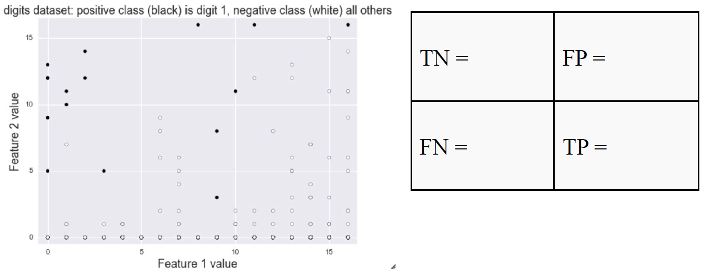

# Module 3: [Evaluation](./03-Evaluation.md)

## Module 3 Notebook

+ [Web Note Launch Page](https://www.coursera.org/learn/python-machine-learning/notebook/g7cJG/module-3-notebook)
+ [Web Notebook](https://hub.coursera-notebooks.org/user/elkljxyoytcwjbmkgctrtg/notebooks/Module%203.ipynb)
+ [Local Notebook](./notebooks/Module03.ipynb)
+ [Local Python Code](./notebooks/Module03.py)

## Model Evaluation & Selection

### Note

+ Learning objectives
    + Understand why accuracy only gives a partial picture of a classifier's performance.
    + Understand the motivation and definition of important evaluation metrics in machine learning.
    + Learn how to use a variety of evaluation metrics to evaluate supervised machine learning models.
    + Learn about choosing the right metric for selecting between models or for doing parameter tuning.

+ Represent / Train / Evaluate / Refine Cycle
    <a href="https://www.coursera.org/learn/python-machine-learning/lecture/BE2l9/model-evaluation-selection">
        <br/>
    </a>
    + surrogate metric: the objective function that's optimized during the training phase may be a different

+ Evaluation
    + Different applications have very different goals
    + Accuracy is widely used, but many others are possible, e.g.:
        + User satisfaction (Web search)
        + Amount of revenue (e-commerce)
        + Increase in patient survival rates (medical)
    + It's very important to choose evaluation methods that match the goal of your application.
    + Compute your selected evaluation metric for multiple different models.
    + Then select the model with 'best' value of evaluation metric.

+ Accuracy with __imbalanced classes__
    + Suppose you have two classes:
        + Relevant (__R__): the _positive_ class
        + Not_Relevant(__N__): the _negative_ class
    + Out of 1000 randomly selected items, on average
        + One item is relevant and has an R label
        + The rest of the items (999 of them) are not relevant and labelled N.
    + Recall that:

        $$\text{Accuracy} = \frac{\text{\# correct predictions}}{\text{\# total instances}}$$
    + You build a classifier to predict relevant items, and see that its accuracy on a test set is $99.9\%$.
    + Wow! Amazingly good, right?
    + For comparison, suppose we had a "dummy" classifier that didn't look at the features at all, and always just blindly predicted the most frequent class (i.e. the negative N class).
    + Assuming a test set of $1000$ instances, what would this dummy classifier's accuracy be?
    + Answer: $\text{Accuracy}_{\text{DUMMY}} = 999 / 1000 = 99.9\%$

+ Dummy classifiers completely ignore the input data!
    + Dummy classifiers serve as a sanity check on your classifier's performance.
    + They provide a __null metric__ (e.g. null accuracy) baseline.
    + Dummy classifiers should not be used for real problems.
    + Some commonly-used settings for the `strategy` parameter for `DummyClassifier` in scikit-learn:
        + __most_frequent__: predicts the most frequent label in the training set.
        + __stratified__: random predictions based on training set class distribution.
        + __uniform__: generates predictions uniformly at random.
        + __constant__: always predicts a constant label provided by the user.
            + A major motivation of this method is F1-scoring, when the positive class is in the minority.
    + Use metrics other than accuracy
    + AUC: under the curve

+ What if my classifier accuracy is close to the null accuracy baseline? <br/>
    This could be a sign of:
    + Ineffective, erroneous or missing features
    + Poor choice of kernel or hyperparameter
    + Large class imbalance 

+ Dummy regressors <br/>
    + `DummyRegression` for Regression as counterpart of `DummyClassifier` for Classifier
    + `strategy` parameter options:
        + _mean_: predicts the mean of the training targets.
        + _median_: predicts the median of the training targets.
        + _quantile_: predicts a user-provided quantile of the training targets.
        + _constant_: predicts a constant user-provided value.

+ Binary prediction outcomes
    <a href="https://www.coursera.org/learn/python-machine-learning/lecture/BE2l9/model-evaluation-selection">
        <br/>
    </a>
    <a href="https://www.researchgate.net/publication/230614354_How_to_evaluate_performance_of_prediction_methods_Measures_and_their_interpretation_in_variation_effect_analysis/figures?lo=1">
        
    </a>
    + confusion matrix: This matrix of all combinations of predicted label and true label
    + N: total number of instances

+ Confusion matrix for binary prediction task
    <a href="https://www.coursera.org/learn/python-machine-learning/lecture/BE2l9/model-evaluation-selection">
        <br/>
    </a>
    + Every test instance is in exactly one box (integer counts).
    + Breaks down classifier results by error type.
    + Thus, provides more information than simple accuracy.
    + Helps you choose an evaluation metric that matches project goals.
    + Not a single number like accuracy.. but there are many possible metrics that can be derived from the confusion matrix.
    + Multi-class classifier with k classes: $k x k$ matrix


+ Demo
    ```python
    %matplotlib notebook
    import numpy as np
    import pandas as pd
    import seaborn as sns
    import matplotlib.pyplot as plt
    from sklearn.model_selection import train_test_split
    from sklearn.datasets import load_digits

    dataset = load_digits()
    X, y = dataset.data, dataset.target

    for class_name, class_count in zip(dataset.target_names, np.bincount(dataset.target)):
        print(class_name,class_count)
    # 0 178
    # 1 182
    # 2 177
    # 3 183
    # 4 181
    # 5 182
    # 6 181
    # 7 179
    # 8 174
    # 9 180

    # Creating a dataset with imbalanced binary classes:  
    # Negative class (0) is 'not digit 1' 
    # Positive class (1) is 'digit 1'
    y_binary_imbalanced = y.copy()
    y_binary_imbalanced[y_binary_imbalanced != 1] = 0

    print('Original labels:\t', y[1:30])
    print('New binary labels:\t', y_binary_imbalanced[1:30])
    # Original labels:  [1 2 3 4 5 6 7 8 9 0 1 2 3 4 5 6 7 8 9 0 1 2 3 4 5 6 7 8 9]
    # New binary labels:  [1 0 0 0 0 0 0 0 0 0 1 0 0 0 0 0 0 0 0 0 1 0 0 0 0 0 0 0 0]

    np.bincount(y_binary_imbalanced)    # Negative class (0) is the most frequent class
    # array([1615,  182], dtype=int64)

    X_train, X_test, y_train, y_test = train_test_split(X, y_binary_imbalanced, random_state=0)
    # 0.90888888888888886

    # Accuracy of Support Vector Machine classifier
    from sklearn.svm import SVC

    svm = SVC(kernel='rbf', C=1).fit(X_train, y_train)
    svm.score(X_test, y_test)

    # ### Dummy Classifiers
    # DummyClassifier is a classifier that makes predictions using simple rules, which 
    # can be useful as a baseline for comparison against actual classifiers, especially 
    # with imbalanced classes.
    from sklearn.dummy import DummyClassifier

    # Negative class (0) is most frequent
    dummy_majority = DummyClassifier(strategy = 'most_frequent').fit(X_train, y_train)
    # Therefore the dummy 'most_frequent' classifier always predicts class 0
    y_dummy_predictions = dummy_majority.predict(X_test)
    # array([0, 0, 0, 0, 0, 0, 0, 0, 0, 0, 0, 0, 0, 0, 0, 0, 0, 0, 0, 0, 0, 0, 0,
    #        0, 0, 0, 0, 0, 0, 0, 0, 0, 0, 0, 0, 0, 0, 0, 0, 0, 0, 0, 0, 0, 0, 0,
    #        0, 0, 0, 0, 0, 0, 0, 0, 0, 0, 0, 0, 0, 0, 0, 0, 0, 0, 0, 0, 0, 0, 0,
    #        ...    ...     ...     ...     ...     ...     ...     ...     ...
    #        0, 0, 0, 0, 0, 0, 0, 0, 0, 0, 0, 0, 0, 0, 0, 0, 0, 0, 0, 0, 0, 0, 0,
    #        0, 0, 0, 0, 0, 0, 0, 0, 0, 0, 0, 0, 0])

    dummy_majority.score(X_test, y_test)

    svm = SVC(kernel='linear', C=1).fit(X_train, y_train)   # 0.9044444444444445
    svm.score(X_test, y_test)                               # 0.97777777777777775

    # ### Confusion matrices
    # #### Binary (two-class) confusion matrix
    from sklearn.metrics import confusion_matrix

    # Negative class (0) is most frequent
    dummy_majority = DummyClassifier(strategy = 'most_frequent').fit(X_train, y_train)
    y_majority_predicted = dummy_majority.predict(X_test)
    confusion = confusion_matrix(y_test, y_majority_predicted)
    print('Most frequent class (dummy classifier)\n', confusion)
    # Most frequent class (dummy classifier)
    #  [[407   0]
    #  [ 43   0]]

    # produces random predictions w/ same class proportion as training set
    dummy_classprop = DummyClassifier(strategy='stratified').fit(X_train, y_train)
    y_classprop_predicted = dummy_classprop.predict(X_test)
    confusion = confusion_matrix(y_test, y_classprop_predicted)
    print('Random class-proportional prediction (dummy classifier)\n', confusion)
    # Random class-proportional prediction (dummy classifier)
    #  [[372  35]
    #  [ 39   4]]

    svm = SVC(kernel='linear', C=1).fit(X_train, y_train)
    svm_predicted = svm.predict(X_test)
    confusion = confusion_matrix(y_test, svm_predicted)
    print('Support vector machine classifier (linear kernel, C=1)\n', confusion)
    # Support vector machine classifier (linear kernel, C=1)
    #  [[402   5]
    #  [  5  38]]

    from sklearn.linear_model import LogisticRegression

    lr = LogisticRegression().fit(X_train, y_train)
    lr_predicted = lr.predict(X_test)
    confusion = confusion_matrix(y_test, lr_predicted)
    print('Logistic regression classifier (default settings)\n', confusion)
    # Logistic regression classifier (default settings)
    #  [[401   6]
    #  [  6  37]]

    from sklearn.tree import DecisionTreeClassifier

    dt = DecisionTreeClassifier(max_depth=2).fit(X_train, y_train)
    tree_predicted = dt.predict(X_test)
    confusion = confusion_matrix(y_test, tree_predicted)
    print('Decision tree classifier (max_depth = 2)\n', confusion)
    # Decision tree classifier (max_depth = 2)
    #  [[400   7]
    #  [ 17  26]]
    ```

### Lecture Video

<a href="https://d3c33hcgiwev3.cloudfront.net/n4ge2T6FEee3MRIl4lCYSA.processed/full/360p/index.mp4?Expires=1536883200&Signature=Nb8qRgdnN4JrgKmkaiI7JXbQdRBVWFNvWfW4peY5JQTJg9wL4OeM0ny5Vj9q8~BuvfXsdWtAlGjQUUtQH2hRv6~byZbIbUbZR-~8yuPM14ecmjoQL2oGeaFjnX3B7u-mPaQqgiZf-ZxJ0kptP5Pbo51Lhk0J2BeVK0SmMIIKeSo_&Key-Pair-Id=APKAJLTNE6QMUY6HBC5A" alt="Model Evaluation & Selection" target="_blank">
     
</a>


## Confusion Matrices & Basic Evaluation Metrics

### Note

+ Confusion Matrix for Binary Prediction Task
    <a href="https://www.coursera.org/learn/python-machine-learning/lecture/BE2l9/model-evaluation-selection">
        <br/>
    </a>

    + Always look at the confusion matrix for your classifier

+ Visualization of Different Error Types
    <a href="https://www.coursera.org/learn/python-machine-learning/lecture/BE2l9/model-evaluation-selection"> 
        <br/>
    </a>
    + Black points: True class positive, namely digit one
    + White pointss: True class negative
    + Black line: a hypothetical linear classifier's decision boundary, positive class on left and negative class on right
    + True Positive (TP): black points in the positive prediction region
    + True Negative (TF): white points in the positive prediction region
    + False Positive (FP): white points in the positive prediction region
    + False Negative (FN): black points in the positive prediction region

+ Confusion Matrix for Binary Prediction Task
    <a href="https://www.coursera.org/learn/python-machine-learning/lecture/BE2l9/model-evaluation-selection"> <br/> &nbsp;&nbsp;&nbsp;&nbsp;&nbsp;&nbsp;&nbsp;&nbsp;&nbsp;&nbsp;&nbsp;&nbsp;&nbsp;&nbsp;&nbsp;&nbsp;&nbsp;&nbsp;
        
    </a>
    + __Accuracy__: for what fraction of all instances is the classifier's prediction correct (for either positive or negative class)?

        $$\text{Accuracy} = \frac{NP + T{}{TN + TP + FN + FP}} = \frac{400 + 26}{400 + 26 + 17 + 7} = 0.95$$
    + __Classification error (1 – Accuracy)__: for what fraction of all instances is the classifier's prediction incorrect?

        $$ ClassificationError = \frac{FP + FN}{TN + TP + FN + FP} = \frac{7 + 17}{400 + 26 + 17 + 7} = 0.060$$
    + __Recall__, or __True Positive Rate (TPR)__: what fraction of all positive instances does the classifier correctlyidentify as positive?

        $$Recall = \frac{TP}{TP + FN} = \frac{26}{26 + 17} = 0.60$$
        + Recall is also known as
            + True Positive Rate (TPR)
            + Sensitivity
            + Probability of detection
    + __Precision__: what fraction of positive predictions are correct?

        $$ Precision = \frac{TP}{TP + FP} = \frac{26}{26 + 7} = 0.79 $$
    + __False positive rate (FPR)__: what fraction of all negative instances does the classifier incorrectly identify as positive?

        $$ FPR = \frac{FP}{TN + FP} = \frac{7}{400 + 7} = 0.02$$
        + a.k.a. __Specificity__

+ A Graphical Illustration of Precision & Recall
    <a href="https://www.coursera.org/learn/python-machine-learning/lecture/BE2l9/model-evaluation-selection">
        <br/>
    </a>

    + The Precision-Recall Tradeoff
        <a href="https://www.coursera.org/learn/python-machine-learning/lecture/BE2l9/model-evaluation-selection">
            <br/>
        </a>

    + High Precision, Lower Recall
        <a href="https://www.coursera.org/learn/python-machine-learning/lecture/BE2l9/model-evaluation-selection">
            <br/>
        </a>

    + Low Precision, High Recall
        <a href="https://www.coursera.org/learn/python-machine-learning/lecture/BE2l9/model-evaluation-selection">
            <br/>
        </a>

+ There is often a tradeoff between precision and recall
    + Recall-oriented machine learning tasks:
        + Search and information extraction in legal discovery
        + Tumor detection
        + Often paired with a human expert to filter out false positives
    + Precision-oriented machine learning tasks:
        + Search engine ranking, query suggestion
        + Document classification
        + Many customer-facing tasks (users remember failures!)
    + F1-score: combining precision & recall into a single number

        $$ F_1 = 2 \cdot \frac{Precision \cdot Recall}{precision + Recall} = \frac{2 \cdot TP}{2 \cdot TP + FN + FP}$$
    + F-score: generalizes F1-score for combining precision & recall into a single number

        $$F_{\beta} = (1 + \beta^2) \cdot \frac{Precision \cdot Recall}{(\beta^2 \cdot Precision) + Recall} = \frac{(1 + \beta^2) \cdot TP}{(1 + \beta^2) \cdot TP + \beta \cdot FN + FP}$$
        + $\beta$ allows adjustment of the metric to control the emphasis on recall vs precision:
            + Precision-oriented users: $\beta = 0.5$ (false positives hurt performance more than false negatives)
            + Recall-oriented users: $\beta = 2$ (false negatives hurt performance more than false positives)

+ Demo
    ```python
    from sklearn.metrics import accuracy_score, precision_score, recall_score, f1_score
    # Accuracy = TP + TN / (TP + TN + FP + FN)
    # Precision = TP / (TP + FP)
    # Recall = TP / (TP + FN)  Also known as sensitivity, or True Positive Rate
    # F1 = 2 * Precision * Recall / (Precision + Recall) 
    print('Accuracy: {:.2f}'.format(accuracy_score(y_test, tree_predicted)))
    print('Precision: {:.2f}'.format(precision_score(y_test, tree_predicted)))
    print('Recall: {:.2f}'.format(recall_score(y_test, tree_predicted)))
    print('F1: {:.2f}'.format(f1_score(y_test, tree_predicted)))
    # Accuracy: 0.95
    # Precision: 0.79
    # Recall: 0.60
    # F1: 0.68

    # Combined report with all above metrics
    from sklearn.metrics import classification_report

    print(classification_report(y_test, tree_predicted, target_names=['not 1', '1']))
    #                 precision  recall  f1-score   support
    #       not 1     0.96       0.98    0.97       407
    #           1     0.79       0.60    0.68        43
    # avg / total     0.94       0.95    0.94       450

    print('Random class-proportional (dummy)\n', 
        classification_report(y_test, y_classprop_predicted, target_names=['not 1', '1']))
    print('SVM\n', 
        classification_report(y_test, svm_predicted, target_names = ['not 1', '1']))
    print('Logistic regression\n', 
        classification_report(y_test, lr_predicted, target_names = ['not 1', '1']))
    print('Decision tree\n', 
        classification_report(y_test, tree_predicted, target_names = ['not 1', '1']))
    # Random class-proportional (dummy)
    #               precision    recall  f1-score   support
    # 
    #       not 1       0.91      0.91      0.91       407
    #           1       0.10      0.09      0.10        43
    # 
    # avg / total       0.83      0.84      0.83       450
    # 
    # SVM
    #               precision    recall  f1-score   support
    # 
    #       not 1       0.99      0.99      0.99       407
    #           1       0.88      0.88      0.88        43
    # 
    # avg / total       0.98      0.98      0.98       450
    # 
    # Logistic regression
    #               precision    recall  f1-score   support
    # 
    #       not 1       0.99      0.99      0.99       407
    #           1       0.86      0.86      0.86        43
    # 
    # avg / total       0.97      0.97      0.97       450
    # 
    # Decision tree
    #               precision    recall  f1-score   support
    # 
    #       not 1       0.96      0.98      0.97       407
    #           1       0.79      0.60      0.68        43
    # 
    # avg / total       0.94      0.95      0.94       450
    ```

### Lecture Video

<a href="https://d3c33hcgiwev3.cloudfront.net/4gasyz6FEee2TA5yccyTSg.processed/full/360p/index.mp4?Expires=1536883200&Signature=JVw~A~1O9I1P2g8TM3V8w9flpCq037msbx0ihmQ24tyZoOv11XNoZbOTdW7i1TWp062vIUh8Coo3Nc~2mtLgmhD820CdHVqkLYkjH1zn0hgGaE09SMkQhYiJmUnANXQmQFp52qjadBJ5zbKonXrk~AErCYcX02y2Z01L2nr96gE_&Key-Pair-Id=APKAJLTNE6QMUY6HBC5A" alt="Confusion Matrices & Basic Evaluation Metrics" target="_blank">
     
</a>


## Classifier Decision Functions

### Note

+ Decision Functions (decision_function)
    + Each classifier score value per test point indicates how confidently the classifier predicts the positive class (large-magnitude positive values) or the negative class (large-magnitude negative values).
    + Choosing a fixed decision threshold gives a classification rule.
    + By sweeping the decision threshold through the entire range of possible score values, we get a series of classification outcomes that form a curve.

+ Predicted Probability of Class Membership (predict_proba)
    + Typical rule: choose most likely class
        + e.gclass 1 if threshold > 0.50.
    + Adjusting threshold affects predictions of classifier.
    + Higher threshold results in a more conservative classifier
        + e.g. only predict Class 1 if estimated probability of class 1 is above 70%
        + This increases precision. Doesn't predict class 1 as often, but when it does, it gets high proportion of class 1 instances correct.
    + Not all models provide realistic probability estimates

+ Varying the Decision Threshold

    | True Label | Classifier score | | True Label | Classifier score |
    |------------|------------------|-|------------|------------------|
    | 0 | -27.6457 | | 0 | -25.8486 |
    | 0 | -25.1011 | | 0 | -24.1511 |
    | 0 | -23.1765 | | 0 | -22.575 |
    | 0 | -21.8271 | | 0 | -21.7226 |
    | 0 | -19.7361 | | 0 | -19.5768 |
    | 0 | -19.3071 | | 0 | -18.9077 |
    | 0 | -13.5411 | | 0 | -12.8594 |
    | 1 | -3.9128 |  | 0 | -1.9798 |
    | 1 | 1.824 |  | 0 | 4.74931 |
    | 1 | 15.234624 |  | 1 | 21.20597 |

    | Classifier score threshold | Precision | Recall |
    |----------------------------|-----------|--------|
    | -20 | 4/12=0.34 | 4/4=1.00 |
    | -10 | 4/6=0.67 | 4/4=1.00 |
    | 0 | 3/4=0.75 | 3/4=0.75 |
    | 10 | 2/2=1.0 | 2/4=0.50 |
    | 20 | 1/1=1.0 | 1/4 = 0.25 |

    <a href="https://www.coursera.org/learn/python-machine-learning/lecture/0YPe1/classifier-decision-functions">
        
    </a>


+ Demo
    ```python
    # ### Decision functions
    X_train, X_test, y_train, y_test = train_test_split(X, y_binary_imbalanced, random_state=0)
    y_scores_lr = lr.fit(X_train, y_train).decision_function(X_test)
    y_score_list = list(zip(y_test[0:20], y_scores_lr[0:20]))
    # [(0, -23.176547400757663), (0, -13.541223742469006), (0, -21.722500473360618),
    #  (0, -18.907578437722535), (0, -19.736034587372778), (0, -9.7493459511792651),
    #  (1, 5.2349002124953099),  (0, -19.30716117885968),  (0, -25.101015601857377),
    #  (0, -21.827250934235906), (0, -24.150855663826746), (0, -19.576844844946265),
    #  (0, -22.574902551102674), (0, -10.823739601445064), (0, -11.912425566043064),
    #  (0, -10.97956652705531),  (1, 11.205846086251944),  (0, -27.645770221552823),
    #  (0, -12.859636015637092), (0, -25.848590145556187)]

    X_train, X_test, y_train, y_test = train_test_split(X, y_binary_imbalanced, random_state=0)
    y_proba_lr = lr.fit(X_train, y_train).predict_proba(X_test)
    y_proba_list = list(zip(y_test[0:20], y_proba_lr[0:20,1]))
    # [(0, 8.6010872706740499e-11), (0, 1.3155903495453823e-06), (0, 3.6816111034009875e-10),
    #  (0, 6.1452989618944584e-09), (0, 2.6837934145133791e-09), (0, 5.8329401240781557e-05),
    #  (1, 0.99470087426871634),    (0, 4.1210362715903745e-09)  (0, 1.2553575357627774e-11),
    #  (0, 3.3154719959007555e-10), (0, 3.2465093048358345e-11), (0, 3.1469099051059103e-09),
    #  (0, 1.5698002448420801e-10), (0, 1.9920533537070619e-05), (0, 6.706507243234968e-06),
    #  (0, 1.7046194538057202e-05), (1, 0.99998640569605668),    (0, 9.8535912965519826e-13),
    #  (0, 2.6009374594983658e-06), (0, 5.9442892596185542e-12)]

    # ### Precision-recall curves
    from sklearn.metrics import precision_recall_curve

    precision, recall, thresholds = precision_recall_curve(y_test, y_scores_lr)
    closest_zero = np.argmin(np.abs(thresholds))
    closest_zero_p = precision[closest_zero]
    closest_zero_r = recall[closest_zero]

    plt.figure()
    plt.xlim([0.0, 1.01])
    plt.ylim([0.0, 1.01])
    plt.plot(precision, recall, label='Precision-Recall Curve')
    plt.plot(closest_zero_p, closest_zero_r, 'o', markersize = 12, fillstyle = 'none', c='r', mew=3)
    plt.xlabel('Precision', fontsize=16)
    plt.ylabel('Recall', fontsize=16)
    plt.axes().set_aspect('equal')
    plt.show()
    ```
    <a href="https://www.coursera.org/learn/python-machine-learning/lecture/0YPe1/classifier-decision-functions">
        
    </a>

### Lecture Video

<a href="https://d3c33hcgiwev3.cloudfront.net/zxFPUz6FEeeR4AqenwJvyA.processed/full/360p/index.mp4?Expires=1536883200&Signature=KjE0qGwonCOca4-bh2ZZFfNBML6WyABR4RGyijJbKA~S7HS1YwuL9R4LEvzg0Ii2Mv78SBveugPxUgLO8qLD01Lu49MgwxuhaiRYi9doGLWccg2v7gmn3a8acWR5Zks7GcO-1i-ZpPZXNvNArbYOjnSqVq2jERGPTzp47Zzjyng_&Key-Pair-Id=APKAJLTNE6QMUY6HBC5A" alt="Classifier Decision Functions" target="_blank">
     
</a>


## Precision-recall and ROC curves

### Note


+ Classifier Decision Functions
    + X-axis: Precision
    + Y-axis: Recall
    + Top right corner:
        + The “ideal” point
        + Precision = 1.0
        + Recall = 1.0
    + “Steepness” of P-R curves is important:
        + Maximize precision
        + while maximizing recall
    
    <a href="https://www.coursera.org/learn/python-machine-learning/lecture/8v6DL/precision-recall-and-roc-curves">
        
    </a>

+ ROC Curves
    + ROC: Receiver Operating Characteristics
    + X-axis: False Positive Rate
    + Y-axis: True Positive Rate
    + Top left corner:
        + The “ideal” point
        + False positive rate of zero
        + True positive rate of one
    + “Steepness” of ROC curves is important:
        + Maximize the true positive rate
        + while minimizing the false positive rate
    <a href="https://www.coursera.org/learn/python-machine-learning/lecture/8v6DL/precision-recall-and-roc-curves"><br/>
        
    </a>

+ ROC curve examples
    + Random guessing
        <a href="https://www.coursera.org/learn/python-machine-learning/lecture/8v6DL/precision-recall-and-roc-curves"><br/>
            
        </a>
    + Perfect classifier
        <a href="https://www.coursera.org/learn/python-machine-learning/lecture/8v6DL/precision-recall-and-roc-curves"><br/>
            
        </a>
    + Bad, okay,
        <a href="https://www.coursera.org/learn/python-machine-learning/lecture/8v6DL/precision-recall-and-roc-curves"><br/>
            
        </a>

+ Summarizing an ROC curve in one number: Area Under the Curve (AUC)
    + AUC = 0 (worst) AUC = 1 (best)
    + AUC can be interpreted as:
        1. The total area under the ROC curve.
        2. The probability that the classifier will assign a higher score to a randomly chosen positive example than to a randomly chosen   + negative example.
    + Advantages:
        + Gives a single number for easy comparison.
        + Does not require specifying a decision threshold.
    + Drawbacks:
        + As with other single-number metrics, AUC loses information, e.g. about tradeoffs and the shape of the ROC curve.
        + This may be a factor to consider when e.g. wanting to compare the performance of classifiers with overlapping ROC curves.
    <a href="https://www.coursera.org/learn/python-machine-learning/lecture/8v6DL/precision-recall-and-roc-curves"><br/>
        
    </a>


+ Demo 1
    ```python
    from sklearn.metrics import roc_curve, auc

    X_train, X_test, y_train, y_test = train_test_split(X, y_binary_imbalanced, random_state=0)

    y_score_lr = lr.fit(X_train, y_train).decision_function(X_test)
    fpr_lr, tpr_lr, _ = roc_curve(y_test, y_score_lr)
    roc_auc_lr = auc(fpr_lr, tpr_lr)

    plt.figure()
    plt.xlim([-0.01, 1.00])
    plt.ylim([-0.01, 1.01])
    plt.plot(fpr_lr, tpr_lr, lw=3, label='LogRegr ROC curve (area = {:0.2f})'.format(roc_auc_lr))
    plt.xlabel('False Positive Rate', fontsize=16)
    plt.ylabel('True Positive Rate', fontsize=16)
    plt.title('ROC curve (1-of-10 digits classifier)', fontsize=16)
    plt.legend(loc='lower right', fontsize=13)
    plt.plot([0, 1], [0, 1], color='navy', lw=3, linestyle='--')
    plt.axes().set_aspect('equal')
    plt.show()
    ```
    <a href="url"> <br/>
        
    </a>

+ Demo 2
    ```python
    from matplotlib import cm

    X_train, X_test, y_train, y_test = train_test_split(X, y_binary_imbalanced, random_state=0)

    plt.figure()
    plt.xlim([-0.01, 1.00])
    plt.ylim([-0.01, 1.01])
    for g in [0.01, 0.1, 0.20, 1]:
        svm = SVC(gamma=g).fit(X_train, y_train)
        y_score_svm = svm.decision_function(X_test)
        fpr_svm, tpr_svm, _ = roc_curve(y_test, y_score_svm)
        roc_auc_svm = auc(fpr_svm, tpr_svm)
        accuracy_svm = svm.score(X_test, y_test)
        print("gamma = {:.2f}  accuracy = {:.2f}   AUC = {:.2f}".format(g, accuracy_svm, roc_auc_svm))
        plt.plot(fpr_svm, tpr_svm, lw=3, alpha=0.7, 
                label='SVM (gamma = {:0.2f}, area = {:0.2f})'.format(g, roc_auc_svm))

    plt.xlabel('False Positive Rate', fontsize=16)
    plt.ylabel('True Positive Rate (Recall)', fontsize=16)
    plt.plot([0, 1], [0, 1], color='k', lw=0.5, linestyle='--')
    plt.legend(loc="lower right", fontsize=11)
    plt.title('ROC curve: (1-of-10 digits classifier)', fontsize=16)
    plt.axes().set_aspect('equal')

    plt.show()
    # gamma = 0.01  accuracy = 0.91   AUC = 1.00
    # gamma = 0.10  accuracy = 0.90   AUC = 0.98
    # gamma = 0.20  accuracy = 0.90   AUC = 0.66
    # gamma = 1.00  accuracy = 0.90   AUC = 0.50
    ```
    <a href="url"> <br/>
        
    </a>

### Lecture Video

<a href="https://d3c33hcgiwev3.cloudfront.net/7QzJvD6FEee2TA5yccyTSg.processed/full/360p/index.mp4?Expires=1536883200&Signature=Z7qcBxZq7~rGuyqNG14q2NjuUodasmZjY8vnrHJFlisdQ0vfvAt07NkmrP-F2UM3LsvPYgW~L-9Oasbz9604aV2MF~wqka2F7dmbjQSyfuwWSrElXeNkx41nFo2ObEmynogoyk~LuFwriGcvfWJNj37uGR5Rqk4Cy3OE8Rrlnkg_&Key-Pair-Id=APKAJLTNE6QMUY6HBC5A" alt="Precision-recall and ROC curves" target="_blank">
     
</a>


## Multi-Class Evaluation

### Note


+ Demo
    ```python

    ```

    <a href="url">
        <br/>
    </a>

### Lecture Video

<a href="url" alt="text" target="_blank">
     
</a>


## Regression Evaluation

### Note


+ Demo
    ```python

    ```

    <a href="url">
        <br/>
    </a>

### Lecture Video

<a href="url" alt="text" target="_blank">
     
</a>


## Practical Guide to Controlled Experiments on the Web (optional)

### Note


+ Demo
    ```python

    ```

    <a href="url">
        <br/>
    </a>

### Lecture Video

<a href="url" alt="text" target="_blank">
     
</a>


## Model Selection: Optimizing Classifiers for Different Evaluation Metrics

### Note


+ Demo
    ```python

    ```

    <a href="url">
        <br/>
    </a>

### Lecture Video

<a href="url" alt="text" target="_blank">
     
</a>


## Quiz: Module 3 Quiz

### Note


+ Demo
    ```python

    ```

    <a href="url">
        <br/>
    </a>

### Lecture Video

<a href="url" alt="text" target="_blank">
     
</a>

