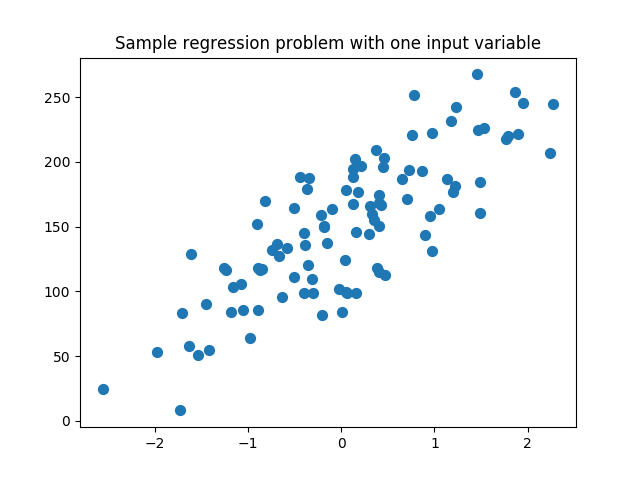
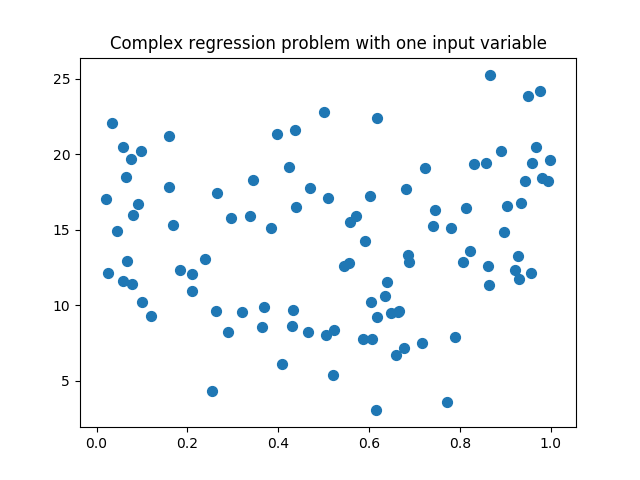
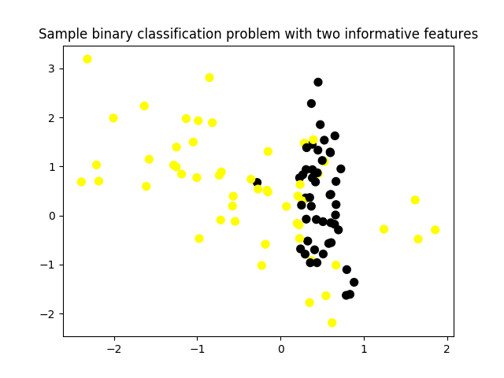
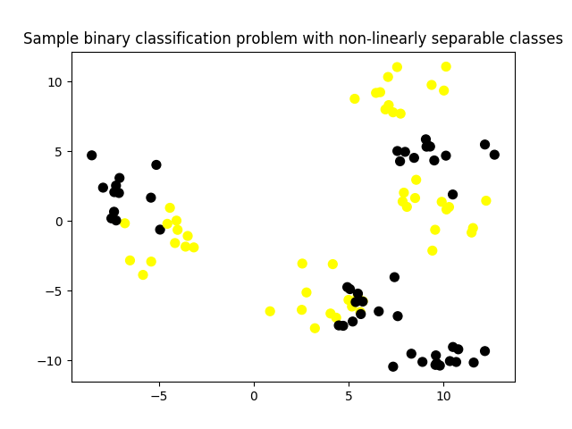
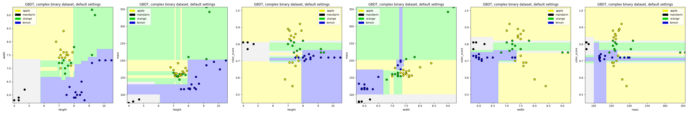
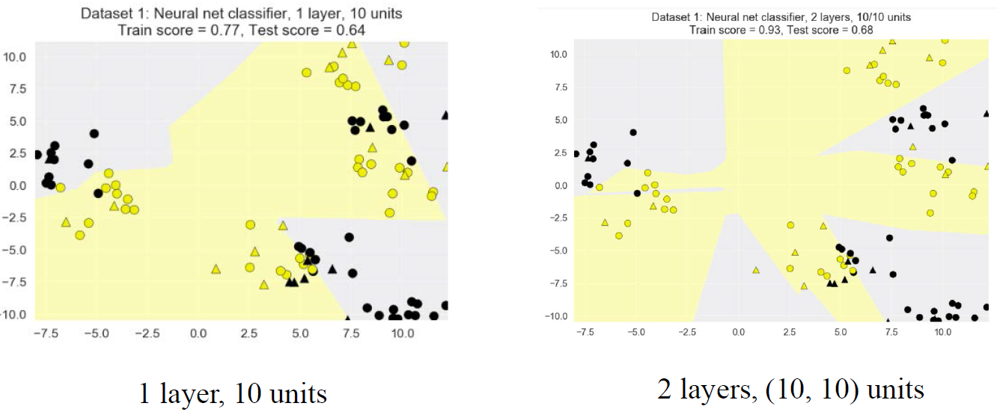
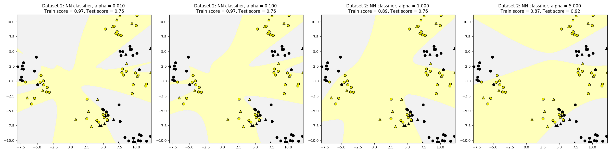

# Module 4: Supervised Machine Learning - Part 2

## Module 4 Notebook

+ [Launch Notebook Web Page](https://www.coursera.org/learn/python-machine-learning/notebook/TR0yt/module-4-notebook)
+ [Web Notebook](https://hub.coursera-notebooks.org/user/elkljxyoytcwjbmkgctrtg/notebooks/Module%204.ipynb)
+ [Local Notebook](notebooks/Module04.ipynb)
+ [Python Code](notebooks/Module04.py)

+ Demo: Preamble and Datasets
    ```python
    import numpy as np
    import pandas as pd
    import seaborn as sn
    import matplotlib.pyplot as plt

    from sklearn.model_selection import train_test_split
    from sklearn.datasets import make_classification, make_blobs
    from matplotlib.colors import ListedColormap
    from sklearn.datasets import load_breast_cancer
    from adspy_shared_utilities import load_crime_dataset

    cmap_bold = ListedColormap(['#FFFF00', '#00FF00', '#0000FF','#000000'])

    # fruits dataset
    fruits = pd.read_table('fruit_data_with_colors.txt')

    feature_names_fruits = ['height', 'width', 'mass', 'color_score']
    X_fruits = fruits[feature_names_fruits]
    y_fruits = fruits['fruit_label']
    target_names_fruits = ['apple', 'mandarin', 'orange', 'lemon']

    X_fruits_2d = fruits[['height', 'width']]
    y_fruits_2d = fruits['fruit_label']

    # synthetic dataset for simple regression
    from sklearn.datasets import make_regression
    plt.figure()
    plt.title('Sample regression problem with one input variable')
    X_R1, y_R1 = make_regression(n_samples = 100, n_features=1, n_informative=1, 
        bias = 150.0, noise = 30, random_state=0)
    plt.scatter(X_R1, y_R1, marker= 'o', s=50)
    plt.show()      # Fig.1

    # synthetic dataset for more complex regression
    from sklearn.datasets import make_friedman1
    plt.figure()
    plt.title('Complex regression problem with one input variable')
    X_F1, y_F1 = make_friedman1(n_samples = 100, n_features = 7, random_state=0)

    plt.scatter(X_F1[:, 2], y_F1, marker= 'o', s=50)
    plt.show()      # Fig.2

    # synthetic dataset for classification (binary)
    plt.figure()
    plt.title('Sample binary classification problem with two informative features')
    X_C2, y_C2 = make_classification(n_samples = 100, n_features=2, n_redundant=0, 
        n_informative=2, n_clusters_per_class=1, flip_y = 0.1, class_sep = 0.5, random_state=0)
    plt.scatter(X_C2[:, 0], X_C2[:, 1], marker= 'o', c=y_C2, s=50, cmap=cmap_bold)
    plt.show()      # Fig.3

    # more difficult synthetic dataset for classification (binary)
    # with classes that are not linearly separable
    X_D2, y_D2 = make_blobs(n_samples = 100, n_features = 2, centers = 8, 
        cluster_std = 1.3, random_state = 4)
    y_D2 = y_D2 % 2
    plt.figure()
    plt.title('Sample binary classification problem with non-linearly separable classes')
    plt.scatter(X_D2[:,0], X_D2[:,1], c=y_D2, marker= 'o', s=50, cmap=cmap_bold)
    plt.show()      # Fig.4

    # Breast cancer dataset for classification
    cancer = load_breast_cancer()
    (X_cancer, y_cancer) = load_breast_cancer(return_X_y = True)

    # Communities and Crime dataset
    (X_crime, y_crime) = load_crime_dataset()
    ```
    <a href="https://www.coursera.org/learn/python-machine-learning/lecture/0XFms/naive-bayes-classifiers">
        
    </a>
    <a href="https://www.coursera.org/learn/python-machine-learning/lecture/0XFms/naive-bayes-classifiers">
        
    </a>
    <a href="https://www.coursera.org/learn/python-machine-learning/lecture/0XFms/naive-bayes-classifiers">
        
    </a>
    <a href="https://www.coursera.org/learn/python-machine-learning/lecture/0XFms/naive-bayes-classifiers">
        
    </a>

## Naive Bayes Classifiers

+ Naïve Bayes Classifiers: a simple, probabilistic classifier family
    + These classifiers are called 'Naïve' because they assume that features are conditionally independent, given the class.
    + In other words: they assume that, for all instances of a given class, the features have little/no correlation with each other.
    + Highly efficient learning and prediction.
    + But generalization performance may worse than more sophisticated learning methods.
    + Can be competitive for some tasks.

+ Naïve Bayes classifier types
    + `Bernoulli`: binary features (e.g. word presence/absence)
    + `Multinomial`: discrete features (e.g. word counts)
    + `Gaussian`: continuous/real-valued features - Statistics computed for each class: For each feature: mean, standard deviation
    + See the Applied Text Mining course for more details on the `Bernoulli` and `Multinomial` Naïve Bayes models

+ Gaussian Naïve Bayes classifier
    <a href="https://www.researchgate.net/publication/255695722_Smoothness_without_Smoothing_Why_Gaussian_Naive_Bayes_Is_Not_Naive_for_Multi-Subject_Searchlight_Studies/figures?lo=1"> <br/>
        
    </a>
    <a href="https://www.coursera.org/learn/python-machine-learning/lecture/0XFms/naive-bayes-classifiers">
        
    </a>
    <a href="https://www.coursera.org/learn/python-machine-learning/lecture/0XFms/naive-bayes-classifiers">
        
    </a>
    + `partial_fit` method: train model incrementally in case working with a huge data set that doesn't fit into memory
    + Used for high-dimensional data, e.g., hundreds, thousands or maybe even more features

+ The Bernoulli and Nultinomial flavors of Naive Bayes:
    + Used for text classification with very large number of distinct words (features)
    + Used for the sparse future vectors because any given document uses only a small fraction of the overall vocabulary. 

+ Naïve Bayes classifiers: Pros and Cons
    + Pros:
        + Easy to understand
        + Simple, efficient parameter estimation
        + Works well with high-dimensional data
        + Often useful as a baseline comparison against more sophisticated methods
    + Cons:
        + Assumption that features are conditionally independent given the class is not realistic.
        + As a result, other classifier types often have better generalization performance.
        + Their confidence estimates for predictions are not very accurate.


+ Demo
    ```python
    from sklearn.naive_bayes import GaussianNB
    from adspy_shared_utilities import plot_class_regions_for_classifier

    X_train, X_test, y_train, y_test = train_test_split(X_C2, y_C2, random_state=0)

    nbclf = GaussianNB().fit(X_train, y_train)
    plot_class_regions_for_classifier(nbclf, X_train, y_train, X_test, y_test, 
        'Gaussian Naive Bayes classifier: Dataset 1')

    X_train, X_test, y_train, y_test = train_test_split(X_D2, y_D2, random_state=0)

    nbclf = GaussianNB().fit(X_train, y_train)
    plot_class_regions_for_classifier(nbclf, X_train, y_train, X_test, y_test,
        'Gaussian Naive Bayes classifier: Dataset 2')

    # ### Application to a real-world dataset
    X_train, X_test, y_train, y_test = train_test_split(X_cancer, y_cancer, random_state = 0)

    nbclf = GaussianNB().fit(X_train, y_train)
    print('Breast cancer dataset')
    print('Accuracy of GaussianNB classifier on training set: {:.2f}'
        .format(nbclf.score(X_train, y_train)))
    print('Accuracy of GaussianNB classifier on test set: {:.2f}'
        .format(nbclf.score(X_test, y_test)))
    ```
    <a href="https://www.coursera.org/learn/python-machine-learning/lecture/0XFms/naive-bayes-classifiers">
        
    </a>

### Lecture Video

<a href="https://d18ky98rnyall9.cloudfront.net/Ld6WAECbEee4_A7ezGAgwg.processed/full/360p/index.mp4?Expires=1537488000&Signature=VMGXs1je8kFOomj5Yk1bNqi2lKFRDS~LcCE4AhXWb2ubC2zpzTtRucIuiNYRsPllZjmnFBkKKcm2aouGDa1b9bneFMFwWbVZodxBbAd5R7d4F3br-By1V-gj44iSRZItOI1LtDmVfoDhxu7JxuP5lX9spS7pqNIu28IraN6tEcg_&Key-Pair-Id=APKAJLTNE6QMUY6HBC5A" alt="Naive Bayes Classifiers" target="_blank">
     
</a>


## Random Forests

+ Ensemble:
    + take multiple individual learning models and combine them to produce an aggregate model 
    + more powerful than any of its individual learning models alone
    + different learning models tend to make different kinds of mistakes on the data set
    + each individual model might overfit to a different part of the data
    + combining different individual models into an ensemble → average out their individual mistakes to reduce the risk of overfitting while maintaining strong prediction performance

+ Random Forests
    + An ensemble of trees, not just one tree.
    + Widely used, very good results on many problems.
    + `sklearn.ensemble` module:
        + Classification: `RandomForestClassifier`
        + Regression: `RandomForestRegressor`
    + One decision tree → Prone to overfitting.
    + Many decision trees → More stable, better generalization
    + Ensemble of trees should be diverse: introduce random variation into tree-building.

+ Random Forest Process
    +Original Dataset
        <a href="https://www.coursera.org/learn/python-machine-learning/lecture/lF9QN/random-forests"> <br/>
            
        </a>

    + Bootstrap Samples
        <a href="https://www.coursera.org/learn/python-machine-learning/lecture/lF9QN/random-forests"> <br/>
            
        </a>

    + Randomized Feature Splits
        <a href="https://www.coursera.org/learn/python-machine-learning/lecture/lF9QN/random-forests"> <br/>
            
        </a>

+ Random Forest `max_features` Parameter
    + Learning is quite sensitive to `max_features`.
    + Setting `max_features= 1` leads to forests with diverse, more complex trees.
    + Setting `max_features= <close to number of features>` will lead to similar forests with simpler trees.

+ Prediction Using Random Forests
    1. Make a prediction for every tree in the forest.
    2. Combine individual predictions
        + Regression: mean of individual tree predictions.
        + Classification:
            + Each tree gives probability for each class.
            + Probabilities averaged across trees.
            + Predict the class with highest probability.
    <a href="https://www.coursera.org/learn/python-machine-learning/lecture/lF9QN/random-forests"> <br/>
        
    </a>

+ Random Forest: Fruit Dataset
    <a href="https://www.coursera.org/learn/python-machine-learning/lecture/lF9QN/random-forests"> <br/>
        
    </a>

+ Random Forest: Pros and Cons
    + Pros:
        + Widely used, excellent prediction performance on many problems.
        + Doesn't require careful normalization of features or extensive parameter tuning.
        + Like decision trees, handles a mixture of feature types.
        + Easily parallelized across multiple CPUs.
    + Cons:
        + The resulting models are often difficult for humans to interpret.
        + Like decision trees, random forests may not be a good choice for very high-dimensional tasks (e.g. text classifiers) compared to fast, accurate linear models.

+ Random Forests: `RandomForestClassifier` Key Parameters
    + `n_estimators`: number of trees to use in ensemble (default: 10).
        + Should be larger for larger datasets to reduce overfitting(but uses more computation).
    + `max_features`: has a strong effect on performance. Influences the diversity of trees in the forest.
        + Default works well in practice, but adjusting may lead to some further gains.
    + `max_depth`: controls the depth of each tree (default: None. Splits until all leaves are pure).
    + `n_jobs`: How many cores to use in parallel during training.
    + Choose a fixed setting for the `random_state` parameter if you need reproducible results.


+ Demo
    ```python
    from sklearn.ensemble import RandomForestClassifier
    from sklearn.model_selection import train_test_split
    from adspy_shared_utilities import plot_class_regions_for_classifier_subplot

    X_train, X_test, y_train, y_test = train_test_split(X_D2, y_D2, random_state = 0)
    fig, subaxes = plt.subplots(1, 1, figsize=(6, 6))

    clf = RandomForestClassifier().fit(X_train, y_train)
    title = 'Random Forest Classifier, complex binary dataset, default settings'
    plot_class_regions_for_classifier_subplot(
        clf, X_train, y_train, X_test, y_test, title, subaxes)

    plt.show()      # Fig.7

    # ### Random forest: Fruit dataset
    from sklearn.ensemble import RandomForestClassifier
    from sklearn.model_selection import train_test_split
    from adspy_shared_utilities import plot_class_regions_for_classifier_subplot

    X_train, X_test, y_train, y_test = train_test_split(
        X_fruits.as_matrix(), y_fruits.as_matrix(), random_state = 0)
    fig, subaxes = plt.subplots(6, 1, figsize=(6, 32))

    title = 'Random Forest, fruits dataset, default settings'
    pair_list = [[0,1], [0,2], [0,3], [1,2], [1,3], [2,3]]

    for pair, axis in zip(pair_list, subaxes):
        X = X_train[:, pair]
        y = y_train
        
        clf = RandomForestClassifier().fit(X, y)
        plot_class_regions_for_classifier_subplot(
            clf, X, y, None, None, title, axis, target_names_fruits)
        
        axis.set_xlabel(feature_names_fruits[pair[0]])
        axis.set_ylabel(feature_names_fruits[pair[1]])
        
    plt.tight_layout()
    plt.show()          # Fig.8

    clf = RandomForestClassifier(
        n_estimators = 10, random_state=0).fit(X_train, y_train)

    print('Random Forest, Fruit dataset, default settings')
    print('Accuracy of RF classifier on training set: {:.2f}'
        .format(clf.score(X_train, y_train)))
    print('Accuracy of RF classifier on test set: {:.2f}'
        .format(clf.score(X_test, y_test)))
    # Random Forest, Fruit dataset, default settings
    # Accuracy of RF classifier on training set: 1.00
    # Accuracy of RF classifier on test set: 0.80

    # #### Random Forests on a real-world dataset
    from sklearn.ensemble import RandomForestClassifier

    X_train, X_test, y_train, y_test = train_test_split(X_cancer, y_cancer, random_state = 0)

    clf = RandomForestClassifier(max_features = 8, random_state = 0)
    clf.fit(X_train, y_train)

    print('Breast cancer dataset')
    print('Accuracy of RF classifier on training set: {:.2f}'
        .format(clf.score(X_train, y_train)))
    print('Accuracy of RF classifier on test set: {:.2f}'
        .format(clf.score(X_test, y_test)))
    # Breast cancer dataset
    # Accuracy of RF classifier on training set: 1.00
    # Accuracy of RF classifier on test set: 0.99
    ```
    <a href="https://www.coursera.org/learn/python-machine-learning/lecture/lF9QN/random-forests"> <br/>
        
    </a>
    <a href="https://www.coursera.org/learn/python-machine-learning/lecture/lF9QN/random-forests"> <br/>
        
    </a>


### Lecture Video

<a href="https://d18ky98rnyall9.cloudfront.net/_4VeolzrEeeQywpoSy5QrA.processed/full/360p/index.mp4?Expires=1537488000&Signature=BuFNm32Z2UaDHHcbL32WyXCgU6iJzlGtdRtTazEkBobN0lPZr4fVTDjPHsgZcArbW99evZH6cwuzcBm-oRPC4gw0iMzP1m3hVZNr4EUg1MB46gKNlwNcnJ1F4yKEMy-tOd4wcHhBSqHYx9S7CGcss8yb3CUjCLi8RFx-K0AkHbk_&Key-Pair-Id=APKAJLTNE6QMUY6HBC5A" alt="andom Forests" target="_blank">
     
</a>


## Gradient Boosted Decision Trees

+ Gradient Boosted Decision Trees (GBDT)
    + Training builds a series of small decision trees.
    + Each tree attempts to correct errors from the previous stage.
        <a href="https://www.coursera.org/learn/python-machine-learning/lecture/emwn3/gradient-boosted-decision-trees"> <br/>
            
        </a>
    + The learning rate controls how hard each new tree tries to correct remaining mistakes from previous round.
        + High learning rate: more complex trees
        + Low learning rate: simpler trees
    <a href="https://www.coursera.org/learn/python-machine-learning/lecture/emwn3/gradient-boosted-decision-trees"> <br/>
        
    </a>

+ GBDT: Pros and Cons
    + Pros:
        + Often best off-the-shelf accuracy on many problems.
        + Using model for prediction requires only modest memory and is fast.
        + Doesn't require careful normalization of features to perform well.
        + Like decision trees, handles a mixture of feature types.
    + Cons:
        + Like random forests, the models are often difficult for humans to interpret.
        + Requires careful tuning of the learning rate and other parameters.
        + Training can require significant computation.
        + Like decision trees, not recommended for text classification and other problems with very high dimensional sparse features, for accuracy and computational cost reasons.

+ GBDT: `GradientBoostingClassifier` Key Parameters
    + `n_estimators`: sets # of small decision trees to use (weak learners) in the ensemble.
    + `learning_rate`: controls emphasis on fixing errors from previous iteration.
    + The above two are typically tuned together.
    + `n_estimatorsis` adjusted first, to best exploit memory and CPUs during training, then other parameters.
    + `max_depthis` typically set to a small value (e.g. 3-5) for most applications.


+ Demo
    ```python
    # ### Gradient-boosted decision trees
    from sklearn.ensemble import GradientBoostingClassifier
    from sklearn.model_selection import train_test_split
    from adspy_shared_utilities import plot_class_regions_for_classifier_subplot

    X_train, X_test, y_train, y_test = train_test_split(X_D2, y_D2, random_state = 0)
    fig, subaxes = plt.subplots(1, 1, figsize=(6, 6))

    clf = GradientBoostingClassifier().fit(X_train, y_train)
    title = 'GBDT, complex binary dataset, default settings'
    plot_class_regions_for_classifier_subplot(
        clf, X_train, y_train, X_test, y_test, title, subaxes)

    plt.show()      # Fig.9

    # #### Gradient boosted decision trees on the fruit dataset
    X_train, X_test, y_train, y_test = train_test_split(
        X_fruits.as_matrix(), y_fruits.as_matrix(), random_state = 0)
    fig, subaxes = plt.subplots(6, 1, figsize=(6, 32))

    pair_list = [[0,1], [0,2], [0,3], [1,2], [1,3], [2,3]]

    for pair, axis in zip(pair_list, subaxes):
        X = X_train[:, pair]
        y = y_train
        
        clf = GradientBoostingClassifier().fit(X, y)
        plot_class_regions_for_classifier_subplot(
            clf, X, y, None, None, title, axis, target_names_fruits)
        
        axis.set_xlabel(feature_names_fruits[pair[0]])
        axis.set_ylabel(feature_names_fruits[pair[1]])
        
    plt.tight_layout()
    plt.show()      # Fig.10

    clf = GradientBoostingClassifier().fit(X_train, y_train)

    print('GBDT, Fruit dataset, default settings')
    print('Accuracy of GBDT classifier on training set: {:.2f}'
        .format(clf.score(X_train, y_train)))
    print('Accuracy of GBDT classifier on test set: {:.2f}'
        .format(clf.score(X_test, y_test)))
    # GBDT, Fruit dataset, default settings
    # Accuracy of GBDT classifier on training set: 1.00
    # Accuracy of GBDT classifier on test set: 0.80

    # #### Gradient-boosted decision trees on a real-world dataset
    from sklearn.ensemble import GradientBoostingClassifier

    X_train, X_test, y_train, y_test = train_test_split(X_cancer, y_cancer, random_state = 0)

    clf = GradientBoostingClassifier(random_state = 0)
    clf.fit(X_train, y_train)

    print('Breast cancer dataset (learning_rate=0.1, max_depth=3)')
    print('Accuracy of GBDT classifier on training set: {:.2f}'
        .format(clf.score(X_train, y_train)))
    print('Accuracy of GBDT classifier on test set: {:.2f}\n'
        .format(clf.score(X_test, y_test)))
    # Breast cancer dataset (learning_rate=0.1, max_depth=3)
    # Accuracy of GBDT classifier on training set: 1.00
    # Accuracy of GBDT classifier on test set: 0.96

    clf = GradientBoostingClassifier(learning_rate = 0.01, max_depth = 2, random_state = 0)
    clf.fit(X_train, y_train)

    print('Breast cancer dataset (learning_rate=0.01, max_depth=2)')
    print('Accuracy of GBDT classifier on training set: {:.2f}'
        .format(clf.score(X_train, y_train)))
    print('Accuracy of GBDT classifier on test set: {:.2f}'
        .format(clf.score(X_test, y_test)))
    # Breast cancer dataset (learning_rate=0.01, max_depth=2)
    # Accuracy of GBDT classifier on training set: 0.97
    # Accuracy of GBDT classifier on test set: 0.97
    ```
    <a href="https://www.coursera.org/learn/python-machine-learning/lecture/emwn3/gradient-boosted-decision-trees"> <br/>
        
    </a>
    <a href="https://www.coursera.org/learn/python-machine-learning/lecture/emwn3/gradient-boosted-decision-trees"> <br/>
        
    </a>


### Lecture Video

<a href="https://d18ky98rnyall9.cloudfront.net/2YlAZ1zrEeeliw7ADgKLdA.processed/full/360p/index.mp4?Expires=1537488000&Signature=CyD0KOnbXSk7Zf-q1XDP249mSCKXST4r4y52GuxsoftRnYrcKPDBEx25fTkuSNcacZlMkBhwAwThrV6lYwjGfrdvYg7gcPs~Q6o9dOMcbm3vsMI5ey7Su0vzUjvxwQ1w6psBs85OHoXoDluoHEbArrHKGIYwzyU0o1ABk8ssqnc_&Key-Pair-Id=APKAJLTNE6QMUY6HBC5A" alt="Gradient Boosted Decision Trees" target="_blank">
     
</a>


## Neural Networks

+ The excellent course on Coursera, Neural Networks for Machine Learning, by a pioneer in this area, Professor Jeff Hinton  

+ Review: Linear and Logistic Regression
    <a href="https://www.coursera.org/learn/python-machine-learning/lecture/v4cs3/neural-networks"> <br/>
        
    </a>

+ Multi-layer Perceptron with One Hidden Layer (and `tanh` activation function)
    <a href="https://www.coursera.org/learn/python-machine-learning/lecture/v4cs3/neural-networks"> <br/>
        
    </a>
    + Linear function: $h_i = tanh(w_{0i} x_0 + w_{1i} x_1 + w_{2i} x_2 + w_{3i} x_3)$ (incorrect in diagram)

+ Activation Functions
    <a href="https://www.coursera.org/learn/python-machine-learning/lecture/v4cs3/neural-networks"> <br/>
        
    </a>
    + Activation function: $$ f(x) = tanh(x) = \frac{2}{1 + \exp^{-2x} - 1} $$

+ A single hidden layer network using 1, 10, or 100 units
    <a href="https://www.coursera.org/learn/python-machine-learning/lecture/v4cs3/neural-networks"> <br/>
        
    </a>

+ Multi-layer Perceptron with Two Hidden Layers
    <a href="https://www.coursera.org/learn/python-machine-learning/lecture/v4cs3/neural-networks"> <br/>
        
    </a>

+ One vs Two Hidden Layers
    <a href="https://www.coursera.org/learn/python-machine-learning/lecture/v4cs3/neural-networks"> <br/>
        
    </a>

+ L2 Regularization with the Alpha Parameter
    <a href="https://www.coursera.org/learn/python-machine-learning/lecture/v4cs3/neural-networks"> <br/>
        
    </a>

+ Neural Network Regression with `MLPRegressor`
    <a href="https://www.coursera.org/learn/python-machine-learning/lecture/v4cs3/neural-networks"> <br/>
        
    </a>

+ Neural Networks: Pros and Cons
    + Pros:
        + They form the basis of state-of-the-art models and can be formed into advanced architectures that effectively capture complex features given enough data and computation.
    + Cons:
        + Larger, more complex models require significant training time, data, and customization.
        + Careful preprocessing of the data is needed.
        + A good choice when the features are of similar types, but less so when features of very different types.

+ Neural Nets: MLPClassifierand MLPRegressorImportant pParameters
    + `hidden_layer_sizes`: sets the number of hidden layers (number of elements in list), and number of hidden units per layer (each list element). Default: (100).
    + `alpha`: controls weight on the regularization penalty that shrinks weights to zero. Default: alpha = 0.0001.
    + `activation`: controls the nonlinear function used for the activation function, including: 'relu' (default), 'logistic', 'tanh'.

+ Solver
    + The algorithm that actually does the numerical work of finding the optimal weights
    + All of the solver algorithms have to do a kind of hill-climbing in a very bumpy landscape, with lots of local minima
    + Each local minimum corresponds to a locally optimal set of weights
    + A choice of weight setting that's better than any nearby choices of weights
    + Depending on the initial random initialization of the weights
    + The nature of the trajectory in the search path that a solver takes through this bumpy landscape
    + End up at different local minima, which can have different validation scores
    + The default solver, `adam`, tends to be both efficient and effective on large data sets, with thousands of training examples. 
    + For small data sets, the `lbfgs` solver tends to be faster, and find more effective weights
    

+ Demo
    ```python
    # #### Activation functions
    xrange = np.linspace(-2, 2, 200)

    plt.figure(figsize=(7,6))

    plt.plot(xrange, np.maximum(xrange, 0), label = 'relu')
    plt.plot(xrange, np.tanh(xrange), label = 'tanh')
    plt.plot(xrange, 1 / (1 + np.exp(-xrange)), label = 'logistic')
    plt.legend()
    plt.title('Neural network activation functions')
    plt.xlabel('Input value (x)')
    plt.ylabel('Activation function output')

    plt.show()      # Fig.11

    # ### Neural networks: Classification
    # #### Synthetic dataset 1: single hidden layer
    from sklearn.neural_network import MLPClassifier
    from adspy_shared_utilities import plot_class_regions_for_classifier_subplot

    X_train, X_test, y_train, y_test = train_test_split(X_D2, y_D2, random_state=0)

    fig, subaxes = plt.subplots(3, 1, figsize=(6,18))

    for units, axis in zip([1, 10, 100], subaxes):
        nnclf = MLPClassifier(
            hidden_layer_sizes = [units], solver='lbfgs', random_state = 0).fit(X_train, y_train)
        
        title = 'Dataset 1: Neural net classifier, 1 layer, {} units'.format(units)
        
        plot_class_regions_for_classifier_subplot(
            nnclf, X_train, y_train, X_test, y_test, title, axis)
        plt.tight_layout()      # Fig.12

    # #### Synthetic dataset 1: two hidden layers
    from adspy_shared_utilities import plot_class_regions_for_classifier

    X_train, X_test, y_train, y_test = train_test_split(X_D2, y_D2, random_state=0)
    nnclf = MLPClassifier(
        hidden_layer_sizes = [10, 10], solver='lbfgs', random_state = 0).fit(X_train, y_train)
    plot_class_regions_for_classifier(
        nnclf, X_train, y_train, X_test, y_test, 
        'Dataset 1: Neural net classifier, 2 layers, 10/10 units')  # Fig.13

    # #### Regularization parameter: alpha
    X_train, X_test, y_train, y_test = train_test_split(X_D2, y_D2, random_state=0)
    fig, subaxes = plt.subplots(4, 1, figsize=(6, 23))
    for this_alpha, axis in zip([0.01, 0.1, 1.0, 5.0], subaxes):
        nnclf = MLPClassifier(
            solver='lbfgs', activation = 'tanh', alpha = this_alpha,
            hidden_layer_sizes = [100, 100], random_state = 0).fit(X_train, y_train)
        title = 'Dataset 2: NN classifier, alpha = {:.3f} '.format(this_alpha)
        plot_class_regions_for_classifier_subplot(
            nnclf, X_train, y_train, X_test, y_test, title, axis)
        plt.tight_layout()      # Fig.14

    # #### The effect of different choices of activation function
    X_train, X_test, y_train, y_test = train_test_split(X_D2, y_D2, random_state=0)
    fig, subaxes = plt.subplots(3, 1, figsize=(6,18))
    for this_activation, axis in zip(['logistic', 'tanh', 'relu'], subaxes):
        nnclf = MLPClassifier(
            solver='lbfgs', activation = this_activation, alpha = 0.1, hidden_layer_sizes = [10, 10],
            random_state = 0).fit(X_train, y_train)
        title = 'Dataset 2: NN classifier, 2 layers 10/10, {} activation function'.format(this_activation)
        plot_class_regions_for_classifier_subplot(
            nnclf, X_train, y_train, X_test, y_test, title, axis)
        plt.tight_layout()      # Fig.15


    # ### Neural networks: Regression
    from sklearn.neural_network import MLPRegressor

    fig, subaxes = plt.subplots(2, 3, figsize=(11,8), dpi=70)
    X_predict_input = np.linspace(-3, 3, 50).reshape(-1,1)
    X_train, X_test, y_train, y_test = train_test_split(X_R1[0::5], y_R1[0::5], random_state = 0)
    for thisaxisrow, thisactivation in zip(subaxes, ['tanh', 'relu']):
        for thisalpha, thisaxis in zip([0.0001, 1.0, 100], thisaxisrow):
            mlpreg = MLPRegressor(
                hidden_layer_sizes = [100,100], activation = thisactivation,
                alpha = thisalpha, solver = 'lbfgs').fit(X_train, y_train)
            y_predict_output = mlpreg.predict(X_predict_input)
            thisaxis.set_xlim([-2.5, 0.75])
            thisaxis.plot(X_predict_input, y_predict_output,
                        '^', markersize = 10)
            thisaxis.plot(X_train, y_train, 'o')
            thisaxis.set_xlabel('Input feature')
            thisaxis.set_ylabel('Target value')
            thisaxis.set_title('MLP regression\nalpha={}, activation={})'
                            .format(thisalpha, thisactivation))
            plt.tight_layout()      # Fig.16

    # #### Application to real-world dataset for classification
    from sklearn.neural_network import MLPClassifier
    from sklearn.preprocessing import MinMaxScaler

    scaler = MinMaxScaler()
    X_train, X_test, y_train, y_test = train_test_split(X_cancer, y_cancer, random_state = 0)
    X_train_scaled = scaler.fit_transform(X_train)
    X_test_scaled = scaler.transform(X_test)
    clf = MLPClassifier(hidden_layer_sizes = [100, 100], alpha = 5.0, random_state = 0, 
        solver='lbfgs').fit(X_train_scaled, y_train)
    print('Breast cancer dataset')
    print('Accuracy of NN classifier on training set: {:.2f}'
        .format(clf.score(X_train_scaled, y_train)))
    print('Accuracy of NN classifier on test set: {:.2f}'
        .format(clf.score(X_test_scaled, y_test)))
    # Breast cancer dataset
    # Accuracy of NN classifier on training set: 0.98
    # Accuracy of NN classifier on test set: 0.97
    ```
    <a href="https://www.coursera.org/learn/python-machine-learning/lecture/v4cs3/neural-networks"> <br/>
        
    </a>
    <a href="https://www.coursera.org/learn/python-machine-learning/lecture/v4cs3/neural-networks"> <br/>
        
    </a>
    <a href="https://www.coursera.org/learn/python-machine-learning/lecture/v4cs3/neural-networks"> <br/>
        
    </a>
    <a href="https://www.coursera.org/learn/python-machine-learning/lecture/v4cs3/neural-networks"> <br/>
        
    </a>
    <a href="https://www.coursera.org/learn/python-machine-learning/lecture/v4cs3/neural-networks"> <br/>
        
    </a>
    <a href="https://www.coursera.org/learn/python-machine-learning/lecture/v4cs3/neural-networks"> <br/>
        
    </a>


### Lecture Video

<a href="https://d18ky98rnyall9.cloudfront.net/STxb-kAWEeeR4AqenwJvyA.processed/full/360p/index.mp4?Expires=1537574400&Signature=gS4~r38Cm3-1JzOrBv5mOPBmTYCWwKq~0vEXOv9vEXi4nSJA-DcrZ5DdqiZ3Qy82kDZ3szytRqAtd3qLXIgh8LNjym0~6J1ourLQ7qhrrPv1b6THkpp3rEe3~SEKpH-WYg7CF07gQyZg3eqbbsgdCCca0WZzHQWSM9ElkYt6O2o_&Key-Pair-Id=APKAJLTNE6QMUY6HBC5A" alt="Neural Networks" target="_blank">
     
</a>


## Neural Networks Made Easy (optional)

+ Demo
    ```python

    ```

### Lecture Video

<a href="url" alt="text" target="_blank">
     
</a>


## Play with Neural Networks: TensorFlow Playground (optional)

+ Demo
    ```python

    ```

### Lecture Video

<a href="url" alt="text" target="_blank">
     
</a>


## Deep Learning (Optional)

+ Demo
    ```python

    ```

### Lecture Video

<a href="url" alt="text" target="_blank">
     
</a>


## Deep Learning in a Nutshell: Core Concepts (optional)

+ Demo
    ```python

    ```

### Lecture Video

<a href="url" alt="text" target="_blank">
     
</a>


## Assisting Pathologists in Detecting Cancer with Deep Learning (optional)

+ Demo
    ```python

    ```

### Lecture Video

<a href="url" alt="text" target="_blank">
     
</a>


## Data Leakage

+ Demo
    ```python

    ```

### Lecture Video

<a href="url" alt="text" target="_blank">
     
</a>


## The Treachery of Leakage (optional)

+ Demo
    ```python

    ```

### Lecture Video

<a href="url" alt="text" target="_blank">
     
</a>


## Leakage in Data Mining: Formulation, Detection, and Avoidance (optional)

+ Demo
    ```python

    ```

### Lecture Video

<a href="url" alt="text" target="_blank">
     
</a>


## Data Leakage Example: The ICML 2013 Whale Challenge (optional)

+ Demo
    ```python

    ```

### Lecture Video

<a href="url" alt="text" target="_blank">
     
</a>


## Rules of Machine Learning: Best Practices for ML Engineering (optional)

+ Demo
    ```python

    ```

### Lecture Video

<a href="url" alt="text" target="_blank">
     
</a>


## Quiz: Module 4 Quiz


