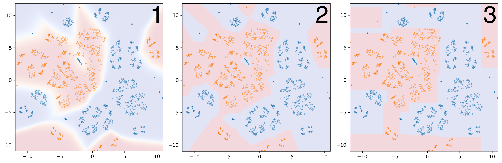
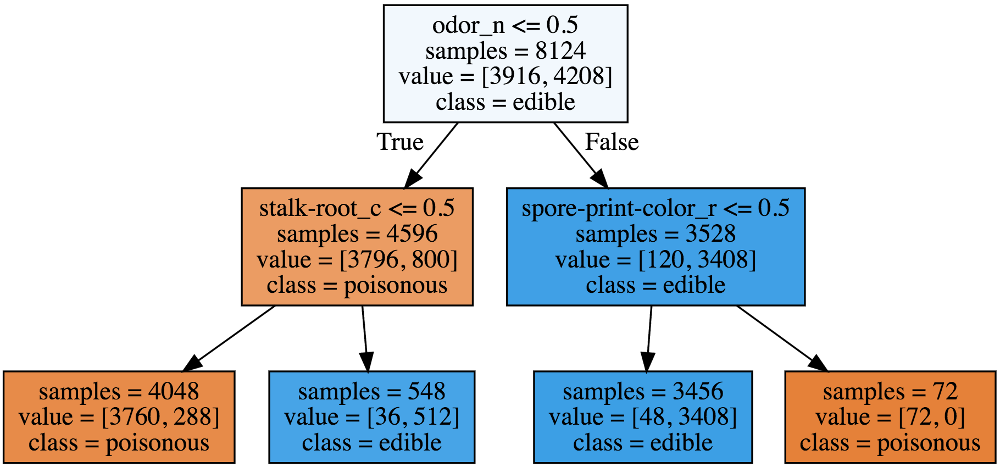
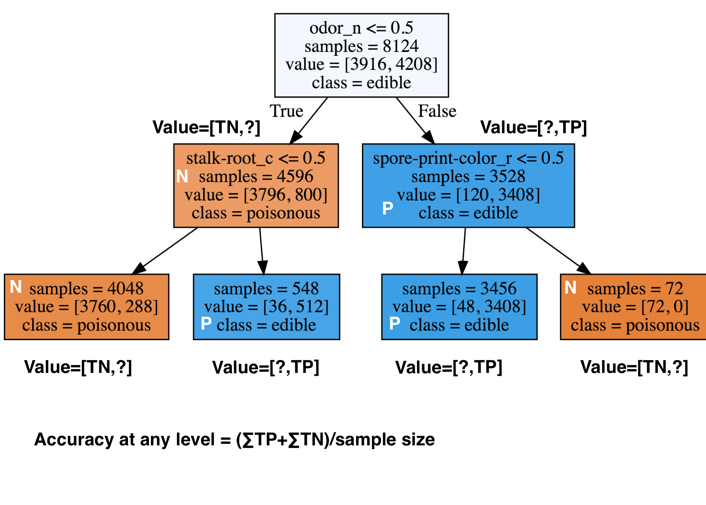
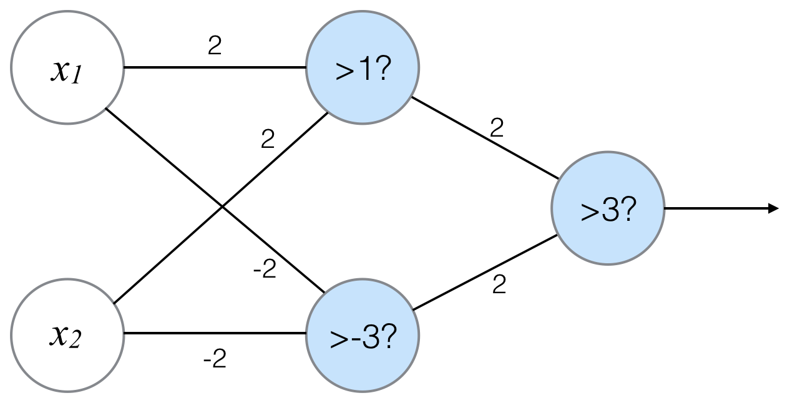

# Module 4: Supervised Machine Learning - Part 2

## Module 4 Notebook

+ [Launch Notebook Web Page](https://www.coursera.org/learn/python-machine-learning/notebook/TR0yt/module-4-notebook)
+ [Web Notebook](https://hub.coursera-notebooks.org/user/elkljxyoytcwjbmkgctrtg/notebooks/Module%204.ipynb)
+ [Local Notebook](notebooks/Module04.ipynb)
+ [Python Code](notebooks/Module04.py)

+ Demo: Preamble and Datasets
    ```python
    import numpy as np
    import pandas as pd
    import seaborn as sn
    import matplotlib.pyplot as plt

    from sklearn.model_selection import train_test_split
    from sklearn.datasets import make_classification, make_blobs
    from matplotlib.colors import ListedColormap
    from sklearn.datasets import load_breast_cancer
    from adspy_shared_utilities import load_crime_dataset

    cmap_bold = ListedColormap(['#FFFF00', '#00FF00', '#0000FF','#000000'])

    # fruits dataset
    fruits = pd.read_table('fruit_data_with_colors.txt')

    feature_names_fruits = ['height', 'width', 'mass', 'color_score']
    X_fruits = fruits[feature_names_fruits]
    y_fruits = fruits['fruit_label']
    target_names_fruits = ['apple', 'mandarin', 'orange', 'lemon']

    X_fruits_2d = fruits[['height', 'width']]
    y_fruits_2d = fruits['fruit_label']

    # synthetic dataset for simple regression
    from sklearn.datasets import make_regression
    plt.figure()
    plt.title('Sample regression problem with one input variable')
    X_R1, y_R1 = make_regression(n_samples = 100, n_features=1, n_informative=1, 
        bias = 150.0, noise = 30, random_state=0)
    plt.scatter(X_R1, y_R1, marker= 'o', s=50)
    plt.show()      # Fig.1

    # synthetic dataset for more complex regression
    from sklearn.datasets import make_friedman1
    plt.figure()
    plt.title('Complex regression problem with one input variable')
    X_F1, y_F1 = make_friedman1(n_samples = 100, n_features = 7, random_state=0)

    plt.scatter(X_F1[:, 2], y_F1, marker= 'o', s=50)
    plt.show()      # Fig.2

    # synthetic dataset for classification (binary)
    plt.figure()
    plt.title('Sample binary classification problem with two informative features')
    X_C2, y_C2 = make_classification(n_samples = 100, n_features=2, n_redundant=0, 
        n_informative=2, n_clusters_per_class=1, flip_y = 0.1, class_sep = 0.5, random_state=0)
    plt.scatter(X_C2[:, 0], X_C2[:, 1], marker= 'o', c=y_C2, s=50, cmap=cmap_bold)
    plt.show()      # Fig.3

    # more difficult synthetic dataset for classification (binary)
    # with classes that are not linearly separable
    X_D2, y_D2 = make_blobs(n_samples = 100, n_features = 2, centers = 8, 
        cluster_std = 1.3, random_state = 4)
    y_D2 = y_D2 % 2
    plt.figure()
    plt.title('Sample binary classification problem with non-linearly separable classes')
    plt.scatter(X_D2[:,0], X_D2[:,1], c=y_D2, marker= 'o', s=50, cmap=cmap_bold)
    plt.show()      # Fig.4

    # Breast cancer dataset for classification
    cancer = load_breast_cancer()
    (X_cancer, y_cancer) = load_breast_cancer(return_X_y = True)

    # Communities and Crime dataset
    (X_crime, y_crime) = load_crime_dataset()
    ```
    <a href="https://www.coursera.org/learn/python-machine-learning/lecture/0XFms/naive-bayes-classifiers">
        
    </a>
    <a href="https://www.coursera.org/learn/python-machine-learning/lecture/0XFms/naive-bayes-classifiers">
        
    </a><br/>
    <a href="https://www.coursera.org/learn/python-machine-learning/lecture/0XFms/naive-bayes-classifiers">
        
    </a>
    <a href="https://www.coursera.org/learn/python-machine-learning/lecture/0XFms/naive-bayes-classifiers">
        
    </a>

+ `ListedColormap` class
    + Init signature: `ListedColormap(colors, name='from_list', N=None)`
    + Docstring: Colormap object generated from a list of colors. <br/>
        This may be most useful when indexing directly into a colormap, but it can also be used to generate special colormaps for ordinary mapping.
    + Parameters:
        + `colors`: a list of matplotlib color specifications, or an equivalent Nx3 or Nx4 floating point array (`N` rgb or rgba values)
        + `name`: a string to identify the colormap
        + `N`: the number of entries in the map.  The default is `None`, in which case there is one colormap entry for each element in the list of colors.  
            + If `N < len(colors)` the list will be truncated at `N`.  
            + If `N > len(colors)` the list will be extended by repetition.


## Naive Bayes Classifiers

+ Naïve Bayes Classifiers: a simple, probabilistic classifier family
    + These classifiers are called 'Naïve' because they assume that features are conditionally independent, given the class.
    + In other words: they assume that, for all instances of a given class, the features have little/no correlation with each other.
    + Highly efficient learning and prediction.
    + But generalization performance may worse than more sophisticated learning methods.
    + Can be competitive for some tasks.

+ Naïve Bayes classifier types
    + `Bernoulli`: binary features (e.g. word presence/absence)
    + `Multinomial`: discrete features (e.g. word counts)
    + `Gaussian`: continuous/real-valued features - Statistics computed for each class: For each feature: mean, standard deviation
    + See the Applied Text Mining course for more details on the `Bernoulli` and `Multinomial` Naïve Bayes models

+ Gaussian Naïve Bayes classifier
    <a href="https://www.researchgate.net/publication/255695722_Smoothness_without_Smoothing_Why_Gaussian_Naive_Bayes_Is_Not_Naive_for_Multi-Subject_Searchlight_Studies/figures?lo=1"> <br/>
        
    </a>
    <a href="https://www.coursera.org/learn/python-machine-learning/lecture/0XFms/naive-bayes-classifiers">
        
    </a>
    <a href="https://www.coursera.org/learn/python-machine-learning/lecture/0XFms/naive-bayes-classifiers">
        
    </a>
    + `partial_fit` method: train model incrementally in case working with a huge data set that doesn't fit into memory
    + Used for high-dimensional data, e.g., hundreds, thousands or maybe even more features

+ The Bernoulli and Nultinomial flavors of Naive Bayes:
    + Used for text classification with very large number of distinct words (features)
    + Used for the sparse future vectors because any given document uses only a small fraction of the overall vocabulary. 

+ Naïve Bayes classifiers: Pros and Cons
    + Pros:
        + Easy to understand
        + Simple, efficient parameter estimation
        + Works well with high-dimensional data
        + Often useful as a baseline comparison against more sophisticated methods
    + Cons:
        + Assumption that features are conditionally independent given the class is not realistic.
        + As a result, other classifier types often have better generalization performance.
        + Their confidence estimates for predictions are not very accurate.


+ Demo
    ```python
    from sklearn.naive_bayes import GaussianNB
    from adspy_shared_utilities import plot_class_regions_for_classifier

    X_train, X_test, y_train, y_test = train_test_split(X_C2, y_C2, random_state=0)

    nbclf = GaussianNB().fit(X_train, y_train)
    plot_class_regions_for_classifier(nbclf, X_train, y_train, X_test, y_test, 
        'Gaussian Naive Bayes classifier: Dataset 1')

    X_train, X_test, y_train, y_test = train_test_split(X_D2, y_D2, random_state=0)

    nbclf = GaussianNB().fit(X_train, y_train)
    plot_class_regions_for_classifier(nbclf, X_train, y_train, X_test, y_test,
        'Gaussian Naive Bayes classifier: Dataset 2')

    # ### Application to a real-world dataset
    X_train, X_test, y_train, y_test = train_test_split(X_cancer, y_cancer, random_state = 0)

    nbclf = GaussianNB().fit(X_train, y_train)
    print('Breast cancer dataset')
    print('Accuracy of GaussianNB classifier on training set: {:.2f}'
        .format(nbclf.score(X_train, y_train)))
    print('Accuracy of GaussianNB classifier on test set: {:.2f}'
        .format(nbclf.score(X_test, y_test)))
    ```
    <a href="https://www.coursera.org/learn/python-machine-learning/lecture/0XFms/naive-bayes-classifiers">
        
    </a>

+ `GaussianNB` class
    + Init signature: `GaussianNB(priors=None)`
    + Docstring: Gaussian Naive Bayes (GaussianNB) <br/>
        Can perform online updates to model parameters via `partial_fit` method. For details on algorithm used to update feature means and variance online, see Stanford CS tech report [STAN-CS-79-773](http://i.stanford.edu/pub/cstr/reports/cs/tr/79/773/CS-TR-79-773.pdf) by Chan, Golub, and LeVeque:
    + Parameters
        + `priors` (array-like, shape (n_classes,)): Prior probabilities of the classes. If specified the priors are not adjusted according to the data.
    + Attributes
        + `class_prior_` (array, shape (n_classes,)): probability of each class.
        + `class_count_` (array, shape (n_classes,)): number of training samples observed in each class.
        + `theta_` (array, shape (n_classes, n_features)): mean of each feature per class
        + `sigma_` (array, shape (n_classes, n_features)):  variance of each feature per class

+ `nbclf.fit` method
    + Signature: `nbclf.fit(X, y, sample_weight=None)`
    + Docstring: Fit Gaussian Naive Bayes according to `X`, `y`
    + Parameters
        + `X` (array-like, shape (n_samples, n_features)): Training vectors, where n_samples is the number of samples and n_features is the number of features.
        + `y` (array-like, shape (n_samples,)): Target values.
        + `sample_weight` (array-like, shape (n_samples,), optional (default=None)): Weights applied to individual samples (1. for unweighted).
    + Returns: `self` (object): Returns self.

+ `nbclf.predict` method
    + Signature: `nbclf.predict(X)`
    + Docstring: Perform classification on an array of test vectors `X`.
    + Parameters
        + `X` (array-like, shape = [n_samples, n_features])
    + Returns: `C` (array, shape = [n_samples]): Predicted target values for X

+ `nbclf.score` method
    + Signature: `nbclf.score(X, y, sample_weight=None)`
    + Docstring: Returns the mean accuracy on the given test data and labels. <br/>
        In multi-label classification, this is the subset accuracy which is a harsh metric since you require for each sample that each label set be correctly predicted.
    + Parameters
        + `X` (array-like, shape = (n_samples, n_features)): Test samples.
        + `y` (array-like, shape = (n_samples) or (n_samples, n_outputs)):  True labels for X.
        + `sample_weight` (array-like, shape = [n_samples], optional): Sample weights.
    + Returns: `score` (float): Mean accuracy of `self.predict(X)` wrt. y.


### Lecture Video

<a href="https://d18ky98rnyall9.cloudfront.net/Ld6WAECbEee4_A7ezGAgwg.processed/full/360p/index.mp4?Expires=1537488000&Signature=VMGXs1je8kFOomj5Yk1bNqi2lKFRDS~LcCE4AhXWb2ubC2zpzTtRucIuiNYRsPllZjmnFBkKKcm2aouGDa1b9bneFMFwWbVZodxBbAd5R7d4F3br-By1V-gj44iSRZItOI1LtDmVfoDhxu7JxuP5lX9spS7pqNIu28IraN6tEcg_&Key-Pair-Id=APKAJLTNE6QMUY6HBC5A" alt="Naive Bayes Classifiers" target="_blank">
     
</a>


## Random Forests

+ Ensemble:
    + take multiple individual learning models and combine them to produce an aggregate model 
    + more powerful than any of its individual learning models alone
    + different learning models tend to make different kinds of mistakes on the data set
    + each individual model might overfit to a different part of the data
    + combining different individual models into an ensemble → average out their individual mistakes to reduce the risk of overfitting while maintaining strong prediction performance

+ Random Forests
    + An ensemble of trees, not just one tree.
    + Widely used, very good results on many problems.
    + `sklearn.ensemble` module:
        + Classification: `RandomForestClassifier`
        + Regression: `RandomForestRegressor`
    + One decision tree → Prone to overfitting.
    + Many decision trees → More stable, better generalization
    + Ensemble of trees should be diverse: introduce random variation into tree-building.

+ Random Forest Process
    + Original Dataset
        <a href="https://www.coursera.org/learn/python-machine-learning/lecture/lF9QN/random-forests"> <br/>
            
        </a>

    + Bootstrap Samples
        <a href="https://www.coursera.org/learn/python-machine-learning/lecture/lF9QN/random-forests"> <br/>
            
        </a>

    + Randomized Feature Splits
        <a href="https://www.coursera.org/learn/python-machine-learning/lecture/lF9QN/random-forests"> <br/>
            
        </a>

+ Random Forest `max_features` Parameter
    + Learning is quite sensitive to `max_features`.
    + Setting `max_features= 1` leads to forests with diverse, more complex trees.
    + Setting `max_features= <close to number of features>` will lead to similar forests with simpler trees.

+ Prediction Using Random Forests
    1. Make a prediction for every tree in the forest.
    2. Combine individual predictions
        + Regression: mean of individual tree predictions.
        + Classification:
            + Each tree gives probability for each class.
            + Probabilities averaged across trees.
            + Predict the class with highest probability.
    <a href="https://www.coursera.org/learn/python-machine-learning/lecture/lF9QN/random-forests"> <br/>
        
    </a>

+ Random Forest: Fruit Dataset
    <a href="https://www.coursera.org/learn/python-machine-learning/lecture/lF9QN/random-forests"> <br/>
        
    </a>

+ Random Forest: Pros and Cons
    + Pros:
        + Widely used, excellent prediction performance on many problems.
        + Doesn't require careful normalization of features or extensive parameter tuning.
        + Like decision trees, handles a mixture of feature types.
        + Easily parallelized across multiple CPUs.
    + Cons:
        + The resulting models are often difficult for humans to interpret.
        + Like decision trees, random forests may not be a good choice for very high-dimensional tasks (e.g. text classifiers) compared to fast, accurate linear models.

+ Random Forests: `RandomForestClassifier` Key Parameters
    + `n_estimators`: number of trees to use in ensemble (default: 10).
        + Should be larger for larger datasets to reduce overfitting(but uses more computation).
    + `max_features`: has a strong effect on performance. Influences the diversity of trees in the forest.
        + Default works well in practice, but adjusting may lead to some further gains.
    + `max_depth`: controls the depth of each tree (default: None. Splits until all leaves are pure).
    + `n_jobs`: How many cores to use in parallel during training.
    + Choose a fixed setting for the `random_state` parameter if you need reproducible results.

+ Demo
    ```python
    from sklearn.ensemble import RandomForestClassifier
    from sklearn.model_selection import train_test_split
    from adspy_shared_utilities import plot_class_regions_for_classifier_subplot

    X_train, X_test, y_train, y_test = train_test_split(X_D2, y_D2, random_state = 0)
    fig, subaxes = plt.subplots(1, 1, figsize=(6, 6))

    clf = RandomForestClassifier().fit(X_train, y_train)
    title = 'Random Forest Classifier, complex binary dataset, default settings'
    plot_class_regions_for_classifier_subplot(
        clf, X_train, y_train, X_test, y_test, title, subaxes)

    plt.show()      # Fig.7

    # ### Random forest: Fruit dataset
    from sklearn.ensemble import RandomForestClassifier
    from sklearn.model_selection import train_test_split
    from adspy_shared_utilities import plot_class_regions_for_classifier_subplot

    X_train, X_test, y_train, y_test = train_test_split(
        X_fruits.as_matrix(), y_fruits.as_matrix(), random_state = 0)
    fig, subaxes = plt.subplots(6, 1, figsize=(6, 32))

    title = 'Random Forest, fruits dataset, default settings'
    pair_list = [[0,1], [0,2], [0,3], [1,2], [1,3], [2,3]]

    for pair, axis in zip(pair_list, subaxes):
        X = X_train[:, pair]
        y = y_train
        
        clf = RandomForestClassifier().fit(X, y)
        plot_class_regions_for_classifier_subplot(
            clf, X, y, None, None, title, axis, target_names_fruits)
        
        axis.set_xlabel(feature_names_fruits[pair[0]])
        axis.set_ylabel(feature_names_fruits[pair[1]])
        
    plt.tight_layout()
    plt.show()          # Fig.8

    clf = RandomForestClassifier(
        n_estimators = 10, random_state=0).fit(X_train, y_train)

    print('Random Forest, Fruit dataset, default settings')
    print('Accuracy of RF classifier on training set: {:.2f}'
        .format(clf.score(X_train, y_train)))
    print('Accuracy of RF classifier on test set: {:.2f}'
        .format(clf.score(X_test, y_test)))
    # Random Forest, Fruit dataset, default settings
    # Accuracy of RF classifier on training set: 1.00
    # Accuracy of RF classifier on test set: 0.80

    # #### Random Forests on a real-world dataset
    from sklearn.ensemble import RandomForestClassifier

    X_train, X_test, y_train, y_test = train_test_split(X_cancer, y_cancer, random_state = 0)

    clf = RandomForestClassifier(max_features = 8, random_state = 0)
    clf.fit(X_train, y_train)

    print('Breast cancer dataset')
    print('Accuracy of RF classifier on training set: {:.2f}'
        .format(clf.score(X_train, y_train)))
    print('Accuracy of RF classifier on test set: {:.2f}'
        .format(clf.score(X_test, y_test)))
    # Breast cancer dataset
    # Accuracy of RF classifier on training set: 1.00
    # Accuracy of RF classifier on test set: 0.99
    ```
    <a href="https://www.coursera.org/learn/python-machine-learning/lecture/lF9QN/random-forests"> <br/>
        
    </a>
    <a href="https://www.coursera.org/learn/python-machine-learning/lecture/lF9QN/random-forests"> <br/>
        
    </a>


+ `RandomForestClassifier` class
    + Init signature: `RandomForestClassifier(n_estimators=10, criterion='gini', max_depth=None, min_samples_split=2, min_samples_leaf=1, min_weight_fraction_leaf=0.0, max_features='auto', max_leaf_nodes=None, min_impurity_decrease=0.0, min_impurity_split=None, bootstrap=True, oob_score=False, n_jobs=1, random_state=None, verbose=0, warm_start=False, class_weight=None)`
    + Docstring:  A random forest classifier. <br/>
        A random forest is a meta estimator that fits a number of decision tree classifiers on various sub-samples of the dataset and use averaging to improve the predictive accuracy and control over-fitting. The sub-sample size is always the same as the original input sample size but the samples are drawn with replacement if `bootstrap=True` (default).
    + Parameters
        + `n_estimators` (integer, optional (default=10)): The number of trees in the forest.
        + `criterion` (string, optional (default="gini")): The function to measure the quality of a split. Supported criteria are "gini" for the Gini impurity and "entropy" for the information gain. Note: this parameter is tree-specific.
        + `max_features` (int, float, string or None, optional (default="auto")): The number of features to consider when looking for the best split:
            + If int, then consider `max_features` features at each split.
            + If float, then `max_features` is a percentage and `int(max_features * n_features)` features are considered at each split.
            + If "auto", then `max_features=sqrt(n_features)`.
            + If "sqrt", then `max_features=sqrt(n_features)` (same as "auto").
            + If "log2", then `max_features=log2(n_features)`.
            + If None, then `max_features=n_features`.

            Note: the search for a split does not stop until at least one valid partition of the node samples is found, even if it requires to effectively inspect more than `max_features` features.
        + `max_depth` (integer or None, optional (default=None)): The maximum depth of the tree. If None, then nodes are expanded until all leaves are pure or until all leaves contain less than min_samples_split samples.
        + `min_samples_split` (int, float, optional (default=2)): The minimum number of samples required to split an internal node:
            + If int, then consider `min_samples_split` as the minimum number.
            + If float, then `min_samples_split` is a percentage and `ceil(min_samples_split * n_samples)` are the minimum number of samples for each split.
            + `min_samples_leaf` (int, float, optional (default=1)): The minimum number of samples required to be at a leaf node:
                + If int, then consider `min_samples_leaf` as the minimum number.
                + If float, then `min_samples_leaf` is a percentage and `ceil(min_samples_leaf * n_samples)` are the minimum number of samples for each node.
        + `min_weight_fraction_leaf` (float, optional (default=0.)): The minimum weighted fraction of the sum total of weights (of all the input samples) required to be at a leaf node. Samples have equal weight when sample_weight is not provided.
        + `max_leaf_nodes` (int or None, optional (default=None)): Grow trees with ``max_leaf_nodes`` in best-first fashion. Best nodes are defined as relative reduction in impurity. If None then unlimited number of leaf nodes.
        + `min_impurity_split` (float,): Threshold for early stopping in tree growth. A node will split if its impurity is above the threshold, otherwise it is a leaf.
        + `min_impurity_decrease` (float, optional (default=0.)): A node will be split if this split induces a decrease of the impurity greater than or equal to this value. <br/>
            The weighted impurity decrease equation is the following:

            $$N_t / N * (\text{impurity} - N_{tR} / N_t * \text{right impurity} - N_{tL} / N_t * \text{left impurity})$$

            where $N$ is the total number of samples, $N_t$ is the number of samples at the current node, $N_{tL}$ is the number of samples in the left child, and $N_{tR}$ is the number of samples in the right child. <br/> $N$, $N_t$, $N_{tR}$ and $N_{tL}$ all refer to the weighted sum, if `sample_weight` is passed.
        + `bootstrap` (boolean, optional (default=True)): Whether bootstrap samples are used when building trees.
        + `oob_score` (bool (default=False)): Whether to use out-of-bag samples to estimate the generalization accuracy.
        + `n_jobs` (integer, optional (default=1)): The number of jobs to run in parallel for both `fit` and `predict`. If $-1$, then the number of jobs is set to the number of cores.
        + `random_state` (int, RandomState instance or None, optional (default=None)): 
            + If int, random_state is the seed used by the random number generator;
            + If RandomState instance, random_state is the random number generator;
            + If None, the random number generator is the RandomState instance used by `np.random`.
        + `verbose` (int, optional (default=0)): Controls the verbosity of the tree building process.
        + `warm_start` (bool, optional (default=False)): When set to `True`, reuse the solution of the previous call to fit and add more estimators to the ensemble, otherwise, just fit a whole new forest.
        + `class_weight` (dict, list of dicts, "balanced", "balanced_subsample" or None, optional (default=None)): Weights associated with classes in the form `{class_label: weight}`. If not given, all classes are supposed to have weight one. For multi-output problems, a list of dicts can be provided in the same order as the columns of y. <br/>
            Note that for multioutput (including multilabel) weights should be   defined for each class of every column in its own dict. For example, for four-class multilabel classification weights should be [{0: 1, 1: 1}, {0: 1, 1: 5}, {0: 1, 1: 1}, {0: 1, 1: 1}] instead of [{1:1}, {2:5}, {3:1}, {4:1}]. <br/>
            The "balanced" mode uses the values of y to automatically adjust weights inversely proportional to class frequencies in the input data as `n_samples / (n_classes * np.bincount(y))` <br/>
            The "balanced_subsample" mode is the same as "balanced" except that weights are computed based on the bootstrap sample for every tree grown. <br/>
            For multi-output, the weights of each column of y will be multiplied. <br/>
            Note that these weights will be multiplied with sample_weight (passed through the fit method) if sample_weight is specified.
    + Attributes
        + `estimators_` (list of DecisionTreeClassifier): The collection of fitted sub-estimators.
        + `classes_` (array of shape = [n_classes] or a list of such arrays): The classes labels (single output problem), or a list of arrays of class labels (multi-output problem).
        + `n_classes_` (int or list): The number of classes (single output problem), or a list containing the number of classes for each output (multi-output problem).
        + `n_features_` (int):  The number of features when `fit` is performed.
        + `n_outputs_` (int):  The number of outputs when `fit` is performed.
        + `feature_importances_`(array of shape = [n_features]): The feature importances (the higher, the more important the feature).
        + `oob_score_` (float): Score of the training dataset obtained using an out-of-bag estimate.
        + `oob_decision_function_` (array of shape = [n_samples, n_classes]): Decision function computed with out-of-bag estimate on the training set. If n_estimators is small it might be possible that a data point was never left out during the bootstrap. In this case, `oob_decision_function_` might contain NaN.
    + Notes
        + The default values for the parameters controlling the size of the trees (e.g. `max_depth`, `min_samples_leaf`, etc.) lead to fully grown and unpruned trees which can potentially be very large on some data sets. To reduce memory consumption, the complexity and size of the trees should be controlled by setting those parameter values.
        + The features are always randomly permuted at each split. Therefore, the best found split may vary, even with the same training data, `max_features=n_features` and `bootstrap=False`, if the improvement of the criterion is identical for several splits enumerated during the search of the best split. To obtain a deterministic behaviour during fitting, `random_state` has to be fixed.
    + References
        + L. Breiman, "Random Forests", Machine Learning, 45(1), 5-32, 2001.

+ `rfclf.fit` method
    + Signature: `rfclf.fit(X, y, sample_weight=None)`
    + Docstring: Build a forest of trees from the training set (X, y).
    + Parameters
        + `X` (array-like or sparse matrix of shape = [n_samples, n_features]): The training input samples. Internally, its dtype will be converted to `dtype=np.float32`. If a sparse matrix is provided, it will be converted into a sparse `csc_matrix`.
        + `y` (array-like, shape = [n_samples] or [n_samples, n_outputs]):  The target values (class labels in classification, real numbers in regression).
        + `sample_weight` (array-like, shape = [n_samples] or None): Sample weights. If None, then samples are equally weighted. Splits that would create child nodes with net zero or negative weight are ignored while searching for a split in each node. In the case of classification, splits are also ignored if they would result in any single class carrying a negative weight in either child node.
    + Returns: `self` (object): Returns self.

+ `rfclf.predict` method
    + Signature: `rfclf.predict(X)`
    + Docstring: Predict class for `X` <br/>
        The predicted class of an input sample is a vote by the trees in the forest, weighted by their probability estimates. That is, the predicted class is the one with highest mean probability estimate across the trees.
    + Parameters
        + `X` (array-like or sparse matrix of shape = [n_samples, n_features]):  The input samples. Internally, its dtype will be converted to `dtype=np.float32`. If a sparse matrix is provided, it will be converted into a sparse `csr_matrix`.
    + Returns: `y` (array of shape = [n_samples] or [n_samples, n_outputs]):  The predicted classes.


+ `rfclf.score` method
    + Signature: `rfclf.score(X, y, sample_weight=None)`
    + Docstring: Returns the mean accuracy on the given test data and labels. <br/>
        In multi-label classification, this is the subset accuracy which is a harsh metric since you require for each sample that each label set be correctly predicted.
    + Parameters
        + `X` (array-like, shape = (n_samples, n_features)): Test samples.
        + `y` (array-like, shape = (n_samples) or (n_samples, n_outputs)):  True labels for X.
        + `sample_weight` (array-like, shape = [n_samples], optional): Sample weights.
    + Returns: `score` (float):  Mean accuracy of `self.predict(X)` wrt. y.


### Lecture Video

<a href="https://d18ky98rnyall9.cloudfront.net/_4VeolzrEeeQywpoSy5QrA.processed/full/360p/index.mp4?Expires=1537488000&Signature=BuFNm32Z2UaDHHcbL32WyXCgU6iJzlGtdRtTazEkBobN0lPZr4fVTDjPHsgZcArbW99evZH6cwuzcBm-oRPC4gw0iMzP1m3hVZNr4EUg1MB46gKNlwNcnJ1F4yKEMy-tOd4wcHhBSqHYx9S7CGcss8yb3CUjCLi8RFx-K0AkHbk_&Key-Pair-Id=APKAJLTNE6QMUY6HBC5A" alt="andom Forests" target="_blank">
     
</a>


## Gradient Boosted Decision Trees

+ Gradient Boosted Decision Trees (GBDT)
    + Training builds a series of small decision trees.
    + Each tree attempts to correct errors from the previous stage.
        <a href="https://www.coursera.org/learn/python-machine-learning/lecture/emwn3/gradient-boosted-decision-trees"> <br/>
            
        </a>
    + The learning rate controls how hard each new tree tries to correct remaining mistakes from previous round.
        + High learning rate: more complex trees
        + Low learning rate: simpler trees
    <a href="https://www.coursera.org/learn/python-machine-learning/lecture/emwn3/gradient-boosted-decision-trees"> <br/>
        
    </a>

+ GBDT: Pros and Cons
    + Pros:
        + Often best off-the-shelf accuracy on many problems.
        + Using model for prediction requires only modest memory and is fast.
        + Doesn't require careful normalization of features to perform well.
        + Like decision trees, handles a mixture of feature types.
    + Cons:
        + Like random forests, the models are often difficult for humans to interpret.
        + Requires careful tuning of the learning rate and other parameters.
        + Training can require significant computation.
        + Like decision trees, not recommended for text classification and other problems with very high dimensional sparse features, for accuracy and computational cost reasons.

+ GBDT: `GradientBoostingClassifier` Key Parameters
    + `n_estimators`: sets # of small decision trees to use (weak learners) in the ensemble.
    + `learning_rate`: controls emphasis on fixing errors from previous iteration.
    + The above two are typically tuned together.
    + `n_estimatorsis` adjusted first, to best exploit memory and CPUs during training, then other parameters.
    + `max_depthis` typically set to a small value (e.g. 3-5) for most applications.


+ Demo
    ```python
    # ### Gradient-boosted decision trees
    from sklearn.ensemble import GradientBoostingClassifier
    from sklearn.model_selection import train_test_split
    from adspy_shared_utilities import plot_class_regions_for_classifier_subplot

    X_train, X_test, y_train, y_test = train_test_split(X_D2, y_D2, random_state = 0)
    fig, subaxes = plt.subplots(1, 1, figsize=(6, 6))

    clf = GradientBoostingClassifier().fit(X_train, y_train)
    title = 'GBDT, complex binary dataset, default settings'
    plot_class_regions_for_classifier_subplot(
        clf, X_train, y_train, X_test, y_test, title, subaxes)

    plt.show()      # Fig.9

    # #### Gradient boosted decision trees on the fruit dataset
    X_train, X_test, y_train, y_test = train_test_split(
        X_fruits.as_matrix(), y_fruits.as_matrix(), random_state = 0)
    fig, subaxes = plt.subplots(6, 1, figsize=(6, 32))

    pair_list = [[0,1], [0,2], [0,3], [1,2], [1,3], [2,3]]

    for pair, axis in zip(pair_list, subaxes):
        X = X_train[:, pair]
        y = y_train
        
        clf = GradientBoostingClassifier().fit(X, y)
        plot_class_regions_for_classifier_subplot(
            clf, X, y, None, None, title, axis, target_names_fruits)
        
        axis.set_xlabel(feature_names_fruits[pair[0]])
        axis.set_ylabel(feature_names_fruits[pair[1]])
        
    plt.tight_layout()
    plt.show()      # Fig.10

    clf = GradientBoostingClassifier().fit(X_train, y_train)

    print('GBDT, Fruit dataset, default settings')
    print('Accuracy of GBDT classifier on training set: {:.2f}'
        .format(clf.score(X_train, y_train)))
    print('Accuracy of GBDT classifier on test set: {:.2f}'
        .format(clf.score(X_test, y_test)))
    # GBDT, Fruit dataset, default settings
    # Accuracy of GBDT classifier on training set: 1.00
    # Accuracy of GBDT classifier on test set: 0.80

    # #### Gradient-boosted decision trees on a real-world dataset
    from sklearn.ensemble import GradientBoostingClassifier

    X_train, X_test, y_train, y_test = train_test_split(X_cancer, y_cancer, random_state = 0)

    clf = GradientBoostingClassifier(random_state = 0)
    clf.fit(X_train, y_train)

    print('Breast cancer dataset (learning_rate=0.1, max_depth=3)')
    print('Accuracy of GBDT classifier on training set: {:.2f}'
        .format(clf.score(X_train, y_train)))
    print('Accuracy of GBDT classifier on test set: {:.2f}\n'
        .format(clf.score(X_test, y_test)))
    # Breast cancer dataset (learning_rate=0.1, max_depth=3)
    # Accuracy of GBDT classifier on training set: 1.00
    # Accuracy of GBDT classifier on test set: 0.96

    clf = GradientBoostingClassifier(learning_rate = 0.01, max_depth = 2, random_state = 0)
    clf.fit(X_train, y_train)

    print('Breast cancer dataset (learning_rate=0.01, max_depth=2)')
    print('Accuracy of GBDT classifier on training set: {:.2f}'
        .format(clf.score(X_train, y_train)))
    print('Accuracy of GBDT classifier on test set: {:.2f}'
        .format(clf.score(X_test, y_test)))
    # Breast cancer dataset (learning_rate=0.01, max_depth=2)
    # Accuracy of GBDT classifier on training set: 0.97
    # Accuracy of GBDT classifier on test set: 0.97
    ```
    <a href="https://www.coursera.org/learn/python-machine-learning/lecture/emwn3/gradient-boosted-decision-trees"> <br/>
        
    </a>
    <a href="https://www.coursera.org/learn/python-machine-learning/lecture/emwn3/gradient-boosted-decision-trees"> <br/>
        
    </a>

+ `GradientBoostingClassifier` class
    + Init signature: `GradientBoostingClassifier(loss='deviance', learning_rate=0.1, n_estimators=100, subsample=1.0, criterion='friedman_mse', min_samples_split=2, min_samples_leaf=1, min_weight_fraction_leaf=0.0, max_depth=3, min_impurity_decrease=0.0, min_impurity_split=None, init=None, random_state=None, max_features=None, verbose=0, max_leaf_nodes=None, warm_start=False, presort='auto')`
    + Docstring: Gradient Boosting for classification. <br/>
        GB builds an additive model in a forward stage-wise fashion; it allows for the optimization of arbitrary differentiable loss functions. In each stage `n_classes_` regression trees are fit on the negative gradient of the binomial or multinomial deviance loss function. Binary classification is a special case where only a single regression tree is induced.
    + Parameters
        + `loss` ({'deviance', 'exponential'}, optional (default='deviance')): loss function to be optimized. 'deviance' refers to deviance (= logistic regression) for classification with probabilistic outputs. For loss 'exponential' gradient boosting recovers the AdaBoost algorithm.
        + `learning_rate` (float, optional (default=0.1)): learning rate shrinks the contribution of each tree by `learning_rate`. There is a trade-off between learning_rate and n_estimators.
        + `n_estimators` (int (default=100)): The number of boosting stages to perform. Gradient boosting is fairly robust to over-fitting so a large number usually results in better performance.
        + `max_depth` (integer, optional (default=3)): maximum depth of the individual regression estimators. The maximum depth limits the number of nodes in the tree. Tune this parameter for best performance; the best value depends on the interaction of the input variables.
        + `criterion` (string, optional (default="friedman_mse")): The function to measure the quality of a split. Supported criteria are "friedman_mse" for the mean squared error with improvement score by Friedman, "mse" for mean squared error, and "mae" for the mean absolute error. The default value of "friedman_mse" is generally the best as it can provide a better approximation in some cases.
        + `min_samples_split` (int, float, optional (default=2)): The minimum number of samples required to split an internal node:
            + If int, then consider `min_samples_split` as the minimum number.
            + If float, then `min_samples_split` is a percentage and `ceil(min_samples_split * n_samples)` are the minimum number of samples for each split.
        + `min_samples_leaf` (int, float, optional (default=1)): The minimum number of samples required to be at a leaf node:
            + If int, then consider `min_samples_leaf` as the minimum number.
            + If float, then `min_samples_leaf` is a percentage and `ceil(min_samples_leaf * n_samples)` are the minimum number of samples for each node.
        + `min_weight_fraction_leaf` (float, optional (default=0.)): The minimum weighted fraction of the sum total of weights (of all the input samples) required to be at a leaf node. Samples have equal weight when sample_weight is not provided.
        + `subsample` (float, optional (default=1.0)): The fraction of samples to be used for fitting the individual base learners. If smaller than 1.0 this results in Stochastic Gradient Boosting. `subsample` interacts with the parameter `n_estimators`. Choosing `subsample < 1.0` leads to a reduction of variance and an increase in bias.
        + `max_features` (int, float, string or None, optional (default=None)): The number of features to consider when looking for the best split:
            + If int, then consider `max_features` features at each split.
            + If float, then `max_features` is a percentage and `int(max_features * n_features)` features are considered at each split.
            + If "auto", then `max_features=sqrt(n_features)`.
            + If "sqrt", then `max_features=sqrt(n_features)`.
            + If "log2", then `max_features=log2(n_features)`.
            + If None, then `max_features=n_features`.

            Choosing `max_features < n_features` leads to a reduction of variance and an increase in bias. <br/>
            Note: the search for a split does not stop until at least one valid partition of the node samples is found, even if it requires to effectively inspect more than `max_features` features.
        + `max_leaf_nodes` (int or None, optional (default=None)): Grow trees with ``max_leaf_nodes`` in best-first fashion. Best nodes are defined as relative reduction in impurity. If None then unlimited number of leaf nodes.
        + `min_impurity_split` (float,): Threshold for early stopping in tree growth. A node will split if its impurity is above the threshold, otherwise it is a leaf.
        + `min_impurity_decrease` (float, optional (default=0.)):  A node will be split if this split induces a decrease of the impurity greater than or equal to this value. <br/>
            The weighted impurity decrease equation is the following:

            $$N_t / N * (\text{impurity} - N_{tR} / N_t * \text{right impurity} - N_{tL} / N_t * \text{left impurity})$$

            where $N$ is the total number of samples, $N_t$ is the number of samples at the current node, $N_{tL}$ is the number of samples in the left child, and ``N_t_R`` is the number of samples in the right child. <br/>
            $N$, $N_t$, $N_{tR}$ and $N_{tL}$ all refer to the weighted sum, if `sample_weight` is passed.
        + `init` (BaseEstimator, None, optional (default=None)): An estimator object that is used to compute the initial predictions. `init` has to provide `fit` and `predict`. If None it uses `loss.init_estimator`.
        + `verbose` (int, default: 0): Enable verbose output. If 1 then it prints progress and performance once in a while (the more trees the lower the frequency). If greater than 1 then it prints progress and performance for every tree.
        + `warm_start` (bool, default: False): When set to `True`, reuse the solution of the previous call to fit and add more estimators to the ensemble, otherwise, just erase the previous solution.
        + `random_state` (int, RandomState instance or None, optional (default=None)): 
            + If int, random_state is the seed used by the random number generator;
            + If RandomState instance, random_state is the random number generator;
            + If None, the random number generator is the RandomState instance used by `np.random`.
        + `presort` (bool or 'auto', optional (default='auto')): Whether to presort the data to speed up the finding of best splits in fitting. Auto mode by default will use presorting on dense data and default to normal sorting on sparse data. Setting presort to true on sparse data will raise an error.
    + Attributes
        + `feature_importances_` (array, shape = [n_features]): The feature importances (the higher, the more important the feature).
        + `oob_improvement_` (array, shape = [n_estimators]): The improvement in loss (= deviance) on the out-of-bag samples relative to the previous iteration. `oob_improvement_[0]` is the improvement in loss of the first stage over the `init` estimator.
        + `train_score_` (array, shape = [n_estimators]): The i-th score `train_score_[i]` is the deviance (= loss) of the model at iteration `i` on the in-bag sample. If `subsample == 1` this is the deviance on the training data.
        + `loss`_ (LossFunction): The concrete `LossFunction` object.
        + `init` (BaseEstimator): The estimator that provides the initial predictions. Set via the `init` argument or `loss.init_estimator`.
        + `estimators_` (ndarray of DecisionTreeRegressor, shape = [n_estimators, ``loss_.K``]): The collection of fitted sub-estimators. `loss_.K` is 1 for binary classification, otherwise n_classes.
    + Notes: The features are always randomly permuted at each split. Therefore, the best found split may vary, even with the same training data and `max_features=n_features`, if the improvement of the criterion is identical for several splits enumerated during the search of the best split. To obtain a deterministic behaviour during fitting, `random_state` has to be fixed.
    + References
        + J. Friedman, Greedy Function Approximation: A Gradient Boosting Machine, The Annals of Statistics, Vol. 29, No. 5, 2001.
        + J. Friedman, Stochastic Gradient Boosting, 1999
        + T. Hastie, R. Tibshirani and J. Friedman. Elements of Statistical Learning Ed. 2, Springer, 2009.


+ `gbdtclf.fit` method
    + Signature: `gbdtclf..fit(X, y, sample_weight=None, monitor=None)`
    + Docstring: Fit the gradient boosting model.
    + Parameters
        + `X` (array-like, shape = [n_samples, n_features]): Training vectors, where n_samples is the number of samples and n_features is the number of features.
        + `y` (array-like, shape = [n_samples]): Target values (integers in classification, real numbers in regression) <br/> For classification, labels must correspond to classes.
        + `sample_weight` (array-like, shape = [n_samples] or None):  Sample weights. If None, then samples are equally weighted. Splits that would create child nodes with net zero or negative weight are ignored while searching for a split in each node. In the case of classification, splits are also ignored if they would result in any single class carrying a negative weight in either child node.
        + `monitor` (callable, optional): The monitor is called after each iteration with the current iteration, a reference to the estimator and the local variables of `_fit_stages` as keyword arguments `callable(i, self, locals())`. If the callable returns `True` the fitting procedure is stopped. The monitor can be used for various things such as computing held-out estimates, early stopping, model introspect, and snapshoting.
    + Returns: `self` (object): Returns self.


+ `gbdtclf.predict` method
    + Signature: `gbdtclf..predict(X)`
    + Docstring: Predict class for X.
    + Parameters
        + `X` (array-like or sparse matrix, shape = [n_samples, n_features]): The input samples. Internally, it will be converted to `dtype=np.float32` and if a sparse matrix is provided to a sparse `csr_matrix`.
    + Returns: `y` (array of shape = [n_samples]): The predicted values.


+ `gbdtclf.score` method
    + Signature: `gbdtclf..score(X, y, sample_weight=None)`
    + Docstring: Returns the mean accuracy on the given test data and labels. <br/>
        In multi-label classification, this is the subset accuracy which is a harsh metric since you require for each sample that each label set be correctly predicted.
    + Parameters
        + `X` (array-like, shape = (n_samples, n_features)): Test samples.
        + `y` (array-like, shape = (n_samples) or (n_samples, n_outputs)): True labels for X.
        + `sample_weight` (array-like, shape = [n_samples], optional): Sample weights.
    + Returns: `score` (float): Mean accuracy of self.predict(X) wrt. y.


### Lecture Video

<a href="https://d18ky98rnyall9.cloudfront.net/2YlAZ1zrEeeliw7ADgKLdA.processed/full/360p/index.mp4?Expires=1537488000&Signature=CyD0KOnbXSk7Zf-q1XDP249mSCKXST4r4y52GuxsoftRnYrcKPDBEx25fTkuSNcacZlMkBhwAwThrV6lYwjGfrdvYg7gcPs~Q6o9dOMcbm3vsMI5ey7Su0vzUjvxwQ1w6psBs85OHoXoDluoHEbArrHKGIYwzyU0o1ABk8ssqnc_&Key-Pair-Id=APKAJLTNE6QMUY6HBC5A" alt="Gradient Boosted Decision Trees" target="_blank">
     
</a>


## Neural Networks

+ The excellent course on Coursera, Neural Networks for Machine Learning, by a pioneer in this area, Professor Jeff Hinton  

+ Review: Linear and Logistic Regression
    <a href="https://www.coursera.org/learn/python-machine-learning/lecture/v4cs3/neural-networks"> <br/>
        
    </a>

+ Multi-layer Perceptron with One Hidden Layer (and `tanh` activation function)
    <a href="https://www.coursera.org/learn/python-machine-learning/lecture/v4cs3/neural-networks"> <br/>
        
    </a>
    + Linear function: $h_i = tanh(w_{0i} x_0 + w_{1i} x_1 + w_{2i} x_2 + w_{3i} x_3)$ (incorrect in diagram)

+ Activation Functions
    <a href="https://www.coursera.org/learn/python-machine-learning/lecture/v4cs3/neural-networks"> <br/>
        
    </a>
    + Activation function: $$ f(x) = tanh(x) = \frac{2}{1 + \exp^{-2x} - 1} $$

+ A single hidden layer network using 1, 10, or 100 units
    <a href="https://www.coursera.org/learn/python-machine-learning/lecture/v4cs3/neural-networks"> <br/>
        
    </a>

+ Multi-layer Perceptron with Two Hidden Layers
    <a href="https://www.coursera.org/learn/python-machine-learning/lecture/v4cs3/neural-networks"> <br/>
        
    </a>

+ One vs Two Hidden Layers
    <a href="https://www.coursera.org/learn/python-machine-learning/lecture/v4cs3/neural-networks"> <br/>
        
    </a>

+ L2 Regularization with the Alpha Parameter
    <a href="https://www.coursera.org/learn/python-machine-learning/lecture/v4cs3/neural-networks"> <br/>
        
    </a>

+ Neural Network Regression with `MLPRegressor`
    <a href="https://www.coursera.org/learn/python-machine-learning/lecture/v4cs3/neural-networks"> <br/>
        
    </a>

+ Neural Networks: Pros and Cons
    + Pros:
        + They form the basis of state-of-the-art models and can be formed into advanced architectures that effectively capture complex features given enough data and computation.
    + Cons:
        + Larger, more complex models require significant training time, data, and customization.
        + Careful preprocessing of the data is needed.
        + A good choice when the features are of similar types, but less so when features of very different types.

+ Neural Nets: MLPClassifierand MLPRegressorImportant pParameters
    + `hidden_layer_sizes`: sets the number of hidden layers (number of elements in list), and number of hidden units per layer (each list element). Default: (100).
    + `alpha`: controls weight on the regularization penalty that shrinks weights to zero. Default: alpha = 0.0001.
    + `activation`: controls the nonlinear function used for the activation function, including: 'relu' (default), 'logistic', 'tanh'.

+ Solver
    + The algorithm that actually does the numerical work of finding the optimal weights
    + All of the solver algorithms have to do a kind of hill-climbing in a very bumpy landscape, with lots of local minima
    + Each local minimum corresponds to a locally optimal set of weights
    + A choice of weight setting that's better than any nearby choices of weights
    + Depending on the initial random initialization of the weights
    + The nature of the trajectory in the search path that a solver takes through this bumpy landscape
    + End up at different local minima, which can have different validation scores
    + The default solver, `adam`, tends to be both efficient and effective on large data sets, with thousands of training examples. 
    + For small data sets, the `lbfgs` solver tends to be faster, and find more effective weights
    

+ Demo
    ```python
    # #### Activation functions
    xrange = np.linspace(-2, 2, 200)

    plt.figure(figsize=(7,6))

    plt.plot(xrange, np.maximum(xrange, 0), label = 'relu')
    plt.plot(xrange, np.tanh(xrange), label = 'tanh')
    plt.plot(xrange, 1 / (1 + np.exp(-xrange)), label = 'logistic')
    plt.legend()
    plt.title('Neural network activation functions')
    plt.xlabel('Input value (x)')
    plt.ylabel('Activation function output')

    plt.show()      # Fig.11

    # ### Neural networks: Classification
    # #### Synthetic dataset 1: single hidden layer
    from sklearn.neural_network import MLPClassifier
    from adspy_shared_utilities import plot_class_regions_for_classifier_subplot

    X_train, X_test, y_train, y_test = train_test_split(X_D2, y_D2, random_state=0)

    fig, subaxes = plt.subplots(3, 1, figsize=(6,18))

    for units, axis in zip([1, 10, 100], subaxes):
        nnclf = MLPClassifier(
            hidden_layer_sizes = [units], solver='lbfgs', random_state = 0).fit(X_train, y_train)
        
        title = 'Dataset 1: Neural net classifier, 1 layer, {} units'.format(units)
        
        plot_class_regions_for_classifier_subplot(
            nnclf, X_train, y_train, X_test, y_test, title, axis)
        plt.tight_layout()      # Fig.12

    # #### Synthetic dataset 1: two hidden layers
    from adspy_shared_utilities import plot_class_regions_for_classifier

    X_train, X_test, y_train, y_test = train_test_split(X_D2, y_D2, random_state=0)
    nnclf = MLPClassifier(
        hidden_layer_sizes = [10, 10], solver='lbfgs', random_state = 0).fit(X_train, y_train)
    plot_class_regions_for_classifier(
        nnclf, X_train, y_train, X_test, y_test, 
        'Dataset 1: Neural net classifier, 2 layers, 10/10 units')  # Fig.13

    # #### Regularization parameter: alpha
    X_train, X_test, y_train, y_test = train_test_split(X_D2, y_D2, random_state=0)
    fig, subaxes = plt.subplots(4, 1, figsize=(6, 23))
    for this_alpha, axis in zip([0.01, 0.1, 1.0, 5.0], subaxes):
        nnclf = MLPClassifier(
            solver='lbfgs', activation = 'tanh', alpha = this_alpha,
            hidden_layer_sizes = [100, 100], random_state = 0).fit(X_train, y_train)
        title = 'Dataset 2: NN classifier, alpha = {:.3f} '.format(this_alpha)
        plot_class_regions_for_classifier_subplot(
            nnclf, X_train, y_train, X_test, y_test, title, axis)
        plt.tight_layout()      # Fig.14

    # #### The effect of different choices of activation function
    X_train, X_test, y_train, y_test = train_test_split(X_D2, y_D2, random_state=0)
    fig, subaxes = plt.subplots(3, 1, figsize=(6,18))
    for this_activation, axis in zip(['logistic', 'tanh', 'relu'], subaxes):
        nnclf = MLPClassifier(
            solver='lbfgs', activation = this_activation, alpha = 0.1, hidden_layer_sizes = [10, 10],
            random_state = 0).fit(X_train, y_train)
        title = 'Dataset 2: NN classifier, 2 layers 10/10, {} activation function'.format(this_activation)
        plot_class_regions_for_classifier_subplot(
            nnclf, X_train, y_train, X_test, y_test, title, axis)
        plt.tight_layout()      # Fig.15

    # ### Neural networks: Regression
    from sklearn.neural_network import MLPRegressor

    fig, subaxes = plt.subplots(2, 3, figsize=(11,8), dpi=70)
    X_predict_input = np.linspace(-3, 3, 50).reshape(-1,1)
    X_train, X_test, y_train, y_test = train_test_split(X_R1[0::5], y_R1[0::5], random_state = 0)
    for thisaxisrow, thisactivation in zip(subaxes, ['tanh', 'relu']):
        for thisalpha, thisaxis in zip([0.0001, 1.0, 100], thisaxisrow):
            mlpreg = MLPRegressor(
                hidden_layer_sizes = [100,100], activation = thisactivation,
                alpha = thisalpha, solver = 'lbfgs').fit(X_train, y_train)
            y_predict_output = mlpreg.predict(X_predict_input)
            thisaxis.set_xlim([-2.5, 0.75])
            thisaxis.plot(X_predict_input, y_predict_output,
                        '^', markersize = 10)
            thisaxis.plot(X_train, y_train, 'o')
            thisaxis.set_xlabel('Input feature')
            thisaxis.set_ylabel('Target value')
            thisaxis.set_title('MLP regression\nalpha={}, activation={})'
                            .format(thisalpha, thisactivation))
            plt.tight_layout()      # Fig.16

    # #### Application to real-world dataset for classification
    from sklearn.neural_network import MLPClassifier
    from sklearn.preprocessing import MinMaxScaler

    scaler = MinMaxScaler()
    X_train, X_test, y_train, y_test = train_test_split(X_cancer, y_cancer, random_state = 0)
    X_train_scaled = scaler.fit_transform(X_train)
    X_test_scaled = scaler.transform(X_test)
    clf = MLPClassifier(hidden_layer_sizes = [100, 100], alpha = 5.0, random_state = 0, 
        solver='lbfgs').fit(X_train_scaled, y_train)
    print('Breast cancer dataset')
    print('Accuracy of NN classifier on training set: {:.2f}'
        .format(clf.score(X_train_scaled, y_train)))
    print('Accuracy of NN classifier on test set: {:.2f}'
        .format(clf.score(X_test_scaled, y_test)))
    # Breast cancer dataset
    # Accuracy of NN classifier on training set: 0.98
    # Accuracy of NN classifier on test set: 0.97
    ```
    <a href="https://www.coursera.org/learn/python-machine-learning/lecture/v4cs3/neural-networks"> <br/>
        
    </a>
    <a href="https://www.coursera.org/learn/python-machine-learning/lecture/v4cs3/neural-networks"> <br/>
        
    </a>
    <a href="https://www.coursera.org/learn/python-machine-learning/lecture/v4cs3/neural-networks"> <br/>
        
    </a>
    <a href="https://www.coursera.org/learn/python-machine-learning/lecture/v4cs3/neural-networks"> <br/>
        
    </a>
    <a href="https://www.coursera.org/learn/python-machine-learning/lecture/v4cs3/neural-networks"> <br/>
        
    </a>
    <a href="https://www.coursera.org/learn/python-machine-learning/lecture/v4cs3/neural-networks"> <br/>
        
    </a>

+ `MLPClassifier` class
    + Init signature: `MLPClassifier(hidden_layer_sizes=(100,), activation='relu', solver='adam', alpha=0.0001, batch_size='auto', learning_rate='constant', learning_rate_init=0.001, power_t=0.5, max_iter=200, shuffle=True, random_state=None, tol=0.0001, verbose=False, warm_start=False, momentum=0.9, nesterovs_momentum=True, early_stopping=False, validation_fraction=0.1, beta_1=0.9, beta_2=0.999, epsilon=1e-08)`
    + Docstring: Multi-layer Perceptron classifier. <br/>
        This model optimizes the log-loss function using LBFGS or stochastic gradient descent.
    + Parameters
        + `hidden_layer_sizes` (tuple, length = n_layers - 2, default (100,)): The ith element represents the number of neurons in the ith hidden layer.
        + `activation` ({'identity', 'logistic', 'tanh', 'relu'}, default 'relu'): Activation function for the hidden layer.
            + 'identity', no-op activation, useful to implement linear bottleneck, returns $f(x) = x$
            + 'logistic', the logistic sigmoid function, returns $f(x) = 1 / (1 + \exp(-x))$.
            + 'tanh', the hyperbolic tan function, returns $f(x) = \tanh(x)$.
            + 'relu', the rectified linear unit function, returns $f(x) = \max(0, x)$
        + `solver` ({'lbfgs', 'sgd', 'adam'}, default 'adam'): The solver for weight optimization.
            + 'lbfgs' is an optimizer in the family of quasi-Newton methods.
            + 'sgd' refers to stochastic gradient descent.
            + 'adam' refers to a stochastic gradient-based optimizer proposed by Kingma, Diederik, and Jimmy Ba

            Note: The default solver 'adam' works pretty well on relatively large datasets (with thousands of training samples or more) in terms of both training time and validation score. <br/>  For small datasets, however, 'lbfgs' can converge faster and perform better.
        + `alpha` (float, optional, default 0.0001): L2 penalty (regularization term) parameter.
        + `batch_size` (int, optional, default 'auto'):  Size of minibatches for stochastic optimizers. If the solver is 'lbfgs', the classifier will not use minibatch. When set to "auto", `batch_size=min(200, n_samples)`
        + `learning_rate` ({'constant', 'invscaling', 'adaptive'}, default 'constant'): Learning rate schedule for weight updates.
            + 'constant' is a constant learning rate given by 'learning_rate_init'.
            + 'invscaling' gradually decreases the learning rate `learning_rate_` at each time step 't' using an inverse scaling exponent of 'power_t'. effective_learning_rate = learning_rate_init / pow(t, power_t)
            + 'adaptive' keeps the learning rate constant to 'learning_rate_init' as long as training loss keeps decreasing. Each time two consecutive epochs fail to decrease training loss by at least tol, or fail to increase validation score by at least tol if 'early_stopping' is on, the current learning rate is divided by 5.

            Only used when `solver='sgd'`.
        + `learning_rate_init` (double, optional, default 0.001): The initial learning rate used. It controls the step-size in updating the weights. Only used when solver='sgd' or 'adam'.
        + `power_t` (double, optional, default 0.5): The exponent for inverse scaling learning rate. It is used in updating effective learning rate when the learning_rate is set to 'invscaling'. Only used when solver='sgd'.
        + `max_iter` (int, optional, default 200): Maximum number of iterations. The solver iterates until convergence (determined by 'tol') or this number of iterations. For stochastic solvers ('sgd', 'adam'), note that this determines the number of epochs (how many times each data point will be used), not the number of gradient steps.
        + `shuffle` (bool, optional, default True): Whether to shuffle samples in each iteration. Only used when solver='sgd' or 'adam'.
        + `random_state` (int, RandomState instance or None, optional, default None): 
            + If int, random_state is the seed used by the random number generator;
            + If RandomState instance, random_state is the random number generator;
            + If None, the random number generator is the RandomState instance used by `np.random`.
        + `tol` (float, optional, default 1e-4): Tolerance for the optimization. When the loss or score is not improving by at least tol for two consecutive iterations, unless `learning_rate` is set to 'adaptive', convergence is considered to be reached and training stops.
        + `verbose` (bool, optional, default False): Whether to print progress messages to stdout.
        + `warm_start` (bool, optional, default False): When set to True, reuse the solution of the previous call to fit as initialization, otherwise, just erase the previous solution.
        + `momentum` (float, default $0.9$): Momentum for gradient descent update. Should be between 0 and 1. Only used when solver='sgd'.
        + `nesterovs_momentum` (boolean, default True): Whether to use Nesterov's momentum. Only used when solver='sgd' and momentum > 0.
        + `early_stopping` (bool, default False): Whether to use early stopping to terminate training when validation score is not improving. If set to true, it will automatically set aside 10% of training data as validation and terminate training when validation score is not improving by at least tol for two consecutive epochs. <br/>  Only effective when solver='sgd' or 'adam'
        + `validation_fraction` (float, optional, default $0.1$): The proportion of training data to set aside as validation set for early stopping. Must be between 0 and 1. <br/> Only used if early_stopping is True
        + `beta_1` (float, optional, default $0.9$): Exponential decay rate for estimates of first moment vector in adam, should be in $[0, 1)$. Only used when solver='adam'
        + `beta_2` (float, optional, default $0.999$): Exponential decay rate for estimates of second moment vector in adam, should be in $[0, 1)$. Only used when solver='adam'
        + `epsilon` (float, optional, default $1e-8$): Value for numerical stability in adam. Only used when solver='adam'
    + Attributes
        + `classes_` (array or list of array of shape (n_classes,)): Class labels for each output.
        + `loss_` (float): The current loss computed with the loss function.
        + `coefs_` (list, length n_layers - 1): The ith element in the list represents the weight matrix corresponding to layer $i$.
        + `intercepts_` (list, length n_layers - 1): The ith element in the list represents the bias vector corresponding to layer $i + 1$.
        + `n_iter_` (int,): The number of iterations the solver has ran.
        + `n_layers_` (int): Number of layers.
        + `n_outputs_` (int): Number of outputs.
        + `out_activation_` (string): Name of the output activation function.
    + Notes
        + MLPClassifier trains iteratively since at each time step the partial derivatives of the loss function with respect to the model parameters are computed to update the parameters.
        + It can also have a regularization term added to the loss function that shrinks model parameters to prevent overfitting.
        + This implementation works with data represented as dense numpy arrays or sparse scipy arrays of floating point values.
    + References
        + Hinton, Geoffrey E. "Connectionist learning procedures." Artificial intelligence 40.1 (1989): 185-234.
        + Glorot, Xavier, and Yoshua Bengio. "Understanding the difficulty of training deep feedforward neural networks." International Conference on Artificial Intelligence and Statistics. 2010.
        + He, Kaiming, et al. "Delving deep into rectifiers: Surpassing human-level performance on imagenet classification." arXiv preprint arXiv:1502.01852 (2015).
        + Kingma, Diederik, and Jimmy Ba. "Adam: A method for stochastic optimization." arXiv preprint arXiv:1412.6980 (2014).


+ `mlpclf.fit` method
    + Signature: `mlpclf.fit(X, y)`
    + Docstring: Fit the model to data matrix X and target(s) y.
    + Parameters
        + `X` (array-like or sparse matrix, shape (n_samples, n_features)): The input data.
        + `y` (array-like, shape (n_samples,) or (n_samples, n_outputs)): The target values (class labels in classification, real numbers in regression).
    + Returns: `self` (object): returns a trained MLP model.


+ `mlpclf.predict` method
    + Signature: `mlpclf..predict(X)`
    + Docstring: Predict using the multi-layer perceptron classifier
    + Parameters
        + `X` ({array-like, sparse matrix}, shape (n_samples, n_features): The input data.
    + Returns: `y` (array-like, shape (n_samples,) or (n_samples, n_classes)): The predicted classes.


+ `mlpclf.score` method
    + Signature: `mlpclf.score(X, y, sample_weight=None)`
    + Docstring: Returns the mean accuracy on the given test data and labels. <br/>
        In multi-label classification, this is the subset accuracy which is a harsh metric since you require for each sample that   each label set be correctly predicted.
    + Parameters
        + `X` (array-like, shape = (n_samples, n_features)): Test samples.
        + `y` (array-like, shape = (n_samples) or (n_samples, n_outputs)):  True labels for X.
        + `sample_weight` (array-like, shape = [n_samples], optional): Sample weights.
    + Returns: `score` (float): Mean accuracy of self.predict(X) wrt. y.

+ `MLPRegressor` Class
    + Init signature: `MLPRegressor(hidden_layer_sizes=(100,), activation='relu', solver='adam', alpha=0.0001, batch_size='auto', learning_rate='constant', learning_rate_init=0.001, power_t=0.5, max_iter=200, shuffle=True, random_state=None, tol=0.0001, verbose=False, warm_start=False, momentum=0.9, nesterovs_momentum=True, early_stopping=False, validation_fraction=0.1, beta_1=0.9, beta_2=0.999, epsilon=1e-08)`
    + Docstring: Multi-layer Perceptron regressor. <br/>
    This model optimizes the squared-loss using LBFGS or stochastic gradient descent.
    + Parameters
        + `hidden_layer_sizes` (tuple, length = n_layers - 2, default (100,)): The ith element represents the number of neurons in the ith hidden layer.
        + `activation` ({'identity', 'logistic', 'tanh', 'relu'}, default 'relu'): Activation function for the hidden layer.
            + 'identity', no-op activation, useful to implement linear bottleneck, returns $f(x) = x$
            + 'logistic', the logistic sigmoid function, returns $f(x) = 1 / (1 + \exp(-x))$.
            + 'tanh', the hyperbolic tan function, returns $f(x) = \tanh(x)$.
            + 'relu', the rectified linear unit function, returns $f(x) = \max(0, x)$
        + `solver` ({'lbfgs', 'sgd', 'adam'}, default 'adam'): The solver for weight optimization.
            + 'lbfgs' is an optimizer in the family of quasi-Newton methods.
            + 'sgd' refers to stochastic gradient descent.
            + 'adam' refers to a stochastic gradient-based optimizer proposed by Kingma, Diederik, and Jimmy Ba

            Note: The default solver 'adam' works pretty well on relatively large datasets (with thousands of training samples or more) in terms of both training time and validation score. For small datasets, however, 'lbfgs' can converge faster and perform better.
        + `alpha` (float, optional, default 0.0001): L2 penalty (regularization term) parameter.
        + `batch_size` (int, optional, default 'auto'): Size of minibatches for stochastic optimizers. If the solver is 'lbfgs', the classifier will not use minibatch. When set to "auto", `batch_size=min(200, n_samples)`
        + `learning_rate` ({'constant', 'invscaling', 'adaptive'}, default 'constant'): Learning rate schedule for weight updates.
            + 'constant' is a constant learning rate given by 'learning_rate_init'.
            + 'invscaling' gradually decreases the learning rate `learning_rate_` at each time step 't' using an inverse scaling exponent of 'power_t'. effective_learning_rate = learning_rate_init / pow(t, power_t)
            + 'adaptive' keeps the learning rate constant to 'learning_rate_init' as long as training loss keeps decreasing. Each time two consecutive epochs fail to decrease training loss by at least tol, or fail to increase validation score by at least tol if 'early_stopping' is on, the current learning rate is divided by 5. <br/>
            Only used when solver='sgd'.
        + `learning_rate_init` (double, optional, default 0.001): The initial learning rate used. It controls the step-size in updating the weights. Only used when solver='sgd' or 'adam'.
        + `power_t` (double, optional, default 0.5): The exponent for inverse scaling learning rate. It is used in updating effective learning rate when the learning_rate is set to 'invscaling'. Only used when solver='sgd'.
        + `max_iter` (int, optional, default 200): Maximum number of iterations. The solver iterates until convergence (determined by 'tol') or this number of iterations. For stochastic solvers ('sgd', 'adam'), note that this determines the number of epochs (how many times each data point will be used), not the number of gradient steps.
        + `shuffle` (bool, optional, default True): Whether to shuffle samples in each iteration. Only used when solver='sgd' or 'adam'.
        + `random_state` (int, RandomState instance or None, optional, default None): 
            + If int, random_state is the seed used by the random number generator;
            + If RandomState instance, random_state is the random number generator;
            + If None, the random number generator is the RandomState instance used by `np.random`.
        + `tol` (float, optional, default 1e-4): Tolerance for the optimization. When the loss or score is not improving by at least tol for two consecutive iterations, unless `learning_rate` is set to 'adaptive', convergence is considered to be reached and training stops.
        + `verbose` (bool, optional, default False): Whether to print progress messages to stdout.
        + `warm_start` (bool, optional, default False):  When set to True, reuse the solution of the previous call to fit as initialization, otherwise, just erase the previous solution.
        + `momentum` (float, default 0.9): Momentum for gradient descent update.  Should be between 0 and 1. Only used when solver='sgd'.
        + `nesterovs_momentum` (boolean, default True):  Whether to use Nesterov's momentum. Only used when solver='sgd' and momentum > 0.
        + `early_stopping` (bool, default False):  Whether to use early stopping to terminate training when validation score is not improving. If set to true, it will automatically set aside 10% of training data as validation and terminate training when validation score is not improving by at least tol for two consecutive epochs. <br/> Only effective when solver='sgd' or 'adam'
        + `validation_fraction` (float, optional, default 0.1): The proportion of training data to set aside as validation set for early stopping. Must be between 0 and 1. <br/>
            Only used if early_stopping is True
        + `beta_1` (float, optional, default $0.9$): Exponential decay rate for estimates of first moment vector in adam, should be in $[0, 1)$. Only used when solver='adam'
        + `beta_2` (float, optional, default $0.999$): Exponential decay rate for estimates of second moment vector in adam, should be in $[0, 1)$. Only used when solver='adam'
        + `epsilon` (float, optional, default $1e-8$): Value for numerical stability in adam. Only used when solver='adam'
    + Attributes
        + `loss_` (float): The current loss computed with the loss function.
        + `coefs_` (list, length n_layers - 1): The ith element in the list represents the weight matrix corresponding to layer $i$.
        + `intercepts_` (list, length n_layers - 1): The ith element in the list represents the bias vector corresponding to layer $i + 1$.
        + `n_iter_` (int,): The number of iterations the solver has ran.
        + `n_layers_` (int): Number of layers.
        + `n_outputs_` (int): Number of outputs.
        + `out_activation_` (string): Name of the output activation function.
    + Notes
        + MLPRegressor trains iteratively since at each time step the partial derivatives of the loss function with respect to the model parameters are computed to update the parameters.
        + It can also have a regularization term added to the loss function that shrinks model parameters to prevent overfitting.
        + This implementation works with data represented as dense and sparse numpy arrays of floating point values.
    + References
        + Hinton, Geoffrey E. "Connectionist learning procedures." Artificial intelligence 40.1 (1989): 185-234.
        + Glorot, Xavier, and Yoshua Bengio. "Understanding the difficulty of training deep feedforward neural networks." International Conference on Artificial Intelligence and Statistics. 2010.
        + He, Kaiming, et al. "Delving deep into rectifiers: Surpassing human-level performance on imagenet classification." arXiv preprint arXiv:1502.01852 (2015).
        + Kingma, Diederik, and Jimmy Ba. "Adam: A method for stochastic optimization." arXiv preprint arXiv:1412.6980 (2014).


+ `mlpreg.fit` method
    + Signature: `mlpreg.fit(X, y)`
    + Docstring: Fit the model to data matrix X and target(s) `y`.
    + Parameters
        + `X` (array-like or sparse matrix, shape (n_samples, n_features)): The input data.
        + `y` (array-like, shape (n_samples,) or (n_samples, n_outputs)):  The target values (class labels in classification, real numbers in regression).
    + Returns: `self`: returns a trained MLP model.


+ `mlpreg.predict` method
    + Signature: `mlpreg.predict(X)`
    + Docstring: Predict using the multi-layer perceptron model.
    + Parameters
        + `X` ({array-like, sparse matrix}, shape (n_samples, n_features)): The input data.
    + Returns: `y` (array-like, shape (n_samples, n_outputs)): The predicted values.


+ `mlpreg.score` method
    + Signature: `mlpreg.score(X, y, sample_weight=None)`
    + Docstring: Returns the coefficient of determination $R^2$ of the prediction. <br/>
        The coefficient $R^2$ is defined as $(1 - u/v)$, where $u$ is the residual sum of squares $\sum ((y_{true} - y_{pred})^2)$ and $v$ is the total sum of squares $\sum ((y_{true} - y_{true})^2$. The best possible score is $1.0$ and it can be negative (because the model can be arbitrarily worse). A constant model that always predicts the expected value of `y`, disregarding the input features, would get a $R^2$ score of $0.0$.
    + Parameters
        + `X` (array-like, shape = (n_samples, n_features)): Test samples.
        + `y` (array-like, shape = (n_samples) or (n_samples, n_outputs)): True values for `X`.
        + `sample_weight` (array-like, shape = [n_samples], optional): Sample weights.
    + Returns: `score` (float): $R^2$ of `self.predict(X)` wrt. `y`.


### Lecture Video

<a href="https://d18ky98rnyall9.cloudfront.net/STxb-kAWEeeR4AqenwJvyA.processed/full/360p/index.mp4?Expires=1537574400&Signature=gS4~r38Cm3-1JzOrBv5mOPBmTYCWwKq~0vEXOv9vEXi4nSJA-DcrZ5DdqiZ3Qy82kDZ3szytRqAtd3qLXIgh8LNjym0~6J1ourLQ7qhrrPv1b6THkpp3rEe3~SEKpH-WYg7CF07gQyZg3eqbbsgdCCca0WZzHQWSM9ElkYt6O2o_&Key-Pair-Id=APKAJLTNE6QMUY6HBC5A" alt="Neural Networks" target="_blank">
     
</a>


## Neural Networks Made Easy (optional)

This tutorial by Ophir Tanz and Cambron Carter is a fun high-level math-free tutorial on neural networks and in particular, goes into more depth on convolutional neural networks - a form of neural network with multiple layers of processing that forms the basis for many deep learning systems today (see the Deep Learning lecture for more details).

Carter, C., & Tanz, O. (2017, April 13). Neural networks made easy. Retrieved May 10, 2017, from https://techcrunch.com/2017/04/13/neural-networks-made-easy/

+ This guide to neural networks aims to give you a conversational level of understanding of deep learning.

### Thinking by brute force

+ Deep Blue: By exhaustively programming every possible chess move into a computer, as well as known strategies, and then giving it sufficient power, IBM programmers created a machine that, in theory, could calculate every possible move and outcome into the future and pick the sequence of subsequent moves to outplay its opponent.
+ With this sort of computing, the machine relies on fixed rules that have been painstakingly pre-programmed by engineers.

### Teaching machines to learn

+ deep learning, or neural networks: a simple and systematic way of analyzing input data that’s loosely modeled after human thinking
+ Around since the 1940s, but because of today’s exponential proliferation of data — images, videos, voice searches, browsing habits and more — along with supercharged and affordable processors

### Machines — they’re just like us!

+ __Artificial neural network (ANN)__: an algorithmic construct that enables machines to learn everything from voice commands and playlist curation to music composition and image recognition
+ Typical ANN consists of thousands of interconnected artificial neurons, which are stacked sequentially in rows that are known as _layers_, forming millions of connections
+ Layers are only interconnected with the layer of neurons before and after them via inputs and outputs
+ __Convolutional neural network (CNN)__: using convolution to be able to analyze images in non-literal ways, such as identifying a partially obscured object or one that is viewable only from certain angles.

### All aboard the network training

+ Example to identify images, such oranges and apples
    + The network breaks them down into their most basic components, i.e. edges, textures and shapes
    + As the picture propagates through the network, these basic components are combined to form more abstract concepts, i.e. curves and different colors which, when combined further
    + At the end of this process, the network attempts to make a prediction as to what’s in the picture.
    + At first, these predictions will appear as random guesses, as no real learning has taken place yet
    + __backpropagation__: the process to increase the likelihood of predicting “apple” for that same image the next time around.
    + This happens over and over until the predictions are more or less accurate and don’t seem to be improving.

### So many layers…

+ Four essential layers of neurons
    + Convolution
    + Activation
    + Pooling
    + Fully connected

+ Convolution
    + In the initial convolution layer or layers, thousands of neurons act as the first set of filters, scouring every part and pixel in the image, looking for patterns.
    + Each neuron gradually learns to filter for specific features, which improves accuracy.
    + With an image by breaking it down into different features
    + These filters aren’t hand designed; they learn and refine themselves purely by looking at data.
    + convolution layer essentially creates maps — different, broken-down versions of the picture, each dedicated to a different filtered feature — that indicate where its neurons see an instance (however partial) of the color red, stems, curves and the various other elements

+ Activation
    + One advantage of neural networks is that they are capable of learning in a nonlinear way, which, in mathless terms, means they are able to spot features in images that aren’t quite as obvious
    + Serve to more or less highlight the valuable stuff — both the straightforward and harder-to-spot varieties.
    + From each of those separated piles of things we’ve cherry-picked a few items that we might want to keep

+ Pooling
    + "Convolving” across an entire image generates a lot of information
    + Pooling shrinks it all into a more general and digestible form.
    + "max pooling": most popular way which edits down each feature map into a Reader’s Digest version of itself, so that only the best examples of redness, stem-ness or curviness are featured.
    + Choose only the things that “spark joy” from the smaller assortment of favorites in each category pile,
    + A neural network designer can stack subsequent layered configurations of this sort — convolution, activation, pooling — and continue to filter down images to get higher-level information.
    <a href="https://techcrunch.com/2017/04/13/neural-networks-made-easy/"> <br/>
        
    </a>

+ Fully connected
    + Each reduced, or “pooled,” feature map is “fully connected” to output nodes (neurons) that represent the items the neural network is learning to identify. 
    + the final output of the network is expressed as percentages


### If at first you don’t succeed, try, try, try again

+ Since this is supervised learning with labeled training data, the network is able to figure out where and how that error occurred through a system of checks and balances known as backpropagation.
+ Backpropagation sends feedback to the previous layer’s nodes about just how far off the answers were.
+ Tweaks and adjustments are made to help each neuron better identify the data at every level when subsequent images go through the network.
+ This process is repeated over and over until the neural network is identifying apples and oranges in images with increasing accuracy, eventually ending up at 100 percent correct predictions — though many engineers consider 85 percent to be acceptable.


## Play with Neural Networks: TensorFlow Playground (optional)

This neural network simulation by Daniel Smilkov and Shan Carter lets you play with neural networks in your browser. See the effect of different parameter settings and network configurations on a choice of difficult example classification problems.

The "output" on the right shows the "training loss" and "test loss". Loss is an evaluation metric that is related to the number of errors made for each example on the training or test set - so lower loss numbers are better. (In technical terms, for neural networks the loss is usually negative log-likelihood for classification, and residual sum of squares for regression.)

To show decision boundaries more clearly, along with the test data, click the two checkboxes marked "Show test data" and "Discretize output" in the lower right of the window.

To access the simulation, [click here](http://playground.tensorflow.org/)


## Deep Learning (Optional)

+ Deep Learning Summary
    + Deep learning architectures combine a sophisticated automatic feature extraction phase with a supervised learning phase.
    + The feature extraction phase uses a hierarchy of multiple feature extraction layers.
    + Starting from primitive, low-level features in the initial layer, each feature layer's output provides the input features to the next higher feature layer.
    + All features are used in the final supervised learning model.

+ An example of a simple deep learning architecture
    <a href="https://www.semanticscholar.org/paper/Efficiency-Optimization-of-Trainable-Feature-for-a-Peemen-Mesman/0af203b0112a8564c730a596fe5cf35556537e2e/figure/0"> <br/>
        
    </a>


+ Deep Learning
    <a href="https://dzone.com/articles/deep-learning-vs-machine-learning-the-hottest-topi"> <br/>
        
    </a>
    <a href="https://www.slideshare.net/zukun/p04-restricted-boltzmann-machines-cvpr2012-deep-learning-methods-for-vision"> <br/>
        
    </a>

+ Pros and Cons of Deep Learning
    + Pros:
        + Powerful: deep learning has achieved significant gains over other machine learning approaches on many difficult learning tasks, leading to state-of-the-art performance across many different domains.
        + Does effective automatic feature extraction, reducing the need for guesswork and heuristics on this key problem.
        + Current software provides flexible architectures that can be adapted for new domains fairly easily.
    + Cons:
        + Can require huge amounts of training data.
        + Can require huge amounts of computing power.
        + Architectures can be complex and often must be highly tailored to a specific application.
        + The resulting models may not be easily interpretable.

+ Deep learning software for Python
    + [Kerasht](tps://keras.io/)
    + [Lasagne](https://lasagne.readthedocs.io/en/latest/)
    + [TensorFlow](https://www.tensorflow.org/)
    + [Theano](http://deeplearning.net/software/theano/)
    + Libraries support high-performance computation via GPUs.


### Lecture Video

<a href="https://d18ky98rnyall9.cloudfront.net/OYs_ZT6MEeeHpAqQsW8qwg.processed/full/360p/index.mp4?Expires=1537574400&Signature=L6haRtBD09Mke03UybL3~BzOPxetAtjlwsi59V5BmsbJso6zpqS-Z3i2gLHaT59EhQp-~DlqFcyyRYCQfQvfTJ0NLzx79lk-JzEclyZk7RabXeZyU38Tg7jcbxojcQCGHDr3JdczEEpZFuVFttDsLD61wZ8TFA0lXZmaBlB6aFs_&Key-Pair-Id=APKAJLTNE6QMUY6HBC5A" alt="Deep Learning" target="_blank">
     
</a>


## Deep Learning in a Nutshell: Core Concepts (optional)

This self-contained tutorial by Tim Dettmers covers the key high-level concepts of deep learning and reinforces the basic concepts we covered in the Neural Networks and Deep Learning lectures. There are multiple parts - Part 1 is less technical while Parts 2-4 go into more detail on algorithms.

The link to access Part 1 is [here](https://devblogs.nvidia.com/parallelforall/deep-learning-nutshell-core-concepts/)

Deep Learning in a Nutshell: Core Concepts. (2016, September 08). Retrieved May 10, 2017.

### Core Concepts

+ Machine Learning
    + Procedure: (1) take some data, (2) train a model on that data, and (3) use the trained model to make predictions on new data.
    + Learning process where the model is exposed to new, unfamiliar data step by step.
    + At each step, the model makes predictions and gets feedback about how accurate its generated predictions were.
    + Feedback: an error according to some measure (for example distance from the correct solution), is used to correct the errors made in prediction.
    + A game of back-and-forth in the parameter space: If you tweak a parameter of the model to get a prediction right, the model may have in such that it gets a previously correct prediction wrong.
    + Take many iterations to train a model with good predictive performance

+ Feature Engineering
    + The art of extracting useful patterns from data that will make it easier for Machine Learning models to distinguish between classes.
    + The most important skill to achieve good results for most predictions tasks.
    + Difficult to learn and master since different data sets and different kinds of data require different feature engineering approaches.
    + Features that are usable for one data set often are not usable for other data sets.
    + The difficulty of feature engineering and the effort involved is the main reason to seek algorithms that can learn features.

+ Feature Learning
    + Feature learning algorithms find the common patterns that are important to distinguish between classes and extract them automatically to be used in a classification or regression process.
    + Convolutional layers are exceptionally good at finding good features in images to the next layer to form a hierarchy of nonlinear features that grow in complexity.
    + The final layer(s) use all these generated features for classification or regression

### Fundamental Concepts

+ Logistic Regression
    + __Regression analysis__ estimates the relationship between statistical input variables in order to predict an outcome variable.
    + __Logistic regression__: a regression model that uses input variables to predict a categorical outcome variable that can take on one of a limited set of class values.
    + Apply the logistic sigmoid function to weighted input values to generate a prediction of which of two classes the input data belongs to (or in case of multinomial logistic regression, which of multiple classes)
    + The logistic sigmoid function: $ f(x) = \frac{1}{1 + \exp{-x}}$
    + Similar to a non-linear perceptron or a neural network without hidden 
    + Easy to interpret and reliable if some statistical properties for the input variables hold -> produce a very reliable model with very little input data
    + Valuable for areas where data are scarce, like the medical and social sciences where logistic regression is used to analyze and interpret results from experiments
    + In deep learning, the final layer of a neural network used for classification can often be interpreted as a logistic regression.

    <a href="https://devblogs.nvidia.com/deep-learning-nutshell-core-concepts/"> <br/>
        
    </a>

+ Artificial Neural Network
    + Layer: (1) takes some input data, and (2) transforms this input data by calculating a _weighted sum_ over the inputs and (3) applies a non-linear function to this transformation to calculate an intermediate state.
    + Unit: the transformation function
    + Features: the intermediate states used as the input into another layer
    + Learn iteratively with multiple layers of non-linear features, which it then combines in a final layer to create a prediction
    + Learn by generating an error signal that measures the difference between the predictions of the network and the desired values and then using this error signal to change the weights (or parameters) so that predictions get more accurate.

+ Unit
    + The activation function in a layer by which the inputs are transformed via a nonlinear activation function, e.g., logistic sigmoid function
    + With several incoming connections and several outgoing connections
    + [Long short-term memory (LSTM) units](https://devblogs.nvidia.com/parallelforall/deep-learning-nutshell-sequence-learning#LSTM): multiple activation functions with a distinct layout of connections to the nonlinear activation functions, or maxout units, which compute the final output over an array of nonlinearly transformed input values.

+ Artificial Neuron
    + a.k.a. unit, but implies a close connection to neurobiology and the human brain while deep learning has very little to do with the brain
    + Biological neurons are more similar to entire multilayer perceptrons rather than a single unit in a neural network
    + Very misleading and potentially dangerous for the perception of the field of deep learning

+ Activation Function
    + Weighted data (matrix multiplication between input data and weights) and outputs a non-linear transformation of the data
    + [Rectified linear activation function](https://devblogs.nvidia.com/parallelforall/deep-learning-nutshell-history-training#rectified-linear-function): $output = \max(0, data_{weighted})$
    + Unit can have multiple activation functions (e.g. LSTM units) or a slightly more complex structure (for example maxout units).
    + Difference between linear and non-linear activation functions: the relationship of some weighted values
    + The features of 1000 layers of pure linear transformations can be reproduced by a single layer (because a chain of matrix multiplication can always be represented by a single matrix multiplication).

+ Layer
    + The highest-level building block in deep learning
    + A container that usually receives weighted input, transforms it with a set of mostly non-linear functions and then passes these values as output to the next layer.
    + Usually uniform, that is it only contains one type of activation function, pooling, convolution etc. so that it can be easily compared to other parts of the network.
    + The first and last layers in a network are called input and output layers, respectively, and all layers in between are called hidden layers.


### Convolutional Deep Learning

+ Convolution
    + A mathematical operation which describes a rule of how to mix two functions or pieces of information: (1) The feature map (or input data) and (2) the convolution kernel mix together to form (3) a transformed feature map. Convolution is often interpreted as a filter, where the kernel filters the feature map for information of a certain kind (for example one kernel might filter for edges and discard other information).
    + Define a bridge between the spatial and time domains (pixel with intensity 147 at position (0,30)) and the frequency domain (amplitude of 0.3, at 30Hz, with 60-degree phase) through the convolution theorem.
    + This bridge is defined by the use of Fourier transforms: When you use a Fourier transform on both the kernel and the feature map, then the convolution operation is simplified significantly (integration becomes mere multiplication).
    + Convolution can describe the diffusion of information.

    <a href="https://devblogs.nvidia.com/deep-learning-nutshell-core-concepts/"> <br/>
        
    </a>
    <a href="https://devblogs.nvidia.com/deep-learning-nutshell-core-concepts/">
        
    </a>
    + Quantum mechanics: Describe the probability of a quantum particle being in a certain place when you measure the particle’s position (average probability for a pixel’s position is highest at contours)
    + Probability theory: Describe cross-correlation, which is the degree of similarity for two sequences that overlap (similarity high if the pixels of a feature (e.g. nose) overlap in an image (e.g. face))
    + Statistics: Describe a weighted moving average over a normalized sequence of input (large weights for contours, small weights for everything else)
    + Cross-correlation interpretation: convolutional filters can be interpreted as feature detectors, that is, the input (feature map) is filtered for a certain feature (the kernel) and the output is large if the feature is detected in the image
    <a href="https://devblogs.nvidia.com/deep-learning-nutshell-core-concepts/"> <br/>
        
    </a>
    + Ref: [Understanding Convolution in Deep Learning](http://timdettmers.com/2015/03/26/convolution-deep-learning/)

+ Pooling / Subsampling
    + Pooling is a procedure that takes input over a certain area and reduces that to a single value (subsampling).
    + Property: outgoing connections usually receive similar information (the information is “funneled” into the right place for the input feature map of the next convolutional layer)
    + Provide basic invariance to rotations and translations
    + Information funneled into the right place by the pooling operation so that the convolutional filters can detect it
    + The larger the size of the pooling area, the more information is condensed, which leads to slim networks that fit more easily into GPU memory.
    + pooling area too large -> too much information thrown away and predictive performance decreased
    + Ref: [Neural networks: Computer vision – pooling and subsampling](https://www.youtube.com/watch?v=I-JKxcpbRT4)

+ Convolutional Neural Network (CNN)
    + convolutional neural network, or preferably convolutional network or convolutional net (the term neural is misleading)
    + using convolutional layers that filter inputs for useful information
    + parameters are learned so that these filters are adjusted automatically to extract the most useful information for the task at hand
    + Convolutional networks adjust automatically to find the best feature for tasks, such as the shape and color of an object.
    + multiple convolutional layers used to filter images for more and more abstract information after each layer
    + Using pooling layers for limited translation and rotation invariance (detect the object even if it appears at some unusual place).
    + Pooling also reduces the memory consumption and thus allows for the usage of more convolutional layers.
    + [Inception module](https://devblogs.nvidia.com/deep-learning-nutshell-core-concepts/#inception): use 1×1 convolutional kernels to reduce the memory consumption further while speeding up the computation (and thus training)
    <a href="http://parse.ele.tue.nl/mpeemen"> <br/>
        
    </a>


## Assisting Pathologists in Detecting Cancer with Deep Learning (optional)

This short article is an example of how deep learning is being used in healthcare.

[Assisting Pathologists in Detecting Cancer with Deep Learning](https://research.googleblog.com/2017/03/assisting-pathologists-in-detecting.html)

Posted by Martin Stumpe (Technical Lead) and Lily Peng (Product Manager), Google Research Blog

+ A pathologist’s report after reviewing a patient’s biological tissue samples is often the gold standard in the diagnosis of many diseases.
+ The reviewing of pathology slides is a very complex task, requiring years of training to gain the expertise and experience to do well.
+ E.g., agreement in diagnosis for some forms of breast cancer can be as low as 48%, and similarly low for prostate cancer.
+ Deep learning can be applied to digital pathology, by creating an automated detection algorithm that can naturally complement pathologists’ workflow.
+ Standard “off-the-shelf” deep learning approaches like Inception (aka GoogLeNet) worked reasonably well for both tasks, although the tumor probability prediction heatmaps produced were a bit noisy.
+ It was possible to train a model that either matched or exceeded the performance of a pathologist who had unlimited time to examine the slides.
    <a href="https://ai.googleblog.com/2017/03/assisting-pathologists-in-detecting.html"> <br/>
        
    </a>
+ The prediction heatmaps produced by the algorithm had improved so much that the localization score (FROC) for the algorithm reached 89%, which significantly exceeded the score of 73% for a pathologist with no time constraint
+ A few important caveats to consider
    + The FROC localization score is not perfect: [FROC score](https://camelyon16.grand-challenge.org/evaluation/) defined as the sensitivity (percentage of tumors detected) at a few pre-defined average false positives per slide
    + Algorithm lack the breadth of knowledge and experience of human pathologists
    + Algorithms need to be incorporated in a way that complements the pathologist’s workflow. 


## Data Leakage

+ Data Leakage
    + When the data you're using to train contains information about what you're trying to predict.
    + Introducing information about the target during training that would not legitimately be available during actual use.
    + Obvious examples:
        + Including the label to be predicted as a feature
        + Including test data with training data
    + If your model performance is too good to be true, it probably is and likely due to "giveaway" features.

+ More subtle examples of data leakage
    + Prediction target: will user stay on a site, or leave?
        + Giveaway feature: total session length, based on information about futurepage visits
    + Predicting if a user on a financial site is likely to open an account
        + An account number field that's only filled in once the user does open an account.
    + Diagnostic test to predict a medical condition
        + The existing patient dataset contains a binary variable that happens to mark whether they had surgery for that condition.
        + Combinations of missing diagnosis codes that are not be available while the patient's condition was still being studied.
        + The patient ID could contain information about specific diagnosis paths (e.g. for routine visit vs specialist).
    + Any of these leaked features is highly predictive of the target, but not legitimately available at the time prediction needs to be done.

+ Other examples of data leakage
    + Leakage in training data:
        + Performing data preprocessing using parameters or results from analyzing the entire dataset:Normalizing and rescaling, detecting and removing outliers, estimating missing values, feature selection.
        + Time-series datasets: using records from the future when computing features for the current prediction.
        + Errors in data values/gathering or missing variable indicators (e.g. the special value 999) can encode information about missing data that reveals information about the future.
    + Leakage in features:
        + Removing variables that are not legitimate without also removing variables that encode the same or related information (e.g. diagnosis info may still exist in patient ID).
        + Reversing of intentional randomization or anonymization that reveals specific information about e.g. users not legitimately available in actual use.
    + Any of the above could be present in any external data joined to the training set.

+ Detecting data leakage
    + Before building the model
        + Exploratory data analysis to find surprises in the data
        + Are there features very highly correlated with the target value?
    + After building the model
        + Look for surprising feature behavior in the fitted model.
        + Are there features with very high weights, or high information gain?
        + Simple rule-based models like decision trees can help with features like account numbers, patient IDs
        + Is overall model performance surprisingly good compared to known results on the same dataset, or for similar problems on similar datasets?
    + Limited real-world deployment of the trained model
        + Potentially expensive in terms of development time, but more realistic
        + Is the trained model generalizing well to new data?

+ Minimizing Data Leakage
    + Perform data preparation within each cross-validation fold separately
        + Scale/normalize data, perform feature selection, etc. within each fold separately, not using the entire dataset.
        + For any such parameters estimated on the training data, you must use those same parameters to prepare data on the corresponding held-out test fold.
    + With time series data, use a timestamp cutoff
        + The cutoff value is set to the specific time point where prediction is to occur using current and past records.
        + Using a cutoff time will make sure you aren't accessing any data records that were gathered after the prediction time, i.e. in the future.
    + Before any work with a new dataset, split off a final test validation dataset
        + … if you have enough data
        + Use this final test dataset as the very last step in your validation
        + Helps to check the true generalization performance of any trained models


### Lecture Video

<a href="https://d18ky98rnyall9.cloudfront.net/Rj8zS0COEeeHpAqQsW8qwg.processed/full/360p/index.mp4?Expires=1537574400&Signature=h01T98XkY4b5jCUpepwtiQjUsjZ6~l6Gc34DntdpGpRr0ElLCNAn0roQhpZ6hX4n6bWykRnx4Cyi6O0ZrNFY3jzKF3xOoh4jZ2aCFoRt2cDb3XWoSM87GwqWCtzScWXxZEtSyN665nQV3gW6-Oq6FJ-SoTWs4tGR5noeCkxuRmk_&Key-Pair-Id=APKAJLTNE6QMUY6HBC5A" alt="Data Leakage" target="_blank">
     
</a>


## The Treachery of Leakage (optional)

This fun, less-technical read from Colin Fraser reinforces the material in the Data Leakage lecture to provide further explanation and examples on detecting and avoiding data leakage in your machine learning applications.

Here's the link to the [article](https://medium.com/@colin.fraser/the-treachery-of-leakage-56a2d7c4e931)

+ The Handbook of Statistical Analysis and Data Mining Applications calls __leakage__ one of the top ten data mining mistakes.

### When is a data leaky?

+ [Leakage in Data Mining: Formulation, Detection, and Avoidance](http://dl.acm.org/citation.cfm?id=2020496): many examples and ideas on data leak
+ Example:
    + build a model to predict, based on past purchases, whether a customer is likely to buy jewelry
    + Dataset example

    | CUSTOMER | JEWELRY | MOVIES | ELECTRONICS |
    |:--------:|--------:|-------:|------------:|
    | 11123 | 1003.23 |   24.99   |  1594.95 |
    | 11124 |    0.00 |   96.45   |     0.00 |
    | 11125 |   58.12 |    0.00   |     0.00 |
    | 11126 |    0.00 |  549.20   |   190.67 |
    | 11127 |    8.23 | 2400.10   |   523.45 |
    |   ... |     ... |     ...   |      ... |

    + built a leaky dataset and any model that you train on this data
    + Customer `11125` has $0$ spend on movies and $0$ spend on electronics. If the store only sells jewelry, movies, and electronics, then the only way that customer `11125` can possibly be in the dataset is if he bought jewelry. --> The condition of having $0$ spend on movies and electronics logically implies the condition of having bought jewelry.

### Freedom of Information

+ __Leakage__ is present when your features contain information that your model should not legitimately be allowed to use.
+ Is this leakage?: images of a wolf or a dog
    + Classifier seems to do quite well, identifying most wolves and most dogs in your test set. 
    + Model has simply decided that a “wolf” is a thing on a white background and a “dog” is a thing on a green background.
    + The background is a legitimate feature that rational observer would use to determine the content of an image.
+ The answer to whether this is a leakage problem or not depends on how you expect the model to generalize.

### There’s no such thing as a time machine

+ The accidental introduction of time-travel into the data is probably the most common source of leakage in machine learning.
+ No Time Machine Condition (NTMC): 
    + A general rule might be: if X happened after Y, you shouldn’t build a model that uses X to predict Y.
    + A model that determines whether it rains at 9:00 AM as a function of whether the road is wet at 9:05 AM might be very accurate, but it will also be very useless.
+ Example:
    + build a model to predict customer churn (that is, to predict which customers will cancel their subscriptions)
    + Dataset Example

    | CUSTOMER | HELP_DESK_CALLS_2015 | DOWNTIME_MINS_2015 | CHURNED | ... |
    |---------:|---------------------:|-------------------:|--------:|:---:|
    |    45220 |                    4 |               1293 |   FALSE | ... |
    |    45221 |                    0 |                  0 |    TRUE | ... |
    |    45222 |                    1 |                 43 |    TRUE | ... |
    |    45223 |                    4 |               1001 |   FALSE | ... |
    |    45224 |                    3 |               6298 |   FALSE | ... |
    |      ... |                  ... |                ... |     ... | ... |

    + Spot the leakage
        + violated NTMC
        + The variable CHURNED indicates whether a customer cancels their account at any point in the year.
        + Features, HELP_DESK_CALLS_2015 and DOWNTIME_MINS_2015 are yearly totals which are, by definition, only available at the end of the year.
        + There’s no way that we could possibly know the values of these variables before the churn event takes place, so our model has no business using them to predict churn.
        + If there are many customers like this who cancel early in the year, then the data might contain many examples of churners with small numbers for DOWNTIME_MINS_2015. The model can exploit this pattern in the data to identify customers with low downtime minutes as churners.
    + The more likely your model says a customer is to churn, the less likely they really are to churn.

### What can you do?

+ Most sources of leakage are violations of NTMC, and modelers should be vigilant in ensuring that they are not accidentally introducing time travel into their models.
+ NTMC cases: dataset needs a time dimension.
    + E.g., split dataset into two time periods, where purchases (including jewelry) in time period 1 are used to predict whether a customer purchases jewelry in time period 2, the leakage problem disappears.
    + The more time information you can provide, the better.
+ Prevent data leakage from seeping into models
    + understand the process that generates the data
    + how that process relates to the process that you’re actually trying to simulate in order to form predictions
+ Modelling: learn things about some process out there in the real world, and in some sense to approximate that real-world process
+ Leakage happens when there is some systematic correlation between features and outcomes in the data that either does not exist or is not observable in the real world.
+ Understand the data that you are working with
    + How is it collected?
    + How is it aggregated?
    + What are the criteria for being included in this sample?


## Leakage in Data Mining: Formulation, Detection, and Avoidance (optional)

If you want an example in more depth of how data scientists are exploring ways to detect and avoid data leakage, this technical article proposes one approach: a two-stage process based on "legitimacy tags".

If you're just interested in getting a little more background on the problem along with interesting examples, Sections 1 and 2 (Introduction and Related Work) are also useful to read on their own.

Kaufman, S., Rosset, S., & Perlich, C. (2011). [Leakage in data mining](http://www.cs.umb.edu/~ding/history/470_670_fall_2011/papers/cs670_Tran_PreferredPaper_LeakingInDataMining.pdf). Proceedings of the 17th ACM SIGKDD international conference on Knowledge discovery and data mining - KDD '11. doi:10.1145/2020408.2020496

+ [Introduction](p3-Leakage.md#introduction)
+ [Leakage in the KDD Literature](p3-Leakage.md#leakage-in-the-kdd-literature)
+ [Formulation](p3-Leakage.md#formulation)
    + [Preliminaries and Legitimacy](p3-Leakage.md#preliminaries-and-legitimacy)
    + [Leaking Feature](p3-Leakage.md#leaking-feeature)
    + [Leakage in Training Examples](p3-Leakage.md#leakage-in-training-examples)
    + [Discussion](p3-Leakage.md#discussion)
+ [Avoidance](p3-Leakage.md#avoidance)
    + [Methodology](p3-Leakage.md#methodology)
    + [External Leakage in Comparisons](p3-Leakage.md#external-leakage-in-comparisons)
+ [Detection](p3-Leakage.md#detection)
+ [(Not) Fixing Leakage](p3-Leakage.md#not-fixing-leakaging)
+ [Conclusion](p3-Leakage.md#conclusion)

## Data Leakage Example: The ICML 2013 Whale Challenge (optional)

In 2013 a machine learning competition offered a prize for the most accurate detection of right whale calls based on audio data. The organizers soon discovered data leakage problems in the first release of the dataset, and this article explains what happened. It's a short but interesting article that serves as an excellent example of how subtle or not-so-subtle leakage can occur in specific features.

https://www.kaggle.com/c/the-icml-2013-whale-challenge-right-whale-redux/discussion/4865#25839#post25839

+ Some data leakage was found in the first release of the dataset.

+ It was possible to get an 0.9973 AUC using only leakage, without reading the audio files we were given.

+ Leakage can, of course, undermine the credibility of the leaderboard scores.

+ The revision fixed most of the issue, and the algorithm that got 0.9973 on the original dataset (using only leakage) could only achieve a 0.59 AUC on the revised dataset.

+ The leakage came from three sources:
    + The distribution of file lengths (in bytes)
    + The timestamp embedded in the audio clip filename (focusing mostly on the millisecond field)
    + The chronological order of the clips (ordered using the full timestamp)

+ File Size
    + After downloading the data and typing a simple “ls -lS”, I noticed that a large number of  audio clip files had both the same size and the same label (i.e. whale vs no-whale).
    + Histograms of the file sizes, broken down by label
    + Audio files with whale upcalls turned out to have a very specific set of file sizes.
    + files without whale upcalls had sizes that looked  much more evenly distributed.
    <a href="https://www.flickr.com/photos/chef_ele/8835763634/in/dateposted/"> <br/>
        
    </a>
    <a href="https://www.flickr.com/photos/chef_ele/8835134511/in/set-72157634048640327"> 
        
    </a>

+ Millisecond timestamps
    + Another anomaly was related to the timestamps embedded in the filenames.
    + If a whale upcall was not in a file, the millisecond field in the timestamp was almost always a multiple of 10 ms.
    + If a whale upcall was in a file, the millisecond field seemed evenly distributed in time.
    + if a whale upcall was in a file, the millisecond field seemed evenly distributed in time
    <a href="https://www.flickr.com/photos/chef_ele/8835763570/in/set-72157634048640327"> <br/>
        
    </a>
    <a href="https://www.flickr.com/photos/chef_ele/8835763486/in/set-72157634048640327"> 
        
    </a>
    + A zero in the last digit of the millisecond field was strongly predictive; using a simple test for zero as a binary feature yielded a 0.945 AUC by itself.
    + Additional histograms of the millisecond timestamps showed that the audio clips without whale upcalls were more likely to start in the first half of a given second.
    + Clips with whale upcalls were more evenly distributed across time.
    <a href="https://www.flickr.com/photos/chef_ele/8835134379/in/set-72157634048640327"> <br/>
        
    </a>
    <a href="https://www.flickr.com/photos/chef_ele/8835763426/in/set-72157634048640327"> 
        
    </a>
    + The audio clips with upcalls were processed in a different way than those without upcalls.

+ Clip order
    + The (chronological) ordering of the clips contained information on both contests.
    + A moving average of clip labels in the training set showed a familiar pattern: minutes or hours of high whale-call activity, followed by equally lengthy lulls.
    <a href="https://www.flickr.com/photos/chef_ele/8835763360/in/set-72157634048640327"> <br/>
        
    </a>

+ Features: to take advantage of all these observations,  I created the following features:
    + File size in bytes (as an integer)
    + File size in bytes (as a categorical variable).
    + Timestamp_milliseconds (as an integer)
    + 0 if timestamp_milliseconds was a multiple of 10, 1 otherwise
    + 0 if timestamp_milliseconds was a multiple of 10, moving average of the above 0/1 feature otherwise
    + A logistic regression using these simple features yielded 0.9973 AUC on the leaderboard.

+ Fixes
    + Capping the file size so that most files were exactly 2 seconds long (8088 bytes).
    + Reducing the millisecond field in the filename timestamp from 3 digits down to 1 (though what that 1 digit represents is unclear).

## Rules of Machine Learning: Best Practices for ML Engineering (optional)

This optional reading is intended mainly for software engineers who want to build and deploy machine learning applications in production - especially at scale. The only background knowledge required are the basic machine learning concepts we've covered so far in this course. Written by Google's Dr. Martin Zinkevich, it walks through a set of software engineering best practices for designing and deploying machine learning in software systems - based on years of practical experience at Google.

http://martin.zinkevich.org/rules_of_ml/rules_of_ml.pdf

## Quiz: Module 4 Quiz


Q1. Which of the following is an example of clustering?

    a. Creating a new representation of the data with fewer features
    b. Separate the data into distinct groups by similarity
    c. Compress elongated clouds of data into more spherical representations
    d. Accumulate data into groups based on labels

    Ans: b


Q2. Which of the following are advantages to using decision trees over other models? (Select all that apply)

    a. Trees often require less preprocessing of data
    b. Decision trees can learn complex statistical models using a variety of kernel functions
    c. Trees are naturally resistant to overfitting
    d. Trees are easy to interpret and visualize

    Ans: ad, xacd, xcd, xabd, xab, xbcd, xab, xc, xac, xbc, xabc


Q3. What is the main reason that each tree of a random forest only looks at a random subset of the features when building each node?

    a. To learn which features are not strong predictors
    b. To improve generalization by reducing correlation among the trees and making the model more robust to bias.
    c. To reduce the computational complexity associated with training each of the trees needed for the random forest.
    d. To increase interpretability of the model


    Ans: b


Q4. Which of the following supervised machine learning methods are greatly affected by feature scaling? (Select all that apply)

    a. Decision Trees
    b. KNN
    c. Support Vector Machines
    d. Naive Bayes
    e. Neural Networks


    Ans: bce

Q5. Select which of the following statements are true.

    a. For predicting future sales of a clothing line, Linear regression would be a better choice than a decision tree regressor.
    b. For a fitted model that doesn’t take up a lot of memory, KNN would be a better choice than logistic regression.
    c. For having an audience interpret the fitted model, a support vector machine would be a better choice than a decision tree.
    d. For a model that won’t overfit a training set, Naive Bayes would be a better choice than a decision tree.


    Ans: ad, xbd, xab, xabc, xabd, xacd, xabcd, xacd, xbcd, xcd, xc, xbc, xac


Q6. Match each of the prediction probabilities decision boundaries visualized below with the model that created them.
    <a href="https://www.coursera.org/learn/python-machine-learning/exam/J7A0M/module-4-quiz"> <br/>
        
    </a>

    a. Neural Network, KNN (k=1), Decision Tree
    b. KNN (k=1), Decision Tree, Neural Network
    c. Neural Network, Decision Tree, KNN (k=1)
    d. KNN (k=1), Neural Network, Decision Tree


    Ans: a, xc


Q7. A decision tree of depth 2 is visualized below. Using the `value` attribute of each leaf, find the accuracy score for the tree of depth 2 and the accuracy score for a tree of depth 1.
    <a href="https://www.coursera.org/learn/python-machine-learning/exam/J7A0M/module-4-quiz"> <br/>
        
    </a>

What is the improvement in accuracy between the model of depth 1 and the model of depth 2? (i.e. accuracy2 - accuracy1)


    Ans: 0.067, xSpecificity

+ [Compute accuracy using 'value' attribute for each depth of a decision tree](https://www.coursera.org/learn/python-machine-learning/discussions/weeks/4/threads/lZ_kWFl8EeeQwApbqFuYng)

    value is y_test, y_test depends on the class [Positive(edible), Negative(poisonous) classes] the value is in and whether it resulted from choosing True or False
    <a href="https://www.coursera.org/learn/python-machine-learning/exam/J7A0M/module-4-quiz"> <br/>
        
    </a>

    $Accuracy1 = (3796 + 3048) / 8124 = 0.8868$ & $Accuracy2 = (3760 + 512 + 72 + 3408) / (4596 + 3528) = 0.9542097488921714$ 


Q8. For the autograded assignment in this module, you will create a classifier to predict whether a given blight ticket will be paid on time (See the module 4 assignment notebook for a more detailed description). Which of the following features should be removed from the training of the model to prevent data leakage? (Select all that apply)

    a. compliance_detail - More information on why each ticket was marked compliant or non-compliant
    b. agency_name - Agency that issued the ticket
    c. collection_status - Flag for payments in collections
    d. grafitti_status - Flag for graffiti violations
    e. ticket_issued_date - Date and time the ticket was issued


    Ans: ac, xacde, xacd, xae, xace, xce


Q9. Which of the following might be good ways to help prevent a data leakage situation?

    a. If time is a factor, remove any data related to the event of interest that doesn’t take place prior to the event.
    b. Ensure that data is preprocessed outside of any cross validation folds.
    c. Remove variables that a model in production wouldn’t have access to
    d. Sanity check the model with an unseen validation set


    Ans: acd, xbc, xabcd, xbcd


Q10. Given the neural network below, find the correct outputs for the given values of x1 and x2.

The neurons that are shaded have an activation threshold, e.g. the neuron with >1? will be activated and output 1 if the input is greater than 1 and will output 0 otherwise.
    <a href="https://www.coursera.org/learn/python-machine-learning/exam/J7A0M/module-4-quiz"> <br/>
        
    </a>

    a. 
        | x1 | x2 | output |
        |----|----|--------|
        | 0  | 0  |    0   |
        | 0  | 1  |    1   |
        | 1  | 0  |    1   |
        | 1  | 1  |    1   |
    b. 
        | x1 | x2 | output |
        |----|----|--------|
        | 0  | 0  |    0   |
        | 0  | 1  |    0   |
        | 1  | 0  |    0   |
        | 1  | 1  |    1   |
    c. 
        | x1 | x2 | output |
        |----|----|--------|
        | 0  | 0  |    1   |
        | 0  | 1  |    0   |
        | 1  | 0  |    0   |
        | 1  | 1  |    1   |
    d. 
        | x1 | x2 | output |
        |----|----|--------|
        | 0  | 0  |    0   |
        | 0  | 1  |    1   |
        | 1  | 0  |    1   |
        | 1  | 1  |    0   |


    Ans: d

