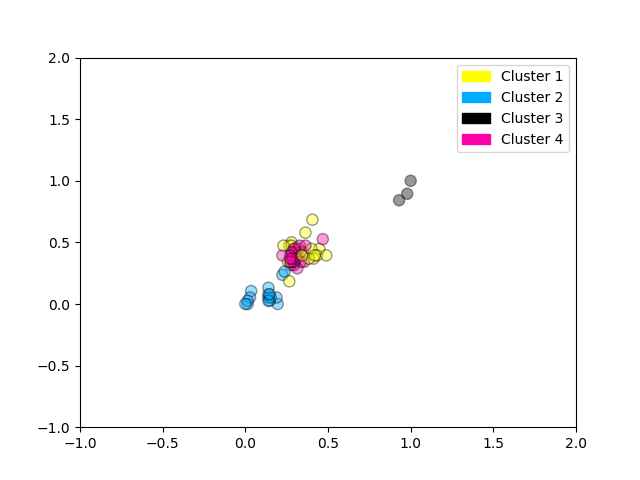

# Unsupervised Machine Learning

## Unsupervised Learning Notebook

+ [Web notebook Launching Page](https://www.coursera.org/learn/python-machine-learning/notebook/KDjxZ/unsupervised-learning-notebook)
+ [Web Notebook](https://hub.coursera-notebooks.org/user/elkljxyoytcwjbmkgctrtg/notebooks/UnsupervisedLearning.ipynb)
+ [Local notebook](notebooks/UnsupervisedLearning.ipynb)
+ [Local python code](notebooks/UnsupervisedLearning.py)

## Introduction

+ Introduction: Unsupervised Learning
    + Unsupervised learning involves tasks that operate on datasets __without__ labeled responses or target values.
    + Instead, the goal is to capture interesting structure or information.
    + Applications of unsupervised learning:
        + Visualize structure of a complex dataset.
        + Density estimation to predict probabilities of events.
        + Compress and summarize the data.
        + Extract features for supervised learning.
        + Discover important clusters or outliers.

+ Web Clustering Example
    <a href="https://www.coursera.org/learn/python-machine-learning/lecture/XIt7x/introduction"> <br/>
        
    </a>

+ Two major types of unsupervised learning methods
    + Transformations
        + Processes that extract or compute information
    + Clustering
        + Find groups in the data
        + Assign every point in the dataset to one of the groups


+ Transformations: Density Estimation
    <a href="https://www.coursera.org/learn/python-machine-learning/lecture/XIt7x/introduction"> <br/>
        
    </a>

+ Density Estimation Example
    <a href="https://www.coursera.org/learn/python-machine-learning/lecture/XIt7x/introduction"> <br/>
        
    </a>
    <a href="https://www.coursera.org/learn/python-machine-learning/lecture/XIt7x/introduction">
        
    </a>

+ Kernel Density Example
    <a href="http://www.digital-geography.com/csv-heatmap-leaflet/"> <br/>
        
    </a>


### Lecture Video

<a href="https://d3c33hcgiwev3.cloudfront.net/8O0xDUFoEee3MRIl4lCYSA.processed/full/360p/index.mp4?Expires=1538784000&Signature=IouwnCBJvtm7tds2irYlEwq~KkFXqQ8RyAiZiwhB~UPJu9F~Cu75IxYtdIV3QiIwUETdpBVLa8bkEDU6AjkKb~5hVHjDunNzTzB7yBVporyuQTt2uiBLXLrEiO2V658rb1Qm0-HocicG9AXIFXl9EcvYU6ucv-3sevC5uWoTcKw_&Key-Pair-Id=APKAJLTNE6QMUY6HBC5A" alt="Introduction" target="_blank">
     
</a>


## Dimensionality Reduction and Manifold Learning

+ Dimensionality Reduction
    + Finds an approximate version of your dataset using fewer features
    + Used for exploring and visualizing a dataset to understand grouping or relationships
    + Often visualized using a 2-dimensional scatterplot
    + Also used for compression, finding features for supervised learning
    <a href="https://www.coursera.org/learn/python-machine-learning/lecture/XIt7x/introduction"> <br/>
        
    </a>
    + The one-dimensional approximation is obtained by projecting the original points onto the diagonal line and using their position on that line as the new single feature.

+ Simple PCA Example
    <a href="https://www.coursera.org/learn/python-machine-learning/lecture/XIt7x/introduction"> <br/>
        
    </a>

+ Dimensionality Reduction with PCA in scikit-learn
    ```python
    # #### Using PCA to find the first two principal components of the breast cancer dataset
    from sklearn.preprocessing import StandardScaler
    from sklearn.decomposition import PCA
    from sklearn.datasets import load_breast_cancer

    cancer = load_breast_cancer()
    (X_cancer, y_cancer) = load_breast_cancer(return_X_y = True)

    # Before applying PCA, each feature should be centered (zero mean) and with unit variance
    X_normalized = StandardScaler().fit(X_cancer).transform(X_cancer)  

    pca = PCA(n_components = 2).fit(X_normalized)

    X_pca = pca.transform(X_normalized)
    print(X_cancer.shape, X_pca.shape)
    # (569, 30) (569, 2)

    # #### Plotting the PCA-transformed version of the breast cancer dataset
    from adspy_shared_utilities import plot_labelled_scatter
    plot_labelled_scatter(X_pca, y_cancer, ['malignant', 'benign'])

    plt.xlabel('First principal component')
    plt.ylabel('Second principal component')
    plt.title('Breast Cancer Dataset PCA (n_components = 2)');
    ```
    <a href="https://www.coursera.org/learn/python-machine-learning/lecture/XIt7x/introduction"> <br/>
        
    </a>

+ Visualizing PCA Components
    ```python
    # #### Plotting the magnitude of each feature value for the first two principal components
    fig = plt.figure(figsize=(8, 4))
    plt.imshow(pca.components_, interpolation = 'none', cmap = 'plasma')
    feature_names = list(cancer.feature_names)

    plt.gca().set_xticks(np.arange(-.5, len(feature_names)));
    plt.gca().set_yticks(np.arange(0.5, 2));
    plt.gca().set_xticklabels(feature_names, rotation=90, ha='left', fontsize=12);
    plt.gca().set_yticklabels(['First PC', 'Second PC'], va='bottom', fontsize=12);

    plt.colorbar(orientation='horizontal', ticks=[pca.components_.min(), 0, 
        pca.components_.max()], pad=0.65);      # Fig 2

    # #### PCA on the fruit dataset (for comparison)
    from sklearn.preprocessing import StandardScaler
    from sklearn.decomposition import PCA

    # each feature should be centered (zero mean) and with unit variance
    X_normalized = StandardScaler().fit(X_fruits).transform(X_fruits)  

    pca = PCA(n_components = 2).fit(X_normalized)
    X_pca = pca.transform(X_normalized)

    from adspy_shared_utilities import plot_labelled_scatter
    plot_labelled_scatter(X_pca, y_fruits, ['apple','mandarin','orange','lemon'])

    plt.xlabel('First principal component')
    plt.ylabel('Second principal component')
    plt.title('Fruits Dataset PCA (n_components = 2)'); # Fig 3
    ```
    <a href="https://www.coursera.org/learn/python-machine-learning/lecture/XIt7x/introduction"> <br/>
        
    </a>
    <a href="https://www.coursera.org/learn/python-machine-learning/lecture/XIt7x/introduction"> 
        
    </a>

+ The "Swiss Roll" Dataset
    <a href="http://scikit-learn.org/stable/modules/clustering.html#hierarchical-clustering"> <br/>
        
    </a>

+ Multidimensional scaling (MDS) attempts to find a distance-preserving low-dimensional projection
    <a href="https://www.coursera.org/learn/python-machine-learning/lecture/XIt7x/introduction"> <br/>
        
    </a>

+ Notebook: MDS on the Fruit Dataset
    ```python
    # #### Multidimensional scaling (MDS) on the fruit dataset
    from adspy_shared_utilities import plot_labelled_scatter
    from sklearn.preprocessing import StandardScaler
    from sklearn.manifold import MDS

    # each feature should be centered (zero mean) and with unit variance
    X_fruits_normalized = StandardScaler().fit(X_fruits).transform(X_fruits)  

    mds = MDS(n_components = 2)

    X_fruits_mds = mds.fit_transform(X_fruits_normalized)

    plot_labelled_scatter(X_fruits_mds, y_fruits, ['apple', 'mandarin', 'orange', 'lemon'])
    plt.xlabel('First MDS feature')
    plt.ylabel('Second MDS feature')
    plt.title('Fruit sample dataset MDS');  # Fig.3

    # #### Multidimensional scaling (MDS) on the breast cancer dataset
    from sklearn.preprocessing import StandardScaler
    from sklearn.manifold import MDS
    from sklearn.datasets import load_breast_cancer

    cancer = load_breast_cancer()
    (X_cancer, y_cancer) = load_breast_cancer(return_X_y = True)

    # each feature should be centered (zero mean) and with unit variance
    X_normalized = StandardScaler().fit(X_cancer).transform(X_cancer)  

    mds = MDS(n_components = 2)

    X_mds = mds.fit_transform(X_normalized)

    from adspy_shared_utilities import plot_labelled_scatter
    plot_labelled_scatter(X_mds, y_cancer, ['malignant', 'benign'])

    plt.xlabel('First MDS dimension')
    plt.ylabel('Second MDS dimension')
    plt.title('Breast Cancer Dataset MDS (n_components = 2)');  # Fig.4
    ```
    <a href="https://www.coursera.org/learn/python-machine-learning/lecture/XIt7x/introduction"> <br/>
        
    </a>
    <a href="https://www.coursera.org/learn/python-machine-learning/lecture/XIt7x/introduction">
        
    </a>

+ t-SNE: a powerful manifold learning method that finds a 2D projection preserving information about neighbors
    <a href="https://lvdmaaten.github.io/tsne/"> <br/>
        
    </a>

+ Notebook: t-SNE on the Fruit Dataset
    ```python
    # #### t-SNE on the fruit dataset
    from sklearn.manifold import TSNE

    tsne = TSNE(random_state = 0)

    X_tsne = tsne.fit_transform(X_fruits_normalized)

    plot_labelled_scatter(X_tsne, y_fruits, 
        ['apple', 'mandarin', 'orange', 'lemon'])
    plt.xlabel('First t-SNE feature')
    plt.ylabel('Second t-SNE feature')
    plt.title('Fruits dataset t-SNE');  # Fig.6

    # #### t-SNE on the breast cancer dataset
    # Although not shown in the lecture video, this example is included for comparison, showing the results of running 
    # t-SNE on the breast cancer dataset.  See the reading "How to Use t-SNE effectively" for further details on how 
    # the visualizations from t-SNE are affected by specific parameter settings.
    tsne = TSNE(random_state = 0)

    X_tsne = tsne.fit_transform(X_normalized)

    plot_labelled_scatter(X_tsne, y_cancer, 
        ['malignant', 'benign'])
    plt.xlabel('First t-SNE feature')
    plt.ylabel('Second t-SNE feature')
    plt.title('Breast cancer dataset t-SNE');   # Fig.7
    ```
    <a href="https://www.coursera.org/learn/python-machine-learning/lecture/XIt7x/introduction"> <br/>
        
    </a>
    <a href="https://www.coursera.org/learn/python-machine-learning/lecture/XIt7x/introduction"> <br/>
        
    </a>


### Lecture Video

<a href="https://d3c33hcgiwev3.cloudfront.net/_lwQeEFoEeeR4AqenwJvyA.processed/full/360p/index.mp4?Expires=1538784000&Signature=M-yHQE4YNhQkqE2YWjSFXFsr1yxYToboercbWNU-FwtkpQKiAuVgKlP4HzsiXqnZsCVW1TUmlgNvbeq3q1aomtD~8VpIQopqcrxiVp1aG2Jq9kGQnYsuK2yWVuxtwd4CYzOHkhZ3K76JpnRwiOohk6jeUBpsQgIjDuznYPJSu3s_&Key-Pair-Id=APKAJLTNE6QMUY6HBC5A" alt="Dimensionality Reduction and Manifold Learning" target="_blank">
     
</a>


## Clustering

+ Clustering:
    + Finding a way to divide a dataset into groups ('clusters')
    + Data points within the same cluster should be 'close' or 'similar' in some way.
    + Data points in different clusters should be 'far apart' or 'different'
    + Clustering algorithms output a cluster membership index for each data point:
        + Hard clustering: each data point belongs to exactly one cluster
        + Soft (or fuzzy) clustering: each data point is assigned a weight, score, or probability of membership for each cluster
    <a href="https://brilliant.org/wiki/k-means-clustering/"> <br/>
        
    </a>

+ K-means Clustering Algorithm
    + __Initialization__: Pick the number of clusters k you want to find.Then pick k random points to serve as an initialguess for the cluster centers.
    + __Step A__: Assign each data point to the nearest cluster center.
    + __Step B__: Update each cluster center by replacing it withthe mean of all points assigned to that cluster (in step A).
    + __Repeat steps A and B__: until the centers converge to a stable solution.
    + Typically running 10 different random initialization
    <a href="https://www.naftaliharris.com/blog/visualizing-k-means-clustering/"> <br/>
        
    </a>

+ K-means Example
    + Step 1A: 
        + We want three clusters, so three centers are chosen randomly.
        + Data points are colored according to the closest center.
    + Step 1B:
        + Each center is then updated…
        + … using the mean of all points assigned to that cluster.
    + Step 2A:
        + Data points are colored (again) according to the closest center.
    + Step 2B: 
        + Re-calculate all cluster centers.
    + Converged: 
        + After repeating these steps for several more iterations…
        + The centers converge to a stable solution!
        + These centers define the final clusters.
    <a href="https://www.naftaliharris.com/blog/visualizing-k-means-clustering/"> <br/>
        
    </a>
    <a href="https://www.naftaliharris.com/blog/visualizing-k-means-clustering/"> 
        
    </a>
    <a href="https://www.naftaliharris.com/blog/visualizing-k-means-clustering/"> 
        
    </a>
    <a href="https://www.naftaliharris.com/blog/visualizing-k-means-clustering/">
        
    </a>
    <a href="https://www.naftaliharris.com/blog/visualizing-k-means-clustering/">
        
    </a>

+ k-means Example in Scikit-Learn
    ```python
    # This example from the lecture video creates an artificial dataset with make_blobs, then 
    # applies k-means to find 3 clusters, and plots the points in each cluster identified by a 
    # corresponding color.
    from sklearn.datasets import make_blobs
    from sklearn.cluster import KMeans
    from adspy_shared_utilities import plot_labelled_scatter

    X, y = make_blobs(random_state = 10)

    kmeans = KMeans(n_clusters = 3)
    kmeans.fit(X)

    plot_labelled_scatter(X, kmeans.labels_, ['Cluster 1', 'Cluster 2', 'Cluster 3'])   # Fig.8
    ```
    <a href="https://www.coursera.org/learn/python-machine-learning/lecture/XIt7x/introduction">
        
    </a>

+ k-means Output on the Fruits Dataset
    ```python
    # Example showing k-means used to find 4 clusters in the fruits dataset.  Note that in 
    # general, it's important to scale the individual features before applying k-means clustering.
    from sklearn.datasets import make_blobs
    from sklearn.cluster import KMeans
    from adspy_shared_utilities import plot_labelled_scatter
    from sklearn.preprocessing import MinMaxScaler

    fruits = pd.read_table('fruit_data_with_colors.txt')
    X_fruits = fruits[['mass','width','height', 'color_score']].as_matrix()
    y_fruits = fruits[['fruit_label']] - 1

    X_fruits_normalized = MinMaxScaler().fit(X_fruits).transform(X_fruits)  

    kmeans = KMeans(n_clusters = 4, random_state = 0)
    kmeans.fit(X_fruits_normalized)

    plot_labelled_scatter(X_fruits_normalized, kmeans.labels_, 
        ['Cluster 1', 'Cluster 2', 'Cluster 3', 'Cluster 4'])   # Fig.9
    ```
    <a href="https://www.coursera.org/learn/python-machine-learning/lecture/XIt7x/introduction"> <br/>
        
    </a>
    + Can you interpret how these clusters correspond with the true fruit labels?

+ Limitations of k-means
    + Works well for simple clusters that are same size, well-separated, globular shapes.
    + Does not do well with irregular, complex clusters.
    + Variants of k-means like k-medoids can work with categorical features.

+ Agglomerative Clustering Example
    <a href="https://www.coursera.org/learn/python-machine-learning/lecture/XIt7x/introduction"><br/>
        
    </a>

+ Linkage Criteria for Agglomerative Clustering
    + Ward's method: Least increase in total variance(around cluster centroids)
    + Average linkage: Average distance between clusters
    + Complete linkage: Max distance between clusters
    <a href="https://www.coursera.org/learn/python-machine-learning/lecture/XIt7x/introduction"><br/>
        
    </a>

+ Agglomerative Clustering in Scikit-Learn
    ```python
    # ### Agglomerative clustering
    from sklearn.datasets import make_blobs
    from sklearn.cluster import AgglomerativeClustering
    from adspy_shared_utilities import plot_labelled_scatter

    X, y = make_blobs(random_state = 10)

    cls = AgglomerativeClustering(n_clusters = 3)
    cls_assignment = cls.fit_predict(X)

    plot_labelled_scatter(X, cls_assignment, 
            ['Cluster 1', 'Cluster 2', 'Cluster 3'])    # Fig.10
    ```
    <a href="https://www.coursera.org/learn/python-machine-learning/lecture/XIt7x/introduction"><br/>
        
    </a>

+ Hierarchical Clustering
    <a href="https://www.coursera.org/learn/python-machine-learning/lecture/XIt7x/introduction"><br/>
        
    </a>

+ Dendrogram Example
    ```python
    # This dendrogram plot is based on the dataset created in the previous step 
    # with make_blobs, but for clarity, only 10 samples have been selected for 
    # this example, as plotted here:
    X, y = make_blobs(random_state = 10, n_samples = 10)
    plot_labelled_scatter(X, y, 
            ['Cluster 1', 'Cluster 2', 'Cluster 3'])    # Fig.11
    print(X)

    # And here's the dendrogram corresponding to agglomerative clustering of the 
    # 10 points above using Ward's method.  The index 0..9 of the points 
    # corresponds to the index of the points in the X array above.  For example, 
    # point 0 (5.69, -9.47) and point 9 (5.43, -9.76) are the closest two points 
    # and are clustered first.
    from scipy.cluster.hierarchy import ward, dendrogram
    plt.figure()
    dendrogram(ward(X))
    plt.show()      # Fig.12
    ```
    <a href="https://www.coursera.org/learn/python-machine-learning/lecture/XIt7x/introduction"> <br/>
        
    </a>
    <a href="https://www.coursera.org/learn/python-machine-learning/lecture/XIt7x/introduction">
        
    </a>

+ DBSCAN Clustering
    + Unlike k-means, you don't need to specify # of clusters
    + Relatively efficient –can be used with large datasets
    + Identifies likely noise points
    <a href="https://www.coursera.org/learn/python-machine-learning/lecture/XIt7x/introduction">
        
    </a>

+ DBSCAN Example in Scikit-Learn
    + DBSCAN: density-based spatial clustering of applications with noise
    ```python
    # ### DBSCAN clustering
    from sklearn.cluster import DBSCAN
    from sklearn.datasets import make_blobs

    X, y = make_blobs(random_state = 9, n_samples = 25)

    dbscan = DBSCAN(eps = 2, min_samples = 2)

    cls = dbscan.fit_predict(X)
    print("Cluster membership values:\n{}".format(cls))

    plot_labelled_scatter(X, cls + 1, 
            ['Noise', 'Cluster 0', 'Cluster 1', 'Cluster 2']) # Fig.13
    ```
    <a href="https://www.coursera.org/learn/python-machine-learning/lecture/XIt7x/introduction">
        
    </a>

+ Clustering Evaluation
    + With ground truth, existing labels can be used to evaluate cluster quality.
    + Without ground truth, evaluation can difficult: multiple clusteringsmay be plausible for a dataset.
    + Consider task-based evaluation: Evaluate clustering according to performance on a task that doeshave an objective basis for comparison.
    + Example: the effectiveness of clustering-based features for a supervised learning task.
    + Some evaluation heuristics exist (e.g. silhouette) but these can be unreliable.
    <a href="https://www.coursera.org/learn/python-machine-learning/lecture/XIt7x/introduction">
        
    </a>


### Lecture Video

<a href="https://d3c33hcgiwev3.cloudfront.net/EKwFq0FpEeeR4AqenwJvyA.processed/full/360p/index.mp4?Expires=1538784000&Signature=GfcwoMKAblhSPQyH~uPsYtUOBD4hlzaLtp6YpIezDo2cFBR~ejHta8TpLNVP0MRhI9Lnbq4mHjCowmsZHwHdsH~F5XSMi8-23PmWLhMZ5ttIgRBmjsBdNEqoiUOsKtadriFByfGMaApZkyig5~14RU1gu3C04hNFowLPd9wUUPo_&Key-Pair-Id=APKAJLTNE6QMUY6HBC5A" alt="Clustering" target="_blank">
     
</a>


## How to Use t-SNE Effectively

+ Wattenberg, et al., "[How to Use t-SNE Effectively](http://doi.org/10.23915/distill.00002)", Distill, 2016. 
+ http://distill.pub/2016/misread-tsne/#citation

## How Machines Make Sense of Big Data: an Introduction to Clustering Algorithms

Gleesen, Peter. "[How Machines Make Sense of Big Data: an Introduction to Clustering Algorithms](https://medium.freecodecamp.com/how-machines-make-sense-of-big-data-an-introduction-to-clustering-algorithms-4bd97d4fbaba)", freeCodeCamp, 2017.

### Introduction

+ Us humans take it for granted how good we are categorizing and making sense of large volumes of data pretty quickly.

+ Humans are generally fairly efficient at making sense of whatever data.

+ Three clustering algorithms that machines can use to quickly make sense of large datasets.

### K-means clustering

+ When: an idea of how many groups you’re expecting to find a priori.

+ How:
    1. randomly assign each observation into one of k categories, then calculates the mean of each category
    2. reassign each observation to the category with the closest mean before recalculating the means
    3. repeats over and over until no more reassignments are necessary

+ Example:
    + Take a group of 12 football (or ‘soccer’) players who have each scored a certain number of goals this season (say in the range 3–30). Let’s divide them into separate clusters — say three.
    + Procedure
        1. randomly split the players into three groups and calculate the means of each
            + Group 1: Player A (5 goals), Player B (20 goals), Player C (11 goals) -> Group Mean = (5 + 20 + 11) / 3 = 12
            + Group 2: Player D (5 goals), Player E (3 goals), Player F (19 goals) -> Group Mean = 9
            + Group 3: Player G (30 goals), Player H (3 goals), Player I (15 goals) -> Group Mean = 16
        2. For each player, reassign them to the group with the closest mean. Then recalculate the group means.
            + Group 1 (Old Mean = 12): Player C (11 goals) -> New Mean = 11
            + Group 2 (Old Mean = 9): Player A (5 goals), Player D (5 goals), Player E (3 goals), Player H (3 goals) -> New Mean = 4
            + Group 3 (Old Mean = 16): Player G (30 goals), Player I (15 goals), Player B (20 goals), Player F (19 goals) -> New Mean = 21
        3. Repeat Step 2 over and over until the group means no longer change
            + Group 1 (Old Mean = 11): Player C (11 goals), Player I (15 goals) -> Final Mean = 13
            + Group 2 (Old Mean = 4): Player A (5 goals), Player D (5 goals), Player E (3 goals), Player H (3 goals) -> Final Mean = 4
            + Group 3 (Old Mean = 21): Player G (30 goals), Player B (20 goals), Player F (19 goals) -> Final Mean = 23
    + The clusters could correspond to the players’ positions on the field — such as defenders, midfielders and attackers.
    + Given data on a range of performance statistics, a machine could do a reasonable job of estimating the positions of players from any team sport — useful for sports analytics, and indeed any other purpose where classification of a dataset into predefined groups can provide relevant insights.

+ Finer details:
    + The initial method of ‘seeding’ the clusters can be done in one of several ways.
    + Alternative: 
        + Seed the clusters with just one player each, then start assigning players to the nearest cluster.
        + The returned clusters are more sensitive to the initial seeding step, reducing repeatability in highly variable datasets.
    + limitation:
        + Provide a priori assumptions about how many clusters you’re expecting to find. 
        + Methods to assess the fit of a particular set of clusters. E.g., the Within-Cluster Sum-of-Squares, a measure of the variance within each cluster. 
        + The ‘better’ the clusters, the lower the overall WCSS.

### Hierarchical clustering

+ When: uncover the underlying relationships between your observations

+ How:
    1. A distance matrix is computed, where the value of cell $(i, j)$ is a distance metric between observations $i$ and $j$.
    2. Pair the closest two observations and calculate their average. Form a new distance matrix, merging the paired observations into a single object. From this distance matrix, pair up the closest two observations and calculate their average.
    3. Repeat until all observations are grouped together.

+ Example:
    + Selection of whale and dolphin species.
    + The typical body lengths for these six species
    + Dataset
        | Species            | Initials | Length(m) |
        |:-------------------|---------:|----------:|
        | Bottlenose Dolphin |     BD |       3.0 |
        | Risso's Dolphin    |     RD |       3.6 |
        | Pilot Whale        |     PW |       6.5 |
        | Killer Whale       |     KW |       7.5 |
        | Humpback Whale     |     HW |      15.0 |
        | Fin Whale          |     FW |      20.0 |
    + Procedure:
        1. compute a distance matrix between each species. <br/>
            The difference in length between any pair of species can be looked up by reading the value at the intersection of the relevant row and column.
            |    | BD   | RD   | PW   | KW   | HW |
            |:---|-----:|-----:|-----:|-----:|---:|
            | RD |  0.6 |      |      |      |      |
            | PW |  3.5 |  2.9 |      |      |      |
            | KW |  4.5 |  3.9 |  1.0 |      |      |
            | HW | 12.0 | 11.4 |  8.5 |  7.5 |      |
            | FW | 17.0 | 16.4 | 13.5 | 12.5 |  5.0 |
        2. Pair up the two closest species. Here the Bottlenose & Risso’s Dolphins, with an average length of 3.3m.
        3. Repeat Step 1 by recalculating the distance matrix, but this time merge the Bottlenose & Risso’s Dolphins into a single object with length 3.3m.
            |    | [BD, RD]  | PW  | KW  | HW |
            |:---|----------:|----:|----:|---:|
            | PW |      3.2  |     |     |    |
            | KW |      4.2  | 1.0 |     |     |
            | HW |     11.7  | 8.5 | 7.5 |     |
            | FW |     16.7  |13.5 |12.5 | 5.0 |
        4. Repeat Step 2 with this new distance matrix. Here, the smallest distance is between the Pilot & Killer Whales, so we pair them up and take their average — which gives us 7.0m.
        5. Repeat Step 1 — recalculate the distance matrix, but now we’ve merged the Pilot & Killer Whales into a single object of length 7.0m.
            |          | [BD, RD] | [PW, KW] | HW  |
            |:---------|---------:|---------:|----:|
            | [PW, KW] |      3.7 |          |     |
            | HW       |     11.7 |      8.0 |     |
            | FW       |     16.7 |     13.0 | 5.0 |
        6. Repeat Step 2 with this distance matrix. The smallest distance (3.7m) is between the two merged objects — so now we merge them into an even bigger object, and take the average (which is 5.2m).
        7. Repeat Step 1 and compute a new distance matrix, having merged the Bottlenose & Risso’s Dolphins with the Pilot & Killer Whales.
            |    | [[BD, RD] , [PW, KW]]  |  HW |
            |:---|-----------------------:|----:|
            | HW |                   9.8  |     |
            | FW |                  14.8  | 5.0 |
        8. repeat Step 2. The smallest distance (5.0m) is between the Humpback & Fin Whales, so we merge them into a single object, and take the average (17.5m).
        9. Repeat Step 1 — compute the distance matrix, having merged the Humpback & Fin Whales.
            |          | [[BD, RD] , [PW, KW]] |
            |:---------|----------------------:|
            | [HW, FW] |                  12.3 |
        10. repeat Step 2 — there is only one distance (12.3m) in this matrix, so we pair everything into one big object. <br/> 
            [[[BD, RD],[PW, KW]],[HW, FW]]
    <a href="https://medium.freecodecamp.org/how-machines-make-sense-of-big-data-an-introduction-to-clustering-algorithms-4bd97d4fbaba"> <br/>
        
    </a>
    + Hierarchical clustering has applications in Data Mining and Machine Learning contexts.
    + This approach requires no assumptions about the number of clusters you’re looking for.
    + If we draw a horizontal line at height = 10, we’d intersect the two main branches, splitting the dendrogram into two sub-graphs. 
    + If we cut at height = 2, we’d be splitting the dendrogram into three clusters.

+ Finer details:
    + three aspects in which hierarchical clustering algorithms
        + Most fundamental used an agglomerative process: start with one giant cluster, and then proceed to divide the data into smaller and smaller clusters until you’re left with isolated data points.
        + Methods to calculate the distance matrices
        + __Linkage criterion__: Clusters are linked according to how close they are to one another, but the way in which we define ‘close’ is flexible.
    + Define the distance between two clusters to be the minimum (or maximum) distance between any of their points.
    <a href="https://medium.freecodecamp.org/how-machines-make-sense-of-big-data-an-introduction-to-clustering-algorithms-4bd97d4fbaba"> <br/>
        
    </a>


### Graph Community Detection

+ When: data that can be represented as a network, or ‘graph’.

+ How:
    + A graph community is very generally defined as a subset of vertices which are more connected to each other than with the rest of the network.
    + Algorithms: Edge Betweenness, Modularity-Maximsation, Walktrap, Clique Percolation, Leading Eigenvector ...

+ Example
    + Graph theory: a fascinating branch of mathematics that lets us model complex systems as an abstract collection of ‘dots’ (or vertices) connected by ‘lines’ (or edges)
    + Social networks: the vertices represent people, and edges connect vertices who are friends/followers
    + Any system can be modelled as a network if you can justify a method to meaningfully connect different components.
    + Eight websites I most recently visited, linked according to whether their respective Wikipedia articles link out to one another.
    <a href="https://medium.freecodecamp.org/how-machines-make-sense-of-big-data-an-introduction-to-clustering-algorithms-4bd97d4fbaba"> <br/>
        
    </a>
    + The yellow vertices are generally reference/look-up sites; the blue vertices are all used for online publishing (of articles, tweets, or code); and the red vertices include YouTube, which was of course founded by former PayPal employees.
    + The real power of networks comes from their mathematical analysis.
    + _Adjacency matrix_ of the network
        |          | GH | Gl | M | P | Q | T | W | Y |
        |----------|----|----|---|---|---|---|---|---|
        | GitHub   |  0 |  1 | 0 | 0 | 0 | 1 | 0 | 0 |
        | Google   |  1 |  0 | 1 | 1 | 1 | 1 | 1 | 1 |
        | Medium   |  0 |  1 | 0 | 0 | 0 | 1 | 0 | 0 |
        | PayPal   |  0 |  1 | 0 | 0 | 0 | 1 | 0 | 1 |
        | Quora    |  0 |  1 | 0 | 0 | 0 | 1 | 1 | 0 |
        | Twitter  |  1 |  1 | 1 | 1 | 1 | 0 | 0 | 1 |
        | Wikipedia|  0 |  1 | 0 | 0 | 1 | 0 | 0 | 0 |
        | YouTube  |  0 |  1 | 0 | 1 | 0 | 1 | 0 | 0 |
    + The value at the intersection of each row and column records whether there is an edge between that pair of vertices.
    + Encoded within the adjacency matrix are all the properties of this network — it gives us the key to start unlocking all manner of valuable insights.
    + For a start, summing any column (or row) gives you the degree of each vertex — i.e., how many others it is connected to, commonly denoted with $k$.
    + Modularity (measure of the structure of networks or graphs) of any given clustering of the network:
        + Summing the degrees of every vertex and dividing by two gives you L, the number of edges (or ‘links’) in the network. The number of rows/columns gives us N, the number of vertices (or ‘nodes’) in the network.
        + Knowing just $k, L, N$ and the value of each cell in the adjacency matrix $A$
        + Use the modularity score to assess the ‘quality’ of this clustering.
        + A higher score will show we’ve split the network into ‘accurate’ communities, whereas a low score suggests our clusters are more random than insightful.
    <a href="https://medium.freecodecamp.org/how-machines-make-sense-of-big-data-an-introduction-to-clustering-algorithms-4bd97d4fbaba"> <br/>
        
    </a>
    + Formula:

        $$M = \frac{1}{2L} \sum_{i,j=1}^N (A_{ij} - \frac{k_i k_j}{2L}) \delta c_i c_j$$
        + $M$: modularity
        + $1/2L$: divide everything that follows by 2L, i.e., twice the number of edges in the network
        + summing up everything to the right and iterate over every row and column in the adjacency matrix $A$, the $i, j = 1$ and the $N$ work much like nested for-loops in programming
    + Coding
        ```python
        sum = 0
        for i in range(1,N):
            for j in range(1,N):
                ans = #stuff with i and j as indices
                sum += ans
        ```
    + `#stuff with i and j` details
        + The bit in brackets tells us to subtract $( k_i k_j ) / 2L$ from $A_{ij}$
        + $A_{ij}$: the value in the adjacency matrix at row $i$, column $j$
        + $k_i$ and $k_j$: the degrees of each vertex — found by adding up the entries in row $i$ and column $j$ respectively
        + The difference between the network’s real structure and the expected structure it would have if randomly reassembled.
    + $\delta c_i, c_j$ is the fancy-sounding but totally harmless Kronecker-delta function
        ```python
        def Kronecker_Delta(ci, cj):
            if ci == cj:
                return 1
            else:
                return 0
        Kronecker_Delta("A","A")    #returns 1
        Kronecker_Delta("A","B")    #returns 0
        ```
    + The Kronecker-delta function takes two arguments, and returns $1$ if they are identical, otherwise, zero.
    + If vertices $i$ and $j$ have been put in the same cluster, then $\delta c_i, c_j = 1$. Otherwise, if they are in different clusters, the function returns zero.
    + For the nested $\sum$, the outcome is highest when there are lots of ‘unexpected’ edges connecting vertices assigned to the same cluster.
    + Dividing by $2L$ bounds the upper value of modularity at $1$.
    + Modularity scores near to or below zero indicate the current clustering of the network is really no use.
    + The higher the modularity, the better the clustering of the network into separate communities.
    + By maximizing modularity, find the best way of clustering the network.
    + brute force: computationally impossible beyond a very limited sample size
    + Eight vertices: 4140 different ways of clustering
    + Heuristic method:
        + Fast-Greedy Modularity-Maximization
        + Analogous to the agglomerative hierarchical clustering algorithm
    + ‘Mod-Max’ merges communities according to changes in modularity
        1. initially assigning every vertex to its own community, and calculating the modularity of the whole network, $M$.
        2. for each community pair linked by at least a single edge, the algorithm calculates the resultant change in modularity $\Delta M$ if the two communities were merged into one.
        3. Repeat steps 1 and 2 — each time merging the pair of communities for which doing so produces the biggest gain in $\Delta M$, then recording the new clustering pattern and its associated modularity score $M$.
        4. Stop when all the vertices are grouped into one giant cluster. Identify the clustering pattern that returned the highest value of $M$.

+ Finer details
    + Graph theory: NP-hard problems
    + Community detection is a major focus of current research in graph theory, and there are plenty of alternatives to Modularity-Maximization
    + resolution limit: not find communities below a certain size
    + Mod-Max approach: produce a wide ‘plateau’ of many similar high modularity scores
    + Edge-Betweenness:
        + a divisive algorithm, starting with all vertices grouped in one giant cluster
        + iteratively remove the least ‘important’ edges in the network, until all vertices are left isolated.
    + Clique Percolation: take into account possible overlap between graph communities
    + random-walks across the graph, and then spectral clustering methods which start delving into the eigendecomposition of the adjacency matrix and other matrices derived therefrom.


### Conclusion

+ Machine Learning: an extraordinarily ambitious field of research, in which massively complex problems require solving in as accurate and as efficient a way possible


