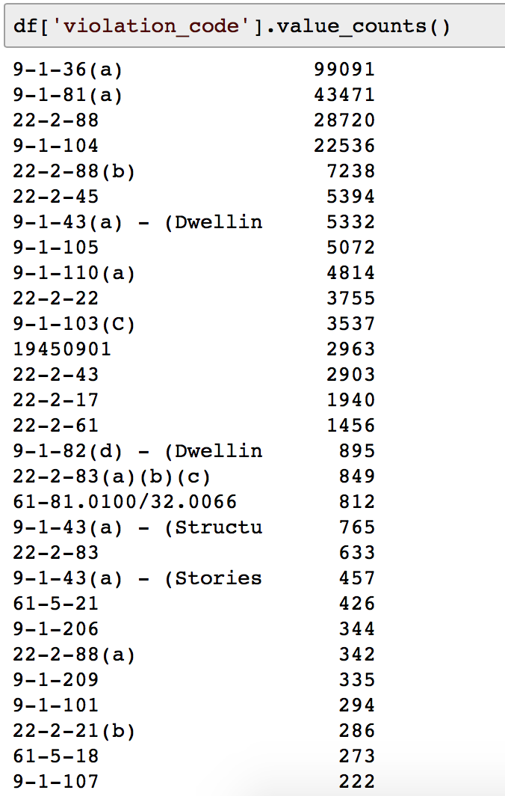
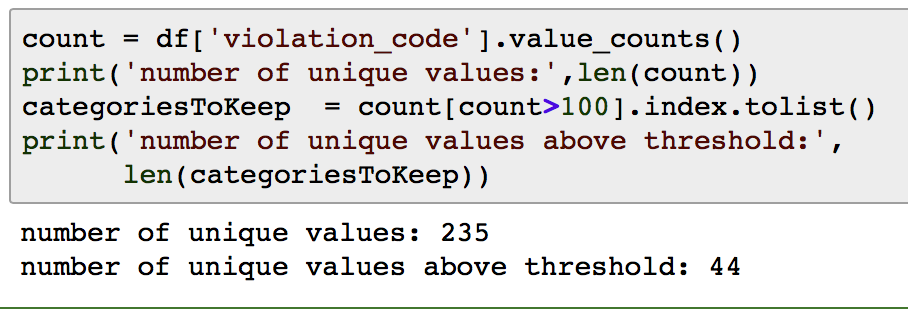
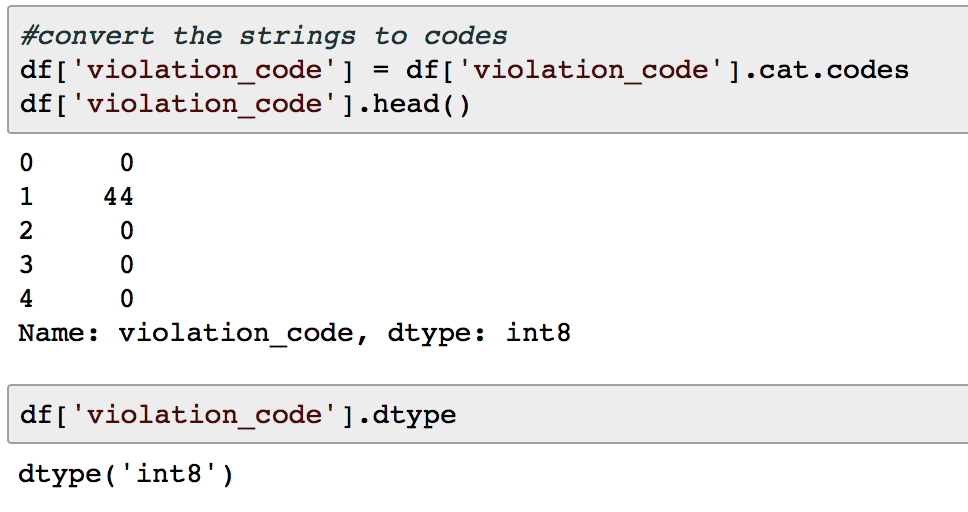

# Assignment 4

## Notebooks

+ [Web Notebook Launching Page](https://www.coursera.org/learn/python-machine-learning/notebook/yWWk7/assignment-4)
+ [Web Notebook](https://hub.coursera-notebooks.org/user/elkljxyoytcwjbmkgctrtg/notebooks/Assignment%204.ipynb)
+ [Local Notebook](notebooks/Assignment0)


## Useful Links for Assignment

### [No AUC output in the feedback from AG? Check this!](https://www.coursera.org/learn/python-machine-learning/discussions/weeks/4/threads/PmH1O73KEeeBnhIna1yUEg)

If you received a feedback like "Function blight_model was answered incorrectly, 1.0 points were not awarded" from the autograder(AG), it means that in the perspective of the AG, your code contains bugs. Instead, the working code should result in a feedback like "Your AUC of 0.81234567 was awarded a value of 1.0 out of 1.0 total grades".

To debug this, try the following steps:

1) Close and re-enter the jupyter notebook from assignments and run your code. Make sure your code is working on Coursera platform.

2) Make sure you have got the correct output format(see sample in the question).

3) If you have multiple functions, make sure you do NOT have global variables AND global imports. Instead, you may try to import necessary packages in specific functions and eliminate any global variable.

4) Make sure the runtime is <10mins. You should NOT use Neural Network(e.g., MLPClassifier) since they might have to use a lot of computational resources, which exceeds the limitation of the Coursera platform.

5) If you are using any datetime-related feature, you probably need to search in the discussion forum to see which method(s) you could use on the platform. Also, you might try to temporarily eliminate the feature(s) and submit the notebook to see whether the problem is within the feature(s) or not.

6) Try the simple test code written by Sophie


### [Assignment 4 FAQs](https://www.coursera.org/learn/python-machine-learning/discussions/weeks/4/threads/Gs4NE2CeEeeqKgpTZZjjFg)

+ 
This Assignment is highly reliant on the material introduced in Course 1, I recommend reviewing that, specially column selection, series creation, dealing with missing values, querying series/dataframes.

Desired Output/Sanity Check

The following code can be used to check the output, be sure to comment out /delete this code one you've used it (Last updated on 1st August 2017)


```python
bm = blight_model()
res = 'Data type Test: '
res += ['Failed: type(bm) should Series\n','Passed\n'][type(bm)==pd.Series]
res += 'Data shape Test: '
res += ['Failed: len(bm) should be 61001\n','Passed\n'][len(bm)==61001]
res += 'Data Values Test: '
res += ['Failed: all values should be in [0.,1.]\n','Passed\n'][all((bm<=1.) & (bm>=0.))]
res += 'Data Values type Test: '
res += ['Failed: bm.dtype should be float\n','Passed\n'][str(bm.dtype).count('float')>0]
res += 'Index type Test: '
res += ['Failed: type(bm.index) should be Int64Index\n','Passed\n'][type(bm.index)==pd.Int64Index]
res += 'Index values type Test: '
res += ['Failed: type(bm.index[0]) should be int64\n','Passed\n'][str(type(bm.index[0])).count("int64")>0]

res += 'Output index shape test:'
res += ['Failed, bm.index.shape should be (61001,)\n','Passed\n'][bm.index.shape==(61001,)]

res += 'Output index test: '
if bm.index.shape==(61001,):
    res +=['Failed\n','Passed\n'][all(pd.read_csv(
        'test.csv',usecols=[0],index_col=0).sort_index().index.values==bm.sort_index().index.values)]
else:
    res+='Failed'
print(res)
```

+ How to use this Thread,

    I've noticed a few learners taking some of the examples in this thread out of context. I tried to keep the thread organised but that's not always possible

    so here is a quick guide

    1. if you're having a low AUC see the post Things to try when grader's AUC is too low then How to calculate AUC then Dealing with categorical data
    2. if the grader is raising a memory error see the post Memory Problems
    3. if the grader is returning incorrect answer, or if the grader is returning an error, see the post Grader Issues
    4. if you're just getting started, see How to calculate AUC then Memory Problems then Dealing with categorical data


+ Dealing with categorical data

    For each column in the train data and the corresponding column from the test data

    find the unique categories "ucats" using set or unique the add an additional category, you can call it '<unknown>'
    Convert the train column to categorical data using the unique categories ucats, if the data is ordered, make sure you specify the order, replace any NaN values with '<unknown>''
    use the same categories "ucats" to convert the corresponding column in the test data to categorical(the conversion will return NaN for none existing categories which can then be assigned to the unknown category).
    When to use get_dummies or OneHotEncoder

    If the categories are ordered e.g. ['low','middle','high'], converting the Data to integers and using it directly will be the right thing to do. the caveat here is that the order of the categories should be explicitly specified.

    if however the categories are no ordered, e.g. addresses, names, gender,...etc, using the integer representation will depend on the alphabetical order of the categories,"Such integer representation can not be used directly with scikit-learn estimators, as these expect continuous input"(quote from documentation)

    In this case the numbers are meaningless, please this section of the scikit-learn documentation for more information.(the linked page also contain a section on choosing the values to replace NaN)


    ```python
    ucats_an = set(train['agency_name'])|{'<unknown>'}

    train['agency_name']= pd.Categorical(train['agency_name'],categories=ucats_an).fillna('<unknown>').codes

    test['agency_name']= pd.Categorical(test['agency_name'],categories=ucats_an).fillna('<unknown>').codes
    ```

    you'll have to choose which features you want to use, I would advise starting with numerical features and categorical features with a relatively low number of unique categories.

    How to treat addresses is a design decision you'll have to make. the question to answer is; is this feature important enough to justify the computational resources being used to include it? this can be done through using a decision tree based model and looking at the feature_importance as discussed in the lectures

    all of the above said, a grader AUC above .75 is possible with only 2 numerical feature, looking at ways to include categorical data is not necessary for the assignment but will give you some experience of a real world ML design problem

+ Solved: Function blight_model was answered incorrectly, 1.0 points were not awarded.

    As per [Uwe's thread](https://www.coursera.org/learn/python-machine-learning/discussions/weeks/4/threads/16R3oGDgEeehAwr87i1X2g),

    If you get the grader message "Function blight_model was answered incorrectly, 1.0 points were not awarded" that does not mean that your AUC on the test is below 0.7. It rather means that what your function returns is not of the desired type / layout / indexing / content, or a combination thereof. It should return a single series object like the following:

    ```python
    ticket_id
    284932    0.185243
    285362    0.185243
    ...
    369851    0.185243
    Name: compliance, Length: 61001, dtype: float32
    ```

    It's a Series object, the index is ticket_id and is named ticket_id (it can also be unnamed), the Series itself is named compliance (it can also be unnamed), the data type is float32 (float64 also works). That is, the important points are that it's a float Series object with the index being the ticket_id.

    If you just can't get the grader to accept your code, then maybe it's time to try something entirely random, literally. Can you create a submission with exactly the right index for those 61001 records and the scores simply being random numbers? Ideally you'd download a fresh copy of the notebook, and just insert the most minimal code to achieve that. Make sure you comment out anything that prints anything and that does have anything to do with plotting. That will test whether at least the submission framework works for you.

    Here is some code your notebook should contain (and that's the only code!):

    ```python
    #%matplotlib notebook
    #import matplotlib.pyplot as plt
    #import seaborn as sns

    import numpy as np
    import pandas as pd
    def blight_model():
        df_test = pd.read_csv('test.csv', encoding=\"latin1\", low_memory=False)
        np.random.seed(seed=0)
        return pd.Series(data=np.random.uniform(size=df_test.shape[0]), 
            index=df_test['ticket_id'], dtype=\"float32\")
    #blight_model()
    ```

    The grader should return:

    Your AUC of 0.496104241485 was awarded a value of 0.0 out of 1.0 total grades.

    If get there then start adding in your code and submit piece by piece until you found what the grader didn't accept. Good luck!


+ How to calculate AUC

    train.csv is the only data available a the point when the model is designed, so to determine your learning model, and its parameters, you need to use train/test split or more preferably to avoid overfilling; cross_validation

    the test.csv is to be used only to predict the probability of class 1(i.e. blight ticket paid on time)

    if you achieve a high AUC on the training data but the grader returns a low AUC, you'll need to look at the model and whether it's being overfitted. the main cause of overfitting is the training data being very different from test data, that's why cross validation is important (I used Gridsearch setting scoring to 'roc_auc to choose my model')

    a second reason for overfitting is low number of training point, dropping all rows that contain a NaN value may result in much fewer data points that you would expect, that's why it's important to display your data at each step in the design stage.


+ Things to try when grader's AUC is too low

    1. different learning model, different parameters, use cross validation or multiple values of random_state when splitting train/test
    2. add/remove features; you can achieve passing grader with even when using 2 features.
    3. do you use scaling? is the method you're using suitable for this application? try a different scaler


+ Grader Issues

    The grader is a container with limited computing resources, remember that a few thousands of learners could be using the grader at the same time, for each one of these learners a single grading container is created.

    Because of that, the grader could raise an error that wasn’t raised when you ran your code on your local machine or coursera’s online platform. Most of these problems will be related to inefficient code or trying to carry out calculations on series with NaN values. To be able to view the grader message in such case, you’ll need to place an explicit call to the function blight_model in your code. I.e. add a function call after the function definition as shown below

    ```python
    def blight_model():
        Code here…
        ……….
        return result
    blight_model()
    ```

    Some of the common issues are

    TimeDelta/ Datetime unknown error: the dates provided in the data files contains both date and time portions, so to avoid this error
    if you’re calculating the difference between two dates in days; use the date portion only

    ```python
    df[‘Col name’] = df[‘Col name’].dt.date
    ```

    If on the other hand you’re calculating the difference in seconds use the following

    ```python
    def diff_seconds(date2, date1):
    res =  (date2.dt.date - date1.dt.date).dt.total_seconds()
    res += (date2.dt.hour - date1.dt.hour) * 3600
    res += (date2.dt.minute - date1.dt.minute) * 60
    res += date2.dt.second - date1.dt.second
    return res

    df['sec_diff'] = diff_seconds(df['Date2'], df['Date1'])
    ```

    Of-course you would have already replaced the NaN values with appropriate value

    e.g. to fill NaNs before converting string column to datetime use

    ```python
    df['col name'] = pd.to_datetime(df['col name'].fillna('1900-01-01 00:00:00'))
    ```

    when dealing with dates, use dates to replace the nans

    ```python
    #dates
    df['Date'] =df['Date'].fillna(pd.to_datetime('1900-01-01 00:00:00'))
    ```

    when dealing with Time-deltas use a time-Delta to replace nans

    ```python
    #time delta
    df['Delta'] = df['Delta'].fillna(pd.Timedelta('-1 days'))
    ```

+ Memory Problems

    The best way to avoid memory problems is to create two versions of the assignment notebook, one for development and one for submission. To avoid memory issues

    1. Read only the columns you use in the final model, see read_csv has very useful parameter that can help reduce processing
        + `usecols`: provide a list of all columns to be read
        + `index_col`: provide the name of the column to be used as index
        + `parse_dates`: provide a list of columns that needs to be parsed)
        + `dtypes`: provide a dictionary of column names as keys and types as values, use ‘str’ for string,’float’ for float64, don’t use integer as NaN values are not allowed in integer data)
        + `converters`: these can be useful for applying simple transformations to the columns, one example {‘col_name’:lambda x: x.upper() if type(x)==str else x} can be used to convert all string items to upper case. Only use with mostly non-numeric data
    2. Replace or delete NaN values as early as possible in your code, use the same column datatype to fill each column, e.g. if the column dtype is float64, use a float number, if the column dtype is DateTime or TimeStamp use pd.to_datetime(‘Date here’) and if the dtype is Timedelta use pd.Timedelta(‘number units’) units can days, months, etc..
    3. Remove redundant features, e.g. a column containing only one distinct value will add little information to your learning model
    4. Keep your code neat, create functions to perform repetitive tasks, e.g. once you decided on the columns to use and how to deal with NaN values and categorical data, create a function that you can use for both train and test
    5. Run your code on the online platform before submission, if it takes too long to run the code or restarts kernel, this is an indication that the code needs modification/optimising. One example, you want to divide a pandas series (ser) by a constant C, instead of division ser/C use multiplication ser*(1/C)

+ Example of how to Deal with categorical data:

    Edit- first see the post: Dealing with categorical data

    you can check a column for distinct values their frequency using value_counts

    e.g. PS. This is only an example, this does not imply that you should use violation_code reduced or otherwise in your model

    <a href="https://www.coursera.org/learn/python-machine-learning/exam/J7A0M/module-4-quiz"> <br/>
        
    </a>

    As you see in the example above you may be able to reduce the number of categories by cleaning the data a little, you can also decide to use all categories with frequencies above a certain threshold and replace all the rest with one label, then encode all values as binary values

    <a href="https://www.coursera.org/learn/python-machine-learning/exam/J7A0M/module-4-quiz"> <br/>
        
    </a>

    <a href="https://www.coursera.org/learn/python-machine-learning/exam/J7A0M/module-4-quiz"> <br/>
        
    </a>


    whether you decide to cut the number of categories or not, you can use the same technique above, the categories_to_keep will be all unique values in a certain column.

    In both cases when processing the test data, use the categories_to_keep you calculated for the train data, this way you'll have consistency. once the data is in binary format you can convert it using get_dummies


### [Assignment 4 AUC Competition(also a good start point)](https://www.coursera.org/learn/python-machine-learning/discussions/weeks/4/threads/l6WPkWEFEeefRxIwGJzGzg)

+ Your AUC of 0.763072362524 was awarded a value of 1.0 out of 1.0 total grades

    1. Get the utf-8 data from all csv files by using codecs.open
    2. Merge address & latlons to train and test data set
    3. Drop some features which are only in the train data set as well as a few less important ones from both data sets (Used 23 features)
    4. Factorize remaining columns except date columns
    5. Convert date columns from string to timestamp
    6. Fill NaN with zeros
    7. Split the train data set
    8. Train a model with RandomForestClassifier with default parameters
    9. Get the probability for each ticket_id by using the predict_proba method
    10. Get only probabilities of true class from the result 9
    11. Make a series with ticket id of the test data set with the result from 10


+ I have not been following the forums for the other assignments. 

    But as soon as i read this one i felt like i needed to get help. Though after spending some hours on trying to understand the complex approaches people proposed and how their implementations may be like, I just went with the easiest approach and got an AUC of 0.759575490389. I took (user name) Kakoli 's advice

    1- codecs.open the files test and train.
    2-drop the non existing target values from the train.
    3-filter both test and train for 'late_fee', 'discount_amount','fine_amount'
    4-Split, train and test (with all default setup andLogisticRegression)
    5-Get Auc based on the test
    6-get probability and
    7-output a pd series; the right column of probability with the indices that one should have stored in advance

    Next step would be to undestand the label and one hot encoding people kept mentioning that I do not remember hearing at the courses. (maybe i missed)


+ AUC of 0.770841956442 (using 3 non categorical features and a Random Forest Classifier)

    AUC of 0.797034312264 (using 7 features, the original 3 and 4 categorical features plus moving to a Gradient Boosted Decision Tree)

    Frankly I don't think the effort to use categorical features was worth the result! I would keep it simple and go with the numeric values.

    For the Categorical features I used pandas Categorical Type. It gave me one column per feature for the cat.codes and handles new values in the test set quite elegantly i.e. sets them all to -1. This worked for me because decision trees don't imply any meaning / superiority to the cat.codes. I did enforce the order and the category list from the training set. I did briefly try the difference between this approach and 'hot encoding' and came up with the same answers, I suspect there are cases where one is better than the other, I did not have time to research in detail.

    I didn't try tuning the model, I went with default values. I suspect I could have got through 0.80 if I tried long enough! I am calling it quits at this point, I only did the categorical features for the intellectual exercise of understanding how to use them. IMHO the course would be better if a video had been included on the topic.

    Have fun! Rob

    PS> Do not use CategoricalDType as recommended by Pandas. The autograder will not import it, use the older and deprecated asType'category'.

    PPS> OK I couldn't leave it alone, added lat / lon to the feature list.

    AUC 0.805081996385 was awarded. I am really stopping now....


+ I read this post after I was done with my pre-processing and I think I have overdone that according to some of the posts written here. Here, what I did:

    I selected 6 features namely agency_name, state, disposition, late_fee, discount_amount, judgment_amount. I selected these after doing research on each of the features. I didn't used address.csv and latlon.csv.

    I have reason for not selecting each of the other features. Please let me know if you want reason for any feature

    After this I cleaned dispostion feature by string replacement of some data.

    Then converted late_fee,state and discount_amount columns to binary category column i.e. whether violator is late or not,whether from michigan or not and whether discount given or not respectively.

    Then I applied 1 one hot encoder to agency_name, state, disposition, late_fee and discount_amount columns

    But, now there are some values which can be missing from either of the train or test, So, I matched columns for both and added missing columns with default value 0.

    Also, now there are some extra columns which are conveying anything i.e. keeping both is_late_True and is_late_false is wrong as 1 is sufficient . So, I removed 1 column which is present in both from each categories

    Finally ordered both train and test dataframe with same column order.

    And, now finally I used classifier to get predictions

    I have used 6 Classifiers. Below is the list along with parameters and auc score

    1. Gradient Booster (parameters = default) - 0.801342876366
    2. Random Forest (parameter = max_features = 3) - 0.79852547316
    3. Random Forest (parameter = max_features = 8) - 0.797113882121
    4. MLP (parameter = hidden_layer_sizes = [10]) - 0.791567339388
    5. Decision Tree (parameter - max_depth = 3) - 0.769354076525
    6. SVC (parameters = C= 10, gamma = 0.01) - Timed Out

+ Your AUC of 0.805677697178 was awarded a value of 1.0 out of 1.0 total grades

    I used multilayer model:

    1) I factorized some categorical that have more that 90% shared values in train and test and fitted RandomForest there. I used RF predicted prob as input for next layer; the reasoning is that there are lots of mistakes in data and RF can handle such data without wasting huge time on cleaning;

    2) on next layer I used numeric features and bool (3 on fines; geo data with distance from city center; diff between hearing and ticket issue date + output of layer 1); I used 4 different models to output 4 probability predictions;

    3) Finally, on layer 3, I simply merged the 4 predictions to generate output.

    As a result, model is fast (1,5 min for everything), robust but hardly can be interpreted;

+ I got an AUC of 0.762832128925 on the first try after studying this thread and taking notes. 

    I used GradientBoostingClassifier with default parameters, only the train and test datasets, no train_test_split, no grid search, no cross-validation. Preprocessing consisted of dropping rows with NaN in compliance and then replacing NaNs with -9999.

    I initially wanted to use violation_code, discount_amount and judgment_amount as features. I figured all of the various fine-related amounts are summarized in judgment_amount. I also figured that someone who receives a discount is more likely to pay (on the theory they're getting a "good deal").

    I initially converted all discount_amounts > 0.0 to 1.0 using map(), per some suggestions on this thread, but then figured that someone receiving a greater discount might be more willing to pay so then I decided to leave it alone.

    With violation_code, I cleaned to delete everything beginning with a space using split()[0] and then used pd.get_dummies. But then I discovered that train apparently has more codes than test. Ultimately I could not figure out how to make it work without referring to the test set. Some comments in this thread suggest it's ok to use only the common values in train and test, but using knowledge about the test set didn't seem right to me. So I ended up using just the two numerical values.

+ Just thought I will share what I learnt from this assignment. 

    I was more than a little overwhelmed by the lectures which talked so many algorithms and evaluation measures. When I read the forum posts I was very impressed with the complex manner in which other people sought to the solve the problem. But I found that a simple approach gives the necessary results too. What I did was (without giving away too much) is below

    + I used only train.csv and test.csv. I did not use any of the other files.
    + I removed all samples from train.csv which were labeled 'Not responsible'
    + Changed the data type of 'compliance' attribute to 'category'.
    + Removed all columns in which the data had nulls or were type 'category' or which I suspected would cause leakage. This left me with 8 attributes. I had made the mistake of first including a couple of 'category 'type variables after converting them to dummy (one hot encoding) but later found that test.csv did not have the same number of values for these variables in which case the train and test datasets has different number of columns after one hot encoding. This gave an AUC of over 0.9 but gave an error when predicting.
    + Split the train dataset and fit a Logistic Regression. I used default parameters and did not use cross validation or grid search. Got an AUC score of over 0.75.
    + Then I used the same set of columns from test.csv and did a predict_proba to get the probabilities.

    To summarize, I think that selecting the correct variables and using a simple algorithm is more effective than selecting complex methods and algorithms.

+ Your AUC of 0.750552699772 was awarded a value of 1.0 out of 1.0 total grades

    VICTORY!!

    Just barely got it on my second try. Thought I'd try something easy first so used DecisionTreeClassifier. Used 5 features, two of which were new features - the time between violation and hearing date, and whether the violator mailing address was in Detroit. Both of those were suggested by other comments, but when I ran corr() on the data with the 5 features, none had a big effect. In fact, no one feature had a strong correlation, so I was a bit surprised this passed. I was getting roc_auc values of about .77 on the validation sets I was creating from the original training data.

    I didn't use any of the latitude or longitude data.

    One problem I had was dealing with NaN values in the test data hearing_date column, which meant I couldn't calculate the 'time between' the violation and hearing dates. I ended up splitting the test data into two dataframes - one with the NaN hearing dates, and one without. I calculated the time between violation and hearing dates for each data instance in the latter dataframe, took the mean() of that, and used that to fill the 'time between' column in the former dataframe. Then I recombined the two dataframes and used that to calculate the test set probabilities that I submitted.

    I'll probably keep playing around with the classifiers and features to see if I can do better.

+ Received an AUC score of 0.80674 using a Gradient Boosting Classifier. 

    After several iterations, settled for the following parameters:

    learning_rate= 0.1, max_depth = 5, n_estimators = 45

    Used just 9 features. Removed any features that seemed to be collinear with another feature in the dataset. Also removed variables had too many or too less unique instances. Removed features that did not seem meaningful in determining the compliance and features that directly affected compliance to prevent data leakage.

    Did lots of pre-processing including removing null values and values with incorrect formatting. Used LabelEncoder for categorical features. I feel pre-processing and feature selection is more important than optimization and evaluation in this case.

+ Your AUC of 0.803442230846 was awarded a value of 1.0 out of 1.0 total grades

    Classifier:

    GradientBoostingClassifier, used a grid search to tune and get the n_estimators and learning_rate. However, the default values (without tuning) also seemed to give very similar scores / results.

    Used 5 features:

    + categorical: disposition
    + numerical: judgement_amount, fine_amount, discount_amount
    + spatial / location: cluster label - obtained using lat, lon (see below)
    
    Pre-processing / transformations:

    + Used KMeans to cluster the spatial data (lat lon) and label each cluster, and used this cluster label as a feature.
    + Missing data - had to fill some missing spatial data in the test data (to match the required output size)


+ I used 9 features: 

    most of monetary fields, difference in days between hearing date and ticket date, lat and lon, encoding of agency name and violation code (I tried both label and one hot encoding). Hot encoding gives 300+ features. I tried tuning Gradient Boosting Classifier using grid search, but couldn't get parameters that can out perform the default ones.

    Here are my results:

        Gradient Boosting (default settings, label encoding):

        Your AUC of 0.798098572005 was awarded a value of 1.0 out of 1.0 total grades

        Gradient Boosting (default settings, One hot encoding):

        Your AUC of 0.79685144035 was awarded a value of 1.0 out of 1.0 total grades

        Logistic Regression (C=100, label encoding):

        Your AUC of 0.772609484972 was awarded a value of 1.0 out of 1.0 total grades

        Logistic Regression (C=100, hot encoding):

        Your AUC of 0.769839956562 was awarded a value of 1.0 out of 1.0 total grades

        KNN (K=100, label encoding):

        Your AUC of 0.757290444438 was awarded a value of 1.0 out of 1.0 total grades

        KNN (hot encoding):

        Your AUC of 0.70278354456 was awarded a value of 0.8 out of 1.0 total grades

        Gaussian (label):

        Your AUC of 0.652382611061 was awarded a value of 0.6 out of 1.0 total grades

        Gaussian (Hot):

        Your AUC of 0.625631446057 was awarded a value of 0.48 out of 1.0 total grades


+ well, to my utmost surprise I passed first time with a score of about 0.76

    I spent 90% of time on this assignment preprocessing data. This is basically what I did:

    1. go through the columns, throw out anything that looks irrelevant or unhelpful, or has anything that could indicate whether a payment was made (very important to prevent leakage). Also anything that is messy or looked like it had a lot of errors or NaNs. I cut out quite a lot (19 columns I think) - I figured it would be better to have less columns that are clean and very relevant than a lot of rubbish that would confuse the classifier. (My training data ended up with 14 columns which I figured should be enough to get a half decent prediction.)
    2. I used LabelEncoder to transform text categories into integers.
    3. chuck out any rows with NaN (only one because of step one).
    4. I did all this before splitting the data, to make sure that train and test were handled identically. In fact I put all this in a subroutine, with columns to drop or encode in two lists - it checks to see if columns exist before trying to drop them (because test.csv misses some columns that train.csv has). this way i could use the same sub for both.
    5. Now I did train_test_split on train.csv.
    6. Then train a Logistic Regression on the training data, then score it on both train and test that came from train.csv - to my surprise it scored 0.93 on both. Honestly I thought this had to be massively overfit, but I decided to submit anyway and see what happened.
    7. Then do the same cleaning on test.csv, run predict_proba on it, which gives back a numpy array with two columns.
    8. Now figure which column is wanted, split it off, and construct a Series, with index as the ticket_id from text.csv
    9. check that the function is giving an object that looks correct according to the guidance, and submit. passed! well OK.
    10. drink a beer.

    Could probably have tuned things further, and tried different algorithms, and so on - but anyway - quite glad to have figured things out this far.


+ 'Your AUC of 0.79181694563 was awarded a value of 1.0 out of 1.0 total grades'

    To be honest I'm greatly surprised by this result! On the test split of train.csv I never got past 0.745. I expected to pass with less than 100/100

    I used a Random Forest model, tuned to minimize overfitting and quite a lot of features:

    + 5 dummified categorical features
    + 5 numerical features
    + all features were preprocessed heavily to maximize their explanatory value
    
    To my surprise I could achieve this result without taking either zip codes, adresses or latitude/longitude combinations into consideration.

    Edit: using a crudely preprocessed latitude/longitude variable, I made 0.805644721003

    I'm still very curious as what would be a good way to incorporate the lat/lon data in a non-overfitting way. Is anyone with a good solution willing to discuss this with me privately?


+ After a bit of confusion, finally got my submission to work, and the result is an AUC of 0.813842867658. Quite happy for a first try.

    I used a GradientBoostClassifier with a mixture of features:

    + categorical - agency name, state or disposition
    + numerical from the dates - hour, day of the week, difference between the ticket and hearing date
    + numerical from the fees
    + latitude and longitude

+ Your AUC of 0.792538578143 was awarded a value of 1.0 out of 1.0 total grades

    Since the train data didn't contain a violation_zip code, but the test data did, I dropped the violation_zipcode from both sets and used lat, lon to create a proxy for zip code (by rounding both to two decimal places). I did this for both sets.

    I converted the ticket and hearing dates into a DOW and dummies for whether the hearing and ticket occurred in the morning (hour<12) or afternoon (hour>=12) (perhaps people were less willing to go to their hearing dates in the morning?)

    I also found the interval of time between the ticket and the hearing date

    I created a 'Repeater' feature for those locations that garnered repeat offenses. I merged into the test data the counts of occurrences from the training data, and did a separate occurrence check on both the train and test data. Any Repeat>1 got a 1 and no repeat was 0 (I didn't keep the original counts to prevent leakage).

    I dropped most categorical variables (except the DOW and time of day variables) and dropped the admin and state fees since, when dropping NaNs, all had to pay it -> not informative (no variation).

    In the end I think I had something like 20-25 features and did a grid search on the Gradient Boosting Classifier on 4 cores to make it "faster". I searched along the grids:

    grid = {'learning_rate': [0.001, 0.01, 0.1, 1, 10, 100], 'max_features':[2,4,6,8,None],'max_depth':[2,3,4,5]}

+ AUC 0.802156652498 with GradientBoostingClassifier using 3 categorical features and 3 numerical features including lat and lon. The only clean up is fillna. I didn't use the ticket date and hearing date as many suggested. I am not understanding the business rationale of using the dates. The later the hearing, the less likely to pay? Not sure.

+ Your AUC of 0.804233838736 was awarded a value of 1.0 out of 1.0 total grades

    GradientBoostClassifier, 2 Derived numeric, 2 pass through numeric, 2 categorical... final feature set ~250+ columns (after get_dummies). Standard parameters as I kept timing out with the more computationally expensive optimal parameters found through an earlier grid search.

+ AUC=0.807921233967 using Random Forest with not too deep trees. 7 features overall including lat/lon, and using one-hot encoding for 2 of them.

    I started experimenting from Decision Tree and Logistic Regression w/o lat/lon, and selected features that brought AUC to 0.792820487282 in the first submission. Then I added lat/lon, which led to a huge overfit when using a tree. I changed from here to Random Forest and played with parameters to reduce overfit. Later on I experimented with Gradient Boosting. Despite that on the validation set it seemed better than Random Forest by almost 0.01, it did not improve the submission scoring AUC=0.805569325022


+ Used almost all features: overall 15 of them, including latlon, converting dates to POSIX numbers, converting some categorical features to number representation. 

    That was quite involved task. Then tested all models via Grid Search. Interesting, that logistic regression is the fastest and most efficient (gives slightly less auc than more complex classifiers). While SVC where super slow, rbf was running for 6 hours! So, I've ended up with using Gradient Booster Trees, as a trade off for resources capacity and performance.

    0.800106795556 was awarded a value of 1.0 out of 1.0 total grades!

+ Your AUC of 0.798056025752 was awarded a value of 1.0 out of 1.0 total grades.

    I am lucky to pass at my first attempt, but I am not sure if I am doing a scientific approach. Here is what I did:

    1. Select the features that exists in both train.csv and test.csv. I dropped some features that doesn't make too much sense itself (like violation_street_number), or duplicate information.
    2. Preprocessing: fill NaN values and transform category values to numeric values. I use pd.get_dummies(X_train) here, but need to add back the missing columns and remove extra columns on pd.get_dummies(X_test) to make sure X has same shape for the classifier.
    3. Fit a random forest on X_train_with_dummies, then return predict_proba(X_test_with_dummies) indexed by ticket_id.

    A few steps I would try next to see if the score can be further improved:

    1. Try other preprocessing tools, like LableEncoder or Vectorizer.
    2. Try different ML methods.

+ AUC for train_data was 0.85021188414912663. AUC for test_data was 0.754928475153 (full point).

    I used logistic regression (default parameters) with 7 features (all numerical). Tweaked around optimization for train_data and just did so until I got the passing grade for test_data AUC.

    Not sure others saw this before but initially, I didn't realize payment_amount was not in test_data.csv so when I included that for train_data, my AUC was like ~0.92. So happy --- then I realized this is not one of parameters in test_data, lol.

+ Initially passed with a (very simple) logistic regression. 

    Then went to a random forest classifier. For features, I dropped most and used a simple model (like many did). There were two things I wanted to try, but did not have time:

    1. As suggested by some, is to use the gap between ticket date and hearing date as a feature.
    2. Better incorporate the text information into the model (with some details).
    
    For #2, I noticed that decision trees had these features as VERY important on the train data, which didn't seem right to me. That is when I realized... the trees are likely identifying repeat offenders. So I constructed a feature that tagged tickets as possible repeat offenders (something that real authorites would be likely to do!).

    + A better metric (possibly) over repeat offenses would be "compliance ratio" or possibly a mixture of both features (never tried them).
    + This is where we have to be careful (again, I never had time to code this out), due to what we learned about data leakage. If we make a feature in the train data called "non-compliant offender" based on the train data, then of course, it will be a strong feature. So there needs to be a different approach... (won't give this one away, other than again, I never got to implement this!)
    
    Anyway, my constructed feature did not (properly) take data leakage into account, so I made it a fairly weak feature on purpose, to account for this.

    With all that said... what I had:

    + Your AUC of 0.802681364116 was awarded a value of 1.0 out of 1.0 total grades (congrats Juan for the best so far)

+ As quoted [here](https://inclass.kaggle.com/c/detroit-blight-ticket-compliance/leaderboard) by Gennady, the best AUC in the real competition is 0.83392.


### [How to read train.csv via pd.read_csv](https://www.coursera.org/learn/python-machine-learning/discussions/weeks/4/threads/N8aTk0y9EeeoYA4K1tdJXg)

In Assignment 4, train.csv is encoded using 'ISO-8859-1' format. This means that you will need to pass in

```PYTHON
encoding = 'ISO-8859-1' 

train_data = pd.read_csv("train.csv", encoding = 'ISO-8859-1')
```

into pd.read_csv in order to read the file.

Please note: The CSV file for Assignment 4 was provided by the original competition, and is not UTF-8 encoded.


## [Wikipedia: Missing Data](https://en.wikipedia.org/wiki/Missing_data)

+ Missing data / values:
    + Def: when no data value is stored for the variable in an observation in statistics
    + Missing data can occur because of nonresponse: no information is provided for one or more items or for a whole unit ("subject").
    + Attrition: a type of missingness that can occur in longitudinal studies—for instance studying development where a measurement is repeated after a certain period of time.
    + Possible causes: governments or private entities choose not to, or fail to, report critical statistics, or because the information is not available
    + Types: missing completely at random; missing at random; missing not at random

+ Types of missing data
    + Missing completely at random: the data sample likely still representative of the population
    + missing systematically: analysis may be biased
    + __Missing completely at random (MCAR)__
        + the events that lead to any particular data-item being missing are independent both of observable variables and of unobservable parameters of interest, and occur entirely at random
        + analysis performed on the data is unbiased
        + data rarely MCAR
        + the random assignment of treatments is assumed to be preserved, but that is usually an unrealistically strong assumption in practice
    + __Missing at random (MAR)__
        + the missingness is not random, but where missingness can be fully accounted for by variables where there is complete information
        + an assumption that is impossible to verify statistically and must rely on its substantive reasonableness
        + E.g., males are less likely to fill in a depression survey but this has nothing to do with their level of depression, after accounting for maleness.
        + if the parameter is estimated with _Full Information Maximum Likelihood_, MAR will provide asymptotically unbiased estimates.
    + __Missing not at random (MNAR)__ (a.k.a nonignorable nonresponse)
        + data neither MAR nor MCAR
        + E.g., occur if men failed to fill in a depression survey because of their level of depression

+ Techniques of dealing with missing data
    + Missing data reduces the representativeness of the sample and can therefore distort inferences about the population.
    + main approaches to handle missing data:
        + __Imputation__ — where values are filled in the place of missing data
        + __Omission__ — where samples with invalid data are discarded from further analysis
        + __Analysis__ — directly applying methods unaffected by the missing values
    + Some applications control the level of missingness and prevent missing values before gathering the data, e.g., computer questionnaires w/ must answered questions
    + Survey research: make multiple efforts to contact each individual to persuade those who have decided not to participate to change their minds
    + The researcher is often advised on planning to use methods of data analysis methods that are robust to missingness.
    + robust: confident that mild to moderate violations of the technique's key assumptions will produce little or no bias, or distortion in the conclusions drawn about the population

+ Imputation
    + "fill in", or impute the missing data
    + Rubin (1987): repeating imputation even a few times (5 or less) enormously improves the quality of estimation.
    + Practical purposes: 2 or 3 imputations capture most of the relative efficiency that could be captured with a larger number of imputations
    + A too-small number of imputations can lead to a substantial loss of statistical power, and some scholars now recommend 20 to 100 or more.
    + [Expectation-maximization algorithm](https://en.wikipedia.org/wiki/Expectation-maximization_algorithm): an approach in which values of the statistics which would be computed if a complete dataset were available are estimated (imputed), taking into account the pattern of missing data

+ Interpolation
    + a method of constructing new data points within the range of a discrete set of known data points
    + valid under normality and assuming MCAR
    + A test statistic that uses all available data without the need for imputation is the partially overlapping samples t-test.

+ Partial deletion: reducing the data available to a dataset having no missing values include:
    + Listwise deletion/casewise deletion
    + Pairwise deletion

+ Full analysis: take full account of all information available, without the distortion resulting from using imputed values as if they were actually observed:
    + Generative approaches:
        + The [expectation-maximization algorithm](https://en.wikipedia.org/wiki/Expectation-maximization_algorithm)
        + full information [maximum likelihood](https://en.wikipedia.org/wiki/Maximum_likelihood) estimation
    + Discriminative approaches:
        + Max-margin classification of data with absent features

+ Model-based techniques
    + often using graphs, offer additional tools for testing missing data types (MCAR, MAR, MNAR) and for estimating parameters under missing data conditions
    + a test for refuting MAR/MCAR reads as follows:
    + For any three variables $X, Y$, and $Z$ where $Z$ is fully observed and $X$ and $Y$ partially observed, the data should satisfy: 

        $$X \perp \!\!\! \perp R_{y}|(R_{x},Z)$$

        The observed portion of $X$ should be independent on the missingness status of $Y$, conditional on every value of $Z$. Failure to satisfy this condition indicates that the problem belongs to the MNAR category.
    + When data falls into MNAR category techniques are available for consistently estimating parameters when certain conditions hold in the model.
    + E.g., if $Y$ explains the reason for missingness in $X$ and $Y$ itself has missing values, the joint probability distribution of $X$ and $Y$ can still be estimated if the missingness of $Y$ is random. The estimand in this case will be:

        $$\begin{array}{rcl}
            P(X, y) & = & P(X|Y)P(Y) \\
                & = & P(X|Y, R_x = 0, R_y = 0)P(Y|R_y=0)
        \end{array}$$
        where $R_{x}=0$ and $R_{y}=0$ denote the observed portions of their respective variables.
    + Different model structures may yield different estimands and different procedures of estimation whenever consistent estimation is possible. 
    + The preceding estimand calls for first estimating $P(X|Y)$ from complete data and multiplying it by $P(Y)$ estimated from cases in which $Y$ is observed regardless of the status of $X$. Moreover, in order to obtain a consistent estimate it is crucial that the first term be $P(X|Y)$ as opposed to $P(Y|X)$.
    + Any model which implies the independence between a partially observed variable X and the missingness indicator of another variable $Y$ (i.e., $R_{y}$), conditional on $R_{x}$ can be submitted to the following refutation test: $X\perp \!\!\!\perp R_{y}|R_{x}=0$.
    + The estimands that emerge from these techniques are derived in closed form and do not require iterative procedures such as Expectation Maximization that are susceptible to local optima.

+ Time-dependence
    + A special class of problems appears when the probability of the missingness depends on time.
    + E.g., in the trauma databases the probability to lose data about the trauma outcome depends on the day after trauma.
    + Non-stationary Markov chain models


## [How to Treat Missing Values in Your Data](https://www.datasciencecentral.com/profiles/blogs/how-to-treat-missing-values-in-your-data-1)

### Introduction


### Techniques


### Illustration


## Handling Missing Values when Applying Classification Models

Maytal Saar-Tsechansky, Foster Provost, "Handling Missing Values when Applying Classification Models", Journal of Machine Learning Research 8 (2007) 1625-1657

1. [Introduction](p5-Missing.md#introduction)
1. [Treatments for Missing Values at Prediction Time](p5-Missing.md#treaments-for-missing-values-at-prediction-time)
1. [Experimental Comparison of Prediction-time Treatments for Missing Values](p5-Missing.md#experimental-comparison-of-prediction---time-treatments-for-missing-values)
    1. [Experimental Setup](p5-Missing.md#experimental-setup)
    1. [Comparison of PVI, DBI and Reduced Modeling](p5-Missing.md#comparison-of-pvi-dbi-and-reduced-modeling)
    1. [Feature Imputability and Modeling Error](p5-Missing.md#feature-imputability-and-modeling-error)
    1. [Evaluation using Ensembles of Trees](p5-Missing.md#evaluation-using-ensembles-of-trees)
    1. [Evaluation using Logistic Regression](p5-Missing.md#evaluation-with-logistic-regression)
    1. [Evaluation with “Naturally Occurring” Missing Values](p5-Missing.md#evaluation-with-naturally-occuring-missing-values)
    1. [Evaluation with Multiple Missing Values](p5-Missing.md#evaluation-with-multiple-missing-values)
1. [Hybrid Models for Efficient Prediction with Missing Values](p5-Missing.md#hybrid-models-for-efficient-prediction-with-missing-values)
    1. [Likelihood-based Hybrid Solutions](p5-Missing.md#likelihood---based-bybrid-solutions)
    1. [Reduced-Feature Ensembles](p5-Missing.md#reduced---feature-ensembles)
    1. [Larger Ensembles](p5-Missing.md#larger-ensembles)
    1. [ReFEs with Increasing Numbers of Missing Values](p5-Missing.md#refes-with-increasing-numbers-of-missing-values)
1. [Related Work](p5-Missing.md#related-work)
1. [Limitations](p5-Missing.md#limitations)
1. [Conclusions](p5-Missing.md#conclusions)


## Solution


