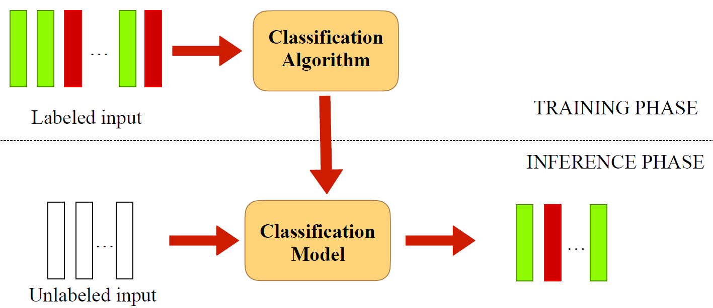

# Module 2: Basic Natural Language Processing


## Basic Natural Language Processing

### Lecture Notes

+ What is Natural Language?
    + Language used for everyday communication by humans
        + English
        + 中⽂文
        + ру́сский язы́к
        + español
    + compared to the artificial computer languages

+ What is Natural Language Processing?
    + Any computation, manipulation of natural language
    + Natural languages evolve
        + new words get added; e.g. selfie
        + old words lose popularity; e.g. thou
        + meanings of words change; e.g. learn
        + language rules themselves may change; e.g. position of verbs in sentences!

+ NLP Tasks: A Broad Spectrum
    + Counting words, counting frequency of words
    + Finding sentence boundaries
    + Part of speech tagging
    + Parsing the sentence structure
    + Identifying semantic roles
    + Identifying entities in a sentence
    + Finding which pronoun refers to which entity
    + and much more ...

    <a href="url"> <br/>
        
    </a>

### Lecture Video

<a href="https://d3c33hcgiwev3.cloudfront.net/Xqf0hGgFEeedjgoGzm8emA.processed/full/360p/index.mp4?Expires=1543017600&Signature=RxENKsaVj2xuLVE01tK8v1X5LaEQW-gAjoElMb6pXwXxj4c-R~G5tJTIkYvvSykIo4bW5Wtd3HFpNu3YcC4904vrMvtliufY4lRKY-5803JV~sG1dZJrGCZtQXRE3VJyq18FggYDYlRQQpXSp6iWq51TVqzQvjopJVAzjOxpCDI_&Key-Pair-Id=APKAJLTNE6QMUY6HBC5A" alt="Basic Natural Language Processing" target="_blank">
     
</a>


## Notebook: Module 2 (Python 3)

### Lecture Notes

+ [Launching web Page](https://www.coursera.org/learn/python-text-mining/notebook/NcOOH/module-2-python-3)
+ [Notebook Web page](https://hub.coursera-notebooks.org/user/dfxbyieeexzfjsmxjreyig/notebooks/Module%202%20(Python%203).ipynb)
+ [Local Notebook](notebooks/02-Module+2+Python.3.ipynb)
+ [Local Python code](notebooks/02-Module+2+Python.3.py)


## Basic NLP tasks with NLTK

### Lecture Notes

+ An Introduction to NLTK
    + NLTK: Natural Language Toolkit
    + Open source library in Python
    + Has support for most NLP tasks
    + Also provides access to numerous text corpora

+ Demo
    ```Python
    import nltk

    nltk.download()     # download the nltk collection, only the first time

    from nltk.book import *
    # showing info https://raw.githubusercontent.com/nltk/nltk_data/gh-pages/index.xml
    # *** Introductory Examples for the NLTK Book ***
    # Loading text1, ..., text9 and sent1, ..., sent9
    # Type the name of the text or sentence to view it.
    # Type: 'texts()' or 'sents()' to list the materials.
    # text1: Moby Dick by Herman Melville 1851
    # text2: Sense and Sensibility by Jane Austen 1811
    # text3: The Book of Genesis
    # text4: Inaugural Address Corpus
    # text5: Chat Corpus
    # text6: Monty Python and the Holy Grail
    # text7: Wall Street Journal
    # text8: Personals Corpus
    # text9: The Man Who Was Thursday by G . K . Chesterton 1908

    # ### Counting vocabulary of words
    text7       # <Text: Wall Street Journal>
    sents()
    # sent1: Call me Ishmael .
    # sent2: The family of Dashwood had long been settled in Sussex .
    # sent3: In the beginning God created the heaven and the earth .
    # sent4: Fellow - Citizens of the Senate and of the House of Representatives :
    # sent5: I have a problem with people PMing me to lol JOIN
    # sent6: SCENE 1 : [ wind ] [ clop clop clop ] KING ARTHUR : Whoa there !
    # sent7: Pierre Vinken , 61 years old , will join the board as a nonexecutive director Nov. 29 .
    # sent8: 25 SEXY MALE , seeks attrac older single lady , for discreet encounters .
    # sent9: THE suburb of Saffron Park lay on the sunset side of London , as red and ragged as a cloud of sunset .
    sent7
    # ['Pierre', 'Vinken', ',', '61', 'years', 'old', ',', 'will', 'join', 'the', 'board',
    #  'as', 'a', 'nonexecutive', 'director', 'Nov.', '29', '.']

    len(sent7)              # 18
    len(text7)              # 100676
    len(set(text7))         # 12408
    list(set(text7))[:10]   
    # ['Sebastian', 'Midland', 'sounding', '2.75', 'Sotheby', 'youngsters', 'B-1B',
    #  'pick-up', '43-year-old', 'publicized']

    # ### Frequency of words
    dist = FreqDist(text7)
    len(dist)               # 12408

    vocab1 = dist.keys()
    # vocab1[:10]
    # In Python 3 dict.keys() returns an iterable view instead of a list
    list(vocab1)[:10]
    # ['Pierre', 'Vinken', ',', '61', 'years', 'old', 'will', 'join', 'the', 'board']

    dist['four']    # 20

    freqwords = [w for w in vocab1 if len(w) > 5 and dist[w] > 100]
    # ['billion', 'company', 'president', 'because', 'market', 'million', 'shares', 'trading', 'program']

    # ### Normalization and stemming
    input1 = "List listed lists listing listings"
    words1 = input1.lower().split(' ')
    # ['list', 'listed', 'lists', 'listing', 'listings']

    porter = nltk.PorterStemmer()
    [porter.stem(t) for t in words1]
    # ['list', 'list', 'list', 'list', 'list']

    # ### Lemmatization
    udhr = nltk.corpus.udhr.words('English-Latin1')
    udhr[:20] # ['list', 'listed', 'lists', 'listing', 'listings']

    [porter.stem(t) for t in udhr[:20]] # Still Lemmatization
    # ['univers', 'declar', 'of', 'human', 'right', 'preambl', 'wherea', 'recognit', 'of', 
    # 'the', 'inher', 'digniti', 'and', 'of', 'the', 'equal', 'and', 'inalien', 'right', 'of']

    # Lemmatization: Stemming, but resulting stems are all valid words
    WNlemma = nltk.WordNetLemmatizer()
    [WNlemma.lemmatize(t) for t in udhr[:20]]
    # ['Universal', 'Declaration', 'of', 'Human', 'Rights', 'Preamble', 'Whereas', 'recognition',
    #  'of', 'the', 'inherent', 'dignity', 'and', 'of', 'the', 'equal', 'and', 'inalienable', 'right', 'of']

    # ### Tokenization
    # Recall splitting a sentence into words / tokens
    text11 = "Children shouldn't drink a sugary drink before bed."
    text11.split(' ')
    # ['Children', "shouldn't", 'drink', 'a', 'sugary', 'drink', 'before', 'bed.']

    # NLTK has an in-built tokenizer
    nltk.word_tokenize(text11)
    # ['Children', 'should', "n't", 'drink', 'a', 'sugary', 'drink', 'before', 'bed', '.']

    # Sentence Splitting
    # How would you split sentences from a long text string?
    text12 = "This is the first sentence. A gallon of milk in the U.S. costs $2.99. Is this the third sentence? Yes, it is!"
    # NLTK has an in-built sentence splitter too!
    sentences = nltk.sent_tokenize(text12)
    len(sentences)      # 4
    sentences
    # ['This is the first sentence.',
    #  'A gallon of milk in the U.S. costs $2.99.',
    #  'Is this the third sentence?',
    #  'Yes, it is!']
    ```

+ Take Home Concepts
    + NLTK is a widely used toolkit for text and natural language processing
    + NLTK gives access to many corpora and handy tools
    + Sentence splitting, tokenization, and lemmatization are important, and non-trivial, pre-processing tasks

+ `FreqDist` function
    + Init signature: `FreqDist(samples=None)`
    + Docstring: A frequency distribution for the outcomes of an experiment.  
    + Notes:
        + A frequency distribution records the number of times each outcome of an experiment has occurred.  For example, a frequency distribution could be used to record the frequency of each word type in a document.  Formally, a frequency distribution can be defined as a function mapping from each sample to the number of times that sample occurred as an outcome.
        + Frequency distributions are generally constructed by running a number of experiments, and incrementing the count for a sample every time it is an outcome of an experiment.  For example, the following code will produce a frequency distribution that encodes how often each word occurs in a text:
        ```python
        >>> from nltk.tokenize import word_tokenize
        >>> from nltk.probability import FreqDist
        >>> sent = 'This is an example sentence'
        >>> fdist = FreqDist()
        >>> for word in word_tokenize(sent):
        ...    fdist[word.lower()] += 1
        >>> fdist = FreqDist(word.lower() for word in word_tokenize(sent)) # equivalent
        ```
    + Init docstring: Construct a new frequency distribution.  If `samples` is given, then the frequency distribution will be initialized with the count of each object in `samples`; otherwise, it will be initialized to be empty. <br/>
    In particular, `FreqDist()` returns an empty frequency distribution; and `FreqDist(samples)` first creates an empty frequency distribution, and then calls `update` with the list `samples`.
    + Parameter
        + samples (Sequence): The samples to initialize the frequency distribution with.

+ `nltk.corpus` class
    + Class docstring: Lazy module class.
    + Init docstring: Create a LazyModule instance wrapping module name.
    + Docstring: NLTK corpus readers.  The modules in this package provide functions that can be used to read corpus files in a variety of formats.  These functions can be used to read both the corpus files that are distributed in the NLTK corpus package, and corpus files that are part of external corpora.
    + Available Corpora: see http://www.nltk.org/nltk_data/ for a complete list. Install corpora using nltk.download().
    + Corpus Reader Functions
        + Each corpus module defines one or more "corpus reader functions", which can be used to read documents from that corpus.  These functions take an argument, `item`, which is used to indicate which document should be read from the corpus:
            + If `item` is one of the unique identifiers listed in the corpus module's `items` variable, then the corresponding document will be loaded from the NLTK corpus package.
            + If `item` is a filename, then that file will be read.
        + Additionally, corpus reader functions can be given lists of item names; in which case, they will return a concatenation of the corresponding documents.
        + Corpus reader functions are named based on the type of information they return.  Some common examples, and their return types, are:
            + `words()`: list of str
            + `sents()`: list of (list of str)
            + `paras()`: list of (list of (list of str))
            + `tagged_words()`: list of (str,str) tuple
            + `tagged_sents()`: list of (list of (str,str))
            + `tagged_paras()`: list of (list of (list of (str,str)))
            + `chunked_sents()`: list of (Tree w/ (str,str) leaves)
            + `parsed_sents()`: list of (Tree with str leaves)
            + `parsed_paras()`: list of (list of (Tree with str leaves))
            + `xml()`: A single xml ElementTree
            + `raw()`: unprocessed corpus contents
    + Note: Lazy modules are imported into the given namespaces whenever a non-special attribute (there are some attributes like `__doc__` that class instances handle without calling `__getattr__`) is requested. The module is then registered under the given name in locals usually replacing the import wrapper instance. The import itself is done using globals as global namespace.

+ `nltk.corpus.udhr` class
    + Class docstring: Reader for corpora that consist of plaintext documents.  Paragraphs are assumed to be split using blank lines.  Sentences and words can be tokenized using the default tokenizers, or by custom tokenizers specified as parameters to the constructor. <br/> This corpus reader can be customized (e.g., to skip preface sections of specific document formats) by creating a subclass and overriding the `CorpusView` class variable.
    + Init docstring: Construct a new plaintext corpus reader for a set of documents located at the given root directory.  Example usage:
        ```python
        >>> root = '/usr/local/share/nltk_data/corpora/webtext/'
        >>> reader = PlaintextCorpusReader(root, '.*\.txt') # doctest: +SKIP
        ```
    + Parameters:
        + `root`: The root directory for this corpus.
        + `fileids`: A list or regexp specifying the fileids in this corpus.
        + `word_tokenizer`: Tokenizer for breaking sentences or paragraphs into words.
        + `sent_tokenizer`: Tokenizer for breaking paragraphs into words.
        + `para_block_reader`: The block reader used to divide the corpus into paragraph blocks.

+ `nltk.corpus.udhr.words` method
    + Signature: `nltk.corpus.udhr.words(fileids=None)`
    + Docstring: return the given file(s) as a list of words and punctuation symbols.
    + Return: list(str)

+ `nltk.PorterStemmer` class
    + Init signature: `nltk.PorterStemmer(mode='NLTK_EXTENSIONS')`
    + Docstring: A word stemmer based on the Porter stemming algorithm.
    Notes:
        + Porter, M. "An algorithm for suffix stripping." Program 14.3 (1980): 130-137.
        + See http://www.tartarus.org/~martin/PorterStemmer/ for the homepage of the algorithm.
        + Martin Porter has endorsed several modifications to the Porter algorithm since writing his original paper, and those extensions are included in the implementations on his website. Additionally, others have proposed further improvements to the algorithm, including NLTK contributors. There are thus three modes that can be selected by passing the appropriate constant to the class constructor's `mode` attribute
        + For the best stemming, you should use the default NLTK_EXTENSIONS version. However, if you need to get the same results as either the original algorithm or one of Martin Porter's hosted versions for compability with an existing implementation or dataset, you can use one of the other modes instead.
    + Versions:
        + PorterStemmer.ORIGINAL_ALGORITHM: Implementation that is faithful to the original paper. <br/> Note that Martin Porter has deprecated this version of the algorithm. Martin distributes [implementations of the Porter Stemmer](http://www.tartarus.org/~martin/PorterStemmer/) in many languages and all of these implementations include his extensions. He strongly recommends against using the original, published version of the algorithm; only use this mode if you clearly understand why you are choosing to do so.
        + PorterStemmer.MARTIN_EXTENSIONS: Implementation that only uses the modifications to the algorithm that are included in the implementations on Martin Porter's website. He has declared Porter frozen, so the behaviour of those implementations should never change.
        + PorterStemmer.NLTK_EXTENSIONS (default): Implementation that includes further improvements devised by NLTK contributors or taken from other modified implementations found on the web.

+ `nltk.PorterStemmer.stem` method
    + Signature: `nltk.PorterStemmer.stem(self, word)`
    + Docstring: Strip affixes from the token and return the stem.
    + Parameter:
        + `token`: The token that should be stemmed.
    + Return: `token` (str)

+ `nltk.WordNetLemmatizer` class
    + Init signature: `nltk.WordNetLemmatizer()`
    + Docstring: Lemmatize using WordNet's built-in morphy function.
    + Returns the input word unchanged if it cannot be found in WordNet.

+ `wnl.lemmatize` method
    + Signature: `nltk.WordNetLemmatizer.lemmatize(word, pos='n')`
    + Docstring: Lemmatize using WordNet's built-in morphy function

+ `nlkt.word_tokenize` method
    + Signature: `nltk.word_tokenize(text, language='english', preserve_line=False)`
    + Docstring: Return a tokenized copy of text, using NLTK's recommended word tokenizer (currently an improved `.TreebankWordTokenizer` along with `.PunktSentenceTokenizer` for the specified language).
    + Parameters:
        + `text` (str): text to split into words
        + `language` (str): the model name in the Punkt corpus
        + `preserve_line` (bool): An option to keep the preserve the sentence and not sentence tokenize it.

+ `nltk.sent_tokenize` method
    + Signature: `nltk.sent_tokenize(text, language='english')`
    + Docstring: Return a sentence-tokenized copy of text, using NLTK's recommended sentence tokenizer (currently `.PunktSentenceTokenizer` for the specified language).
    + Parameters
        + `text` (str): text to split into sentences
        + `language` (str): the model name in the Punkt corpus


### Lecture Video

<a href="https://d3c33hcgiwev3.cloudfront.net/PQRh5GbEEeeSBw5DxGzUwg.processed/full/360p/index.mp4?Expires=1543017600&Signature=GHLosr6GN~iIlD9jFVpqMQPa92VG7wsmTQ0M47l48v3IIvFeoDaY1JK5kgrdUc2En6uBMaXmsdzOPJ3xyGdw4KuISbXx2X9nkNNMhe5YuyO3Uu8dDm~jruwyph04DNsk8Clh7P4yAv~cuA3OZLro19Hy846K1OjU3LaCjzs3WYA_&Key-Pair-Id=APKAJLTNE6QMUY6HBC5A" alt="Basic NLP tasks with NLTK" target="_blank">
     
</a>


## Advanced NLP tasks with NLTK

### Lecture Notes

+ In Lecture Quiz:
    > Visiting aunts can be a nuisance.
    >
    > What can be a nuisance?
    >
    > a. Traveling to see aunts  
    > b. Welcoming aunts into your home  
    > c. Neither; aunts are the most loving relatives!  
    > d. Depends on which aunt :)

    Ans:  
    c. Besides the tongue-in-cheek responses, this sentence is another example of a syntactic ambiguity. Depending on how the sentence is parsed, both the first and second interpretations are possible. In this case, the ambiguity arises because the word “Visiting” could either be an adjective or a gerund, leading to two different ways to parse the sentence to derive two different meanings.  
    d. Besides the tongue-in-cheek responses, this sentence is another example of a syntactic ambiguity. Depending on how the sentence is parsed, both the first and second interpretations are possible. In this case, the ambiguity arises because the word “Visiting” could either be an adjective or a gerund, leading to two different ways to parse the sentence to derive two different meanings.

+ NLP Tasks
    + Counting words, counting frequency of words
    + Finding sentence boundaries
    + _Part of speech tagging_
    + _Parsing the sentence structure_
    + Identifying semantic role labeling
    + Named Entity Recognition
    + Co-reference and pronoun resolution

+ Part-of-speech (POS) Tagging
    + Recall high school grammar: nouns, verbs, adjectives, …
    + Many more tags or word classes than just these
        | Tag |  Word class | Tag | Word class | Tag | Word class |
        |-----|-------------|-----|------------|-----|------------|
        | CC  | Conjunction | JJ | Adjective | PRP | Pronoun |
        | CD  | Cardinal | MD | Modal | RB | Adverb |
        | DT  | Determiner | NN | Noun | SYM | Symbol |
        | IN  | Preposition | POS | Possessive | VB | Verb |
        | NP  | Noun Phrase | VP | Verb Phrase | PP | Preposition Phrase |

+ Ambiguity in POS Tagging
    + Ambiguity is common in English: "Visiting aunts can be a nuisance"
    + Tagging: `[('Visiting', 'VBG'), ('aunts', 'NNS'), ('can', 'MD'), ('be', 'VB'), ('a', 'DT'), ('nuisance', 'NN')]`
    + Alternative: `[('Visiting', 'JJ'), ('aunts', 'NNS'), ('can', 'MD'), ('be', 'VB'), ('a', 'DT'), ('nuisance', 'NN')]`

+ Parsing Sentence Structure
    + Making sense of sentences is easy if they follow a well-defined grammatical structure
    + Example: "Alice loves Bob"
    <a href="https://www.coursera.org/learn/python-text-mining/lecture/wWEVW/advanced-nlp-tasks-with-nltk"> <br/>
        
    </a>

+ Ambiguity in Parsing
    + Ambiguity may exist even if sentences are grammatically correct!
    + Example: "I saw the man with a telescope 
    <a href="https://www.coursera.org/learn/python-text-mining/lecture/wWEVW/advanced-nlp-tasks-with-nltk"> <br/>
        
    </a>

+ POS Tagging & Parsing Complexity
    + Uncommon usages of words; e.g. The old man the boat
    + Well-formed sentences may still be meaningless!; e.g. Colorless green ideas sleep furiously

+ Take Home Concepts
    + POS tagging provides insights into the word classes / types in a sentence
    + Parsing the grammatical structures helps derive meaning
    + Both tasks are difficult, linguistic ambiguity increases the difficulty even more
    + Better models could be learned with supervised training
    + NLTK provides access to tools and data for training

+ In Lecture Quiz: Mary saw the man with the telescope.

    a. Who has the telescope?
    b.Mary
    c. The man
    d. Could be either

    And: d
    It could be either. This sentence is an example of an inherent ambiguity in the prepositional phrase attachment. The statement can be parsed in two different ways to derive two different meanings.

+ Demo
    ```Python
    # ### POS tagging
    nltk.help.upenn_tagset('MD')
    # MD: modal auxiliary
    #     can cannot could couldn't dare may might must need ought shall should
    #     shouldn't will would

    text13 = nltk.word_tokenize(text11)
    nltk.pos_tag(text13)
    # [('Children', 'NNP'), ('should', 'MD'), ("n't", 'RB'), ('drink', 'VB'),
    #  ('a', 'DT'), ('sugary', 'JJ'), ('drink', 'NN'), ('before', 'IN'),
    #  ('bed', 'NN'), ('.', '.')]

    # Ambiguity in POS Tagging
    text14 = nltk.word_tokenize("Visiting aunts can be a nuisance")
    nltk.pos_tag(text14)
    # [('Visiting', 'VBG'), ('aunts', 'NNS'), ('can', 'MD'), ('be', 'VB'),
    #  ('a', 'DT'), ('nuisance', 'NN')]

    # Parsing sentence structure
    text15 = nltk.word_tokenize("Alice loves Bob")
    grammar = nltk.CFG.fromstring("""
    S -> NP VP
    VP -> V NP
    NP -> 'Alice' | 'Bob'
    V -> 'loves'
    """)

    parser = nltk.ChartParser(grammar)
    trees = parser.parse_all(text15)
    for tree in trees:
        print(tree)
    # (S (NP Alice) (VP (V loves) (NP Bob)))

    # Ambiguity in Parsing
    text16 = nltk.word_tokenize("I saw the man with a telescope")
    grammar1 = nltk.data.load('mygrammar.cfg')
    # <Grammar with 13 productions>

    parser = nltk.ChartParser(grammar1)
    trees = parser.parse_all(text16)
    for tree in trees:
        print(tree)
    # (S
    #   (NP I)
    #   (VP
    #     (VP (V saw) (NP (Det the) (N man)))
    #     (PP (P with) (NP (Det a) (N telescope)))))
    # (S
    #   (NP I)
    #   (VP
    #     (V saw)
    #     (NP (Det the) (N man) (PP (P with) (NP (Det a) (N telescope))))))

    # NLTK and Parse Tree Collection
    from nltk.corpus import treebank
    text17 = treebank.parsed_sents('wsj_0001.mrg')[0]
    print(text17)
    # (S
    #   (NP-SBJ
    #     (NP (NNP Pierre) (NNP Vinken))
    #     (, ,)
    #     (ADJP (NP (CD 61) (NNS years)) (JJ old))
    #     (, ,))
    #   (VP
    #     (MD will)
    #     (VP
    #       (VB join)
    #       (NP (DT the) (NN board))
    #       (PP-CLR (IN as) (NP (DT a) (JJ nonexecutive) (NN director)))
    #       (NP-TMP (NNP Nov.) (CD 29))))
    #   (. .))

    # ### POS tagging and parsing ambiguity
    text18 = nltk.word_tokenize("The old man the boat")
    nltk.pos_tag(text18)
    # [('The', 'DT'), ('old', 'JJ'), ('man', 'NN'), ('the', 'DT'), ('boat', 'NN')]

    text19 = nltk.word_tokenize("Colorless green ideas sleep furiously")
    nltk.pos_tag(text19)
    # [('Colorless', 'NNP'), ('green', 'JJ'), ('ideas', 'NNS'), ('sleep', 'VBP'),
    #  ('furiously', 'RB')]
    ```

+ `nltk.help.upenn_tagset` method
    + Signature: nltk.help.upenn_tagset(tagpattern=None)
    + Docstring: <no docstring>

+ `nltk.pos_tag` method
    + Signature: `nltk.pos_tag(tokens, tagset=None, lang='eng')`
    + Docstring: Use NLTK's currently recommended part of speech tagger to tag the given list of tokens.
    + Parameters:
        + `tokens` (lst(str)): Sequence of tokens to be tagged
        + `tagset` (str): the tagset to be used, e.g. universal, wsj, brown
        + `lang` (str): the ISO 639 code of the language, e.g. 'eng' for English, 'rus' for Russian
    + Return: list(tuple(str, str)): The tagged tokens

+ `nltk.CFG` class
    + Init signature: `nltk.CFG(start, productions, calculate_leftcorners=True)`
    + Docstring:  A context-free grammar.  A grammar consists of a start state and a set of productions.  The set of terminals and nonterminals is implicitly specified by the productions.
    + Init docstring: Create a new context-free grammar, from the given start state and set of `Production`s.
    + Parameters
        + `start` (Nonterminal): The start symbol
        + `productions` (list(Production)): The list of productions that defines the grammar
        + `calculate_leftcorners` (bool): False if we don't want to calculate the leftcorner relation. In that case, some optimized chart parsers won't work.

+ `nltk.CFG.fromstring` method
    + Signature: `nltk.CFG.fromstring(input, encoding=None)`
    + Docstring: Return the `CFG` corresponding to the input string(s).
    + Parameter: 
        + `input`: a grammar, either in the form of a string or as a list of strings.

+ `nltk.ChartParser` class
    + Init signature: `nltk.ChartParser(grammar, strategy=[<nltk.parse.chart.LeafInitRule>, <nltk.parse.chart.EmptyPredictRule>, <nltk.parse.chart.BottomUpPredictCombineRule>, <nltk.parse.chart.SingleEdgeFundamentalRule>], trace=0, trace_chart_width=50, use_agenda=True, chart_class=<'nltk.parse.chart.Chart'>)`
    + Docstring: A generic chart parser.  A "strategy", or list of `ChartRuleI` instances, is used to decide what edges to add to the chart.  In particular, ``ChartParser`` uses the following algorithm to parse texts:
        ```
        Until no new edges are added:  
          For each *rule* in *strategy*:  
            Apply *rule* to any applicable edges in the chart.  
        Return any complete parses in the chart
        ```
    + Init docstring: Create a new chart parser, that uses `grammar` to parse texts.
    + Parameters:
        + `grammar` (CFG): The grammar used to parse texts.
        + `strategy` (list(ChartRuleI)): A list of rules that should be used to decide what edges to add to the chart (top-down strategy by default).
        + `trace` (int): The level of tracing that should be used when parsing a text.  `0` will generate no tracing output; and higher numbers will produce more verbose tracing output.
        + `trace_chart_width` (int): The default total width reserved for the chart in trace output.  The remainder of each line will be used to display edges.
        + `use_agenda` (bool): Use an optimized agenda-based algorithm, if possible.
        + `chart_class`: The class that should be used to create the parse charts.

+ `nltk.ChartParser.parse_all` method
    + Signature: `nltk.ChartParser.parse_all(sent, *args, **kwargs)`
    + Docstring: list of tree structure

+ `nltk.data.load` method
    + Signature: nltk.data.load(resource_url, format='auto', cache=True, verbose=False, logic_parser=None, fstruct_reader=None, encoding=None)
    + Docstring: Load a given resource from the NLTK data package.  The following resource formats are currently supported:
        + `pickle`
        + `json`
        + `yaml`
        + `cfg` (context free grammars)
        + `pcfg` (probabilistic CFGs)
        + `fcfg` (feature-based CFGs)
        + `fol` (formulas of First Order Logic)
        + `logic` (Logical formulas to be parsed by the given logic_parser)
        + `val` (valuation of First Order Logic model)
        + `text` (the file contents as a unicode string)
        + `raw` (the raw file contents as a byte string)

    + Notes:
        + If no format is specified, `load()` will attempt to determine a format based on the resource name's file extension.  If that fails, `load()` will raise a `ValueError` exception.
        + For all text formats (everything except `pickle`, `json`, `yaml` and `raw`), it tries to decode the raw contents using UTF-8, and if that doesn't work, it tries with ISO-8859-1 (Latin-1), unless the `encoding` is specified.
    + Parameters:
        + `resource_url` (str): A URL specifying where the resource should be loaded from.  The default protocol is "nltk:", which searches for the file in the the NLTK data package.
        + `cache` (bool): If true, add this resource to a cache.  If load() finds a resource in its cache, then it will return it from the cache rather than loading it.  The cache uses weak     references, so a resource wil automatically be expunged from the cache when no more objects are using it.
        + `verbose` (bool): If true, print a message when loading a resource. Messages are not displayed when a resource is retrieved from the cache.
        + `logic_parser` (LogicParser): The parser that will be used to parse logical expressions.
        + `fstruct_reader` (FeatStructReader): The parser that will be used to parse the feature structure of an fcfg.
        + `encoding` (str): the encoding of the input; only used for text formats.

+ `nltk.corpus.treebanl` class
    + Type: BracketParseCorpusReader
    + Docstring: Reader for corpora that consist of parenthesis-delineated parse trees, like those found in the "combined" section of the Penn Treebank, e.g. "(S (NP (DT the) (JJ little) (NN dog)) (VP (VBD barked)))".
    + Init docstring:
        + `root`: The root directory for this corpus.
        + `fileids`: A list or regexp specifying the fileids in this corpus.
        + `comment_char`: The character which can appear at the start of a line to indicate that the rest of the line is a comment.
        + `detect_blocks`: The method that is used to find blocks in the corpus; can be 'unindented_paren' (every unindented parenthesis starts a new parse) or 'sexpr' (brackets are matched).
        + `tagset`: The name of the tagset used by this corpus, to be used for normalizing or converting the POS tags returned by the tagged_...() methods.

+ `nltk.corpus.treebank.parsed_sents` method
    + Signature: `nltk.corpus.treebank.parsed_sents(fileids=None)`
    + Docstring: parsing sentences with parenthesis-delineated parse trees


### Lecture Video

<a href="https://d3c33hcgiwev3.cloudfront.net/A43T43e9EeeogA4xFg3wEg.processed/full/360p/index.mp4?Expires=1543104000&Signature=S8u-AkNjG9hEhdghwP1OQPX2Q7q-LnSzRhNEcVA3XmkLzVDN~4iKs3jKlfyzk6hEBmq4I3uELJIp-g6k2y8~igabaw-T~kqO~MyxL07vEZ~yDIdZLAvDGqXEj9ZB9tKv4NPuOa3WrTW0R44d0mX8L5AuP4VQ7vhbBxeE4uFj9CI_&Key-Pair-Id=APKAJLTNE6QMUY6HBC5A" alt="Advanced NLP tasks with NLTK" target="_blank">
     
</a>


## Practice Quiz: Practice Quiz

### Lecture Notes

+ Demo
    ```Python

    ```

    <a href="url"> <br/>
        
    </a>

### Lecture Video

<a href="url" alt="text" target="_blank">
     
</a>


## Discussion Prompt: Finding your own prepositional phrase attachment

### Lecture Notes

+ Demo
    ```Python

    ```

    <a href="url"> <br/>
        
    </a>

### Lecture Video

<a href="url" alt="text" target="_blank">
     
</a>


## Quiz: Module 2 Quiz

### Lecture Notes

+ Demo
    ```Python

    ```

    <a href="url"> <br/>
        
    </a>

### Lecture Video

<a href="url" alt="text" target="_blank">
     
</a>


