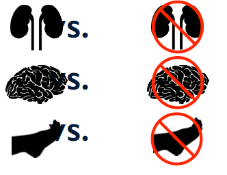
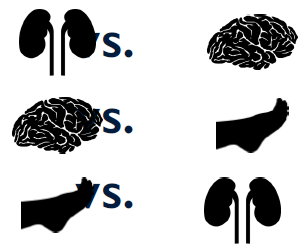

# Module 3: Classification of Text

## Text Classification

### Lecture Notes

+ Which medical speciality does this relate to?
    + Nephrology / Neurology / Podiatry
    + Paragraph1: TINEA PEDIS, or ATHLETE'S FOOT, is a very common fungal skin infection of the foot. It often first appears between the toes. It can be a one-time occurrence or it can be chronic. The fungus, known as Trichophyton, thrives under warm, damp conditions so people whose feet sweat a great deal are more susceptible. It is easily transmitted in showers and pool walkways. Those people with immunosuppressive conditions, such as diabetes mellitus, are also more susceptible to athlete's foot.
    + Paragraph 2: KIDNEY FAILURE, also known as RENAL FAILURE or RENAL INSUFFICIENCY, is a medical condition of impaired kidney function in which the kidneys fail to adequately filter metabolic wastes from the blood.The two main forms are acute kidney injury, which is often reversible with adequate treatment, and chronic kidney disease, which is often not reversible. In both cases, there is usually an underlying cause.
    + Answers: 1) Podiatry, 2) Nephrology

+ What is Classification?
    + Given a set of classes: Nephrology / Neurology / Podiatry
    + Classification: Assign the correct class label to the given input

+ Examples of Text Classification
    + __Topic identification__: Is this news article about Politics, Sports, or Technology?
    + __Spam Detection__: Is this email a spam or not?
    + __Sentiment analysis__: Is this movie review positive or negative?
    + __Spelling correction__: weather or whether? color or colour?

+ Supervised Learning: Humans learn from past experiences, machines learn from past instances!

+ Supervised Classification
    <a href="https://www.coursera.org/learn/python-text-mining/lecture/H05Dd/text-classification"> <br/>
        
    </a>

+ Supervised Classification
    + Learn a __classification model__ on properties (“features”) and their importance (“weights”) from labeled instances
        + $X$: Set of attributes or features ${x_1, x_2, \cdots, x_n}$
        + $y$: A “class” label from the label set $Y = {y_1, y_2, \cdots, y_k}$
    + Apply the model on new instances to __predict__ the label

+ Supervised Classification: Phases and Datasets
    <a href="https://www.coursera.org/learn/python-text-mining/lecture/H05Dd/text-classification"> <br/>
        
    </a>

+ Classification Paradigms
    + When there are only two possible classes; $|Y| = 2$: __Binary Classification__
    + When there are more than two possible classes; $|Y| > 2$: __Multi-class Classification__
    + When data instances can have two or more labels: __Multi-label Classification__

+ Questions to ask in Supervised Learning
    + __Training phase__:
        + What are the features? How do you represent them?
        + What is the classification model / algorithm?
        + What are the model parameters?
    + __Inference phase__:
        + What is the expected performance?
        + What is a good measure?


### Lecture Video

<a href="https://d3c33hcgiwev3.cloudfront.net/K_Gy1GbFEeeB7Qo5yIjKZg.processed/full/360p/index.mp4?Expires=1543363200&Signature=CRkG7044IWoEgmuDfvKjy-9XLRUKl79Btm~n5PJh5~FC1UNRxt7akQ8YbRIVXM-GcWPQdUnbI~vRQse9XyhYDk4fhmqPqwwqWG4YboKR8BvJGy7PZYiVlylfQRL5TMzuH320YPTEZDbEzcqU9BG3p2YdfzH9IHygNDRp7nztrvo_&Key-Pair-Id=APKAJLTNE6QMUY6HBC5A" alt="Text Classification" target="_blank">
     
</a>


## Identifying Features from Text

### Lecture Notes

+ Why is Textual Data Unique?
    + Textual data presents a unique set of challenges
    + All the information you need is in the text
    + But features can be pulled out from text at different granularities!

+ [Stemming and lemmatization](https://nlp.stanford.edu/IR-book/html/htmledition/stemming-and-lemmatization-1.html)
    + __Stemming__:
        + Usually refer to a crude heuristic process that chops off the ends of words in the hope of achieving this goal correctly most of the time, and often includes the removal of derivational affixes.
        + The process of reducing inflected (or sometimes derived) words to their word stem, base or root form—generally a written word form.
        + The stem need not be identical to the morphological root of the word; it is usually sufficient that related words map to the same stem, even if this stem is not in itself a valid root.
        + A stemmer operates on a single word without knowledge of the context, and therefore cannot discriminate between words which have different meanings depending on part of speech.
        + Eg. "cat" as stem of "cats", "catlike" and "catty"
    + __Lemmatization__:
        + usually refer to doing things properly with the use of a vocabulary and morphological analysis of words, normally aiming to remove inflectional endings only and to return the base or dictionary form of a word, which is known as the __lemma__.
        + Lemmatisation (or lemmatization) in linguistics: the process of grouping together the inflected forms of a word so they can be analysed as a single item, identified by the word's lemma, or dictionary form
        + Lemmatisation is the algorithmic process of determining the lemma of a word based on its intended meaning.
        + Examples:
            + "walk" as lemma of 'walk', 'walked', 'walks', 'walking'
            + "good" as lemma of "better"
    + Notes:
        + "walk" as lemma and stem of "walking"
        + "meeting" as base with noun and as form of a verb

+ [Main differences between stemming and lemmatization](https://blog.bitext.com/what-is-the-difference-between-stemming-and-lemmatization/)
    + Stemming algorithms work by cutting off the end or the beginning of the word, taking into account a list of common prefixes and suffixes that can be found in an inflected word. This indiscriminate cutting can be successful in some occasions, but not always, and that is why we affirm that this approach presents some limitations. Below we illustrate the method with examples in both English and Spanish.
        <a href="https://blog.bitext.com/what-is-the-difference-between-stemming-and-lemmatization/"> <br/>
            
        </a>
    + Lemmatization: take into consideration the morphological analysis of the words. To do so, it is necessary to have detailed dictionaries which the algorithm can look through to link the form back to its lemma. Again, you can see how it works with the same example words.
        <a href="https://blog.bitext.com/what-is-the-difference-between-stemming-and-lemmatization/"> <br/>
            
        </a>

+ Types of Textual Features
    + Words
        + By far the most common class of features
        + Handling commonly-occurring words: Stop words, e.g., "the"
        + Normalization: Make lower case vs. leave as-is; e.g., "US" vs "us"
        + Stemming / Lemmatization
    + Characteristics of words : Capitalization, e.g., "White House" vs "white house"
    + Parts of speech of words in a sentence, e.g. determiner, "weather" vs "whether"
    + Grammatical structure, sentence parsing
    + Grouping words of similar meaning, semantics
        + {buy, purchase}
        + {Mr., Ms., Dr., Prof.}; Numbers / Digits; Dates
    + Depending on classification tasks, features may come from inside words and word sequences
        + bigrams, trigrams, n-grams: “White House”
        + character sub-sequences in words: “ing”, “ion”, …

+ How would you do it? -> Recall lectures from previous week


### Lecture Video

<a href="https://d3c33hcgiwev3.cloudfront.net/4u6bd2gGEeeDRAot5bGaoA.processed/full/360p/index.mp4?Expires=1543363200&Signature=EVVRqHrSFqIx-TFZwjDgZ8oABB6s8oTtqegsw6yRunz~nnDbbR2yvuJUuCDHyx93FhJ2NGm5p-XBrWPAnuM4uQdNTFVBxSBOBCe~5r34EXAv-CcB5eS7ClMeNChzr1gAEvUjDTA2nYdqgXIqGSkTjqWeRK4niLw671~GJ-5DbsU_&Key-Pair-Id=APKAJLTNE6QMUY6HBC5A" alt="Identifying Features from Text" target="_blank">
     
</a>


## Naive Bayes Classifiers

### Lecture Notes

+ Case study: Classifying text search queries
    + Suppose you are interested in classifying search queries in three classes: Entertainment, Computer Science, Zoology
    + Most common class of the three is Entertainment.
    + Suppose the query is “Python”
        + Python, the snake (Zoology)
        + Python, the programming language (Computer Science)
        + Python, as in Monty Python (Entertainment)
    + Most common class, given “Python”, is Zoology.
    + Suppose the query is “Python download”
        + Most probable class, given “Python download”, is Computer Science.

+ Probabilistic Model
    + Update the likelihood of the class given new information
    + _Prior Probability_: $Pr(y = Entertainment), Pr(y = CS), Pr(y=Zoology)$
    + _Posterior probability_: $Pr(y = Entertainment|x = “Python”)$

+ Bayes’ Rule
    + Posterior probability = (Prior probability x Likelihood) / (Evidence)
    + $Pr(y | X) = \frac{Pr(y) \times Pr(X|y)}{Pr(X)}$

+ Naïve Bayes Classification
    + $Pr(y=CS | "Python") = \frac{Pr(y=CS) \times Pr("Python" | y = CS)}{Pr("Python)}$
    + $Pr(y=Zoology| "Python") = \frac{Pr(y=Zoology|) \times Pr("Python" | y = Zoology|)}{Pr("Python)}$
    + $Pr(y=CS | "Python") > Pr(y=Zoology | "Python")$ --> $y = CS$
    + Probability Theory: $Pr(y|X) = \frac{Pr(y) \times Pr(X|y)}{Pr(X)}$ 
    + Classification: $y^{\ast} = \arg\max_y Pr(y|X) = \arg\max_y Pr(y) \times Pr(X|y)$
    + __Naïve assumption__: Given the class label, features are assumed to be independent of each other <br/>
        $y^{\ast} = \arg\max_y Pr(y|X) = \arg\max_y Pr(y) \times \prod_{i-1}^n Pr(x_i | y)$
    + Query: "Python download" <br/>
        $y^{\ast} = \arg\max_y Pr(y) \times Pr("Python" | y) \times Pr("download" |y)$

+ Naïve Bayes: What are the parameters?
    + Prior probabilities: $Pr(y)  \forall y \in Y$
    + Likelihood: $Pr(x_i | y) \forall x_i \in X, y \in Y$, $x_i$ = feature, $y$ = label
    + If there are 3 classes $(|Y| = 3)$ and 100 features in $X$, how many parameters does naïve Bayes models have?

+ Naïve Bayes: Learning parameters
    + Prior probabilities: $Pr(y) \forall y \in Y$
        + Remember training data? all queries are labeled
        + Count the number of instances in each class
        + If there are $N$ instances in all, and $n$ out of those are labeled as class $y$ --> $Pr(y) = n / N$
    + Likelihood: $Pr(x_i | y) \forall x_i \in X, y \in Y$
        + Count how many times feature $x_i$ appears in instances labeled as class $y$
        + If there are $p$ instances of class $y$, and $x_i$ appears in $k$ of those, $Pr(x_i | y) = k / p$

+ Example: Counting parameters
    + You are training a naïve Bayes classifier, where the number of possible labels, $|Y| = 3$ and the dimension of the data element, $|X| = 100$, where every feature (dimension) is binary. How many parameters does the naïve Bayes classification model have?
    + A naïve Bayes classifier has two kinds of parameters:
        1. $Pr(y)$ for every $y \in Y$: so if $|Y| = 3$, there are three such parameters.
        2. $Pr(x_i | y)$ for every binary feature $x_i \in X$ and $y \in Y$. Specifically, for a particular feature x_1, the parameters are $Pr(x_1 = 1 | y)$ and $Pr(x_1 = 0 | y)$ for every $y$. So if $|X| = 100$ binary features and $|Y| = 3$, there are $(2 x 100) x 3 = 600$ such features

        Hence in all, there are 603 features.
    + Note that not all of these features are independent. In particular, $Pr(x_i = 0 | y) = 1 - Pr(x_i = 1 | y)$, for every $x_i$ and $y$. So, there are only 300 independent parameters of this kind (as the other 300 parameters are just complements of these). Similarly, the sum of all prior probabilities $Pr(y)$ should be 1. This means there are only 2 independent prior probabilities. In all, for this example, there are 302 independent parameters.

+ [Argmax and Max Calculus](https://www.cs.ubc.ca/~schmidtm/Documents/2016_540_Argmax.pdf)
    + Def: the __argmex__ of a function $f$ on a set $D$ as <br/> 
        $\arg\max_{x \in D} f(x) = \{x | f(x) \geq f(y), \forall y \in D \}$
    + The set of inputs $x$ from the domain $D$ that achieve the highest function value
    + E.g., $\arg\max_{x \in \Re} -x^2 = \{ 0\}$
    + Operations not change the argmax set
        1. $\theta = \text{constant}$: $\arg\max f(x) = \arg\max f(x) + \theta$
        2. $\theta > 0$: $\arg\max f(x) = \arg\max \theta f(x)$
        3. $\theta <> 0$: $\arg\max f(x) = \arg\min \theta f(x)$
        4. \$\arg\max f(x) > 0$: $\arg\max f(x) = \arg\min \frac{1}{f(x)}$
        5. $g$ strictly monotonic: $\arg\max g(f(x)) = \arg\max f(x)$
    + Logarithm (a strictly monotonic function) transform multiplication of probability into addition of log-probabilities: <br/> $\arg\max \prod_{i=1}^n p_i(x) = \arg\max \sum_{i=1}^n \log p_i(x)$

+ Naïve Bayes: Smoothing
    + What happens if $Pr(x_i | y) = 0$?
        + Feature $x_i$ never occurs in documents labeled $y$
        + But then, the posterior probability $Pr(y | x_i)$ will be 0!!
    + Instead, smooth the parameters
    + __Laplace smoothing__ or __Additive smoothing__: Add a dummy count
        + $Pr(x_i | y) = (k+1) / (p+n)$; where $n$ is number of features

+ Take Home Concepts
    + Naïve Bayes is a probabilistic model
    + Naïve, because it assumes features are independent of each other, given the class label -> issue: "White" & "House" for "White House"
    + For text classification problems, naïve Bayes models typically provide very strong baselines
    + Simple model, easy to learn parameters


### Lecture Video

<a href="https://d3c33hcgiwev3.cloudfront.net/_JUlTGbGEeexMxI6w-Sq3g.processed/full/360p/index.mp4?Expires=1543363200&Signature=PCcVBvVnmfkGJwe2vPk34VQObZ7x-Xe7jwjhOEbbjmfgJkJT1I-OX5w2dEay8sYLmr6Y8baDaFGKjWZBsNlXvIvJtHbGwpEqHfvMzBBbH0tld3~mO6oVj4B1PMP6k5BPklLZ1MNRdG5OC8NcI1alrv7nmD91IdwCGjYAJVF79rU_&Key-Pair-Id=APKAJLTNE6QMUY6HBC5A" alt="Naive Bayes Classifiers" target="_blank">
     
</a>


## Naive Bayes Variations

### Lecture Notes

+ Two Classic Naïve Bayes Variants for Text
    + Multinomial Naïve Bayes
        + Data follows a multinomial distribution
        + Each feature value is a count (word occurrence counts, TF-IDF weighting, …)
    + Bernoulli Naïve Bayes
        + Data follows a multivariate Bernoulli distribution
        + Each feature is binary (word is present / absent)


### Lecture Video

<a href="https://d3c33hcgiwev3.cloudfront.net/dxw4b2gGEee0ohLeDr_NVg.processed/full/360p/index.mp4?Expires=1543449600&Signature=jyOPPOSNRp5qK5xg-FgTWoAwPJo0VoVYhBO3-ue4k4hFgx-bjlealfAisdFLtpkqX0HmWoeyblmABkNDWz5tEnmubhiGE3DV4j9RusikVPd30VQHrcFOpFywJpvtZwXXdgZq2gv8vv2mXBC5mxDk9CRh5SZ41GAZfYDFw0L7t7Q_&Key-Pair-Id=APKAJLTNE6QMUY6HBC5A" alt="Naive Bayes Variations" target="_blank">
     
</a>


## Support Vector Machines

### Lecture Notes

+ Which medical speciality does this relate to?
    + Nephrology / Neurology / Podiatry
    + Paragraph1: TINEA PEDIS, or ATHLETE'S FOOT, is a very common fungal skin infection of the foot. It often first appears between the toes. It can be a one-time occurrence or it can be chronic. The fungus, known as Trichophyton, thrives under warm, damp conditions so people whose feet sweat a great deal are more susceptible. It is easily transmitted in showers and pool walkways. Those people with immunosuppressive conditions, such as diabetes mellitus, are also more susceptible to athlete's foot.
    + Paragraph 2: KIDNEY FAILURE, also known as RENAL FAILURE or RENAL INSUFFICIENCY, is a medical condition of impaired kidney function in which the kidneys fail to adequately filter metabolic wastes from the blood.The two main forms are acute kidney injury, which is often reversible with adequate treatment, and chronic kidney disease, which is often not reversible. In both cases, there is usually an underlying cause.
    + Answers: 1) Podiatry, 2) Nephrology

+ Case study: Sentiment analysis - Movie Review
    <a href="https://www.coursera.org/learn/python-text-mining/lecture/e5cEj/support-vector-machines"> <br/>
        
    </a>
    + Words that you might find in typical reviews
        + wow, great, Bravo!
        + boring, lame, worst

+ Classifier = Function on input data
    <a href="https://www.coursera.org/learn/python-text-mining/lecture/e5cEj/support-vector-machines"> <br/>
        
    </a>

+ Decision Boundaries
    + Classification function is represented by decision surfaces
    + How do you find them?
    <a href="https://www.coursera.org/learn/python-text-mining/lecture/e5cEj/support-vector-machines"> <br/>
        
    </a>

+ Choosing a Decision Boundary
    + Red +/- : Training data
    + Black +/- : Test data
    + __Data overfitting__: Decision boundary learned over training data doesn’t generalize to test data
    <a href="https://www.coursera.org/learn/python-text-mining/lecture/e5cEj/support-vector-machines"> <br/>
        
    </a>

+ Linear Boundaries
    + Easy to find
    + Easy to evaluate
    + More generalizable: “Occam’s razor”
    <a href="https://www.coursera.org/learn/python-text-mining/lecture/e5cEj/support-vector-machines"> <br/>
        
    </a>

+ Finding a Linear Boundary
    + Find the linear boundary = Find w
    + Many methods
        + Perceptron
        + Linear Discriminative Analysis
        + Linear least squares
        + ...
    + Problem: If linearly separable, then infinite number of linear boundaries!
    <a href="https://www.coursera.org/learn/python-text-mining/lecture/e5cEj/support-vector-machines"> <br/>
        
    </a>

+ Maximum Margin
    + What is a reasonable boundary?
    + Support Vector Machines are maximum-margin classifiers
    + How do you find it?
    <a href="https://www.coursera.org/learn/python-text-mining/lecture/e5cEj/support-vector-machines"> <br/>
        
    </a>

+ Support Vector Machines (SVM)
    + SVMs are __linear classifiers__ that find a hyperplane to separate __two classes__ of data: positive and negative
    + Given training data $(x_1, y_1), (x_2, y_2), \cdots$; where $x_i = (x_1,x_2, \cdots, x_n)$ is instance vector and $y_i$ is one of $\{-1, +1\}$
    + SVM finds a linear function $w$ (weight vector) <br/>
        $f(x_i) = <w \cdot xi> + b$ if $f(x_i) ≥ 0$, $y_i = +1$; else $y_i = -1$

+ SVM: Multi-class classification
    + SVMs work only for binary classification problems <br/>
        $f(x_i) = <w \cdot x_i> + b$, if $f(x_i) \geq 0$, $y_i = +1$; else $y_i = -1$
    + What about three classes?
    + One vs Rest - one by one
        <a href="https://www.coursera.org/learn/python-text-mining/lecture/e5cEj/support-vector-machines"> <br/>
            
        </a>
        <a href="https://www.coursera.org/learn/python-text-mining/lecture/e5cEj/support-vector-machines">
            
        </a>
        + n-class SVM has $n$ classifiers
    + One vs One - 
        <a href="https://www.coursera.org/learn/python-text-mining/lecture/e5cEj/support-vector-machines"> <br/>
            
        </a>
        <a href="https://www.coursera.org/learn/python-text-mining/lecture/e5cEj/support-vector-machines">
            
        </a>
        + n-class SVM has $C(n,2)$ classifiers

+ SVM Parameters (1): Parameter `C`
    + __Regularization__: How much importance should you give individual data points as compared to better generalized model
    + Regularization parameter `c`
        + Larger values of `c` = less regularization
            + Fit training data as well as possible, every data point important
        + Smaller values of `c` = more regularization
            + More tolerant to errors on individual data points

+ SVM Parameters (2): Other params
    + __Linear kernels__ usually work best for text data
        + Other kernels include rbf, polynomial
    + `multi_class`: ovr (one-vs-rest)
    + `class_weight`: Different classes can get different weights

+ Take Home Messages
    + Support Vector Machines tend to be the most accurate classifiers, especially in high-dimensional data
    + Strong theoretical foundation
    + Handles only numeric features
        + Convert categorical features to numeric features
        + Normalization
    + Hyperplane hard to interpret


### Lecture Video

<a href="https://d3c33hcgiwev3.cloudfront.net/pZdRaWbEEeeA5grXB1EKyA.processed/full/360p/index.mp4?Expires=1543449600&Signature=X70EgT8u~reCHUitwVfkRxfnyu4I0lqghZ-e5oGOrYIJz8-JXwOoqz9DCWXGwGovC7dD2slFYXdmxFx11qeo5Vq44Ty58~9m5uS69wt2AuMy-GL7cbIapXe0tLJKdqMV1NkedEJGRR2v4btNn~uTnAjvNPw3FCvE0hLPHX5f3Q4_&Key-Pair-Id=APKAJLTNE6QMUY6HBC5A" alt="Support Vector Machines" target="_blank">
     
</a>


## Learning Text Classifiers in Python

### Lecture Notes

+ Toolkits for Supervised Text Classification
    + Scikit-learn
    + NLTK
        + Interfaces with sklearn and other ML toolkits (like Weka)!

+ Scikit-learn
    + Open-source Machine Learning library
    + Started as Google Summer of Code by Dave Cournapeau, 2007
    + Has a more programmatic interface

+ Using Sklearn’s `NaiveBayesClassifier`
    ```python
    from sklearn import naive_bayes

    clfrNB = naive_bayes.MultinomialNB()
    clfrNB.fit(train_data, train_labels)
    predicted_labels = clfrNB.predict(test_data)
    metrics.f1_score(test_labels, predicted_labels, average='micro')
    ```

+ `naive_bayes.MultinomialNB` class
    + Init Signature: `naive_bayes.MultinomialNB(alpha=1.0, fit_prior=True, class_prior=None)`
    + Docstring: Naive Bayes classifier for multinomial models
    + Parameters
        + `alpha` (float, optional (default=1.0)): Additive (Laplace/Lidstone) smoothing parameter (0 for no smoothing).
        + `fit_prior` (boolean, optional (default=True)): Whether to learn class prior probabilities or not. If false, a uniform prior will be used.
        + `class_prior` (array-like, size (n_classes,), optional (default=None)): Prior probabilities of the classes. If specified the priors are not adjusted according to the data.
    + Attributes
        + `class_log_prior_` (array, shape (n_classes, )): Smoothed empirical log probability for each class.
        + `intercept_` (property): Mirrors `class_log_prior_` for interpreting MultinomialNB as a linear model.
        + `feature_log_prob_` (array, shape (n_classes, n_features)): Empirical log probability of features given a class, `P(x_i|y)`.
        + `coef_` (property): Mirrors `feature_log_prob_` for interpreting MultinomialNB as a linear model.
        + `class_count_` (array, shape (n_classes,)): Number of samples encountered for each class during fitting. This value is weighted by the sample weight when provided.
        + `feature_count_` (array, shape (n_classes, n_features)): Number of samples encountered for each (class, feature) during fitting. This value is weighted by the sample weight when provided.
    + Notes
        + The multinomial Naive Bayes classifier is suitable for classification with discrete features (e.g., word counts for text classification). The multinomial distribution normally requires integer feature counts. However, in practice, fractional counts such as tf-idf may also work.
        + For the rationale behind the names `coef_` and `intercept_`, i.e. naive Bayes as a linear classifier, see J. Rennie et al. (2003), Tackling the poor assumptions of naive Bayes text classifiers, ICML.
    + References: C.D. Manning, P. Raghavan and H. Schuetze (2008). Introduction to Information Retrieval. Cambridge University Press, pp. 234-265.


+ Using Sklearn’s SVM classifier
    ```python
    from sklearn import svm

    clfrSVM = svm.SVC(kernel=‘linear’, C=0.1)
    clfrSVM.fit(train_data, train_labels)
    predicted_labels = clfrSVM.predict(test_data)
    ```

+ Model Selection
    + Recall the discussion on multiple phases in a supervised learning task
        <a href="https://www.coursera.org/learn/python-text-mining/lecture/GaNec/learning-text-classifiers-in-python"> <br/>
            
        </a>

+ Model selection in Scikit-learn
    ```python
    from sklearn import model_selection

    X_train, X_test, y_train, y_test = model_selection.train_test_split(
        train_data, train_labels, test_size = 0.333, random_state = 0)
    predicted_labels = model_selection.cross_val_predict(clfrSVM, train_data, train_labels, cv=5)
    ```
    <a href="https://www.coursera.org/learn/python-text-mining/lecture/GaNec/learning-text-classifiers-in-python"> <br/>
        
    </a>

+ `cross_val_predict` method
    + Signature: `cross_val_predict(estimator, X, y=None, groups=None, cv=None, n_jobs=1, verbose=0, fit_params=None, pre_dispatch='2*n_jobs', method='predict')`
    + Docstring: Generate cross-validated estimates for each input data point
    + Parameters
        + `estimator` : estimator object implementing 'fit' and 'predict' The object to use to fit the data.
        + `X` (array-like): The data to fit. Can be, for example a list, or an array at least 2d.
        + `y` (array-like, optional, default: None): The target variable to try to predict in the case of supervised learning.
        + `groups` (array-like, with shape (n_samples,), optional): Group labels for the samples used while splitting the dataset into train/test set.
        + `cv` (int, cross-validation generator or an iterable, optional): Determines the cross-validation splitting strategy. Possible inputs for cv are:
            + None, to use the default 3-fold cross validation,
            + integer, to specify the number of folds in a `(Stratified)KFold`,
            + An object to be used as a cross-validation generator.
            + An iterable yielding train, test splits.

            For integer/None inputs, if the estimator is a classifier and `y` is either binary or multiclass, `StratifiedKFold` is used. In all other cases, `KFold` is used.

            Refer :ref:`User Guide <cross_validation>` for the various cross-validation strategies that can be used here.
        + `n_jobs` (integer, optional): The number of CPUs to use to do the computation. $-1$ means 'all CPUs'.
        + `verbose` (integer, optional): The verbosity level.
        + `fit_params` (dict, optional): Parameters to pass to the fit method of the estimator.
        + `pre_dispatch` (int, or string, optional): Controls the number of jobs that get dispatched during parallel execution. Reducing this number can be useful to avoid an explosion of memory consumption when more jobs get dispatched than CPUs can process. This parameter can be:
            + None, in which case all the jobs are immediately created and spawned. Use this for lightweight and fast-running jobs, to avoid delays due to on-demand spawning of the jobs
            + An int, giving the exact number of total jobs that are spawned
            + A string, giving an expression as a function of n_jobs, as in '2*n_jobs'
        + `method` (string, optional, default: 'predict'): Invokes the passed method name of the passed estimator.
    + Returns: predictions (ndarray): This is the result of calling `method`

+ Supervised Text Classification in NLTK
    + NLTK has some classification algorithms
        + NaiveBayesClassifier
        + DecisionTreeClassifier
        + ConditionalExponentialClassifier
        + MaxentClassifier
        + WekaClassifier
        + SklearnClassifier

+ Using NLTK’s NaiveBayesClassifier
    ```python
    from nltk.classify import NaiveBayesClassifier

    classifier = NaiveBayesClassifier.train(train_set)
    classifier.classify(unlabaled_instance)
    classifier.classify_many(unlabeled_instances)
    nltk.classify.util.accuracy(classifier, test_set)
    classifier.labels()
    classifier.show_most_informative_features()
    ```

+ `nltk.classify.NaiveBayesClassifier` class
    + Init signature: `NaiveBayesClassifier(label_probdist, feature_probdist)`
    + Docstring: A Naive Bayes classifier.  
    + Notes: 
        + Naive Bayes classifiers are paramaterized by two probability distributions:
            + P(label) gives the probability that an input will receive each label, given no information about the input's features.
            + P(fname=fval|label) gives the probability that a given feature (fname) will receive a given value (fval), given that the label (label).
        + If the classifier encounters an input with a feature that has never been seen with any label, then rather than assigning a probability of 0 to all labels, it will ignore that feature.
        + The feature value 'None' is reserved for unseen feature values; you generally should not use 'None' as a feature value for one of your own features.
    + Parameters
        + `label_probdist`: P(label), the probability distribution over labels.  It is expressed as a `ProbDistI` whose samples are labels.  I.e., P(label) = `label_probdist.prob(label)`.
        + `feature_probdist`: P(fname=fval|label), the probability distribution for feature values, given labels.  It is expressed as a dictionary whose keys are `(label, fname)` pairs and whose values are `ProbDistI` objects over feature values.  I.e., P(fname=fval|label) = `feature_probdist[label,fname].prob(fval)`.  If a given `(label,fname)` is not a key in `feature_probdist`, then it is assumed that the corresponding P(fname=fval|label) is 0 for all values of `fval`.

+ `train` method
    + Signature: `nltknbclf.train(labeled_featuresets, estimator=<class 'nltk.probability.ELEProbDist'>)`
    + Parameter:
        + `labeled_featuresets`: A list of classified featuresets, i.e., a list of tuples `(featureset, label)`.

+ `classify` method
    + Signature: `nltknbclf.classify(featureset)`
    + Docstring: return the most appropriate label for the given featureset

+ `classify_many` method
    + Signature: `nltknbclf.classify_many(featuresets)`
    + Docstring: Apply `self.classify()` to each element of `featuresets`
    + Return: return `[self.classify(fs) for fs in featuresets]`

+ `labels` method
    + Signature: `nltknbclf.labels()`
    + Docstring: return the list of category labels used by this classifier

+ `show_most_informative_features` method
    + Signature: `nltknbclf.show_most_informative_features(self, n=10)`
    + Docstring: as name applied

+ `nltk.classify.util.accuracy` method
    + Signature: `nltk.classify.util.accuracy(classifier, gold)`


+ Using NLTK’s SklearnClassifier
    ```python
    from nltk.classify import SklearnClassifier
    from sklearn.naive_bayes import MultinomialNB
    from sklearn.svm import SVC

    clfrNB = SklearnClassifier(MultinomialNB()).train(train_set)
    clfrSVM = SklearnClassifier(SVC(),kernel=‘linear’).train(train_set)
    ```

+ `SklearnClassifier` class
    + Init Signature: `SklearnClassifier(estimator, dtype=<class 'float'>, sparse=True)`
    + Docstring: Wrapper for scikit-learn classifiers
    + Parametres:
        + `estimator` : scikit-learn classifier object
        + `dtype`: data type used when building feature array. scikit-learn estimators work exclusively on numeric data. The default value should be fine for almost all situations.
        + `sparse` (bool): Whether to use sparse matrices internally. The estimator must support these; not all scikit-learn classifiers do (see their respective documentation and look for "sparse matrix"). The default value is True, since most NLP problems involve sparse feature sets. Setting this to False may take a great amount of memory.

+ `train` method
    + Signature: `slclf.train(self, labeled_featuresets)`
    + Dosctring: Train (fit) the scikit-learn estimator
    + Parameters
        + `labeled_featuresets`: A list of `(featureset, label)` where each `featureset` is a dict mapping strings to either numbers, booleans or strings.


+ Take Home Concepts
    + Scikit-learn most commonly used ML toolkit in Python
    + NLTK has its own naïve Bayes implementation
    + NLTK can also interface with Scikit-learn (and other ML toolkits like Weka)


### Lecture Video

<a href="https://d3c33hcgiwev3.cloudfront.net/DlRB-2bGEeeA5grXB1EKyA.processed/full/360p/index.mp4?Expires=1543449600&Signature=NCibiiRHBaMCZyculdoG5~s5bBljcGqJzipbcLKtI8-mqrrtM0Qy0OOd9oHcnYj4ITauaLkQTizM8rPmxn6pnACr9ai~Y4DQe1zNRDMXIwn8Ix24V57mBPBhUzzhY5umYuWS3M5VwlDkOrExaS~QHrUI2jdayFRnro3i-lIOkX0_&Key-Pair-Id=APKAJLTNE6QMUY6HBC5A" alt="Learning Text Classifiers in Python" target="_blank">
     
</a>


## Notebook: Case Study - Sentiment Analysis

+ [Launch Web Page](https://www.coursera.org/learn/python-text-mining/notebook/9qZS4/case-study-sentiment-analysis)
+ [Web Notebook](https://hub.coursera-notebooks.org/user/dfxbyieeexzfjsmxjreyig/notebooks/Case%20Study%20-%20Sentiment%20Analysis.ipynb)
+ [Local Notebook](notebooks/03-Case+Study+-+Sentiment+Analysis.ipynb)
+ [Local Python Code](notebooks/03-Case+Study+-+Sentiment+Analysis.py)


## Demonstration: Case Study - Sentiment Analysis

### Lecture Notes

+ Demo  
    ```Python
    import pandas as pd
    import numpy as np

    # Read in the data
    df = pd.read_csv('Amazon_Unlocked_Mobile.csv')

    # Sample the data to speed up computation Comment out this line to match with lecture
    df = df.sample(frac=0.1, random_state=10)
    df.head()
    #                                 Product Name  | Brand Name | Price | Rating | Reviews | Review Votes
    # 394349 | Sony XPERIA Z2 D6503 FACTORY UNLOCKED Internat... | NaN | 244.95 | 5 | Very good one! Better than Samsung S and iphon... | 0.0
    # 34377  | Apple iPhone 5c 8GB (Pink) - Verizon Wireless     | Apple | 194.99 | 1 | The phone needed a SIM card, would have been n... | 1.0
    # 248521 | Motorola Droid RAZR MAXX XT912 M Verizon Smart... | Motorola | 174.99 | 5 | I was 3 months away from my upgrade and my Str... | 3.0
    # 167661 | CNPGD [U.S. Office Extended Warranty] Smartwat... | CNPGD | 49.99 | 1 | an experience i want to forget | 0.0
    # 73287  | Apple iPhone 7 Unlocked Phone 256 GB - US Vers... | Apple | 922.00 | 5 | GREAT PHONE WORK ACCORDING MY EXPECTATIONS. | 1.0

    # Drop missing values
    df.dropna(inplace=True)

    # Remove any 'neutral' ratings equal to 3
    df = df[df['Rating'] != 3]

    # Encode 4s and 5s as 1 (rated positively)
    # Encode 1s and 2s as 0 (rated poorly)
    df['Positively Rated'] = np.where(df['Rating'] > 3, 1, 0)
    df.head(10)
    #                                       Product Name         | Brand Name | Price  | Rating | Reviews | Review Votes | Positively Rated
    # 34377  | Apple iPhone 5c 8GB (Pink) - Verizon Wireless     | Apple      | 194.99 | 1      | The phone needed a SIM card, would have been n... | 1.0 | 0
    # 248521 | Motorola Droid RAZR MAXX XT912 M Verizon Smart... | Motorola   | 174.99 | 5      | I was 3 months away from my upgrade and my Str... | 3.0 | 1
    # 73287  | Apple iPhone 7 Unlocked Phone 256 GB - US Vers... | Apple      | 922.00 | 5      | GREAT PHONE WORK ACCORDING MY EXPECTATIONS. | 1.0 | 1
    # 167661 | CNPGD [U.S. Office Extended Warranty] Smartwat... | CNPGD      | 49.99  | 1      | an experience i want to forget | 0.0 | 0
    # 277158 | Nokia N8 Unlocked GSM Touch Screen Phone Featu... | Nokia      | 95.00  | 5      | I fell in love with this phone because it did ... | 0.0 | 1
    # ... (omitted rows)

    # Most ratings are positive
    df['Positively Rated'].mean()       $ 0.7471776686078667

    from sklearn.model_selection import train_test_split

    # Split data into training and test sets
    X_train, X_test, y_train, y_test = train_test_split(
        df['Reviews'], df['Positively Rated'], random_state=0)

    print('X_train first entry:\n\n', X_train.iloc[0])
    print('\n\nX_train shape: ', X_train.shape)
    # X_train first entry:
    #      Everything about it is awesome!
    # 
    # X_train shape:  (23052,)

    # # CountVectorizer
    from sklearn.feature_extraction.text import CountVectorizer

    # Fit the CountVectorizer to the training data
    vect = CountVectorizer().fit(X_train)

    vect.get_feature_names()[::2000]
    # ['00', 'arroja', 'comapañias', 'dvds', 'golden', 'lands', 'oil', 'razonable', 'smallsliver', 'tweak']
    len(vect.get_feature_names())       # 19601

    # transform the documents in the training data to a document-term matrix
    X_train_vectorized = vect.transform(X_train)
    # <23052x19601 sparse matrix of type '<class 'numpy.int64'>'
	#       with 613289 stored elements in Compressed Sparse Row format>

    from sklearn.linear_model import LogisticRegression

    # Train the model
    model = LogisticRegression()
    model.fit(X_train_vectorized, y_train)

    # LogisticRegression(C=1.0, class_weight=None, dual=False, fit_intercept=True,
    #           intercept_scaling=1, max_iter=100, multi_class='ovr', n_jobs=1,
    #           penalty='l2', random_state=None, solver='liblinear', tol=0.0001,
    #           verbose=0, warm_start=False)

    from sklearn.metrics import roc_auc_score

    # Predict the transformed test documents
    predictions = model.predict(vect.transform(X_test))
    print('AUC: ', roc_auc_score(y_test, predictions))
    # AUC:  0.897433277667

    # get the feature names as numpy array
    feature_names = np.array(vect.get_feature_names())

    # Sort the coefficients from the model
    sorted_coef_index = model.coef_[0].argsort()

    # Find the 10 smallest and 10 largest coefficients
    # The 10 largest coefficients are being indexed using [:-11:-1] 
    # so the list returned is in order of largest to smallest
    print('Smallest Coefs:\n{}\n'.format(feature_names[sorted_coef_index[:10]]))
    print('Largest Coefs: \n{}'.format(feature_names[sorted_coef_index[:-11:-1]]))
    # Smallest Coefs:
    # ['worst' 'terrible' 'slow' 'junk' 'poor' 'sucks' 'horrible' 'useless'
    #  'waste' 'disappointed']
    # 
    # Largest Coefs: 
    # ['excelent' 'excelente' 'excellent' 'perfectly' 'love' 'perfect' 'exactly'
    #  'great' 'best' 'awesome']

    # # Tfidf
    from sklearn.feature_extraction.text import TfidfVectorizer

    # Fit the TfidfVectorizer to the training data specifiying a minimum document frequency of 5
    vect = TfidfVectorizer(min_df=5).fit(X_train)
    len(vect.get_feature_names())       # 5442

    X_train_vectorized = vect.transform(X_train)

    model = LogisticRegression()
    model.fit(X_train_vectorized, y_train)

    predictions = model.predict(vect.transform(X_test))
    print('AUC: ', roc_auc_score(y_test, predictions))
    # AUC:  0.889951006492

    feature_names = np.array(vect.get_feature_names())

    sorted_tfidf_index = X_train_vectorized.max(0).toarray()[0].argsort()

    print('Smallest tfidf:\n{}\n'.format(feature_names[sorted_tfidf_index[:10]]))
    print('Largest tfidf: \n{}'.format(feature_names[sorted_tfidf_index[:-11:-1]]))
    # Smallest tfidf:
    # ['61' 'printer' 'approach' 'adjustment' 'consequences' 'length' 'emailing'
    #  'degrees' 'handsfree' 'chipset']
    # 
    # Largest tfidf: 
    # ['unlocked' 'handy' 'useless' 'cheat' 'up' 'original' 'exelent' 'exelente'
    #  'exellent' 'satisfied']

    sorted_coef_index = model.coef_[0].argsort()
    print('Smallest Coefs:\n{}\n'.format(feature_names[sorted_coef_index[:10]]))
    print('Largest Coefs: \n{}'.format(feature_names[sorted_coef_index[:-11:-1]]))
    # Smallest Coefs:
    # ['not' 'slow' 'disappointed' 'worst' 'terrible' 'never' 'return' 'doesn'
    #  'horrible' 'waste']
    # 
    # Largest Coefs: 
    # ['great' 'love' 'excellent' 'good' 'best' 'perfect' 'price' 'awesome' 'far'
    #  'perfectly']

    # These reviews are treated the same by our current model
    print(model.predict(vect.transform(
        ['not an issue, phone is working', 'an issue, phone is not working'])))
    # [0 0]

    # # n-grams
    # Fit the CountVectorizer to the training data specifiying a minimum 
    # document frequency of 5 and extracting 1-grams and 2-grams
    vect = CountVectorizer(min_df=5, ngram_range=(1,2)).fit(X_train)
    X_train_vectorized = vect.transform(X_train)
    len(vect.get_feature_names())   # 29072

    model = LogisticRegression()
    model.fit(X_train_vectorized, y_train)

    predictions = model.predict(vect.transform(X_test))

    print('AUC: ', roc_auc_score(y_test, predictions))
    # AUC:  0.91106617946

    feature_names = np.array(vect.get_feature_names())

    sorted_coef_index = model.coef_[0].argsort()

    print('Smallest Coefs:\n{}\n'.format(feature_names[sorted_coef_index[:10]]))
    print('Largest Coefs: \n{}'.format(feature_names[sorted_coef_index[:-11:-1]]))
    # Smallest Coefs:
    # ['no good' 'junk' 'poor' 'slow' 'worst' 'broken' 'not good' 'terrible'
    #  'defective' 'horrible']
    # 
    # Largest Coefs: 
    # ['excellent' 'excelente' 'excelent' 'perfect' 'great' 'love' 'awesome'
    #  'no problems' 'good' 'best']

    # These reviews are now correctly identified
    print(model.predict(vect.transform(
        ['not an issue, phone is working', 'an issue, phone is not working'])))
    # [1 0]
    ```


### Lecture Video

<a href="url" alt="text" target="_blank">
     
</a>


## Quiz: Module 3 Quiz


