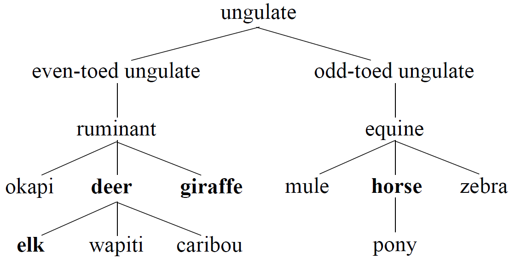
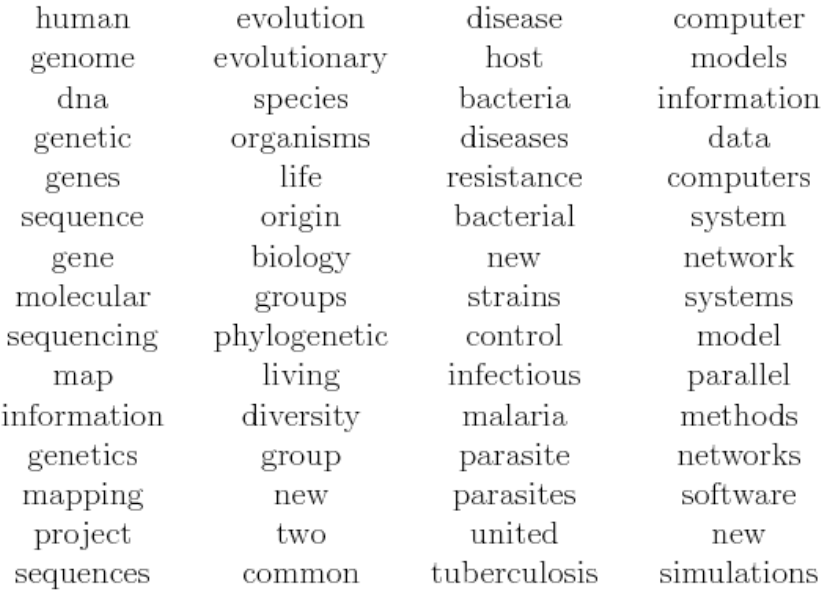

# Module 4: Topic Modeling

## Semantic Text Similarity

### Lecture Notes

+ Which pair of words are most similar?
    + deer, elk
    + deer, giraffe
    + deer, horse
    + deer, mouse
    + Ans: deer, elk
    + How can we quantify such similarity?

+ Applications of Text Similarity
    + Grouping similar words into semantic concepts
    + As a building block in natural language understanding tasks
        + Textual entailment: the smaller sentence or one of the two sentences derives its meaning or entails its meaning from another piece of text.
        + Paraphrasing: a task where you rephrase or rewrite some sentence you get into another sentence that has the same meaning.

+ WordNet
    + Semantic dictionary of (mostly) English words, interlinked by semantic relations
    + Includes rich linguistic information
    + part of speech, word senses, synonyms, hypernyms/hyponyms, meronyms, distributional related forms, …
    + Machine-readable, freely available

+ Semantic Similarity Using WordNet
    + WordNet organizes information in a hierarchy
    + Many similarity measures use the hierarchy in some way
    + Verbs, nouns, adjectives all have separate hierarchies

+ Coming back to our deer example
    <a href="url"> <br/>
        
    </a>

+ Path Similarity
    + Find the shortest path between the two concepts
    + Similarity measure inversely related to path distance
    + `PathSim(deer, elk) = 0.5` (1 step)
    + `PathSim(deer, giraffe) = 0.33` (2 steps)
    + `PathSim(deer, horse) = 0.14` (6 steps)

+ Lowest Common Subsumer (LCS)
    + Find the closest ancestor to both concepts
    + `LCS(deer, elk) = deer`
    + `LCS(deer, giraffe) = ruminant`
    + `LCS(deer, horse) = ungulate`

+ Lin Similarity
    + Similarity measure based on the information contained in the LCS of the two concepts
    + $LinSim(u, v) = 2 \times \log P(LCS(u,v)) / (\log P(u) + \log P(v))$
    + `P(u)` is given by the information content learnt over a large corpus.

+ How to do it in Python?
    + WordNet easily imported into Python through NLTK
        ```python
        import nltk
        from nltk.corpus import wordnet as wn
        ```
    + Find appropriate sense of the words
        ```python
        deer = wn.synset('deer.n.01')   # deer as noun w/ the first meaning
        elk = wn.synset('elk.n.01')     # elk as noun w/ the first meaning
        …
        ```
    + Find path similarity
        ```python
        deer.path_similarity(elk)       # 0.5
        deer.path_similarity(horse)     # 0.14285714285714285
        ```
    + Use an information criteria to find Lin similarity
        ```python
        from nltk.corpus import wordnet_ic

        brown_ic = wordnet_ic.ic('ic-brown.dat')

        deer.lin_similarity(elk, brown_ic)      # 0.7726998936065773
        deer.lin_similarity(horse, brown_ic)    # 0.8623778273893673
        ```


+ `wordnet` class
    + Init Signature: `wordnet(root, omw_reader)`
    + Docstring: A corpus reader used to access wordnet or its variants
    + Methods:
        + `__init__(root, omw_reader)`: Construct a new wordnet corpus reader, with the given root directory.
        + `all_lemma_names(pos=None, lang='eng')`: Return all lemma names for all synsets for the given part of speech tag and language or languages. If pos is not specified, all synsets for all parts of speech will be used.
        + `all_synsets(pos=None)`: Iterate over all synsets with a given part of speech tag. If no pos is specified, all synsets for all parts of speech will be loaded.
        + `citation(lang='omw')`: Return the contents of citation.bib file (for omw) use lang=lang to get the citation for an individual language
        + `custom_lemmas(tab_file, lang)`: Reads a custom tab file containing mappings of lemmas in the given language to Princeton WordNet 3.0 synset offsets, allowing NLTK's WordNet functions to then be used with that language.
            + `tab_file` (str): Tab file as a file or file-like object
            + `lang` (str): ISO 639-3 code of the language of the tab file
        + `get_version()`
        + `ic(corpus, weight_senses_equally=False, smoothing=1.0)`: Creates an information content lookup dictionary from a corpus.
            + `corpus` (CorpusReader): The corpus from which we create an information content dictionary.
            + `weight_senses_equally` (bool): If this is True, gives all possible senses equal weight rather than dividing by the number of possible senses. (If a word has 3 synses, each sense gets 0.3333 per appearance when this is False, 1.0 when it is true.)
            + `smoothing` (float): How much do we smooth synset counts (default is 1.0)
            + Return: An information content dictionary
        + `jcn_similarity(synset, other, ic, verbose=False)`: __Jiang-Conrath Similarity__: Return a score denoting how similar two word senses are, based on the Information Content (IC) of the Least Common Subsumer (most specific ancestor node) and that of the two input Synsets. The relationship is given by the equation $1 / (IC(s1) + IC(s2) - 2 * IC(lcs))$.
            + `other` (Synset): The `Synset` that this `Synset` is being compared to.
            + `ic` (dict): an information content object (as returned by `nltk.corpus.wordnet_ic.ic()`).
            + Return: A float score denoting the similarity of the two `Synset` objects.
        + `langs()`: return a list of languages supported by Multilingual Wordnet
        + `lch_similarity(synset, other, verbose=False, simulate_root=True)`: __Leacock Chodorow Similarity__: Return a score denoting how similar two word senses are, based on the shortest path that connects the senses (as above) and the maximum depth of the taxonomy in which the senses occur. The relationship is given as $-\log(p/2d)$ where $p$ is the shortest path length and d is the taxonomy depth.
            + `other` (Synset): The `Synset` that this `Synset` is being compared to.
            + `simulate_root` (bool): The various verb taxonomies do not share a single root which disallows this metric from working for synsets that are not connected. This flag (True by default) creates a fake root that connects all the taxonomies. Set it to false to disable this behavior. For the noun taxonomy, there is usually a default root except for WordNet version 1.6. If you are using wordnet 1.6, a fake root will be added for nouns as well.
            + Return: A score denoting the similarity of the two `Synset` objects, normally greater than 0. None is returned if no connecting path could be found. If a ``Synset`` is compared with itself, the maximum score is returned, which varies depending on the taxonomy depth.
        + `lemma(name, lang='eng')`: Return lemma object that matches the name
        + `lemma_count(lemma)`: Return the frequency count for this Lemma
        + `lemma_from_key(key)`
        + `lemmas(lemma, pos=None, lang='eng')`: Return all Lemma objects with a name matching the specified lemma name and part of speech tag. Matches any part of speech tag if none is specified.
        + `license(lang='eng')`: Return the contents of LICENSE (for omw) use lang=lang to get the license for an individual language
        + `lin_similarity(synset, other, ic, verbose=False)`: __Lin Similarity__: Return a score denoting how similar two word senses are, based on the Information Content (IC) of the Least Common Subsumer (most specific ancestor node) and that of the two input Synsets. The relationship is given by the equation $2 * IC(lcs) / (IC(s1) + IC(s2))$.
            + `other` (Synset): The `Synset` that this `Synset` is being compared to.
            + `ic` (dict): an information content object (as returned by `nltk.corpus.wordnet_ic.ic()`).
            + Return: A float score denoting the similarity of the two `Synset` objects, in the range 0 to 1.
        + `morphy(form, pos=None, check_exceptions=True)`: Find a possible base form for the given form, with the given part of speech, by checking WordNet's list of exceptional forms, and by recursively stripping affixes for this part of speech until a form in WordNet is found.
        + `of2ss(of)`: take an id and return the synsets
        + `path_similarity(synset, other, verbose=False, simulate_root=True)`: __Path Distance Similarity__: Return a score denoting how similar two word senses are, based on the shortest path that connects the senses in the is-a (hypernym/hypnoym) taxonomy. The score is in the range 0 to 1, except in those cases where a path cannot be found (will only be true for verbs as there are many distinct verb taxonomies), in which case None is returned. A score of 1 represents identity i.e. comparing a sense with itself will return 1.
            + `other` (Synset): The `Synset` that this `Synset` is being compared to.
            + `simulate_root` (dict): The various verb taxonomies do not share a single root which disallows this metric from working for synsets that are not connected. This flag (True by default) creates a fake root that connects all the taxonomies. Set it to false to disable this behavior. For the noun taxonomy, there is usually a default root except for WordNet version 1.6. If you are using wordnet 1.6, a fake root will be added for nouns as well.
            + Return: A score denoting the similarity of the two `Synset` objects, normally between 0 and 1. None is returned if no connecting path could be found. 1 is returned if a `Synset` is compared with itself.
        + `readme(lang='omw')`: Return the contents of README (for omw) use lang=lang to get the readme for an individual language
        + `res_similarity(synset, other, ic, verbose=False)`: __Resnik Similarity__: Return a score denoting how similar two word senses are, based on the Information Content (IC) of the Least Common Subsumer (most specific ancestor node).
            + `other` (Synset): The `Synset` that this `Synset` is being compared to.
            + `ic` (dict): an information content object (as returned by `nltk.corpus.wordnet_ic.ic()`).
            + Return: A float score denoting the similarity of the two `Synset` objects. Synsets whose LCS is the root node of the taxonomy will have a score of 0 (e.g. N['dog'][0] and N['table'][0]).
        + `ss2of(ss)`: return the ID of the synset
        + `synset(name)`: Loading Synsets
        + `synset_from_pos_and_offset(pos, offset)`
        + `synsets(lemma, pos=None, lang='eng', check_exceptions=True)`: Load all synsets with a given lemma and part of speech tag. If no pos is specified, all synsets for all parts of speech will be loaded. If lang is specified, all the synsets associated with the lemma name of that language will be returned.
        + `words(lang='eng')`":  return lemmas of the given language as list of words
        + `wup_similarity(synset, other, verbose=False, simulate_root=True)`: __Wu-Palmer Similarity__: Return a score denoting how similar two word senses are, based on the depth of the two senses in the taxonomy and that of their Least Common Subsumer (most specific ancestor node). Previously, the scores computed by this implementation did _not_ always agree with those given by Pedersen's Perl implementation of WordNet Similarity. However, with the addition of the simulate_root flag (see below), the score for verbs now almost always agree but not always for nouns. <br/>  The LCS does not necessarily feature in the shortest path connecting the two senses, as it is by definition the common ancestor deepest in the taxonomy, not closest to the two senses. Typically, however, it will so feature. Where multiple candidates for the LCS exist, that whose shortest path to the root node is the longest will be selected. Where the LCS has multiple paths to the root, the longer path is used for the purposes of the calculation.
            + `other` (Synset): The `Synset` that this `Synset` is being compared to.
            + `simulate_root` (bool): The various verb taxonomies do not share a single root which disallows this metric from working for synsets that are not connected. This flag (True by default) creates a fake root that connects all the taxonomies. Set it to false to disable this behavior. For the noun taxonomy, there is usually a default root except for WordNet version 1.6. If you are using wordnet 1.6, a fake root will be added for nouns as well.
            + Return: A float score denoting the similarity of the two `Synset` objects, normally greater than zero. If no connecting path between the two senses can be found, None is returned.
    + Data and other attributes:
        + ADJ = 'a'
        + ADJ_SAT = 's'
        + ADV = 'r'
        + MORPHOLOGICAL_SUBSTITUTIONS = {'a': [('er', ''), ('est', ''), ('er', '...
        + NOUN = 'n'
        + VERB = 'v'
    + Methods inherited from `nltk.corpus.reader.api.CorpusReader`:
        + `__repr__()`: Return repr().
        + `__unicode__ = __str__(/)`: Return str().
        + `abspath(fileid)`:  Return the absolute path for the given file.
            + `fileid` (str): The file identifier for the file whose path should be returned.
            + Return: PathPointer
        + `abspaths(fileids=None, include_encoding=False, include_fileid=False)`: Return a list of the absolute paths for all fileids in this corpus; or for the given list of fileids, if specified.
            + `fileids` (None or str or list): Specifies the set of fileids for which paths should be returned.  Can be None, for all fileids; a list of file identifiers, for a specified set of fileids; or a single file identifier, for a single file.  Note that the return value is always a list of paths, even if `fileids` is a single file identifier.
            + `include_encoding`: If true, then return a list of `(path_pointer, encoding)` tuples.
            + Return: list(PathPointer)
        + `encoding(file)`: Return the unicode encoding for the given corpus file, if known. If the encoding is unknown, or if the given file should be processed using byte strings (str), then return None.
        + `ensure_loaded()`: Load this corpus (if it has not already been loaded).  This is used by LazyCorpusLoader as a simple method that can be used to make sure a corpus is loaded -- e.g., in case a user wants to do help(some_corpus).
        + `fileids()`: Return a list of file identifiers for the fileids that make up this corpus.
        + `open(file)`:  Return an open stream that can be used to read the given file. If the file's encoding is not None, then the stream will automatically decode the file's contents into unicode.
            + `file`: The file identifier of the file to read.
        + `unicode_repr = __repr__()`:  Return repr().
    + Data descriptors inherited from nltk.corpus.reader.api.CorpusReader:
        + `__dict__`: dictionary for instance variables (if defined)
        + `__weakref__`: list of weak references to the object (if defined)
        + `root`: The directory where this corpus is stored.

+ `wordnet_ic` class
    + Init Signature: `wordnet_ic(root, fileids)`
    + Docstring: A corpus reader for the WordNet information content corpus.
    + Method
        + `__init__(root, fileids)`
            + `root` (PathPointer or str): A path pointer identifying the root directory for this corpus.  If a string is specified, then it will be converted to a `PathPointer` automatically.
            + `fileids`: A list of the files that make up this corpus. This list can either be specified explicitly, as a list of strings; or implicitly, as a regular expression over file paths.  The absolute path for each file will be constructed by joining the reader's root to each file name.
            + `encoding`: The default unicode encoding for the files that make up the corpus.  The value of `encoding` can be any of the following:
                + A string: `encoding` is the encoding name for all files.
                + A dictionary: `encoding[file_id]` is the encoding name for the file whose identifier is `file_id`.  If `file_id` is not in `encoding`, then the file contents will be processed using non-unicode byte strings.
                + A list: `encoding` should be a list of `(regexp, encoding)` tuples.  The encoding for a file whose identifier is `file_id` will be the `encoding` value for the first tuple whose `regexp` matches the `file_id`.  If no tuple's `regexp` matches the `file_id`, the file contents will be processed using non-unicode byte strings.
                + None: the file contents of all files will be processed using non-unicode byte strings.
            + `tagset`: The name of the tagset used by this corpus, to be used for normalizing or converting the POS tags returned by the tagged_...() methods.
        + `ic(icfile)`: Load an information content file from the `wordnet_ic` corpus and return a dictionary.  This dictionary has just two keys, NOUN and VERB, whose values are dictionaries that map from synsets to information content values.
            + `icfile` (str): The name of the wordnet_ic file (e.g. "ic-brown.dat")
            + Return: An information content dictionary
    + Methods inherited from `nltk.corpus.reader.api.CorpusReader`:
        + `__repr__()`: Return repr().
        + `__unicode__ = __str__(/)`: Return str().
        + `abspath(fileid)`: Return the absolute path for the given file.
            + `fileid` (str): The file identifier for the file whose path should be returned.
            + Return: PathPointer
        + `abspaths(fileids=None, include_encoding=False, include_fileid=False)`: Return a list of the absolute paths for all fileids in this corpus; or for the given list of fileids, if specified.
            + `fileids` (None or str or list): Specifies the set of fileids for which paths should be returned.  Can be None, for all fileids; a list of file identifiers, for a specified set of fileids; or a single file identifier, for a single file.  Note that the return value is always a list of paths, even if `fileids` is a single file identifier.
            + `include_encoding`: If true, then return a list of `(path_pointer, encoding)` tuples.
            + return: list(PathPointer)
        + `citation()`: Return the contents of the corpus citation.bib file, if it exists.
        + `encoding(file)`: Return the unicode encoding for the given corpus file, if known. If the encoding is unknown, or if the given file should be processed using byte strings (str), then return None.
        + `ensure_loaded()`: Load this corpus (if it has not already been loaded).  This is used by LazyCorpusLoader as a simple method that can be used to make sure a corpus is loaded -- e.g., in case a user wants to do help(some_corpus).
        + `fileids()`: Return a list of file identifiers for the fileids that make up this corpus.
        + `license()`: Return the contents of the corpus LICENSE file, if it exists.
        + `open(file)`: Return an open stream that can be used to read the given file. If the file's encoding is not None, then the stream will automatically decode the file's contents into unicode.
            + `file`: The file identifier of the file to read.
        + `readme()`: Return the contents of the corpus README file, if it exists.
        + `unicode_repr = __repr__()`: Return repr().
    + Data descriptors inherited from `nltk.corpus.reader.api.CorpusReader:`
        + `__dict__`: dictionary for instance variables (if defined)
        + `__weakref__`: list of weak references to the object (if defined)
        + `root`: The directory where this corpus is stored.


+ Collocations and Distributional Similarity
    + “You know a word by the company it keeps” [Firth, 1957]
    + Two words that frequently appears in similar contexts are more likely to be semantically related
        + The friends _met at _a_ __café__.
        + Shyam _met_ Ray _at a_ __pizzeria__.
        + Let’s _meet_ up _near the_ __coffee shop__.
        + The secret _meeting at the_ __restaurant__ soon became public.

+ Distributional Similarity: Context
    + Words before, after, within a small window
    + Parts of speech of words before, after, in a small window
    + Specific syntactic relation to the target word
    + Words in the same sentence, same document, …

+ Strength of association between words
    + How frequent are these?
        + Not similar if two words don’t occur together often
    + Also important to see how frequent are individual words
        + ‘the’ is very frequent, so high chances it co-occurs often with every other word
    + Pointwise Mutual Information: $PMI(w,c) = \log [P(w,c) / P(w)P(c)]$

+ How to do it in Python?
    + Use NLTK Collocations and Association measures
        ```python
        import nltk
        from nltk.collocations import *

        bigram_measures = nltk.collocations.BigramAssocMeasures()

        finder = BigramCollocationFinder.from_words(text)
        finder.nbest(bigram_measures.pmi, 10)
        ```
    + finder also has other useful functions, such as frequency filter
        ```python
        finder.apply_freq_filter(10)
        ```

+ `ntlk.collections` Class
    + DESCRIPTION
        + Tools to identify collocations --- words that often appear consecutively --- within corpora. They may also be used to find other associations between word occurrences.
        + See Manning and Schutze [ch. 5](http://nlp.stanford.edu/fsnlp/promo/colloc.pdf) and the [NSP Perl package](http://ngram.sourceforge.net)
        + Finding collocations requires first calculating the frequencies of words and their appearance in the context of other words. Often the collection of words will then requiring filtering to only retain useful content terms. Each ngram of words may then be scored according to some association measure, in order to determine the relative likelihood of each ngram being a collocation.
        + The `BigramCollocationFinder` and `TrigramCollocationFinder` classes provide these functionalities, dependent on being provided a function which scores a ngram given appropriate frequency counts. A number of standard association measures are provided in bigram_measures and trigram_measures.
    + CLASSES: `AbstractCollocationFinder(builtins.object)`
        + `BigramCollocationFinder`
        + `QuadgramCollocationFinder`
        + `TrigramCollocationFinder`

+ `AbstractCollocationFinder(builtins.object)` class
    + Init Signature: `nltk.collections.AbstractCollocationFinder(word_fd, ngram_fd)`
    + Docstring: An abstract base class for collocation finders whose purpose is to collect collocation candidate frequencies, filter and rank them. <br/>
        As a minimum, collocation finders require the frequencies of each word in a corpus, and the joint frequency of word tuples. This data should be provided through nltk.probability.FreqDist objects or an identical interface.
    + Methods
        + `__init__(word_fd, ngram_fd)`: Initialize self.  See help(type()) for accurate signature.
        + `above_score(score_fn, min_score)`: Returns a sequence of ngrams, ordered by decreasing score, whose scores each exceed the given minimum score.
        + `apply_freq_filter(min_freq)`: Removes candidate ngrams which have frequency less than min_freq.
        + `apply_ngram_filter(fn)`: Removes candidate ngrams $(w_1, w_2, \ldots)$ where $fn(w_1, w_2, \ldots)$ evaluates to True.
        + `apply_word_filter(fn)`: Removes candidate ngrams $(w_1, w_2, \ldots)$ where any of $(fn(w_1), fn(w_2), \ldots)$ evaluates to True.
        + `nbest(score_fn, n)`: Returns the top n ngrams when scored by the given function.
        + `score_ngrams(score_fn)`: Returns a sequence of (ngram, score) pairs ordered from highest to lowest score, as determined by the scoring function provided.
    + Class methods
        + `from_documents(documents)` from `builtins.type`: Constructs a collocation finder given a collection of documents, each of which is a list (or iterable) of tokens.
    + Data descriptors
        + `__dict__`: dictionary for instance variables (if defined)
        + `__weakref__`: list of weak references to the object (if defined)


+ `BigramCollocationFinder(AbstractCollocationFinder)` classs
    + Init Signature: `ntlk.BigramCollocationFinder(word_fd, bigram_fd, window_size=2)`
    + Doctsring: A tool for the finding and ranking of bigram collocations or other association measures. It is often useful to use from_words() rather than constructing an instance directly.
    + Methods
        + `__init__(word_fd, bigram_fd, window_size=2)`: Construct a BigramCollocationFinder, given FreqDists for appearances of words and (possibly non-contiguous) bigrams.
        + `score_ngram(score_fn, w1, w2)`: Returns the score for a given bigram using the given scoring function.  Following Church and Hanks (1990), counts are scaled by a factor of 1/(window_size - 1).
    + Class methods
        + `from_words(words, window_size=2)` from `builtins.type`: Construct a BigramCollocationFinder for all bigrams in the given sequence.  When window_size > 2, count non-contiguous bigrams, in the style of Church and Hanks's (1990) association ratio.
    + Data and other attributes
        + `default_ws = 2`


+ `QuadgramCollocationFinder(AbstractCollocationFinder)` class
    + Init Signature: `ntlk.QuadgramCollocationFinder(word_fd, quadgram_fd, ii, iii, ixi, ixxi, iixi, ixii)`
    + Docstring: A tool for the finding and ranking of quadgram collocations or other association measures. It is often useful to use from_words() rather than constructing an instance directly.
    + Methods
        + `__init__(word_fd, quadgram_fd, ii, iii, ixi, ixxi, iixi, ixii)`: Construct a QuadgramCollocationFinder, given FreqDists for appearances of words, bigrams, trigrams, two words with one word and two words between them, three words with a word between them in both variations.
        + `score_ngram(score_fn, w1, w2, w3, w4)`
    + Class methods
        + `from_words(words, window_size=4)` from `builtins.type`
    + Data and other attributes
        + `default_ws = 4`


+ `TrigramCollocationFinder(AbstractCollocationFinder)` class
    + Init Signature: `nltk.TrigramCollocationFinder(word_fd, bigram_fd, wildcard_fd, trigram_fd)`
    + Docstring: A tool for the finding and ranking of trigram collocations or other association measures. It is often useful to use from_words() rather than constructing an instance directly.
    + Methods
        + `__init__(word_fd, bigram_fd, wildcard_fd, trigram_fd)`: Construct a TrigramCollocationFinder, given FreqDists for appearances of words, bigrams, two words with any word between them, and trigrams.
        + `bigram_finder()`: Constructs a bigram collocation finder with the bigram and unigram data from this finder. Note that this does not include any filtering applied to this finder.
        + `score_ngram(score_fn, w1, w2, w3)`: Returns the score for a given trigram using the given scoring function.
    + Class methods
        + `from_words(words, window_size=3)` from `builtins.type` Construct a TrigramCollocationFinder for all trigrams in the given sequence.
    + Data and other attributes
        + `default_ws = 3`

+ `NgramAssocMeasures(builtins.object)` class
    + Init Signature: `nltk.NgramAssocMeasures()`
    + Docstring: An abstract class defining a collection of generic association measures.
    + Notes: 
        + Each public method returns a score, taking the following arguments:
            ```python
            score_fn(count_of_ngram,
                    (count_of_n-1gram_1, ..., count_of_n-1gram_j),
                    (count_of_n-2gram_1, ..., count_of_n-2gram_k),
                    ...,
                    (count_of_1gram_1, ..., count_of_1gram_n),
                    count_of_total_words)
            ```
        + Inheriting classes should define a property `_n`, and a method `_contingency` which calculates contingency values from marginals in order for all association measures defined here to be usable.
    + Class methods
        + `chi_sq(*marginals)` from `abc.ABCMeta`: Scores ngrams using Pearson's chi-square as in Manning and Schutze 5.3.3.
        + `jaccard(*marginals)` from `abc.ABCMeta`: Scores ngrams using the Jaccard index.
        + `likelihood_ratio(*marginals)` from `abc.ABCMeta`: Scores ngrams using likelihood ratios as in Manning and Schutze 5.3.4.
        + `pmi(*marginals)` from `abc.ABCMeta`: Scores ngrams by pointwise mutual information, as in Manning and Schutze 5.4.
        + `poisson_stirling(*marginals)` from `abc.ABCMeta`: Scores ngrams using the Poisson-Stirling measure.
        + `student_t(*marginals)` from `abc.ABCMeta`: Scores ngrams using Student's t test with independence hypothesis for unigrams, as in Manning and Schutze 5.3.1.
    + Static methods
        + `mi_like(*marginals, **kwargs)`: Scores ngrams using a variant of mutual information. The keyword argument power sets an exponent (default 3) for the numerator. No logarithm of the result is calculated.
        + `raw_freq(*marginals)`: Scores ngrams by their frequency
    + Data descriptors
        + `__dict__`: dictionary for instance variables (if defined)
        + `__weakref__`: list of weak references to the object (if defined)
    + Data and other attributes
        + `__abstractmethods__ = frozenset({'_contingency', '_marginals'})`


+ `BigramAssocMeasures(NgramAssocMeasures)` Class
    + Init Signature: `ntlk.BigramAssocMeasures()`
    + Docstring: A collection of bigram association measures. 
    + Notes:
        + Each association measure is provided as a function with three arguments:
            ```python
            bigram_score_fn(n_ii, (n_ix, n_xi), n_xx)
            ```
        + The arguments constitute the marginals of a contingency table, counting the occurrences of particular events in a corpus. The letter `i` in the suffix refers to the appearance of the word in question, while `x` indicates the appearance of any word. Thus, for example:
            ```python
            n_ii counts (w1, w2), i.e. the bigram being scored
            n_ix counts (w1, *)
            n_xi counts (*, w2)
            n_xx counts (*, *), i.e. any bigram
            ```
        + This may be shown with respect to a contingency table::
            ```
                    w1    ~w1
                ------ ------
            w2 | n_ii | n_oi | = n_xi
                ------ ------
            ~w2 | n_io | n_oo |
                ------ ------
                = n_ix        TOTAL = n_xx
            ```
    + Class methods
        + `chi_sq(n_ii, n_ix_xi_tuple, n_xx) from abc.ABCMeta`: Scores bigrams using chi-square, i.e. phi-sq multiplied by the number of bigrams, as in Manning and Schutze 5.3.3.
        + `fisher(*marginals)` from `abc.ABCMeta`: Scores bigrams using Fisher's Exact Test (Pedersen 1996).  Less sensitive to small counts than PMI or Chi Sq, but also more expensive to compute. Requires scipy.
        + `phi_sq(*marginals)` from `abc.ABCMeta`: Scores bigrams using phi-square, the square of the Pearson correlation coefficient.
    + Static methods
        + `dice(n_ii, n_ix_xi_tuple, n_xx)`: Scores bigrams using Dice's coefficient.
    + Data and other attributes
        + `__abstractmethods__ = frozenset()`

+ `TrigramAssocMeasures(NgramAssocMeasures)` class
    + Init Signature: `nltk.TrigramAssocMeasures()`
    + DocString: A collection of trigram association measures
    + Notes: 
        + Each association measure is provided as a function with four arguments:
            ```python
            trigram_score_fn(n_iii,
                            (n_iix, n_ixi, n_xii),
                            (n_ixx, n_xix, n_xxi),
                            n_xxx)
            ```
        + The arguments constitute the marginals of a contingency table, counting the occurrences of particular events in a corpus. The letter i in the suffix refers to the appearance of the word in question, while x indicates the appearance of any word. Thus, for example:
            + `n_iii` counts $(w_1, w_2, w_3)$, i.e. the trigram being scored
            + `n_ixx` counts $(w_1, *, *)$
            + `n_xxx` counts $(*, *, *)$, i.e. any trigram
    + Data and other attributes defined here:
        + `__abstractmethods__ = frozenset()` 


+ Take Home Concepts
    + Finding similarity between words and text is non-trivial
    + WordNet is a useful resource for semantic relationships between words
    + Many similarity functions exist
    + NLTK is a useful package for many such tasks


### Lecture Video

<a href="https://d3c33hcgiwev3.cloudfront.net/6YHYeWgHEeeDRAot5bGaoA.processed/full/360p/index.mp4?Expires=1544054400&Signature=ZlQMdFNtoIH2CDQbvh-URxcoC9-kgLyy9DR0SlA-XGK5t1CLcazL4Iiv3nTR4-bxlfQ0HzkiVsDlTS8zbIlGVHtDzt6ot9rKIPVYOY-J~9ZzqISn0srTUvG-ESWavl9JoI8Ag9Hw39hF3SRaQvrvOMYNkrhWf-oxJaG4tSrtOeg_&Key-Pair-Id=APKAJLTNE6QMUY6HBC5A" alt="Semantic Text Similarity" target="_blank">
     
</a>


## Topic Modeling

### Lecture Notes

+ Documents Exhibit Multiple Topics
    <a href="https://www.coursera.org/learn/python-text-mining/lecture/KiiBl/topic-modeling"> <br/>
        
    </a>

+ Intuition: Documents as a mixture of topics
    <a href="https://www.coursera.org/learn/python-text-mining/lecture/KiiBl/topic-modeling"> <br/>
        
    </a>

+ More examples of topics
    <a href="https://www.coursera.org/learn/python-text-mining/lecture/KiiBl/topic-modeling"> <br/>
        
    </a>

+ What is Topic Modeling?
    + A course-level analysis of what’s in a text collection
    + Topic: the subject (theme) of a discourse
    + Topics are represented as a word distribution
    + A document is assumed to be a mixture of topics
    + What’s known:
        + The text collection or corpus
        + Number of topics
    + What’s not known:
        + The actual topics
        + Topic distribution for each document
    + Essentially, text clustering problem
        + Documents and words clustered simultaneously
    + Different topic modeling approaches available
        + Probabilistic Latent Semantic Analysis (PLSA) [Hoffman ’99]
        + Latent Dirichlet Allocation (LDA) [Blei, Ng, and Jordan, ’03]


### Lecture Video

<a href="https://d3c33hcgiwev3.cloudfront.net/ldTLaGgHEeeDRAot5bGaoA.processed/full/360p/index.mp4?Expires=1544054400&Signature=PCThz9lSJd6youdaFNWTgGI-xMAuE6252D9rUba1jekqpNYnhRJuG3MWPKVVSnB8Ff0oXX4yPfZzkw8JVT1s3PiiM0euSmb8iYEUGuW5AChexNJSlDfh88MEwvC~MN~nh0et1Gc7X1kojDwvVzdwbEv7AG1Gcy2ZDhVKIY8iU1M_&Key-Pair-Id=APKAJLTNE6QMUY6HBC5A" alt="Topic Modeling" target="_blank">
     
</a>


## Generative Models and LDA

### Lecture Notes

+ Generative Models for Text
    <a href="https://www.coursera.org/learn/python-text-mining/lecture/SRSuq/generative-models-and-lda"> <br/>
        
    </a>

+ Generative Models can be Complex
    <a href="https://www.coursera.org/learn/python-text-mining/lecture/SRSuq/generative-models-and-lda"> <br/>
        
    </a>

+ Latent Dirichlet Allocation (LDA)
    + Generative model for a document `d`
        + Choose length of document `d`
        + Choose a mixture of topics for document `d`
        + Use a topic's multinomial distribution to output words to fill that topic's quota

+ Topic Modeling in Practice
    + How many topics?
        + Finding or even guessing the number of topics is hard
    + Interpreting topics
        + Topics are just word distributions
        + Making sense of words / generating labels is subjective

+ Topic Modeling: Summary
    + Great tool for exploratory text analysis
        + What are the documents (tweets, reviews, news articles) about?
    + Many tools available to do it effortlessly in Python

+ Working with LDA in Python
    + Many packages available, such as `gensim`, `lda`
    + Pre-processing text
        + Tokenize, normalize (lowercase)
        + Stop word removal
        + Stemming
    + Convert tokenized documents to a document - term matrix
    + Build LDA models on the doc-term matrix
    + doc_set: set of pre-processed text documents
        ```python
        import gensim
        from gensim import corpora, models

        dictionary = corpora.Dictionary(doc_set)
        corpus = [dictionary.doc2bow(doc) for doc in doc_set]
        ldamodel = gensim.models.ldamodel.LdaModel(corpus, num_topics=4, id2word=dictionary, passes=50)
        print(ldamodel.print_topics(num_topics=4, num_words=5))
        ```
    + `ldamodel` can also be used to find topic distribution of documents
        ```python
        topic_dis = ldamodel[new_doc]
        ```


+ `Dictionary(gensim.utils.SaveLoad, collections.abc.Mapping)` class
    + Init Signature: `corpora.Dictionary(documents=None, prune_at=2000000)`
    + Docstring: Dictionary encapsulates the mapping between normalized words and their integer ids.
    + Attributes
        + `token2id` (dict of (str, int)): token -> tokenId.
        + `id2token` (dict of (int, str)): Reverse mapping for token2id, initialized in a lazy manner to save memory (not created until needed).
        + `dfs` (dict of (int, int)): Document frequencies: token_id -> how many documents contain this token.
        + `num_docs` (int): Number of documents processed.
        + `num_pos` (int): Total number of corpus positions (number of processed words).
        + `num_nnz` (int): Total number of non-zeroes in the BOW matrix (sum of the number of unique words per document over the entire corpus).
    + Methods
        + `__getitem__(tokenid)`: Get the string token that corresponds to `tokenid`.
            + `tokenid` (int): Id of token.
            + Returns: str: Token corresponding to `tokenid`.
            + Raises:  `KeyError`: If this Dictionary doesn't contain such `tokenid`.
        + `__init__(documents=None, prune_at=2000000)`
            + `documents` (iterable of iterable of str, optional): Documents to be used to initialize the mapping and collect corpus statistics.
        + `prune_at` (int, optional): Dictionary will try to keep no more than `prune_at` words in its mapping, to limit its RAM footprint, the correctness is not guaranteed. Use `~gensim.corpora.dictionary.Dictionary.filter_extremes` to perform proper filtering.
        + `__iter__()`: Iterate over all tokens.
        + `__len__()`: Get number of stored tokens.
            + Return: (int): Number of stored tokens.
        + `__str__()`: Return `str().`
        + `add_documents(documents, prune_at=2000000)`: Update dictionary from a collection of `documents`.
            + ` documents` (iterable of iterable of str): Input corpus. All tokens should be already *tokenized and normalized*.
            + `prune_at` (int, optional): Dictionary will try to keep no more than `prune_at` words in its mapping, to limit its RAM footprint, the correctness is not guaranteed. Use`~gensim.corpora.dictionary.Dictionary.filter_extremes` to perform proper filtering.
        + `compactify()`: Assign new word ids to all words, shrinking any gaps.
        + `doc2bow(document, allow_update=False, return_missing=False)`: Convert `document` into the bag-of-words (BoW) format = list of `(token_id, token_count)` tuples.
            + `document` (list of str): Input document.
            + `allow_update` (bool, optional): Update self, by adding new tokens from `document` and updating internal corpus statistics.
            + `return_missing` (bool, optional): Return missing tokens (tokens present in `document` but not in self) with frequencies?
            + Return: 
                + list of (int, int): BoW representation of `document`.
                + list of (int, int), dict of (str, int):  If `return_missing` is True, return BoW representation of `document` + dictionary with missing tokens and their frequencies.
        + `doc2idx(document, unknown_word_index=-1)`: Convert `document` (a list of words) into a list of indexes = list of `token_id`. Replace all unknown words i.e, words not in the dictionary with the index as set via `unknown_word_index`.
            + `document` (list of str): Input document
            + `unknown_word_index` (int, optional): Index to use for words not in the dictionary.
            + Returns: (list of int): Token ids for tokens in `document`, in the same order.
        + `filter_extremes(no_below=5, no_above=0.5, keep_n=100000, keep_tokens=None)`: Filter out tokens in the dictionary by their frequency.
            + `no_below` (int, optional): Keep tokens which are contained in at least `no_below` documents.
            + `no_above` (float, optional): Keep tokens which are contained in no more than `no_above` documents (fraction of total corpus size, not an absolute number).
            + `keep_n` (int, optional): Keep only the first `keep_n` most frequent tokens.
            + `keep_tokens` (iterable of str): Iterable of tokens that **must** stay in dictionary after filtering.
        + `filter_n_most_frequent(remove_n)`: Filter out the 'remove_n' most frequent tokens that appear in the documents.
            + `remove_n` (int): Number of the most frequent tokens that will be removed.
        + `filter_tokens(bad_ids=None, good_ids=None)`: Remove the selected `bad_ids` tokens from `~gensim.corpora.dictionary.Dictionary`. <br/> Alternatively, keep selected `good_ids` in `~gensim.corpora.dictionary.Dictionary` and remove the rest.
            + `bad_ids` (iterable of int, optional): Collection of word ids to be removed.
            + `good_ids` (collection of int, optional): Keep selected collection of word ids and remove the rest.
        + `iteritems()`, `iterkeys = __iter__()`, `itervalues()`, `keys()`: Get all stored ids.
            + Return: (list of int): List of all token ids.
        + `merge_with(other)`: Merge another dictionary into this dictionary, mapping the same tokens to the same ids and new tokens to new ids.
            + Notes: 
                + The purpose is to merge two corpora created using two different dictionaries: `self` and `other`. `other` can be any id=>word mapping (a dict, a Dictionary object, ...).
                + Return a transformation object which, when accessed as `result[doc_from_other_corpus]`, will convert documents from a corpus built using the `other` dictionary into a document using the new, merged dictionary.
            + `other` ({dict, `~gensim.corpora.dictionary.Dictionary`}): Other dictionary.
            + Return: (`gensim.models.VocabTransform`): Transformation object.
        + `save_as_text(fname, sort_by_word=True)`: Save `~gensim.corpora.dictionary.Dictionary` to a text file
            + `fname` (str): Path to output file.
            + `sort_by_word` (bool, optional): Sort words in lexicographical order before writing them out?
            + Notes: <br/>
                Format:
                ```python
                num_docs
                id_1[TAB]word_1[TAB]document_frequency_1[NEWLINE]
                id_2[TAB]word_2[TAB]document_frequency_2[NEWLINE]
                ....
                id_k[TAB]word_k[TAB]document_frequency_k[NEWLINE]
                ```
                This text format is great for corpus inspection and debugging. As plaintext, it's also easily portable to other tools and frameworks. For better performance and to store the entire object state, including collected corpus statistics, use `~gensim.corpora.dictionary.Dictionary.save` and `~gensim.corpora.dictionary.Dictionary.load` instead.
    + Static methods
        + `from_corpus(corpus, id2word=None)`: Create `~gensim.corpora.dictionary.Dictionary` from an existing corpus
            + `corpus` (iterable of iterable of (int, number)): Corpus in BoW format.
            + `id2word` (dict of (int, object)): Mapping id -> word. If None, the mapping `id2word[word_id] = str(word_id)` will be used.
            + Notes: This can be useful if you only have a term-document BOW matrix (represented by `corpus`), but not the original text corpus. This method will scan the term-document count matrix for all word ids that appear in it, then construct `~gensim.corpora.dictionary.Dictionary` which maps each `word_id -> id2word[word_id]`. `id2word` is an optional dictionary that maps the `word_id` to a token. In case `id2word` isn't specified the mapping `id2word[word_id] = str(word_id)` will be used.
            + Returns: (`~gensim.corpora.dictionary.Dictionary`): Inferred dictionary from corpus.
        + `from_documents(documents)`: Create `~gensim.corpora.dictionary.Dictionary` from `documents`. Equivalent to `Dictionary(documents=documents)`.
            + `documents` (iterable of iterable of str): Input corpus.
            + Returns: (`~gensim.corpora.dictionary.Dictionary`): Dictionary initialized from `documents`.
        + `load_from_text(fname)`: Load a previously stored `~gensim.corpora.dictionary.Dictionary` from a text file. Mirror function to `~gensim.corpora.dictionary.Dictionary.save_as_text`.
            + `fname` (str): Path to a file produced by `~gensim.corpora.dictionary.Dictionary.save_as_text`.
    + Data and other attributes
        + `__abstractmethods__ = frozenset()`: 
    + Methods inherited from `gensim.utils.SaveLoad`:
        + `save(fname_or_handle, separately=None, sep_limit=10485760, ignore=frozenset(), pickle_protocol=2)`: Save the object to a file.
            + `fname_or_handle` (str or file-like): Path to output file or already opened file-like object. If the object is a file handle, no special array handling will be performed, all attributes will be saved to the same file.
            + `separately` (list of str or None, optional): 
                + If None, automatically detect large numpy/scipy.sparse arrays in the object being stored, and store them into separate files. This prevent memory errors for large objects, and also allows `memory-mapping <https://en.wikipedia.org/wiki/Mmap>`_ the large arrays for efficient loading and sharing the large arrays in RAM between multiple processes.
                + If list of str: store these attributes into separate files. The automated size check is not performed in this case.
            + `sep_limit` (int, optional): Don't store arrays smaller than this separately. In bytes.
            + `ignore` (frozenset of str, optional): Attributes that shouldn't be stored at all.
            + `pickle_protocol` (int, optional): Protocol number for pickle.
    + Class methods inherited from `gensim.utils.SaveLoad`:
        + `load(fname, mmap=None)` from `abc.ABCMeta`: Load an object previously saved using `~gensim.utils.SaveLoad.save` from a file.
            + `fname` (str): Path to file that contains needed object.
            + `mmap` (str, optional): Memory-map option.  If the object was saved with large arrays stored separately, you can load these arrays via mmap (shared memory) using `mmap='r'. <br/>If the file being loaded is compressed (either '.gz' or '.bz2'), then `mmap=None` **must be** set.
            + Returns: (object): Object loaded from `fname`.
            + Raises: (AttributeError): When called on an object instance instead of class (this is a class method).
    + Data descriptors inherited `from gensim.utils.SaveLoad`:
        + `__dict__`: dictionary for instance variables (if defined)
        + `__weakref__`: list of weak references to the object (if defined)
    + Methods inherited from `collections.abc.Mapping`:
        + `__contains__(key)`
        + `__eq__(other)`: Return self==value.
        + `get(key, default=None)`: D.get(k[,d]) -> D[k] if k in D, else d.  d defaults to None.
        + `items()`: D.items() -> a set-like object providing a view on D's items
        + `values()`: D.values() -> an object providing a view on D's values
    + Data and other attributes inherited from `collections.abc.Mapping`:
        + `__hash__ = None`
        + `__reversed__ = None`
    + Class methods inherited from `collections.abc.Collection`:
        + `__subclasshook__(C)` from `abc.ABCMeta`: Abstract classes can override this to customize issubclass(). <br/> 
            This is invoked early on by `abc.ABCMeta.__subclasscheck__()`. It should return True, False or NotImplemented.  If it returns NotImplemented, the normal algorithm is used.  Otherwise, it overrides the normal algorithm (and the outcome is cached).

+ `gensim.models` package
    + Docstring: This package contains algorithms for extracting document representations from their raw bag-of-word counts.
    + Package contents
        + _utils_any2vec
        + atmodel
        + base_any2vec
        + basemodel
        + callbacks
        + coherencemodel
        + deprecated (package)
        + doc2vec
        + doc2vec_corpusfile
        + doc2vec_inner
        + fasttext
        + fasttext_corpusfile
        + fasttext_inner
        + hdpmodel
        + keyedvectors
        + lda_dispatcher
        + lda_worker
        + __ldamodel__
        + ldamulticore
        + ldaseqmodel
        + logentropy_model
        + lsi_dispatcher
        + lsi_worker
        + lsimodel
        + normmodel
        + phrases
        + poincare
        + rpmodel
        + tfidfmodel
        + translation_matrix
        + utils_any2vec
        + word2vec
        + word2vec_corpusfile
        + word2vec_inner
        + wrappers (package)

+ `ldamodel` package
    + Import: `gensim.models.ldamodel`
    + Docstring: Optimized [Latent Dirichlet Allocation (LDA)](https://en.wikipedia.org/wiki/Latent_Dirichlet_allocation) in Python.
    + Notes:
        + For a faster implementation of LDA (parallelized for multicore machines), see also `gensim.models.ldamulticore`.
        + This module allows both LDA model estimation from a training corpus and inference of topic distribution on new, unseen documents. The model can also be updated with new documents for online training.
        + The core estimation code is based on the [onlineldavb.py](https://github.com/blei-lab/onlineldavb/blob/master/onlineldavb.py) , by Hoffman, Blei, Bach: [Online Learning for Latent Dirichlet Allocation, NIPS 2010](http://www.cs.princeton.edu/~mdhoffma).
        + The algorithm:
            + Is **streamed**: training documents may come in sequentially, no random access required.
            + Runs in **constant memory** w.r.t. the number of documents: size of the training corpus does not affect memory footprint, can process corpora larger than RAM.
            + Is **distributed**: makes use of a cluster of machines, if available, to speed up model estimation.

    + Classes
        + gensim.interfaces.TransformationABC(gensim.utils.SaveLoad) <br/> nbsp;nbsp;nbsp;nbsp;
            LdaModel(gensim.interfaces.TransformationABC, gensim.models.basemodel.BaseTopicModel)
        + gensim.models.basemodel.BaseTopicModel(builtins.object)<br/> nbsp;nbsp;nbsp;nbsp;
            LdaModel(gensim.interfaces.TransformationABC, gensim.models.basemodel.BaseTopicModel)
        + gensim.utils.SaveLoad(builtins.object)<br/> nbsp;nbsp;nbsp;nbsp;
            LdaState

+ `LdaModel(gensim.interfaces.TransformationABC, gensim.models.basemodel.BaseTopicModel)` class
    + Init Signature: `gensim.models.ldamodel.LdaModel(corpus=None, num_topics=100, id2word=None, distributed=False, chunksize=2000, passes=1, update_every=1, alpha='symmetric', eta=None, decay=0.5, offset=1.0, eval_every=10, ns=50, gamma_threshold=0.001, minimum_probability=0.01, random_state=None, ns_conf=None, minimum_phi_value=0.01, per_word_topics=False, callbacks=None, dtype=<class 'numpy.float32'>)`
    + Docstring: Train and use Online Latent Dirichlet Allocation (OLDA) models as presented in Hoffman et al. : "[Online Learning for Latent Dirichlet Allocation](https://www.di.ens.fr/~fbach/mdhnips2010.pdf)".
    + Methods
        + `__getitem__(bow, eps=None)`: Get the topic distribution for the given document.<br/>
            Wraps `~gensim.models.ldamodel.LdaModel.get_document_topics` to support an operator style call. Uses the model's current state (set using constructor arguments) to fill in the additional arguments of the wrapper method.
            + `bow` (list of (int, float)): The document in BOW format.
            + `eps` (float, optional): Topics with an assigned probability lower than this threshold will be discarded.
            + Returns: (list of (int, float)): Topic distribution for the given document. Each topic is represented as a pair of its ID and the probability assigned to it.
        + `__init__(corpus=None, num_topics=100, id2word=None, distributed=False, chunksize=2000, passes=1, update_every=1, alpha='symmetric', eta=None, decay=0.5, offset=1.0, eval_every=10, ns=50, gamma_threshold=0.001, minimum_probability=0.01, random_state=None, ns_conf=None, minimum_phi_value=0.01, per_word_topics=False, callbacks=None, dtype=<class 'numpy.float32'>)`
            + `corpus` ({iterable of list of (int, float), scipy.sparse.csc}, optional): Stream of document vectors or sparse matrix of shape (`num_terms`, `num_documents`). If not given, the model is left untrained (presumably because you want to call `~gensim.models.ldamodel.LdaModel.update` manually).
            + `num_topics` (int, optional): The number of requested latent topics to be extracted from the training corpus.
            + `id2word` ({dict of (int, str), `gensim.corpora.dictionary.Dictionary`}):  Mapping from word IDs to words. It is used to determine the vocabulary size, as well as for debugging and topic printing.
            + `distributed` (bool, optional): Whether distributed computing should be used to accerelate training.
            + `chunksize` (int, optional): Number of documents to be used in each training chunk.
            + `passes` (int, optional): Number of passes through the corpus during training.
            + `update_every` (int, optional): Number of documents to be iterated through for each update. Set to 0 for batch learning, > 1 for online iterative learning.
            + `alpha` ({numpy.ndarray, str}, optional): Can be set to an 1D array of length equal to the number of expected topics that expresses our a-priori belief for the each topics' probability. <br/> Alternatively default prior selecting strategies can be employed by supplying a string:
                + 'asymmetric': Uses a fixed normalized asymmetric prior of `1.0 / topicno`.
                + 'auto': Learns an asymmetric prior from the corpus.
            + `eta` ({float, np.array, str}, optional): A-priori belief on word probability, this can be:
                + scalar for a symmetric prior over topic/word probability,
                + vector of length num_words to denote an asymmetric user defined probability for each word,
                + matrix of shape (num_topics, num_words) to assign a probability for each word-topic combination,
                + the string 'auto' to learn the asymmetric prior from the data.
            + `decay` (float, optional): A number between (0.5, 1] to weight what percentage of the previous lambda value is forgotten when each new document is examined. Corresponds to Kappa from Matthew D. Hoffman, David M. Blei, Francis Bach: "[Online Learning for Latent Dirichlet Allocation NIPS'10](https://www.di.ens.fr/~fbach/mdhnips2010.pdf)"_.
            + `offset` (float, optional): Hyper-parameter that controls how much we will slow down the first steps the first few iterations. Corresponds to Tau_0 from Matthew D. Hoffman, David M. Blei, Francis Bach: "[Online Learning for Latent Dirichlet Allocation NIPS'10](https://www.di.ens.fr/~fbach/mdhnips2010.pdf)".
            + `eval_every` (int, optional): Log perplexity is estimated every that many updates. Setting this to one slows down training by ~2x.
            + `iterations` (int, optional): Maximum number of iterations through the corpus when inferring the topic distribution of a corpus.
            + `gamma_threshold` (float, optional): Minimum change in the value of the gamma parameters to continue iterating.
            + `minimum_probability` (float, optional): Topics with a probability lower than this threshold will be filtered out.
            + `random_state` ({np.random.RandomState, int}, optional): Either a randomState object or a seed to generate one. Useful for reproducibility.
            + `ns_conf` (dict of (str, object), optional):  Key word parameters propagated to :func:`gensim.utils.getNS` to get a Pyro4 Nameserved. Only used if `distributed` is set to True.
            + `minimum_phi_value` (float, optional): if `per_word_topics` is True, this represents a lower bound on the term probabilities.
            + `per_word_topics` (bool): If True, the model also computes a list of topics, sorted in descending order of most likely topics for each word, along with their phi values multiplied by the feature length (i.e. word count).
            + `callbacks` (list of `~gensim.models.callbacks.Callback`): Metric callbacks to log and visualize evaluation metrics of the model during training.
            + `dtype` ({numpy.float16, numpy.float32, numpy.float64}, optional): Data-type to use during calculations inside model. All inputs are also converted.
        + `__str__()`: Get a string representation of the current object.
            + Returns: (str): Human readable representation of the most important model parameters.
        + `bound(corpus, gamma=None, subsample_ratio=1.0)`: Estimate the variational bound of documents from the corpus as E_q[log p(corpus)] - E_q[log q(corpus)].
            + `corpus` ({iterable of list of (int, float), scipy.sparse.csc}, optional): Stream of document vectors or sparse matrix of shape (`num_terms`, `num_documents`) used to estimate the variational bounds.
            + `gamma` (numpy.ndarray, optional): Topic weight variational parameters for each document. If not supplied, it will be inferred from the model.
            + `subsample_ratio` (float, optional): Percentage of the whole corpus represented by the passed `corpus` argument (in case this was a sample). Set to 1.0 if the whole corpus was passed.This is used as a multiplicative factor to scale the likelihood appropriately.
            + Returns: (numpy.ndarray): The variational bound score calculated for each document.
        + `clear()`: Clear the model's state to free some memory. Used in the distributed implementation.
        + `diff(other, distance='kullback_leibler', num_words=100, n_ann_terms=10, diagonal=False, annotation=True, normed=True)`: Calculate the difference in topic distributions between two models: `self` and `other`.
            + `other` (`~gensim.models.ldamodel.LdaModel`): The model which will be compared against the current object.
            + `distance` ({'kullback_leibler', 'hellinger', 'jaccard', 'jensen_shannon'}): The distance metric to calculate the difference with.
            + `num_words` (int, optional): The number of most relevant words used if `distance == 'jaccard'`. Also used for annotating topics.
            + `n_ann_terms` (int, optional): Max number of words in intersection/symmetric difference between topics. Used for annotation.
            + `diagonal` (bool, optional): Whether we need the difference between identical topics (the diagonal of the difference matrix).
            + `annotation` (bool, optional): Whether the intersection or difference of words between two topics should be returned.
            + `normed` (bool, optional): Whether the matrix should be normalized or not.
            + Returns: 
                + (numpy.ndarray): A difference matrix. Each element corresponds to the difference between the two topics, shape(`self.num_topics`, `other.num_topics`) 
                + numpy.ndarray, optional: Annotation matrix where for each pair we include the word from the intersection of the two topics, and the word from the symmetric difference of the two topics. Only included if `annotation == True`. Shape (`self.num_topics`, `other_model.num_topics`, 2).
        + `do_estep(chunk, state=None)`: Perform inference on a chunk of documents, and accumulate the collected sufficient statistics.
            + `chunk` ({list of list of (int, float), scipy.sparse.csc}): The corpus chunk on which the inference step will be performed.
            + `state` (`~gensim.models.ldamodel.LdaState`, optional): The state to be updated with the newly accumulated sufficient statistics. If none, the models `self.state` is updated.
            + Returns: (numpy.ndarray): Gamma parameters controlling the topic weights, shape (`len(chunk)`, `self.num_topics`).
        + `do_mstep(rho, other, extra_pass=False)`: Maximization step: use linear interpolation between the existing topics and collected sufficient statistics in `other` to update the topics.
            + `rho` (float): Learning rate.
            + `other` (`~gensim.models.ldamodel.LdaModel`): The model whose sufficient statistics will be used to update the topics.
            + `extra_pass` (bool, optional): Whether this step required an additional pass over the corpus.
        + `get_document_topics(bow, minimum_probability=None, minimum_phi_value=None, per_word_topics=False)`: Get the topic distribution for the given document
            + `bow` (corpus : list of (int, float)): The document in BOW format.
            + `minimum_probability` (float): Topics with an assigned probability lower than this threshold will be discarded.
            + `minimum_phi_value` (float): 
                + If `per_word_topics` is True, this represents a lower bound on the term probabilities that are included.
                + If set to None, a value of 1e-8 is used to prevent 0s.
            + `per_word_topics` (bool): If True, this function will also return two extra lists as explained in the "Returns" section.
            + Returns: 
                + (list of (int, float)): Topic distribution for the whole document. Each element in the list is a pair of a topic's id, and the probability that was assigned to it.
                + (list of (int, list of (int, float), optional): Most probable topics per word. Each element in the list is a pair of a word's id, and a list of topics sorted by their relevance to this word. Only returned if `per_word_topics` was set to True.
                + (list of (int, list of float), optional): Phi relevance values, multipled by the feature length, for each word-topic combination. Each element in the list is a pair of a word's id and a list of the phi values between this word and each topic. Only returned if `per_word_topics` was set to True.
        + `get_term_topics(word_id, minimum_probability=None)`: Get the most relevant topics to the given word.
            + `word_id` (int): The word for which the topic distribution will be computed.
            + `minimum_probability` (float, optional): Topics with an assigned probability below this threshold will be discarded.
            + Returns: (list of (int, float)): The relevant topics represented as pairs of their ID and their assigned probability, sorted by relevance to the given word.
        + `get_topic_terms(topicid, topn=10)`: Get the representation for a single topic. Words the integer IDs, in constrast to `~gensim.models.ldamodel.LdaModel.show_topic` that represents words by the actual strings.
            + `topicid` (int): The ID of the topic to be returned
            + `topn` (int, optional): Number of the most significant words that are associated with the topic.
            + Returns: (list of (int, float)0: Word ID - probability pairs for the most relevant words generated by the topic.
        + `get_topics()`: Get the term-topic matrix learned during inference.
            + Returns: (numpy.ndarray): The probability for each word in each topic, shape (`num_topics`, `vocabulary_size`).
        + `inference(chunk, collect_sstats=False)`:  Given a chunk of sparse document vectors, estimate gamma (parameters controlling the topic weights) for each document in the chunk. <br/> This function does not modify the model The whole input chunk of document is assumed to fit in RAM; chunking of a large corpus must be done earlier in the pipeline. Avoids computing the `phi` variational parameter directly using the optimization presented in Lee, Seung: [Algorithms for non-negative matrix factorization](https://papers.nips.cc/paper/1861-algorithms-for-non-negative-matrix-factorization.pdf)".
            + `chunk` ({list of list of (int, float), scipy.sparse.csc}): The corpus chunk on which the inference step will be performed.
            + `collect_sstats` (bool, optional): If set to True, also collect (and return) sufficient statistics needed to update the model's topic-word distributions.
            + Returns: (numpy.ndarray, {numpy.ndarray, None}): The first element is always returned and it corresponds to the states gamma matrix. The second element is only returned if `collect_sstats` == True and corresponds to the sufficient statistics for the M step.
        + `init_dir_prior(prior, name)`: Initialize priors for the Dirichlet distribution.
            + `prior` ({str, list of float, numpy.ndarray of float, float}): A-priori belief on word probability. 
                + If `name` == 'eta' then the prior can be:
                    + scalar for a symmetric prior over topic/word probability,
                    + vector of length num_words to denote an asymmetric user defined probability for each word,
                    + matrix of shape (num_topics, num_words) to assign a probability for each word-topic combination,
                    + the string 'auto' to learn the asymmetric prior from the data.
                + If `name` == 'alpha', then the prior can be:
                    + an 1D array of length equal to the number of expected topics,
                    + 'asymmetric': Uses a fixed normalized asymmetric prior of `1.0 / topicno`.
                    + 'auto': Learns an asymmetric prior from the corpus.
            + `name` ({'alpha', 'eta'}): Whether the `prior` is parameterized by the alpha vector (1 parameter per topic) or by the eta (1 parameter per unique term in the vocabulary).
        + `log_perplexity(chunk, total_docs=None)`: Calculate and return per-word likelihood bound, using a chunk of documents as evaluation corpus. <br/> Also output the calculated statistics, including the perplexity=2^(-bound), to log at INFO level.
            + `chunk` ({list of list of (int, float), scipy.sparse.csc}): The corpus chunk on which the inference step will be performed.
            + `total_docs` (int, optional): Number of docs used for evaluation of the perplexity.
            + Returns: (numpy.ndarray): The variational bound score calculated for each word.
        + `save(fname, ignore=('state', 'dispatcher'), separately=None, *args, **kwargs)`: Save the model to a file.<br/>
            Large internal arrays may be stored into separate files, with `fname` as prefix.
            + Notes:If you intend to use models across Python 2/3 versions there are a few things to keep in mind:
                1. The pickled Python dictionaries will not work across Python versions
                2. The `save` method does not automatically save all numpy arrays separately, only those ones that exceed `sep_limit` set in `~gensim.utils.SaveLoad.save`. The main concern here is the `alpha` array if for instance using `alpha='auto'`.
            + `fname` (str): Path to the system file where the model will be persisted.
            + `ignore` (tuple of str, optional): The named attributes in the tuple will be left out of the pickled model. The reason why the internal `state` is ignored by default is that it uses its own serialisation rather than the one provided by this method.
            + `separately` ({list of str, None}, optional): 
                + If None -  automatically detect large numpy/scipy.sparse arrays in the object being stored, and store them into separate files. This avoids pickle memory errors and allows `mmap`'ing large arrays back on load efficiently. 
                + If list of str - this attributes will be stored in separate files, the automatic check is not performed in this case.
            + `*args`: Positional arguments propagated to `~gensim.utils.SaveLoad.save`.
            + `**kwargs`: Key word arguments propagated to `~gensim.utils.SaveLoad.save`.
        + `show_topic(topicid, topn=10)`: Get the representation for a single topic. Words here are the actual strings, in constrast to `~gensim.models.ldamodel.LdaModel.get_topic_terms` that represents words by their vocabulary ID.
            + `topicid` (int): The ID of the topic to be returned
            + `topn` (int, optional): Number of the most significant words that are associated with the topic.
            + Returns: (list of (str, float)): Word - probability pairs for the most relevant words generated by the topic.
        + `show_topics(num_topics=10, num_words=10, log=False, formatted=True)`: Get a representation for selected topics.
            + `num_topics` (int, optional): Number of topics to be returned. Unlike LSA, there is no natural ordering between the topics in LDA. The returned topics subset of all topics is therefore arbitrary and may change between two LDA training runs.
            + `num_words` (int, optional): Number of words to be presented for each topic. These will be the most relevant words (assigned the highest probability for each topic).
            + `log` (bool, optional): Whether the output is also logged, besides being returned.
            + `formatted` (bool, optional): Whether the topic representations should be formatted as strings. If False, they are returned as 2 tuples of (word, probability).
            + Returns: (list of {str, tuple of (str, float)}): a list of topics, each represented either as a string (when `formatted` == True) or word-probability pairs.
        + `sync_state()`: Propagate the states topic probabilities to the inner object's attribute.
        + `top_topics(corpus=None, texts=None, dictionary=None, window_size=None, coherence='u_mass', topn=20, processes=-1)`: Get the topics with the highest coherence score the coherence for each topic.
            + `corpus` (iterable of list of (int, float), optional): Corpus in BoW format.
            + `texts` (list of list of str, optional): Tokenized texts, needed for coherence models that use sliding window based (i.e. coherence=`c_something`) probability estimator .
            + `dictionary` (`~gensim.corpora.dictionary.Dictionary`, optional): Gensim dictionary mapping of id word to create corpus. <br/> If `model.id2word` is present, this is not needed. If both are provided, passed `dictionary` will be used.
            + `window_size` (int, optional): Is the size of the window to be used for coherence measures using boolean sliding window as their probability estimator. For 'u_mass' this doesn't matter. <br/> If None - the default window sizes are used which are: 'c_v' - 110, 'c_uci' - 10, 'c_npmi' - 10.
            + `coherence` ({'u_mass', 'c_v', 'c_uci', 'c_npmi'}, optional): Coherence measure to be used. Fastest method - 'u_mass', 'c_uci' also known as `c_pmi`. <br/>
                For 'u_mass' corpus should be provided, if texts is provided, it will be converted to corpus using the dictionary. For 'c_v', 'c_uci' and 'c_npmi' `texts` should be provided (`corpus` isn't needed)
            + `topn` (int, optional): Integer corresponding to the number of top words to be extracted from each topic.
            + `processes` (int, optional): Number of processes to use for probability estimation phase, any value less than 1 will be interpreted as $num_cpus - 1$.
            + Returns: (list of (list of (int, str), float)): Each element in the list is a pair of a topic representation and its coherence score. Topic representations are distributions of words, represented as a list of pairs of word IDs and their probabilities.
        + `update(corpus, chunksize=None, decay=None, offset=None, passes=None, update_every=None, eval_every=None, iterations=None, gamma_threshold=None, chunks_as_numpy=False)`: Train the model with new documents, by EM-iterating over the corpus until the topics converge, or until the maximum number of allowed iterations is reached. `corpus` must be an iterable. <br/> In distributed mode, the E step is distributed over a cluster of machines.
            + Notes: This update also supports updating an already trained model with new documents; the two models are then merged in proportion to the number of old vs. new documents. This feature is still experimental for non-stationary input streams. For stationary input (no topic drift in new documents), on the other hand, this equals the online update of Matthew D. Hoffman, David M. Blei, Francis Bach: "[Online Learning for Latent Dirichlet Allocation NIPS'10](https://www.di.ens.fr/~fbach/mdhnips2010.pdf)". and is guaranteed to converge for any `decay` in (0.5, 1.0). Additionally, for smaller corpus sizes, an increasing `offset` may be beneficial (see Table 1 in the same paper).
            + `corpus` ({iterable of list of (int, float), scipy.sparse.csc}, optional):  Stream of document vectors or sparse matrix of shape (`num_terms`, `num_documents`) used to update the model.
            + `chunksize` (int, optional): Number of documents to be used in each training chunk.
            + `decay` (float, optional): A number between (0.5, 1] to weight what percentage of the previous lambda value is forgotten when each new document is examined. Corresponds to Kappa from Matthew D. Hoffman, David M. Blei, Francis Bach: "[Online Learning for Latent Dirichlet Allocation NIPS'10](https://www.di.ens.fr/~fbach/mdhnips2010.pdf)".
            + `offset` (float, optional): Hyper-parameter that controls how much we will slow down the first steps the first few iterations. Corresponds to Tau_0 from Matthew D. Hoffman, David M. Blei, Francis Bach: "[Online Learning for Latent Dirichlet Allocation NIPS'10](https://www.di.ens.fr/~fbach/mdhnips2010.pdf)".
            + `passes` (int, optional): Number of passes through the corpus during training.
            + `update_every` (int, optional): Number of documents to be iterated through for each update. Set to 0 for batch learning, > 1 for online iterative learning.
            + `eval_every` (int, optional): Log perplexity is estimated every that many updates. Setting this to one slows down training by ~2x.
            + `iterations` (int, optional): Maximum number of iterations through the corpus when inferring the topic distribution of a corpus.
            + `gamma_threshold` (float, optional): Minimum change in the value of the gamma parameters to continue iterating.
            + `chunks_as_numpy` (bool, optional): Whether each chunk passed to the inference step should be a numpy.ndarray or not. Numpy can in some settings turn the term IDs into floats, these will be converted back into integers in inference, which incurs a performance hit. For distributed computing it may be desirable to keep the chunks as `numpy.ndarray`.
        + `update_alpha(gammat, rho)`: Update parameters for the Dirichlet prior on the per-document topic weights.
            + `gammat` (numpy.ndarray): Previous topic weight parameters.
            + `rho` (float): Learning rate.
            + Returns: (numpy.ndarray): Sequence of alpha parameters.
        + `update_eta(lambdat, rho)`: Update parameters for the Dirichlet prior on the per-topic word weights.
            + `lambdat` (numpy.ndarray): Previous lambda parameters.
            + `rho` (float): Learning rate.
            + Returns: (numpy.ndarray): The updated eta parameters.
    + Class methods
        + `load(fname, *args, **kwargs)` from `builtins.type`: Load a previously saved `gensim.models.ldamodel.LdaModel` from file.
            + `fname` (str): Path to the file where the model is stored.
            + `*args`: Positional arguments propagated to `~gensim.utils.SaveLoad.load`.
            + `**kwargs`: Key word arguments propagated to `~gensim.utils.SaveLoad.load`.
    + Data descriptors inherited from `gensim.utils.SaveLoad`:
        + `__dict__`: dictionary for instance variables (if defined)
        + `__weakref__`: list of weak references to the object (if defined)
    + Methods inherited from `gensim.models.basemodel.BaseTopicModel`:
        + `print_topic(topicno, topn=10)`: Get a single topic as a formatted string.
            + `topicno` (int): Topic id.
            + `topn` (int): Number of words from topic that will be used.
            + Returns: (str): String representation of topic, like '-0.340 * "category" + 0.298 * "$M$" + 0.183 * "algebra" + ... '.
        + `print_topics(num_topics=20, num_words=10)`: Get the most significant topics (alias for `show_topics()` method).
            + `num_topics` (int, optional): The number of topics to be selected, if -1 - all topics will be in result (ordered by significance).
            + `num_words` (int, optional): The number of words to be included per topics (ordered by significance).
            + Returns: (list of (int, list of (str, float))): Sequence with (topic_id, [(word, value), ... ]).

+ `LdaState(gensim.utils.SaveLoad)` class
    + Init Signature: `gensim.models.ldamodel.LdaState(eta, shape, dtype=<class 'numpy.float32'>)`
    + Docstring: Encapsulate information for distributed computation of `~gensim.models.ldamodel.LdaModel` objects. <br/> Objects of this class are sent over the network, so try to keep them lean to reduce traffic.
    + Methods
        + `__init__(eta, shape, dtype=<class 'numpy.float32'>)`
            + `eta` (numpy.ndarray): The prior probabilities assigned to each term.
            + `shape` (tuple of (int, int)): Shape of the sufficient statistics: (number of topics to be found, number of terms in the vocabulary).
            + `dtype` (type): Overrides the numpy array default types.
        + `blend(rhot, other, targetsize=None)`: Merge the current state with another one using a weighted average for the sufficient statistics.
            + Notes: The number of documents is stretched in both state objects, so that they are of comparable magnitude. This procedure corresponds to the stochastic gradient update from Hoffman et al. :"[Online Learning for Latent Dirichlet Allocation](https://www.di.ens.fr/~fbach/mdhnips2010.pdf)", see equations (5) and (9).
            + `rhot` (float): Weight of the `other` state in the computed average. A value of 0.0 means that `other` is completely ignored. A value of 1.0 means `self` is completely ignored.
            + `other` (`~gensim.models.ldamodel.LdaState`): The state object with which the current one will be merged.
            + `targetsize` (int, optional): The number of documents to stretch both states to.
        + `blend2(rhot, other, targetsize=None)`: Merge the current state with another one using a weighted sum for the sufficient statistics. <br/> 
            In contrast to `~gensim.models.ldamodel.LdaState.blend`, the sufficient statistics are not scaled prior to aggregation.
            + `rhot` (float): Unused.
            + `other` (`~gensim.models.ldamodel.LdaState`): The state object with which the current one will be merged.
            + `targetsize` (int, optional): The number of documents to stretch both states to.
        + `get_Elogbeta()`: Get the log (posterior) probabilities for each topic.
            + Returns: (numpy.ndarray): Posterior probabilities for each topic.
        + `get_lambda()`: Get the parameters of the posterior over the topics, also referred to as "the topics".
            + Returns: (numpy.ndarray): Parameters of the posterior probability over topics.
        + `merge(other)`: Merge the result of an E step from one node with that of another node (summing up sufficient statistics).
            + Note: The merging is trivial and after merging all cluster nodes, we have the exact same result as if the computation was run on a single node (no approximation).
            + `other` (`~gensim.models.ldamodel.LdaState`): The state object with which the current one will be merged.
        + `reset()`: Prepare the state for a new EM iteration (reset sufficient stats).
    + Class methods
        + `load(fname, *args, **kwargs)` from `builtins.type`: Load a previously stored state from disk. <br/>
            Overrides `~gensim.utils.SaveLoad.load` by enforcing the `dtype` parameter to ensure backwards compatibility.
            + `fname` (str): Path to file that contains the needed object.
            + `args` (object): Positional parameters to be propagated to class:`~gensim.utils.SaveLoad.load`
            + `kwargs` (object): Key-word parameters to be propagated to class:`~gensim.utils.SaveLoad.load`
            + Returns: (`~gensim.models.ldamodel.LdaState`): The state loaded from the given file.
    + Methods inherited from `gensim.utils.SaveLoad`:
        + `save(fname_or_handle, separately=None, sep_limit=10485760, ignore=frozenset(), pickle_protocol=2)`: Save the object to a file.
            + `fname_or_handle` (str or file-like): Path to output file or already opened file-like object. If the object is a file handle, no special array handling will be performed, all attributes will be saved to the same file.
            + `separately` (list of str or None, optional): 
                + If None, automatically detect large numpy/scipy.sparse arrays in the object being stored, and store them into separate files. This prevent memory errors for large objects, and also allows [memory-mapping](https://en.wikipedia.org/wiki/Mmap) the large arrays for efficient loading and sharing the large arrays in RAM between multiple processes.
                + If list of str: store these attributes into separate files. The automated size check is not performed in this case.
            + `sep_limit` (int, optional): Don't store arrays smaller than this separately. In bytes.
            + `ignore` (frozenset of str, optional): Attributes that shouldn't be stored at all.
            + `pickle_protocol` (int, optional): Protocol number for pickle.
    + Data descriptors inherited from `gensim.utils.SaveLoad`:
        + `__dict__`: dictionary for instance variables (if defined)
        + `__weakref__`: list of weak references to the object (if defined)
    + Functions
        + `dirichlet_expectation(...)`, `dirichlet_expectation(alpha)`: Expected value of log(theta) where theta is drawn from a Dirichlet distribution. <br/>
            Using `~gensim._matutils.dirichlet_expectation_1d` or `~gensim._matutils.dirichlet_expectation_2d`.
            + `alpha` (numpy.ndarray): Dirichlet parameter 2d matrix or 1d vector, if 2d - each row is treated as a separate parameter vector, supports float16, float32 and float64.
            + Returns: (numpy.ndarray): Log of expected values, dimension same as `alpha.ndim`.
        + `logsumexp(...)`, `logsumexp(x)`: Log of sum of exponentials, using `~gensim._matutils._logsumexp_2d`.
            + `x` (numpy.ndarray): Input 2d matrix, supports float16, float32 and float64.
            + Returns: (float): log of sum of exponentials of elements in `x`.
        + `mean_absolute_difference(...)`, `mean_absolute_difference(a, b)`: Mean absolute difference between two arrays, using `~gensim._matutils._mean_absolute_difference`.
            + `a` (numpy.ndarray): Input 1d array, supports float16, float32 and float64.
            + `b` (numpy.ndarray): Input 1d array, supports float16, float32 and float64.
            + Return: (float): `mean(abs(a - b)).`
        + `update_dir_prior(prior, N, logphat, rho)`: Update a given prior using Newton's method, described in J. Huang: "[Maximum Likelihood Estimation of Dirichlet Distribution Parameters](http://jonathan-huang.org/research/dirichlet/dirichlet.pdf)".
            + `prior` (list of float): The prior for each possible outcome at the previous iteration (to be updated).
            + `N` (int): Number of observations.
            + `logphat` (list of float): Log probabilities for the current estimation, also called "observed sufficient statistics".
            + `rho` (float): Learning rate.
            + Returns: (list of float): The updated prior.


+ Take Home Concepts
    + Topic modeling is an exploratory tool frequently used for text mining
    + Latent Dirichlet Allocation is a generative model used extensively for modeling large text corpora
    + LDA can also be used as a feature selection technique for text classification and other tasks


### Lecture Video

<a href="https://d3c33hcgiwev3.cloudfront.net/HGxKRXe-Eee1BBJ2zgI9PA.processed/full/360p/index.mp4?Expires=1544140800&Signature=KGvsntX7wRHOraemmpOUOFgT2KHtlLYsNGzblR1fLs7vjGsd2uRDlCzsg1G137mEt2ilXLDN3VNMM3EpFWPlYLsbarWsOWYxRVO6GzyKiy4HRsoq8PSuLyt~ywsbEFzo~2tPE2fx~50YXn-wd10S8MRih6CytfCslFYReb8OzKs_&Key-Pair-Id=APKAJLTNE6QMUY6HBC5A" alt="Generative Models and LDA" target="_blank">
     
</a>


## Practice Quiz: Practice Quiz

1. In the WordNet hierarchy, the word ‘puppy’ is a direct hyponym of ‘dog’ (i.e. ‘puppy’ is a kind of ‘dog’. The least common subsumer for ‘puppy’ and ‘dog’ is:

    a. Puppy
    b. Dog
    c. Something other than ‘puppy’ or ‘dog’
    d. No least common subsumers exist for hyponym relationships

    Ans: b


2. If ‘puppy’ is a direct hyponym of ‘dog’, ‘dog’ is a direct ______ of ‘puppy’

    a. Hyponym: a term that denotes a subcategory of a more general class
    b. Hypernym: of higher degree in condition or rank
    c. Meronym: a part of something used to refer to the whole
    d. Synonym: a word having the same or nearly the same meaning as another in the language

    Ans: b


## Information Extraction

### Lecture Notes

+ Information is hidden in free-text
    + Most traditional transactional information is structured
    + Abundance of unstructured, freeform text (~80%)
    + How to convert unstructured text to structured form?

+ Information Extraction <br/>
    Goal: Identify and extract fields of interest from free text
    <a href="https://www.coursera.org/learn/python-text-mining/lecture/5234x/information-extraction"> <br/>
        
    </a>

+ Fields of Interest
    + Named entities
        + [NEWS] People, Places, Dates, …
        + [FINANCE] Money, Companies, …
        + [MEDICINE] Diseases, Drugs, Procedures, …
    + Relations
        + What happened to who, when, where, …

+ Named Entity Recognition
    + __Named entities__: Noun phrases that are of specific type and refer to specific individuals, places, organizations, …
    + __Named Entity Recognition__: Technique(s) to identify all mentions of pre-defined named entities in text
        + Identify the mention / phrase: Boundary detection
        + Identify the type: Tagging / classification

+ Examples of Named Entity Recognition Tasks
    <a href="https://www.coursera.org/learn/python-text-mining/lecture/5234x/information-extraction"> <br/>
        
    </a>
    + yellow: disease, condition, or sympton
    + orange: age
    + purple: gender
    + brown: procedure
    + gray: neurologist, medical speciality
    + cyan: body parts

+ Approaches to identify named entities
    + Depends on kinds of entities that need to be identified
    + For well-formatted fields like date, phone numbers: Regular expressions (Recall Week 1)
    + For other fields: Typically a machine learning approach

+ Person, Organization, Location/GPE
    + Standard NER task in NLP research community
    + Typically a four-class model
        + PER: Person
        + ORG: Organization
        + LOC / GPE: Location
        + Other / Outside (any other class): everything else

+ Relation Extraction <br/>
    Identify relationships between named entities
    <a href="https://www.coursera.org/learn/python-text-mining/lecture/5234x/information-extraction"> <br/>
        
    </a>

+ Co-reference Resolution <br/>
    Disambiguate mentions and group mentions together
    <a href="https://www.coursera.org/learn/python-text-mining/lecture/5234x/information-extraction"> <br/>
        
    </a>

+ Question Answering
    + Given a question, find the most appropriate answer from the text
        + What does Erbitux treat?
        + Who gave Anita the rose?
    + Builds on named entity recognition, relation extraction, and co-reference resolution

+ Take Home Concepts
    + Information Extraction is important for natural language understanding and making sense of textual data
    + Named Entity Recognition is a key building block to address many advanced NLP tasks
    + Named Entity Recognition systems extensively deploy supervised machine learning and text mining techniques discussed in this course


### Lecture Video

<a href="https://d3c33hcgiwev3.cloudfront.net/PDPrQ2bHEeeSBw5DxGzUwg.processed/full/360p/index.mp4?Expires=1544227200&Signature=bIItZrDKpumWNtAoFy6-~iNZQ6oBNyUWgRUwXrJTMSMH5olBqDKsio-lAe9CsNKYNxhfqNLTdsueu1I6tP56c7A2M9PNIWUnVih7RGOOxA-B7fgqbP~DWirefeZ06jWJ8mqo956-cR~7Pg-sdQY2hyYb5nH6zvySDMWvLZKxTDM_&Key-Pair-Id=APKAJLTNE6QMUY6HBC5A" alt="Information Extraction" target="_blank">
     
</a>


## Additional Resources & Readings

The primary reference for the Latent Dirichlet Allocation (LDA) is the following. The first five pages (Pg nos. 993-997) describes the model and the plate notation.David M. Blei, Andrew Y. Ng, Michael I. Jordan; [Latent Dirichlet Allocation](http://www.jmlr.org/papers/volume3/blei03a/blei03a.pdf). Journal of Machine Learning Research (JMLR); 3(Jan):993-1022, 2003.

Also see the following Wikipedia pages on:
+ [Latent Dirichlet Allocation](https://en.wikipedia.org/wiki/Latent_Dirichlet_allocation)
+ [Description of the plate notation](https://en.wikipedia.org/wiki/Plate_notation)

[WordNet](http://www.nltk.org/howto/wordnet.html) based similarity measures in NLTK


## Quiz: Module 4 Quiz


1. Which of the following is not included in WordNet:

    a. Sense of a word
    b. Derivationally related forms
    c. Pronunciation
    d. Synonyms

    Ans: c


2. If the shortest distance between words A and B in the WordNet hierarchy is 6, the path-based similarity measure PathSim(A,B) would be:

    a. 6
    b. 1/6 = 0.167
    c. 1 - 1/5 = 5/6 = 0.833
    d. 1/(6+1) = 1/7 = 0.143

    Ans: d


3. When computing the similarity between words C and D, the distributional similarity based metric gives a higher score than a path-based similarity measure. What can be inferred from this observation?

    a. Distributional Similarity-based measure is a better metric to compute similarity between C and D (because higher numbers are better)
    b. Path-based similarity measure is a better metric to compute similarity between C and D (because lower numbers are better)
    c. This cannot happen -- distributional similarity is always lower than path-based similarity.
    d. Nothing can be inferred. The similarity values from different measures cannot be directly compared.

    Ans: d


4. Which of the following approaches can be used to recognize monetary values (like USD 100, JPY 1000, etc.)

    a. Building regular expressions
    b. Looking up entries in a list
    c. Checking if something is capitalized or title cased
    d. All of the above

    Ans: d


5. Which of the following is not given as input for a topic modeling setup?

    a. Number of topics
    b. The document corpus
    c. The topics
    d. The topic modeling approach (LDA, PLSA, ...)

    Ans: c

