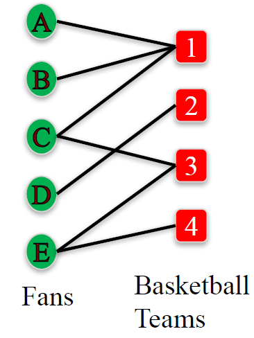
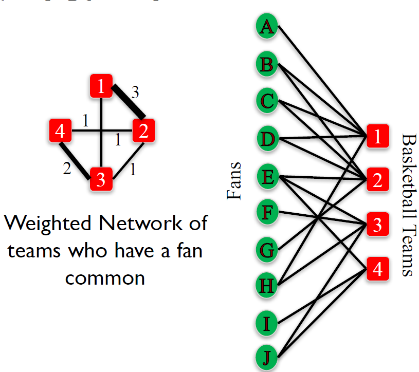

# Module 1: Why Study Networks and Basics on NetworkX

## Learning Objectives

+ Recognize and categorize real world networks.
+ Identify applications and important questions about networks that network science allows us to answer.
+ Determine what type of network is best suited to model real networked data.
+ Construct and manipulate networks of different types using different network classes and node and edge attributes in NetworkX.
+ Define bipartite graphs and describe related algorithms such as graph projections.
+ Manipulate bipartite graphs and related algorithms using NetworkX.


## Course Syllabus

### Prerequisites

In order to be successful in this course, you will need to know how to program in Python. The expectation is that you have completed [Introduction to Data Science in Python](https://www.coursera.org/learn/python-data-analysis), [Applied Plotting](https://www.coursera.org/learn/python-plotting), [Charting & Data Representation in Python](https://www.coursera.org/learn/python-plotting), and [Applied Machine Learning in Python](https://www.coursera.org/learn/python-machine-learning) so that you are familiar with the numpy and pandas Python libraries for data manipulation, matplotlib for plotting, and scikit-learn for machine learning.

### Week by week

__Module One__ introduces you to different types of networks in the real world and why we study them. You will cover the basic elements of networks such as nodes, edges, and attributes and different types of networks such as directed, undirected, weighted, signed, and bipartite. You will also learn how to represent and manipulate networked data using the NetworkX library. The assignment will give you an opportunity to use NetworkX to analyze a networked dataset of employees in a small company, their relationships, and preferences of movies to watch for an upcoming movie night.

In __Module Two__ you will learn about how to analyze the connectivity of a network based on measures of distance, reachability, and redundancy of paths between nodes. This type of analysis will allow you explore the robustness of a network when it is exposed to random or targeted attacks such as the removal of nodes and edges. In the assignment, you will practice using NetworkX to compute measures of connectivity of a network of email communication among the employees of a mid-size manufacturing company.

In __Module Three__ you will explore ways of measuring the importance or centrality of a node in a network. You will cover several different centrality measures including Degree, Closeness, and Betweenness centrality, Page Rank, and Hubs and Authorities. You will learn about the assumptions each measure makes, the algorithms we can use to compute them, and the different functions available on NetworkX to measure centrality. You will also compare the ranking of nodes by centrality produced by the different measures. In the assignment, you will practice choosing the most appropriate centrality measure on a real-world setting, where you are tasked with choosing a person from a social network who should be given a promotional voucher in order to maximize the impact of the promotion on the network.

In __Module Four__ you will explore the evolution of networks over time. You will learn about different models that generate networks with realistic features such as the Preferential Attachment Model and Small World Networks. You will also explore the link prediction problem, where you will learn useful features that can predict whether a pair of disconnected nodes will be connected in the future. In the assignment, you will be challenged to identify which model generated a given network. Additionally, you will have the opportunity to combine different concepts of the course by predicting the salary, position, and future connections of the employees of a company using their logs of email exchanges.

## Enrollment Options

Coursera has made the decision to make Specializations available by monthly subscription. This means you can choose to pay a monthly fee to access all of the courses in a specific Specialization. Coursera's switch to monthly subscriptions comes with another change -- for those learners who choose the “Audit Only” enrollment, you will no longer be able to submit assignments for grades nor see answers for those assignments. You will still have access to all the course materials but you will not be graded on your work, nor see answers to graded assignments. For further information on the different enrollment options for Coursera courses, please visit the [Enrollment Options ](https://learner.coursera.help/hc/en-us/articles/209818613-Enrollment-options) page. If you have feedback about the enrollment options shared on the Enrollment Options page, you can share your thoughts with Coursera in this [survey](https://www.surveymonkey.com/r/65DPLHG).

## Grading and Assignments

The lectures will provide you with some guidance for completing assignments, but you will need to take initiative and look beyond assignment instructions in order to be successful. You'll need to know how to ask questions in the discussion forums of your peers, and seek out new information through web searches and [Stack Overflow](http://stackoverflow.com/questions/tagged/matplotlib). Be sure to also check out the [Additional Resources](https://www.coursera.org/learn/python-social-network-analysis/resources/iZUox). If you are not sure what kind of output is required, or think there is a need for more clarity, please head to the course discussion forums. Note that some assignments and in video quizzes may not be mobile friendly.

| Course Item | Percentage of Final Grade | Passing Grade |
|:------------|:-------------------------:|:-------------:|
| Week 1 Quiz | 5% | 80% |
| Week 1 Notebook Assignment | 18% | 80% |
| Week 2 Quiz | 5% | 80% |
| Week 2 Notebook Assignment | 18% | 80% |
| Week 3 Quiz | 5% | 80% |
| Week 3 Notebook Assignment | 18% | 80% |
| Week 4 Quiz | 5% | 80% |
| Week 4 Notebook Assignment | 26% | 80% |


### Code of Conduct

Visit [Coursera's Code of Conduct](https://learner.coursera.help/hc/en-us/articles/208280036-Coursera-Code-of-Conduct) and to abide by guidelines there. It is important when giving feedback to your peers to be polite and to be sensitive to the diversity of cultures and backgrounds of learners in your course.

## Working Offline

While the Coursera platform has an integrated Jupyter Notebook system, you can work offline on your own computer by installing Python 3.5+ and the Jupyter software packages. For more details, consult the [Jupyter Notebook FAQ](https://www.coursera.org/learn/python-social-network-analysis/resources/yPcBs).

### Accessibility

We strive to develop fully accessible courses. Occasionally, some of our content does not fully meet our accessibility goals. Please use [this form](https://goo.gl/forms/XqKzVUMTn62yrarU2) to inform us of any accessibility issues you are experiencing in this course.

### Help!

If you're having problems, here are a couple of great places to go for help: If the problem is with the Coursera platform such as verification on assignments, in video quiz problems, or the Jupyter Notebooks, please check out the [Coursera Learner Support Forums](https://learner.coursera.help/hc/en-us/requests). If the problem deals with understanding the assignment or how to use the Jupyter Notebooks, please read our Jupyter Notebook FAQ page in the course resources If you have questions with the content of the course, or questions about programming in python or with the toolkits described, you can contact your peers and the course instructors in the discussion forums, or go to [Stack Overflow](http://stackoverflow.com/questions/tagged/matplotlib). Having trouble accessing your previously submitted assignments? If your session has ended, you can access these again by selecting the "Switch Session" option. Details for how to select this can be found in this [learner help center article](https://learner.coursera.help/hc/en-us/articles/208279776-Switch-to-a-different-session). If you still have issues accessing your materials after switching sessions, please reach out to Coursera learner support via our online chat forums in the [Learner Help Center](https://learner.coursera.help/hc/en-us).

### In-Video Questions (IVQs)

In this course, in-video questions or IVQs may appear during lectures to help you learn as well as assess your understanding of the content. IVQs are optional and do not count towards your overall course grade.

#### Types of in-video questions

Many of the lectures contain in-video questions (IVQs). These questions are presented in a variety of formats. Some will ask you to write or think about a concept from the video. Others will ask for a short answer. Still others may ask you to choose from a multiple-choice list of answers. If an IVQ is a survey or a poll, you will see a summary of responses from other learners after you respond. You can look at the question again later to see new summary data as more of your peers answer. Some IVQs also contain runnable code blocks. These IVQs allow you to practice the coding concepts during the lecture. In this course, these types of IVQs will usually be directly followed with the solution code.


## Help us learn more about you!

As part of getting to know you better, your backgrounds, your interest in this specific course and in digital education in general, we at the University of Michigan have crafted a survey that should only take a few minutes to complete. Our goal is to keep our communication with you focused on learning and staying in touch, but we believe that both this and an end-of-course survey are important to our mutual educational goals.

[Take the survey](https://umich.qualtrics.com/SE/?SID=SV_735AxMay2FSApSZ&redirect=SV_9ukuaMa1VKYV9C5&phoenix_global_user_id=%GLOBAL_USER_ID:2013-may-demographics%&phoenix_session_user_id=4f54f67ce5254893536041565df2887d6826c536&name=H.-M.%20Fred%20Chen&platform_id=coursera_phoenix&course_id=python-social-network-analysis)

The link will open in this same window for the purposes of making it accessible to screen readers and other assistive devices. You may need to manually navigate back to the course afterwards. Thank you for participating!

## Additional Resources

+ Dr Chuck Severance's Coursera Specialization, [Python for Everybody](https://www.coursera.org/specializations/python)
+ [Python Docs](https://docs.python.org/3/) (for general Python documentation)
+ [Python Classes Docs](https://docs.python.org/3.5/tutorial/classes.html)
+ [Scipy](http://scipy.org/) (for [IPython](http://ipython.org/), [Numpy](http://www.numpy.org/), [Pandas](http://pandas.pydata.org/), and [Matplotlib](http://matplotlib.org/))
+ [scitkit-learn Docs](http://scikit-learn.org/stable/documentation.html)
+ [scikit-learn Cheat Sheet](https://s3.amazonaws.com/assets.datacamp.com/blog_assets/Scikit_Learn_Cheat_Sheet_Python.pdf)
+ [NetworkX Documentation](https://networkx.readthedocs.io/en/stable/)
+ Don't forget to check [Stack Overflow](https://stackoverflow.com/questions) and [Cross Validated](https://stats.stackexchange.com/)!


## Networks: Definition and Why We Study Them

### Lecture Note

+ Networks
    + Networks: A set of objects (nodes) with interconnections (edges).
    + Why study networks? <br/>
        <b style="color:red">Because they are everywhere!</b>

+ Social Networks
    + Friendship network in a 34-person karate club [Zachary 1977]
    + E-mail communication network among 436 HP employees [Adamic & Adar 2005]
    + Network of friendship, marital tie, and family tie among 2200 people [Christakis & Fowler 2007]
    <a href="https://harangdev.github.io/applied-data-science-with-python/applied-social-network-analysis-in-python/1/"> <br/>
        
    </a>

+ Transportation and Mobility Networks
    + Network of direct flights around the world [Bio.Diaspora]
    + Human mobility network based on location of dollar bills (Where's George) [Thiemann et al. 2010]
    + Ann Arbor bus transportation network
    <a href="https://harangdev.github.io/applied-data-science-with-python/applied-social-network-analysis-in-python/1/"> <br/>
        
    </a>

+ Information Networks
    + Communication between left-wing and rightwing political blogs [Adamic & Glance 2005]
    + Internet Connectivity [K. C. Claffy]
    + Network of Wikipedia articles about climate change [EMAPS]
    <a href="https://harangdev.github.io/applied-data-science-with-python/applied-social-network-analysis-in-python/1/"> <br/>
        
    </a>

+ Biological Networks
    + Protein-protein interactions [Jeong et al. 2001]
    + Chesapeake Bay Waterbird Food Web [Perry et al. 2005]
    <a href="https://harangdev.github.io/applied-data-science-with-python/applied-social-network-analysis-in-python/1/"> <br/>
        
    </a>

+ And More…
    + Financial networks
    + Co-authorship networks
    + Trade networks
    + Citation networks

+ Networks Applications
    + <b style="color:darkred">Networks are everywhere, but what can we do with them?</b>
    + E-mail communication network among 436 HP employees
        <a href="https://courses.cit.cornell.edu/info2040_2010fa/"> <br/>
            
        </a>
        + Is a rumor likely to spread in this network?
        + Who are the most influential people in this organization?
    + Friendship network in a 34-person karate club
        <a href="https://anthonybonato.com/2016/04/13/the-mathematics-of-game-of-thrones/"> <br/>
            
        </a>
        + Is this club, likely to split into two groups?
        + If so, which nodes will go to which group?
    + Network of direct flights around the world
        <a href="http://www.visualisingdata.com/2012/02/bio-diaspora-visualising-interactions-between-populations-and-travel/"> <br/>
            
        </a>

+ Summary
    + Many complex structures can be modeled by networks.
    + Studying the structure of a network can allows us to answer questions about complex phenomena.
    + In this course, we will explore different network techniques to study the structure of social networks.


### Lecture Video

<a href="https://d3c33hcgiwev3.cloudfront.net/Vxfw6nw_Eeeybwpoukrg-A.processed/full/360p/index.mp4?Expires=1548720000&Signature=XywFBC6yEKMYXbVv-ZOPC7wENLPvbfs9HhLvHq~K5HBABn~Dg02rqNM988XsA8GAOQD6vLnY4feGCdx84dYvK5cnS0bslaNCuBxWkHZv6DrdcyqQjVE0dl5D4PlRSc07VSOwcMSlrAa6CLYFanIN-QX3eEwuRA6Jd82uAF~frIA_&Key-Pair-Id=APKAJLTNE6QMUY6HBC5A" alt="Networks: Definition and Why We Study Them" target="_blank">
     
</a>


## Network Definition and Vocabulary

### Lecture Note

+ Network Definition and Vocabulary
    + Network (or Graph): A representation of connections among a set of items.
        + Items are called __nodes__ (or _vertices_)
        + Connections are called __edges__ (or _link_ or _ties_)
        ```python
        import networkx as nx

        G=nx.Graph()
        G.add_edge('A','B')
        G.add_edge('B','C')
        ```
        <a href="https://harangdev.github.io/applied-data-science-with-python/applied-social-network-analysis-in-python/1/"> 
            
        </a>

+ Example
    + Network of friendship, marital tie, and family tie among 2200 people
        + __Nodes__: People
        + __Edges__: Friendship, marital, or family ties
        + (Mostly) __Symmetric relationships__
        <a href="https://www.nejm.org/doi/full/10.1056/NEJMsa066082"> <br/>
            
        </a>
    + Chesapeake Bay Water bird Food Web
        + __Nodes__: Birds
        + __Edges__: What eats what
        + __Asymmetric relationships__
        <a href="https://www.usgs.gov/media/images/chesapeake-bay-waterbird-food-web-illustration-circular-1316"> <br/>
            
        </a>

+ Edge Direction
    + __Undirected network__: edges have no direction
        ```python
        G=nx.Graph()
        G.add_edge('A','B')
        G.add_edge('B','C')
        ```
    + __Directed network__: edges have direction
        ```python
        G=nx.DiGraph()
        G.add_edge('B', 'A')
        G.add_edge('B','C')
        ```

+ Weighted Networks
    + Not all relationships are equal.
    + Some edges carry higher weight than others.
    + Eg: Number of times coworkers had lunch together in one year
    + __Weighted network__: a network where are assigned a (typically numerical) weight.
        ```python
        G=nx.Graph()
        G.add_edge('A','B', weight = 6)
        G.add_edge('B','C', weight = 13)
        ```

+ Signed Networks
    + Some networks can carry information about friendship and antagonism based on conflict or disagreement.
    + Eg: In Epinions and Slashdot people can declare friends and foes.
    + __Signed network__: a network where edges are assigned positive or negative sign.
        ```python
        G=nx.Graph()
        G.add_edge('A','B', sign= '+')
        G.add_edge('B','C', sign= '-')
        ```

+ Other Edge Attributes
    + Edges can carry many other labels or attributes
    ```python
    G=nx.Graph()
    G.add_edge('A','B', relation= 'friend')
    G.add_edge('B','C', relation= 'coworker')
    G.add_edge('D','E', relation= 'family')
    G.add_edge('E','I', relation= 'neighbor')
    ```

+ Mutigraphs
    + A pair of nodes can have different types of relationships simultaneously
    + Multigraph: A network where multiple edges can connect the same nodes (parallel edges).
        ```python
        G=nx.MultiGraph()
        G.add_edge('A','B', relation= 'friend')
        G.add_edge('A','B', relation= 'neighbor')
        G.add_edge('G','F', relation= 'family')
        G.add_edge('G','F', relation= 'coworker')
        ```

+ __Lecture Quiz__: We would like to construct a graph on NetworkX, where the nodes represent employees of a company and the edges represent the number of times an employee sent an email to another employee. What would be the best way to represent this network?
    ```
    a. Directed graph
    b. Undirected graph
    c. Weighted, directed graph
    d. Weighted, undirected graph
    e. Weighted multigraph

    Ans: c 
    Since we want to capture who sent the email and who received it, we need a directed graph. Since we also want to capture the number of times an employee emailed another, we want the edges to have weights, hence we want to use a weighted, directed graph.
    ```

+ Summary
    <a href="https://harangdev.github.io/applied-data-science-with-python/applied-social-network-analysis-in-python/1/"> <br/>
        
    </a>


### Lecture Video

<a href="https://d3c33hcgiwev3.cloudfront.net/KVAnNZTLEeeOmgqEJWRlfA.processed/full/360p/index.mp4?Expires=1548720000&Signature=J5Sr9blGwEfWBbkNgYEYoPokhrpQE2ulvGYTSffirjefoYloIc~IwWXmqMBABZWzUI1bQ8qSMrgznQSnjTcaDm5jHguKzG3NKzNZWO31G~jP1X~4UU3euxOfiCCL7Ma~2OjUKC1BWQwEHf9SztL67eyTmlAsKTs-Q94sbFvA0c0_&Key-Pair-Id=APKAJLTNE6QMUY6HBC5A" alt="Network Definition and Vocabulary" target="_blank">
     
</a>


## Node and Edge Attributes

### Lecture Note

+ Edge Attributes in NetworkX
    + Number of times coworkers had lunch together in one 
    + Undirected network
    <a href="https://www.coursera.org/learn/python-social-network-analysis/lecture/hTKct/node-and-edge-attributes"> <br/>
        
    </a>
        ```python
        G=nx.Graph()
        G.add_edge('A','B', weight= 6, relation = 'family')
        G.add_edge('B','C', weight= 13, relation = 'friend')

        G.edges() #list of all edges
        # [('A', 'B'), ('C', 'B')]

        G.edges(data= True) #list of all edges with attributes
        # [('A', 'B', {'relation': 'family', 'weight': 6}), ('C', 'B', {'relation': 'friend', 'weight': 13})]

        G.edges(data= 'relation') #list of all edges with attribute ‘relation'
        # [('A', 'B', 'family'), ('C', 'B', 'friend')]

        # Accessing attributes of a specific edge:
        G.edge['A']['B'] # dictionary of attributes of edge (A, B)
        # {'relation': 'family', 'weight': 6}
        G.edge['B']['C']['weight']
        # 13
        G.edge['C']['B']['weight'] # undirected graph, order does not matter
        # 13
        ```
    + Directed, weighted network:
    <a href="https://www.coursera.org/learn/python-social-network-analysis/lecture/hTKct/node-and-edge-attributes"> <br/>
        
    </a>
        ```python
        G=nx.DiGraph()
        G.add_edge('A','B', weight= 6, relation = 'family')
        G.add_edge('C', 'B', weight= 13, relation = 'friend')
        
        # Accessing edge attributes:
        G.edge['C']['B']['weight']
        # 13

        G.edge['B']['C']['weight'] # directed graph, order matters
        # KeyError: 'C'
        ```
    + MultiGraph:
    <a href="https://www.coursera.org/learn/python-social-network-analysis/lecture/hTKct/node-and-edge-attributes"> <br/>
        
    </a>
        ```python
        G=nx.MultiGraph()
        G.add_edge('A','B', weight= 6, relation = 'family')
        G.add_edge('A','B', weight= 18, relation = 'friend')
        G.add_edge('C','B', weight= 13, relation = 'friend')
        
        # Accessing edge attributes:
        G.edge['A']['B'] # One dictionary of attributes per (A,B) edge
        # {0: {'relation': 'family', 'weight': 6}, 1: {'relation': 'friend', 'weight': 18}}
        
        G.edge['A']['B'][0]['weight'] # undirected graph, order does not matter
        # 6
        ```
    + Directed MultiGraph:
    <a href="https://www.coursera.org/learn/python-social-network-analysis/lecture/hTKct/node-and-edge-attributes"> <br/>
        
    </a>
        ```python
        G=nx.MultiDiGraph()
        G.add_edge('A','B', weight= 6, relation = 'family')
        G.add_edge('A','B', weight= 18, relation = 'friend')
        G.add_edge('C','B', weight= 13, relation = 'friend')

        # Accessing edge attributes:
        G.edge['A']['B'][0]['weight']
        # 6
        
        G.edge['B']['A'][0]['weight'] # directed graph, order matters
        # KeyError: 'A'
        ```
    + Lecture Quiz: What would be the output of the following code?
        ```python
        import networkx as nx

        G=nx.MultiDiGraph()

        G.add_edge('John', 'Ana', weight= 3, relation = 'siblings')
        G.add_edge('Ana', 'David', weight= 4, relation = 'cousins')
        G.add_edge('Ana', 'Bob', weight= 1, relation = 'friends')
        G.add_edge('Ana', 'Bob', weight= 1, relation = 'neighbors')

        print( G.edge['Bob']['Ana'][1]['relation'] )
        ```
        ```
        a. 'friends'
        b. KeyError: 'Ana'
        c. Correct
        d. 'neighbors'

        Ans: b
        G is a directed graph and while the edge (‘Ana’, ‘Bob’’) is in the network, the edge (‘Bob’, ‘Ana’) is not. Hence, the output will be an error.
        ```
    + Undirected Multigraph
    <a href="https://www.coursera.org/learn/python-social-network-analysis/lecture/hTKct/node-and-edge-attributes"> <br/>
        
    </a>
        ```python
        G=nx.Graph()
        G.add_edge('A','B', weight= 6, relation = 'family')
        G.add_edge('B','C', weight= 13, relation = 'friend')

        # Adding node attributes:
        G.add_node('A', role = 'trader')
        G.add_node('B', role = 'trader')
        G.add_node('C', role = 'manager')

        # Accessing node attributes:
        G.nodes() # list of all nodes
        # ['A', 'C', 'B']

        G.nodes(data= True) #list of all nodes with attributes
        # [('A', {'role': 'trader'}), ('C', {'role': 'manager'}) , ('B', {'role': 'trader'})]

        G.node['A']['role']
        # 'manager'
        ```

+ Summary
    ```python
    # Adding node and edge attributes:
    G=nx.Graph()
    G.add_edge('A','B', weight= 6, relation = 'family')
    G.add_node('A', role = 'trader')

    # Accessing node attributes:
    G.nodes(data= True) #list of all nodes with attributes
    G.node['A']['role'] #role of node A

    # Accessing Edge attributes:
    G.edges(data= True) #list of all edges with attributes
    G.edges(data= ‘relation’) #list of all edges with attribute ‘relation’
    G.edge['A']['B']['weight'] # weight of edge (A,B)
    ```

### Lecture Video

<a href="https://d3c33hcgiwev3.cloudfront.net/DKgHw5TLEeeClxLmJhEfgA.processed/full/360p/index.mp4?Expires=1548720000&Signature=TuR6UldQsef~Lo5-Tw0C~-AA4wElpS-pgCtQsTP7MChjRHJZ9lDjTMS3L2l8j5dtrr1aBX72Hf3ASP4Wrz3z8gi5TfJp1IzNDuv7ITDhCQhaz0WucGEy4ffQWeCFYVfz98k3nztw9R7omZJ2uSAgXy3YYlQJA3L0egVTn7t8AYA_&Key-Pair-Id=APKAJLTNE6QMUY6HBC5A" alt="Node and Edge Attributes" target="_blank">
     
</a>


## Bipartite Graphs

### Lecture Note

+ Bipartite Graphs
    + __Bipartite Graph__: a graph whose nodes can be split into two sets L and R and every edge connects an node in L with a node in R.
        ```python
        from networkx.algorithms import bipartite

        B = nx.Graph() # No separate class for bipartite graphs
        B.add_nodes_from(['A’,'B','C','D', 'E'], bipartite=0) #label one set of nodes 0
        B.add_nodes_from([1,2,3,4], bipartite=1) # label other set of nodes 1
        B.add_edges_from([('A',1), ('B',1), ('C',1), ('C',3), ('D',2), ('E',3), ('E', 4)])

        # Checking if a graph is bipartite:
        bipartite.is_bipartite(B) # Check if B is bipartite
        # True

        B.add_edge('A', 'B')
        bipartite.is_bipartite(B) # False

        B.remove_edge('A', 'B')

        # Checking if a set of nodes is a bipartition of a graph:
        X = set([1,2,3,4])
        bipartite.is_bipartite_node_set(B,X) # True

        X = set(['A', 'B', 'C', 'D', 'E'])
        bipartite.is_bipartite_node_set(B,X) # True

        X = set([1,2,3,4, ‘A’])
        bipartite.is_bipartite_node_set(B,X) # False

        # Getting each set of nodes of a bipartite graph:
        bipartite.sets(B) # ({'A', 'B', 'C', 'D', 'E'}, {1, 2, 3, 4})

        B.add_edge('A', 'B')
        bipartite.sets(B) # NetworkXError: Graph is not bipartite.

        B.remove_edge('A', 'B')
        ```
        <a href="https://harangdev.github.io/applied-data-science-with-python/applied-social-network-analysis-in-python/1/">
            
        </a>
        <a href="https://www.coursera.org/learn/python-social-network-analysis/lecture/tWwx2/bipartite-graphs">
            
        </a>

+ Projected Graphs
    + __L-Bipartite graph projection__: Network of nodes in group L, where a pair of nodes is connected if they have a common neighbor in R in the bipartite graph.
    + Similar definition for R-Bipartite graph projection
        ```python
        B = nx.Graph()
        B.add_edges_from([('A',1), ('B',1),('C',1),('D',1),('H',1), ('B', 2), ('C', 2), ('D',2),('E', 2), ('G', 2), ('E', 3), ('F', 3), ('H', 3), ('J', 3), ('E', 4), ('I', 4), ('J', 4) ])

        X = set(['A','B','C','D', 'E', 'F','G', 'H', 'I','J'])
        P = bipartite.projected_graph(B, X)
        nx.draw_networkx(P)
        ```
        <a href="https://harangdev.github.io/applied-data-science-with-python/applied-social-network-analysis-in-python/1/">
            
            
        </a>
    + __L-Bipartite weighted graph projection__: An LBipartite graph projection with weights on the edges that are proportional to the number of common neighbors between the nodes.
        <a href="https://harangdev.github.io/applied-data-science-with-python/applied-social-network-analysis-in-python/1/"> <br/>
            
        </a>
        ```python
        X = set([1,2,3,4])
        P = bipartite.weighted_projected_graph(B, X)
        ```
    
+ Summary
    + No separate class for bipartite graphs in NetworkX
    + Use Graph(), DiGraph(), MultiGraph(), etc.
    + Use from networkx.algorithms import bipartite for bipartite related algorithms (Many algorithms only work on Graph()).
    ```python
    nx.bipartite.is_bipartite(B) # Check if B is bipartite
    bipartite.is_bipartite_node_set(B,X) # Check if node set X is a bipartition
    bipartite.sets(B) # Get each set of nodes of bipartite graph B
    bipartite.projected_graph(B, X) # Get the bipartite projection of node set X
    bipartite.weighted_projected_graph(B, X) # Get the weighted bipartite projection of node set X
    ```


### Lecture Video

<a href="https://d3c33hcgiwev3.cloudfront.net/A_CWc5TLEeeOmgqEJWRlfA.processed/full/360p/index.mp4?Expires=1548720000&Signature=f2Lgob2QaiIgICLpK9IsCAGnC2OmHzY5p8TvmM1jVPw3C6tEj69jt9e4DjPvZjMysV846o~H5xi7dsv~tiCPSkZL4MwKgfJdK8NJ1KpbXqnD8pyqo4088ioES3SbdtqmidE6fnMB-BnAbzPor0Mitln4fOKAyLO8zz6lf2fJkfE_&Key-Pair-Id=APKAJLTNE6QMUY6HBC5A" alt="Bipartite Graphs" target="_blank">
     
</a>


## Notice for Auditing Learners: Assignment Submission

### Lecture Note


+ Demonstration
    ```python


    ```

### Lecture Video

<a href="url" alt="text" target="_blank">
     
</a>


## Notebook: Loading Graphs in NetworkX

### Lecture Note


+ Demonstration
    ```python


    ```

### Lecture Video

<a href="url" alt="text" target="_blank">
     
</a>


## TA Demonstration: Loading Graphs in NetworkX

### Lecture Note


+ Demonstration
    ```python


    ```

### Lecture Video

<a href="url" alt="text" target="_blank">
     
</a>


