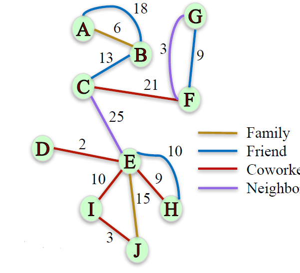
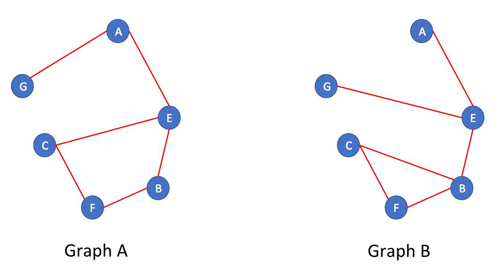

# Module 1: Why Study Networks and Basics on NetworkX

## Learning Objectives

+ Recognize and categorize real world networks.
+ Identify applications and important questions about networks that network science allows us to answer.
+ Determine what type of network is best suited to model real networked data.
+ Construct and manipulate networks of different types using different network classes and node and edge attributes in NetworkX.
+ Define bipartite graphs and describe related algorithms such as graph projections.
+ Manipulate bipartite graphs and related algorithms using NetworkX.


## Course Syllabus

### Prerequisites

In order to be successful in this course, you will need to know how to program in Python. The expectation is that you have completed [Introduction to Data Science in Python](https://www.coursera.org/learn/python-data-analysis), [Applied Plotting](https://www.coursera.org/learn/python-plotting), [Charting & Data Representation in Python](https://www.coursera.org/learn/python-plotting), and [Applied Machine Learning in Python](https://www.coursera.org/learn/python-machine-learning) so that you are familiar with the numpy and pandas Python libraries for data manipulation, matplotlib for plotting, and scikit-learn for machine learning.

### Week by week

__Module One__ introduces you to different types of networks in the real world and why we study them. You will cover the basic elements of networks such as nodes, edges, and attributes and different types of networks such as directed, undirected, weighted, signed, and bipartite. You will also learn how to represent and manipulate networked data using the NetworkX library. The assignment will give you an opportunity to use NetworkX to analyze a networked dataset of employees in a small company, their relationships, and preferences of movies to watch for an upcoming movie night.

In __Module Two__ you will learn about how to analyze the connectivity of a network based on measures of distance, reachability, and redundancy of paths between nodes. This type of analysis will allow you explore the robustness of a network when it is exposed to random or targeted attacks such as the removal of nodes and edges. In the assignment, you will practice using NetworkX to compute measures of connectivity of a network of email communication among the employees of a mid-size manufacturing company.

In __Module Three__ you will explore ways of measuring the importance or centrality of a node in a network. You will cover several different centrality measures including Degree, Closeness, and Betweenness centrality, Page Rank, and Hubs and Authorities. You will learn about the assumptions each measure makes, the algorithms we can use to compute them, and the different functions available on NetworkX to measure centrality. You will also compare the ranking of nodes by centrality produced by the different measures. In the assignment, you will practice choosing the most appropriate centrality measure on a real-world setting, where you are tasked with choosing a person from a social network who should be given a promotional voucher in order to maximize the impact of the promotion on the network.

In __Module Four__ you will explore the evolution of networks over time. You will learn about different models that generate networks with realistic features such as the Preferential Attachment Model and Small World Networks. You will also explore the link prediction problem, where you will learn useful features that can predict whether a pair of disconnected nodes will be connected in the future. In the assignment, you will be challenged to identify which model generated a given network. Additionally, you will have the opportunity to combine different concepts of the course by predicting the salary, position, and future connections of the employees of a company using their logs of email exchanges.

## Enrollment Options

Coursera has made the decision to make Specializations available by monthly subscription. This means you can choose to pay a monthly fee to access all of the courses in a specific Specialization. Coursera's switch to monthly subscriptions comes with another change -- for those learners who choose the “Audit Only” enrollment, you will no longer be able to submit assignments for grades nor see answers for those assignments. You will still have access to all the course materials but you will not be graded on your work, nor see answers to graded assignments. For further information on the different enrollment options for Coursera courses, please visit the [Enrollment Options ](https://learner.coursera.help/hc/en-us/articles/209818613-Enrollment-options) page. If you have feedback about the enrollment options shared on the Enrollment Options page, you can share your thoughts with Coursera in this [survey](https://www.surveymonkey.com/r/65DPLHG).

## Grading and Assignments

The lectures will provide you with some guidance for completing assignments, but you will need to take initiative and look beyond assignment instructions in order to be successful. You'll need to know how to ask questions in the discussion forums of your peers, and seek out new information through web searches and [Stack Overflow](http://stackoverflow.com/questions/tagged/matplotlib). Be sure to also check out the [Additional Resources](https://www.coursera.org/learn/python-social-network-analysis/resources/iZUox). If you are not sure what kind of output is required, or think there is a need for more clarity, please head to the course discussion forums. Note that some assignments and in video quizzes may not be mobile friendly.

| Course Item | Percentage of Final Grade | Passing Grade |
|:------------|:-------------------------:|:-------------:|
| Week 1 Quiz | 5% | 80% |
| Week 1 Notebook Assignment | 18% | 80% |
| Week 2 Quiz | 5% | 80% |
| Week 2 Notebook Assignment | 18% | 80% |
| Week 3 Quiz | 5% | 80% |
| Week 3 Notebook Assignment | 18% | 80% |
| Week 4 Quiz | 5% | 80% |
| Week 4 Notebook Assignment | 26% | 80% |


### Code of Conduct

Visit [Coursera's Code of Conduct](https://learner.coursera.help/hc/en-us/articles/208280036-Coursera-Code-of-Conduct) and to abide by guidelines there. It is important when giving feedback to your peers to be polite and to be sensitive to the diversity of cultures and backgrounds of learners in your course.

## Working Offline

While the Coursera platform has an integrated Jupyter Notebook system, you can work offline on your own computer by installing Python 3.5+ and the Jupyter software packages. For more details, consult the [Jupyter Notebook FAQ](https://www.coursera.org/learn/python-social-network-analysis/resources/yPcBs).

### Accessibility

We strive to develop fully accessible courses. Occasionally, some of our content does not fully meet our accessibility goals. Please use [this form](https://goo.gl/forms/XqKzVUMTn62yrarU2) to inform us of any accessibility issues you are experiencing in this course.

### Help!

If you're having problems, here are a couple of great places to go for help: If the problem is with the Coursera platform such as verification on assignments, in video quiz problems, or the Jupyter Notebooks, please check out the [Coursera Learner Support Forums](https://learner.coursera.help/hc/en-us/requests). If the problem deals with understanding the assignment or how to use the Jupyter Notebooks, please read our Jupyter Notebook FAQ page in the course resources If you have questions with the content of the course, or questions about programming in python or with the toolkits described, you can contact your peers and the course instructors in the discussion forums, or go to [Stack Overflow](http://stackoverflow.com/questions/tagged/matplotlib). Having trouble accessing your previously submitted assignments? If your session has ended, you can access these again by selecting the "Switch Session" option. Details for how to select this can be found in this [learner help center article](https://learner.coursera.help/hc/en-us/articles/208279776-Switch-to-a-different-session). If you still have issues accessing your materials after switching sessions, please reach out to Coursera learner support via our online chat forums in the [Learner Help Center](https://learner.coursera.help/hc/en-us).

### In-Video Questions (IVQs)

In this course, in-video questions or IVQs may appear during lectures to help you learn as well as assess your understanding of the content. IVQs are optional and do not count towards your overall course grade.

#### Types of in-video questions

Many of the lectures contain in-video questions (IVQs). These questions are presented in a variety of formats. Some will ask you to write or think about a concept from the video. Others will ask for a short answer. Still others may ask you to choose from a multiple-choice list of answers. If an IVQ is a survey or a poll, you will see a summary of responses from other learners after you respond. You can look at the question again later to see new summary data as more of your peers answer. Some IVQs also contain runnable code blocks. These IVQs allow you to practice the coding concepts during the lecture. In this course, these types of IVQs will usually be directly followed with the solution code.


## Help us learn more about you!

As part of getting to know you better, your backgrounds, your interest in this specific course and in digital education in general, we at the University of Michigan have crafted a survey that should only take a few minutes to complete. Our goal is to keep our communication with you focused on learning and staying in touch, but we believe that both this and an end-of-course survey are important to our mutual educational goals.

[Take the survey](https://umich.qualtrics.com/SE/?SID=SV_735AxMay2FSApSZ&redirect=SV_9ukuaMa1VKYV9C5&phoenix_global_user_id=%GLOBAL_USER_ID:2013-may-demographics%&phoenix_session_user_id=4f54f67ce5254893536041565df2887d6826c536&name=H.-M.%20Fred%20Chen&platform_id=coursera_phoenix&course_id=python-social-network-analysis)

The link will open in this same window for the purposes of making it accessible to screen readers and other assistive devices. You may need to manually navigate back to the course afterwards. Thank you for participating!

## Additional Resources

+ Dr Chuck Severance's Coursera Specialization, [Python for Everybody](https://www.coursera.org/specializations/python)
+ [Python Docs](https://docs.python.org/3/) (for general Python documentation)
+ [Python Classes Docs](https://docs.python.org/3.5/tutorial/classes.html)
+ [Scipy](http://scipy.org/) (for [IPython](http://ipython.org/), [Numpy](http://www.numpy.org/), [Pandas](http://pandas.pydata.org/), and [Matplotlib](http://matplotlib.org/))
+ [scitkit-learn Docs](http://scikit-learn.org/stable/documentation.html)
+ [scikit-learn Cheat Sheet](https://s3.amazonaws.com/assets.datacamp.com/blog_assets/Scikit_Learn_Cheat_Sheet_Python.pdf)
+ [NetworkX Documentation](https://networkx.readthedocs.io/en/stable/)
+ Don't forget to check [Stack Overflow](https://stackoverflow.com/questions) and [Cross Validated](https://stats.stackexchange.com/)!


## Jupyter Notebook FAQ

### Updates

From time to time, updates have been made to some notebooks to clarify questions or fix technical issues.

To check that you have the most recent version of course notebooks and files, here are the most recent updates with version number (shown in bold in the first line of each notebook)

| Notebook | Version | Last updated |
|----------|---------|--------------|
| Assignment 1 | 1.1 | August 28, 2017 |
| Assignment 2 | 1.2 | September 19, 2017 |
| Assignment 3 | 1.2 | September 19, 2017 |
| Assignment 4 | 1.2 | Oct 23, 2017 |


### Current Questions

1. Which version of python is this course in? What are the required libraries?
1. How do I download and install the Jupyter Notebook system for offline use?
1. How do I submit an assignment for grading using the Coursera platform?
1. How do I download notebooks and data files?
1. How can I upload an assignment created offline for grading?
1. How do I reset my notebook?
1. Why are my assignment submissions "unverified"?


### Current Answers

1. Which version of python is this course in?

    This course is in python 3. The main libraries we are using in this course are:

    *Note: Make sure you are using NetworkX 1.11 for this course now. The latest version NetworkX 2.0 was released recently, and we are still working on reviewing and updating our course materials to migrate to the latest version now. To install or degrade to v1.11, the following command may be helpful: `pip install networkx==1.11`.

    | Library name | Minimum version |
    |--------------|-----------------|
    | scikit-learn | 0.18.2 |
    | networkx | 1.11* |
    | scipy | 0.18.1 |
    | numpy | 1.13.1 |
    | pandas | 0.20.3 |
    | matplotlib | 2.0.0 |

2. How do I download and install the Jupyter Notebook system for offline use?

    To install the Jupyter Notebook system on your own machine, we recommend downloading Anaconda. This will allow you to work on any personal data science projects outside of the Coursera Jupyter Notebooks. Anaconda is a distribution containing Python, the Conda package and environment manager, and many software packages for data science. We recommend installing the Python 3 version, as that is the version we will be using in this course. Once Anaconda is downloaded, you can access the Jupyter Notebooks through the Anaconda Navigator. For more information on downloading Anaconda, visit the [Install Documentation](https://docs.continuum.io/anaconda/install).

3. How do I submit an assignment for grading using the Coursera platform?

    To submit an assignment for grading from the Coursera Notebook, press Submit Assignment in the top right corner of the notebook. You can only submit assignments in this way from the Coursera platform.

4. How do I download notebooks and data files?

    You can download all of the data files from [here](https://drive.google.com/file/d/1RJ9MogQYjgxHv7hpcAuU7sJnblVl3FN7/view?usp=sharing). Or, to download the datafiles manually from within the Coursera Jupyter platform, navigate to the file directory by selecting File > Open... Then select the file that you would like to download...
    <a href="https://www.coursera.org/learn/python-social-network-analysis/resources/yPcBs"> <br/>
        
        
    </a>

    And select File > Download.  For notebooks, download them by selecting File > Download as > Notebook (.ipynb).
    <a href="https://www.coursera.org/learn/python-social-network-analysis/resources/yPcBs"> <br/>
        
        
    </a>

5. How can I upload an assignment created offline for grading?

    If you have created a notebook outside of the Coursera Notebook Environment, you can upload it for grading by navigation to Assignment Submission (1), then selecting the My submission tab (2), then pressing + Create Submission (3).
    <a href="https://www.coursera.org/learn/python-social-network-analysis/resources/yPcBs"> <br/>
        
    </a>

6. How do I reset my notebook?

    To clear all the output and saved variables from the notebook, select Kernel > Restart & Clear Output.
    <a href="https://www.coursera.org/learn/python-social-network-analysis/resources/yPcBs"> <br/>
        
    </a>

    If you wish to replace a notebook with a fresh new version, delete the notebook in the directory, then select Control Panelin the top right corner. Then, Next select Stop My Server... and then My Server
    <a href="https://www.coursera.org/learn/python-social-network-analysis/resources/yPcBs"> <br/>
        
        
        
    </a>

    Your directory will be populated with the newest versions of any files you deleted prior to this process.

7. Why are my assignment submissions "unverified"?

    Unfortunately, verification is unavailable for assignments graded in-browser, and in order for your assignment to be verified you will need to download your assignment and upload it the same as you would an assignment notebook created offline.


## Networks: Definition and Why We Study Them

### Lecture Note

+ Networks
    + Networks: A set of objects (nodes) with interconnections (edges).
    + Why study networks? <br/>
        <b style="color:red">Because they are everywhere!</b>

+ Social Networks
    + Friendship network in a 34-person karate club [Zachary 1977]
    + E-mail communication network among 436 HP employees [Adamic & Adar 2005]
    + Network of friendship, marital tie, and family tie among 2200 people [Christakis & Fowler 2007]
    <a href="https://harangdev.github.io/applied-data-science-with-python/applied-social-network-analysis-in-python/1/"> <br/>
        
    </a>

+ Transportation and Mobility Networks
    + Network of direct flights around the world [Bio.Diaspora]
    + Human mobility network based on location of dollar bills (Where's George) [Thiemann et al. 2010]
    + Ann Arbor bus transportation network
    <a href="https://harangdev.github.io/applied-data-science-with-python/applied-social-network-analysis-in-python/1/"> <br/>
        
    </a>

+ Information Networks
    + Communication between left-wing and rightwing political blogs [Adamic & Glance 2005]
    + Internet Connectivity [K. C. Claffy]
    + Network of Wikipedia articles about climate change [EMAPS]
    <a href="https://harangdev.github.io/applied-data-science-with-python/applied-social-network-analysis-in-python/1/"> <br/>
        
    </a>

+ Biological Networks
    + Protein-protein interactions [Jeong et al. 2001]
    + Chesapeake Bay Waterbird Food Web [Perry et al. 2005]
    <a href="https://harangdev.github.io/applied-data-science-with-python/applied-social-network-analysis-in-python/1/"> <br/>
        
    </a>

+ And More…
    + Financial networks
    + Co-authorship networks
    + Trade networks
    + Citation networks

+ Networks Applications
    + <b style="color:darkred">Networks are everywhere, but what can we do with them?</b>
    + E-mail communication network among 436 HP employees
        <a href="https://courses.cit.cornell.edu/info2040_2010fa/"> <br/>
            
        </a>
        + Is a rumor likely to spread in this network?
        + Who are the most influential people in this organization?
    + Friendship network in a 34-person karate club
        <a href="https://anthonybonato.com/2016/04/13/the-mathematics-of-game-of-thrones/"> <br/>
            
        </a>
        + Is this club, likely to split into two groups?
        + If so, which nodes will go to which group?
    + Network of direct flights around the world
        <a href="http://www.visualisingdata.com/2012/02/bio-diaspora-visualising-interactions-between-populations-and-travel/"> <br/>
            
        </a>

+ Summary
    + Many complex structures can be modeled by networks.
    + Studying the structure of a network can allows us to answer questions about complex phenomena.
    + In this course, we will explore different network techniques to study the structure of social networks.


### Lecture Video

<a href="https://d3c33hcgiwev3.cloudfront.net/Vxfw6nw_Eeeybwpoukrg-A.processed/full/360p/index.mp4?Expires=1548720000&Signature=XywFBC6yEKMYXbVv-ZOPC7wENLPvbfs9HhLvHq~K5HBABn~Dg02rqNM988XsA8GAOQD6vLnY4feGCdx84dYvK5cnS0bslaNCuBxWkHZv6DrdcyqQjVE0dl5D4PlRSc07VSOwcMSlrAa6CLYFanIN-QX3eEwuRA6Jd82uAF~frIA_&Key-Pair-Id=APKAJLTNE6QMUY6HBC5A" alt="Networks: Definition and Why We Study Them" target="_blank">
     
</a>


## Network Definition and Vocabulary

### Lecture Note

+ Network Definition and Vocabulary
    + Network (or Graph): A representation of connections among a set of items.
        + Items are called __nodes__ (or _vertices_)
        + Connections are called __edges__ (or _link_ or _ties_)
        ```python
        import networkx as nx

        G=nx.Graph()
        G.add_edge('A','B')
        G.add_edge('B','C')
        ```
        <a href="https://harangdev.github.io/applied-data-science-with-python/applied-social-network-analysis-in-python/1/"> 
            
        </a>

+ Example
    + Network of friendship, marital tie, and family tie among 2200 people
        + __Nodes__: People
        + __Edges__: Friendship, marital, or family ties
        + (Mostly) __Symmetric relationships__
        <a href="https://www.nejm.org/doi/full/10.1056/NEJMsa066082"> <br/>
            
        </a>
    + Chesapeake Bay Water bird Food Web
        + __Nodes__: Birds
        + __Edges__: What eats what
        + __Asymmetric relationships__
        <a href="https://www.usgs.gov/media/images/chesapeake-bay-waterbird-food-web-illustration-circular-1316"> <br/>
            
        </a>

+ Edge Direction
    + __Undirected network__: edges have no direction
        ```python
        G=nx.Graph()
        G.add_edge('A','B')
        G.add_edge('B','C')
        ```
    + __Directed network__: edges have direction
        ```python
        G=nx.DiGraph()
        G.add_edge('B', 'A')
        G.add_edge('B','C')
        ```

+ Weighted Networks
    + Not all relationships are equal.
    + Some edges carry higher weight than others.
    + Eg: Number of times coworkers had lunch together in one year
    + __Weighted network__: a network where are assigned a (typically numerical) weight.
        ```python
        G=nx.Graph()
        G.add_edge('A','B', weight = 6)
        G.add_edge('B','C', weight = 13)
        ```

+ Signed Networks
    + Some networks can carry information about friendship and antagonism based on conflict or disagreement.
    + Eg: In Epinions and Slashdot people can declare friends and foes.
    + __Signed network__: a network where edges are assigned positive or negative sign.
        ```python
        G=nx.Graph()
        G.add_edge('A','B', sign= '+')
        G.add_edge('B','C', sign= '-')
        ```

+ Other Edge Attributes
    + Edges can carry many other labels or attributes
    ```python
    G=nx.Graph()
    G.add_edge('A','B', relation= 'friend')
    G.add_edge('B','C', relation= 'coworker')
    G.add_edge('D','E', relation= 'family')
    G.add_edge('E','I', relation= 'neighbor')
    ```

+ Mutigraphs
    + A pair of nodes can have different types of relationships simultaneously
    + Multigraph: A network where multiple edges can connect the same nodes (parallel edges).
        ```python
        G=nx.MultiGraph()
        G.add_edge('A','B', relation= 'friend')
        G.add_edge('A','B', relation= 'neighbor')
        G.add_edge('G','F', relation= 'family')
        G.add_edge('G','F', relation= 'coworker')
        ```

+ __Lecture Quiz__: We would like to construct a graph on NetworkX, where the nodes represent employees of a company and the edges represent the number of times an employee sent an email to another employee. What would be the best way to represent this network?
    ```
    a. Directed graph
    b. Undirected graph
    c. Weighted, directed graph
    d. Weighted, undirected graph
    e. Weighted multigraph

    Ans: c
    Since we want to capture who sent the email and who received it, we need a directed graph. Since we also want to capture the number of times an employee emailed another, we want the edges to have weights, hence we want to use a weighted, directed graph.
    ```

+ Summary
    <a href="https://harangdev.github.io/applied-data-science-with-python/applied-social-network-analysis-in-python/1/"> <br/>
        
    </a>


### Lecture Video

<a href="https://d3c33hcgiwev3.cloudfront.net/KVAnNZTLEeeOmgqEJWRlfA.processed/full/360p/index.mp4?Expires=1548720000&Signature=J5Sr9blGwEfWBbkNgYEYoPokhrpQE2ulvGYTSffirjefoYloIc~IwWXmqMBABZWzUI1bQ8qSMrgznQSnjTcaDm5jHguKzG3NKzNZWO31G~jP1X~4UU3euxOfiCCL7Ma~2OjUKC1BWQwEHf9SztL67eyTmlAsKTs-Q94sbFvA0c0_&Key-Pair-Id=APKAJLTNE6QMUY6HBC5A" alt="Network Definition and Vocabulary" target="_blank">
     
</a>


## Node and Edge Attributes

### Lecture Note

+ Edge Attributes in NetworkX
    + Number of times coworkers had lunch together in one 
    + Undirected network
    <a href="https://www.coursera.org/learn/python-social-network-analysis/lecture/hTKct/node-and-edge-attributes"> <br/>
        
    </a>
        ```python
        G=nx.Graph()
        G.add_edge('A','B', weight= 6, relation = 'family')
        G.add_edge('B','C', weight= 13, relation = 'friend')

        G.edges() #list of all edges
        # [('A', 'B'), ('C', 'B')]

        G.edges(data= True) #list of all edges with attributes
        # [('A', 'B', {'relation': 'family', 'weight': 6}), ('C', 'B', {'relation': 'friend', 'weight': 13})]

        G.edges(data= 'relation') #list of all edges with attribute 'relation'
        # [('A', 'B', 'family'), ('C', 'B', 'friend')]

        # Accessing attributes of a specific edge:
        G.edge['A']['B'] # dictionary of attributes of edge (A, B)
        # {'relation': 'family', 'weight': 6}
        G.edge['B']['C']['weight']
        # 13
        G.edge['C']['B']['weight'] # undirected graph, order does not matter
        # 13
        ```
    + Directed, weighted network:
    <a href="https://www.coursera.org/learn/python-social-network-analysis/lecture/hTKct/node-and-edge-attributes"> <br/>
        
    </a>
        ```python
        G=nx.DiGraph()
        G.add_edge('A','B', weight= 6, relation = 'family')
        G.add_edge('C', 'B', weight= 13, relation = 'friend')
        
        # Accessing edge attributes:
        G.edge['C']['B']['weight']
        # 13

        G.edge['B']['C']['weight'] # directed graph, order matters
        # KeyError: 'C'
        ```
    + MultiGraph:
    <a href="https://www.coursera.org/learn/python-social-network-analysis/lecture/hTKct/node-and-edge-attributes"> <br/>
        
    </a>
        ```python
        G=nx.MultiGraph()
        G.add_edge('A','B', weight= 6, relation = 'family')
        G.add_edge('A','B', weight= 18, relation = 'friend')
        G.add_edge('C','B', weight= 13, relation = 'friend')
        
        # Accessing edge attributes:
        G.edge['A']['B'] # One dictionary of attributes per (A,B) edge
        # {0: {'relation': 'family', 'weight': 6}, 1: {'relation': 'friend', 'weight': 18}}
        
        G.edge['A']['B'][0]['weight'] # undirected graph, order does not matter
        # 6
        ```
    + Directed MultiGraph:
    <a href="https://www.coursera.org/learn/python-social-network-analysis/lecture/hTKct/node-and-edge-attributes"> <br/>
        
    </a>
        ```python
        G=nx.MultiDiGraph()
        G.add_edge('A','B', weight= 6, relation = 'family')
        G.add_edge('A','B', weight= 18, relation = 'friend')
        G.add_edge('C','B', weight= 13, relation = 'friend')

        # Accessing edge attributes:
        G.edge['A']['B'][0]['weight']
        # 6
        
        G.edge['B']['A'][0]['weight'] # directed graph, order matters
        # KeyError: 'A'
        ```
    + Lecture Quiz: What would be the output of the following code?
        ```python
        import networkx as nx

        G=nx.MultiDiGraph()

        G.add_edge('John', 'Ana', weight= 3, relation = 'siblings')
        G.add_edge('Ana', 'David', weight= 4, relation = 'cousins')
        G.add_edge('Ana', 'Bob', weight= 1, relation = 'friends')
        G.add_edge('Ana', 'Bob', weight= 1, relation = 'neighbors')

        print( G.edge['Bob']['Ana'][1]['relation'] )
        ```
        ```
        a. 'friends'
        b. KeyError: 'Ana'
        c. Correct
        d. 'neighbors'

        Ans: b
        G is a directed graph and while the edge ('Ana', 'Bob'') is in the network, the edge ('Bob', 'Ana') is not. Hence, the output will be an error.
        ```
    + Undirected Multigraph
    <a href="https://www.coursera.org/learn/python-social-network-analysis/lecture/hTKct/node-and-edge-attributes"> <br/>
        
    </a>
        ```python
        G=nx.Graph()
        G.add_edge('A','B', weight= 6, relation = 'family')
        G.add_edge('B','C', weight= 13, relation = 'friend')

        # Adding node attributes:
        G.add_node('A', role = 'trader')
        G.add_node('B', role = 'trader')
        G.add_node('C', role = 'manager')

        # Accessing node attributes:
        G.nodes() # list of all nodes
        # ['A', 'C', 'B']

        G.nodes(data= True) #list of all nodes with attributes
        # [('A', {'role': 'trader'}), ('C', {'role': 'manager'}) , ('B', {'role': 'trader'})]

        G.node['A']['role']
        # 'manager'
        ```

+ Summary
    ```python
    # Adding node and edge attributes:
    G=nx.Graph()
    G.add_edge('A','B', weight= 6, relation = 'family')
    G.add_node('A', role = 'trader')

    # Accessing node attributes:
    G.nodes(data= True) #list of all nodes with attributes
    G.node['A']['role'] #role of node A

    # Accessing Edge attributes:
    G.edges(data= True) #list of all edges with attributes
    G.edges(data= 'relation') #list of all edges with attribute 'relation'
    G.edge['A']['B']['weight'] # weight of edge (A,B)
    ```

### Lecture Video

<a href="https://d3c33hcgiwev3.cloudfront.net/DKgHw5TLEeeClxLmJhEfgA.processed/full/360p/index.mp4?Expires=1548720000&Signature=TuR6UldQsef~Lo5-Tw0C~-AA4wElpS-pgCtQsTP7MChjRHJZ9lDjTMS3L2l8j5dtrr1aBX72Hf3ASP4Wrz3z8gi5TfJp1IzNDuv7ITDhCQhaz0WucGEy4ffQWeCFYVfz98k3nztw9R7omZJ2uSAgXy3YYlQJA3L0egVTn7t8AYA_&Key-Pair-Id=APKAJLTNE6QMUY6HBC5A" alt="Node and Edge Attributes" target="_blank">
     
</a>


## Bipartite Graphs

### Lecture Note

+ Bipartite Graphs
    + __Bipartite Graph__: a graph whose nodes can be split into two sets L and R and every edge connects an node in L with a node in R.
        ```python
        from networkx.algorithms import bipartite

        B = nx.Graph() # No separate class for bipartite graphs
        B.add_nodes_from(['A','B','C','D','E'], bipartite=0) #label one set of nodes 0
        B.add_nodes_from([1,2,3,4], bipartite=1) # label other set of nodes 1
        B.add_edges_from([('A',1), ('B',1), ('C',1), ('C',3), ('D',2), ('E',3), ('E',4)])

        # Checking if a graph is bipartite:
        bipartite.is_bipartite(B) # Check if B is bipartite
        # True

        B.add_edge('A', 'B')
        bipartite.is_bipartite(B) # False

        B.remove_edge('A', 'B')

        # Checking if a set of nodes is a bipartition of a graph:
        X = set([1,2,3,4])
        bipartite.is_bipartite_node_set(B,X) # True

        X = set(['A', 'B', 'C', 'D', 'E'])
        bipartite.is_bipartite_node_set(B,X) # True

        X = set([1,2,3,4,'A'])
        bipartite.is_bipartite_node_set(B,X) # False

        # Getting each set of nodes of a bipartite graph:
        bipartite.sets(B) # ({'A', 'B', 'C', 'D', 'E'}, {1, 2, 3, 4})

        B.add_edge('A', 'B')
        bipartite.sets(B) # NetworkXError: Graph is not bipartite.

        B.remove_edge('A', 'B')
        ```
        <a href="https://harangdev.github.io/applied-data-science-with-python/applied-social-network-analysis-in-python/1/">
            
        </a>
        <a href="https://www.coursera.org/learn/python-social-network-analysis/lecture/tWwx2/bipartite-graphs">
            
        </a>

    + Lecture Quiz: Which of the two graphs is bipartite?
        <a href="url"> <br/>
            
        </a>
        ```
        a. Only Graph A
        b. Graph B only
        c. Both Graphs A and B
        d. Neither graph

        Ans: a
        Graph A is bipartite: the two sets of nodes are {A,B,C} and {E,G,F}. All edge connect a node in one set to a node in the other set. Graph B is not bipartite: note that nodes C, B, and F form a triangle, so it is not possible to assign each of these nodes to a side without having edges connecting nodes that were assigned to the same side. In fact, for the same reason, a bipartite graph cannot contain a cycle of an odd number of nodes.
        ```

+ Projected Graphs
    + __L-Bipartite graph projection__: Network of nodes in group L, where a pair of nodes is connected if they have a common neighbor in R in the bipartite graph.
    + Similar definition for R-Bipartite graph projection
        ```python
        B = nx.Graph()
        B.add_edges_from([('A',1), ('B',1),('C',1),('D',1),('H',1), ('B', 2), ('C', 2), ('D',2),('E', 2), ('G', 2), ('E', 3), ('F', 3), ('H', 3), ('J', 3), ('E', 4), ('I', 4), ('J', 4) ])

        X = set(['A','B','C','D', 'E', 'F','G', 'H', 'I','J'])
        P = bipartite.projected_graph(B, X)
        nx.draw_networkx(P)
        ```
        <a href="https://harangdev.github.io/applied-data-science-with-python/applied-social-network-analysis-in-python/1/">
            
        </a>
    + __L-Bipartite weighted graph projection__: An L Bipartite graph projection with weights on the edges that are proportional to the number of common neighbors between the nodes.
        <a href="https://harangdev.github.io/applied-data-science-with-python/applied-social-network-analysis-in-python/1/"> <br/>
            
        </a>
        ```python
        X = set([1,2,3,4])
        P = bipartite.weighted_projected_graph(B, X)
        ```
    + IVQ: Use NetworkX to construct the bipartite weighted graph projection of nodes A,B,C,D,E,F and find the weight of the edge `(A,C)`. What is the weight of the edge `(A,C)`?
        ```python
        import networkx as nx
        from networkx.algorithms import bipartite

        B = nx.Graph()
        B.add_edges_from([('A', 'G'),('A','I'), ('B','H'), ('C', 'G'), ('C', 'I'),('D', 'H'), ('E', 'I'), ('F', 'G'), ('F', 'J')])
        X1 = set(['A', 'B', 'C', 'D', 'E', 'F'])
        ```

        Ans: 2

+ Summary
    + No separate class for bipartite graphs in NetworkX
    + Use `Graph()`, `DiGraph()`, `MultiGraph()`, etc.
    + Use `from networkx.algorithms import bipartite` for bipartite related algorithms (Many algorithms only work on `Graph()`).
    ```python
    nx.bipartite.is_bipartite(B) # Check if B is bipartite
    bipartite.is_bipartite_node_set(B,X) # Check if node set X is a bipartition
    bipartite.sets(B) # Get each set of nodes of bipartite graph B
    bipartite.projected_graph(B, X) # Get the bipartite projection of node set X
    bipartite.weighted_projected_graph(B, X) # Get the weighted bipartite projection of node set X
    ```


### Lecture Video

<a href="https://d3c33hcgiwev3.cloudfront.net/A_CWc5TLEeeOmgqEJWRlfA.processed/full/360p/index.mp4?Expires=1548720000&Signature=f2Lgob2QaiIgICLpK9IsCAGnC2OmHzY5p8TvmM1jVPw3C6tEj69jt9e4DjPvZjMysV846o~H5xi7dsv~tiCPSkZL4MwKgfJdK8NJ1KpbXqnD8pyqo4088ioES3SbdtqmidE6fnMB-BnAbzPor0Mitln4fOKAyLO8zz6lf2fJkfE_&Key-Pair-Id=APKAJLTNE6QMUY6HBC5A" alt="Bipartite Graphs" target="_blank">
     
</a>


## Notice for Auditing Learners: Assignment Submission

Please note: only verified learners can submit assignments. If you are auditing this course, you will be able to go through the quizzes or assignments, but you will not be able to submit your assignment for a grade. If you wish to have your assignments graded and receive a course certificate, we encourage you to upgrade to the Certified Learner track for this course. Coursera has provided [information about purchasing a certificate](https://learner.coursera.help/hc/en-us/articles/208280146-Pay-for-a-course-or-Specialization), and you can also get help from the [Coursera Help Center](https://learner.coursera.help/hc/en-us).


## Notebook: Loading Graphs in NetworkX

Use this Jupyter notebook to follow along with the Loading Graphs in NetworkX demonstration.

To download notebooks and datafiles, as well as get help on Jupyter notebooks in the Coursera platform, visit the Jupyter Notebook FAQ course resource.

+ [Launch Web Page](https://www.coursera.org/learn/python-social-network-analysis/notebook/RS5Rn/loading-graphs-in-networkx)
+ [Web Notebook](https://bajwjsbbpcxhnmzzoyjrrp.coursera-apps.org/notebooks/Loading%20Graphs%20in%20NetworkX.ipynb)
+ [Local Notebook](notebooks/01-LoadingGraphsInNetworkX.ipynb)
+ [Local [Python code]](notebooks/01-LoadingGraphsInNetworkX.py)


## TA Demonstration: Loading Graphs in NetworkX

+ Demonstration
    ```python
    # # Loading Graphs in NetworkX
    import networkx as nx
    import numpy as np
    import pandas as pd
    %matplotlib notebook

    # Instantiate the graph
    G1 = nx.Graph()
    # add node/edge pairs
    G1.add_edges_from([(0, 1), (0, 2), (0, 3), (0, 5), (1, 3), (1, 6), (3, 4),
            (4, 5), (4, 7), (5, 8), (8, 9)])

    # draw the network G1
    nx.draw_networkx(G1)        # Fig.1

    # ### Adjacency List

    # `G_adjlist.txt` is the adjaceny list representation of G1.
    #
    # It can be read as follows:
    # * `0 1 2 3 5` $\rightarrow$ node `0` is adjacent to nodes `1, 2, 3, 5`
    # * `1 3 6` $\rightarrow$ node `1` is (also) adjacent to nodes `3, 6`
    # * `2` $\rightarrow$ node `2` is (also) adjacent to no new nodes
    # * `3 4` $\rightarrow$ node `3` is (also) adjacent to node `4`
    # 
    # and so on. Note that adjacencies are only accounted for once
    # (e.g. node `2` is adjacent to node `0`, but node `0` is not listed in node `2`'s row,
    # because that edge has already been accounted for in node `0`'s row).
    !cat G_adjlist.txt
    # 0 1 2 3 5
    # 1 3 6
    # 2
    # 3 4
    # 4 5 7
    # 5 8
    # 6
    # 7
    # 8 9
    # 9

    # If we read in the adjacency list using `nx.read_adjlist`, we can see that it matches `G1`.
    G2 = nx.read_adjlist('G_adjlist.txt', nodetype=int)
    G2.edges()
    # [(0, 1), (0, 2), (0, 3), (0, 5), (1, 3), (1, 6),
    #  (3, 4), (5, 4), (5, 8), (4, 7), (8, 9)]

    # ### Adjacency Matrix
    #
    # The elements in an adjacency matrix indicate whether pairs of vertices are adjacent
    # or not in the graph. Each node has a corresponding row and column. For example,
    # row `0`, column `1` corresponds to the edge between node `0` and node `1`.  
    # 
    # Reading across row `0`, there is a '`1`' in columns `1`, `2`, `3`, and `5`,
    # which indicates that node `0` is adjacent to nodes 1, 2, 3, and 5
    G_mat = np.array([[0, 1, 1, 1, 0, 1, 0, 0, 0, 0], [1, 0, 0, 1, 0, 0, 1, 0, 0, 0],
                      [1, 0, 0, 0, 0, 0, 0, 0, 0, 0], [1, 1, 0, 0, 1, 0, 0, 0, 0, 0],
                      [0, 0, 0, 1, 0, 1, 0, 1, 0, 0], [1, 0, 0, 0, 1, 0, 0, 0, 1, 0],
                      [0, 1, 0, 0, 0, 0, 0, 0, 0, 0], [0, 0, 0, 0, 1, 0, 0, 0, 0, 0],
                      [0, 0, 0, 0, 0, 1, 0, 0, 0, 1], [0, 0, 0, 0, 0, 0, 0, 0, 1, 0]])
    G_mat
    # array([[0, 1, 1, 1, 0, 1, 0, 0, 0, 0],
    #        [1, 0, 0, 1, 0, 0, 1, 0, 0, 0],
    #        [1, 0, 0, 0, 0, 0, 0, 0, 0, 0],
    #        [1, 1, 0, 0, 1, 0, 0, 0, 0, 0],
    #        [0, 0, 0, 1, 0, 1, 0, 1, 0, 0],
    #        [1, 0, 0, 0, 1, 0, 0, 0, 1, 0],
    #        [0, 1, 0, 0, 0, 0, 0, 0, 0, 0],
    #        [0, 0, 0, 0, 1, 0, 0, 0, 0, 0],
    #        [0, 0, 0, 0, 0, 1, 0, 0, 0, 1],
    #        [0, 0, 0, 0, 0, 0, 0, 0, 1, 0]])

    # If we convert the adjacency matrix to a networkx graph using `nx.Graph`, we can see 
    # that it matches G1.
    G3 = nx.Graph(G_mat)
    G3.edges()
    # [(0, 1), (0, 2), (0, 3), (0, 5), (1, 3), (1, 6),
    #  (3, 4), (4, 5), (4, 7), (5, 8), (8, 9)]

    # ### Edgelist
    # The edge list format represents edge pairings in the first two columns. Additional
    # edge attributes can be added in subsequent columns. Looking at `G_edgelist.txt` 
    # this is the same as the original graph `G1`, but now each edge has a weight. 
    # 
    # For example, from the first row, we can see the edge between nodes `0` and `1`, has a weight of `4`.
    !cat G_edgelist.txt
    # 0 1 4
    # 0 2 3
    # 0 3 2
    # 0 5 6
    # 1 3 2
    # 1 6 5
    # 3 4 3
    # 4 5 1
    # 4 7 2
    # 5 8 6
    # 8 9 1

    # Using `read_edgelist` and passing in a list of tuples with the name and type of each
    # edge attribute will create a graph with our desired edge attributes.
    G4 = nx.read_edgelist('G_edgelist.txt', data=[('Weight', int)])
    G4.edges(data=True)
    # [('0', '1', {'Weight': 4}), ('0', '2', {'Weight': 3}), ('0', '3', {'Weight': 2}),
    #  ('0', '5', {'Weight': 6}), ('1', '3', {'Weight': 2}), ('1', '6', {'Weight': 5}),
    #  ('3', '4', {'Weight': 3}), ('5', '4', {'Weight': 1}), ('5', '8', {'Weight': 6}),
    #  ('4', '7', {'Weight': 2}), ('8', '9', {'Weight': 1})]


    # ### Pandas DataFrame
    # Graphs can also be created from pandas dataframes if they are in edge list format.
    G_df = pd.read_csv('G_edgelist.txt', delim_whitespace=True, 
                    header=None, names=['n1', 'n2', 'weight'])
    #    n1   n2   weight
    # 0   0    1    4
    # 1   0    2    3
    # 2   0    3    2
    # 3   0    5    6
    # 4   1    3    2
    # 5   1    6    5
    # 6   3    4    3
    # 7   4    5    1
    # 8   4    7    2
    # 9   5    8    6
    # 10  8    9    1

    G5 = nx.from_pandas_dataframe(G_df, 'n1', 'n2', edge_attr='weight')
    G5.edges(data=True)
    # [(0, 1, {'weight': 4}), (0, 2, {'weight': 3}), (0, 3, {'weight': 2}),
    #  (0, 5, {'weight': 6}), (1, 3, {'weight': 2}), (1, 6, {'weight': 5}),
    #  (3, 4, {'weight': 3}), (5, 4, {'weight': 1}), (5, 8, {'weight': 6}),
    #  (4, 7, {'weight': 2}), (8, 9, {'weight': 1})]

    # ### Chess Example

    # Now let's load in a more complex graph and perform some basic analysis on it.
    #
    # We will be looking at chess_graph.txt, which is a directed graph of chess games 
    # in edge list format.
    ! head -5 chess_graph.txt
    # 1 2 0  885635999.999997
    # 1 3 0  885635999.999997
    # 1 4 0  885635999.999997
    # 1 5 1  885635999.999997
    # 1 6 0  885635999.999997

    # Each node is a chess player, and each edge represents a game. The first column
    # with an outgoing edge corresponds to the white player, the second column with
    # an incoming edge corresponds to the black player.
    #
    # The third column, the weight of the edge, corresponds to the outcome of the game.
    # A weight of 1 indicates white won, a 0 indicates a draw, and a -1 indicates black won.
    #
    # The fourth column corresponds to approximate timestamps of when the game was played.
    #
    # We can read in the chess graph using `read_edgelist`, and tell it to create the
    # graph using a `nx.MultiDiGraph`.
    chess = nx.read_edgelist('chess_graph.txt', data=[('outcome', int), ('timestamp', float)], 
                            create_using=nx.MultiDiGraph())

    chess.is_directed(), chess.is_multigraph()  # (True, True)

    chess.edges(data=True)
    # [('1', '2', {'outcome': 0, 'timestamp': 885635999.999997}),
    #  ('1', '3', {'outcome': 0, 'timestamp': 885635999.999997}),
    #  ('1', '4', {'outcome': 0, 'timestamp': 885635999.999997}),
    #  ('1', '5', {'outcome': 1, 'timestamp': 885635999.999997}),
    #  ('1', '6', {'outcome': 0, 'timestamp': 885635999.999997}),
    #  ...]

    # Looking at the degree of each node, we can see how many games each person played.
    # A dictionary is returned where each key is the player, and each value is the number
    # of games played.
    games_played = chess.degree()
    games_played
    # {'1': 48,  '2': 112,  '3': 85,  '4': 12,  '5': 18,  '6': 95,  ...}

    # Using list comprehension, we can find which player played the most games.
    max_value = max(games_played.values())
    max_key, = [i for i in games_played.keys() if games_played[i] == max_value]

    print('player {}\n{} games'.format(max_key, max_value))
    # player 461
    # 280 games

    # Let's use pandas to find out which players won the most games. First let's convert our 
    # graph to a DataFrame.
    df = pd.DataFrame(chess.edges(data=True), columns=['white', 'black', 'outcome'])
    df.head()
    #    white black  outcome
    # 0  1     2      {'outcome': 0, 'timestamp': 885635999.999997}
    # 1  1     3      {'outcome': 0, 'timestamp': 885635999.999997}
    # 2  1     4      {'outcome': 0, 'timestamp': 885635999.999997}
    # 3  1     5      {'outcome': 1, 'timestamp': 885635999.999997}
    # 4  1     6      {'outcome': 0, 'timestamp': 885635999.999997}

    # Next we can use a lambda to pull out the outcome from the attributes dictionary.
    df['outcome'] = df['outcome'].map(lambda x: x['outcome'])
    df.head()
    #    white  black outcome
    # 0  1      2     0
    # 1  1      3     0
    # 2  1      4     0
    # 3  1      5     1
    # 4  1      6     0

    # To count the number of times a player won as white, we find the rows where the outcome
    # was '1', group by the white player, and sum.
    #
    # To count the number of times a player won as back, we find the rows where the outcome
    # was '-1', group by the black player, sum, and multiply by -1.
    #
    # The we can add these together with a fill value of 0 for those players that only played
    # as either black or white.
    won_as_white = df[df['outcome']==1].groupby('white').sum()
    won_as_black = -df[df['outcome']==-1].groupby('black').sum()
    win_count = won_as_white.add(won_as_black, fill_value=0)
    win_count.head()

    #      outcome
    # 1    7.0
    # 100  7.0
    # 1000 1.0
    # 1002 1.0
    # 1003 5.0

    # Using `nlargest` we find that player 330 won the most games at 109.
    win_count.nlargest(5, 'outcome')
    #       outcome
    # 330   109.0
    # 467   103.0
    # 98    94.0
    # 456   88.0
    # 461   88.0
    ```
    <a href="https://harangdev.github.io/applied-data-science-with-python/applied-social-network-analysis-in-python/1/"> <br/>
        
    </a>

### Lecture Video

<a href="https://d3c33hcgiwev3.cloudfront.net/_PdjuJTMEeeClxLmJhEfgA.processed/full/360p/index.mp4?Expires=1548806400&Signature=V0Ag0fDazOXk90EbMAXMKfeCuvNEKbdjqPSvOWBzjri80y8nZfWi7ZSGjY0cuJTdQb4wdmnVwlDLz0FNMqbV-sde5oBrHxYvBsrD5tHFLR4-Uoklyr7~~x4px0Y0dl3XNu7C4S3muVAdbP1Nd2PlhpufXnuXU4RJGJuXsw5DULs_&Key-Pair-Id=APKAJLTNE6QMUY6HBC5A" alt="TA Demonstration: Loading Graphs in NetworkX " target="_blank">
     
</a>


## Module 1 Quiz

Q1. Select all the true statements below.

    a. Connections between a set of items in the network are called vertices.
    b. Weighted networks are used to describe networks with unequal relationships between nodes.
    c. An undirected graph is a good choice to present a network with asymmetric relationships between nodes.
    d. When there are only two opposite relationships between nodes, a signed network is a good representation.

    Ans: bd


Q2. A network that has parallel edges (a pair of nodes with different types of concurrent relationships) is called a ________.

    a. Directed Network
    b. Weighted Network
    c. Signed Network
    d. Multigraph

    Ans: d


Q3. Suppose we want to plot a network representing a small food web for students in a biology class. In order to give them a better understanding of the network, we want to show who is the predator and who is the prey. For those predators who have multiple options for prey, we also want to represent the predator’s preferences (i.e. which prey it likes most or second most). Choose the most appropriate type of network.

    a. Undirected Network
    b. Directed Signed Network
    c. Directed Weighted Network
    d. Unweighted Network
    e. Signed Network

    Ans: c


Q4. Select all true statements:

    a. Edges can carry many labels or attributes.
    b. Suppose G is a graph and node A, B are two of G’s nodes. `G.edge[‘A’][‘B’]` and `G.edge[‘B’][‘A’]` will return the same value for all types of networks.
    c. Accessing node or edge attributes in NetworkX is the same as accessing values in a Python dictionary
    d. Suppose we have created a `nx.Graph()` object `G` with some nodes and edges. The statement G.nodes(data=True) will return a list of tuples.

    Ans: acd


Q5. Based on the following lines of code, what is the type of G.edge['A']['C']?

    ```python
    import networkx as nx

    G=nx.MultiGraph()
    G.add_node('A',role='manager')
    G.add_edge('A','B',relation = 'friend')
    G.add_edge('A','C', relation = 'business partner')
    G.add_edge('A','B', relation = 'classmate')
    G.node['A']['role'] = 'team member'
    G.node['B']['role'] = 'engineer'
    ```
    a. Dictionary
    b. List
    c. String

    Ans: a


Q6. Based on the following lines of code, what's the correct statement to access the edge attribute "friend"? (same code as Q5)

    a. G.edge['A']['B']['relation']
    b. G.edge['A']['B'][0]['relation']
    c. G.edge['A']['B'][1]['relation']
    d. G.edge['A']['B']['relation'][0]
    e. G.edge['A']['B']['relation'][1]

    Ans: b


Q7. After all lines of code below are executed, what is(are) the role(s) of node A? (same code as Q5) Check all that apply:

    a. Manager
    b. Friend
    c. Business Partner
    d. Classmate
    e. Team member
    f. Engineer

    Ans: e, xaef, xae


Q8. Based on the bipartite network below, select all the edges you can add to the network while maintaining its bipartite structure.
    <a href="https://www.coursera.org/learn/python-social-network-analysis/exam/Stfrv/module-1-quiz"> <br/>
        
    </a>

    a. (1, B)
    b. (3, E)
    c. (B, D)
    d. (2, 4)

    Ans: ab


9. Based on the bipartite network below, which of the following is the bipartite projection of the graph onto the set of circle nodes? (same graph as Q8)

    <a href="https://www.coursera.org/learn/python-social-network-analysis/exam/Stfrv/module-1-quiz"> <br/>
        
        
        
        
    </a>


    Ans: d


10. Based on this bipartite network, suppose you create a weighted bipartite projection of the graph onto the set of square nodes. (same graph as Q8) What is the weight of edge AC in the projection graph?

    a. 1
    b. 2
    c. 3
    d. 4
    e. 5

    Ans: c, xb


## NetworkX Classes and APIs

### NetworkX Basics

+ Import file: `import networkx as nx`

+ Basic graph types are provided as Python classes:
    + __Graph__: This class implements an undirected graph. It ignores multiple edges between two nodes. It does allow self-loop edges between a node and itself.
    + __DiGraph__: Directed graphs, that is, graphs with directed edges. Provides operations common to directed graphs, (a subclass of Graph).
    + __MultiGraph__: A flexible graph class that allows multiple undirected edges between pairs of nodes. The additional flexibility leads to some degradation in performance, though usually not significant.
    + __MultiDiGraph__: A directed version of a MultiGraph.
    ```python
    G = nx.Graph()
    G = nx.DiGraph()
    G = nx.MultiGraph()
    G = nx.MultiDiGraph()
    ```

### Classes

+ `Graph` class
    + Init signature: `nx.Graph(data=None, **attr)`
    + Docstring: Base class for undirected graphs.
    + Notes:
        + A Graph stores nodes and edges with optional data, or attributes.
        + Graphs hold undirected edges.  Self loops are allowed but multiple (parallel) edges are not.
        + Nodes can be arbitrary (hashable) Python objects with optional key/value attributes.
        + Edges are represented as links between nodes with optional key/value attributes.
    + Parameters
        + `data` (input graph): Data to initialize graph.  If data=None (default) an empty graph is created.  The data can be an edge list, or any NetworkX graph object.  If the corresponding optional Python packages are installed the data can also be a NumPy matrix or 2d ndarray, a SciPy sparse matrix, or a PyGraphviz graph.
        + `attr` (keyword arguments, optional (default= no attributes)): Attributes to add to graph as key=value pairs.
    + Nodes
        + Add one node at a time: `G.add_node(1)`
        + Add the nodes from any container (a list, dict, set or even the lines from a file or the nodes from another graph): `G.add_nodes_from([2,3])`, `G.add_nodes_from(range(100,110))`
        + In addition to strings and integers any hashable Python object (except None) can represent a node, e.g. a customized node object, or even another Graph.
    + Edges
        + G can also be grown by adding edges.
        + Add one edge: `G.add_edge(1, 2)`
        + a list of edges: `G.add_edges_from([(1,2),(1,3)])`
        + or a collection of edges: `G.add_edges_from(H.edges())`
        + If some edges connect nodes not yet in the graph, the nodes are added automatically.  There are no errors when adding nodes or edges that already exist.
    + Attributes
        + Each graph, node, and edge can hold key/value attribute pairs in an associated attribute dictionary (the keys must be hashable). By default these are empty, but can be added or changed using add_edge, add_node or direct manipulation of the attribute dictionaries named graph, node and edge respectively. E.g., `G = nx.Graph(day="Friday")` -> `{'day': 'Friday'}`
        + Add node attributes using `add_node()`, `add_nodes_from()` or G.node: `G.add_node(1, time='5pm')`, `G.add_nodes_from([3], time='2pm')`
        + Add edge attributes using `add_edge()`, `add_edges_from()`, subscript notation, or `G.edge`.
    + Shortcuts
        + Many common graph features allow python syntax to speed reporting. E.g., `1 in G`, `[n for n in G if n<3]   # iterate through nodes`, `len(G)  # number of nodes in graph`
        + The fastest way to traverse all edges of a graph is via `adjacency_iter()`, but the `edges()` method is often more convenient.
    + Reporting
        + Simple graph information is obtained using methods.
        + Iterator versions of many reporting methods exist for efficiency.
        + Methods exist for reporting `nodes()`, `edges()`, `neighbors()` and `degree()` as well as the number of nodes and edges.
    + Subclasses
        + The Graph class uses a dict-of-dict-of-dict data structure. The outer dict (node_dict) holds adjacency lists keyed by node. The next dict (adjlist) represents the adjacency list and holds edge data keyed by neighbor.  The inner dict (edge_attr) represents the edge data and holds edge attribute values keyed by attribute names.
        + Each of these three dicts can be replaced by a user defined dict-like object. In general, the dict-like features should be maintained but extra features can be added. To replace one of the dicts create a new graph class by changing the class(!) variable holding the factory for that dict-like structure. The variable names are node_dict_factory, adjlist_dict_factory and edge_attr_dict_factory.
        + `node_dict_factory` (function, (default: dict)): Factory function to be used to create the outer-most dict in the data structure that holds adjacency lists keyed by node. It should require no arguments and return a dict-like object.
        + `adjlist_dict_factory` (function, (default: dict)): Factory function to be used to create the adjacency list dict which holds edge data keyed by neighbor. It should require no arguments and return a dict-like object
        + `edge_attr_dict_factory` (function, (default: dict)): Factory function to be used to create the edge attribute dict which holds attrbute values keyed by attribute name. It should require no arguments and return a dict-like object.
    + Init docstring: Initialize a graph with edges, name, graph attributes.
    + Parameters
        + `data` (input graph): Data to initialize graph.  If data=None (default) an empty graph is created.  The data can be an edge list, or any NetworkX graph object.  If the corresponding optional Python packages are installed the data can also be a NumPy matrix or 2d ndarray, a SciPy sparse matrix, or a PyGraphviz graph.
        + `name` (string, optional (default='')): An optional name for the graph.
        + `attr` (keyword arguments, optional (default= no attributes)): Attributes to add to graph as key=value pairs.


+ `DiGraph` Class
    + Init signature: `nx.DiGraph(data=None, **attr)`
    + Docstring: Base class for directed graphs.
    + Notes:
        + A DiGraph stores nodes and edges with optional data, or attributes.
        + DiGraphs hold directed edges.  Self loops are allowed but multiple (parallel) edges are not.
        + Nodes can be arbitrary (hashable) Python objects with optional key/value attributes.
        + Edges are represented as links between nodes with optional key/value attributes.
    + Parameters
        + `data` (input graph): Data to initialize graph.  If data=None (default) an empty graph is created.  The data can be an edge list, or any NetworkX graph object.  If the corresponding optional Python packages are installed the data can also be a NumPy matrix or 2d ndarray, a SciPy sparse matrix, or a PyGraphviz graph.
        + `attr` (keyword arguments, optional (default= no attributes)): Attributes to add to graph as key=value pairs.
    + Nodes
        + Add one node at a time: `G.add_node(1)`
        + Add the nodes from any container (a list, dict, set or even the lines from a file or the nodes from another graph).
        + In addition to strings and integers any hashable Python object (except None) can represent a node, e.g. a customized node object, or even another Graph.
    + Edges
        + G can also be grown by adding edges.
        + Add one edge: `G.add_edge(1, 2)`
        + a list of edges: `G.add_edges_from([(1,2),(1,3)])`
        + or a collection of edges: `G.add_edges_from(H.edges())`
        + If some edges connect nodes not yet in the graph, the nodes are added automatically.  There are no errors when adding nodes or edges that already exist.
    + Attributes
        + Each graph, node, and edge can hold key/value attribute pairs in an associated attribute dictionary (the keys must be hashable). By default these are empty, but can be added or changed using add_edge, add_node or direct manipulation of the attribute dictionaries named graph, node and edge respectively. E.g., `G = nx.Graph(day="Friday")` -> `{'day': 'Friday'}`
        + Add node attributes using `add_node()`, add_`nodes_from()` or G.node: `G.add_node(1, time='5pm')`, `G.add_nodes_from([3], time='2pm')`
        + Add edge attributes using `add_edge()`, `add_edges_from()`, subscript notation, or `G.edge`.
    + Shortcuts
        + Many common graph features allow python syntax to speed reporting. E.g., `1 in G`, `[n for n in G if n<3]   # iterate through nodes`, `len(G)  # number of nodes in graph`
        + The fastest way to traverse all edges of a graph is via `adjacency_iter()`, but the `edges()` method is often more convenient.
    + Reporting
        + Simple graph information is obtained using methods.
        + Iterator versions of many reporting methods exist for efficiency.
        + Methods exist for `reporting nodes()`, `edges()`, `neighbors()` and `degree()` as well as the number of nodes and edges.
        + `node_dict_factory` (function, (default: dict)): Factory function to be used to create the outer-most dict in the data structure that holds adjacency lists keyed by node. It should require no arguments and return a dict-like object.
        + `adjlist_dict_factory` (function, (default: dict)): Factory function to be used to create the adjacency list dict which holds edge data keyed by neighbor. It should require no arguments and return a dict-like object
        + `edge_attr_dict_factory` (function, (default: dict)): Factory function to be used to create the edge attribute dict which holds attrbute values keyed by attribute name. It should require no arguments and return a dict-like object.
    + Subclasses
        + The Graph class uses a dict-of-dict-of-dict data structure. The outer dict (node_dict) holds adjacency lists keyed by node. The next dict (adjlist) represents the adjacency list and holds edge data keyed by neighbor.  The inner dict (edge_attr) represents the edge data and holds edge attribute values keyed by attribute names.
        + Each of these three dicts can be replaced by a user defined  dict-like object. In general, the dict-like features should be maintained but extra features can be added. To replace one of the dicts create a new graph class by changing the class(!) variable holding the factory for that dict-like structure. The variable names are node_dict_factory, adjlist_dict_factory and edge_attr_dict_factory.
    + Init docstring: Initialize a graph with edges, name, graph attributes.
    + Parameters
        + `data` (input graph): Data to initialize graph.  If data=None (default) an empty graph is created.  The data can be an edge list, or any NetworkX graph object.  If the corresponding optional Python packages are installed the data can also be a NumPy matrix or 2d ndarray, a SciPy sparse matrix, or a PyGraphviz graph.
        + `name` (string, optional (default='')): An optional name for the graph.
        + `attr` (keyword arguments, optional (default= no attributes)): Attributes to add to graph as key=value pairs.


+ `nx.MultiGraph` Class
    + Init signature: `nx.MultiGraph(data=None, **attr)`
    + Docstring: An undirected graph class that can store multiedges.
    + Notes
        + Multiedges are multiple edges between two nodes.  Each edge can hold optional data or attributes.
        + A MultiGraph holds undirected edges.  Self loops are allowed.
        + Nodes can be arbitrary (hashable) Python objects with optional key/value attributes.
        + Edges are represented as links between nodes with optional key/value attributes.
    + Parameters
        + `data` (input graph): Data to initialize graph.  If data=None (default) an empty graph is created.  The data can be an edge list, or any NetworkX graph object.  If the corresponding optional Python packages are installed the data can also be a NumPy matrix or 2d ndarray, a SciPy sparse matrix, or a PyGraphviz graph.
        + `attr` (keyword arguments, optional (default= no attributes)): Attributes to add to graph as key=value pairs.
    + Attributes:
        + Each graph, node, and edge can hold key/value attribute pairs in an associated attribute dictionary (the keys must be hashable). By default these are empty, but can be added or changed using add_edge, add_node or direct manipulation of the attribute dictionaries named graph, node and edge respectively.
        + Add edge attributes using `add_edge()`, `add_edges_from()`, subscript notation, or `G.edge`.
    + Reporting: 
        + Simple graph information is obtained using methods. 
        + Iterator versions of many reporting methods exist for efficiency. 
        + Methods exist for reporting `nodes()`, `edges()`, `neighbors()` and `degree()` as well as the number of nodes and edges
    + Subclasses
        + The MultiGraph class uses a dict-of-dict-of-dict-of-dict data structure. The outer dict (node_dict) holds adjacency lists keyed by node. The next dict (adjlist) represents the adjacency list and holds edge_key dicts keyed by neighbor. The edge_key dict holds each edge_attr dict keyed by edge key. The inner dict (edge_attr) represents the edge data and holds edge attribute values keyed by attribute names.
        + Each of these four dicts in the dict-of-dict-of-dict-of-dict structure can be replaced by a user defined dict-like object. In general, the dict-like features should be maintained but extra features can be added. To replace one of the dicts create a new graph class by changing the class(!) variable holding the factory for that dict-like structure. The variable names are node_dict_factory, adjlist_dict_factory, edge_key_dict_factory and edge_attr_dict_factory.
        + `node_dict_factory` (function, (default: dict)): Factory function to be used to create the outer-most dict in the data structure that holds adjacency lists keyed by node. It should require no arguments and return a dict-like object.
        + `adjlist_dict_factory` (function, (default: dict)): Factory function to be used to create the adjacency list dict which holds edge data keyed by neighbor. It should require no arguments and return a dict-like object
        + `edge_attr_dict_factory` (function, (default: dict)): Factory function to be used to create the edge attribute dict which holds attrbute values keyed by attribute name. It should require no arguments and return a dict-like object.
    + Init Docstring: Initialize a graph with edges, name, graph attributes.
    + Parameters
        + `data` (input graph): Data to initialize graph.  If data=None (default) an empty graph is created.  The data can be an edge list, or any NetworkX graph object.  If the corresponding optional Python packages are installed the data can also be a NumPy matrix or 2d ndarray, a SciPy sparse matrix, or a PyGraphviz graph.
        + `name` (string, optional (default='')): An optional name for the graph.
        + `attr` (keyword arguments, optional (default= no attributes)): Attributes to add to graph as key=value pairs.


+ `nx.MultiDiGraph` Class
    + Init signature: `nx.MultiDiGraph(data=None, **attr)`
    + Docstring: A directed graph class that can store multiedges.
    + Notes:
        + Multiedges are multiple edges between two nodes.  Each edge can hold optional data or attributes.
        + A MultiDiGraph holds directed edges.  Self loops are allowed.
        + Nodes can be arbitrary (hashable) Python objects with optional key/value attributes.
        + Edges are represented as links between nodes with optional key/value attributes.
    + Parameters
        + `data` (input graph): Data to initialize graph.  If data=None (default) an empty graph is created.  The data can be an edge list, or any NetworkX graph object.  If the corresponding optional Python packages are installed the data can also be a NumPy matrix or 2d ndarray, a SciPy sparse matrix, or a PyGraphviz graph.
        + `attr` (keyword arguments, optional (default= no attributes)): Attributes to add to graph as key=value pairs.
    + Attributes
        + Each graph, node, and edge can hold key/value attribute pairs in an associated attribute dictionary (the keys must be hashable). By default these are empty, but can be added or changed using add_edge, add_node or direct manipulation of the attribute dictionaries named graph, node and edge respectively.
        + Add node attributes using add_node(), add_nodes_from() or G.node
        + `Add edge attributes using add_edge(), add_edges_from(), subscript notation, or G.edge.
    + Reporting: 
        + Simple graph information is obtained using methods. 
        + Iterator versions of many reporting methods exist for efficiency.
        + Methods exist for reporting `nodes()`, `edges()`, `neighbors()` and `degree()` as well as the number of nodes and edges.
    + Subclasses
        + The MultiDiGraph class uses a dict-of-dict-of-dict-of-dict structure. The outer dict (node_dict) holds adjacency lists keyed by node. The next dict (adjlist) represents the adjacency list and holds edge_key dicts keyed by neighbor. The edge_key dict holds each edge_attr dict keyed by edge key. The inner dict (edge_attr) represents the edge data and holds edge attribute values keyed by attribute names.
        + Each of these four dicts in the dict-of-dict-of-dict-of-dict structure can be replaced by a user defined dict-like object. In general, the dict-like features should be maintained but extra features can be added. To replace one of the dicts create a new graph class by changing the class(!) variable holding the factory for that dict-like structure. The variable names are node_dict_factory, adjlist_dict_factory, edge_key_dict_factory and edge_attr_dict_factory.
        + `node_dict_factory` (function, (default: dict)): Factory function to be used to create the outer-most dict in the data structure that holds adjacency lists keyed by node. It should require no arguments and return a dict-like object.
        + `adjlist_dict_factory` (function, (default: dict)): Factory function to be used to create the adjacency list dict which holds edge data keyed by neighbor. It should require no arguments and return a dict-like object
        + `edge_attr_dict_factory` (function, (default: dict)): Factory function to be used to create the edge attribute dict which holds attrbute values keyed by attribute name. It should require no arguments and return a dict-like object.
    + Init docstring: Initialize a graph with edges, name, graph attributes.
    + Parameters
        + `data` (input graph): Data to initialize graph.  If data=None (default) an empty graph is created.  The data can be an edge list, or any NetworkX graph object.  If the corresponding optional Python packages are installed the data can also be a NumPy matrix or 2d ndarray, a SciPy sparse matrix, or a PyGraphviz graph.
        + `name` (string, optional (default='')): An optional name for the graph.
        + `attr` (keyword arguments, optional (default= no attributes)): Attributes to add to graph as key=value pairs.


### Common APIs

+ `nx.read_adjlist`  function
    + Signature: `nx.read_adjlist(path, comments='#', delimiter=None, create_using=None, nodetype=None, encoding='utf-8')`
    + Docstring: Read graph in adjacency list format from path.
    + Parameters
        + `path` (string or file): Filename or file handle to read. Filenames ending in .gz or .bz2 will be uncompressed.
        + `create_using` (NetworkX graph container):  Use given NetworkX graph for holding nodes or edges.
        + `nodetype` (Python type, optional): Convert nodes to this type.
        + `comments` (string, optional): Marker for comment lines
        + `delimiter` (string, optional): Separator for node labels.  The default is whitespace.
        + `create_using` (NetworkX graph container): Use given NetworkX graph for holding nodes or edges.
    + Returns: `G` (NetworkX graph): The graph corresponding to the lines in adjacency list format.

+ `nx.read_edgelist` function
    + Signature: `nx.read_edgelist(path, comments='#', delimiter=None, create_using=None, nodetype=None, data=True, edgetype=None, encoding='utf-8')`
    + Docstring: Read a graph from a list of edges.
    + Parameters
        + `path` (file or string): File or filename to read. If a file is provided, it must be opened in 'rb' mode. Filenames ending in .gz or .bz2 will be uncompressed.
        + `comments` (string, optional): The character used to indicate the start of a comment.
        + `delimiter` (string, optional): The string used to separate values.  The default is whitespace.
        + `create_using` (Graph container, optional,): Use specified container to build graph.  The default is networkx.Graph, an undirected graph.
        + `nodetype` (int, float, str, Python type, optional): Convert node data from strings to specified type
        + `data` (bool or list of (label,type) tuples): Tuples specifying dictionary key names and types for edge data
        + `edgetype` (int, float, str, Python type, optional OBSOLETE): Convert edge data from strings to specified type and use as 'weight'
        + `encoding` (string, optional): Specify which encoding to use when reading file.
    + Returns: `G` (graph): A networkx Graph or other type specified with create_using

+ `nx_from_pandas_dataframe` function
    + Signature: `nx.from_pandas_dataframe(df, source, target, edge_attr=None, create_using=None)`
    + Docstring: Return a graph from Pandas DataFrame. The Pandas DataFrame should contain at least two columns of node names and zero or more columns of node attributes. Each row will be processed as one edge instance.
    + Note: This function iterates over DataFrame.values, which is not guaranteed to retain the data type across columns in the row. This is only a problem if your row is entirely numeric and a mix of ints and floats. In that case, all values will be returned as floats. See the DataFrame.iterrows documentation for an example.
    + Parameters
        + `df` (Pandas DataFrame): An edge list representation of a graph
        + `source` (str or int): A valid column name (string or integer) for the source nodes (for the directed case).
        + `target` (str or int): A valid column name (string or integer) for the target nodes (for the directed case).
        + `edge_attr` (str or int, iterable, True): A valid column name (str or integer) or list of column names that will be used to retrieve items from the row and add them to the graph as edge attributes. If `True`, all of the remaining columns will be added.
        + `create_using` (NetworkX graph): Use specified graph for result.  The default is Graph()

+ `G.draw_networkx` function
    + Signature: `nx.draw_networkx(G, pos=None, arrows=True, with_labels=True, **kwds)`
    + Docstring: Draw the graph G using Matplotlib. Draw the graph with Matplotlib with options for node positions, labeling, titles, and many other drawing features. See draw() for simple drawing without labels or axes.
    + `Parameters
        + `G` (graph):  A networkx graph
        + `pos` (dictionary, optional): A dictionary with nodes as keys and positions as values. If not specified a spring layout positioning will be computed. See networkx.layout for functions that compute node positions.
        + `arrows` (bool, optional (default=True)): For directed graphs, if True draw arrowheads.
        + `with_labels` (bool, optional (default=True)): Set to True to draw labels on the nodes.
        + `ax` (Matplotlib Axes object, optional): Draw the graph in the specified Matplotlib axes.
        + `nodelist` (list, optional (default G.nodes())): Draw only specified nodes
        + `edgelist` (list, optional (default=G.edges())): Draw only specified edges
        + `node_size` (scalar or array, optional (default=300)): Size of nodes.  If an array is specified it must be the same length as nodelist.
        + `node_color` (color string, or array of floats, (default='r')): Node color. Can be a single color format string, or a  sequence of colors with the same length as nodelist. If numeric values are specified they will be mapped to colors using the cmap and vmin,vmax parameters.  See matplotlib.scatter for more details.
        + `node_shape` (string, optional (default='o')): The shape of the node.  Specification is as matplotlib.scatter marker, one of `so^>v<dph8`.
        + `alpha` (float, optional (default=1.0)): The node and edge transparency
        + `cmap` (Matplotlib colormap, optional (default=None)): Colormap for mapping intensities of nodes
        + `vmin`, `vmax` (float, optional (default=None)): Minimum and maximum for node colormap scaling
        + `linewidths` ([None | scalar | sequence]): Line width of symbol border (default =1.0)
        + `width` (float, optional (default=1.0)): Line width of edges
        + `edge_color` (color string, or array of floats (default='r')): Edge color. Can be a single color format string, or a sequence of colors with the same length as edgelist. If numeric values are specified they will be mapped to colors using the edge_`cmap` and `edge_vmin`, `edge_vmax` parameters.
        + `edge_cmap` (Matplotlib colormap, optional (default=None)): Colormap for mapping intensities of edges
        + `edge_vmin`,`edge_vmax` (floats, optional (default=None)): Minimum and maximum for edge colormap scaling
        + `style` (string, optional (default='solid')): Edge line style (solid|dashed|dotted,dashdot)
        + `labels` (dictionary, optional (default=None)): Node labels in a dictionary keyed by node of text labels
        + `font_size` (int, optional (default=12)): Font size for text labels
        + `font_color` (string, optional (default='k' black)): Font color string
        + `font_weight` (string, optional (default='normal')): Font weight
        + `font_family` (string, optional (default='sans-serif')): Font family
        + `label` (string, optional): Label for graph legend
    + Notes: For directed graphs, "arrows" (actually just thicker stubs) are drawn at the head end.  Arrows can be turned off with keyword arrows=False. Yes, it is ugly but drawing proper arrows with Matplotlib this way is tricky.

+ `G.add_edge` method
    + Signature: `nx.Graph.add_edge(u, v, attr_dict=None, **attr)`
    + Docstring: Add an edge between `u` and `v`. 
    + Notes:
        + The nodes u and v will be automatically added if they are not already in the graph.
        + Edge attributes can be specified with keywords or by providing a dictionary with key/value pairs.  See examples below.
    + Parameters
        + `u`, `v` (nodes): Nodes can be, for example, strings or numbers. Nodes must be hashable (and not None) Python objects.
        + `attr_dict` (dictionary, optional (default= no attributes)): Dictionary of edge attributes.  Key/value pairs will update existing data associated with the edge.
        + `attr` (keyword arguments, optional): Edge data (or labels or objects) can be assigned using keyword arguments.

+ `G.add_node` method
    + Signature: `nx.Graph.add_node(n, attr_dict=None, **attr)`
    + Docstring: Add a single node n and update node attributes.
    + Parameters
        + `n` (node): A node can be any hashable Python object except None.
        + `attr_dict` (dictionary, optional (default= no attributes)): Dictionary of node attributes.  Key/value pairs will update existing data associated with the node.
        + `attr` (keyword arguments, optional): Set or change attributes using key=value.

+ `G.add_nodes_from` method:
    + Signature: `nx.Graph.add_nodes_from(nodes, **attr)`
    + Docstring: Add multiple nodes.
    + Parameters
        + `nodes` (iterable container): 
            + A container of nodes (list, dict, set, etc.).
            + A container of (node, attribute dict) tuples.
            + Node attributes are updated using the attribute dict.
        + `attr` (keyword arguments, optional (default= no attributes)): Update attributes for all nodes in nodes. Node attributes specified in nodes as a tuple take precedence over attributes specified generally.

+ `G.add_edges_from` method\
    + Signature: `nx.Graph.add_edges_from(ebunch, attr_dict=None, **attr)`
    + Docstring: Add all the edges in ebunch.
    + Parameters
        + `ebunch` (container of edges): Each edge given in the container will be added to the graph. The edges must be given as as 2-tuples (u,v) or 3-tuples (u,v,d) where d is a dictionary containing edge data.
        + `attr_dict` (dictionary, optional (default= no attributes)): Dictionary of edge attributes.  Key/value pairs will update existing data associated with each edge.
        + `attr` (keyword arguments, optional): Edge data (or labels or objects) can be assigned using keyword arguments.

+ `G.remove` method
    + Signature: `nx.Graph.remove_edge(u, v)`
    + Docstring: Remove the edge between `u` and `v`.
    + Parameters
        + `u`, `v` (nodes): Remove the edge between nodes `u` and `v`.
    + Raises: `NetworkXError`: If there is not an edge between `u` and `v`.

+ `G.nodes` method
    + Signature: `nx.Graph.nodes(data=False)`
    + Docstring: Return a list of the nodes in the graph.
    + Parameters
        + `data` (boolean, optional (default=False)): If False return a list of nodes.  If True return a two-tuple of node and node data dictionary
    + Returns: `nlist` (list): A list of nodes.  If data=True a list of two-tuples containing `(node, node data dictionary)`.

+ `G.edges` method
    + Signature: `nx.Graph.edges(nbunch=None, data=False, default=None)`
    + Docstring: Return a list of edges. Edges are returned as tuples with optional data in the order `(node, neighbor, data)`.
    + Parameters
        + `nbunch` (iterable container, optional (default= all nodes)): A container of nodes.  The container will be iterated through once.
        + `data` (string or bool, optional (default=False)): The edge attribute returned in 3-tuple (u,v,ddict[data]).
            + If True, return edge attribute dict in 3-tuple `(u,v,ddict)`.
            + If False, return 2-tuple `(u,v)`.
            + default [value, optional (default=None)]:  Value used for edges that dont have the requested attribute. Only relevant if data is not True or False.
    + Returns: `edge_list` (list of edge tuples): Edges that are adjacent to any node in nbunch, or a list of all edges if nbunch is not specified.

+ `G.is_directed` method
    + Signature: `nx.Graph.is_directed()`
    + Docstring: Return True if graph is directed, False otherwise.

+ `G.is_multigraph` method
    + Signature: `nx.Graph.is_multigraph()`
    + Docstring: Return True if graph is a multigraph, False otherwise.

+ `G.degree` method
    + Signature: `nx.Graph.degree(nbunch=None, weight=None)`
    + Docstring: Return the degree of a node or nodes. The node degree is the number of edges adjacent to that node.
    + Parameters
        + `nbunch` (iterable container, optional (default=all nodes)): A container of nodes.  The container will be iterated through once.
        + `weight` (string or None, optional (default=None)): The edge attribute that holds the numerical value used as a weight.  If None, then each edge has weight 1. The degree is the sum of the edge weights adjacent to the node.
    + Returns: `nd` (dictionary, or number): A dictionary with nodes as keys and degree as values or a number if a single node is specified.


### Bipartite Algorithm

+ `bipartite.is_bipartite` method
    + Signature: `bipartite.is_bipartite(G)`
    + Docstring: Returns True if graph G is bipartite, False if not.
    + Parameters
        + `G`: NetworkX graph

+ `bipartite.is_bipartite_node_set` method
    + Signature: `bipartite.is_bipartite_node_set(G, nodes)`
    + Docstring: Returns True if nodes and G/nodes are a bipartition of `G`.
    + Parameters
        + `G`: NetworkX graph
        + `nodes` (list or container): Check if nodes are a one of a bipartite set.
    + Notes : For connected graphs the bipartite sets are unique.  This function handles disconnected graphs.

+ `bipartite.sets` method
    + Signature: `bipartite.sets(G)`
    + Docstring: Returns bipartite node sets of graph `G`. Raises an exception if the graph is not bipartite.
    + Parameters: `G` (NetworkX graph)
    + Returns: `(X,Y)` (two-tuple of sets): One set of nodes for each part of the bipartite graph.

+ `bipartite.projected_graph` method
    + Signature: `bipartite.projected_graph(B, nodes, multigraph=False)`
    + Docstring: Returns the projection of `B` onto one of its node sets.
    + Notes: Returns the graph G that is the projection of the bipartite graph B onto the specified nodes. They retain their attributes and are connected in G if they have a common neighbor in B.
    + Parameters
        + `B` (NetworkX graph ): The input graph should be bipartite.
        + `nodes` (list or iterable): Nodes to project onto (the "bottom" nodes).
        + `multigraph` (bool (default=False)): If True return a multigraph where the multiple edges represent multiple shared neighbors.  They edge key in the multigraph is assigned to the label of the neighbor.
    + Returns: `Graph` (NetworkX graph or multigraph): A graph that is the projection onto the given nodes.

+ `bipartite.weighted_projected_graph` method
    + Signature: `bipartite.weighted_projected_graph(B, nodes, ratio=False)`
    + Docstring: Returns a weighted projection of `B` onto one of its node sets.
    + Note: The weighted projected graph is the projection of the bipartite network B onto the specified nodes with weights representing the number of shared neighbors or the ratio between actual shared neighbors and possible shared neighbors if ratio=True. The nodes retain their attributes and are connected in the resulting graph if they have an edge to a common node in the original graph.
    + Parameters
        + `B` (NetworkX graph ): The input graph should be bipartite.
        + `nodes` (list or iterable): Nodes to project onto (the "bottom" nodes).
        + `ratio` (Bool (default=False)): If True, edge weight is the ratio between actual shared neighbors and possible shared neighbors. If False, edges weight is the number of shared neighbors.
    + Returns: `Graph` (NetworkX graph ): A graph that is the projection onto the given nodes.
    + Ref: Borgatti, S.P. and Halgin, D. In press. "Analyzing Affiliation Networks". In Carrington, P. and Scott, J. (eds) The Sage Handbook of Social Network Analysis.


