# Module 2: [Network Connectivity](02-Connectivity.md)

## Clustering Coefficient

### Lecture Note

+ Triadic Closure
    + __Triadic closure__: The tendency for people who share connections in a social network to become connected.
    + <n style="color:cyan">How can we measure the prevalence of triadic closure in a network?</b>

+ Local Clustering Coefficient
    + Local clustering coefficient of a node: Fraction of pairs of the node's friends that are friends with each other.
    + <n style="color:cyan">Compute the local clustering coefficient of node C</b>:

        $$\frac{\text{\# of pairs of C's friends who are friends}}{\text{\# of pairs of Cʹs friends}}$$

        + $\text{\# of C's friends} = 𝑑_c = 4$ <n style="color:red">(the "degree" of C)</b>
        + $\text{\# of pairs of Cʹs friends} = \frac{d_c (d_c - 1)}{2} = 12/2 = 6$
        + $\text{\# of pairs of Cʹs friends who are friends} = 2$

        $\text{Local clustering coefficent of C} = 2/6 = 1/ 3$
    <a href="https://harangdev.github.io/applied-data-science-with-python/applied-social-network-analysis-in-python/2/"> <br/>
        
        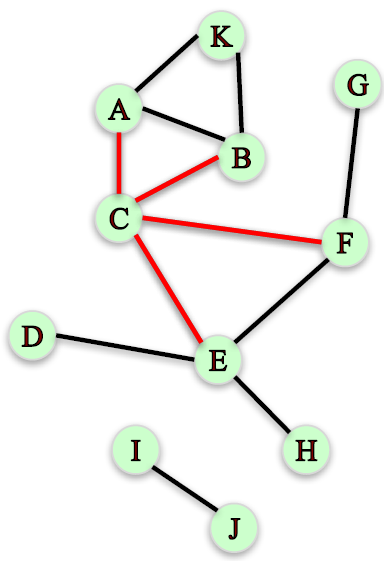
        
        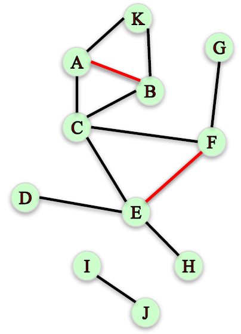
    </a>
    + <n style="color:cyan">Compute the local clustering coefficient of node F</b>:

        $$\frac{\text{\# of pairs of Fʹs friends who are friends}}{\text{\# of pairs of Fʹs friends}}$$

        + $d_F = 3$
        + $\text{\# of pairs of Fʹs friends} = \frac{d_F (d_F - 1)}{2} = 6/2 = 3$
        + $\text{\# of pairs of Fʹs friends who are friends} = 1$

        $\text{Local clustering coefficent of F} =1/3$
    + <n style="color:cyan">Compute the local clustering coefficient of node J</b>:

        $$\frac{\text{\# of pairs of Jʹs friends who are friends}}{\text{\# of pairs of Jʹs friends}}$$

        + \# of pairs of Jʹs friends who are friends = 0 <n style="color:red"> (cannot divide by 0)</b>

        We will assume that the local clustering coefficient of a node of degree less than $2$ to be $0$.
    <a href="https://harangdev.github.io/applied-data-science-with-python/applied-social-network-analysis-in-python/2/"> <br/>
         (Node F)
         (Node J)
    </a>
    + __Local clustering coefficient in NetworkX__:
        ```python
        G = nx.Graph()
        G.add_edges_from([('A', 'K'), ('A', 'B'), ('A', 'C'), ('B', 'C'), ('B', 'K'),
        ('C', 'E'), ('C', 'F'), ('D', 'E'), ('E', 'F'), ('E', 'H'), ('F', 'G'), ('I', 'J')])

        nx.clustering(G, 'F')
        # 0.3333333333333333

        nx.clustering(G, 'A')
        # 0.6666666666666666

        nx.clustering(G, 'J')
        # 0.0
        ```
    + IVQ: What is the clustering coefficient of node H? Scroll down to see all answer options
        <a href="url"> <br/>
            
        </a>

        Ans: 1/2

+ Global Clustering Coefficient
    + Measuring clustering on the whole network:
    + __Approach 1__: Average local clustering coefficient over all nodes in the graph.
        ```python
        nx.average_clustering(G)
        # 0.28787878787878785
        ```
    + __Measuring clustering on the whole network (Approach 2)__:
        + Percentage of "open triads" that are triangles in a network.
        <a href="urhttps://harangdev.github.io/applied-data-science-with-python/applied-social-network-analysis-in-python/2/l"> <br/>
            
        </a>
        + __Transitivity__: Ratio of number of triangles and number of "open triads" in a network.
            ```python
            nx.transitivity(G)
            # 0.409090909091
            ```

+ Transitivity vs. Average Clustering Coefficient
    + Both measure the tendency for edges to form triangles.
    + Transitivity weights nodes with large degree higher.
        <a href="urhttps://harangdev.github.io/applied-data-science-with-python/applied-social-network-analysis-in-python/2/l"> <br/>
            
        </a>
        + Wheel: all outer nodes w/ LCC = 1; central node w/ low LCC
        + Pentagon: all outer nodes w/ LCC = 0; central 5 nodes w/ LCC = 1

+ Summary
    + __Clustering coefficient__ measures the degree to which nodes in a network tend to “cluster” or form triangles.
    + __Local Clustering Coefficient__: Fraction of pairs of the node's friends that are friends with each other.

        $$\text{LCC of C} = \frac{2}{6} = \frac{1}{3}$$
    + __Global Clustering Coefficient__
        + __Average Local Clustering Coefficient__: `nx.average_clustering(G)`
        + __Transitivity__
            + Ratio of number of triangles and number of “open triads”.
            + Puts larger weight on high degree nodes.
            + `nx.transitivity(G)`

+ `nx.clustering` function
    + Signature: `nx.clustering(G, nodes=None, weight=None)`
    + Docstring: Compute the clustering coefficient for nodes.
    + Notes:
        + For unweighted graphs, the clustering of a node `u` is the fraction of possible triangles through that node that exist,

            $$c_u = \frac{2 T(u)}{deg(u)(deg(u)-1)}$$
            + $T(u)$: the number of triangles through node `u`
            + $deg(u)$: the degree of `u`.
        + For weighted graphs, the clustering is defined as the geometric average of the subgraph edge weights,

            $$c_u = \frac{1}{deg(u)(deg(u)-1))} \sum_{uv} (\hat{w}_{uv} \hat{w}_{uw} \hat{w}_{vw})^{1/3}.$$
        + The edge weights $\hat{w}_{uv}$ are normalized by the maximum weight in the network $\hat{w}_{uv} = w_{uv}/\max(w)$.
        + The value of $c_u$ is assigned to 0 if $deg(u) < 2$.
    + Parameters
        + `G`: graph
        + `nodes` (container of nodes, optional (default=all nodes in G)): Compute clustering for nodes in this container.
        + `weight` (string or None, optional (default=None)): The edge attribute that holds the numerical value used as a weight. If None, then each edge has weight 1.
    + Returns" `out` (float, or dictionary): Clustering coefficient at specified nodes
    + Ref: [Generalizations of the clustering coefficient to weighted complex networks](http://jponnela.com/web_documents/a9.pdf) by J. Saramäki, M. Kivelä, J.-P. Onnela, K. Kaski, and J. Kertész, Physical Review E, 75 027105 (2007).

+ `nx.average_clustering` function
    + Signature: `nx.average_clustering(G, nodes=None, weight=None, count_zeros=True)`
    + Docstring: Compute the average clustering coefficient for the graph G.
    + Notes: 
        + The clustering coefficient for the graph is the average,

            $$C = \frac{1}{n}\sum_{v \in G} c_v$$
            + $n$: the number of nodes in `G`.
        + This is a space saving routine; it might be faster to use the clustering function to get a list and then take the average.
    + Parameters
        + `G`: graph
        + `nodes` (container of nodes, optional (default=all nodes in G)): Compute average clustering for nodes in this container. 
        + `weight` (string or None, optional (default=None)): The edge attribute that holds the numerical value used as a weight. If None, then each edge has weight 1.
        + `count_zeros` (bool): If False include only the nodes with nonzero clustering in the average.
    + Returns: `avg` (float): Average clustering
    + Ref
        + [Generalizations of the clustering coefficient to weighted complex networks](http://jponnela.com/web_documents/a9.pdf) by J. Saramäki, M. Kivelä, J.-P. Onnela, K. Kaski, and J. Kertész, Physical Review E, 75 027105 (2007).
        + Marcus Kaiser,  [Mean clustering coefficients: the role of isolated nodes and leafs on clustering measures for small-world networks](http://arxiv.org/abs/0802.2512).

+ `nx.transivity` function
    + Signature: `nx.transitivity(G)`
    + Docstring: Compute graph transitivity, the fraction of all possible triangles  present in G.
    + Notes: 
        + Possible triangles are identified by the number of "triads" (two edges with a shared vertex).
        + The transitivity is

            $$T = 3\frac{\#triangles}{\#triads}$$
    + Parameters
        + `G`: graph
    + Returns: `out` (float): Transitivity


### Lecture Video

<a href="https://d3c33hcgiwev3.cloudfront.net/X4oOAnxFEeeR4BLAuMMnkA.processed/full/360p/index.mp4?Expires=1548892800&Signature=jaKakh9T7ryPe9CyCEO~xnGGaXzWlDf-0I1drKoChs2UTmTm0jCxlpEwvORtsgjwfJDifeIe59za0sWRVllRqtX~NpCKko59xHth4LGjLRpqnQ7pncK~ri8iVlxMc6oDd5hE7aGgMI1A3YqH35JO6fvupWBVuKWWJa9t-s-KBow_&Key-Pair-Id=APKAJLTNE6QMUY6HBC5A" alt="Clustering Coefficient" target="_blank">
     
</a>


## Distance Measures

### Lecture Note

+ Distance
    + How “far” is node A from node H?
    + Are nodes far away or close to each other in this network?
    + Which nodes are “closest” and “farthest” to other nodes?
    + We need a sense of distance between nodes to answer these questions
    <a href="https://harangdev.github.io/applied-data-science-with-python/applied-social-network-analysis-in-python/2/"> <br/>
        
        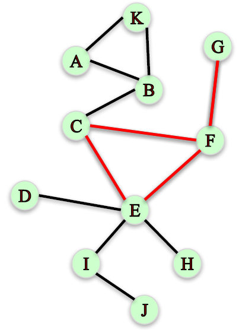
        
    </a>

+ Paths
    + Path: A sequence of nodes connected by an edge.
    + Find two paths from node G to node C:
        ```
        G – F – C
        G – F – E – C
        ```

+ Distance
    + How far is node A from node H?
        + Path 1: A – B – C – E – H (4 “hops”)
        + Path 2: A – B – C – F – E – H (5 “hops”)
    + __Path length__: Number of steps it contains from beginning to end.
        + Path 1 has length 4, Path 2 has length 5
    + Distance between two nodes: the length of the shortest path between them.
    + The distance between node A and H is 4
        ```python
        nx.shortest_path(G, 'A', 'H')
        # ['A', 'B', 'C', 'E', 'H']

        nx.shortest_path_length(G, 'A', 'H')
        # 4
        ```
    + Finding the distance from node A to every other node.
    + Easy to do manually in small networks but tedious in large (real) networks.

+ Breadth-First Search
    + __Breadth-first search__: a systematic and efficient procedure for computing distances from a node to all other nodes in a large network by “discovering” nodes in layers.
    <a href="https://harangdev.github.io/applied-data-science-with-python/applied-social-network-analysis-in-python/2/"> <br/>
        
    </a>
        ```python
        T = nx.bfs_tree(G, 'A')

        T.edges()
        # [('A', 'K'), ('A', 'B'), ('B', 'C'), ('C', 'E'), ('C', 'F'), ('E', 'I'), ('E', 'H'), ('E', 'D'), ('F', 'G'), ('I', 'J')]

        nx.shortest_path_length(G,'A')
        # {'A': 0, 'B': 1, 'C': 2, 'D': 4, 'E': 3, 'F': 3, 'G': 4, 'H': 4, 'I': 4, 'J': 5, 'K': 1}
        ```

+ Distance Measures
    + How to characterize the distance between all pairs of nodes in a graph?
    + __Average distance__ between every pair of nodes.
        ```python
        nx.average_shortest_path_length(G)    # 2.52727272727
        ```
    + __Diameter__: maximum distance between any pair of nodes.
        ```python
        nx.diameter(G)  # 5
        ```
    + The __Eccentricity__ of a node `n`: the largest distance between `n` and all other nodes.
        ```python
        nx.eccentricity(G)
        # {'A': 5, 'B': 4, 'C': 3, 'D': 4, 'E': 3, 'F': 3, 'G': 4, 'H': 4, 'I': 4, 'J': 5, 'K': 5}
        ```
    + The __radius__ of a graph: the minimum eccentricity
        ```python
        nx.radius(G)        # 3
        ```
    + The __Periphery__ of a graph: the set of nodes that have eccentricity equal to the diameter.
        ```python
        nx.periphery(G)     # ['A', 'K', 'J']
        ```
    + The __center__ of a graph: the set of nodes that have eccentricity equal to the radius.
        ```python
        nx.center(G)        # ['C', 'E', 'F']
        ```
    + IVQ: 
        <a href="https://www.coursera.org/learn/python-social-network-analysis/lecture/SeNEl/distance-measures"> <br/>
            
        </a>

        + What is the diameter of this network?

            Ans: 3 <br/>
            The longest distance between any two nodes is 3. For example, the distance from node A to C is 3 (path A-H-G-C). Hence, the diameter of the network is 3.
        + What is the eccentricity of node F? 

            Ans: 2
            The distance from F to every other node is either 1 or 2. Hence the eccentricity of node F is 2.
        + Which node is in the periphery of the network?

            a. B
            b. H
            c. B & H
            d. none of above

            Ans: a
            The diameter of the network is 3 and the distance from B to C is 3 (path B-D-G-C). Hence, node B is in the periphery. The maximum distance from node H to any other node is 2, so H is not in the periphery.

+ Karate Club Network
    ```python
    G = nx.karate_club_graph()
    G = nx.convert_node_labels_to_integers(G,first_label=1)
    ```
    <a href="https://www.coursera.org/learn/python-social-network-analysis/lecture/SeNEl/distance-measures"> 
        
    </a>

    + Average shortest path = 2.41
    + Radius = 3
    + Diameter = 5
    + Center = [1, 2, 3, 4, 9, 14, 20, 32]
    + Periphery: [15, 16, 17, 19, 21, 23, 24, 27, 30]

    Node 34 looks pretty “central”. However, it has distance 4 to node 17

+ Summary
    + __Distance between two nodes__: length of the shortest path between them.
    + __Eccentricity__ of a node n is the largest distance between n and all other nodes.
    + Characterizing distances in a network:
        + __Average distance__ between every pair of nodes.
        + __Diameter__: maximum distance between any pair of nodes.
        + __Radius__: the minimum eccentricity in the graph.
    + Identifying central and peripheral nodes:
        + The __Periphery__ is the set of nodes with eccentricity = diameter.
        + The __center__ is the set of nodes with eccentricity = radius.

+ `nx.shortest_path` function
    + Signature: `nx.shortest_path(G, source=None, target=None, weight=None)`
    + Docstring: Compute shortest paths in the graph.
    + Parameters
        + `G` : NetworkX graph
        + `source` (node, optional): Starting node for path. If not specified, compute shortest paths using all nodes as source nodes.
        + `target` (node, optional): Ending node for path. If not specified, compute shortest paths using all nodes as target nodes.
        + `weight` (None or string, optional (default = None)):
            + If None, every edge has weight/distance/cost 1.
            + If a string, use this edge attribute as the edge weight.
            + Any edge attribute not present defaults to 1.
    + Returns: `path` (list or dictionary):
        + All returned paths include both the source and target in the path.
        + If the source and target are both specified, return a single list of nodes in a shortest path from the source to the target.
        + If only the source is specified, return a dictionary keyed by targets with a list of nodes in a shortest path from the source to one of the targets.
        + If only the target is specified, return a dictionary keyed by sources with a list of nodes in a shortest path from one of the sources to the target.
        + If neither the source nor target are specified return a dictionary of dictionaries with `path[source][target]=[list of nodes in path]`.

+ `nx.shortest_path_length` function
    + Signature: `nx.shortest_path_length(G, source=None, target=None, weight=None)`
    + Docstring: Compute shortest path lengths in the graph.
    + Parameters
        + `G`: NetworkX graph
        + `source` (node, optional): Starting node for path. If not specified, compute shortest path lengths using all nodes as source nodes.
        + `target` (node, optional): Ending node for path. If not specified, compute shortest path lengths using all nodes as target nodes.
        + `weight` (None or string, optional (default = None)): 
            + If None, every edge has weight/distance/cost 1.
            + If a string, use this edge attribute as the edge weight.
            + Any edge attribute not present defaults to 1.
    + Returns: `length` (int or dictionary)
        + If the source and target are both specified, return the length of the shortest path from the source to the target.
        + If only the source is specified, return a dictionary keyed by targets whose values are the lengths of the shortest path from the source to one of the targets.
        + If only the target is specified, return a dictionary keyed by sources whose values are the lengths of the shortest path from one of the sources to the target.
        + If neither the source nor target are specified return a dictionary of dictionaries with `path[source][target]=L`, where `L` is the length of the shortest path from source to target.

+ `nx_bfs_tree` function
    + Signature: `nx.bfs_tree(G, source, reverse=False)`
    + Docstring: Return an oriented tree constructed from of a breadth-first-search starting at source.
    + Parameters
        + `G` : NetworkX graph
        + `source` (node): Specify starting node for breadth-first search and return edges in the component reachable from source.
        + `reverse` (bool, optional): If True traverse a directed graph in the reverse direction
    + Returns: `T` (NetworkX DiGraph): An oriented tree

+ `nx.average_shortest_path_length` function
    + Signature: `nx.average_shortest_path_length(G, weight=None)`
    + Docstring: Return the average shortest path length.
    + Note: The average shortest path length is

        $$a =\sum_{s,t \in V} \frac{d(s, t)}{n(n-1)}$$
        + $V$: the set of nodes in `G`
        + $d(s, t)$: the shortest path from `s` to `t`
        + $n$: the number of nodes in `G`
    + Parameters
        + `G`: NetworkX graph
        + `weight` (None or string, optional (default = None))
            + If None, every edge has weight/distance/cost 1.
            + If a string, use this edge attribute as the edge weight.
            + Any edge attribute not present defaults to 1.

+ `nx.diameter` function
    + Signature: `nx.diameter(G, e=None)`
    + Docstring: Return the diameter of the graph G. The diameter is the maximum eccentricity.
    + Parameters
        + `G` (NetworkX graph): A graph
        + `e` (eccentricity dictionary, optional): A precomputed dictionary of eccentricities.
    + Returns: `d` (integer): Diameter of graph

+ `nx.eccentricity` function
    + Signature: `nx.eccentricity(G, v=None, sp=None)`
    + Docstring: Return the eccentricity of nodes in G. The eccentricity of a node v is the maximum distance from v to all other nodes in G.
    + Parameters
        + `G` (NetworkX graph): A graph
        + `v` (node, optional): Return value of specified node
        + `sp` (dict of dicts, optional): All pairs shortest path lengths as a dictionary of dictionaries
    + Returns: `ecc` (dictionary): A dictionary of eccentricity values keyed by node.

+ `nx.radius` function
    + Signature: `nx.radius(G, e=None)`
    + Docstring: Return the radius of the graph G. The radius is the minimum eccentricity.
    + Parameters
        + `G` (NetworkX graph): A graph
        + `e` (eccentricity dictionary, optional): A precomputed dictionary of eccentricities.
    + Returns: `r` (integer): Radius of graph

+ `nx.periphery` function
    + Signature: `nx.periphery(G, e=None)`
    + Docstring: Return the periphery of the graph G. The periphery is the set of nodes with eccentricity equal to the diameter.
    + Parameters
        + `G` (NetworkX graph): A graph
        + `e` (eccentricity dictionary, optional): A precomputed dictionary of eccentricities.
    + Returns: `p` (list): List of nodes in periphery

+ `nx.center` function
    + Signature: `nx.center(G, e=None)`
    + Docstring: Return the center of the graph G. The center is the set of nodes with eccentricity equal to radius.
    + Parameters
        + `G` (NetworkX graph): A graph
        + `e` (eccentricity dictionary, optional): A precomputed dictionary of eccentricities.
    + Returns: `c` (list): List of nodes in center

+ `nx.karate_club_graph` function
    + Signature: `nx.karate_club_graph()`
    + Docstring: Return Zachary's Karate Club graph.
    + Note:  Each node in the returned graph has a node attribute `'club'` that indicates the name of the club to which the member represented by that node belongs, either `'Mr. Hi'` or `'Officer'`.
    + References
        + Zachary, Wayne W. "An Information Flow Model for Conflict and Fission in Small Groups." Journal of Anthropological Research, 33, 452--473, (1977).
        + [Data file](http://vlado.fmf.uni-lj.si/pub/networks/data/Ucinet/UciData.htm)

+ `nx.convert_node_labels_to_integers` function
    + Signature: `nx.convert_node_labels_to_integers(G, first_label=0, ordering='default', label_attribute=None)`
    + Docstring: Return a copy of the graph G with the nodes relabeled using consecutive integers.
    + Parameters
        + `G` (graph): A NetworkX graph
        + `first_label` (int, optional (default=0)): An integer specifying the starting offset in numbering nodes. The new integer labels are numbered `first_label, ..., n-1+first_label`.
        + `ordering` (string): 
            + "default": inherit node ordering from G.nodes()
            + "sorted": inherit node ordering from sorted(G.nodes())
            + "increasing degree": nodes are sorted by increasing degree
            + "decreasing degree": nodes are sorted by decreasing degree
        + `label_attribute` (string, optional (default=None)): Name of node attribute to store old label.  If None no attribute is created.
    + Notes: Node and edge attribute data are copied to the new (relabeled) graph.


### Lecture Video

<a href="https://d3c33hcgiwev3.cloudfront.net/VVQyoJTMEeeClxLmJhEfgA.processed/full/360p/index.mp4?Expires=1548892800&Signature=Hfx0XLHeDJI9cSXdftL2~oGunpZSkhB1qJaRCYzJwRMJEbp3hkYkddTG7oa~BG8RPG1QN~0fLqN1l1K00eeKqE1f-M5FJgEJzFN3dWGbbNLUGSQJPRzjQdrOkCfvtmxiXU56WHk-p5Mg~aHnyTeDmim7RnZ0hiueak2oRBWoZe8_&Key-Pair-Id=APKAJLTNE6QMUY6HBC5A" alt="Distance Measures" target="_blank">
     
</a>


## Connected Components

### Lecture Note

+ Connected Graphs
    + An undirected graph is __connected__ if, for every pair nodes, there is a path between them.
        ```python
        nx.is_connected(G)      # True
        ```
        <a href="https://harangdev.github.io/applied-data-science-with-python/applied-social-network-analysis-in-python/2/"> 
            
            
        </a>
    + However, if we remove edges A—G, A—N, and J—O, the graph becomes disconnected.
    + There is no path between nodes in the three different “communities”. (all <n style="color:red">red line</n> removed)

+ Connected Components
    + A subset of nodes such as:
        1. Every node in the subset has a path to every other node.
        2. No other node has a path to any node in the subset.
    + Is the subset {E, A, G, F} a connected component? (Fig.1)

        <n style="color:cyan">No, there is no path between nodes A and F.</n>
    + Is the subset {N, O, K} a connected component? (Fig. 2)

        <n style="color:cyan">No, node L has a path to N, O, and K.</n>
    + What are the connected components in this graph?

        <n style="color:cyan">{A, B, C, D, E}, {F, G, H, I, J}, {K, L, M, N, O}</n>
    <a href="url"> <br/>
        
        
        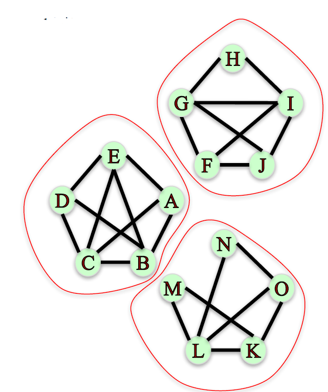
    </a>
    ```python
    nx.number_connected_components(G)       # 3

    sorted(nx.connected_components(G))
    # [{'A', 'B', 'C', 'D', 'E'}, {'F', 'G', 'H', 'I', 'J'}, {'K', 'L', 'M', 'N', 'O'}]

    nx.node_connected_component(G, 'M')     # {'K', 'L', 'M', 'N', 'O'}
    ```

+ Connectivity in Directed Graphs
    + A directed graph is __strongly connected__ if, for every pair nodes `u` and `v`, there is a directed path from u to v and a directed path from `v` to `u`.
        ```python
        nx.is_strongly_connected(G)     # False
        ```
        + Note: There is no directed path from A to H
    + A directed graph is __weakly connected__ if replacing all directed edges with undirected edges produces a connected undirected graph.
        ```python
        nx.is_weakly_connected(G)       # True
        ```
    + Strongly connected component:
        + A subset of nodes such as:
            1. Every node in the subset has a directed path to every other node.
            2. No other node has a directed path to every node in the subset.
        + What are the strongly connected components in this graph?
            ```python
            sorted(nx.strongly_connected_components(G))
            # [{M}, {L}, {K}, {A, B, C, D, E, F, G, J, N, O}, {H, I}]
            ```
    + Weakly connected component:
        + The connected components of the graph after replacing all directed edges with undirected edges.
            ```python
            sorted(nx.weakly_connected_components(G))
            # [{'A', 'B', 'C', 'D', 'E', 'F', 'G', 'H', 'I', 'J', 'K', 'L', 'M', 'N', 'O'}]
            ```
        + Since the graph is weakly connected it only has one weakly connected component.
    <a href="url"> <br/>
        
        
        
        
    </a>
    + IVQ: Based on the network shown, select the true statement.
    <a href="url"> <br/>
        
    </a>

        a. The network is weakly connected and strongly connected.
        b. The network is weakly connected but not strongly connected.
        c. The network is not weakly connected but it is strongly connected
        d. The network is neither strongly nor weakly connected.

        Ans: b
        The network is not strongly connected since some pairs of nodes do not have a path connecting them. For example, there is no path from node C to node D. However, the network is weakly connected because replacing all directed edges with undirected edges produces a connected undirected graph.

+ Summary
    + Undirected Graphs
        + __Connected__: for every pair nodes, there is a path between them.
        + __Connected components__: `nx.connected_components(G)`
    + Directed Graphs
        + __Strongly connected__: for every pair nodes, there is a _directed_ path between them.
        + __Strongly connected components__: `nx.strongly_connected_components(G))`


+ `nx.is_connected` function
    + Signature: `nx.is_connected(G)`
    + Docstring: Return True if the graph is connected, false otherwise.
    + Parameters
        + `G` (NetworkX Graph): An undirected graph.
    + Returns: `connected` (bool): True if the graph is connected, false otherwise.

+ `nx.number_connected_components` function
    + Signature: `nx.number_connected_components(G)`
    + Docstring: Return the number of connected components.
    + Parameters
        + `G` (NetworkX graph): An undirected graph.
    + Returns" `n` (integer): Number of connected components

+ `nx.connected_components` function
    + Signature: `nx.connected_components(G)`
    + Docstring: Generate connected components.
    + Parameters
        + `G` (NetworkX graph): An undirected graph
    + Returns: `comp` (generator of sets): A generator of sets of nodes, one for each component of G.

+ `nx.is_strongly_connected` function
    + Signature: `nx.is_strongly_connected(G)`
    + Docstring: Test directed graph for strong connectivity.
    + Parameters:
        + `G` (NetworkX Graph): A directed graph.
    + Returns: `connected` (bool): True if the graph is strongly connected, False otherwise.

+ `nx.is_weakly_connected` function
    + Signature: `nx.is_weakly_connected(G)`
    + Docstring: Test directed graph for weak connectivity. A directed graph is weakly connected if, and only if, the graph is connected when the direction of the edge between nodes is ignored.
    + Parameters
        + `G` (NetworkX Graph): A directed graph.
    + Returns: `connected` (bool): True if the graph is weakly connected, False otherwise.

+ `nx.strongly_connected_components` function
    + Signature: `nx.strongly_connected_components(G)`
    + Docstring: Generate nodes in strongly connected components of graph.
    + Parameters
        + `G` (NetworkX Graph): An directed graph.
    + Returns: `comp` (generator of sets): A generator of sets of nodes, one for each strongly connected component of G.

+ `nx.weakly_connected_components` function
    + Signature: `nx.weakly_connected_components(G)`
    + Docstring: Generate weakly connected components of G.
    + Parameters
        + `G` (NetworkX graph): A directed graph
    + Returns: `comp` (generator of sets): A generator of sets of nodes, one for each weakly connected component of G.


### Lecture Video

<a href="https://d3c33hcgiwev3.cloudfront.net/bR_sUZTLEeeOmgqEJWRlfA.processed/full/360p/index.mp4?Expires=1548979200&Signature=exHWZnjL8bx7tbqlLDE8lP-fX2A4BX1HxZ~znRNsdjaOM5HAvlv3cQWsUCkewRiGzWTab4yreP05TAlEtICOnMm14X25NiYSMwSbePnMEfwTaBEzw6PUl8M-vgQ~2daK9him9sdO8RHgG30fVv8Azf7hNhOtxuLIeHdQbK~yBZI_&Key-Pair-Id=APKAJLTNE6QMUY6HBC5A" alt="Connected Components" target="_blank">
     
</a>


## Network Robustness

### Lecture Note

+ Connectivity and Robustness in Networks
    + __Network robustness__: the ability of a network to maintain its general structural properties when it faces failures or attacks.
    + __Type of attacks__: removal of nodes or edges.
    + __Structural properties__: connectivity.
    + Examples: airport closures, internet router failures, power line failures.
    <a href="http://www.visualisingdata.com/2012/02/bio-diaspora-visualising-interactions-between-populations-and-travel/"> <br/>
        
    </a>
    <a href="https://www.caida.org/home/about/annualreports/1998/"> 
        
    </a>

+ Disconnecting a Graph
    + What is the smallest number of __nodes__ that can be removed from this graph in order to disconnect it?
        ```python
        nx.node_connectivity(G_un)      # 1
        ```
    + Which node?
        ```python
        nx.minimum_node_cut(G_un)       # {'A'}
        ```
        <a href="https://www.coursera.org/learn/python-social-network-analysis/lecture/3pGvt/network-robustness">
            
            
            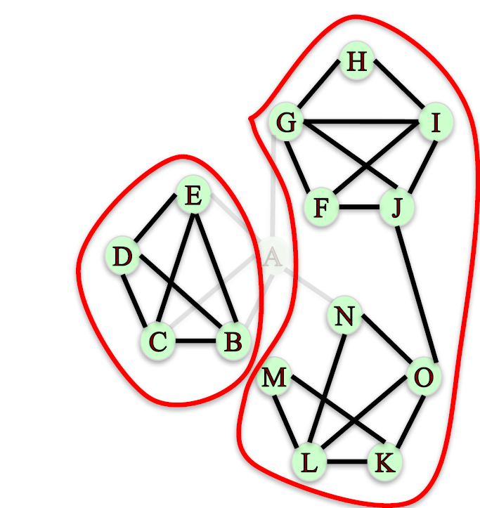
        </a>
    + What is the smallest number of __edges__ that can be removed from this graph in order to disconnect it?
        ```python
        nx.edge_connectivity(G_un)      # 2
        ```
    + Which edges?
        ```python
        nx.minimum_edge_cut(G_un)       # {('A', 'G'), ('O', 'J')}
        ```
        <a href="https://www.coursera.org/learn/python-social-network-analysis/lecture/3pGvt/network-robustness">
            
            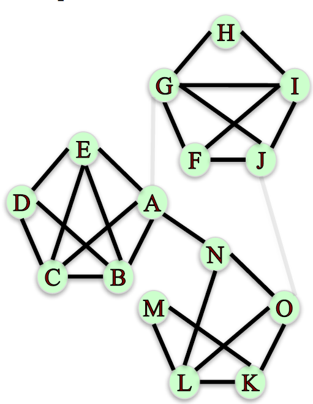
            
        </a>
    + Robust networks have large minimum node and edge cuts.

+ Simple Paths
    + Imagine node G wants to send a message to node L by passing it along to other nodes in this network.
    + What options does G have to deliver the message?
        ```python
        sorted(nx.all_simple_paths(G, 'G', 'L'))
        # [['G', 'A', 'N', 'L'], ['G', 'A', 'N', 'O', 'K', 'L'],
        #  ['G', 'A', 'N', 'O', 'L'],, ['G', 'J', 'O', 'K', 'L'], ['G', 'J', 'O', 'L']]
        ```
        <a href="https://www.coursera.org/learn/python-social-network-analysis/lecture/3pGvt/network-robustness">
            
            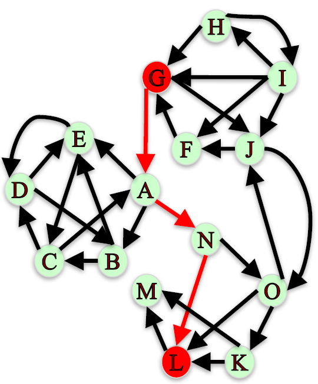
            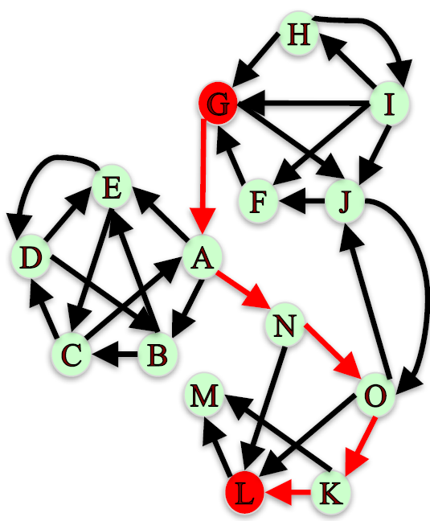
            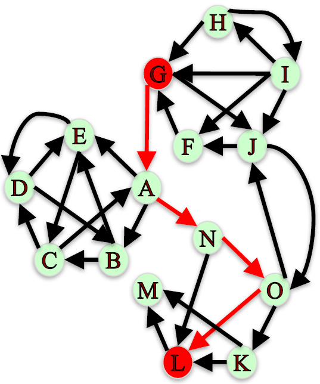
            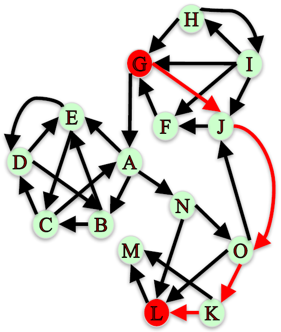
            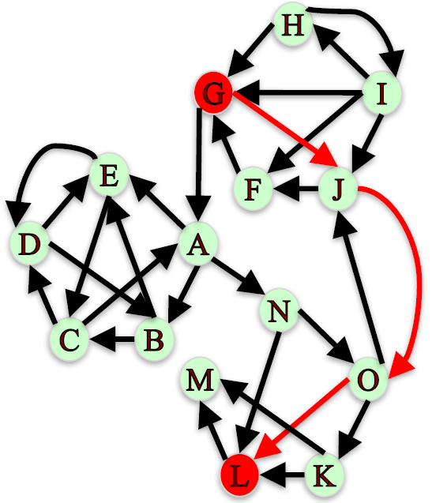
        </a>

+ Node Connectivity
    + If we wanted to block the message from G to L by removing nodes from the network, how many __nodes__ would we need to remove?
        ```python
        nx.node_connectivity(G, 'G', 'L')   # 2
        ```
    + Which nodes?
        ```python
        nx.minimum_node_cut(G, 'G', 'L')    # {'N', 'O'}
        ```
    + If we only remove node N, message can go on path G -> J -> O -> K -> L.
    + If we only remove node O, message can go on path G -> A -> N -> L.
    <a href="https://www.coursera.org/learn/python-social-network-analysis/lecture/3pGvt/network-robustness"> <br/>
            
             J -> O -> K -> L" height="150">
             A -> N -> L" height="150">
        </a>

+ Edge Connectivity
    + If we wanted to block the message from G to L by removing edges from the network, how many __edges__ would we need to remove?
        ```python
        nx.edge_connectivity(G, 'G', 'L')   # 2
        ```
    + Which edges?
        ```python
        nx.minimum_edge_cut(G, 'G', 'L')    # {('A', 'N'), ('J', 'O')}
        ```
    + We need to remove A -> N an J -> O to block messages from G to L.
    <a href="https://www.coursera.org/learn/python-social-network-analysis/lecture/3pGvt/network-robustness"> <br/>
            
            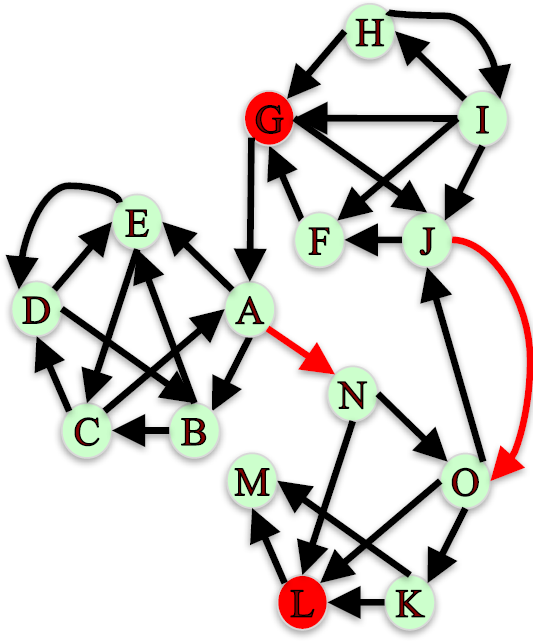
        </a>
    + IVQ: If we wanted to block the message from H to O by removing the the smallest possible number of edges from the network, which edges should we remove?
        ```python
        import networkx as nx

        G = nx.DiGraph()
        G.add_edges_from([('A', 'B'), ('C', 'A'), ('A', 'E'), ('G', 'A'), ('A', 'N'), ('B', 'C'), ('D', 'B'), ('B', 'E'), ('C', 'D'), ('E', 'C'), ('D', 'E'), ('E', 'D'), ('F', 'G'), ('I', 'F'), ('J', 'F'), ('H', 'G'), ('I', 'G'), ('G', 'J'), ('I', 'H'), ('H', 'I'), ('I', 'J'), ('J', 'O'), ('O', 'J'), ('K', 'M'), ('K', 'L'), ('O', 'K'), ('O', 'L'), ('N', 'L'), ('L', 'M'), ('N', 'O')])

        nx.minimum_edge_cut(G, 'H', 'O')
        ```

        Ans: {('N', 'O'), ('J', 'O')} </br>
        We can’t block the message from H to O by removing a single edge. Only options C and A block the message, and since option C removes two edges and option A removes 3 edges, C is the correct answer. You can use nx.minimum_edge_cut(G, 'H', 'O') to find the answer.

+ Summary
    + Node connectivity: Minimum number of nodes needed to disconnect a graph or pair of nodes.
        ```python
        nx.node_connectivity(G, 'G', 'L')
        nx.minimum_node_cut(G, 'G', 'L')
        ```
    + Edge connectivity: Minimum number of edges needed to disconnect a graph or pair of nodes.
        ```python
        nx.edge_connectivity(G, 'G', 'L')
        nx.minimum_edge_cut(G, 'G', 'L')
        ```
    + Graphs with large node and edge connectivity are more robust to the loss of nodes and edges.


+ `nx.node-connectivity` function
    + Signature: `nx.node_connectivity(G, s=None, t=None, flow_func=None)`
    + Docstring: Returns node connectivity for a graph or digraph G.
    + Note: Node connectivity is equal to the minimum number of nodes that must be removed to disconnect G or render it trivial. If source and target nodes are provided, this function returns the local node connectivity: the minimum number of nodes that must be removed to break all paths from source to target in G.
    + Parameters
        + `G` (NetworkX graph): Undirected graph
        + `s` (node): Source node. Optional. Default value: None.
        + `t` (node): Target node. Optional. Default value: None.
        + `flow_func` (function): A function for computing the maximum flow among a pair of nodes. The function has to accept at least three parameters: a Digraph, a source node, and a target node. And return a residual network that follows NetworkX conventions (see `maximum_flow` for details). If flow_func is None, the default maximum flow function (`edmonds_karp`) is used. See below for details. The choice of the default function may change from version to version and should not be relied on. Default value: None.
    + Returns: `K` (integer): Node connectivity of G, or local node connectivity if source and target are provided.

+ `nx.minimum_node_cut` function
    + Signature: `nx.minimum_node_cut(G, s=None, t=None, flow_func=None)`
    + Docstring: Returns a set of nodes of minimum cardinality that disconnects G.
    + Notes:
        + If source and target nodes are provided, this function returns the set of nodes of minimum cardinality that, if removed, would destroy all paths among source and target in G. If not, it returns a set of nodes of minimum cardinality that disconnects G.
        + This is a flow based implementation of minimum node cut. The algorithm is based in solving a number of maximum flow computations to determine the capacity of the minimum cut on an auxiliary directed network that corresponds to the minimum node cut of G. It handles both directed and undirected graphs. This implementation is based on algorithm 11 in Ref.
    + Parameters
        + `G`: NetworkX graph
        + `s` (node): Source node. Optional. Default value: None.
        + `t` (node): Target node. Optional. Default value: None.
        + `flow_func` (function): A function for computing the maximum flow among a pair of nodes. The function has to accept at least three parameters: a Digraph, a source node, and a target node. And return a residual network that follows NetworkX conventions (see `maximum_flow` for details). If flow_func is None, the default maximum flow function (`edmonds_karp`) is used. See below for details. The choice of the default function may change from version to version and should not be relied on. Default value: None.
    + Returns: `cutset` (set): Set of nodes that, if removed, would disconnect G. If source and target nodes are provided, the set contians the nodes that if removed, would destroy all paths between source and target.
    + Reference: Abdol-Hossein Esfahanian. [Connectivity Algorithms](http://www.cse.msu.edu/~cse835/Papers/Graph_connectivity_revised.pdf).

+ `nx.edge_connectivity` function
    + Signature: `nx.edge_connectivity(G, s=None, t=None, flow_func=None)`
    + Docstring: Returns the edge connectivity of the graph or digraph G.
    + Notes: 
        + The edge connectivity is equal to the minimum number of edges that must be removed to disconnect G or render it trivial. If source and target nodes are provided, this function returns the local edge connectivity: the minimum number of edges that must be removed to break all paths from source to target in G.
    + Parameters
        + `G` (NetworkX graph): Undirected or directed graph
        + `s` (node): Source node. Optional. Default value: None.
        + `t` (node): Target node. Optional. Default value: None.
        + `flow_func` (function): A function for computing the maximum flow among a pair of nodes. The function has to accept at least three parameters: a Digraph, a source node, and a target node. And return a residual network that follows NetworkX conventions (see `maximum_flow` for details). If flow_func is None, the default maximum flow function (`edmonds_karp`) is used. See below for details. The choice of the default function may change from version to version and should not be relied on. Default value: None.
    + Returns: `K` (integer): Edge connectivity for G, or local edge connectivity if source and target were provided

+ `nx.minimum_edge_cut` function
    + Signature: `nx.minimum_edge_cut(G, s=None, t=None, flow_func=None)`
    + Docstring: Returns a set of edges of minimum cardinality that disconnects G.
    Notes: 
        + If source and target nodes are provided, this function returns the set of edges of minimum cardinality that, if removed, would break all paths among source and target in G. If not, it returns a set of edges of minimum cardinality that disconnects G.
        + This is a flow based implementation of minimum edge cut. For undirected graphs the algorithm works by finding a 'small' dominating set of nodes of G (see algorithm 7 in Ref) and computing the maximum flow between an arbitrary node in the dominating set and the rest of nodes in it. This is an implementation of algorithm 6 in Ref. For  directed graphs, the algorithm does n calls to the max flow function. It is an implementation of algorithm 8 in Ref.
    + Parameters
        + `G`: NetworkX graph
        + `s` (node): Source node. Optional. Default value: None.
        + `t` (node): Target node. Optional. Default value: None.
        + `flow_func` (function): A function for computing the maximum flow among a pair of nodes. The function has to accept at least three parameters: a Digraph, a source node, and a target node. And return a residual network that follows NetworkX conventions (see `maximum_flow` for details). If flow_func is None, the default maximum flow function (`edmonds_karp`) is used. See below for details. The choice of the default function may change from version to version and should not be relied on. Default value: None.
    + Returns: `cutset` (set): Set of edges that, if removed, would disconnect G. If source and target nodes are provided, the set contians the edges that if removed, would destroy all paths between source and target.
    + References: Abdol-Hossein Esfahanian. [Connectivity Algorithms](http://www.cse.msu.edu/~cse835/Papers/Graph_connectivity_revised.pdf).

+ `nx.all_simpla_paths` function
    + Signature: `nx.all_simple_paths(G, source, target, cutoff=None)`
    + Docstring: Generate all simple paths in the graph G from source to target. A simple path is a path with no repeated nodes.
    + Parameters
        + `G`: NetworkX graph
        + `source` (node): Starting node for path
        + `target` (node): Ending node for path
        + `cutoff` (integer, optional): Depth to stop the search. Only paths of length <= cutoff are returned.
    + Returns: `path_generator` (generator): A generator that produces lists of simple paths.  If there are no paths between the source and target within the given cutoff the generator produces no output.


### Lecture Video

<a href="https://d3c33hcgiwev3.cloudfront.net/AyOH_HxEEee4vAqXrrsRwg.processed/full/360p/index.mp4?Expires=1548979200&Signature=JvS9X8bemp6uXc7Sxog~2T153JNq-x4IeH1NmW7Sw16KqhxGqdt6YxELnBJJpXGxlSzgqR2Z0KonaY6ltFSYlZmqMNWwRJsD34r6~VtKTO8~LuNIQHJv4lPgKY1oGDC0KaT~3N-ID9-pUvgcamliiQPTpQCAqDEpSHbGAihm0tA_&Key-Pair-Id=APKAJLTNE6QMUY6HBC5A" alt="Network Robustness" target="_blank">
     
</a>


## Notebook: Simple Network Visualizations in NetworkX

```python
import networkx as nx
import matplotlib.pyplot as plt

# read in the graph
G = nx.read_gpickle('major_us_cities')

# draw the graph using the default spring layout
plt.figure(figsize=(10,9))
nx.draw_networkx(G)         # Fig.1

# See what layouts are available in networkX
[x for x in nx.__dir__() if x.endswith('_layout')]
# ['circular_layout',
#  'random_layout',
#  'shell_layout',
#  'spring_layout',
#  'spectral_layout',
#  'fruchterman_reingold_layout']

# Draw the graph using the random layout
plt.figure(figsize=(10,9))
pos = nx.random_layout(G)
nx.draw_networkx(G, pos)    # Fig.2

# Draw the graph using the circular layout
plt.figure(figsize=(10,9))
pos = nx.circular_layout(G)
nx.draw_networkx(G, pos)    # Fig.3

# Draw the graph using custom node positions
plt.figure(figsize=(10,7))

pos = nx.get_node_attributes(G, 'location')
nx.draw_networkx(G, pos)    # Fig.4

# Draw the graph adding alpha, removing labels, and softening edge color
plt.figure(figsize=(10,7))

nx.draw_networkx(G, pos, alpha=0.7, with_labels=False, edge_color='.4') # Fig.5

plt.axis('off')
plt.tight_layout();

# Draw graph with varying node color, node size, and edge width
plt.figur(figsize=(10,7))

node_color = [G.degree(v) for v in G]
node_size = [0.0005*nx.get_node_attributes(G, 'population')[v] for v in G]
edge_width = [0.0015*G[u][v]['weight'] for u,v in G.edges()]

nx.draw_networkx(G, pos, node_size=node_size, 
                 node_color=node_color, alpha=0.7, with_labels=False,
                 width=edge_width, edge_color='.4', cmap=plt.cm.Blues)  # Fig.6

plt.axis('off')
plt.tight_layout();

# Draw specific edges and add labels to specific nodes
plt.figure(figsize=(10,7))

node_color = [G.degree(v) for v in G]
node_size = [0.0005*nx.get_node_attributes(G, 'population')[v] for v in G]
edge_width = [0.0015*G[u][v]['weight'] for u,v in G.edges()]

nx.draw_networkx(G, pos, node_size=node_size, 
                 node_color=node_color, alpha=0.7, with_labels=False,
                 width=edge_width, edge_color='.4', cmap=plt.cm.Blues)  # Fig.7

greater_than_770 = [x for x in G.edges(data=True) if x[2]['weight']>770]
nx.draw_networkx_edges(G, pos, edgelist=greater_than_770, edge_color='r', alpha=0.4, width=6)

nx.draw_networkx_labels(G, pos, labels={'Los Angeles, CA': 'LA', 'New York, NY': 'NYC'}, font_size=18, font_color='w')

plt.axis('off')
plt.tight_layout();
```

<a href="url"> <br/>
    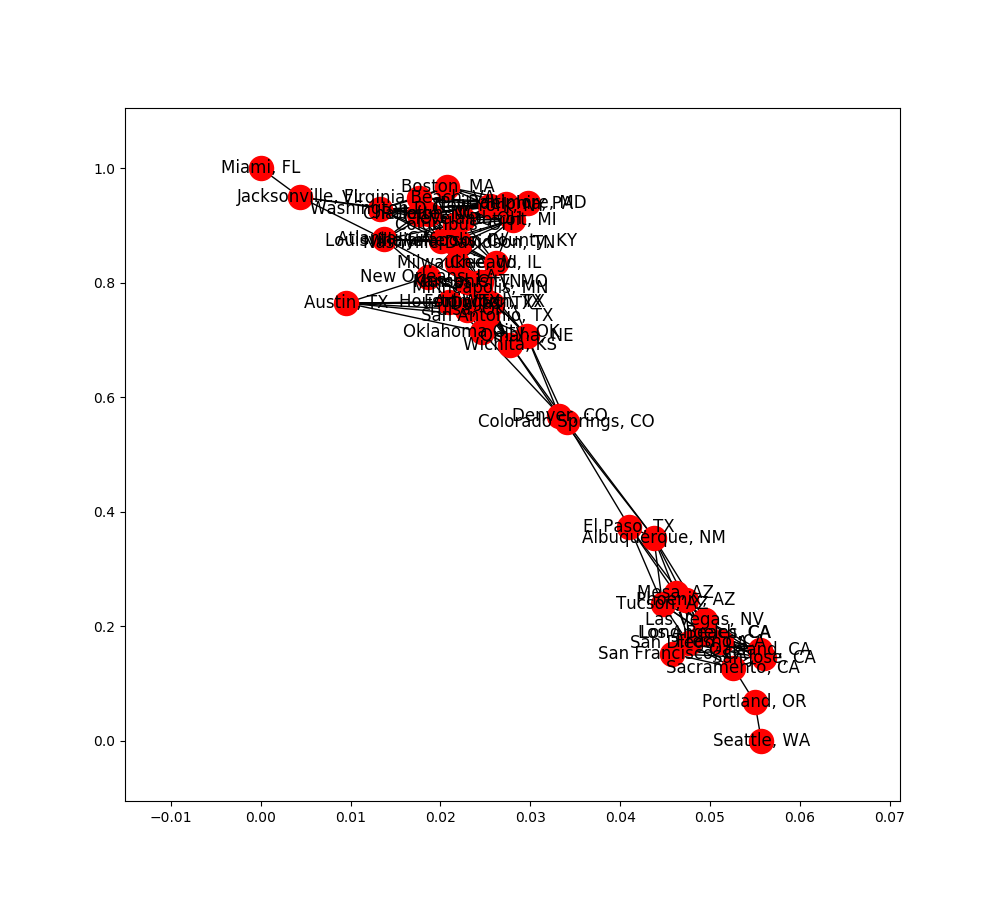
    
    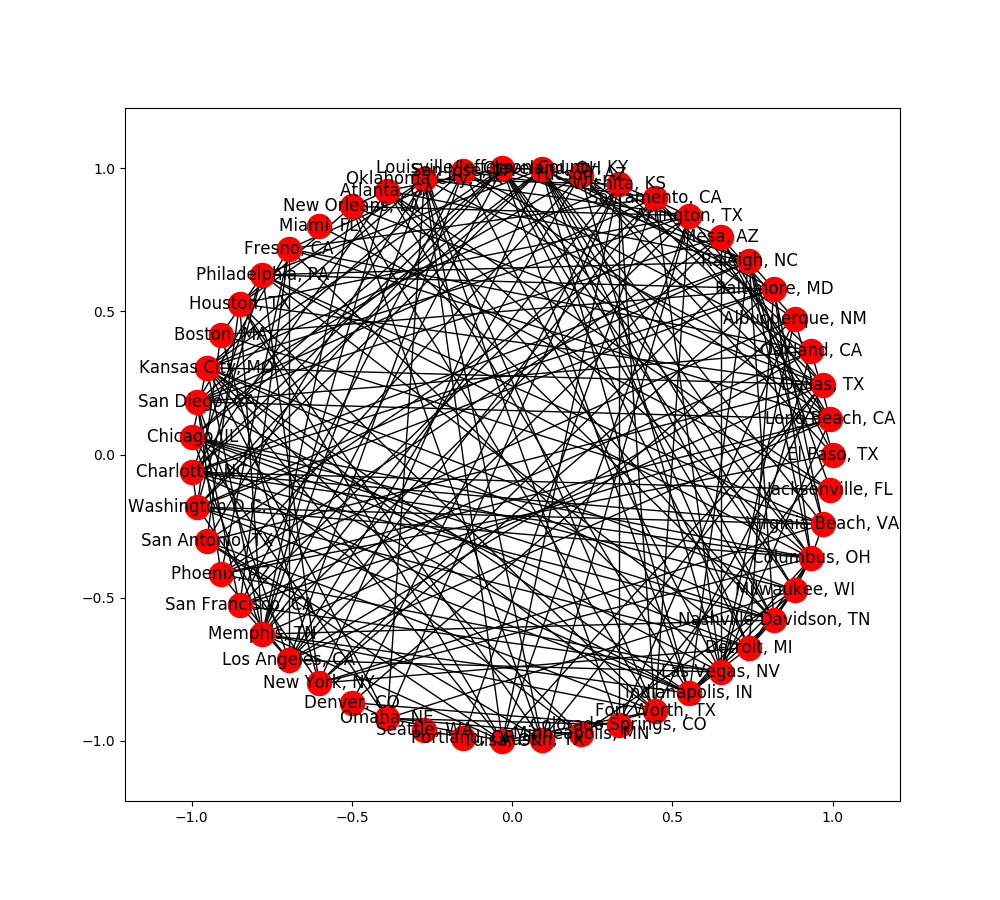<br/>
    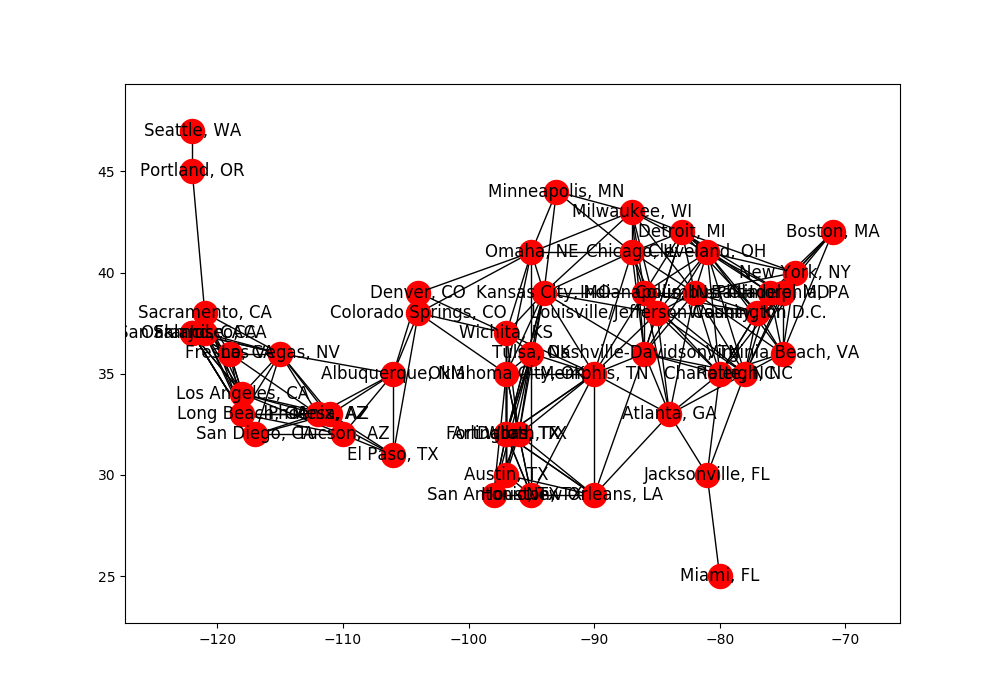
    <br/>
    
    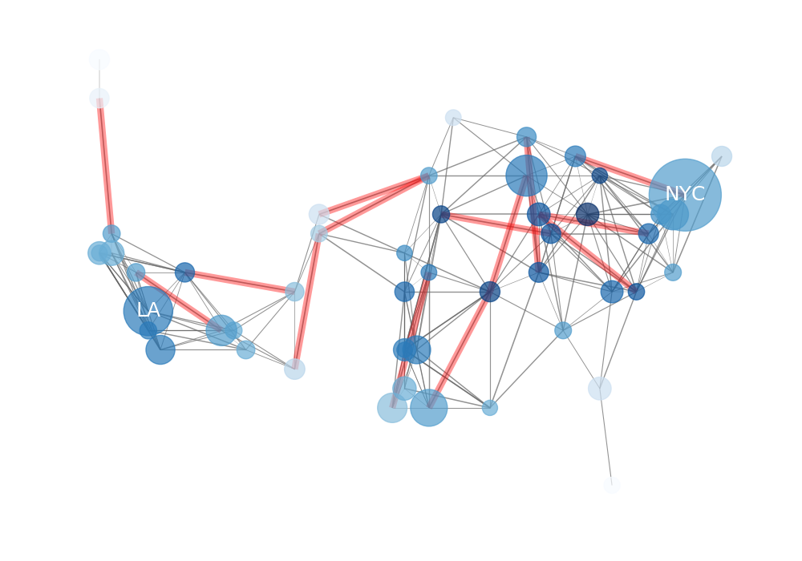
</a>

+ `nx.gpickle` function
    + Signature: `nx.read_gpickle(path)`
    + Docstring:: Read graph object in Python pickle format. Pickles are a serialized byte stream of a Python object. This format will preserve Python objects used as nodes or edges.
    + Parameters
        + `path` (file or string): File or filename to write. Filenames ending in .gz or .bz2 will be uncompressed.
    + Returns: `G` (graph): A NetworkX graph
    + Reference: http://docs.python.org/library/pickle.html

+ `nx.random_layout` function
    + Signature: `nx.random_layout(G, dim=2, scale=1.0, center=None)`
    + Docstring: Position nodes uniformly at random.
    + Notes
        + For every node, a position is generated by choosing each of dim coordinates uniformly at random on the default interval $[0.0, 1.0)$, or on an interval of length `scale` centered at `center`.
        + [NumPy](http://scipy.org) is required for this function.
    + Parameters
        + `G` (NetworkX graph or list of nodes): A position will be assigned to every node in G.
        + `dim` (int): Dimension of layout.
        + `scale` (float (default 1)): Scale factor for positions
        + `center` (array-like (default scale*0.5 in each dim)): Coordinate around which to center the layout.
    + Returns: `pos` (dict): A dictionary of positions keyed by node

+ `nx.circular_layout` function
    + Signature: `nx.circular_layout(G, dim=2, scale=1.0, center=None)`
    + Docstring:: Position nodes on a circle.
    + Parameters
        + `G`: NetworkX graph or list of nodes
        + `dim` (int): Dimension of layout, currently only dim=2 is supported
        + `scale` (float (default 1)): Scale factor for positions, i.e. radius of circle.
        + `center` (array-like (default origin)): Coordinate around which to center the layout.
    + Returns: `dict`: A dictionary of positions keyed by node

+ `nx.draw_networkx_edges` function
    + Signature: `nx.draw_networkx_edges(G, pos, edgelist=None, width=1.0, edge_color='k', style='solid', alpha=1.0, edge_cmap=None, edge_vmin=None, edge_vmax=None, ax=None, arrows=True, label=None, **kwds)`
    + Docstring: Draw the edges of the graph G. This draws only the edges of the graph G.
    + Parameters
        + `G` (graph): A networkx graph
        + `pos` (dictionary): A dictionary with nodes as keys and positions as values. Positions should be sequences of length 2.
        + `edgelist` (collection of edge tuples): Draw only specified edges(default=G.edges())
        + `width` (float, or array of floats): Line width of edges (default=1.0)
        + `edge_color` (color string, or array of floats): Edge color. Can be a single color format string (default='r'), or a sequence of colors with the same length as edgelist. If numeric values are specified they will be mapped to colors using the `edge_cmap` and `edge_vmin`, `edge_vmax` parameters.
        + `style` (string): Edge line style (default='solid') (solid|dashed|dotted,dashdot)
        + `alpha` (float): The edge transparency (default=1.0)
        + `edge_cmap` (Matplotlib colormap): Colormap for mapping intensities of edges (default=None)
        + `edge_vmin`, `edge_vmax` (floats): Minimum and maximum for edge colormap scaling (default=None)
        + `ax` (Matplotlib Axes object, optional): Draw the graph in the specified Matplotlib axes.
        + `arrows` (bool, optional (default=True)): For directed graphs, if True draw arrowheads.
        + `label` ([None| string]): Label for legend
    + Returns: `matplotlib.collection.LineCollection`: `LineCollection` of the edges
    + Note: For directed graphs, "arrows" (actually just thicker stubs) are drawn at the head end.  Arrows can be turned off with keyword arrows=False. Yes, it is ugly but drawing proper arrows with Matplotlib this way is tricky.

+ `nx.draw_networkx_nodes` function
    + Signature: `nx.draw_networkx_nodes(G, pos, nodelist=None, node_size=300, node_color='r', node_shape='o', alpha=1.0, cmap=None, vmin=None, vmax=None, ax=None, linewidths=None, label=None, **kwds)`
    + Docstring: Draw the nodes of the graph G. This draws only the nodes of the graph G.
    + Parameters
        + `G` (graph): A networkx graph
        + `pos` (dictionary): A dictionary with nodes as keys and positions as values. Positions should be sequences of length 2.
        + `ax` (Matplotlib Axes object, optional): Draw the graph in the specified Matplotlib axes.
        + `nodelist` (list, optional): Draw only specified nodes (default G.nodes())
        + `node_size` (scalar or array): Size of nodes (default=300).  If an array is specified it must be the same length as nodelist.
        + `node_color` (color string, or array of floats): Node color. Can be a single color format string (default='r'), or a  sequence of colors with the same length as nodelist. If numeric values are specified they will be mapped to colors using the `cmap` and `vmin,vmax` parameters.
        + `node_shape` (string): The shape of the node.  Specification is as matplotlib.scatter marker, one of `so^>v<dph8` (default='o').
        + `alpha` (float): The node transparency (default=1.0)
        + `cmap` (Matplotlib colormap): Colormap for mapping intensities of nodes (default=None)
        + `vmin,vmax` (floats): Minimum and maximum for node colormap scaling (default=None)
        + `linewidths` ([None | scalar | sequence]): Line width of symbol border (default =1.0)
        + `label` ([None| string]): Label for legend
    + Returns: `matplotlib.collections.PathCollection`: `PathCollection` of the nodes.

+ `nx.draw_networkx_labels` function
    + Signature: `nx.draw_networkx_labels(G, pos, labels=None, font_size=12, font_color='k', font_family='sans-serif', font_weight='normal', alpha=1.0, bbox=None, ax=None, **kwds)`
    + Docstring: Draw node labels on the graph G.
    + Parameters
        + `G` (graph): A networkx graph
        + `pos` (dictionary): A dictionary with nodes as keys and positions as values. Positions should be sequences of length 2.
        + `labels` (dictionary, optional (default=None)): Node labels in a dictionary keyed by node of text labels
        + `font_size` (int): Font size for text labels (default=12)
        + `font_color` (string): Font color string (default='k' black)
        + `font_family` (string): Font family (default='sans-serif')
        + `font_weight` (string): Font weight (default='normal')
        + `alpha` (float): The text transparency (default=1.0)
        + `ax` (Matplotlib Axes object, optional): Draw the graph in the specified Matplotlib axes.
    + Returns: `dict`: `dict` of labels keyed on the nodes

+ `nx.get_node_attributes` function
    + Signature: `nx.get_node_attributes(G, name)`
    + Docstring:: Get node attributes from graph
    + Parameters
        + `G`: NetworkX Graph
        + `name` (string): Attribute name
    + Returns: Dictionary of attributes keyed by node.


## TA Demonstration: Simple Network Visualizations in NetworkX

### Lecture Note

+ Other packages: side escape, Gephi, & Graphviz

### Lecture Video

<a href="https://d3c33hcgiwev3.cloudfront.net/NKwZAJMGEeeaCBKsFx-ifg.processed/full/360p/index.mp4?Expires=1548979200&Signature=f8qbx1iApYZmUARERk23msNAlWtmDE-v-TYET0dnyyF6hFUCsojfzw576Jf~gJ0~enHx7gMulImJRjfTZ-Vk1pYv5oQCVVhl4z6SiFFTAs6-wHtByjTW~KuDBuYHqJQriaSKz9jd1RH08P4WlvM5uh1URLxZcpOaECjh0zoXWhI_&Key-Pair-Id=APKAJLTNE6QMUY6HBC5A" alt="TA Demonstration: Simple Network Visualizations in NetworkX" target="_blank">
     
</a>


## Quiz: Module 2 Quiz

Q1. Consider the given network. What is the value of node F’s local clustering coefficient?
    <a href="https://www.coursera.org/learn/python-social-network-analysis/exam/tZYRH/module-2-quiz"> <br/>
        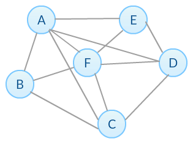
    </a>

    a. 0.5
    b. 0.6
    c. 0.7
    d. 0.8

    ANs: c, xb


Q2. Given the following two networks, which of the following is True?
    <a href="https://www.coursera.org/learn/python-social-network-analysis/exam/tZYRH/module-2-quiz"> <br/>
        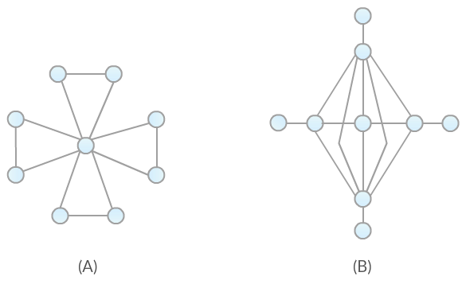
    </a>

    a. Network (A) has higher average local clustering coefficient and higher transitivity than (B).
    b. Network (A) has higher average local clustering coefficient but lower transitivity than (B).
    c. Network (A) has lower average local clustering coefficient and lower transitivity than (B).
    d. Network (A) has lower average local clustering coefficient but higher transitivity than (B).

    ANs: b, xa
    Ref: Transitivity vs. Average Clustering Coefficient


Q3. Consider the network shown below and select all that apply.
    <a href="https://www.coursera.org/learn/python-social-network-analysis/exam/tZYRH/module-2-quiz"> <br/>
        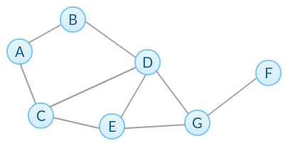
    </a>

    a. The radius of this network is half of its diameter.
    b. The deletion of node G will make the network disconnected.
    c. If we perform Breadth-First Search (BFS) from node A, the BFS tree we obtain will have a depth of 4.
    d. Node C and D are in the center of the network.
    e. F is the only in the periphery of the network.
    f. The eccentricity of node B and C are equal.

    Ans: abcf
    ```python
    import networkx as nx

    G = nx.Graph()
    G.add_edges_from([('A', 'B'), ('A', 'C'), ('B', 'D'), ('C', 'D'), ('C', 'E'), ('D', 'E'), ('D', 'G'), ('E', 'G'), ('G', 'F')])

    nx.center(G)            # ['D', 'E']
    nx.periphery(G)         # ['A', 'F']

    T = nx.bfs_tree(G, 'A')
    T.edges()
    # [('A', 'B'), ('A', 'C'), ('B', 'D'), ('C', 'E'), ('D', 'G'), ('G', 'F')]

    nx.eccentricity(G, 'B') # 3
    nx.eccentricity(G, 'C') # 3

    G.remove_node('G')
    nx.is_connected(G)      # False
    ```


Q4. Select all that apply for the network below.
    <a href="https://www.coursera.org/learn/python-social-network-analysis/exam/tZYRH/module-2-quiz"> <br/>
        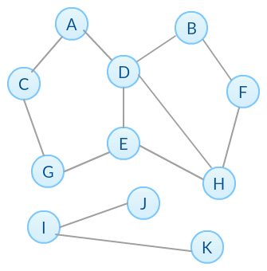
    </a>

    a. It is a disconnected graph with 2 connected components.
    b. If edge (E,G) is removed, the number of connected components will not change.
    c. The local clustering coefficient of node I is higher than node J and K.
    d. We can make the graph connected by adding edge (E,J).

    ANs: abd, xab, xabc
    ```python
    import networkx as nx

    G = nx.Graph()
    G.add_edges_from([('A', 'C'), ('A', 'D'), ('B', 'D'), ('B', 'F'), ('C', 'G'), ('D', 'E'), ('E', 'G'), ('E', 'H'), ('F', 'H'), ('D', 'H'), ('I', 'J'), ('I', 'K')])

    nx.number_connected_components(G)       # 2

    nx.clustering(G, 'I')                   # 0.0
    nx.clustering(G, 'J')                   # 0.0
    nx.clustering(G, 'K')                   # 0.0

    G.remove_edge('E', 'G')
    nx.number_connected_components(G)       # 2
    G.add_edges_from([('E', 'G')])

    G.add_edges_from([('E', 'J')])
    nx.is_connected(G)                      # true
    G.remove_edge('E', 'J')
    ```

Q5. Consider three networks (A), (B) and (C) below and select all that apply.
    <a href="https://www.coursera.org/learn/python-social-network-analysis/exam/tZYRH/module-2-quiz"> <br/>
        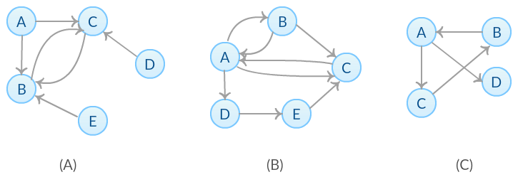
    </a>

    a. Only network (B) is a strongly connected graph.
    b. We can change network (A) from a weakly connected graph to a strongly connected graph by adding a directed edge from node C to node D.
    c. All edges in network (B) are needed for the network to be strongly connected.
    d. We only need to add one directed edge in order to change network (C) to a strongly connected graph.

    ANs: ad


Q6. Which of the following is true about network robustness and connectivity? Select all that apply.

    a. The closure of an airport and the cancellation of a flight route are examples of two different kinds of network attacks in the real world.
    b. Adding more edges to a network always makes it more robust.
    c. A network that has a high average local clustering coefficient always has a high node connectivity.
    d. Network robustness measures a network’s ability to maintain its connectivity.
    e. Adding edges to a network can never make the network less robust.

    ANs: ade, xad, xac, xabc, xabde


Q7. Consider the network given below. What's the node connectivity of the network?
    <a href="https://www.coursera.org/learn/python-social-network-analysis/exam/tZYRH/module-2-quiz"> <br/>
        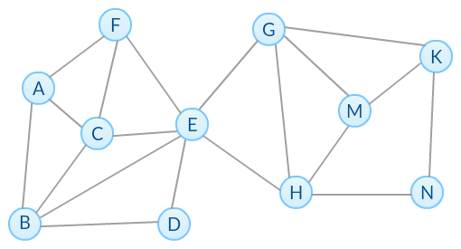
    </a>

    a. 1
    b. 2
    c. 3
    d. 4

    ANs: a


Q8. Consider the network given below. What is the edge connectivity of the network?
    <a href="https://www.coursera.org/learn/python-social-network-analysis/exam/tZYRH/module-2-quiz"> <br/>
        
    </a>

    a. 1
    b. 2
    c. 3
    d. 4

    ANs: b


Q9. The directed network below shows how information can be transferred between nodes. For example, node A can pass the information to node C directly but not vice-versa. If node C wants to send messages to node A, all data must be forwarded by node B.
    <a href="https://www.coursera.org/learn/python-social-network-analysis/exam/tZYRH/module-2-quiz"> <br/>
        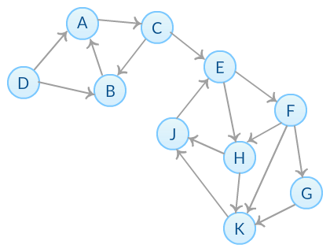
    </a>
    What is the total number of simple paths from node D to node K?

    a. 5
    b. 6
    c. 7
    d. 8
    e. 9

    ANs: d, xa
    # of paths (D -> E) = 2, # of paths (E -> K) = 4


Q10. The directed network below shows how information can be transferred between nodes. For example, node A can pass the information to node C directly but not vice-versa. If node C wants to send messages to node A, all data must be forwarded by node B.
    <a href="https://www.coursera.org/learn/python-social-network-analysis/exam/tZYRH/module-2-quiz"> <br/>
        
    </a>
    Suppose we want to block all information channels from node E to node K. Which of the following options achieve this goal? Check all that apply.

    a. Removing node H only
    b. Removing node G and H
    c. Removing node F and H
    d. Removing edge (H,K)
    e. Removing edges (H,K) and (E,F)
    f. Removing edges (H,K) and (F,G)

    ANs: ce


