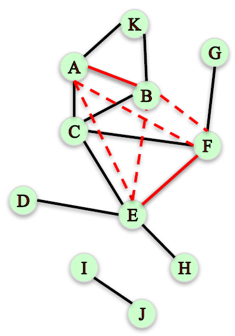
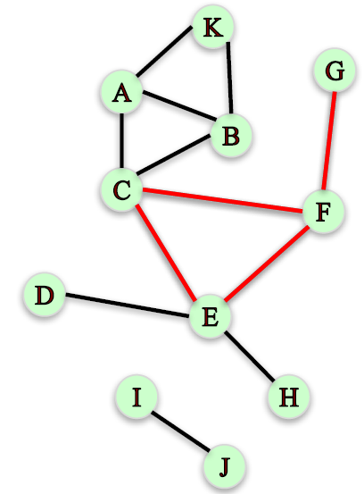

# Module 2: [Network Connectivity](02-Connectivity.md)

## Clustering Coefficient

### Lecture Note

+ Triadic Closure
    + __Triadic closure__: The tendency for people who share connections in a social network to become connected.
    + <n style="color:cyan">How can we measure the prevalence of triadic closure in a network?</b>

+ Local Clustering Coefficient
    + Local clustering coefficient of a node: Fraction of pairs of the node's friends that are friends with each other.
    + <n style="color:cyan">Compute the local clustering coefficient of node C</b>:

        $$\frac{\text{\# of pairs of C's friends who are friends}}{\text{\# of pairs of Cʹs friends}}$$

        + $\text{\# of C's friends} = 𝑑_c = 4$ <n style="color:red">(the "degree" of C)</b>
        + $\text{\# of pairs of Cʹs friends} = \frac{d_c (d_c - 1)}{2} = 12/2 = 6$
        + $\text{\# of pairs of Cʹs friends who are friends} = 2$

        $\text{Local clustering coefficent of C} = 2/6 = 1/ 3$
    <a href="https://harangdev.github.io/applied-data-science-with-python/applied-social-network-analysis-in-python/2/"> <br/>
        
        
        
        
    </a>
    + <n style="color:cyan">Compute the local clustering coefficient of node F</b>:

        $$\frac{\text{\# of pairs of Fʹs friends who are friends}}{\text{\# of pairs of Fʹs friends}}$$

        + $d_F = 3$
        + $\text{\# of pairs of Fʹs friends} = \frac{d_F (d_F - 1)}{2} = 6/2 = 3$
        + $\text{\# of pairs of Fʹs friends who are friends} = 1$

        $\text{Local clustering coefficent of F} =1/3$
    + <n style="color:cyan">Compute the local clustering coefficient of node J</b>:

        $$\frac{\text{\# of pairs of Jʹs friends who are friends}}{\text{\# of pairs of Jʹs friends}}$$

        + \# of pairs of Jʹs friends who are friends = 0 <n style="color:red"> (cannot divide by 0)</b>

        We will assume that the local clustering coefficient of a node of degree less than $2$ to be $0$.
    <a href="https://harangdev.github.io/applied-data-science-with-python/applied-social-network-analysis-in-python/2/"> <br/>
         (Node F)
         (Node J)
    </a>
    + __Local clustering coefficient in NetworkX__:
        ```python
        G = nx.Graph()
        G.add_edges_from([('A', 'K'), ('A', 'B'), ('A', 'C'), ('B', 'C'), ('B', 'K'),
        ('C', 'E'), ('C', 'F'), ('D', 'E'), ('E', 'F'), ('E', 'H'), ('F', 'G'), ('I', 'J')])

        nx.clustering(G, 'F')
        # 0.3333333333333333

        nx.clustering(G, 'A')
        # 0.6666666666666666

        nx.clustering(G, 'J')
        # 0.0
        ```

+ Global Clustering Coefficient
    + Measuring clustering on the whole network:
    + __Approach 1__: Average local clustering coefficient over all nodes in the graph.
        ```python
        nx.average_clustering(G)
        # 0.28787878787878785
        ```
    + __Measuring clustering on the whole network (Approach 2)__:
        + Percentage of "open triads" that are triangles in a network.
        <a href="urhttps://harangdev.github.io/applied-data-science-with-python/applied-social-network-analysis-in-python/2/l"> <br/>
            
        </a>
    + Measuring clustering on the whole network:
        + __Transitivity__: Ratio of number of triangles and number of "open triads" in a network.
            ```python
            nx.transitivity(G)
            # 0.409090909091
            ```

+ Transitivity vs. Average Clustering Coefficient
    + Both measure the tendency for edges to form triangles.
    + Transitivity weights nodes with large degree higher.
        <a href="urhttps://harangdev.github.io/applied-data-science-with-python/applied-social-network-analysis-in-python/2/l"> <br/>
            
        </a>

+ Summary
    + __Clustering coefficient__ measures the degree to which nodes in a network tend to “cluster” or form triangles.
    + __Local Clustering Coefficient__: Fraction of pairs of the node's friends that are friends with each other.

        $$\text{LCC of C} = \frac{2}{6} = \frac{1}{3}$$
    + __Global Clustering Coefficient__
        + __Average Local Clustering Coefficient__: `nx.average_clustering(G)`
        + __Transitivity__
            + Ratio of number of triangles and number of “open triads”.
            + Puts larger weight on high degree nodes.
            + `nx.transitivity(G)`


### Lecture Video

<a href="https://d3c33hcgiwev3.cloudfront.net/X4oOAnxFEeeR4BLAuMMnkA.processed/full/360p/index.mp4?Expires=1548892800&Signature=jaKakh9T7ryPe9CyCEO~xnGGaXzWlDf-0I1drKoChs2UTmTm0jCxlpEwvORtsgjwfJDifeIe59za0sWRVllRqtX~NpCKko59xHth4LGjLRpqnQ7pncK~ri8iVlxMc6oDd5hE7aGgMI1A3YqH35JO6fvupWBVuKWWJa9t-s-KBow_&Key-Pair-Id=APKAJLTNE6QMUY6HBC5A" alt="Clustering Coefficient" target="_blank">
     
</a>


## Distance Measures

### Lecture Note


+ Demonstration
    ```python

    ```

### Lecture Video

<a href="url" alt="Distance Measures" target="_blank">
     
</a>


## Connected Components

### Lecture Note


+ Demonstration
    ```python

    ```

### Lecture Video

<a href="url" alt="Connected Components" target="_blank">
     
</a>


## Network Robustness

### Lecture Note


+ Demonstration
    ```python

    ```

### Lecture Video

<a href="url" alt="Network Robustness" target="_blank">
     
</a>


## Notebook: Simple Network Visualizations in NetworkX

### Lecture Note


+ Demonstration
    ```python

    ```

### Lecture Video

<a href="url" alt="text" target="_blank">
     
</a>


## TA Demonstration: Simple Network Visualizations in NetworkX

### Lecture Note


+ Demonstration
    ```python

    ```

### Lecture Video

<a href="url" alt="TA Demonstration: Simple Network Visualizations in NetworkX" target="_blank">
     
</a>


## Quiz: Module 2 Quiz


