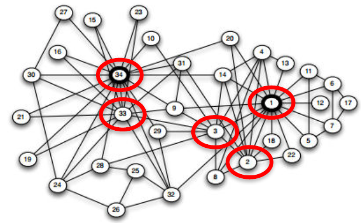
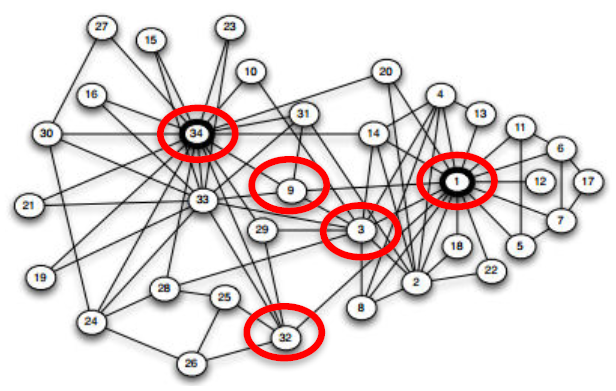
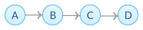
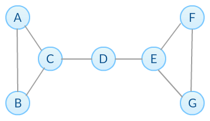
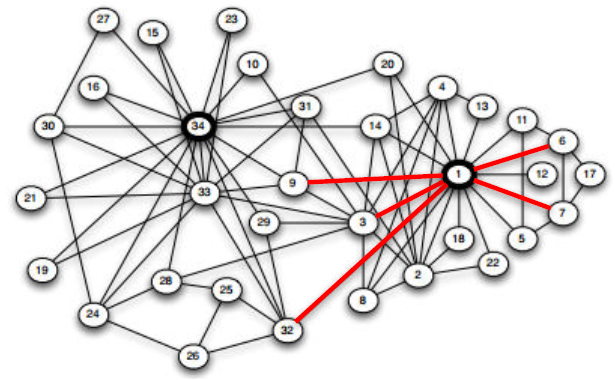
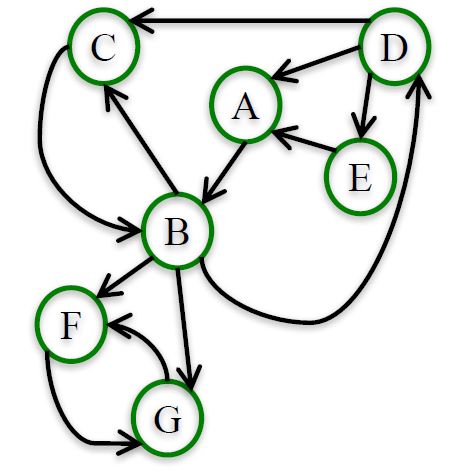

# Module 3: Influence Measures and Network Centralization

## Degree and Closeness Centrality

### Lecture Notes

+ Node Importance
    + Based on the structure of the network, which are the 5 most important node in the Karate Club friendship network?
    + Different ways of thinking about “importance”.
        + Ex. Degree: number of friends. 5 most important nodes are: 34, 1, 33, 3, 2
        + Ex. Average proximity to other nodes. 5 most important nodes are: 1, 3, 34, 32, 9
        + Ex. Fraction of shortest paths that pass through node. 5 most important nodes are: 1, 34, 33, 3, 32
    <a href="https://anthonybonato.com/2016/04/13/the-mathematics-of-game-of-thrones/"> <br/>
        
    </a>
    <a href="https://www.coursera.org/learn/python-social-network-analysis/lecture/noB1S/degree-and-closeness-centrality">
         <br/>
        
        
    </a>

+ Network Centrality <br/>
    Centrality measures identify the most important nodes in a network:
    + Influential nodes in a social network.
    + Nodes that disseminate information to many nodes or prevent epidemics.
    + Hubs in a transportation network.
    + Important pages on the Web.
    + Nodes that prevent the network from breaking up.

+ Centrality Measures
    + __Degree centrality__
    + __Closeness centrality__
    + Betweenness centrality
    + Load centrality
    + Page Rank
    + Katz centrality
    + Percolation centrality

+ Degree Centrality
    + Assumption: important nodes have many connections.
    + The most basic measure of centrality: number of neighbors.
    + Undirected networks: use degree Directed networks: use in-degree or out-degree

+ Degree Centrality – Undirected Networks

    $$C_{deg}(v) = \frac{d_v}{|N| - 1}$$
    + $N$: the set of nodes in the network
    + $d_v$: the degree of node $v$
    <a href="https://anthonybonato.com/2016/04/13/the-mathematics-of-game-of-thrones/"> <br/>
        
    </a>
    ```python
    G = nx.karate_club_graph()
    G = nx.convert_node_labels_to_integers(G,first_label=1)
    degCent = nx.degree_centrality(G)

    degCent[34]
    # 0.515 # 17/33

    degCent[33]
    # 0.182 # 6/33
    ```

+ Degree Centrality – Directed
    + In-bound:

        $$C_{indeg}(v) = \frac{d_v^{in}}{|N| - 1}$$
        + $N$: the set of nodes in the network
        + $d_v^{in}$: the in-degree of node $v$
        <a href="url"> <br/> 
            
        </a>
        ```python
        indegCent = nx.in_degree_centrality(G)

        indegCent['A']
        # 0.143 # 2/14

        indegCent['L']
        # 0.214 # 3/14
        ```
    + Outbound:

        $$C_{outdeg}(v) = \frac{d_v^{out}}{|N| - 1}$$
        + $N$: the set of nodes in the network
        + $d_v^{out}$: the out-degree of node $v$

        ```python
        outdegCent = nx.out_degree_centrality(G)
        
        outdegCent['A']
        # 0.214 # 3/14

        indegCent['L']
        # 0.071 # 1/14
        ```

+ Closeness Centrality <br/>
    Assumption: important nodes are close to other nodes.

    $$C_{close}(v) = \frac{|N| - 1}{\sum_{u \in N \backslash \{v\}} d(v, u)}$$
    + $N$: set of nodes in the network
    + $d(v, u)$: length of shortest path from 𝑣 to 𝑢.
    <a href="https://anthonybonato.com/2016/04/13/the-mathematics-of-game-of-thrones/"> <br/>
        
    </a>
    ```python
    closeCent = nx.closeness_centrality(G)

    closeCent[32]                                   # 0.541
    sum(nx.shortest_path_length(G,32).values())     # 61
    (len(G.nodes())-1)/61.                          # 0.541
    ```

+ Disconnected Nodes
    + How to measure the closeness centrality of a node when it cannot reach all other nodes?
    + <n style="color:red">What is the closeness centrality of node L?</n>
    <a href="url"> <br/> 
        
    </a>
    + Option 1: Consider only nodes that $L$ can reach:

        $$C_{close}(L) = \frac{|R(L)|}{\sum_{u \in R(L)} d(L, u)}$$
        + $R(L)$: the set of nodes L can reach.
        + $C_{close}(L) = 1/1 = 1$, since $L$ can only reach $M$ and it has a shortest path of length 1. 
        + __Problem__: centrality of 1 is too high for a node than can only reach one other node!
    + Option 2: Consider only nodes that $L$ can reach and normalize by the fraction of nodes $L$ can reach:

        $$C_{close} (L) = \frac{|R(L)|}{|N| - 1} \times \frac{|R(L)|}{\sum_{u \in (L)} d(L, u)}$$

        $$C_{close} (L) = \frac{1}{14} \times \frac{1}{1} = 0.071$$
        + Note that this definition matches our definition of closeness centrality when a graph is connected since $R(L) = N − 1$
    + Programming
        ```python
        closeCent = nx.closeness_centrality(G, normalized = False)
        closeCent['L']      # 1

        closeCent = nx.closeness_centrality(G, normalized = True)
        closeCent['L']      # 0.071
        ```
    + IVQ: Which node has the highest closeness centrality under option 1, where we only consider the distance to reachable nodes? Note: the closeness centrality of nodes that cannot reach any other nodes is always zero.
        <a href="https://www.coursera.org/learn/python-social-network-analysis/lecture/noB1S/degree-and-closeness-centrality"> <br/>
                
        </a>

        Ans: C <br/>
        Under option 1, node C has closeness centrality of 1, the highest of all nodes, because it can only reach D and it reaches in one step.
    + IVQ: Which node has the highest closeness centrality under option 2, where we normalize by the fraction of nodes a node can reach ? Note: the closeness centrality of nodes that cannot reach any other nodes is always zero. (same diagram)

        Ans: A
        Under option 2, node A has closeness centrality of ½, the highest of all nodes. A can reach all other nodes in the network: B in 1 step, C in 2 steps, and D in 3 steps. Hence, A's closeness centrality is $(3/3)(3/6) = ½$.

+ Summary <br/>
    Centrality measures identify the most important nodes in a network:
    + Degree Centrality <br/>
        Assumption: important nodes have many connections.

        $$C_{deg} (v) = \frac{d_v}{|N| - 1}$$
        ```python
        nx.degree_centrality(G)
        nx.in_degree_centrality(G)
        nx.out_degree_centrality(G)
        ```
    + Closeness Centrality <br/>
        Assumption: important nodes are close to other nodes.

        $$C_{close} (L) = [\frac{|R(L)|}] \frac{|R(L)|}{\sum_{u \in R(L)}d(L, u)}$$
        ```python
        nx.closeness_centrality(G, normalized = True)
        ```


### Lecture Video

<a href="https://d3c33hcgiwev3.cloudfront.net/gut-1JTMEeeRmQ5TE1Qolg.processed/full/360p/index.mp4?Expires=1549152000&Signature=IaL9f58-joxTFQ5t6xL40ICRAV8MGmc~-AYffdEPOEe33nht-WQGf6JRnKvEZ64OFRhPSizfbr3-c~bk4beAO7Gg6yJXT857VSajVDenRnzjxZktlHEmi9hCTcJb1dFcEQghiM8UbR39CfE~b5sYwwIj5P2YK7xkjJhKBleLql4_&Key-Pair-Id=APKAJLTNE6QMUY6HBC5A" alt="Degree and Closeness Centrality" target="_blank">
     
</a>


## Betweenness Centrality

### Lecture Notes

+ Betweenness Centrality - Undirected Graph
    + Assumption: important nodes connect other nodes.

        $$C_{btw} (v) = \sum_{s, t \in N} \frac{\sigma_{s,t} (v)}{\sigma_{s, t}}$$
        + $\sigma_{s,t}$: the number of shortest paths between nodes $s$ and $t$
        + $\sigma_{s, t} (v)$: the number shortest paths between nodes $s$ and $t$ that pass through node $v$.
    + __Endpoints__: we can either include or exclude node $𝑣$ as node $𝑠$ and $𝑡$ in the computation of $C_{btw} (𝑣)$ .
    + Ex. If we exclude node $𝑣$, we have:

        $$C_{btw} (B) = \frac{\sigma_{A,D} (B)}{\sigma_{A,D}} + \frac{\sigma_{A, C} (B)}{\sigma_{A,C}} + \frac{\sigma_{C,D} (B)}{\sigma_{C,D}} = \frac{1}{1} + \frac{1}{1} + \frac{0}{1} = 2$$
        If we include node $v$, we have:

        $$C_{btw} (B) = \frac{\sigma_{A,B} (B)}{\sigma_{A,B}} + \frac{\sigma_{A, C} (B)}{\sigma_{A,C}} + \frac{\sigma_{A,D} (B)}{\sigma_{A,D}} + \frac{\sigma_{B,C} (B)}{\sigma_{B,C}} + \frac{\sigma_{B,D} (B)}{\sigma_{B,D}} + \frac{\sigma_{C,D} (B)}{\sigma_{C,D}} = \frac{1}{1} + \frac{1}{1} + \frac{1}{1} + \frac{1}{1} + \frac{1}{1} + \frac{0}{1} = 5$$
        <a href="https://www.coursera.org/learn/python-social-network-analysis/lecture/5rwMl/betweenness-centrality"> <br/>
            
            
        </a>
    + IVQ: Given the following network, which node has the highest betweenness (excluding endpoints)? What's the betweenness score (excluding endpoints) of this node? Give your answer in the following format: X, #
        <a href="https://www.coursera.org/learn/python-social-network-analysis/lecture/5rwMl/betweenness-centrality"> <br/>
            
        </a>

        Ans: D, 9 <br/>
        Node D lies on all the shortest paths starting from nodes {A, B, C} to nodes {E, F, G}, and there is no alternative paths for these 9 node pairs, hence node D has the highest betweenness 9.


+ Disconnected Nodes - Directed Graph
    + Assumption: important nodes connect other nodes.

        $$C_{btw} (v) = \sum_{s, t \in N} \frac{\sigma_{s,t} (v)}{\sigma_{s, t}}$$
    + <n style="color:red">What if not all nodes can reach each other?</n> (see directed graph below)
    + Node D cannot be reached by any other node. Hence, $\sigma_{A,D} = 0$, making the above definition undefined.
    + When computing betweenness centrality, only consider nodes $𝑠$, $𝑡$ such that there is at least one path between them.
    + Node D cannot be reached by any other node. Hence, $\sigma_{A,D} = 0$, making the above definition undefined.
    + Ex. What is the betweenness centrality of node B, without including it as endpoint?

        $$C_{btw} (B) = \frac{\sigma_{A,C} (B)}{\sigma_{A,C}} + \frac{\sigma_{C,A} (B)}{\sigma_{C,A}} + \frac{\sigma_{D,C} (B)}{\sigma_{D,C}} + \frac{\sigma_{D,A} (B)}{\sigma_{D,A}} = \frac{1}{1} + \frac{0}{1} + \frac{0}{1} + \frac{0}{1} = 1$$
    + Ex. What is the betweenness centrality of node C, without including it as endpoint?

        $$C_{btw} (C) = \frac{\sigma_{A,B} (C)}{\sigma_{A,B}} + \frac{\sigma_{B,A} (C)}{\sigma_{B,A}} + \frac{\sigma_{D,B} (C)}{\sigma_{D,B}} + \frac{\sigma_{D,A} (C)}{\sigma_{D,A}} = \frac{0}{1} + \frac{1}{1} + \frac{0}{1} + \frac{1}{1} = 2$$
        <a href="https://www.coursera.org/learn/python-social-network-analysis/lecture/5rwMl/betweenness-centrality"> 
            
            
            
        </a>

+ Betweenness Centrality - Normalization
    + __Normalization__: betwenness centrality values will be larger in graphs with many nodes. To control for this, we divide centrality values by the number of pairs of nodes in the graph (excluding $𝑣$):
        + $\frac{1}{2} (|𝑁| − 1)( 𝑁 − 2)$ in undirected graphs
        + $(|𝑁| − 1)( 𝑁 − 2)$ in directed graphs
    + Programming
        ```python
        btwnCent = nx.betweenness_centrality(G, normalized = True, endpoints = False)

        import operator
        sorted(btwnCent.items(), key=operator.itemgetter(1), reverse = True)[0:5]
        # [(1, 0.43763528138528146), (34, 0.30407497594997596), (33, 0.14524711399711399),
        #  (3, 0.14365680615680618), (32, 0.13827561327561325)]
        ```
    <a href="https://anthonybonato.com/2016/04/13/the-mathematics-of-game-of-thrones/"> 
        
    </a>
    <a href="https://www.nejm.org/doi/full/10.1056/NEJMsa066082"> 
        
    </a>
    <a href="https://www.coursera.org/learn/python-social-network-analysis/lecture/noB1S/degree-and-closeness-centrality">
        
    </a>

    + IVQ: For the same network, what is the normalized betweenness centrality (excluding endpoints) of node D?
        <a href="https://www.coursera.org/learn/python-social-network-analysis/lecture/5rwMl/betweenness-centrality"> <br/>
            
        </a>

        Ans: 0.6 <br/>
        There are 6 nodes in this network (excluding node D), therefore, after normalization, the normalized betweenness is 9/(6*5/2) = 0.6

+ Betweeness Centrality - Complexity
    + Computing betweenness centrality of all nodes can be very computationally expensive.
    + Depending on the algorithm, this computation can take up to $𝑂(|𝑁|^3)$ time.
    + Eg., Network of friendship, marital tie, and family tie among 2200 people [Christakis & Fowler 2007]: <br/> N = 2200 nodes $\rightarrow$ ~4.8million pairs of nodes
    + __Approximation__: rather can computing betweenness centrality based on all pairs of nodes $𝑠$, $𝑡$, we can approximate it based on a sample of nodes.
    ```python
    # Approximation
    btwnCent_approx = nx.betweenness_centrality(G, normalized = True, endpoints = False, k = 10)
    sorted(btwnCent_approx.items(), key=operator.itemgetter(1), reverse = True)[0:5]
    # [(1, 0.48269390331890333), (34, 0.27564694564694564), (32, 0.20863636363636362), 
    # (3, 0.1697598003848004), (2, 0.13194624819624817)]

    # subsets
    btwnCent_subset = nx.betweenness_centrality_subset(G, [34, 33, 21, 30, 16, 27, 15, 23, 10], [1, 4, 13, 11, 6, 12, 17, 7], normalized=True)
    sorted(btwnCent_subset.items(),key=operator.itemgetter(1), reverse=True)[0:5]
    # [(1, 0.04899515993265994), (34, 0.028807419432419434), (3, 0.018368205868205867),
    #  (33, 0.01664712602212602), (9, 0.014519450456950456)]
    ```
    <a href="https://www.coursera.org/learn/python-social-network-analysis/lecture/noB1S/degree-and-closeness-centrality">
        
        
    </a>

+ Betweenness Centrality – Edges
    + We can use betweenness centrality to find important edges instead of nodes:

        $$C_{btw} (e) = \sum_{s,t \in N} \frac{\sigma_{s,t} (e)}{\sigma_{s,t}}$$
        + $\sigma_{s,t}$: the number of shortest paths between nodes $𝑠$ and $𝑡$.
        + $\sigma_{s,t} (e)$: the number shortest paths between nodes $𝑠$ and $𝑡$ that pass through edge $𝑒$.
    ```python
    # Edges
    btwnCent_edge = nx.edge_betweenness_centrality(G, normalized=True)
    sorted(btwnCent_edge.items(), key=operator.itemgetter(1), reverse = True)[0:5]
    # [((1, 32), 0.12725999490705373), ((1, 7), 0.07813428401663694), ((1, 6), 0.07813428401663694),
    #  ((1, 3), 0.0777876807288572), ((1, 9), 0.07423959482783014)]

    # subsets
    btwnCent_edge_subset = nx.edge_betweenness_centrality_subset(G, [34, 33, 21, 30, 16, 27, 15, 23, 10], [1, 4, 13, 11, 6, 12, 17, 7], normalized=True)
    sorted(btwnCent_edge_subset.items(), key=operator.itemgetter(1), reverse = True)[0:5]
    # [((1, 32), 0.01366536513595337), ((1, 9), 0.01366536513595337), ((14, 34), 0.012207509266332794),
    #  ((1, 3), 0.01211343123107829), ((1, 7), 0.012032085561497326)]
    ```
    <a href="https://www.coursera.org/learn/python-social-network-analysis/lecture/noB1S/degree-and-closeness-centrality">
        
        
    </a>

+ Summary
    + Betweenness centrality assumption: important nodes connect other nodes.

        $$C_{btw} (v) = \sum_{s, t \in N} \frac{\sigma_{s,t} (v)}{\sigma_{s,t}}$$
    + __Normalization__: Divide by number of pairs of nodes.
    + __Approximation__: Computing betweenness centrality can be computationally expensive. We can approximate computation by taking a subset of nodes.
    + __Subsets__: We can define subsets of source and target nodes to compute betweenness centrality.
    + __Edge betweenness centrality__: We can apply the same framework to find important edges instead of nodes.


### Lecture Video

<a href="https://d3c33hcgiwev3.cloudfront.net/iaUb3xmEeeoMBL4ko9vzA.processed/full/360p/index.mp4?Expires=1549238400&Signature=H8YFhrG61Q2CaiQJwCeKOdZG49hwJvVf1OakgcvbFpYd9KUiR-MeIDw0-473~FCoBm1aMhUCBIrUxCbv8Hxti3ehiEUIlaDM9OHA3ymRANH0S06L~wz0bSRIutGTZxCFwdvFIAE3uJrXH52GMdwZAn9N3a3CIw921t0LgXSs1RU_&Key-Pair-Id=APKAJLTNE6QMUY6HBC5A" alt="Betweenness Centrality" target="_blank">
     
</a>


## Basic Page Rank

### Lecture Notes

+ PageRank
    + Developed by Google founders to measure the importance of webpages from the hyperlink network structure.
    + PageRank assigns a score of importance to each node. Important nodes are those with many in-links from important pages.
    + PageRank can be used for any type of network, but it is mainly useful for directed networks.
    + A node's PageRank depends on the PageRank of other nodes (Circular definition?).
    <a href="http://www.isglobalweb.com/industry-news/55/#gref"> <br/>
        
    </a>
    + $n$ = number of nodes in the network <br/>
        k = number of steps

        1. Assign all nodes a PageRank of $1/𝑛$
        2. Perform the Basic PageRank Update Rule $k$ times.
    + __Basic PageRank Update Rule__: Each node gives an equal share of its current PageRank to all the nodes it links to.

        $$p_{N,k} = \sum_{i \in I_N} p_{i,o} \times p_{i,(k-1)}$$
        + $p_{N,k}$: the probability of node $N$ at $k$th iteration
        + $I_N$: the set of nodes with outward edges toward Node $N$
        + $p_{i, o}$: the probability of Node $i$ whicj takes the edge toward Node $N$, recipocial of the number of outward edges on node $i$
        + $p_{i, (k-1)}$: the probability of node $i$ at $(k-1)$ iteration
        + Initial iteration: all nodes w/ the same probability
    + The new PageRank of each node is the sum of all the PageRank it received from other nodes.
    + Who should be the most “important” node in this network?
    + Calculate the PageRank of each node after 2 steps of the procedure $(𝑘 = 2)$.
    <a href="https://harangdev.github.io/applied-data-science-with-python/applied-social-network-analysis-in-python/3/"> <br/>
        
        
    </a>
     + What if continue with $k=4,5,6, \ldots$?
    + Final result
        |  | A | B | C | D | E |
        |--|---|---|---|---|---|
        | $k=1$ | 1/5 | 1/5 | 1/5 | 1/5 | 1/5 |
        | $k=2$ | 1/10 | 13/30 | 7/30 | 2/10 | 1/30 |
        | $k=2$ | .1 | .43 | .23 | /20 | .03 |
        | $k=3$ | .1 | .33 | .28 | .22 | .06 |
        | ... | ... | ... | ... | ... | ... |
        | $k=\infty$ | .12 | .38 | .25 | .19 | .06 |
    + For most networks, PageRank values converge.

+ Summary
    + Steps of Basic PageRank:
        1. All nodes start with PageRank of 1/𝑛
        2. Perform the Basic PageRank Update Rule k times:
            + Basic PageRank Update Rule: Each node gives an equal share of its current PageRank to all the nodes it links to.
            + The new PageRank of each node is the sum of all the PageRank it received from other nodes.
    + For most networks, PageRank values converge as $k$ gets larger $(𝑘 \rightarrow \infty$)

+ IVQ: In directed networks, nodes with higher in-degree always have higher PageRank.

    Ans: False <br/>
    Nodes with fewer in-degrees may have a high Page Rank when they are connected to a more important node.


### Lecture Video

<a href="https://d3c33hcgiwev3.cloudfront.net/D6AY0XxEEeeR4BLAuMMnkA.processed/full/360p/index.mp4?Expires=1549324800&Signature=kMFYzMPZR4FG-4093ffR0NGM3e0B7Fjw6Xw43sn41-ZbMJvVurl~4bux9WYTyG6oKUvPoGQ81-nL6hCn~uyiNH4bFpzhh0KoQ2kuHieVmQD9t3j4ui7lAjCg9Wp3TKTuh0kKrA8kYHq3wzAwdCkmhVbRgJoyofkT0GbOyMayvBc_&Key-Pair-Id=APKAJLTNE6QMUY6HBC5A" alt="Basic Page Rank" target="_blank">
     
</a>


## Scaled Page Rank

### Lecture Notes

+ Interpreting PageRank
    + The PageRank of a node at step $𝑘$ is the probability that a 
    random walker lands on the node after taking $𝑘$ steps.
    + __Random walk of $k$ steps__: Start on a random node. Then choose an outgoing edge at random and follow it to the next node. Repeat $𝑘$ times. For example, a random walk of 5 steps on this graph looks like this: (Last section graph)
        1. Choose a random outgoing edge (D). Follow the edge (D->A) to the next node (A).
        2. Choose a random outgoing edge (A->B) and follow it (B).
        3. Choose a random outgoing edge (B->C) and follow it (C).
        4. Choose a random outgoing edge (C->B) and follow it (B).
        5. Choose a random outgoing edge (B->D) and follow it (D).
        6. ...
    + Page Rank
        |   | A | B | C | D | E |
        |---|---|---|---|---|---|
        | $k=\infty$ | .12 | .38 | .25 | .19 | .06 |

+ PageRank Problem
    + <n style="color:cyan"> What's the PageRank of the nodes in this network? [Hint: think about the random walk interpretation]  <n/>
    + For a large enough $𝑘$: `F` and `G` each have PageRank of $1/2$ and all the other nodes have PageRank $0$.
    + Why? Imagine a random walk on this network. Whenever the walk lands on F or G, it is “stuck” on F and G.
    + This seems problematic!
    <a href="https://www.coursera.org/learn/python-social-network-analysis/lecture/xxW11/scaled-page-rank"> <br/>
        
    </a>
    + Solution: introduce a “damping parameter” $\alpha$
    + __Random walk of $k$ steps with damping parameter $𝜶$__:
        1. Start on a random node.
        2. with probability $\alpha$, choose an outgoing edge at random follow it to the next node. Otherwise, with probability $1 - \alpha$, choose a node at random and jump to it.
        3. Repeat $𝑘$ times.
    + The random walk is no longer “stuck” on nodes `F` and `G`. 

+ Scaled PageRank
    + The __Scaled PageRank__ of 𝑘 steps and damping factor $\alpha$ of a node $𝑛$ is the probability that a random walk with damping factor $\alpha$ lands on a $𝑛$ after $𝑘$ steps.
    + For most networks, as $𝑘$ gets larger, Scaled PageRank converges to a unique value, which depends on $\alpha$.
    + In practice, we use a parameter of $\alpha$ between $0.8$ and $0.9$.
    + E.g., Scaled PageRank ($\alpha = .8$, $k$ large)
        + F and G still have high PageRank, but not all the PageRank.
    + Damping factor works better in very large networks like the Web or large social networks.
    + Use NetworkX function `pagerank(G, alpha=0.8)` to compute Scaled PageRank of network G with damping parameter alpha.

+ Summary
    + The Basic PageRank of a node can be interpreted as the probability that a random walk lands on the node after $𝑘$ random steps.
    + Basic PageRank has the problem that, in some networks, a few nodes can “suck up” all the PageRank from the network.
    + To fix this problem, Scaled PageRank introduces a parameter $\alpha$, such that the random walker chooses a random node to jump to with probability $1 − \alpha$.
    + Typically $\alpha = [0.8, 0.9]$
    + NetworkX function `pagerank(G, alpha=0.8)` computes Scaled PageRank of network G with damping parameter $\alpha=0.8$.


### Lecture Video

<a href="https://d3c33hcgiwev3.cloudfront.net/ORse-JTLEeeOmgqEJWRlfA.processed/full/360p/index.mp4?Expires=1549324800&Signature=RtvWumFTbEVTgmTHutaNMPVXtFBcg0WVjQWxYWQc7~7V9A8f-Qw6gL4VccyQWDZQMNMhYmZ3HT-uimX076DuxOkxEiew6AllFzEHPjcKGau8QzkukJDDF2UB3-mVnuZGU6zZiUXd~9hKf2JoYdSOvzbIc3E1fQKcx2pnmYnvXYU_&Key-Pair-Id=APKAJLTNE6QMUY6HBC5A" alt="Scaled Page Rank" target="_blank">
     
</a>


## Hubs and Authorities

### Lecture Notes

+ Hubs and Authorities <br/>
    Given a query to a search engine:
    + __Root__: set of highly relevant web pages (e.g. pages that contain the query string) – potential _authorities_.
    + Find all pages that link to a page in root – potential _hubs_.
    + __Base__: root nodes and any node that links to a node in root.
    + Consider all edges connecting nodes in the base set.
    <a href="https://harangdev.github.io/applied-data-science-with-python/applied-social-network-analysis-in-python/3/"> <br/>
        
    </a>

+ HITS Algorithm  <br/>
    Computing $𝑘$ iterations of the HITS algorithm to assign an _authority score_ and _hub score_ to each node.
    1. Assign each node an authority and hub score of $1$.
    2. Apply the __Authority Update Rule__: each node's _authority_ score is the sum of _hub_ scores of each node that _points to it_.
        
        $$auth(i, k) = \sum_{j \in In_i} hub(j, k-1), \forall i \in N$$
        + $auth(i, k)$: the authority score of node $i$ at iteration $k$
        + $In_i$: the set of nodes with outward edges to node $i$ (inward edge w.r.t. node $i$)
        + $N$: all nodes in graph
        + $hub(j, k-1)$: the hub score of node $j$ at iteration $(k-1)$
    3. Apply the __Hub Update Rule__: each node's _hub_ score is the sum of _authority_ scores of each node that _it points to_.

        $$hub(i, k) = \sum_{j \in Out_i} auth(j, k-1), \forall i \in N$$
        + $hub(i, k)$: the hub score of node $i$ at iteration $k$
        + $Out_i$: the set of nodes with inward edges from node $i$ (outward edge w.r.t. node $i$)
        + $auth(j, k-1)$: the authority score of node $j$ at iteration $(k-1)$
    4. __Nomalize__ Authority and Hub scores: $auth(𝑗) = \frac{auth(j)}{\sum_{i \in N} auth(j)}$ and $hub(𝑗) = \frac{hub(j)}{\sum_{i \in N} hub(j)}$
    5. Repeat $𝑘$ times.

+ HITS Algorithm Example
    + Compute 2 iterations of the HITS algorithm on this network.
    + Assign each node an auth and hub score of $1$ ($k=0$)
    + Normalize ($k=1$): $\sum_{i \in N} auth(i) = 15 \sum_{i \in N} hub(i) = 15$
    + Normalize ($k=2$): $\sum_{i \in N} auth(i) = 35/15 \sum_{i \in N} hub(i) = 45/15 = 3$
    <a href="https://harangdev.github.io/applied-data-science-with-python/applied-social-network-analysis-in-python/3/"> <br/>
        
    </a>
    <a href="https://www.coursera.org/learn/python-social-network-analysis/lecture/4nJWU/hubs-and-authorities"> 
        
    </a>
    + What happens to the scores if we continue iterating the algorithm?

+ HITS Algorithm Convergence
    + Authority scores
        | $k$ | A | B | C | D | E | F | G | H |
        |-----|---|---|---|---|---|---|---|---|
        | 2 | .11 | .17 | .34 | .14 | .06 | .11 | 0 | .06 |
        | 4 | .10 | .18 | .36 | .13 | .06 | .11 | 0 | .06 |
        | 6 | .09 | .19 | .37 | .13 | .06 | .11 | 0 | .06 |
    + Hub scores
        | $k$ | A | B | C | D | E | F | G | H |
        |-----|---|---|---|---|---|---|---|---|
        | 2 | .04 | .13 | .07 | .16 | .22 | .13 | .18 | .07 |
        | 4 | .04 | .14 | .05 | .18 | .25 | .14 | .17 | .04 |
        | 6 | .04 | .14 | .04 | .18 | .26 | .14 | .16 | .04 |
    + Node B Authority & Hub scores iteration trend
    <a href="https://www.coursera.org/learn/python-social-network-analysis/lecture/4nJWU/hubs-and-authorities"> <br/>
        
    </a>
    + For most networks, as 𝑘 gets larger, authority and hub scores converge to a unique value.
    + As $𝑘 \rightarrow \infty$ the hub and authority scores approach:
        |  | A | B | C | D | E | F | G | H |
        |-----|---|---|---|---|---|---|---|---|
        | Auth | .08 | __.19__ | __.40__ | .13 | .06 | .11 | 0.0 | .06 |
        | Hub  | .04 | .14 | .03 | __.19__ | __.27__ | .14 | .15 | .03 |

+ HITS Algorithm NetworkX
    + Use NetworkX func tion `hits(G)` to compute the hub and authority scores of network G.
    + `hits(G)` outputs two dictionaries, keyed by node, with the hub and authority scores of the nodes.

+ Summary
    + The HITS algorithm starts by constructing a _root set_ of relevant web pages and expanding it to a _base set_.
    + HITS then assigns an authority and hub score to each node in the network.
    + Nodes that have incoming edges from _good hubs_ are _good authorities_, and nodes that have outgoing edges to _good authorities_ are _good hubs_.
    + Authority and hub scores converge for most networks.
    + Use NetworkX function `hits(G)` to compute the hub and authority scores of network G


### Lecture Video

<a href="https://d3c33hcgiwev3.cloudfront.net/F1nw-3xEEeeybwpoukrg-A.processed/full/360p/index.mp4?Expires=1549324800&Signature=ASrDSHZQDqIzMHcoV1T-xVRzTYIqBg73dPnEX4UQVJ8qHC2BN7XI9kVTeAYF32c~mfVSNLhgA2UF-Gx8JVVl6vBYqoLjWhW2LBOUcPktvPcTIBJzD-x1gAaWG7YdsXKb~h42N8z3QD1X2VAj5Cq69hEsmoFydj0Mixl6r2rThsA_&Key-Pair-Id=APKAJLTNE6QMUY6HBC5A" alt="Hubs and Authorities" target="_blank">
     
</a>


## Centrality Examples

### Lecture Notes

+ Comparing Centrality Measures
    <a href="https://harangdev.github.io/applied-data-science-with-python/applied-social-network-analysis-in-python/3/"> <br/>
        <img src="https://lh3.googleusercontent.com/JAINE9ppbGNym66qCBxf1iA-tl6mRYWfNqGaxTPrtUBOIVuvesbybNa1u9w1uAljFVqA2Y69vElummskMHDHZsnuVSKQgTLX_cH1cRAlP8fXQLG564TmwSpfHD_MQJdgoz8bpmO5zw=w2400" alt="And so, let's start with the most basic way of thinking about centrality in a network and that is your in-degree. How many nodes point to you? If we use this measure on this network, what we would be able to say is that nodes one and six have the highest in-degree, so they are the most central. They have in-degree of four and then all the other nodes are, sort of, second, because all the other nodes have in-degree two. So, the in-degree centrality is only able to say that nodes one and six are sort of the most central and everything else is the same. And so, I'm going to be looking at all the other measures, and just like I did for in-degree, I'm going to be putting the nodes ranked by highest to lowest and I'm going to be using red lines to indicate when the ties break. So, in this example, nodes one and six are the most central nodes, and then everything else comes second. And I'll indicate that using this red line here. So now, let's look at closeness centrality. Just remember that closeness centrality says that nodes who are central are a short distance away from all the other nodes in the network. And so, using this measure, we'll find that five is the most central node. And you can see that this is kind of natural. This seems to make sense because five is sort of in the middle of everything. Right? So, in order to get from five to any other node, you're already kind of close to it compared to if you were in node, for example, three or four, and you wanted to reach nodes eight and nine, then you have to kind of go through a large number of steps. And so, it makes sense that five is sort of towards the middle and has the highest closeness centrality. Then, nodes one and six will come next. And again, they are also sort of central, not as central as five, but they're also in the middle of the whole thing. And then, next are nodes two, three, seven, and eight. Closeness centrality is not able to distinguish between, for example, nodes two and three. And that is because, well, both nodes two and three can reach node four in just one step. And to reach all the other nodes, both two and three would first hop to node one and they both can do that in one step and then go to all the other nodes. So, in terms of how many steps it takes to go from node two and three to any other node in the network, there is no difference. However, if you kind of look closely, there is a structural difference between nodes two and three. Right? For example, node two is sort of in the path between nodes, say, one, five, and six, and node four. That is, if you wanted to go from node five to four, then you would have to do that through node two. You wouldn't go through node three. So in this sense, node two seems to be more important than node three but closeness centrality is not able to capture this. And last, for closeness centrality, would come nodes four and nine. And that is because if you notice, node four does not link to node two. So, if node four wants to reach node two, it would have to go through node three. So, it would have to go four, three, and then two. Whereas, node three, it can directly reach node two and that's why four has a lower closeness centrality than node three. Next, we'll look at betweenness and as a reminder, betweenness says that central nodes are those that show up in the shortest paths between different pairs of nodes in the network. And so, the node with the highest betweenness is node five. And again, this makes sense. It's pretty central in that word. You can kind of tell that five does show up in the shortest path between many pairs of nodes. And then, next will come one and six just like with closeness. And again, this makes sense. Then, come two and seven. And so, unlike closeness centrality, betweenness is able to capture the fact that actually two is in a kind of key position compared to three because if nodes one, five, six, seven, eight, and nine want to reach four, then they have to go through node two, not through node three. And so, the next nodes are two and seven, then three and eight, and then finally four and nine. So, betweenness comes out very similar to closeness but betweenness is able to capture those structural differences between nodes two and three, whereas, closeness centrality does not. Next, let's look at PageRank. And again, PageRank has these useful interpretation, which says that nodes who are central are the ones that, if you were to take a random walk on this network, then you would pass by them a lot or you would end up landing on them a lot. And so, the nodes with the highest PageRank in this network are nodes one and six and then node five. So, unlike betweenness, which says that five is the most central node, PageRank has one and six and then five. Now, why these may be? Well, if you notice, node five here gives all its PageRank to nodes one and six, whereas, nodes one and six give some of their PageRank to node five, but they also give to other nodes. So, this is part of the reason why node five comes second to one and six. And then, you have the exact same thing. You have two, seven, three, eight and four, nine.. So, in this case, PageRank comes out very similar to betweenness but it flips the nodes one and six and five. Now, lets look at the authority scores from the HITS algorithm that computes authority and hub scores for every node.This, just like PageRank, puts one and six at the top and then, come nodes four and nine, which is kind of surprising at first. Right? Because you would imagine, 'Well, what happened to node five and what happened to nodes two and seven, which are clearly central in this network? Why are they not coming before four and nine?' And we'll see that in a minute. But for the authority score, next you have nodes three and eight, two, seven, and then finally, you have node five. So, the node with the lowest authority score here is five even though for many of the other centrality measures, it had a very high centrality. So, why may this be the case? Well, if you remember, the HITS algorithm gives every node an authority score and a hub score. And so, in order to kind of understand what the HITS algorithm is saying, you have to kind of look at those scores together. And so, what happens is that, when you look at the hub scores of this network, two, five, and seven which were the nodes that we're kind of wondering why they wouldn't have high centrality, high authority. Well, its because they have high hub score. So the way that the HITS algorithm analyzes a network is that, it says that the authorities are one and six and two, five, and seven are the nodes with a very high hub score. So, to interpret the scores, you really have to take them together. And then, next will come three and eight, four and nine, and one and six. And so, what we see here is that, all of these measures sort of give different rankings, although there are some commonalities. So, they all have nodes one, five, and six with high scores, generally. But there are some differences as well." title="Comparisons of different centrality algorithms (red lines indicate the separation of ranking groups with the same algorithm)" height="250">
    </a>
    + IVQ: Which node has the highest in-degree centrality?

        Ans: 1 and 6 <br/>
        Both node 1 and 6 have in-degree of 4. Node 2 and 3 only have in-degree of 2.
    + IVQ: Try to answer the following question without calculation: which node has the highest betweenness centrality?

        Ans: 5 <br/>
        Node 5 has the highest centrality because all shortest paths from {1, 2, 3, 4} to {6, 7, 8, 9} have to go through node 5. In other words, node 5 is a bridge. Hence node 5 lies on the most shortest paths in the network.


+ Summary
    + In this example, no pair of centrality measures produces the exact same ranking of nodes, but they have some commonalities.
    + Centrality measures make different assumptions about what it means to be a “central” node. Thus, they produce different rankings.
    + The best centrality measure depends on the context of the network one is analyzing.
    + When identifying central nodes, it is usually best to use multiple centrality measures instead of relying on a single one.


### Lecture Video

<a href="https://d3c33hcgiwev3.cloudfront.net/38sc2nxEEeeR4BLAuMMnkA.processed/full/360p/index.mp4?Expires=1549324800&Signature=LDT3hF9pPGEv~gLk~hTpxsQDsP8ItUTMFn6R5q8f2wbz8WjWBWHs54hp47w6XQMRJZYUZMmSsG46EdFWnDNBIMY5hAHsK3Fmd7~xUlpvFpf5Og-GvefNtX7M-Ge6mJf3YNVz3Gf50~XiKpbU8eZj17loiKdjg0~4voF8Rd0NBzw_&Key-Pair-Id=APKAJLTNE6QMUY6HBC5A" alt="Centrality Examples" target="_blank">
     
</a>


## Quiz: Module 3 Quiz


## PageRank and Centrality in a real-life network


