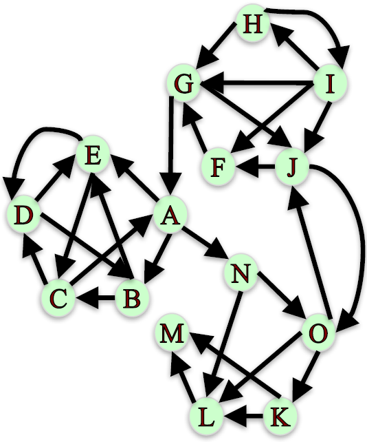

# Module 3: Influence Measures and Network Centralization

## Degree and Closeness Centrality

### Lecture Notes

+ Node Importance
    + Based on the structure of the network, which are the 5 most important node in the Karate Club friendship network?
    + Different ways of thinking about “importance”.
        + Ex. Degree: number of friends. 5 most important nodes are: 34, 1, 33, 3, 2
        + Ex. Average proximity to other nodes. 5 most important nodes are: 1, 3, 34, 32, 9
        + Ex. Fraction of shortest paths that pass through node. 5 most important nodes are: 1, 34, 33, 3, 32
    <a href="https://anthonybonato.com/2016/04/13/the-mathematics-of-game-of-thrones/"> <br/>
        
    </a>

+ Network Centrality <br/>
    Centrality measures identify the most important nodes in a network:
    + Influential nodes in a social network.
    + Nodes that disseminate information to many nodes or prevent epidemics.
    + Hubs in a transportation network.
    + Important pages on the Web.
    + Nodes that prevent the network from breaking up.

+ Centrality Measures
    + __Degree centrality__
    + __Closeness centrality__
    + Betweenness centrality
    + Load centrality
    + Page Rank
    + Katz centrality
    + Percolation centrality

+ Degree Centrality
    + Assumption: important nodes have many connections.
    + The most basic measure of centrality: number of neighbors.
    + Undirected networks: use degree Directed networks: use in-degree or out-degree

+ Degree Centrality – Undirected Networks
    $$C_{deg}(v) = \frac{d_v}{|N| - 1}$$
    + $N$: the set of nodes in the network
    + $d_v$: the degree of node $v$
    <a href="https://anthonybonato.com/2016/04/13/the-mathematics-of-game-of-thrones/"> <br/>
        
    </a>

    ```python
    G = nx.karate_club_graph()
    G = nx.convert_node_labels_to_integers(G,first_label=1)
    degCent = nx.degree_centrality(G)

    degCent[34]
    # 0.515 # 17/33

    degCent[33]
    # 0.182 # 6/33
    ```
+ Degree Centrality – Directed
    + In-bound:

        $$C_{deg}(v) = \frac{d_v^{in}}{|N| - 1}$$
        + $N$: the set of nodes in the network
        + $d_v^{in}$: the in-degree of node $v$
        <a href="url"> <br/> 
            
        </a>
        ```python
        indegCent = nx.in_degree_centrality(G)
        
        indegCent[‘A’]
        # 0.143 # 2/14

        indegCent[‘L’]
        # 0.214 # 3/14
        ```
    + Outbound:

        $$C_{deg}(v) = \frac{d_v^{out}}{|N| - 1}$$
        + $N$: the set of nodes in the network
        + $d_v^{out}$: the out-degree of node $v$

        ```python
        outdegCent = nx.out_degree_centrality(G)
        
        outdegCent[‘A’]
        # 0.214 # 3/14

        indegCent[‘L’]
        # 0.071 # 1/14
        ```

+ Closeness Centrality <br/>
    Assumption: important nodes are close to other nodes.

    $$C_{close}(v) = \frac{|N| - 1}{\sum_{u \in N \backslash \{v\}} d(v, u)}$$
    + $N$: set of nodes in the network
    + $d(v, u)$: length of shortest path from 𝑣 to 𝑢.
    <a href="https://anthonybonato.com/2016/04/13/the-mathematics-of-game-of-thrones/"> <br/>
        
    </a>
    ```python
    closeCent = nx.closeness_centrality(G)

    closeCent[32]
    # 0.541

    sum(nx.shortest_path_length(G,32).values())
    # 61

    (len(G.nodes())-1)/61.
    # 0.541
    ```
+ Disconnected Nodes
    + How to measure the closeness centrality of a node when it cannot reach all other nodes?
    + <n style="color:red">What is the closeness centrality of node L?</n>
    <a href="url"> <br/> 
        
    </a>
    + Option 1: Consider only nodes that $L$ can reach:

        $$C_{close}(L) = \frac{|R(L)|}{\sum_{u \in R(L)} d(L, u)}$$
        + $R(L)$: the set of nodes L can reach.
        + $C_{close}(L) = 1/1 = 1$, since $L$ can only reach $M$ and it has a shortest path of length 1.
        + __Problem__: centrality of 1 is too high for a node than can only reach one other node!
    + Option 2: Consider only nodes that $L$ can reach and normalize by the fraction of nodes $L$ can reach:

        $$C_{close} (L) = [\frac{|R(L)|}{|N -1|}] \frac{|R(L)|}{\sum_{u \in (L)} d(L, u)}$$

        $$C_{close} (L) = [\frac{1}{14}] \frac{1}{1} = 0.071$$
        + Note that this definition matches our definition of closeness centrality when a graph is connected since $R(L) = N − 1$
    + Programming
        ```python
        closeCent = nx.closeness_centrality(G, normalized = False)
        closeCent[‘L’]      # 1

        closeCent = nx.closeness_centrality(G, normalized = True)
        closeCent[‘L’]      # 0.071
        ```

+ Summary <br/>
    Centrality measures identify the most important nodes in a network:
    + Degree Centrality <br/>
        Assumption: important nodes have many connections.

        $$C_{deg} (v) = \frac{d_v}{|N| - 1}$$
        ```python
        nx.degree_centrality(G)
        nx.in_degree_centrality(G)
        nx.out_degree_centrality(G)
        ```
    + Closeness Centrality <br/>
        Assumption: important nodes are close to other nodes.

        $$C_{close} (L) = [\frac{|R(L)|}] \frac{|R(L)|}{\sum_{u \in R(L)}d(L, u)}$$
        ```python
        nx.closeness_centrality(G, normalized = True)
        ```


### Lecture Video

<a href="https://www.coursera.org/learn/python-social-network-analysis/lecture/noB1S/degree-and-closeness-centrality" alt="Degree and Closeness Centrality" target="_blank">
     
</a>


## Betweenness Centrality

### Lecture Notes


+ Demo
    ```python

    ```

### Lecture Video

<a href="url" alt="Betweenness Centrality" target="_blank">
     
</a>


## Basic Page Rank

### Lecture Notes


+ Demo
    ```python

    ```

### Lecture Video

<a href="url" alt="Basic Page Rank" target="_blank">
     
</a>


## Scaled Page Rank

### Lecture Notes


+ Demo
    ```python

    ```

### Lecture Video

<a href="url" alt="Scaled Page Rank" target="_blank">
     
</a>


## Hubs and Authorities

### Lecture Notes


+ Demo
    ```python

    ```

### Lecture Video

<a href="url" alt="Hubs and Authorities" target="_blank">
     
</a>


## Centrality Examples

### Lecture Notes


+ Demo
    ```python

    ```

### Lecture Video

<a href="url" alt="Centrality Examples" target="_blank">
     
</a>


## Quiz: Module 3 Quiz


## PageRank and Centrality in a real-life network


