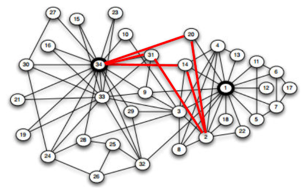
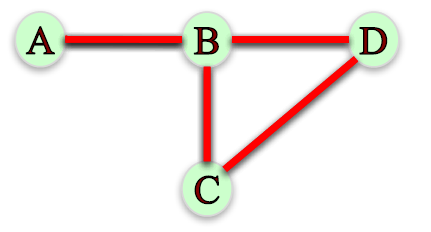

# Module 3: Influence Measures and Network Centralization

## Degree and Closeness Centrality

### Lecture Notes

+ Node Importance
    + Based on the structure of the network, which are the 5 most important node in the Karate Club friendship network?
    + Different ways of thinking about “importance”.
        + Ex. Degree: number of friends. 5 most important nodes are: 34, 1, 33, 3, 2
        + Ex. Average proximity to other nodes. 5 most important nodes are: 1, 3, 34, 32, 9
        + Ex. Fraction of shortest paths that pass through node. 5 most important nodes are: 1, 34, 33, 3, 32
    <a href="https://anthonybonato.com/2016/04/13/the-mathematics-of-game-of-thrones/"> <br/>
        
    </a>
    <a href="https://www.coursera.org/learn/python-social-network-analysis/lecture/noB1S/degree-and-closeness-centrality">
         <br/>
        
        
    </a>

+ Network Centrality <br/>
    Centrality measures identify the most important nodes in a network:
    + Influential nodes in a social network.
    + Nodes that disseminate information to many nodes or prevent epidemics.
    + Hubs in a transportation network.
    + Important pages on the Web.
    + Nodes that prevent the network from breaking up.

+ Centrality Measures
    + __Degree centrality__
    + __Closeness centrality__
    + Betweenness centrality
    + Load centrality
    + Page Rank
    + Katz centrality
    + Percolation centrality

+ Degree Centrality
    + Assumption: important nodes have many connections.
    + The most basic measure of centrality: number of neighbors.
    + Undirected networks: use degree Directed networks: use in-degree or out-degree

+ Degree Centrality – Undirected Networks

    $$C_{deg}(v) = \frac{d_v}{|N| - 1}$$
    + $N$: the set of nodes in the network
    + $d_v$: the degree of node $v$
    <a href="https://anthonybonato.com/2016/04/13/the-mathematics-of-game-of-thrones/"> <br/>
        
    </a>
    ```python
    G = nx.karate_club_graph()
    G = nx.convert_node_labels_to_integers(G,first_label=1)
    degCent = nx.degree_centrality(G)

    degCent[34]
    # 0.515 # 17/33

    degCent[33]
    # 0.182 # 6/33
    ```

+ Degree Centrality – Directed
    + In-bound:

        $$C_{indeg}(v) = \frac{d_v^{in}}{|N| - 1}$$
        + $N$: the set of nodes in the network
        + $d_v^{in}$: the in-degree of node $v$
        <a href="url"> <br/> 
            
        </a>
        ```python
        indegCent = nx.in_degree_centrality(G)
        
        indegCent[‘A’]
        # 0.143 # 2/14

        indegCent[‘L’]
        # 0.214 # 3/14
        ```
    + Outbound:

        $$C_{outdeg}(v) = \frac{d_v^{out}}{|N| - 1}$$
        + $N$: the set of nodes in the network
        + $d_v^{out}$: the out-degree of node $v$

        ```python
        outdegCent = nx.out_degree_centrality(G)
        
        outdegCent[‘A’]
        # 0.214 # 3/14

        indegCent[‘L’]
        # 0.071 # 1/14
        ```

+ Closeness Centrality <br/>
    Assumption: important nodes are close to other nodes.

    $$C_{close}(v) = \frac{|N| - 1}{\sum_{u \in N \backslash \{v\}} d(v, u)}$$
    + $N$: set of nodes in the network
    + $d(v, u)$: length of shortest path from 𝑣 to 𝑢.
    <a href="https://anthonybonato.com/2016/04/13/the-mathematics-of-game-of-thrones/"> <br/>
        
    </a>
    ```python
    closeCent = nx.closeness_centrality(G)

    closeCent[32]                                   # 0.541
    sum(nx.shortest_path_length(G,32).values())     # 61
    (len(G.nodes())-1)/61.                          # 0.541
    ```

+ Disconnected Nodes
    + How to measure the closeness centrality of a node when it cannot reach all other nodes?
    + <n style="color:red">What is the closeness centrality of node L?</n>
    <a href="url"> <br/> 
        
    </a>
    + Option 1: Consider only nodes that $L$ can reach:

        $$C_{close}(L) = \frac{|R(L)|}{\sum_{u \in R(L)} d(L, u)}$$
        + $R(L)$: the set of nodes L can reach.
        + $C_{close}(L) = 1/1 = 1$, since $L$ can only reach $M$ and it has a shortest path of length 1. 
        + __Problem__: centrality of 1 is too high for a node than can only reach one other node!
    + Option 2: Consider only nodes that $L$ can reach and normalize by the fraction of nodes $L$ can reach:

        $$C_{close} (L) = \frac{|R(L)|}{|N| - 1} \times \frac{|R(L)|}{\sum_{u \in (L)} d(L, u)}$$

        $$C_{close} (L) = \frac{1}{14} \times \frac{1}{1} = 0.071$$
        + Note that this definition matches our definition of closeness centrality when a graph is connected since $R(L) = N − 1$
    + Programming
        ```python
        closeCent = nx.closeness_centrality(G, normalized = False)
        closeCent[‘L’]      # 1

        closeCent = nx.closeness_centrality(G, normalized = True)
        closeCent[‘L’]      # 0.071
        ```
    + IVQ: Which node has the highest closeness centrality under option 1, where we only consider the distance to reachable nodes? Note: the closeness centrality of nodes that cannot reach any other nodes is always zero.
        <a href="https://www.coursera.org/learn/python-social-network-analysis/lecture/noB1S/degree-and-closeness-centrality"> <br/>
                
        </a>

        Ans: C <br/>
        Under option 1, node C has closeness centrality of 1, the highest of all nodes, because it can only reach D and it reaches in one step.
    + IVQ: Which node has the highest closeness centrality under option 2, where we normalize by the fraction of nodes a node can reach ? Note: the closeness centrality of nodes that cannot reach any other nodes is always zero. (same diagram)

        Ans: A
        Under option 2, node A has closeness centrality of ½, the highest of all nodes. A can reach all other nodes in the network: B in 1 step, C in 2 steps, and D in 3 steps. Hence, A’s closeness centrality is $(3/3)(3/6) = ½$.

+ Summary <br/>
    Centrality measures identify the most important nodes in a network:
    + Degree Centrality <br/>
        Assumption: important nodes have many connections.

        $$C_{deg} (v) = \frac{d_v}{|N| - 1}$$
        ```python
        nx.degree_centrality(G)
        nx.in_degree_centrality(G)
        nx.out_degree_centrality(G)
        ```
    + Closeness Centrality <br/>
        Assumption: important nodes are close to other nodes.

        $$C_{close} (L) = [\frac{|R(L)|}] \frac{|R(L)|}{\sum_{u \in R(L)}d(L, u)}$$
        ```python
        nx.closeness_centrality(G, normalized = True)
        ```


### Lecture Video

<a href="https://d3c33hcgiwev3.cloudfront.net/gut-1JTMEeeRmQ5TE1Qolg.processed/full/360p/index.mp4?Expires=1549152000&Signature=IaL9f58-joxTFQ5t6xL40ICRAV8MGmc~-AYffdEPOEe33nht-WQGf6JRnKvEZ64OFRhPSizfbr3-c~bk4beAO7Gg6yJXT857VSajVDenRnzjxZktlHEmi9hCTcJb1dFcEQghiM8UbR39CfE~b5sYwwIj5P2YK7xkjJhKBleLql4_&Key-Pair-Id=APKAJLTNE6QMUY6HBC5A" alt="Degree and Closeness Centrality" target="_blank">
     
</a>


## Betweenness Centrality

### Lecture Notes

+ Betweenness Centrality - Undirected Graph
    + Assumption: important nodes connect other nodes.

        $$C_{btw} (v) = \sum_{s, t \in N} \frac{\sigma_{s,t} (v)}{\sigma_{s, t}}$$
        + $\sigma_{s,t}$: the number of shortest paths between nodes $s$ and $t$
        + $\sigma_{s, t} (v)$: the number shortest paths between nodes $s$ and $t$ that pass through node $v$.
    + __Endpoints__: we can either include or exclude node $𝑣$ as node $𝑠$ and $𝑡$ in the computation of $C_{btw} (𝑣)$ .
    + Ex. If we exclude node $𝑣$, we have:

        $$C_{btw} (B) = \frac{\sigma_{A,D} (B)}{\sigma_{A,D}} + \frac{\sigma_{A, C} (B)}{\sigma_{A,C}} + \frac{\sigma_{C,D} (B)}{\sigma_{C,D}} = \frac{1}{1} + \frac{1}{1} + \frac{0}{1} = 2$$
        If we include node $v$, we have:

        $$C_{btw} (B) = \frac{\sigma_{A,B} (B)}{\sigma_{A,B}} + \frac{\sigma_{A, C} (B)}{\sigma_{A,C}} + \frac{\sigma_{A,D} (B)}{\sigma_{A,D}} + \frac{\sigma_{B,C} (B)}{\sigma_{B,C}} + \frac{\sigma_{B,D} (B)}{\sigma_{B,D}} + \frac{\sigma_{C,D} (B)}{\sigma_{C,D}} = \frac{1}{1} + \frac{1}{1} + \frac{1}{1} + \frac{1}{1} + \frac{1}{1} + \frac{0}{1} = 5$$
        <a href="https://www.coursera.org/learn/python-social-network-analysis/lecture/5rwMl/betweenness-centrality"> <br/>
            
            
        </a>

+ Disconnected Nodes - Directed Graph
    + Assumption: important nodes connect other nodes.

        $$C_{btw} (v) = \sum_{s, t \in N} \frac{\sigma_{s,t} (v)}{\sigma_{s, t}}$$
    + <n style="color:red">What if not all nodes can reach each other?</n> (see directed graph below)
    + Node D cannot be reached by any other node. Hence, $\sigma_{A,D} = 0$, making the above definition undefined.
    + When computing betweenness centrality, only consider nodes $𝑠$, $𝑡$ such that there is at least one path between them.
    + Node D cannot be reached by any other node. Hence, $\sigma_{A,D} = 0$, making the above definition undefined.
    + Ex. What is the betweenness centrality of node B, without including it as endpoint?

        $$C_{btw} (B) = \frac{\sigma_{A,C} (B)}{\sigma_{A,C}} + \frac{\sigma_{C,A} (B)}{\sigma_{C,A}} + \frac{\sigma_{D,C} (B)}{\sigma_{D,C}} + \frac{\sigma_{D,A} (B)}{\sigma_{D,A}} = \frac{1}{1} + \frac{0}{1} + \frac{0}{1} + \frac{0}{1} = 1$$
    + Ex. What is the betweenness centrality of node C, without including it as endpoint?

        $$C_{btw} (C) = \frac{\sigma_{A,B} (C)}{\sigma_{A,B}} + \frac{\sigma_{B,A} (C)}{\sigma_{B,A}} + \frac{\sigma_{D,B} (C)}{\sigma_{D,B}} + \frac{\sigma_{D,A} (C)}{\sigma_{D,A}} = \frac{0}{1} + \frac{1}{1} + \frac{0}{1} + \frac{1}{1} = 2$$
        <a href="https://www.coursera.org/learn/python-social-network-analysis/lecture/5rwMl/betweenness-centrality"> 
            
            
            
        </a>

+ Betweenness Centrality - Normalization
    + __Normalization__: betwenness centrality values will be larger in graphs with many nodes. To control for this, we divide centrality values by the number of pairs of nodes in the graph (excluding $𝑣$):
        + $\frac{1}{2} (|𝑁| − 1)( 𝑁 − 2)$ in undirected graphs
        + $(|𝑁| − 1)( 𝑁 − 2)$ in directed graphs
    + Programming
        ```python
        btwnCent = nx.betweenness_centrality(G, normalized = True, endpoints = False)

        import operator
        sorted(btwnCent.items(), key=operator.itemgetter(1), reverse = True)[0:5]
        # [(1, 0.43763528138528146), (34, 0.30407497594997596), (33, 0.14524711399711399),
        #  (3, 0.14365680615680618), (32, 0.13827561327561325)]
        ```
        <a href="https://anthonybonato.com/2016/04/13/the-mathematics-of-game-of-thrones/"> 
            
        </a>
        <a href="https://www.nejm.org/doi/full/10.1056/NEJMsa066082"> 
            
        </a>
        <a href="https://www.coursera.org/learn/python-social-network-analysis/lecture/noB1S/degree-and-closeness-centrality">
            
        </a>

+ Betweeness Centrality - Complexity
    + Computing betweenness centrality of all nodes can be very computationally expensive.
    + Depending on the algorithm, this computation can take up to $𝑂(|𝑁|^3)$ time.
    + __Approximation__: rather can computing betweenness centrality based on all pairs of nodes $𝑠$, $𝑡$, we can approximate it based on a sample of nodes.
    + Eg., Network of friendship, marital tie, and family tie among 2200 people [Christakis & Fowler 2007]: <br/> N = 2200 nodes $\rightarrow$ ~4.8million pairs of nodes
    ```python
    # Approximation
    btwnCent_approx = nx.betweenness_centrality(G, normalized = True, endpoints = False, k = 10)
    sorted(btwnCent_approx.items(), key=operator.itemgetter(1), reverse = True)[0:5]
    # [(1, 0.48269390331890333), (34, 0.27564694564694564), (32, 0.20863636363636362), 
    # (3, 0.1697598003848004), (2, 0.13194624819624817)]

    # subsets
    btwnCent_subset = nx.betweenness_centrality_subset(G, [34, 33, 21, 30, 16, 27, 15, 23, 10], [1, 4, 13, 11, 6, 12, 17, 7], normalized=True)
    sorted(btwnCent_subset.items(),key=operator.itemgetter(1), reverse=True)[0:5]
    # [(1, 0.04899515993265994), (34, 0.028807419432419434), (3, 0.018368205868205867),
    #  (33, 0.01664712602212602), (9, 0.014519450456950456)]
    ```
    <a href="https://www.coursera.org/learn/python-social-network-analysis/lecture/noB1S/degree-and-closeness-centrality">
        
        
    </a>

+ Betweenness Centrality – Edges
    + We can use betweenness centrality to find important edges instead of nodes:

        $$C_{btw} (e) = \sum_{s,t \in N} \frac{\sigma_{s,t} (e)}{\sigma_{s,t}}$$
        + $\sigma_{s,t}$: the number of shortest paths between nodes $𝑠$ and $𝑡$.
        + $\sigma_{s,t} (e)$: the number shortest paths between nodes $𝑠$ and $𝑡$ that pass through edge $𝑒$.
    ```python
    # Edges
    btwnCent_edge = nx.edge_betweenness_centrality(G, normalized=True)
    sorted(btwnCent_edge.items(), key=operator.itemgetter(1), reverse = True)[0:5]
    # [((1, 32), 0.12725999490705373), ((1, 7), 0.07813428401663694), ((1, 6), 0.07813428401663694),
    #  ((1, 3), 0.0777876807288572), ((1, 9), 0.07423959482783014)]

    # subsets
    btwnCent_edge_subset = nx.edge_betweenness_centrality_subset(G, [34, 33, 21, 30, 16, 27, 15, 23, 10], [1, 4, 13, 11, 6, 12, 17, 7], normalized=True)
    sorted(btwnCent_edge_subset.items(), key=operator.itemgetter(1), reverse = True)[0:5]
    # [((1, 32), 0.01366536513595337), ((1, 9), 0.01366536513595337), ((14, 34), 0.012207509266332794),
    #  ((1, 3), 0.01211343123107829), ((1, 7), 0.012032085561497326)]
    ```
    <a href="https://www.coursera.org/learn/python-social-network-analysis/lecture/noB1S/degree-and-closeness-centrality">
        
        
    </a>

+ Summary
    + Betweenness centrality assumption: important nodes connect other nodes.

        $$C_{btw} (v) = \sum_{s, t \in N} \frac{\sigma_{s,t} (v)}{\sigma_{s,t}}$$
    + __Normalization__: Divide by number of pairs of nodes.
    + __Approximation__: Computing betweenness centrality can be computationally expensive. We can approximate computation by taking a subset of nodes.
    + __Subsets__: We can define subsets of source and target nodes to compute betweenness centrality.
    + __Edge betweenness centrality__: We can apply the same framework to find important edges instead of nodes.


### Lecture Video

<a href="https://d3c33hcgiwev3.cloudfront.net/iaUb3xmEeeoMBL4ko9vzA.processed/full/360p/index.mp4?Expires=1549238400&Signature=H8YFhrG61Q2CaiQJwCeKOdZG49hwJvVf1OakgcvbFpYd9KUiR-MeIDw0-473~FCoBm1aMhUCBIrUxCbv8Hxti3ehiEUIlaDM9OHA3ymRANH0S06L~wz0bSRIutGTZxCFwdvFIAE3uJrXH52GMdwZAn9N3a3CIw921t0LgXSs1RU_&Key-Pair-Id=APKAJLTNE6QMUY6HBC5A" alt="Betweenness Centrality" target="_blank">
     
</a>


## Basic Page Rank

### Lecture Notes


+ Demo
    ```python

    ```

### Lecture Video

<a href="url" alt="Basic Page Rank" target="_blank">
     
</a>


## Scaled Page Rank

### Lecture Notes


+ Demo
    ```python

    ```

### Lecture Video

<a href="url" alt="Scaled Page Rank" target="_blank">
     
</a>


## Hubs and Authorities

### Lecture Notes


+ Demo
    ```python

    ```

### Lecture Video

<a href="url" alt="Hubs and Authorities" target="_blank">
     
</a>


## Centrality Examples

### Lecture Notes


+ Demo
    ```python

    ```

### Lecture Video

<a href="url" alt="Centrality Examples" target="_blank">
     
</a>


## Quiz: Module 3 Quiz


## PageRank and Centrality in a real-life network


