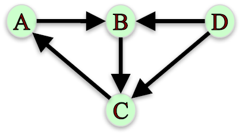
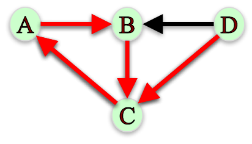
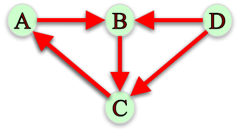
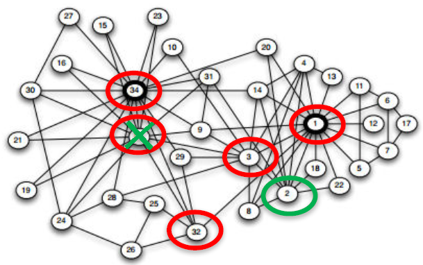
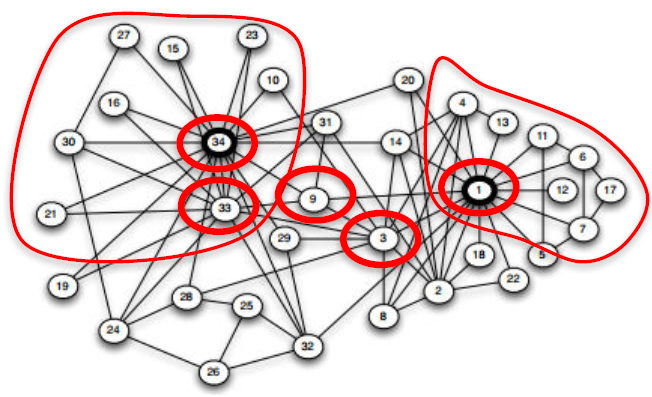
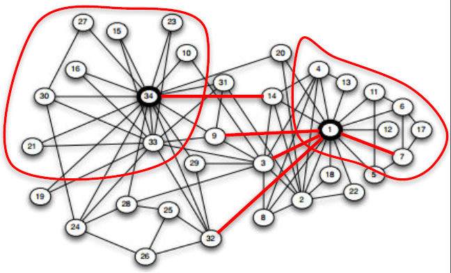

# Module 3: Influence Measures and Network Centralization

## Degree and Closeness Centrality

### Lecture Notes

+ Node Importance
    + Based on the structure of the network, which are the 5 most important node in the Karate Club friendship network?
    + Different ways of thinking about “importance”.
        + Ex. Degree: number of friends. 5 most important nodes are: 34, 1, 33, 3, 2
        + Ex. Average proximity to other nodes. 5 most important nodes are: 1, 3, 34, 32, 9
        + Ex. Fraction of shortest paths that pass through node. 5 most important nodes are: 1, 34, 33, 3, 32
    <a href="https://anthonybonato.com/2016/04/13/the-mathematics-of-game-of-thrones/"> <br/>
        
    </a>
    <a href="https://www.coursera.org/learn/python-social-network-analysis/lecture/noB1S/degree-and-closeness-centrality">
         <br/>
        
        
    </a>

+ Network Centrality <br/>
    Centrality measures identify the most important nodes in a network:
    + Influential nodes in a social network.
    + Nodes that disseminate information to many nodes or prevent epidemics.
    + Hubs in a transportation network.
    + Important pages on the Web.
    + Nodes that prevent the network from breaking up.

+ Centrality Measures
    + __Degree centrality__
    + __Closeness centrality__
    + Betweenness centrality
    + Load centrality
    + Page Rank
    + Katz centrality
    + Percolation centrality

+ Degree Centrality
    + Assumption: important nodes have many connections.
    + The most basic measure of centrality: number of neighbors.
    + Undirected networks: use degree Directed networks: use in-degree or out-degree

+ Degree Centrality – Undirected Networks

    $$C_{deg}(v) = \frac{d_v}{|N| - 1}$$
    + $N$: the set of nodes in the network
    + $d_v$: the degree of node $v$
    <a href="https://anthonybonato.com/2016/04/13/the-mathematics-of-game-of-thrones/"> <br/>
        
    </a>
    ```python
    G = nx.karate_club_graph()
    G = nx.convert_node_labels_to_integers(G,first_label=1)
    degCent = nx.degree_centrality(G)

    degCent[34]
    # 0.515 # 17/33

    degCent[33]
    # 0.182 # 6/33
    ```

+ Degree Centrality – Directed
    + In-bound:

        $$C_{indeg}(v) = \frac{d_v^{in}}{|N| - 1}$$
        + $N$: the set of nodes in the network
        + $d_v^{in}$: the in-degree of node $v$
        <a href="url"> <br/> 
            
        </a>
        ```python
        indegCent = nx.in_degree_centrality(G)
        
        indegCent[‘A’]
        # 0.143 # 2/14

        indegCent[‘L’]
        # 0.214 # 3/14
        ```
    + Outbound:

        $$C_{outdeg}(v) = \frac{d_v^{out}}{|N| - 1}$$
        + $N$: the set of nodes in the network
        + $d_v^{out}$: the out-degree of node $v$

        ```python
        outdegCent = nx.out_degree_centrality(G)
        
        outdegCent[‘A’]
        # 0.214 # 3/14

        indegCent[‘L’]
        # 0.071 # 1/14
        ```

+ Closeness Centrality <br/>
    Assumption: important nodes are close to other nodes.

    $$C_{close}(v) = \frac{|N| - 1}{\sum_{u \in N \backslash \{v\}} d(v, u)}$$
    + $N$: set of nodes in the network
    + $d(v, u)$: length of shortest path from 𝑣 to 𝑢.
    <a href="https://anthonybonato.com/2016/04/13/the-mathematics-of-game-of-thrones/"> <br/>
        
    </a>
    ```python
    closeCent = nx.closeness_centrality(G)

    closeCent[32]                                   # 0.541
    sum(nx.shortest_path_length(G,32).values())     # 61
    (len(G.nodes())-1)/61.                          # 0.541
    ```

+ Disconnected Nodes
    + How to measure the closeness centrality of a node when it cannot reach all other nodes?
    + <n style="color:red">What is the closeness centrality of node L?</n>
    <a href="url"> <br/> 
        
    </a>
    + Option 1: Consider only nodes that $L$ can reach:

        $$C_{close}(L) = \frac{|R(L)|}{\sum_{u \in R(L)} d(L, u)}$$
        + $R(L)$: the set of nodes L can reach.
        + $C_{close}(L) = 1/1 = 1$, since $L$ can only reach $M$ and it has a shortest path of length 1. 
        + __Problem__: centrality of 1 is too high for a node than can only reach one other node!
    + Option 2: Consider only nodes that $L$ can reach and normalize by the fraction of nodes $L$ can reach:

        $$C_{close} (L) = \frac{|R(L)|}{|N| - 1} \times \frac{|R(L)|}{\sum_{u \in (L)} d(L, u)}$$

        $$C_{close} (L) = \frac{1}{14} \times \frac{1}{1} = 0.071$$
        + Note that this definition matches our definition of closeness centrality when a graph is connected since $R(L) = N − 1$
    + Programming
        ```python
        closeCent = nx.closeness_centrality(G, normalized = False)
        closeCent[‘L’]      # 1

        closeCent = nx.closeness_centrality(G, normalized = True)
        closeCent[‘L’]      # 0.071
        ```
    + IVQ: Which node has the highest closeness centrality under option 1, where we only consider the distance to reachable nodes? Note: the closeness centrality of nodes that cannot reach any other nodes is always zero.
        <a href="https://www.coursera.org/learn/python-social-network-analysis/lecture/noB1S/degree-and-closeness-centrality"> <br/>
                
        </a>

        Ans: C <br/>
        Under option 1, node C has closeness centrality of 1, the highest of all nodes, because it can only reach D and it reaches in one step.
    + IVQ: Which node has the highest closeness centrality under option 2, where we normalize by the fraction of nodes a node can reach ? Note: the closeness centrality of nodes that cannot reach any other nodes is always zero. (same diagram)

        Ans: A
        Under option 2, node A has closeness centrality of ½, the highest of all nodes. A can reach all other nodes in the network: B in 1 step, C in 2 steps, and D in 3 steps. Hence, A’s closeness centrality is $(3/3)(3/6) = ½$.

+ Summary <br/>
    Centrality measures identify the most important nodes in a network:
    + Degree Centrality <br/>
        Assumption: important nodes have many connections.

        $$C_{deg} (v) = \frac{d_v}{|N| - 1}$$
        ```python
        nx.degree_centrality(G)
        nx.in_degree_centrality(G)
        nx.out_degree_centrality(G)
        ```
    + Closeness Centrality <br/>
        Assumption: important nodes are close to other nodes.

        $$C_{close} (L) = [\frac{|R(L)|}] \frac{|R(L)|}{\sum_{u \in R(L)}d(L, u)}$$
        ```python
        nx.closeness_centrality(G, normalized = True)
        ```


### Lecture Video

<a href="https://d3c33hcgiwev3.cloudfront.net/gut-1JTMEeeRmQ5TE1Qolg.processed/full/360p/index.mp4?Expires=1549152000&Signature=IaL9f58-joxTFQ5t6xL40ICRAV8MGmc~-AYffdEPOEe33nht-WQGf6JRnKvEZ64OFRhPSizfbr3-c~bk4beAO7Gg6yJXT857VSajVDenRnzjxZktlHEmi9hCTcJb1dFcEQghiM8UbR39CfE~b5sYwwIj5P2YK7xkjJhKBleLql4_&Key-Pair-Id=APKAJLTNE6QMUY6HBC5A" alt="Degree and Closeness Centrality" target="_blank">
     
</a>


## Betweenness Centrality

### Lecture Notes

+ Betweenness Centrality - Undirected Graph
    + Assumption: important nodes connect other nodes.

        $$C_{btw} (v) = \sum_{s, t \in N} \frac{\sigma_{s,t} (v)}{\sigma_{s, t}}$$
        + $\sigma_{s,t}$: the number of shortest paths between nodes $s$ and $t$
        + $\sigma_{s, t} (v)$: the number shortest paths between nodes $s$ and $t$ that pass through node $v$.
    + __Endpoints__: we can either include or exclude node $𝑣$ as node $𝑠$ and $𝑡$ in the computation of $C_{btw} (𝑣)$ .
    + Ex. If we exclude node $𝑣$, we have:

        $$C_{btw} (B) = \frac{\sigma_{A,D} (B)}{\sigma_{A,D}} + \frac{\sigma_{A, C} (B)}{\sigma_{A,C}} + \frac{\sigma_{C,D} (B)}{\sigma_{C,D}} = \frac{1}{1} + \frac{1}{1} + \frac{0}{1} = 2$$
        If we include node $v$, we have:

        $$C_{btw} (B) = \frac{\sigma_{A,B} (B)}{\sigma_{A,B}} + \frac{\sigma_{A, C} (B)}{\sigma_{A,C}} + \frac{\sigma_{A,D} (B)}{\sigma_{A,D}} + \frac{\sigma_{B,C} (B)}{\sigma_{B,C}} + \frac{\sigma_{B,D} (B)}{\sigma_{B,D}} + \frac{\sigma_{C,D} (B)}{\sigma_{C,D}} = \frac{1}{1} + \frac{1}{1} + \frac{1}{1} + \frac{1}{1} + \frac{1}{1} + \frac{0}{1} = 5$$
        <a href="https://www.coursera.org/learn/python-social-network-analysis/lecture/5rwMl/betweenness-centrality"> <br/>
            
            
        </a>
    + IVQ: Given the following network, which node has the highest betweenness (excluding endpoints)? What’s the betweenness score (excluding endpoints) of this node? Give your answer in the following format: X, #
        <a href="https://www.coursera.org/learn/python-social-network-analysis/lecture/5rwMl/betweenness-centrality"> <br/>
            
        </a>

        Ans: D, 9 <br/>
        Node D lies on all the shortest paths starting from nodes {A, B, C} to nodes {E, F, G}, and there is no alternative paths for these 9 node pairs, hence node D has the highest betweenness 9.


+ Disconnected Nodes - Directed Graph
    + Assumption: important nodes connect other nodes.

        $$C_{btw} (v) = \sum_{s, t \in N} \frac{\sigma_{s,t} (v)}{\sigma_{s, t}}$$
    + <n style="color:red">What if not all nodes can reach each other?</n> (see directed graph below)
    + Node D cannot be reached by any other node. Hence, $\sigma_{A,D} = 0$, making the above definition undefined.
    + When computing betweenness centrality, only consider nodes $𝑠$, $𝑡$ such that there is at least one path between them.
    + Node D cannot be reached by any other node. Hence, $\sigma_{A,D} = 0$, making the above definition undefined.
    + Ex. What is the betweenness centrality of node B, without including it as endpoint?

        $$C_{btw} (B) = \frac{\sigma_{A,C} (B)}{\sigma_{A,C}} + \frac{\sigma_{C,A} (B)}{\sigma_{C,A}} + \frac{\sigma_{D,C} (B)}{\sigma_{D,C}} + \frac{\sigma_{D,A} (B)}{\sigma_{D,A}} = \frac{1}{1} + \frac{0}{1} + \frac{0}{1} + \frac{0}{1} = 1$$
    + Ex. What is the betweenness centrality of node C, without including it as endpoint?

        $$C_{btw} (C) = \frac{\sigma_{A,B} (C)}{\sigma_{A,B}} + \frac{\sigma_{B,A} (C)}{\sigma_{B,A}} + \frac{\sigma_{D,B} (C)}{\sigma_{D,B}} + \frac{\sigma_{D,A} (C)}{\sigma_{D,A}} = \frac{0}{1} + \frac{1}{1} + \frac{0}{1} + \frac{1}{1} = 2$$
        <a href="https://www.coursera.org/learn/python-social-network-analysis/lecture/5rwMl/betweenness-centrality"> 
            
            
            
        </a>

+ Betweenness Centrality - Normalization
    + __Normalization__: betwenness centrality values will be larger in graphs with many nodes. To control for this, we divide centrality values by the number of pairs of nodes in the graph (excluding $𝑣$):
        + $\frac{1}{2} (|𝑁| − 1)( 𝑁 − 2)$ in undirected graphs
        + $(|𝑁| − 1)( 𝑁 − 2)$ in directed graphs
    + Programming
        ```python
        btwnCent = nx.betweenness_centrality(G, normalized = True, endpoints = False)

        import operator
        sorted(btwnCent.items(), key=operator.itemgetter(1), reverse = True)[0:5]
        # [(1, 0.43763528138528146), (34, 0.30407497594997596), (33, 0.14524711399711399),
        #  (3, 0.14365680615680618), (32, 0.13827561327561325)]
        ```
        <a href="https://anthonybonato.com/2016/04/13/the-mathematics-of-game-of-thrones/"> 
            
        </a>
        <a href="https://www.nejm.org/doi/full/10.1056/NEJMsa066082"> 
            
        </a>
        <a href="https://www.coursera.org/learn/python-social-network-analysis/lecture/noB1S/degree-and-closeness-centrality">
            
        </a>

+ Betweeness Centrality - Complexity
    + Computing betweenness centrality of all nodes can be very computationally expensive.
    + Depending on the algorithm, this computation can take up to $𝑂(|𝑁|^3)$ time.
    + __Approximation__: rather can computing betweenness centrality based on all pairs of nodes $𝑠$, $𝑡$, we can approximate it based on a sample of nodes.
    + Eg., Network of friendship, marital tie, and family tie among 2200 people [Christakis & Fowler 2007]: <br/> N = 2200 nodes $\rightarrow$ ~4.8million pairs of nodes
    ```python
    # Approximation
    btwnCent_approx = nx.betweenness_centrality(G, normalized = True, endpoints = False, k = 10)
    sorted(btwnCent_approx.items(), key=operator.itemgetter(1), reverse = True)[0:5]
    # [(1, 0.48269390331890333), (34, 0.27564694564694564), (32, 0.20863636363636362), 
    # (3, 0.1697598003848004), (2, 0.13194624819624817)]

    # subsets
    btwnCent_subset = nx.betweenness_centrality_subset(G, [34, 33, 21, 30, 16, 27, 15, 23, 10], [1, 4, 13, 11, 6, 12, 17, 7], normalized=True)
    sorted(btwnCent_subset.items(),key=operator.itemgetter(1), reverse=True)[0:5]
    # [(1, 0.04899515993265994), (34, 0.028807419432419434), (3, 0.018368205868205867),
    #  (33, 0.01664712602212602), (9, 0.014519450456950456)]
    ```
    <a href="https://www.coursera.org/learn/python-social-network-analysis/lecture/noB1S/degree-and-closeness-centrality">
        
        
    </a>

+ Betweenness Centrality – Edges
    + We can use betweenness centrality to find important edges instead of nodes:

        $$C_{btw} (e) = \sum_{s,t \in N} \frac{\sigma_{s,t} (e)}{\sigma_{s,t}}$$
        + $\sigma_{s,t}$: the number of shortest paths between nodes $𝑠$ and $𝑡$.
        + $\sigma_{s,t} (e)$: the number shortest paths between nodes $𝑠$ and $𝑡$ that pass through edge $𝑒$.
    ```python
    # Edges
    btwnCent_edge = nx.edge_betweenness_centrality(G, normalized=True)
    sorted(btwnCent_edge.items(), key=operator.itemgetter(1), reverse = True)[0:5]
    # [((1, 32), 0.12725999490705373), ((1, 7), 0.07813428401663694), ((1, 6), 0.07813428401663694),
    #  ((1, 3), 0.0777876807288572), ((1, 9), 0.07423959482783014)]

    # subsets
    btwnCent_edge_subset = nx.edge_betweenness_centrality_subset(G, [34, 33, 21, 30, 16, 27, 15, 23, 10], [1, 4, 13, 11, 6, 12, 17, 7], normalized=True)
    sorted(btwnCent_edge_subset.items(), key=operator.itemgetter(1), reverse = True)[0:5]
    # [((1, 32), 0.01366536513595337), ((1, 9), 0.01366536513595337), ((14, 34), 0.012207509266332794),
    #  ((1, 3), 0.01211343123107829), ((1, 7), 0.012032085561497326)]
    ```
    <a href="https://www.coursera.org/learn/python-social-network-analysis/lecture/noB1S/degree-and-closeness-centrality">
        
        
    </a>

+ Summary
    + Betweenness centrality assumption: important nodes connect other nodes.

        $$C_{btw} (v) = \sum_{s, t \in N} \frac{\sigma_{s,t} (v)}{\sigma_{s,t}}$$
    + __Normalization__: Divide by number of pairs of nodes.
    + __Approximation__: Computing betweenness centrality can be computationally expensive. We can approximate computation by taking a subset of nodes.
    + __Subsets__: We can define subsets of source and target nodes to compute betweenness centrality.
    + __Edge betweenness centrality__: We can apply the same framework to find important edges instead of nodes.


 We'll find that when we use network x to compute this, we'll have the option of either including or excluding the node as one of the endpoints in the pair of nodes. Now, here we have another concern, which is that sometimes some pairs of nodes are actually not connected to each other, they cannot reach each other. So what happens to the computation when we have this case? Again, this tends to happen more often in graphs that are directed. And so let's look at this example. Note here that node D has no nodes that are actually pointing to it. So actually, no node can actually reach node D. And so how do we compute this given that no node can actually reach D? If we were simply to apply the definition as we stated it and we actually include pairs for example A, D, then sigma A, D would be 0 because they're no shortest paths between A and D. And we have that sigma A, D in the definition a=is in the denominator. And so this would make this undefined. And so, we have to fix that in some way.
5:48
And what we do is that we simply only consider the nodes that actually have at least one shortest path between them when we're considering nodes s and t. So, in this case, what is there betweenness centrality of node B? Let's say we're not including node B in the computation as one of the endpoints. Well, then we have to see which ones are the nodes that actually have at least one shortest path between them. And we'll use those in the computation. So A, C has a shortest path, thus A,B, C. And B involved in that, so that it contributes 1. C, A, C can reach A in just one step by connecting directly to it. That does not involve node B, so that contributes 0 to the computation. D, C, again, they're connected without including B, so that's contributes 0 to the computation. And then D to A, that has the shortest path D, C, A, which does not involve node B. And therefore, it contributes 0 to the computation. Notice that you can also go from D to A passing through B. You can go D, B, C, A. But that is a longer path, so it's not the shortest path. And so B is not involved in the shortest path between D and A. And so in this case, node B has a centrality of 1.
7:17
Let's look at the same question for node C. And so again, we have to look at all the pairs of nodes that actually have a shortest path between them. And we're not including C as one of the endpoints. And so the first one is A, B, which there is a direct connection between them, and does not involve C, so that contributes 0. B to A, the shortest path from B to A is B, C, A. And that involves node C so it contributes 1 to the centrality of C. There's D, B, they're directly connected, so that contributes 0. And then there is D, A. And again the path from D to A, the shortest path passes through node C, so that contributes 1 to the computation. And overall we've find that node C has a betweenness centrality of 2.
8:09
So, so far we haven't talked about normalizing the betweenness centrality in any way. And the problem with this is that nodes that are in graphs that have a larger number of nodes will tend to have higher centrality than nodes of graphs that are smaller in terms of the number of nodes. That's simply because in large graphs, there are more nodes, s and t, to choose from to compute the centrality of the nodes. And so for example, if we look at these friendship network in the 34 person karate club, the nodes there are going to have lower centrality than the nodes in this larger network of 2200 people. And so, sometimes if we want to compare betweenness centrality across networks, it's useful to normalize.
8:53
And the way we normalize is simply by dividing the betweenness centrality of our node v by the number of possible pairs of nodes in the network, not including node v. So for undirected graphs, you would divide them betweenness centrality of v by (N-1)(N-2) over 2. That's the number of pairs that you could have in an undirected graph excluding the node that you're currently looking at.
9:16
And in directed graphs, you have twice the number of pairs because for any pair s, t, you could have a path from s to t, but also a potentially different path from t to s. So you would divide the betweenness centrality of node v by (N-1)(N-2). And in network x, you can use the function betweenness centrality to find the centrality of every node in the network. And you have the various options that we've discussed here. So for example, you can choose to normalize or not. And you can also choose the question of the endpoints, whether you use the node that you're computing the centrality of as one of the endpoints in the computation of its centrality. So you can choose to do this in any way you want here. So for example, if we look at the karate club and look at betweenness centrality, compute the betweenness centrality of all the nodes and then find the five largest, the five nodes with the largest betweenness centrality, we find that these are the nodes 1, 34, 33, 3, and 32. Now one of the issues with betweenness centrality is that it can be very computationally expensive. Depending on the specific algorithm you're using, this computation can take up to order number of nodes cubed time. And just for us to get some idea about this, look at the network of friendship, marital tie, and family tie among these 2,200 people. This is a relatively small network, yet when you look at the number pairs of nodes that it can have, you have a new order of 4.8 million pairs of nodes. And so even small networks have lots and lots and lots of pairs of nodes. And so computing the betweenness centrality of these networks becomes pretty expensive. So one of the things that you can do is rather than the computing betweenness centrality based on all the nodes s and t, all the possible nodes s, t in the network, you can approximate it by just looking at a sample of nodes, instead of looking at all the nodes. And in network x, you can do this by using the parameter k that says how many nodes you should use to compute the betweenness centrality. And so here, I'm computing the betweenness centrality of the nodes in the karate club network using only 10 nodes rather than 34 nodes. And so this gives you an approximation for what the betweenness centrality of the nodes actually is. And if I look at the five nodes with the largest approximated betweenness centrality, we find that these are nodes 1, 34, 32, 3, and 2. So we get almost exactly the same list as we did when we didn't approximate, when we find the actual betweenness centrality, except that we now get 2 as one of the top five and we lose 33 as one of the top five. So it gives us something that is close to the actual. But of course, there can be some differences since now you're only using 10 rather than 34 nodes to compute the centrality
12:28
The other thing that sometimes is useful is that sometimes you rather compute the betweenness centrality based on two subgroups in the network, not necessarily looking at all potential pairs of nodes. But you maybe really care about two groups communicating with each other. So you want to find what are the most important nodes in this network that tend to show up in the shortest paths between a group of source nodes and a group of target nodes? And so to do this in network x, you can use the function betweenness centrality subset, in which you pass the graph and then you pass the set of source nodes and the set of target nodes. And you can choose to normalize or not. In this case, I'm normalizing. And I'm just sort of here selecting two groups of nodes, pretty arbitrarily, just to kind of give you an example here. So we're going to see, based on these source nodes and target nodes, what are the most important nodes? And again, here what the meaning of these source nodes and target nodes is that when we select the nodes s, t to compute the centrality of all the nodes, we're always going to choose s from the set of source nodes, and t from the set of target nodes, rather than selecting all possible pairs. And so when we find the top nodes here with the highest betweenness centrality in this setup, with these source nodes and these target nodes, we find that nodes 1, 34, 3, 33, and 9 are the most important nodes. Now notice that these tend to be the nodes that also have highest centrality when you don't restrict to source and subset of source and target nodes. But there are some changes. So for example, we had not seen that node number 9 was important before. Now we see that it's important in connecting this particular sets of nodes.
14:15
The other thing you can do is you can define the betweenness centrality of an edge, rather than the betweenness centrality of a node, in much the same way that you defined betweenness centrality for a node. So if you're defining the betweenness centrality of an edge, you're going to again look at pairs of nodes as t. And you're going to take the ratio of the number of shortest paths in going from s to t that involve the edge e divided by all shortest paths between nodes s and t. So it is the exact same definition. But now rather than asking is this particular node showing up in the shortest path between s and t, we are asking is this particular edge showing up in the shortest path? And in network x, you can use the function edge betweenness centrality to find the betweenness centrality of all the edges in the network.
15:13
And so here, if we find the top five edges with the highest betweenness centrality, we find that these are it. So they all tend to be edges that are connected to node number 1, which if you remember, node number 1 here is the instructor of the karate club.
15:30
In the same way that you could define a specific set of source nodes and a specific set of target nodes, you can do the same thing when you compute the edge betweenness centrality rather than node betweenness centrality. And for this, you can use the function edge betweenness centrality subset. And you pass again the graph and the source nodes and the target nodes. And if we find here the top five edges with the highest betweenness centrality for this particular choice of source and target nodes, we find that these are the the most important ones. And notice that most of them tend to be edges that go from inside the target or inside the source set to the outside. And that make sense because these are the ones that actually end up showing up in the shortest paths between the source and the targets.
16:22
And they also tend to be connected to very important nodes in the network, namely node number 1, which is the instructor of the karate club and node number 34, which is the instructor of the new karate club after these club splits in two.
16:37
So in summary, we say that betweenness centrality makes the assumption that important nodes tend to connect the other nodes. And this is the formula that we use to compute it. In general, it's the sum of the fraction of the number of shortest paths that involve a particular node v divided by all the possible shortest paths between the nodes s and t. We talked about normalizing this, especially if we're comparing betweenness centrality among different networks of different sizes. So we divide by the number of pair of nodes. We also talked about approximating this because sometimes we're unable compute it exactly because it can be computationally expensive. So we can approximate it by selecting a subset of nodes rather than all the nodes. And we showed you how to do this in network x. We also talked about choosing specific sets of target nodes and specific sets of source nodes rather than using all possible pairs. That's if you have a particular sets of nodes that you care about and that you want to know, who are the important nodes that are connecting nodes in this two specific sets. And then we talked about how we can generalize this a bit more and talked about the betweenness centrality of not only the nodes but also the edges. Much in the same way that we define it for nodes, we can also define for edge. This is all for this video. Thank you for watching and I see you next time.


### Lecture Video

<a href="https://d3c33hcgiwev3.cloudfront.net/iaUb3xmEeeoMBL4ko9vzA.processed/full/360p/index.mp4?Expires=1549238400&Signature=H8YFhrG61Q2CaiQJwCeKOdZG49hwJvVf1OakgcvbFpYd9KUiR-MeIDw0-473~FCoBm1aMhUCBIrUxCbv8Hxti3ehiEUIlaDM9OHA3ymRANH0S06L~wz0bSRIutGTZxCFwdvFIAE3uJrXH52GMdwZAn9N3a3CIw921t0LgXSs1RU_&Key-Pair-Id=APKAJLTNE6QMUY6HBC5A" alt="Betweenness Centrality" target="_blank">
     
</a>


## Basic Page Rank

### Lecture Notes


+ Demo
    ```python

    ```

### Lecture Video

<a href="url" alt="Basic Page Rank" target="_blank">
     
</a>


## Scaled Page Rank

### Lecture Notes


+ Demo
    ```python

    ```

### Lecture Video

<a href="url" alt="Scaled Page Rank" target="_blank">
     
</a>


## Hubs and Authorities

### Lecture Notes


+ Demo
    ```python

    ```

### Lecture Video

<a href="url" alt="Hubs and Authorities" target="_blank">
     
</a>


## Centrality Examples

### Lecture Notes


+ Demo
    ```python

    ```

### Lecture Video

<a href="url" alt="Centrality Examples" target="_blank">
     
</a>


## Quiz: Module 3 Quiz


## PageRank and Centrality in a real-life network


