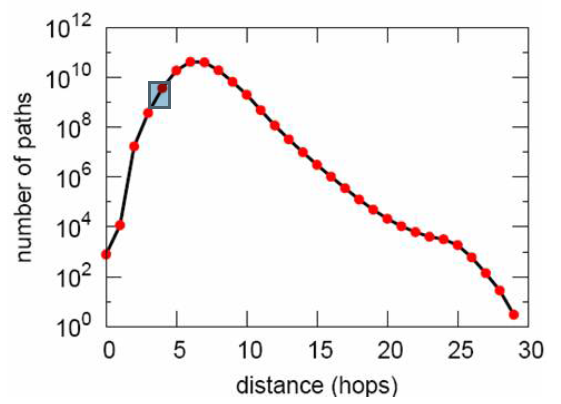
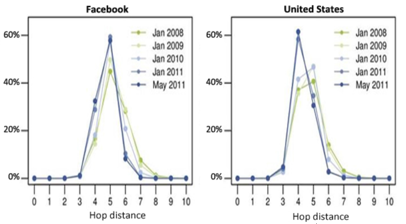
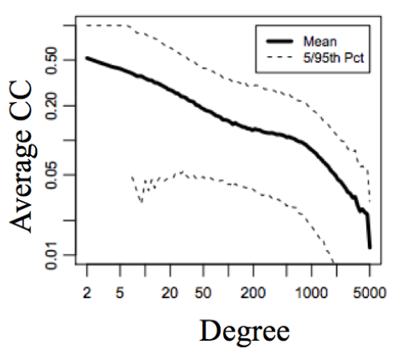
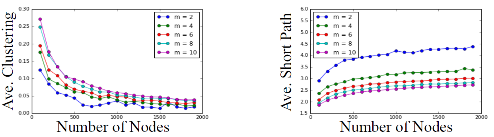

# Module 4: Applications

## Preferential Attachment Model

### Lecture Notes

+ Degree Distributions
    + The __degree__ of a node in an undirected graph is the number of neighbors it has. Eg., A(3), B(2), C(3), D(2), E(1_, F(3), G(4), H(2), I(2)
    + The __degree distribution__ of a graph is the probability distribution of the degrees over the entire network.
    + The degree distribution, $𝑃(𝑘)$ of this network has the following values:

        $$P(1) = \frac{1}{9}, P(2) = \frac{4}{9}, P(3)=\frac{1}{3}, P(4) = \frac{1}{9}$$
        + $k$: the degree of a given node
    + Plot of the degree distribution of this network:
        ```python
        degrees = G.degree()
        degree_values = sorted(set(degrees.values()))
        histogram = [list(degrees.values()).count(i)/float(nx.number_of_nodes(G)) for i in degree_values]

        import matplotlib.pyplot as plt
        plt.bar(degree_values,histogram)
        plt.xlabel('Degree')
        plt.ylabel('Fraction of Nodes')
        plt.show()
        ```
        <a href="https://www.coursera.org/learn/python-social-network-analysis/lecture/abipd/preferential-attachment-model">
            
            
        </a>

+ In-Degree Distributions
    + The __in-degree__ of a node in a directed graph is the number of in-links it has.
    + E.g. graph above - A(3), B(1), C(2), D(1), E(0), F(1), G(1), H(0), I(2)
    + The in-degree distribution, $P_{in}(k)$, of this network has the following values:

        $$P_{in}(0)=\frac{2}{9}, P_{in}(1)=\frac{4}{9}, P_{in}(2)=\frac{2}{9}, P_{in}(3)=\frac{1}{9}$$
    + Plot of the degree distribution of this network:
        ```python
        in_degrees = G.in_degree()
        in_degree_values = sorted(set(in_degrees.values()))
        histogram = [list(in_degrees.values()).count(i)/float(nx.number_of_nodes(G)) for i in in_degree_values]
        plt.bar(in_degree_values,histogram)
        plt.xlabel('In Degree')
        plt.ylabel('Fraction of Nodes')
        plt.show()
        ```
        <a href="https://www.coursera.org/learn/python-social-network-analysis/lecture/abipd/preferential-attachment-model">
            
            
        </a>

+ Degree Distributions in Real Networks
    + A – __Actors__: network of 225,000 actors connected when they appear in a movie together.
    + B – __The Web__: network of 325,000 documents on the WWW connected by URLs.
    + C – __US Power Grid__: network of 4,941 generators connected by transmission lines.
    + Degree distribution looks like a straight line when on a log-log scale. __Power law__: $P(k)=Ck^{-\alpha}$, where $\alpha$ and C are constants. $\alpha$ values: A: 2.3, B:2.1, C:4.
    <a href="https://harangdev.github.io/applied-data-science-with-python/applied-social-network-analysis-in-python/4/"> <br/>
        
    </a>

+ Modeling Networks
    + Networks with power law distribution have many nodes with small degree and a few nodes with very large degree.
    + What could explain power law degree distribution we observe in many networks?
    + Can we find a set of basic assumptions that explain this phenomenon?

+ Preferential Attachment Model
    + Start with two nodes connected by an edge.
    + At each time step, add a new node with an edge connecting it to an existing node.
    + Choose the node to connect to at random with probability proportional to each node’s degree.
    + The probability of connecting to a node $u$ of degree:
    
        $$k_u = k_u/\sum_j k_j$$
    + As the number of nodes increases, the degree distribution of the network under the preferential attachment model approaches the power law $𝑃(k) = Ck^{-3}$ with constant $𝐶$.
    + The preferential attachment model produces networks with degree distributions similar to real networks.
    + `barabasi_albert_graph(n, m)` returns a network with $n$ nodes. Each new node attaches to $m$ existing nodes according to the Preferential Attachment model.
        ```python
        G = nx.barabasi_albert_graph(1000000, 1)
        degrees = G.degree()
        degree_values = sorted(set(degrees.values()))
        histogram = [list(degrees.values().count(i))/float(nx.number_of_nodes(G)) for i in degree_values]

        plt.plot(degree_values,histogram, 'o')
        plt.xlabel('Degree')
        plt.ylabel('Fraction of Nodes')
        plt.xscale('log')
        plt.yscale('log')
        plt.show()
        ```
        <a href="https://www.coursera.org/learn/python-social-network-analysis/lecture/abipd/preferential-attachment-model"> <br/>
            
            
            
            
            
            
        </a>
        <a href="https://harangdev.github.io/applied-data-science-with-python/applied-social-network-analysis-in-python/4/"> 
            
        </a>
    + IVQ: What is the probability that node 8 attaches to node 3?
        <a href="https://www.coursera.org/learn/python-social-network-analysis/lecture/abipd/preferential-attachment-model"> <br/>
            
        </a>

+ Summary
    + The degree distribution of a graph is the probability distribution of the degrees over the entire network.
    + Many real networks have degree distributions that look like power laws ($P(k) = Ck^{-\alpha}$).
    + Models of network generation allow us to identify mechanisms that give rise to observed patterns in real data.
    + The Preferential Attachment Model produces networks with a power law degree distribution.
    + Use `barabasi_albert_graph(n,m)` to construct a n-node preferential attachment network, where each new node attaches to m existing nodes.


### Lecture Video

<a href="https://d3c33hcgiwev3.cloudfront.net/lNURBZTMEeeOmgqEJWRlfA.processed/full/360p/index.mp4?Expires=1549497600&Signature=ZbRdvAcpqHNU0nMzfycqCvR4CKg5EohROkgICPmo5lpA0gHueOlj0q-Gx6XPn3g1Y2kac33geKa5kBntgmGYTtaqB0XrIMXL5XSs48jXxsQu2~NATd0DVRQaHqCh1t8c~00H36bVh3A-x7EbW-I7u-egb1buQCx1L55kH9rjSa4_&Key-Pair-Id=APKAJLTNE6QMUY6HBC5A" alt="Preferential Attachment Model" target="_blank">
     
</a>


## Reading: ReadingPower Laws and Rich-Get-Richer Phenomena (Optional)

Read [Chapter 18]((http://www.cs.cornell.edu/home/kleinber/networks-book/networks-book-ch18.pdf)) from "Networks, Crowds, and Markets: Reasoning about a Highly Connected World" By David Easley and Jon Kleinberg. Cambridge University Press, 2010 for an interesting read on Power Laws and Rich-Get-Richer phenomena such as the preferential attachment model.


## Small World Networks

### Lecture Notes

+ The Small-World Phenomenon
    + The world is small in the sense that “short” paths exists between almost any two people.
    + How short are these paths?
    + How can we measure their length?

+ Milgram Small World Experiment: 
    + Set up (1960s)
        + 296 randomly chosen “starters” asked to forward a letter to a “target” person.
        + Target was a stockbroker in Boston.
        + Instructions for starter:
            + Send letter to target if you know him on a first name basis.
            + If you do not know target, send letter (and instructions) to someone you know on a first name basis who is more likely to know the target.
        + Some information about the target, such as city, and occupation, was provided.
    + Results:
        + 64 out of the 296 letters reached the target.
        + Median chain length was 6 (consistent with the phrase “six degrees of separation”)
    + Key points:
        + A relatively large percentage (>20%) of letters reached target.
        + Paths were relatively short.
        + People were able to find these short paths.
    <a href="https://www.coursera.org/learn/python-social-network-analysis/lecture/Iv4e8/small-world-networks"> <br/>
        
    </a>


Hello, today we're going to talk about the small world phenomenon, which suggests that the world is small in the sense that, we're all connected by very short paths between each other.
0:19
But how can we measure these paths, and how short are they really? So in the 1960s, a researcher named Stanley Milgram was wondering about this very question. And he set out to create and experiment that would allow him to measure how long these paths are, and whether or not they really exist. And so the set up of the experiment was the following. He chose 296 people at random as starters, all over the US, and asked them to forward a letter to a target person. This target person was a broker in Boston. And the instructions for these starters was that, they were to send the letter to the target if they knew him on a first name basis. Of course, since these were randomly selected people, most of them didn't know this person on a first name basis. So if they didn't know him, their job was to send a letter to someone else along with instructions, who they knew on a first name basis, was more likely to know the target on a first name basis. And the instructions contained some information about the target like the city where he lived, and his occupation. So then, what they did is, they checked how many letters actually arrived at the destination and how many hops they took to arrive there.
1:30
And so, these were the results. Out of all 296 starters, 64 of them reached the target. So the median chain length, the number of hops that it took for these letters to get there was 6, which was consistent with this phrase of six degrees of separation. Here in this plot, we can see a histogram of the chain length for the letters that actually arrived, and we can see that they took anywhere from 1 to 10 hops to get there, but the median was 6. And so the key points here are the following. So first of all, a relatively large percentage of these letters actually arrived. If you think about the fact that these were kind of randomly selected, and that people could drop out of this and say I'm not even going to try to forward this letter to anyone. And so despite all of these things, more than 20% of the letters actually reached the target. And the second is that for the ones that reached, these paths were relatively short, right. So median of 6, a single digit, in a network of millions and millions of people, that seems pretty small. The other thing that's interesting, although we're not going to focus much in this part of it, is that people actually are able to find this short paths. So not only do these paths exist, but somehow people are able to find them, which is also got interesting.
2:49
Now more recently, people have tried to answer this question but without actually running an experiment, instead looking at actual data in measuring how long these paths are. Of course in 1960s, we do not have access to very large data sets of networks but nowadays, we do. So one example of this is, looking at instant message communication among people. So researchers took a network of 240 million active users on Microsoft Instant Messenger. And then they connected them if two users were engaged in a two-way communication over a period of a month. And so these defined a network, a very large network. And the estimated path length in this network, so if you take any two people at random and check what their distance between them in the network, so the shorter the length of the shortest path, the medium is estimated to be 7. Which is very close to what Milgram had found in the 1960s which was 6, and it's also very small. Here is the histogram of the distances of this particular network. We again see that these tend to be small. People have also tried to do this on using Facebook data. And so what they did is, they looked at how the distances change over time, and how they vary if you try to measure them on the full Facebook network versus just a subset of it in a particular region, like in the United States. And what they found is that, if you take the global network, the average path length in 2008 was about 5.28, and three years later in 2011, it was 4.74. So it seems like these path lengths are short and they seem to be getting smaller over time. And as you may expect, if you take a smaller region like United States, then this tend to be even smaller.
4:35
So what this tells us is that, if we look at these real networks that have millions and millions of people, the average shortest path between pairs of notes tend to be on average or median, tends to be very small.
4:49
So that's the first property that I wanted to discuss today. The other property that I wanted to talk about is this clustering coefficient property, which we've talked about before. So remember the local clustering coefficient of a node is the fraction of pairs of the nodes friends who are friends with each other. It's roughly talks about, are there lots of triangles are not? And when we take the average local clustering coefficient of all the nodes.
5:12
And when we look at real networks, like for example Facebook in 2011, we find that the average clustering coefficient tends to be pretty high. So here is a plot that has on the x axis the degree of a node, and then on the y axis we have the average clustering coefficient. And we find that, it decreases as degree increases. So for people that have lots and lots of friends, their clustering coefficient tends to be smaller. But on average, it's still pretty large. So if you look at nodes that have say, 20 to 50 friends, they're clustering coefficient is somewhere in the 30s or so.
5:46
In the Microsoft Instant Message network, the average clustering coefficient was 0.13. And in the actor network that we talked about before, the average clustering coefficient is even higher at 0.78. And so the thing to note here is that, I say that these clustering coefficients are high because, if you imagine that these graphs were completely random. Meaning, you take all of these nodes and whatever number of edges it has and you kind of just assign them at random, then you would find that the average clustering coefficient would be much, much smaller because there is nothing that's sort of making these triangles appear, right? And so, these clustering coefficients tend to be high. We think that there is something happening in the formation of the network that is sort of favoring triangle formation. So we've noticed two things. One, that social networks tend to have a high clustering coefficient and two, they tend to have small average path length. And so the next question is, can we think of a model that generates networks that have these two properties. Just like we did for the power law distribution, we observe that the networks tended to have these power law distributions. And then we covered the model that gives rise to these types of properties. And that allowed us to think about, well, maybe this model explains how these properties come about in the real data. Can we do that same kind of thing here? Well the first natural thing to do would be to check whether we already have a model of network information, preferential attachment model. Can we check if this particular model has networks with high clustering coefficient and small average path length?
7:22
So let's create one of a 1,000 nodes and parameter m of 4, that means that each new node is going to attach to 4 existing nodes. And let's see what its average clustering is. Well in this case, it's 0.02 which is pretty small compared to the networks that we had seen before. Now for the average shortest path length, it is 4.16, which is pretty small, it's pretty decent. So it seems that it get's one of the properties but not the other. Let's see what happens if we vary the number of nodes and the number of edges per new node perimeter m. And let's see what happens to the path link in the clustering.
7:59
On the x axis, I have the number of nodes. And on the y axis, I have the average clustering coefficient. And we have different curves that represent different values of the perimeter m. And then, I have the same thing for the average shortest path. Well we serve as these networks have a small average shortest path, and the reason why is that, if you remember, these power law degree distributions have the property that some nodes have a very, very high degree. And so these high degree nodes act as hubs that connect many pairs of nodes, and make sort of bridges between them. So this is why we see that these average shortest paths tend to be kind of small. However, for the clustering side, we see that as the number of nodes increases, the average clustering coefficient also decreases and it becomes very small. And so even at 2,000 nodes, we see that the average clustering coefficient is very small, at like 0.05 or so. And we have seen networks of millions and millions of nodes that had a much larger clustering coefficient. And so it seems like the preferential attachment model, while it has the small average shortest path property, fails to have these cluster and coefficient, high cluster and coefficient property. And the reason is that, there is no mechanism in the preferential attachment model that would favor triangle formation. So it's natural that it just doesn't have that property. So now let's talk about a new model called the small world model that actually gives network that have these two properties. So first, let's discuss how the model actually works. So you start with the ring of n nodes, so basically you put n nodes in a circle, and then you have each node connected to its k nearest neighbors. So there's some parameter k to fix. And then you have fixed another parameter p between 0 and 1, and what you're going to do is, we're going to take each one of these edges that we created in the first step and with probability p, we're going to rewire it. So let's say we're taking the edge u,v with probability p, we're going to find another node w, completely at random. Or we're going to rewire it so that the edge u,v becomes u,w. You do this for each one of the edges and you're done. So let's walk through an example here. We have 12 nodes, and in the example, k will be 2, so each node is connected to its 2 nearest neighbors and p will be 0.4. I will say that these parameters k = 2 and p = 0.4 are not the typical parameters you would use for this particular model. Typically, you have a k that's much larger, and a p that's much smaller but just for the purposes of the illustration I am showing you here, I'm going to choose these parameters.
10:41
So what we have to do is, we're going to have to go through every edge and decide whether we're going to rewire it or not. And we're going to rewire it with probability 0.4. And so let's stat with the edge LA and we have to decide whether to rewire or not. And let's say we use some type of random number generator and we decide that we don't rewire it, okay. And then we go to the next one and this one, we won't rewire either. We go to the next one and this one we will rewire. So now we have to pick another node at random, and in this case, we would pick G. And so this edge instead of connecting K and J, is going to connect K and G. Okay, we go to the next edge, GI and this one we're not going to rewire. The next edge, we will rewire, so we pick a node at random and rewire it. Go to the next edge, we don't rewire it. Go to the next edge, we don't rewire it. Go to the next one, and we rewire it. It becomes FJ. Go to the next one no rewire, go to the next one, rewire so it becomes the DH. Go to the next one, we rewire it and go to the next one we don''t rewire it, and we're done. So this is the network that these model produces, or at least one of the possible instances of of these networks that can be produced with these parameters. So now let's think about, what happens to this network as we sort of change this parameter p, which ends up being the kind of most interesting parameter of the network?
12:12
Well here's an illustration from the original paper that came up with this model. Let's think about first what happens in the extreme cases. So when p is 0, so we're looking at this type of network. What we have is a completely regular lattice. So there is no rewiring, and because every node is connected to k of its neighbors, then there are lots of triangles that get formed locally, right? Because, well it depends on the value of k, but if k is sort of large enough, then you start to form many triangles. And so this network will have pretty high clustering coefficient because it purposely going to form triangles in the beginning. And then nothing gets rewire, nothing gets changed, so it has a pretty high clustering coefficient. However, if you imagine there's been a very large network, you can imagine that the distances between nodes can get very large, right. So if you're in one side of the ring to get to the other side of the ring, you can hop a little bit but there is no long bridge that can take you there. And so, we expect that the distances would be long.
13:15
Now let's think at the other extreme where we're going to rewire every single one of the edges, and so that would be this network. And so what's happening here is that, we're going to rewire every single edge. And so this network is now completely random. So we've created a bunch of long bridges. And so presumably, distances are pretty small between different nodes. But now, we kind of destroyed the sort of local structure that we had before. And so now we probably don't have many triangles there. And so while the distances are small, now the clustering also got very small. If you're In between, if p is between 0 and 1, then what you have is that some edges get rewire, so you create some long bridges. And so the distances between nodes, the average distance gets reduced. But the local structure depending on p can be maintained. So you can maintain that high clustering as well. So there's a sweet spot for the parameter p, where you can maintain both the short distances as well as the high clustering, and so let's see that next.
14:19
So what is the average clustering coefficient and shortest path of a small world network? Well it depends on the parameters k and p.
14:26
So here, I'm showing two plots where on the x axis we have the value of p, and on the y axis, we have the average shortest path and the average clustering. And we have curves for networks that have different parameters, k. And so what we see is that, as p increases from 0 to 0.1, notice here that we don't get anywhere close to p = 1. So, this is staying with very small values of p. What we see happening is that, the average shortest path decrease rapidly right after sort of p is away from 0, it just drops down. Whereas, the average clustering coefficient while it also decreases as p increases, it decreases much slower. So for example, an instance of a network with 1,000 nodes and k = 6 and p = 0.04 has the following values. It has a value of 8.99 average shortest path, and 0.53 average clustering coefficient. So for these types of values of p, we can achieve both of the properties that we wanted. The average shortest path being small, single digit, and the average clustering coefficient being pretty large.
15:33
In NetworkX, you can use the function watts_strogatz_graph. Again named after the researchers who came up with this model, and with parameters n, k, and p. And it returns a small world network with n nodes that starts with the ring lattice, where each node is connected to its k nearest neighbors, and it has rewiring probability p.
15:54
Now let's wonder about the degree distribution of the small world network. What does it look like? Well, let's use the same code that we used before to visualize the degree distributions of network. This time using a small world network with 1,000 nodes, k = 6, and p = 0.04. What we is that, it looks like this. So most nodes have degree 6. A few of them have 5 and 7, and I think maybe 1 or various small number of them has degree 4 and 8, and that's about it. And this makes sense because, well, the rewiring probabilities is very small so most of the edges aren't going to be rewired. So most of the nodes are going to stay with their degree of 6 that they had in the beginning when the ring was first formed. And because there's no mechanism that sort of makes some nodes accumulate a very large degree, then none of them do.
16:51
And so, while this model gets the two properties that we discussed, the clustering coefficient and the shortest paths, it doesn't get the power level degree distribution that we also observe in real networks. And the preferential attachment model gets correctly. There are certain variants of the small world network in NetworkX that you can use. So the first one addresses and issue that small world networks, in general, can become disconnected. So there's nothing that makes them so that they necessarily are in a single component. If you rewire too many of the edges, you could end up with more than one connected component. And this is sometimes something we don't want. Sometimes we want to create a network that is connected, where every node can reach every other node. And so if that's what we need, then we can use the function connected watts_strogatz_graph, which has the same parameters except it has an additional parameter t. And what it does is, it runs the standard watts_strogatz_graph model up to t times until it returns a connected small world network. So it kind of keeps trying different iterations of the model until it gets one that's connected. Unless it runs out of tries, which if it tries more than t times, then it returns some type of error. There's also the newman_watts_strogatz_graph, which is very similar to its small world model. But instead of rewiring the edges, when it's time to rewire an edge, it actually adds a new edge and leaves the other one still in the network, and still does this with probability p. So instead of rewiring, it adds additional edges. In summary, today we looked at real networks and we found that they appear to have a small shortest path. And that they tend to have high clustering coefficient. And we found that this preferential attachment model that we talked about last time produces that works that have small shortest paths, but they also have a very small in clustering coefficient. So then we talked about a new model, the small world a model, that starts with a ring lattice with nodes connected to the k nearest neighbors, so it starts out a very high clustering. But then it rewires some of the edges with probability p. And we found that for some values of p, namely for very small values of p, this small world networks have a small average shortest path. Because new long edges are added to that network and those create bridges for nodes to reach each other. And they still maintain these high clustering coefficient, which matches what we observe in the real networks that we look at. However, the degree distribution of a small world network is not a power law, as we had also seen in real data. And on NetworkX, you can use the function watts_strogatz_graph or some of the other variants that we covered to produce small world networks. And that's all for today, I hope to see you next time.

+ Small World of Instant Message
    + Nodes: 240 million active users on Microsoft Instant Messenger.
    + Edges: Users engaged in two-way communication over a one-month period.
    + Estimated median path length of 7.
    + Leskovec and Horvitz, 2008
    <a href="https://www.coursera.org/learn/python-social-network-analysis/lecture/Iv4e8/small-world-networks"> <br/>
        
    </a>

+ Small World of Facebook
    + Global network: average path length in 2008 was 5.28 and in 2011 it was 4.74.
    + Path are even shorter if network is restricted to US only.
    <a href="https://www.coursera.org/learn/python-social-network-analysis/lecture/Iv4e8/small-world-networks"> <br/>
        
    </a>

+ Clustering Coefficient
    + __Local clustering coefficient of a node__: Fraction of pairs of the node’s friends that are friends with each other.
        + Facebook 2011: High average CC (decreases with degree)
        + Microsoft Instant Message: Average CC of 0.13.
        + IMDB actor network: Average CC 0.78
    + In a random graph, the average clustering coefficient would be much smaller.
    <a href="https://www.coursera.org/learn/python-social-network-analysis/lecture/Iv4e8/small-world-networks"> <br/>
        
    </a>

+ Path Length and Clustering
    + Social networks tend to have high clustering coefficient and small average path length. Can we think of a network generative model that has these two properties?
    + How about the Preferential Attachment model?
        ```python
        G = nx.barabasi_albert_graph(1000,4)
        print (nx.average_clustering(G))
        # 0.0202859273671
        print (nx.average_shortest_path_length(G))
        # 4.16942942943
        ```
    + What if we vary the number of nodes ($n$) or the number of edges per new node ($m$)?
    <a href="https://www.coursera.org/learn/python-social-network-analysis/lecture/Iv4e8/small-world-networks"> <br/>
        
    </a>
        + Small average shortest path (characteristics):
            + high degree nodes act as hubs
            + connect many pairs of nodes.
        + For a fixed $m$, clustering coefficient becomes very small as the number of nodes increases.
        + No mechanism in the Preferential Attachment model favors triangle formation.

+ Small World Model
    + Motivation: Real networks exhibit high clustering coefficient and small average shortest paths. Can we think of a model that achieves both of these properties?
    + Small-world model:
        + Start with a ring of 𝑛 nodes, where each node is connected to its $k$ nearest neighbors.
        + Fix a parameter $p ∈ [0,1]$
        + Consider each edge $(u, v)$. With probability $p$, select a node $w$ at random and rewire the edge $(u, v)$ so it becomes $(u, w)$.
    + Example: $k = 2, p = 0.4$
    <a href="url"> <br/>
        
        
        
        
        
        
        
        
        
        
        
        
        
        
        
        
        
        
    </a>
    + __Regular Lattice__ ($p = 0$): no edge is rewired.
    + __Random Network__ ($p = 1$): all edges are rewired.
    + __Small World Network__ ($0 < p < 1$): Some edges are rewired. Network conserves some local structure but has some randomness.
    <a href="https://harangdev.github.io/applied-data-science-with-python/applied-social-network-analysis-in-python/4/"> <br/>
        
    </a>
    + What is the average clustering coefficient and shortest path of a small world network? <br/> It depends on parameters $k$ and $p$.
    + As $p$ increases from $0$ to $0.09$:
        + average shortest path decreases rapidly.
        + average clustering coefficient deceases slowly.
    + An instance of a network of 1000 nodes, $k = 6$, and $p = 0.04$ has:
        + $8.99$ average shortest path.
        + $0.53$ average clustering coefficient.
    <a href="https://harangdev.github.io/applied-data-science-with-python/applied-social-network-analysis-in-python/4/"> <br/>
        
    </a>

+ Small World Model in NetworkX
    + `watts_strogatz_graph(n, k, p)` returns a small world network with $n$ nodes, starting with a ring lattice with each node connected to its $k$ nearest neighbors, and rewiring probability $p$.
    + Small world network degree distribution:
        ```python
        G = nx.watts_strogatz_graph(1000,6,0.04)
        degrees = G.degree()
        degree_values = sorted(set(degrees.values()))
        histogram = [list(degrees.values()).count(i)/float(nx.number_of_nodes(G)) for i in degree_values]

        plt.bar(degree_values, histogram)
        plt.xlabel('Degree')
        plt.ylabel('Fraction of Nodes')
        plt.show()
        ```
        + Small world network: 1000 nodes, $k = 6$, and $p = 0.04$
        + No power law degree distribution.
        + Since most edges are not rewired, most nodes have degree of $6$.
        + Since edges are rewired uniformly at random, no node accumulated very high degree, like in the preferential attachment model
        <a href="https://www.coursera.org/learn/python-social-network-analysis/lecture/Iv4e8/small-world-networks"> <br/>
            
        </a>
    + Variants of the small world model in NetworkX: Small world networks can be disconnected, which is sometime undesirable.
    + `connected_watts_strogatz_graph(n, k, p, t)` runs `watts_strogatz_graph(n, k, p)` up to t times, until it returns a connected small world network.
    + `newman_watts_strogatz_graph(n, k, p)` runs a model similar to the small world model, but rather than rewiring edges, new edges are added with probability $p$.

+ Summary
    + Real social networks appear to have small shortest paths between nodes and high clustering coefficient.
    + The preferential attachment model produces networks with small shortest paths but very small clustering coefficient.
    + The small world model starts with a ring lattice with nodes connected to $k$ nearest neighbors (high local clustering), and it rewires edges with probability $p$.
    + For small values of $p$, small world networks have small average shortest path and high clustering coefficient, matching what we observe in real networks.
    + However, the degree distribution of small world networks is not a power law.
    + On NetworkX, you can use `watts_strogatz_graph(n, k, p)` (and other variants) to produce small world networks. <br/><br/>

    | Model | Real World Network | Preferential Attachment Model | Small-World Model |
    |-------|:------:|:-----:|:-----:|
    | Shortest Paths | Small | Small | Small |
    | Clustering Coefficient | High | Low | High |


### Lecture Video

<a href="https://d3c33hcgiwev3.cloudfront.net/pJ8eFZTMEeeClxLmJhEfgA.processed/full/360p/index.mp4?Expires=1549497600&Signature=iTfGk0ABVH-VCOu8GPJ68KtOmP9Mwn1YwrtG4klpWxd05VkrXz~fxHBrmrhIO88pprQ29MABvBjJZ~JvMGhn4qftCC2isynvKkv8AwNysoKC1FxB~gtvtXJK04XOeThVu0ervNzfG~yUk3X08NFVmJK3x87IkKqjvWHpbhWAfKw_&Key-Pair-Id=APKAJLTNE6QMUY6HBC5A" alt="Small World Networks" target="_blank">
     
</a>


## Link Prediction

### Lecture Notes


### Lecture Video

<a href="url" alt="Link Prediction" target="_blank">
     
</a>


## Notebook: Extracting Features from Graphs


## Quiz: Module 4 Quiz


## Reading: ReadingThe Small-World Phenomenon (Optional)

Read chapters 2 and 20 from "Networks, Crowds, and Markets: Reasoning about a Highly Connected World" By David Easley and Jon Kleinberg. Cambridge University Press, 2010 for a more in-depth take on the Small World Phenomenon.

+ [Chapter 2](http://www.cs.cornell.edu/home/kleinber/networks-book/networks-book-ch02.pdf)
+ [Chapter 20:](http://www.cs.cornell.edu/home/kleinber/networks-book/networks-book-ch20.pdf)


