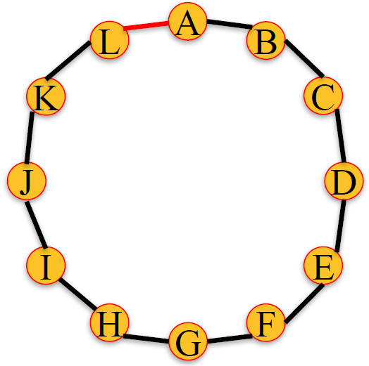

# Module 4: Applications

## Preferential Attachment Model

### Lecture Notes

+ Degree Distributions
    + The __degree__ of a node in an undirected graph is the number of neighbors it has. Eg., A(3), B(2), C(3), D(2), E(1_, F(3), G(4), H(2), I(2)
    + The __degree distribution__ of a graph is the probability distribution of the degrees over the entire network.
    + The degree distribution, $𝑃(𝑘)$ of this network has the following values:

        $$P(1) = \frac{1}{9}, P(2) = \frac{4}{9}, P(3)=\frac{1}{3}, P(4) = \frac{1}{9}$$
        + $k$: the degree of a given node
    + Plot of the degree distribution of this network:
        ```python
        degrees = G.degree()
        degree_values = sorted(set(degrees.values()))
        histogram = [list(degrees.values()).count(i)/float(nx.number_of_nodes(G)) for i in degree_values]

        import matplotlib.pyplot as plt
        plt.bar(degree_values,histogram)
        plt.xlabel('Degree')
        plt.ylabel('Fraction of Nodes')
        plt.show()
        ```
        <a href="https://www.coursera.org/learn/python-social-network-analysis/lecture/abipd/preferential-attachment-model">
            
            
        </a>

+ In-Degree Distributions
    + The __in-degree__ of a node in a directed graph is the number of in-links it has.
    + E.g. graph above - A(3), B(1), C(2), D(1), E(0), F(1), G(1), H(0), I(2)
    + The in-degree distribution, $P_{in}(k)$, of this network has the following values:

        $$P_{in}(0)=\frac{2}{9}, P_{in}(1)=\frac{4}{9}, P_{in}(2)=\frac{2}{9}, P_{in}(3)=\frac{1}{9}$$
    + Plot of the degree distribution of this network:
        ```python
        in_degrees = G.in_degree()
        in_degree_values = sorted(set(in_degrees.values()))
        histogram = [list(in_degrees.values()).count(i)/float(nx.number_of_nodes(G)) for i in in_degree_values]

        plt.bar(in_degree_values,histogram)
        plt.xlabel('In Degree')
        plt.ylabel('Fraction of Nodes')
        plt.show()
        ```
        <a href="https://www.coursera.org/learn/python-social-network-analysis/lecture/abipd/preferential-attachment-model">
            
            
        </a>

+ Degree Distributions in Real Networks
    + A – __Actors__: network of 225,000 actors connected when they appear in a movie together.
    + B – __The Web__: network of 325,000 documents on the WWW connected by URLs.
    + C – __US Power Grid__: network of 4,941 generators connected by transmission lines.
    + Degree distribution looks like a straight line when on a log-log scale. __Power law__: $P(k)=Ck^{-\alpha}$, where $\alpha$ and C are constants. $\alpha$ values: A: 2.3, B:2.1, C:4.
    <a href="https://harangdev.github.io/applied-data-science-with-python/applied-social-network-analysis-in-python/4/"> <br/>
        
    </a>

+ Modeling Networks
    + Networks with power law distribution have many nodes with small degree and a few nodes with very large degree.
    + What could explain power law degree distribution we observe in many networks?
    + Can we find a set of basic assumptions that explain this phenomenon?

+ Preferential Attachment Model
    + Start with two nodes connected by an edge.
    + At each time step, add a new node with an edge connecting it to an existing node.
    + Choose the node to connect to at random with probability proportional to each node's degree.
    + The probability of connecting to a node $u$ of degree $k_u$:

        $$k_u = k_u/\sum_j k_j$$
    + As the number of nodes increases, the degree distribution of the network under the preferential attachment model approaches the power law $P(k) = Ck^{-3}$ with constant $C$.
    + The preferential attachment model produces networks with degree distributions similar to real networks.
    + `barabasi_albert_graph(n, m)` returns a network with $n$ nodes. Each new node attaches to $m$ existing nodes according to the Preferential Attachment model.
        ```python
        G = nx.barabasi_albert_graph(1000000, 1)
        degrees = G.degree()
        degree_values = sorted(set(degrees.values()))
        histogram = [list(degrees.values().count(i))/float(nx.number_of_nodes(G)) for i in degree_values]

        plt.plot(degree_values,histogram, 'o')
        plt.xlabel('Degree')
        plt.ylabel('Fraction of Nodes')
        plt.xscale('log')
        plt.yscale('log')
        plt.show()
        ```
        <a href="https://www.coursera.org/learn/python-social-network-analysis/lecture/abipd/preferential-attachment-model"> <br/>
            
            
            
            
            
            
        </a>
        <a href="https://harangdev.github.io/applied-data-science-with-python/applied-social-network-analysis-in-python/4/"> 
            
        </a>
    + IVQ: What is the probability that node 8 attaches to node 3?
        <a href="https://www.coursera.org/learn/python-social-network-analysis/lecture/abipd/preferential-attachment-model"> <br/>
            
        </a>

+ Summary
    + The degree distribution of a graph is the probability distribution of the degrees over the entire network.
    + Many real networks have degree distributions that look like power laws ($P(k) = Ck^{-\alpha}$).
    + Models of network generation allow us to identify mechanisms that give rise to observed patterns in real data.
    + The Preferential Attachment Model produces networks with a power law degree distribution.
    + Use `barabasi_albert_graph(n,m)` to construct a n-node preferential attachment network, where each new node attaches to m existing nodes.

+ `G.in_degree` method
    + Signature: `nx.DiGraph.in_degree(nbunch=None, weight=None)`
    + Docstring: Return the in-degree of a node or nodes. The node in-degree is the number of edges pointing in to the node.
    + Parameters
        + `nbunch` (iterable container, optional (default=all nodes)): A container of nodes.  The container will be iterated through once.
        + `weight` (string or None, optional (default=None)): The edge attribute that holds the numerical value used as a weight.  If None, then each edge has weight 1. The degree is the sum of the edge weights adjacent to the node.
    + Returns: `nd` (dictionary, or number): A dictionary with nodes as keys and in-degree as values or a number if a single node is specified.

+ `nx.barabasi_albert_graph` function
    + Signature: `nx.barabasi_albert_graph(n, m, seed=None)`
    + Docstring: Returns a random graph according to the Barabási–Albert preferential attachment model.
    + Note: A graph of `n` nodes is grown by attaching new nodes each with `m` edges that are preferentially attached to existing nodes with high degree.
    + Parameters
        + `n` (int): Number of nodes
        + `m` (int): Number of edges to attach from a new node to existing nodes
        + `seed` (int, optional): Seed for random number generator (default=None).
    + Returns: `G`: Graph
    + References: A. L. Barabási and R. Albert "Emergence of scaling in random networks", Science 286, pp 509-512, 1999.


### Lecture Video

<a href="https://d3c33hcgiwev3.cloudfront.net/lNURBZTMEeeOmgqEJWRlfA.processed/full/360p/index.mp4?Expires=1549497600&Signature=ZbRdvAcpqHNU0nMzfycqCvR4CKg5EohROkgICPmo5lpA0gHueOlj0q-Gx6XPn3g1Y2kac33geKa5kBntgmGYTtaqB0XrIMXL5XSs48jXxsQu2~NATd0DVRQaHqCh1t8c~00H36bVh3A-x7EbW-I7u-egb1buQCx1L55kH9rjSa4_&Key-Pair-Id=APKAJLTNE6QMUY6HBC5A" alt="Preferential Attachment Model" target="_blank">
     
</a>


## Power Laws and Rich-Get-Richer Phenomena (Optional)

Read [Chapter 18]((http://www.cs.cornell.edu/home/kleinber/networks-book/networks-book-ch18.pdf)) from "Networks, Crowds, and Markets: Reasoning about a Highly Connected World" By David Easley and Jon Kleinberg. Cambridge University Press, 2010 for an interesting read on Power Laws and Rich-Get-Richer phenomena such as the preferential attachment model.

+ [Popularity as a Network Phenomenon](p1-PowerLaw.md#popularity-as-a-network-phenomenon)
+ [Power Laws](p1-PowerLaw.md#power-laws)
+ [Rich-Get-Richer Models](p1-PowerLaw.md#rich---get---richer-effects)
+ [The Unpredictability of Rich-Get-Richer Effects](p1-PowerLaw.md#the-unpredictability-of-rich---get---richer-effects)
+ [The Long Tail](p1-PowerLaw.md#the-long-tail)
+ [The Effect of Search Tools and Recommendation Systems](p1-PowerLaw.md#the-effect-of-search-tools-and-recommendation-systems)
+ [Advanced Material: Analysis of Rich-Get-Richer Processes](p1-PowerLaw.md#advanced-material-analysis-of-rich---get---richer-processes)


## Small World Networks

### Lecture Notes

+ The Small-World Phenomenon
    + The world is small in the sense that "short" paths exists between almost any two people.
    + How short are these paths?
    + How can we measure their length?

+ Milgram Small World Experiment: 
    + Set up (1960s)
        + 296 randomly chosen "starters" asked to forward a letter to a "target" person.
        + Target was a stockbroker in Boston.
        + Instructions for starter:
            + Send letter to target if you know him on a first name basis.
            + If you do not know target, send letter (and instructions) to someone you know on a first name basis who is more likely to know the target.
        + Some information about the target, such as city, and occupation, was provided.
    + Results:
        + 64 out of the 296 letters reached the target.
        + Median chain length was 6 (consistent with the phrase "six degrees of separation")
    + Key points:
        + A relatively large percentage (>20%) of letters reached target.
        + Paths were relatively short.
        + People were able to find these short paths.
    <a href="https://www.coursera.org/learn/python-social-network-analysis/lecture/Iv4e8/small-world-networks"> <br/>
        
    </a>

+ Small World of Instant Message
    + Nodes: 240 million active users on Microsoft Instant Messenger.
    + Edges: Users engaged in two-way communication over a one-month period.
    + Estimated median path length of 7.
    + Leskovec and Horvitz, 2008
    <a href="https://www.coursera.org/learn/python-social-network-analysis/lecture/Iv4e8/small-world-networks"> <br/>
        
    </a>

+ Small World of Facebook
    + Global network: average path length in 2008 was 5.28 and in 2011 it was 4.74.
    + Path are even shorter if network is restricted to US only.
    <a href="https://www.coursera.org/learn/python-social-network-analysis/lecture/Iv4e8/small-world-networks"> <br/>
        
    </a>

+ Clustering Coefficient
    + __Local clustering coefficient of a node__: Fraction of pairs of the node's friends that are friends with each other.
        + Facebook 2011: High average CC (decreases with degree)
        + Microsoft Instant Message: Average CC of 0.13.
        + IMDB actor network: Average CC 0.78
    + In a random graph, the average clustering coefficient would be much smaller.
    <a href="https://www.coursera.org/learn/python-social-network-analysis/lecture/Iv4e8/small-world-networks"> <br/>
        
    </a>

+ Path Length and Clustering
    + Social networks tend to have high clustering coefficient and small average path length. Can we think of a network generative model that has these two properties?
    + How about the Preferential Attachment model?
        ```python
        G = nx.barabasi_albert_graph(1000,4)
        print (nx.average_clustering(G))
        # 0.0202859273671
        print (nx.average_shortest_path_length(G))
        # 4.16942942943
        ```
    + What if we vary the number of nodes ($n$) or the number of edges per new node ($m$)?
    <a href="https://www.coursera.org/learn/python-social-network-analysis/lecture/Iv4e8/small-world-networks"> <br/>
        
    </a>
        + Small average shortest path (characteristics):
            + high degree nodes act as hubs
            + connect many pairs of nodes.
        + For a fixed $m$, clustering coefficient becomes very small as the number of nodes increases.
        + No mechanism in the Preferential Attachment model favors triangle formation.

+ Small World Model
    + Motivation: Real networks exhibit high clustering coefficient and small average shortest paths. Can we think of a model that achieves both of these properties?
    + Small-world model:
        + Start with a ring of 𝑛 nodes, where each node is connected to its $k$ nearest neighbors.
        + Fix a parameter $p \in [0,1]$
        + Consider each edge $(u, v)$. With probability $p$, select a node $w$ at random and rewire the edge $(u, v)$ so it becomes $(u, w)$.
    + Example: $k = 2, p = 0.4$
    <a href="url"> <br/>
        
        
        
        
        
        
        
        
        
        
        
        
        
        
        
        
        
        
    </a>
    + __Regular Lattice__ ($p = 0$): no edge is rewired.
    + __Random Network__ ($p = 1$): all edges are rewired.
    + __Small World Network__ ($0 < p < 1$): Some edges are rewired. Network conserves some local structure but has some randomness.
    <a href="https://harangdev.github.io/applied-data-science-with-python/applied-social-network-analysis-in-python/4/"> <br/>
        
    </a>
    + What is the average clustering coefficient and shortest path of a small world network? <br/> It depends on parameters $k$ and $p$.
    + As $p$ increases from $0$ to $0.09$:
        + average shortest path decreases rapidly.
        + average clustering coefficient deceases slowly.
    + An instance of a network of 1000 nodes, $k = 6$, and $p = 0.04$ has:
        + $8.99$ average shortest path.
        + $0.53$ average clustering coefficient.
    <a href="https://harangdev.github.io/applied-data-science-with-python/applied-social-network-analysis-in-python/4/"> <br/>
        
    </a>

+ Small World Model in NetworkX
    + `watts_strogatz_graph(n, k, p)` returns a small world network with $n$ nodes, starting with a ring lattice with each node connected to its $k$ nearest neighbors, and rewiring probability $p$.
    + Small world network degree distribution:
        ```python
        G = nx.watts_strogatz_graph(1000,6,0.04)
        degrees = G.degree()
        degree_values = sorted(set(degrees.values()))
        histogram = [list(degrees.values()).count(i)/float(nx.number_of_nodes(G)) for i in degree_values]

        plt.bar(degree_values, histogram)
        plt.xlabel('Degree')
        plt.ylabel('Fraction of Nodes')
        plt.show()
        ```
        + Small world network: 1000 nodes, $k = 6$, and $p = 0.04$
        + No power law degree distribution.
        + Since most edges are not rewired, most nodes have degree of $6$.
        + Since edges are rewired uniformly at random, no node accumulated very high degree, like in the preferential attachment model
        <a href="https://www.coursera.org/learn/python-social-network-analysis/lecture/Iv4e8/small-world-networks"> <br/>
            
        </a>
    + Variants of the small world model in NetworkX: Small world networks can be disconnected, which is sometime undesirable.
    + `connected_watts_strogatz_graph(n, k, p, t)` runs `watts_strogatz_graph(n, k, p)` up to t times, until it returns a connected small world network.
    + `newman_watts_strogatz_graph(n, k, p)` runs a model similar to the small world model, but rather than rewiring edges, new edges are added with probability $p$.
    + IVQ: Is the degree distribution of small world network a power law distribution?

        Ans: No
        The degree distribution of small world network is not a power law because the degree of most nodes lie in the middle.

+ Summary
    + Real social networks appear to have small shortest paths between nodes and high clustering coefficient.
    + The preferential attachment model produces networks with small shortest paths but very small clustering coefficient.
    + The small world model starts with a ring lattice with nodes connected to $k$ nearest neighbors (high local clustering), and it rewires edges with probability $p$.
    + For small values of $p$, small world networks have small average shortest path and high clustering coefficient, matching what we observe in real networks.
    + However, the degree distribution of small world networks is not a power law.
    + On NetworkX, you can use `watts_strogatz_graph(n, k, p)` (and other variants) to produce small world networks. <br/><br/>

    | Model | Real World Network | Preferential Attachment Model | Small-World Model |
    |-------|:------:|:-----:|:-----:|
    | Shortest Paths | Small | Small | Small |
    | Clustering Coefficient | High | Low | High |
    | Power Law | Yes | Yes | No |

+ `nx.watts_strogatz_graph` function
    + Signature: `nx.watts_strogatz_graph(n, k, p, seed=None)`
    + Docstring: Return a Watts–Strogatz small-world graph.
    + Parameters
        + `n` (int): The number of nodes
        + `k` (int): Each node is joined with its ``k`` nearest neighbors in a ring topology.
        + `p` (float): The probability of rewiring each edge
        + `seed` (int, optional): Seed for random number generator (default=None)
    + Notes
        + First create a ring over $n$ nodes.  Then each node in the ring is joined to its $k$ nearest neighbors (or $k - 1$ neighbors if $k$ is odd). Then shortcuts are created by replacing some edges as follows: for each edge $(u, v)$ in the underlying "$n$-ring with $k$ nearest neighbors" with probability $p$ replace it with a new edge $(u, w)$ with uniformly random choice of existing node $w$.
        + In contrast with `newman_watts_strogatz_graph`, the random rewiring does not increase the number of edges. The rewired graph is not guaranteed to be connected as in `connected_watts_strogatz_graph`.
    + References: Duncan J. Watts and Steven H. Strogatz, Collective dynamics of small-world networks, Nature, 393, pp. 440--442, 1998.

+ `connected_watts_strogatz_graph` function
    + Signature: `nx.connected_watts_strogatz_graph(n, k, p, tries=100, seed=None)`
    + Docstring: Returns a connected Watts–Strogatz small-world graph.
    + Note: Attempts to generate a connected graph by repeated generation of Watts–Strogatz small-world graphs.  An exception is raised if the maximum number of tries is exceeded.
    + Parameters
        + `n` (int): The number of nodes
        + `k` (int): Each node is joined with its $k$ nearest neighbors in a ring topology.
        + `p` (float): The probability of rewiring each edge
        + `tries` (int): Number of attempts to generate a connected graph.
        + `seed` (int, optional): The seed for random number generator.


+ `newman_watts_strogatz_graph` function
    + Signature: `nx.newman_watts_strogatz_graph(n, k, p, seed=None)`
    + Docstring: Return a Newman–Watts–Strogatz small-world graph.
    + Parameters
        + `n` (int): The number of nodes.
        + `k` (int): Each node is joined with its $k$ nearest neighbors in a ring topology.
        + `p` (float): The probability of adding a new edge for each edge.
        + `seed` (int, optional): The seed for the random number generator (the default is `None`).
    + Notes: First create a ring over $n$ nodes.  Then each node in the ring is connected with its $k$ nearest neighbors (or $k - 1$ neighbors if $k$ is odd).  Then shortcuts are created by adding new edges as follows: for each edge $(u, v)$ in the underlying "$n$-ring with $k$ nearest neighbors" with probability $p$ add a new edge $(u, w)$ with randomly-chosen existing node $w$.  In contrast with `watts_strogatz_graph`, no edges are removed.
    + References: M. E. J. Newman and D. J. Watts, [Renormalization group analysis of the small-world network model](http://dx.doi.org/10.1016/S0375-9601(99)00757-4), Physics Letters A, 263, 341, 1999.


### Lecture Video

<a href="https://d3c33hcgiwev3.cloudfront.net/pJ8eFZTMEeeClxLmJhEfgA.processed/full/360p/index.mp4?Expires=1549497600&Signature=iTfGk0ABVH-VCOu8GPJ68KtOmP9Mwn1YwrtG4klpWxd05VkrXz~fxHBrmrhIO88pprQ29MABvBjJZ~JvMGhn4qftCC2isynvKkv8AwNysoKC1FxB~gtvtXJK04XOeThVu0ervNzfG~yUk3X08NFVmJK3x87IkKqjvWHpbhWAfKw_&Key-Pair-Id=APKAJLTNE6QMUY6HBC5A" alt="Small World Networks" target="_blank">
     
</a>


## Link Prediction

### Lecture Notes

+ Link Prediction Problem
    + Modeling network evolution:
        + Preferential attachment model
        + Small world model
    + Link prediction: Given a network, can we predict which edges will be formed in the future?

+ Link Prediction
    + What new edges are likely to form in this network? B
    + Given a pair of nodes, how to assess whether they are likely to connect?
    + __Triadic closure__: the tendency for people who share connections in a social network to become connected.
    + Measure 1: number of common neighbors.

+ Measure 1: Common Neighbors
    + The number of common neighbors of nodes $X$ and $Y$ is

        $$\text{comm\_neigh}(X, Y) = | N(X) \cap N(Y) |$$
        + $N(X)$: the set of neighbors of node $𝑋$
    + E.g., $\text{comm\_neigh}((A, C) = |\{B, D\}| = 2$
        ```python
        common_neigh = [(e[0], e[1], len(list(nx.common_neighbors(G, e[0], e[1])))) for e in nx.non_edges(G)]
        sorted(common_neigh,key=operator.itemgetter(2), reverse = True)

        print (common_neigh)
        # [('A', 'C', 2), ('A', 'G', 1), ('A', 'F', 1), ('C', 'E', 1), ('C', 'G', 1),
        #  ('B', 'E', 1), ('B', 'F', 1), ('E', 'I', 1), ('E', 'H', 1), ('E', 'D', 1),
        #  ('D', 'F', 1), ('F', 'I', 1), ('F', 'H', 1), ('I', 'H', 1), ('A', 'I', 0),
        #  ('A', 'H', 0), ('C', 'I', 0), ('C', 'H', 0), ('B', 'I', 0), ('B', 'H', 0),
        #  ('B', 'G', 0), ('D', 'I', 0), ('D', 'H', 0), ('D', 'G', 0)]
        ```
        <a href="https://harangdev.github.io/applied-data-science-with-python/applied-social-network-analysis-in-python/4/"> <br/>
        
    </a>
    <a href="https://www.coursera.org/learn/python-social-network-analysis/lecture/hvFPZ/link-prediction"> 
        
    </a>

+ Measure 2: Jaccard Coefficient
    + Number of common neighbors normalized by the total number of neighbors.
    + The Jaccard coefficient of nodes 𝑋 and 𝑌 is

        $$\text{jacc\_coeff}(X, Y) = \frac{|N(X) \cap N(Y)|}{|N(X) \cup N(Y)}$$
    + E.g., $\text{jacc\_coeff}(A, C) = \frac{|\{B, D\}|}{|\{B, D, E, F\}|}$
    + IVQ: What is the Jaccard Coefficient between node A and F?  Enter your answer as a fraction below the graphic.

        Ans: 1/5 <br/>
        $\text{J\_coef}(F) = |{E}|/|{B, C, D, E, G}|= \frac{1}{5} = 0.2$
    + Number of common neighbors normalized by the total number of neighbors.
        ```python
        L = list(nx.jaccard_coefficient(G))
        L.sort(key=operator.itemgetter(2), reverse = True)
        print(L)
        # [('I', 'H', 1.0), ('A', 'C', 0.5), ('E', 'I', 0.3333333333333333),
        #  ('E', 'H', 0.3333333333333333), ('F', 'I', 0.3333333333333333),
        #  ('F', 'H', 0.3333333333333333), ('A', 'F', 0.2), ('C', 'E', 0.2),
        #  ('B', 'E', 0.2), ('B', 'F', 0.2), ('E', 'D', 0.2), ('D', 'F', 0.2),
        #  ('A', 'G', 0.16666666666666666), ('C', 'G', 0.16666666666666666),
        #  ('A', 'I', 0.0), ('A', 'H', 0.0), ('C', 'I', 0.0), ('C', 'H', 0.0),
        #  ('B', 'I', 0.0), ('B', 'H', 0.0), ('B', 'G', 0.0), ('D', 'I', 0.0),
        #  ('D', 'H', 0.0), ('D', 'G', 0.0)]
        ```
        <a href="https://www.coursera.org/learn/python-social-network-analysis/lecture/hvFPZ/link-prediction"> 
            
        </a>

+ Measure 3: Resource Allocation
    + Fraction of a "resource" that a node can send to another through their common neighbors.
    + The Resource Allocation index of nodes $X$ and $Y$ is

        $$\text{res\_alloc}(X, Y) = \sum_{u \in N(X) \cap N(Y)} \frac{1}{|N(u)|}$$
    + Basic Principle: $Z$ has $n$ neighbors, $X$ sends 1 unit to $Z$, $Z$ distributes the unit evenly among all neighbors $\rightarrow Y$ receives $1/n$ of the unit.
    + E.g., $\text{res\_alloc}(A, C) = \frac{1}{3} + \frac{1}{3}$
    + Fraction of a "resource" that a node can send to another through their common neighbors.
    ```python
    L = list(nx.resource_allocation_index(G))
    L.sort(key=operator.itemgetter(2), reverse = True)
    print(L)
    # [('A', 'C', 0.6666666666666666), ('A', 'G', 0.3333333333333333),
    #  ('A', 'F', 0.3333333333333333), ('C', 'E', 0.3333333333333333),
    #  ('C', 'G', 0.3333333333333333), ('B', 'E', 0.3333333333333333),
    #  ('B', 'F', 0.3333333333333333), ('E', 'D', 0.3333333333333333),
    #  ('D', 'F', 0.3333333333333333), ('E', 'I', 0.25), ('E', 'H', 0.25),
    #  ('F', 'I', 0.25), ('F', 'H', 0.25), ('I', 'H', 0.25), ('A', 'I', 0),
    #  ('A', 'H', 0), ('C', 'I', 0), ('C', 'H', 0), ('B', 'I', 0),
    #  ('B', 'H', 0), ('B', 'G', 0), ('D', 'I', 0), ('D', 'H', 0), ('D', 'G', 0)]
    ```
    <a href="https://www.coursera.org/learn/python-social-network-analysis/lecture/hvFPZ/link-prediction"> <br/>
        
        
        
    </a>
    + IVQ: What is the Resource Allocation index of Node I and H?

        Ans: 0.25
        Node I and H have only one common neighbor: G. The degree of node G is 4. Hence the Resource Allocation index is $\frac{1}[4} = 0.25$.

+ Measure 4: Adamic-Adar Index
    + Similar to resource allocation index, but with log in the denominator.
    + The Adamic-Adar index of nodes $X$ and $Y$ is

        $$\text{adamic\_adar}(X, Y) = \sum_{u \in N(X) \cap N(Y)} \frac{1}{\log(|N(u)|)}$$
    + E.g., $\text{admic\_adar}(A, C) = \frac{1}{\log(3)} + \frac{1}{\log(3)} = 1.82$
    + Similar to resource allocation index, but with log in the denominator.
        ```python
        L = list(nx.adamic_adar_index(G))
        L.sort(key=operator.itemgetter(2), reverse = True)
        print(L)
        # [('A', 'C', 1.8204784532536746), ('A', 'G', 0.9102392266268373),
        #  ('A', 'F', 0.9102392266268373), ('C', 'E', 0.9102392266268373),
        #  ('C', 'G', 0.9102392266268373), ('B', 'E', 0.9102392266268373),
        #  ('B', 'F', 0.9102392266268373), ('E', 'D', 0.9102392266268373),
        #  ('D', 'F', 0.9102392266268373), ('E', 'I', 0.7213475204444817),
        #  ('E', 'H', 0.7213475204444817), ('F', 'I', 0.7213475204444817),
        #  ('F', 'H', 0.7213475204444817), ('I', 'H', 0.7213475204444817),
        #  ('A', 'I', 0), ('A', 'H', 0), ('C', 'I', 0), ('C', 'H', 0),
        #  ('B', 'I', 0), ('B', 'H', 0), ('B', 'G', 0), ('D', 'I', 0),
        #  ('D', 'H', 0), ('D', 'G', 0)]
        ```

+ Measure 5: Preferential Attachment
    + In the preferential attachment model, nodes with high degree get more neighbors.
    + Product of the nodes' degree.
    + The preferential attachment score of nodes $X$ and $Y$ is

        $$\text{pref\_attach}(X, Y) = |N(X)||N(Y)|$$
    + E.g., $\text{pref\_attach}(A, C) = 3 * 3 = 9$
    + Product of the nodes' degree.
        ```python
        L = list(nx.preferential_attachment(G))
        L.sort(key=operator.itemgetter(2), reverse = True)
        print(L)
        # [('A', 'G', 12), ('C', 'G', 12), ('B', 'G', 12), ('D', 'G', 12),
        #  ('A', 'C', 9), ('A', 'F', 9), ('C', 'E', 9), ('B', 'E', 9), ('B', 'F', 9),
        #  ('E', 'D', 9), ('D', 'F', 9), ('A', 'I', 3), ('A', 'H', 3), ('C', 'I', 3),
        #  ('C', 'H', 3), ('B', 'I', 3), ('B', 'H', 3), ('E', 'I', 3), ('E', 'H', 3),
        #  ('D', 'I', 3), ('D', 'H', 3), ('F', 'I', 3), ('F', 'H', 3), ('I', 'H', 1)]
        ```

+ Community Structure
    + Some measures consider the community structure of the network for link prediction.
    + Assume the nodes in this network belong to different communities (sets of nodes).
    + Pairs of nodes who belong to the same community and have many common neighbors in their community are likely to form an edge.
    <a href="https://www.coursera.org/learn/python-social-network-analysis/lecture/hvFPZ/link-prediction"> <br/>
        
    </a>

+ Measure 6: Community Common Neighbors
    + Number of common neighbors with bonus for neighbors in same community.
    + The Common Neighbor Soundarajan-Hopcroft score of nodes $X$ and $Y$ is:

        $$\text{cn\_soundarajan\_hopcroff}(X, Y) = |N(X) \cap N(Y)| + \sum_{u \in N(X) \cap N(Y)} f(u)$$

        $$f(u) = \left\{ \begin{array}{ll}
            1, & u \text{ in same comm. as } X \text{and } Y \\
            0, & \text{ otherwise}
            \end{array} \right.$$
    + Number of common neighbors with bonus for neighbors in same community.
        + $\text{cn\_soundarajan\_hopcroft}(A, C) = 2 + 2 = 4$
        + $\text{cn\_soundarajan\_hopcroft}(E, I) = 1 + 1 = 2$
        + $\text{cn\_soundarajan\_hopcroft}(A, G) = 1 + 0 = 1$
    + IVQ: What is the Common Neighbor Soundarajan-Hopcroft score of node I and H?

        Ans: 2 <br/>
        Node I and H have only one common neighbor G. G is in the same community hence $f(u)=1$. The result is $1+1=2$.
    + Assign nodes to communities with attribute node "community"
        ```python
        # assign community
        G.node['A']['community'] = 0
        G.node['B']['community'] = 0
        G.node['C']['community'] = 0
        G.node['D']['community'] = 0
        G.node['E']['community'] = 1
        G.node['F']['community'] = 1
        G.node['G']['community'] = 1
        G.node['H']['community'] = 1
        G.node['I']['community'] = 1

        L = list(nx.cn_soundarajan_hopcroft(G))
        L.sort(key=operator.itemgetter(2), reverse = True)
        print(L)
        # [('A', 'C', 4), ('E', 'I', 2), ('E', 'H', 2), ('F', 'I', 2),
        #  ('F', 'H', 2), ('I', 'H', 2), ('A', 'G', 1), ('A', 'F', 1), ('C', 'E', 1),
        #  ('C', 'G', 1), ('B', 'E', 1), ('B', 'F', 1), ('E', 'D', 1), ('D', 'F', 1),
        #  ('A', 'I', 0), ('A', 'H', 0), ('C', 'I', 0), ('C', 'H', 0), ('B', 'I', 0),
        #  ('B', 'H', 0), ('B', 'G', 0), ('D', 'I', 0), ('D', 'H', 0), ('D', 'G', 0)]
        ```
        <a href="https://www.coursera.org/learn/python-social-network-analysis/lecture/hvFPZ/link-prediction"> 
            
        </a>

+ Measure 7: Community Resource Allocation
    + Similar to resource allocation index, but only considering nodes in the same community
    + The Resource Allocation Soundarajan-Hopcroft score of nodes 𝑋 and 𝑌 is:

        $$\text{ra\_soundarajan\_hopcroff}(X, Y) = |N(X) \cap N(Y)| + \sum_{u \in N(X) \cap N(Y)} \frac{f(u)}{|N(u)|}$$

        $$f(u) = \left\{ \begin{array}{ll}
            1, & u \text{ in same comm. as } X \text{and } Y \\
            0, & \text{ otherwise}
            \end{array} \right.$$
    + Similar to resource allocation index, but only considering nodes in the same community
        + $\text{ra\_soundarajan\_hopcroft}(A, C) = \frac{1}{3} + \frac{1}{3} = \frac{2}{3}$
        + $\text{ra\_soundarajan\_hopcroft}(E, I) = \frac{1}{4}$
        + $\text{ra\_soundarajan\_hopcroft}(A, G) = 0$
    + Similar to resource allocation index, but only considering nodes in the same community
        ```python
        L = list(nx.ra_index_soundarajan_hopcroft(G))
        L.sort(key=operator.itemgetter(2), reverse = True)
        print(L)
        # [('A', 'C', 0.6666666666666666), ('E', 'I', 0.25), ('E', 'H', 0.25),
        #  ('F', 'I', 0.25), ('F', 'H', 0.25), ('I', 'H', 0.25), ('A', 'I', 0),
        #  ('A', 'H', 0), ('A', 'G', 0), ('A', 'F', 0), ('C', 'I', 0), ('C', 'H', 0),
        #  ('C', 'E', 0), ('C', 'G', 0), ('B', 'I', 0), ('B', 'H', 0), ('B', 'E', 0),
        #  ('B', 'G', 0), ('B', 'F', 0), ('E', 'D', 0), ('D', 'I', 0), ('D', 'H', 0),
        #  ('D', 'G', 0), ('D', 'F', 0)]
        ```
        <a href="https://www.coursera.org/learn/python-social-network-analysis/lecture/hvFPZ/link-prediction"> 
            
        </a>

+ Summary
    + Link prediction problem: Given a network, predict which edges will be formed in the future.
        + 5 basic measures:
            + Number of Common Neighbors
            + Jaccard Coefficient
            + Resource Allocation Index
            + Adamic-Adar Index
            + Preferential Attachment Score
        + 2 measures that require community information:
            + Common Neighbor Soundarajan-Hopcroft Score
            + Resource Allocation Soundarajan-Hopcroft Score

+ `nx.non_edges` function
    + Signature: `nx.non_edges(graph)`
    + Docstring: Returns the non-existent edges in the graph.
    + Parameters
        + `graph` (NetworkX graph.): Graph to find non-existent edges.
    + Returns: `non_edges` (iterator)

+ `nx.common_neighbors` function
    + Signature: `nx.common_neighbors(G, u, v)`
    + Docstring: Return the common neighbors of two nodes in a graph.
    + Parameters
        + `G` (graph): A NetworkX undirected graph.
        + `u`, `v` (nodes): Nodes in the graph.
    + Returns: `cnbors` (iterator): Iterator of common neighbors of u and v in the graph.

+ `nx.jaccard_coefficient` function
    + Signature: `nx.jaccard_coefficient(G, ebunch=None)`
    + Docstring: Compute the Jaccard coefficient of all node pairs in `ebunch`.
    + Note: Jaccard coefficient of nodes `u` and `v` is defined as

        $$\frac{|\Gamma(u) \cap \Gamma(v)|}{|\Gamma(u) \cup \Gamma(v)|}$$
        + $\Gamma(u)$: the set of neighbors of `u`
    + Parameters
        + `G` (graph): A NetworkX undirected graph.
        + `ebunch` (iterable of node pairs, optional (default = None)): Jaccard coefficient will be computed for each pair of nodes given in the iterable. The pairs must be given as 2-tuples `(u, v)` where `u` and `v` are nodes in the graph. If `ebunch` is None then all non-existent edges in the graph will be used. Default value: None.
    + Returns: `piter` (iterator): An iterator of 3-tuples in the form `(u, v, p)` where `(u, v)` is a pair of nodes and p is their Jaccard coefficient.

+ `nx.resource_allocation_index` function
    + Signature: `nx.resource_allocation_index(G, ebunch=None)`
    + Docstring: Compute the resource allocation index of all node pairs in `ebunch`.
    + Note: Resource allocation index of `u` and `v` is defined as

        $$\sum_{w \in \Gamma(u) \cap \Gamma(v)} \frac{1}{|\Gamma(w)|}$$
        + $\Gamma(u)$: the set of neighbors of `u`.
    + Parameters
        + `G` (graph): A NetworkX undirected graph.
        + `ebunch` (iterable of node pairs, optional (default = None)): Resource allocation index will be computed for each pair of nodes given in the iterable. The pairs must be given as 2-tuples `(u, v)` where `u` and `v` are nodes in the graph. If `ebunch` is None then all non-existent edges in the graph will be used. Default value: None.
    + Returns: `piter` (iterator): An iterator of 3-tuples in the form `(u, v, p)` where `(u, v)` is a pair of nodes and `p` is their resource allocation index.
    + References: T. Zhou, L. Lu, Y.-C. Zhang. [Predicting missing links via local information](http://arxiv.org/pdf/0901.0553.pdf). Eur. Phys. J. B 71 (2009) 623.

+ `nx.adamic_adar_index` function
    + Signature: `nx.adamic_adar_index(G, ebunch=None)`
    + Docstring: Compute the Adamic-Adar index of all node pairs in `ebunch`.
    + Note: Adamic-Adar index of `u` and `v` is defined as

        $$\sum_{w \in \Gamma(u) \cap \Gamma(v)} \frac{1}{\log |\Gamma(w)|}$$
        + $\Gamma(u)$: the set of neighbors of `u`.
    + Parameters
        + `G` (graph): NetworkX undirected graph.
        + `ebunch` (iterable of node pairs, optional (default = None)): Adamic-Adar index will be computed for each pair of nodes given in the iterable. The pairs must be given as 2-tuples `(u, v)` where `u` and `v` are nodes in the graph. If ebunch is None then all non-existent edges in the graph will be used. Default value: None.
    + Returns: `piter` (iterator): An iterator of 3-tuples in the form `(u, v, p)` where `(u, v)` is a pair of nodes and `p` is their Adamic-Adar index.
    + References: D. Liben-Nowell, J. Kleinberg. [The Link Prediction Problem for Social Networks](http://www.cs.cornell.edu/home/kleinber/link-pred.pdf) (2004).

+ `nx.perferential_attachment` function
    + Signature: `nx.preferential_attachment(G, ebunch=None)`
    + Docstring: Compute the preferential attachment score of all node pairs in `ebunch`.
    + Note: Preferential attachment score of `u` and `v` is defined as

        $$|\Gamma(u)| |\Gamma(v)|$$
        + $\Gamma(u)$: the set of neighbors of `u`
    + Parameters
        + `G` (graph): NetworkX undirected graph.
        + `ebunch` (iterable of node pairs, optional (default = None)): Preferential attachment score will be computed for each pair of nodes given in the iterable. The pairs must be given as 2-tuples `(u, v)` where `u` and `v` are nodes in the graph. If ebunch is None then all non-existent edges in the graph will be used. Default value: None.
    + Returns: `piter` (iterator): An iterator of 3-tuples in the form `(u, v, p)` where `(u, v)` is a pair of nodes and `p` is their preferential attachment score.

+ `nx.cn_soundarajan_hopcroft` function
    + Signature: `nx.cn_soundarajan_hopcroft(G, ebunch=None, community='community')`
    + Docstring: Count the number of common neighbors of all node pairs in ebunch using community information.
    + Note: For two nodes `u` and `v`, this function computes the number of common neighbors and bonus one for each common neighbor belonging to the same community as `u` and `v`. Mathematically,

        $$|\Gamma(u) \cap \Gamma(v)| + \sum_{w \in \Gamma(u) \cap \Gamma(v)} f(w)$$
        + $f(w)$:
            + 1 if `w` belongs to the same community as `u` and `v`
            + 0 otherwise
        + $\Gamma(u)$: the set of neighbors of `u`
    + Parameters
        + `G` (graph): A NetworkX undirected graph.
        + `ebunch` (iterable of node pairs, optional (default = None)): The score will be computed for each pair of nodes given in the iterable. The pairs must be given as 2-tuples `(u, v)` where `u` and `v` are nodes in the graph. If ebunch is None then all non-existent edges in the graph will be used. Default value: None.
        + `community` (string, optional (default = 'community')): Nodes attribute name containing the community information. `G[u][community]` identifies which community `u` belongs to. Each node belongs to at most one community. Default value: 'community'.
    + Returns: `piter` (iterator): An iterator of 3-tuples in the form `(u, v, p)` where `(u, v)` is a pair of nodes and p is their score.
    + References: Sucheta Soundarajan and John Hopcroft. [Using community information to improve the precision of link prediction methods](http://doi.acm.org/10.1145/2187980.2188150). In Proceedings of the 21st international conference companion on World Wide Web (WWW '12 Companion). ACM, New York, NY, USA, 607-608.

+ `nx.ra_index_soundarajan_hopcroft` function
    + Signature: `nx.ra_index_soundarajan_hopcroft(G, ebunch=None, community='community')`
    + Docstring: Compute the resource allocation index of all node pairs in ebunch using community information.
    + Note: For two nodes `u` and `v`, this function computes the resource allocation index considering only common neighbors belonging to the same community as `u` and `v`. Mathematically,

        $$\sum_{w \in \Gamma(u) \cap \Gamma(v)} \frac{f(w)}{|\Gamma(w)|}$$
        + $f(w)$:
            + 1 if `w` belongs to the same community as `u` and `v`
            + 0 otherwise 
        + $\Gamma(u)$: the set of neighbors of `u`.
    + Parameters
        + `G` (graph): A NetworkX undirected graph.
        + `ebunch` (iterable of node pairs, optional (default = None)): The score will be computed for each pair of nodes given in the iterable. The pairs must be given as 2-tuples `(u, v)` where `u` and `v` are nodes in the graph. If ebunch is None then all non-existent edges in the graph will be used. Default value: None.
        + `community` (string, optional (default = 'community')): Nodes attribute name containing the community information. `G[u][community]` identifies which community u belongs to. Each node belongs to at most one community. Default value: 'community'.
    + Returns: `piter` (iterator): An iterator of 3-tuples in the form (u, v, p) where (u, v) is a pair of nodes and p is their score.
    + References: Sucheta Soundarajan and John Hopcroft. [Using community information to improve the precision of link prediction methods](http://doi.acm.org/10.1145/2187980.2188150). In Proceedings of the 21st international conference companion on World Wide Web (WWW '12 Companion). ACM, New York, NY, USA, 607-608.


### Lecture Video

<a href="https://d3c33hcgiwev3.cloudfront.net/T2Y25ZTLEeeRmQ5TE1Qolg.processed/full/360p/index.mp4?Expires=1549584000&Signature=B-HnMCFqSq0itHv2cnUluG6Zh4d2HKl11W14Y038LHmUuQMhKccn6glaOITcSyt47fzBmZRmoxmNpLUnryt9kKP0m6w9qRQ52JXU76kgb22fY15ieBxGCvfGDIpfdEsSCZkeO9lCGQxpBuVfvj8ziZ7yvd8b-9CvOqhfzhmC5PA_&Key-Pair-Id=APKAJLTNE6QMUY6HBC5A" alt="Link Prediction" target="_blank">
     
</a>


## Notebook: Extracting Features from Graphs

### Notebook Sources

+ [Launchiong Web Page](https://www.coursera.org/learn/python-social-network-analysis/notebook/ntrdh/extracting-features-from-graphs)
+ [Web Notebook](https://bajwjsbbpcxhnmzzoyjrrp.coursera-apps.org/notebooks/Graph%20Features.ipynb)
+ [Local Notebook](notebooks/04-GraphFeatures.ipynb)
+ [Python Code](notebooks/04-GraphFeatures.py)


### Python Code with Results

```python
# In this notebook we will look at a few ways to quickly create a 
# feature matrix from a networkx graph.
import networkx as nx
import pandas as pd

G = nx.read_gpickle('major_us_cities')

# ## Node based features
G.nodes(data=True)
# [('El Paso, TX', {'location': (-106, 31), 'population': 674433}),
#  ('Long Beach, CA', {'location': (-118, 33), 'population': 469428}),
#  ('Dallas, TX', {'location': (-96, 32), 'population': 1257676}),
#  ...
#  ('Jacksonville, FL', {'location': (-81, 30), 'population': 842583})]

# Initialize the dataframe, using the nodes as the index
df = pd.DataFrame(index=G.nodes())

# ### Extracting attributes
# 
# Using `nx.get_node_attributes` it's easy to extract the node attributes in the graph into DataFrame columns.
df['location'] = pd.Series(nx.get_node_attributes(G, 'location'))
df['population'] = pd.Series(nx.get_node_attributes(G, 'population'))

df.head()
#                 location    population
# El Paso, TX     (-106, 31)    674433
# Long Beach, CA  (-118, 33)    469428
# Dallas, TX      (-96, 32)    1257676
# Oakland, CA     (-122, 37)    406253
# Albuquerque, NM (-106, 35)    556495

# ### Creating node based features
# 
# Most of the networkx functions related to nodes return a dictionary, which can also easily be added to our dataframe.
df['clustering'] = pd.Series(nx.clustering(G))
df['degree'] = pd.Series(G.degree())

df
#                 location    population    clustering    degree
# El Paso, TX     (-106, 31)    674433        0.700000        5
# Long Beach, CA  (-118, 33)    469428        0.745455        11
# Dallas, TX      (-96, 32)    1257676        0.763636        11
# ...

# # Edge based features
G.edges(data=True)
# [('El Paso, TX', 'Albuquerque, NM', {'weight': 367.88584356108345}),
#  ('El Paso, TX', 'Mesa, AZ', {'weight': 536.256659972679}),
#  ('El Paso, TX', 'Tucson, AZ', {'weight': 425.41386739988224}),
#  ...
#  ('Columbus, OH', 'Virginia Beach, VA', {'weight': 701.8766661783677})]


# Initialize the dataframe, using the edges as the index
df = pd.DataFrame(index=G.edges())

# ### Extracting attributes
# 
# Using `nx.get_edge_attributes`, it's easy to extract the edge attributes in the graph into DataFrame columns.
df['weight'] = pd.Series(nx.get_edge_attributes(G, 'weight'))

df
# weight
# (El Paso, TX, Albuquerque, NM)  367.885844
# (El Paso, TX, Mesa, AZ)         536.256660
# (El Paso, TX, Tucson, AZ)       425.413867
# ...

# ### Creating edge based features
# 
# Many of the networkx functions related to edges return a nested data structures. We can extract the relevant data using list comprehension.
df['preferential attachment'] = [i[2] for i in nx.preferential_attachment(G, df.index)]

df
#                                 weight      preferential attachment
# (El Paso, TX, Albuquerque, NM)  367.885844    35
# (El Paso, TX, Mesa, AZ)         536.256660    40
# (El Paso, TX, Tucson, AZ)       425.413867    40
# ...

# In the case where the function expects two nodes to be passed in, we can map the index to a lamda function.
df['Common Neighbors'] = df.index.map(lambda city: len(list(nx.common_neighbors(G, city[0], city[1]))))

df
#                                 weight      preferential    Common
#                                             attachment      Neighbors
# (El Paso, TX, Albuquerque, NM)  367.885844    35            4
# (El Paso, TX, Mesa, AZ)         536.256660    40            3
# (El Paso, TX, Tucson, AZ)       425.413867    40            3
# ...
```

## Quiz: Module 4 Quiz

Q1: Suppose P(k) denotes the degree distribution of the following network, what is the value of P(2) + P(3)?
    <a href="https://www.coursera.org/learn/python-social-network-analysis/exam/CgIV0/module-4-quiz"> <br/>
        
    </a>

    a. 1/6
    b. 1/3
    c. 1/2
    d. 5/6

    Ans: c
    P(2) = 1/6, P(3) = 2/6


Q2: Let P(k) denote the in-degree distribution of the given network below. What value of k gives the highest value of P(k)?
    <a href="https://www.coursera.org/learn/python-social-network-analysis/exam/CgIV0/module-4-quiz"> <br/>
        
    </a>

    a. 1
    b. 2
    c. 3
    d. 0

    Ans: a


Q3: Select all that apply

    a. Networks with a power law distribution have many nodes with large degree and a few nodes with very small degree.
    b. If we draw a power law distribution in log-log scale, the distribution will look like a straight line.
    c. In the Preferential Attachment Model, a new node always connects to the node with highest in-degree.
    d. The Preferential Attachment Model generates a network with a power law degree distribution.

    Ans: bd
    a. False; d: True


Q4: Select all that apply

    a. The degree distribution of small-world networks follows power-law distribution.
    b. Some Small-world networks have high local clustering coefficient and small average shortest path.
    c. The Preferential Attachment Model generates a small-world network.
    d. Small-world networks are always connected.
    e. In the small-world model starting with k nearest neighbors, increasing the rewiring probability p generally decreases both the average clustering coefficient and average shortest path.

    Ans: be
    a: False; c: False; d: False


Q5: Suppose we want to generate several small-world networks with $k$ nearest neighbors and rewiring probability $p$. If $p$ remains the same and we increase k, which best describes the variation of average local clustering coefficient and average shortest path?

    a. Both of them will increase.
    b. Both of them will decrease.
    c. Average local clustering coefficient will increase and average shortest path will decrease.
    d. Average local clustering coefficient will decrease and average shortest path will increase.

    Ans: c, xd


Q6: Based on the network below, suppose we want to apply the common neighbors measure to add an edge from node H, which is the most probable node to connect to H?
    <a href="https://www.coursera.org/learn/python-social-network-analysis/exam/CgIV0/module-4-quiz"> <br/>
        
    </a>

    a. A
    b. B
    c. C
    d. G

    Ans: a


Q7: Based on the network below, what is the Jaccard coefficient of nodes D and C?
    <a href="https://www.coursera.org/learn/python-social-network-analysis/exam/CgIV0/module-4-quiz"> <br/>
        
    </a>

    a. 0.29
    b. 0.33
    c. 0.40
    d. 0.50

    Ans: c
    jacc_coeff(D, C) = |{A, G}| / |{AB, E, G, H}| = 2/5 = 0.4


Q8: Based on the network below, if we apply Resource Allocation method to predict the new edges, what is the value of Resource Allocation index of nodes C and D?
    <a href="https://www.coursera.org/learn/python-social-network-analysis/exam/CgIV0/module-4-quiz"> <br/>
        
    </a>

    a. 0.20
    b. 0.33
    c. 0.70
    d. 0.83

    Ans: d
    res_alloc(C, D) = 1/3 + 1/2 = 5/6


Q9: Based on the network below, what is the preferential attachment score of nodes C and D?
    <a href="https://www.coursera.org/learn/python-social-network-analysis/exam/CgIV0/module-4-quiz"> <br/>
        
    </a>

    a. 5
    b. 8
    c. 10
    d. 15

    Ans: c
    pref_attach(C, D) = 2 * 5 = 10


Q10: Assume there are two communities in this network: `{A, B, C, D, G}` and `{E, F, H}`. Which of the following statements is(are) True? Select all that apply.
    <a href="https://www.coursera.org/learn/python-social-network-analysis/exam/CgIV0/module-4-quiz"> <br/>
        
    </a>

    a. The Common Neighbor Soundarajan-Hopcroft score of node C and node D is 2.
    b. The Common Neighbor Soundarajan-Hopcroft score of node A and node G is 4.
    c. The Resource Allocation Soundarajan-Hopcroft score of node E and node F is 0.
    d. The Resource Allocation Soundarajan-Hopcroft score of node A and node G is 0.7

    Ans: bd
    a. cn_soundarajan_hopcroft(C, D) = 2 + 2 = 4
    c. ra_index_soundarajan_hopcroft(E, F) = 1/3


## The Small-World Phenomenon (Optional)

Read chapters 2 and 20 from "[Networks, Crowds, and Markets: Reasoning about a Highly Connected World](http://www.cs.cornell.edu/home/kleinber/networks-book/)" By David Easley and Jon Kleinberg. Cambridge University Press, 2010 for a more in-depth take on the Small World Phenomenon.

+ [Chapter 2: Graphs](http://www.cs.cornell.edu/home/kleinber/networks-book/networks-book-ch02.pdf)
    + [Basic Definitions](p2-Graphs.md#basic-definitions)
    + [Paths and Connectivity](p2-Graphs.md#paths-and-connectivity)
    + [Distance and Breadth-First Search](p2-Graphs.md#distance-and-breadth---first-search)
    + [Network Datasets: An Overview](p2-Graphs.md#network-datasets-an-overview)

+ [Chapter 20:](http://www.cs.cornell.edu/home/kleinber/networks-book/networks-book-ch20.pdf)


