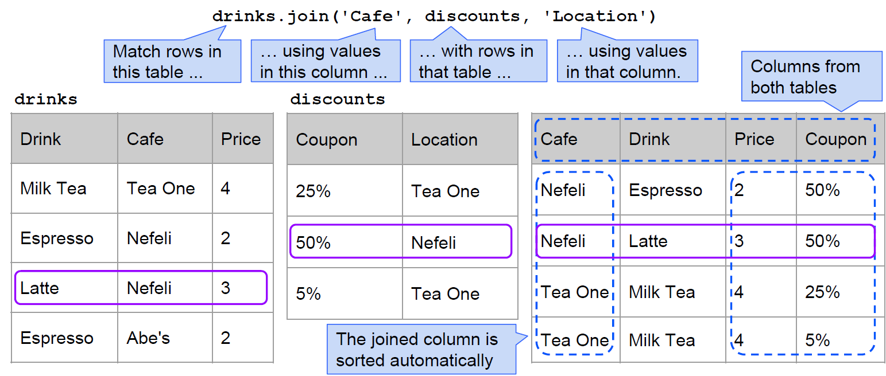

# Section 11: Joins (Lec 11.1 - Lec 11.4)

## Lec 11.1 Joins

### Notes

+ Joining Two Tables
    ```python
    t.join('col_1st_tbl', 2nd_tbl, 'col_2ns_tbl') # same values in col_1st_tbl & col_2nd_tbl
    ```
    + `t`: match rows in this table
    + `col_1st_tbl`: using values in this column
    + `2nd_tbl`: with rows in the table
    + `col_2nd_tb;`: using values in the 2nd table
    + Auto sort the matching rows of `col_1st_tbl` and `col_2nd_tbl`
    + Result columns generated from both tables
    + Generate all possible rows with matched rows

    
+ Demo
    ```python
    drinks = Table(['Drink', 'Cafe', 'Price']).with_rows([
        ['Milk Tea', 'Tea One', 4],
        ['Espresso', 'Nefeli',  2],
        ['Latte',    'Nefeli',  3],
        ['Espresso', "Abe's",   2]
    ])

    discounts = Table().with_columns(
        'Coupon % off', make_array(25, 50, 5),
        'Location', make_array('Tea One', 'Nefeli', 'Tea One')
    )

    t = drinks.join('Cafe', discounts, 'Location')

    t.with_column('Discounted', t.column(2) * (1 - t.column(3)/ 100))
    two = drinks.join('Cafe', drinks)
    two.with_column('Total', two.column('Price') + two.column('Price_2'))
    ```

### Videos 

[](https://youtu.be/2s0yP3wp3rI){:target="_blank"}


## Lec 11.2 Bikes

### Notes

+ Demo: Bikes
    ```python
    trips = Table.read_table('trip.csv')
    # some trips are very long and skew the histogram
    # only interested in the trips for commute within 30 mins
    commute = trips.where('Duration', are.below(1800))
    commute.hist('Duration') 

    commute.hist('Duration', bins=60, unit='second')    # 60 bins
    commute.hist('Duration', bins=np.arange(1801), unit='second') 
    # most commute btw [250, 550)

    starts = commute.group('Start Station').sort('count', descending=True)
    commute.pivot('Start Station', 'End Station')
    ```

### Videos

[](https://youtu.be/-kJEI52bIUM){:target="_blank"}


## Lec 11.3 Shortest Trips

### Notes

+ Demo: Shortest Trips
    ```python
    duration = trips.select(3, 6, 1)
    shortest = duration.group([0, 1], min)
    from_cc = shortest.where(0, are.containing('Civic Center BART')).sort(2)
    ```

### Videos

[](https://youtu.be/KErtBTDpCQo){:target="_blank"}


## Lec 11.4 Maps

### Notes


### Videos

[](https://youtu.be/NmvTEc7DjLk){:target="_blank"}

## Reading and Practice for Section 11

### Reading

### Practice


