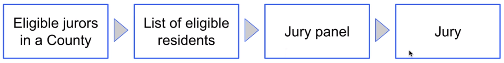

# Section 6: Comparing Distributions (Lec 6.1 - Lec 6.4)

+ Environment Initiation
    ```python
    from datascience import *
    import numpy as np

    import matplotlib.pyplot as plots
    plots.style.use('fivethirtyeight')
    get_ipython().run_line_magic('matplotlib', 'inline')

    np.set_printoptions(legacy='1.13')
    ```

+ [Lecture Notebook](https://hub.data8x.berkeley.edu/hub/user/59d217c894d11dbd21d2d37ef6ae9675/git-sync?repo=git://reposync/materials-x18&subPath=lec/x18/2/lec6.ipynb)
+ [Local Notebook](./notebooks/lec6.ipynb)
+ [local Python Code](./notebooks/lec6.py)

## Lec 6.1 Introduction

### Notes

+ Jury Selection in Alameda  <br/>
    Radical and Ethic Disparities in Alameda Country Jury Pools <br/>
    &nbsp;&nbsp; - A Report  by the ACLU of North California

+ Jury Panels
    <br/><br/>
    Section 197 of California's Code of Civil Procedure says, "All persons selected for jury service shall be selected at random, from a source or sources inclusive of a representative cross section of the population of the area served by the court."

+ Demo
    ```python
    jury = Table().with_columns(
        'Ethnicity', make_array('Asian', 'Black', 'Latino', 'White', 'Other'),
        'Eligible', make_array(0.15, 0.18, 0.12, 0.54, 0.01),
        'Panels', make_array(0.26, 0.08, 0.08, 0.54, 0.04)
    )
    jury

    jury.barh('Ethnicity')
    ```

### Video

<a href="https://edx-video.net/BERD82FD2018-V001700_DTH.mp4" alt="Introduction" target="_blank">
   
</a>


## Lec 6.2 Total Variation Distance

### Notes

+ Model and Alternative
    + _Model_: The people on the jury panels were selected at random from the eligible population
    + _Alternative viewpoint_: No, they weren’t

+ Distance Between Distributions
    + People on the panels are of multiple ethnicities
    + Distribution of ethnicities is categorical
    + To see whether the the distribution of ethnicities of the panels is close to that of the eligible jurors, we have to measure the distance between two categorical distributions
    
+ Total Variation Distance <br/>
    Every distance has a computational recipe __Total Variation Distance (TVD)__:
    + For each category, compute the difference in proportions between two distributions
    + Take the absolute value of each difference
    + Sum, and then divide the sum by 2

+ Demo
    ```python
    jury_with_diffs = jury.with_column('Difference', jury.column('Panels') - jury.column('Eligible'))

    jury_with_diffs = jury_with_diffs.with_column('Absolute Difference', np.abs(jury_with_diffs.column('Difference')))

    sum(jury_with_diffs.column('Absolute Difference'))

    sum(jury_with_diffs.column('Absolute Difference')) / 2

    def total_variation_distance(distribution_1, distribution_2):
        return sum(np.abs(distribution_1 - distribution_2)) / 2

    total_variation_distance(jury.column('Panels'), jury.column('Eligible'))
    ```

### Video


<a href="https://edx-video.net/BERD82FD2018-V001800_DTH.mp4" alt="Total Variation Distance" target="_blank">
   
</a>


## Lec 6.3 Assessment

### Notes

+ Demo
    ```python
    eligible = jury.column('Eligible')

    panels_and_sample = jury.with_column('Random Sample', sample_proportions(1453, eligible))
    
    panels_and_sample.barh('Ethnicity')

    total_variation_distance(panels_and_sample.column('Random Sample'), eligible)
    total_variation_distance(jury.column('Panels'), eligible)
    tvds = make_array()

    repetitions = 10000
    for i in np.arange(repetitions):
        sample_distribution = sample_proportions(1453, eligible)
        new_tvd = total_variation_distance(sample_distribution, eligible)
        tvds = np.append(tvds, new_tvd)

    Table().with_column('Total Variation Distance', tvds).hist(bins = np.arange(0, 0.2, 0.005), ec='w')

    total_variation_distance(jury.column('Panels'), eligible)
    ```

### Video


<a href="https://edx-video.net/BERD82FD2018-V001900_DTH.mp4" alt="Assessment" target="_blank">
   
</a>


## Lec 6.4 Summary

### Notes

+ Demo
    ```python

    ```

### Video


<a href="https://edx-video.net/BERD82FD2018-V001600_DTH.mp4" alt="Summary" target="_blank">
   
</a>


## Reading and Practice for Section 6

### Reading


### Practice


