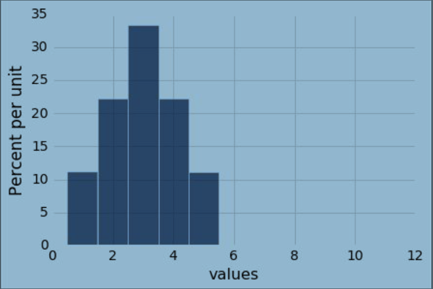
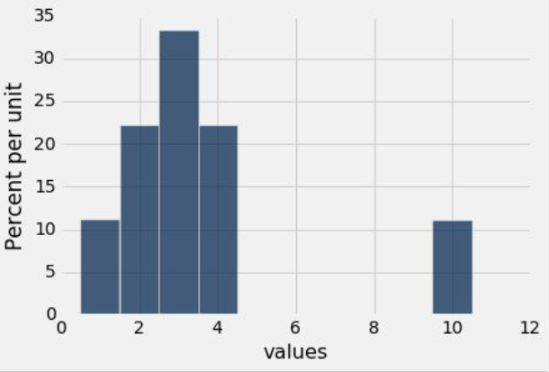
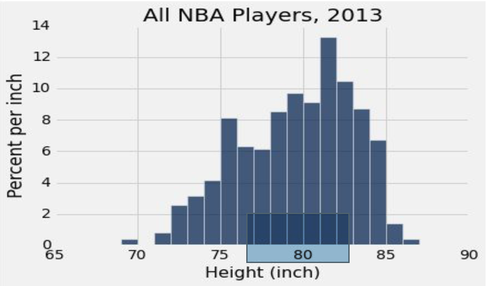

# Section 1: Center and Spread (Lec 1.1 - Lec 1.4)

+ [Launching Web Page](https://courses.edx.org/courses/course-v1:BerkeleyX+Data8.3x+2T2018/courseware/7bba8d29a20946e5be64e508fd3481b2/15f6f5cf64944c379af5a6b1f12f8af4/)
+ [Web Notebook](https://hub.data8x.berkeley.edu/user/37b80bfacc52ea5dfdad124579807188/notebooks/materials-x18/lec/x18/3/lec1.ipynb)
+ [Local Notebook](./notebook/lec1.ipynb)
+ [Local Python](./notebook/lec1.py)

## Lec 1.1 Introduction

### Notes

+ Prediction
  + One of the major responsibility of data science
  + To predict the value of one or more variables given the values of other related variables
  + Distributions: empirical, probability, data, etc.

+ Goals
  + Quantify natural concepts like "center" and "variability"
  + Examine bell shaped distributions
  + Understand why many of the empirical distributions that we have generated are bell shaped

+ The Average (or Mean) <br/>
    Data: 2, 3, 3, 9 -> Average = $(2+3+3+9)/4 = 4.25$
    + Need not be a value in the collection
    + Need not be an integer even if the data are integers
    + Somewhere between min and max, but not necessarily halfway in between
    + Same units as the data
    + Smoothing operator: collect all the contributions in one big pot, then split evenly

+ Relation to the Histogram
  + The average of a list depends only on the __proportions__ in which the distinct values appear, not on the number of entries in the list
  + The average is the __center of gravity__ of the histogram
  + The point on the horizontal axis where the histogram balances

+ Demo
  ```python
  values = make_array(2, 3, 3, 9)
  sum(values) / len(values), np.average(values), np.mean(values)
  # (4.25, 4.25, 4.25

  (2 + 3 + 3 + 9) / 4                 # 4.25
  2 * (1/4) + 3 * (2/4) + 9 * (1/4)   # 4.25
  2 * 0.25 + 3 * 0.5 + 9 * 0.25       # 4.25

  values_table = Table().with_columns('Value', values)
  values_table                        # Value: 2, 3, 3, 9

  bins_for_display = np.arange(0.5, 10.6, 1)

  values_table.hist(bins = bins_for_display, ec = 'w')

  2 * np.ones(10)   # array([2., 2., 2., 2., 2., 2., 2., 2., 2., 2.])

  twos = 2 * np.ones(10)
  threes = 3 * np.ones(20)
  nines = 9 * np.ones(10)

  new_values = np.append(np.append(twos, threes), nines)

  len(new_values)     # 40

  new_values_table = Table().with_column('Value', new_values)
  new_values_table.hist(bins = bins_for_display)

  np.average(new_values), np.average(values)
  # (4.25, 0.3909710391822828)
  ```

### Video

<a href="https://edx-video.net/BERD83FD2018-V000300_DTH.mp4" alt="Lecture 1.1 Introduction" target="_blank">
   
</a>


## Lec 1.2 Average and Median

### Notes

+ Discussion Question
    + Create a data set that has this histogram. (You can do it with a short list of whole numbers.)
    + What are its median and mean?
    <a href="url">
        <br/>
    </a>
      + Answer: data set = {1, 2, 2, 3, 3, 3, 4, 4, 5} -> median = average = 3
    + Are the medians of these two distributions the same or different? Are the means the same or different? If you say “different,” then say which one is bigger.
    <a href="url">
        <br/>
    </a>
    <a href="url">
        
    </a>
      + Answer: List 1 = {1, 2, 2, 3, 3, 3, 4, 4, 5}, List 2 = {1, 2, 3, 3, 3, 4, 4, 10}; same median = 3, different average -> 2nd List bigger

+ Comparing Mean and median
    + __Mean__: Balance point of the histogram
    + __Median__: Half-way point of data; half the area of histogram is on either side of median
    + If the distribution is symmetric about a value, then that value is both the average and the median.
    + If the histogram is skewed, then the mean is pulled away from the median in the direction of the tail.

+ Discussion Question <br/>
    Which is bigger?
    1. mean
    2. median
    <a href="url">
        <br/>
    </a>
    + Answer:  meaian bigger - average is pulled away from the median to the left

+ Demo
    ```python
    nba = Table.read_table('nba2013.csv')
    # Name	Position	Height	Weight	Age in 2013
    # DeQuan Jones	Guard	80	221	23
    # Darius Miller	Guard	80	235	23
    # Trevor Ariza	Guard	80	210	28
    # James Jones	    Guard	80	215	32
    # ...(rows omitted)

    nba.hist('Height', bins=np.arange(65.5, 90.5), ec='w')

    heights = nba.column('Height')
    percentile(50, heights), np.average(heights)
    # (80, 79.06534653465347)
    ```

### Video

<a href="https://edx-video.net/BERD83FD2018-V000100_DTH.mp4" alt="Lec 1.2 Average and Median" target="_blank">
   
</a>


## Lec 1.3 Standard Deviation

### Notes

+ Defining Variability <br/>
    Plan A: “biggest value - smallest value”
    + Doesn’t tell us much about the shape of the distribution

    Plan B: 
    + Measure variability around the mean
    + Need to figure out a way to quantify this

+ How Far from the Average?
    + Standard deviation (SD) measures roughly how far the data are from their average
    + SD = root (5) mean (4) square (3) of deviations (2) from average (1) - (#) indicates the calculation step
    + SD has the same units as the data

+ Why Use the SD? - There are two main reasons.
    + The first reason: No matter what the shape of the distribution, the bulk of the data are in the range “average ± a few SDs”
    + The second reason: Relation with bell shaped curves - Coming up in the next lecture.

+ Demo
    ```python
    sd_table = Table().with_columns('Value', values)
    # Value: 2, 3, 3, 9
    
    average = np.average(values)            $# 4.25
    
    deviations = values - average
    sd_table = sd_table.with_column('Deviation', deviations)
    # (Value, Deviation): (2, -2.25), (3, -1.25), (3, -1.25), (9, 4.75)
    
    sum(deviations)                         # 0.0

    sd_table = sd_table.with_column('Squared Deviation', deviations ** 2)
    # (Value, Deviation, Squared Deviation) = (2, -2.25, 5.0625), 
    #   (3, -1.25, 1.5625), (3, -1.25, 1.5625), (9, 4.75, 22.5625)

    # Variance of the data is the average of the squared deviations
    variance = np.average(sd_table.column('Squared Deviation'))     # 7.6875

    # Standard Deviation (SD) is the square root of the variance
    sd = variance ** 0.5            # 2.7726341266023544
    
    np.std(values)                  # 2.7726341266023544
    ```

### Video

<a href="https://edx-video.net/BERD83FD2018-V000200_DTH.mp4" alt="Lec 1.3 Standard Deviation" target="_blank">
   
</a>


## Lec 1.4 Chebyshev's Bounds

### Notes

+ The Mathematician’s Name
    + Chebyshev
    + Chebychev
    + Chebishov
    + Čebyšev
    + Tchebichev
    + Tchebicheff
    + Tschebyscheff
    + Tschebyschew
    + Чебышёв


+ How Big are Most of the Values?
    + No matter what the shape of the distribution, the bulk of the data are in the range “average ± a few SDs”
    + Chebyshev’s Inequality <br/>
        No matter what the shape of the distribution, the proportion of values in the range “average ± z SDs” is at least $1 - 1/z^2$

+ Chebyshev’s Bounds - __No matter what the distribution looks like__

    | Range | Proportion |
    |-------|------------|
    | average ± 2 SDs | at least $1 - 1/4 (75\%)$ |
    | average ± 3 SDs | at least $1 - 1/9 (88.888...\%)$ |
    | average ± 4 SDs | at least $1 - 1/16 (93.75\%)$ |
    | average ± 5 SDs | at least $1 - 1/25 (96\%)$ |

+ Demo
    ```python
    births = Table.read_table('baby.csv')
    # Birth     Gestational     Maternal    Maternal    Maternal            Maternal
    # Weight    Days            Age         Height      Pregnancy Weight    Smoker
    # 120       284             27          62          100                 False
    # 113       282             33          64          135                 False
    # 128       279             28          64          115                 True
    # ... (rows omitted)

    births.hist('Maternal Pregnancy Weight')

    mpw = births.column('Maternal Pregnancy Weight')
    average = np.average(mpw)           # 128.4787052810903
    sd = np.std(mpw)                    # 20.72544970428041

    within_3_SDs = births.where('Maternal Pregnancy Weight', are.between(average - 3*sd, average + 3*sd))

    within_3_SDs.num_rows / births.num_rows     # 0.9863713798977853

    # Chebyshev's bound for the proportion in the range "average plus or minus 3 SDs" is at least
    1 - 1/3**2      # 0.8888888888888888

    births.hist(overlay = False)

    # See if Chebyshev's bounds work for different shapes of distributions
    for k in births.labels:
        values = births.column(k)
        average = np.average(values)
        sd = np.std(values)
        print()
        print(k)
        for z in np.arange(2, 6):
            chosen = births.where(k, are.between(average - z*sd, average + z*sd))
            proportion = chosen.num_rows / births.num_rows
            percent = round(proportion * 100, 2)
            print('Average plus or minus', z, 'SDs:', percent, '%')

    # Birth Weight
    # Average plus or minus 2 SDs: 94.89 %      75.00%
    # Average plus or minus 3 SDs: 99.57 %      88.88%
    # Average plus or minus 4 SDs: 100.0 %      93.75%
    # Average plus or minus 5 SDs: 100.0 %      96.00%
    # 
    # Gestational Days
    # Average plus or minus 2 SDs: 93.78 %
    # Average plus or minus 3 SDs: 98.64 %
    # Average plus or minus 4 SDs: 99.57 %
    # Average plus or minus 5 SDs: 99.83 %
    # 
    # Maternal Age
    # Average plus or minus 2 SDs: 94.89 %
    # Average plus or minus 3 SDs: 99.91 %
    # Average plus or minus 4 SDs: 100.0 %
    # Average plus or minus 5 SDs: 100.0 %
    # 
    # Maternal Height
    # Average plus or minus 2 SDs: 97.19 %
    # Average plus or minus 3 SDs: 99.66 %
    # Average plus or minus 4 SDs: 99.91 %
    # Average plus or minus 5 SDs: 100.0 %
    # 
    # Maternal Pregnancy Weight
    # Average plus or minus 2 SDs: 95.06 %
    # Average plus or minus 3 SDs: 98.64 %
    # Average plus or minus 4 SDs: 99.49 %
    # Average plus or minus 5 SDs: 99.91 %
    # 
    # Maternal Smoker
    # Average plus or minus 2 SDs: 100.0 %
    # Average plus or minus 3 SDs: 100.0 %
    # Average plus or minus 4 SDs: 100.0 %
    # Average plus or minus 5 SDs: 100.0 %


    ```

### Video

<a href="https://edx-video.net/BERD83FD2018-V000400_DTH.mp4" alt="Lec 1.4 Chebyshev's Bounds" target="_blank">
   
</a>


## Reading and Practice

### Reading


### Practice


