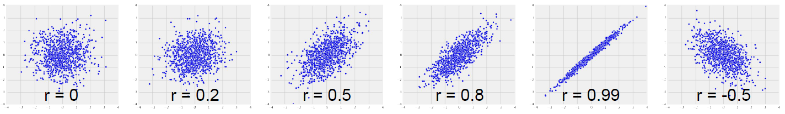

# Section 3: Correlation (Lec 3.1 - Lec 3.3)

+ [Alunching Web Page](https://courses.edx.org/courses/course-v1:BerkeleyX+Data8.3x+2T2018/courseware/7bba8d29a20946e5be64e508fd3481b2/7c8a2a1d0e8241e99bff43c05c23b011/1?activate_block_id=block-v1%3ABerkeleyX%2BData8.3x%2B2T2018%2Btype%40vertical%2Bblock%402d9f38b83b784ebc9cb99d1d459549a7)
+ [Web Notebook](https://hub.data8x.berkeley.edu/user/37b80bfacc52ea5dfdad124579807188/notebooks/materials-x18/lec/x18/3/lec3.ipynb)
+ [Local Notebook](./notebook/lec3.ipynb)
+[Local Python Code](./notebook/lec3.py)

## Lec 3.1 Visualization

### Notes

+ Prediction - To predict the value of a variable,
    + Identify attributes that are associated with that variable and that you can measure
    + Describe the relation between the attributes and the variable you want to predict
    + Use the relation to make your prediction

+ Guessing the Future
    + Based on incomplete information
    + One way of making predictions:
        + To predict an outcome for an individual,
        + find others who are like that individual
        + and whose outcomes you know.
        + Use those outcomes as the basis of your prediction.

+ Two Numerical Variables
    + Trend
        + Positive association
        + Negative association
    + Pattern
        + Any discernible “shape” in the scatter
        + Linear
        + Non-linear

    + __Visualize, then quantify__

+ Demo
    ```python
    galton = Table.read_table('galton.csv')

    heights = Table().with_columns(
        'MidParent', galton.column('midparentHeight'),
        'Child', galton.column('childHeight')
        )
    # MidParent   Child
    # 75.43       73.2
    # 75.43       69.2
    # 75.43       69
    # ...(row omitted)

    heights.scatter('MidParent')            # positive; linear

    hybrid = Table.read_table('hybrid.csv')
    # vehicle           year    msrp    acceleration    mpg     class
    # Prius (1st Gen)   1997    24509.7	7.46            41.26   Compact
    # Tino              2000    35355   8.2             54.1    Compact
    # Prius (2nd Gen)   2000    26832.2 7.97            45.23   Compact
    # ... (rows omitted)

    hybrid.scatter('mpg', 'msrp')           # negative; non-linear
    hybrid.scatter('acceleration', 'msrp')  # positive; non-linear
    suv = hybrid.where('class', 'SUV')
    suv.num_rows                            # 39
    suv.scatter('mpg', 'msrp')              # negative; linear

    def standard_units(x):
        "Convert any array of numbers to standard units."
        return (x - np.average(x)) / np.std(x)

    Table().with_columns(
        'mpg (standard units)',  standard_units(suv.column('mpg')), 
        'msrp (standard units)', standard_units(suv.column('msrp'))
    ).scatter(0, 1)                         # negative; linear
    plots.xlim(-3, 3)
    plots.ylim(-3, 3);
    ```

### Video

<a href="https://edx-video.net/BERD83FD2018-V001000_DTH.mp4" alt="Lec 3.1 Visualization" target="_blank">
   
</a>

## Lec 3.2 Calculation

### Notes

+ Correlation Formula
    <a href="http://www.socialresearchmethods.net/kb/statcorr.php">
        <br/>
    </a>
    <a href="http://whatilearned.wikia.com/wiki/Correlation">
        
    </a>

+ The Correlation Coefficient $r$
    + Measures __linear__ association
    + Based on standard units
    + $-1 ≤ r ≤ 1$
        + $r = 1$: scatter is perfect straight line sloping up
        + $r = -1$: scatter is perfect straight line sloping down
    + $r = 0$: No linear association; _uncorrelated_
    
    <a href="url">
        
    </a>

+ Definition of $r$
    + Correlation Coefficient (r) = average of | product of | x in standard units | and | y in standard unit
    + Measures how clustered the scatter is around a straight line

+ Operations that Leave $r$ Unchanged <br/>
    The correlation coefficient is not effected by:
    + Changing the units of measurement of the data 
        + Because $r$ is based on standard units
    + Which variable is plotted on the horizontal axis and which on the vertical
        + Because the product of standard units is the same wither way

+ Demo
    ```python
    def r_scatter(r):
        plots.figure(figsize=(5,5))
        "Generate a scatter plot with a correlation approximately r"
        x = np.random.normal(0, 1, 1000)
        z = np.random.normal(0, 1, 1000)
        y = r*x + (np.sqrt(1-r**2))*z
        plots.scatter(x, y, color='darkblue', s=20)
        plots.xlim(-4, 4)
        plots.ylim(-4, 4)

    # Draws a scatter diagram of variables that have the specified correlation
    r_scatter(0.6)
    r_scatter(0)

    # ### Calculating $r$ ###
    x = np.arange(1, 7, 1)
    y = make_array(2, 3, 1, 5, 2, 7)
    t = Table().with_columns(
            'x', x,
            'y', y
        )
    # t = (x, y): {(1, 2), (2, 3), (3, 1), (4, 5), (5, 2), (6, 7)}

    t.scatter('x', 'y', s=30, color='red')  # positive; linear with break

    t= t.with_columns(
            'x (standard units)', standard_units(x),
            'y (standard units)', standard_units(y)
        )
    # x   y   x (standard units)    y (standard units)
    # 1   2   -1.46385              -0.648886
    # 2   3   -0.87831              -0.162221
    # 3   1   -0.29277              -1.13555
    # 4   5    0.29277               0.811107
    # 5   2    0.87831              -0.648886
    # 6   7    1.46385               1.78444

    su_product = t.column(2) * t.column(3)
    t = t.with_column('product of standard units', su_product)
    # x   y   x (standard units)  y (standard units)  product of standard units
    # 1   2   -1.46385            -0.648886            0.949871
    # 2   3   -0.87831            -0.162221            0.142481
    # 3   1   -0.29277            -1.13555             0.332455
    # 4   5    0.29277             0.811107            0.237468
    # 5   2    0.87831            -0.648886           -0.569923
    # 6   7    1.46385             1.78444             2.61215

    # r is the average of the products of standard units
    r = np.mean(t.column(4))        # 0.6174163971897709

    def correlation(tbl, x, y):
        """tbl is a table; 
        x and y are column labels"""
        x_in_standard_units = standard_units(tbl.column(x))
        y_in_standard_units = standard_units(tbl.column(y))
        return np.average(x_in_standard_units * y_in_standard_units)  

    correlation(t, 'x', 'y')            # 0.6174163971897709
    correlation(suv, 'mpg', 'msrp')     # -0.6667143635709919

    # switching x and y axis values
    correlation(t, 'x', 'y')            # 0.6174163971897709
    correlation(t, 'y', 'x')            # 0.6174163971897709

    t.scatter('x', 'y', s=30, color='red')
    t.scatter('y', 'x', s=30, color='red')

    correlation(t, 'y', 'x')            # 0.6174163971897709
    ```

### Video

<a href="https://edx-video.net/BERD83FD2018-V001100_DTH.mp4" alt="Lec 3.2 Calculation" target="_blank">
   
</a>

## Lec 3.3 Interpretation

### Notes

+ Causal Conclusions: Be careful ...
    + Correlation measures linear association
    + Association doesn't imply causation
    + Just because two variables are correlated, that doesn't mean one causes the other

+ Non-linearity and Outliers : uncorrelated
    + Both of these can affect correlation
    + Draw a scatter plot before you decide to compute $r$

+ Ecological Correlation
    + Correlations based on groups or aggregated data
    + These can be misleading, e.g., they can be artificially high

+ Demo
    ```python
    # ### Nonlinearity ###
    new_x = np.arange(-4, 4.1, 0.5)
    nonlinear = Table().with_columns(
            'x', new_x,
            'y', new_x**2
        )
    nonlinear.scatter('x', 'y', s=30, color='r')    # Upward probabilstic curve
    correlation(nonlinear, 'x', 'y')        # 0.0 -> uncorrelated, not linear

    # ### Outliers ###
    line = Table().with_columns(
            'x', make_array(1, 2, 3, 4),
            'y', make_array(1, 2, 3, 4)
        )
    line.scatter('x', 'y', s=30, color='r')

    correlation(line, 'x', 'y')             # 1.0

    outlier = Table().with_columns(
            'x', make_array(1, 2, 3, 4, 5),
            'y', make_array(1, 2, 3, 4, 0)
        )
    outlier.scatter('x', 'y', s=30, color='r')

    correlation(outlier, 'x', 'y')          # 0.0 - > outlier

    # ### Ecological Correlation ###
    sat2014 = Table.read_table('sat2014.csv').sort('State')
    # State       Participation   Critical    Math    Writing     Combined
    #             Rate            Reading
    # Alabama     6.7             547         538     532         1617
    # Alaska      54.2            507         503     475         1485
    # Arizona     36.4            522         525     500
    # ... (rows omitted)

    sat2014.scatter('Critical Reading', 'Math')         # only 51 pts that are averages of states

    correlation(sat2014, 'Critical Reading', 'Math')    # 0.9847558411067434
    ```

### Video

<a href="https://edx-video.net/BERD83FD2018-V000900_DTH.mp4" alt="Lec 3.3 Interpretation" target="_blank">
   
</a>

## Reading and Practice

### Reading

This guide assumes that you have watched the videos for Section 3.

This corresponds to textbook section:

[Chapter 15.1: Correlation](https://www.inferentialthinking.com/chapters/14/1/Properties_of_the_Mean)

In section 3, we learned about correlation and linear association. These topics are important in prediction because drawing a line is one of the most common methods of predicting the value of one variable based on the value of another. We'll see more examples of this later in the course.

Test your understanding of correlation and linear association with the following practice problem.

### Practice

Below are six different scatter plots labeled a, b, c, d, e, and f.

6 scatter plots labeled a, b, c, d, e, and f.

<a href="https://courses.edx.org/courses/course-v1:BerkeleyX+Data8.3x+2T2018/courseware/7bba8d29a20946e5be64e508fd3481b2/8b39d790e1f84ef1ab17edb4148a909a/1?activate_block_id=block-v1%3ABerkeleyX%2BData8.3x%2B2T2018%2Btype%40vertical%2Bblock%40f55ac8c6ec9b4dbea5e6791ae2d496ca">
    <br/>
</a>

Order the scatter plots above in terms of least to greatest correlation coefficient.

    Ans: $e < a < c < d < b < f$


