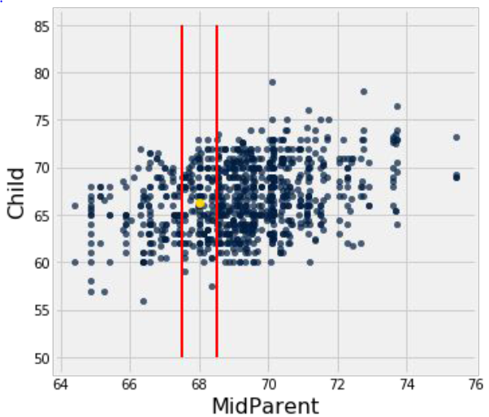
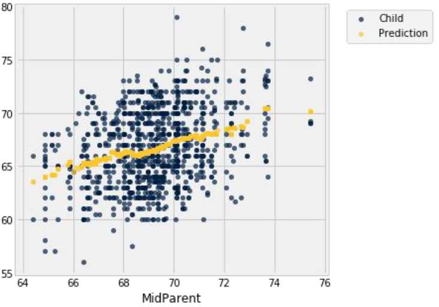
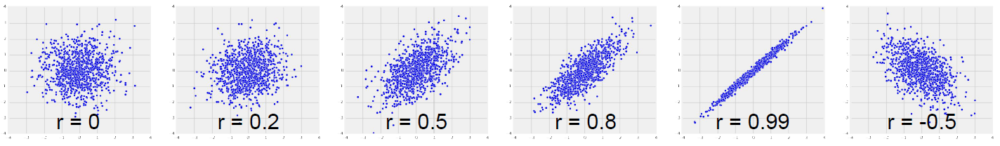

# Section 4: Regression (Lec 4.1 - Lec 4.5)

+ [Launching Web Page](https://courses.edx.org/courses/course-v1:BerkeleyX+Data8.3x+2T2018/courseware/11f472f1d45d411993d1f696435f7d51/b9a43abd58fa47579e95d24fed03db8e/1?activate_block_id=block-v1%3ABerkeleyX%2BData8.3x%2B2T2018%2Btype%40vertical%2Bblock%4096b729c15ebc4778abd9c403bfebdb14)
+ [Web Notebook](https://hub.data8x.berkeley.edu/user/37b80bfacc52ea5dfdad124579807188/notebooks/materials-x18/lec/x18/3/lec4.ipynb)
+ [Local Notebook](./notebook/lec4.ipynb)
+ [Local Python Code](./notebook/lec4.py)

## Lec 4.1 Prediction

### Notes

+ Prediction a Numerical Variable - Approach to predicting an outcome for an individual
    + Find others who are like that individual
    + and whose outcomes you know
    + Use those outcomes as the basis of your prediction.

+ Galon's Data
    + Goal: Predict the height of a new child, based in that child's midparent height.
    <a href="http://genomicsclass.github.io/book/pages/intro_using_regression.html">
        <br/>
    </a>

+ Making a Prediction
    + How to predict a child's height, given a midparent height of 68 inches?
    + __Idea__: Use the average height of the children of all the families in which the midparent height is close to 68 inches.

+ Galton's Heights
    <a href="url">
        <br/>
    </a>
    <a href="url">
        
    </a>

+ Nearest Neighbor Regression
    + A method for prediction:
        + Group each x with a representative x value (rounding)
        + Average the corresponding y values for each group
    + For each representative x value, the corresponding prediction is the average of the y values in the group.
    + Graph these predictions.
    + If the association between x and y is linear, then points in the graph of averages tend to fall on the regression line.

+ Graph of Averages
    + For each value of x, the predicted value of y is the average of the y values of the nearest neighbors.
    + Graph these predictions for all the values of x.  That's the __graph of averages__.
    + If the association between the two variables is linear, then points on the graph of averages tend to fall on or near a straight line.  That's the __regression line__.

+ Demo
    ```python
    galton = Table.read_table('galton.csv')

    heights = Table().with_column(
        'MidParent', galton.column('midparentHeight'),
        'Child', galton.column('childHeight')
        )
    # MidParent     Child
    # 75.43         73.2
    # 75.43         69.2
    # 75.43         69
    # ... (rows omitted)

    heights.scatter('MidParent')

    def predict_child(x):
        chosen = heights.where('MidParent', are.between(x - 0.5, x + 0.5))
        return np.average(chosen.column('Child'))

    predictions = heights.apply(predict_child, 'MidParent')

    heights = heights.with_column(
        'Original Prediction', predictions
    )
    # MidParent  Child   Original Prediction
    # 75.43      73.2    70.1
    # 75.43      69.2    70.1
    # 75.43      69      70.1
    # ... (rows omitted)

    heights.scatter('MidParent')
    ```

### Video

<a href="https://edx-video.net/BERD83FD2018-V001400_DTH.mp4" alt="Lec 4.1 Prediction" target="_blank">
     
</a>

## Lec 4.2 Linear Regression

### Notes


+ Where is the prediction line?
    <a href="url">
        <br/>
    </a>

+ Identifying the Line <br/>
    If the scatter plot is "football shaped" (oval), then we can spot an important feature of the regression line.

+ Regression Estimate - To find the regression estimate of y:
    + Convert the given x to standard units
    + Multiply by r
    + That’s the regression estimate of y, but:
        + It’s in standard units: $\text{estimate of } y_{(su)} = r \times \text{given } x_{(su)}$
        + So covert it back to the original units of y

+ Question
    + The scatter plot of the lengths and wights of adult mountain lions is roughly football shaped.
        + Weights: average 84 inches, SD 8 inches
        + Weights: average 125 pounds, SD 15 pounds
        + Correlation between length and wight: 0.6
    + Q: Find the regression estimate the length of a mountain lion that weights 155 pounds.
    + Ans: 
        + Step 1:  The weight of 155 pounds is $(155 - 125) / 15 = 2$ standard units
        + Step 2: The estimate of length is $0.6 x 2 = 1.2$ standard units
        + Step 3: $1.2$ SDs above average in length is $1.2 x 8 + 84 = 93.6$ inches


+ Demo
    ```python
    r = 0.6
    x_demo = np.random.normal(0, 1, 10000)
    z_demo = np.random.normal(0, 1, 10000)
    y_demo = r*x_demo + np.sqrt(1 - r**2)*z_demo

    def trial_line():
        plots.figure(figsize=(7,7))
        plots.xlim(-4, 4)
        plots.ylim(-4, 4)
        plots.scatter(x_demo, y_demo, s=10)
        #plots.plot([-4, 4], [-4*0.6,4*0.6], color='g', lw=2)
        plots.plot([-4,4],[-4,4], color='r', lw=2)
        #plots.plot([1.5,1.5], [-4,4], color='k', lw=2)
        plots.xlabel('x in standard units')
        plots.ylabel('y in standard units');

    def trial_with_vertical():
        trial_line()
        plots.plot([1.5,1.5], [-4,4], color='k', lw=2)

    def both_with_vertical():
        trial_line()
        plots.plot([1.5,1.5], [-4,4], color='k', lw=2)
        plots.plot([-4, 4], [-4*0.6,4*0.6], color='g', lw=2)

    def regression_line(r):
        x = np.random.normal(0, 1, 10000)
        z = np.random.normal(0, 1, 10000)
        y = r*x + (np.sqrt(1-r**2))*z
        plots.figure(figsize=(7, 7))
        plots.xlim(-4, 4)
        plots.ylim(-4, 4)
        plots.scatter(x, y, s=10)
        plots.plot([-4, 4], [-4*r,4*r], color='g', lw=2)
        if r >= 0:
            plots.plot([-4,4],[-4,4], lw=2, color='r')
        else:
            plots.plot([-4,4], [4,-4], lw=2, color='r')

    trial_line()

    trial_with_vertical()

    both_with_vertical()

    r = 0.7     # try various r values to observe the relationship of two lines
    regression_line(r)
    ```

### Video

<a href="https://edx-video.net/BERD83FD2018-V001500_DTH.mp4" alt="Lec 4.2 Linear Regression" target="_blank">
     
</a>

## Lec 4.3 Regression to the Mean

### Notes

+ Sire Francis Gatlon, 1822-1911 <br/>
    Regression Towards Mediocrity in Hereditary Stature, Journal of Anthropological Institute, 1886, 15:246-63
    <a href="https://en.wikipedia.org/wiki/Francis_Galton">
        <br/>
    </a>

+ Regression to the Mean

    $$\text{estimate of } y_{(su)} = r \times \text{given } x_{(su)}$$

    + The regression estimate of $y$ is closer to the mean than the given value of $x$ is
    + The regression estimate is an average.  _On average_, the values of $y$ at a fixed $x$ are closer to the mean than $x$ is.
    + "Regression to the mean" is a statement about averages.  It is not for all individuals.
    + A statement about $x$ and $$ pairs
        + Measured in standard units
        + Describing the deviation of $x$ from $0$ (the average of x's)
        + And the deviation of $y$ from $0$ (the average of y's)
    + On average, $y$ deviates from $0$ less than $$ deviates from $0$
        + where $y$ is regression line, $r$ is correlation <br/>
        + Not true for all points — a statement about averages

### Video

<a href="https://edx-video.net/BERD83FD2018-V001300_DTH.mp4" alt="Lec 4.3 Regression to the Mean" target="_blank">
     
</a>

## Lec 4.4 Regression Equation

### Notes


+ Regression in Standard Units

    $$\text{estimate of } y_{(su)} = r \times \text{given } x_{(su)}$$

    When the variable are measured in standard units, the regression line passes 
    + through the point $(0, 0)$ 
    + has slope $r$

+ Regression Line
    <a href="url">
        <br/>
    </a>

+ Rewriting the 

    + In standard units, the equation is

        $$\text{estimate of } y_{(su)} = r \times \text{given } x_{(su)}$$
    + Rewrite this using the definition oof standard units.

        $$ \frac{\text{estimate of } y - \text{average of } y}{\text{ SD of }y} =  r \times \frac{\text{the given } x - \text{average of } x}{\text{SD of } x} $$

        where the left-hand equation is the estimated $y$ in standard units and the right-hand equation is the $x$ in standard units

+ Express Lines by Slope and Intercept

    $$\text{estimate of } y = \text{ slope } \times x + \text{ intercept } $$

    $$\text{slope of the regression line } = r \times \frac{\text{ SD of } y}{\text{SD of } x} $$

    $$\text{intercept of the regression line } = \text{average of } y - \text{slope } \times \text{average of } x $$

+ Scatter Plots of Other Shapes
    + We have been able to come up with a good straight line to use for prediction when the scatter diagram is football shaped.
    + The __same equation__ gives the best straight line to use for prediction __no matter what the shape of the scatter diagram__.

+ Demo
    ```python
    def standard_units(x):
        return (x - np.average(x))/np.std(x)

    def correlation(t, x, y):
        x_su = standard_units(t.column(x))
        y_su = standard_units(t.column(y))
        return np.average(x_su * y_su)

    def slope(t, x, y):
        r = correlation(t, x, y)
        return r * np.std(t.column(y))/np.std(t.column(x))

    def intercept(t, x, y):
        a = slope(t, x, y)
        return np.average(t.column(y)) - a*np.average(t.column(x))

    heights
    # MidParent  Child   Original Prediction
    # 75.43      73.2    70.1
    # 75.43      69.2    70.1
    # 75.43      69      70.1
    # ... (rows omitted)

    galton_slope = slope(heights, 'MidParent', 'Child')
    galton_intercept = intercept(heights, 'MidParent', 'Child')
    galton_slope, galton_intercept      # (0.637360896969479, 22.63624054958975)

    heights.take(123)
    # MidParent    Child   Original Prediction
    # 69.48        71.5    66.7588

    galton_slope * 69.48 + galton_intercept
    # 66.92007567102915

    def fitted_values(t, x, y):
        a = slope(t, x, y)
        b = intercept(t, x, y)
        return a * t.column(x) + b

    regression_predictions = fitted_values(heights, 'MidParent', 'Child')

    heights = heights.with_column(
        'Regression Prediction', regression_predictions
    )
    # MidParent     Child   Original Prediction     Regression Prediction
    # 75.43         73.2    70.1                    70.7124
    # 75.43         69.2    70.1                    70.7124
    # ... (rows omitted)

    heights.scatter('MidParent')
    ```
### Video

<a href="https://edx-video.net/BERD83FD2018-V001600_DTH.mp4" alt="Lec 4.4 Regression Equation" target="_blank">
     
</a>

## Lec 4.5 Interpreting the Slope

### Notes

+ Units of Slope
    + Population of adult mountain lions
    + Estimate length based on weight
        + Length: average 84 inches, SD 8 inches
        + Weights: average 125 pounds, SD 15 pounds
        + correlation between length and weight: 0.6
    + Slope of regression line: $0.6 x 8 \text{ inches } / 15 \text{ pounds } = 0.32 \text{ inches per pound}$
    + Units of slope: __unites of y per unit of x__

+ Interpretation
    + Slope = $0.32$ inches per pound
    + The difference between the average lengths of two groups that differ by 1 pound in weight
        + Fix a weight and consider the group of all mountain lions of that weight
        + Now consider all the mountain lions that weight 1 more pound than the first group
        + The heavier group is estimated to be $0.32$ inches longer, on average

### Video

<a href="https://edx-video.net/BERD83FD2018-V001200_DTH.mp4" alt="Lec 4.5 Interpreting the Slope" target="_blank">
     
</a>

## Reading and Practice

### Reading

This guide assumes that you have watched the videos for Section 4.

This corresponds to textbook section:

[Chapter 15.2: The Regression Line](https://www.inferentialthinking.com/chapters/15/2/Regression_Line)

In section 4, we learned about the regression line, the regression equation, and using regression as a means of prediction. In regression, we use the value of one variable (which we will call "x") to predict the value of another (which we will call "y"). To calculate the regression equation, we use correlation, which we learned about last section, to compute the regression line's slope and intercept.

### Practice

The `water` table below contains one row per country with data from 2014. The `OBS_VALUE` column represents the approximate price of a $1.5$ liter bottle of mineral water in that country, and the `mm_precipitation` column represents the average precipitation in that country (in millimeters).

Water Table

| COUNTRY  | OBS_VALUE  | mm_precipitation |
|----------|------------|------------------|
| Albania  | .55  | 1485 |
| Algeria  | .027  | 89 |
| Angola  | 1  | 1010 |
| Argentina  | 1.29667  | 591 |
| Armenia  | 0.5325  | 562 |
| Australia  | 2.07302  | 534 |
| Austria  | 0.72  | 1110 |
| Azerbaijan  | 0.576  | 447 |
| Bangladesh  | 0.374  | 2666 |
| Belarus  | 0.7675  | 618 |
|... (89 rows omitted) | |


The next table below contains calculations along with a scatterplot from the `water` table.

<a href="https://courses.edx.org/courses/course-v1:BerkeleyX+Data8.3x+2T2018/courseware/11f472f1d45d411993d1f696435f7d51/c600807c4b78445eacffee2f0f53339a/1?activate_block_id=block-v1%3ABerkeleyX%2BData8.3x%2B2T2018%2Btype%40vertical%2Bblock%40672c3159d4f84f0abf3184d5537944e8">
    <br/>
</a>
<a href="https://courses.edx.org/courses/course-v1:BerkeleyX+Data8.3x+2T2018/courseware/11f472f1d45d411993d1f696435f7d51/c600807c4b78445eacffee2f0f53339a/1?activate_block_id=block-v1%3ABerkeleyX%2BData8.3x%2B2T2018%2Btype%40vertical%2Bblock%40672c3159d4f84f0abf3184d5537944e8">
    
</a>

What is the value of correlation(water, ‘mm_precipitation’, ‘OBS_VALUE’)?

    Ans: 0.262079
 
What is the slope for the equation of the regression line of the data in the water table for finding the OBS_VALUE y using the mm_precipitation x?

    Ans: 0.000424
 
What is the intercept for the equation of the regression line of the data in the water table for finding the OBS_VALUE y using the mm_precipitation x?

    Ans: x602.444
 
Using the regression line equation, what would we expect the OBS_VALUE to be in 2014 for a country that had an average of 700 mm of precipitation?

    Ans: ??
 
Is this a good equation to use for predicting price from precipitation?

    Ans: No


