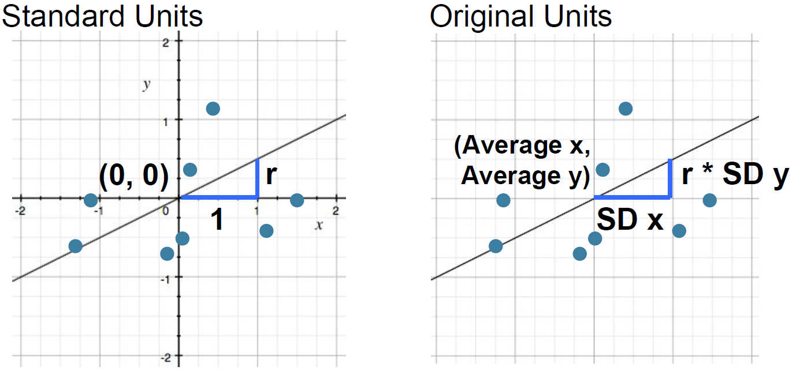

# Section 5: Least Squares (Lec 5.1 - Lec 5.4)

## Lec 5.1 Linear Regression Review

### Note

+ Regression Line
    <a href="https://courses.edx.org/courses/course-v1:BerkeleyX+Data8.3x+2T2018/courseware/11f472f1d45d411993d1f696435f7d51/ec06aa8ad4eb4e30ae9bea5c093e0454/1?activate_block_id=block-v1%3ABerkeleyX%2BData8.3x%2B2T2018%2Btype%40vertical%2Bblock%4083cd119349084de2915411d56e9e3056">
        <br/>
    </a>

+ Regression Line Equation <br/>
    In original units, the regression line has this equation:

    $$\frac{\text{estimate of } y - \text{average of } y}{|text{SD of }y} = r \times \frac{\text{the given } x - \text{average of } x}{\text{SD of } x}$$

    where the left-hand formula is "y in standard units" and the right-hand formula is "x in standard units".

    $$y = \text{slope } \times x + \text{intercept}$$

    $$\text{slope of the regression line} = r \times \frac{\text{SD of} y}{\text{SD of } x}$$

    $$\text{intercept of the regression line} = \text{average of } y - \text{slope } \times \text{average of } x$$


### Video

<a href="https://edx-video.net/BERD83FD2018-V001800_DTH.mp4" alt="Lec 5.1 Linear Regression Review" target="blank">
     
</a>


## Lec 5.2 Discussion Question

### Note

+ Discussion Question
    + A course has a midterm (average $70$; standard deviation $10$) and a really hard final (average $50$; standard deviation $12$)
    + If the scatter diagram comparing midterm & final scores for students has a typical oval shape with correlation $0.75$, then...
    + What do you expect the average final score would be for students who scored $90$ on the midterm?
    + How about $60$ on the midterm?

+ Demo
    ```python
    x_mean = 70
    x_sd = 10
    y_mean = 50
    y_sd = 12
    r = 0.75

    midterm_score = 90
    x = midterm_score
    (((x - x_mean) / x_sd) * r * y_sd) + y_mean     # 68

    midterm_score = 60
    x = midterm_score
    (((x - x_mean) / x_sd) * r * y_sd) + y_mean     # 41

    # y = a * x + b
    a = r * (y_sd / x_sd)
    b = y_mean - a * x_mean

    a * 90 + b                                      # 68
    a * 60 + b                                      # 41
    ```

### Video

<a href="https://edx-video.net/BERD83FD2018-V001700_DTH.mp4" alt="Lec 5.2 Discussion Question" target="blank">
     
</a>


## Lec 5.3 Squared Error

### Note

    <a href="url">
        <br/>
    </a>


+ Demo
    ```python

    ```

### Video

<a href="https://edx-video.net/BERD83FD2018-V001900_DTH.mp4" alt="Lec 5.3 Squared Error" target="_blank">
     
</a>


## Lec 5.4 Least Squares

### Note

    <a href="url">
        <br/>
    </a>


+ Demo
    ```python

    ```

### Video

<a href="https://edx-video.net/BERD83FD2018-V002400_DTH.mp4" alt="Lec 5.4 Least Squares" target="blank">
     
</a>


## Reading and Practice

### Reading


### Practice


