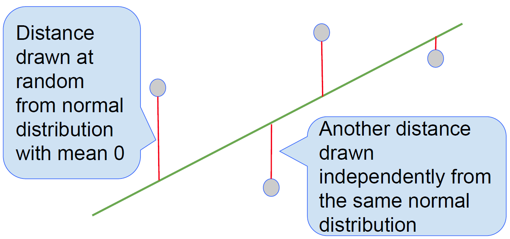

# Section 7: Regression Inference (Lec 7.1 - Lec 7.3)

+ [Launching Web Page](https://courses.edx.org/courses/course-v1:BerkeleyX+Data8.3x+2T2018/courseware/9e3318ad6da44461990e1d4e3a64986f/4f90f7d56ed74420b5b641cdb0fedc65/?child=first)
+ [Web Notebook](https://hub.data8x.berkeley.edu/user/37b80bfacc52ea5dfdad124579807188/notebooks/materials-x18/lec/x18/3/lec7.ipynb#)
+ [Local notebook](./notebook/lec7.ipynb)
+ [Local Python Code](./notebook/lec7.py)

+ Common Functions for Linear Regression
    ```python
    def standard_units(any_numbers):
        """Convert any array of numbers to standard units."""
        return (any_numbers - np.average(any_numbers)) / np.std(any_numbers)

    def correlation(t, x, y):
        """Return the correlation coefficient (r) of two variables."""
        return np.mean(standard_units(t.column(x)) * standard_units(t.column(y)))

    def slope(t, x, y):
        """The slope of the regression line (original units)."""
        r = correlation(t, x, y)
        return r * np.std(t.column(y)) / np.std(t.column(x))

    def intercept(t, x, y):
        """The intercept of the regression line (original units)."""
        return np.mean(t.column(y)) - slope(t, x, y) * np.mean(t.column(x))

    def fit(t, x, y):
        """The fitted values along the regression line."""
        a = slope(t, x, y)
        b = intercept(t, x, y)
        return a * t.column(x) + b

    def plot_residuals(t, x, y):
        """Plot a scatter diagram and residuals."""
        t.scatter(x, y, fit_line=True)
        actual = t.column(y)
        fitted = fit(t, x, y)
        residuals = actual - fitted
        print('r:', correlation(t, x, y))
        print('RMSE:', np.mean(residuals**2)**0.5)
        t.select(x).with_column('Residual', residuals).scatter(0, 1)
    ```

## Lec 7.1 Regression Model

### Note

+ A “Model”: Signal + Noise
    <a href="https://courses.edx.org/courses/course-v1:BerkeleyX+Data8.3x+2T2018/courseware/9e3318ad6da44461990e1d4e3a64986f/4f90f7d56ed74420b5b641cdb0fedc65/?child=first">
        <br/>
    </a>

+ Demo
    ```python
    def draw_and_compare(true_slope, true_int, sample_size):
        x = np.random.normal(50, 5, sample_size)
        xlims = np.array([np.min(x), np.max(x)])
        errors = np.random.normal(0, 6, sample_size)
        y = (true_slope * x + true_int) + errors
        sample = Table().with_columns('x', x, 'y', y)
        
        sample.scatter('x', 'y')
        plots.plot(xlims, true_slope*xlims + true_int, lw=2, color='green')
        plots.title('True Line, and Points Created')
        
        sample.scatter('x', 'y')
        plots.title('What We Get to See')
        
        sample.scatter('x', 'y', fit_line=True)
        plots.title('Regression Line: Estimate of True Line')
        
        sample.scatter('x', 'y', fit_line=True)
        plots.plot(xlims, true_slope*xlims + true_int, lw=2, color='green')
        plots.title('Regression Line and True Line')
        
    draw_and_compare(2, -5, 10)
    draw_and_compare(2, -5, 100)
    draw_and_compare(2, -5, 1000)
    ```

### Video

<a href="https://edx-video.net/BERD83FD2018-V002600_DTH.mp4" alt="Lec 7.1 Regression Model" target="_blank">
     
</a>

## Lec 7.2 Prediction Variability

### Note

+ Regression Prediction
    + If the data come from the regression model,
    + and if the sample is large, then:
    + The regression line is close to the true line
    + Given a new value of $x$, predict $y$ by finding the point on the regression line at that $x$

+ Confidence Interval for Prediction
    + Bootstrap the scatter plot
    + Get a prediction for $y$ using the regression line that goes through the resampled plot
    + Repeat the two steps above many times
    + Draw the empirical histogram of all the predictions.
    + Get the “middle 95%” interval.
    + That’s an approximate 95% confidence interval for the height of the true line at $y$.

+ Demo
    ```python
    baby = Table.read_table('baby.csv')
    # Birth   Gestational Maternal    Maternal    Maternal            Maternal
    # Weight  Days        Age         Height      Pregnancy Weight    Smoker
    # 120     284         27          62          100                 False
    # 113     282         33          64          135                 False
    # 128     279         28          64          115                 True
    # ... (rows omitted)

    plot_residuals(baby, 'Gestational Days', 'Birth Weight')
    # r: 0.4075427933888511
    # RMSE: 16.730358256655432

    x = 300
    a = slope(baby, 'Gestational Days', 'Birth Weight')
    b = intercept(baby, 'Gestational Days', 'Birth Weight')
    predicted_y = a * x + b
    baby.scatter('Gestational Days', 'Birth Weight', fit_line=True)
    plots.scatter(300, predicted_y, color='gold', s=200);

    predicted_y     # 129.2129241703143

    def prediction_at(t, x):
        a = slope(t, 'Gestational Days', 'Birth Weight')
        b = intercept(t, 'Gestational Days', 'Birth Weight')
        return a * x + b

    for i in np.arange(4):
        resample = baby.sample()
        predicted_y = prediction_at(resample, 300)
        resample.scatter('Gestational Days', 'Birth Weight', fit_line=True)
        plots.scatter(300, predicted_y, color='gold', s=200)

    # draw 10 different regression lines
    lines = Table(['slope', 'intercept', 'at 150', 'at 300', 'at 350'])

    for i in range(10):
        resample = baby.sample()
        a = slope(resample, 'Gestational Days', 'Birth Weight')
        b = intercept(resample, 'Gestational Days', 'Birth Weight')
        lines.append([a, b, a * 150 + b, a * 300 + b, a * 350 + b])
        
    baby.scatter('Gestational Days', 'Birth Weight')
    for i in np.arange(lines.num_rows):
        line = lines.row(i)
        plots.plot([150, 350], [line.item('at 150'), line.item('at 350')], lw=1)
        plots.scatter(300, line.item('at 300'), s=200)

    # zoom in @ x=300 around
    lines = Table(['slope', 'intercept', 'at 291', 'at 300', 'at 309'])

    for i in range(10):
        resample = baby.sample()
        a = slope(resample, 'Gestational Days', 'Birth Weight')
        b = intercept(resample, 'Gestational Days', 'Birth Weight')
        lines.append([a, b, a * 291 + b, a * 300 + b, a * 309 + b])
        
    for i in np.arange(lines.num_rows):
        line = lines.row(i)
        plots.plot([291, 309], [line.item('at 291'), line.item('at 309')], lw=1)
        plots.scatter(300, line.item('at 300'), s=30)

    def bootstrap_prediction(table, x, y, new_x, repetitions=5000):
        # Bootstrap resampling
        predictions = []
        for i in np.arange(repetitions):
            resample = table.sample()
            a = slope(resample, x, y)
            b = intercept(resample, x, y)
            predicted_y = a * new_x + b
            predictions.append(predicted_y)

        # Find the ends of the approximate 95% prediction interval
        left = percentile(2.5, predictions)
        right = percentile(97.5, predictions)

        # Display results
        Table().with_column('Prediction', predictions).hist(bins=20)
        plots.xlabel('predictions at x='+str(new_x))
        plots.plot([left, right], [0, 0], color='yellow', lw=8);
        print('Approximate 95%-confidence interval for height of true line:')
        print(left, right, '(width =', right - left, ')')

    # CI @ 280 narrower than CI @ 300 & 330
    bootstrap_prediction(baby, 'Gestational Days', 'Birth Weight', 300)
    # Approximate 95%-confidence interval for height of true line: 127.31138623489576 131.34398739036294 (width = 4.032601155467177 )

    bootstrap_prediction(baby, 'Gestational Days', 'Birth Weight', 330)
    # Approximate 95%-confidence interval for height of true line: 138.7471293196391 147.7679833940758 (width = 9.020854074436699 )

    bootstrap_prediction(baby, 'Gestational Days', 'Birth Weight', 280)
    # Approximate 95%-confidence interval for height of true line: 118.94357663343759 120.83354105018853 (width = 1.8899644167509422 )
    ```

### Video

<a href="https://edx-video.net/BERD83FD2018-V002700_DTH.mp4" alt="Lec 7.2 Prediction Variability" target="_blank">
     
</a>

## Lec 7.3 The True Slope

### Note


+ Demo
    ```python

    ```

### Video

<a href="https://edx-video.net/BERD83FD2018-V002500_DTH.mp4" alt="Lec 7.3 The True Slope" target="_blank">
     
</a>

## Reading and Practice

### Reading


### Practice


