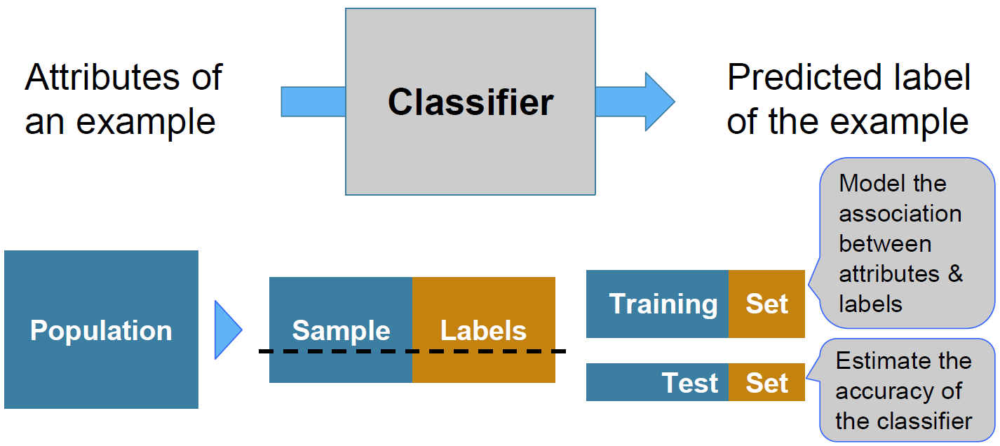
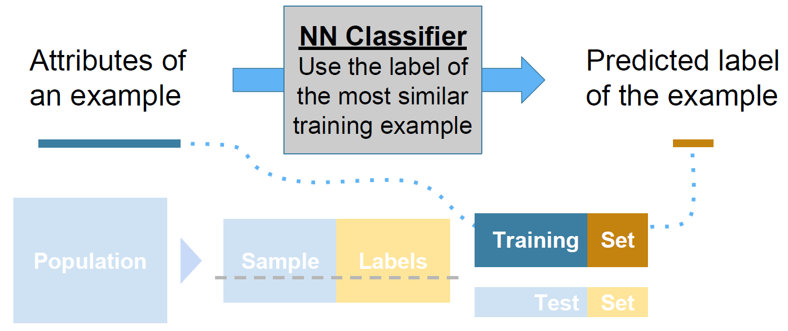

# Section 9: Classifiers (Lec 9.1 - Lec 9.6)

+ [Launching Wbe page](https://courses.edx.org/courses/course-v1:BerkeleyX+Data8.3x+2T2018/courseware/03a357f8203f4dfa8aa471e06b75affe/474dec3c53d64133aa87a260efa7347f/1?activate_block_id=block-v1%3ABerkeleyX%2BData8.3x%2B2T2018%2Btype%40vertical%2Bblock%401caeb79118e34ca39fe5447986857d4a)
+ [Web notebook](https://hub.data8x.berkeley.edu/user/37b80bfacc52ea5dfdad124579807188/notebooks/materials-x18/lec/x18/3/lec9.ipynb)
+ [Local Notebook](./notebooks/lec9.ipynb)
+ [Local Python Code](./notebooks/lec09.py)

## Lec 9.1 Terminology

### Note

+ Training a Classifier
    <a href="https://courses.edx.org/courses/course-v1:BerkeleyX+Data8.3x+2T2018/courseware/03a357f8203f4dfa8aa471e06b75affe/474dec3c53d64133aa87a260efa7347f/1?activate_block_id=block-v1%3ABerkeleyX%2BData8.3x%2B2T2018%2Btype%40vertical%2Bblock%401caeb79118e34ca39fe5447986857d4a">
        <br/>
    </a>
    + Classifier: a method predicting something about that example, the class of the example, or the label of the example
    + Usually class = label
    + Attributes: characteristics of the example
    + Classification rule depends on what patterns or associations might be found in that population
    + Training set to form classification rule while test set to evaluate the accuracy of the classifier


+ Nearest Neighbor Classifier
    <a href="https://courses.edx.org/courses/course-v1:BerkeleyX+Data8.3x+2T2018/courseware/03a357f8203f4dfa8aa471e06b75affe/474dec3c53d64133aa87a260efa7347f/1?activate_block_id=block-v1%3ABerkeleyX%2BData8.3x%2B2T2018%2Btype%40vertical%2Bblock%401caeb79118e34ca39fe5447986857d4a">
        <br/>
    </a>


### Video

<a href="https://edx-video.net/BERD83FD2018-V003100_DTH.mp4" alt="Lec 9.1 Terminology" target="_blank">
     
</a>


## Lec 9.2 Dataset

### Note

+ The Google Science Fair
  + Brittany Wenger, a 17-year-old high school student in 2012
  + Won by building a breast cancer classifier with 99% accuracy

+ Demo
    ```python
    patients = Table.read_table('breast-cancer.csv').drop('ID')
    # Clump     Uniformity of  Uniformity of  Marginal  Single Epithelial  Bare    Bland      Normal    Mitoses  Class
    # Thickness Cell Size      Cell Shape     Adhesion  Cell Size          Nuclei  Chromatin  Nucleoli
    # 5         1              1              1         2                  1       3          1         1         0
    # 5         4              4              5         7                  10      3          2         1         0
    # ... (rows omitted)

    patients.scatter('Bland Chromatin', 'Single Epithelial Cell Size', colors='Class')

    def randomize_column(a):
        return a + np.random.normal(0.0, 0.09, size=len(a))

    # adding random noise to visualize the overlaps on the same spot
    jittered = Table().with_columns([
            'Bland Chromatin (jittered)', 
            randomize_column(patients.column('Bland Chromatin')),
            'Single Epithelial Cell Size (jittered)', 
            randomize_column(patients.column('Single Epithelial Cell Size')),
            'Class',
            patients.column('Class')
        ])

    jittered.scatter('Bland Chromatin (jittered)', 'Single Epithelial Cell Size (jittered)', colors='Class')
    ```

### Video

<a href="https://edx-video.net/BERD83FD2018-V003200_DTH.mp4" alt="Lec 9.2 Dataset" target="_blank">
     
</a>


## Lec 9.3 Distance

### Note

+ Rows of Tables <br/>
  Each row contains all the data for one individual
  + `t.row(i)` evaluates to $ith$ row of table `t`
  + `t.row(i).item(j)` is the value of column `j` in row `i`
  + If all values are numbers, then `np.array(t.row(i))` evaluates to an array of all the numbers in the row.
  + To consider each row individually, use
    ```python
    for row in t.rows:
        ... row.item(j) ...
    ```

+ Distance Between Two Points
  + Two attributes x and y:

    $$D = \sqrt{(x_0 - x_1)^2 + (y_0 - y_1^2)} $$

  + Three attributes x, y, and z:

    $$ D = \sqrt{(x_0 - x_1)^2 + (y_0 - y_1^2) + (z_0 - z_1)^2} $$
  + and so on ...

+ Demo
    ```python
    Table().with_columns(['X', [0, 2, 3], 'Y', [0, 2, 4]]).scatter('X', 'Y')

    def distance(pt1, pt2):
        """Return the distance between two points (represented as arrays)"""
        return np.sqrt(sum((pt1 - pt2) ** 2))

    def row_distance(row1, row2):
        """Return the distance between two numerical rows of a table"""
        return distance(np.array(row1), np.array(row2))

    attributes = patients.drop('Class')

    row_distance(attributes.row(0), attributes.row(1))      # 11.874342087037917
    row_distance(attributes.row(0), attributes.row(2))      # 2.23606797749979
    row_distance(attributes.row(0), attributes.row(0))      # 0.0
    ```

### Video

<a href="https://edx-video.net/BERD83FD2018-V003300_DTH.mp4" alt="Lec 9.3 Distance" target="_blank">
     
</a>


## Lec 9.4 Nearest Neighbors

### Note

+ Demo
    ```python

    ```

### Video

<a href="https://edx-video.net/BERD83FD2018-V003400_DTH.mp4" alt="Lec 9.4 Nearest Neighbors" target="_blank">
     
</a>


## Lec 9.5 Evaluation

### Note

+ Demo
    ```python

    ```

### Video

<a href="https://edx-video.net/BERD83FD2018-V003600_DTH.mp4" alt="Lec 9.5 Evaluation" target="_blank">
     
</a>


## Lec 9.6 Decision Boundaries

### Note

+ Demo
    ```python

    ```

### Video

<a href="https://edx-video.net/BERD83FD2018-V003500_DTH.mp4" alt="Lec 9.6 Decision Boundaries" target="_blank">
     
</a>


## Reading and Practice

### Reading


### Practice


