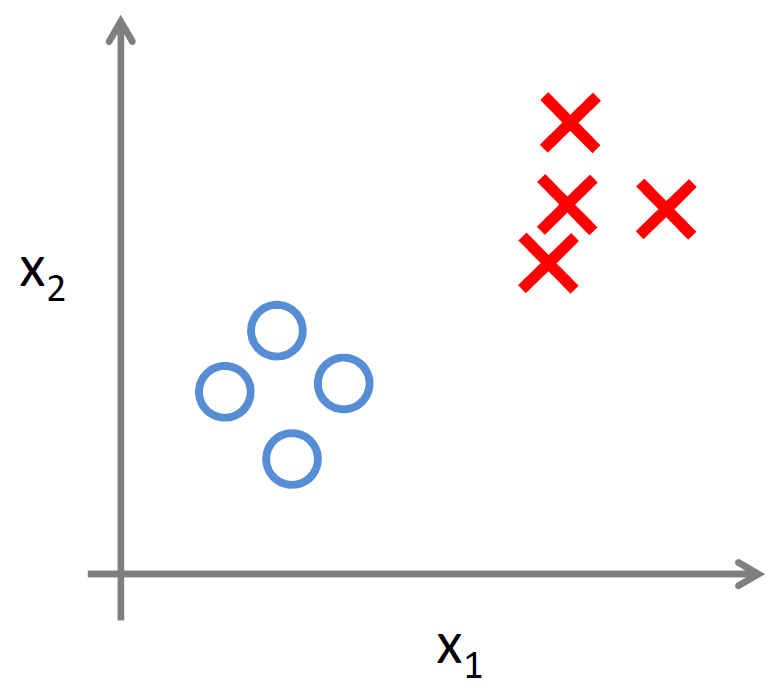
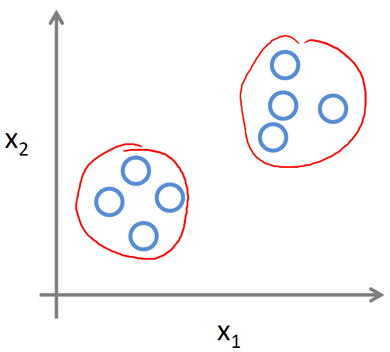

# Introduction

<!--
(setq markdown-css-paths '("https://cdn.jsdelivr.net/npm/katex@0.10.1/dist/katex.css"))
-->

## Welcome

### Lecture Notes

+ Machine Learning
    + Grew out of work in AI
    + New capability for computers
+ Examples:
    + Database mining
        + Large datasets from growth of automation/web.
        + E.g., Web click data, medical records, biology, engineering
    + Applications can’t program by hand.
        + E.g., Autonomous helicopter, handwriting recognition, most of Natural Language Processing (NLP), Computer Vision.
    + Self-customizing programs
        + E.g., Amazon, Netflix product recommendations
    + Understanding human learning (brain, real AI).

### Lecture Video

<video src="https://d3c33hcgiwev3.cloudfront.net/01.1-V3-Introduction-Welcome.49abef20b22b11e49c064db6ead92550/full/360p/index.mp4?Expires=1558742400&Signature=MTMGzDPbkaybR0jDAuF8YetxDlZTErI8x1WwOcae4L65hbwVXeu9q7pD1q-gbkSSmh~SEnhD9kmF59sAN4l-w0a7Q1nEGZ6GzqUF2fECaDCXchJn2PLyQyPaacgIuWnfuKhn4ZkfF84ZAoAWzbWjIMfyLLyF4sgsTZHn-0-Ozxs_&Key-Pair-Id=APKAJLTNE6QMUY6HBC5A" preload="none" loop="loop" controls="controls" style="margin-left: 2em;" muted="" poster="http://www.multipelife.com/wp-content/uploads/2016/08/video-converter-software.png" width="180" alt="Welcome">
  <track src="https://www.coursera.org/api/subtitleAssetProxy.v1/OajtTUNVSJqo7U1DVcia_w?expiry=1551916800000&hmac=doYGysJbj4AzkrX31UeeSwa4OvGFWxEVtaXucb3cu30&fileExtension=vtt" kind="captions" srclang="en" label="English" default>
  Your browser does not support the HTML5 video element.
</video><br/>


## What is Machine Learning?

### Lecture Notes

+ Machine Learning definition
    + Arthur Samuel (1959). Machine Learning: Field of study that gives computers the ability to learn without being explicitly programmed.
    + Tom Mitchell (1998) Well-posed Learning Problem: A computer program is said to learn from experience <span style="font-color: red; font-weight: bolder"> E </span> with respect to some task <strong> T </strong> and some performance measure <strong> P </strong>, if its performance on T, as measured by P, improves with experience E.

+ Example: playing checkers.
    + E = the experience of playing many games of checkers
    + T = the task of playing checkers.
    + P = the probability that the program will win the next game.

Supervised learning and Unsupervised learning.

+ IVQ: Suppose your email program watches which emails you do or do not mark as spam, and based on that learns how to better filter spam. What is the task T in this setting?

    a. Classifying emails as spam or not spam. <br/>
    b. Watching you label emails as spam or not spam. <br/>
    c. The number (or fraction) of emails correctly classified as spam/not spam. <br/>
    d. None of the above—this is not a machine learning problem.

    Ans: a <br/>
    Explanation: “A computer program is said to learn from experience E with respect to some task T and some performance measure P, if its performance on T, as measured by P, improves with experience E.” <br/>
    a. classifying emails -> T; b. label emails -> E; c. correctly classified -> P

+ Algorithm classification
    + Machine learning algorithms:
        + Supervised learning
        + Unsupervised learning
    + Others: Reinforcement learning, recommender systems.


### Lecture Video

<video src="https://d3c33hcgiwev3.cloudfront.net/IRPs0hQ3EeelIwrMcHgCog.processed/full/360p/index.mp4?Expires=1551916800&Signature=BFHUgjno0G0OyRStcxYdXmab5HFjIJGczhyBeowgH0JSdfiJgR9sWXyxVWbdd15hZVRlLXzCTpKacaTSJd~fjTl60y-2Ao3ZpTqXtE7v~ERI5zFqTxgSkni7KRT80Z2pNjYBQBCjnnsYwRFniy-0NaqNh5-5xMsmfOrsKZA0dA4_&Key-Pair-Id=APKAJLTNE6QMUY6HBC5A" preload="none" loop="loop" controls="controls" style="margin-left: 2em;" muted="" poster="http://www.multipelife.com/wp-content/uploads/2016/08/video-converter-software.png" width="180">
  <track src="https://www.coursera.org/api/subtitleAssetProxy.v1/Nwmp7RSHEee9zwpiIySM9A?expiry=1551916800000&hmac=w_zH9VmrykQfpuJ5e0r9vgADjKWUi43r3al-Hnbx-lk&fileExtension=vtt" kind="captions" srclang="en" label="English" default>
  Your browser does not support the HTML5 video element.
</video> <br/>


## Supervised Learning

### Lecture Notes

+ Example: Housing price prediction

  <div style="display:flex;justify-content:center;align-items:center;flex-flow:row wrap;">
    <div><a href="https://www.coursera.org/learn/machine-learning/lecture/1VkCb/supervised-learning">
      
    </a></div>
  </div>
  
  + Supervised Learning: “right answers” given
  + Regression: Predict continuous valued output (price)

+ Example: Breast cancer (malignant, benign)

  <div style="display:flex;justify-content:center;align-items:center;flex-flow:row wrap;">
    <div><a href="https://www.coursera.org/learn/machine-learning/lecture/1VkCb/supervised-learning">
      
      
    </a></div>
  </div>

  + Classification: Discrete valued output (0 or 1)
+ Other features:
    + Clump Thickness
    + Uniformity of Cell Size
    + Uniformity of Cell Shape
    + ... 

+ IVQ: You’re running a company, and you want to develop learning algorithms to address each of two problems. 

    Problem 1:You have a large inventory of identical items. You want to predict how many of these items will sell over the next 3 months.

    Problem 2: You’d like software to examine individual customer accounts, and for each account decide if it has been hacked/compromised. Should you treat these as classification or as regression problems?

    a. Treat both as classification problems.<br/>
    b. Treat problem 1 as a classification problem, problem 2 as a regression problem.<br/>
    c. Treat problem 1 as a regression problem, problem 2 as a classification problem.<br/>
    d. Treat both as regression problems.

    Ans: c <br/>
    Problem 1: predict  <br/>
    Problem  2: 0 - not hacked, 1 - hacked -> classification <br/>

<br/>

In supervised learning, we are given a data set and already know what our correct output should look like, having the idea that there is a relationship between the input and the output.

Supervised learning problems are categorized into "regression" and "classification" problems. In a regression problem, we are trying to predict results within a continuous output, meaning that we are trying to map input variables to some continuous function. In a classification problem, we are instead trying to predict results in a discrete output. In other words, we are trying to map input variables into discrete categories.

Example 1:

  Given data about the size of houses on the real estate market, try to predict their price. Price as a function of size is a continuous output, so this is a regression problem.

  We could turn this example into a classification problem by instead making our output about whether the house "sells for more or less than the asking price." Here we are classifying the houses based on price into two discrete categories.

Example 2:

  a) Regression - Given a picture of a person, we have to predict their age on the basis of the given picture

  b) Classification - Given a patient with a tumor, we have to predict whether the tumor is malignant or benign.


### Lecture Video

<video src="https://d3c33hcgiwev3.cloudfront.net/01.3-V2-Introduction-SupervisedLearning.d4483f80b22b11e4aca907c8d9623f2b/full/360p/index.mp4?Expires=1551916800&Signature=W6rFP3cUULdys2keNOnJqqySSQsa5HWdrzVha~I-pveoXZMzgtrGHvm~yhcJkvsnQZzSHykBS519t66~8izBPitvIqg9Mq9ubV2XPlMwPRHKB6O7lwfykHnHcFdBrZSNImDL1KqPB44aYK8wU8twDSqOFiPAzoSmxY1lXYPg9Oc_&Key-Pair-Id=APKAJLTNE6QMUY6HBC5A" preload="none" loop="loop" controls="controls" style="margin-left: 2em;" muted="" poster="http://www.multipelife.com/wp-content/uploads/2016/08/video-converter-software.png" width="180">
  <track src="https://www.coursera.org/api/subtitleAssetProxy.v1/qOhuT5u6Sv2obk-bugr9Gw?expiry=1551916800000&hmac=cmHqG5w5IPF_t6_VVECgK36Sc0BJlUnsyD4SOyuWR6o&fileExtension=vtt" kind="captions" srclang="en" label="English" default>
  Your browser does not support the HTML5 video element.
</video>


## Unsupervised Learning

### Lecture Notes

+ Supervised Learning vs Unsupervised Learning

  <div style="display:flex;justify-content:center;align-items:center;flex-flow:row wrap;">
    <div><a href="https://www.coursera.org/learn/machine-learning/lecture/olRZo/unsupervised-learning">
      
      
    </a></div>
  </div>

  + Supervised: two set of data with labeled values
  + Unsupervised: data not distinguished prior but mapping into two clusters

+ Examples of Unsupervised learning
    + Googl search: clustering similar news from different sources
    + DNA microarry data: cluster into different types of people
    + Organize computing clusters
    + Social network analysis
    + Market segmentation
    + Astronomical data analysis - how galaxies formed

+ Cocktail party problem
    + 2 speakers & 2 microphones
    + both microphones record both speakers
    + Problem: separate sources
    + Algorithm: 
        ```octave
        [W,s,v] = svd((repmat(sum(x.*x,1),size(x,1),1).*x)*x');
        ```

+ IVQ: Of the following examples, which would you address using an unsupervised learning algorithm? (Check all that apply.)

    a. Given email labeled as spam/not spam, learn a spam filter. <br/>
    b. Given a set of news articles found on the web, group them into sets of articles about the same stories.<br/>
    c. Given a database of customer data, automatically discover market segments and group customers into different market segments.<br/>
    d. Given a dataset of patients diagnosed as either having diabetes or not, learn to classify new patients as having diabetes or not.

    Ans: bc

<br/>

Unsupervised learning allows us to approach problems with little or no idea what our results should look like. We can derive structure from data where we don't necessarily know the effect of the variables.

We can derive this structure by clustering the data based on relationships among the variables in the data.

With unsupervised learning there is no feedback based on the prediction results.

Example:

+ Clustering: Take a collection of 1,000,000 different genes, and find a way to automatically group these genes into groups that are somehow similar or related by different variables, such as lifespan, location, roles, and so on.
+ Non-clustering: The "Cocktail Party Algorithm", allows you to find structure in a chaotic environment. (i.e. identifying individual voices and music from a mesh of sounds at a [cocktail party](https://en.wikipedia.org/wiki/Cocktail_party_effect)).


### Lecture Video

<video src="https://d3c33hcgiwev3.cloudfront.net/01.4-V2-Introduction-UnsupervisedLearning-FairUse.8f251df0b23611e4af4203f82f647410/full/360p/index.mp4?Expires=1552003200&Signature=OAhO8~SrI4iFkMpszlrmNf8AfABwCGRQkGkG2FVvR4u39iyXGkNJldf0rCjTAQhmOenOZXj88ULpAjz~jNuCzuowui1Q6nUTbY1fDY7Rr2kodb4azA6lLazpcKTjCTS9sm4S8Q5q2jvzQ~-X61XHppIkRpBPszU7SQ0oUlm7uK4_&Key-Pair-Id=APKAJLTNE6QMUY6HBC5A" preload="none" loop="loop" controls="controls" muted="" poster="http://www.multipelife.com/wp-content/uploads/2016/08/video-converter-software.png" width="180" style="margin-left: 2em;">
  <track src="https://www.coursera.org/api/subtitleAssetProxy.v1/bGb5mMjxEeaNVw6jIXujBA?expiry=1552003200000&hmac=-T31HJAvMP9gdys9Uggad1Z7-KUfAtcxLRElOKgPoyI&fileExtension=vtt" kind="captions" srclang="en" label="English" default>
  Your browser does not support the HTML5 video element.
</video>


## Review

### [Lecture Slides](https://www.coursera.org/learn/machine-learning/resources/JXWWS)

#### What is Machine Learning?

Two definitions of Machine Learning are offered. Arthur Samuel described it as: "the field of study that gives computers the ability to learn without being explicitly programmed." This is an older, informal definition.

Tom Mitchell provides a more modern definition: "A computer program is said to learn from experience E with respect to some class of tasks T and performance measure P, if its performance at tasks in T, as measured by P, improves with experience E."

Example: playing checkers.

+ E = the experience of playing many games of checkers
+ T = the task of playing checkers.
+ P = the probability that the program will win the next game.

In general, any machine learning problem can be assigned to one of two broad classifications:

+ supervised learning, OR
+ unsupervised learning.


#### Supervised Learning

In supervised learning, we are given a data set and already know what our correct output should look like, having the idea that there is a relationship between the input and the output.

Supervised learning problems are categorized into "regression" and "classification" problems. In a regression problem, we are trying to predict results within a continuous output, meaning that we are trying to map input variables to some continuous function. In a classification problem, we are instead trying to predict results in a discrete output. In other words, we are trying to map input variables into discrete categories. Here is a description on Math is Fun on Continuous and Discrete Data.


__Example 1:__

Given data about the size of houses on the real estate market, try to predict their price. Price as a function of size is a continuous output, so this is a regression problem.

We could turn this example into a classification problem by instead making our output about whether the house "sells for more or less than the asking price." Here we are classifying the houses based on price into two discrete categories.


__Example 2:__

(a) Regression - Given a picture of Male/Female, We have to predict his/her age on the basis of given picture.

(b) Classification - Given a picture of Male/Female, We have to predict Whether He/She is of High school, College, Graduate age. Another Example for Classification - Banks have to decide whether or not to give a loan to someone on the basis of his credit history.


#### Unsupervised Learning

Unsupervised learning, on the other hand, allows us to approach problems with little or no idea what our results should look like. We can derive structure from data where we don't necessarily know the effect of the variables.

We can derive this structure by clustering the data based on relationships among the variables in the data.

With unsupervised learning there is no feedback based on the prediction results, i.e., there is no teacher to correct you.

Example:

Clustering: Take a collection of 1000 essays written on the US Economy, and find a way to automatically group these essays into a small number that are somehow similar or related by different variables, such as word frequency, sentence length, page count, and so on.

Non-clustering: The "Cocktail Party Algorithm", which can find structure in messy data (such as the identification of individual voices and music from a mesh of sounds at a [cocktail party](https://en.wikipedia.org/wiki/Cocktail_party_effect)). Here is an [answer](https://www.quora.com/What-is-the-difference-between-supervised-and-unsupervised-learning-algorithms) on Quora to enhance your understanding.


### Errata

+ Supervised Learning: 1:25: Describing the curve as quadratic is confusing since the independent variable is price, but the plot's X-axis represents area.
+ Unsupervised Learning: 6:56 - the mouse does not point to the correct audio sample being played on the slide. Each subsequent audio sample has the mouse pointing to the previous sample.
+ Unsupervised Learning: 12:50 - the slide shows first option "Given email labelled as span/not spam, learn a spam filter" as one of the answers as well. Whereas, in the audio Professor puts it in Supervised Learning category.


## Quiz: Introduction

1. A computer program is said to learn from experience E with respect to some task T and some performance measure P if its performance on T, as measured by P, improves with experience E. Suppose we feed a learning algorithm a lot of historical weather data, and have it learn to predict weather. In this setting, what is T?

    a. The probability of it correctly predicting a future date's weather. <br/>
    b. None of these. <br/>
    c. The process of the algorithm examining a large amount of historical weather data. <br/>
    d. The weather prediction task.

    Ans: d


2. Suppose you are working on weather prediction, and you would like to predict whether or not it will be raining at 5pm tomorrow. You want to use a learning algorithm for this. Would you treat this as a classification or a regression problem?

    a. Classification <br/>
    b. Regression

    Ans: a


3. Suppose you are working on stock market prediction, and you would like to predict the price of a particular stock tomorrow (measured in dollars). You want to use a learning algorithm for this. Would you treat this as a classification or a regression problem?

    a. Regression <br/>
    b. Classification

    Ans: a


4. Some of the problems below are best addressed using a supervised learning algorithm, and the others with an unsupervised learning algorithm. Which of the following would you apply supervised learning to? (Select all that apply.) In each case, assume some appropriate dataset is available for your algorithm to learn from.

    a. Examine a large collection of emails that are known to be spam email, to discover if there are sub-types of spam mail. <br/>
    b. Given historical data of children's ages and heights, predict children's height as a function of their age. <br/>
    c. Take a collection of 1000 essays written on the US Economy, and find a way to automatically group these essays into a small number of groups of essays that are somehow "similar" or "related". <br/>
    d. Given 50 articles written by male authors, and 50 articles written by female authors, learn to predict the gender of a new manuscript's author (when the identity of this author is unknown).

    Ans: bd


5. Which of these is a reasonable definition of machine learning?

    a. Machine learning is the field of study that gives computers the ability to learn without being explicitly programmed. <br/>
    b. Machine learning learns from labeled data. <br/>
    c. Machine learning is the science of programming computers. <br/>
    d. Machine learning is the field of allowing robots to act intelligently.

    Ans: a


