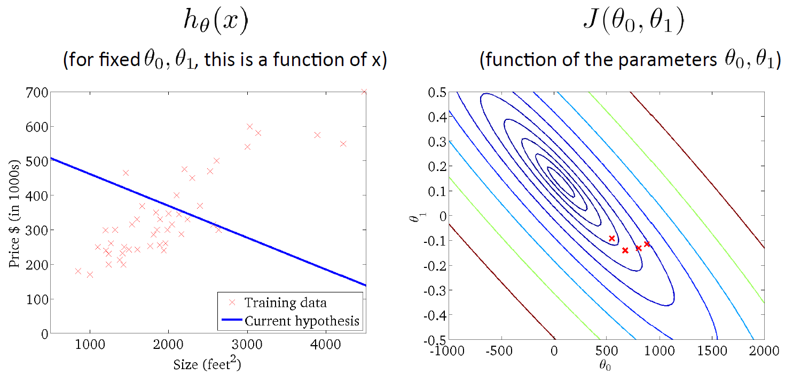

# Model and Cost Function

## Model Representation

### Lecture Notes

+ Housing Prices (Portland, OR)
  <a href="https://d3c33hcgiwev3.cloudfront.net/_ec21cea314b2ac7d9e627706501b5baa_Lecture2.pdf?Expires=1552003200&Signature=TGQs5L1O0PHw2SBFtYJ4q5n3rNLp0mWpKigVJHX~vOlMdHSuPvqHnyuQGUSCPtonZ-IFHiq3F~SWhBMrwxbzerZQlLdy9-SGe5UBrMDE0rOLj-mj5VO3QchKzHbRLnmyxGu-C65y2r-CV8wmRqvN5JpKOKeqGzpWT0mV8InqUoQ_&Key-Pair-Id=APKAJLTNE6QMUY6HBC5A">  
    
  </a>
  + Supervised Learning: Given the "right answer" for each example in the data
  + Regression Problem: Predict real-valued output
  + cf: Classification - discrete-valued output
  + Training set of housing prices (Portland, OR)

| Size in feet$^2$ (x) | Price (\$) in 1000's (y) |
|----------------------|--------------------------|
| 2104 | 460 |
| 1416 | 232 |
| 1534 | 315 |
| 852 | 178 |
| ... | ... |

  + Notation: 
      + $m$: Number of training examples
      + $x$: "input" variables / features
      + $y$: "output" variable / "target" feature
  + $(x, y)$: one training example
  + $(x^{(i)}, y^{(i)})$: ith training example, e.g., $x^{(1)} = 2104$, $y^{(1)} = 460$, $x^{(2)} = 1416$, $y^{(1)} = 232$
  + IVQ: Consider the training set shown below. $(x^{(i)}, y^{(i)})$ is the $i^{th}$ training example. What is $y^{(3)}$?

    Ans: 315

+ Modeling

  

    
<a href="https://d3c33hcgiwev3.cloudfront.net/_ec21cea314b2ac7d9e627706501b5baa_Lecture2.pdf?Expires=1552003200&Signature=TGQs5L1O0PHw2SBFtYJ4q5n3rNLp0mWpKigVJHX~vOlMdHSuPvqHnyuQGUSCPtonZ-IFHiq3F~SWhBMrwxbzerZQlLdy9-SGe5UBrMDE0rOLj-mj5VO3QchKzHbRLnmyxGu-C65y2r-CV8wmRqvN5JpKOKeqGzpWT0mV8InqUoQ_&Key-Pair-Id=APKAJLTNE6QMUY6HBC5A">
      
      theta(x) equals theta<u>0</u></u> plus theta<u>1 of x. And as a shorthand, sometimes instead of writing, you</u> know, h subscript theta of x, sometimes there's a shorthand, I'll just write as a h of x. But more often I'll write it as a subscript theta over there. And plotting this in the pictures, all this means is that, we are going to predict that y is a linear function of x. Right, so that's the data set and what this function is doing, is predicting that y is some straight line function of x. That's h of x equals theta 0 plus theta 1 x, okay? And why a linear function? Well, sometimes we'll want to fit more complicated, perhaps non-linear functions as well. But since this linear case is the simple building block, we will start with this example first of fitting linear functions, and we will build on this to eventually have more complex models, and more complex learning algorithms. Let me also give this particular model a name. This model is called linear regression or this, for example, is actually linear regression with one variable, with the variable being x. Predicting all the prices as functions of one variable X. And another name for this model is univariate linear regression. And univariate is just a fancy way of saying one variable. So, that's linear regression." title="How to represent h?" width="350">
    </a>

  

  + Machine Learning Flowchart (left fig)
  + How do we represent $h$? (right fig)
  + $h$: hypothesis function
  + Linear regression with one variable $(x)$
  + Univariate linear regression

-----------------------------

To establish notation for future use, we’ll use $x^{(i)}$ to denote the “input” variables (living area in this example), also called input features, and $y^{(i)}$ to denote the “output” or target variable that we are trying to predict (price). A pair $(x^{(i)} , y^{(i)})$ is called a __training example__, and the dataset that we’ll be using to learn—a list of m training examples $(x(i),y(i)); i=1, \ldots,m$-is called a __training set__. Note that the superscript “(i)” in the notation is simply an index into the training set, and has nothing to do with exponentiation. We will also use $X$ to denote the space of input values, and $Y$ to denote the space of output values. In this example, $X = Y = ℝ$.

To describe the supervised learning problem slightly more formally, our goal is, given a training set, to learn a function $h : X \implies Y$ so that $h(x)$ is a “good” predictor for the corresponding value of $y$. For historical reasons, this function $h$ is called a __hypothesis__. Seen pictorially, the process is therefore like this:

When the target variable that we’re trying to predict is _continuous_, such as in our housing example, we call the learning problem a __regression problem__. When $y$ can take on only a small number of _discrete_ values (such as if, given the living area, we wanted to predict if a dwelling is a house or an apartment, say), we call it a __classification problem__.

### Lecture Video

<video src="https://d3c33hcgiwev3.cloudfront.net/02.1-V2-LinearRegressionWithOneVariable-ModelRepresentation.b2ac9470b22b11e4bb7e93e7536260ed/full/360p/index.mp4?Expires=1552003200&Signature=I15Zax3xiG0hbz~UeSR2dgBsxA9impcIIpjeafrZZ8A21I5xIkaX8YUAA93xoi2vgyGevBiNwbyOKHGSxtbnxxihxEvF8~Clp8aw4VGp1h5KmduLVg79lbWy5GW2~DVkBnDC0idTT1F1Tiz7MDMfIKsHfm94prc9PcM9-2a6DpU_&Key-Pair-Id=APKAJLTNE6QMUY6HBC5A" preload="none" loop="loop" controls="controls" style="margin-left: 2em;" muted="" poster="http://www.multipelife.com/wp-content/uploads/2016/08/video-converter-software.png" width="180">
  <track src="https://www.coursera.org/api/subtitleAssetProxy.v1/NYch6VFJQ1mHIelRSTNZ4w?expiry=1552003200000&hmac=blzFIgr38ulWIqkQe1RaEKvy_2xm5BnD8rBEeszkPuY&fileExtension=vtt" kind="captions" srclang="en" label="English" default>
  Your browser does not support the HTML5 video element.
</video>

 

## Cost Function

### Lecture Notes

+ Training set -> Linear Regression  
  Hypothesis: $h_\theta (x) = \theta_0 + \theta_1 \cdot x$
  + $\theta_i$: parameters
  + How to choose $\theta_i$'s?
  <a href="https://www.coursera.org/learn/machine-learning/supplement/cRa2m/model-representation">  
    
  </a>
  + IVQ: Consider the plot below of $h_\theta(x) = \theta_0 + \theta_1x$. What are $\theta_0$ and $\theta_1$?

    <a href="url">  
        
    </a>

    1) $\theta_0 = 0, \theta_1 = 1$  
    2) $\theta_0 = 0.5, \theta_1 = 1$  
    3) $\theta_0 = 1, \theta_1 = 0.5$   
    4) $\theta_0 = 1, \theta_1 = 1$

        Ans: 2

+ The cost function
  + Idea: Choose $\theta_0$, $\theta_1$ so that $h_\theta (x)$ is close to $y$ for our training examples $(x, y)$
  + Objective:

    $$\displaystyle \min_{\theta_0, \theta_1} \frac{1}{2m} \sum_{i=1}^m (h_\theta (x^{(i)}) - y^{(i)})^2$$

    where $h_\theta (x^{(i)}) = \theta_0 + \theta_1 \cdot x^{(i)}$
  + Cost function = Squared error function: $J(\theta_0, \theta_1)$

    $$J(\theta_0, \theta_1) = \frac{1}{2m} \displaystyle \sum_{i=1}^m (h_\theta (x^{(i)}) - y^{(i)})^2$$

     

    $$\therefore \text{Objective}: \quad \displaystyle \min_{\theta_0, \theta_1} J(\theta_0, \theta_1)$$

----------------------------------------

We can measure the accuracy of our hypothesis function by using a __cost function__. This takes an average difference (actually a fancier version of an average) of all the results of the hypothesis with inputs from x's and the actual output y's.

$$J(\theta_0, \theta_1) = \dfrac {1}{2m} \displaystyle \sum _{i=1}^m \left ( \hat{y}_{i}- y_{i} \right)^2 = \dfrac {1}{2m} \displaystyle \sum _{i=1}^m \left (h_\theta (x_{i}) - y_{i} \right)^2$$
 

To break it apart, it is $\frac{1}{2} \bar{x}$ where $\bar{x}$ is the mean of the squares of $h_\theta (x_{i}) - y_{i}$, or the difference between the predicted value and the actual value.

This function is otherwise called the "Squared error function", or "Mean squared error". The mean is halved $\left(\frac{1}{2}\right)$ as a convenience for the computation of the gradient descent, as the derivative term of the square function will cancel out the $\frac{1}{2}$ ​	 term. The following image summarizes what the cost function does:

### Lecture Video

<video src="url" preload="none" loop="loop" controls="controls" style="margin-left: 2em;" muted="" poster="http://www.multipelife.com/wp-content/uploads/2016/08/video-converter-software.png" width="180">
  <track src="subtitle" kind="captions" srclang="en" label="English" default>
  Your browser does not support the HTML5 video element.
</video>

## Cost Function - Intuition I

### Lecture Notes

+ Linear Regression
  + Hypothesis: $h_\theta (x) = \theta_0 + \theta_1 \cdot x$
  + Parameters: $\theta_0$, $\theta_1$
  + Cost Function: $J(\theta_0, \theta_1) = \displaystyle \frac{1}{2m} \sum_{i=1}^m (h_\theta(x^{(i)}) - y^{(i)})^2$
  + Goal: $\displaystyle \min_{\theta_0, \theta_1} J(\theta_0, \theta_1)$

+ Simplified Linear Regression - $\theta_0 = 0$
  + Hypothesis: $h_\theta (x) = \theta_1 \cdot x$
  + Parameter: $\theta_1$
  + Cost Function: $J(\theta_0, \theta_1) = \displaystyle \frac{1}{2m} \sum_{i=1}^m (h_\theta(x^{(i)}) - y^{(i)})^2 \quad$ and $\quad h_\theta (x^{(i)}) = \theta_1 \cdot x^{(i)}$
  + Goal: $\displaystyle \min_{\theta_0, \theta_1} J(\theta_1)$

+ Example: samples - $(1, 1), (2, 2), (3, 3)$
  + $h_\theta (x)$: $\forall \;$ fixed $\theta_1 \implies$ a function of $x$
  + $J(\theta_1)$: function of the parameter $\theta_1$
  + $\displaystyle \theta_1 = 1 \Longrightarrow J(\theta_1) = \frac{1}{2m} \sum_{i=1}^m (h_\theta (x^{(i)}) - y^{(i)})^2 = \displaystyle \frac{1}{2m} \sum_{i=1}^m (\theta_1 x^{(i)} - y^{(i)})^2 = \frac{1}{2m} (0 + 0 + 0)^2 = 0$.
  + $\displaystyle \theta_1 = 0.5 \Longrightarrow J(\theta_1) = \frac{1}{2m} [(0.5 - 1)^2 + (1 - 2)^2 + (1.5 - 3)^2] = 0.58$
  + IVQ: Suppose we have a training set with m=3 examples, plotted below. Our hypothesis representation is $h_\theta(x) = \theta_1 x$, with parameter $\theta_1$. The cost function $J(\theta_1)$ is $J(\theta_1) = \frac{1}{2m} \sum^m_{i=1} (h_\theta (x^{(i)}) - y^{(i)})^2$. What is $J(0)$?

    Ans: $\displaystyle \theta_1 = 0 \Longrightarrow J(0) = \frac{1}{2m} [(0 - 1)^2 + (0 - 2)^2 + (0 - 3)^2] = \frac{1}{6} \cdot 14 \approx 2.3$
  + Cost Function:
    <a href="https://www.coursera.org/learn/machine-learning/supplement/u3qF5/cost-function-intuition-i">  
        
        
    </a>
+ Simplified hypothesis: $\theta_1 = 1$ with minimized cost function

---------------------------

If we try to think of it in visual terms, our training data set is scattered on the x-y plane. We are trying to make a straight line (defined by $h_\theta(x)$ which passes through these scattered data points.

Our objective is to get the best possible line. The best possible line will be such so that the average squared vertical distances of the scattered points from the line will be the least. Ideally, the line should pass through all the points of our training data set. In such a case, the value of $J(\theta_0, \theta_1)$ will be $0$. The following example shows the ideal situation where we have a cost function of $0$.

When $\theta_1 = 1$, we get a slope of $1$ which goes through every single data point in our model. Conversely, when $\theta_1 = 0.5$, we see the vertical distance from our fit to the data points increase.

This increases our cost function to 0.58. Plotting several other points yields to the following graph:

Thus as a goal, we should try to minimize the cost function. In this case, $\theta_1 = 1$ is our global minimum.

### Lecture Video

<video src="https://d3c33hcgiwev3.cloudfront.net/02.3-V2-LinearRegressionWithOneVariable-CostFunctionIntuitionI.b1dc4c20b22b11e4bb7e93e7536260ed/full/360p/index.mp4?Expires=1552003200&Signature=HSeW2MqsxSgZG03tokcoijSAUcSWiPPEQJvlwjU5HNzUYd22lToIC8uHqBt1~W8Pli-iUB5MTirXtF-puAPDFIClaOuLliaZiI9~~S8C2KDbHBIkb-KedMyypMFaKWNLwHPTvvFEhe0-bbGgCap5laf2BlYFmjUHCs67gDu45Xs_&Key-Pair-Id=APKAJLTNE6QMUY6HBC5A" preload="none" loop="loop" controls="controls" style="margin-left: 2em;" muted="" poster="http://www.multipelife.com/wp-content/uploads/2016/08/video-converter-software.png" width="180">
  <track src="https://www.coursera.org/api/subtitleAssetProxy.v1/TO-3vcj1Eea4ORI689i_OA?expiry=1552003200000&hmac=An8mckESG8bPNWVKpnB-64UEFawDuUpqoEglCczCLbg&fileExtension=vtt" kind="captions" srclang="en" label="English" default>
  Your browser does not support the HTML5 video element.
</video>

 

## Cost Function - Intuition II

### Lecture Notes

+ Linear Regression
  + Hypothesis: $h_\theta (x) = \theta_0 + \theta_1 \cdot x$
  + Parameters: $\theta_0$, $\theta_1$
  + Cost Function: $\displaystyle J(\theta_0, \theta_1) = \frac{1}{2m} \sum_{i=1}^m (h_\theta(x^{(i)}) - y^{(i)})^2$
  + Goal: $\quad \displaystyle \min_{\theta_0, \theta_1} J(\theta_0, \theta_1)$

+ Example: $h_\theta (x) = 50 + 0.06 \cdot x$

    

+ Examples of Cost Function with $\theta_0$ & $\theta_1$
  + $\theta_0 = 800$ and $\theta_1 = -0.15$ (left fig)
  + $\theta_0 = 360$ and $\theta_1 = 0$ (right fig)

  

+ Minimized cost function: $\theta_0 = 250$ and $\theta_1 = .12$

  

----------------------------------

A contour plot is a graph that contains many contour lines. A contour line of a two variable function has a constant value at all points of the same line. An example of such a graph is the one to the right below.

Taking any color and going along the 'circle', one would expect to get the same value of the cost function. For example, the three green points found on the green line above have the same value for $J(\theta_0,\theta_1)$ and as a result, they are found along the same line. The circled x displays the value of the cost function for the graph on the left when $\theta_0 = 800$ and $\theta_1 = -0.15$. Taking another $h(x)$ and plotting its contour plot, one gets the following graphs:

When $\theta_0 = 360$ and $\theta_1 = 0$, the value of $J(\theta_0,\theta_1)$ in the contour plot gets closer to the center thus reducing the cost function error. Now giving our hypothesis function a slightly positive slope results in a better fit of the data.

The graph above minimizes the cost function as much as possible and consequently, the result of $\theta_1$ and $\theta_0$ tend to be around 0.12 and 250 respectively. Plotting those values on our graph to the right seems to put our point in the center of the inner most 'circle'.

### Lecture Video

<video src="url" preload="none" loop="loop" controls="controls" style="margin-left: 2em;" muted="" poster="http://www.multipelife.com/wp-content/uploads/2016/08/video-converter-software.png" width="180">
  <track src="subtitle" kind="captions" srclang="en" label="English" default>
  Your browser does not support the HTML5 video element.
</video>

 

## Parameter Learning

## Gradient Descent

### Lecture Notes

+ Simpliest Gradient descent
  + Objective: Have some function $J(\theta_0, \theta_1)$  
    Want $\;\;\displaystyle \min_{\theta_0, \theta_1} J(\theta_0, \theta_1)$
  + Outline
    + start with some $\theta_0, \theta_1$
    + keep changing $\theta_0, \theta_1$ to reduce $J(\theta_0, \theta_1)$ until we hopefully end up with at a minimum

+ Generalized gradient decent
  + Objective: Have some function $J(\Theta)$ where $\Theta = (\theta_0, \theta_1, \ldots, \theta_n)$  
    Want $\;\;\displaystyle \min_{\Theta} J(\Theta)$
  + Outline
    + start with some $\Theta$
    + keep changing $\Theta$ to reduce $J(\Theta)$ until we hopefully end up with at a minimum

+ Examples of Gradient Decent

  

    

  

+ Gradient descent algorithm
  + Def: repeat until convergence

    $$\theta_j := \theta_j - \alpha \frac{\partial}{\partial \theta_j} J(\theta_0, \theta_1) \;\; \text{for } j = 0, 1$$
    + $:=\;$: assignment, take the right-hand side value asn assign to the symbol right-hand side
    + $=\;$: truth association, comparison
    + $\alpha\;$: learning rate, step size
  + Correct: Simultaneous update

    $$\begin{array}{lrcl} 1. & \text{temp0} & := & \theta_0 - \alpha \displaystyle \frac{\partial}{\partial \theta_0} J(\theta_0, \theta_1) \\ \\
    2. & \text{temp1} & := & \theta_1 - \alpha \displaystyle \frac{\partial}{\partial \theta_1} J(\theta_0, \theta_1) \\ \\
    3. & \theta_0 & := & \text{temp0} \\ \\
    4. & \theta_1 & := & \text{temp1} \end{array}$$
  + Incorrect execution order:

    $$\begin{array}{lrcl} 1. &\text{temp0} & := & \theta_0 - \alpha \displaystyle \frac{\partial}{\partial \theta_0} J(\theta_0, \theta_1) \\ \\
    2. &\theta_0 & := & \text{temp0} \\ \\
    3. &\text{temp1} & := & \theta_1 - \alpha \displaystyle \frac{\partial}{\partial \theta_1} J(\theta_0, \theta_1) \\ \\
    4. & \theta_1 & := & \text{temp1} \end{array}$$
  + IVQ: Suppose $\theta_0= 1$, $\theta_1= 2$, and we simultaneously update $\theta_0$ and $\theta_1$ using the rule: $\theta_j := \theta_j + \sqrt{\theta_0 \theta_1}$ (for j = 0 and j=1) What are the resulting values of $\theta_0$ and $\theta_1$?

      1. $\theta_0 = 1, \theta_1 =2$
      2. $\theta_0 = 1+\sqrt{2}$, $\theta_1 =2 + \sqrt{2}$
      3. $\theta_0 = 2 + \sqrt{2}$, $\theta_1 =1 + \sqrt{2}$
      4. $\theta_0 = 1+\sqrt{2}$, $\theta_1 =2 + \sqrt{(1 + \sqrt{2})\cdot 2}$

      Ans: 2

-------------------------------------------------

So we have our hypothesis function and we have a way of measuring how well it fits into the data. Now we need to estimate the parameters in the hypothesis function. That's where __gradient descent__ comes in.

Imagine that we graph our hypothesis function based on its fields $\theta_0$ and $\theta_1$ (actually we are graphing the cost function as a function of the parameter estimates). We are not graphing x and y itself, but the parameter range of our hypothesis function and the cost resulting from selecting a particular set of parameters.

We put $\theta_0$ on the x axis and $\theta_1$ on the y axis, with the cost function on the vertical z axis. The points on our graph will be the result of the cost function using our hypothesis with those specific theta parameters. The graph below depicts such a setup.

We will know that we have succeeded when our cost function is at the very bottom of the pits in our graph, i.e. when its value is the minimum. The red arrows show the minimum points in the graph.

The way we do this is by taking the derivative (the tangential line to a function) of our cost function. The slope of the tangent is the derivative at that point and it will give us a direction to move towards. We make steps down the cost function in the direction with the steepest descent. The size of each step is determined by the parameter α, which is called the learning rate.

For example, the distance between each 'star' in the graph above represents a step determined by our parameter α. A smaller α would result in a smaller step and a larger α results in a larger step. The direction in which the step is taken is determined by the partial derivative of $J(\theta_0,\theta_1)$. Depending on where one starts on the graph, one could end up at different points. The image above shows us two different starting points that end up in two different places.

The gradient descent algorithm is:

repeat until convergence:

$$\theta_j := \theta_j - \alpha \frac{\partial}{\partial \theta_j} J(\theta_0, \theta_1)$$

where $j=0,1$ represents the feature index number.

At each iteration j, one should simultaneously update the parameters $\theta_1, \theta_2,\cdots,\theta_n$. Updating a specific parameter prior to calculating another one on the $j^{(th)}$ iteration would yield to a wrong implementation.

### Lecture Video

<video src="https://d3c33hcgiwev3.cloudfront.net/02.5-V2-LinearRegressionWithOneVariable-GradientDescent.c89f04c0b22b11e4964ea1de90934151/full/360p/index.mp4?Expires=1552089600&Signature=OYexzUWHuwS-sEwyjF5QPgFtbtz8NuDt1NNwnkOYR~jrgO~hPVx~H1xVVdE2I58APwHu8yctYhYJ~HVXeIUtW81sXtnw5bRPN5veRU3KO-MhXyw09cWWA-Pw5ViNyzGgY7DB-TIgIwfT5QLF86X4kYjyb6b6-THcF576BoCZsmw_&Key-Pair-Id=APKAJLTNE6QMUY6HBC5A" preload="none" loop="loop" controls="controls" style="margin-left: 2em;" muted="" poster="http://www.multipelife.com/wp-content/uploads/2016/08/video-converter-software.png" width="180">
  <track src="https://www.coursera.org/api/subtitleAssetProxy.v1/hxyZ4qoIQbacmeKqCIG2-g?expiry=1552089600000&hmac=3bFuP_SKsOc5I3K_RmTXgw1dJmv2TAcD0cIwJTimJXY&fileExtension=vtt" kind="captions" srclang="en" label="English" default>
  Your browser does not support the HTML5 video element.
</video>

 

## Gradient Descent Intuition

### Lecture Notes

+ Gradient descent algorithm
  + Repeat until convergence {

      $$\theta_j := \theta_j - \alpha \displaystyle \frac{\partial}{\partial \theta_j} J(\theta_0, \theta_1) $$
      (simultaneously update $i = 0, 1$) 
    }
    + $\alpha\;$: learning rate, step size
    + $\frac{\partial}{\partial \theta_j} J(\theta_0, \theta_1)\;$: derivative; sign (+, -) as slope and value as steepness
  + Concern

      $$\min_{\theta_1} J(\theta_1) \;\; \theta_1 \in \mathbb{R}$$
  
+ Tangent line & Derivative: $J^\prime (\theta_0, \theta_1) = \displaystyle \frac{\partial}{\partial \theta_j} J(\theta_0, \theta_1)$
  + $J^\prime (\theta_0, \theta_1) \geq 0\;$: $\;\; \theta_1 := \theta_1 - \alpha \cdot \text{ (positive number)}$
  + $J^\prime (\theta_0, \theta_1) \leq 0\;$: $\;\; \theta_1 := \theta_1 - \alpha \cdot \text{ (negative number)}$  
  <a href="http://xaktly.com/TheDerivative.html">  
     0, the slope of the tangent to any point is positive." title="Derivative and tangent line" width="250" >
  </a>

+ Learning rate ($\alpha$)
  + If $\alpha$ is _too small_, gradient descent can be slow.
  + If $\alpha$ is _too large_, gradient descent can overshoot the minimum.  It may fail to converge, or even diverge.
  + IVQ: Suppose $\theta_1$ is at a local optimum of $J(\theta_1)$, such as shown in the figure.

    What will one step of gradient descent $\theta_1 := \theta_1 -\alpha \displaystyle \frac{d}{d \theta_1} J(\theta_1)$ do?
    <a href="http://xaktly.com/TheDerivative.html">  
      
    </a>

    1. Leave $\theta_1$ unchanged
    2. Change $\theta_1$ in a random direction
    3. Move $\theta_1$ in the direction of the global minimum of $J(\theta_1)$
    4. Decrease $\theta_1$
​

    Ans: 1  
    $J^\prime(\theta_1) = 0$ at $\; \theta_1$, $\;\therefore \; \theta_1 := \theta_1 - \alpha \cdot 0 = \theta_1$

+ Gradient descent operation  
  Gradient descent can converge to a local minimum, even with the learning rate $\alpha$ fixed.

  $$\theta_1 := \theta_1 - \displaystyle \alpha \frac{d}{d \theta_1} J(\theta_1)$$

  As we approach a local minimum, gradient descent will automatically take smaller steps. So, no need to decrease $\alpha$ over time.

---------------------------------------------

In this video we explored the scenario where we used one parameter $\theta_1$ and plotted its cost function to implement a gradient descent. Our formula for a single parameter was :

Repeat until convergence:

$$\theta_1:=\theta_1-\alpha \frac{d}{d\theta_1} J(\theta_1)$$

Regardless of the slope's sign for $\frac{d}{d\theta_1} J(\theta_1)$, $\theta_1$ eventually converges to its minimum value. The following graph shows that when the slope is negative, the value of $\theta_1$ increases and when it is positive, the value of $\theta_1$ decreases.

On a side note, we should adjust our parameter $\alpha$ to ensure that the gradient descent algorithm converges in a reasonable time. Failure to converge or too much time to obtain the minimum value imply that our step size is wrong.

How does gradient descent converge with a fixed step size $\alpha$?
The intuition behind the convergence is that $\frac{d}{d\theta_1} J(\theta_1)$ approaches 0 as we approach the bottom of our convex function. At the minimum, the derivative will always be 0 and thus we get:

$$\theta_1:=\theta_1-\alpha * 0$$

<a href="https://www.coursera.org/learn/machine-learning/supplement/QKEdR/gradient-descent-intuition"> 
    
</a>

### Lecture Video

<video src="https://d3c33hcgiwev3.cloudfront.net/02.6-V2-LinearRegressionWithOneVariable-GradientDescentIntuition.c2de3d80b22b11e4960bf70a8782e569/full/360p/index.mp4?Expires=1552089600&Signature=CLNmMP53U5v4-U~VnPnMDJ1n7aQ-jNELzrJyNeOHCwKqV~lnPkRyqOfwtXdY8-oGOZ6Pl5LfoSSd3R0tDB0QGYwG7WXKNuamefNrVpt-lYT0KwL-t53hMFqcqWURGgQgwCygLkWpYlaMbrZhlP-lSzVnEOoge1prZYtEBsXZSkw_&Key-Pair-Id=APKAJLTNE6QMUY6HBC5A" preload="none" loop="loop" controls="controls" style="margin-left: 2em;" muted="" poster="http://www.multipelife.com/wp-content/uploads/2016/08/video-converter-software.png" width="180">
  <track src="https://www.coursera.org/api/subtitleAssetProxy.v1/awiAqv82S6-IgKr_NluvGQ?expiry=1552089600000&hmac=N3KBad8eRVXQHv4U5NHNZaDe1DQMwqo6XhHqhF9pgys&fileExtension=vtt" kind="captions" srclang="en" label="English" default>
  Your browser does not support the HTML5 video element.
</video>  

## Gradient Descent For Linear Regression

### Lecture Notes

+ Gradient descent algorithm

  repeat until convergence: {

    $$\begin{array}{rcl} \theta_0 & := & \theta_0 - \alpha \displaystyle \sum_{i=1}^m (h_\theta(x_i) - y_i) \\ \\ \theta_1 & := & \theta_1 - \alpha \displaystyle \sum_{i=1}^m ((h_\theta(x_i) - y_i) \cdot x_i)\end{array}$$
  }

+ Linear Regression Model:

  $$h_\theta (x) = \theta_0 + \theta_1 \cdot x$$
  
   

  $$J(\theta_0, \theta_1) = \displaystyle \frac{1}{2m} \sum_{i=1}^m (h_\theta (x^{(i)}) - y^{(i)})^2$$

+  Apply gradient descent algorithm to linear regression: $\;\displaystyle \min_{\theta_0, \theta_1} J(\theta_0, \theta_1)$

    $$\begin{array}{rcl} \displaystyle
      \frac{\partial}{\partial \theta_j} J(\theta_0, \theta_1) & = & \displaystyle \frac{\partial}{\partial \theta_j} \frac{1}{2m} \sum_{i=1}^{m} (h_\theta (x^{(i)}) - y^{(i)})^2 \\\\
      & = & \displaystyle \frac{\partial}{\partial \theta_j} \frac{1}{2m} \displaystyle \sum_{i=1}^m (\theta_0 + \theta_1 \cdot x^{(i)} - y^{(i)})^2
    \end{array}$$

+ Gradient descent algorithm updated with linear regression result

  repeat until convergence: {

    $$\begin{array}{rcl} \theta_0 & := & \theta_0 - \alpha \displaystyle \frac{1}{m} \sum_{i=1}^m (h_\theta(x^{(i)}) - y^{(i)}) \\ \\ \theta_1 & := & \theta_1 - \alpha \displaystyle \frac{1}{m} \sum_{i=1}^m (h_\theta(x^{(i)}) - y^{(i)}) \cdot x^{(i)}\end{array}$$
  }

  update $\theta_0$ and $\theta_1$ simultaneously, where
  + $\displaystyle \frac{\partial}{\partial \theta_0} J(\theta_0, \theta_1) = \frac{1}{m} \sum_{i=1}^m (h_\theta (x^{(i)}) - y^{(i)})$
  + $\displaystyle \frac{\partial}{\partial \theta_1} J(\theta_0, \theta_1) = \frac{1}{m} \sum_{i=1}^m (h_\theta (x^{(i)}) - y^{(i)}) \cdot x^{(i)}$

  + Illustration of gradient descent algorithm w/ different starting point

    
  + Convex function: bowl-shaped
    

  + Example process of gradient descent
    <a href="https://www.coursera.org/learn/machine-learning/lecture/kCvQc/gradient-descent-for-linear-regression">  
      
       
      
       
      
       
      
      
  </a>

+ "Batch" Gradient Descent  
  "Batch": Each step of gradient descent uses all the training examples, i.e.,

  $$\displaystyle \sum_{i=0}^m (h_\theta (x^{(i)}) - y^{(i)})$$

+ IVQ:Which of the following are true statements? Select all that apply.

  a. To make gradient descent converge, we must slowly decrease $\alpha$ over time.  
  b. Gradient descent is guaranteed to find the global minimum for any function $J(\theta_0, \theta_1)$.  
  c. Gradient descent can converge even if $\alpha$ is kept fixed. (But $\alpha$ cannot be too large, or else it may fail to converge.)  
  d. For the specific choice of cost function $J(\theta_0, \theta_1)$ used in linear regression, there are no local optima (other than the global optimum).  

  Ans: cd

--------------------------------------------

When specifically applied to the case of linear regression, a new form of the gradient descent equation can be derived. We can substitute our actual cost function and our actual hypothesis function and modify the equation to :

repeat until convergence: {
  
  $$\begin{array}{rcl} \theta_0 & := & \theta_0 - \alpha \displaystyle \sum_{i=1}^m (h_\theta(x_i) - y_i) \\ \\ \theta_1 & := & \theta_1 - \alpha \displaystyle \sum_{i=1}^m ((h_\theta(x_i) - y_i) \cdot x_i)\end{array}$$
}

where m is the size of the training set, $\theta_0$ a constant that will be changing simultaneously with $\theta_1$ and $x_{i}, y_{i}$ are values of the given training set (data).

Note that we have separated out the two cases for $\theta_j$ into separate equations for $\theta_0$ and $\theta_1$; and that for $\theta_1$ we are multiplying $x_{i}$ at the end due to the derivative. The following is a derivation of $\displaystyle \frac {\partial}{\partial \theta_j}J(\theta)$ for a single example:

$$\begin{array}{rcl} 
  \dfrac{\partial}{\partial \theta_j} J(\theta) & = & \displaystyle \frac{\partial}{\partial \theta_j} \dfrac{1}{2} (h_\theta (x) - y)^2 \\\\
  & = & 2 \cdot \dfrac{1}{2} (h_\theta (x) - y) \cdot \dfrac{\partial}{\partial \theta_j} (h_\theta (x) - y) \\\\
  & = & (h_\theta (x) - y) \cdot \dfrac{\partial}{\partial \theta_j} (\displaystyle \sum_{i=0}^n \theta_i x_i - y) \\\\
  & = & (h_\theta (x) - y) \cdot x_i
\end{array}$$

The point of all this is that if we start with a guess for our hypothesis and then repeatedly apply these gradient descent equations, our hypothesis will become more and more accurate.

So, this is simply gradient descent on the original cost function $J$. This method looks at every example in the entire training set on every step, and is called __batch gradient descent__. Note that, while gradient descent can be susceptible to local minima in general, the optimization problem we have posed here for linear regression has only one global, and no other local, optima; thus gradient descent always converges (assuming the learning rate $\alpha$ is not too large) to the global minimum. Indeed, $J$ is a convex quadratic function. Here is an example of gradient descent as it is run to minimize a quadratic function.

The ellipses shown above are the contours of a quadratic function. Also shown is the trajectory taken by gradient descent, which was initialized at $(48,30)$. The x’s in the figure (joined by straight lines) mark the successive values of $\theta$ that gradient descent went through as it converged to its minimum.

### Lecture Video

<video src="https://d3c33hcgiwev3.cloudfront.net/02.7-V2-LinearRegressionWithOneVariable-GradientDescentForLinearRegression.c6037250b22b11e498c1339642deb798/full/360p/index.mp4?Expires=1552089600&Signature=C01Zmsq7bE3hhaFmISs3QqMQ9Ybr2A7CAn3gTLLpR2OgOnvayjInAMbu3OBLyEHK~oiIntLCGLcAaG808ZYNQFwNbd8bEjWW5JYQZ1PazCObBjnYtpRojkjijtMWEcnS673URoCEU0oaqD3IpSUZGe8mkcP5SpcP~kLekERv2vY_&Key-Pair-Id=APKAJLTNE6QMUY6HBC5A" preload="none" loop="loop" controls="controls" style="margin-left: 2em;" muted="" poster="http://www.multipelife.com/wp-content/uploads/2016/08/video-converter-software.png" width="180">
  <track src="https://www.coursera.org/api/subtitleAssetProxy.v1/heZjCswQEeaTLA5NOVzoSA?expiry=1552089600000&hmac=yRCwfL9tc7QN2kea9HbNCQ1kvluS-YzHZVh4kAAfeXI&fileExtension=vtt" kind="captions" srclang="en" label="English" default>
  Your browser does not support the HTML5 video element.
</video>  

## Review

### Lecture Slides

#### ML:Linear Regression with One Variable

__Model Representation__

Recall that in _regression problems_, we are taking input variables and trying to fit the output onto a continuous expected result function.

Linear regression with one variable is also known as "univariate linear regression."

Univariate linear regression is used when you want to predict a __single output__ value y from a __single input__ value x. We're doing __supervised learning__ here, so that means we already have an idea about what the input/output cause and effect should be.

__The Hypothesis Function__

Our hypothesis function has the general form:

$$ \hat{y} = h_\theta(x) = \theta_0 + \theta_1 x$$

Note that this is like the equation of a straight line. We give to $h_\theta(x)$ values for $\theta_0$ and $\theta_1$ to get our estimated output $\hat{y}$. In other words, we are trying to create a function called $h_\theta$ that is trying to map our input data (the x's) to our output data (the y's).

Example:

    Suppose we have the following set of training data:

<table style="text-align: center;"><tbody>
  <tr><th>input x</th><th>output y</th></tr>
  <tr><td>0</td><td>4</td></tr>
  <tr><td>1</td><td>7</td></tr>
  <tr><td>2</td><td>7</td></tr>
  <tr><td>3</td><td>8</td></tr>
</tbody></table>

Now we can make a random guess about our $h_\theta$ function: $\theta_0=2$ and $\theta_1 = 2$. The hypothesis function becomes $h_\theta(x)=2+2x$.

So for input of 1 to our hypothesis, y will be 4. This is off by 3. Note that we will be trying out various values of $\theta_0$ and $\theta_1$ to try to find values which provide the best possible "fit" or the most representative "straight line" through the data points mapped on the x-y plane.

#### Cost Function

We can measure the accuracy of our hypothesis function by using a cost function. This takes an average (actually a fancier version of an average) of all the results of the hypothesis with inputs from x's compared to the actual output y's.

$$J(\theta_0, \theta_1) = \dfrac {1}{2m} \displaystyle \sum _{i=1}^m \left ( \hat{y}_{i}- y_{i} \right)^2 = \dfrac {1}{2m} \displaystyle \sum _{i=1}^m \left (h_\theta (x_{i}) - y_{i} \right)^2$$
 

To break it apart, it is $\frac{1}{2} \bar{x}$ where $\bar{x}$ is the mean of the squares of $h_\theta (x_{i}) - y_{i}$, or the difference between the predicted value and the actual value.

This function is otherwise called the "Squared error function", or "Mean squared error". The mean is halved $\left(\frac{1}{2m}\right)$ as a convenience for the computation of the gradient descent, as the derivative term of the square function will cancel out the $\frac{1}{2}$ term.

Now we are able to concretely measure the accuracy of our predictor function against the correct results we have so that we can predict new results we don't have.

If we try to think of it in visual terms, our training data set is scattered on the x-y plane. We are trying to make straight line (defined by $h_\theta(x)$) which passes through this scattered set of data. Our objective is to get the best possible line. The best possible line will be such so that the average squared vertical distances of the scattered points from the line will be the least. In the best case, the line should pass through all the points of our training data set. In such a case the value of $J(\theta_0, \theta_1)$ will be 0.

#### ML:Gradient Descent

So we have our hypothesis function and we have a way of measuring how well it fits into the data. Now we need to estimate the parameters in hypothesis function. That's where gradient descent comes in.

Imagine that we graph our hypothesis function based on its fields $\theta_0$ and $\theta_1$ (actually we are graphing the cost function as a function of the parameter estimates). This can be kind of confusing; we are moving up to a higher level of abstraction. We are not graphing x and y itself, but the parameter range of our hypothesis function and the cost resulting from selecting particular set of parameters.

We put $\theta_0$ on the x axis and $\theta_1$  on the y axis, with the cost function on the vertical z axis. The points on our graph will be the result of the cost function using our hypothesis with those specific theta parameters.

We will know that we have succeeded when our cost function is at the very bottom of the pits in our graph, i.e. when its value is the minimum.

The way we do this is by taking the derivative (the tangential line to a function) of our cost function. The slope of the tangent is the derivative at that point and it will give us a direction to move towards. We make steps down the cost function in the direction with the steepest descent, and the size of each step is determined by the parameter α, which is called the learning rate.

The gradient descent algorithm is:

repeat until convergence:

$$\theta_j := \theta_j - \alpha \frac{\partial}{\partial \theta_j} J(\theta_0, \theta_1)$$

where

$j=0,1$ represents the feature index number.

Intuitively, this could be thought of as:

repeat until convergence:

$\theta_j := \theta_j - \alpha$ [\text{Slope of tangent aka derivative in j dimension}]

__Gradient Descent for Linear Regression__

When specifically applied to the case of linear regression, a new form of the gradient descent equation can be derived. We can substitute our actual cost function and our actual hypothesis function and modify the equation to (the derivation of the formulas are out of the scope of this course, but a really great one can be found here):

repeat until convergence: 

$$\begin{array}{rcl}
    \theta_0 & := & \theta_0 - \alpha \dfrac{1}{m} \displaystyle \sum^{m}_{i=0} (h_\theta (x_i) - y_i) \\ \\
    \theta_1 & := & \theta_1 - \alpha \dfrac{1}{m} \displaystyle \sum_{i=0}^m ((h_\theta (x_i) - y_i) x_i)
\end{array}$$

where $m$ is the size of the training set, $\theta_0$ a constant that will be changing simultaneously with $\theta_1$ and $x_{i}$, $y_{i}$, are values of the given training set (data).

Note that we have separated out the two cases for $\theta_j$ into separate equations for $\theta_0$ and $\theta_1$; and that for $\theta_1$ we are multiplying $x_{i}$ at the end due to the derivative.

The point of all this is that if we start with a guess for our hypothesis and then repeatedly apply these gradient descent equations, our hypothesis will become more and more accurate.

Gradient Descent for Linear Regression: visual worked example
Some may find the following [video](https://www.youtube.com/watch?v=WnqQrPNYz5Q) useful as it visualizes the improvement of the hypothesis as the error function reduces.

### Errata

#### Linear Regression With One Variable

+ A general note about the graphs that Prof Ng sketches when discussing the cost function. The vertical axis can be labeled either 'y' or 'h(x)' interchangeably. 'y' is the true value of the training example, and is indicated with a marker. 'h(x)' is the hypothesis, and is typically drawn as a curve. The scale of the vertical axis is the same, so both can be plotted on the same axis.
+ In the video "Cost Function - Intuition I", at about 6:34, the value given for J(0.5) is incorrect.
+ Parameter Learning: Video "Gradient Descent for Linear Regression": At 6:15, the equation Prof Ng writes in blue "h(x) = -900 - 0.1x" is incorrect, it should use "+900".

#### Gradient Descent for Linear Regression

+ At Timestamp 3:27 of this video lecture, the equation for θ1 is wrong, please refer to first line of Page 6 of ex1.pdf (Week 2 programming Assignment) for model equation (The last x is X superscript i, subscript j (Which is 1 in this case, as it is of θ1)). θ0 is correct as it will be multiplied by 1 anyways(value of X superscript i, subscript 0 is 1), as per the model equation.

 

## Quiz: Linear Regression with One Variable

1. Consider the problem of predicting how well a student does in her second year of college/university, given how well she did in her first year.

    Specifically, let $x$ be equal to the number of "A" grades (including A-. A and A+ grades) that a student receives in their first year of college (freshmen year). We would like to predict the value of y, which we define as the number of "A" grades they get in their second year (sophomore year).

    Here each row is one training example. Recall that in linear regression, our hypothesis is $h_\theta(x) = \theta_0 + \theta_1x$, and we use mm to denote the number of training examples.

    

    For the training set given above (note that this training set may also be referenced in other questions in this quiz), what is the value of $m$? In the box below, please enter your answer (which should be a number between 0 and 10).

    Ans: 4

2. Consider the following training set of m=4m=4 training examples:

    <table><tbody><tr><th style="width: 5em;">&nbsp;&nbsp;&nbsp;x  &nbsp;&nbsp;</td><th style="width: 5em;">  &nbsp;&nbsp;&nbsp;y  &nbsp;&nbsp;</td></tr><tr><td> &nbsp;&nbsp; 1 &nbsp;&nbsp; </td><td> &nbsp;&nbsp; 0.5 &nbsp;&nbsp; </td></tr><tr><td> &nbsp;&nbsp; 2 &nbsp;&nbsp;  </td><td> &nbsp;&nbsp; 1 &nbsp;&nbsp; </td></tr><tr><td> &nbsp;&nbsp; 4 &nbsp;&nbsp; </td><td> &nbsp;&nbsp; 2 &nbsp;&nbsp; </td></tr><tr><td> &nbsp;&nbsp; 0 &nbsp;&nbsp; </td><td> &nbsp;&nbsp; 0  &nbsp;&nbsp;</td></tr></tbody></table>

    Consider the linear regression model $h_\theta(x) = \theta_0 + \theta_1x$. What are the values of $\theta_0$ and $\theta_1$ that you would expect to obtain upon running gradient descent on this model? (Linear regression will be able to fit this data perfectly.)

    a. $\theta_0 = 0,\; \theta_1 = 0.5$  
    b. $\theta_0 = 1, \; \theta_1 = 1$  
    c. $\theta_0 = 0.5, \; \theta_1 = 0.5$  
    d. $\theta_0 = 0.5, \; \theta_1 = 0$  
    e. $\theta_0 = 1, \; \theta_1 = 0.5$

    Ans: a

3. Suppose we set $\theta_0 = 0, \; \theta_1 = 1.5$ in the linear regression hypothesis from Q1. What is $h_{\theta}(2)$?

    Ans: 3

3. Suppose we set $\theta_0 = -1$, \$theta_1 = 0.5$. What is $h_{\theta}(4)$?

    Ans: 1

4. Let $f$ be some function so that $f(\theta_0, \theta_1)$ outputs a number. For this problem, $f$ is some arbitrary/unknown smooth function (not necessarily the cost function of linear regression, so $f$ may have local optima).

    Suppose we use gradient descent to try to minimize $f(\theta_0, \theta_1)$ as a function of$\theta_0$ and $\theta_1$. Which of the following statements are true? (Check all that apply.)

    1. No matter how $\theta_0$ and $\theta_1$ are initialized, so long as $\alpha$ is sufficiently small, we can safely expect gradient descent to converge to the same solution.  
    2. If $\theta_0$ and $\theta_1$ are initialized at the global minimum, then one iteration will not change their values.  
    3. If the first few iterations of gradient descent cause $f(\theta_0, \theta_1)$ to increase rather than decrease, then the most likely cause is that we have set learning rate $\alpha$ to too large a value.  
    4. Setting the learning rate $\alpha$ to be very small is not harmful, and can only speed up the convergence of gradient descent.
    5. Even if the learning rate \alphaα is very large, every iteration of gradient descent will decrease the value of $f(\theta_0, \theta_1)$
    6. If the learning rate is too small, then gradient descent may take a very long time to converge.
    7. If $\theta_0$ and $\theta_1$ are initialized so that $\theta_0 = \theta_1$, then by symmetry (because we do simultaneous updates to the two parameters), after one iteration of gradient descent, we will still have $\theta_0 = \theta_1$.
    8. If $\theta_0$ and $\theta_1$ are initialized at a local minimum, then one iteration will not change their values.

    Ans: 23, 68

5. Suppose that for some linear regression problem (say, predicting housing prices as in the lecture), we have some training set, and for our training set we managed to find some $\theta_0$, $\theta_1$ such that $J(\theta_0, \theta_1)=0$.

    Which of the statements below must then be true? (Check all that apply.)

    1. Our training set can be fit perfectly by a straight line, i.e., all of our training examples lie perfectly on some straight line. 
    2. For this to be true, we must have $\theta_0 = 0$ and $\theta_1 = 0$, so that $h_\theta(x) = 0$ 
    3. For this to be true, we must have $y^{(i)} = 0$ for every value of $i = 1, 2, \ldots, m$ 
    4. Gradient descent is likely to get stuck at a local minimum and fail to find the global minimum.
    5. This is not possible: By the definition of $J(\theta_0, \theta_1)$, it is not possible for there to exist $\theta_0$ and $\theta_1$ so that $J(\theta_0, \theta_1) = 0$ 
    6. We can perfectly predict the value of $y$ even for new examples that we have not yet seen. (e.g., we can perfectly predict prices of even new houses that we have not yet seen.)
    7. For these values of $\theta_0$ and $\theta_1$ that satisfy $J(\theta_0, \theta_1) = 0$, we have that $h_\theta(x^{(i)}) = y^{(i)}$

    Ans: 47, x14, x67

6. Many substances that can burn (such as gasoline and alcohol) have a chemical structure based on carbon atoms; for this reason they are called hydrocarbons. A chemist wants to understand how the number of carbon atoms in a molecule affects how much energy is released when that molecule combusts (meaning that it is burned). The chemist obtains the dataset below. In the column on the right, “kJ/mol” is the unit measuring the amount of energy released.

    

    You would like to use linear regression $(h_{\theta}(x) = \theta_0 + \theta_1 x$ to estimate the amount of energy released ($y$) as a function of the number of carbon atoms ($x$). Which of the following do you think will be the values you obtain for $\theta_0$ and $\theta_1$? You should be able to select the right answer without actually implementing linear regression.

    1. $\theta_0 = -1780.0, \theta_1 = -530.9$
    2. $\theta_0 = -1780.0, \theta_1 = 530.9$
    3. $\theta_0 = -569.6, \theta_1 = -530.9$
    4. $\theta_0 = -569.6, \theta_1 = 530.9$

    Ans: 3

