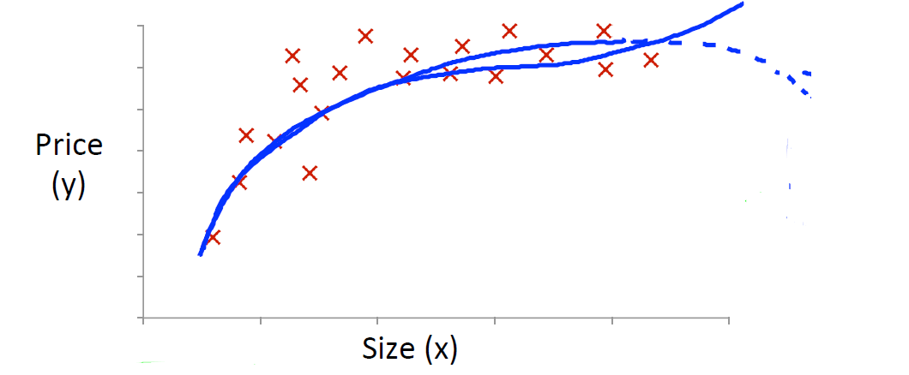

(setq markdown-css-paths '("https://cdn.jsdelivr.net/npm/katex@0.10.1/dist/katex.css"))

# Linear Regression with Multiple Variables

## Multivariate Linear Regression

### Multiple Features

#### Lecture Notes

+ Multiple features

  | Size ($\text{feet}^2)$, $x_1$ | Number of bedrooms, $x_2$ | Number of floors, $x_3$ | Age of home (years), $x_4$ | Price (\$1000), y |
  |:--:|:--:|:--:|:--:|:--:|
  | 2104 | 5 | 1 | 45 | 460 |
  | 1416 | 3 | 2 | 40 | 232 |
  | 1534 | 3 | 2 | 30 | 315 |
  | 852 | 2 | 1 | 36 |  |
  | $\cdots$ | $\cdots$ | $\cdots$ | $\cdots$ | $\cdots$ |
+ Notation:
  + $n$ = number of features; e.g. $n=4$
  + $x^{(i)}$ = input (features) of $i^{th}$ training example, e.g. $\quad x^{(2)} = \begin{bmatrix} 1416 \\ 3 \\ 2\\ 40 \end{bmatrix}$
  + $x^{(i)}_j$ = input features $j$ of $i^{th}$ training example; e.g. $\quad x_3^{(2)} = 2$
+IVQ: In the training set above, what is $x_1^{(4)}$?

  1. The size (in $\text{feet}^2$) of the 1st home in the training set
  2. The age (in years) of the 1st home in the training set
  3. The size (in $\text{feet}^2$) of the 4th home in the training set
  4. The age (in years) of the 4th home in the training set

  Ans: 3

+ Example: hypothesis function

  $h_\theta (x) = \theta_0 + \theta_1 x_1 + \theta_2 x_2 + \theta_3 x_3 + \theta_4 x_4 = h_\theta (x) = 80 + 0.2 x_1 + 0.01 x+2 + 3 x_3 - 2 x_4$

+ Hypothesis:

  $$h_\theta (x) = \theta_0 + \theta_1 x_1 + \ldots + \theta_n x_n$$

  For convenience of notation, define $x_0 = 1$ (a.k.a. $x_0^{(i)}=1 \; \text{ for } i = 1, \ldots, m$)

  $X = \begin{bmatrix} x_0 \\ x_1 \\ \vdots \\ x_n \end{bmatrix} \in \mathbb{R}^{n+1} \quad \quad \quad \Theta = \begin{bmatrix} \theta_0 \\ \theta_1 \\ \vdots \\ \theta_n \end{bmatrix} \in \mathbb{R}^{n+1}$

  $\Theta^T = \begin{bmatrix} \theta_0 & \theta_1 & \cdots & \theta_n \end{bmatrix}$ as a $1 \times (n+1)$ matrix

  $\begin{bmatrix} \theta_0 & \theta_1 & \cdots & \theta_n \end{bmatrix} \begin{bmatrix} x_0 \\ x_1 \\ \vdots \\ x_n \end{bmatrix}$

  $\therefore h_\theta (x) = \theta_0 x_0 + \theta_1 x_1 + \ldots + \theta_n x_n = \Theta^T X \Longrightarrow$ Multivariate linear regression.

---------------------------------------

Linear regression with multiple variables is also known as "__multivariate linear regression__".

We now introduce notation for equations where we can have any number of input variables.

+ $x_j^{(i)}$ = value of feature $j$ in the $i^{th}$ training example
+ $x^{(i)}$ = the column vector of all the feature inputs of the $i^{th}$ training example
+ $m$ = the number of training examples
+ $n=∣x^{(i)}∣$: the number of features

The multivariable form of the hypothesis function accommodating these multiple features is as follows:

$h_\theta (x) = \theta_0 + \theta_1 x_1 + \theta_2 x_2 + \theta_3 x_3 + \cdots + \theta_n x_n$

In order to develop intuition about this function, we can think about $\theta_0$ as the basic price of a house, $\theta_1$ as the price per square meter, $\theta_2$ as the price per floor, etc. $x_1$ will be the number of square meters in the house, $x_2$ the number of floors, etc.

Using the definition of matrix multiplication, our multivariable hypothesis function can be concisely represented as:

$h_\theta(x)= \begin{bmatrix} \theta_0 & \theta_1 & \cdots & \theta_n \end{bmatrix} \begin{bmatrix} x_0 \\ x_1 \\ \vdots \\ x_n \end{bmatrix} = \theta^T x$

This is a vectorization of our hypothesis function for one training example; see the lessons on vectorization to learn more.

Remark: Note that for convenience reasons in this course we assume $x_{0}^{(i)} = 1 \text{ for } (i\in { 1,\dots, m } )$. This allows us to do matrix operations with theta and x. Hence making the two vectors '$\theta$' and $x^{(i)}$ match each other element-wise (that is, have the same number of elements: $n+1$).]

#### Lecture Video

<video src="https://d3c33hcgiwev3.cloudfront.net/04.1-LinearRegressionWithMultipleVariables-MultipleFeatures.35214c30b22b11e49f072fa475844d6b/full/360p/index.mp4?Expires=1552608000&Signature=KD5dVQ8p5nVqXIVpC2ss~0ID-PnQFSIzbHntms25lkL-xAoMAdTPxAZPibn-686wp3JcJUrrhy1YlNGXG4wdfjHfXCJIdKSCsvI3Vo7r17-RBksAEzN~A-71MmrIuAjxxeBC~uBBJrNthfyFrxjbmnW7OqRTC5tmHgCZ~i1WrRI_&Key-Pair-Id=APKAJLTNE6QMUY6HBC5A" preload="none" loop="loop" controls="controls" style="margin-left: 2em;" muted="" poster="http://www.multipelife.com/wp-content/uploads/2016/08/video-converter-software.png" width="180">
  <track src="https://www.coursera.org/api/subtitleAssetProxy.v1/HpFJLMwbEeaTLA5NOVzoSA?expiry=1552608000000&hmac=6NtQvD-CDimjRuqMwlOLdy20G1PflNLx8a_JPyqFLGg&fileExtension=vtt" kind="captions" srclang="en" label="English" default>
  Your browser does not support the HTML5 video element.
</video>

 

### Gradient Descent for Multiple

#### Lecture Notes

+ Linear Regression Model
  + Hypothesis function

    $$h_\theta(x) =\theta^T x = \theta_0 x_0 + \theta_1 x_1 + \ldots + \theta_n x_n \Longrightarrow \Theta^T \cdot X$$

  + Parameters: 
  
    $$\quad \theta_0, \theta_1, \ldots, \theta_n \Longrightarrow \Theta = \begin{bmatrix} \theta_0 \\ \theta_1 \\ \ldots \\ \theta_n \end{bmatrix}\quad$$

    $\Theta$: a $(n+1)$-dimensional vector

  + Cost function: 

    $$\begin{array}{cc}
      J(\theta_0, \theta_1, \ldots, \theta_n) & = & \displaystyle \frac{1}{m} \sum_{i=1}^m (h_\theta (x^{(i)}) - y^{(i)})^2 \\ \\
      J(\Theta) &= & \displaystyle \frac{1}{m} \sum_{i=1}^m (h_\theta (x^{(i)}) - y^{(i)})^2
    \end{array}$$

  + IVQ: When there are n features, we define the cost function as

    $$\displaystyle J(\Theta) = \frac{1}{2m}\sum_{i=1}^{m}(h_\theta(x^{(i)}) - y^{(i)})^2$$.

    For linear regression, which of the following are also equivalent and correct definitions of $J(\theta)$?

    $$\begin{array}{lrcl}
      1. & J(\Theta) & = & \frac{1}{2m} \sum_{i=1}^m (\Theta^T x^{(i)} - y^{(i)})^2 \\\\
      2. & J(\Theta) & = & \frac{1}{2m} \sum_{i=1}^m ((\sum_{j=0}^n \theta_j x_j^{(i)}) - y^{(i)})^2 \text{(inner sum starts at 0)} \\\\
      3. & J(\Theta) & = & \frac{1}{2m} \sum_{i=1}^m ((\sum_{j=1}^n \theta_j x_j^{(i)}) - y^{(i)})^2 \text{(inner sum starts at 1)} \\\\
      4. & J(\Theta) & = & \frac{1}{2m} \sum_{i=1}^m ((\sum_{j=0}^n \theta_j x_j^{(i)}) - (\sum_{j=0}^n y_j^{(i)}))^2 \text{(inner sum starts at 0)} \\\\
    \end{array}$$

    Ans: 12

  + Gradient descent:

    Repeat {

    $$\theta_j := \theta_j -\alpha \frac{\partial}{\partial \theta_j} J(\Theta) = \theta_j -\alpha \frac{\partial}{\partial \theta_j} J(\theta_0, \theta_1, \ldots, \theta_n)$$
    
 (simultaneously update for every j = 0, 1, ..., n$) 
 }

+ Gradient Descent Algorithm
  + Linear regression: $n = 1$

    Repeat {

      $$\begin{array}{ccc}\theta_0 &:=& \theta_j -\alpha \frac{1}{m} \sum_{i=1}^m (h_\theta (x^{(i)}) - y^{(i)})= \theta_0 -\alpha \frac{\partial}{\partial \theta_0} J(\Theta) \\\\
      \theta_1 & := & \theta_j -\alpha \frac{1}{m} \sum_{i=1}^m (h_\theta (x^{(i)}) - y^{(i)})= \theta_0 -\alpha \frac{\partial}{\partial \theta_1} J(\Theta) \end{array}$$
       (simultaneously update for  $\theta_0, \theta_1$) 
    }
  
  + Multivariate linear repression ($n \geq 1$)

    Repeat {

      $$\theta_j := \theta_j -\alpha \frac{1}{m} \sum_{i=1}^m (h_\theta (x^{(i)}) - y^{(i)})= \theta_j -\alpha \frac{\partial}{\partial \theta_j} J(\Theta)$$
       (simultaneously update  $\theta_j \;$ for $j=0, 1, \ldots, n$) 
    }
  
    Extended version: with $x_0^{(i)} = 1$

      $$\begin{array}{ccc}
        \theta_0 &:=& \theta_0 -\alpha \displaystyle \frac{1}{m} \sum_{i=1}^m (h_\theta (x^{(i)}) - y^{(i)}) \cdot x_0^{(i)} \\\\
        \theta_1 &:=& \theta_1 -\alpha \displaystyle \frac{1}{m} \sum_{i=1}^m (h_\theta (x^{(i)}) - y^{(i)}) \cdot x_1^{(i)} \\\\
        \theta_2 &:=& \theta_2 -\alpha \displaystyle \frac{1}{m} \sum_{i=1}^m (h_\theta (x^{(i)}) - y^{(i)}) \cdot x_2^{(i)} \\\\
        & \cdots &
      \end{array}$$

---------------------------------------

The gradient descent equation itself is generally the same form; we just have to repeat it for our 'n' features:

repeat until convergence:{

  $$\begin{array}{ccc}
    \theta_0 & := & \theta_0 - \alpha \displaystyle \frac{1}{m} \sum_{i=1}^m (h_\theta (x^{(i)}) - y^{(i)}) \cdot x_0^{(i)} \\
    \theta_1 & := & \theta_1 - \alpha \displaystyle \frac{1}{m} \sum_{i=1}^m (h_\theta (x^{(i)}) - y^{(i)}) \cdot x_1^{(i)} \\
    \theta_2 & := & \theta_2 - \alpha \displaystyle \frac{1}{m} \sum_{i=1}^m (h_\theta (x^{(i)}) - y^{(i)}) \cdot x_2^{(i)} \\
    & \cdots &
  \end{array}$$
}

In other words:

repeat until convergence:{
  
  $$\theta_j := \theta_j - \alpha \frac{1}{m} \sum_{i=1}^m (h_\theta(x^{(i)}) - y^{(i)}) \cdot x_j^{(i)} \quad\quad \text{ for } j:=0,1, \ldots, n$$
}

The following image compares gradient descent with one variable to gradient descent with multiple variables:

  

#### Lecture Video

<video src="https://d3c33hcgiwev3.cloudfront.net/04.2-LinearRegressionWithMultipleVariables-GradientDescentForMultipleVariables.0f58c050b22b11e4aca907c8d9623f2b/full/360p/index.mp4?Expires=1552608000&Signature=P-2a7Ej5Iowtrpld~JV3wEGBqdb3qaEDTUqQ0RMXD93OENziZV1bWqjDWgA0X9myzKQw5Jy~RSabXMN5a0lTUjsbIVn-UprqKNpSti6OVU5ubBqw0FHnJdJUQnUP5jCh1ieCnnm8~IV~WgDMigTZRXQdhqOYrC2anCNHF9fFCcQ_&Key-Pair-Id=APKAJLTNE6QMUY6HBC5A" preload="none" loop="loop" controls="controls" style="margin-left: 2em;" muted="" poster="http://www.multipelife.com/wp-content/uploads/2016/08/video-converter-software.png" width="180">
  <track src="https://www.coursera.org/api/subtitleAssetProxy.v1/sLOuPyjYTC-zrj8o2HwvZw?expiry=1552608000000&hmac=vjbkm5A-sImaZ0AyBXk8H_oLtvauI42SjRQc7QWteu0&fileExtension=vtt" kind="captions" srclang="en" label="English" default>
  Your browser does not support the HTML5 video element.
</video>

 

### Gradient Descent in Practice I - Feature 

#### Lecture Notes

+ Feature Scaling
  + Idea: Make sure features are on a similar scale.
  + Example: 
    + $x_1 = \text{size } (0-2000 \text{ feet}^2) \Longrightarrow x_1 = \dfrac{\text{ size } (\text{feet}^2)}{2000} \rightarrow 0 \leq x_1 \leq 1$
    + $x_2 = \text{ number of bedrooms} (1-5) \Longrightarrow x_2 = \dfrac{\text{  number of bedrooms  }}{5} \rightarrow 0 \leq x_1 \leq 1$
  + General rule: Get every feature into approximately a $-1 \leq x_i \leq 1$ range.
  + Example:

    $$\begin{array}{rclcl}
      0 & \leq x_1 \leq & 3 & \rightarrow & \surd \text{ (close enough)} \\
      -2 & \leq x_2 \leq & 0.5 & \rightarrow & \surd \text{ (close enough)}\\
      -100 & \leq x_3 \leq & 100 & \rightarrow & \text{ scaling} \\
      -0.0001 & \leq x_4 \leq & 0.0001 & \rightarrow & \text{ scaling}
    \end{array}$$
  + General rule of thumb: (acceptable ranges)
    + $-3$ to $3$
    + $-1/3$ to $1/3$

+ Mean Normalization
  + Replace $x_i$ with $x_i - \mu_i$ to make features have approximately zero mean (Do not apply to $x_0 = 1$).
  + Examples:
    + average size = 1000: $\quad x_1 = \dfrac{size - 1000}{2000}$

    + 1~5 bedrooms: $\quad x_2 = \dfrac{\#bedrooms - 2}{5}$ (acceptable though $4 = 5 -1$)
  + General rule:

    $$ x_i := \dfrac{x_i - \mu_i}{s_i}$$
    + $\mu_i\;$: average value of $x_i$ in training set
    + $s_i\;$: range ($\max - \min$) or standard deviation ($\sigma_i$)of $x_i$ value set
  + IVQ: Suppose you are using a learning algorithm to estimate the price of houses in a city. You want one of your features $x_i$ to capture the age of the house. In your training set, all of your houses have an age between 30 and 50 years, with an average age of 38 years. Which of the following would you use as features, assuming you use feature scaling and mean normalization?
    1. $x_1 = \text{ age of house}$
    2. $x_i = \text{ age of house} / 50$
    3. $x_i = (\text{ age of house } - 38) / 50$
    4. $x_i = (\text{ age of house } - 38) / 20$

    Ans: 4

---------------------------------------

We can speed up gradient descent by having each of our input values in roughly the same range. This is because $\theta$ will descend quickly on small ranges and slowly on large ranges, and so will oscillate inefficiently down to the optimum when the variables are very uneven.

The way to prevent this is to modify the ranges of our input variables so that they are all roughly the same. Ideally:

$$−1 \leq x_{(i)} \leq 1 \quad\quad \text{or} \quad\quad −0.5 \leq x_{(i)} \leq 0.5$$

These aren't exact requirements; we are only trying to speed things up. The goal is to get all input variables into roughly one of these ranges, give or take a few.

Two techniques to help with this are __feature scaling__ and __mean normalization__. Feature scaling involves dividing the input values by the range (i.e. the maximum value minus the minimum value) of the input variable, resulting in a new range of just 1. Mean normalization involves subtracting the average value for an input variable from the values for that input variable resulting in a new average value for the input variable of just zero. To implement both of these techniques, adjust your input values as shown in this formula:

$$x_i := \dfrac{x_i - \mu_i}{s_i}$$​

Where $μ_i$ is the average of all the values for feature ($i$) and $s_i$ is the range of values $(\max - \min)$, or $s_i$ is the standard deviation.

Note that dividing by the range, or dividing by the standard deviation, give different results. The quizzes in this course use range - the programming exercises use standard deviation.

For example, if $x_i$ represents housing prices with a range of 100 to 2000 and a mean value of 1000, then, $x_i := \dfrac{\text{price}-1000}{1900}$.

#### Lecture Video

<video src="https://d3c33hcgiwev3.cloudfront.net/04.3-LinearRegressionWithMultipleVariables-GradientDescentInPracticeIFeatureScaling.1d388a20b22b11e4bb7e93e7536260ed/full/360p/index.mp4?Expires=1552608000&Signature=YuT6lbftkWikDFbV13T27VCb09dNRotJYj6k-uQbsQ4lwMNoCtJzhKSiQc98N2S1Vyslph3E-C0l0pU1NOTBcfaaopbqDGLak0GDMVitZH9fJW7C3d5fjOfmmgNnTsn-7ULF0MffgwpeU6FGZ8yI7bFj4ylzBiL1vwEldb5xjFE_&Key-Pair-Id=APKAJLTNE6QMUY6HBC5A" preload="none" loop="loop" controls="controls" style="margin-left: 2em;" muted="" poster="http://www.multipelife.com/wp-content/uploads/2016/08/video-converter-software.png" width="180">
  <track src="https://www.coursera.org/api/subtitleAssetProxy.v1/sTG3UqavTLuxt1Kmr2y7LA?expiry=1552608000000&hmac=rnsTdJwMKZMxRoaaOuWb2Wf_XvbNY6g6EPDlAC-CPC8&fileExtension=vtt" kind="captions" srclang="en" label="English" default>
  Your browser does not support the HTML5 video element.
</video>

 

### Gradient Descent in Practice II - Learning Rate

#### Lecture Notes

+ Gradient descent

  $$\theta_j := \theta_j - \alpha \dfrac{\partial}{\partial \theta_j} J(\Theta)$$
  + "Debugging": how to make suer gradient descent is working correctly
  + How to choose learning rate $\alpha$

+ Automatic convergence test: Convergence threshold

  

    

  

  + $J(\Theta)$ should decrease each iteration
  + Declare convergence if $J(\Theta)$ decreases by less than $\varepsilon = 10^{-3}$ in one iteration.

+ Learning rate
    

      

    

    + $J(\Theta) \uparrow$ as number of iterations $\uparrow \quad \Longrightarrow \quad$ gradient not working, $\alpha$ too big
    + For sufficiently small $\alpha$, $J(\Theta)$ should decrease on every iteration.
    + If $\alpha$ is too small, gradient descent can be slow to converge.
    + IVQ: Suppose a friend ran gradient descent three times, with $\alpha = 0.01$, $\alpha = 0.1$, and $\alpha = 1$, and got the following three plots (labeled A, B, and C):

    

      

    

    Which plots corresponds to which values of \alphaα?
    1. A is $\alpha=0.01$, B is $\alpha = 0.1$, C is $\alpha =1$.
    2. A is $\alpha=0.1$, B is $\alpha = 0.01$, C is $\alpha =1$.
    3. A is $\alpha=1$, B is $\alpha = 0.01$, C is $\alpha =0.1$.
    4. A is $\alpha=1$, B is $\alpha = 0.1$, C is $\alpha =0.01$.

    Ans: 2  
    Explanation: In graph C, the cost function is increasing, so the learning rate is set too high. Both graphs A and B converge to an optimum of the cost function, but graph B does so very slowly, so its learning rate is set too low. Graph A lies between the two.

+ Summary
  + If $\alpha$ too small: slow convergence.
  + If $\alpha$ too large: $J(\Theta)$ may not decrease on every iteration; may not converge; slow converge also possible
  + Best practice: to choose $\alpha$, try

    $$\ldots, 0.001, 0.003, , 0.01, 0.03, 0.1, 0.3, 1, \ldots$$

---------------------------------------

__Debugging gradient descent__. Make a plot with number of iterations on the x-axis. Now plot the cost function, $J(\theta)$ over the number of iterations of gradient descent. If $J(\theta)$ ever increases, then you probably need to decrease $\alpha$.

__Automatic convergence test__. Declare convergence if $J(\theta)$ decreases by less than $E$ in one iteration, where $E$ is some small value such as $10^{−3}$. However in practice it's difficult to choose this threshold value.

  

It has been proven that if learning rate α is sufficiently small, then J(θ) will decrease on every iteration.

  

To summarize:

+ If $\alpha$ is too small: slow convergence.
+ If $\alpha$ is too large: may not decrease on every iteration and thus may not converge.

#### Lecture Video

<video src="https://d3c33hcgiwev3.cloudfront.net/04.4-LinearRegressionWithMultipleVariables-GradientDescentInPracticeIILearningRate.0f202420b22b11e4901abd97e8288176/full/360p/index.mp4?Expires=1552694400&Signature=Ivon6YjQJpvHHPHkviOja3BtxADiZMMZQAvX4BVTygCC0QkogFWqvuLFqHS-fWh11BHIQaHRU0fISam21DJQ9hmSzYu1VWFWtVzdYb4fdrmDsxM~GFRE5OG1lqYpQ1-YYIrP5-oI6wygrbzvOay4esGxd36w5SBFZiU0wjrqknU_&Key-Pair-Id=APKAJLTNE6QMUY6HBC5A" preload="none" loop="loop" controls="controls" style="margin-left: 2em;" muted="" poster="http://www.multipelife.com/wp-content/uploads/2016/08/video-converter-software.png" width="180">
  <track src="https://www.coursera.org/api/subtitleAssetProxy.v1/R7F5CEt0R8uxeQhLdNfLQA?expiry=1552694400000&hmac=XWt-7i8N_5-hQeBGd_WftWywfOOpIKoiVgJhfNzBoSY&fileExtension=vtt" kind="captions" srclang="en" label="English" default>
  Your browser does not support the HTML5 video element.
</video>

 

### Features and Polynomial Regression

#### Lecture Notes

+ Housing prices prediction

    $$h_\Theta(x) = \theta_0 + \theta_1 \times \text{ frontage } + \theta_2 \times \text{ depth}$$

    where $\text{frontage } = x_1$ and $\text{depth } = x_2$

    Area: $\;x = x_1 \times x_2 \;$ as land area

    $$\begin{array}{l}
      x = \text{ frontage } \times \text{ depth } \\\\
      h_\theta (x) = \theta_0 + \theta_1 x
    \end{array}$$

+ Polynomial regression

    

      

    

    $$\theta_0 + \theta_1 x + \theta_2 x^2 \quad \text{or} \quad \theta_0 + \theta_1 x + \theta_2 x^2 + \theta_3 x^3 \quad \text {or} \quad \ldots$$

    + If cubic model fits, 

        $$\begin{array}{rcl}
            h_\theta(x) & = & \theta_0 + \theta_1 x_1 + \theta_2 x_2 + \theta_3 x_3 \\\\
            & = & \theta_0 + \theta(size) + \theta_2 (size)^2 + \theta_3 (size)^3
        \end{array}$$

        where $x_1 = (size), x_2 = (size)^2, x_3 = (size)^3$

    + Value range: if $size \in [1, 1000]$
        + $x_1 = (size) \in [1, 10^3]$
        + $x_2 = (size)^2 \in [1, 10^6]$
        + $x_3 = (size)^3 \in [1, 10^9]$

+ Choose of features

    

      

    

    $$\begin{array}{rcl}
      h_\theta(x) & = & \theta_0 + \theta_1 (size) + \theta_2 (size)^3 \\\\
      h_\theta(x) & = & \theta_0 + \theta_1 (size) + \theta_2 \sqrt{(size)}
    \end{array}$$
    + IVQ: Suppose you want to predict a house's price as a function of its size. Your model is

      $h_\theta(x) = \theta_0 + \theta_1(\text{size}) + \theta_2\sqrt{(\text{size})}$.

      Suppose size ranges from 1 to 1000 ($\text{feet}^2$). You will implement this by fitting a model

      $h_\theta(x) = \theta_0 + \theta_1x_1 + \theta_2x_2$.

      Finally, suppose you want to use feature scaling (without mean normalization).

      Which of the following choices for $x_1$ and $x_2$ should you use? (Note:$\sqrt{1000} \approx 32$)
      1. $x_1 = \text{size},\ x_2 = 32\sqrt{(\text{size})}$
      2. $x_1 = 32(\text{size}),\ x_2=\sqrt{(\text{size})}$
      3. $x_1 = \frac{\text{size}}{1000},\ x_2 = \frac{\sqrt{(\text{size})}}{32}$
      4. $x_1 = \frac{\text{size}}{32},\ x_2=\sqrt{(\text{size})}$

      Ans: 3

---------------------------------------

We can improve our features and the form of our hypothesis function in a couple different ways.

We can __combine__ multiple features into one. For example, we can combine $x_1$ and $x_2$ into a new feature $x_3$ by taking $x_1 \cdot x_2$.

__Polynomial Regression__

Our hypothesis function need not be linear (a straight line) if that does not fit the data well.

We can __change the behavior or curve__ of our hypothesis function by making it a quadratic, cubic or square root function (or any other form).

For example, if our hypothesis function is $h_\theta(x) = \theta_0 + \theta_1 x_1$ then we can create additional features based on $x_1$, to get the quadratic function $\; h_\theta(x) = \theta_0 + \theta_1 x_1 + \theta_2 x_1^2 \;$ or the cubic function $\; h_\theta(x) = \theta_0 + \theta_1 x_1 + \theta_2 x_1^2 + \theta_3 x_1^3$

In the cubic version, we have created new features $x_2$ and $x_3$ where $\; x_2 = x_1^2 \;$ and $\; x_3 = x_1^3$.

To make it a square root function, we could do: $\; h_\theta(x) = \theta_0 + \theta_1 x_1 + \theta_2 \sqrt{x_1}$

One important thing to keep in mind is, if you choose your features this way then feature scaling becomes very important.

eg. if $\; x_1 \;$ has range $1 - 1000$ then range of $\; x_1^2 \;$ becomes $1 - 1000000$ and that of $\; x_1^3 \;$ becomes $1 - 1000000000$

#### Lecture Video

<video src="https://d3c33hcgiwev3.cloudfront.net/04.5-LinearRegressionWithMultipleVariables-FeaturesAndPolynomialRegression.c49aba90b22b11e4bb7e93e7536260ed/full/360p/index.mp4?Expires=1552694400&Signature=N~5J~YbmV57H3NKAxaD9JUlVn4FgfaUHXiWias7c4nZepQI~8rNwmEnR2aqbpT7GMmGraAsai6JtnIUbkmK9tHSe6bgvIWXGnm9AW0AtzBQziSSNbWd57PBN8f6YdO4xavbvVzq~LdqqRykKAs0773XKy9OMGfFdYte9vsyhlHQ_&Key-Pair-Id=APKAJLTNE6QMUY6HBC5A" preload="none" loop="loop" controls="controls" style="margin-left: 2em;" muted="" poster="http://www.multipelife.com/wp-content/uploads/2016/08/video-converter-software.png" width="180">
  <track src="https://www.coursera.org/api/subtitleAssetProxy.v1/WMiiN5doSRSIojeXaBkUKw?expiry=1552694400000&hmac=vaCG4nEafo_Sx1o80Katg8QR_04xbQNV76-FOG4LNyc&fileExtension=vtt" kind="captions" srclang="en" label="English" default>
  Your browser does not support the HTML5 video element.
</video>

 

## Computing Parameters Analytically

### Normal Equation

#### Lecture Notes

+ Normal equation: Method to solve for $\theta$ analytically.

+ Intuition: If 1D ($\theta \in \mathbb{R}$)

    $$J(\theta) = a \theta^2 + b \theta + c$$
     

    $$\dfrac{d}{d\theta} J(\theta) = \cdots = 0 \Longrightarrow \text{solve for } \theta$$

+ Generalized: for $\; \theta \in \mathbb{R}^{n+1}$

  $$J(\theta_0, \theta_1, \ldots, \theta_m) = \dfrac{1}{2m} \sum_{i=1}^m (h_\theta(x^{(i)} - y^{(i)})^2$$
   

  $$\dfrac{\partial}{\partial \theta_j} J(\theta) = \cdots = 0, \quad \forall j \Longrightarrow \text{solve for } \theta_0, \theta_1, \ldots, \theta_n$$

+ Example: $m=4$

  |  $x_0$ | Size ($\text{feet}^2$)   $x_2$ | Number of bedrooms   $x_3$ | Number of floors   $x_4$ | Age of home (years)   $x_4$ | Price ($1000)   $y$ |
  |:-:|:--:|:--:|:--:|:--:|:--:|
  | 1 | 2104 | 5 | 1 | 45 | 460 |
  | 1 | 1416 | 3 | 2 | 40 | 232 |
  | 1 | 1534 | 3 | 2 | 30 | 315 |
  | 1 | 852 | 2 | 1 | 36 | 178 |

   

  $$\begin{array}{ccccccl} X & = &  \begin{bmatrix} 1 & 2104 & 5 & 1 & 45 \\ 1 & 1416 & 3 & 2 & 40 \\ 1 & 1534 & 3 & 2 & 30 \\ 1 &  852 & 2 & 1 & 36 \end{bmatrix} & \quad \quad \quad & y & = &  \begin{bmatrix} 460 \\ 232 \\ 315 \\ 178 \end{bmatrix} \\ & & m \times (n+1) \text{ matrix} & & & & m-\text{dimensional vector} \end{array}$$

   

  $$\theta = (X^TX)^{-1} X^T y$$

+ Normal Equation
  + Suppose $\;m\;$ examples $\;(x{(1)}, y^{(1)}), \ldots, (x{(1)}, y^{(1)})$; $\;n$ features, then

    $$x^{(i)} = \begin{bmatrix} x_0^{(i)} \\ x_1^{(i)} \\ \vdots \\ x_n^{(i)} \end{bmatrix} \in \mathbb{R}^{n+1}  \quad\quad \Longrightarrow \quad\quad X = \begin{bmatrix} (x^{(1)})^T \\ (x^{(2)})^T \\ \vdots \\ (x^{(m)})^T \end{bmatrix} m \times (n+1) \text{matrix (design matrix})$$

  + Example: $n=2$
  
    $$x^{(i)} = \begin{bmatrix} 1 \\ x_1^{(i)} \end{bmatrix} \quad\quad \Longrightarrow \quad\quad X = \begin{bmatrix} 1 & x_1^{(1)} \\ 1 & x_2^{(1)} \\ \vdots & \vdots \\ 1 & x_m^{(1)} \end{bmatrix} (m \times 2) \text{ matrix} \quad \text{  and    } \quad y = \begin{bmatrix} y^{(1} \\ y^{(2)} \\ \vdots \\ y^{(m)} \end{bmatrix}$$

  + IVQ: Suppose you have the training in the table below:

    | age ($x_1$) | height in cm ($x_2$) | weight in kg ($x_3$) |
    |:--:|:--:|:--:|
    | 4| 89 | 16 |
    | 9 | 124 | 28 |
    | 5 | 103 | 20 |

    You would like to predict a child's weight as a function of his age and height with the model

    $$\text{weight} = \theta_0 + \theta_1\text{age}+\theta_2\text{height}$$.

    What are XX and yy?

    Ans: $X = \begin{bmatrix} 1 & 4 & 89 \\ 1 & 9 7 124 \\ 1 & 5 & 103 \end{bmatrix}, \quad\quad y = \begin{bmatrix} 16 \\ 28 \\ 20 \end{bmatrix}$
  
  + Substitution

    $\theta = (X^TX)^{-1} X^T y \quad \Longrightarrow \quad \text{solution for } \displaystyle \min_{\theta} J(\theta)$

    where $(X^TX)^{-1}$ is inverse of matrix $(X^TX)$.

    Let $A = X^TX$, then $\;(X^TX)^{-1} = A^{-1}$
  
  + Octave: `pinv(X' * X) * X' * y`

+ Comparison: $m$ training examples, $n$ features
  + Gradient Descent
    + Need to choose $\alpha$
    + Need many iterations
    + Work well even when $n$ is large
  + Normal Equation
    + No need to choose $\alpha$
    + Don't need to iterate
    + Need to compute $(X^TX)^{-1}$ ($\mathcal{O}(n^3)$ for inverse matrix)
    + Slow if $n$ is very large, $n \leq 10000$ might be ok
    + No need to feature scaling

---------------------------------------

Gradient descent gives one way of minimizing J. Let’s discuss a second way of doing so, this time performing the minimization explicitly and without resorting to an iterative algorithm. In the "Normal Equation" method, we will minimize J by explicitly taking its derivatives with respect to the θj ’s, and setting them to zero. This allows us to find the optimum theta without iteration. The normal equation formula is given below:

$\theta = (X^T X)^{-1}X^T y$

  

There is __no need__ to do feature scaling with the normal equation.

The following is a comparison of gradient descent and the normal equation:

| Gradient Descent | Normal Equation |
|------------------|-----------------|
| Need to choose $\alpha$ | Not need to choose $\alpha$ |
| Need many iterations | No need to iterate |
| $\mathcal{O}(kn^2)$ | $\mathcal{O}(n^3)$, need to calculate inverse of $X^TX$ |
| Works well when $n$ is large | Slow if $n$ is very large |

With the normal equation, computing the inversion has complexity $\mathcal{O}(n^3)$). So if we have a very large number of features, the normal equation will be slow. In practice, when n exceeds 10,000 it might be a good time to go from a normal solution to an iterative process.

#### Lecture Video

<video src="https://d3c33hcgiwev3.cloudfront.net/04.6-V2-LinearRegressionWithMultipleVariables-NormalEquation.245e86b0b22b11e49c064db6ead92550/full/360p/index.mp4?Expires=1552694400&Signature=fL0VFHgRKnoiUp8U9T6z1AMmpw7E9xeemv1q6zMsXn8SMH~7CR8zs48bOQy1bFXSc8WrfqUb52mi8OLyWtGDrCRlo9-r8R~sY9Ef5cdTYxtwKWPPtJC8JJhXucBq-hTn--lm2S~VMLLexB2ZxkSZM2Y1wmJvKMszPrfc8rJzZrA_&Key-Pair-Id=APKAJLTNE6QMUY6HBC5A" preload="none" loop="loop" controls="controls" style="margin-left: 2em;" muted="" poster="http://www.multipelife.com/wp-content/uploads/2016/08/video-converter-software.png" width="180">
  <track src="https://www.coursera.org/api/subtitleAssetProxy.v1/Cn1S8V3aTKe9UvFd2pynXA?expiry=1552694400000&hmac=LJnmBmYwegrMSwMepAuALXwDRRwVqdOavGtunMlFdF8&fileExtension=vtt" kind="captions" srclang="en" label="English" default>
  Your browser does not support the HTML5 video element.
</video>

 

### Normal Equation

#### Lecture Notes

---------------------------------------

#### Lecture Video

<video src="url" preload="none" loop="loop" controls="controls" style="margin-left: 2em;" muted="" poster="http://www.multipelife.com/wp-content/uploads/2016/08/video-converter-software.png" width="180">
  <track src="subtitle" kind="captions" srclang="en" label="English" default>
  Your browser does not support the HTML5 video element.
</video>

 

### Submitting Programming Assignments

#### Lecture Notes

---------------------------------------

#### Lecture Video

<video src="url" preload="none" loop="loop" controls="controls" style="margin-left: 2em;" muted="" poster="http://www.multipelife.com/wp-content/uploads/2016/08/video-converter-software.png" width="180">
  <track src="subtitle" kind="captions" srclang="en" label="English" default>
  Your browser does not support the HTML5 video element.
</video>

 

### Working on and Submitting Programming Assignments

#### Lecture Notes

---------------------------------------

#### Lecture Video

<video src="url" preload="none" loop="loop" controls="controls" style="margin-left: 2em;" muted="" poster="http://www.multipelife.com/wp-content/uploads/2016/08/video-converter-software.png" width="180">
  <track src="subtitle" kind="captions" srclang="en" label="English" default>
  Your browser does not support the HTML5 video element.
</video>

 

### Programming tips from Mentors

#### Lecture Notes

---------------------------------------

#### Lecture Video

<video src="url" preload="none" loop="loop" controls="controls" style="margin-left: 2em;" muted="" poster="http://www.multipelife.com/wp-content/uploads/2016/08/video-converter-software.png" width="180">
  <track src="subtitle" kind="captions" srclang="en" label="English" default>
  Your browser does not support the HTML5 video element.
</video>

 

## Review

### Lecture Slides

### Quiz: Linear Regression with Multiple Variables

