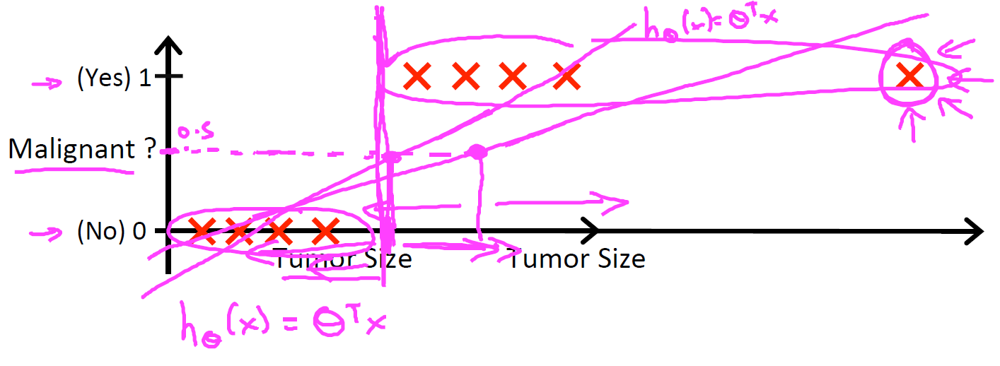
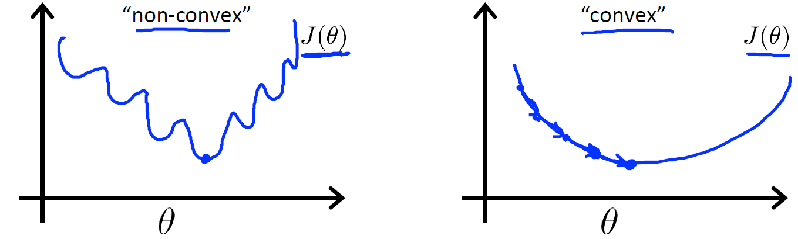
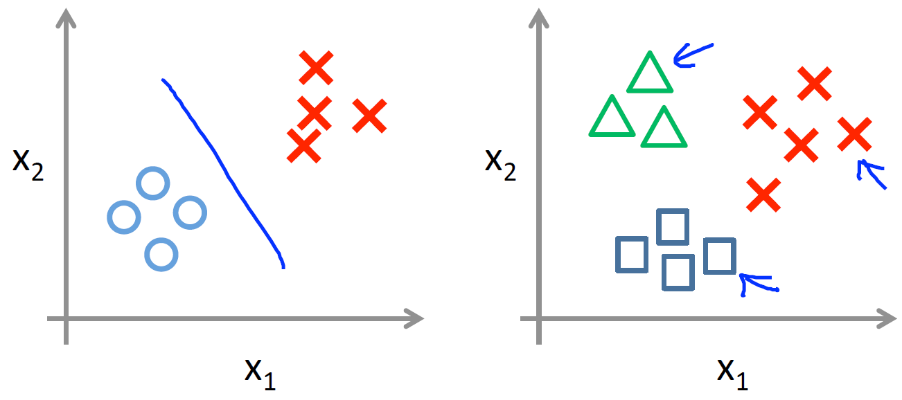

# Logistic Regression

## Classification and Representation


### Classification

#### Lecture Notes

+ Classification
  + Email: Spam / Not Spam?
  + Online Transactions: Fraudulent (Yes/No)?
  + Tumor: Malignant / Benign?
  + binary classes: $y \in \{0, 1 \} \quad\quad \left\{ \begin{array}{ll} 0: & \text{"Negative Class" (e.g., benign tumor)} \\ 1: & \text{"Positive Class" (e.g., malignant tumor)} \end{array} \right.$
  + Multi-class: e.g., $y \in \{0, 1, 2, 3\}$

+ Binary classification with Linear Regression
    <div style="display:flex;justify-content:center;align-items:center;flex-flow:row wrap;">
      <div><a href="https://www.coursera.org/learn/machine-learning/lecture/wlPeP/classification">
        
      </a></div>
    </div>

    + Threshold  classifier output $h_\theta(x)$ at 0.5:

      &nbsp;&nbsp;&nbsp;&nbsp;&nbsp;&nbsp;&nbsp;&nbsp;$\left \{ \begin{array}{cc} \text{If } h_\theta (x) \geq 0.5, \text{ predict "y=1"} \\\\ \text{If } h_\theta (x) < 0.5, \text{ predict "y=0"} \end{array} \right.$

    + Classification (y = 0 or 1): $\quad h_\theta(x)$ can be > 1 or < 1
    + Logistic Regression (classification than regression): $\quad 0 \leq h_\theta (x) \leq 1$
    + IVQ: Which of the following statements is true?
      1. If linear regression doesn't work on a classification task as in the previous example shown in the video, applying feature scaling may help.
      2. If the training set satisfies $0 \leq y^{(i)} \leq 1$ for every training example $(x^{(i)},y^{(i)})$, then linear regression's prediction will also satisfy $0 \leq h_\theta(x) \leq 1$ for all values of $x$.
      3. If there is a feature $x$ that perfectly predicts $y$, i.e. if $y=1$ when $x \geq c$ and $y=0$ whenever $x < c$ (for some constant $c$), then linear regression will obtain zero classification error.
      4. None of the above statements are true.

        Ans: 4

-------------------------------------------------

To attempt classification, one method is to use linear regression and map all predictions greater than 0.5 as a 1 and all less than 0.5 as a 0. However, this method doesn't work well because classification is not actually a linear function.

The classification problem is just like the regression problem, except that the values we now want to predict take on only a small number of discrete values. For now, we will focus on the __binary classification problem__ in which y can take on only two values, 0 and 1. (Most of what we say here will also generalize to the multiple-class case.) For instance, if we are trying to build a spam classifier for email, then $x^{(i)}$ may be some features of a piece of email, and y may be 1 if it is a piece of spam mail, and 0 otherwise. Hence, $y \in \{0,1\}$. 0 is also called the negative class, and 1 the positive class, and they are sometimes also denoted by the symbols “-” and “+.” Given $x^{(i)}$, the corresponding $y^{(i)}$ is also called the label for the training example.


#### Lecture Video

<video src="https://d3c33hcgiwev3.cloudfront.net/06.1-LogisticRegression-Classification.b2fadb80b22b11e49f072fa475844d6b/full/360p/index.mp4?Expires=1553299200&Signature=QL1NgMe3Kns4J~jCvY-IP970i8y3ap-z0Wt9ISZ1NWgRdpNbngPwLrRiKgWehcrfACUz-njiR3AnR~1Y5knxGcj43os8CwBjbJO6QxkAnt7rierHu0jHmBGx6FsXLnHO~3iKTYuJoS4xaA6XNCzCjIpKLH0UHbXDsvNVKyzqQAY_&Key-Pair-Id=APKAJLTNE6QMUY6HBC5A" preload="none" loop="loop" controls="controls" style="margin-left: 2em;" muted="" poster="http://www.multipelife.com/wp-content/uploads/2016/08/video-converter-software.png" width="180">
  <track src="https://www.coursera.org/api/subtitleAssetProxy.v1/dZkBwCt-TXiZAcArfv14nA?expiry=1553299200000&hmac=y8jMm6Llxi7p5TjKxk439xfrc3g3k--uvJIxRBjyoSE&fileExtension=vtt" kind="captions" srclang="en" label="English" default>
  Your browser does not support the HTML5 video element.
</video>

<br/>


### Hypothesis Representation

#### Lecture Notes

+ Logistic Regression Model
    + Want: $\quad 0 \leq h_\theta (x) \leq 1$

        $$h_\theta(x) = \theta^T x = $$
    + Sigmoid/Logistic function
      <div style="display:flex;justify-content:center;align-items:center;flex-flow:row wrap;">
        <div style="background-color: white;"><a href="https://en.wikipedia.org/wiki/Logistic_function">
        
        </a></div>
      </div><br/>

      $$h_\theta(x) = \dfrac{1}{1+e^{-x}} \quad \Longrightarrow \quad g(z) = h_\theta(x) = g(\theta^Tx) = \dfrac{1}{1 + e^{-\theta^T x}}$$
    + Parameter: $\theta \;\; \longleftarrow \;\;$ find the value to fit parameter

+ Interpretation of Hypothesis Output
    + $h_\theta (x) = \;$ estimated probability that $y = 1$ on input $x$
    + Example: if $x = \begin{bmatrix} x_0 \\ x_1 \end{bmatrix} = \begin{bmatrix} 1 \\ \text{tumorSize} \end{bmatrix} \quad \Longrightarrow \quad h_\theta (x) = 0.7$
    
      Tell patient that $70\%$ chance of tumor being malignant

      $h_\theta(x) = P(y = 1 | x; \theta)$

      mean: "probability that y = 1, given x, parameterized by $\theta$"

      $$\begin{array}{l} P(y = 0 | x; \theta) + P(y=1|x; \theta) = 1 \\\\ P(y=0|x;\theta) = 1 - P(y=1 | x; \theta) \end{array}$$
    + IVQ: Suppose we want to predict, from data $x$ about a tumor, whether it is malignant ($y=1$) or benign ($y=0$). Our logistic regression classifier outputs, for a specific tumor, $h_\theta(x) = P(y=1\vert x;\theta) = 0.7$, so we estimate that there is a 70% chance of this tumor being malignant. What should be our estimate for $P(y=0\vert x;\theta)$, the probability the tumor is benign?
      1. $P(y=0\vert x;\theta) = 0.3$
      2. $P(y=0\vert x;\theta) = 0.7$
      3. $P(y=0\vert x;\theta) = 0.7^2$
      4. $P(y=0\vert x;\theta) = 0.3\times 0.7$

      Ans: 1


-------------------------------------------------

We could approach the classification problem ignoring the fact that y is discrete-valued, and use our old linear regression algorithm to try to predict y given x. However, it is easy to construct examples where this method performs very poorly. Intuitively, it also doesn’t make sense for $h_\theta (x)$ to take values larger than 1 or smaller than 0 when we know that $y \in \{0, 1\}$. To fix this, let’s change the form for our hypotheses $h_\theta (x)$ to satisfy $0 \leq h_\theta (x) \leq 1$. This is accomplished by plugging $\theta^Tx$ into the Logistic Function.

Our new form uses the "Sigmoid Function," also called the "Logistic Function":

$$h_\theta(x)=g(θ^Tx) \quad\quad z=θ^Tx \quad\quad g(z) = \dfrac{1}{1+e^{−z}}$$

The following image shows us what the sigmoid function looks like:

<div style="display:flex;justify-content:center;align-items:center;flex-flow:row wrap;">
  <div><a href="https://www.coursera.org/learn/machine-learning/supplement/AqSH6/hypothesis-representation">
    
  </a></div>
</div>

The function $g(z)$, shown here, maps any real number to the $(0, 1)$ interval, making it useful for transforming an arbitrary-valued function into a function better suited for classification.

$h_\theta(x)$ will give us the __probability__ that our output is 1. For example, $h_\theta(x)=0.7$ gives us a probability of $70\%$ that our output is 1. Our probability that our prediction is 0 is just the complement of our probability that it is 1 (e.g. if probability that it is 1 is $70\%$, then the probability that it is 0 is $30\%$).

$$\begin{array}{l} h_\theta(x) =  P(y=1|x;θ) = 1 − P(y=0|x;θ) \\\\ P(y=0|x;θ) + P(y=1|x;θ) = 1 \end{array}$$


#### Lecture Video 

<video src="https://d3c33hcgiwev3.cloudfront.net/06.2-LogisticRegression-HypothesisRepresentation.219617e^0b22b11e4bfb32bc54f4c0527/full/360p/index.mp4?Expires=1553299200&Signature=fJNtlLEVc~eDsJKx2Z4pJ3hKYw2tgHx0~VF6fJ8mbbMH9-pwyMgEPJ5yKadTl5RTtxlr91Ge6aGCJXEYzuEfXBLvcpwBvqdJ-oWzGLvrB6jsiVC~f3pwEOIpb98Koo2ZEpHQVNI8Mm318lXh4joluo4km257rM1~GPPc~8JCpQc_&Key-Pair-Id=APKAJLTNE6QMUY6HBC5A" preload="none" loop="loop" controls="controls" style="margin-left: 2em;" muted="" poster="http://www.multipelife.com/wp-content/uploads/2016/08/video-converter-software.png" width="180">
  <track src="https://www.coursera.org/api/subtitleAssetProxy.v1/Hn9tP60RQkm_bT-tEZJJfw?expiry=1553299200000&hmac=TZNDFstnCLpRKYo5kwl8Kn1SlQlYCspC1KkTzIzMEiU&fileExtension=vtt" kind="captions" srclang="en" label="English" default>
  Your browser does not support the HTML5 video element.
</video>

<br/>


### Decision Boundary

#### Lecture Notes

+ Logistic regression

  $$\begin{array}{rcl} h_\theta(x) & = & g(\theta^T x) = P(y=1 | x; \theta)  \\\\ g(z) & = & \dfrac{1}{1 + e^{-z}} \end{array}$$

  + Suppose predict "$y = 1$" if $\;\; h_\theta(x) \geq 0.5$:

    $$g(z) \geq 0.5 \text{ when } z \geq 0 \quad \Longrightarrow \quad h_\theta(x) = g(\theta^Tx) \geq 0.5 \;\;\text{  whenever  } \theta^Tx \geq 0$$
  + Suppose predict "$y = 0$" if $\;\; h_\theta(x) < 0.5$:

    $$g(z) < 0.5 \text{ when } z < 0 \quad \Longrightarrow \quad h_\theta(x) = g(\theta^Tx) < 0.5 \;\;\text{  whenever  } \theta^Tx < 0$$

+ Linear Decision Boundary
  <div style="display:flex;justify-content:center;align-items:center;flex-flow:row wrap;">
    <div><a href="https://www.coursera.org/learn/machine-learning/lecture/WuL1H/decision-boundary">
      
    </a></div>
  </div>

  + IVQ: Consider logistic regression with two features $x_1$ and $x_2$. Suppose $\theta_0 = 5$, $\theta_1 = -1$, $\theta_2 = 0$, so that $h_\theta(x) = g(5 - x_1)$. Which of these shows the decision boundary of $h_\theta(x)$?

    Ans: $y = 1: x_1 \leq 5$; Predict $Y = 0$ if $x_1 \geq 5$

  + Hypothesis: $h_\theta(x) = g(\theta_0 + \theta_1 x_1 + \theta_2 x_2)$
  + Predict "$y=1$ if $-3 + x_1 + x_+ 3 \geq 0$

    $$x_1 + x_2 \geq 3 \quad \rightarrow \quad \theta = \begin{bmatrix} -3 \\ 1 \\ 1 \end{bmatrix} \quad \Longrightarrow \quad h_\theta(x) = 0.5 \text{ if } x_1 + x_2 = 3$$

+ Non-linear decision boundaries

    <div style="display:flex;justify-content:center;align-items:center;flex-flow:row wrap;">
      <div><a href="url">
        
        
      </a></div>
    </div>

    + Circle boundary: $h_\theta(x) = g(\theta_0 + \theta_1 x_1 + \theta_2 x_2 + \theta_3 x_3 + \theta_4 x_4)$

      Predict "y = 1" if $-1 + x_1^2 + x_2^2 \geq 0 \quad \longrightarrow  x_1^2 + x_2^2 \geq 1 \quad \Longrightarrow \quad \theta = \begin{bmatrix} -1 \\ 0 \\ 0 \\ 1 \\ 1 \end{bmatrix}$

    + Arbitary boundary: $h_\theta(x) = g(\theta_0 + \theta_1 x_1 + \theta_2 x_2 + \theta_3 x_1^2 + \theta_4 x_1^2x_2 + \theta_5 x_1^2 x_2^2 + \theta_6 x_1^3 x_2 + \ldots)$


-------------------------------------------------

In order to get our discrete 0 or 1 classification, we can translate the output of the hypothesis function as follows:

$$\begin{array}{cc} h_\theta(x)\geq 0.5 & \rightarrow & y=1 \\ h_\theta(x)< 0.5 & \rightarrow & y=0 \end{array}$$

The way our logistic function $g$ behaves is that when its input is greater than or equal to zero, its output is greater than or equal to 0.5:

$$g(z) \geq 0.5 \quad \text{ when } z \geq 0$$

Remember.

$$\begin{array}{rcl} z=0,\quad e^0=1 & \Rightarrow & g(z)=1/2 \\ z \rightarrow  \infty, \quad e^{−\infty} \rightarrow  0 & \Rightarrow & g(z)=1 \\ z \rightarrow −\infty, \quad e^{\infty} \rightarrow \infty & \Rightarrow & g(z)=0 \end{array}$$

So if our input to g is $\theta^T X$, then that means:

$$h_\theta(x)=g(θ^Tx) \geq 0.5 \quad \text{ when } \;\; θ^Tx \geq 0$$

From these statements we can now say:

$$\begin{array}{rcl} θ^Tx \geq 0 & \Rightarrow & y=1 \\\\ θ^Tx < 0 & \Rightarrow & y=0 \end{array}$$

The __decision boundary__ is the line that separates the area where $y = 0$ and where $y = 1$. It is created by our hypothesis function.

Example:

$$\begin{array}{c} \theta = \begin{bmatrix} 5 \\ −1 \\ 0 \end{bmatrix} \\\\ y = 1 \;\; \text{  if  } \;\; 5+(−1)x_1 + 0x_2 \geq 0 \;\Rightarrow\; 5−x_1 \geq 0 \;\Rightarrow\; −x_1 \geq −5 \;\Rightarrow\; x_1  \leq  5 \end{array}$$

In this case, our decision boundary is a straight vertical line placed on the graph where $x_1 = 5$, and everything to the left of that denotes $y = 1$, while everything to the right denotes $y = 0$.

Again, the input to the sigmoid function $g(z)$ (e.g. $\theta^T X$) doesn't need to be linear, and could be a function that describes a circle (e.g. $z = \theta_0 + \theta_1 x_1^2 +\theta_2 x_2^2$) or any shape to fit our data.


#### Lecture Video 

<video src="https://d3c33hcgiwev3.cloudfront.net/06.3-LogisticRegression-DecisionBoundary.58336aa0b22b11e4beb61117ba5cda9e/full/360p/index.mp4?Expires=1553299200&Signature=ICuUtcmKyA7i7jJDdL9COV3yTWS6FBvA0SzzgjErBCQDsAISYwxa0iTa39WqtBv3sDUKhb6XotgjjrPmxHe11H1LIpLzmEhbNASZlT9mL85KOzL2ma-Hcuni~gfOS2DNaXSYvxst4Na~f9rKvulkveMooeDBx6noDie53Rfpq1s_&Key-Pair-Id=APKAJLTNE6QMUY6HBC5A" preload="none" loop="loop" controls="controls" style="margin-left: 2em;" muted="" poster="http://www.multipelife.com/wp-content/uploads/2016/08/video-converter-software.png" width="180">
  <track src="https://www.coursera.org/api/subtitleAssetProxy.v1/dplDYUS-EeezRQ75FFeBxA?expiry=1553299200000&hmac=eDjrJLvpkoJn5elIiER_XePCskoJxe4jxP1GLXNQVbU&fileExtension=vtt" kind="captions" srclang="en" label="English" default>
  Your browser does not support the HTML5 video element.
</video>

<br/>


## Logistic Regression Model


### Cost Function

#### Lecture Notes

+ Classification problem
  + Training set: $\quad \{(x^{(1)}, y^{(1)}), (x^{(2)}, y^{(2)}), \ldots, (x^{(m)}, y^{(m)})\}$
  + $m$ examples: $\quad x \in \begin{bmatrix} x_0 \\ x_1 \\ \cdots \\ x_n \end{bmatrix} \in \mathbb{R}^{n+1} \quad\quad x_0 = 1, y \in \{0, 1\}$
  + Hypothesis function: $\quad h_\theta(x) = \dfrac{1}{1 + e^{-\theta^Tx}}$
  + How to choose parameters $\theta$?

+ Cost function

    $$J(\theta) = \dfrac{1}{m} \sum_{i=1}^m \text{Cost}(h_\theta(x^{(i)}), y^{(i)})$$

  + IVQ: Consider minimizing a cost function $J(\theta)$. Which one of these functions is convex?

    <div style="display:flex;justify-content:center;align-items:center;flex-flow:row wrap;">
      <div><a href="url">
        
        
        
        
      </a></div>
    </div>

    Ans: B

    <div style="display:flex;justify-content:center;align-items:center;flex-flow:row wrap;">
      <div><a href="url"><br/>
        
      </a></div>
    </div>

  + Linear regression:

    $$J(\theta) = \dfrac{1}{m} \sum_{i=1}^m \dfrac{1}{2} (h_\theta(x^{(i)}) - y^{(i)})^2$$

    <br/>

    $$\text{Cost}(h_\theta(x^{(i)}, y^{(i)})) = \dfrac{1}{2} (h_\theta(x^{(i)}) - y^{(i)})^2 \quad \Longrightarrow \quad \text{Cost}(h_\theta(x, y)) = \dfrac{1}{2} (h_\theta(x) - y)^2  \quad \Rightarrow \quad \text{Convex}$$

  + Logistic regression:

    $$J(\theta) = \dfrac{1}{m} \sum_{i=1}^m \text{Cost}(h_\theta(x^{(i)}), y^{(i)})$$

    <br/>

    $$\text{Cost}(h_\theta(x^{(i)}, y^{(i)})) = \dfrac{1}{2} (h_\theta(x^{(i)}) - y^{(i)})^2 \quad \Longrightarrow \quad \text{Cost}(h_\theta(x, y)) = \dfrac{1}{2} (\dfrac{1}{1+ e^{-\theta^Tx}} - y)^2  \quad \Rightarrow \quad \text{Non-Convex}$$
    <br/>

+ Logistic regression cost function

  $$\text{Cost}(h_\theta(x), y) = \left\{ \begin{array}{rl} -\log(h_\theta(x)) & \quad \text{if } y = 1 \\ -\log(1 - h_\theta(x)) & \quad \text{if } y = 0 \end{array} \right.$$

  <br/>

  $\text{Cost} = 0\;\;$ if $\;\; y = 1, \;\; h_\theta(x) = 1$
  
  As $\quad h_\theta(x) \rightarrow 0 \quad \implies \quad \text{Cost} \rightarrow \infty$:

  Captures intuition that if $h_\theta(x) = 0$, predict $P(y=1|x, \theta) = 0$, but $y=1$, penalize learning algorithm by a very large cost.

    <div style="display:flex;justify-content:center;align-items:center;flex-flow:row wrap;">
      <div><a href="https://www.coursera.org/learn/machine-learning/resources/Zi29t">
        
      </a></div>
    </div>

  + IVQ: In logistic regression, the cost function for our hypothesis outputting (predicting) $h_\theta(x)$ on a training example that has label $y\in\{0,1\}$ is:

    $$\text{cost}(h_\theta(x),y) = \left\{ \begin{array}{ll} −\log h_\theta(x) & \text{ if } y=1 \\ − \log(1−h_\theta(x)) & \text{ if } y=0 \end{array} \right.​$$

    Which of the following are true? Check all that apply.
    1. If $h_\theta(x) = y$, then $\text{cost}(h_\theta(x),y) = 0$ (for $y=0$ and $y=1$).
    2. If $y=0$, then $\text{cost}(h_\theta(x),y)\rightarrow\infty$ as $h_\theta(x)\rightarrow 1$.
    3. If $y=0$, then $\text{cost}(h_\theta(x),y)\rightarrow\infty$ as $h_\theta(x)\rightarrow 0$.
    4. Regardless of whether $y=0$ or $y=1$, if $h_\theta(x)=0.5$, then $\text{cost}(h_\theta(x),y) > 0$.

    Ans: 124


-------------------------------------------------

We cannot use the same cost function that we use for linear regression because the Logistic Function will cause the output to be wavy, causing many local optima. In other words, it will not be a convex function.

Instead, our cost function, __[Cross-Entropy](https://ml-cheatsheet.readthedocs.io/en/latest/loss_functions.html#loss-cross-entropy)__, also known as __Log Loss__, for logistic regression looks like:

$$\begin{array}{rcl}J(\theta) & = & \dfrac{1}{m} \displaystyle \sum_{i=1}^{m} \text{Cost}(h_\theta(x^{(i)}),y^{(i)}) \\\\ \text{Cost}(h_\theta(x),y) & = & \left\{ \begin{array}{ll} −\log(h_\theta(x)), & \text{ if } y=1, \\  −\log(1−h_\theta(x)), & \text{  if  } y = 0 \end{array} \right. \end{array}$$

When $y = 1$, we get the following plot for $J(\theta)$ vs $h_\theta (x)$. Similarly, when $y = 0$, we get the following plot for $J(\theta)$ vs $h_\theta (x)$:

<div style="display:flex;justify-content:center;align-items:center;flex-flow:row wrap;">
  <div><a href="https://www.coursera.org/learn/machine-learning/resources/Zi29t">
    
  </a></div>
</div>
<br/>

$$\begin{array}{lcl} \text{Cost}(h_\theta(x),y) & = & 0 \quad \text{ if } \quad h_\theta(x)=y \\\\ \text{Cost}(h_\theta(x),y) & \rightarrow & \infty \quad \left \{ \begin{array}{l} \text{ if } y=0 \text{ and } h_\theta(x) \rightarrow 1 \\ \text{ if } y=1 \text{ and } h_\theta(x) \rightarrow 0 \end{array} \right. \end{array}$$

If our correct answer 'y' is 0, then the cost function will be 0 if our hypothesis function also outputs 0. If our hypothesis approaches 1, then the cost function will approach infinity.

If our correct answer 'y' is 1, then the cost function will be 0 if our hypothesis function outputs 1. If our hypothesis approaches 0, then the cost function will approach infinity.

Note that writing the cost function in this way guarantees that $J(\theta)$ is convex for logistic regression.


#### Lecture Video 

<video src="https://d3c33hcgiwev3.cloudfront.net/o3wwluRqEeaT5goxRj9mkA.processed/full/360p/index.mp4?Expires=1553299200&Signature=i63Wtqggn8tbRilP67flLSUr7bcBSyKU1LoAMfSCjXITvIBlFe2V7~hRpJKPv2b6NVu7NK4NqQxmtH44a-6TZOdWr9pe4iOD6Tu8dA69XrJm7QH5~aCgVcaufxA4k2B-QSxwYqTOydWC642fdCgmTtJxagSiTilFEq9HAj4ya5U_&Key-Pair-Id=APKAJLTNE6QMUY6HBC5A" preload="none" loop="loop" controls="controls" style="margin-left: 2em;" muted="" poster="http://www.multipelife.com/wp-content/uploads/2016/08/video-converter-software.png" width="180">
  <track src="https://www.coursera.org/api/subtitleAssetProxy.v1/7tRD5eaWEeadCwrDq_Zvig?expiry=1553299200000&hmac=7snPEKZXzRHaYCpD7oy_cjXzF_3vxiG-Bm6876ILHko&fileExtension=vtt" kind="captions" srclang="en" label="English" default>
  Your browser does not support the HTML5 video element.
</video>

<br/>


### Simplified Cost Function and Gradient Descent

#### Lecture Notes

+ Logistic regression cost function

  $$\begin{array}{rcl} J(\theta) & = & \dfrac{1}{m} \text{Cost}(h_\theta(x^{(i)}), y^{(i)}) \\\\\\ \text{Cost}(h_\theta(x), y) & = & \left\{ \begin{array}{rl} -\log(h_\theta(x)) & \;\; \text{if } y = 1 \\ -\log(1 - h_\theta(x)) & \;\; \text{if } y = 0 \end{array} \right. \\\\ & & \Downarrow \\\\ \text{Cost}(h_\theta(x), y) & = & -y \cdot \log(h_\theta(x)) - (1-y) \cdot \log(1 - h_\theta(x)) \quad y \in \{0, 1\} \\\\ \text{If } y=1 & : & \text{Cost}(h_\theta(x), y) = -y \cdot \log(h_\theta(x)) \\ \text{If } y=0 & : & \text{Cost}(h_\theta(x), y) = (1-y) \cdot \log(1 - h_\theta(x)) \end{array}$$
  
  Therefore,

  $$\begin{array}{rcl} J(\theta) & = & \dfrac{1}{m} \displaystyle \sum_{i=1}^m \text{Cost}(h_\theta(x^{(i)}), y^{(i)}) \\\\ & = & - \dfrac{1}{m} \left[ \displaystyle \sum_{i=1}^m \log(h_\theta(x^{(i)}) + (1 - y^{(i)}) \log(1 - h_\theta(x^{(i)})) \right]  \end{array}$$

  To fit parameter $\theta$:

  $$\min_{\theta} J(\theta)$$

  To make a prediction given new $x$:

  Output $h_\theta(x) = \dfrac{1}{1 + e^{\theta^Tx}} \quad \Leftarrow P(y = 1 | x; \theta)$$

+ Gradient Descent

  $$J(\theta) = - \dfrac{1}{m} \left[ \displaystyle \sum_{i=1}^m \log(h_\theta(x^{(i)}) + (1 - y^{(i)}) \log(1 - h_\theta(x^{(i)})) \right]$$

  Objective: $\min_{\theta} J(\theta)$

  Repeat {

    $$\theta_j := \theta_j - \alpha \dfrac{\partial}{\partial \theta_j} J(\theta)$$
    <span style="text-align: center; padding-top: 0.5em;padding-left: calc(50vw - 2em);"> (Simultaneously update all </span> $\theta_j$)
  
  }

  $$\dfrac{\partial}{\partial \theta_j} J(\theta) = \dfrac{1}{m} \sum_{i=1}^m (h_\theta(x^{(i)}) - y^{(i)}) \cdot x_j^{(i)}$$

  + Linear regression: $h_\theta(x) = \theta^Tx$
  + Logistic regression: $h_\theta(x) = \dfrac{1}{1 + e^{\theta^Tx}}$
  + IVQ: Suppose you are running gradient descent to fit a logistic regression model with parameter $\theta\in\mathbb{R}^{n+1}$. Which of the following is a reasonable way to make sure the learning rate $\alpha$ is set properly and that gradient descent is running correctly?

    1. Plot $J(\theta) = \frac{1}{m}\sum_{i=1}^{m}(h_\theta(x^{(i)})-y^{(i)})^2$ as a function of the number of iterations (i.e. the horizontal axis is the iteration number) and make sure $J(\theta)$ is decreasing on every iteration.
    2. Plot $J(\theta) = -\frac{1}{m}\sum_{i=1}^{m}[y^{(i)}\log h_\theta(x^{(i)}) + (1-y^{(i)})\log(1-h_\theta(x^{(i)}))]$ as a function of the number of iterations and make sure $J(\theta)$ is decreasing on every iteration.
    3. Plot $J(\theta)$ as a function of $\theta$ and make sure it is decreasing on every iteration.
    4. Plot $J(\theta)$ as a function of $\theta$ and make sure it is convex.

    Ans: 2
  + IVQ: One iteration of gradient descent simultaneously performs these updates:

    $$\begin{matrix} \theta_0 := \theta_0 - \alpha\frac{1}{m}\sum_{i=1}^{m}(h_\theta(x^{(i)}) - y^{(i)}) \cdot x^{(i)}_0 \\\\ \theta_1 := \theta_1 - \alpha\frac{1}{m}\sum_{i=1}^{m}(h_\theta(x^{(i)}) - y^{(i)}) \cdot x^{(i)}_1 \\​	 \vdots \\ \theta_n := \theta_n - \alpha\frac{1}{m}\sum_{i=1}^{m}(h_\theta(x^{(i)}) - y^{(i)}) \cdot x^{(i)}_n \end{matrix}$$


    We would like a vectorized implementation of the form $\theta := \theta - \alpha\delta$ (for some vector $\delta\in\mathbb{R}^{n+1}$). What should the vectorized implementation be?

    1) $\theta := \theta - \alpha\frac{1}{m}\sum_{i=1}^{m}[(h_\theta(x^{(i)}) - y^{(i)}) \cdot x^{(i)}]$
    2) $\theta := \theta - \alpha\frac{1}{m}[\sum_{i=1}^{m}(h_\theta(x^{(i)}) - y^{(i)})] \cdot x^{(i)}$
    3) $\theta := \theta - \alpha\frac{1}{m}x^{(i)}[\sum_{i=1}^{m}(h_\theta(x^{(i)}) - y^{(i)})]$
    4) All of the above are correct implementations.

    Ans: 1


+ Derivation of Vectorized Cost and Hypothesis function

  $$X = \begin{bmatrix} x_0^{(1)} & x_1^{(1)} & \cdots & x_n^{(1)} \\ x_0^{(2)} & x_1^{(2)} & \cdots & x_n^{(2)} \\ \vdots & \vdots & \ddots & \vdots \\ x_0^{(m)} & x_1^{(m)} & \cdots & x_n^{(m)} \\ \end{bmatrix} \quad\quad \theta = \begin{bmatrix} \theta_0 \\ \theta_1 \\ \vdots \\ \theta_n \end{bmatrix} \quad\quad y = \begin{bmatrix} y^{(1)} \\ y^{(2)} \\ \vdots \\ y^{(m)}  \end{bmatrix}\quad\quad  h_\theta(x) = h = g(X\theta) = \begin{bmatrix} h_\theta(x^{(1)}) \\ h_\theta(x^{(2)}) \\ \vdots \\ h_\theta(x^{(m)}) \end{bmatrix}$$

  __Cost function:__

  $$\begin{array}{rcl} J(\theta) & = & - \dfrac{1}{m} \left[ \displaystyle \sum_{i=1}^m \log(h_\theta(x^{(i)}) + (1 - y^{(i)}) \log(1 - h_\theta(x^{(i)})) \right] \\\\ & = & \dfrac{-1}{m} \left[ \underbrace{\sum_{i=1}^m (y^{(i)} \cdot \log(h_\theta(x^{(i)})))}_{(A)} + \underbrace{\sum_{i=1}^m (1 - y^{(i)})\cdot \log(1 - h_\theta(x^{(i)}))}_{(B)}   \right]
  \end{array}$$

  Part (A): 

  $$\begin{array}{rcl} (A) & = & \sum_{i=1}^m (y^{(i)} \cdot \log(h_\theta(x^{(i)}))) = y^{(1)} \cdot \log(h_\theta(x^{(1)})) + y^{(2)} \cdot \log(h_\theta(x^{(2)})) + \ldots + y^{(m)} \cdot \log(h_\theta(x^{(m)})) \\\\ & = & \begin{bmatrix} y^{(1)} & y^{(2)} & \cdots & y^{(m)} \end{bmatrix} \begin{bmatrix} \log(h_\theta(x^{(1)})) \\ \log(h_\theta(x^{(2)})) \\ \vdots \\ \log(h_\theta(x^{(m)})) \end{bmatrix} = y^T \cdot \log \left(\begin{bmatrix} h_\theta(x^{(1)} \\ h_\theta(x^{(2)})) \\ \vdots \\ \log(h_\theta(x^{(m)})) \end{bmatrix} \right) = y^T \cdot \log(h) \end{array}$$

  Part (B):

  $$(B) = \sum_{i=1}^m (1 - y^{(i)})\cdot \log(1 - h_\theta(x^{(i)})) = ( 1 - y)^T \cdot \log(1-h)$$

  Therefore,

  $$J(\theta) = \dfrac{1}{m} \left[ -y^T  \cdot \log(h) - (1-y)^T \cdot \log(1-h)  \right]$$

  __Gradient Descent:__

  $$\begin{array}{rcl} \theta_j := \theta_j - \alpha \dfrac{\partial}{\partial \theta_j} J(\theta) & \text{ and } & \dfrac{\partial}{\partial \theta_j} J(\theta) = \dfrac{1}{m} \sum_{i=1}^m (h_\theta(x^{(i)}) - y^{(i)}) x_j^{(i)} \\\\ \theta_j := \theta_j & - \;\; \dfrac{\alpha}{m} & \left( \begin{bmatrix} x_j^{(1)} & x_j^{(2)} & \cdots & x_j^{(m)} \end{bmatrix} \begin{bmatrix} h_\theta(x^{(1)}) \\ h_\theta(x^{(2)}) \\ \vdots \\ h_\theta(x^{(m)}) \end{bmatrix} \right)\end{array}$$

  <br/>

  $$\begin{array}{rcl} 
    \theta & := & \theta - \alpha \dfrac{1}{m} \begin{bmatrix} \sum_{i=1}^m (h_\theta(x^{(i)})) \cdot x^{(i)}_0 - \sum_{i=1}^m y^{(i)} \cdot x^{(i)}_0 \\ \sum_{i=1}^m (h_\theta(x^{(i)})) \cdot x^{(i)}_1 - \sum_{i=1}^m y^{(i)} \cdot x^{(i)}_0 \\ \vdots \\ \sum_{i=1}^m (h_\theta(x^{(i)})) \cdot x^{(i)}_n - \sum_{i=1}^m y^{(i)} \cdot x^{(i)}_n  \end{bmatrix}  =  \theta -\alpha \dfrac{1}{m} \left( \begin{bmatrix} \sum_{i=1}^m (h_\theta(x^{(i)})) \cdot x^{(i)}_0 \\ \sum_{i=1}^m (h_\theta(x^{(i)})) \cdot x^{(i)}_1 \\ \vdots \\ \sum_{i=1}^m (h_\theta(x^{(i)})) \cdot x^{(i)}_n \end{bmatrix} - \begin{bmatrix} \sum_{i=1}^m y^{(i)} \cdot x^{(i)}_0 \\ \sum_{i=1}^m y^{(i)} \cdot x^{(i)}_1 \\ \vdots \\ \sum_{i=1}^m y^{(i)} \cdot x^{(i)}_n \end{bmatrix} \right) \\\\ & = & \theta - \dfrac{\alpha}{m} \left( \begin{bmatrix} x_0^{(1)} & x_0^{(2)} & \cdots & x_0^{(m)} \\ x_1^{(1)} & x_1^{(2)} & \cdots & x_1^{(m)} \\ \vdots & \vdots & \ddots & \vdots \\ x_n^{(1)} & x_n^{(2)} & \cdots & x_n^{(m)} \end{bmatrix} \begin{bmatrix} h_\theta(x_0^{(1)})  \\ h_\theta(x^{(2)}) \\ \vdots  \\ h_\theta(x^{(m)})  \end{bmatrix} - \begin{bmatrix} x_0^{(1)} & x_0^{(2)} & \cdots & x_0^{(m)} \\ x_1^{(1)} & x_1^{(2)} & \cdots & x_1^{(m)} \\ \vdots & \vdots & \ddots & \vdots \\ x_n^{(1)} & x_n^{(2)} & \cdots & x_n^{(m)} \end{bmatrix} \begin{bmatrix} y^{(1)} \\ y^{(2)} \\ \vdots \\ y^{(m)} \end{bmatrix} \right) \\\\ & = &  \theta - \dfrac{\alpha}{m} \left( X^T \cdot g(X\theta) - X^T \cdot y \right) = \theta - \dfrac{\alpha}{m}\; X^T \left( g(X\theta) - y \right)
  \end{array}$$


-------------------------------------------------

We can compress our cost function's two conditional cases into one case:

$$\text{Cost}(h_\theta(x),y) = - y \cdot \log(h_\theta(x)) - (1 - y) \cdot \log(1 - h_\theta(x))$$

Notice that when $y$ is equal to 1, then the second term $(1-y)\log(1-h_\theta(x))(1−y)$ will be zero and will not affect the result. If $y$ is equal to 0, then the first term $-y \log(h_\theta(x))−y$ will be zero and will not affect the result.

We can fully write out our entire cost function as follows:

$$J(\theta) = - \frac{1}{m} \displaystyle \sum_{i=1}^m \left[ y^{(i)}\log (h_\theta (x^{(i)})) + (1 - y^{(i)})\log (1 - h_\theta(x^{(i)})) \right]$$

A vectorized implementation is:

$$\begin{array}{rcl} h & = & g(X\theta) \\\\ J(θ) & = & \dfrac{1}{m} \cdot (−y^T \log(h) − (1−y)^T \log(1−h)) \end{array}$$

__Gradient Descent__

Remember that the general form of gradient descent is:

Repeat {
  
$$θ_j := \theta_j − \alpha \dfrac{\partial}{\partial \theta_j} J(θ)$$

}

We can work out the derivative part using calculus to get:

Repeat {

$$\theta_j := \theta_j − \dfrac{\alpha}{m} \sum_{i=1}{m} (h_\theta(x^{(i)}) − y^{(i)}) x^{(i)}_j$$

}

Notice that this algorithm is identical to the one we used in linear regression. We still have to simultaneously update all values in theta.

A vectorized implementation is:

$$\theta := \theta - \dfrac{\alpha}{m} X^{T} (g(X \theta ) - \vec{y})$$


#### Lecture Video

<video src="https://d3c33hcgiwev3.cloudfront.net/06.5-LogisticRegression-SimplifiedCostFunctionAndGradientDescent.cb565c90b22b11e49f072fa475844d6b/full/360p/index.mp4?Expires=1553385600&Signature=FHJLcQc5bOe4U8cA6~yXXTmSnVVkbQbW3IwNqNRluxvdZW-0KgK2LMaBLzCOAu9lxpo4X4mixmb04YybcGeBUnnNZ7tkKI1OT2bxh6O-Xfl3q2lnQeTiQvbTHiTFp3QVYBh24pvo4KfK-scektz-KEMU0CwoaujOCUveiTJLakk_&Key-Pair-Id=APKAJLTNE6QMUY6HBC5A" preload="none" loop="loop" controls="controls" style="margin-left: 2em;" muted="" poster="http://www.multipelife.com/wp-content/uploads/2016/08/video-converter-software.png" width="180">
  <track src="https://www.coursera.org/api/subtitleAssetProxy.v1/V6fJHvhUS_2nyR74VAv9mA?expiry=1553385600000&hmac=MCQy8oMXQqkQy4o8CWitMosV9liVRgk8b7Yii0OYOvU&fileExtension=vtt" kind="captions" srclang="en" label="English" default>
  Your browser does not support the HTML5 video element.
</video>

<br/>


### Advanced Optimization

#### Lecture Notes

+ Optimization algorithm
  + Cost function $J(\theta)$. Objective: $\;\; min_{\theta} J(\theta)$
  + Given $\theta$, we have code that can compute
    + $J(\theta)$
    + $\dfrac{\partial}{\partial \theta_j} J(\theta) \quad \forall \;j = 0, 1, \ldots, n$
  + Gradient descent:

    Repeat{

      $$\theta_j := \theta_j - \alpha \dfrac{\partial}{\partial \theta_j} J(\theta)$$
    }
  + Optimization algorithms:
    + Gradient descent
    + Conjugate gradient
    + BFGS
    + L-BFGS
  + Advantages: 
    + No need to manually pick $\alpha$
    + Often faster than gradient descent
  + Disadvantages:
    + More complex

+ Example:

  $$\begin{array}{rcl} \theta = \begin{bmatrix} \theta_1 \\ \theta_2 \end{bmatrix} \quad \theta_1 &=& 5, \quad \theta_2 \quad = \quad 5 \quad \Rightarrow \quad min_\theta J(\theta) \\\\ J(\theta) &=& (\theta_1 - 5)^32 + (\theta_2 -5)^2 \\ \dfrac{\partial}{\partial \theta_1} &=& 2(\theta_1 - 5) \\ \dfrac{\partial}{\partial \theta_2} &=& 2(\theta_2 - 5) \end{array}$$

  ```matlab
  fucntion [jVal, gradient] = costFucntion(theta)
    jVal = (theta(1) - 5)^2 + (theta(2) - 5)^2;
    gradient = seros(2, 1);
    gradient(1) = 2 * (theta(1) - 5);
    gradient(2) = 2 * (theta(2) - 5);

  options = opyimset('GradObj', 'on', 'MaxIter', '100');
  initialTheta = zeros(2, 1);
  [optTheta, functionVal, existFlag] = fminunc(@costFucntion, initialTheta, options);
  ```

+ Implementation
  + Hypothesis: theta = $\begin{bmatrix} \theta_0 \\ \theta_1 \\ \vdots \\ \theta_n \end{bmatrix} \quad \Longrightarrow \quad \begin{bmatrix} \text{theta(1)} \\ \text{theta(2)} \\ \vdots \\ \text{theta(n+1)}  \end{bmatrix}$
  + Cost function: `fucntion [jVal, gradient] = costFunction(theta)`
  + gradient descent:

    $$\begin{array}{rcl} \text{gradient(1)} & = &  [ \text{code to compute} \frac{\partial}{\partial \theta_0} J(\theta)]; \\\\ \text{gradient(2)} & = &  [ \text{code to compute} \frac{\partial}{\partial \theta_1} J(\theta)]; \\ & \vdots & \\  \text{gradient(n+1)} & = &  [ \text{code to compute} \frac{\partial}{\partial \theta_n} J(\theta)]; \end{array}$$

+ IVQ: Suppose you want to use an advanced optimization algorithm to minimize the cost function for logistic regression with parameters $\theta_0$ and $\theta_1$. You write the following code:

  <div style="display:flex;justify-content:center;align-items:center;flex-flow:row wrap;">
    <div><a href="https://www.coursera.org/learn/machine-learning/lecture/licwf/advanced-optimization">
      
    </a></div>
  </div>

  What should CODE#1 and CODE#2 above compute?
  1. CODE#1 and CODE#2 should compute $J(\theta)$.
  2. CODE#1 should be theta(1) and CODE#2 should be theta(2).
  3. CODE#1 should compute $\frac{1}{m}\sum_{i=1}^m[(h_\theta(x^{(i)}) - y^{(i)})\cdot x^{(i)}_0] (= \frac{\partial}{\partial\theta_0})$, and       CODE#2 should compute $\frac{1}{m}\sum_{i=1}^m[(h_\theta(x^{(i)}) - y^{(i)})\cdot x^{(i)}_1] (= \frac{\partial}{\partial\theta_1})$.
  4. None of the above.

  Ans: 3


-------------------------------------------------

"Conjugate gradient", "BFGS", and "L-BFGS" are more sophisticated, faster ways to optimize $\theta$ that can be used instead of gradient descent. We suggest that you should not write these more sophisticated algorithms yourself (unless you are an expert in numerical computing) but use the libraries instead, as they're already tested and highly optimized. Octave provides them.

We first need to provide a function that evaluates the following two functions for a given input value θ:

$$J(\theta) \quad \text{and} \quad \dfrac{\partial}{\partial \theta_j} J(\theta)$$

We can write a single function that returns both of these:

```matlab
function [jVal, gradient] = costFunction(theta)
  jVal = [...code to compute J(theta)...];
  gradient = [...code to compute derivative of J(theta)...];
end
```

Then we can use octave's `fminunc()` optimization algorithm along with the `optimset()` function that creates an object containing the options we want to send to `fminunc()`. (Note: the value for `MaxIter` should be an integer, not a character string - errata in the video at 7:30)

```matlab
options = optimset('GradObj', 'on', 'MaxIter', 100);
initialTheta = zeros(2,1);
   [optTheta, functionVal, exitFlag] = fminunc(@costFunction, initialTheta, options);
```

We give to the function `fminunc()` our cost function, our initial vector of theta values, and the "options" object that we created beforehand.


#### Lecture Video 

<video src="https://d3c33hcgiwev3.cloudfront.net/06.6-LogisticRegression-AdvancedOptimization.25b2a500b22b11e4a416e948628da1fd/full/360p/index.mp4?Expires=1553385600&Signature=jg-zpJbYekk3TwI6favmOhdqVS4Qz01-ayUbD8zyX1UOTFqhPZPiXuWpn-TrV-TCRxYQVgm6qh3Sqdaa5tmrh1uVxXlqWCdJGyWQF9G7IDRAJVNiIiP8xheR95KguIp5pt093vVAKnqbSldCNT5xIkI6VOlNXuCh0t2DBFnwYqw_&Key-Pair-Id=APKAJLTNE6QMUY6HBC5A" preload="none" loop="loop" controls="controls" style="margin-left: 2em;" muted="" poster="http://www.multipelife.com/wp-content/uploads/2016/08/video-converter-software.png" width="180">
  <track src="https://www.coursera.org/api/subtitleAssetProxy.v1/BnT26fpCTdy09un6Qh3cpw?expiry=1553385600000&hmac=NUYlV1tJKvjIr0j3hH2ZRLW3Xyqf-ezxauLVueROX7Q&fileExtension=vtt" kind="captions" srclang="en" label="English" default>
  Your browser does not support the HTML5 video element.
</video>

<br/>


## Multiclass Classification: One-vs-all


#### Lecture Notes

+ Multiclass classification
  + Email foldering/tagging: Work, Friends, Family, Hobby
  + Medical diagrams: Not ill, Cold, Flu
  + Weather: Sunny, Cloudy, Rain, Snow

+ Binary vs. Multi-class classification

  <div style="display:flex;justify-content:center;align-items:center;flex-flow:row wrap;">
    <div><a href="https://www.coursera.org/learn/machine-learning/supplement/HuE6M/multiclass-classification-one-vs-all">
      
    </a></div>
  </div>

+ One-vs-All (one-vs-rest)

  <div style="display:flex;justify-content:center;align-items:center;flex-flow:row wrap;">
    <div><a href="https://www.coursera.org/learn/machine-learning/supplement/HuE6M/multiclass-classification-one-vs-all">
      
    </a></div>
  </div>

  + Hypothesis: $h_\theta^{(i)} = P(y=i | x; \theta) \quad \forall \; i$
  + Train a logistic regression classifier $\;\; h_\theta^{(i)}(x)\;$ for each class $i$ to predict the probability that $y=i$.
  + On a new input $x$ to make a prediction, pick the class $i$ that maximizes $\;\max_i h_\theta^{(i)}(x)$.

+ IVQ: Suppose you have a multi-class classification problem with $k$ classes (so $y\in \{1,2,\dots,k\}$). Using the 1-vs.-all method, how many different logistic regression classifiers will you end up training?

  1. $k-1$
  2. $k$
  3. $k+1$
  4. Approximately $\log_2(k)$
  
  Ans: 3


-------------------------------------------------

Now we will approach the classification of data when we have more than two categories. Instead of $y = \{0,1\}$ we will expand our definition so that $y = \{0,1 \cdots n\}$.

Since $y = \{0,1 \cdots n\}$, we divide our problem into $n+1$ ($+1$ because the index starts at 0) binary classification problems; in each one, we predict the probability that 'y' is a member of one of our classes.

$$\begin{array}{ccc} y & \in & \{0,1 \cdots n\} \\\\ h^{(0)}_\theta(x) & = & P(y=0|x;\theta) \\ h^{(1)}_\theta(x) & = & P(y=1|x;\theta) \\  & \vdots & \\ h^{(n)}_\theta(x) & = & P(y=n|x;\theta) \\\\ \text{prediction } & = & \displaystyle \max_i (h^{(i)}\theta(x)) \end{array}$$

We are basically choosing one class and then lumping all the others into a single second class. We do this repeatedly, applying binary logistic regression to each case, and then use the hypothesis that returned the highest value as our prediction.

The following image shows how one could classify 3 classes:

<div style="display:flex;justify-content:center;align-items:center;flex-flow:row wrap;">
  <div><a href="https://www.coursera.org/learn/machine-learning/supplement/HuE6M/multiclass-classification-one-vs-all">
    
  </a></div>
</div>

__To summarize:__

Train a logistic regression classifier $h_\theta(x)$ for each class to predict the probability that  $y = i$.

To make a prediction on a new $x$, pick the class that maximizes $h_\theta (x)$


#### Lecture Video 

<video src="https://d3c33hcgiwev3.cloudfront.net/06.7-LogisticRegression-MultiClassClassificationOneVsAll.a9eb1050b22b11e4a416e948628da1fd/full/360p/index.mp4?Expires=1553385600&Signature=hbWDCVQEyLYN9T3dpNLxeCS0C-wo6grRI-aewgKoAF8xK2e94tQ-MVMFSvU4mzi94ogNLi1MHpjBexQP4kBTB8fR~7gCX6SrEZrUKsv~QBx7PA1iPrnldXY0usf4ji227lCzxc18gqV4yF59CUMadT60MyPqxqD5i1VLpHmzLrk_&Key-Pair-Id=APKAJLTNE6QMUY6HBC5A" preload="none" loop="loop" controls="controls" style="margin-left: 2em;" muted="" poster="http://www.multipelife.com/wp-content/uploads/2016/08/video-converter-software.png" width="180">
  <track src="https://www.coursera.org/api/subtitleAssetProxy.v1/b0pgK5zdQROKYCuc3fETZg?expiry=1553385600000&hmac=MHCGsWbFkWxS6JcWjXRSmtbXpu3Fmxu-qY1wNLWL3Bc&fileExtension=vtt" kind="captions" srclang="en" label="English" default>
  Your browser does not support the HTML5 video element.
</video>

<br/>


## Review

### Lecture Slides

Now we are switching from regression problems to __classification problems__. Don't be confused by the name "Logistic Regression"; it is named that way for historical reasons and is actually an approach to classification problems, not regression problems.

#### Binary Classification

Instead of our output vector $y$ being a continuous range of values, it will only be 0 or 1.

$y \in \{0,1\}$

Where $0$ is usually taken as the "negative class" and $1$ as the "positive class", but you are free to assign any representation to it.

We're only doing two classes for now, called a "Binary Classification Problem."

One method is to use linear regression and map all predictions greater than 0.5 as a 1 and all less than 0.5 as a 0. This method doesn't work well because classification is not actually a linear function.

##### Hypothesis Representation

Our hypothesis should satisfy:

$$0 \leq h_\theta (x) \leq 1$$

Our new form uses the "__Sigmoid Function__," also called the "__Logistic Function__":

$$\begin{array}{rcl} h_\theta(x) & = & g(\theta^Tx) \\\\ z & = & \theta^Tx \\\\ g(z) & = & \dfrac{1}{1+e^{−z}} \end{array}$$

<div style="display:flex;justify-content:center;align-items:center;flex-flow:row wrap;">
  <div><a href="https://www.coursera.org/learn/machine-learning/resources/Zi29t"><br/>
    
  </a></div>
</div>

The function $g(z)$, shown here, maps any real number to the $(0, 1)$ interval, making it useful for transforming an arbitrary-valued function into a function better suited for classification. Try playing with [interactive plot of sigmoid function](https://www.desmos.com/calculator/bgontvxotm).

We start with our old hypothesis (linear regression), except that we want to restrict the range to 0 and 1. This is accomplished by plugging $\theta^Tx$ into the Logistic Function.

$h_\theta$ will give us the __probability__ that our output is 1. For example, $h_\theta(x)=0.7$ gives us the probability of $70\%$ that our output is 1.

$$h_\theta(x)=P(y=1|x;\theta)=1−P(y=0|x;\theta)$$
<br/>

$$P(y=0|x;\theta)+P(y=1|x;\theta)=1$$

Our probability that our prediction is 0 is just the complement of our probability that it is 1 (e.g. if probability that it is 1 is $70\%$, then the probability that it is 0 is $30\%$).

#### Decision Boundary

In order to get our discrete 0 or 1 classification, we can translate the output of the hypothesis function as follows:

$$\begin{array}{rcl} h_\theta(x) \geq 0.5 & \longrightarrow & y = 1 \\ h_\theta(x)< 0.5 &\longrightarrow & y=0 \end{array}$$

The way our logistic function $g$ behaves is that when its input is greater than or equal to zero, its output is greater than or equal to 0.5:

$g(z) \geq 0.5$ when $z \geq 0$

Remember.-

$$\begin{array}{rcl} z=0,e^0=1 & \longrightarrow & g(z)=1/2 \\ z \rightarrow \infty, e^{−\infty} \rightarrow 0 & \longrightarrow & g(z)=1 \\ z \rightarrow −\infty,e^{\infty} \rightarrow \infty & \longrightarrow & g(z)=0 \end{array}$$

So if our input to $g$ is $\theta^T X$, then that means:

$$h_\theta(x)=g(\theta^Tx) \geq 0.5$$

when $\theta^Tx \geq 0$

From these statements we can now say:

$$\begin{array}{rcl} \theta^Tx \geq 0 \Rightarrow y=1 \\ \theta^Tx < 0 \Rightarrow y=0 \end{array}$$

The __decision boundary__ is the line that separates the area where $y = 0$ and where $y = 1$. It is created by our hypothesis function.

Example:

$$\begin{array}{c} \theta = \begin{bmatrix} 5 \\ −1 \\ 0 \end{bmatrix} \\\\ y = 1 \text{  if  } 5+(−1)x_1 + 0x_2 \geq 0 \;\rightarrow\; 5−x_1 \geq 0 \;\rightarrow\; −x_1 \geq −5 \;\rightarrow\; x_1  \leq  5 \end{array}$$

In this case, our decision boundary is a straight vertical line placed on the graph where $x_1 = 5$, and everything to the left of that denotes $y = 1$, while everything to the right denotes $y = 0$.

Again, the input to the sigmoid function $g(z)$ (e.g. $\theta^T X$) doesn't need to be linear, and could be a function that describes a circle (e.g. $z = \theta_0 + \theta_1 x_1^2 +\theta_2 x_2^2$) or any shape to fit our data.


#### Cost Function

We cannot use the same cost function that we use for linear regression because the Logistic Function will cause the output to be wavy, causing many local optima. In other words, it will not be a convex function.

Instead, our cost function for logistic regression looks like:

$$\begin{array}{rcl}J(\theta) & = & \dfrac{1}{m} \displaystyle \sum_{i=1}^{m} \text{Cost}(h_\theta(x^{(i)}),y^{(i)}) \\\\ \text{Cost}(h_\theta(x),y) & = & \left\{ \begin{array}{ll} −\log(h_\theta(x)), & \text{ if } y=1, \\  −\log(1−h_\theta(x)), & \text{  if  } y = 0 \end{array} \right. \end{array}$$

<div style="display:flex;justify-content:center;align-items:center;flex-flow:row wrap;">
  <div><a href="https://www.coursera.org/learn/machine-learning/resources/Zi29t"><br/>
    
  </a></div>
</div>

The more our hypothesis is off from y, the larger the cost function output. If our hypothesis is equal to y, then our cost is 0:

$$\begin{array}{lcl} \text{Cost}(h_\theta(x),y) & = & 0 \quad \text{ if } \quad h_\theta(x)=y \\\\ \text{Cost}(h_\theta(x),y) & \rightarrow & \infty \left \{ \begin{array}{l} \text{ if } y=0 \text{ and } h_\theta(x) \rightarrow 1 \\ \text{ if } y=1 \text{ and } h_\theta(x) \rightarrow 0 \end{array} \right. \end{array}$$

If our correct answer 'y' is 0, then the cost function will be 0 if our hypothesis function also outputs 0. If our hypothesis approaches 1, then the cost function will approach infinity.

If our correct answer 'y' is 1, then the cost function will be 0 if our hypothesis function outputs 1. If our hypothesis approaches 0, then the cost function will approach infinity.

Note that writing the cost function in this way guarantees that $J(\theta)$ is convex for logistic regression.


#### Simplified Cost Function and Gradient Descent

We can compress our cost function's two conditional cases into one case:

$$\text{Cost}(h_\theta(x),y) = - y \; \log(h_\theta(x)) - (1 - y) \log(1 - h_\theta(x))$$

Notice that when y is equal to 1, then the second term $(1-y)\log(1-h_\theta(x))$ will be zero and will not affect the result. If y is equal to 0, then the first term $-y \log(h_\theta(x))−y$ will be zero and will not affect the result.

We can fully write out our entire cost function as follows:

$$J(\theta) = - \dfrac{1}{m} \displaystyle \sum_{i=1}^m [y^{(i)}\log (h_\theta (x^{(i)})) + (1 - y^{(i)})\log (1 - h_\theta(x^{(i)}))]$$

A vectorized implementation is:

$$\begin{array}{rcl} h & = & g(X\theta) \\\\ J(\theta) & = & \dfrac{1}{m}\cdot (−y^T \log(h) − (1−y)^T \log(1−h)) \end{array}$$


##### Gradient Descent

Remember that the general form of gradient descent is:

Repeat{

$$\theta_j := \theta_j − \alpha \dfrac{\partial}{\partial \theta_j} J(\theta)$$

}

We can work out the derivative part using calculus to get:

Repeat{
  
$$\theta_j := \theta_j − \dfrac{\alpha}{m} \sum_{i=1}^m (h_\theta(x^{(i)})−y^{(i)})x^{(i)}_j$$

}

Notice that this algorithm is identical to the one we used in linear regression. We still have to simultaneously update all values in $\theta$.

A vectorized implementation is:

$$\theta := \theta - \frac{\alpha}{m} X^{T} (g(X \theta ) - \vec{y})$$

)

##### Partial derivative of $J(\theta)$

First calculate derivative of sigmoid function (it will be useful while finding partial derivative of $J(\theta))$:

$$\begin{array}{rcl} \sigma(x)^\prime & = & (\dfrac{1}{1+e^{−x}})^\prime = \dfrac{−(1+e^{−x})^\prime}{(1+e^{−x})^2} = \dfrac{−1^\prime − (e^{−x})^\prime}{(1+e^{−x})^2} = \dfrac{0 − (−x)^\prime (e^{−x})}{(1+e^{−x})^2} = \dfrac{−(−1)(e^{−x})}{(1+e^{−x})^2} = \dfrac{e^{−x}}{(1+e^{−x})^2} \\\\ & = & (\dfrac{1}{1+e^{−x}})(\dfrac{e^{−x}}{1+e^{−x}}) = \sigma(x)(\dfrac{+1−1+e^{-x}}{1+e^{-x}}) = \sigma(x)(\dfrac{1+e^{-x}}{1+e^{-x}} − \dfrac{1}{1+e^{-x}}) = \sigma(x)(1−\sigma(x)) \end{array}$$

Now we are ready to find out resulting partial derivative:

$$\begin{array}{rcl} \dfrac{\partial}{\partial \theta_j} J(\theta) & = & \dfrac{\partial}{\partial \theta_j} \dfrac{-1}{m} \displaystyle \sum_{i=1}^m [y^{(i)} \log(h_\theta(x^{(i)}))+(1−y^{(i)}) \log(1−h_\theta(x^{(i)}))] \\\\ & = &  -\dfrac{1}{m} \displaystyle \sum_{i=1}^m [y^{(i)} \dfrac{\partial}{\partial \theta_j} \log(h_\theta(x^{(i)}))+(1−y^{(i)}) \dfrac{\partial}{\partial \theta_j} \log(1−h_\theta(x^{(i)}))] \\\\ & = & -\dfrac{1}{m} \displaystyle \sum_{i=1}^m \left[ \dfrac{y^{(i)}\frac{\partial}{\partial \theta_j} h_\theta(x^{(i)})}{h_\theta(x^{(i)})} + \dfrac{(1−y^{(i)}) \frac{\partial}{\partial \theta_j}(1−h_\theta(x^{(i)}))}{1−h_\theta(x^{(i)})} \right] \\\\ & = & -\dfrac{1}{m} \displaystyle \sum_{i=1}^m \left[ \dfrac{y^{(i)}\frac{\partial}{\partial \theta_j} \sigma(\theta^Tx^{(i)})}{h_\theta(x^{(i)})} + \dfrac{(1−y^{(i)})\frac{\partial}{\partial \theta_j} (1−\sigma(\theta^Tx^{(i)}))}{1−h_\theta(x^{(i)})} \right] \\\\ & = & -\dfrac{1}{m} \displaystyle \sum_{i=1}^m \left[ \dfrac{y^{(i)}\sigma(\theta^Tx^{(i)})(1−\sigma(\theta^Tx^{(i)}))\frac{\partial}{\partial \theta_j} \theta^Tx^{(i)}}{h_\theta(x^{(i)})} + \dfrac{−(1−y^{(i)})\sigma(\theta^Tx^{(i)})(1−\sigma(\theta^Tx^{(i)}))\frac{\partial}{\partial \theta_j} \theta^Tx^{(i)}}{1−h_\theta(x^{(i)})} \right] \\\\ & = & -\dfrac{1}{m} \displaystyle \sum_{i=1}^m \left[ \dfrac{y^{(i)}h_\theta(x^{(i)})(1−h_\theta(x^{(i)}))\frac{\partial}{\partial \theta_j} \theta^Tx^{(i)}}{h_\theta(x^{(i)})} − \dfrac{(1−y^{(i)})h_\theta(x^{(i)})(1−h_\theta(x^{(i)}))\frac{\partial}{\partial \theta_j} \theta^Tx^{(i)}}{1−h_\theta(x^{(i)})} \right] \\\\ & = & -\dfrac{1}{m} \displaystyle \sum_{i=1}^m \left[ y^{(i)}(1−h_\theta(x^{(i)}))x^{(i)}j−(1−y^{(i)})h_\theta(x^{(i)})x^{(i)}_j \right] = -\dfrac{1}{m} \displaystyle \sum_{i=1}^m \left[ y^{(i)}(1−h_\theta(x^{(i)}))−(1−y^{(i)})h_\theta(x^{(i)}) \right] x^{(i)}_j \\\\ & = & -\dfrac{1}{m} \displaystyle \sum_{i=1}^m \left[ y^{(i)}−y^{(i)}h_\theta(x^{(i)})−h_\theta(x^{(i)})+y^{(i)}h_\theta(x^{(i)}) \right] x^{(i)}_j = -\dfrac{1}{m} \displaystyle \sum_{i=1}^m \left[ y^{(i)}−h_\theta(x^{(i)}) \right] x^{(i)}_j \\\\ & = & \dfrac{1}{m} \displaystyle \sum_{i=1}^m \left[ h_\theta(x^{(i)})−y^{(i)} \right] x^{(i)}_j \end{array}$$

The vectorized version;

$$\nabla J(\theta) = \frac{1}{m} \cdot X^T \cdot \left(g\left(X\cdot\theta\right) - \vec{y}\right)$$

#### Advanced Optimization

"Conjugate gradient", "BFGS", and "L-BFGS" are more sophisticated, faster ways to optimize $\theta$ that can be used instead of gradient descent. A. Ng suggests not to write these more sophisticated algorithms yourself (unless you are an expert in numerical computing) but use the libraries instead, as they're already tested and highly optimized. Octave provides them.

We first need to provide a function that evaluates the following two functions for a given input value $\theta$:

$$J(\theta) \quad\quad \text{and} \quad\quad \dfrac{\partial}{\partial \theta_j} J(\theta)$$

We can write a single function that returns both of these:

```matlab
function [jVal, gradient] = costFunction(theta)
  jVal = [...code to compute J(theta)...];
  gradient = [...code to compute derivative of J(theta)...];
end
```

Then we can use octave's `fminunc()` optimization algorithm along with the `optimset()` function that creates an object containing the options we want to send to `fminunc()`. (Note: the value for MaxIter should be an integer, not a character string - errata in the video at 7:30)

```matlab
options = optimset('GradObj', 'on', 'MaxIter', 100);
      initialTheta = zeros(2,1);
      [optTheta, functionVal, exitFlag] = fminunc(@costFunction, initialTheta, options);
```

We give to the function `fminunc()` our cost function, our initial vector of theta values, and the "options" object that we created beforehand.

#### Multiclass Classification: One-vs-all

Now we will approach the classification of data into more than two categories. Instead of y = {0,1} we will expand our definition so that $y = \{0,1 \cdots n\}$.

In this case we divide our problem into $n+1$ (+1 because the index starts at 0) binary classification problems; in each one, we predict the probability that 'y' is a member of one of our classes.

$$\begin{array}{ccc} y & \in & \{0,1 \cdots n\} \\\\ h^{(0)}_\theta(x) & = & P(y=0|x;\theta) \\ h^{(1)}_\theta(x) & = & P(y=1|x;\theta) \\  & \vdots & \\ h^{(n)}_\theta(x) & = & P(y=n|x;\theta) \\\\ \text{prediction } & = & \displaystyle \max_i (h^{(i)}\theta(x)) \end{array}$$

We are basically choosing one class and then lumping all the others into a single second class. We do this repeatedly, applying binary logistic regression to each case, and then use the hypothesis that returned the highest value as our prediction.


### Errata

#### Decision Boundary

At 1:56 in the transcript, it should read 'sigmoid function' instead of 'sec y function'.


#### Cost Function

The section between 8:30 and 9:20 is then repeated from 9:20 to the quiz. The case for y=0 is explained twice.

#### Simplified Cost Function and Gradient Descent

These following mistakes also exist in the video:

+ 6.5: On page 19 in the PDF, the leftmost square bracket seems to be slightly misplaced.
+ 6.5: It seems that the factor 1/m is accidentally omitted between pages 20 and 21 when the handwritten expression is converted to a typeset one (starting at 6:53 of the video)


#### Advanced Optimization

In the video at 7:30, the notation for specifying MaxIter is incorrect. The value provided should be an integer, not a character string. So (...'MaxIter', '100') is incorrect. It should be (...'MaxIter', 100). This error only exists in the video - the exercise script files are correct.


### Quiz: Logistic Regression

1. Suppose that you have trained a logistic regression classifier, and it outputs on a new example $x$ a prediction $h_\theta(x) = 0.2$. This means (check all that apply):

    1. Our estimate for $P(y=1|x;\theta)$ is 0.8.
    2. Our estimate for $P(y=1|x;\theta)$ is 0.2.
    3. Our estimate for $P(y=0|x;\theta)$ is 0.8.
    4. Our estimate for $P(y=0|x;\theta)$ is 0.2.

    Ans: 23, x14


2. Suppose you have the following training set, and fit a logistic regression classifier $h_\theta(x) = g(\theta_0 + \theta_1x_1 + \theta_2 x_2)$.

    <div style="display:flex;justify-content:center;align-items:center;flex-flow:row wrap;">
      <div><a href="https://www.coursera.org/learn/machine-learning/exam/Fd9cu/logistic-regression">
        
        
      </a></div>
    </div>

    Which of the following are true? Check all that apply.

    1. Adding polynomial features (e.g., instead using $h_\theta(x) = g(\theta_0 + \theta_1x_1 + \theta_2 x_2 + \theta_3 x_1^2 + \theta_4 x_1 x_2 + \theta_5 x_2^2)$) could increase how well we can fit the training data.
    2. At the optimal value of $\theta$ (e.g., found by fminunc), we will have $J(\theta) \geq 0$.
    3. Adding polynomial features (e.g., instead using $h_\theta(x) = g(\theta_0 + \theta_1x_1 + \theta_2 x_2 + \theta_3 x_1^2 + \theta_4 x_1 x_2 + \theta_5 x_2^2)$) would increase $J(\theta)$ because we are now summing over more terms.
    4. If we train gradient descent for enough iterations, for some examples $x^{(i)}$ in the training set it is possible to obtain $h_\theta(x^{(i)}) > 1$.
    5. $J(\theta)$ will be a convex function, so gradient descent should converge to the global minimum
    6. The positive and negative examples cannot be separated using a straight line. So, gradient descent will fail to converge.
    7. Because the positive and negative examples cannot be separated using a straight line, linear regression will perform as well as logistic regression on this data.

    Ans: 126


3. For logistic regression, the gradient is given by $\frac{\partial}{\partial \theta_j} J(\theta) =\frac{1}{m}\sum_{i=1}^m{ (h_\theta(x^{(i)}) - y^{(i)}) x_j^{(i)}}$. Which of these is a correct gradient descent update for logistic regression with a learning rate of $\alpha$? Check all that apply.

    1. $\theta_j := \theta_j - \alpha \frac{1}{m} \sum_{i=1}^m{ \left(\frac{1}{1 + e^{-\theta^T x^{(i)}}} - y^{(i)}\right) x_j^{(i)}}$ (simultaneously update for all $j$).
    2. $\theta_j := \theta_j - \alpha \frac{1}{m} \sum_{i=1}^m{ (h_\theta(x^{(i)}) - y^{(i)}) x_j^{(i)}}$ (simultaneously update for all $j$).
    3. $\theta_j := \theta_j - \alpha \frac{1}{m} \sum_{i=1}^m{ (h_\theta(x^{(i)}) - y^{(i)}) x^{(i)}}$ (simultaneously update for all $j$).
    4. $\theta := \theta - \alpha \frac{1}{m} \sum_{i=1}^m{ \left(\theta^T x - y^{(i)}\right) x^{(i)}}$.
    5. $\theta := \theta − \alpha \frac{1}{m} \sum_{i=1}^m (\dfrac{1}{1+e^{-\theta^Tx^{(i)}} }- y^{(i)})x^{(i)}$.
    6. $\theta := \theta − \alpha \frac{1}{m} \sum_{i=1}^m (h_\theta(x^{(i)})- y^{(i)})x^{(i)}$.


    Ans: 12, 5?


4. Which of the following statements are true? Check all that apply.

    1. Since we train one classifier when there are two classes, we train two classifiers when there are three classes (and we do one-vs-all classification).
    2. The cost function $J(\theta)$ for logistic regression trained with $m \geq 1$ examples is always greater than or equal to zero.
    3. The one-vs-all technique allows you to use logistic regression for problems in which each $y^{(i)}$ comes from a fixed, discrete set of values.
    4. For logistic regression, sometimes gradient descent will converge to a local minimum (and fail to find the global minimum). This is the reason we prefer more advanced optimization algorithms such as fminunc (conjugate gradient/BFGS/L-BFGS/etc).
    5. The sigmoid function $g(z) = \frac{1}{1 + e^{-z}}$ is never greater than one (is greater than, $> 1$).
    6. Linear regression always works well for classification if you classify by using a threshold on the prediction made by linear regression.

    Ans: 235, x234


5. Suppose you train a logistic classifier $h_\theta(x) = g(\theta_0 + \theta_1x_1 + \theta_2 x_2)$. Suppose $\theta_0 = -6$, $\theta_1 = 0$, $\theta_2 = 1$. Which of the following figures represents the decision boundary found by your classifier?

    <div style="display:flex;justify-content:center;align-items:center;flex-flow:row wrap;">
      <div><a href="https://www.coursera.org/learn/machine-learning/exam/Fd9cu/logistic-regression">
        
        
        
        
      </a></div>
    </div>

    Ans: 4, x2

5. Suppose you train a logistic classifier $h_\theta(x) = g(\theta_0 + \theta_1x_1 + \theta_2 x_2)$. Suppose $\theta_0 = 6, \theta_1 = 0, \theta_2 = -1$. Which of the following figures represents the decision boundary found by your classifier?

    <div style="display:flex;justify-content:center;align-items:center;flex-flow:row wrap;">
      <div><a href="https://www.coursera.org/learn/machine-learning/exam/Fd9cu/logistic-regression">
        
        
        
        
      </a></div>
    </div>

    Ans: 3
