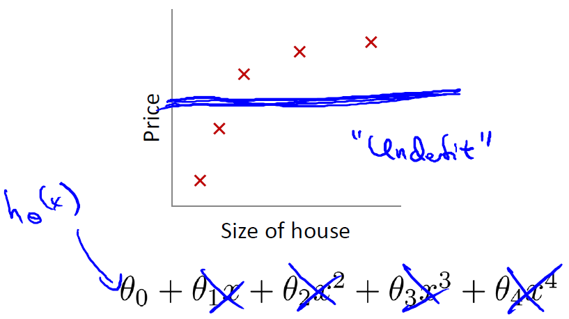

# Regularization: Solving the Problem of Overfitting

## The Problem of Overfitting

### Lecture Notes

+ Example: Linear regression (housing prices)

    

    

    

    + __Overfitting__: if we have too many features, the learned hypothesis may fit the training set very well ( $J(\theta) = \frac{1}{2m} \sum_{i=1}^m (h_\theta(x^{(i)}) - y^{(i)})^2 \approx 0$ ), but fail to generalize to new examples (predict prices on new examples).

+ Example Logistic regression

    

    

    

    + IVQ: Consider the medical diagnosis problem of classifying tumors as malignant or benign. If a hypothesis $h_\theta(x)$ has overfit the training set, it means that:
        1. It makes accurate predictions for examples in the training set and generalizes well to make accurate predictions on new, previously unseen examples.
        2. It does not make accurate predictions for examples in the training set, but it does generalize well to make accurate predictions on new, previously unseen examples.
        3. It makes accurate predictions for examples in the training set, but it does not generalize well to make accurate predictions on new, previously unseen examples.
        4. It does not make accurate predictions for examples in the training set and does not generalize well to make accurate predictions on new, previously unseen examples.

        Ans: 3

+ Addressing overfitting
  + Example: house prices

    $$\begin{array}{ccl} x_1 &=& \text{size of house} \\ x_2 &=& \text{no. of bedrooms} \\ x_3 &=& \text{no. of floors} \\ x_4 &=& \text{age of house} \\ x_5 &=& \text{average income in neighborhood}  \\ x_6 &=& \text{kitchen size} \\ \vdots & & \\ x_{100} \end{array}$$
  + Options:
    1) Reduce number if features
        + Manually select which features to keep.
        + Model selection algorithm
    2) Regularization
        + Keep all the features, but reduce magnitude/values of parameters $\theta_j$
        + Works well when we have a lot fo features, each of which contributes a bit to predicting $y$

-------------------------------------------

Consider the problem of predicting y from $x \in R$. The leftmost figure below shows the result of fitting a $y = \theta_0 + \theta_1 x$ to a dataset. We see that the data doesn’t really lie on straight line, and so the fit is not very good.

  

Instead, if we had added an extra feature $x^2$, and fit $y = \theta_0 + \theta_1x + \theta_2x^2$, then we obtain a slightly better fit to the data (See middle figure). Naively, it might seem that the more features we add, the better. However, there is also a danger in adding too many features: The rightmost figure is the result of fitting a $5^{th}$ order polynomial $y = \sum_{j=0}^5 \theta_j x^j$. We see that even though the fitted curve passes through the data perfectly, we would not expect this to be a very good predictor of, say, housing prices ($y$) for different living areas ($x$). Without formally defining what these terms mean, we’ll say the figure on the left shows an instance of __underfitting__ — in which the data clearly shows structure not captured by the model—and the figure on the right is an example of __overfitting__.

__Underfitting__, or __high bias__, is when the form of our hypothesis function $h$ maps poorly to the trend of the data. It is usually caused by a function that is too simple or uses too few features. At the other extreme, __overfitting__, or __high variance__, is caused by a hypothesis function that fits the available data but does not generalize well to predict new data. It is usually caused by a complicated function that creates a lot of unnecessary curves and angles unrelated to the data.

This terminology is applied to both linear and logistic regression. There are two main options to address the issue of overfitting:

1) Reduce the number of features:
    + Manually select which features to keep.
    + Use a model selection algorithm (studied later in the course).
2) Regularization
    + Keep all the features, but reduce the magnitude of parameters $\theta_j$.
    + Regularization works well when we have a lot of slightly useful features.

### Lecture Video

<video src="https://d3c33hcgiwev3.cloudfront.net/07.1-Regularization-TheProblemOfOverfitting.77a5cd10b22b11e4960bf70a8782e569/full/360p/index.mp4?Expires=1553472000&Signature=Sr4hYEk8P0PGmwM2ptEKWQN6n~ZCz58kydPUmN42ulWCRL4FZtA2me~bJ~6qMbc4TMGzdvYOulyoI8Muo8CKYoztzhDLjxCUVs8LocLQTiN1xsoCjTcV61j5Ggy1NrP242Cxp92~2KlsIgWlvI8hmSOU8NBE2O4fgIObtd3QG1M_&Key-Pair-Id=APKAJLTNE6QMUY6HBC5A" preload="none" loop="loop" controls="controls" style="margin-left: 2em;" muted="" poster="http://www.multipelife.com/wp-content/uploads/2016/08/video-converter-software.png" width="180">
  <track src="https://www.coursera.org/api/subtitleAssetProxy.v1/I9_Ji7BbRTqfyYuwW-U6yA?expiry=1553472000000&hmac=YD9bLbaAn1lVKjoxv5ks4JHCagPCxjw0w4dFMWJiFjI&fileExtension=vtt" kind="captions" srclang="en" label="English" default>
  Your browser does not support the HTML5 video element.
</video>
 

## Cost Function

### Lecture Notes

+ Intution

    

    

    

    + Suppose we penalize and make $\theta_3, \theta_4$ really small

        $$\min_{\theta} \dfrac{1}{2m}\sum_{i=1}^m (h_\theta(x^{(i)}) - y^{(i)})^2 + 1000\cdot\theta_3^2 + 1000\cdot\theta_4^2 \quad \Longrightarrow \quad \theta_3 \approx 0 \;\; \theta_4 \approx 0$$

+ Regularization
  + Small values for parameters $\theta_0, \theta_1, \ldots, \theta_n$
    + "Simpler" hypothesis
    + Less prone to overfitting (e.g. $\theta_3 \approx 0, \;\; \theta_4 \approx 4$)
  + Example: Housing
    + Features: $x_1, x_2, \ldots, x_{100}$
    + parameters: $\theta_0, \theta_1, \theta_2, \ldots, \theta_{100}$

    $$J(\theta) = \dfrac{1}{2m} \left[ \sum_{i=1}^m (h_\theta (x^{(i)}) - y^{(i)})^2 + \lambda \sum_{j=1}^n \theta_j^2 \right] \quad \Longrightarrow \quad \min_\theta J(\theta)$$

    + $\lambda\;$: regularization parameter
  + IVQ: In regularized linear regression, we choose $\theta$ to minimize:

    $$J(\theta) = \dfrac{1}{2m} \left[ \sum_{i=1}^m (h_\theta (x^{(i)}) - y^{(i)})^2 + \lambda \sum_{j=1}^n \theta_j^2 \right]$$

    What if $\lambda$ is set to an extremely large value (perhaps too large for our problem, say $\lambda=10^{10}$)?
    1. Algorithm works fine; setting $\lambda$ to be very large can't hurt it
    2. Algorithm fails to eliminate overfitting
    3. Algorithm results in underfitting. (Fails to fit even training data well)
    4. Gradient descent will fail to converge.

    Ans: 3

    

    

    

     

    $$n = m \quad \Longrightarrow \quad \theta_1 \approx 0, \;\theta_2 \approx 0, \;\theta_3 \approx 0, \;\theta_4 \approx 0 \quad \Longrightarrow \quad h_\theta(x) = \theta_0 \quad \Longrightarrow \quad \text{underfitting}$$

-------------------------------------------

If we have overfitting from our hypothesis function, we can reduce the weight that some of the terms in our function carry by increasing their cost.

Say we wanted to make the following function more quadratic:

$$\theta_0 + \theta_1x + \theta_2x^2 + \theta_3x^3 + \theta_4x^4$$

We'll want to eliminate the influence of $\theta_3x^3$ and $\theta_4x^4$. Without actually getting rid of these features or changing the form of our hypothesis, we can instead modify our __cost function__:

$$\min_{\theta} \dfrac{1}{2m}\sum_{i=1}^m (h_\theta(x^{(i)}) - y^{(i)})^2 + 1000\cdot\theta_3^2 + 1000\cdot\theta_4^2$$

We've added two extra terms at the end to inflate the cost of $\theta_3$ and $\theta_4$. Now, in order for the cost function to get close to zero, we will have to reduce the values of $\theta_3$ and $\theta_4$ to near zero. This will in turn greatly reduce the values of $\theta_3x^3$ and $\theta_4x^4$ in our hypothesis function. As a result, we see that the new hypothesis (depicted by the pink curve) looks like a quadratic function but fits the data better due to the extra small terms $\theta_3x^3$ and $\theta_4x^4$.

  

We could also regularize all of our theta parameters in a single summation as:

$$\min_\theta\ \dfrac{1}{2m}\ \sum_{i=1}^m (h_\theta(x^{(i)}) - y^{(i)})^2 + \lambda\ \sum_{j=1}^n \theta_j^2$$
​
The $\lambda$, or lambda, is the __regularization parameter__. It determines how much the costs of our theta parameters are inflated.

Using the above cost function with the extra summation, we can smooth the output of our hypothesis function to reduce overfitting. If lambda is chosen to be too large, it may smooth out the function too much and cause underfitting. Hence, what would happen if $\lambda = 0$ or is too small ?

### Lecture Video 

<video src="https://d3c33hcgiwev3.cloudfront.net/07.2-Regularization-CostFunction.c0929fd0b22b11e495a62138f9b52d3f/full/360p/index.mp4?Expires=1553472000&Signature=H4Ggi7y09dO3AUBDCqrufPEY50tfgBmf0TNjL55JH5h0-A~kwbIyMxFSxVHq5vGpcxD0VHp153AcCMyMMYjQSAdu8HolKUyd5lQ1GWNZAEANxiB13p2fxZ~g4jPatq~nHiF630LLTJhWKNveunk6iPfnXR5oDaewKCCez9cLp-U_&Key-Pair-Id=APKAJLTNE6QMUY6HBC5A" preload="none" loop="loop" controls="controls" style="margin-left: 2em;" muted="" poster="http://www.multipelife.com/wp-content/uploads/2016/08/video-converter-software.png" width="180">
  <track src="https://www.coursera.org/api/subtitleAssetProxy.v1/l93kCv8tR0Od5Ar_LRdDcg?expiry=1553472000000&hmac=kPOjGvyJ34rw1dyZYbJn9_K9xH80wpSe8matOvT7lvM&fileExtension=vtt" kind="captions" srclang="en" label="English" default>
  Your browser does not support the HTML5 video element.
</video>
 

## Regularized Linear Regression

### Lecture Notes

+ Regularization linear regression

  $$J(\theta) = \dfrac{1}{2m} \left[ \sum_{i=1}^m (h_\theta (x^{(i)}) - y^{(i)})^2 + \lambda \sum_{j=1}^n \theta_j^2 \right] \quad \Longrightarrow \quad \min_\theta J(\theta)$$

+ Gradient Descent

  Repeat {
  
    $$\begin{array}{rcl} \theta_0 &:=& \theta_0 − \alpha \dfrac{1}{m} \sum_{i=1}^m (h_\theta(x^{(i)}) − y^{(i)}) x^{(i)}_0 \\\\  \theta_j &:=& \theta_j − \alpha \left[(\dfrac{1}{m} \sum_{i=1}^m (h_\theta(x^{(i)})−y^{(i)})x^{(i)}_j) + \dfrac{\lambda}{m} \theta_j \right] \quad\quad j \in \{1,2\ldots n\} \end{array}$$
  }

  $$\theta_j := \underbrace{\theta_j (1 - \alpha \dfrac{\lambda}{m})}_{ \approx \theta_j, \text{ eg. }\theta_j \times 0.99} - \underbrace{\alpha \dfrac{1}{m} \sum_{i=1}^m (h_\theta(x^{(i)}) - y^{(i)})x^{(i)}}_{\text{same as } J(\theta)}$$

  + IVQ: Suppose you are doing gradient descent on a training set of $m > 0$ examples, using a fairly small learning rate $\alpha > 0$ and some regularization parameter $\lambda > 0$. Consider the update rule:

    $$\theta_j := \theta_j (1 - \alpha \dfrac{\lambda}{m}) - \alpha \dfrac{1}{m} \sum_{i=1}^m (h_\theta(x^{(i)}) - y^{(i)})x^{(i)}$$

    Which of the following statements about the term $(1-\alpha\frac{\lambda}{m})$ must be true?
      1. $1-\alpha\frac{\lambda}{m} > 1$
      2. $1-\alpha\frac{\lambda}{m} = 1$
      3. $1-\alpha\frac{\lambda}{m} < 1$
      4. None of the above.

      Ans: 3, e.g. $(1-\alpha \dfrac{\lambda}{m} = 0.99$)

+ Normal Equation

  $$X = \underbrace{\begin{bmatrix}(x^{(1)})^T \\ \vdots \\ (x^{(m)})^T \end{bmatrix}}_{m \times (n+1) \text{ matrix}} \qquad\qquad y = \underbrace{\begin{bmatrix} y^{(1)} \\ \vdots \\ y^{(m)} \end{bmatrix}}_{\in \mathbb{R}^m}$$

  To $\min_\theta J(\theta) \qquad \Longrightarrow \qquad \text{(set) }\dfrac{\partial}{\partial \theta_j} J(\theta) = 0$,

  $$\theta = \left(X^TX + \lambda \underbrace{\begin{bmatrix} 0 & & & & \\ & 1 & & & \\ & & 1 & & \\ & & & \ddots & \\ & & & & 1\end{bmatrix}}_{(n+1) \times (n+1) \text{ matrix}} \right)^{-1} X^Ty$$

+ Non-invertibility

  Suppose $m \leq n$, $m$ as the number of examples and $n$ as the number of features

  $$\theta = (X^TX)^{-1}X^T y$$

  where $((X^TX)^{-1}$ is non-invertible / singular.

  If $\lambda > 0$, the regularization will solve the non-invertible issue, 

  $$\theta = \left(\underbrace{X^TX + \lambda \begin{bmatrix} 0 & & & & \\ & 1 & & & \\ & & 1 & & \\ & & & \ddots & \\ & & & & 1\end{bmatrix}}_{invertible} \right)^{-1} X^Ty$$

-------------------------------------------

We can apply regularization to both linear regression and logistic regression. We will approach linear regression first.

__Gradient Descent__

We will modify our gradient descent function to separate out $\theta_0$ from the rest of the parameters because we do not want to penalize $\theta_0$.

&nbsp;&nbsp;&nbsp;&nbsp;Repeat {
  
$$\begin{array}{rcl} \theta_0 &:=& \theta_0 − \alpha \dfrac{1}{m} \sum_{i=1}^m (h_\theta(x^{(i)}) − y^{(i)}) x^{(i)}_0 \\\\  \theta_j &:=& \theta_j − \alpha [(\dfrac{1}{m} \sum_{i=1}^m (h_\theta(x^{(i)})−y^{(i)})x^{(i)}_j) + \dfrac{\lambda}{m} \theta_j] \quad\quad j \in \{1,2\ldots n\} \end{array}$$
&nbsp;&nbsp;&nbsp;&nbsp;}

The term $\frac{\lambda}{m}\theta_j$ performs our regularization. With some manipulation our update rule can also be represented as:

$$\theta_j := \theta_j(1 - \alpha\frac{\lambda}{m}) - \alpha\frac{1}{m}\sum_{i=1}^m(h_\theta(x^{(i)}) - y^{(i)})x_j^{(i)}$$

The first term in the above equation, $1 - \alpha\frac{\lambda}{m}$ will always be less than 1. Intuitively you can see it as reducing the value of $\theta_j$ by some amount on every update. Notice that the second term is now exactly the same as it was before.

__Normal Equation__

Now let's approach regularization using the alternate method of the non-iterative normal equation.

To add in regularization, the equation is the same as our original, except that we add another term inside the parentheses:

$$\theta = (X^TX + λ \cdot L)^{−1} X^T y \quad\quad \text{where} \quad L = \begin{bmatrix} 0 & & & & \\ & 1 & & & \\ & & 1 & & \\ & & & \ddots & \\ & & & & 1 \end{bmatrix}$$

$L$ is a matrix with 0 at the top left and 1's down the diagonal, with 0's everywhere else. It should have dimension $(n+1)\times(n+1)$. Intuitively, this is the identity matrix (though we are not including $x_0$), multiplied with a single real number $\lambda$.

Recall that if $m < n$, then $X^TX$ is non-invertible. However, when we add the term $\lambda \cdot L$, then $X^TX + \lambda \cdot L$ becomes invertible.

### Lecture Video 

<video src="https://d3c33hcgiwev3.cloudfront.net/07.3-Regularization-RegularizedLinearRegression.58149800b22b11e4901abd97e8288176/full/360p/index.mp4?Expires=1553472000&Signature=lEjru-a2jgY9qE4QOd6GyRd03IZwDhEO-PFksr26ryoQxgwrmZHB~bot~Yag0NbWOage0KvrspAf52BeIydcU7AcwGvAzu2TIpt93tT1Bph5irZAK5xiv6Jq6Fuoju2cYZN7rq7z0FL0T1L~Wv8IQ1K83~bcOhQ-lkcvSIHFYmM_&Key-Pair-Id=APKAJLTNE6QMUY6HBC5A" preload="none" loop="loop" controls="controls" style="margin-left: 2em;" muted="" poster="http://www.multipelife.com/wp-content/uploads/2016/08/video-converter-software.png" width="180">
  <track src="https://www.coursera.org/api/subtitleAssetProxy.v1/MJwHwFDaSbicB8BQ2tm4KQ?expiry=1553472000000&hmac=2nad3YHoKxRbVMCpMDH7BSyaYUKjPvArbajRk2l28f4&fileExtension=vtt" kind="captions" srclang="en" label="English" default>
  Your browser does not support the HTML5 video element.
</video>
 

## Regularized Logistic Regression

### Lecture Notes

+ Regularization logistic regression

  

    

  

  Hypothesis: 

  $$h_\theta(x) = g(\theta_0 + \theta_1 x_1 + \theta_2 x_1^2 + \theta_3 x_1^2x_2 + \theta_4 x_1^2 x_2^2 + \theta_5 x_1^2 x_2^3 + \ldots)$$

  Cost Function

  $$J(\theta) = - \frac{1}{m} \sum_{i=1}^m \left[ y^{(i)}\ \log (h_\theta (x^{(i)})) + (1 - y^{(i)})\ \log (1 - h_\theta(x^{(i)}))\right] + \frac{\lambda}{2m}\sum_{j=1}^n \theta_j^2$$

+ Gradient Descent

  Repeat {

    $$\begin{array}{rcl} \theta &:=& \theta_0 - \alpha \dfrac{1}{m} \sum_{i=1}^m (h_\theta(x^{(i)}) - y^{(i)}) - y^{(i)}) x_0^{(i)} \\\\ \theta_j &:=& \theta_j - \alpha \underbrace{ \left[\dfrac{1}{m} \sum_{i=1}^m (h_\theta(x^{(i)}) - y^{(i)}) x_j^{(i)} + \dfrac{\lambda}{m} \theta_j \right] }_{\frac{\partial}{\partial \theta_j} J(\theta) = 0}\qquad (j = 1, 2, 3, \ldots, n)  \end{array}$$
  }

  For logistic regression 

  $$h_\theta(x) = \dfrac{1}{1 + e^{-\theta^Tx}}$$

  + IVQ: When using regularized logistic regression, which of these is the best way to monitor whether gradient descent is working correctly?
    1. Plot $-[\frac{1}{m}\sum_{i=1}^m y^{(i)}\log h_\theta(x^{(i)}) + (1-y^{(i)})\log(1-h_\theta(x^{(i)}))]$ as a function of the number of iterations and make sure it's decreasing.
    2. Plot $-[\frac{1}{m}\sum_{i=1}^m y^{(i)}\log h_\theta(x^{(i)}) + (1-y^{(i)})\log(1-h_\theta(x^{(i)}))] - \frac{\lambda}{2m}\sum_{j=1}^n\theta_j^2$ as a function of the number of iterations and make sure it's decreasing.
    3. Plot $-[\frac{1}{m}\sum_{i=1}^m y^{(i)}\log h_\theta(x^{(i)}) + (1-y^{(i)})\log(1-h_\theta(x^{(i)}))] + \frac{\lambda}{2m}\sum_{j=1}^n\theta_j^2$ as a function of the number of iterations and make sure it's decreasing.
    4. Plot $\sum_{j=1}^n\theta_j^2$ as a function of the number of iterations and make sure it's decreasing.

    Ans: 3

+ Advanced optimization

  fucntion [jVal, gradient] = costFunction(theta) 
    &nbsp;&nbsp;&nbsp;&nbsp;&nbsp;&nbsp;&nbsp;&nbsp;jVal = [code to compute $J(\theta)$];  
    &nbsp;&nbsp;&nbsp;&nbsp;&nbsp;&nbsp;&nbsp;&nbsp;gradient(1) = [code to computer $\dfrac{\partial}{\partial \theta_0} J(\theta)$];  
    &nbsp;&nbsp;&nbsp;&nbsp;&nbsp;&nbsp;&nbsp;&nbsp;gradient(2) = [code to computer $\dfrac{\partial}{\partial \theta_1} J(\theta)$];  
    &nbsp;&nbsp;&nbsp;&nbsp;&nbsp;&nbsp;&nbsp;&nbsp;gradient(3) = [code to computer $\dfrac{\partial}{\partial \theta_2} J(\theta)$];  
    &nbsp;&nbsp;&nbsp;&nbsp;&nbsp;&nbsp;&nbsp;&nbsp;&nbsp;&nbsp;&nbsp;&nbsp;&nbsp;&nbsp;&nbsp;&nbsp; $\vdots$  
    &nbsp;&nbsp;&nbsp;&nbsp;&nbsp;&nbsp;&nbsp;&nbsp;gradient(n+1) = [code to computer $\dfrac{\partial}{\partial \theta_n} J(\theta)$];  

  where

  $$\begin{array}{rcl} J(\theta) & = & \left[ -\dfrac{1}{m} \sum_{i=1}^m y^{(i)} \log(h_\theta(x^{(i)} + (1-y^{(i)}) \log(1 - h_\theta(x^{(i)})) \right] + \dfrac{\lambda}{2m} \theta_j^2 \\\\ \dfrac{\partial}{\partial \theta_0} J(\theta) & = & \dfrac{1}{m} \sum_{i=1}^m (h_\theta(x^{(i)}) - y^{(i)})x_0^{(i)} \\\\ \dfrac{\partial}{\partial \theta_j} J(\theta) & = & \dfrac{1}{m} \sum_{i=1}^m (h_\theta(x^{(i)}) - y^{(i)})x_j^{(i)} - \dfrac{\lambda}{m} \theta_j \qquad j = 1, 2, \ldots, n\end{array}$$

-------------------------------------------

We can regularize logistic regression in a similar way that we regularize linear regression. As a result, we can avoid overfitting. The following image shows how the regularized function, displayed by the pink line, is less likely to overfit than the non-regularized function represented by the blue line:

  

__Cost Function__

Recall that our cost function for logistic regression was:

$$J(\theta) = - \frac{1}{m} \sum_{i=1}^m \left[ y^{(i)}\ \log (h_\theta (x^{(i)})) + (1 - y^{(i)})\ \log (1 - h_\theta(x^{(i)})) \right]$$

We can regularize this equation by adding a term to the end:

$$J(\theta) = - \frac{1}{m} \sum_{i=1}^m \left[ y^{(i)}\ \log (h_\theta (x^{(i)})) + (1 - y^{(i)})\ \log (1 - h_\theta(x^{(i)}))\right] + \frac{\lambda}{2m}\sum_{j=1}^n \theta_j^2$$
​	 
The second sum, $\sum_{j=1}^n \theta_j^2$ means to explicitly exclude the bias term, $\theta_0$. I.e. the θ vector is indexed from $\theta$ to $n$ (holding $n+1$ values, $\theta_0$ through $\theta_n$), and this sum explicitly skips $\theta_0$, by running from 1 to n, skipping 0. Thus, when computing the equation, we should continuously update the two following equations:

  

### Lecture Video 

<video src="https://d3c33hcgiwev3.cloudfront.net/07.4-Regularization-RegularizedLogisticRegression.3f6ca4a0b22b11e4960bf70a8782e569/full/360p/index.mp4?Expires=1553472000&Signature=fROmQFcj28xdrQiAqpnG99lJabzS2NeISB71G021NyREiWkKbD0XiNp86iZ74Axv22Fnz2MPiPaz0Sl8q1JYkeF89Atj3HX4f1tBOhEjejXUurf3nAg3Bbvrt-2nF5C2reQC8-Reixrgk4pY5tqcHEvTG8amApCY3HlcfO7bDjY_&Key-Pair-Id=APKAJLTNE6QMUY6HBC5A" preload="none" loop="loop" controls="controls" style="margin-left: 2em;" muted="" poster="http://www.multipelife.com/wp-content/uploads/2016/08/video-converter-software.png" width="180">
  <track src="https://www.coursera.org/api/subtitleAssetProxy.v1/WR9QkNvBQ4-fUJDbwbOPUw?expiry=1553472000000&hmac=hEVwgLBgV1w2mtaLegXk5fT2uN3D3BpY3O4h0MewGXg&fileExtension=vtt" kind="captions" srclang="en" label="English" default>
  Your browser does not support the HTML5 video element.
</video>
 
 

## Review

### Lecture Slides

#### The Problem of Overfitting

Regularization is designed to address the problem of overfitting.

__High bias__ or __underfitting__ is when the form of our hypothesis function $h$ maps poorly to the trend of the data. It is usually caused by a function that is too simple or uses too few features. eg. if we take $h_\theta(x) = \theta_0 + \theta_1x_1 + \theta_2x_2$ then we are making an initial assumption that a linear model will fit the training data well and will be able to generalize but that may not be the case.

At the other extreme, __overfitting__ or __high variance__ is caused by a hypothesis function that fits the available data but does not generalize well to predict new data. It is usually caused by a complicated function that creates a lot of unnecessary curves and angles unrelated to the data.

This terminology is applied to both linear and logistic regression. There are two main options to address the issue of overfitting:

1) Reduce the number of features:
    1) Manually select which features to keep.
    2) Use a model selection algorithm (studied later in the course).
2) Regularization

Keep all the features, but reduce the parameters $\theta_j$.

Regularization works well when we have a lot of slightly useful features.

#### Cost Function

If we have overfitting from our hypothesis function, we can reduce the weight that some of the terms in our function carry by increasing their cost.

Say we wanted to make the following function more quadratic:

$$\theta_0 + \theta_1x + \theta_2x^2 + \theta_3x^3 + \theta_4x^4$$ 

We'll want to eliminate the influence of $\theta_3x^3$ and $\theta_4x^4$. Without actually getting rid of these features or changing the form of our hypothesis, we can instead modify our cost function:

$$\min_\theta\ \dfrac{1}{2m}\sum_{i=1}^m (h_\theta(x^{(i)}) - y^{(i)})^2 + 1000\cdot\theta_3^2 + 1000\cdot\theta_4^2$$

We've added two extra terms at the end to inflate the cost of $\theta_3$ and $\theta_4$. Now, in order for the cost function to get close to zero, we will have to reduce the values of $\theta_3$ and $\theta_4$ to near zero. This will in turn greatly reduce the values of $\theta_3x^3$ and $\theta_4x^4$ in our hypothesis function.

We could also regularize all of our theta parameters in a single summation:

$$\min_\theta\ \dfrac{1}{2m}\ \left[ \sum_{i=1}^m (h_\theta(x^{(i)}) - y^{(i)})^2 + \lambda\ \sum_{j=1}^n \theta_j^2 \right]$$

The $\lambda$, or lambda, is the __regularization parameter__. It determines how much the costs of our theta parameters are inflated. You can visualize the effect of regularization in this [interactive plot](https://www.desmos.com/calculator/1hexc8ntqp)

Using the above cost function with the extra summation, we can smooth the output of our hypothesis function to reduce overfitting. If lambda is chosen to be too large, it may smooth out the function too much and cause underfitting.

#### Regularized Linear Regression

We can apply regularization to both linear regression and logistic regression. We will approach linear regression first.

##### Gradient Descent

We will modify our gradient descent function to separate out $\theta_0$ from the rest of the parameters because we do not want to penalize $\theta_0$.

Repeat {
  
$$\begin{array}{rcl} \theta_0 & := & \theta_0 − \alpha \dfrac{1}{m} \sum_{i=1}^m (h_\theta(x^{(i)})−y^{(i)})x^{(i)}_0 \\\\ \theta_j & := & \theta_j − \alpha \left[ (\dfrac{1}{m} \displaystyle \sum_{i=1}^m (h_\theta(x^{(i)}) − y^{(i)}) x^{(i)}j) + \dfrac{λ}{m} \theta_j \right] \quad\quad  j \in \{1,2, \cdots, n\} \end{array}$$
}

The term $\frac{\lambda}{m} \theta_j$ performs our regularization.

With some manipulation our update rule can also be represented as:

$$\theta_j := \theta_j(1 - \alpha\frac{\lambda}{m}) - \alpha\frac{1}{m}\sum_{i=1}^m(h_\theta(x^{(i)}) - y^{(i)})x_j^{(i)}$$

The first term in the above equation, $1 - \alpha \frac{\lambda}{m}$ will always be less than 1. Intuitively you can see it as reducing the value of $\theta_j$ by some amount on every update.

Notice that the second term is now exactly the same as it was before.

##### Normal Equation

Now let's approach regularization using the alternate method of the non-iterative normal equation.

To add in regularization, the equation is the same as our original, except that we add another term inside the parentheses:

$$\theta = (X^TX + \lambda \cdot L)^{−1} X^Ty \quad\quad \text{ where } \quad L = \begin{bmatrix} 0 & & & & \\ & 1 & & & \\ & & 1 & & \\ & & & \ddots & \\ & & & & 1 \end{bmatrix}$$

$L$ is a matrix with 0 at the top left and 1's down the diagonal, with 0's everywhere else. It should have dimension $(n+1) \times (n+1)$. Intuitively, this is the identity matrix (though we are not including $x_0$), multiplied with a single real number $\lambda$.

Recall that if $m  \leq  n$, then $X^TX$ is non-invertible. However, when we add the term $λ \cdot L$, then $X^TX + λ \cdot L$ becomes invertible.

#### Regularized Logistic Regression

We can regularize logistic regression in a similar way that we regularize linear regression. Let's start with the cost function.

##### Cost Function

Recall that our cost function for logistic regression was:

$$J(\theta) = - \frac{1}{m} \sum_{i=1}^m \left[ y^{(i)}\ \log (h_\theta (x^{(i)})) + (1 - y^{(i)})\ \log (1 - h_\theta(x^{(i)})) \right]$$

We can regularize this equation by adding a term to the end:

$$J(\theta) = - \frac{1}{m} \sum_{i=1}^m \left[ y^{(i)} \log (h_\theta (x^{(i)})) + (1 - y^{(i)})\ \log (1 - h_\theta(x^{(i)})) \right] + \frac{\lambda}{2m}\sum_{j=1}^n \theta_j^2$$
​
__Note Well__: The second sum, $\sum_{j=1}^n \theta_j^2$ __means to explicitly exclude__ the bias term, $\theta_0$. I.e. the \theta vector is indexed from 0 to n (holding $n+1$ values, $\theta_0$ through $\theta_n$), and this sum explicitly skips $\theta_0$, by running from 1 to n, skipping 0.

##### Gradient Descent

Just like with linear regression, we will want to separately update $\theta_0$ and the rest of the parameters because we do not want to regularize $\theta_0$.

Repeat {
  
$$\begin{array}{rcl} \theta_0 & := & \theta_0−\alpha \dfrac{1}{m} \displaystyle \sum_{i=1}^m (h_\theta(x^{(i)}) − y^{(i)}) x^{(i)}_0 \\\\ \theta_j & := & \theta_j − \alpha \left[ (\dfrac{1}{m} \sum_{i=1}^m (h_\theta(x^{(i)}) − y^{(i)})x^{(i)}_j) + \dfrac{\lambda}{m} \theta_j \right] \quad\quad j \in \{1,2, \ldots, n\} \end{array}$$

}

This is identical to the gradient descent function presented for linear regression.

### Initial Ones Feature Vector

#### Constant Feature

As it turns out it is crucial to add a constant feature to your pool of features before starting any training of your machine. Normally that feature is just a set of ones for all your training examples.

Concretely, if $X$ is your feature matrix then $X_0$ is a vector with ones.

Below are some insights to explain the reason for this constant feature. The first part draws some analogies from electrical engineering concept, the second looks at understanding the ones vector by using a simple machine learning example.

#### Electrical Engineering

From electrical engineering, in particular signal processing, this can be explained as DC and AC.

The initial feature vector X without the constant term captures the dynamics of your model. That means those features particularly record changes in your output y - in other words changing some feature $X_i$ where $i \neq 0$ will have a change on the output $y$. AC is normally made out of many components or harmonics; hence we also have many features (yet we have one DC term).

The constant feature represents the DC component. In control engineering this can also be the steady state.

Interestingly removing the DC term is easily done by differentiating your signal - or simply taking a difference between consecutive points of a discrete signal (it should be noted that at this point the analogy is implying time-based signals - so this will also make sense for machine learning application with a time basis - e.g. forecasting stock exchange trends).

Another interesting note: if you were to play and AC+DC signal as well as an AC only signal where both AC components are the same then they would sound exactly the same. That is because we only hear changes in signals and $\Delta(AC+DC) = \Delta(AC)$.

#### Housing price example

Suppose you design a machine which predicts the price of a house based on some features. In this case what does the ones vector help with?

Let's assume a simple model which has features that are directly proportional to the expected price i.e. if feature Xi increases so the expected price y will also increase. So as an example we could have two features: namely the size of the house in [m2], and the number of rooms.

When you train your machine you will start by prepending a ones vector $X_0$. You may then find after training that the weight for your initial feature of ones is some value \theta0. As it turns, when applying your hypothesis function $h_{\theta}(X)$ - in the case of the initial feature you will just be multiplying by a constant (most probably $\theta_0$ if you not applying any other functions such as sigmoids). This constant (let's say it's $\theta_0$ for argument's sake) is the DC term. It is a constant that doesn't change.

But what does it mean for this example? Well, let's suppose that someone knows that you have a working model for housing prices. It turns out that for this example, if they ask you how much money they can expect if they sell the house you can say that they need at least $\theta_0$ dollars (or rands) before you even use your learning machine. As with the above analogy, your constant $\theta_0$ is somewhat of a steady state where all your inputs are zeros. Concretely, this is the price of a house with no rooms which takes up no space.

However this explanation has some holes because if you have some features which decrease the price e.g. age, then the DC term may not be an absolute minimum of the price. This is because the age may make the price go even lower.

Theoretically if you were to train a machine without a ones vector $f_{AC}(X)$, it's output may not match the output of a machine which had a ones vector $f_{DC}(X)$. However, $f_{AC}(X)$ may have exactly the same trend as $f_{DC}(X)$ i.e. if you were to plot both machine's output you would find that they may look exactly the same except that it seems one output has just been shifted (by a constant). With reference to the housing price problem: suppose you make predictions on two houses $house_A$ and $house_B$ using both machines. It turns out while the outputs from the two machines would different, the difference between houseA and houseB's predictions according to both machines could be exactly the same. Realistically, that means a machine trained without the ones vector $f_AC$ could actually be very useful if you have just one benchmark point. This is because you can find out the missing constant by simply taking a difference between the machine's prediction an actual price - then when making predictions you simply add that constant to what even output you get. That is: if $house_{benchmark}$ is your benchmark then the DC component is simply $price(house_{benchmark}) - f_{AC}(features(house_{benchmark}))$

A more simple and crude way of putting it is that the DC component of your model represents the inherent bias of the model. The other features then cause tension in order to move away from that bias position.

Kholofelo Moyaba

#### A simpler approach

A "bias" feature is simply a way to move the "best fit" learned vector to better fit the data. For example, consider a learning problem with a single feature $X_1$. The formula without the $X_0$ feature is just $theta_1 * X_1 = y$. This is graphed as a line that always passes through the origin, with slope y/theta. The $x_0$ term allows the line to pass through a different point on the y axis. This will almost always give a better fit. Not all best fit lines go through the origin $(0,0)$ right?

Joe Cotton

### Errata

#### The Problem of Overfitting

At 2:07, a curve is drawn using predicting function $\theta_0 + \theta_1 x + \theta_2 x^2$, which is said as "just right". But when size of house is large enough, the prediction of this function will increase much faster than linear if $\theta_2 > 0$, or will decrease to $−\infty$ if $\theta_2 < 0$, which neither could correspond to reality. Instead, $\theta_0+\theta_1 x+\theta_2 \sqrt{x}$ may be "just right".

At 2:28, a curve is drawn using a quartic (degree 4) polynomial predicting function $\theta_0+\theta_1 x+\theta_2 x^2 +\theta_3 x^3 +\theta_4 x^4$; however, the curve drawn is at least quintic (degree 5).

#### Cost Function

In the video at 5:17, the sum of the regularization term should use 'j' instead of 'i', giving $\sum_{j=1}^{n} \theta _j ^2$ instead of $\sum_{i=1}^{n} \theta _j ^2$.

#### Regularized linear regression

In the video starting at 8:04, Prof Ng discusses the Normal Equation and invertibility. He states that $X$ is non-invertible if $m \leq$. The correct statement should be that $X$ is non-invertible if $m < n$, and may be non-invertible if $m = n$.

#### Regularized logistic regression

In the video at 3:52, the lecturer mistakenly said "gradient descent for regularized linear regression". Indeed, it should be "gradient descent for regularized logistic regression".

In the video at 5:21, the cost function is missing a pair of parentheses around the second log argument. It should be $J(\theta)=J(\theta)=[−\frac{1}{m} \sum^m{i=1} y^{(i)} \log(h_\theta(x^{(i)})+(1−y^{(i)}) \log(1−h_\theta(x^{(i)}))]+ \frac{\lambda}{2m} \sum^n_{j=1} \theta^2_j$

In the original videos for the course (ML-001 through ML-008), there were typos in the equation for regularized logistic regression in both the video lecture and the PDF lecture notes. In the slides for "Gradient descent" and "advanced optimization", there should be positive signs for the regularization term of the gradient. The formula on page 10 of 'ex2.pdf' is correct. These issues in the video were corrected for the 'on-demand' format of the course.

#### Quizzes

+ Typo "it's" in question «Because logistic regression outputs values $0 \leq h_\theta(x) \leq 1$, it's range [...]»
+ $\frac{1}{m}$ factor missing in the definition of the gradient in question «For logistic regression, the gradient is given by $\frac{\partial}{\partial \theta_j} J(θ) = \sum^m_{i=1}$. It should be $\frac{\partial}{\partial \theta_j} J(θ) = \frac{1}{m} \sum^m_{i=1}$.

### Quiz: Regularization

1. You are training a classification model with logistic regression. Which of the following statements are true? Check all that apply.

    1. Adding many new features to the model helps prevent overfitting on the training set.
    2. Adding a new feature to the model always results in equal or better performance on the training set.
    3. Introducing regularization to the model always results in equal or better performance on examples not in the training set.
    4. Introducing regularization to the model always results in equal or better performance on the training set.

    Ans: 2, x23

2. Suppose you ran logistic regression twice, once with $\lambda = 0$, and once with $\lambda = 1$. One of the times, you got parameters $\theta=\begin{bmatrix}23.4\\37.9\end{bmatrix}$, and the other time you got $\theta=\begin{bmatrix}1.03\\0.28\end{bmatrix}$. However, you forgot which value of $\lambda$ corresponds to which value of $\theta$. Which one do you think corresponds to $\lambda = 1$?

    1. $\theta=\begin{bmatrix}23.4\\37.9\end{bmatrix}$
    2. $\theta=\begin{bmatrix}1.03\\0.28\end{bmatrix}$

    Ans: 2

3. Which of the following statements about regularization are true? Check all that apply.

    1. Using a very large value of $\lambda$ cannot hurt the performance of your hypothesis; the only reason we do not set $\lambda$ to be too large is to avoid numerical problems.
    2. Using too large a value of $\lambda$ can cause your hypothesis to overfit the data; this can be avoided by reducing $\lambda$.
    3. Because logistic regression outputs values $\leq h_\theta(x) \leq 1$, it's range of output values can only be "shrunk" slightly by regularization anyway, so regularization is generally not helpful for it.
    4. Consider a classification problem. Adding regularization may cause your classifier to incorrectly classify some training examples (which it had correctly classified when not using regularization, i.e. when $\lambda = 0$).
    5. Because regularization causes $J(\theta)$ to no longer be convex, gradient descent may not always converge to the global minimum (when $\lambda > 0$, and when using an appropriate learning rate $\alphaα$).
    6. Using too large a value of $\lambda$ can cause your hypothesis to underfit the data.

    Ans: 6(1563), x14(1234)

4. In which one of the following figures do you think the hypothesis has overfit the training set?

    

      

    

    Ans: 1

5. In which one of the following figures do you think the hypothesis has underfit the training set?

    

      

    

    Ans: x3, x4

