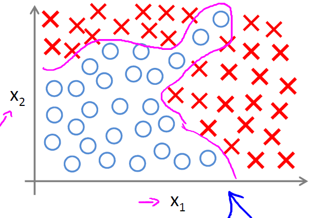
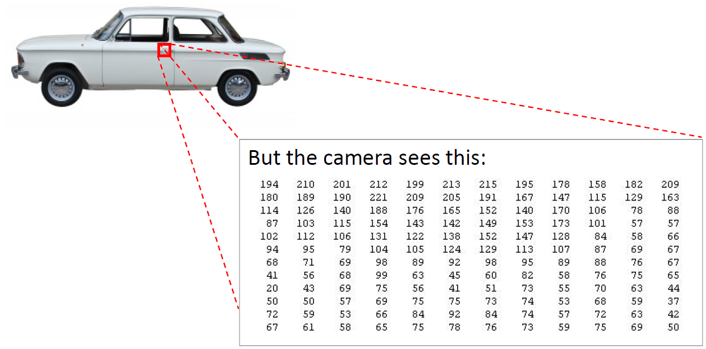
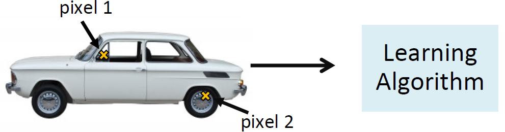
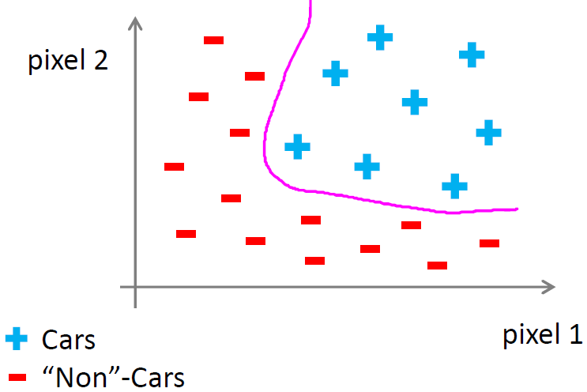
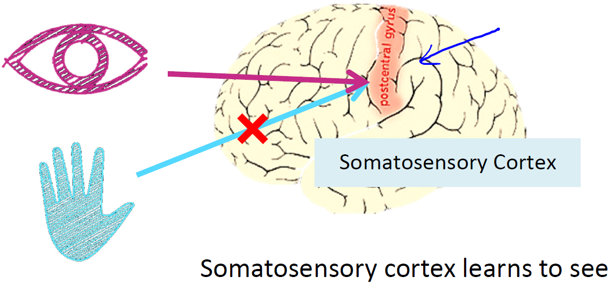

# Neural Networks: Representation

## Non-linear Hypotheses

#### Lecture Notes

+ Non-linear Classification
  

    

  

  $$g(\theta_0 + \theta_1 x_1 + \theta_2 x_2 + \theta_3 x_1x_2 + \theta_4 x_1^2x_2 + \theta_5 x_1^3x_2 + \theta_6 x_1x_2^2 + \ldots)$$

  For $n = 100, x_1, x_2, \ldots, x_{100}$
  + $x_1^2, x_1x_2, x_1, x_3, \ldots, x_1x_{100}, x_2^2, x_2x_3, \ldots \approx \frac{n^2}{2} \approx 5000$ features $\quad \Rightarrow \mathcal{O}(n^2)$
  + $x_1^2, x_2^2, \ldots, x_{100}^2 \Rightarrow 100$ features, but not good enough
  + $x_1x_2x_3, x_1^2x_2, X_{10}x_{11}x_{17}, \ldots \approx 170,000 \quad\Rightarrow \mathcal{O}(n^3)$

+ Computer Vision: Car Detection
  + What is this?
    

      

    

  + Testing
    

      

    

  + $50 \times 50$ pixel images $\rightarrow 2500$ pixels, $\;\;\therefore n=2500$, (if RGB, $n=7500$)

    $$x = \begin{bmatrix} \text{pixel 1 intensity} \\ \text{pixel 2 intensity} \\ \vdots \\ \text{pixel 2500 intensity}\end{bmatrix}$$

  + Quadratic features $(x_i \times x_j): \;\approx 3$ million features
  + IVQ: Suppose you are learning to recognize cars from $100 \times 100$ pixel images (grayscale, not RGB). Let the features be pixel intensity values. If you train logistic regression including all the quadratic terms ($x_ix_j$) as features, about how many features will you have?

    1) 5,000
    2) 100,000
    3) 50 million ($5\times10^7$)
    4) 5 billion ($5\times10^9$)

    Ans: 3

#### Lecture Video

<video src="https://d3c33hcgiwev3.cloudfront.net/08.1-NeuralNetworksRepresentation-NonLinearHypotheses-new.8f376d70b23611e4aca907c8d9623f2b/full/360p/index.mp4?Expires=1553904000&Signature=jIpXIeyhNzV1xzu8Af7kn1e-lqmIUZwA9l47EsaC0-22Ku4wJaEHrz7Zacpi-z0n4x8IWoSPWpaiZ8eqFr4X0KSK1paY1aB1CyfsHmdtVOCASKcLnbjf5A~mcTsLqNry6C9RoJOFOxaUHpBhrMmRsETj0ScEHE3WJ6u21WK7Kvc_&Key-Pair-Id=APKAJLTNE6QMUY6HBC5A" preload="none" loop="loop" controls="controls" style="margin-left: 2em;" muted="" poster="http://www.multipelife.com/wp-content/uploads/2016/08/video-converter-software.png" width="180">
  <track src="https://www.coursera.org/api/subtitleAssetProxy.v1/RVjTsODRQpKY07Dg0UKSYw?expiry=1553904000000&hmac=TQ7KpcmTUiBmm6ddadPcBBgWISYhHc83gOzbMLK3e4U&fileExtension=vtt" kind="captions" srclang="en" label="English" default>
  Your browser does not support the HTML5 video element.
</video>
 

## Motivations

#### Lecture Notes

+ Neural Networks
  + Origins: algorithms that try to mimic the brain
  + Was very widely used in 80s and early 90s; popularity diminished in late 90s
  Recently resurgence: state-of-the-art technique for many applications

+ The "one-learning algorithm" hypothesis
  

    

  

+ Sensor representations in the brain
  

    

  

#### Lecture Video

<video src="https://d3c33hcgiwev3.cloudfront.net/08.2-NeuralNetworksRepresentation-NeuronsAndTheBrain.665ce7a0b22b11e4a416e948628da1fd/full/360p/index.mp4?Expires=1553990400&Signature=R~pbckkkgDeghLpb1Fz5Bnrq6YLq5FSwYi2Rors55ynpqjbnsJrNZV~dZLdjuVniwgXUzDx46ce4-wECRPb35UDnx67TN~Hco~K2RQM0UzX1fvnxzbTcqzt6cw05Jk4sN7qY-udNxyknVSj7eJBczu4tilOAbfOqh7XAt94YML4_&Key-Pair-Id=APKAJLTNE6QMUY6HBC5A" preload="none" loop="loop" controls="controls" style="margin-left: 2em;" muted="" poster="http://www.multipelife.com/wp-content/uploads/2016/08/video-converter-software.png" width="180">
  <track src="https://www.coursera.org/api/subtitleAssetProxy.v1/QLlvC9RcRC65bwvUXOQu7Q?expiry=1553990400000&hmac=3VftAYM0KkFeqHVdbbUw8Clh6ZQfMyXCZg2aM53ks1w&fileExtension=vtt" kind="captions" srclang="en" label="English" default>
  Your browser does not support the HTML5 video element.
</video>
 

### Neurons and the Brain

#### Lecture Notes

+ Neuron in the brain
  + Many neurons in our brain
  + Dendrite: receive input (input wire)
  + Axon: produce output (output wire)
    + When it sends a message through the Axon to another neuron
    + It sends to another neuron’s Dendrite

  

    

    

  

+ Neuron model: Logistic unit
  + Yellow circle: body of neuron
  + Input wires: dendrites
  + Output wire: axon
  + bias unit: $x_0 = 1$

  

    

  

#### Lecture Video

<video src="https://d3c33hcgiwev3.cloudfront.net/08.3-NeuralNetworksRepresentation-ModelRepresentationI.d459a4a0b22b11e4beb61117ba5cda9e/full/360p/index.mp4?Expires=1553990400&Signature=eIyPsLn~9jx077ANvwDn3ahj4Hx0n2xowRge8qLJkP5dNoYyimBHM-~IMq1X3zS889LewIcRJGj6rz~byVdeWASa-OBbK2ldSRqRRu2ttb0f7muPOa1qtkhUd5ALBDN3v4Cf9oQAEzBSJfnizlx-WnMv6323js3XhYC5aVHcxko_&Key-Pair-Id=APKAJLTNE6QMUY6HBC5A" preload="none" loop="loop" controls="controls" style="margin-left: 2em;" muted="" poster="http://www.multipelife.com/wp-content/uploads/2016/08/video-converter-software.png" width="180">
  <track src="https://www.coursera.org/api/subtitleAssetProxy.v1/dOF88pENQ5qhfPKRDaOaXg?expiry=1553990400000&hmac=-p6XBsD1_i5G3pSnGK2Xtja2RWKjxMuSb8w63DhaZyE&fileExtension=vtt" kind="captions" srclang="en" label="English" default>
  Your browser does not support the HTML5 video element.
</video>
 

## Neural Networks

### Model Representation I

#### Lecture Notes

+ Neural Network - 3 layers
  + 1 Layer: input layer
  + 2 Layer: hidden layer
    + Unable to observe values
    + Anything other than input or output layer
  + 3 Layer: output layer

  

    

    

  

   

    $$\begin{array}{rcccl} & & a^{(2)}_1 &=& g(\Theta^{(1)}_{10} x_ 0 + \Theta^{(1)}_{11} x_1 + \Theta^{(1)}_{12} x_2 + \Theta^{(1)}_{13} x_3) \\\\ & & a^{(2)}_2 &=& g(\Theta^{(1)}_{20} x_0 + \Theta^{(1)}_{21} x_1 + \Theta^{(1)}_{22} x_2 + \Theta^{(1)}_{23} x_3) \\\\ & & a^{(2)}_3 &=& g(\Theta^{(1)}_{30} x_0 + \Theta^{(1)}_{31} x_1 + \Theta^{(1)}_{32} x_2 + \Theta^{(1)}_{33} x_3) \\\\ h_\theta(x) &=& a^{(3)}_1 & = & g(\Theta^{(2)}_{10} a^{(2)}_0 + \Theta^{(2)}_{11} a^{(2)}_1 + \Theta^{(2)}_{12} a^{(2)}_2 + \Theta^{(2)}_{13} a^{(2)}_3) \end{array}$$

     

    $$\Theta^{(1)} \; \in  \; \mathbb{R}^{3 \times 4}  \qquad \& \qquad \Theta^{(2)} \; \in \; \mathbb{R}^{1 \times 4}$$

    __If network has $s_j$ units in layer and $s_{j+1}$ units in layer $j+1$, then $\Theta^{(j)}$ will be of dimension $s_{j+1} \times (s_j+1)$.__

  + IVQ: Consider the following neural network:
    

      

    

    What is the dimension of Θ(1) (Hint: add a bias unit to the input and hidden layers)?
    1) $2\times4$
    2) $4\times2$
    3) $3\times4$
    4) $4\times3$

    Ans: 4

  + Calculate each of the layer-2 activations based on the input values with the bias term (which is equal to 1)
    + i.e. $x_0$ to $x_3$
    + then calculate the final hypothesis (i.e. the single node in layer 3) using exactly the same logic, except in input is not $x$ values, but the activation values from the preceding layer
  + The activation value on each hidden unit (e.g. a12 ) is equal to the sigmoid function applied to the linear combination of inputs
    + Three input units
    + $\Theta^{(1)}$: the matrix of parameters governing the mapping of the input units to hidden units
    + E.g., $\Theta^{(1)}$ is a $3 times 4$ dimensional matrix
  + Three hidden units
    + $\Theta^{(2)}$: the matrix of parameters governing the mapping of the hidden layer to the output layer
    + E.g. $\Theta^{(2)}$ is a $1 \times 4$ dimensional matrix (i.e. a row vector)
  + Every input/activation goes to every node in following layer
    + each “layer transition” uses a matrix of parameters with the following significance $\Theta_{ji}^{(l)}$, where
      + $j\;\;$ (1st of two subscript number): $\quad j = 1, \ldots, l+1$
      + $i\;\;$ (2nd of two subscript number): $\quad i = 0, \ldots, l$
      + $l\;\;$: the layer moving __from__
    + E.g., $\Theta_{32}^{(1)}$
      + $(1)\;$ - mapping from layer layer $1$
      + $2\;$ - mapping from node 2 in layer $1$
      + $3\;$ - mapping to node 3 in layer $2 (l+1)$
  + Notation:
    + $a_i^{(j)}$ - activation of unit $i$ in layer $j$
      + E.g, $a_1^2$ - the activation of the 1st unit in the second layer5
      + activation: the value computed and output by that node
    + $\Theta^{(l)}$ - matrix of parameters controlling the function mapping from layer $l$ to layer $l+1$
      + parameters fro controlling mapping from one layer to the next
      + if network has
        + $s_l$ units in layer $l$
        + $s_{l+1}$ units in layer $l+1$
        + then, $\Theta^j$ a $s_{l+1} \times s_l$ matrix
          + $s_{l+1}$ = the number of units in layer $(l+1)$
          + $(l+1)$: the number of units in layer $l$ with bias unit
      + for $\Theta$ matrix
        + column length = the number of units in the following layer
        + row length = the number of units in the current layer $+1$ (bias unit required)
        + E.g., 2 layers with 101 and 21 units in each $\qquad \Rightarrow \quad \Theta^j \text{ is a } 21 \times 102$ matrix

--------------------------------------

Let's examine how we will represent a hypothesis function using neural networks. At a very simple level, neurons are basically computational units that take inputs (__dendrites__) as electrical inputs (called "spikes") that are channeled to outputs (__axons__). In our model, our dendrites are like the input features $x_1 \ldots x_n$, and the output is the result of our hypothesis function. In this model our $x_0$ input node is sometimes called the "bias unit." It is always equal to 1. In neural networks, we use the same logistic function as in classification, $\frac{1}{1 + e^{-\theta^Tx}}$, yet we sometimes call it a sigmoid (logistic) __activation__ function. In this situation, our "theta" parameters are sometimes called "weights".

Visually, a simplistic representation looks like:

$$\begin{bmatrix} x_0 \\ x_1 \\ x_2 \end{bmatrix} \quad \rightarrow \quad \begin{bmatrix} \text{    } \\ \end{bmatrix} \quad \rightarrow \quad h_\theta(x)$$

Our input nodes (layer 1), also known as the "input layer", go into another node (layer 2), which finally outputs the hypothesis function, known as the "output layer".

We can have intermediate layers of nodes between the input and output layers called the "hidden layers."

In this example, we label these intermediate or "hidden" layer nodes $a^2)0 \ldots a^2_n$ and call them "activation units."

$$\begin{array}{rcl} a^{(j)}_i & = & \text{"activation" of unit } i \text{in layer} j \\\\ \Theta^{(j)} & = & \text{matrix of weights controlling function mapping from layer } j \text{ to layer} j+1 \end{array}$$

If we had one hidden layer, it would look like:

$$\begin{bmatrix} x_0 \\ x_1 \\ x_2 \\ x_3 \end{bmatrix} \;\rightarrow\; \begin{bmatrix} a^{(2)}_1 \\ a^{(2)}_2 \\ a^{(2)}_3 \end{bmatrix} \;\rightarrow\; h_\theta(x)$$

The values for each of the "activation" nodes is obtained as follows:

$$\begin{array}{rcccl} & & a^{(2)}_1 &=& g(\Theta^{(1)}_{10} x_ 0 + \Theta^{(1)}_{11} x_1 + \Theta^{(1)}_{12} x_2 + \Theta^{(1)}_{13} x_3) \\\\ & & a^{(2)}_2 &=& g(\Theta^{(1)}_{20} x_0 + \Theta^{(1)}_{21} x_1 + \Theta^{(1)}_{22} x_2 + \Theta^{(1)}_{23} x_3) \\\\ & & a^{(2)}_3 &=& g(\Theta^{(1)}_{30} x_0 + \Theta^{(1)}_{31} x_1 + \Theta^{(1)}_{32} x_2 + \Theta^{(1)}_{33} x_3) \\\\ h_\theta(x) &=& a^{(3)}_1 & = & g(\Theta^{(2)}_{10} a^{(2)}_0 + \Theta^{(2)}_{11} a^{(2)}_1 + \Theta^{(2)}_{12} a^{(2)}_2 + \Theta^{(2)}_{13} a^{(2)}_3) \end{array}$$

This is saying that we compute our activation nodes by using a $3 \times 4$ matrix of parameters. We apply each row of the parameters to our inputs to obtain the value for one activation node. Our hypothesis output is the logistic function applied to the sum of the values of our activation nodes, which have been multiplied by yet another parameter matrix $\Theta^{(2)}$ containing the weights for our second layer of nodes.

Each layer gets its own matrix of weights, $\Theta^{(j)}$.

The dimensions of these matrices of weights is determined as follows:

__If network has $s_j$ units in layer $$ and $s_{j+1}$ units in layer $j+1$, then $\Theta^{(j)}$ will be of dimension $s_{j+1} \times (s_j+1)$.__

The $+1$ comes from the addition in $\Theta^{(j)}$ of the "bias nodes," $x_0$ and $\Theta^{(j)}_0$. In other words the output nodes will not include the bias nodes while the inputs will. The following image summarizes our model representation:

  

Example: If layer 1 has 2 input nodes and layer 2 has 4 activation nodes. Dimension of $\Theta(^{1)}$ is going to be $4 \times 3$ where $s_j = 2$ and $s_{j+1} = 4$, so $s_{j+1} \times (s_j + 1) = 4 \times 3$.

#### Lecture Video

<video src="https://d3c33hcgiwev3.cloudfront.net/08.3-NeuralNetworksRepresentation-ModelRepresentationI.d459a4a0b22b11e4beb61117ba5cda9e/full/360p/index.mp4?Expires=1553990400&Signature=eIyPsLn~9jx077ANvwDn3ahj4Hx0n2xowRge8qLJkP5dNoYyimBHM-~IMq1X3zS889LewIcRJGj6rz~byVdeWASa-OBbK2ldSRqRRu2ttb0f7muPOa1qtkhUd5ALBDN3v4Cf9oQAEzBSJfnizlx-WnMv6323js3XhYC5aVHcxko_&Key-Pair-Id=APKAJLTNE6QMUY6HBC5A" preload="none" loop="loop" controls="controls" style="margin-left: 2em;" muted="" poster="http://www.multipelife.com/wp-content/uploads/2016/08/video-converter-software.png" width="180">
  <track src="https://www.coursera.org/api/subtitleAssetProxy.v1/dOF88pENQ5qhfPKRDaOaXg?expiry=1553990400000&hmac=-p6XBsD1_i5G3pSnGK2Xtja2RWKjxMuSb8w63DhaZyE&fileExtension=vtt" kind="captions" srclang="en" label="English" default>
  Your browser does not support the HTML5 video element.
</video>
 

### Model Representation II

#### Lecture Notes

+ Forward propagation: Vectorized implementation

  $$\begin{array}{rcccl} a^{(2)}_1 &=& g(z^{(2)}_1) & = & g(\underbrace{\Theta^{(1)}_{10} x_ 0 + \Theta^{(1)}_{11} x_1 + \Theta^{(1)}_{12} x_2 + \Theta^{(1)}_{13} x_3}_{z_1^{(2)}}) \\\\ a^{(2)}_2  &=& g(z^{(2)}_2) &=& g(\underbrace{\Theta^{(1)}_{20} x_0 + \Theta^{(1)}_{21} x_1 + \Theta^{(1)}_{22} x_2 + \Theta^{(1)}_{23} x_3}_{z^{(2)}_2}) \\\\ a^{(2)}_3  &=& g(z^{(2)}_3) &=& g(\underbrace{\Theta^{(1)}_{30} x_0 + \Theta^{(1)}_{31} x_1 + \Theta^{(1)}_{32} x_2 + \Theta^{(1)}_{33} x_3}_{z_3^{(3)}}) \\\\ h_\Theta(x) &=& \Theta^{(1)}x & = & g(\underbrace{\Theta^{(2)}_{10} a^{(2)}_0 + \Theta^{(2)}_{11} a^{(2)}_1 + \Theta^{(2)}_{12} a^{(2)}_2 + \Theta^{(2)}_{13} a^{(2)}_3}_{z^{(3)}}) \end{array}$$

   

  $$x = \begin{bmatrix} x_0 \\ x_1 \\ x_2 \\ x_3 \end{bmatrix} \qquad z^{(2)} = \begin{bmatrix} z^{(2)}_1 \\ z^{(2)}_2 \\ z^{(2)}_3 \end{bmatrix} = \begin{bmatrix} \Theta_{10}^{(1)} & \Theta_{11}^{(1)} & \Theta_{12}^{(1)} & \Theta_{13}^{(1)} \\ \Theta_{20}^{(1)} & \Theta_{21}^{(1)} & \Theta_{22}^{(1)} & \Theta_{23}^{(1)} \\ \Theta_{30}^{(1)} & \Theta_{31}^{(1)} & \Theta_{32}^{(1)} & \Theta_{33}^{(1)} \end{bmatrix} \begin{bmatrix} x_0 \\ x_1 \\ x_2 \\ x_3 \end{bmatrix} = \Theta^{(1)} x \qquad a^{(2)} = g(z^{(2)}) = \begin{bmatrix} a_1^{(2)} \\ a_2^{(2)} \\ a_3^{(2)} \end{bmatrix}$$

  Add $a_0^{(2)} = \bf{1} \quad \Rightarrow \quad a^{(2)} \; \in \mathbb{R}^4$

  $$\begin{array}{c} z^{(3)} = \begin{bmatrix} \Theta_{10}^{(2)} & \Theta_{11}^{(2)} & \Theta_{12}^{(2)} & \Theta_{13}^{(2)} \end{bmatrix}  \begin{bmatrix} a_0^{(2)} \\ a_1^{(2)} \\ a_2^{(2)} \\ a_3^{(2)} \end{bmatrix} = \Theta^{(2)}a^{(2)} \\\\ h_\theta(x) = a^{(3)} = g(z^{(3)}) \end{array}$$

+ Neural network, learns its own features
  + Only second and third layer
  + Third layer resembles a logistic regression node
  + The features in layer 2 are calculated/learned, not original features
  + The features a’s are learned from x’s
  + It learns its own features to feed into logistic regression
  + Better hypothesis than if we were constrained with just x1, x2, x3
  + We can have whatever features we want to feed to the final logistic regression function
  + Implementation in Octave for a2: `a2 = sigmoid(Theta1 * x);`

  

    

  

+ Other network architectures
  + Layer 2 and 3 are hidden layers

  

    

  

  + IVQ: Consider the network:

    

      

    

    Let $^{a(1)} = x \in \mathbb{R}^{n+1}$ denote the input (with $a^{(1)}_0 = 1$. How would you compute $a^{(2)}$?

    1) $a^{(2)} = \Theta^{(1)}a^{(1)}$
    2) $z^{(2)} = \Theta^{(2)}a^{(1)}; a^{(2)} = g(z^{(2)})$
    3) $z^{(2)} = \Theta^{(1)}a^{(1)}; a^{(2)} = g(z^{(2)})$
    4) $z^{(2)} = \Theta^{(2)}g(a^{(1)}); a^{(2)} = g(z^{(2)})$

    Ans: 3

--------------------------------------

To re-iterate, the following is an example of a neural network:

$$\begin{array}{rcccl} & & a^{(2)}_1 &=& g(\Theta^{(1)}_{10} x_ 0 + \Theta^{(1)}_{11} x_1 + \Theta^{(1)}_{12} x_2 + \Theta^{(1)}_{13} x_3) \\\\ & & a^{(2)}_2 &=& g(\Theta^{(1)}_{20} x_0 + \Theta^{(1)}_{21} x_1 + \Theta^{(1)}_{22} x_2 + \Theta^{(1)}_{23} x_3) \\\\ & & a^{(2)}_3 &=& g(\Theta^{(1)}_{30} x_0 + \Theta^{(1)}_{31} x_1 + \Theta^{(1)}_{32} x_2 + \Theta^{(1)}_{33} x_3) \\\\ h_\theta(x) &=& a^{(3)}_1 & = & g(\Theta^{(2)}_{10} a^{(2)}_0 + \Theta^{(2)}_{11} a^{(2)}_1 + \Theta^{(2)}_{12} a^{(2)}_2 + \Theta^{(2)}_{13} a^{(2)}_3) \end{array}$$

In this section we'll do a vectorized implementation of the above functions. We're going to define a new variable $z_k^{(j)}$ that encompasses the parameters inside our g function. In our previous example if we replaced by the variable z for all the parameters we would get:

$$\begin{array}{rcl} a^{(2)}_1 & = & g(z^{(2)}_1) \\\\ a^{(2)}_2 & = & g(z^{(2)}_2) \\\\ a^{(2)}_3 & = & g(z^{(2)}_3) \end{array}$$

In other words, for layer $j=2$ and node $k$, the variable $z$ will be:

$$z^{(2)}_k = \Theta^{(1)}_{k,0} x_0 + \Theta^{(1)}_{k,1} x_1 + \ldots + \Theta^{(1)}_{k,n}x_n$$

The vector representation of x and $z^{j}$ is ($n=s_j$):

$$x = \begin{bmatrix} x_0 \\ x_1 \\ \vdots \\ x_n \end{bmatrix} = a^{(1)} \qquad z^{(j)} = \begin{bmatrix} z^{(j)}_1 \\ z^{(j)}_2 \\ \vdots \\ z^{(j)}_n \end{bmatrix} = \begin{bmatrix} \Theta^{(j-1)}_{1,0} & \Theta^{(j-1)}_{1,1} & \cdots & \Theta^{(j-1)}_{1,s_{j-1}} \\ \Theta^{(j-1)}_{2,0} & \Theta^{(j-1)}_{2,1} & \cdots & \Theta^{(j-1)}_{2,s_{j-1}} \\ \vdots & \vdots & \ddots & \vdots \\ \Theta^{(j-1)}_{s_j,0} & \Theta^{(j-1)}_{s_j,1} & \cdots & \Theta^{(j-1)}_{s_j,s_{j-1}} \end{bmatrix} \begin{bmatrix} a^{j-1}_0 \\ a^{j-1}_1 \\ \vdots \\a^{j-1}_{s_{j-1}} \end{bmatrix}$$

Setting$x = a^{(1)}$, we can rewrite the equation as:

$$z^{(j)} = \Theta^{(j−1)}a^{(j−1)}$$

We are multiplying our matrix $\Theta^{(j−1)}$ with dimensions $s_j\times (n+1)$ (where $s_j$ is the number of our activation nodes) by our vector $a^{(j-1)}$ with height $(n+1)$. This gives us our vector $z^{(j)}$ with height $s_j$. Now we can get a vector of our activation nodes for layer $j$ as follows:

$$a^{(j)} = g(z^{(j)})$$

Where our function g can be applied element-wise to our vector $z^{(j)}$.

We can then add a bias unit (equal to 1) to layer $j$ after we have computed $a^{(j)}$. This will be element $a_0^{(j)}$ and will be equal to 1. To compute our final hypothesis, let's first compute another z vector:
 
$$z^{(j+1)}= \begin{bmatrix} \Theta_{1,0}^{(j)} & \Theta_{1,1}^{(j)} & \cdots & \Theta_{1,s_j}^{(j)} \\ \Theta_{2,0}^{(j)} & \Theta_{2,1}^{(j)} & \cdots & \Theta_{2,s_j}^{(j)} \\ \vdots & \vdots & \ddots & \vdots \\ \Theta_{s_{j+1},0}^{(j)} & \Theta_{s_{{j+1}},1}^{(j)} & \cdots & \Theta_{s_{j+1},s_j}^{(j)} \end{bmatrix} \begin{bmatrix} a_0^{(i)} \\ a_1^{(i)} \\ \vdots \\ a_{s_j}^{(i)}  \end{bmatrix} = \Theta^{(j)}a^{(j)} \qquad \Longrightarrow \quad a^{j+1} - a^{(j+1)}_0 = g(z^{(j+1)})$$

We get this final $z$ vector by multiplying the next theta matrix after $\Theta^{(j−1)}$ with the values of all the activation nodes we just got. This last theta matrix $\Theta^{(j)}$ will have only one row which is multiplied by one column $a^{(j)}$ so that our result is a single number. We then get our final result with:

$$h_\Theta^{(x)} = a^{(j+1)} = g(z^{(j+1)})$$

Notice that in this __last step__, between layer $j$ and layer $j+1$, we are doing __exactly the same thing__ as we did in logistic regression. Adding all these intermediate layers in neural networks allows us to more elegantly produce interesting and more complex non-linear hypotheses.

#### Lecture Video

<video src="https://d3c33hcgiwev3.cloudfront.net/08.4-NeuralNetworksRepresentation-ModelRepresentationII.a7edb9b0b22b11e4beb61117ba5cda9e/full/360p/index.mp4?Expires=1553990400&Signature=VdBvo4Nfsk4D69kwS0zatU34YlgOQuA7qyOXlUKh3puHyjpAHIjVeQNDztKtF3CrfWxzH9GoQF2ClQ6dstwCA9OgcdSy-ZYtpwSzVqZZ9F3zkvbNeRV6QByvmHSdm031oJ998AR-38LRYW2KlkO6S7KcP-2TSFW2k6IJEi89pe8_&Key-Pair-Id=APKAJLTNE6QMUY6HBC5A" preload="none" loop="loop" controls="controls" style="margin-left: 2em;" muted="" poster="http://www.multipelife.com/wp-content/uploads/2016/08/video-converter-software.png" width="180">
  <track src="https://www.coursera.org/api/subtitleAssetProxy.v1/DZc338wdQumXN9_MHbLpZQ?expiry=1553990400000&hmac=tugE6DMxrvVGyBbEjnaimWdJ32s8uk4nsDGGK0biIac&fileExtension=vtt" kind="captions" srclang="en" label="English" default>
  Your browser does not support the HTML5 video element.
</video>
 

## Applications

### Examples and Intuitions I

#### Lecture Notes

+ Non-linear classification example: XOR/NXOR

  

    

  

+ Simple example:

  

    

  

+ IVQ: Suppose $x_1$ and $x_2$ are binary valued (0 or 1). What boolean function does the network shown below (approximately) compute? (Hint: One possible way to answer this is to draw out a truth table, similar to what we did in the video).

    A two-layer neural network, with two inputs and one output. Weights from the input layer: 20 from $x_1$ and $x_2$, and -10 from the bias unit.
    1) $x_1$ AND $x_2$
    2) (NOT $x_1$) OR (NOT $x_2$)
    3) $x_1$ OR $x_2$
    4) (NOT $x_1$) AND (NOT $x_2$)

    Ans: 3

--------------------------------------

A simple example of applying neural networks is by predicting ($x_1$ AND $x_2$), which is the logical 'and' operator and is only true if both $x_1$ and $x_2$ are 1.

The graph of our functions will look like:

$$\begin{bmatrix} x_0 \\ x_1 \\ x_2 \end{bmatrix} \rightarrow [g(z^{(2)})] \rightarrow h_\Theta(x)$$

Remember that $x_0$ is our bias variable and is always 1.

Let's set our first theta matrix as:

$$\Theta^{(1)} = \begin{bmatrix} −30 & 20 & 20 \end{bmatrix}$$

This will cause the output of our hypothesis to only be positive if both $x_1$ and $x_2$ are 1. In other words:

$$\begin{array}{l} h_\Theta(x) = g(−30+20x_1+20x_2) \\ x_1=0 \text{ and } x_2=0 \text{ then } g(−30) \approx 0 \\ x_1=0 \text{ and } x_2=1 \text{ then } g(−10) \approx 0 \\ x_1=1 \text{ and } x_2=0 \text{ then } g(−10) \approx 0 \\ x_1 = 1 \text{ and } x_2=1 \text{ then } g(10) \approx 1 \end{array}$$

So we have constructed one of the fundamental operations in computers by using a small neural network rather than using an actual AND gate. Neural networks can also be used to simulate all the other logical gates. The following is an example of the logical operator 'OR', meaning either $x_1$ is true or $x_2$ is true, or both:

  

Where $g(z)$ is the following:

  

#### Lecture Video

<video src="https://d3c33hcgiwev3.cloudfront.net/08.5-NeuralNetworksRepresentation-ExamplesAndIntuitionsI.08a89000b22b11e487451d0772c554c0/full/360p/index.mp4?Expires=1554076800&Signature=OyyEWIxBxaSmMdaHheq63VB6~w9wAPbFvql2JWKFcTsA62Ic-UbLkzU3K6E41AbHb8njSSKcxO6muZUFFhaotaoaJf-8wA2v6RbzNniBomLOsOPe8uJ96AxCxCDbNvUN6YGbDzK8WgMO4vI~M~6dH7eJDxRC~c70NHjxeLfgNeQ_&Key-Pair-Id=APKAJLTNE6QMUY6HBC5A" preload="none" loop="loop" controls="controls" style="margin-left: 2em;" muted="" poster="http://www.multipelife.com/wp-content/uploads/2016/08/video-converter-software.png" width="180">
  <track src="https://www.coursera.org/api/subtitleAssetProxy.v1/TP-iOXICQfK_ojlyAuHyEg?expiry=1554076800000&hmac=sLKJD8U9OhO17eEbh_c4xIHUFRef6uZ33TU-JKOq9lU&fileExtension=vtt" kind="captions" srclang="en" label="English" default>
  Your browser does not support the HTML5 video element.
</video>
 

### Examples and Intuitions II

#### Lecture Notes

+ NOT/XNOR function

  

    

  

  + IVQ: Suppose that $x_1$ and $x_2$ are binary valued (0 or 1). Which of the following networks (approximately) computes the boolean function (NOT $x_1$) AND (NOT $x_2$)?

  

    

  

    Ans: 1

+ Neural Network intuition

  

    

  

--------------------------------------

The $\Theta^{(1)}$ matrices for AND, NOR, and OR are:

$$\begin{array}{rcl} \text{AND } &:& \Theta^{(1)} = \begin{bmatrix} -30 & 20 & 20 \end{bmatrix} \\ \text{NOR } &:& \Theta^{(1)}  = \begin{bmatrix} 10 & -20 & -20 \end{bmatrix} \\ \text{OR } &:& \Theta^{(1)}  = \begin{bmatrix} -10 & 20 & 20 \end{bmatrix} \end{array}$$

We can combine these to get the XNOR logical operator (which gives 1 if $x_1$ and $x_2$ are both 0 or both 1).

$$\begin{bmatrix} x_0 \\ x_1 \\ x_2 \end{bmatrix} \quad \rightarrow \quad \begin{bmatrix} a^{(2)}_1 \\ a^{(2)}_2 \end{bmatrix} \quad \rightarrow \quad [a^{(3)}] \quad\rightarrow\quad h_\Theta(x)$$

For the transition between the first and second layer, we'll use a $\Theta^{(1)}$ matrix that combines the values for AND and NOR:

$$\Theta^{(1)} = \begin{bmatrix} −30 & 10 & 20 \\ −20 & 20 & −20 \end{bmatrix}$$

For the transition between the second and third layer, we'll use a $\Theta^{(2)}$ matrix that uses the value for OR:

$$\Theta^{(2)} = \begin{bmatrix} −10 & 20 & 20 \end{bmatrix}$$

Let's write out the values for all our nodes:

$$\begin{array}{rcl} a^{(2)}&=& g(\Theta^{(1)} \cdot x) \\ a^{(3)} &=& g(\Theta^{(2)} \cdot a^{(2)}) \\ h_\Theta(x) & = & a^{(3)} \end{array}$$

And there we have the XNOR operator using a hidden layer with two nodes! The following summarizes the above algorithm:

  

#### Lecture Video

<video src="https://d3c33hcgiwev3.cloudfront.net/08.6-NeuralNetworksRepresentation-ExamplesAndIntuitionsII.d43098d0b22b11e487451d0772c554c0/full/360p/index.mp4?Expires=1554076800&Signature=hY9my5EtHAsnrJNugmzQpLOb-aFeC~BePBntXqeDDADbQoqHb2B7S5lAQsCslquiPuCHFplJ0IT3ZbP8pvlb6ZOJCWTVU5kQxG8d7mhQSRYliwFduVLWiPCP-5KlMvZnhq8vXTjNlHU8CvK3jeNDw1DuYPu9E7Q2E~NTQmSU2r0_&Key-Pair-Id=APKAJLTNE6QMUY6HBC5A" preload="none" loop="loop" controls="controls" style="margin-left: 2em;" muted="" poster="http://www.multipelife.com/wp-content/uploads/2016/08/video-converter-software.png" width="180">
  <track src="https://www.coursera.org/api/subtitleAssetProxy.v1/WVol0PyJTgCaJdD8iR4Atw?expiry=1554076800000&hmac=FHEut9cO0-khDSu1tsrCYfLz7Adh8TRxEjDlwfl9RxQ&fileExtension=vtt" kind="captions" srclang="en" label="English" default>
  Your browser does not support the HTML5 video element.
</video>
 

### Multiclass Classification

#### Lecture Notes

+ Multiple output: one-vs-all

  

    

    

  

+ IVQ: Suppose you have a multi-class classification problem with 10 classes. Your neural network has 3 layers, and the hidden layer (layer 2) has 5 units. Using the one-vs-all method described here, how many elements does $\Theta^{(2)}$ have?

    1) 50
    2) 55
    3) 60
    4) 66

    Ans: 3

--------------------------------------

To classify data into multiple classes, we let our hypothesis function return a vector of values. Say we wanted to classify our data into one of four categories. We will use the following example to see how this classification is done. This algorithm takes as input an image and classifies it accordingly:

  

We can define our set of resulting classes as y:

$$y^{(i)} = \begin{bmatrix} 1 \\ 0 \\ 0 \\ 0 \end{bmatrix}, \; \begin{bmatrix} 0 \\ 1 \\ 0 \\ 0 \end{bmatrix}, \; \begin{bmatrix} 0 \\ 0 \\ 1 \\ 0 \end{bmatrix}, \; \begin{bmatrix} 0 \\ 0 \\ 0 \\ 1 \end{bmatrix},$$

Each $y^{(i)}$ represents a different image corresponding to either a car, pedestrian, truck, or motorcycle. The inner layers, each provide us with some new information which leads to our final hypothesis function. The setup looks like:

$$\begin{bmatrix} x_0 \\ x_1 \\ x_2 \\ \cdots \\ x_n \end{bmatrix} \;\rightarrow\;\begin{bmatrix} a^{(2)}_0 \\ a^{(2)}_1 \\ a^{(2)}_2 \\ \cdots \end{bmatrix} \;\rightarrow\; \begin{bmatrix} a^{(3)}_0 \\ a^{(3)}_1 \\ a^{(3)}_2 \\ \cdots \end{bmatrix} \;\rightarrow\; \cdots \;\rightarrow\;\begin{bmatrix} h_\Theta(x)_1 \\ h_\Theta(x)_2 \\ h_\Theta(x)_3 \\ h_\Theta(x)_4 \end{bmatrix}$$

Our resulting hypothesis for one set of inputs may look like:

$$h_\Theta(x) = \begin{bmatrix} 0 \\ 0 \\ 1 \\ 0 \end{bmatrix}$$

In which case our resulting class is the third one down, or $h_\Theta(x)_3$, which represents the motorcycle.

#### Lecture Video

<video src="https://d3c33hcgiwev3.cloudfront.net/08.7-NeuralNetworksRepresentation-MultiClassClassification.54188b30b22b11e4beb61117ba5cda9e/full/360p/index.mp4?Expires=1554076800&Signature=eS~whHpqfqzZTM2ED53mIr-uMdaGSyKdCKmFS2PSO15bpx-WO7uKMYhqsGU3juKlVcdZVN34g-BH5aVDAhL7z4E9RqiYEZjiRmQm6xDKYn1oF5VC2YTTQjYxrjP8ca34re5JD1bxMD1SKwICLzPWf0UfwtxbIPf-UVgwJKLihTU_&Key-Pair-Id=APKAJLTNE6QMUY6HBC5A" preload="none" loop="loop" controls="controls" style="margin-left: 2em;" muted="" poster="http://www.multipelife.com/wp-content/uploads/2016/08/video-converter-software.png" width="180">
  <track src="https://www.coursera.org/api/subtitleAssetProxy.v1/I2zozepvTzWs6M3qb881iQ?expiry=1554076800000&hmac=GbzWN21YWRAX6c7ePiZYJ0UCPDzrAY_PAgg4UEyMj18&fileExtension=vtt" kind="captions" srclang="en" label="English" default>
  Your browser does not support the HTML5 video element.
</video>
 

## Review

### Lecture Slides

#### Non-linear Hypotheses

Performing linear regression with a complex set of data with many features is very unwieldy. Say you wanted to create a hypothesis from three (3) features that included all the quadratic terms:

$$g(\theta_0+\theta_1x^2_1+\theta_2x_1x_2+\theta_3x_1x_3+\theta_4x_2^2+\theta_5x_2x_3+\theta_6x^2_3)$$

That gives us 6 features. The exact way to calculate how many features for all polynomial terms is the [combination function with repetition](http://www.mathsisfun.com/combinatorics/combinations-permutations.html) $\dfrac{(n+r−1)!}{r!(n−1)!}$. In this case we are taking all two-element combinations of three features: $\dfrac{(3+2−1)!}{(2! \cdot (3−1)!)} = \dfrac{4!}{4} = 6$. (__Note__: you do not have to know these formulas, I just found it helpful for understanding).

For 100 features, if we wanted to make them quadratic we would get $\dfrac{(100+2−1)!}{(2⋅(100−1)!)} = 5050$ resulting new features.

We can approximate the growth of the number of new features we get with all quadratic terms with $\mathcal{O}(n^2/2)$. And if you wanted to include all cubic terms in your hypothesis, the features would grow asymptotically at $\mathcal{O}(n^3)$. These are very steep growths, so as the number of our features increase, the number of quadratic or cubic features increase very rapidly and becomes quickly impractical.

Example: let our training set be a collection of $50 \times 50$ pixel black-and-white photographs, and our goal will be to classify which ones are photos of cars. Our feature set size is then $n = 2500$ if we compare every pair of pixels.

Now let's say we need to make a quadratic hypothesis function. With quadratic features, our growth is $\mathcal{O}(n^2/2)$. So our total features will be about $2500^2 / 2 = 3125000$, which is very impractical.

Neural networks offers an alternate way to perform machine learning when we have complex hypotheses with many features.

#### Neurons and the Brain

Neural networks are limited imitations of how our own brains work. They've had a big recent resurgence because of advances in computer hardware.

There is evidence that the brain uses only one "learning algorithm" for all its different functions. Scientists have tried cutting (in an animal brain) the connection between the ears and the auditory cortex and rewiring the optical nerve with the auditory cortex to find that the auditory cortex literally learns to see.

This principle is called "neuroplasticity" and has many examples and experimental evidence.

#### Model Representation I

Let's examine how we will represent a hypothesis function using neural networks.

At a very simple level, neurons are basically computational units that take input (__dendrites__) as electrical input (called "spikes") that are channeled to outputs (__axons__).

In our model, our dendrites are like the input features $x_1 \ldots x_n$, and the output is the result of our hypothesis function:

In this model our $x_0$ input node is sometimes called the "bias unit." It is always equal to 1.

In neural networks, we use the same logistic function as in classification: $\frac{1}{1 + e^{-\theta^Tx}}$. In neural networks however we sometimes call it a sigmoid (logistic) __activation__ function.

Our "theta" parameters are sometimes instead called "weights" in the neural networks model.

Visually, a simplistic representation looks like:

$$\begin{bmatrix} x_0 \\ x_1 \\ x_2 \end{bmatrix} \rightarrow \begin{bmatrix} & \end{bmatrix} \rightarrow h_\theta(x)$$

Our input nodes (layer 1) go into another node (layer 2), and are output as the hypothesis function.

The first layer is called the "input layer" and the final layer the "output layer," which gives the final value computed on the hypothesis.

We can have intermediate layers of nodes between the input and output layers called the "hidden layer."

We label these intermediate or "hidden" layer nodes $a^2_0 \ldots a^2_n$ and call them "activation units."

$$\begin{array}{rcl} a^{(j)}_i &=& \text{ "activation" of unit i in layer } j \\\\ \Theta^{(j)} &=& \text{ matrix of weights controlling function mapping from layer } j \text{ to layer } j+1 \end{array}$$

If we had one hidden layer, it would look visually something like:

$$\begin{bmatrix} x_0 \\ x_1 \\ x_2 \\ x_3 \end{bmatrix} \;\rightarrow\; \begin{bmatrix} a^{(2)}_1 \\ a^{(2)}_2 \\ a^{(2)}_3 \end{bmatrix} \;\rightarrow\; h_\theta(x)$$

The values for each of the "activation" nodes is obtained as follows:

$$\begin{array}{rcccl} & & a^{(2)}_1 &=& g(\Theta^{(1)}_{10} x_ 0 + \Theta^{(1)}_{11} x_1 + \Theta^{(1)}_{12} x_2 + \Theta^{(1)}_{13} x_3) \\\\ & & a^{(2)}_2 &=& g(\Theta^{(1)}_{20} x_0 + \Theta^{(1)}_{21} x_1 + \Theta^{(1)}_{22} x_2 + \Theta^{(1)}_{23} x_3) \\\\ & & a^{(2)}_3 &=& g(\Theta^{(1)}_{30} x_0 + \Theta^{(1)}_{31} x_1 + \Theta^{(1)}_{32} x_2 + \Theta^{(1)}_{33} x_3) \\\\ h_\theta(x) &=& a^{(3)}_1 & = & g(\Theta^{(2)}_{10} a^{(2)}_0 + \Theta^{(2)}_{11} a^{(2)}_1 + \Theta^{(2)}_{12} a^{(2)}_2 + \Theta^{(2)}_{13} a^{(2)}_3) \end{array}$$

This is saying that we compute our activation nodes by using a 3×4 matrix of parameters. We apply each row of the parameters to our inputs to obtain the value for one activation node. Our hypothesis output is the logistic function applied to the sum of the values of our activation nodes, which have been multiplied by yet another parameter matrix $\Theta^{(2)}$ containing the weights for our second layer of nodes.

Each layer gets its own matrix of weights, $\Theta^{(j)}$.

The dimensions of these matrices of weights is determined as follows:

__If network has sj units in layer j and sj+1 units in layer $j+1$, then $\Theta^{(j)}$ will be of dimension $s_{j+1} \times (s_j+1)$.__

The +1 comes from the addition in $\Theta^{(j)}$ of the "bias nodes," $x_0$ and $\Theta^{(j)}_0$. In other words the output nodes will not include the bias nodes while the inputs will.

Example: layer 1 has 2 input nodes and layer 2 has 4 activation nodes. Dimension of $\theta^{(1)}$ is going to be 4×3 where $s_j = 2$ and $s_{j+1} = 4$, so $s_{j+1} \times (s_j + 1) = 4 \times 3$.

#### Model Representation II

In this section we'll do a vectorized implementation of the above functions. We're going to define a new variable $z_k^{(j)}$ that encompasses the parameters inside our g function. In our previous example if we replaced the variable z for all the parameters we would get:

$$\begin{array}{rcl} a^{(2)}_1 & = &  g(z^{(2)}_1) \\ a^{(2)}_2 & = & g(z^{(2)}_2) \\ a^{(2)}_3 & = & g(z^{(2)}_3) \end{array}$$

In other words, for layer $j=2$ and node $k$, the variable $z$ will be:

$$z^{(2)}_k = \Theta^{(1)}_{k,0} x_0 + \Theta^{(1)}_{k,1} x_1 + \ldots + \Theta^{(1)}_{k,n} x_n$$

The vector representation of $x$ and $z^{j}$ is:

$$x = \begin{bmatrix} x_0 \\ x_1 \\ \vdots \\ x_n \end{bmatrix} \qquad\qquad z^{(j)} = \begin{bmatrix} z^{(j)}_1 \\ z^{(j)}_2 \\ \vdots \\ z^{(j)}_n \end{bmatrix}$$

Setting $x = a^{(1)}$, we can rewrite the equation as:

$$z^{(j)} = \Theta^{(j−1)} a^{(j−1)}$$

We are multiplying our matrix $\Theta^{(j−1)}$ with dimensions $s_j\times (n+1)$ (where $s_j$ is the number of our activation nodes) by our vector $a^{(j-1)}$ with height $(n+1)$. This gives us our vector $z^{(j)}$ with height $s_j$.

Now we can get a vector of our activation nodes for layer $j$ as follows:

$$a^{(j)} = g(z^{(j)})$$

Where our function $g$ can be applied element-wise to our vector $z^{(j)}$.

We can then add a bias unit (equal to 1) to layer $j$ after we have computed $a^{(j)}$. This will be element $a_0^{(j)}$ and will be equal to $1$.

To compute our final hypothesis, let's first compute another z vector:

$$z^{(j+1)} = \Theta^{(j)}a^{(j)}$$

We get this final $z$ vector by multiplying the next theta matrix after $\Theta^{(j−1)}$ with the values of all the activation nodes we just got.

This last theta matrix $\Theta^{(j)}$ will have only one row so that our result is a single number.

We then get our final result with:

$$h_\theta(x) = a^{(j+1)} = g(z^{(j+1)})$$

Notice that in this __last step__, between layer $j$ and layer $j+1$, we are doing __exactly the same thing__ as we did in logistic regression.

Adding all these intermediate layers in neural networks allows us to more elegantly produce interesting and more complex non-linear hypotheses.

#### Examples and Intuitions I

A simple example of applying neural networks is by predicting $x_1$ AND $x_2$, which is the logical 'and' operator and is only true if both $x_1$ and $x_2$ are 1.

The graph of our functions will look like:

$$\begin{bmatrix} x_0 \\ x_1 \\ x_2 \end{bmatrix} \;\rightarrow\; [g(z^{(2)})] \;\rightarrow\; h_\theta(x)$$

Remember that $x_0$ is our bias variable and is always 1.

Let's set our first theta matrix as:

$\Theta^{(1)}= \begin{bmatrix} −30 & 20 & 20 \end{bmatrix}$

This will cause the output of our hypothesis to only be positive if both $x_1$ and $x_2$ are 1. In other words:

$$\begin{array}{rcl} h_\Theta(x) &=& g(−30+20x1+20x2) \\\\ x_1 = 0 & \text{ and }& x_2=0  \qquad \text{ then } \qquad g(−30) \approx 0 \\ x_1=0 & \text{ and } & x_2=1  \qquad \text{ then } \qquad  g(−10) \approx 0 \\ x_1=1 &\text{ and }& x_2=0  \qquad \text{ then }  \qquad g(−10) \approx 0 \\ x_1=1  &\text{ and }& x_ 2=1  \qquad \text{ then } \qquad  g(10) \approx 1 \end{array}$$

So we have constructed one of the fundamental operations in computers by using a small neural network rather than using an actual AND gate. Neural networks can also be used to simulate all the other logical gates.

#### Examples and Intuitions II

The $\Theta^{(1)}$ matrices for AND, NOR, and OR are:

$$\begin{array}{rcl} \text{AND } &:& \Theta^{(1)} = \begin{bmatrix} -30 & 20 & 20 \end{bmatrix} \\ \text{NOR } &:& \Theta^{(1)}  = \begin{bmatrix} 10 & -20 & -20 \end{bmatrix} \\ \text{OR } &:& \Theta^{(1)}  = \begin{bmatrix} -10 & 20 & 20 \end{bmatrix} \end{array}$$

We can combine these to get the XNOR logical operator (which gives 1 if $x_1$ and $x_2$ are both 0 or both 1).

$$\begin{bmatrix} x_0 \\ x_1 \\ x_2 \end{bmatrix} \;\rightarrow \; \begin{bmatrix} a^{(2)}_1 \\ a^{(2)}_2 \end{bmatrix} \;\rightarrow\; [a^{(3)}]\;\rightarrow\; h_\Theta(x)$$

For the transition between the first and second layer, we'll use a $\Theta^{(1)}$ matrix that combines the values for AND and NOR:

$\Theta^{(1)} = \begin{bmatrix} −30 & 10 & 20 \\ −20& 20 & −20 \end{bmatrix}$

For the transition between the second and third layer, we'll use a $\Theta^{(2)}$ matrix that uses the value for OR:

$\Theta^{(2)}= \begin{bmatrix} −10 & 20 & 20 \end{bmatrix}$

Let's write out the values for all our nodes:

$$\begin{array}{rcl} a^{(2)} & = & g(\Theta^{(1)}⋅x) \\ a^{(3)} &=& g(\Theta^{(2)} \cdot a^{(2)}) \\ h_\theta(x) &=& a^{(3)} \end{array}$$

And there we have the XNOR operator using two hidden layers!

#### Multiclass Classification

To classify data into multiple classes, we let our hypothesis function return a vector of values. Say we wanted to classify our data into one of four final resulting classes:

$$\begin{bmatrix} x_0 \\ x_1 \\ x_2 \\ \cdots \\ x_n \end{bmatrix} \;\rightarrow\;\begin{bmatrix} a^{(2)}_0 \\ a^{(2)}_1 \\ a^{(2)}_2 \\ \cdots \end{bmatrix} \;\rightarrow\; \begin{bmatrix} a^{(3)}_0 \\ a^{(3)}_1 \\ a^{(3)}_2 \\ \cdots \end{bmatrix} \;\rightarrow\; \cdots \;\rightarrow\;\begin{bmatrix} h_\Theta(x)_1 \\ h_\Theta(x)_2 \\ h_\Theta(x)_3 \\ h_\Theta(x)_4 \end{bmatrix}$$

Our final layer of nodes, when multiplied by its theta matrix, will result in another vector, on which we will apply the g() logistic function to get a vector of hypothesis values.

Our resulting hypothesis for one set of inputs may look like:

$h_\Theta(x) = \begin{bmatrix} 0 \\ 0 \\ 1 \\ 0 \end{bmatrix}$

In which case our resulting class is the third one down, or $h_\Theta(x)_3$.

We can define our set of resulting classes as $y$:

$$y^{(i)} = \begin{bmatrix} 1 \\ 0 \\ 0 \\ 0 \end{bmatrix}, \; \begin{bmatrix} 0 \\ 1 \\ 0 \\ 0 \end{bmatrix}, \; \begin{bmatrix} 0 \\ 0 \\ 1 \\ 0 \end{bmatrix}, \; \begin{bmatrix} 0 \\ 0 \\ 0 \\ 1 \end{bmatrix},$$

Our final value of our hypothesis for a set of inputs will be one of the elements in $y$.

### Errata

#### Errata in the video lectures

+ In the videos "Model Representation I" and "Model Representation II:, the diagram of the NN does not show the added bias units in the input and hidden layers. The bias units are represented in the equations as the variable x0.
+ In the video "Model representation I", in the in-video quiz, the figure is incorrect in that it does not show the added bias units. The bias units must be included when you calculate the size of a Theta matrix.
+ In the video "Model Representation II" at 2:42, Prof Ng mistakenly says that z(2) is a 3-dimensional vector. What he means is that the vector z(2) has three features - i.e it is size (3 x 1).

#### Errata in the programming exercise

+ In ex3.pdf at Section 1.3.2 "Vectorizing the gradient", there is a typo in the series of entries demonstrating how to compute the partial derivatives for all $\theta_j$ where $h_\theta(x) - y$ is defined. The last row in the array has $h_\theta(x^{(1)}) - y^{(m)}$ but it should be $h_\theta(x^{(m)}) - y^{(m)}$
+ Clarification: The instructions in ex3.pdf ask you to first write the unregularized portions of cost function (in Section 1.3.1 for cost and 1.3.2 for the gradients), then to add the regularized portions of the cost function (in Section 1.3.3).
+ Note: The test case for lrCostFunction() in ex3.m includes regularization, so you should first complete through Section 1.3.3.

#### Errata in the quiz

+ In question 4 of the Neural Networks: Representation quiz, one potential answer may include the variable Theta2, even though this variable is undefined (the question only defines Theta1). When answering the question, treat Theta2 as Theta with a superscript "(2)", or $\Theta_(2)$, from lecture.

### Quiz: Neural Networks: Representation

1. Which of the following statements are true? Check all that apply.

    1) Any logical function over binary-valued (0 or 1) inputs $x_1$ and $x_2$ can be (approximately) represented using some neural network.
    2) Suppose you have a multi-class classification problem with three classes, trained with a 3 layer network. Let $a^{(3)}_1 = (h_\Theta(x))_1$ be the activation of the first output unit, and similarly $a^{(3)}_2 = (h_\Theta(x))_2$ and $a^{(3)}_3 = (h_\Theta(x))_3$. Then for any input $x$, it must be the case that $a^{(3)}_1 + a^{(3)}_2 + a^{(3)}_3 = 1$.
    3) The activation values of the hidden units in a neural network, with the sigmoid activation function applied at every layer, are always in the range (0, 1).
    4) A two layer (one input layer, one output layer; no hidden layer) neural network can represent the XOR function.

    Ans: 13, x123

2. Consider the following neural network which takes two binary-valued inputs $x_1,x_2 \in \{0,1\}$ and outputs $h_\Theta(x)$. Which of the following logical functions does it (approximately) compute?

    

      

    

    1) OR
    2) AND
    3) NAND (meaning "NOT AND")
    4) XOR (exclusive OR)

    Ans: 1 (fig.2), 2 (fig.1), x3, x1

3. Consider the neural network given below. Which of the following equations correctly computes the activation $a_1^{(3)}$? Note: $g(z)$ is the sigmoid activation function.

    

      

    

    1) $a^{(3)}_1 = g(\Theta^{(2)}_{1,0} a^{(2)}_0 + \Theta^{(2)}_{1,1} a^{(2)}_1 + \Theta^{(2)}_{1,2} a^{(2)}_2)$
    2) $a^{(3)}_1 = g(\Theta^{(1)}_{1,0} a^{(1)}_0 + \Theta^{(1)}_{1,1} a^{(1)}_1 + \Theta^{(1)}_{1,2} a^{(1)}_2)$
    3) $a^{(3)}_1 = g(\Theta^{(1)}_{1,0} a^{(2)}_0 + \Theta^{(1)}_{1,1} a^{(2)}_1 + \Theta^{(1)}_{1,2} a^{(2)}_2)$
    4) The activation $a_1^{(3)}$ is not present in this network.

    Ans: 1

4. You have the following neural network:

    

      

    

    You'd like to compute the activations of the hidden layer $a^{(2)} \in \mathbb{R}^3$. One way to do so is the following Octave code:

    

      

    

    You want to have a vectorized implementation of this (i.e., one that does not use for loops). Which of the following implementations correctly compute $a^{(2)}$? Check all that apply.

    1) `a2 = sigmoid (Theta1 * x);`
    2) `a2 = sigmoid (x * Theta1);`
    3) `a2 = sigmoid (Theta2 * x);`
    4) `z = sigmoid(x); a2 = Theta1 * z;`
    5) `z = Theta1 * x; a2 = sigmoid (z);`
    6) `z = sigmoid(x); a2 = sigmoid (Theta1 * z);`

    Ans: 5 (5236), x56 (5236), x5 (5236), x3

5. You are using the neural network pictured below and have learned the parameters $\Theta^{(1)} = \begin{bmatrix} 1&1&2.4\\1&1.7&33.2 \end{bmatrix}$ (used to compute $a^{(2)}$) and $\Theta^{(2)} = \begin{bmatrix} 1 & 0.3 & −1.2 \end{bmatrix}$ (used to compute $a^{(3)}$ as a function of $a^{(2)}$). Suppose you swap the parameters for the first hidden layer between its two units so $\Theta^{(1)} = \begin{bmatrix} 1&1.7&3.2 \\ 1 & 1 & 2.4 \end{bmatrix}$ and also swap the output layer so $\Theta^{(2)} = \begin{bmatrix} 1&−1.2&0.3 \end{bmatrix}$. How will this change the value of the output $h_\Theta(x)$?

    

      

    

    1) It will stay the same.
    2) It will increase.
    3) It will decrease
    4) Insufficient information to tell: it may increase or decrease.

    Ans: 1

