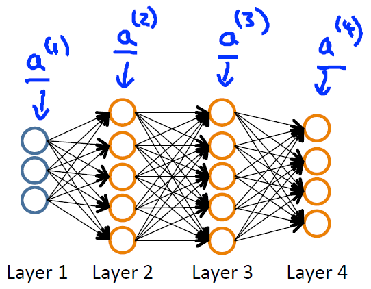

# Neural Networks: Learning

## Cost Function and Backpropagation

### Cost Function

#### Lecture Notes

+ Neural Network Introduction
  + One of the most powerful learning algorithm
  + Learning algorithm for fitting the derived parameters given a training set

+ Neural Network (Classification)

  <div style="display:flex;justify-content:center;align-items:center;flex-flow:row wrap;">
    <div><a href="https://d3c33hcgiwev3.cloudfront.net/_1afdf5a2e2e24350ec9bad90aefd19fe_Lecture9.pdf?Expires=1554422400&Signature=Fdn-74XPrEq818ccQ~1kycVY5vHzeUq6aDckAhRkPSHa3v~v8fr5K335M0tkDkxhPl~8s~RK2yY2U0DwViXUT0pZMKSho0zZczW0MGhZ0ojYRe2UcjiVaH1YSft6cDdSWVQUi16uV44NNTFQA71N~55TdCkEXd9RiqR1DCaGF20_&Key-Pair-Id=APKAJLTNE6QMUY6HBC5A">
      
    </a></div>
  </div>

  + Dataset: $\{(x^{(1)}, y^{(1)}), (x^{(2)}, y^{(2)}), \ldots, (x^{(m)}, y^{(m)}),\}$
  + Notations
    + $L\;$ = total no. of layers in network
    + $s_l\;$: no. of units (not counting bias unit) in layer $l$
    + E.g, $L = 4, s_1 = 3, s_2 = 5, s_3 = 5, s_4 = s_L = 4$
  + Binary classification: $y \in \{0, 1 \}$
    + 1 output unit: $h_\Theta(x) \in \mathbb{R}$
    + $L = 2, s_L = s_2 = 1 , K = 1$
  + Multi-class classification ($K$ classes)
    + K Output units ($K$ classes): $y \in \mathbb{R}^K$
    + E.g, 

      $$\underbrace{\begin{bmatrix} 1\\0\\0\\0 \end{bmatrix}}_{pedestrian}, \qquad \underbrace{\begin{bmatrix} 0\\1\\0\\0 \end{bmatrix}}_{car}, \qquad \underbrace{\begin{bmatrix} 0\\0\\1\\0 \end{bmatrix}}_{motocycle}, \quad \underbrace{\begin{bmatrix} 0\\0\\0\\1 \end{bmatrix}}_{truck}$$
    + In gneral, $K \geq 3$

+ Cost Function
  + Logistic regression

    $$J(\theta) = - \frac{1}{m} \sum_{i=1}^m \left[ y^{(i)}\ \log (h_\theta (x^{(i)})) + (1 - y^{(i)})\ \log (1 - h_\theta(x^{(i)})) \right] + \frac{\lambda}{2m}\sum_{j=1}^n \theta_j^2$$

  + Neural network

    $$h_\Theta(x) \; \in \; \mathbb{R}^K \quad \Rightarrow \quad (h_\Theta(x))_i = i^{th} \text{output}$$

    <br/>

    $$J(\Theta) = −\dfrac{1}{m} \sum_{i=1}^m \sum_{k=1}^K \left[ y^{(i)}_k \log((h_\Theta(x^{(i)}))_k) + (1−y^{(i)}_k) \log(1−(h_\Theta(x^{(i)}))_k) \right] + \dfrac{\lambda}{2m} \sum_{l=1}^{L−1} \sum_{i=1}^{s_l} \sum_{j=1}^{s_{l+1}} (\Theta^{(l)}_{j,i})^2$$
  + IVQ: Suppose we want to try to minimize $J(\Theta)$ as a function of $\Theta$, using one of the advanced optimization methods (fminunc, conjugate gradient, BFGS, L-BFGS, etc.). What do we need to supply code to compute (as a function of $\Theta$)?

    1. $\Theta$
    2. $J(\Theta)$
    3. The (partial) derivative terms $\frac{\partial}{\partial \Theta_{ij}^{(l)}}$ for every $i,j,l$
    4. $J(\Theta)$ and the (partial) derivative terms $\frac{\partial}{\partial \Theta^{(l)}_{ij}}$ for every $i,j,l$

    Ans: 4

+ Overview ([Ref](https://www.ritchieng.com/neural-networks-learning/#1b-overview))
  + Forward propagation
    + Algorithm that takes your neural network and the initial input ($x$) and pushes the input through the network
  + Back propagation
    + Takes output from your neural network $H(\Theta)$
      + Compares it to actual output $y$
      + Calculates $H(|theta)$’s deviation from actual output
    + Takes the error $H(\Theta)$ - $y$ from layer $L$
      + Back calculates error associated with each unit from the preceding layer $L - 1$
      + Error calculated from each unit used to calculate partial derivatives
    + Use partial derivatives with gradient descent to minimise cost function $J(\Theta)$
  + Basic things to note
    + $\Theta$ matrix for each layer in the network
      + This has each node in layer $l$ as one dimension and each node in $l+ 1$ as the other dimension
    + $\Delta$ matrix for each layer
      + This has each node as one dimension and each training data example as the other

---------------------------------------------------

Let's first define a few variables that we will need to use:

+ L = total number of layers in the network
+ $s_l$ = number of units (not counting bias unit) in layer l
+ K = number of output units/classes

Recall that in neural networks, we may have many output nodes. We denote $h_\Theta(x)_k$ as being a hypothesis that results in the $k^{th}$ output. Our cost function for neural networks is going to be a generalization of the one we used for logistic regression. Recall that the cost function for regularized logistic regression was:

$$J(\theta) = - \frac{1}{m} \sum_{i=1}^m \left[ y^{(i)}\ \log (h_\theta (x^{(i)})) + (1 - y^{(i)})\ \log (1 - h_\theta(x^{(i)})) \right] + \frac{\lambda}{2m}\sum_{j=1}^n \theta_j^2$$
​	 
For neural networks, it is going to be slightly more complicated:

$$J(\Theta) = −\dfrac{1}{m} \sum_{i=1}^m \sum_{k=1}^K \left[ y^{(i)}_k \log((h_\Theta(x^{(i)}))_k) + (1−y^{(i)}_k) \log(1−(h_\Theta(x^{(i)}))_k) \right] + \dfrac{\lambda}{2m} \sum_{l=1}^{L−1} \sum_{i=1}^{s_l} \sum_{j=1}^{s_{l+1}} (\Theta^{(l)}_{j,i})^2$$

We have added a few nested summations to account for our multiple output nodes. In the first part of the equation, before the square brackets, we have an additional nested summation that loops through the number of output nodes.

In the regularization part, after the square brackets, we must account for multiple theta matrices. The number of columns in our current theta matrix is equal to the number of nodes in our current layer (including the bias unit). The number of rows in our current theta matrix is equal to the number of nodes in the next layer (excluding the bias unit). As before with logistic regression, we square every term.

Note:

+ the double sum simply adds up the logistic regression costs calculated for each cell in the output layer
+ the triple sum simply adds up the squares of all the individual \Thetas in the entire network.
+ the $i$ in the triple sum does not refer to training example $i$

#### Lecture Video

<video src="https://d3c33hcgiwev3.cloudfront.net/09.1-NeuralNetworksLearning-CostFunction.073d4030b22b11e498c1339642deb798/full/360p/index.mp4?Expires=1554422400&Signature=hEpu6Z2J6JvfOAx7De6EUPCngknKQzvg6Jl~PNjnsbhFRbziS27TkZfJgUX~Ut2-Y4Mof~IAsu-VXkL0052Rf2Q6ygTIMmVz9h7jljvKp2S371sqMluepBvle46G3GkvNcy7cPgAX02vQIXU5vKe9GE3yoM1w2~iK3M1QPczZ-k_&Key-Pair-Id=APKAJLTNE6QMUY6HBC5A" preload="none" loop="loop" controls="controls" style="margin-left: 2em;" muted="" poster="http://www.multipelife.com/wp-content/uploads/2016/08/video-converter-software.png" width="180">
  <track src="https://www.coursera.org/api/subtitleAssetProxy.v1/5TMd0GdKSDWzHdBnSpg1sA?expiry=1554422400000&hmac=bem1h4KeU3N-rGYEcpmB9gCct-HF-z4KKzxJhz2VtAc&fileExtension=vtt" kind="captions" srclang="en" label="English" default>
  Your browser does not support the HTML5 video element.
</video>
<br/>


### Backpropagation Algorithm

#### Lecture Notes

+ Gradient computation
  + Cost function

    $$J(\Theta) = −\dfrac{1}{m} \sum_{i=1}^m \sum_{k=1}^K \left[ y^{(i)}_k \log((h_\Theta(x^{(i)}))_k) + (1−y^{(i)}_k) \log(1−(h_\Theta(x^{(i)}))_k) \right] + \dfrac{\lambda}{2m} \sum_{l=1}^{L−1} \sum_{i=1}^{s_l} \sum_{j=1}^{s_{l+1}} (\Theta^{(l)}_{j,i})^2$$
  + Objective:

    $$\min_\Theta J(\Theta)$$
  + Need code to computer
    + $J(\Theta)$
    + $\frac{\partial}{\partial \Theta_{ij}^{(l)}} J(\Theta) \qquad \text{ where } \quad \Theta_{ij}^{(l)} \in \mathbb{R}$

+ Gradient computation: Forward propagation

  Given one training example $(x, y)$,

  <div style="display:flex;justify-content:center;align-items:center;flex-flow:row wrap;">
    <div><a href="https://d3c33hcgiwev3.cloudfront.net/_1afdf5a2e2e24350ec9bad90aefd19fe_Lecture9.pdf?Expires=1554422400&Signature=Fdn-74XPrEq818ccQ~1kycVY5vHzeUq6aDckAhRkPSHa3v~v8fr5K335M0tkDkxhPl~8s~RK2yY2U0DwViXUT0pZMKSho0zZczW0MGhZ0ojYRe2UcjiVaH1YSft6cDdSWVQUi16uV44NNTFQA71N~55TdCkEXd9RiqR1DCaGF20_&Key-Pair-Id=APKAJLTNE6QMUY6HBC5A">
      
    </a></div>
  </div>
  <br/>

  $$\begin{array}{rcl} a^{(1)} &=& x = \begin{bmatrix} x_0 \\ x_1 \\ x_2 \\ x_3 \end{bmatrix} \quad (x_0 = +1) \\ 
  z^{(2)} &=& \Theta^{(1)} a^{(1)} = \begin{bmatrix} \Theta^{(1)}_{10} & \Theta^{(1)}_{11} & \Theta^{(1)}_{12} & \Theta^{(1)}_{13} \\ \Theta^{(1)}_{20} & \Theta^{(1)}_{21} & \Theta^{(1)}_{22} & \Theta^{(1)}_{23} \\ \Theta^{(1)}_{30} & \Theta^{(1)}_{31} & \Theta^{(1)}_{32} & \Theta^{(1)}_{33} \\ \Theta^{(1)}_{40} & \Theta^{(1)}_{41} & \Theta^{(1)}_{42} & \Theta^{(1)}_{43} \\ \Theta^{(1)}_{50} & \Theta^{(1)}_{51} & \Theta^{(1)}_{52} & \Theta^{(1)}_{53} \end{bmatrix} \begin{bmatrix} x_0 \\ x_1 \\ x_2 \\ x_3 \end{bmatrix} = \begin{bmatrix} z^{(2)}_1 \\ z^{(2)}_2 \\ z^{(2)}_3 \\z^{(2)}_4 \\ z^{(2)}_5 \end{bmatrix} \\ 
  a^{(2)} &=& g(z^{(2)}) = g \left( \begin{bmatrix} z^{(2)}_0 \\ z^{(2)}_1 \\ z^{(2)}_2 \\ z^{(2)}_3 \\z^{(2)}_4 \\ z^{(2)}_5 \end{bmatrix} \right) = \begin{bmatrix} a^{(2)}_0 \\ a^{(2)}_1 \\ a^{(2)}_2 \\ a^{(2)}_3 \\ a^{(2)}_4 \\ a^{(2)}_5 \end{bmatrix} \quad (\text{ add } z^{(2)}_0 \;\;\&\;\; a^{(2)}_0 = g(z^{(2)}_0) = +1) \\ 
  z^{(3)} &=& \Theta^{(2)} a^{(2)} = \begin{bmatrix} \Theta^{(2)}_{10} &  \Theta^{(2)}_{11} &  \Theta^{(2)}_{12} &  \Theta^{(2)}_{13} &  \Theta^{(2)}_{14} &  \Theta^{(2)}_{15} \\ \Theta^{(2)}_{20} &  \Theta^{(2)}_{21} & \Theta^{(2)}_{22} &  \Theta^{(2)}_{23} &  \Theta^{(2)}_{24} &  \Theta^{(2)}_{25} \\ \Theta^{(2)}_{30} &  \Theta^{(2)}_{31} &  \Theta^{(2)}_{32} &  \Theta^{(2)}_{33} &  \Theta^{(2)}_{34} &  \Theta^{(2)}_{35} \\ \Theta^{(2)}_{40} &  \Theta^{(2)}_{41} &  \Theta^{(2)}_{42} &  \Theta^{(2)}_{43} &  \Theta^{(2)}_{44} &  \Theta^{(2)}_{45} \\ \Theta^{(2)}_{50} &  \Theta^{(2)}_{51} &  \Theta^{(2)}_{52} &  \Theta^{(2)}_{53} &  \Theta^{(2)}_{54} &  \Theta^{(2)}_{55} \end{bmatrix} \begin{bmatrix} a^{(2)}_0 \\ a^{(2)}_1 \\ a^{(2)}_2 \\ a^{(2)}_3 \\ a^{(2)}_4 \\ a^{(2)}_5 \end{bmatrix} = \begin{bmatrix} z^{(3)}_1 \\ z^{(3)}_2 \\ z^{(3)}_3 \\z^{(3)}_4 \\ z^{(3)}_5 \end{bmatrix} \\ 
  a^{(3)} &=& g(z^{(3)}) = g \left( \begin{bmatrix} z^{(3)}_0 \\ z^{(3)}_1 \\ z^{(3)}_2 \\ z^{(3)}_3 \\z^{(3)}_4 \\ z^{(3)}_5 \end{bmatrix} \right) = \begin{bmatrix} a^{(3)}_0 \\ a^{(3)}_1 \\ a^{(3)}_2 \\ a^{(3)}_3 \\ a^{(3)}_4 \\ a^{(3)}_5 \end{bmatrix} \quad (\text{ add } z^{(3)}_0 \;\&\; a^{(3)}_0 = g(z^{(3)}_0) = +1) \\
  z^{(4)} &=& \Theta^{(3)} a^{(3)} = \begin{bmatrix} \Theta^{(3)}_{10} &  \Theta^{(3)}_{11} &  \Theta^{(3)}_{12} &  \Theta^{(3)}_{13} &  \Theta^{(3)}_{14} &  \Theta^{(3)}_{15} \\ \Theta^{(3)}_{20} &  \Theta^{(3)}_{21} & \Theta^{(3)}_{22} &  \Theta^{(3)}_{23} &  \Theta^{(3)}_{24} &  \Theta^{(3)}_{25} \\ \Theta^{(3)}_{30} &  \Theta^{(3)}_{31} &  \Theta^{(3)}_{32} &  \Theta^{(3)}_{33} &  \Theta^{(3)}_{34} &  \Theta^{(3)}_{35} \\ \Theta^{(3)}_{40} &  \Theta^{(3)}_{41} &  \Theta^{(3)}_{42} &  \Theta^{(3)}_{43} &  \Theta^{(3)}_{44} &  \Theta^{(3)}_{45} \end{bmatrix} \begin{bmatrix} a^{(3)}_0 \\ a^{(3)}_1 \\ a^{(3)}_2 \\ a^{(3)}_3 \\ a^{(3)}_4 \\ a^{(3)}_5 \end{bmatrix} = \begin{bmatrix} z^{(4)}_1 \\ z^{(4)}_2 \\ z^{(4)}_3 \\z^{(4)}_4 \end{bmatrix}\\ 
  a^{(4)} & = & h_\Theta(x) = h_\Theta \left( \begin{bmatrix} x_0 \\ x_1 \\ x_2 \\ x_3 \end{bmatrix} \right) = g(z^{(4)}) = g \left( \begin{bmatrix} z^{(4)}_1 \\ z^{(4)}_2 \\ z^{(4)}_3 \\ z^{(4)}_4 \end{bmatrix} \right) = \begin{bmatrix} y_1 \\ y_2 \\ y_3 \\ y_4 \end{bmatrix} \end{array}$$

  Generalization: Transformation from layer $l$ to layer $l+1$

  $$\begin{array}{rcl} z^{(l+1)} & = & \Theta^{(l)} a^{(l)} = \begin{bmatrix} \Theta^{(l)}_{10} & \Theta^{(l)}_{11} & \cdots & \Theta^{(l)}_{1s_{l}} \\ \Theta^{(l)}_{20} & \Theta^{(l)}_{21} & \cdots & \Theta^{(l)}_{2s_{l}} \\ \vdots & \vdots & \ddots & \vdots \\ \Theta^{(l)}_{s_{l+1}0} & \Theta^{(l)}_{s_{l+1}1} & \cdots & \Theta^{(l)}_{s_{l+1}s_{l}} \end{bmatrix} \begin{bmatrix} a^{(l+1)}_0 \\ a^{(l+1)}_1 \\ \vdots \\ a^{(l+1)}_{s_{l+1}} \end{bmatrix} = \begin{bmatrix} z^{(l+1)}_1 \\ z^{(l+1)}_2 \\ \vdots \\ z^{(l+1)}_{s_{l+1}} \end{bmatrix} \\\\ a^{(l+1)} & = & g(z^{(l+1)}) = g \left( \begin{bmatrix} z^{(l+1)}_0 \\ z^{(l+1)}_1 \\ \vdots \\ z^{(l+1)}_{s_{l+1}} \end{bmatrix}  \right) = \begin{bmatrix} a^{(l+1)}_0 \\ a^{(l+)}_1 \\ \vdots \\ a^{(l+1)}_{s_{l+1}} \end{bmatrix} \end{array}$$


+ Gradient computation: Backpropagation algorithm
  + Intuition: $\delta^{(l)}_j = \;$ "error" of node $j$ in layer $l$
  + For each output unit (layer $L=4$)

    $$\begin{array}{rcl} \delta^{(4)}_j = a^{(4)}_j - y_j = (h_\Theta(x))_j - y_j & \Rightarrow & \delta^{(4)} = a^{(4)} - y \\\\ \delta^{(3)} = (\Theta^{(3)})^T \delta^{(4)} .\ast g^\prime (z^{(3)}) &=& (\Theta^{(3)})^T \delta^{(4)} \;.\ast\; a^{(3)} \;.\ast\; (1-a^{(3)}) \\ \delta^{(2)} = (\Theta^{(2)})^T \delta^{(4)} \;.\ast\; g^\prime (z^{(2)}) & = & (\Theta^{(2)})^T \delta^{(3)} .\ast a^{(3)} \;.\ast\; (1-a^{(2)}) \end{array}$$

    No $\delta^{(1)}$ term

    $$\dfrac{\partial}{\partial \Theta_{ij}^{(l)}} J(\Theta) = a^{(l)}_j \delta^{(l+1)}_i \qquad (\text{ignore } \lambda; \text{ if } \lambda = 0)$$
  + Algorithm

    Set $\Delta_{ij}^{(l)} = 0 \;\; \forall \;\; l, i, j\quad\Longrightarrow\quad \text{ use to compute } \frac{\partial}{\partial \Theta_{ij}^{(l)}} J(\Theta)$ <br/>
    For $i=1$ to $m \qquad \rightarrow (x^{(i)}, y^{(i)})$ <br/>
    <span style="padding-left: 2em" />Set $a^{(1)} = x^{(i)}$<br/>
    <span style="padding-left: 2em" />Perform forward propagation to compute $a^{(l)}$ for $l = 2, 3, \ldots, L$ <br/>
    <span style="padding-left: 2em" />Using $y^{(i)}$, compute $\delta^{(L)} = a^{(L)} - y^{(i)}$ [Last later error]<br/>
    <span style="padding-left: 2em" />Computer $\delta^{(L-1)}, \delta^{(L-2)}, \ldots, \delta^{(2)}$ (without $\delta^{(1)}$)<br/><br/>
    <span style="padding-left: 2em" />$\Delta_{ij}^{(l)} \;:=\; \Delta_{ij}^{(l)} + a^{(l)}_j \delta^{(l+1)}_i \quad \Rightarrow \quad \Delta^{(l)} \;:=\; \Delta^{(l)} + \delta^{(l+1)} (a^{(l)})^T$ <br/><br/>
    $D_{ij}^{(l)} \;:=\; \begin{cases} \frac{1}{m} \Delta_{ij}^{(l)} + \lambda \Theta_{ij}^{(l)} & \text{if } \; j \neq 0 \\\\ \frac{1}{m} \Delta_{ij}^{(l)} & \text{if } \; j = 0 \end{cases}$
  + Gradeint

    $$\dfrac{\partial}{\partial \Theta_{ij}^{(l)}} J(\Theta) = D_{ij}^{(l)}$$

  + IVQ: Suppose you have two training examples $(x^{(1)}, y^{(1)})$ and $(x^{(2)}, y^{(2)})$. Which of the following is a correct sequence of operations for computing the gradient? (Below, FP = forward propagation, BP = back propagation).

    1. FP using $x^{(1)}$ followed by FP using $x^{(2)}$. Then BP using $y^{(1)}$ followed by BP using $y^{(2)}$.
    2. FP using $x^{(1)}$ followed by BP using $y^{(2)}$. Then FP using $x^{(2)}$ followed by BP using $y^{(1)}$.
    3. BP using $y^{(1)}$ followed by FP using $x^{(1)}$. Then BP using $y^{(2)}$ followed by FP using $x^{(2)}$.
    4. FP using $x^{(1)}$ followed by BP using $y^{(1)}$. Then FP using $x^{(2)}$ followed by BP using $y^{(2)}$.

    Ans: 4


---------------------------------------------------

"Back-propagation" is neural-network terminology for minimizing our cost function, just like what we were doing with gradient descent in logistic and linear regression. Our goal is to compute:

$$\min_\Theta J(\Theta)$$

That is, we want to minimize our cost function $J$ using an optimal set of parameters in theta. In this section we'll look at the equations we use to compute the partial derivative of $J(\Theta)$:

$$\dfrac{\partial}{\partial \Theta_{i,j}^{(l)}}$$

To do so, we use the following algorithm:

+ Training set: $\{(x^{(1)}, y^{(1)}), \ldots, (x^{(m)}, y^{(m)})\}$
+ Algorithm

  Set $\Delta_{ij}^{(l)} = 0 \;\; \forall \;\; l, i, j\quad\Longrightarrow\quad \text{ use to compute } \frac{\partial}{\partial \Theta_{ij}^{(l)}} J(\Theta)$ <br/>
  For $i=1$ to $m$ <br/>
  <span style="padding-left: 2em" />Set $a^{(1)} = x^{(i)}$<br/>
  <span style="padding-left: 2em" />Perform forward propogation to compute $a^{(l)}$ for $l = 2, 3, \ldots, L$ <br/>
  <span style="padding-left: 2em" />Using $y^{(i)}$, compute $\delta^{(L)} = a^{(L)} - y^{(i)}$<br/>
  <span style="padding-left: 2em" />Computer $\delta^{(L-1)}, \delta^{(L-2)}, \ldots, \delta^{(2)}$ (without $\delta^{(1)}$)<br/><br/>
  <span style="padding-left: 2em" />$\Delta_{ij}^{(l)} \;:=\; \Delta_{ij}^{(l)} + a^{(l)}_j \delta^{(l+1)}_i \quad \Rightarrow \quad \Delta^{(l)} \;:=\; \Delta^{(l)} + \delta^{(l+1)} (a^{(l)})^T$ <br/><br/>
  $D_{ij}^{(l)} \;:=\; \begin{cases} \frac{1}{m} \Delta_{ij}^{(l)} + \lambda \Theta_{ij}^{(l)} & \text{if } \; j \neq 0 \\\\ \frac{1}{m} \Delta_{ij}^{(l)} & \text{if } \; j = 0 \end{cases}$
+ Gradeint

  $$\dfrac{\partial}{\partial \Theta_{ij}^{(l)}} J(\Theta) = D_{ij}^{(l)}$$

__Back propagation Algorithm__

Given training set $\{(x^{(1)},y^{(1)}) \cdots (x^{(m)},y^{(m)})\}$
+ Set $\Delta^{(l)}_{i,j} \;:=\; 0$ for all $(l,i,j)$, (hence you end up having a matrix full of zeros)

For training example $t =1$ to $m$:

1. Set $a^{(1)} := x^{(t)}$

2. Perform forward propagation to compute $a^{(l)}$ for $l=2,3, \ldots,L$

    Given one training example: $(x, y)$<br/>
    Forward propagation: (example: 4-layer Neural Network)

    <div style="display:flex;justify-content:center;align-items:center;flex-flow:row wrap;">
      <div><a href="https://d3c33hcgiwev3.cloudfront.net/_1afdf5a2e2e24350ec9bad90aefd19fe_Lecture9.pdf?Expires=1554422400&Signature=Fdn-74XPrEq818ccQ~1kycVY5vHzeUq6aDckAhRkPSHa3v~v8fr5K335M0tkDkxhPl~8s~RK2yY2U0DwViXUT0pZMKSho0zZczW0MGhZ0ojYRe2UcjiVaH1YSft6cDdSWVQUi16uV44NNTFQA71N~55TdCkEXd9RiqR1DCaGF20_&Key-Pair-Id=APKAJLTNE6QMUY6HBC5A">
        
      </a></div>
    </div>
    <br/>

    $$\begin{array}{rcl} a^{(1)} &=& x &\quad\Longrightarrow\quad& z^{(2)} &=& \Theta^{(1)} a^{(1)} \\ a^{(2)} &=& g(z^{(2)}) \quad (\text{ add } a^{(2)}_0) &\quad\Longrightarrow\quad& z^{(3)} &=& \Theta^{(2)} a^{(2)} \\ a^{(3)} &=& g(z^{(3)}) \quad (\text{ add } a^{(3)}_0) &\quad\Longrightarrow\quad& z^{(4)} &=& \Theta^{(3)} a^{(3)} \\ a^{(4)} & = & h_\Theta(x) = g(z^{(4)}) \end{array}$$

3. Using $y^{(t)}$, compute $\delta^{(L)} = a^{(L)} - y^{(t)}$

    Where $L$ is our total number of layers and $a^{(L)}$ is the vector of outputs of the activation units for the last layer. So our "error values" for the last layer are simply the differences of our actual results in the last layer and the correct outputs in y. To get the delta values of the layers before the last layer, we can use an equation that steps us back from right to left:

4. Compute $\delta^{(L-1)}, \delta^{(L-2)},\dots,\delta^{(2)}$ using $\delta^{(l)} = ((\Theta^{(l)})^T \delta^{(l+1)}) .\ast a^{(l)} .\ast (1−a^{(l)})$

    The delta values of layer l are calculated by multiplying the delta values in the next layer with the theta matrix of layer l. We then element-wise multiply that with a function called $g^\prime$, or g-prime, which is the derivative of the activation function g evaluated with the input values given by $z^{(l)}$.

    The g-prime derivative terms can also be written out as:

    $$g'(z^{(l)}) = a^{(l)}\ .\ast \ (1 - a^{(l)})$$
5. $\Delta^{(l)}_{i,j}\ :=\ \Delta^{(l)}_{i,j} + a_j^{(l)} \delta_i^{(l+1)}$ or with vectorization, $\Delta^{(l)}\ :=\ \Delta^{(l)} + \delta^{(l+1)}(a^{(l)})^T$

Update our new $\Delta$ matrix.

$$D^{(l)}_{i,j}\ := \begin{cases} \dfrac{1}{m} (\Delta^{(l)}_{i,j} + \lambda \Theta^{(l)}_{i,j}), & \text{ if } j \neq 0. \\\\ \dfrac{1}{m}\Delta^{(l)}_{i,j}& \text { if } j=0 \end{cases}$$

The capital-delta matrix $D$ is used as an "accumulator" to add up our values as we go along and eventually compute our partial derivative. Thus we get $\frac{\partial}{\partial \Theta^{(l)}_{ij}} J(\Theta) = D_{ij}^{(l)}$


#### Lecture Video

<video src="https://d3c33hcgiwev3.cloudfront.net/09.2-NeuralNetworksLearning-BackpropagationAlgorithm.202a04c0b22b11e487451d0772c554c0/full/360p/index.mp4?Expires=1554422400&Signature=kqbb8D9Aw7ywX91fjR~3FZUjJld1M5ItY33a63sTWSKuBPbl2nmM8WZ4HgJXGwyeALRhF7uh2meH1Ijhn7~R7j9Hoj4Hoe-NJ-5npjCNAOymNhjLuqApJEewP47G~VpcY4Gkp7nJHv1JmhnsIlj9mLCFnsJySZ-64YbO7ecUFnI_&Key-Pair-Id=APKAJLTNE6QMUY6HBC5A" preload="none" loop="loop" controls="controls" style="margin-left: 2em;" muted="" poster="http://www.multipelife.com/wp-content/uploads/2016/08/video-converter-software.png" width="180">
  <track src="https://www.coursera.org/api/subtitleAssetProxy.v1/UVXCQ6TZQ8CVwkOk2VPA-g?expiry=1554422400000&hmac=spH6ZJ9S7IDJKdHZmkO8hxiYD92_QL6wdJ5K6g7LLVo&fileExtension=vtt" kind="captions" srclang="en" label="English" default>
  Your browser does not support the HTML5 video element.
</video>
<br/>


### Backpropagation Intuition

#### Lecture Notes

+ Forward propagation

  <div style="display:flex;justify-content:center;align-items:center;flex-flow:row wrap;">
    <div><a href="https://d3c33hcgiwev3.cloudfront.net/_1afdf5a2e2e24350ec9bad90aefd19fe_Lecture9.pdf?Expires=1554422400&Signature=Fdn-74XPrEq818ccQ~1kycVY5vHzeUq6aDckAhRkPSHa3v~v8fr5K335M0tkDkxhPl~8s~RK2yY2U0DwViXUT0pZMKSho0zZczW0MGhZ0ojYRe2UcjiVaH1YSft6cDdSWVQUi16uV44NNTFQA71N~55TdCkEXd9RiqR1DCaGF20_&Key-Pair-Id=APKAJLTNE6QMUY6HBC5A">
      
    </a></div>
  </div>

  $$z^{(3)}_1 = \Theta^{(2)}_{10} \times 1 + \Theta^{(2)}_{11} a^{(2)}_1 + \Theta^{(2)}_{1} a^{(2)}_2$$

+ What is backpropagation doing?

  $$J(\Theta) = −\dfrac{1}{m} \sum_{t=1}^m \sum_{k=1}^K \left[ y^{(t)}_k \log (h_\Theta(x^{(t)}))_k + (1−y^{(t)}_k) \log (1 − h_\Theta(x^{(t)})_k) \right] + \dfrac{\lambda}{2m} \sum_{l=1}^{L−1} \sum_{i=1}^{s_l} \sum_{j=1}^{s_{l + 1}} (\Theta^{(l)}_{j,i})^2$$

  Focusing on a single example $x^{(i)}, y^{(i)}$, the case of 1 output unit, and ignoring regularization ($\lambda = 0$),

  $$cost(i) = y^{(i)} \log h_\Theta(x^{(i)}) + (1 - y^{(i)}) \log(1 - h_\Theta(x^{(i)}))$$

  (Think of $cost(i) \approx (h_\Theta(x^{(i)}) - y^{(i)})^2$ with linear regression)

  I.e., how well is the network doing on example $i$?

+ Forward propagation

  <div style="display:flex;justify-content:center;align-items:center;flex-flow:row wrap;">
    <div><a href="https://www.coursera.org/learn/machine-learning/supplement/v5Bu8/backpropagation-intuition">
      
    </a></div>
  </div>

  + $\delta^{(i)}_j\;$: "error" of cost for $a^{(l)}_j$ (unit $j$ in layer $l$)
  + Formally, $\delta^{(l)}_j = \dfrac{\partial}{\partial z^{(l)}_j} cost(i) \;$ (for $j \geq 0$), where

    $$cost(i) = y^{(i)} \log h_\Theta(x^{(i)}) + (1 - y^{(i)}) \log(1 - h_\Theta(x^{(i)}))$$
  + IVQ: Consider the following neural network:

    <div style="display:flex;justify-content:center;align-items:center;flex-flow:row wrap;">
      <div><a href="url">
        
      </a></div>
    </div>

    Suppose both of the weights shown in red ($\Theta^{(2)}_{11}$ and $\Theta^{(2)}_{21}$) are equal to 0. After running backpropagation, what can we say about the value of $\delta_1^{(3)}$?

    1. $\delta_1^{(3)} > 0$
    2. $\delta_1^{(3)} = 0$ only if $\delta_1^{(2)} = \delta_2^{(2)} = 0$, but not necessarily otherwise
    3. $\delta_1^{(3)} \leq 0$ regardless of the values of $\delta_1^{(2)}$ and $\delta_2^{(2)}$
    4. There is insufficient information to tell

    Ans: 4


---------------------------------------------------

Recall that the cost function for a neural network is:

$$J(\Theta) = −\dfrac{1}{m} \sum_{t=1}^m \sum_{k=1}^K \left[ y^{(t)}_k \log (h_\Theta(x^{(t)}))_k + (1−y^{(t)}_k) \log (1 − h_\Theta(x^{(t)})_k) \right] + \dfrac{\lambda}{2m} \sum_{l=1}^{L−1} \sum_{i=1}^{s_l} \sum_{j=1}^{s_{l + 1}} (\Theta^{(l)}_{j,i})^2$$

If we consider simple non-multiclass classification $(k = 1$) and disregard regularization, the cost is computed with:

$$cost(t) = y^{(t)} \log(h_\Theta(x^{(t)})) + (1−y^{(t)}) \log(1−h_\Theta(x^{(t)}))$$

Intuitively, $\delta_j^{(l)}$ is the "error" for $a^{(l)}_j$ (unit $j$ in layer $l$). More formally, the delta values are actually the derivative of the cost function:

$$\delta^{(l)}_j = \dfrac{\partial}{\partial z^{(l)}_j} \; cost(t)$$

Recall that our derivative is the slope of a line tangent to the cost function, so the steeper the slope the more incorrect we are. Let us consider the following neural network below and see how we could calculate some $\delta_j^{(l)}$:

<div style="display:flex;justify-content:center;align-items:center;flex-flow:row wrap;">
  <div><a href="https://www.coursera.org/learn/machine-learning/supplement/v5Bu8/backpropagation-intuition">
    
  </a></div>
</div>

In the image above, to calculate $\delta_2^{(2)}$, we multiply the weights $\Theta^{(2)}_{12}$ and $\Theta^{(2)}_{22}$ by their respective $\delta$ values found to the right of each edge. So we get $\delta_2^{(2)} = \Theta^{(2)}_{12} \ast \delta_1^{(3)} +\Theta^{(2)}_{22} \ast \delta_2^{(3)}$. To calculate every single possible $\delta_j^{(l)}$, we could start from the right of our diagram. We can think of our edges as our $\Theta_{ij}$. Going from right to left, to calculate the value of $\delta_j^{(l)}$, you can just take the over all sum of each weight times the $\delta$ it is coming from. Hence, another example would be $\delta_2^{(3)} = \Theta^{(3)}_{12} \ast \delta_1^{(4)}$.


#### Lecture Video

<video src="https://d3c33hcgiwev3.cloudfront.net/09.3-NeuralNetworksLearning-BackpropagationIntuition.4012cfb0b22b11e48803b9598c8534ce/full/360p/index.mp4?Expires=1554508800&Signature=Q~qkkRtRj1A4iNn8tA6XNj0VqfbV~KQ-U47T3WBr1ZRUE7ORNHghiPhvxbhC~rGJrhr1o57nuGQfmIDX18wIpyX391zyil3~eSnXrR3wSb51iozYtSeefIPTPhCBDb9GpvHu7caGMznxtj-Ovh9CAhlKzo9c9mdquoU~woeV0RA_&Key-Pair-Id=APKAJLTNE6QMUY6HBC5A" preload="none" loop="loop" controls="controls" style="margin-left: 2em;" muted="" poster="http://www.multipelife.com/wp-content/uploads/2016/08/video-converter-software.png" width="180">
  <track src="https://www.coursera.org/api/subtitleAssetProxy.v1/c_3KEk83R269yhJPN5dudw?expiry=1554508800000&hmac=NZz9F2jWOjDjU_3_TBaJLDCV7Iqer2KaYNmLuVDxNyM&fileExtension=vtt" kind="captions" srclang="en" label="English" default>
  Your browser does not support the HTML5 video element.
</video>
<br/>


## Backpropagation in Practice

### Implementation Note: Unrolling Parameters

#### Lecture Notes

+ Advanced optimization

  > function [jVal, gradient] = costFunction (theta) <br/>
  > &nbsp;&nbsp;&nbsp;&nbsp;&nbsp;&nbsp;&nbsp;&nbsp;...
  >
  > optTheta = fminunc(@costFunction, initialTheta, options)

  where `gradient`, `theta` & `initialTheta` $\;\in\; \mathbb{R}^{n+1}$ vectors

  + Example: Neural Network ($L=4$)
    + $\Theta^{(1)}, \Theta^{(2)}, \Theta^{(3)}$ - matrices (Theta1, Theta2, Theta3)
    + $D^{(1)}, D^{(2)}, D^{(3)}$ - matrices (D1, D2, D3)

  + Purpose:  "Unroll" into vectors

+ Example: Technique to unroll into  vector and reverse
  + $s_1 = 10, s_2 = 10, s_3 = 1$
  + $\Theta^{(1)} \;\in\; \mathbb{R}^{10 \times 11}, \quad \Theta^{(2)} \;\in\; \mathbb{R}^{10 \times 11}, \quad \Theta^{(3)} \;\in\; \mathbb{R}^{1 \times 11}$
  + $D^{(1)} \;\in\; \mathbb{R}^{10 \times 11}, \quad D^{(2)} \;\in\; \mathbb{R}^{10 \times 11}, \quad D^{(3)} \;\in\; \mathbb{R}^{1 \times 11}$

  ```matlab
  % unroll all matrices into a big long 
  thetaVec = [ Theta1(:); Theta2(:); Theta3(:) ];
  DVec = [D1(:); D2(:); D3(:)];

  % revert vector representation into origin matrices
  Theta1 = reshape(thetaVec(1:110), 10, 11);
  Theta2 = reshape(thetaVec(111:220), 10, 11);
  Theta3 = reshape(thetaVec(221:231), 1, 11);
  ```
  + IVQ: Suppose D1 is a $10 \times 6$ matrix and D2 is a $1 \times 11$ matrix. You set:

    ```matlab
    DVec = [D1(:); D2(:)];
    ```

    Which of the following would get D2 back from DVec?

    1. `reshape(DVec(60:71), 1, 11)`
    2. `reshape(DVec(61:72), 1, 11)`
    3. `reshape(DVec(61:71), 1, 11)`
    4. `reshape(DVec(60:70), 11, 1)`

    Ans: 3

+ Learning Algorithm
  + Have initial parameters: $\Theta^{(1)}, \Theta^{(2)}, \Theta^{(3)}$
  + Unroll to get `initialTheta` to pass to `fminunc(@costFunction, initialTheta, options)`
  + CostFunction:<br/><br/>
    function [jval, gradientVec] = costFuinction(thetaVec) <br/>
    <span style="padding-left: 2em;" />From thetaVec, get $\Theta^{(1)}, \Theta^{(2)}, \Theta^{(3)}$ (reshape)<br/>
    <span style="padding-left: 2em;" />Use forward prop/bacl prop to compute $D^{(1)}, D^{(2)}, D^{(3)}$ $\quad (J(\Theta),$ and $D^{(1)}, D^{(2)}, D^{(3)}$<br/>
    <span style="padding-left: 2em;" />Unroll $D^{(1)}, D^{(2)}, D^{(3)}$ to get `gradientVec`


---------------------------------------------------

With neural networks, we are working with sets of matrices:

$$\begin{array}{c} \Theta^{(1)}, \Theta^{(2)}, \Theta^{(3)}, \ldots \\ D^{(1)}, D^{(2)}, D^{(3)}, \ldots \end{array}$$

In order to use optimizing functions such as `fminunc()`, we will want to "unroll" all the elements and put them into one long vector:

```matlab
thetaVector = [ Theta1(:); Theta2(:); Theta3(:); ]
deltaVector = [ D1(:); D2(:); D3(:) ]
```

If the dimensions of Theta1 is 10x11, Theta2 is 10x11 and Theta3 is 1x11, then we can get back our original matrices from the "unrolled" versions as follows:

```matlab
Theta1 = reshape(thetaVector(1:110),10,11)
Theta2 = reshape(thetaVector(111:220),10,11)
Theta3 = reshape(thetaVector(221:231),1,11)
```

To summarize:

+ Learning Algorithm
  + Have initial parameters: $\Theta^{(1)}, \Theta^{(2)}, \Theta^{(3)}$
  + Unroll to get `initialTheta` to pass to `fminunc(@costFunction, initialTheta, options)`
  + CostFunction:<br/><br/>
    function [jval, gradientVec] = costFuinction(thetaVec) <br/>
    <span style="padding-left: 2em;" />From thetaVec, get $\Theta^{(1)}, \Theta^{(2)}, \Theta^{(3)}$ (reshape)<br/>
    <span style="padding-left: 2em;" />Use forward prop/bacl prop to compute $D^{(1)}, D^{(2)}, D^{(3)}$ $\quad (J(\Theta),$ and $D^{(1)}, D^{(2)}, D^{(3)}$<br/>
    <span style="padding-left: 2em;" />Unroll $D^{(1)}, D^{(2)}, D^{(3)}$ to get `gradientVec`


#### Lecture Video

<video src="https://d3c33hcgiwev3.cloudfront.net/09.3-NeuralNetworksLearning-ImplementationNoteUnrollingParameters.103bf460b22b11e49c064db6ead92550/full/360p/index.mp4?Expires=1554595200&Signature=gl08IVlrQA4EXolo8IIo3a~QH738FrLVvPQBzX4~yqTc41XR39qX4JwfWCNdIuTv5xHrFMp-n7cBiEtzJ2NTTTi83IyiS-PIZX4uXKFwreWi2fLWYcwcUMMPt4zql9Jh-4z2zZkNTfihw-JiGhflBxRD1lVuotNXqEt7v0lIVzU_&Key-Pair-Id=APKAJLTNE6QMUY6HBC5A" preload="none" loop="loop" controls="controls" style="margin-left: 2em;" muted="" poster="http://www.multipelife.com/wp-content/uploads/2016/08/video-converter-software.png" width="180">
  <track src="https://www.coursera.org/api/subtitleAssetProxy.v1/tF-VOlWTQoWflTpVk-KF-A?expiry=1554595200000&hmac=-bOaH2U8ilPogi0ggtht9OWXlKmGaWJIJO1v09P4gIw&fileExtension=vtt" kind="captions" srclang="en" label="English" default>
  Your browser does not support the HTML5 video element.
</video>
<br/>


### Gradient Checking

#### Lecture Notes

+ It might look like $J(\Theta)$ is decreasing
  + But you might not know that there is a bug
  + You can do gradient checking to ensure your implementation is 100% correct

+ Numerically estimate gradients

  <div style="display:flex;justify-content:center;align-items:center;flex-flow:row wrap;">
    <div><a href="https://www.ritchieng.com/neural-networks-learning/">
      
    </a></div>
  </div>

  + Two-sided difference: $\dfrac{d}{d \Theta} \approx \dfrac{J(\Theta + \epsilon) - J(\Theta - \epsilon)}{2\epsilon}$
  + One-side difference (less accuracy): $\dfrac{d}{d \Theta} \approx \dfrac{J(\Theta + \epsilon) - J(\Theta)}{\epsilon}$
  + Implement: `gradApprox = (J(theta + EPSILON) - J(theta - EPSILON)) / (2*EPSILON)`
  + IVQ: Let $J(\theta) = \theta^3$. Furthermore, let $\theta = 1$ and $\epsilon=0.01$. You use the formula:

    $$\dfrac{J(\Theta + \epsilon) − J(\Theta − \epsilon)}{2\epsilon}$$

    to approximate the derivative. What value do you get using this approximation? (When $\theta = 1$, the true, exact derivative is $\frac{d}{d\theta}J(\theta)=3$).

    1. 3.0000
    2. 3.0001
    3. 3.0301
    4. 6.0002

    Ans: 2

+ Generalization: Parameter vector $\theta$
  + $\theta \;\in\; \mathbb{R}^n \quad$ (E.g. $\theta$ is "unrolled" version of $\Theta^{(1)}, \Theta^{(2)}, \Theta^{(3)}$)
  + $\theta = \theta_1, \theta_2, \theta_3, \ldots, \theta_n$

  $$\begin{array}{ccc} \dfrac{\partial}{\partial \theta_1} J(\theta) &\approx& \dfrac{J(\theta_1+\epsilon, \theta_2, \theta_3, \ldots,\theta_n) - J(\theta_1-\epsilon, \theta_2, \theta_3, \ldots,\theta_n)}{2\epsilon} \\\\ \dfrac{\partial}{\partial \theta_2} J(\theta) &\approx& \dfrac{J(\theta_1, \theta_2+\epsilon, \theta_3, \ldots,\theta_n) - J(\theta_1, \theta_2-\epsilon, \theta_3, \ldots,\theta_n)}{2\epsilon} \\ \vdots & & \vdots \\ \dfrac{\partial}{\partial \theta_2} J(\theta) &\approx& \dfrac{J(\theta_1, \theta_2, \theta_3, \ldots,\theta_n+\epsilon) - J(\theta_1, \theta_2, \theta_3, \ldots,\theta_n-\epsilon)}{2\epsilon} \end{array}$$

+ Octave implementation
  + $n\;$: the dimension of $\Theta$
  + Code

    ```matlab
    for i =1:n,
      thetaPlus = theta;
      thetaPlus(i) = thetaPlus(i) + EPSILON;
      thetaMinus = theta;
      thetaMinus(i) = thetaMinus(i) - EPSILON;
      gradApprox(i) = (J(thetaPlus) - J(thetaMinus)) / (2*EPSILON);
    end;
    ```
  + Check that `gradApprox ≈ DVec` (where `DVec` retained from backprop)

+ Implementation Note:
  + Implement backprop to compute `DVec` (unrolled $D^{(1)}, D^{(2)}, D^{(3)}$)
  + Implement numerical gradient check to compute `gradApprox`
  + Make sure they give similar values
  + Turn off gradient checking. Using backprop code for learning.
  + IVQ: What is the main reason that we use the backpropagation algorithm rather than the numerical gradient computation method during learning?

    1. The numerical gradient computation method is much harder to implement.
    2. The numerical gradient algorithm is very slow.
    3. Backpropagation does not require setting the parameter EPSILON.
    4. None of the above.

    Ans: 2

+ Important: Be sure to disable your gradient checking code before training your classifier.  If you run numerical gradient computation on every iterations of gradient descent (or in the inner loop of `costFunction(...)`) your code will be _very_ slow.


---------------------------------------------------

Gradient checking will assure that our backpropagation works as intended. We can approximate the derivative of our cost function with:

$$\dfrac{\partial}{\partial \Theta} J(\Theta) \approx \dfrac{J(\Theta+\epsilon) − J(\Theta − \epsilon)}{2ϵ}$$

With multiple theta matrices, we can approximate the derivative __with respect to $\Theta_j$__ as follows:

$$\dfrac{\partial}{\partial \Theta_j} J(\Theta) \approx \dfrac{J(\Theta_1, \ldots, \Theta_j + \epsilon, \ldots, \Theta_n) − J(\Theta_1, \ldots, \Theta_j − \epsilon, \ldots, \Theta_n)}{2ϵ}$$

A small value for $\epsilon$ (epsilon) such as $\epsilon \approx 10^{−4}$, guarantees that the math works out properly. If the value for $\epsilon$ is too small, we can end up with numerical problems.

Hence, we are only adding or subtracting epsilon to the $\Theta_j$ matrix. In octave we can do it as follows:

```matlab
epsilon = 1e-4;
for i = 1:n,
  thetaPlus = theta;
  thetaPlus(i) += epsilon;
  thetaMinus = theta;
  thetaMinus(i) -= epsilon;
  gradApprox(i) = (J(thetaPlus) - J(thetaMinus))/(2*epsilon)
end;
```

We previously saw how to calculate the deltaVector. So once we compute our `gradApprox` vector, we can check that `gradApprox ≈ deltaVector`.

Once you have verified __once__ that your backpropagation algorithm is correct, you don't need to compute gradApprox again. The code to compute `gradApprox` can be very slow.


#### Lecture Video

<video src="https://d3c33hcgiwev3.cloudfront.net/09.4-NeuralNetworksLearning-GradientChecking.362d3df0b22b11e4bb7e93e7536260ed/full/360p/index.mp4?Expires=1554595200&Signature=WPj5IPqNCfcEf6n3ggUob64L~L9UsTZECWb8A-5hJYNwQuRrNhk9yaB3DWFQpRsJEnE12A01PNQKRygEALBnG69P4HIZVV8WGQCUw5Bmg3jjlXztd9qCZEsPeFb4E2LfpyeLNsHTFDrVN7RiL3RNAHA3H8vcPD91FxWu71tCNAs_&Key-Pair-Id=APKAJLTNE6QMUY6HBC5A" preload="none" loop="loop" controls="controls" style="margin-left: 2em;" muted="" poster="http://www.multipelife.com/wp-content/uploads/2016/08/video-converter-software.png" width="180">
  <track src="https://www.coursera.org/api/subtitleAssetProxy.v1/6iEaKZikTrqhGimYpB663w?expiry=1554595200000&hmac=S3Wq3R4o2mPvKzUpbzpmVcUXOcMpLLit9KANNqoY8ik&fileExtension=vtt" kind="captions" srclang="en" label="English" default>
  Your browser does not support the HTML5 video element.
</video>
<br/>


### Random Initialization

#### Lecture Notes

+ Initial value of $\Theta$
  + For gradient descent and advanced optimization method, need initial value for $\Theta$

    ```matlab
    optTheta = fminunc(@costFunction, initialTheta, options)
    ```

  + Consider gradient descent: set `initialTheta = zeros(n, 1)`?

+ Zero initialization
  + Initializing $\Theta$ with zeros not working for neural network: $\Theta^{(l)}_{ij} = 0 \;\; \forall i,j, l$

  <div style="display:flex;justify-content:center;align-items:center;flex-flow:row wrap;">
    <div><a href="https://www.ritchieng.com/neural-networks-learning/">
      
    </a></div>
  </div>

  + $\Theta^{(l)}_{ij} = 0 \implies a^{(2)}_1 = a^{(2)}_2 \text{ and } \delta^{(2)}_2 = \delta^{(2)}_2 \implies \dfrac{\partial}{\partial \Theta_{01}^{(1)}} J(\Theta) = \dfrac{\partial}{\partial \Theta^{(1)}_{02}} J(\Theta) \implies \Theta^{(1)}_{01} = \Theta^{(1)}_{02}$
  + after each update, parameters corresponding to inputs going into each of two hidden units are identical
  + Neural network not learn anything interesting
  + solution is to have a random initialization


+ Random initialization: Symmetry breaking
  + Initialize each $\Theta^{(l)}_{ij}$ to a random value in $[-\epsilon, \epsilon]\;\;$ (i.e. $-\epsilon \leq \Theta^{(l)}_{ij} \leq \epsilon$)
  + Example:

    ```matlab
    Theta1 = rand(10, 11) * (2 * INIT_EPSILON) - INIT_EPSILON;
    Theta2 = rand(1, 11) * (2 * INIT_EPSILON) - INIT_EPSILON;
    ```
    + `rand(10, 11)` generates random $10 \times 11$ matrix w/ values in $[0, 1]$
    + `Theta1` and `Theta2` $\;\in\; [-\epsilon, \epsilon]$
  + IVQ: Consider this procedure for initializing the parameters of a neural network:

    a) Pick a random number `r = rand(1,1) * (2 * INIT_EPSILON) - INIT_EPSILON;`
    b) Set $\Theta^{(l)}_{ij} = r \;\forall\; i,j,l$.

    Does this work?

    1. Yes, because the parameters are chosen randomly.
    2. Yes, unless we are unlucky and get r=0 (up to numerical precision).
    3. Maybe, depending on the training set inputs x(i).
    4. No, because this fails to break symmetry.

    Ans: 4


---------------------------------------------------

Initializing all theta weights to zero does not work with neural networks. When we backpropagate, all nodes will update to the same value repeatedly. Instead we can randomly initialize our weights for our $\Theta$ matrices using the following method:

<div style="display:flex;justify-content:center;align-items:center;flex-flow:row wrap;">
  <div><a href="https://www.coursera.org/learn/machine-learning/supplement/KMzY7/random-initialization">
    
  </a></div>
</div>

Hence, we initialize each $\Theta^{(l)}_{ij}$ to a random value between$[−\epsilon, \epsilon]$. Using the above formula guarantees that we get the desired bound. The same procedure applies to all the $\Theta$'s. Below is some working code you could use to experiment.

```matlab
% If the dimensions of Theta1 is 10x11, Theta2 is 10x11 and Theta3 is 1x11.

Theta1 = rand(10,11) * (2 * INIT_EPSILON) - INIT_EPSILON;
Theta2 = rand(10,11) * (2 * INIT_EPSILON) - INIT_EPSILON;
Theta3 = rand(1,11) * (2 * INIT_EPSILON) - INIT_EPSILON;
```

`rand(x,y)` is just a function in octave that will initialize a matrix of random real numbers between 0 and 1.

(Note: the epsilon used above is unrelated to the epsilon from Gradient Checking)


#### Lecture Video

<video src="https://d3c33hcgiwev3.cloudfront.net/09.5-NeuralNetworksLearning-RandomInitialization.2690a8f0b22b11e49c064db6ead92550/full/360p/index.mp4?Expires=1554595200&Signature=QkdQfVQnCT3aGvzZZgLg4fZh4vuSm8BpbYUabuU-2PIl2W-27IzBI7GpMsNR1lo5rKMxNgxrixPwEcG-f5aPjCJVFVoSOFYQ0KCBqGYyeTnDaZ001z3DmlU3Qt6s9B4J3dpXNjohubbR-3sTZkzf3Cd2-iOshPRzaRofmI3B8~M_&Key-Pair-Id=APKAJLTNE6QMUY6HBC5A" preload="none" loop="loop" controls="controls" style="margin-left: 2em;" muted="" poster="http://www.multipelife.com/wp-content/uploads/2016/08/video-converter-software.png" width="180">
  <track src="https://www.coursera.org/api/subtitleAssetProxy.v1/PxUem1KYRpuVHptSmPabeA?expiry=1554595200000&hmac=EnmNsVcSGnu6y30Q703f9ApbzFSp7mmAg5GhsslrEE0&fileExtension=vtt" kind="captions" srclang="en" label="English" default>
  Your browser does not support the HTML5 video element.
</video>
<br/>


### Putting It Together

#### Lecture Notes

+ Neural Network Architecture
  + Pick a network architecture (connectivity pattern between neurons)
    <div style="display:flex;justify-content:center;align-items:center;flex-flow:row wrap;">
      <div><a href="https://www.ritchieng.com/neural-networks-learning/">
        
      </a></div>
    </div>
  + No. of input yunits: Dimension of features $x^{(i)}$
  + No. output units: Number of classese E.g.,
    
    $y \in \{ 1,2, 3, \ldots, 10 \} \implies y = \underbrace{\begin{bmatrix} 1 \\ 0 \\ 0 \\ \vdots \\ 0\end{bmatrix}, \begin{bmatrix} 0 \\ 1 \\ 0 \\ \vdots \\ 0 \end{bmatrix}, \cdots, \begin{bmatrix} 0 \\ 0 \\ 0 \\ \vdots \\ 1 \end{bmatrix}}_{\text{10 items}}$
  + Reasonable default: 1 hidden layer, or if $>1$ hidden layer, have same no. of hidden units in every layer (usually the more the better)

+ Training Neural Network
  1. Randomly initialize weights
  2. Implement forward propagation to get $h_\Theta(x^{(i)}) \;\forall x^{(i)}$
  3. Implement code to compute cost function $J(\Theta)$
  4. Implement backprop to compute partial derivative $\dfrac{\partial}{\partial \Theta^{(l)}_{ij} J(\Theta)}$

    <span style="padding-left: 4em;" />for i = 1:m <br/>
    <span style="padding-left: 6em;" />Perform forward propagation and backpropagation using example $(x^{(i)}, y^{(i)})$ <br/>
    <span style="padding-left: 6em;" />(Get activations $a^{(l)}$ and delta terms $\delta^{(l)}$ for $l =2, \ldots, L$)<br/>
    <span style="padding-left: 6em;" />$\Delta^{(l)} := \Delta^{(l)}\delta^{(l)} (a^{(l)})^T$ <br/>
    <span style="padding-left: 6em;" /> ...<br/>
    <span style="padding-left: 4em;" /> end;<br/>
    <span style="padding-left: 4em;" /> ... <br/>
    <span style="padding-left: 4em;" />Compute $\dfrac{\partial}{\partial \Theta^{(l)}_{jk}} J(\Theta)$

  5. Use gradient checking to compare $\dfrac{\partial}{\partial \Theta^{(l)}_{ik}} J(\Theta)$ computed using backpropagation vs. using numerical estimate of gradient of $J(\Theta)$

      Then disable gradient checking code.
  6. Use gradient descent or advanced optimization method with backpropagation ($\dfrac{\partial}{\partial \Theta^{(l)}_{jk}} J(\Theta)$) to try to minimize $J(\Theta)$ as a function of parameters $\Theta$ ($J(\Theta)$ - non-convex)

+ $J(\Theta)$ closeness to actual values
  + Gradient descent: taking little steps downhill to find lowest $J(\Theta)$
  + Backpropagation: computing direction of gradient
    + Able to fit non-linear functions

    <div style="display:flex;justify-content:center;align-items:center;flex-flow:row wrap;">
      <div><a href="https://www.coursera.org/learn/machine-learning/supplement/Uskwd/putting-it-together">
        
      </a></div>
    </div>
  + IVQ: Suppose you are using gradient descent together with backpropagation to try to minimize $J(\Theta)$ as a function of $\Theta$. Which of the following would be a useful step for verifying that the learning algorithm is running correctly?

    1. Plot $J(\Theta)$ as a function of $\Theta$, to make sure gradient descent is going downhill.
    2. Plot $J(\Theta)$ as a function of the number of iterations and make sure it is increasing (or at least non-decreasing) with every iteration.
    3. Plot $J(\Theta)$ as a function of the number of iterations and make sure it is decreasing (or at least non-increasing) with every iteration.
    4. Plot $J(\Theta)$ as a function of the number of iterations to make sure the parameter values are improving in classification accuracy.

    Ans: 3


---------------------------------------------------

First, pick a network architecture; choose the layout of your neural network, including how many hidden units in each layer and how many layers in total you want to have.

+ Number of input units = dimension of features $x^{(i)}$
+ Number of output units = number of classes
+ Number of hidden units per layer = usually more the better (must balance with cost of computation as it increases with more hidden units)
+ Defaults: 1 hidden layer. If you have more than 1 hidden layer, then it is recommended that you have the same number of units in every hidden layer.

__Training a Neural Network__

1. Randomly initialize the weights
2. Implement forward propagation to get $h_\Theta(x^{(i)})$ for any $x^{(i)}$
3. Implement the cost function
4. Implement backpropagation to compute partial derivatives
5. Use gradient checking to confirm that your backpropagation works. Then disable gradient checking.
6. Use gradient descent or a built-in optimization function to minimize the cost function with the weights in theta.

When we perform forward and back propagation, we loop on every training example:

```matlab
for i = 1:m,
   Perform forward propagation and backpropagation using example (x(i),y(i))
   (Get activations a(l) and delta terms d(l) for l = 2,...,L
```

The following image gives us an intuition of what is happening as we are implementing our neural network:

<div style="display:flex;justify-content:center;align-items:center;flex-flow:row wrap;">
  <div><a href="https://www.coursera.org/learn/machine-learning/supplement/Uskwd/putting-it-together">
    
  </a></div>
</div>

Ideally, you want $h_\Theta(x^{(i)}) \approx y^{(i)}$. This will minimize our cost function. However, keep in mind that $J(\Theta)$ is not convex and thus we can end up in a local minimum instead.


#### Lecture Video

<video src="https://d3c33hcgiwev3.cloudfront.net/09.7-NeuralNetworksLearning-PuttingItTogether.697ff990b22b11e495a62138f9b52d3f/full/360p/index.mp4?Expires=1554595200&Signature=dtqULEyQSiE9X-0ccqHRrXQLS1yvSlAdAbcH~KxB1eqMXp~VNJ9jymBjviSFF9Et6~K0~bMEpsK3c~~smJGWxUdzkKRpDv6n9JTDzYwFZp5cqIO3E-vGY3mjkT7MoW02~1WiM4g-vXnEQneBJVuQxrIpJJgT09zrZ1~IRGzXr44_&Key-Pair-Id=APKAJLTNE6QMUY6HBC5A" preload="none" loop="loop" controls="controls" style="margin-left: 2em;" muted="" poster="http://www.multipelife.com/wp-content/uploads/2016/08/video-converter-software.png" width="180">
  <track src="https://www.coursera.org/api/subtitleAssetProxy.v1/E94KZFJyTfueCmRScj377g?expiry=1554595200000&hmac=gnqAXkPiEs3pOP5oQ4pau5t-_wrjeLVHICZ4L2hdX7w&fileExtension=vtt" kind="captions" srclang="en" label="English" default>
  Your browser does not support the HTML5 video element.
</video>
<br/>


## Application of Neural Networks-Autonomous Driving

#### Lecture Notes

<div style="display:flex;justify-content:center;align-items:center;flex-flow:row wrap;">
  <div><a href="https://spectrum.ieee.org/transportation/advanced-cars/6-key-connectivity-requirements-of-autonomous-driving">
    
  </a></div>
  <div><a href="https://spectrum.ieee.org/transportation/advanced-cars/6-key-connectivity-requirements-of-autonomous-driving">
    
  </a></div>
</div>


#### Lecture Video

<video src="https://d3c33hcgiwev3.cloudfront.net/09.8-NeuralNetworksLearning-AutonomousDrivingExample.76891270b22b11e487451d0772c554c0/full/360p/index.mp4?Expires=1554595200&Signature=TfuKl5Xc7szSnvPnPtXfqGR0JwemnRfzAvkszXBVV0VS57PGazNb6mtcCTOiYLf0~y42TJjkBdYKozcW4Kx-G-J1UBjTXV9NvtsyKBg6ZuHwr-OToGiaT3~okvEaZEhMkrIS0wsIE7cImIBhgFQp4fHPXp8S3ZZKp-RGFu-XnLQ_&Key-Pair-Id=APKAJLTNE6QMUY6HBC5A" preload="none" loop="loop" controls="controls" style="margin-left: 2em;" muted="" poster="http://www.multipelife.com/wp-content/uploads/2016/08/video-converter-software.png" width="180">
  <track src="https://www.coursera.org/api/subtitleAssetProxy.v1/D9Rjclp1RSaUY3JadWUmoQ?expiry=1554595200000&hmac=GUcX8x-CAUo2QAN7n86qlZ-k3m_hzJyqWjB-4xfvJ9o&fileExtension=vtt" kind="captions" srclang="en" label="English" default>
  Your browser does not support the HTML5 video element.
</video>
<br/>


### Review

### [Lecture Slides](https://d3c33hcgiwev3.cloudfront.net/_1afdf5a2e2e24350ec9bad90aefd19fe_Lecture9.pdf?Expires=1554336000&Signature=AS8kcZSZqYHgQqLeqVPFBgOdCipUrPIyDsmVGqtKZJtZWYvBws3Q~IujlrxXPlLcx7MsP2Cp5f~mzSkkHenLFqD0Q062VAE4z8BvlQ1wbvu0s4SZINV0nsva-VpcZeLVo7NiM9RLu2qHL8pGSVuDAV6fiSlYRBYti4wH3iXMNuc_&Key-Pair-Id=APKAJLTNE6QMUY6HBC5A)


#### Cost Function

Let's first define a few variables that we will need to use:

1) L= total number of layers in the network
2) $s_l$ = number of units (not counting bias unit) in layer l
3) K= number of output units/classes

Recall that in neural networks, we may have many output nodes. We denote $h_\Theta(x)_k$ as being a hypothesis that results in the $k^{th}$ output.

Our cost function for neural networks is going to be a generalization of the one we used for logistic regression.

Recall that the cost function for regularized logistic regression was:

$$J(\theta) = -\frac{1}{m} \sum_{i=1}^m \large[ y^{(i)}\ \log (h_\theta (x^{(i)})) + (1 - y^{(i)}) \log (1 - h_\theta(x^{(i)}))\large] + \frac{\lambda}{2m}\sum_{j=1}^n \theta_j^2$$
​	 
For neural networks, it is going to be slightly more complicated:

$$J(\Theta) = −\dfrac{1}{m} \sum_{i=1}^m \sum_{k=1}^K \left[ y^{(i)}_k \log((h\Theta(x^{(i)}))_k) + (1−y^{(i)}_k) \ log(1−(h_\Theta(x^{(i)}))_k) \right] + \dfrac{\lambda}{2m} \sum_{l=1}^{L−1} \sum_{i=1}^{s_l} \sum_{j=1}^{s_{l+1}}(\Theta^{(l)}_{j,i})^2$$

We have added a few nested summations to account for our multiple output nodes. In the first part of the equation, between the square brackets, we have an additional nested summation that loops through the number of output nodes.

In the regularization part, after the square brackets, we must account for multiple theta matrices. The number of columns in our current theta matrix is equal to the number of nodes in our current layer (including the bias unit). The number of rows in our current theta matrix is equal to the number of nodes in the next layer (excluding the bias unit). As before with logistic regression, we square every term.

Note:

+ the double sum simply adds up the logistic regression costs calculated for each cell in the output layer; and
+ the triple sum simply adds up the squares of all the individual \Thetas in the entire network.
+ the i in the triple sum does not refer to training example i


#### Backpropagation Algorithm

"Backpropagation" is neural-network terminology for minimizing our cost function, just like what we were doing with gradient descent in logistic and linear regression.

Our goal is to compute:

$$min_\Theta J(\Theta)$$

That is, we want to minimize our cost function $J$ using an optimal set of parameters in theta.

In this section we'll look at the equations we use to compute the partial derivative of $J(\Theta)$:

$$\dfrac{\partial}{\partial \Theta^{(l)}_{i,j}} J(\Theta)$$

In back propagation we're going to compute for every node:

$\delta_j^{(l)}\;\;$ = "error" of node j in layer $l$

Recall that $a_j^{(l)}$ is activation node j in layer $l$.

For the __last layer__, we can compute the vector of delta values with:

$$\delta^{(L)} = a^{(L)} - y$$

Where L is our total number of layers and $a^{(L)}$ is the vector of outputs of the activation units for the last layer. So our "error values" for the last layer are simply the differences of our actual results in the last layer and the correct outputs in y.

To get the delta values of the layers before the last layer, we can use an equation that steps us back from right to left:

$$\delta^{(l)} = ((\Theta^{(l)})^T \delta^{(l+1)}) .\ast \;\; g^\prime (z^{(l)})$$

The delta values of layer l are calculated by multiplying the delta values in the next layer with the theta matrix of layer l. We then element-wise multiply that with a function called g', or g-prime, which is the derivative of the activation function g evaluated with the input values given by $z^{(l)}$.

The g-prime derivative terms can also be written out as:

$$g^{\prime}(u) = g(u) \;.\ast\; (1 - g(u))$$

The full back propagation equation for the inner nodes is then:

$$\delta^{(l)} = ((\Theta^{(l)})^T \delta^{(l+1)}) \;.\ast\; a^{(l)} \;.\ast\; (1 − a^{(l)})$$

A. Ng states that the derivation and proofs are complicated and involved, but you can still implement the above equations to do back propagation without knowing the details.

We can compute our partial derivative terms by multiplying our activation values and our error values for each training example $t$:

$$\dfrac{\partial J(\Theta)}{\partial \Theta_{i,j}^{(l)}} = \dfrac{1}{m} \sum_{t=1}^m a^{(t)(l)}_j \delta^{(t)(l+1)}_i$$

This however ignores regularization, which we'll deal with later.

Note: $\delta^{l+1}$ and $a^{l+1}$ are vectors with $s_{l+1}$ elements. Similarly, $a^{(l)}$ is a vector with $s_l$ elements. Multiplying them produces a matrix that is $s_{l+1}$ by $s_l$ which is the same dimension as $\Theta^{(l)}$. That is, the process produces a gradient term for every element in $\Theta^{(l)}$. (Actually, $\Theta^{(l)}$ has $s_{l} + 1$ column, so the dimensionality is not exactly the same).

We can now take all these equations and put them together into a backpropagation algorithm:

##### Back propagation Algorithm

Given training set ${(x^{(1)},y^{(1)}) \cdots (x^{(m)},y^{(m)})}$

+ Set $\Delta^{(l)}_{i,j}\; := \;0$ for all $(l,i,j)$

For training example $t =1$ to $m$:

+ Set $a^{(1)} \;:=\; x^{(t)}$
+ Perform forward propagation to compute $a^{(l)}a$ for $l=2,3, \ldots,L$
+ Using $y^{(t)}$, compute $\delta^{(L)} = a^{(L)} - y^{(t)}$
+ Compute $\delta^{(L-1)}, \delta^{(L-2)},\dots,\delta^{(2)}$ using $\delta^{(l)} = ((\Theta^{(l)})^T \delta^{(l+1)}) \;.\ast\; a^{(l)} \;.\ast\; (1−a^{(l)})$
+ $\Delta^{(l)}_{i,j} \;:=\; \Delta^{(l)}_{i,j} + a_j^{(l)} \delta_i^{(l+1)}$ or with vectorization, $\Delta^{(l)} \;:=\; \Delta^{(l)} + \delta^{(l+1)}(a^{(l)})^T$
+ $D^{(l)}_{i,j} \;:= \; \dfrac{1}{m}(\Delta^{(l)}_{i,j} + \lambda \Theta^{(l)}_{i,j}) \quad$ If $j \neq 0$ NOTE: Typo in lecture slide omits outside parentheses. This version is correct.
+ $D^{(l)}_{i,j} \;:=\; \dfrac{1}{m}\Delta^{(l)}_{i,j} \quad$ If $j=0$

The capital-delta matrix is used as an "accumulator" to add up our values as we go along and eventually compute our partial derivative.

The actual proof is quite involved, but, the $D^{(l)}_{i,j}$ terms are the partial derivatives and the results we are looking for:

$$D^{(l)}_{i,j} = \dfrac{\partial J(\Theta)}{\partial \Theta^{(l)}_{i, j}}$$.


#### Backpropagation Intuition

The cost function is:

$$J(\Theta) = −\dfrac{1}{m} \sum_{t=1}^m \sum_{k=1}^K \left[ y^{(t)}_k \log(h_\Theta(x^{(t)}))_k + (1−y^{(t)}_k) \log(1−h_\Theta(x^{(t)})_k) \right] + \dfrac{\lambda}{2m} \sum_{l=1}^{L−1} \sum_{i=1}^{s_l} \sum_{j=1}^{s_l+1}(\theta a^{(l)}_{j,i})^2$$

If we consider simple non-multiclass classification (k = 1) and disregard regularization, the cost is computed with:

$$cost(t) =y^{(t)} \; \log (h_\theta (x^{(t)})) + (1 - y^{(t)})\; \log (1 - h_\theta(x^{(t)}))$$

More intuitively you can think of that equation roughly as:

$$cost(t) \approx (h_\theta(x^{(t)})-y^{(t)})^2$$
 
Intuitively, $\delta_j^{(l)}$ is the "error" for $a^{(l)}_j$ (unit $j$ in layer $l$)

More formally, the delta values are actually the derivative of the cost function:

$$\delta^{(l)}_j = \dfrac{\partial}{\partial z^{(l)}_j} \;cost(t)$$

Recall that our derivative is the slope of a line tangent to the cost function, so the steeper the slope the more incorrect we are.

Note: In lecture, sometimes $i$ is used to index a training example. Sometimes it is used to index a unit in a layer. In the Back Propagation Algorithm described here, $t$ is used to index a training example rather than overloading the use of $i$.


#### Implementation Note: Unrolling Parameters

With neural networks, we are working with sets of matrices:

$$\begin{array}{c} \Theta^{(1)},\Theta^{(2)},\Theta^{(3)}, \ldots \\\\ D^{(1)}, D^{(2)}, D^{(3)}, \ldots \end{array}$$

In order to use optimizing functions such as `fminunc()`, we will want to "unroll" all the elements and put them into one long vector:

```matlab
thetaVector = [ Theta1(:); Theta2(:); Theta3(:); ]
deltaVector = [ D1(:); D2(:); D3(:) ]
```

If the dimensions of Theta1 is 10x11, Theta2 is 10x11 and Theta3 is 1x11, then we can get back our original matrices from the "unrolled" versions as follows:

```matlab
Theta1 = reshape(thetaVector(1:110),10,11)
Theta2 = reshape(thetaVector(111:220),10,11)
Theta3 = reshape(thetaVector(221:231),1,11)
```

NOTE: The lecture slides show an example neural network with 3 layers. However, 3 theta matrices are defined: Theta1, Theta2, Theta3. There should be only 2 theta matrices: Theta1 (10 x 11), Theta2 (1 x 11).

#### Gradient Checking

Gradient checking will assure that our backpropagation works as intended.

We can approximate the derivative of our cost function with:

$$\dfrac{\partial}{\partial \Theta} J(\Theta) \approx \dfrac{J(\Theta + \epsilon)− J(\Theta − \epsilon)}{2ϵ}$$

With multiple theta matrices, we can approximate the derivative with respect to $\Theta_j$ as follows:

$$\dfrac{\partial}{\partial \Theta_j} J(\Theta) \approx \dfrac{J(\Theta_1, \ldots,\Theta_j + \epsilon, \ldots, \Theta_n) − J(\Theta_1,…,\Theta_j − \epsilon, \ldots, \Theta_n)}{2ϵ}$$

A good small value for $\epsilon$ (epsilon), guarantees the math above to become true. If the value be much smaller, may we will end up with numerical problems. The professor Andrew usually uses the value $\epsilon \apprx 10^{−4}$.

We are only adding or subtracting epsilon to the $Theta_j$ matrix. In octave we can do it as follows:

```matlab
epsilon = 1e-4;
for i = 1:n,
  thetaPlus = theta;
  thetaPlus(i) += epsilon;
  thetaMinus = theta;
  thetaMinus(i) -= epsilon;
  gradApprox(i) = (J(thetaPlus) - J(thetaMinus))/(2*epsilon)
end;
```

We then want to check that $gradApprox \approx deltaVector$.

Once you've verified once that your backpropagation algorithm is correct, then you don't need to compute gradApprox again. The code to compute gradApprox is very slow.


#### Random Initialization

Initializing all theta weights to zero does not work with neural networks. When we backpropagate, all nodes will update to the same value repeatedly.

Instead we can randomly initialize our weights:

Initialize each $\Theta^{(l)}_{ij}$ to a random value between $[−\epsilon,\epsilon]$:

$$\begin{array}{rcl} \epsilon &=& \dfrac{\sqrt{6}}{\sqrt{Loutput+Linput}} \\\\ \Theta^{(l)} = 2 \epsilon \text{ rand(Loutput,Linput+1) } − \epsilon$$

```matlab
%If the dimensions of Theta1 is 10x11, Theta2 is 10x11 and Theta3 is 1x11.

Theta1 = rand(10,11) * (2 * INIT_EPSILON) - INIT_EPSILON;
Theta2 = rand(10,11) * (2 * INIT_EPSILON) - INIT_EPSILON;
Theta3 = rand(1,11) * (2 * INIT_EPSILON) - INIT_EPSILON;
```

`rand(x,y)` will initialize a matrix of random real numbers between 0 and 1. (Note: this epsilon is unrelated to the epsilon from Gradient Checking)

Why use this method? [This paper](https://web.stanford.edu/class/ee373b/nninitialization.pdf) may be useful.


#### Putting it Together

First, pick a network architecture; choose the layout of your neural network, including how many hidden units in each layer and how many layers total.

+ Number of input units = dimension of features $x^{(i)}$ 
+ Number of output units = number of classes
+ Number of hidden units per layer = usually more the better (must balance with cost of computation as it increases with more hidden units)
+ Defaults: 1 hidden layer. If more than 1 hidden layer, then the same number of units in every hidden layer.

__Training a Neural Network__

1) Randomly initialize the weights
2) Implement forward propagation to get $h_\theta(x^{(i)})$
3) Implement the cost function
4) Implement backpropagation to compute partial derivatives
5) Use gradient checking to confirm that your backpropagation works. Then disable gradient checking.
6) Use gradient descent or a built-in optimization function to minimize the cost function with the weights in theta.

When we perform forward and back propagation, we loop on every training example:

```matlab
for i = 1:m,
   Perform forward propagation and backpropagation using example (x(i),y(i))
   (Get activations a(l) and delta terms d(l) for l = 2,...,L
```

#### Bonus: Tutorial on How to classify your own images of digits

This tutorial will guide you on how to use the classifier provided in exercise 3 to classify you own images like this:

<div style="display:flex;justify-content:center;align-items:center;flex-flow:row wrap;">
  <div><a href="EcbzQ">
    
  </a></div>
</div>

It will also explain how the images are converted thru several formats to be processed and displayed.


##### Introduction

The classifier provided expects 20 x 20 pixels black and white images converted in a row vector of 400 real numbers like this

```matlab
[ 0.14532, 0.12876, ...]
```

Each pixel is represented by a real number between -1.0 to 1.0, meaning -1.0 equal black and 1.0 equal white (any number in between is a shade of gray, and number 0.0 is exactly the middle gray).

__.jpg and color RGB images__

The most common image format that can be read by Octave is .jpg using function that outputs a three-dimensional matrix of integer numbers from 0 to 255, representing the height x width x 3 integers as indexes of a color map for each pixel (explaining color maps is beyond scope).

```matlab
Image3DmatrixRGB = imread("myOwnPhoto.jpg");
```

__Convert to Black & White__

A common way to convert color images to black & white, is to convert them to a YIQ standard and keep only the Y component that represents the luma information (black & white). I and Q represent the chrominance information (color).Octave has a function `rgb2ntsc()` that outputs a similar three-dimensional matrix but of real numbers from -1.0 to 1.0, representing the height x width x 3 (Y luma, I in-phase, Q quadrature) intensity for each pixel.

```matlab
Image3DmatrixYIQ = rgb2ntsc(MyImageRGB);
```

To obtain the Black & White component just discard the I and Q matrices. This leaves a two-dimensional matrix of real numbers from -1.0 to 1.0 representing the height x width pixels black & white values.

```matlab
Image2DmatrixBW = Image3DmatrixYIQ(:,:,1);
```

__Cropping to square image__

It is useful to crop the original image to be as square as possible. The way to crop a matrix is by selecting an area inside the original B&W image and copy it to a new matrix. This is done by selecting the rows and columns that define the area. In other words, it is copying a rectangular subset of the matrix like this:

```matlab
croppedImage = Image2DmatrixBW(origen1:size1, origin2:size2);
```

Cropping does not have to be all the way to a square.It could be cropping just a percentage of the way to a squareso you can leave more of the image intact. The next step of scaling will take care of streaching the image to fit a square.

__Scaling to 20 x 20 pixels__

The classifier provided was trained with 20 x 20 pixels images so we need to scale our photos to meet. It may cause distortion depending on the height and width ratio of the cropped original photo. There are many ways to scale a photo but we are going to use the simplest one. We lay a scaled grid of 20 x 20 over the original photo and take a sample pixel on the center of each grid. To lay a scaled grid, we compute two vectors of 20 indexes each evenly spaced on the original size of the image. One for the height and one for the width of the image. For example, in an image of 320 x 200 pixels will produce to vectors like

```matlab
[9    25    41    57    73 ... 313] % 20 indexes

[6    16    26    36    46 ... 196] % 20 indexes
```

Copy the value of each pixel located by the grid of these indexes to a new matrix. Ending up with a matrix of 20 x 20 real numbers.


__Black & White to Gray & White__

The classifier provided was trained with images of white digits over gray background. Specifically, the 20 x 20 matrix of real numbers ONLY range from 0.0 to 1.0 instead of the complete black & white range of -1.0 to 1.0, this means that we have to normalize our photos to a range 0.0 to 1.0 for this classifier to work. But also, we invert the black and white colors because is easier to "draw" black over white on our photos and we need to get white digits. So in short, we __invert black and white__ and __stretch black to gray__.


__Rotation of image__

Some times our photos are automatically rotated like in our celular phones. The classifier provided can not recognize rotated images so we may need to rotate it back sometimes. This can be done with an Octave function rot90() like this.

```matlab
ImageAligned = rot90(Image, rotationStep);
```

Where rotationStep is an integer: -1 mean rotate 90 degrees CCW and 1 mean rotate 90 degrees CW.


##### Approach

1) The approach is to have a function that converts our photo to the format the classifier is expecting. As if it was just a sample from the training data set.
2) Use the classifier to predict the digit in the converted image.


##### Code step by step

Define the function name, the output variable and three parameters, one for the filename of our photo, one optional cropping percentage (if not provided will default to zero, meaning no cropping) and the last optional rotation of the image (if not provided will default to cero, meaning no rotation).

```matlab
function vectorImage = imageTo20x20Gray(fileName, cropPercentage=0, rotStep=0)
```

Read the file as a RGB image and convert it to Black & White 2D matrix (see the introduction).

```matlab
% Read as RGB image
Image3DmatrixRGB = imread(fileName);
% Convert to NTSC image (YIQ)
Image3DmatrixYIQ = rgb2ntsc(Image3DmatrixRGB );
% Convert to grays keeping only luminance (Y)
%        ...and discard chrominance (IQ)
Image2DmatrixBW  = Image3DmatrixYIQ(:,:,1);
```

Establish the final size of the cropped image.

```matlab
% Get the size of your image
oldSize = size(Image2DmatrixBW);
% Obtain crop size toward centered square (cropDelta)
% ...will be zero for the already minimum dimension
% ...and if the cropPercentage is zero, 
% ...both dimensions are zero
% ...meaning that the original image will go intact to croppedImage
cropDelta = floor((oldSize - min(oldSize)) .* (cropPercentage/100));
% Compute the desired final pixel size for the original image
finalSize = oldSize - cropDelta;
```

Obtain the origin and amount of the columns and rows to be copied to the cropped image.

```matlab
Compute each dimension origin for croping
cropOrigin = floor(cropDelta / 2) + 1;
% Compute each dimension copying size
copySize = cropOrigin + finalSize - 1;
% Copy just the desired cropped image from the original B&W image
croppedImage = Image2DmatrixBW( ...
        cropOrigin(1):copySize(1), cropOrigin(2):copySize(2));
```

Compute the scale and compute back the new size. This last step is extra. It is computed back so the code keeps general for future modification of the classifier size. For example: if changed from 20 x 20 pixels to 30 x 30. Then the we only need to change the line of code where the scale is computed.

```matlab
% Resolution scale factors: [rows cols]
scale = [20 20] ./ finalSize;
% Compute back the new image size (extra step to keep code general)
newSize = max(floor(scale .* finalSize),1); 
```

Compute two sets of 20 indexes evenly spaced. One over the original height and one over the original width of the image.

```matlab
% Compute a re-sampled set of indices:
rowIndex = min(round(((1:newSize(1))-0.5)./scale(1)+0.5), finalSize(1));
colIndex = min(round(((1:newSize(2))-0.5)./scale(2)+0.5), finalSize(2
```

Copy just the indexed values from old image to get new image of 20 x 20 real numbers. This is called "sampling" because it copies just a sample pixel indexed by a grid. All the sample pixels make the new image.

```matlab
% Copy just the indexed values from old image to get new image
newImage = croppedImage(rowIndex,colIndex,:);
```

Rotate the matrix using the rot90() function with the rotStep parameter: -1 is CCW, 0 is no rotate, 1 is CW.

```matlab
% Rotate if needed: -1 is CCW, 0 is no rotate, 1 is CW
newAlignedImage = rot90(newImage, rotStep);
```

Invert black and white because it is easier to draw black digits over white background in our photos but the classifier needs white digits.

```matlab
% Invert black and white
invertedImage = - newAlignedImage
```

Find the min and max gray values in the image and compute the total value range in preparation for normalization.

```matlab
% Find min and max grays values in the image
maxValue = max(invertedImage(:));
minValue = min(invertedImage(:));
% Compute the value range of actual grays
delta = maxValue - minValue;
```

Do normalization so all values end up between 0.0 and 1.0 because this particular classifier do not perform well with negative numbers.

```matlab
% Normalize grays between 0 and 1
normImage = (invertedImage - minValue) / delta;
```

Add some contrast to the image. The multiplication factor is the contrast control, you can increase it if desired to obtain sharper contrast (contrast only between gray and white, black was already removed in normalization).

```matlab
% Add contrast. Multiplication factor is contrast control.
contrastedImage = sigmoid((normImage -0.5) * 5
```

Show the image specifying the black & white range [-1 1] to avoid automatic ranging using the image range values of gray to white. Showing the photo with different range, does not affect the values in the output matrix, so do not affect the classifier. It is only as a visual feedback for the user.

```matlab
% 
```

Finally, output the matrix as a unrolled vector to be compatible with the classifier.

```matlab
% Show image as seen by the classifier
imshow(contrastedImage, [-1, 1] );
```

E function.

```matlab
end;
```


#### Usage samples

Single photo
+ Photo file in myDigit.jpg
+ Cropping 60% of the way to square photo
+ No rotationvectorImage = imageTo20x20Gray('myDigit.jpg',60); predict(Theta1, Theta2, vectorImage)
+ Photo file in myDigit.jpg
+ No cropping
+ CCW rotationvectorImage = imageTo20x20Gray('myDigit.jpg',:,-1); predict(Theta1, Theta2, vectorImage)

Multiple photos
+ Photo files in myFirstDigit.jpg, mySecondDigit.jpg
+ First crop to square and second 25% of the way to square photo
+ First no rotation and second CW rotationvectorImage(1,:) = imageTo20x20Gray('myFirstDigit.jpg',100); vectorImage(2,:) = imageTo20x20Gray('mySecondDigit.jpg',25,1); predict(Theta1, Theta2, vectorImage)

Tips
+ JPG photos of black numbers over white background
+ Preferred square photos but not required
+ Rotate as needed because the classifier can only work with vertical digits
+ Leave background space around digit. Al least 2 pixels when seen at 20 x 20 resolution. This means that the classifier only really works in a 16 x 16 area.
+ Play changing the contrast multipier to 10 (or more).


#### Complete code (just copy and paste)

```matlab
 vectorImage = imageTo20x20Gray(fileName, cropPercentage=0, rotStep=0)
%IMAGETO20X20GRAY display reduced image and converts for digit classification
%
% Sample usage: 
%       imageTo20x20Gray('myDigit.jpg', 100, -1);
%
%       First parameter: Image file name
%             Could be bigger than 20 x 20 px, it will
%             be resized to 20 x 20. Better if used with
%             square images but not required.
% 
%       Second parameter: cropPercentage (any number between 0 and 100)
%             0  0% will be cropped (optional, no needed for square images)
%            50  50% of available croping will be cropped
%           100  crop all the way to square image (for rectangular images)
% 
%       Third parameter: rotStep
%            -1  rotate image 90 degrees CCW
%             0  do not rotate (optional)
%             1  rotate image 90 degrees CW
%
% (Thanks to Edwin Frühwirth for parts of this code)
% Read as RGB image
Image3DmatrixRGB = imread(fileName);
% Convert to NTSC image (YIQ)
Image3DmatrixYIQ = rgb2ntsc(Image3DmatrixRGB );
% Convert to grays keeping only luminance (Y) and discard chrominance (IQ)
Image2DmatrixBW  = Image3DmatrixYIQ(:,:,1);
% Get the size of your image
oldSize = size(Image2DmatrixBW);
% Obtain crop size toward centered square (cropDelta)
% ...will be zero for the already minimum dimension
% ...and if the cropPercentage is zero, 
% ...both dimensions are zero
% ...meaning that the original image will go intact to croppedImage
cropDelta = floor((oldSize - min(oldSize)) .* (cropPercentage/100));
% Compute the desired final pixel size for the original image
finalSize = oldSize - cropDelta;
% Compute each dimension origin for croping
cropOrigin = floor(cropDelta / 2) + 1;
% Compute each dimension copying size
copySize = cropOrigin + finalSize - 1;
% Copy just the desired cropped image from the original B&W image
croppedImage = Image2DmatrixBW( ...
                    cropOrigin(1):copySize(1), cropOrigin(2):copySize(2));
% Resolution scale factors: [rows cols]
scale = [20 20] ./ finalSize;
% Compute back the new image size (extra step to keep code general)
newSize = max(floor(scale .* finalSize),1); 
% Compute a re-sampled set of indices:
rowIndex = min(round(((1:newSize(1))-0.5)./scale(1)+0.5), finalSize(1));
colIndex = min(round(((1:newSize(2))-0.5)./scale(2)+0.5), finalSize(2));
% Copy just the indexed values from old image to get new image
newImage = croppedImage(rowIndex,colIndex,:);
% Rotate if needed: -1 is CCW, 0 is no rotate, 1 is CW
newAlignedImage = rot90(newImage, rotStep);
% Invert black and white
invertedImage = - newAlignedImage;
% Find min and max grays values in the image
maxValue = max(invertedImage(:));
minValue = min(invertedImage(:));
% Compute the value range of actual grays
delta = maxValue - minValue;
% Normalize grays between 0 and 1
normImage = (invertedImage - minValue) / delta;
% Add contrast. Multiplication factor is contrast control.
contrastedImage = sigmoid((normImage -0.5) * 5);
% Show image as seen by the classifier
imshow(contrastedImage, [-1, 1] );
% Output the matrix as a unrolled vector
vectorImage = reshape(contrastedImage, 1, newSize(1)*newSize(2));
end
```

##### Photo Gallery

Digit 2 & 6

<div style="display:flex;justify-content:center;align-items:center;flex-flow:row wrap;">
  <div><a href="https://www.coursera.org/learn/machine-learning/resources/EcbzQ">
    
    
  </a></div>
</div>

Digit 6 inverted is digit 9. This is the same photo of a six but rotated. Also, changed the contrast multiplier from 5 to 20. You can note that the gray background is smoother.

<div style="display:flex;justify-content:center;align-items:center;flex-flow:row wrap;">
  <div><a href="https://www.coursera.org/learn/machine-learning/resources/EcbzQ">
    
    
  </a></div>
</div>


#### Explanation of Derivatives Used in Backpropagation

+ We know that for a logistic regression classifier (which is what all of the output neurons in a neural network are), we use the cost function, $J(\theta) = -y \log(h_{\theta}(x)) - (1-y)log(1-h_{\theta}(x))$, and apply this over the K output neurons, and for all m examples.
+ The equation to compute the partial derivatives of the theta terms in the output neurons:

  $$\dfrac{J(\theta)}{\partial \theta^{(L-1)}} \; = \; \dfrac{\partial J(\theta)}{\partial a^{(L)}} \dfrac{a^{(L)}}{\partial z^{(L)}} \dfrac{\partial z^{(L)}}{\partial \theta^{(L-1)}}$$

+ And the equation to compute partial derivatives of the theta terms in the [last] hidden layer neurons (layer L-1):

  $$\dfrac{J(\theta)}{\partial \theta^{(L-2)}} \; = \; \dfrac{\partial J(\theta)}{\partial a^{(L)}} \;\dfrac{a^{(L)}}{\partial z^{(L)}} \;\dfrac{\partial z^{(L)}}{\partial \theta^{(L-1)}} \;\dfrac{\partial a^{(L-1)}}{\partial z^{(L-1)}} \;\dfrac{\partial z^{(L-1)}}{\partial \theta^{(L-2)}}$$

+ Clearly they share some pieces in common, so a delta term ($\delta^{(L)}$) can be used for the common pieces between the output layer and the hidden layer immediately before it (with the possibility that there could be many hidden layers if we wanted):

  $$\delta^{(L)} = \dfrac{\partial J(\theta)}{\partial a^{(L)}} \; \dfrac{a^{(L)}}{\partial z^{(L)}}$$

+ And we can go ahead and use another delta term ($\delta^{(L−1)}$) for the pieces that would be shared by the final hidden layer and a hidden layer before that, if we had one. Regardless, this delta term will still serve to make the math and implementation more concise.

  $$\delta^{(L−1)} = \dfrac{\partial J(\theta)}{\partial a^{(L)}} \;\dfrac{\partial a^{(L)}}{\partial z^{(L)}} \;\dfrac{\partial z^{(L)}}{\partial a^{(L-1)}} \;\dfrac{\partial a^{(L-1)}}{\partial z^{(L-1)}} \;=\; \delta^{(L)} \;\dfrac{\partial z^{(L)}}{\partial a^{(L-1)}}  \;\dfrac{\partial a^{(L-1)}}{\partial z^{(L-1)}}$$

+ With these delta terms, our equations become:

  $$\begin{array}{crl} \dfrac{\partial J(\theta)}{\partial \theta^{(L-1)}} & = & \delta^{(L)} \;\dfrac{\partial z^{(L)}}{\partial \theta^{(L-1)}} \\\\ \dfrac{\partial J(\theta)}{\partial \theta^{(L-2)}} & = & \delta^{(L-1)} \;\dfrac{\partial z^{(L-1)}}{\partial \theta^{(L-2)}} \end{array}$$

+ Now, time to evaluate these derivatives:
+ Let's start with the output layer:

  $$\dfrac{\partial J(\theta)}{\partial \theta^{(L-1)}} = \delta^{(L)} \;\dfrac{\partial z^{(L)}}{\partial \theta^{(L-1)}}$$

+ Using $\delta^{(L)} = \frac{\partial J(\Theta)}{\partial a^{(L)}} \;\frac{\partial z^{(L)}}{\partial a^{(L)}}$, we need to evaluate both partial derivatives.
+ Given $J(\theta) = -y \log(a^{(L)}) - (1-y) \log(1-a^{(L)})$, where $a^{(L)} = h_{\theta}(x))$, the partial derivative is:

  $$\dfrac{\partial J(\theta)}{\partial a^{(L)}} = \dfrac{1 - y}{1 - a ^{(L)}} - \dfrac{y}{a^{(L)}}$$ 

+ And given $a=g(z)$, where $g = \frac{1}{1+e^{-z}}$, the partial derivative is:

  $$\dfrac{\partial J(\theta)}{z^{(L)}} = a^{(L)} (1 - a^{(L)})

+ So, let's substitute these in for $\delta^{(L)}$:

  $$\delta^{(L)} = \dfrac{\partial J(\theta)}{\partial a^{(L)}} \dfrac{\partial a^{(L)}}{\partial z^{(L)}} = \left( \dfrac{1-y}{1 - a^{(L)}} - \dfrac{y}{a^{(L)}} \right) \left( a^{(L)} (1 - a^{(L)}) \right) = a^{(L)} - y$$

+ So, for a 3-layer network ($L=3$),

  $$\delta^{(3)} = a^{(3)} - y$$

+ Note that this is the correct equation, as given in our notes.
+ Now, given $z=\Theta \ast input$, and in layer $L$ the input is $a^{(L−1)}$, the partial derivative is:

  $$\dfrac{\partial z^{(L)}}{\partial z^{(L)}} = a^{(L-1)}$$

+ Put it together for the output layer:

  $$\begin{array}{rcl} \dfrac{\partial J(\theta)}{\partial \theta^{(L-1)}} &=& \delta^{(L)} \;\dfrac{\partial z^{(L)}}{\partial \theta^{(L-1)}} \\\\ \dfrac{\partial J(\theta)}{\partial \theta^{(L-1)}} & = & (a^{(L)} - y)(a^{(L-1)}) \end{array}$$

+ Let's continue on for the hidden layer (let's assume we only have 1 hidden layer):

  $$\dfrac{\partial J(\theta)}{\partial \theta^{(L-2)}} = \delta^{(L-1)} \;\dfrac{\partial z^{(L-1)}}{\partial \theta^{(L-2)}}$$

+ Let's figure out $\delta(L−1)$.
+ Once again, given $z=\Theta \ast input$, the partial derivative is: $\frac{\partial z^{(L-1)}}{\partial a^{(L-1)}} = \theta^{(L-1)}$

+ And: $\frac{\partial z^{(L-1)}}{\partial z^{(L-1)}} = a^{(L-1)} (1 - a^{(L-1)})$

+ So, let's substitute these in for $\delta^{(L−1)}$:

  $$\delta^{(L-1)} = \delta^{(L)} \;\dfrac{\partial z^{(L)}}{\partial a^{(L-1)}} \;\dfrac{\partial a^{(L-1)}}{\partial z^{(L-1)}} = \delta^{(L)} (\theta^{(L-1)})(a^{(L-1)}(1-a^{(L-1)}) = \delta^{(L)}\theta^{(L-1)}(1-a^{(L-1)})$$

+ So, for a 3-layer network,

  $$\delta^{(2)} = \delta^{(3)} \theta^{(2)} a^{(2)}(1-a^{(2)})$$

+ Put it together for the [last] hidden layer:

  $$\dfrac{\partial J(\theta)}{\theta^{(L-2)}} = \delta^{(L)} \;\dfrac{\partial z^{(L-1)}}{\partial z^{(L-1)}} = (\delta^{(L)} \;\dfrac{\partial z^{(L)}}{\partial z^{(L-1)}} \;\dfrac{\partial z^{(L-1)}}{\partial z^{(L-1)}})(a^{(L-2)}) = ((a^{(L)} - y)(\theta^{(L-1)})(a^{(L-1)}(1 - a^{(L-1)})))(a^{(L-2)})$$

#### NN for linear systems

##### Introduction

The NN we created for classification can easily be modified to have a linear output. First solve the 4th programming exercise. You can create a new function script, nnCostFunctionLinear.m, with the following characteristics

+ There is only one output node, so you do not need the 'num_labels' parameter.
+ Since there is one linear output, you do not need to convert y into a logical matrix.
+ You still need a non-linear function in the hidden layer.
+ The non-linear function is often the `tanh()` function - it has an output range from -1 to +1, and its gradient is easily implemented. Let `g(z)=tanh(z)`.
+ The gradient of `tanh` is $g^\prime(z) = 1 - g(z)^2$. Use this in backpropagation in place of the sigmoid gradient.
+ Remove the sigmoid function from the output layer (i.e. calculate a3 without using a sigmoid function), since we want a linear output.
+ Cost computation: Use the linear cost function for J (from ex1 and ex5) for the unregularized portion. For the regularized portion, use the same method as ex4.
+ Where `reshape()` is used to form the Theta matrices, replace 'num_labels' with '1'.
You still need to randomly initialize the Theta values, just as with any NN. You will want to experiment with different epsilon values. You will also need to create a predictLinear() function, using the `tanh()` function in the hidden layer, and a linear output.

#### Testing your linear NN

Here is a test case for your nnCostFunctionLinear()

```matlab
inputs
nn_params = [31 16 15 -29 -13 -8 -7 13 54 -17 -11 -9 16]'/ 10;
il = 1;
hl = 4;
X = [1; 2; 3];
y = [1; 4; 9];
lambda = 0.01;

% command
[j g] = nnCostFunctionLinear(nn_params, il, hl, X, y, lambda)

% results
j =  0.020815
g =
    -0.0131002
    -0.0110085
    -0.0070569
     0.0189212
    -0.0189639
    -0.0192539
    -0.0102291
     0.0344732
     0.0024947
     0.0080624
     0.0021964
     0.0031675
    -0.0064244
```

Now create a script that uses the 'ex5data1.mat' from ex5, but without creating the polynomial terms. With 8 units in the hidden layer and MaxIter set to 200, you should be able to get a final cost value of 0.3 to 0.4. The results will vary a bit due to the random Theta initialization. If you plot the training set and the predicted values for the training set (using your `predictLinear()` function), you should have a good match.


#### Deriving the Sigmoid Gradient Function

We let the sigmoid function be $\sigma(x) = \frac{1}{1 + e^{-x}}$​	 

Deriving the equation above yields to $(\frac{1}{1 + e^{-x}})^2 \frac {d}{ds} \frac{1}{1 + e^{-x}}$
​
Which is equal to $(\frac{1}{1 + e^{-x}})^2 e^{-x} (-1) = (\frac{1}{1 + e^{-x}}) (\frac{1}{1 + e^{-x}}) (-e^{-x}) = (\frac{1}{1 + e^{-x}}) (\frac{-e^{-x}}{1 + e^{-x}}) = \sigma(x)(1- \sigma(x))σ(x)(1−σ(x))$

Additional Resources for Backpropagation

+ Very thorough conceptual [example](https://web.archive.org/web/20150317210621/https://www4.rgu.ac.uk/files/chapter3%20-%20bp.pdf)
+ [Short derivation of the backpropagation algorithm](http://pandamatak.com/people/anand/771/html/node37.html)
+ Stanford University [Deep Learning notes](http://ufldl.stanford.edu/wiki/index.php/Backpropagation_Algorithm)
+ Very thorough [explanation and proof](http://neuralnetworksanddeeplearning.com/chap2.html)


### Errata

#### Errata in video "Putting It Together"

+ In minute 11 while Prof Ng is explaining gradient descent, the vertical axis on the graph of the cost function has a range (-3,+3) but the cost function is positive by definition

#### Errata in the lecture slides (Lecture9.pdf)

+ On page 5: The final term in the expression for $J(\theta$) has a subscript i missing i.e. $\theta_{j}^{(l)}$ becomes $\theta_{ij}^{(l)}$, and i,j index allows every element in array l to contribute to the matrix norm. This matches the final equation on page 3.
+ On page 6: The first line of forward propagation omits adding the bias units.
+ On page 8: The equation for D when j ≠ 0 should include λm\Theta.
+ On page 8: Name collision! The loop/training example index "i" is overloaded with the node index for the next layer.

#### Errata in ex4.pdf

+ On page 3: Below Figure 1 text says "...5000 training examples in ex3data1.mat". The text should say "...in ex4data1.mat".
+ On page 9: In Step 5, the text says "...by dividing the accumulated gradients by $\frac{1}{m}$:". The text should say "... by multiplying...".

#### Errata in the programming exercise scripts

+ In ex4.m at line 114 and 115, the vector of test values for sigmoidGradient() should start with '-1', not '1'.
+ In ex4.m at line 168, the fprintf() statement is hard-coded to output "lambda = 10", even though the variable lambda is set to 3.
+ checkNNGradients.m: Line 41 should read "'(Right-Your Numerical Gradient, Left-Analytical Gradient)\n\n']);"
+ randInitializeWeights : line 19 "Note: The first row of W corresponds to the parameters for the bias units" it is column not row. also it's bias unit.


### Quiz: Neural Networks: Learning

1. You are training a three layer neural network and would like to use backpropagation to compute the gradient of the cost function. In the backpropagation algorithm, one of the steps is to update

    $$\Delta^{(2)}_{ij} := \Delta^{(2)}_{ij} + \delta^{(3)}_i * (a^{(2)})_j$$

    for every $i, j$. Which of the following is a correct vectorization of this step?

    1. $\Delta^{(2)} := \Delta^{(2)} + \delta^{(2)} * (a^{(2)})^T$
    2. $\Delta^{(2)} := \Delta^{(2)} + (a^{(3)})^T * \delta^{(3)}$
    3. $\Delta^{(2)} := \Delta^{(2)} + \delta^{(3)} * (a^{(2)})^T$
    4. $\Delta^{(2)} := \Delta^{(2)} + \delta^{(3)} * (a^{(3)})^T$

    Ans: 3 <br/>
    Explanation: This version is correct, as it takes the "outer product" of the two vectors $\delta^{(3)}$ and $a^{(2)}$ which is a matrix such that the $(i,j)$-th entry is $\delta^{(3)}_i * (a^{(2)})_j$ as desired.

2. Suppose Theta1 is a 5x3 matrix, and Theta2 is a 4x6 matrix. You set `thetaVec=[Theta1(:);Theta2(:)]`. Which of the following correctly recovers Theta2?

    1. `reshape(thetaVec(16:39),4,6)`
    2. `reshape(thetaVec(15:38),4,6)`
    3. `reshape(thetaVec(16:24),4,6)`
    4. `reshape(thetaVec(15:39),4,6)`
    5. `reshape(thetaVec(16:39),6,4)`

    Ans: 1 <br/>
    Explanation: This choice is correct, since Theta1 has 15 elements, so Theta2 begins at index 16 and ends at index $16 + 24 - 1 = 39$.


3. Let $J(\theta) = 2 \theta^4 + 2$. Let $\theta=1$, and $\epsilon=0.01$. Use the formula $\frac{J(\Theta+\epsilon) − J(\Theta−\epsilon)}{2\epsilon}$ to numerically compute an approximation to the derivative at $\theta=1$. What value do you get? (When $\theta = 1$, the true/exact derivative is $\frac{dJ(\theta)}{d\theta} = 8$)

    1. 7.9992
    2. 8
    3. 10
    4. 8.0008

    Ans: 4 <br/>
    Explanation: We compute $\frac{(2(1.01)^4 + 2) - (2(0.99)^4 + 2)}{2(0.01)} = 8.0008$.


4. Which of the following statements are true? Check all that apply.

    1. Using a large value of $\lambda$ cannot hurt the performance of your neural network; the only reason we do not set $\lambda$ to be too large is to avoid numerical problems.
    2. Gradient checking is useful if we are using gradient descent as our optimization algorithm. However, it serves little purpose if we are using one of the advanced optimization methods (such as in fminunc).
    3. Using gradient checking can help verify if one's implementation of backpropagation is bug-free.
    4. If our neural network overfits the training set, one reasonable step to take is to increase the regularization parameter \lambdaλ.

    Ans: 34 <br/>
    Explanation: 3) If the gradient computed by backpropagation is the same as one computed numerically with gradient checking, this is very strong evidence that you have a correct implementation of backpropagation. 4) Just as with logistic regression, a large value of $\lambda$ will penalize large parameter values, thereby reducing the changes of overfitting the training set.


5. Which of the following statements are true? Check all that apply.

    1. If we are training a neural network using gradient descent, one reasonable "debugging" step to make sure it is working is to plot $J(\Theta)$ as a function of the number of iterations, and make sure it is decreasing (or at least non-increasing) after each iteration.
    2. If we initialize all the parameters of a neural network to ones instead of zeros, this will suffice for the purpose of "symmetry breaking" because the parameters are no longer symmetrically equal to zero.
    3. Suppose you have a three layer network with parameters $\Theta^{(1)}$ (controlling the function mapping from the inputs to the hidden units) and $\Theta^{(2)}$ (controlling the mapping from the hidden units to the outputs). If we set all the elements of $\Theta^{(1)}$ to be $\Theta$, and all the elements of $\Theta^{(2)}$ to be 1, then this suffices for symmetry breaking, since the neurons are no longer all computing the same function of the input.
    4. Suppose you are training a neural network using gradient descent. Depending on your random initialization, your algorithm may converge to different local optima (i.e., if you run the algorithm twice with different random initializations, gradient descent may converge to two different solutions).

    Ans: 14 <br/>
    Explanation: 1) Since gradient descent uses the gradient to take a step toward parameters with lower cost (ie, lower $J(\Theta)$), the value of $J(\Theta)$ should be equal or less at each iteration if the gradient computation is correct and the learning rate is set properly. 4) The cost function for a neural network is non-convex, so it may have multiple minima. Which minimum you find with gradient descent depends on the initialization.


