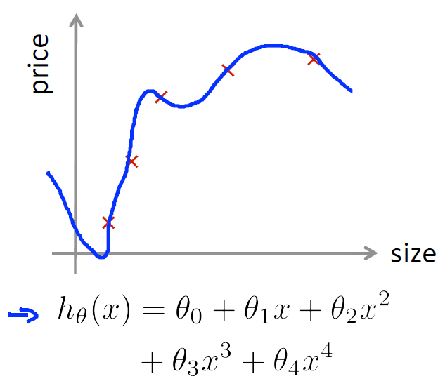

# Advice for Applying Machine Learning

## Evaluating a Learning Algorithm

### Deciding What to Try Next

### Lecture Notes

+ Debugging a learning algorithm

  Suppose you have implemented regularized linear regression to predict housing prices.

  $$J(\theta) = \dfrac{1}{2m} \left[ \sum_{i=1}^m (h_\theta(x^{(i)}) - y^{(i)})^2 + \lambda \sum_{j=1}^n \theta_j^2 \right]$$

  + However, when you test your hypothesis your hypothesis on new set of houses, you find that it makes unacceptably large errors. You can do the following

    + Get more training data
    + Smaller set of features
    + Get additional features
    + Try adding polynomial features ($x_1^2, x_2^2, x_1x_2,$ etc.)
    + Try decreasing lambda
    + Try increasing lambda

  + Typically people randomly choose these avenues and then figure out it may not be suitable
  + There is a simple technique to weed out avenues that are not suitable

+ Machine Learning Diagnostic
  + Test that you can run to gain insight what is or isn’t working with a learning algorithm and gain guidance as to how best to improve its performance
  + Diagnostics can take time to implement, but doing so can be a very good use of your time
  + But it’s worth the time compared to spending months on unsuitable avenues
  + IVQ: Which of the following statements about diagnostics are true? Check all that apply.

    1. It’s hard to tell what will work to improve a learning algorithm, so the best approach is to go with gut feeling and just see what works.
    2. Diagnostics can give guidance as to what might be more fruitful things to try to improve a learning algorithm.
    3. Diagnostics can be time-consuming to implement and try, but they can still be a very good use of your time.
    4. A diagnostic can sometimes rule out certain courses of action (changes to your learning algorithm) as being unlikely to improve its performance significantly.

    Ans: 234

#### Lecture Video

<video src="https://d3c33hcgiwev3.cloudfront.net/10.1-AdviceForApplyingMachineLearning-DecidingWhatToTryNext.c45ffb80b22b11e49f072fa475844d6b/full/360p/index.mp4?Expires=1555027200&Signature=G6qZQfvjvanJYSPo9p1fGHEzj4gYPiyjtD9rrhTYx2HYDDXiS4ZMXzTp6Gr4zkRpgA5-DrSvgvt7smx5AnVaNrUTCEh5gfkLgHyfOZcQG2-jOJcrgKKEhR8GthkXr9fxZEDIiCWm0HQ92lhimEg6n~W-dnnZz4-IQP9tJF07Nj8_&Key-Pair-Id=APKAJLTNE6QMUY6HBC5A" preload="none" loop="loop" controls="controls" style="margin-left: 2em;" muted="" poster="http://www.multipelife.com/wp-content/uploads/2016/08/video-converter-software.png" width="180">
  <track src="https://www.coursera.org/api/subtitleAssetProxy.v1/gW252s0RSIStudrNETiEow?expiry=1555027200000&hmac=e3fCh0AMP6u9UMsU9iJSfz_8xOIligRLLGGkLXpgcvY&fileExtension=vtt" kind="captions" srclang="en" label="English" default>
  Your browser does not support the HTML5 video element.
</video>
 

### Evaluating a Hypothesis

#### Lecture Notes

+ Evaluating your hypothesis
  
  Fails to generalize to new examples not in training set

  $$\begin{array}{rclcrcl} x_1 & = & \text{size of house} & \qquad & x_2 & = & \text{no. of bedrooms} \\ x_3 & = & \text{no. of floors} &\qquad & x_4 & = & \text{age of house} \\ x_5 & = & \text{average income in neighborhood} & \qquad & x_6 & = & \text{kitchen size} \\ & & & \cdots \\ x_{100} & & \cdots \end{array}$$

  

    

  

  + $m_{test}\;$: no. of test sample
  + $(x^{(i)}_{test},\; y^{(i)})\;$: $i$-th sample of the test samples
  + Typical proportions of training and test dataset: $70\%$ vs $30\%$
  + IVQ: Suppose an implementation of linear regression (without regularization) is badly overfitting the training set. In this case, we would expect:

    1. The training error $J(\theta)$ to be __low__ and the test error $J_{\text{test}}(\theta)$ to be __high__
    2. The training error $J(\theta)$ to be __low__ and the test error $J_{\text{test}}(\theta)$ to be __low__
    3. The training error $J(\theta)$ to be __high__ and the test error $J_{\text{test}}(\theta)$ to be __low__
    4. The training error $J(\theta)$ to be __high__ and the test error $J_{\text{test}}(\theta)$ to be __high__

    Ans: 1

+ Training/testing procedure for linear regression
  + Learn parameter $\theta$ from training data (minimizing training error $J(\theta)$); $70\%$ of the whole dataset
  + Compute test set error (another $30\%$): $J_{test} (\theta) = \dfrac{1}{2m_{test}} \displaystyle \sum_{i=1}^{m_{test}} (h_\theta(x^{(i)}_{test}) - y^{(i)}_{test})^2$

+ Training/testing procedure for logistic regression
  + Learn parameter $\theta$ from training data
  + compute test set error:

    $$J_{test}(\theta) = -\dfrac{1}{m_{test}} \sum_{i=1}^{m_{test}} \left[ y^{(i)}_{test} \log(h_\theta(x_{test}^{(i)})) + (1 - y_{test}^{(i)}) \log(1 - h_\theta(x_{test}^{(i)}))\right]$$

  + Misclassification error (0/1 misclassification error):

    $$\begin{array}{rcl} err(h_\theta(x),\; y) &=& \begin{cases} 1 & \text{if }\; h_\theta(x) \geq 0.5, \; y= 0 \\ & \text{or if } \;h_\theta(x) < 0.5, \;y = 1 \\ 0 & \text{otherwise} \end{cases} \\\\ \text{Test error} & = & \dfrac{1}{m_{test}} \displaystyle \sum_{i=1}^{m_{test}} err(h_\theta(x_{test}^{(i)}), \;y^{(i)}) \end{array}$$

-----------------------------------------------------------

Once we have done some trouble shooting for errors in our predictions by:

+ Getting more training examples
+ Trying smaller sets of features
+ Trying additional features
+ Trying polynomial features
+ Increasing or decreasing $\lambda$

We can move on to evaluate our new hypothesis.

A hypothesis may have a low error for the training examples but still be inaccurate (because of overfitting). Thus, to evaluate a hypothesis, given a dataset of training examples, we can split up the data into two sets: a training set and a test set. Typically, the training set consists of 70% of your data and the test set is the remaining 30%.

The new procedure using these two sets is then:

+ Learn $\theta$ and minimize $J_{train}(\theta)$ using the training set
+ Compute the test set error $J_{test}(\theta)$

__The test set error__

1. For linear regression: $J_{test}(\theta) = \dfrac{1}{2m_{test}} \sum_{i=1}^{m_{test}} (h_\theta(x^{(i)}_{test}) − y^{(i)}_{test})^2$
2. For classification ~ Misclassification error (aka 0/1 misclassification error):

  $$err(h_\theta(x), \;y) = \begin{cases} 1 & \text{if } h_\theta(x) \geq 0.5 \text{ and } y=0 \\ & \text{or } h_\theta(x)< 0.5 \text{ and } y=1 \\ 0 & \text{otherwise} \end{cases}$$

This gives us a binary 0 or 1 error result based on a misclassification.

The average test error for the test set is

$$\text{Test Error } = \dfrac{1}{m_{test}} \sum_{i=1}^{m_{test}} err(h_\theta(x^{(i)}_{test}),y^{(i)}_{test})$$

This gives us the proportion of the test data that was misclassified.

#### Lecture Video

<video src="https://d3c33hcgiwev3.cloudfront.net/10.2-AdviceForApplyingMachineLearning-EvaluatingAHypothesis.c45721e0b22b11e4aca907c8d9623f2b/full/360p/index.mp4?Expires=1555113600&Signature=AOmEgzbFWI4VWblh9HkZ0dc0vbrjOGoBPMo5sexdwaYRAZQVRtLIJkuuplZs3XsG8gxMhQk0JVSr6h-5OpGSpVMUxh8hR6gFq3s2MsMO3KJMWabn6h6IdlMsbI4LVSV1QSEVTBYJnMAhYB4d8O61XMCNNonW3KtylV7guAMC3Xc_&Key-Pair-Id=APKAJLTNE6QMUY6HBC5A" preload="none" loop="loop" controls="controls" style="margin-left: 2em;" muted="" poster="http://www.multipelife.com/wp-content/uploads/2016/08/video-converter-software.png" width="180">
  <track src="https://www.coursera.org/api/subtitleAssetProxy.v1/dXB5OF6rRQWweTheq9UFfg?expiry=1555113600000&hmac=4YMcKQ7w0fWeNrFHD26ofOvS9lilneN4vNiAgYl6IQw&fileExtension=vtt" kind="captions" srclang="en" label="English" default>
  Your browser does not support the HTML5 video element.
</video>
 

### Model Selection and Train/Validation/Test Sets

#### Lecture Notes

+ Overfitting example

  

    

  

  Once parameter $\theta_1, \theta_2, \theta_3, \theta_4$ were fit to some set of data (training set), the error of the parameters as measured on that data (the training error $J(\theta)$) is likely to be lower that the actual generalization error.

+ Model selection ($d\;$ = degree of polynomial)

  $$\begin{array}{crclcccc} d = 1 & h_\theta(x) &=& \theta_0 + \theta_1 x & \quad\rightarrow\quad & \theta^{(1)} & \quad\rightarrow\quad & J_{test}(\theta^{(1)}) \\ d = 2 & h_\theta(x) &=& \theta_0 + \theta_1 x + \theta_2 x^2 & \quad\rightarrow\quad & \theta^{(2)} & \quad\rightarrow\quad & J_{test}(\theta^{(2)}) \\d = 3 & h_\theta(x) &=& \theta_0 + \theta_1 x + \ldots + \theta_3 x^3 & \quad\rightarrow\quad & \theta^{(3)} & \quad\rightarrow\quad & J_{test}(\theta^{(3)}) \\ & & \vdots & & & \vdots & & \vdots \\ d = 10 & h_\theta(x) &=& \theta_0 + \theta_1 x + \ldots + \theta_{10} x^{10} & \quad\rightarrow\quad & \theta^{(10)} & \quad\rightarrow\quad & J_{test}(\theta^{(10)}) \end{array}$$

  + Choose $\theta_0 + \ldots + \theta_5 x^5$
  + How well does the model generalize? Report test set error $J_{test}(\theta^{(5)})$
  + Problem: $J_{test}(\theta^{(5)})$ is likely yo be the optimistic estimate of generalization error. I.e., out extra parameter ($d$ = degree of polynomial) is fit to test set.

+ Evaluate hypothesis

  

    

  

+ Train/validation/test error
  + Training error:

    $$J_{train}(\theta) = \dfrac{1}{2m} \sum_{i=1}^m (h_\theta(x^{(i)}) - y^{(i)})^2$$

  + Cross Validation error:

    $$J_{cv}(\theta) = \dfrac{1}{2m_{cv}} \sum_{i=1}^{m_{cv}} (h_\theta(x^{(i)}_{cv}) - y^{(i)}_{cv})^2$$

  + Test error: 

  $$J_{test}(\theta) = \dfrac{1}{2m_{test}} \sum_{i=1}^{m_{test}} (h_\theta(x^{(i)}_{test}) - y^{(i)}_{test})^2$$

+ Model selection

  $$\begin{array}{crclcccccc} d = 1 & h_\theta(x) &=& \theta_0 + \theta_1 x & \quad\rightarrow\quad  \min_{\theta} J(\theta) & \rightarrow & \theta^{(1)} & \rightarrow & J_{cv}(\theta^{(1)}) \\ d = 2 & h_\theta(x) &=& \theta_0 + \theta_1 x + \theta_2 x^2 & \quad\rightarrow\quad  \min_{\theta} J(\theta) & \rightarrow & \theta^{(2)} & \rightarrow & J_{cv}(\theta^{(2)}) \\ d = 3 & h_\theta(x) &=& \theta_0 + \theta_1 x + \ldots + \theta_3 x^3 & \quad\rightarrow\quad  \min_{\theta} J(\theta) & \rightarrow & \theta^{(3)} & \rightarrow & J_{cv}(\theta^{(3)}) \\ & & \vdots & & & \vdots & & \vdots \\ d = 10 & h_\theta(x) &=& \theta_0 + \theta_1 x + \ldots + \theta_{10} x^{10} & \quad\rightarrow\quad  \min_{\theta} J(\theta) & \rightarrow & \theta^{(10)} & \rightarrow & J_{cv}(\theta^{(10)}) \end{array}$$

  + Pick $\theta_0 + \theta_1 x + \ldots + \theta_4 x^4$
  + Estimate generalization error for test set $J_{test}(\theta^{(4)})$

+ IVQ: Consider the model selection procedure where we choose the degree of polynomial using a cross validation set. For the final model (with parameters $\theta$), we might generally expect $J_{\text{cv}}(\theta)$ To be lower than $J_\text{test}(\theta)$ because:

  1. An extra parameter ($d$, the degree of the polynomial) has been fit to the cross validation set.
  2. An extra parameter ($d$, the degree of the polynomial) has been fit to the test set.
  3. The cross validation set is usually smaller than the test set.
  4. The cross validation set is usually larger than the test set.

  Ans: 1

------------------------------------------------------

Just because a learning algorithm fits a training set well, that does not mean it is a good hypothesis. It could over fit and as a result your predictions on the test set would be poor. The error of your hypothesis as measured on the data set with which you trained the parameters will be lower than the error on any other data set.

Given many models with different polynomial degrees, we can use a systematic approach to identify the 'best' function. In order to choose the model of your hypothesis, you can test each degree of polynomial and look at the error result.

One way to break down our dataset into the three sets is:

+ Training set: 60%
+ Cross validation set: 20%
+ Test set: 20%

We can now calculate three separate error values for the three different sets using the following method:

1. Optimize the parameters in $\theta$ using the training set for each polynomial degree.
2. Find the polynomial degree $d$ with the least error using the cross validation set.
3. Estimate the generalization error using the test set with $J_{test}(\theta^{(d)})$, (d = theta from polynomial with lower error);

This way, the degree of the polynomial $d$ has not been trained using the test set.

#### Lecture Video

<video src="https://d3c33hcgiwev3.cloudfront.net/10.3-AdviceForApplyingMachineLearning-ModelSelectionAndTrainValidationTestSets.c9df62b01ceb11e49e31953afc6bb754/full/360p/index.mp4?Expires=1555113600&Signature=f83LTszL7tUV-qrIP~i~luuNOZ2jvA9BwdVL1mDwHwmq-yUQljxeP~4rfbolWqdJjemOMBE1ANd~Ny02YKIwSLmJHl5FsHKftLxLOs8~zO6LS07fW7QRxGOYJVsQ1THjY9HS8mV~AI7J0t-o-01p5sy43d~TKXXigTy9b-bqov8_&Key-Pair-Id=APKAJLTNE6QMUY6HBC5A" preload="none" loop="loop" controls="controls" style="margin-left: 2em;" muted="" poster="http://www.multipelife.com/wp-content/uploads/2016/08/video-converter-software.png" width="180">
  <track src="https://www.coursera.org/api/subtitleAssetProxy.v1/73vkBMPVSNm75ATD1bjZAQ?expiry=1555113600000&hmac=-pmp31l2n-vgfxKCAQcSG0YcFjD9oTN_tuYplDbUOdc&fileExtension=vtt" kind="captions" srclang="en" label="English" default>
  Your browser does not support the HTML5 video element.
</video>
 

## Bias vs. Variance

### Diagnosing Bias vs. Variance

#### Lecture Notes

+ Bias vs. Variance

  

    

  

  + Training error:

    $$J_{train}(\theta) = \dfrac{1}{2m} \sum_{i=1}^m (h_\theta(x^{(i)}) - y^{_(i)})^2$$

  + Cross validation error:

    $$J_{cv}(\theta) = \dfrac{1}{2m_{cv}} \sum_{i=1}^{m_{cv}} (h_\theta(x_{cv}^{(i)}) - y_{cv}^{_(i)})^2$$

  

    

  

  + Diagram applied for $J_{test}(\theta)$ as well

+ Diagnosing bias vs. variance
  + Suppose the learning algorithm is performing less well than expected.  ($J_{cv}(\theta)$ or $J_{test}(\theta)$ is high.) Is it a bias problem or a variance problem?
  + Bias (underfit): $J_{train}(\theta)$ will be high, while $J_{cv}(\theta) \approx J_{train}(\theta)$
  + Variance (overfit): $J_{train}(\theta)$ will be low, while $J_{cv}(\theta) \gg J_{train}(\theta)$
  + IVQ: Suppose you have a classification problem. The (misclassification) error is defined as $\frac{1}{m}\sum_{i=1}^m\text{err}(h_\theta(x^{(i)}),y^{(i)})$, and the cross validation (misclassification) error is similarly defined, using the cross validation examples ($x_\text{cv}^{(1)}, y_\text{cv}^{(1)}),\ldots,(x_\text{cv}^{(m_\text{cv})}, y_\text{cv}^{(m_\text{cv})})$. Suppose your training error is 0.10, and your cross validation error is 0.30. What problem is the algorithm most likely to be suffering from?

    1. High bias (overfitting)
    2. High bias (underfitting)
    3. High variance (overfitting)
    4. High variance (underfitting)

    Ans: 3

---------------------------------------------------

In this section we examine the relationship between the degree of the polynomial $d$ and the underfitting or overfitting of our hypothesis.

+ We need to distinguish whether __bias__ or __variance__ is the problem contributing to bad predictions.
+ High bias is underfitting and high variance is overfitting. Ideally, we need to find a golden mean between these two.

The training error will tend to __decrease__ as we increase the degree d of the polynomial.

At the same time, the cross validation error will tend to __decrease__ as we increase d up to a point, and then it will increase as d is increased, forming a convex curve.

__High bias (underfitting)__: both $J_{train}(\theta)$ and $J_{cv}(\theta)$ will be high. Also, $J_{cv}(\theta) \approx J_{train}(\theta)$.

__High variance (overfitting)__: $J_{train}(\theta)$ will be low and $J_{cv}(\theta) \gg J_{train}(\theta)$.

The is summarized in the figure below:

  

#### Lecture Video

<video src="https://d3c33hcgiwev3.cloudfront.net/10.4-AdviceForApplyingMachineLearning-DiagnosingBiasVsVariance.a8c702b0b22b11e4beb61117ba5cda9e/full/360p/index.mp4?Expires=1555113600&Signature=Hn~Ert97edvR53iV47beHMEuEqn8W1VUliZBEihAkT2aY3fiL~PEi3NgdgA4seLU4l0VaJPMeTJk3E7JcU6WTIlLDC2MxS2xIvm23yZv9aP0-mx8MuM4wWaRap4OMhPiYjmImSTh9QdbkYUhWArAPTtmoKjU8uYVv1Ne1EgcDEg_&Key-Pair-Id=APKAJLTNE6QMUY6HBC5A" preload="none" loop="loop" controls="controls" style="margin-left: 2em;" muted="" poster="http://www.multipelife.com/wp-content/uploads/2016/08/video-converter-software.png" width="180">
  <track src="https://www.coursera.org/api/subtitleAssetProxy.v1/PuZ5D9xXSEqmeQ_cV5hKWg?expiry=1555113600000&hmac=UmdaP8S_DJf3j4jUIivoztpdFUaHftOOL-juQkTjD3I&fileExtension=vtt" kind="captions" srclang="en" label="English" default>
  Your browser does not support the HTML5 video element.
</video>
 

### Regularization and Bias/Variance

#### Lecture Notes

+ Linear regression with regularization
  + Model: $h_\theta(x) = \theta_0 + \theta_1 x + \theta_2 x^2 + \theta_3 x^3 + \theta_4 x^4$

    $$J(\theta) = \dfrac{1}{2m} \sum(h_\theta(x^{(i)}) - y^{(i)})^2 + \dfrac{\lambda}{2m} \sum_{j=1}^n \theta_j^2$$

  

    
<a href="https://www.ritchieng.com/applying-machine-learning/#1a-deciding-what-to-try-next">
       high bias; small lambda -> high variance" title="Linear regression with regularization" width="450">
    </a>

  

+ Choosing the regularization parameter $\lambda$

  $$\begin{array}{rcl} h_\theta(x) &=& \theta_0 + \theta_1 x + \theta_2 x^2 + \theta_3 x^3 + \theta_4 x^4 \\ J(\theta) &=& \dfrac{1}{2m} \sum_{i=1}^m (h_\theta(x^{(i)}) - y^{(i)})^2 + \dfrac{\lambda}{2m} \sum_{j=1}^n \theta_j^2 \\\\ J_{train}(\theta) &=& \dfrac{1}{2m} \sum_{i=1}^m (h_\theta(x^{(i)}) - y^{(i)})^2 \\ J_{cv}(\theta) &=& \dfrac{1}{2m_{cv}} \sum_{i=1}^{m_{cv}} (h_\theta(x_{cv}^{(i)}) - y_{cv}^{(i)})^2 \\J_{test}(\theta) &=& \dfrac{1}{2m_{test}} \sum_{i=1}^{m_{test}} (h_\theta(x_{test}^{(i)}) - y_{test}^{(i)})^2 \end{array}$$

  $ 1. \;\;\lambda = 0.00 \;\rightarrow\; \min_\theta J(\theta) \;\rightarrow\; \theta^{(1)} \;\rightarrow\; J_{cv}(\theta^{(1)})$ 
  $ 2. \;\;\lambda = 0.01 \;\rightarrow\; \min_\theta J(\theta) \;\rightarrow\; \theta^{(2)} \;\rightarrow\; J_{cv}(\theta^{(2)})$ 
  $ 3. \;\;\lambda = 0.02 \;\rightarrow\; \min_\theta J(\theta) \;\rightarrow\; \theta^{(3)} \;\rightarrow\; J_{cv}(\theta^{(3)})$ 
  $ 4. \;\;\lambda = 0.04 \;\rightarrow\; \min_\theta J(\theta) \;\rightarrow\; \theta^{(4)} \;\rightarrow\; J_{cv}(\theta^{(4)})$ 
  $ 5. \;\;\lambda = 0.08 \;\rightarrow\; \min_\theta J(\theta) \;\rightarrow\; \theta^{(5)} \;\rightarrow\; J_{cv}(\theta^{(5)})$ 
  ... 
  $12. \lambda = 10.24 \approx 10 \;\rightarrow\; \min_\theta J(\theta) \;\rightarrow\; \theta^{(12)} \;\rightarrow\; J_{cv}(\theta^{(12)})$

  pick (say with lowest $J(\theta)$ value) $\quad\theta^{(5)} \;\rightarrow\; \text{Test error: } J_{test}(\theta^{(5)})$

+ Bias/Variance as a function of the regularization parameter $\lambda$

  

    

  

  + IVQ: Consider regularized logistic regression. Let

    $$\begin{array}{rcl} J_{train}(\theta) &=& \dfrac{1}{2m} \sum_{i=1}^m (h_\theta(x^{(i)}) - y^{(i)})^2 \\ J_{cv}(\theta) &=& \dfrac{1}{2m_{cv}} \sum_{i=1}^{m_{cv}} (h_\theta(x_{cv}^{(i)}) - y_{cv}^{(i)})^2 \\J_{test}(\theta) &=& \dfrac{1}{2m_{test}} \sum_{i=1}^{m_{test}} (h_\theta(x_{test}^{(i)}) - y_{test}^{(i)})^2 \end{array}$$

    Suppose you plot $J_\text{train}$ and $J_\text{cv}$ as a function of the regularization parameter $\lambda$. which of the following plots do you expect to get?

    

      

    

    Ans: Fig.4

+ Relationship between lambda and the hypothesis:

  

+ [Procedure to choose the model and the regularization $\lambda$](http://www.saberismywife.com/2016/12/13/Machine-Learning-6/)

  1. Create a list of lambda (i.e. $\lambda \in \{0,0.01,0.02,0.04,0.08,0.16,0.32,0.64,1.28,2.56,5.12,10.24\}$);
  2. Select a lambda to compute;
  3. Create a model set like degree of the polynomial or others;
  4. Select a model to learn $\theta$;
  5. Learn the parameter $\theta$ for the model selected, using $J_{train}(\theta)$ with λ selected (this will learn $\theta$ for the next step);
  6. Compute the train error using the learned $\theta$ (computed with λ ) on the $J_{train}(\theta)$ without regularization or $\lambda = 0$;
  7. Compute the cross validation error using the learned $\theta$ (computed with λ) on the $J_{cv}(\theta)$ without regularization or $\lambda = 0$;
  8. Do this for the entire model set and lambdas, then select the best combo that produces the lowest error on the cross validation set;
  9. Now if you need visualize to help you understand your decision, you can plot to the figure like above with: ($\lambda \times J_{train}(\theta)$) and ($\lambda \times J_{cv}(\theta)$);
  10. Now using the best combo $\theta$ and $\lambda$, apply it on $J_{cv}(\theta)$ to see if it has a good generalization of the problem.
  11. To help decide the best polynomial degree and λ to use, we can diagnose with the learning curves, that is the next subject.

-----------------------------------------------------------

Note: [The regularization term below and through out the video should be $\frac{\lambda}{2m} \sum_{j=1}^n \theta_j^2$ and NOT $\frac{\lambda}{2m} \sum_{j=1}^m \theta_j^2$]

  

In the figure above, we see that as $\lambda$ increases, our fit becomes more rigid. On the other hand, as $\lambda$ approaches 0, we tend to over overfit the data. So how do we choose our parameter $\lambda$ to get it 'just right' ? In order to choose the model and the regularization term $\lambda$, we need to:

1. Create a list of lambdas (i.e. $\lambda \in \{0,0.01,0.02,0.04,0.08,0.16,0.32,0.64,1.28,2.56,5.12,10.24\}$);
2. Create a set of models with different degrees or any other variants.
3. Iterate through the $\lambda$s and for each $\lambda$ go through all the models to learn some $\theta$.
4. Compute the cross validation error using the learned $\theta$ (computed with $\lambda$) on the $J_{cv}(\theta)$ without regularization or $\lambda = 0$.
5. Select the best combo that produces the lowest error on the cross validation set.
6. Using the best combo $\theta$ and $\lambda$, apply it on $J_{test}(\theta)$ to see if it has a good generalization of the problem.

#### Lecture Video

<video src="https://d3c33hcgiwev3.cloudfront.net/10.5-AdviceForApplyingMachineLearning-RegularizationAndBiasVariance.b34e0490b22b11e4960bf70a8782e569/full/360p/index.mp4?Expires=1555113600&Signature=DfT934FSEg~ltRYbEhiqTdQk-UAJQC~ACIROu5wMdbIR~AmJmRMBf62UhKyYIxO6ViOqh4s5Lz6mb7ksuIZhdW75eFUBXbrdHK46i0w6A~TtA3tPBuRyKIFZ29zX3u82C68sUy-KtiiWC2EFxf0EzwwL232xtDxrKQa1rf2Tifo_&Key-Pair-Id=APKAJLTNE6QMUY6HBC5A" preload="none" loop="loop" controls="controls" style="margin-left: 2em;" muted="" poster="http://www.multipelife.com/wp-content/uploads/2016/08/video-converter-software.png" width="180">
  <track src="https://www.coursera.org/api/subtitleAssetProxy.v1/t43e6dRNTgWN3unUTV4FSg?expiry=1555113600000&hmac=YQUSqrOLoNSJCu0dtuBZ0Pm8kOvsQWpWBlbb8xlUc9M&fileExtension=vtt" kind="captions" srclang="en" label="English" default>
  Your browser does not support the HTML5 video element.
</video>
 

### Learning Curves

#### Lecture Notes

+ Learning curves

  

    

  

  + What is the effect of $m$, number of training examples, on training error?
    + For $m = 1, 2, 3$ in the example
      + If the training set is small
      + Easier to fit every single training example perfectly
      + Your training error = 0 or small
    + For $m = 4, 5, 6$
      + If the training set grows larger
      + Harder to fit every single training example perfectly
      + Your training error increases
    + In general, when $m$ increases, training error increases
  + The more data you have, where $m$ increases
      + Your cross validation error decreases

+ High Bias (Underfit)
  + Poor performance on both training and test sets
  + Your cross validation error decreases, but it decreases to a high value
    + Even if you have large m, you still have a straight line with a high bias
    + Your cross validation error would still be high
  + Your training error increases close to the level achieve from your cross validation error
  + If a learning algorithm is suffering from high bias, getting more training data will not (by itself) help much
    + As seen from the two graphs, even with a higher m, there’s no use collecting more data to decrease your cross validation error

  

    

  

+ High Variance (Overfit)
  + Gap in errors where training error is low but test error is high
  + Training error would remain small
    + This happens when you use a small λ
    + Your training error increases with m because it becomes harder to fit your data
  + Cross validation error would remain high
    + This happens when you use a small λ
  + If a learning algorithm is suffering from high variance, getting more data is likely to help

  

    

  

+ IVQ: In which of the following circumstances is getting more training data likely to significantly help a learning algorithm’s performance?

  1. Algorithm is suffering from high bias.
  2. Algorithm is suffering from high variance.
  3. $J_\text{cv}(\theta)$ (cross validation error) is much larger than $J_\text{train}(\theta)$ (training error).
  4. $J_\text{cv}(\theta)$ (cross validation error) is about the same as $J_\text{train}(\theta)$ (training error).

  Ans: 23

------------------------------------------------

Training an algorithm on a very few number of data points (such as 1, 2 or 3) will easily have 0 errors because we can always find a quadratic curve that touches exactly those number of points. Hence:

+ As the training set gets larger, the error for a quadratic function increases.
+ The error value will plateau out after a certain m, or training set size.

__Experiencing high bias:__

__Low training set size__: causes $J_{train}(\theta)$ to be low and $J_{cv}(\theta)$ to be high.

__Large training set size__: causes both $J_{train}(\theta)$ and $J_{cv}(\theta)$ to be high with $J_{train}(\theta) \approx J_{cv}(\theta)$.

If a learning algorithm is suffering from __high bias__, getting more training data will not (__by itself__) help much.

  

__Experiencing high variance:__

__Low training set size__: $J_{train}(\theta)$ will be low and $J_{cv}(\theta)$ will be high.

__Large training set size__: $J_{train}(\theta)$ increases with training set size and $J_{cv}(\theta)$ continues to decrease without leveling off. Also, $J_{train}(\theta)$ < $J_{cv}(\theta)$ but the difference between them remains significant.

If a learning algorithm is suffering from __high variance__, getting more training data is likely to help.

  

#### Lecture Video

<video src="https://d3c33hcgiwev3.cloudfront.net/10.6-AdviceForApplyingMachineLearning-LearningCurves.114ca110b22b11e4bb7e93e7536260ed/full/360p/index.mp4?Expires=1555113600&Signature=ezSNsWxaDdHy8lD5y-aWS2D4Er1XsrtSTnu4Dze-pfGFvIebc~soB7jVmqqBIDtElWDjcpX-4TIHaghT7NriQR~vvEr3iXpuIXUsWjgA7SQB5Rq~~6MQ3e8Lxq73kVvrkFm0jrURqMMQjXRdBjL2UT5-VikXsyqHFnnt7rLJEms_&Key-Pair-Id=APKAJLTNE6QMUY6HBC5A" preload="none" loop="loop" controls="controls" style="margin-left: 2em;" muted="" poster="http://www.multipelife.com/wp-content/uploads/2016/08/video-converter-software.png" width="180">
  <track src="https://www.coursera.org/api/subtitleAssetProxy.v1/A14kNoRUSo2eJDaEVMqNlw?expiry=1555113600000&hmac=y-RPYb7-bU5QE9Om5nXgXtpZgTL4R1AXlpiyAx972UQ&fileExtension=vtt" kind="captions" srclang="en" label="English" default>
  Your browser does not support the HTML5 video element.
</video>
 

### Deciding What to Do Next Revisited

#### Lecture Notes

+ Debugging a learning algorithm

  Suppose you have implemented regularized linear regression to predict housing prices.  However, when you test your hypothesis in a new set of houses, you find that it makes unacceptably large error in its prediction.  What should you try next?

  + Get more training data: Fixes high variance
  + Smaller set of features: Fixes high variance (Features are too complicated)
  + Get additional features: Fixes high bias (Features are too simple)
  + Try adding polynomial features: Fixes high bias ($d$ too low)
  + Try decreasing lambda: Fixes high bias (Because you would have a smaller regularized term, giving more importance to other features)
  + Try increasing lambda: Fixes high variance (Because you would have a larger regularized term, giving less importance to other features)

+ Neural networks and overfitting

  

    

  

  + Small neural network: (typical)
    + 1 hidden layer
    + 1 input layer
    + 1 output layer
    + Computationally cheaper
  + Large neural network (typical)
    + Multiple hidden layers
    + 1 input layer
    + 1 output layer
    + Computationally expensive
  + IVQ: Suppose you fit a neural network with one hidden layer to a training set. You find that the cross validation error $J_\text{CV}(\theta)$ is much larger than the training error $J_\text{train}(\theta)$. Is increasing the number of hidden units likely to help?

    1. Yes, because this increases the number of parameters and lets the network represent more complex functions.
    2. Yes, because it is currently suffering from high bias.
    3. No, because it is currently suffering from high bias, so adding hidden units is unlikely to help.
    4. No, because it is currently suffering from high variance, so adding hidden units is unlikely to help.

    Ans: 4

---------------------------------------------------------------

Our decision process can be broken down as follows:

+ __Getting more training examples__: Fixes high variance
+ __Trying smaller sets of features__: Fixes high variance
+ __Adding features__: Fixes high bias
+ __Adding polynomial features__: Fixes high bias
+ __Decreasing $\lambda$__: Fixes high bias
+ __Increasing $\lambda$__: Fixes high variance.

__Diagnosing Neural Networks__

+ A neural network with fewer parameters is __prone to underfitting__. It is also __computationally cheaper__.
+ A large neural network with more parameters is __prone to overfitting__. It is also __computationally expensive__. In this case you can use regularization (increase λ) to address the overfitting.

Using a single hidden layer is a good starting default. You can train your neural network on a number of hidden layers using your cross validation set. You can then select the one that performs best.

__Model Complexity Effects:__

+ Lower-order polynomials (low model complexity) have high bias and low variance. In this case, the model fits poorly consistently.
+ Higher-order polynomials (high model complexity) fit the training data extremely well and the test data extremely poorly. These have low bias on the training data, but very high variance.
+ In reality, we would want to choose a model somewhere in between, that can generalize well but also fits the data reasonably well.

#### Lecture Video

<video src="https://d3c33hcgiwev3.cloudfront.net/10.7-AdviceForApplyingMachineLearning-DecidingWhatToDoNextRevisited.09766750b22b11e487451d0772c554c0/full/360p/index.mp4?Expires=1555113600&Signature=Re12eh94KdIUm06bYJtj5MmNmQBvLiSLDgq3TyPr8M8QndCtFr9Jk5QN-eUgwdsZAL37veQ~vuhMsHYUxUY523ci9ruCCm0eRkoU6u~rGUNNz4Ryq48hgNDGQg6WXruO2iFqC15iJvuyB314QLzE9voo2-5R1XNVJ2vPr3z-b-E_&Key-Pair-Id=APKAJLTNE6QMUY6HBC5A" preload="none" loop="loop" controls="controls" style="margin-left: 2em;" muted="" poster="http://www.multipelife.com/wp-content/uploads/2016/08/video-converter-software.png" width="180">
  <track src="https://www.coursera.org/api/subtitleAssetProxy.v1/GUxhCJgGTFiMYQiYBjxYaA?expiry=1555113600000&hmac=oG3hLgP0LWkA2UHrqBtKImg1dqTAg0heAvB7n_cvF9s&fileExtension=vtt" kind="captions" srclang="en" label="English" default>
  Your browser does not support the HTML5 video element.
</video>
 

## Review

### [Lecture Slides](https://d3c33hcgiwev3.cloudfront.net/_b0cf48c6b7bc9f194310e6bc90dec220_Lecture10.pdf?Expires=1555027200&Signature=JZ5d8vEr1Me54~P93Q3pQxhCk3~BRCg26sqE3QdqzXRSb25g0wP0aeJY31mgyux6AA0AG8WBQUXjWnl2shHqen3Ska2AUuKwR-6VorXFwB6ClNWA-9r~KQeOD3V~HHIm-vSlYyqT2zGirZHCSn8l~eaRGBJmVgbp7Otrb1vI~GM_&Key-Pair-Id=APKAJLTNE6QMUY6HBC5A)

#### Deciding What to Try Next

Errors in your predictions can be troubleshooted by:

+ Getting more training examples
+ Trying smaller sets of features
+ Trying additional features
+ Trying polynomial features
+ Increasing or decreasing \lambda

Don't just pick one of these avenues at random. We'll explore diagnostic techniques for choosing one of the above solutions in the following sections.

#### Evaluating a Hypothesis

A hypothesis may have low error for the training examples but still be inaccurate (because of overfitting).

With a given dataset of training examples, we can split up the data into two sets: a __training set__ and a __test set__.

The new procedure using these two sets is then:

1. Learn \theta and minimize $J_{train}(\theta)$ using the training set
2. Compute the test set error $J_{test}(\theta)$

__The test set error__

1. For linear regression: $J_{test}(\theta) = \frac{1}{2m_{test}} \sum_{i=1}^{m_{test}} (h_\theta(x^{(i)}_{test}) − y^{(i)}_{test})^2$
2. For classification ~ Misclassification error (aka 0/1 misclassification error):

  $$err(h_\theta(x),y) = \begin{cases} 1 & \text{if } h_\theta(x) \geq 0.5 \text{ and } y=0 \text{ or } h_\theta(x)<0.5 \text{ and } y=1 \\ 0 & \text{otherwise} \end{cases}$$

This gives us a binary 0 or 1 error result based on a misclassification.

The average test error for the test set is

$$\text{Test Error } = \dfrac{1}{m_{test}} \sum_{i=1}^{test} err(h_\theta(x^{(i)}_{test}),y^{(i)}_{test})$$

This gives us the proportion of the test data that was misclassified.

#### Model Selection and Train/Validation/Test Sets

+ Just because a learning algorithm fits a training set well, that does not mean it is a good hypothesis.
+ The error of your hypothesis as measured on the data set with which you trained the parameters will be lower than any other data set.

In order to choose the model of your hypothesis, you can test each degree of polynomial and look at the error result.

__Without the Validation Set (note: this is a bad method - do not use it)__

1. Optimize the parameters in \theta using the training set for each polynomial degree.
2. Find the polynomial degree d with the least error using the test set.
3. Estimate the generalization error also using the test set with $J_{test}(\theta^{(d)})$, (d = theta from polynomial with lower error);

In this case, we have trained one variable, d, or the degree of the polynomial, using the test set. This will cause our error value to be greater for any other set of data.

__Use of the cv set__

To solve this, we can introduce a third set, the __Cross Validation Set__, to serve as an intermediate set that we can train d with. Then our test set will give us an accurate, non-optimistic error.

One example way to break down our dataset into the three sets is:

+ Training set: 60%
+ Cross validation set: 20%
+ Test set: 20%

We can now calculate three separate error values for the three different sets.

__With the Validation Set (note: this method presumes we do not also use the cv set for regularization)__

1. Optimize the parameters in \theta using the training set for each polynomial degree.
2. Find the polynomial degree d with the least error using the cross validation set.
3. Estimate the generalization error using the test set with $J_{test}(\theta^{(d)})$, (d = theta from polynomial with lower error);

This way, the degree of the polynomial d has not been trained using the test set.

(Mentor note: be aware that using the cv set to select 'd' means that we cannot also use it for the validation curve process of setting the lambda value).

#### Diagnosing Bias vs. Variance

In this section we examine the relationship between the degree of the polynomial d and the underfitting or overfitting of our hypothesis.

+ We need to distinguish whether __bias__ or __variance__ is the problem contributing to bad predictions.
+ High bias is underfitting and high variance is overfitting. We need to find a golden mean between these two.

The training error will tend to __decrease__ as we increase the degree d of the polynomial.

At the same time, the cross validation error will tend to __decrease__ as we increase d up to a point, and then it will __increase__ as d is increased, forming a convex curve.

__High bias (underfitting)__: both $J_{train}(\theta)$ and $J_{cv}(\theta)$ will be high. Also, $J_{cv}(\theta) \approx J_{train}(\theta)$.

__High variance (overfitting)__: $J_{train}(\theta)$ will be low and $J_{cv}(\theta)$ will be much greater than $J_{train}(\theta)$.

The is represented in the figure below:

  

#### Regularization and Bias/Variance

Instead of looking at the degree d contributing to bias/variance, now we will look at the regularization parameter \lambda.

+ Large $\lambda\;$: High bias (underfitting)
+ Intermediate $\lambda\;$: just right
+ Small $\lambda\;$: High variance (overfitting)

A large lambda heavily penalizes all the \theta parameters, which greatly simplifies the line of our resulting function, so causes underfitting.

The relationship of \lambda to the training set and the variance set is as follows:

+ Low $\lambda\;$: $J_{train}(\theta)$ is low and $J_{cv}(\theta)$ is high (high variance/overfitting).
+ Intermediate $\lambda\;$: $J_{train}(\theta)$ and $J_{cv}(\theta)$ are somewhat low and $J_{train}(\theta) \approx J_{cv}(\theta)$.
+ Large $\lambda\;$: both $J_{train}(\theta)$ and $J_{cv}(\theta)$ will be high (underfitting /high bias)

The figure below illustrates the relationship between lambda and the hypothesis:

  

In order to choose the model and the regularization \lambda, we need:

1. Create a list of lambdas (i.e. $\lambda \in \{0,0.01,0.02,0.04,0.08,0.16,0.32,0.64,1.28,2.56,5.12,10.24\}$);
2. Create a set of models with different degrees or any other variants.
3. Iterate through the $\lambda$s and for each $\lambda$ go through all the models to learn some $\theta$.
4. Compute the cross validation error using the learned $\theta$ (computed with $\lambda$) on the $J_{cv}(\theta)$ without regularization or $\lambda = 0$.
5. Select the best combo that produces the lowest error on the cross validation set.
6. Using the best combo $\theta$ and $\lambda$, apply it on $J_{test}(\theta)$ to see if it has a good generalization of the problem.

#### Learning Curves

Training 3 examples will easily have 0 errors because we can always find a quadratic curve that exactly touches 3 points.

+ As the training set gets larger, the error for a quadratic function increases.
+ The error value will plateau out after a certain m, or training set size.

__With high bias__

+ Low training set size: causes $J_{train}(\theta)$ to be low and $J_{cv}(\theta)$ to be high.
+ Large training set size: causes both $J_{train}(\theta)$ and $J_{cv}(\theta)$ to be high with $J_{train}(\theta) \approx J_{cv}(\theta)$.

If a learning algorithm is suffering from high bias, getting more training data will not (by itself) help much.

For high variance, we have the following relationships in terms of the training set size:

__With high variance__

+ Low training set size: $J_{train}(\theta)$ will be low and $J_{cv}(\theta)$ will be high.
+ Large training set size: $J_{train}(\theta)$ increases with training set size and $J_{cv}(\theta)$ continues to decrease without leveling off. Also, $J_{train}(\theta) < J_{cv}(\theta)$ but the difference between them remains significant.

If a learning algorithm is suffering from __high variance__, getting more training data is __likely to help__.

  

#### Deciding What to Do Next Revisited

Our decision process can be broken down as follows:

+ Getting more training examples: Fixes high variance
+ Trying smaller sets of features: Fixes high variance
+ Adding features: Fixes high bias
+ Adding polynomial features: Fixes high bias
+ Decreasing \lambda: Fixes high bias
+ Increasing \lambda: Fixes high variance

##### Diagnosing Neural Networks

+ A neural network with fewer parameters is __prone to underfitting__. It is also __computationally cheaper__.
+ A large neural network with more parameters is __prone to overfitting__. It is also __computationally expensive__. In this case you can use regularization (increase \lambda) to address the overfitting.

Using a single hidden layer is a good starting default. You can train your neural network on a number of hidden layers using your cross validation set.

##### Model Selection:

Choosing M the order of polynomials.

How can we tell which parameters \theta to leave in the model (known as "model selection")?

There are several ways to solve this problem:

+ Get more data (very difficult).
+ Choose the model which best fits the data without overfitting (very difficult).
+ Reduce the opportunity for overfitting through regularization.

__Bias: approximation error (Difference between expected value and optimal value)__

+ High Bias = UnderFitting (BU)
+ $J_{train}(\theta)$ and $J_{cv}(\theta)$ both will be high and $J_{train}(\theta) \approx J_{cv}(\theta)$

__Variance: estimation error due to finite data__

+ High Variance = OverFitting (VO)
+ $J_{train}(\theta)$ is low and $J_{cv}(\theta)\gg J_{train}(\theta)$

__Intuition for the bias-variance trade-off:__

+ Complex model $\implies$ sensitive to data $\implies$> much affected by changes in X $\implies$ high variance, low bias.
+ Simple model $\implies$ more rigid $\implies$ does not change as much with changes in X $\implies$ low variance, high bias.

One of the most important goals in learning: finding a model that is just right in the bias-variance trade-off.

__Regularization Effects:__

+ Small values of \lambda allow model to become finely tuned to noise leading to large variance $\implies$ overfitting.
+ Large values of \lambda pull weight parameters to zero leading to large bias $\implies$ underfitting.

__Model Complexity Effects:__

+ Lower-order polynomials (low model complexity) have high bias and low variance. In this case, the model fits poorly consistently.
+ Higher-order polynomials (high model complexity) fit the training data extremely well and the test data extremely poorly. These have low bias on the training data, but very high variance.
+ In reality, we would want to choose a model somewhere in between, that can generalize well but also fits the data reasonably well.

__A typical rule of thumb when running diagnostics is:__

+ More training examples fixes high variance but not high bias.
+ Fewer features fixes high variance but not high bias.
+ Additional features fixes high bias but not high variance.
+ The addition of polynomial and interaction features fixes high bias but not high variance.
+ When using gradient descent, decreasing lambda can fix high bias and increasing lambda can fix high variance (lambda is the regularization parameter).
+ When using neural networks, small neural networks are more prone to under-fitting and big neural networks are prone to over-fitting. Cross-validation of network size is a way to choose alternatives.

### Errata

#### Errata in the Graded Quizzes

Quiz questions in Week 6 should refer to linear regression, not logistic regression (typo only).

#### Errata in the Video Lectures

In the "Regularization and Bias/Variance" video

The slide "Linear Regression with Regularization" has an error in the formula for $J(\theta)\;$: the regularization term should go from $j=1$ up to $n$ (and not $m$), that is $\frac{\lambda}{2m} \sum_{j=1}^n \theta_j^2$. The quiz in the video "Regularization and Bias/Variance" has regularization terms for $J_{train}$ and $J_{cv}$, while the rest of the video stresses that these should not be there. Also, the quiz says "Consider regularized logistic regression," but exhibits cost functions for regularized linear regression.

At around 5:58, Prof. Ng says, "picking theta-5, the fifth order polynomial". Instead, he should have said the fifth value of $\lambda (0.08)$, because in this example, the polynomial degree is fixed at $d = 4$ and we are varying $\lambda$.

In the "Advice for applying ML" set of videos

Often (if not always) the sums corresponding to the regularization terms in J(\theta) are (erroneously) written with j running from 1 to m. In fact, j should run from 1 to n, that is, the regularization term should be $\lambda \sum_{j=1}^n \theta_j^2\lambda \sum_{j=1}^n \theta_j^2$. The variable m is the number of $(x,y)$ pairs in the set used to calculate the cost, while n is the largest index of $j$ in the $\theta_j$ parameters or in the elements $x_j$ of the vector of features.

In the "Advice for Applying Machine Learning" section, the figure that illustrates the relationship between lambda and the hypothesis. used to detect high variance or high bias, is incorrect. $J_{train}$ is low when lambda is small (indicating a high variance problem) and high when lambda is high (indicating a high bias problem).

Video (10-2: Advice for Applying Machine Learning -- hypothesis testing)

The slide that introduces Training/Testing procedure for logistic regression, (around 04:50) the cost function is incorrect. It should be:

$$J_{test}(\theta) = −\dfrac{1}{m_{test}} \sum^{m_{test}}_{i=1} (y^{(i)}_{test} \cdot \log(h\theta(x^{(i)}_{test}))+(1−y^{(i)}_{test}) \cdot \log(1−h\theta(x^{(i)}_{test})))$$

Video Regularization and Bias/Variance (00:48)

Regularization term is wrong. Should be $\frac{\lambda}{2m}\sum_{j=1}^{n}\theta_j^2$ and not sum over $m$.

Videos 10-4 and 10-5: current subtitles are mistimed

Looks like the videos were updated in Sept 2014, but the subtitles were not updated accordingly. (10-3 was also updated in Aug 2014, but the subtitles were updated)

#### Errata in the ex5 programming exercise

In ex5.m at line 104, the reference to "slide 8 in ML-advice.pdf" should be "Figure 3 in ex5.pdf".

### Quiz: Advice for Applying Machine Learning

1. You train a learning algorithm, and find that it has unacceptably high error on the test set. You plot the learning curve, and obtain the figure below. Is the algorithm suffering from high bias, high variance, or neither?

  

    

  

    1. High bias
    2. High variance
    3. Neither

    Ans: 2(Fig.1), 1 (Fig.2)

2. Suppose you have implemented regularized logistic regression to classify what object is in an image (i.e., to do object recognition). However, when you test your hypothesis on a new set of images, you find that it makes unacceptably large errors with its predictions on the new images. However, your hypothesis performs __well__ (has low error) on the training set. Which of the following are promising steps to take? Check all that apply.

    1. Use fewer training examples.
    2. Get more training examples.
    3. Try using a smaller set of features.
    4. Try adding polynomial features.
    5. Try using a smaller set of features.
    6. Try evaluating the hypothesis on a cross validation set rather than the test set.
    7. Try decreasing the regularization parameter $\lambda$.
    8. Try increasing the regularization parameter $\lambda$.

    Ans: 58(5678), 23(1234)

3. Suppose you have implemented regularized logistic regression to predict what items customers will purchase on a web shopping site. However, when you test your hypothesis on a new set of customers, you find that it makes unacceptably large errors in its predictions. Furthermore, the hypothesis performs __poorly__ on the training set. Which of the following might be promising steps to take? Check all that apply.

    1. Try adding polynomial features.
    2. Try evaluating the hypothesis on a cross validation set rather than the test set.
    3. Use fewer training examples.
    4. Try decreasing the regularization parameter $\lambda$.

    Ans: 14, x124(1234)

4. Which of the following statements are true? Check all that apply.

    1. Suppose you are training a regularized linear regression model.The recommended way to choose what value of regularization parameter $\lambda$ to use is to choose the value of $\lambda$ which gives the lowest __training set__ error.
    2. Suppose you are training a regularized linear regression model. The recommended way to choose what value of regularization parameter $\lambda$ to use is to choose the value of $\lambda$ which gives the lowest __cross validation__ error.
    3. The performance of a learning algorithm on the training set will typically be better than its performance on the test set.
    4. Suppose you are training a regularized linear regression model. The recommended way to choose what value of regularization parameter $\lambda$ to use is to choose the value of $\lambda$ which gives the lowest __test set__ error.

    Ans: 23, x24, x234(1234)

5. Which of the following statements are true? Check all that apply.

    1. A model with more parameters is more prone to overfitting and typically has higher variance.
    2. If a learning algorithm is suffering from high variance, adding more training examples is likely to improve the test error.
    3. If a learning algorithm is suffering from high bias, only adding more training examples may __not__ improve the test error significantly.
    4. If the training and test errors are about the same, adding more features will __not__ help improve the results.
    5. We always prefer models with high variance (over those with high bias) as they will able to better fit the training set.
    6. When debugging learning algorithms, it is useful to plot a learning curve to understand if there is a high bias or high variance problem.

    Ans: x36, x26(5326), x124(1234)

