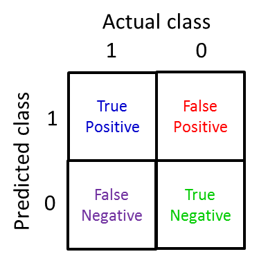
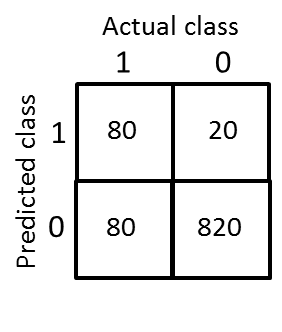

# Machine Learning System Design

## Building a Spam Classifier

### Prioritizing What to Work On

#### Lecture Notes

+ Building a spam classifier
  + Classes: Spam (1), Non-spam (0)
  + Supervised learning
  + $x\;$ = features of emails
  + $y\;$ = spam(1) or not spam (0)
  + Features: choose 100 word indicative of spam/not spam, e.g. deal, buy, discount, andrew, now, ...

    $$x_j = \begin{cases} 1 & \text{if word } j \text{ appears in email} \\ 0 & \text{otherwose} \end{cases}$$

    $$X = \begin{bmatrix} 0 \\ 1 \\ 1 \\ 0 \\ \vdots \\ 1 \\ \vdots \end{bmatrix} \quad \begin{matrix} \text{andrew} \\ \text{buy} \\ \text{deal} \\ \text{discount} \\ \vdots \\ \text{now} \\ \vdots \end{matrix} \quad\implies X \;\in\; \mathbb{R}^{100}$$
  
  + Note: In practice, take most frequently occurring $n$ words (10,000 to 50,000) in training set, rather than manually pick 100 words.
  + How to spend your time to make it have low error?
    + Collect lots of data, e.g., "honeypot" project
    + Develop sophisticated features based on email routing information (from email header)
    + Develop sophisticated feature for message body
      + Should "discount" and "discounts" be treated as the same word?
      + How about "deal" and "Dealer"?
      + Features about punctuation?
    + Develop sophisticated algorithm to detect misspellings (e.g. m0rtgage, med1cine, w4tches)

+ IVQ: Which of the following statements do you agree with? Check all that apply.

  1. For some learning applications, it is possible to imagine coming up with many different features (e.g. email body features, email routing features, etc.). But it can be hard to guess in advance which features will be the most helpful.
  2. For spam classification, algorithms to detect and correct deliberate misspellings will make a significant improvement in accuracy.
  3. Because spam classification uses very high dimensional feature vectors (e.g. n = 50,000 if the features capture the presence or absence of 50,000 different words), a significant effort to collect a massive training set will always be a good idea.
  4. There are often many possible ideas for how to develop a high accuracy learning system; “gut feeling” is not a recommended way to choose among the alternatives.

  Ans: 14


----------------------------------------

System Design Example:

Given a data set of emails, we could construct a vector for each email. Each entry in this vector represents a word. The vector normally contains 10,000 to 50,000 entries gathered by finding the most frequently used words in our data set. If a word is to be found in the email, we would assign its respective entry a 1, else if it is not found, that entry would be a 0. Once we have all our x vectors ready, we train our algorithm and finally, we could use it to classify if an email is a spam or not.

<div style="display:flex;justify-content:center;align-items:center;flex-flow:row wrap;">
  <div><a href="https://www.coursera.org/learn/machine-learning/supplement/0uu7a/prioritizing-what-to-work-on">
    
  </a></div>
</div>

So how could you spend your time to improve the accuracy of this classifier?

+ Collect lots of data (for example "honeypot" project but doesn't always work)
+ Develop sophisticated features (for example: using email header data in spam emails)
+ Develop algorithms to process your input in different ways (recognizing misspellings in spam).

It is difficult to tell which of the options will be most helpful.


#### Lecture Video

<video src="https://d3c33hcgiwev3.cloudfront.net/11.1-MachineLearningSystemDesign-PrioritizingWhatToWorkOn.bfb78210b22b11e4aca907c8d9623f2b/full/360p/index.mp4?Expires=1555286400&Signature=S~sggyayuandyK4fPtfle7sR9o-53TNRbA2ozmg-YC6FadWe62CvSBHIkdSWRws1CY26u26yilFLduVu162hEOA-NKBDeGXYpKj2GCLm3C~8Pv9sqlUbr~ATVO2ge0g6QG3yKZSPjgOks249JGsDABE7OzhytEspePTfQ9iPiLU_&Key-Pair-Id=APKAJLTNE6QMUY6HBC5A" preload="none" loop="loop" controls="controls" style="margin-left: 2em;" muted="" poster="http://www.multipelife.com/wp-content/uploads/2016/08/video-converter-software.png" width="180">
  <track src="https://www.coursera.org/api/subtitleAssetProxy.v1/12kP7pG7Q1CpD-6Ru1NQFQ?expiry=1555286400000&hmac=rFs2miXwp8J1GTWjJezlrZYzNbGsXQlgZBRsdnBIJ8w&fileExtension=vtt" kind="captions" srclang="en" label="English" default>
  Your browser does not support the HTML5 video element.
</video>
<br/>


### Error Analysis

#### Lecture Notes

+ Recommended approach
  + Start with a __simple algorithm__ that you can implement quickly. Implement it and test it on your cross­‐validation data.
  + Plot __learning curves__ to decide if more data, more features, etc. are likely to help.
  + __Error analysis__: 
    + Manually examine the examples (in cross validation set) that your algorithm made errors on.
    + See if you spot any systematic trend in what type of examples it is making errors on.
    + Don't base anything oo your gut feeling.

+ Error Analysis Example
  + $m_{cv}\;$ = 500 examples in cross validation set
  + Algorithm misclassifies 100 emails
  + Manually examine the 100 errors, and categorize then based on:
    1. what type of email it is, e.g. pharma (12), replica/fake (4), steal passwords (53), other (31)
    2. what cues (features) you think would have helped the algorithm classify them correctly.
      + Deliberate misspellings (m0rgage, med1cine, etc.): 5
      + Unusual email routing: 16
      + Unusual (spamming) punctuation" 32 (might be worthwhile to spend time to develop sophisticated features)
  + Find out what makes the algorithm misclassification most
  + The reason to develop quick and dirty implementation to discover errors and identify areas to focus on

+ The importance of numerical evaluation
  + Should discount/discounts/discounted/distounting be treated as the same work?
  + Can use "stemming" software (e.g. "Porter stemmer"), e.g. universe/university?
  + Error analysis may not be helpful for deciding of this is likely to improve performance. Only solution is to try it and see if it works.
  + Need numerical evaluation (e.g., cross validation error) of algorithm's performance with and without stemming.
    + without stemming: 5% error; with stemming: 3% error ==> better with stemming
    + distinguish upper vs. lower case (Mom/mon): 3.2%
  + IVQ: Why is the recommended approach to perform error analysis using the cross validation data used to compute $J_\text{CV}(\theta)$ rather than the test data used to compute $J_\text{test}(\theta)$?

    1. The cross validation data set is usually large.
    2. This process will give a lower error on the test set.
    3. If we develop new features by examining the test set, then we may end up choosing features that work well specifically for the test set, so $J_{test}(\theta)$ is no longer a good estimate of how well we generalize to new examples.
    4. Doing so is less likely to lead to choosing an excessive number of features.

    Ans: 3


----------------------------------------

The recommended approach to solving machine learning problems is to:

+ Start with a simple algorithm, implement it quickly, and test it early on your cross validation data.
+ Plot learning curves to decide if more data, more features, etc. are likely to help.
+ Manually examine the errors on examples in the cross validation set and try to spot a trend where most of the errors were made.

For example, assume that we have 500 emails and our algorithm misclassifies a 100 of them. We could manually analyze the 100 emails and categorize them based on what type of emails they are. We could then try to come up with new cues and features that would help us classify these 100 emails correctly. Hence, if most of our misclassified emails are those which try to steal passwords, then we could find some features that are particular to those emails and add them to our model. We could also see how classifying each word according to its root changes our error rate:

<div style="display:flex;justify-content:center;align-items:center;flex-flow:row wrap;">
  <div><a href="https://www.coursera.org/learn/machine-learning/supplement/Z11RP/error-analysis">
    
  </a></div>
</div>

It is very important to get error results as a single, numerical value. Otherwise it is difficult to assess your algorithm's performance. For example if we use stemming, which is the process of treating the same word with different forms (fail/failing/failed) as one word (fail), and get a $3\%$ error rate instead of $5\%$, then we should definitely add it to our model. However, if we try to distinguish between upper case and lower case letters and end up getting a $3.2\%$ error rate instead of $3\%$, then we should avoid using this new feature. Hence, we should try new things, get a numerical value for our error rate, and based on our result decide whether we want to keep the new feature or not.


#### Lecture Video

<video src="https://d3c33hcgiwev3.cloudfront.net/11.2-MachineLearningSystemDesign-ErrorAnalysis.b1ab7820b22b11e4960bf70a8782e569/full/360p/index.mp4?Expires=1555286400&Signature=d2SN0EOxF1j4LnYayKeb8jTLWJw1rZAuyeOHu0Up9aFHT-rgRdYVGbmidS5pNyTk-ir~cksoP0PevHtaEJrMkzqTI0I1SCnE49cWFVVvwlBSVAJHk1CaNIk6VmZYqurRumMbW0NIaBe0r3i6JKAYTVWQxwx1fAdq6fxowIu-p8E_&Key-Pair-Id=APKAJLTNE6QMUY6HBC5A" preload="none" loop="loop" controls="controls" style="margin-left: 2em;" muted="" poster="http://www.multipelife.com/wp-content/uploads/2016/08/video-converter-software.png" width="180">
  <track src="https://www.coursera.org/api/subtitleAssetProxy.v1/aA3ixgmVSquN4sYJlbqrDA?expiry=1555286400000&hmac=379XtCSqhWH_0sjnRK87mCH7NbB0qxX32l4wFPr9llc&fileExtension=vtt" kind="captions" srclang="en" label="English" default>
  Your browser does not support the HTML5 video element.
</video>
<br/>


## Handling Skewed Data

### Error Metrics for Skewed Classes

#### Lecture Notes

+ Cancer classification example
  + Train logistic regression model: $h_\theta(x)$
  + $y\;$ : cancer (1), otherwise (0)
  + Find that you got $1\%$ error on the test set ($99\%$ correct diagnoses)
  + Only $0.50\%$ of patients have cancer $\implies$ skewed classes

    ```matlab
    function y = predictCancer(x)
      y = 0;  % ignore x
    return
    ```
  
  + [imbalanced class distribution](https://www.analyticsvidhya.com/blog/2017/03/imbalanced-classification-problem/): a scenario where the number of observations belonging to one class is significantly lower than those belonging to the other classes
  + issues of using accuracy with skewed classes
    + accuracy = 99.2% => 0.8% error
    + accuracy = 99.5% => 0.5% error
    + much harder to increase with high accuracy, other metrics required to measure performance

+ __[Accuracy](https://blog.exsilio.com/all/accuracy-precision-recall-f1-score-interpretation-of-performance-measures/)__
  + the most intuitive performance measure
  + the ratio of correctly predicted observation to the total observations
  + high accuracy then our model is best
  + a great measure but only when you have symmetric datasets where values of false positive and false negatives are almost same

+ Precision and Recall
  + $y=1$ in presence of rare class that we want to detect
  + Confusion matrix

    <div style="display:flex;justify-content:center;align-items:center;flex-flow:row wrap;">
      <div><a href="https://towardsdatascience.com/beyond-accuracy-precision-and-recall-3da06bea9f6c">
        
      </a></div>
    </div>

    + A confusion matrix for binary classification shows the four different outcomes: true positive, false positive, true negative, and false negative.
    + The actual values form the columns, and the predicted values (labels) form the rows. 
    + The intersection of the rows and columns show one of the four outcomes.
  + __Precision__ (Positive predictive value, PPV)
    + the ratio of correctly predicted positive observations to the total predicted positive observations.
    + the ability of a classification model to identify only the relevant data points
    + of all patients where we predicted $y=1$, what fraction actually has cancer

    $$\dfrac{\text{True positive}}{\text{Total predicted positive}} = \dfrac{\text{True positive}}{\text{True positive} + \text{False positive}}$$

  + __Recall__ (Sensitivity)
    + the ratio of correctly predicted positive observations to the all observations in actual class 
    + the ability of a model to find all the relevant cases within a dataset
    + of all patients that actually have cancer, what fraction did we correctly detect as having cancer?

    $$\dfrac{\text{True positive}}{\text{Total actual positive}} = \dfrac{\text{True positive}}{\text{True positive} + \text{False negative}}$$

  + While recall expresses the ability to find all relevant instances in a dataset, precision expresses the proportion of the data points our model says was relevant actually were relevant.
  + IVQ: Precision and recall are defined according to:

    <div style="display:flex;justify-content:center;align-items:center;flex-flow:row wrap;">
      <div><a href="url">
        
        
      </a></div>
    </div>

    $$\begin{array}{rcl} \text{\Precision} &=& \dfrac{\text{True positives}}{\text{# predicted as positive}} = \dfrac{\text{True positives}}{\text{True positive} + \text{False positives}} \\ \text{Recall} &=& \dfrac{\text{True positives}}{\text{# actual positives}} = \dfrac{\text{True positives}}{\text{True positives} + \text{False negatives}} \end{array}$$

    Your algorithm’s performance on the test set is given to the right. What is the algorithm’s precision and recall?

    Ans: Precision = 0.8; Recall = 0.5


#### Lecture Video

<video src="https://d3c33hcgiwev3.cloudfront.net/11.3-MachineLearningSystemDesign-ErrorMetricsForSkewedClasses.48a3a6e0b22b11e498c1339642deb798/full/360p/index.mp4?Expires=1555286400&Signature=YmI-cnLUNOuDXfM7Os31FjqVQhXLMQSxp6sOB7Yaxkra-9x-0spSNQ7xfpbIIA9X~BJG129rmGJEcBMZ~jL2Q~sGX-Oj2VrM1fUqWGjppO~0wmfgM7AnqsUAdkHDXVac-5aWhu0AEbmYiKM68o5dbcE30gb2TfhHaHcxDITiJm0_&Key-Pair-Id=APKAJLTNE6QMUY6HBC5A" preload="none" loop="loop" controls="controls" style="margin-left: 2em;" muted="" poster="http://www.multipelife.com/wp-content/uploads/2016/08/video-converter-software.png" width="180">
  <track src="https://www.coursera.org/api/subtitleAssetProxy.v1/AaMltXoMS-ujJbV6DFvrIg?expiry=1555286400000&hmac=etmRle0rLxlbLof5r0nx3v3wVwt6yRFcjC7udZCtZEc&fileExtension=vtt" kind="captions" srclang="en" label="English" default>
  Your browser does not support the HTML5 video element.
</video>
<br/>


### Trading Off Precision and Recall

#### Lecture Notes

+ Trading off precision and recall
  + Model: logistic regression $0 leq h_\theta(x) \leq 1$
  + E.g., increasing the confidence (0.5 -> 0.7 -> 0.9) or avoid the missing (0.3)
    + Predict 1 if $h_\theta(x) \geq 0.5 \quad 0.7 \quad 0.9 \quad 0.3$
    + Predict 0 if $h_\theta(x) > 0.5 \quad 0.7 \quad 0.9 \quad 0.3$
  + Suppose that we want to predict $y=1$ (cancer) only if very confident $\implies$ high precision & low recall
  + Suppose that we want to avoid missing too many cases of cancer (avoid false negatives) $\implies$ higher recall, lower precision
  + More generally, predict 1 if $h_\theta (x) \geq\;$ threshold

  <div style="display:flex;justify-content:center;align-items:center;flex-flow:row wrap;">
    <div><a href="https://www.ritchieng.com/machine-learning-systems-design/">
      
    </a></div>
  </div>

+ $F_1$ Score (F score)
  + How to compare precision/recall numbers?

    |    | Precision (P) | Recall (R) | Average | $F_1$ score |
    |----|:-------------:|:----------:|:-------:|:-----------:|
    |Algorithm 1 | 0.5 | 0.4 | 0.45 | 0.444 |
    |Algorithm 2 | 0.7 | 0.1 | 0.4 | 0.175 |
    |Algorithm 3 | 0.02 | 1.0 | 0.51 | 0.0392 |

  + Algorithm 3 predict $y=1$ all the time
  + Average: $\dfrac{\text{P + R}}{2} \implies$ not a good classifier with skewed classes
  + $F_1$ Score: $2 \dfrac{PR}{P + R}$
    + $P = 0 \text{ or } R = 0 \implies F_1 \text{score} = 0$
    + $P = 1 \text{ and } R = 1 \implies F_1 \text{score} = 1$

  + IVQ: You have trained a logistic regression classifier and plan to make predictions according to:

    + Predict $y = 1 \text{ if } h_\theta(x) \geq \text{threshold}$
    + Predict $y = 0 \text{ if } h_\theta(x) < \text{threshold}$

    For different values of the threshold parameter, you get different values of precision (P) and recall (R). Which of of the following would be a reasonable way to pick the value to use for the threshold?

    1. Measure precision (P) and recall (R) on the __test set__ and choose the value of threshold which maximizes $\frac{P+R}{2}$
    2. Measure precision (P) and recall (R) on the __test set__ and choose the value of threshold which maximizes $2\frac{PR}{P+R}$
    3. Measure precision (P) and recall (R) on the __cross validation__ set and choose the value of threshold which maximizes $\frac{P+R}{2}$
    4. Measure precision (P) and recall (R) on the __cross validation__ set and choose the value of threshold which maximizes $2\frac{PR}{P+R}$

    Ans: 4


+ Contingency matrix and measures

  <div style="display:flex;justify-content:center;align-items:center;flex-flow:row wrap;">
    <div><a href="https://www.researchgate.net/figure/Contingency-matrix-and-measures-calculated-based-on-it-2x2-contigency-table-for_fig4_230614354">
      
    </a></div>
  </div>

+ Classification performance metrics based on the confusion matrix

  <div style="display:flex;justify-content:center;align-items:center;flex-flow:row wrap;">
    <div><a href="https://www.researchgate.net/figure/Classification-performance-metrics-based-on-the-confusion-matrix_tbl3_324952663">
      
    </a></div>
  </div>

+ Confusion matrix and metrics

  <div style="display:flex;justify-content:center;align-items:center;flex-flow:row wrap;">
    <div><a href="https://www.researchgate.net/figure/Confusion-matrix-and-metrics-A-The-performance-of-an-agent-discriminating-between-two_fig2_261999456">
      
    </a></div>
  </div>

  + (A) The performance of an agent discriminating between two classes (positives and negatives) is described by a confusion matrix. 
    + Top: The probabilities of the two classes are overlapping in the discrimination space as illustrated by class distributions. The agent deals with this using a decision boundary to make a prediction.
    + Middle: The resulting confusion matrix shows how the prediction by the agent (columns) is related to the actual class (rows). 
    + Bottom: The true positive rate (TPR) and the true negative rate (TNR) quantify the proportion of correctly predicted elements of the respective class. The TPR is also called Sensitivity or Recall. The TNR is equal to the Specificity. 
  + (B) Metrics based on the confusion matrix (see text) grouped into sensitive and non-sensitive metrics for class imbalance when both classes are considered. When the two classes are balanced, the ACC and the BA are equal with the WA being a more general version introducing a class weight w (for BA: w = 0.5). 
    + The BA is sometimes also referred to as the balanced classification rate (Lannoy et al., 2011), classwise balanced binary classification accuracy (Hohne and Tangermann, 2012), or as a simplified version of the AUC (Sokolova et al., 2006; Sokolova and Lapalme, 2009). 
    + Another simplification of the AUC is to assume standard normal distributions so that each value of the AUC corresponds to a particular shape of the ROC curve. This simplification is denoted AUCz and it is the shape of the AUC that is assumed when using the performance measure d′. This measure is the distance between the means of signal and noise distributions in standard deviation units given by the z-score. The two are related by AUCz=Θ(d′/2) where Θ is the normal distribution function. 
    + An exceptional metric is the illustrated MI, because it is based on the calculation of entropies from the confusion matrix. It can be used as a metric by computing the difference between the prior entropy $H(X)$ determined by the class ratios and the entropy of the agent's result $H(X|Y)$ (calculated from the confusion matrix).
    + The boxes and connecting lines indicate the respective entropy subsets. The MI I(X;Y) is a measure of what these two quantities share.


#### Lecture Video

<video src="https://d3c33hcgiwev3.cloudfront.net/11.4-MachineLearningSystemDesign-TradingOffPrecisionAndRecall.440391e1b22b11e4901abd97e8288176/full/360p/index.mp4?Expires=1555286400&Signature=esmyZyRysEHPbszHeRL4OjZHA5Re7xd3L1aiANAF6GwqIH1OLibRusk3P~8KPx1IFzgkXYJNLsG73FTghu8UjIfjQX~IQiY8SPV35AhKyMc9GTsRK6ybkj9o-ZCXbobO5cMf4u9vfbMWrHRPHzrB1NMklEZUyv4PDVBlr5kf41o_&Key-Pair-Id=APKAJLTNE6QMUY6HBC5A" preload="none" loop="loop" controls="controls" style="margin-left: 2em;" muted="" poster="http://www.multipelife.com/wp-content/uploads/2016/08/video-converter-software.png" width="180">
  <track src="https://www.coursera.org/api/subtitleAssetProxy.v1/AaMltXoMS-ujJbV6DFvrIg?expiry=1555286400000&hmac=etmRle0rLxlbLof5r0nx3v3wVwt6yRFcjC7udZCtZEc&fileExtension=vtt" kind="captions" srclang="en" label="English" default>
  Your browser does not support the HTML5 video element.
</video>
<br/>


## Using Large Data Sets

### Lecture Notes

+ Designing a high accuracy learning system
  + E.g., Classify between confusable words
    + {to, too, two}, {then, than}
    + For breakfast I ate ________ eggs. (two)
  + Algorithms
    + Perceptron (Logistic regression)
    + Winnow
    + Memory-based
    + Naaive Bayes

  <div style="display:flex;justify-content:center;align-items:center;flex-flow:row wrap;">
    <div><a href="https://www.ritchieng.com/machine-learning-systems-design/">
      
    </a></div>
  </div>

  + With larger training set, all algorithms’ precision increase
  + "It's not who has the best algorithm that wins.  It's who has the most data." [Banko and Brill, 2001]

+ Large data rationale
  + Assume feature $x \in \mathbb{R}^{n+1}$ has sufficient information to predict $y$ accurately.
  + Example: For breakfast I ate _______ eggs.
  + Counterexample: Predict housing price from only size ($\text{feet}^2$) and no other features.
  + Useful test: Given the input $x$, can a human expert confidently predict $y$?
  + Use a learning algorithm with many parameters $\implies$ low bias algorithms $\implies J_{train}(\theta)$ will be small
    + logistic regression/linear regression with many features
    + neural network with many hidden units
  + Use very large training set (unlikely to overfit) $\implies$ low variance algorithm $\implies J_{train}(\theta) \approx J_{test}(\theta) \text{ and } J_{train}(\theta) \approx 0 \implies J_{test}(\theta)$ will be small.

+ IVQ: Having a large training set can help significantly improve a learning algorithm’s performance. However, the large training set is __unlikely__ to help when:

  1. The features $x$ do not contain enough information to predict y accurately (such as predicting a house’s price from only its size), and we are using a simple learning algorithm such as logistic regression.
  2. We are using a learning algorithm with a large number of features (i.e. one with “low bias”).
  3. The features $x$ do not contain enough information to predict y accurately (such as predicting a house’s price from only its size), even if we are using a neural network with a large number of hidden units.
  4. We are not using regularization (e.g. the regularization parameter $\lambda = 0$).

  Ans: 13

+ Summary:
  + Low bias: use complex algorithm
  + Low variance: use large training set

+ Classifier performance
  + Figure 1a presents the ROC curve corresponding to the average performance of the SVM classifier considering 100 repetitions of the stratified 5-fold cross-validation.
  + Figure 1b presents a plot showing how Precision, Recall and F-Measure vary according to the ROC curve operating points, such that the user can choose the most appropriate operating point for his/her application. 
  <div style="display:flex;justify-content:center;align-items:center;flex-flow:row wrap;">
    <div><a href="http://www.scielo.br/scielo.php?script=sci_arttext&pid=S1415-47572009000300029">
      
    </a></div>
  </div>


### Lecture Video

<video src="https://d3c33hcgiwev3.cloudfront.net/11.5-MachineLearningSystemDesign-DataForMachineLearning.78d377a0b22b11e49f072fa475844d6b/full/360p/index.mp4?Expires=1555286400&Signature=XdJCS1b-d-ax48g6zmDltS1ywqbb4wOPNsBs58xz190hbHl9T8K0PpzRMuZ3PF2mUpQBRoCeyeUH0EqCNKMeJ6GvfMZVrLGMGm1965YiTxOWCGexic0yBStv-t~RsjfP4MTPgDK2TExynV5Af77sdcvjyezp2-PKS5cA99bnINc_&Key-Pair-Id=APKAJLTNE6QMUY6HBC5A" preload="none" loop="loop" controls="controls" style="margin-left: 2em;" muted="" poster="http://www.multipelife.com/wp-content/uploads/2016/08/video-converter-software.png" width="180">
  <track src="https://www.coursera.org/api/subtitleAssetProxy.v1/wnCGnXmmRc2whp15prXNAg?expiry=1555286400000&hmac=uuNNscIsJJdv7r9MbcfZDBVU4k3148Udgu9Odnz0Smk&fileExtension=vtt" kind="captions" srclang="en" label="English" default>
  Your browser does not support the HTML5 video element.
</video>
<br/>


## Review

### Lecture Slides

#### Prioritizing What to Work On

Different ways we can approach a machine learning problem:

+ Collect lots of data (for example "honeypot" project but doesn't always work)
+ Develop sophisticated features (for example: using email header data in spam emails)
+ Develop algorithms to process your input in different ways (recognizing misspellings in spam).

It is difficult to tell which of the options will be helpful.


#### Error Analysis

The recommended approach to solving machine learning problems is:

+ Start with a simple algorithm, implement it quickly, and test it early.
+ Plot learning curves to decide if more data, more features, etc. will help
+ Error analysis: manually examine the errors on examples in the cross validation set and try to spot a trend.

It's important to get error results as a single, numerical value. Otherwise it is difficult to assess your algorithm's performance.

You may need to process your input before it is useful. For example, if your input is a set of words, you may want to treat the same word with different forms (fail/failing/failed) as one word, so must use "stemming software" to recognize them all as one.


#### Error Metrics for Skewed Classes

It is sometimes difficult to tell whether a reduction in error is actually an improvement of the algorithm.

+ For example: In predicting a cancer diagnoses where 0.5% of the examples have cancer, we find our learning algorithm has a 1% error. However, if we were to simply classify every single example as a 0, then our error would reduce to 0.5% even though we did not improve the algorithm.

This usually happens with __skewed classes__; that is, when our class is very rare in the entire data set.

Or to say it another way, when we have lot more examples from one class than from the other class.

For this we can use __Precision/Recall__.

+ Predicted: 1, Actual: 1 --- True positive
+ Predicted: 0, Actual: 0 --- True negative
+ Predicted: 0, Actual, 1 --- False negative
+ Predicted: 1, Actual: 0 --- False positive

__Precision__: of all patients we predicted where $y=1$, what fraction actually has cancer?

$$\dfrac{\text{True Positives}}{\text{Total number of predicted positives}} = \dfrac{\text{True Positives}}{\text{True Positives} + \text{False positives}}$$

__Recall__: Of all the patients that actually have cancer, what fraction did we correctly detect as having cancer?

$$\dfrac{\text{True Positives}}{\text{Total number of actual positives}}= \dfrac{\text{True Positives}}{\text{True Positives}+\text{False negatives}}$$

These two metrics give us a better sense of how our classifier is doing. We want both precision and recall to be high.

In the example at the beginning of the section, if we classify all patients as 0, then our __recall__ will be $\dfrac{0}{0 + f} = 0$, so despite having a lower error percentage, we can quickly see it has worse recall.

$$\text{Accuracy} = \frac{\text{true positive } + \text{ true negative }}{\text{ total population }}$$

Note 1: if an algorithm predicts only negatives like it does in one of exercises, the precision is not defined, it is impossible to divide by 0. F1 score will not be defined too.


#### Trading Off Precision and Recall

We might want a __confident__ prediction of two classes using logistic regression. One way is to increase our threshold:

+ Predict 1 if: $h_\theta(x) \geq 0.7$
+ Predict 0 if: $h_\theta(x) < 0.7$

This way, we only predict cancer if the patient has a $70\%$ chance.

Doing this, we will have __higher precision__ but __lower recall__ (refer to the definitions in the previous section).

In the opposite example, we can lower our threshold:

+ Predict 1 if: $h_\theta(x) \geq 0.3$
+ Predict 0 if: $h_\theta(x) < 0.3$

That way, we get a very __safe__ prediction. This will cause __higher recall__ but __lower precision__.

The greater the threshold, the greater the precision and the lower the recall.

The lower the threshold, the greater the recall and the lower the precision.

In order to turn these two metrics into one single number, we can take the __F value__.

One way is to take the __average__:

$$\dfrac{P+R}{2}$$

This does not work well. If we predict all $y=0$ then that will bring the average up despite having 0 recall. If we predict all examples as $y=1$, then the very high recall will bring up the average despite having 0 precision.

A better way is to compute the __F Score__ (or F1 score):

$$\text{F Score} = 2\dfrac{PR}{P + R}$$

In order for the F Score to be large, both precision and recall must be large.

We want to train precision and recall on the __cross validation set__ so as not to bias our test set.


#### Data for Machine Learning

How much data should we train on?

In certain cases, an "inferior algorithm," if given enough data, can outperform a superior algorithm with less data.

We must choose our features to have __enough__ information. A useful test is: Given input $x$, would a human expert be able to confidently predict $y$?

__Rationale for large data__: if we have a __low bias__ algorithm (many features or hidden units making a very complex function), then the larger the training set we use, the less we will have overfitting (and the more accurate the algorithm will be on the test set).


#### Quiz instructions

When the quiz instructions tell you to enter a value to "two decimal digits", what it really means is "two significant digits". So, just for example, the value 0.0123 should be entered as "0.012", not "0.01".

References:
+ [Machine Learning - Coursera/Stanford](https://class.coursera.org/ml/lecture/index)
+ [Bias vs. Variance](http://www.cedar.buffalo.edu/~srihari/CSE555/Chap9.Part2.pdf)
+ [Managing Bias - Variance Tradeoff in Machine Learning](http://blog.stephenpurpura.com/post/13052575854/managing-bias-variance-tradeoff-in-machine-learning)
+ [Bias-Variance Tradeoff in ML](https://cedar.buffalo.edu/~srihari/CSE574/Chap3/3.3-Bias-Variance.pdf)


### Quiz: Machine Learning System Design

1. You are working on a spam classification system using regularized logistic regression. "Spam" is a positive class ($y = 1$) and "not spam" is the negative class ($y = 0$). You have trained your classifier and there are $m = 1000$ examples in the cross-validation set. The chart of predicted class vs. actual class is:

  |   | Actual Class: 1 | Actual Class: 0|
  |---|--|--|
  | Predicted Class: 1 | 85 | 890 |
  | Predicted Class: 0 | 15 | 10 |

  For reference:

  + Accuracy = (true positives + true negatives) / (total examples)
  + Precision = (true positives) / (true positives + false positives)
  + Recall = (true positives) / (true positives + false negatives)
  + $F_1 \text{ score } = (2 \cdot \text{ precision } \cdot \text{ recall }) / (\text{ precision } + \text{ recall })$

  What is the classifier's recall/precision/F1 score/Accuracy (as a value from 0 to 1)?

  Enter your answer in the box below. If necessary, provide at least two values after the decimal point.

  Ans: Recall = 0.85; Precision = 0.087; F1 score = 0.158 (0.16), Accuracy = 0.095


2. Suppose a massive dataset is available for training a learning algorithm. Training on a lot of data is likely to give good performance when two of the following conditions hold true.

  Which are the two?

  1. We train a learning algorithm with a small number of parameters (that is thus unlikely to overfit).
  2. The features $x$ contain sufficient information to predict yy accurately. (For example, one way to verify this is if a human expert on the domain can confidently predict yy when given only xx).
  3. We train a learning algorithm with a large number of parameters (that is able to learn/represent fairly complex functions).
  4. We train a model that does not use regularization.
  5. A human expert on the application domain can confidently predict $y$ when given only the features $x$ (or more generally, if we have some way to be confident that $x$ contains sufficient information to predict $y$ accurately).
  6. When we are willing to include high order polynomial features of $x$ (such as $x_1^2$, $x_2^2$, $x_1x_2$, etc.).
  7. The classes are not too skewed.
  8. Our learning algorithm is able to represent fairly complex functions (for example, if we train a neural network or other model with a large number of parameters).

  Ans: 58 (5678), 23 (1234)<br/>
  Explanation: <br/>
  1. False
  2. True - It is important that the features contain sufficient information, as otherwise no amount of data can solve a learning problem in which the features do not contain enough information to make an accurate prediction.
  3. True - You should use a "low bias" algorithm with many parameters, as it will be able to make use of the large dataset provided. If the model has too few parameters, it will underfit the large training set.
  4. False


3. Suppose you have trained a logistic regression classifier which is outputing $h_\theta(x)$.

  Currently, you predict 1 if $h_\theta(x) \geq \text{threshold}$, and predict 0 if $h_\theta(x) < \text{ threshold}$, where currently the threshold is set to 0.5.

  Suppose you __decrease/increase__ the threshold to 0.1/0.3/0.7. Which of the following are true? Check all that apply.

  1. The classifier is likely to have unchanged precision and recall, but higher accuracy.
  2. The classifier is likely to now have lower recall.
  3. The classifier is likely to now have lower precision.
  4. The classifier is likely to have unchanged precision and recall, and thus the same $F_1$ score.
  5. The classifier is likely to now have higher precision.
  6. The classifier is likely to now have higher recall.
  7. The classifier is likely to have unchanged precision and recall, but lower accuracy.

  Ans: 5 (0.7-6451), x6 (0.7-5614), 6 (0.3-5167), x13 (0.1-1234) <br/>
  Explanation: <br/>
  1. False - By making more $y = 1$ predictions, we increase true and false positives and decrease true and false negatives. Thus, precision and recall will certainly change. We cannot say whether accuracy will increase or decrease.
  2. False
  3. True (0.1/0.3) - Lowering the threshold means more $y = 1$ predictions. This will increase both true and false positives, so precision will decrease.
  4. False
  5. True (0.7) - Increasing the threshold means more y = 0 predictions. This will increase the decrease of true positives and increase the number of false negatives, so recall will decrease, not increase.
  6. True (0.1/0.3)- Lowering the threshold means more $y = 1$ predictions. This will increase the number of true positives and decrease the number of false negatives, so recall will increase.
  6. False


4. Suppose you are working on a spam classifier, where spam emails are positive examples ($y=1$) and non-spam emails are negative examples ($y=0$). You have a training set of emails in which 99% of the emails are non-spam and the other 1% is spam. Which of the following statements are true? Check all that apply.

  1. If you always predict non-spam (output $y=0$), your classifier will have an accuracy of 99%.
  2. If you always predict spam (output $y=1$), your classifier will have a recall of 100% and precision of 1%.
  3. If you always predict spam (output $y=1$, your classifier will have a recall of 0% and precision of 99%.
  4. If you always predict non-spam (output $y=0$), your classifier will have a recall of 0%.
  5. A good classifier should have both a high precision and high recall on the cross validation set.
  6. If you always predict non-spam (output $y=0$), your classifier will have 99% accuracy on the training set, and it will likely perform similarly on the cross validation set.
  7. If you always predict non-spam (output $y=0$), your classifier will have 99% accuracy on the training set, but it will do much worse on the cross validation set because it has overfit the training data.

  Ans: x134 (4213), x56 (5167), x5 (5671), x4 (1234) <br/>
  Explanation: <br/>
  y = 0: TP = 0, TN = 99, FN = 1,  FP = 0 => Accuracy = 99%, Recall = 0%, Precision = 0% <br/>
  y = 1: TP = 1, TN = 0, FN = 0, FP = 99 => Accuracy = 1%, Recall = 100%, Precision = 1%

  1. True - Since 99% of the examples are y = 0, always predicting 0 gives an accuracy of 99%. Note, however, that this is not a good spam system, as you will never catch any spam.
  2. True
  3. False - Every prediction is y = 1, so recall is 100% and precision is only 1%.
  4. True - Since every prediction is y = 0, there will be no true positives, so recall is 0%.
  5. True - For data with skewed classes like these spam data, we want to achieve a high $F_1$ score, which requires high precision and high recall.
  6. True - The classifier achieves 99% accuracy on the training set because of how skewed the classes are. We can expect that the cross-validation set will be skewed in the same fashion, so the classifier will have approximately the same accuracy.
  7. False


5. Which of the following statements are true? Check all that apply.

  1. If your model is underfitting the training set, then obtaining more data is likely to help.
  2. After training a logistic regression classifier, you __must__ use 0.5 as your threshold for predicting whether an example is positive or negative.
  3. The "error analysis" process of manually examining the examples which your algorithm got wrong can help suggest what are good steps to take (e.g., developing new features) to improve your algorithm's performance.
  4. Using a __very large__ training set makes it unlikely for model to overfit the training data.
  5. It is a good idea to spend a lot of time collecting a __large__ amount of data before building your first version of a learning algorithm.
  6. On skewed datasets (e.g., when there are more positive examples than negative examples), accuracy is not a good measure of performance and you should instead use $F_1$ score based on the precision and recall.

  Ans: 46 (45126), 34 (12345)<br/>
  Explanation:
  1. False
  2. False
  3. True - This process of error analysis is crucial in developing high performance learning systems, as the space of possible improvements to your system is very large, and it gives you direction about what to work on next.
  4. True - A sufficiently large training set will not be overfit, as the model cannot overfit some of the examples without doing poorly on the others.
  5. False
  6. You can always achieve high accuracy on skewed datasets by predicting the most the same output (the most common one) for every input. Thus the $F_1$ score is a better way to measure performance.


