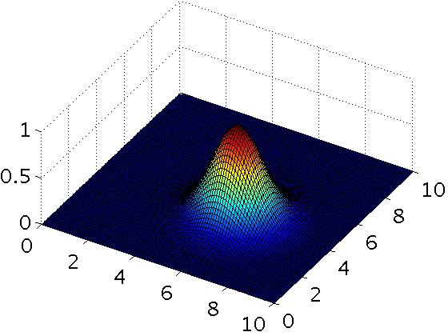
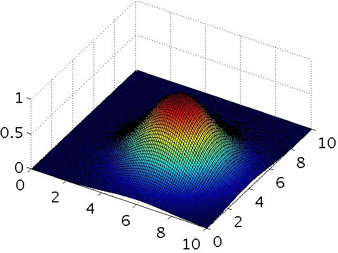

# Support Vector Machines

## Large Margin Classification

### Optimization Objective

#### Lecture Notes

+ Alternative view of logistic regression ($z = \theta^Tx$)

  $$h_\theta(x) = \dfrac{1}{1 + e^{-\theta^T x}}$$

  + Cost of example: diagram of cost contributions (y-axis)

    $$-(y \cdot \log h_\theta(x) + (1 - y) \cdot \log(1 - h_\theta(x))) = \underbrace{-y \cdot \log(\dfrac{1}{1 + e^{-\theta^Tx}})}_{z \geq 0 \;\rightarrow\; \theta^Tx \geq 0} \underbrace{- (1 - y) \cdot \log(1 - \dfrac{1}{1 + e^{-\theta^T x}})}_{z < 0 \;\rightarrow\; \theta^Tx < 0}$$

  + If $y = 1$, we want $h_\theta(x) \approx 1, \theta^T x \gg 0$
    + only the first term in cost function would matter
    + Graph on the left
    + When $z$ is large, cost function would be small
    + Magenta curve is a close approximation of the log cost function
  + If $y = 0$, we want $h_\theta(x) \approx 0, \theta^T x \ll 0$
    + only the second term in cost function would matter
    + Magenta curve is a close approximation of the log cost function

  <br/>
  <div style="display:flex;justify-content:center;align-items:center;flex-flow:row wrap;">
    <div><a href="https://d3c33hcgiwev3.cloudfront.net/_246c2a4e4c249f94c895f607ea1e6407_Lecture12.pdf?Expires=1555459200&Signature=Aibx4MyH1R-oUJMXRrW3chKna-a~XoCJd-c~g3UwUpgnzRFULWlxriuLCniD~Q92GzKqNrslw0CwCyCyMBKemvQnjt-iVThjFe9Q23SDi3qmcAPq1eprZTr84Vq2IccOXYuPf7XaHwBj~r16BTEDnkiLWOZ79H1d1zTG6DBQpT0_&Key-Pair-Id=APKAJLTNE6QMUY6HBC5A">
      
    </a></div>
    <div><a href="https://www.ritchieng.com/machine-learning-svms-support-vector-machines/">
      
    </a></div>
  </div><br/>

+ Support vector machine
  + a cleaner and powerful way of learning complex non-linear functions
  + Logistic regression

    $$ \min_\theta \underbrace{\dfrac{1}{m} \sum_{i=1}^m \left[ y^{(i)}\underbrace{(-\log h_\theta(x^{(i)}))}_{\text{cost}_1(\theta^Tx^{(i)})} + (1 - y^{(i)}) \underbrace{(-\log(1 - h_\theta(x^{(i)})))}_{\text{cost}_0(\theta^T x^{(i)})} \right]}_{(A)} + \underbrace{\dfrac{\lambda}{2m} \sum_{j=1}^n \theta^2_j}_{(B)}$$

  + Support vector machine

    $$\min_\theta \underbrace{\;\;C\;\;}_{1/m} \sum_{j=1}^m \left[ y^{(i)} \text{cost}_1 (\theta^Tx^{(i)}) + (1 - y^{(i)}) \text{cost}_0(\theta^T x^{(i)}) \right] + \underbrace{\;\;\dfrac{1}{2}\;\;}_{\lambda/2m} \sum_{j=0}^n \theta_j^2$$

    + Replace the 1st & 2nd terms with cost function respectively
    + Remove $1/m$ which not effect the minimization: $\min_u (u-5)^2 + 1 \;\rightarrow\; u = 5 \Longleftrightarrow \min_u 10(u-5)^2 + 10 \;\rightarrow\; u = 5$
    + Let $C = \frac{1}{\lambda}\;$: $(A) + \lambda \cdot (B) \implies C \cdot (A) + (B)$

    $$\min_\theta C \cdot \sum_{j=1}^m \left[y^{(i)} \text{cost}_1 (\theta^T x^{(i)}) + (1 - y^{(i)}) \text{cost}_0 (\theta^T x^{(i)}) \right] + \dfrac{1}{2} \sum_{j=1}^n \theta_j^2$$

  + IVQ: Consider the following minimization problems:

    $$\begin{array}{l} \min_\theta \dfrac{1}{m} \sum_{i=1}^m \left[ y^{(i)} \text{cost}_1(\theta^T x^{(i)}) + (1 − y^{(i)}) \text{cost}_0(\theta^T x^{(i)}) \right] + \dfrac{\lambda}{2m} \sum_{j=1}^n \theta^2_j \\ \min_\theta C \sum_{i=1}^m \left[ y^{(i)} \text{cost}_1(\theta^T x^{(i)}) + (1 − y^{(i)}) \text{cost}_0 (\theta^T x^{(i)}) \right] + \dfrac{1}{2} \sum_{j=1}^n \theta^2_j \end{array}$$

    These two optimization problems will give the same value of $\theta$ (i.e., the same value of $\theta$ gives the optimal solution to both problems) if:

    1. $C = \lambda$
    2. $C = -\lambda$
    3. $C = \frac{1}{\lambda}$
    4. $C = \frac{2}{\lambda}$

    Ans: 2


+ SVM Hypothesis
  + $y \in \{0, 1\}$ not probability as logistic regression
  
  $$h_\theta (x) = \begin{cases} 1 & \text{if } \theta^Tx \geq 0 \\ 0 & \text{otherwise} \end{cases}$$


#### Lecture Video

<video src="https://d3c33hcgiwev3.cloudfront.net/12.1-SupportVectorMachines-OptimizationObjective.23b59c80b22b11e4964ea1de90934151/full/360p/index.mp4?Expires=1555459200&Signature=P9LKgNX5Hqc6lMm-5XAxjLPSHFJ3s0LQzHKrcaiNJDcMR3SIBRc8pwl5M7~Ayh0z5kESyNhT5A~hRfrt5vjM6SjWOS3JiMWYits7j1SexDswVfsyryrno7DcYq908TOz04y7s~A1BI-TZviXoCqP6n8RPVrxmF6TRWoOQG6tNjk_&Key-Pair-Id=APKAJLTNE6QMUY6HBC5A" preload="none" loop="loop" controls="controls" style="margin-left: 2em;" muted="" poster="http://www.multipelife.com/wp-content/uploads/2016/08/video-converter-software.png" width="180">
  <track src="https://www.coursera.org/api/subtitleAssetProxy.v1/l9mcJSM1TdKZnCUjNR3SpQ?expiry=1555459200000&hmac=-vQeY4vqDgjKg1thVUWB4NgYN3lSAfrYgRH7DeJDry4&fileExtension=vtt" kind="captions" srclang="en" label="English" default>
  Your browser does not support the HTML5 video element.
</video>
<br/>


### Large Margin Intuition

#### Lecture Notes

+ Support Vector Machine
  + Objective:

    $$\min_\theta C \cdot \sum_{i=1}^m \left[ y^{(i)} \text{cost}_1(\theta^Tx^{(i)}) + (1 - y^{(i)}) \text{cost}_0(\theta^Tx^{(i)}) \right] + \dfrac{1}{2} \sum_{j=1}^n \theta_j^2$$
  + cost functions

    <div style="display:flex;justify-content:center;align-items:center;flex-flow:row wrap;">
      <div><a href="https://d3c33hcgiwev3.cloudfront.net/_246c2a4e4c249f94c895f607ea1e6407_Lecture12.pdf?Expires=1555459200&Signature=Aibx4MyH1R-oUJMXRrW3chKna-a~XoCJd-c~g3UwUpgnzRFULWlxriuLCniD~Q92GzKqNrslw0CwCyCyMBKemvQnjt-iVThjFe9Q23SDi3qmcAPq1eprZTr84Vq2IccOXYuPf7XaHwBj~r16BTEDnkiLWOZ79H1d1zTG6DBQpT0_&Key-Pair-Id=APKAJLTNE6QMUY6HBC5A">
        
      </a></div>
    </div><br/>

  + If $y=1$, we want $\theta^T x \geq 1$ (not just $\geq 0$) <br/>
    If $y=0$, we want $\theta^T x \leq -1$ (not just $< 0$)

+ SVM Decision Boundary
  + Objective:

    $$\min_\theta C \underbrace{\sum_{i=1}^m \left[ y^{(i)} \text{cost}_1(\theta^Tx^{(i)}) + (1 - y^{(i)}) \text{cost}_0(\theta^Tx^{(i)}) \right]}_{(A)} + \dfrac{1}{2} \sum_{j=1}^n \theta_j^2$$

  + $C \gg 0$, $(A) = 0\;$ to minimize the cost function
  + Wherever $y^{(i)} = 1\;: \theta^T x^{(i)} \geq 1$ <br/>
    Wherever $y^{(i)} = 0\;: \theta^T x^{(i)} \leq -1$

    $$\begin{array}{rl} \min_\theta & C \cdot 0 + \dfrac{1}{2} \sum_{j=1}^n \theta^2_j \\\\ \text{s.t.} & \theta^T x^{(i)} \geq 1 \quad \text{if } y^{(i)} = 1 \\ & \theta^T x^{(i)} \leq -1 \quad \text{if } y^{(i)} = 0 \end{array}$$
  
  + Linearly separable case & large margin classifier

    <div style="display:flex;justify-content:center;align-items:center;flex-flow:row wrap;">
      <div><a href="https://www.ritchieng.com/machine-learning-svms-support-vector-machines/">
        
        
      </a></div>
    </div><br/>

    + black decision boundary: larger minimum difference
    + magenta & green boundaries: close to examples
    + __margin__: distance btw blue & black line
    + $C\;$ value
      + Very large: decision boundary would change from black to magenta line
      + not very large: decision boundary would be the black line
    + SVM being a large margin classifier is only relevant when you have no outliers
  + IVQ: Consider the training set to the right, where "x" denotes positive examples ($y=1$) and "o" denotes negative examples ($y=0$). Suppose you train an SVM (which will predict 1 when $\theta_0 + \theta_1x_1 + \theta_2x_2 \geq 0$. What values might the SVM give for $\theta_0$, $\theta_1$, and $\theta_2$?

    <div style="display:flex;justify-content:center;align-items:center;flex-flow:row wrap;">
      <div><a href="url">
        
      </a></div>
    </div>

    1. $\theta_0=3,\theta_1=1,\theta_2=0$ 
    2. $\theta_0=-3,\theta_1=1,\theta_2=0$
    3. $\theta_0=3,\theta_1=0,\theta_2=1$
    4. $\theta_0=-3,\theta_1=0,\theta_2=1$

    Ans: 2


#### Lecture Video

<video src="https://d3c33hcgiwev3.cloudfront.net/12.2-SupportVectorMachines-LargeMarginIntuition.32aeeca0b22b11e4aca907c8d9623f2b/full/360p/index.mp4?Expires=1555459200&Signature=jNxpLu-SzNgsmDd0W4HVgfmLGOshh--UF1Sx~2PUrP4agZALSu86xbcRuWjsBxYAbl7grHOQ7~Vd97eeXDDVsqFBVA3UjDWlw5m0ddUT~pAzDMXEl~BhVBp7QQWN1g8Kk9jJA2O1quFNQBE9nGukgml8uosEOOIV34KK5KyEyng_&Key-Pair-Id=APKAJLTNE6QMUY6HBC5A" preload="none" loop="loop" controls="controls" style="margin-left: 2em;" muted="" poster="http://www.multipelife.com/wp-content/uploads/2016/08/video-converter-software.png" width="180">
  <track src="https://www.coursera.org/api/subtitleAssetProxy.v1/tVkxiW6tTICZMYlurYyAOg?expiry=1555459200000&hmac=889FJnt1dee-DTdkfNGfBoAaa4Nlx5YUtq6R2O75BBU&fileExtension=vtt" kind="captions" srclang="en" label="English" default>
  Your browser does not support the HTML5 video element.
</video>
<br/>


### Mathematics Behind Large Margin Classification

#### Lecture Notes

+ Vector Inner Product

  $$u = \begin{bmatrix} u_1 \\ u_2 \end{bmatrix} \qquad v = \begin{bmatrix} v_1 \\ v_2 \end{bmatrix} \qquad\qquad u^Tv = ?$$

  + $\parallel u \parallel = \text{ norm of vector } u = \text{ length of vector } u = \sqrt{u_1^2 + u_2^2} \;\in\; \mathbb{R}$
  + $p = \text{signed length of projection of } v \text{ onto } u \;\in \mathbb{R}$

    $$u^T v = v^T u = p \cdot \parallel u \parallel = u_1 v_1 + u_2 v_2$$

    <div style="display:flex;justify-content:center;align-items:center;flex-flow:row wrap;">
      <div><a href="https://www.ritchieng.com/machine-learning-svms-support-vector-machines/">
        
      </a></div>
    </div><br/>

    + inner product: $u^Tv$
    + $\parallel u \parallel\;$: hypotenuse calculated by using Pythagoras' Theorem
    + Projection: project vector $v$ onto $u$
    + negative: angle between $u$ and $v > 90^o$

+ SVM decision boundary
  + Introduction

    $$\begin{array}{ll} \displaystyle \min_\theta & \dfrac{1}{2} \sum_{j=1}^n \theta^2_j \\\\ \text{s.t. } & \theta^T x^{(i)} \geq 1 \quad \text{if } y^{(i)} = 1 \\ & \theta^T x^{(i)} \leq -1 \quad \text{if } y^{(i)} = 0 \end{array}$$

    + Simplification: $\theta_0 = 0, n= 2, \theta = \begin{bmatrix} \theta1 \\ \theta_2 \end{bmatrix} \in \mathbb{R}^2$

      $$\dfrac{1}{2} \sum_{j=1}^2 \theta_j^2 = \dfrac{1}{2} (\theta_1^2 + \theta_2^2) = \dfrac{1}{2} \left( \sqrt{\theta_1^2 + \theta_2^2} \right)^2 = \dfrac{1}{2} \parallel \theta \parallel^2$$

      <div style="display:flex;justify-content:center;align-items:center;flex-flow:row wrap;">
        <div><a href="https://www.ritchieng.com/machine-learning-svms-support-vector-machines/">
          
        </a></div>
      </div><br/>

      + $\theta^T x^{(i)} = p^{(i)} \cdot \parallel \theta \parallel = \theta_1 x^{(i)}_1 + \theta_2 x^{(i)}_2$
  
  + Projections and hypothesis

    $$\begin{array}{ll} \displaystyle \min_\theta & \dfrac{1}{2} \displaystyle \sum_{j=1}^n \theta^2_j = \dfrac{1}{2} \parallel \theta \parallel^2 \\\\ \text{s.t. } & p^{(i)} \cdot \parallel \theta \parallel \geq 1 \quad \text{if } y^{(i)} = 1 \\ & p^{(i)} \cdot \parallel \theta \parallel \leq -1 \quad \text{if } y^{(i)} = 0 \end{array}$$

    where $p^{(i)}$ is the projection of $x^{(i)}$ onto the vector $\theta$.

    + Simplification: $\theta_0 = 0$

      <div style="display:flex;justify-content:center;align-items:center;flex-flow:row wrap;">
        <div><a href="https://www.ritchieng.com/machine-learning-svms-support-vector-machines/">
          
        </a></div>
      </div><br/>

    + When $\theta_0 = 0$, the vector passes through the origin.
    + $\theta$ projection: always $90^o$ to the decision boundary
    + Decision boundary choice 1: graph on the left
      + $p^{(1)}\;$ is the projection of $x_1$ example on $\theta$ (red): $\;p^{(1)} \cdot \parallel \theta \parallel \geq 1 \quad \text{if } \parallel \theta \parallel \gg 1$
      + $p^{(2)}\;$ is the projection of $x_2$ example on $\theta$ (magenta): $\;p^{(2)} \cdot \parallel \theta \parallel \geq 1 \quad \text{if } \parallel \theta \parallel \ll -1$
      + Purpose: minimize $\parallel \theta \parallel^2\;$: this decision boundary choice not suitable
    + Decision boundary choice 2: graph on the right
      + $p^{(1)}\;$ is the projection of $x_1$ example on $\theta$ (red): $\;p^{(1)}\;$ much bigger $\Rightarrow\; \parallel \theta \parallel$ can be smaller
      + $p^{(2)}\;$ is the projection of $x_1$ example on $\theta$ (red): $\;p^{(1)}\;$ much bigger $\Rightarrow\; \parallel \theta \parallel$ can be smaller
      + $\therefore\; \parallel \theta \parallel^2$ would be smaller $\implies$ reason to choose this decision boundary
  + IVQ: The SVM optimization problem we used is:

    $$\begin{array}{ll} \min_\theta & \dfrac{1}{2} \sum_{j=1}^n \theta^2_j = \dfrac{1}{2} \parallel \theta \parallel^2 \\\\ \text{s.t. } & \parallel \theta \parallel \cdot p^{(i)} \geq 1 \quad \text{if } y^{(i)} = 1 \\ & \parallel \theta \parallel \cdot p^{(i)} \leq -1 \quad \text{if } y^{(i)} = 0 \end{array}$$

    <div style="display:flex;justify-content:center;align-items:center;flex-flow:row wrap;">
      <div><a href="https://www.coursera.org/learn/machine-learning/lecture/3eNnh/mathematics-behind-large-margin-classification">
        
      </a></div>
    </div>

    where $p^{(i)}$ is the (signed - positive or negative) projection of $x^{(i)}$ onto $\theta$. Consider the training set above. At the optimal value of $\theta$. what is $\parallel \theta \parallel$?

    1. 1/4
    2. 1/2
    3. 1
    4. 2

    Ans: 2

  + Magnitude of margin is value $p^{(1)}, p^{(2)}, p^{(3)}$, and so on
    + SVM would end up with a large margin because it tries to maximize the margin to minimize the squared norm of $\theta$, $\parallel \theta \parallel^2$


#### Lecture Video

<video src="https://d3c33hcgiwev3.cloudfront.net/12.3-SupportVectorMachines-MathematicsBehindLargeMarginClassificationOptional.3bda0800b22b11e4bb7e93e7536260ed/full/360p/index.mp4?Expires=1555459200&Signature=er9Lien2xxIGtbcIGFlCKvYgiyVoND6F8exhAKDK~zlBBhongj7i4Y44jR3LLv74E8-SEAqzy3oJgteGSWQsN2~T42Hz0AHR4AUjrxb-aXxsqxgZTJSEDIFkhQk9xhWjrLJ8oTZF0VL9lKvB9~I0-BQJrXXKYSuIWJ9CLkDW5bg_&Key-Pair-Id=APKAJLTNE6QMUY6HBC5A" preload="none" loop="loop" controls="controls" style="margin-left: 2em;" muted="" poster="http://www.multipelife.com/wp-content/uploads/2016/08/video-converter-software.png" width="180">
  <track src="https://www.coursera.org/api/subtitleAssetProxy.v1/A0ZIub9NQj6GSLm_TXI-bA?expiry=1555459200000&hmac=JIZHx4JJrRua_hqDEhjv-PPtS8Wf8SHp42U8PjNtmn8&fileExtension=vtt" kind="captions" srclang="en" label="English" default>
  Your browser does not support the HTML5 video element.
</video>
<br/>


## Kernels

### Kernels I

#### Lecture Notes

+ Non-linear decision boundary
  + high order polynomials: computationally expensive
  + Predict $y = 1$ if $\theta_0 + \theta_1 x_1 + \theta_2 x_1 x_2 + \theta_4 x_1^2 + \theta_5 x_2^2 + \ldots \geq 0$

    $$h_\theta(x) = \begin{cases} 1 & \text{if } \theta_0 + \theta_1 x_1 + \ldots \geq 0 \\ 0 & \text{otherwise} \end{cases}$$

  + Let $\theta_0 + \theta_1 f_1 + \theta_2 f_2 + \theta_3 f_3 + \theta_4 f_4 + \theta_5 f_5 + \ldots$ where $f_1 = x_1, f_2 = x_2, f_3  = x_1 x_2, f_4 = x_1^2, f_5 = x_2^2, \ldots$

  <div style="display:flex;justify-content:center;align-items:center;flex-flow:row wrap;">
    <div><a href="https://www.ritchieng.com/machine-learning-svms-support-vector-machines/">
      
    </a></div>
  </div>

  + Given a dataset, is there a different or better choice of the features $f_1, f_2,  \ldots$?

+ Gaussian kernel
  + Given $x$, compute new feature depending on proximity to landmarks $l^{(1)}, l^{(2)}, l^{(3)}, \ldots$
  
    $$\begin{array}{rcl} f_1 & = & similarity(x, l^{(1)}) = \exp \left( -\dfrac{\parallel x - l^{(1)} \parallel^2}{2 \sigma^2} \right) \\ f_2 & = & similarity(x, l^{(2)}) = \exp \left( -\dfrac{\parallel x - l^{(2)} \parallel^2}{2 \sigma^2} \right) \\  f_3 & = & similarity(x, l^{(3)}) = \exp \left( -\dfrac{\parallel x - l^{(3)} \parallel^2}{2 \sigma^2} \right) \\ & \cdots \end{array}$$

  <div style="display:flex;justify-content:center;align-items:center;flex-flow:row wrap;">
    <div><a href="https://www.ritchieng.com/machine-learning-svms-support-vector-machines/">
      
    </a></div>
  </div>

  + manually pick 3 landmarks
  + given an example $x$, define the features as a measure of similarity between $x$ ans the landmarks
  
    $$\begin{array}{rcl} f_1 &=& similarity(x, l^{(1)}) \\ f_2 &=& similarity(x, l^{(2)}) \\ f_3 &=& similarity(x, l^{(3)}) \end{array}$$

  + kernel: $k(x, l^{(i)}) = similarity(x, l^{(i)})$
  + The similarity functions are __Gaussian kernels__, $\exp\left( - \dfrac{\parallel x - l^{(i)} \parallel^2}{2\sigma^2} \right)$.

+ Kernels and Similarity

  $$f_1 = similarity(x, l^{(1)}) = exp \left(-\dfrac{\parallel x - l^{(1)} \parallel^2}{2\sigma^2} \right) = \exp \left( -\dfrac{\sum_{j=1}^n (x_j - l_j^{(1)})^2}{2 \sigma^2} \right)$$

  + If $x \approx l^{(1)}: f_1 \approx \exp \left( -\dfrac{0^2}{2\sigma^2} \right) \approx 1$
  + If $x$ is far from $l^{(1)}: f_1 = \exp \left( - \dfrac{(\text{large number})^2}{2\sigma^2} \right) \approx 0$
  + Example 1: $l^{(1)} = \begin{bmatrix} 3 \\ 5 \end{bmatrix} \qquad f_1 = \exp \left( - \dfrac{\parallel x - l^{(1)} \parallel^2}{2\sigma^2} \right)$

    <div style="display:flex;justify-content:center;align-items:center;flex-flow:row wrap;">
      <div><a href="https://www.ritchieng.com/machine-learning-svms-support-vector-machines/">
        
      </a></div>
    </div>

  + IVQ: Consider a 1-D example with one feature $x_1$. Suppose $l^{(1)}=5$. To the right is a plot of $f_1 = \exp(− \dfrac{\parallel x_1 - l^{(1)} \parallel^2}{2\sigma^2})$ when $\sigma^2 = 1$. Suppose we now change $\sigma^2=4$. Which of the following is a plot of $f_1$ with the new value of $\sigma^2$?

    A plot of a Gaussian kernel centered at 5. It has a peak at (5,1).

    <div style="display:flex;justify-content:center;align-items:center;flex-flow:row wrap;">
      <div><a href="url">
        
        
        
        
        
      </a></div>
    </div>

    Ans: 3

  + Example 2: Predict "1" when $\theta_0 + \theta_1 f_1 + \theta_2 f_2 + \theta_3 f_3 \geq 0$

    $$x = \begin{bmatrix} f_1 \\ f_2 \\ f_3 \end{bmatrix} \qquad \theta_0 = -0.5, \theta_1 = 1, \theta_2 = 1, \theta_3 =0 \text{ with } f_1 \approx 1, f_2 \approx 0, f_3 \approx 0$$

    <div style="display:flex;justify-content:center;align-items:center;flex-flow:row wrap;">
      <div><a href="https://www.ritchieng.com/machine-learning-svms-support-vector-machines/">
        
      </a></div>
    </div>

    + Predict "1" (magenta dot) because $h_\theta(x) \geq 0\;: \theta_0 + \theta_1 \times 1 + \theta_2 \times 0 + \theta_3 \times 0 = -0.5 + 1 = 0.5 \geq 0$
    + Predict "0" (cyan dot) because $h_\theta(x) < 0\;:  f_1, f_2, f_3 \approx 0 \implies \theta_1 + \theta_1 f_1 + \ldots \approx -0.5 < 0$
  + learn complex non-linear decision boundaries
    + predict positive when close to the landmarks
    + predict negative when far away from the landmarks

+ Questions we have yet to answer
  + How do we get these landmarks?
  + How do we choose these landmarks?
  + What other similarity functions can we use beside the Gaussian kernel?


#### Lecture Video

<video src="https://d3c33hcgiwev3.cloudfront.net/12.4-SupportVectorMachines-KernelsI.57fe50e0b22b11e487451d0772c554c0/full/360p/index.mp4?Expires=1555545600&Signature=RxLa8iob2kBC98vgxYNWEwFZj8h8W7yrfqdT1SoQoCzDO2tgxxlV6R0oWvPubPzVs3wETOTvTeXh7go29oibDVabk8i7qzcjYa4wOzube--gONq0AZ6se1CLBF99UNR0MFcqFZy5Jz3v39P~1OT6B4zcX1T2RN8uI1aeGF-DAaQ_&Key-Pair-Id=APKAJLTNE6QMUY6HBC5A" preload="none" loop="loop" controls="controls" style="margin-left: 2em;" muted="" poster="http://www.multipelife.com/wp-content/uploads/2016/08/video-converter-software.png" width="180">
  <track src="https://www.coursera.org/api/subtitleAssetProxy.v1/F3vXHMmGQqq71xzJhnKqmg?expiry=1555545600000&hmac=XF28XhYFFuBtAF0bRF51R20QN0kWIVBrNQ0EVqI4YkM&fileExtension=vtt" kind="captions" srclang="en" label="English" default>
  Your browser does not support the HTML5 video element.
</video>
<br/>


### Kernels II

#### Lecture Notes

+ Choosing the landmarks
  
  Given $x\;$:

  $$f_i = similarity(x, l^{(i)}) = \exp \left( - \dfrac{\parallel x - l^{(i)} \parallel^2}{2\sigma^2} \right)$$

  Predict $y=1$ if $\theta_0 + \theta_1 f_1 + \theta_2 f_2 + \theta_3 f_3 \geq 0$

  Where to get $l^{(1)}, l^{(2)}, l^{(3)}, \ldots?$

  <div style="display:flex;justify-content:center;align-items:center;flex-flow:row wrap;">
    <div><a href="https://www.ritchieng.com/machine-learning-svms-support-vector-machines/#2b-kernels-ii">
      
    </a></div>
  </div>

  The landmarks locate the same position as the training examples: $x^{(1)} \rightarrow l^{(1)}, x^{(2)} \rightarrow l^{(2)}, \ldots$

+ SVM with kernels
  + Given $(x^{(1)}, y^{(1)}), (x^{(2)}, y^{(2)}), \ldots, (x^{(m)}, y^{(m)})$, choose $l^{(1)} = x^{(1)}, l^{(2)} = x^{(2)}, \ldots, l^{(m)} = x^{(m)}$
  + Given example $x$:

    $$\begin{array}{lcl} f_0  =  1 \\f_1 = similarity(x, l^{(1)}) \\ f_1 = similarity(x, l^{(2)})  \\ \cdots \end{array} \implies f = \begin{bmatrix} f_0 \\ f_1 \\ \vdots \\ f_m \end{bmatrix}$$

  + For training example $(x^{(i)}, y^{(i)})\;$:

    $$x^{(i)} \quad\implies\quad \begin{array}{rcl} f_0^{(i)} &=& 1 \\ f_1^{(i)} &=& sim(x^{(i)}, l^{(1)}) \\ f_2^{(i)} &=& sim(x^{(i)}, l^{(2)}) \\ &\cdots& \\ f_i^{(i)} &=& sim(x^{(i)}, l^{(i)}) = \exp \left( -\dfrac{0}{2\sigma^2} \right) \\ &\cdots& \\ f_m^{(i)} &=& sim(x^{(i)}, l^{(m)}) \end{array} \implies f^{(i)} = \begin{bmatrix} f_0^{(i)} \\ f_1^{(1)} \\ \vdots \\ f_m^{(i)} \end{bmatrix}$$

  + Hypothesis: Given $x$, compute features $f \in \mathbb{R}^{m+1}$

    Predict "y=1" if $\theta^Tf = \theta_0 f_0  + \theta_1 f_1 + \ldots + \theta_m f_m \geq 0, \quad \theta \in \mathbb{R}^{m+1}$

  + Training

    $$min_\theta C \cdot \sum_{i=1}^m \left[ y^{(i)} \text{cost}_1(\theta^T f^{(i)}) + (1 - y^{(i)}) \text{cost}_0(\theta^T f^{(i)}) \right] + \dfrac{1}{2} \sum_{j=1}^{n (=m)} \theta_j^2$$

    $$\begin{array}{crl} \sum_{j} \theta_j^2 &=& \theta^T \theta = \begin{bmatrix} \theta_1 & \theta_2 & \cdots & \theta_m \end{bmatrix} \begin{bmatrix} \theta_1 \\ \theta_2 \ \vdots \\ \theta_m \end{bmatrix} = \parallel \theta \parallel^2 \\\\ &=& \theta^TM\theta = \begin{bmatrix} \theta_0 & \theta_1 & \cdots & \theta_m \end{bmatrix} \begin{bmatrix} 0 & 0 & 0 & \cdots & 0 \\ 0 & 1 & 0 & \cdots & 0 \\ 0 & 0 & 1 & \cdots & 0 \\ \vdots & \vdots & \vdots & \ddots & \vdots \\ 0 & 0 & 0 & \cdots & 1 \end{bmatrix} \begin{bmatrix} \theta_0 \\ \theta_1 \\ \vdots \\ \theta_m \end{bmatrix} \end{array}$$

  + applying kernel's idea to other algorithms
    + able to do so by applying the kernel's idea and define the source of features using landmarks
    + unable to generalize SVM's computational tricks to other algorithms

+ SVM parameters
  + $C (= 1/\lambda)$
    + Large C (small $\lambda$): lower bias, high variance
    + Small C (large $\lambda$): higher bias, lower variance
  + $\sigma^2$
    + Large $\sigma^2\;$: feature $f_i$ vary more smoothly $\implies$ higher bias, lower variance
    + Small $\sigma^2\;$: feature $f_i$ vary less smoothly $\implies$ lower bias, higher variance
  + IVQ: Suppose you train an SVM and find it overfits your training data. Which of these would be a reasonable next step? Check all that apply.

    1. Increase $C$
    2. Decrease $C$
    3. Increase $\sigma^2$
    4. Decrease $\sigma^2$

    Ans: 23


#### Lecture Video

<video src="https://d3c33hcgiwev3.cloudfront.net/12.5-SupportVectorMachines-KernelsII.a7ce4ad0b22b11e4bb7e93e7536260ed/full/360p/index.mp4?Expires=1555545600&Signature=kDfdoPb4aALU5QEMWaWGoT4ZdBgM23a9gNKB4SYWhp6F3iv~3MKk0MjdO3aoL~sfs6tCkp879JhSpmi9CbhSAxcvT1TlZReVQi-I9oxbe4PPcqJPBPC3deuYhGcu1j18UDMEOGvqYyOqfjIgemE2qjjOKXYM5uFgLrErZ78koNw_&Key-Pair-Id=APKAJLTNE6QMUY6HBC5A" preload="none" loop="loop" controls="controls" style="margin-left: 2em;" muted="" poster="http://www.multipelife.com/wp-content/uploads/2016/08/video-converter-software.png" width="180">
  <track src="https://www.coursera.org/api/subtitleAssetProxy.v1/6r6th7fYTKe-rYe32GynPg?expiry=1555545600000&hmac=BdwRfUPDUsKoeYClWesVM9Qnh8gpu5khtCB9H2pO6ZE&fileExtension=vtt" kind="captions" srclang="en" label="English" default>
  Your browser does not support the HTML5 video element.
</video>
<br/>


## SVMs in Practice: Using An SVM

### Lecture Notes

+ SVM software package
  + Use SVM software package (e.g. `liblinear`, `libsvm`, ...) to solve for parameter $\theta$
  + Need to specify
    + choice of parameter $C$
    + choice of kernel (similarity function):
  + Similarity functions
    + linear kernel (no kernel):
      + using SVM w/o a kernel
      + a version of SVM to predict "y=1" if $\theta^T x \geq 0$
      + $\theta_0 + \theta_1 x_1 + \ldots + \theta_n x_n \geq 0, \quad x \in \mathbb{R}^{n_+1}$ 
      + use case: large $n$ and small $m$
    + Gaussian kernel
      + $f_i = \exp \left( - \dfrac{\parallel x - l^{(i)} \parallel^2}{2\sigma^2} \right)$, where $l^{(i)} = x^{(i)}$
      + need to choose $\sigma^2$
      + $x \in \mathbb{R}^{n}, n$ small, and/or $m$ large

+ Kernel (similarity) functions

  ```matlab
  function f = kernel(x1, x2)
    f = exp(- ||x1 - x2||^2 / (2*sigma^2))  % kernel function implementation
  return
  ```

  $$f = \exp\left( - \dfrac{\parallel x_1 - x_2 \parallel^2}{2\sigma^2} \right)$$

  + $f = f_1$
  + $x_1 = x^{(i)}$ and  $x_2 = l^{(j)} = x^{(j)}$

  + Note: do perform feature scaling before using the Gaussian kernel
    + main factors need to be scaled: $\parallel x - l \parallel^2$
    + let $v = x - l, \; x \;\in\; \mathbb{R}^n$, then

      $$\parallel v \parallel^2 = v_1^2 + v_2^2 + \ldots + v_n^2 = \underbrace{(x_1 - l_1)^2}_{1000 \text{ feet}^2} + \underbrace{(x_2 - l_2)^2}_{\text{1-5 bedrooms}} + \ldots + (x_n - l_n)^2$$
    + Otherwise, $\parallel x -l \parallel$ will be dominated mainly by the features with large scale
    + Gaussian kernel also parameterized by a bandwidth parameter, $\sigma$, which determines how fat the similarlity metric decreases (to 0) as the examples are further apart
  + SVM always convex optimal

+ Other choice of kernel
  + Note: not all similarity functions $similarity(x, l)$ make valid kernels. (Need to satisfy technical condition called "Mercer's Theorem" to make sure SVM packages' optimizations run correctly, and do not diverge).
  + Many off-the-shelf kernels available
    + Polynomial kernel: $k(x, l) = (x^Tl + \text{constant})^{\text{degree}}$ such as $(x^T l)^2, (x^T l)^3, (x^T l) + 1^3, (x^T l)^4, \ldots$
    + More esoteric: String kernel, chi-suqare kernel, histogram intersection kernel, ...
  + IVQ: Suppose you are trying to decide among a few different choices of kernel and are also choosing parameters such as $C$, $\sigma^2$, etc. How should you make the choice?

    1. Choose whatever performs best on the training data.
    2. Choose whatever performs best on the cross-validation data.
    3. Choose whatever performs best on the test data.
    4. Choose whatever gives the largest SVM margin.

    Ans: 2

+ Multi-class classification
  + classes: $y \;\in\; \{1, 2, 3, \ldots, K\}$
  + Many SVM packages already have built-in multi-class classification functionality
  + Otherwise, use one-vs-all method. (Train $K$ SVMs, one to distinguish $y=i$ from the rest, for $i=1, 2, \ldots, K$), get $\theta^{(1)}, \theta^{(2)}, \ldots, \theta^{(K)}$. Pick class $i$ with largest $(\theta^{(i)})^Tx$

  <div style="display:flex;justify-content:center;align-items:center;flex-flow:row wrap;">
    <div><a href="https://www.ritchieng.com/machine-learning-svms-support-vector-machines/#2b-kernels-ii">
      
    </a></div>
  </div>

+ Logistic regression vs SVMs
  + logistic regression or SVM
    $n =\;$ number of features ($x \in \mathbb{R}^{n+1}$), $m = \;$ number of training examples <br/>
    if $n$ is large (relative to $m$): <br/>
    <span style="padding-left: 1em;"/>Use logistic regression, or SVM without a kernel ("linear kernel") <br/>
    <span style="padding-left: 2em;"/>if $n$ is mall, $m$ is intermediate: (e.g, n = 1~1,000, m = 10~10,000) <br/>
    <span style="padding-left: 3em;"/>Use SVM with Gaussian kernel<br/><br/>
    <span style="padding-left: 2em;"/>if $n$ is small, $m$ is large: (e.g., n = 1~1,000, m = 50,000+) <br/>
    <span style="padding-left: 3em;"/>Creat/add more features, then use logistic regression or SVM without a kernel
  
  + Neural network likely to work well for most of these settings, but may be slower to train


### Lecture Video

<video src="url" preload="none" loop="loop" controls="controls" style="margin-left: 2em;" muted="" poster="http://www.multipelife.com/wp-content/uploads/2016/08/video-converter-software.png" width="180">
  <track src="subtitle" kind="captions" srclang="en" label="English" default>
  Your browser does not support the HTML5 video element.
</video>
<br/>


## Review

### Lecture Slides

#### Optimization Objective

The __Support Vector Machine__ (SVM) is yet another type of supervised machine learning algorithm. It is sometimes cleaner and more powerful.

Recall that in logistic regression, we use the following rules:

if $y=1$, then $h_\theta(x) \approx 1$ and $\theta^Tx \gg 0$

if $y=0$, then $h_\theta(x) \approx 0$ and $\theta^Tx \ll 0$

Recall the cost function for (unregularized) logistic regression:

$$\begin{array}{rcl} J(\theta) &=& \dfrac{1}{m} \sum_{i=1}^m −y^{(i)}  \log(h_\theta(x^{(i)})) − (1−y^{(i)}) \log(1−h_\theta(x^{(i)})) \\ & = & \dfrac{1}{m} \sum_{i=1}^m −y^{(i)} \log(\dfrac{1}{1+e^{−\theta^T x^{(i)})}}) − (1−y^{(i)}) \log(1 − \dfrac{1}{1+e^{−\theta^T x^{(i)}}}) \end{array}$$

To make a support vector machine, we will modify the first term of the cost function $-\log(h_{\theta}(x)) = -\log \left( \dfrac{1}{1 + e^{-\theta^Tx}} \right)$ so that when $\theta^Tx$ (from now on, we shall refer to this as $z$) is __greater than__ 1, it outputs 0. Furthermore, for values of $z$ less than 1, we shall use a straight decreasing line instead of the sigmoid curve.(In the literature, this is called a [hinge loss](https://en.wikipedia.org/wiki/Hinge_loss) function.)

<div style="display:flex;justify-content:center;align-items:center;flex-flow:row wrap;">
  <div><a href="https://www.coursera.org/learn/machine-learning/resources/Es9Qo">
    
  </a></div>
</div>

Similarly, we modify the second term of the cost function $-\log(1 - h_{\theta(x)}) = -\log\left(1 - \dfrac{1}{1 + e^{-\theta^Tx}}\right)$ so that when $z$ is __less than__ -1, it outputs 0. We also modify it so that for values of z greater than -1, we use a straight increasing line instead of the sigmoid curve.

<div style="display:flex;justify-content:center;align-items:center;flex-flow:row wrap;">
  <div><a href="https://www.coursera.org/learn/machine-learning/resources/Es9Qo">
    
  </a></div>
</div>

We shall denote these as $\text{cost}_1(z)$ and $\text{cost}_0(z)$ (respectively, note that $\text{cost}_1(z)$ is the cost for classifying when $y=1$, and $\text{cost}_\theta(z)$ is the cost for classifying when y=0), and we may define them as follows (where k is an arbitrary constant defining the magnitude of the slope of the line):

$$\begin{array}{rcl} z &=& \theta^Tx \\ cost_0(z) &=& \max(0,k(1+z)) \\ cost_1(z) &=& \max(0,k(1−z)) \end{array}$$

Recall the full cost function from (regularized) logistic regression:

$$J(\theta) = \dfrac{1}{m} \sum_{i=1}^m y^{(i)}(−\log(h_\theta(x^{(i)}))) + (1−y^{(i)}) (−\log(1−h_\theta(x^{(i)}))) + \dfrac{\lambda}{2m} \sum_{j=1}^n \theta^2_j$$

Note that the negative sign has been distributed into the sum in the above equation.

We may transform this into the cost function for support vector machines by substituting $\text{cost}_0(z)$ and $\text{cost}_1(z)$:

$$J(\theta) = \dfrac{1}{m} \sum_{i=1}^m y^{(i)} \text{cost}_1 (\theta^T x^{(i)}) + (1 − y^{(i)}) \text{cost}_0 (\theta^T x^{(i)}) + \dfrac{\lambda}{2m} \sum_{j=1}^n \theta^2_j$$

We can optimize this a bit by multiplying this by m (thus removing the m factor in the denominators). Note that this does not affect our optimization, since we're simply multiplying our cost function by a positive constant (for example, minimizing $(u-5)^2 + 1$ gives us 5; multiplying it by 10 to make it $10(u-5)^2 + 10$ still gives us 5 when minimized).

$$J(\theta) = \sum_{i=1}^m y^{(i)} \text{cost}_1 (\theta^T x^{(i)}) + (1−y^{(i)}) \text{cost}_0 (\theta^T x^{(i)}) + \dfrac{\lambda}{2} \sum_{j=1}^n \theta^2_j$$

Furthermore, convention dictates that we regularize using a factor $C$, instead of $\lambda$, like so:

$$J(\theta) = C \cdot \sum_{i=1}^m y^{(i)} \text{cost}_1 (\theta^T x^{(i)}) + (1−y^{(i)}) \text{cost}_0 (\theta^T x^{(i)}) + \dfrac{1}{2} \sum_{j=1}^n \theta_j^2$$

This is equivalent to multiplying the equation by $C = \dfrac{1}{\lambda}$, and thus results in the same values when optimized. Now, when we wish to regularize more (that is, reduce overfitting), we decrease $C$, and when we wish to regularize less (that is, reduce underfitting), we _increase_ $C$.

Finally, note that the hypothesis of the Support Vector Machine is not interpreted as the probability of y being 1 or 0 (as it is for the hypothesis of logistic regression). Instead, it outputs either 1 or 0. (In technical terms, it is a discriminant function.)

$$h_\theta(x) = \begin{cases} 1 & \text{if } \theta^T x \geq 0 \\ 0 & \text{otherwise} \end{cases}$$


#### Large Margin Intuition

A useful way to think about Support Vector Machines is to think of them as Large Margin Classifiers.

If $y=1$, we want $\theta^T x \geq 1$ (not just $\geq 0$)

If $y=0$, we want $\theta^T x \leq −1$ (not just $< 0$)

Now when we set our constant $C$ to a very __large__ value (e.g. 100,000), our optimizing function will constrain Θ such that the equation A (the summation of the cost of each example) equals 0. We impose the following constraints on Θ:

$\theta^T x \geq 1$ if $y=1$ and $\theta^T x \leq −1$ if $y=0$.

If $C$ is very large, we must choose Θ parameters such that:

$$\sum_{i=1}^m y^{(i)} \text{cost}_1(\theta^T x) + (1−y^{(i)}) \text{cost}_0(\theta^T x) = 0$$

This reduces our cost function to:

$$J(\theta) = C \cdot 0 + \frac{1}{2} \sum_{j=1}^n \theta_j^2 = \frac{1}{2} \sum_{j=1}^n \theta_j^2$$

Recall the decision boundary from logistic regression (the line separating the positive and negative examples). In SVMs, the decision boundary has the special property that it is as far away as possible from both the positive and the negative examples.

The distance of the decision boundary to the nearest example is called the margin. Since SVMs maximize this margin, it is often called a Large Margin Classifier.

The SVM will separate the negative and positive examples by a large margin.

This large margin is only achieved when $C$ is very large.

Data is linearly separable when a straight line can separate the positive and negative examples.

If we have outlier examples that we don't want to affect the decision boundary, then we can reduce $C$.

Increasing and decreasing $C$ is similar to respectively decreasing and increasing $\lambda$, and can simplify our decision boundary.


#### Mathematics Behind Large Margin Classification (Optional)

__Vector Inner Product__

Say we have two vectors, u and v:

$$u = \begin{bmatrix} u_1 \\ u_2 \end{bmatrix} \qquad v = \begin{bmatrix} v_1 \\ v_2 \end{bmatrix}$$

The length of vector $v$ is denoted $\parallel v \parallel$, and it describes the line on a graph from origin $(0,0)$ to $(v_1,v_2)$.

The length of vector $v$ can be calculated with $\sqrt{v_1^2 + v_2^2}$ by the Pythagorean theorem.

The projection of vector $v$ onto vector $u$ is found by taking a right angle from $u$ to the end of $v$, creating a right triangle.

+ $p =\;$ length of projection of $v$ onto the vector $u$.
+ $u^T v= p \cdot \parallel u \parallel$

Note that $u^Tv = \parallel u \parallel \cdot \parallel v \parallel \cos \theta$ where $\theta$ is the angle between $u$ and $v$. Also, $p = \parallel v \parallel \cos \theta$. If you substitute $p$ for $\parallel v \parallel \cos \theta$, you get $u^Tv= p \;\cdot \parallel u \parallel$.

So the product $u^Tv$ is equal to the length of the projection times the length of vector $u$.

In our example, since $u$ and $v$ are vectors of the same length, $u^Tv = v^Tu$.

$$u^Tv = v^Tu = p \;\cdot \parallel u \parallel = u_1v_1 + u_2v_2$$
​
If the __angle__ between the lines for $v$ and $u$ is __greater than 90 degrees__, then the projection $p$ will be __negative__.

$$\min_{\theta} \dfrac{1}{2} \sum_{j=1}^n \theta_j^2 = \dfrac{1}{2} (\theta^2_1 + \theta^2_2 + \ldots + \theta^2_n) = \dfrac{1}{2} (\sqrt{\theta^2_1 + \theta^2_2 + \ldots + \theta^2_n}) = \dfrac{1}{2} \parallel \theta \parallel^2$$

We can use the same rules to rewrite $\theta^Tx^{(i)}$:

$$\theta^T x^{(i)} = p^{(i)} \cdot \parallel \theta \parallel = \theta_1 x^{(i)}_1 + \theta_2 x^{(i)}_2 + \ldots + \theta_n x^{(i)}_n$$

So we now have a new __optimization objective__ by substituting $p^{(i)} \cdot \parallel \theta \parallel$ in for $\theta^T x^{(i)}$:

+ If $y=1$, we want $p^{(i)} \cdot \parallel \theta \parallel \geq 1$
+ If $y=0$, we want $p^{(i)} \cdot \parallel \theta \parallel \leq −1$

The reason this causes a "large margin" is because: the vector for $\theta$ is perpendicular to the decision boundary. In order for our optimization objective (above) to hold true, we need the absolute value of our projections $p^{(i)}$ to be as large as possible.

If $\theta_0 = 0$, then all our decision boundaries will intersect $(0,0)$. If $\theta_0 \neq 0$, the support vector machine will still find a large margin for the decision boundary.


__Kernels I__

Kernels allow us to make complex, non-linear classifiers using Support Vector Machines.

Given $x$, compute new feature depending on proximity to landmarks $l^{(1)},\ l^{(2)},\ l^{(3)}$.

To do this, we find the "similarity" of x and some landmark $l^{(i)}$:

$$f_i = similarity(x,l^{(i)}) = \exp(−\dfrac{\parallel x − l^{(i)} \parallel^2}{2 \sigma^2})$$

This "similarity" function is called a __Gaussian Kernel__. It is a specific example of a kernel.

The similarity function can also be written as follows:

$$f_i = similarity(x,l^{(i)}) = \exp(−\dfrac{\sum_{j=1}^n (x_j−l^{(i)}_j)^2}{2\sigma^2})$$

There are a couple properties of the similarity function:

If $x \approx l^{(i)}$, then $f_i = \exp(−\dfrac{\approx 0^2}{2\sigma^2}) \approx 1$

If $x$ is far from $l^{(i)}$, then $f_i = \exp(−\dfrac{(large number)^2}{2\sigma^2}) \approx 0$

In other words, if $x$ and the landmark are close, then the similarity will be close to 1, and if $x$ and the landmark are far away from each other, the similarity will be close to 0.

Each landmark gives us the features in our hypothesis:

$$\begin{array}{c} l^{(1)} \longrightarrow f_1 \qquad l^{(2)} \longrightarrow f_2 \qquad l^{(3)} \longrightarrow f_3 \qquad \ldots \\ h_\theta(x) = \theta_1 f_1 + \theta_2 f_2 + \theta_3 f_3 + \ldots \end{array}$$

$\sigma^2$ is a parameter of the Gaussian Kernel, and it can be modified to increase or decrease the __drop-off__ of our feature $f_i$. Combined with looking at the values inside $\theta$, we can choose these landmarks to get the general shape of the decision boundary.


#### Kernels II

One way to get the landmarks is to put them in the __exact same__ locations as all the training examples. This gives us m landmarks, with one landmark per training example.

Given example $x$:

$f_1 = similarity(x,l^{(1)})$, $f_2 = similarity(x,l^{(2)})$, $f_3 = similarity(x,l^{(3)})$, and so on.

This gives us a "feature vector," $f_{(i)}$ of all our features for example $x_{(i)}$. We may also set $f_0 = 1$ to correspond with $\theta_0$. Thus given training example $x_{(i)}$:

$$x(i) \;\rightarrow\; \begin{bmatrix} f^{(i)}_1 = similarity(x^{(i)},l^{(1)}) \\ f^{(i)}_2 = similarity(x^{(i)},l^{(2)}) \\ \vdots \\ f^{(i)}_m = similarity(x^{(i)}, l^{(m)}) \end{bmatrix}$$

Now to get the parameters Θ we can use the SVM minimization algorithm but with $f^{(i)}$ substituted in for $x^{(i)}$:

$$\min_\theta C \sum_{i=1}^m y^{(i)} \text{cost}_1(\theta^T f^{(i)}) + (1−y^{(i)}) \text{cost}_0 (\theta^T f^{(i)}) + \dfrac{1}{2} \sum_{j=1}^n \theta^2j$$

Using kernels to generate $f^{(i)}$ is not exclusive to SVMs and may also be applied to logistic regression. However, because of computational optimizations on SVMs, kernels combined with SVMs is much faster than with other algorithms, so kernels are almost always found combined only with SVMs.


__Choosing SVM Parameters__

Choosing $C$ (recall that $C = \dfrac{1}{\lambda}$ 

+ If $C$ is large, then we get higher variance/lower bias
+ If $C$ is small, then we get lower variance/higher bias

The other parameter we must choose is $\sigma^2$ from the Gaussian Kernel function:

+ With a large $\sigma^2$, the features fi vary more smoothly, causing higher bias and lower variance.
+ With a small $\sigma^2$, the features fi vary less smoothly, causing lower bias and higher variance.


__Using An SVM__

There are lots of good SVM libraries already written. A. Ng often uses `liblinear` and `libsvm`. In practical application, you should use one of these libraries rather than rewrite the functions.

In practical application, the choices you do need to make are:

+ Choice of parameter $C$
+ Choice of kernel (similarity function)
+ No kernel ("linear" kernel) -- gives standard linear classifier
+ Choose when n is large and when m is small
+ Gaussian Kernel (above) -- need to choose $\sigma^2$
+ Choose when n is small and m is large

The library may ask you to provide the kernel function.

Note: do perform feature scaling before using the Gaussian Kernel.

Note: not all similarity functions are valid kernels. They must satisfy "Mercer's Theorem" which guarantees that the SVM package's optimizations run correctly and do not diverge.

You want to train C and the parameters for the kernel function using the training and cross-validation datasets.


__Multi-class Classification__

Many SVM libraries have multi-class classification built-in.

You can use the _one-vs-all_ method just like we did for logistic regression, where $y \in 1,2,3,…,K$ with $\theta(1), \theta(2), \ldots, \theta(K)$. We pick class $i$ with the largest $(\theta^{(i)})^Tx$.


__Logistic Regression vs. SVMs__

+ If $n$ is large (relative to $m$), then use logistic regression, or SVM without a kernel (the "linear kernel")
+ If $n$ is small and $m$ is intermediate, then use SVM with a Gaussian Kernel
+ If $n$ is small and $$ is large, then manually create/add more features, then use logistic regression or SVM without a kernel.

In the first case, we don't have enough examples to need a complicated polynomial hypothesis. In the second example, we have enough examples that we may need a complex non-linear hypothesis. In the last case, we want to increase our features so that logistic regression becomes applicable.

__Note__: a neural network is likely to work well for any of these situations, but may be slower to train.

#### Additional references

"[An Idiot's Guide to Support Vector Machines](http://web.mit.edu/6.034/wwwbob/svm-notes-long-08.pdf)"


### Errata

#### Errata in video lectures

+ In 'Optimization Objective', starting at 9:25, the SVM regularization term should start from $j=1$, not $j=0$.
+ In 'Optimization Objective', starting at 13:37, the SVM regularization term should be summing over $j$ instead of $i$: $\sum_{j=1}^n\theta{j}^2$.
+ In 'Large Margin Intuition', starting from 1:04, should be labelled $z \leq −1$, for graphic on the right. (It is drawn correctly).
+ In 'Mathematics Behind Large Margin Classification', starting from 11:22, second condition should be $p^{(i)} \cdot |\theta| \leq -1$ if $y^{(i)} = 0$ instead of $y^{(i)} = 1$. This persists also in the quiz.
+ In 'Mathematics Behind Large Margin Classification', at 16:33, Dr. Ng writes towards the right of the slide that for a vertical decision boundary, $p^{(1)} \cdot \parallel \theta \parallel > 0$, while it should be $p^{(1)} \cdot \parallel \theta \parallel > 1$.
+ In the 'Kernels I' video quiz, the notation surrounding $x_1-l^{(1)}$ inside the $\exp( )$ function is the norm notation.
+ In 'Using An SVM', at 13:51, Dr. Ng writes $\theta = K$ instead of class $y=K$


#### Errata in programming assignment ex6

+ In ex6.pdf, typo on page 1: "SVM rraining function" should be "SVM training function"
+ In ex6.m at line 69: Inside the `fprintf()` statement, the text "sigma = 0.5" should be "sigma = 2"
+ In ex6.pdf, typo in section 1.2.2 on page 6: "obserse" should be ‘observe’.
+ In ex6.pdf, in section 1.2.3 on page 7: The submit grader requires that you use exactly the eight values listed for both C and sigma.
+ In dataset3Params.m, at line 2 "EX6PARAMS" should be "DATASET3PARAMS".
+ In visualizeBoundary.m at line 21, the statement `contour(X1, X2, vals, [0 0], 'Color', 'b');` does not reliably display the contour plot on all platforms. The form `contour(X1, X2, vals, [0.5 0.5], 'linecolor', 'b');` seems to be a better choice.


### Quiz: Support Vector Machines

1. Suppose you have trained an SVM classifier with a Gaussian kernel, and it learned the following decision boundary on the training set:

  <div style="display:flex;justify-content:center;align-items:center;flex-flow:row wrap;">
    <div><a href="https://www.coursera.org/learn/machine-learning/exam/PLdSa/support-vector-machines">
      
    </a></div>
  </div>

  You suspect that the SVM is underfitting your dataset. Should you try increasing or decreasing $C$? Increasing or decreasing $\sigma^2$?

  1. It would be reasonable to try __decreasing__ $C$. It would also be reasonable to try __increasing__ $\sigma^2$
  2. It would be reasonable to try __increasing__ $C$. It would also be reasonable to try __increasing__ $\sigma^2$
  3. It would be reasonable to try __decreasing__ $C$. It would also be reasonable to try __decreasing__ $\sigma^2$
  4. It would be reasonable to try __increasing__ $C$. It would also be reasonable to try __decreasing__ $\sigma^2$

  Ans: 4 <br/>
  Explanation: <br/>
  (4) (underfitting) The figure shows a decision boundary that is underfit to the training set, so we'd like to lower the bias / increase the variance of the SVM. We can do so by either increasing the parameter CC or decreasing $\sigma^2$.


2. The formula for the Gaussian kernel is given by $similarity(x,l^{(1)}) = \exp(− \dfrac{\parallel x−l^{(1)} \parallel^2}{2\sigma^2})$.

  The figure below shows a plot of $f_1 = \text{similarity}(x,l^{(1)})$ when $\sigma^2 = 1$.

  <div style="display:flex;justify-content:center;align-items:center;flex-flow:row wrap;">
    <div><a href="https://www.coursera.org/learn/machine-learning/exam/PLdSa/support-vector-machines">
      
    </a></div>
  </div>

  Which of the following is a plot of $f_1$ when $\sigma^2 = 0.25$?

  <div style="display:flex;justify-content:center;align-items:center;flex-flow:row wrap;">
    <div><a href="https://www.coursera.org/learn/machine-learning/exam/PLdSa/support-vector-machines">
      
      
      
      
    </a></div>
  </div>

  Ans: 1 (0.25) <br/>
  (1) This figure shows a "narrower" Gaussian kernel centered at the same location which is the effect of decreasing $\sigma^2$.


3. The SVM solves

  $$\min-\theta C \sum_{i=1}^m y^{(i)} \text{cost}_1(\theta^Tx^{(i)}) + (1−y^{(i)}) \text{cost}_0 (\theta^Tx^{(i)}) + \sum_{j=1}^n \theta^2_j$$

  where the functions $\text{cost}_0(z)$ and $\text{cost}_1(z)$ look like this:

  <div style="display:flex;justify-content:center;align-items:center;flex-flow:row wrap;">
    <div><a href="https://www.coursera.org/learn/machine-learning/exam/PLdSa/support-vector-machines">
      
    </a></div>
  </div>

  The first term in the objective is:

  $$C \sum_{i=1}^m y^{(i)} \text{cost}_1(\theta^Tx^{(i)}) + (1-y^{(i)}) \text{cost}_0(\theta^Tx^{(i)})$$

  This first term will be zero if two of the following four conditions hold true. Which are the two conditions that would guarantee that this term equals zero?

  1. For every example with $y^{(i)} = 0$, we have that $\theta^Tx^{(i)} \leq -1$.
  2. For every example with $y^{(i)} = 0$, we have that $\theta^Tx^{(i)} \leq 0$.
  3. For every example with $y^{(i)} = 1$, we have that $\theta^Tx^{(i)} \geq 0$.
  4. For every example with $y^{(i)} = 1$, we have that $\theta^Tx^{(i)} \geq 1$.

  Ans: 14 <br/>
  (1) For examples with $y^{(i)} = 0$, only the $\text{cost}_0(\theta^Tx^{(i)})$ term is present. As you can see in the graph, this will be zero for all inputs less than or equal to -1.
  (4) For examples with $y^{(i)} = 1$, only the $\text{cost}_1(\theta^Tx^{(i)})$ term is present. As you can see in the graph, this will be zero for all inputs greater than or equal to 1.


4. Suppose you have a dataset with $n = 10$ features and $m = 5000$ examples.

  After training your logistic regression classifier with gradient descent, you find that it has underfit the training set and does not achieve the desired performance on the training or cross validation sets.

  Which of the following might be promising steps to take? Check all that apply.

  1. Try using a neural network with a large number of hidden units.
  2. Use a different optimization method since using gradient descent to train logistic regression might result in a local minimum.
  3. Reduce the number of examples in the training set.
  4. Create / add new polynomial features.
  5. Increase the regularization parameter $\lambda$.
  6. Use an SVM with a Gaussian Kernel.
  7. Use an SVM with a linear kernel, without introducing new features.

  Ans: 46 (4567), x12 (1234) <br/>
  (1) A neural network with many hidden units is a more complex (higher variance) model than logistic regression, so it is less likely to underfit the data.
  (2) False: The logistic regression cost function is convex, so gradient descent will always find the global minimum.
  (4) When you add more features, you increase the variance of your model, reducing the chances of underfitting.
  (6) By using a Gaussian kernel, your model will have greater complexity and can avoid underfitting the data.


5. Which of the following statements are true? Check all that apply.

  1. The maximum value of the Gaussian kernel (i.e., $sim(x, l^{(1)})$ is 1.
  2. Suppose you have 2D input examples (ie, $x^{(i)} \in \mathbb{R}^2$). The decision boundary of the SVM (with the linear kernel) is a straight line.
  3. If you are training multi-class SVMs with the one-vs-all method, it is not possible to use a kernel.
  4. If the data are linearly separable, an SVM using a linear kernel will return the same parameters $\theta$ regardless of the chosen value of $C$ (i.e., the resulting value of $\theta$ does not depend on $C$).

  Ans: 12, x124<br/>
  (1) When $x = l^{(1)}$, the Gaussian kernel has value exp(0)=1, and it is less than 1 otherwise.
  (2) The SVM without any kernel (ie, the linear kernel) predicts output based only on $\theta^Tx$, so it gives a linear / straight-line decision boundary, just as logistic regression does.
  (4) False: A linearly separable dataset can usually be separated by many different lines. Varying the parameter $C$ will cause the SVM's decision boundary to vary among these possibilities. For example, for a very large value of $C$, it might learn larger values of $\theta$ in order to increase the margin on certain examples.


