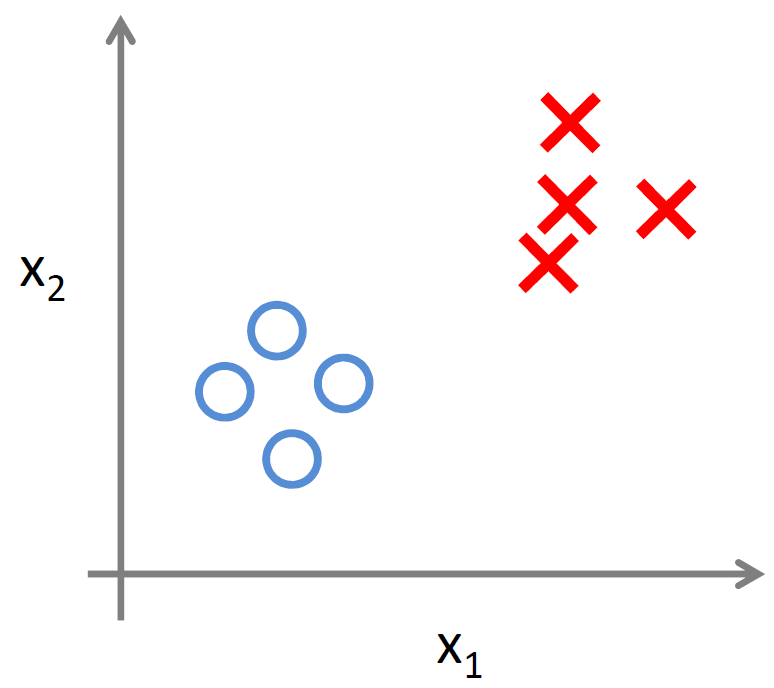
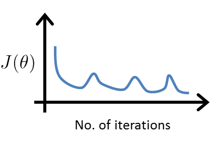

# Unsupervised Learning: Clustering

## Unsupervised Learning: Introduction

### Lecture Notes

+ Supervised learning
  + Given a set of labels, fit a hypothesis to it
  + Training set: $\{(x^{(1)}, y^{(1)}), (x^{(2)}, y^{(2)}), (x^{(3)}, y^{(3)}), \ldots, (x^{(m)}, y^{(m)})\}$
  <div style="display:flex;justify-content:center;align-items:center;flex-flow:row wrap;">
    <div><a href="https://d3c33hcgiwev3.cloudfront.net/_0104e918fbf0762326a187fdcf615f9d_Lecture13.pdf?Expires=1556150400&Signature=TZ-XGNIm4bzG7FzM3k98Zc0UcM0hTBY5EiGaPI1GgMZyWk00j0FFKzWKc31gYe-95KVoyTB3gGbfkRpnAvVbtYs7djB6h7ltljXNCbkKOMNE4cy~OywO600pEdfYOMQw5JMVxwbxS5C213qwXwMYAV6FFm7Hhm8NPFyi84h2VlQ_&Key-Pair-Id=APKAJLTNE6QMUY6HBC5A">
      
    </a></div>
  </div>

+ Unsupervised learning
  + While supervised learning algorithms need labeled examples $(x,y)$, unsupervised learning algorithms need only the input $(x)$
  + No label
  + Objective: find structure in data
  + Clustering: find cluster in the data, one of many unsupervised learning algorithm
  + Trainging set: $\{(x^{(1)}), (x^{(2)}), (x^{(3)}), \ldots, (x^{(m)}) \}$
  <div style="display:flex;justify-content:center;align-items:center;flex-flow:row wrap;">
    <div><a href="https://www.ritchieng.com/machine-learning-unsupervised-learning/">
      
    </a></div>
  </div>

+ Applications of clustering
  + Market segmentation: Group people into different segments
  + Social network analysis: Smart lists
  + Organize computing clusters
  + Astronomical data analysis: Understanding galaxy formation

+ IVQ: Which of the following statements are true? Check all that apply.

  1. In unsupervised learning, the training set is of the form $\{x^{(1)},x^{(2)},\ldots,x^{(m)}\}$.
  2. Clustering is an example of unsupervised learning.
  3. In unsupervised learning, you are given an unlabeled dataset and are asked to find "structure" in the data.
  4. Clustering is the only unsupervised learning algorithm.

  Ans: 123


### Lecture Video

<video src="https://d3c33hcgiwev3.cloudfront.net/14.1-Clustering-UnsupervisedLearningIntroduction.714d0b90b22b11e49c064db6ead92550/full/360p/index.mp4?Expires=1556150400&Signature=boepJsvSLXikL~w69XnWQuWqfoBBgcFTh7IFfg7V6T9yhz~29rmk1ByaS1o82Sqikk-jchuYtycWKhOMHhB20rYW1QAfiWfZyR9qX9wFbfIX0rUTHIR0ntXeG~MGml7tOaNdpXIPThA3O9LrUSNo2dKPrmm~gw2tBFemgNBoKUg_&Key-Pair-Id=APKAJLTNE6QMUY6HBC5A" preload="none" loop="loop" controls="controls" style="margin-left: 2em;" muted="" poster="http://www.multipelife.com/wp-content/uploads/2016/08/video-converter-software.png" width="180">
  <track src="https://www.coursera.org/api/subtitleAssetProxy.v1/8EOLpwD9Qh6Di6cA_TIe3Q?expiry=1556150400000&hmac=-fOq5pLXNR5ga_p8UpryxxO6dCX7iv_BC_ByxdVK7rY&fileExtension=vtt" kind="captions" srclang="en" label="English" default>
  Your browser does not support the HTML5 video element.
</video>
<br/>


## K-Means Algorithm

### Lecture Notes

+ Introduction
  + automatically group the data into clusters
  + most widely used clustering algorithm

+ Example: choose our cluster centroids
  + simplest with $K = 2$
  + K-Means is an iterative algorithm and it does these steps
    1. Randomly allocate points as cluster centroids
      + able to have many but the exact "ideal" number can be determined and will be explained subsequently
      + here, $K=2$
    2. Cluster assignment step
      + each sample assigned to one of the two cluster centroids
      + calculate the distances of each point with the two centroids and then assign to the closer centroid
    3. Move centroid step
      + calcuate new centroids with their assigned points
      + the calculation is the average of the points
      + continue until converge

+ K-Means Algorithm
  + Input: 
    + $K\;$: number of clusters
    + Training set: $\{x^{(1)},x^{(2)},\ldots,x^{(m)}\}$
  + $x^{(i)} \;\in\; \mathbb{R}^n$ (drop $x_0 = 1$ convention)
  + Randomly initialize $K$ cluster centroids $\mu_1, \mu_2, \ldots, \mu_K \;\in\; \mathbb{R}^n$

    Repeat { <br/>
    <span style="padding-left: 1em"/> for $i$ = 1 to $m$ [Cluster assignment step]<br/>
    <span style="padding-left: 2em"/> $c^{(i)} :=\;$ index (from 1 to $K$) of cluster centroid closest to $x^{(i)} \implies c^{(i)} = \min_k \parallel x^{(i)} - \mu_k \parallel^2$ <br/>
    <span style="padding-left: 1em"/> for $k$ = 1 to $K$ [Move centroid] <br/>
    <span style="padding-left: 2em"/> $\mu_k :=\;$ average (mean) of points assigned to cluster $k \implies \mu_k = \frac{1}{m_k} \sum_{i=1}^{m_k} x^{(k_i)} \;\in\; \mathbb{R}^n$ <br/>
    }
  + IVQ: Suppose you run k-means and after the algorithm converges, you have: $c^{(1)} = 3, c^{(2)} = 3, c^{(3)} = 5, \dots$

    Which of the following statements are true? Check all that apply.

    1. The third example $x^{(3)}$ has been assigned to cluster 5.
    2. The first and second training examples $x^{(1)}$ and $x^{(2)}$ have been assigned to the same cluster.
    3. The second and third training examples have been assigned to the same cluster.
    4. Out of all the possible values of $k \;\in\; \{1,2,\ldots,K\}$ the value $k=3$ minimizes $\parallel x^{(2)} − μ_k \parallel^2$.

    Ans: 124

+ K-means for non-separated clusters

  <div style="display:flex;justify-content:center;align-items:center;flex-flow:row wrap;">
    <div><a href="https://www.ritchieng.com/machine-learning-unsupervised-learning/#optimization-objective">
      
    </a></div>
  </div><br/>

  + K-means would try to separate the data into multiple clusters like the graph on the right
  + Often times, you may not find clusters that are obvious like the graph on the left
  + look at the clusters and find meaning
    + e.g., design a small, medium and large shirt based on the data shown
    + similar to market segmentation


### Lecture Video

<video src="https://d3c33hcgiwev3.cloudfront.net/14.2-Clustering-KMeansAlgorithm.440391e0b22b11e4901abd97e8288176/full/360p/index.mp4?Expires=1556150400&Signature=OM-ixD5Nyk-cWlLkHwnCWWitRZVrO8lmdVf1ZeP8LP-lWpHvVzKEVJFEsRJ49YkHKxfhPKe6G-9SNrsuzw~CXdoOYS7za62B1DvpJOaY3rKfHeYnpuoKX6wHslQ~idvkSjZGZV7xTmQ~idFbkv0oOfYC0KFQdlH-fohK3-IR5FA_&Key-Pair-Id=APKAJLTNE6QMUY6HBC5A" preload="none" loop="loop" controls="controls" style="margin-left: 2em;" muted="" poster="http://www.multipelife.com/wp-content/uploads/2016/08/video-converter-software.png" width="180">
  <track src="https://www.coursera.org/api/subtitleAssetProxy.v1/-40WKd_ZQmaNFinf2dJmHA?expiry=1556150400000&hmac=rq3aEAOJjiCpr3Ot8niThW-4F1Oxp4r548ZRAT5j4SQ&fileExtension=vtt" kind="captions" srclang="en" label="English" default>
  Your browser does not support the HTML5 video element.
</video>
<br/>


## Optimization Objective

### Lecture Notes

+ Cost function of K-Means Algorithm
  + help debug the algorithm
  + help K-Means to find better clusters

+ K-Means optimization objective: Cost function (distortion function)
  + Objective: find $c^{(i)}$ and $\mu_k$ to minimize the cost function
  + Notations:
    + $c^{(i)}\;$: index of cluster $\{1, 2, \dots, K \}$ to which example $x^{(i)}$ is currently assigned
    + $\mu_k\;$: cluster centroid $k$ ($\mu_k \;\in\; \mathbb{R}^n$)
    + $\mu_c(i)\;$: cluster centroid of cluster to which example $x^{(i)}$ has been assigned
  + Optimization objective (Cost function = Distortion function)

    $$\begin{array}{l} J(c^{(1)}, \dots, c^{(m)}, \mu_1, \dots, \mu_K) = \dfrac{1}{m} \sum_{i=1}^m \parallel x^{(i)} - \mu_c(i) \parallel^2 \\\\ \displaystyle \min_{\begin{array}{c}c^{(1)},\dots,c^{(m)},\\ \mu_1,\dots,\mu_K\end{array}} J(c^{(1)}, \dots, c^{(m)}, \mu_1, \dots, \mu_K) \end{array}$$

+ K-Mean Algorithm

  Randomly initialize $K$ cluster centroids $\mu_1, \mu_2, \ldots, \mu_K \;\in\; \mathbb{R}^n$

  Repeat { <br/>
  <span style="padding-left: 1em"/> for $i$ = 1 to $m$ $\qquad$[Cluster assignment step: minimize$J(\dots)$ w.r.t $c^{(1)}, c^{(2)}, \dots, c^{(m)}$ (holding $\mu_1, \mu_2, \dots, \mu_K$ fixed)]<br/>
  <span style="padding-left: 2em"/> $c^{(i)} :=\;$ index (from 1 to $K$) of cluster centroid closest to $x^{(i)} \implies c^{(i)} = \min_k \parallel x^{(i)} - \mu_k \parallel^2$ <br/>
  <span style="padding-left: 1em"/> for $k$ = 1 to $K$ $\qquad$[Move centroid step: minimize $J(\dots)$ w.r.t $\mu_1, \mu_2, \dots, \mu_K$] <br/>
  <span style="padding-left: 2em"/> $\mu_k :=\;$ average (mean) of points assigned to cluster $k \implies \mu_k = \frac{1}{m_k} \sum_{i=1}^{m_k} x^{(k_i)} \;\in\; \mathbb{R}^n$ <br/>
  }

+ IVQ: Suppose you have implemented k-means and to check that it is running correctly, you plot the cost function $J(c^{(1)}, \dots, c^{(m)}, \mu_1, \dots, \mu_k)$ as a function of the number of iterations. Your plot looks like this

  <div style="display:flex;justify-content:center;align-items:center;flex-flow:row wrap;">
    <div><a href="url">
      
    </a></div>
  </div>

  What does this mean?

  1. The learning rate is too large.
  2. The algorithm is working correctly.
  3. The algorithm is working, but kk is too large.
  4. It is not possible for the cost function to sometimes increase. There must be a bug in the code.

  Ans: 4


### Lecture Video

<video src="https://d3c33hcgiwev3.cloudfront.net/14.3-Clustering-OptimizationObjective.0adde690b22b11e495a62138f9b52d3f/full/360p/index.mp4?Expires=1556150400&Signature=dxvD7enx06X2TadgWIJCP24V5~P8z~efVM36aBjf4suGebDiwqNRnqrnRn7n21mOMJE3yjG7CzlzUl8BNcL4jLprVMSOFfFyRSf95l8lM~H0MdunFZGCW81qDYZLZko3iJB8ccP-MxjlBijxtZPPCGjBpF716KN5NxHjBo8q0eE_&Key-Pair-Id=APKAJLTNE6QMUY6HBC5A" preload="none" loop="loop" controls="controls" style="margin-left: 2em;" muted="" poster="http://www.multipelife.com/wp-content/uploads/2016/08/video-converter-software.png" width="180">
  <track src="https://www.coursera.org/api/subtitleAssetProxy.v1/VeOTF_-PRvyjkxf_j6b87A?expiry=1556150400000&hmac=EKWcRnY1Wlu-8-xqKm8tVV8iMH468MBct5ToaFkjyeE&fileExtension=vtt" kind="captions" srclang="en" label="English" default>
  Your browser does not support the HTML5 video element.
</video>
<br/>


## Random Initialization

### Lecture Notes

+ Random initialization - conditions & recommended
  + Should have $K < m$
  + Randomly pick $K$ training examples
  + Set $\mu_1, \mu_2, \dots, \mu_K$ equal to these $K$ examples $\implies \mu_1 = x^{(1)}, \mu_2 = x^{(2)}, \dots$

+ K-means can end up at different solutions depending on different initialization

+ Local optima
  + K-Means might be with local optima
  + The bottom two diagrams with local optima
  + solution: run K-Means many times with different initialization

  <div style="display:flex;justify-content:center;align-items:center;flex-flow:row wrap;">
    <div><a href="https://www.ritchieng.com/machine-learning-unsupervised-learning/#random-initialization">
      
    </a></div>
  </div>

+ Random Initialization - multiple trials

  for i = 1 to 100 { <br/>
  <span style="padding-left: 1em;" /> randomly initialize K-Means <br/>
  <span style="padding-left: 1em;" /> run k-means. Get $c^{(1)}, \dots, c^{(m)}, \mu_1, \dots, \mu_K$ <br/>
  <span style="padding-left: 1em;" /> compute cost function (distortion): $J(c^{(1)}, \dots, c^{(m)}, \mu_1, \dots, \mu_K)$ <br/>
  }

  Pick clustering that gave the lowest cost $J(c^{(1)}, \dots, c^{(m)}, \mu_1, \dots, \mu_K) \qquad K=2~10$

+ IVQ: Which of the following is the recommended way to initialize k-means?

  1. Pick a random integer ii from $\{1,\dots,k\}$. Set $\mu_1 = \mu_2 = \cdots = \mu_K = x^{(i)}$.
  2. Pick $k$ distinct random integers $i_1, \dots, i_k$ from $\{1,\dots,k\}$. Set $\mu_1 = x^{(i_1)}, \mu_2 = x^{(i_2)}, \dots, \mu_k = x^{(i_k)}$.
  3. Pick $k$ distinct random integers $i_1, \dots, i_k$ from $\{1,\dots,m\}$.  Set $\mu_1 = x^{(i_1)}, \mu_2 = x^{(i_2)}, \dots, \mu_k = x^{(i_k)}$.
  4. Set every element of μi∈Rn to a random value between $–\epsilon$ and $\epsilon$, for some small $\epsilon$.

  Ans: 3


### Lecture Video

<video src="https://d3c33hcgiwev3.cloudfront.net/14.4-Clustering-RandomInitialization.b17f5f10b22b11e4960bf70a8782e569/full/360p/index.mp4?Expires=1556150400&Signature=XYB8NNq1Uv-ZCsxXDT-m4JKVhYjFs-cF6IVQLQ1lFuiv8WHwOMX~epBMiABqLq1PoeK6gKNSJ4o5e0ZIheDLcPdLUxftJRvavLNvQRog2cHC7RpaHTBS7TdI7AjLUHNc3Q3BkmKsEbXS4bfJWgKK6af6GQQqjh9S9Fm6mJzlOaQ_&Key-Pair-Id=APKAJLTNE6QMUY6HBC5A" preload="none" loop="loop" controls="controls" style="margin-left: 2em;" muted="" poster="http://www.multipelife.com/wp-content/uploads/2016/08/video-converter-software.png" width="180">
  <track src="https://www.coursera.org/api/subtitleAssetProxy.v1/zQKTYtdiRPyCk2LXYiT85g?expiry=1556150400000&hmac=Nd-21B4JNKT-KwyIRiLh9_X_LcgisBZ-Mr85_15ocIQ&fileExtension=vtt" kind="captions" srclang="en" label="English" default>
  Your browser does not support the HTML5 video element.
</video>
<br/>


## Choosing the Number of Clusters

### Lecture Notes

+ What is the right value of $K$?

+ Choosing the value of $K$
  + Elbow method
    <div style="display:flex;justify-content:center;align-items:center;flex-flow:row wrap;">
      <div><a href="https://www.ritchieng.com/machine-learning-unsupervised-learning/#random-initialization">
        
      </a></div>
    </div>

    + Left diagram: often there is no clear Elbow $\rightarrow$ difficult to choose, just best guest, plot cost function vs K value not necessary
  + IVQ: Suppose you run k-means using k = 3 and k = 5. You find that the cost function J is much higher for k = 5 than for k = 3. What can you conclude?

    1. This is mathematically impossible. There must be a bug in the code.
    2. The correct number of clusters is $k = 3$.
    3. In the run with $k = 5$, k-means got stuck in a bad local minimum. You should try re-running k-means with multiple random initializations.
    4. In the run with $k = 3$, k-means got lucky. You should try re-running k-means with k = 3 and different random initializations until it performs no better than with $k = 5$.

    Ans: 3

  + Sometimes, you're running K-means to get clusters to use for some later/downstream purpose.  Evaluate K-means based on metric for how well it performs for that later purpose.

    <div style="display:flex;justify-content:center;align-items:center;flex-flow:row wrap;">
      <div><a href="https://www.ritchieng.com/machine-learning-unsupervised-learning/#random-initialization">
        
      </a></div>
    </div

    + the choice of $K$ value depends on the business decision itself


### Lecture Video

<video src="https://d3c33hcgiwev3.cloudfront.net/14.5-Clustering-ChoosingTheNumberOfClusters.c11600a0b22b11e4a416e948628da1fd/full/360p/index.mp4?Expires=1556236800&Signature=KjLCUZN8uFIK63wAagm~RPfQDzYu9RFsUqlLYZWAQT~UxgMimd9BptiyNUrT28ao92lps4zwc~lTRyfm2hgfiHbAqPwmtIESa8PRi7jEgSz9wxvEjD4fYyaNilRKxGyS6xo9kOHcMGdLOQ0ac9vQEjhwfLNwBnK2~PYvQF-PinE_&Key-Pair-Id=APKAJLTNE6QMUY6HBC5A" preload="none" loop="loop" controls="controls" style="margin-left: 2em;" muted="" poster="http://www.multipelife.com/wp-content/uploads/2016/08/video-converter-software.png" width="180">
  <track src="https://www.coursera.org/api/subtitleAssetProxy.v1/dVXdLhKFSNmV3S4ShYjZdw?expiry=1556236800000&hmac=p62QnxpNyaulmrYvayTDk4KJ_RSAMEjSpBqNapye0R0&fileExtension=vtt" kind="captions" srclang="en" label="English" default>
  Your browser does not support the HTML5 video element.
</video>
<br/>


## Review

### Lecture Slides

#### Unsupervised Learning: Introduction

Unsupervised learning is contrasted from supervised learning because it uses an unlabeled training set rather than a labeled one.

In other words, we don't have the vector y of expected results, we only have a dataset of features where we can find structure.

Clustering is good for:

+ Market segmentation
+ Social network analysis
+ Organizing computer clusters
+ Astronomical data analysis


#### K-Means Algorithm

The K-Means Algorithm is the most popular and widely used algorithm for automatically grouping data into coherent subsets.

1. Randomly initialize two points in the dataset called the cluster centroids.
2. Cluster assignment: assign all examples into one of two groups based on which cluster centroid the example is closest to.
3. Move centroid: compute the averages for all the points inside each of the two cluster centroid groups, then move the cluster centroid points to those averages.
4. Re-run (2) and (3) until we have found our clusters.

Our main variables are:

+ K (number of clusters)
+ Training set $\{x^{(1)}, x^{(2)}, \dots,x^{(m)}\}$
+ Where $x^{(i)} \in \mathbb{R}^n$

Note that we __will not use__ the x0=1 convention.

The algorithm:

```matlab
Randomly initialize K cluster centroids mu(1), mu(2), ..., mu(K)
Repeat:
   for i = 1 to m:
      c(i):= index (from 1 to K) of cluster centroid closest to x(i)
   for k = 1 to K:
      mu(k):= average (mean) of points assigned to cluster k
```

The first for-loop is the 'Cluster Assignment' step. We make a vector $c$ where $c(i)$ represents the centroid assigned to example x(i).

We can write the operation of the Cluster Assignment step more mathematically as follows:

$$c^{(i)} = \arg\min_k\ \parallel x^{(i)} - \mu_k \parallel^2$$
 
That is, each $c^{(i)}$ contains the index of the centroid that has minimal distance to $x^{(i)}$.

By convention, we square the right-hand-side, which makes the function we are trying to minimize more sharply increasing. It is mostly just a convention. But a convention that helps reduce the computation load because the Euclidean distance requires a square root but it is canceled.

Without the square:

$$\parallel x^{(i)} - \mu_k \parallel = \parallel\quad\sqrt{(x_1^i - \mu_{1(k)})^2 + (x_2^i - \mu_{2(k)})^2 + (x_3^i - \mu_{3(k)})^2 + ...}\quad\parallel$$

With the square:

$$\parallel x^{(i)} - \mu_k \parallel^2 = \parallel\quad(x_1^i - \mu_{1(k)})^2 + (x_2^i - \mu_{2(k)})^2 + (x_3^i - \mu_{3(k)})^2 + ...\quad\parallel$$

...so the square convention serves two purposes, minimize more sharply and less computation.

The __second for-loop__ is the 'Move Centroid' step where we move each centroid to the average of its group.

More formally, the equation for this loop is as follows:

$$\mu_k = \1n [x(k1)+x(k2)+⋯+x(kn)] \in \mathbb{R}^n$$

Where each of $x^{(k_1)}, x^{(k_2)}, \dots, x^{(k_n)}$ are the training examples assigned to group $m_{\mu_k}$.

If you have a cluster centroid with 0 points assigned to it, you can randomly re-initialize that centroid to a new point. You can also simply eliminate that cluster group.

After a number of iterations the algorithm will converge, where new iterations do not affect the clusters.

Note on non-separated clusters: some datasets have no real inner separation or natural structure. K-means can still evenly segment your data into $K$ subsets, so can still be useful in this case.


#### Optimization Objective

Recall some of the parameters we used in our algorithm:

+ $c^{(i)}\;$ = index of cluster $(1,2,...,K)$ to which example x(i) is currently assigned
+ $\mu_k\;$ = cluster centroid k ($\mu_k \in \mathbb{R}^n$)
+ $\mu_{c^{(i)}}\;$ = cluster centroid of cluster to which example x(i) has been assigned

Using these variables we can define our __cost function__:

$$J(c^{(i)},\dots,c^{(m)},\mu_1,\dots,\mu_K) = \dfrac{1}{m}\sum_{i=1}^m \parallel x^{(i)} - \mu_{c^{(i)}}\parallel^2$$
 

Our __optimization objective__ is to minimize all our parameters using the above cost function:

$$\min_{c,\mu}\ J(c,\mu)$$

That is, we are finding all the values in sets $c$, representing all our clusters, and $\mu$, representing all our centroids, that will minimize __the average of the distances__ of every training example to its corresponding cluster centroid.

The above cost function is often called the __distortion__ of the training examples.

In the cluster assignment step, our goal is to:

Minimize $J(\ldots)$ with $c^{(1)},\dots,c^{(m)}$ (holding $\mu_1,\dots,\mu_K$ fixed)

In the move centroid step, our goal is to:

Minimize $J(\ldots)$ with $\mu_1,\dots,\mu_K$

With k-means, it is not possible for the cost function to sometimes increase. It should always descend.


#### Random Initialization

There's one particular recommended method for randomly initializing your cluster centroids.

+ Randomly pick $K$ training examples. (Not mentioned in the lecture, but also be sure the selected examples are unique).
+ Have $K < m$. That is, make sure the number of your clusters is less than the number of your training examples.
+ Set $\mu_1,\dots,\mu_K$ equal to these K examples.

K-means __can get stuck in local optima__. To decrease the chance of this happening, you can run the algorithm on many different random initializations. In cases where K<10 it is strongly recommended to run a loop of random initializations.

```matlab
for i = 1 to 100:
   randomly initialize k-means
   run k-means to get 'c' and 'm'
   compute the cost function (distortion) J(c,m)
pick the clustering that gave us the lowest cost
```


#### Choosing the Number of Clusters

Choosing K can be quite arbitrary and ambiguous.

__The elbow method__: plot the cost J and the number of clusters K. The cost function should reduce as we increase the number of clusters, and then flatten out. Choose K at the point where the cost function starts to flatten out.

However, fairly often, the curve is __very gradual__, so there's no clear elbow.

__Note__: J will __always__ decrease as K is increased. The one exception is if k-means gets stuck at a bad local optimum.

Another way to choose K is to observe how well k-means performs on a __downstream purpose__. In other words, you choose K that proves to be most useful for some goal you're trying to achieve from using these clusters.

Bonus: Discussion of the drawbacks of K-Means
This [links](http://stats.stackexchange.com/questions/133656/how-to-understand-the-drawbacks-of-k-means) to a discussion that shows various situations in which K-means gives totally correct but unexpected results


### Errata

#### Video Lecture Errata

In the video ‘Motivation II: Visualization’, around 2:45, prof. Ng says R2, but writes ℝ. The latter is incorrect and should be R2.

In the video ‘Motivation II: Visualization’, the quiz at 5:00 has a typo where the reduced data set should be go up to $z^{(n)}$ rather than $z^{(m)}$.

In the video "Principal Component Analysis Algorithm", around 1:00 the slide should read "Replace each $x_j^{(i)}$ with $x_j^{(i)}-\mu_j$." (The second x is missing the superscript (i).)

In the video "Principal Component Analysis Algorithm", the formula shown at around 5:00 incorrectly shows summation from 1 to n. The correct summation (shown later in the video) is from 1 to m. In the matrix U shown at around 9:00 incorrectly shows superscript of last column-vector "u" as m, the correct superscript is n.

In the video "Reconstruction from Compressed Representation", the quiz refers to a formula which is defined in the next video, "Choosing the Number of Principal Components"

In the video "Choosing the number of principal components" at 8:45, the summation in the denominator should be from 1 to n (not 1 to m).

In the in-video quiz in "Data Compression" at 9:47 the correct answer contains k≤n but it should be $k < n$.


#### Programming Exercise Errata

In the ex7.pdf file, Section 2.2 says “You task is to complete the code” but it should be “Your task”

In the ex7.pdf file, Section 2.4.1 should say that each column (not row) vector of U represents a principal component.

In the ex7.pdf file, Section 2.4.2 there is a typo: “predict the identitfy of the person” (the 'f' is unneeded).

In the ex7_pca.m file at line 126, the fprintf string says '(this mght take a minute or two ...)'. The 'mght' should be 'might'.

In the ex7 projectData.m file, update the Instructions to read:

```matlab
%    projection_k = x' * U(:, k);

```

In the function script "pca.m", the 3rd line should read "[U, S] = pca(X)" not "[U, S, X] = pca(X)"


### Quiz: Unsupervised Learning

1. For which of the following tasks might K-means clustering be a suitable algorithm? Select all that apply.

    1. Given a database of information about your users, automatically group them into different market segments.
    2. Given sales data from a large number of products in a supermarket, figure out which products tend to form coherent groups (say are frequently purchased together) and thus should be put on the same shelf.
    3. Given historical weather records, predict the amount of rainfall tomorrow (this would be a real-valued output)
    4. Given sales data from a large number of products in a supermarket, estimate future sales for each of these products.

  Ans: 12 <br/>
  (1) You can use K-means to cluster the database entries, and each cluster will correspond to a different market segment. <br/>
  (2) If you cluster the sales data with K-means, each cluster should correspond to coherent groups of items.


2. Suppose we have three cluster centroids $\mu_1=\begin{bmatrix} 1 \\ 2\end{bmatrix}, \mu_2= \begin{bmatrix}−3 \\ 0 \end{bmatrix}$ and $\mu_3=\begin{bmatrix}4 \\2 \end{bmatrix}$. Furthermore, we have a training example $x^{(i)}= \begin{bmatrix}−2 \\1 \end{bmatrix}$. After a cluster assignment step, what will $c^{(i)}$ be?

    1. $c^{(i)}$ is not assigned
    2. $c^{(i)} = 3$
    3. $c^{(i)} = 1$
    4. $c^{(i)} = 2$

  Ans: 2 <br/>
  $x^{(i)}$ is closest to $\mu_2$, so $c^{(i)} = 2$


3. K-means is an iterative algorithm, and two of the following steps are repeatedly carried out in its inner-loop. Which two?

    1. Move each cluster centroid $\mu_k$, by setting it to be equal to the closest training example $x^{(i)}$
    2. Move the cluster centroids, where the centroids $\mu_k$ are updated.
    3. The cluster assignment step, where the parameters $c^{(i)}$ are updated.
    4. The cluster centroid assignment step, where each cluster centroid $\mu_i$μ is assigned (by setting $c^{(i)}$) to the closest training example $x^{(i)}$.

  Ans: 23 <br/>
  (2) The cluster update is the second step of the K-means loop.<br/>
  (3) This is the correct first step of the K-means loop.


4. Suppose you have an unlabeled dataset $\{x^{(1)}, \ldots, x^{(m)}\}$. You run K-means with 50 different random initializations, and obtain 50 different clusterings of the data. What is the recommended way for choosing which one of these 50 clusterings to use?

    1. Manually examine the clusterings, and pick the best one.
    2. Compute the distortion function $J(c^{(1)}, \ldots, c^{(m)}, \mu_1, \ldots,\mu_k)$, and pick the one that minimizes this.
    3. Plot the data and the cluster centroids, and pick the clustering that gives the most "coherent" cluster centroids.
    4. Use the elbow method.

  Ans: 2 <br/>
  (2) A lower value for the distortion function implies a better clustering, so you should choose the clustering with the smallest value for the distortion function.


5. Which of the following statements are true? Select all that apply.

    1. For some datasets, the "right" or "correct" value of K (the number of clusters) can be ambiguous, and hard even for a human expert looking carefully at the data to decide.
    2. Since K-Means is an unsupervised learning algorithm, it cannot overfit the data, and thus it is always better to have as large a number of clusters as is computationally feasible.
    3. The standard way of initializing K-means is setting μ1=⋯=μk to be equal to a vector of zeros.
    4. If we are worried about K-means getting stuck in bad local optima, one way to ameliorate (reduce) this problem is if we try using multiple random initializations.

  Ans: 14 <br/>
  (1) In many datasets, different choices of K will give different clusterings which appear quite reasonable. With no labels on the data, we cannot say one is better than the other. <br/>
  (4) Since each run of K-means is independent, multiple runs can find different optima, and some should avoid bad local optima.


