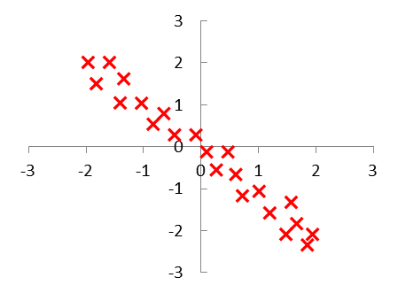
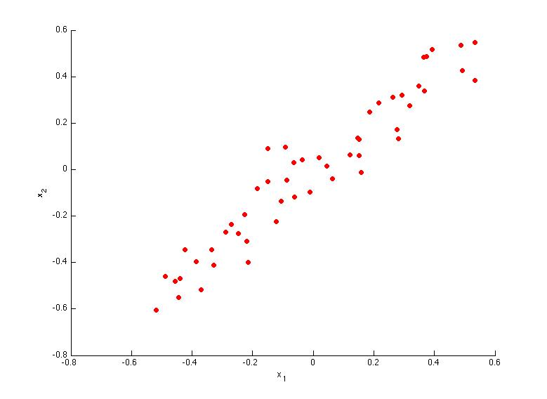
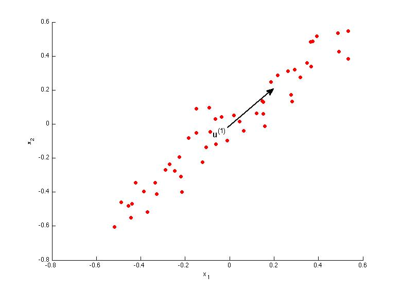
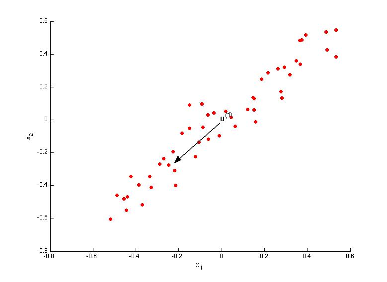
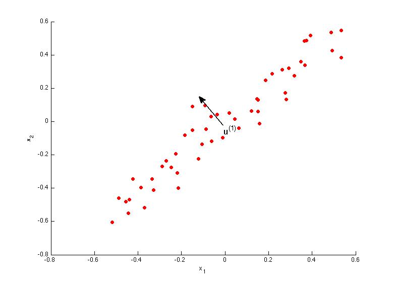

# Dimensionality Reduction

## Motivation

### Motivation I: Data Compression

#### Lecture Notes

+ Data Compression
  + Reduce data from 2D to 1D
    + pilot skill and pilot happiness can be reduced to pilot’s aptitude
    + Generally, reduce $x_1, x_2$ to $z_1$

      $$\begin{array}{rcl} x^{(1)} \in \mathbb{R}^2 & \rightarrow& z^{(1)} \in \mathbb{R} \\ x^{(2)} \in \mathbb{R}^2 & \rightarrow& z^{(2)} \in \mathbb{R} \\ \& \vdots & \\ x^{(m)} \in \mathbb{R}^2 & \rightarrow& z^{(m)} \in \mathbb{R} \end{array}$$

  <div style="display:flex;justify-content:center;align-items:center;flex-flow:row wrap;">
    <div><a href="https://www.ritchieng.com/machine-learning-dimensionality-reduction/">
      
      
    </a></div>
  </div>

  + Reduce data from 3D to 2D
    + Project the data such that they lie on a plane
    + Specify 2 axes: $z_1$ & $z_2$ as the basis of vectors

      $$z = \begin{bmatrix} z_1 \\ z_2 \end{bmatrix} \qquad z^{(i)} = \begin{bmatrix} z_1^{(i)} \\ z_2^{(i)} \end{bmatrix}$$ 

  <div style="display:flex;justify-content:center;align-items:center;flex-flow:row wrap;">
    <div><a href="https://www.ritchieng.com/machine-learning-dimensionality-reduction/">
          </a></div>
  </div>

  + IVQ: Suppose we apply dimensionality reduction to a dataset of m examples $\{x^{(1)}, x^{(2)}, \dots, x^{(m)}\}$, where $x^{(i)}\in\mathbb{R}^n$. As a result of this, we will get out:

    1. A lower dimensional dataset $\{z^{(1)}, z^{(2)},\dots, z^{(k)}\}$ of $k$ examples where $k\leq n$.
    2. A lower dimensional dataset $\{z^{(1)}, z^{(2)},\dots, z^{(k)}\}$ of k examples where $k > n$.
    3. A lower dimensional dataset $\{z^{(1)}, z^{(2)},\dots, z^{(m)}\}$ of m examples where $z^{(i)} \in \mathbb{R}^k$ for some value of $k$ and $k\leq n$.
    4. A lower dimensional dataset $\{z^{(1)}, z^{(2)},\dots, z^{(m)}\}$ of m examples where $z^{(i)} \in \mathbb{R}^k$ for some value of $k$ and $k > n$.

    Ans: 3


#### Lecture Video

<video src="https://d3c33hcgiwev3.cloudfront.net/15.1-DimensionalityReduction-MotivationIDataCompression.71895140b22b11e4901abd97e8288176/full/360p/index.mp4?Expires=1556236800&Signature=dDT6M63OK6TF0xCCnxSwuRXXOu5y~YYVpXzwE5mT-LUsKgDAhwRvCe~FGCKGEiU4oUbSkLAlqFpsNDme50wYcmKT-LudBX6PpgQx8zRHFjLegYp3Cj6xw6fwlfKrt2a2HnqkZQtkRM8fzfowkGKjJZGtq65LzQqzMyiZs4KYBgg_&Key-Pair-Id=APKAJLTNE6QMUY6HBC5A" preload="none" loop="loop" controls="controls" style="margin-left: 2em;" muted="" poster="http://www.multipelife.com/wp-content/uploads/2016/08/video-converter-software.png" width="180">
  <track src="https://www.coursera.org/api/subtitleAssetProxy.v1/OVB2xEXhQ2CQdsRF4YNgTQ?expiry=1556236800000&hmac=l09QI63lD5RMtkiULIiwaQN3dWajnl8X6AVItWtKxBU&fileExtension=vtt" kind="captions" srclang="en" label="English" default>
  Your browser does not support the HTML5 video element.
</video><br/>


### Motivation II: Visualization

#### Lecture Notes

+ Data Visualization
  + Original data with 50 features: $x^{(i)} \in \mathbb{R}^{50}$

    | Country | GDP (trillions of US\$) $\rightarrow x_1$ | Per capita GDP (thousands od intl. \$) $\rightarrow x_2$ | Human Development Index $\rightarrow x_3$ | Life expectancy $\rightarrow x_4$ | Poverty Index (Gini as percentage) $\rightarrow x_5$ | Mean Household income (thousands of US\$) $\rightarrow x_6$ | $\cdots |
    |---|---|---|---|---|---|---|---|
    | Canada | 1.577 | 39.17 | 0.908 | 80.7 | 32.6| 67.293 | $\cdots$ |
    | China | 5.878 | 7.54 | .687 | 73 | 46.9 | 10.22 | $\cdots$ |
    | India | 1.632 | 3.41 | 0.547 | 64.7 | 36.8 | 0.573 | $\cdots$ |
    | Russia | 1.48 | 19.84 | 0.755 | 65.5 | 39.9 | 0.72 | $\cdots$ |
    | Singapore | 0.223 | 56.69 | 0.866 | 80 | 42.5 | 67.1 | $\cdots$ |
    | USA | 14.527 | 46.86 | 0.91 | 78.3 | 40.8 | 84.3 | $\cdots$ |
    |  $\cdots$ | $\cdots$ | $\cdots$ | $\cdots$ | $\cdots$ | $\cdots$ | $\cdots$ | $\cdots$ |

  + Reduce data from 50D to 2D
    + $z^{(i)} \in \mathbb{R}^2$
    + Typically the meaning is unknown for the 2D
    + able to make sense of out of the 2D

    | Country | $z_1$ | $z_2$ |
    |---------|-------|-------|
    | Canada | 1.6 | 1.2 |
    | China | 1.7 | 0.3 |
    | India | 1.6 | 0.2 |
    | Russia | 1.4 | 0.5 |
    | Singapore | 0.5 | 1.7 |
    | USA | 2 | 1.5|
    | $\cdots$ | $\cdots$ | $\cdots$ |

  <div style="display:flex;justify-content:center;align-items:center;flex-flow:row wrap;">
    <div><a href="https://www.ritchieng.com/machine-learning-dimensionality-reduction/">
      
    </a></div>
  </div>

+ IVQ: Suppose you have a dataset $\{x^{(1)}, x^{(2)}, \dots, x^{(m)}\}$ where $x^{(i)} \in \mathbb{R}^n$. In order to visualize it, we apply dimensionality reduction and get $\{z^{(1)}, z^{(2)}, \dots, z^{(m)}\}$ where $z^{(i)} \in \mathbb{R}^k$ is $k$-dimensional. In a typical setting, which of the following would you expect to be true? Check all that apply.

  1. $k > n$
  2. $k \leq n$
  3. $k \geq 4$
  4. $k = 2$ or $k = 3$ (since we can plot 2D or 3D data but don’t have ways to visualize higher dimensional data)

  Ans: 24


#### Lecture Video

<video src="https://d3c33hcgiwev3.cloudfront.net/15.2-DimensionalityReduction-MotivationIIVisualization.3d2f10b0b22b11e4bb7e93e7536260ed/full/360p/index.mp4?Expires=1556236800&Signature=jdxNI9BlSBmnehgnW6Rd~5p51NYBvqS8Yhb8oO0j25BHzQSjFmUWp7sxVI3XV~41ruU3z2t20UMFgAQoI3BCHHxt0dMjmBJ-Gc8xfh8ihjpqowomXCNr0MPuLS~xsPBxS0D2UdFfwM8RoOdcnpfDo2LXMxA~Uz9C~H9WI5rIpVA_&Key-Pair-Id=APKAJLTNE6QMUY6HBC5A" preload="none" loop="loop" controls="controls" style="margin-left: 2em;" muted="" poster="http://www.multipelife.com/wp-content/uploads/2016/08/video-converter-software.png" width="180">
  <track src="https://www.coursera.org/api/subtitleAssetProxy.v1/GzkaggVLQ9K5GoIFS1PS1A?expiry=1556236800000&hmac=mScR2j-r5Tj-14ZxHa69tTy3MNIMhKCs6MGqRv3YlSo&fileExtension=vtt" kind="captions" srclang="en" label="English" default>
  Your browser does not support the HTML5 video element.
</video><br/>


## Principal Component Analysis

### Principal Component Analysis Problem Formulation

#### Lecture Notes


+ Principle Component Analysis (PAC) problem formulation

  <div style="display:flex;justify-content:center;align-items:center;flex-flow:row wrap;">
    <div><a href="https://www.ritchieng.com/machine-learning-dimensionality-reduction/">
      
    </a></div>
    
    </a></div>
  </div>

  + Example of PCA algorithm
    1. Project a diagonal line (red line)
      + perform mean normalization (mean = 0) and feature scaling
      + using PCA to reduce the projection error (the blue lines)
    2. Project with another diagonal line (magenta line)
      + much larger projection error
      + PCA chooses the red line instead of the magenta line

  + Goal
    + find the lowest dimensional surface onto which to project the data with minimal squared projection error
    + minimize the square distance between each point and the location of where it gets projected

  + Reduce from 2D to 1D: find a direction (a vector $u^{(1)} \in \mathbb{R}$ onto which to project the data so as to minimize the projection error
  + Reduce from $n$-dimensional to $k$-dimensional: find $k$ vectors $u^{(1)}, u^{(2)}, \dots, u^{(k)}$ onto which to project the data so as to minimize the projection error

+ PCA is not linear regression
  + Linear regression:
    + predict $y$ according to given $x$
    + minimize the squared error between point and the regression line
    + 2D Example: the distance between point and regression line (might along $y$-axis)
  + PCA to minimize the orthogonal distance
    + minimize the projection distance between point and the given line
    + no specific value to predict and all variables treat equally

  <div style="display:flex;justify-content:center;align-items:center;flex-flow:row wrap;">
    <div><a href="https://www.ritchieng.com/machine-learning-dimensionality-reduction/">
      
    </a></div>
  </div>

  + IVQ: Suppose you run PCA on the dataset below. Which of the following would be a reasonable vector $u^{(1)}$ onto which to project the data? (By convention, we choose $u^{(1)}$ so that $\parallel u^{(1)} \parallel = \sqrt{(u^{(1)})^2 + (u^{(1)})^2}$, the length of the vector $u^{(1)}$, equals 1.)

  <div style="display:flex;justify-content:center;align-items:center;flex-flow:row wrap;">
    <div><a href="https://www.coursera.org/learn/machine-learning/lecture/GBFTt/principal-component-analysis-problem-formulation">
      
    </a></div>
  </div>

  1. $u^{(1)} = \begin{bmatrix} 1 \\ 0 \end{bmatrix}$
  2. $u^{(1)} = \begin{bmatrix} 0 \\1 \end{bmatrix}$
  3. $u^{(1)} = \begin{bmatrix} 1/\sqrt{2} \\ 1/\sqrt{2} \end{bmatrix}$
  4. $u^{(1)} = \begin{bmatrix} −1/\sqrt{2} \\ 1/\sqrt{2} \end{bmatrix}$

  Ans: 4


#### Lecture Video

<video src="https://d3c33hcgiwev3.cloudfront.net/15.3-DimensionalityReduction-PrincipalComponentAnalysisProblemFormulation.35ff7730b22b11e4901abd97e8288176/full/360p/index.mp4?Expires=1556323200&Signature=MmbPisVri9nroEOC6UJShCtbsKFUDpBiXsKlm-tIr4AAWKdPWocvr2fCXGCcEp~dgUCekpm8w8zl9c~7GqD3cERTY32auz65QH~WPIteVKMyE2gv1WDnTxfzwkNpYlNjmO6JIKmBxTiUhrCbtsl-sV~LPcC0X0uAl6jDo~Z0bag_&Key-Pair-Id=APKAJLTNE6QMUY6HBC5A" preload="none" loop="loop" controls="controls" style="margin-left: 2em;" muted="" poster="http://www.multipelife.com/wp-content/uploads/2016/08/video-converter-software.png" width="180">
  <track src="https://www.coursera.org/api/subtitleAssetProxy.v1/uWcaBB1jRk2nGgQdY8ZNpQ?expiry=1556323200000&hmac=OhFcaSVfRqmUv0AHq6bdh4bbbVAOd0vB40te4u8wzZ0&fileExtension=vtt" kind="captions" srclang="en" label="English" default>
  Your browser does not support the HTML5 video element.
</video><br/>


### Principal Component Analysis Algorithm

#### Lecture Notes

+ Data preprorcessing

  Training set: $x^{(1)}, x^{(2)}, \dots, x^{(m)}$ <br/>
  Preprocessing (feature scaling/mean normalization): <br/>
  <span style="padding-left:2em;"/>$\mu_j = \dfrac{1}{m} \sum_{i=1}^m x_j^{(i)}$
  <span style="padding-left:2em;"/>Replace each $x_j^{(i)}$ with $x_j - \mu_j$.<br/>
  <span style="padding-left:2em;"/>If different featues on different scales (e.g., $x_1 = \;$ size of house, $x_2 =\;$ number of bedrooms), scale features to have comparable range of values, i.e.,

  $$x_j^{(i)} := \dfrac{x_j^{(i)} - \mu_j}{s_j}$$

+ Principle Component Analysis (PCA) algorithm

  <div style="display:flex;justify-content:center;align-items:center;flex-flow:row wrap;">
    <div><a href="https://www.ritchieng.com/machine-learning-dimensionality-reduction/">
      
    </a></div>
  </div>

  + Reduce data from 2D to 1D: compute vector $x$
  + Reduce data from 3D to 2D: compute vectors $z_1$ and $z_2$
  + Procedure
    + using eigen vector (`eig()`) or singular value decomposition (`svd()`), but later more stable
    + get 3 matrix: $U, S$, and $V$

    Reduce data from $n$-dimensions to $k$-dimensions<br/>
    Compute "covariance matrix":

      $$\Sigma = \dfrac{1}{m} \sum_{i=1}^m \underbrace{(x^{(i)})}_{n\times 1} \underbrace{(x^{(i)})^T}_{1 \times n} \implies Sigma$$

    Compute "eigenvectors"/"singular value decomposition" of matrix $\Sigma \;(n \times n \text{ matrix})$: `[U, S, V] = svd(Sigma);`

      $$U = \begin{bmatrix} | & | & & | & & |\\ u^{(1)} & u^{(2)} & \cdots & u^{(k)} & \cdots & u^{(m)} \\ | & | & & | & & | \end{bmatrix} \implies U \in \mathbb{R}^{n \times n} \text{ but take the first $k$ columns as } U_{reduced}$$

  + With matrix $U_{reduced} \implies x \in \mathbb{R}^{n} \longrightarrow z \in \mathbb{R}^k$

    $$z = \underbrace{\begin{bmatrix} | & | & & | \\ u^{(1)} & u^{(2)} & \cdots & u^{(k)} \\ | & | & & | \end{bmatrix}^T}_{k \times n}  x = \begin{bmatrix} - & (u^{(1)})^T & - \\ - & (u^{(1)})^T & - \\ & \vdots & \\ - & (u^{(k)})^T & - \end{bmatrix} x$$

+ Summary of PCA algorithm in octave

  After mean normalization (ensure every feature has zero mean) and optionally feature scaling

    $$\text{Sigma } = \dfrac{1}{m} \sum_{i=1}^m (x^{(i)})(x^{(i)})^T = \dfrac{1}{m} x^T \cdot x$$

  where $x = \begin{bmatrix} - & x^{(1)} & - \\ & \vdots & \\ - & x^{(m)} & - \end{bmatrix}$ and `Sigma = (1/m) * x' * x;`

  [U S V] = svd(Sigma); <br/>
  Ureduce = U(:, 1:k);<br/>
  z = Ureduce' * x;

+ IVQ: In PCA, we obtain $z \in \mathbb{R}^k$ from $x \in \mathbb{R}^n$ as follows:

  $$z = \begin{bmatrix} | & | & & | \\ u^{(1)} & u^{(2)} & \cdots & u^{(k)} \\ | & | & & | \end{bmatrix}^T x =\begin{bmatrix} - & (u^{(1)})^T & - \\ - & (u^{(1)})^T & - \\ & \vdots & \\ - & (u^{(k)})^T & - \end{bmatrix} x$$

  Which of the following is a correct expression for $z_j$?

  1. $z_j = (u^{(k)})^T x$
  2. $z_j = (u^{(j)})^T x_j$
  3. $z_j = (u^{(j)})^T x_k$
  4. $z_j = (u^{(j)})^T x$

  Ans: 4


#### Lecture Video

<video src="https://d3c33hcgiwev3.cloudfront.net/15.3-DimensionalityReduction-PrincipalComponentAnalysisProblemFormulation.35ff7730b22b11e4901abd97e8288176/full/360p/index.mp4?Expires=1556236800&Signature=bXfhOKHJnsqIIBG4GstC9VdhJgEHFbjj8cEtc6XfZxtKERkYRk47QFqCnzJ5X6Ov5QiEpGm145TGwzOpgiisOD4kfKe7r0TW~oqHb9TFdqWqjjmmvU4QoTopBjx7eBfRYXJDYWQ0gLHsICDaAC9uDTQLyQksDumsYqilCDyXzZc_&Key-Pair-Id=APKAJLTNE6QMUY6HBC5A" preload="none" loop="loop" controls="controls" style="margin-left: 2em;" muted="" poster="http://www.multipelife.com/wp-content/uploads/2016/08/video-converter-software.png" width="180">
  <track src="https://www.coursera.org/api/subtitleAssetProxy.v1/uWcaBB1jRk2nGgQdY8ZNpQ?expiry=1556236800000&hmac=K9N5sq-eJXuzMZtBt5Vebq8WmYG0NXo_HX_pRquw6LE&fileExtension=vtt" kind="captions" srclang="en" label="English" default>
  Your browser does not support the HTML5 video element.
</video><br/>


## Applying PCA

### Reconstruction from Compressed Representation

#### Lecture Notes

+ Reconstruction from compressed representation

  <div style="display:flex;justify-content:center;align-items:center;flex-flow:row wrap;">
    <div><a href="https://www.ritchieng.com/machine-learning-dimensionality-reduction/">
      
    </a></div>
  </div>

  + Reconstruction from 1D to 2D:

    $$x_{approx} = \underbrace{U_{reduce}}_{n \times k} \cdot \underbrace{z}_{k \times 1} \approx x$$

+ IVQ: Suppose we run PCA with k = n, so that the dimension of the data is not reduced at all. (This is not useful in practice but is a good thought exercise.) Recall that the percent / fraction of variance retained is given by: $\dfrac{\sum_{i=1}^kS_{ii}}{\sum_{i=1}^nS_{ii}}$. Which of the following will be true? Check all that apply.

  1. $U_\text{reduce}$ will be an $n \times n$ matrix.
  2. $x_\text{approx} = x$ for every example $x$.
  3. The percentage of variance retained will be 100%.
  4. We have that $\dfrac{\sum_{i=1}^kS_{ii}}{\sum_{i=1}^nS_{ii}} > 1$.

  Ans: 123


#### Lecture Video

<video src="https://d3c33hcgiwev3.cloudfront.net/15.6-DimensionalityReduction-ReconstructionFromCompressedRepresentation.c55ea6d0b22b11e4aca907c8d9623f2b/full/360p/index.mp4?Expires=1556409600&Signature=E3SsmeZ80renIC1ysphu45RRfLTnPZB7Afmp9fuw8nlkNREuydv5ekeYunMadMD~wyVTlYlCObmF5cWmgceVyx0r5M3q-Nrs6JyJ8nNS8NPm~n9D-hQnO1GFVCKVbWYgMU4dvKt5ng3xnJ7X5Vsh67p-wt~xp9X9UfpvbeSPot4_&Key-Pair-Id=APKAJLTNE6QMUY6HBC5A" preload="none" loop="loop" controls="controls" style="margin-left: 2em;" muted="" poster="http://www.multipelife.com/wp-content/uploads/2016/08/video-converter-software.png" width="180">
  <track src="https://www.coursera.org/api/subtitleAssetProxy.v1/OmTwKw3pR6ik8CsN6Reofg?expiry=1556409600000&hmac=7IwWNIBFSPk5V89npl2LkfgXUARMyvC0NGSCQqw83Zc&fileExtension=vtt" kind="captions" srclang="en" label="English" default>
  Your browser does not support the HTML5 video element.
</video><br/>


### Choosing the Number of Principal Components

#### Lecture Notes

+ Choosing $k$ (number of principle components)
  + Average squared projection error $\dfrac{1}{m} \sum_{i=1}^m  \parallel x^{(i)} - x_{approx}^{(i)} \parallel^2$
  + Total variation in the data: $\dfrac{1}{m} \sum_{i=1}^m \parallel x^{(i)} \parallel^2$
  + Typically, choose $k$ to be smallest value so that

    $$\dfrac{\\dfrac{1}{m} \sum_{i=1}^m \parallel x^{(i)} - x_{approx}^{(i)} \parallel^2}{\dfrac{1}{m} \sum_{i=1}^m \parallel x^{(i)} \parallel^2} \leq 0.01 \quad (1\%)$$

  + "99\%" of variance is retained"
  + Algorithm:

    Try PCA with $k=1, 2, 3, \dots$ <br/>
    Compute $U_{reduce}, z^{(1)}, z^{(2)}, \dots, z^{(m)}, x_{approx}^{(1)}, \dots, x_{approx}^{(m)}$<br/>
    Check if

    $$\dfrac{\dfrac{1}{m} \sum_{i=1}^m \parallel x^{(i)} - x_{approx}^{(i)} \parallel^2}{\dfrac{1}{m} \sum_{i=1}^m \parallel x^{(i)} \parallel^2} \leq 0.01?$$

  + Compute hypothesis checking equation

    Apply Octave `[U, S, V] = svd(Sigma)`, where

    $$S = \begin{bmatrix} S_{11} & 0 & 0 & \cdots & 0 \\ 0 & S_{22} & 0 & \cdots & 0 \\ 0 & 0 & S_{33} & \cdots & 0 \\ \vdots & \vdots & \vdots & \ddots & \vdots \\ 0 & 0 & 0 & \cdots & S_{nn} \end{bmatrix}$$

    For given $k$

      $$1 - \dfrac{\sum_{i=1}^k S_{ii}}{\sum_{i=1}^n S_{ii}} \leq 0.01 \implies \dfrac{\sum_{i=1}^k S_{ii}}{\sum_{i=1}^n S_{ii}} \geq 0.99$$

    Pick smallest  value of $k$ for which $\dfrac{\sum_{i=1}^k S_{ii}}{\sum_{i=1}^m S_{ii}} \geq 0.99$ (99% of variance retained)
  
  + Typical hypothesis significance values: $0.01, 0.05. 0.10 \implies 99\%, 95\%, 90\%$

+ IVQ: Previously, we said that PCA chooses a direction $u^{(1)}$ (or $k$ directions $u^{(1)}, \dots, u^{(k)}$) onto which to project the data so as to minimize the (squared) projection error. Another way to say the same is that PCA tries to minimize:

  1. $\frac{1}{m} \sum_{i=1}^m = \parallel x^{(i)}\parallel^2$
  2. $\frac{1}{m} \sum_{i=1}^m = \parallel x^{(i)}_{approx}\parallel^2$
  3. $\frac{1}{m} \sum_{i=1}^m = \parallel x^{(i)} − x^{(i)}_{approx}\parallel^2$
  4. $\frac{1}{m} \sum_{i=1}^m = \parallel x^{(i)} + x^{(i)}_{approx}\parallel^2$

  Ans: 3


#### Lecture Video

<video src="https://d3c33hcgiwev3.cloudfront.net/15.5-DimensionalityReduction-ChoosingTheNumberOfPrincipalComponents.403f0fd0b22b11e4beb61117ba5cda9e/full/360p/index.mp4?Expires=1556409600&Signature=lMjpI3I6S8LpKdWKX9KobEZwwFCLtQDndT~SBa65~XttozlANDz0fIhTB3AV1eYUc0XEpjjq-YbGPBzAhMwUXdTnfbTJZaFhgcsxGZP5QJgdPDdsnL2r11DRDx~rykCz-N-0ILpInMshslbTDa-uiZOQer6zHelsHMl9Z8rbST8_&Key-Pair-Id=APKAJLTNE6QMUY6HBC5A" preload="none" loop="loop" controls="controls" style="margin-left: 2em;" muted="" poster="http://www.multipelife.com/wp-content/uploads/2016/08/video-converter-software.png" width="180">
  <track src="https://www.coursera.org/api/subtitleAssetProxy.v1/80G44YfVSM6BuOGH1bjONA?expiry=1556409600000&hmac=iutZmw81OK-Wu_WnFKwOknBPhqtB4Zazm12zUF0zndE&fileExtension=vtt" kind="captions" srclang="en" label="English" default>
  Your browser does not support the HTML5 video element.
</video><br/>


### Advice for Applying PCA

#### Lecture Notes

+ Supervised learning speedup
  + Training dataset: $(x^{(1)}, y^{(1)}), (x^{(2)}, y^{(2)}), \dots, (x^{(m)}, y^{(m)})$
  + Extract inputs: Unlabeled dataset

    $$\begin{array}{ccl} x^{(1)}, x^{(2)}, \dots, x^{(m)} & \in & \mathbb{R}^{10000} \\ \downarrow PCA & & \\ z^{(1)}, z^{(2)}, \dots, z^{(m)} & \in & \mathbb{R}^{1000} \end{array}$$
  
  + With $z$ vector, the logistic regression function: $h_\theta(z)  = \dfrac{1}{1 + e^{-\theta^T z}}$
  + New training set: $(z^{(1)}, y^{(1)}), (z^{(2)}, y^{(2)}) \dots, (z^{(m)}, y^{(m)})$
  + Note: Mapping $x^{(i)} \;\rightarrow\; z^{(i)}$ (i.e., compute $U_{reduce}\;$) should be defined by running PCA only on the training set.  This mapping can be applied as well to the examples $x_{cv}^{(i)}$ and $x_{test}^{(i)}$ in the cross validation and test sets.

+ Application of PCA
  + Compression
    + Reduce memory/risk needed to store data
    + Speed up learning algorithm
    + Choose $k$ by given significance level ($\alpha = 90\%, 95\%, 99\%$) (variance $1\%, 5\%, 10\%$ retained)
  + Visualization
    + Choose $k = 2$ or $k= 3$

+ Bad use of PCA: to prevent overfitting
  + Use $z^{(i)}$ instead of $x^{(i)}$ to reduce number of features to $k < n$
  + Thus, fewer features, lss likely to overfit. $\implies$ bad usage, PCA not intend to solve overfitting issue
  + This might work OK, but isn't a good way to address overfitting.  Using __regularization__ instead.

    $$\min_\theta \dfrac{1}{2m} \sum_{i=1}^m (h_\theta(x^{(i)}) - y^{(i)})^2 + \underbrace{\dfrac{1}{2m} \sum_{j=1}^n \theta_j^2}_{\text{regularization}}$$

+ PCA is sometimes used where it shouldn't be
  + Design of ML system:
    + Get training set $\{(x^{(1)}, y^{(1)}), (x^{(2)}, y^{(2)}), \dots, (x^{(m)}, y^{(m)})\}$
    + Run PCA to reduce $x^{(i)}$ in dimension to get $z^{(i)}$
    + Train logistic regression on $\{(z^{(1)}, y^{(1)}), (z^{(2)}, y^{(2)}), \dots, (x^{(m)}, y^{(m)})\}$
    + Test on test set: Map $x_{test}^{(i)}$ to $z_{test}^{(i)}$.  Run $h_\theta(z)$ on $\{(z_{test}^{(1)}, y_{test}^{(1)}), (z_{test}^{(2)}, y_{test}^{(2)}), \dots, (z_{test}^{(m)}, y_{test}^{(m)}) \}$
  + How about doing the whole thing without using PCA?
  + Before implementing PCA, first try running whatever you wnt to do with the original/raw data $x^{(i)}$. Only if that doesn't do what you want, then implement PCA and consider using $z^{(i)}$.

+ IVQ: Which of the following are good / recommended applications of PCA? Select all that apply.

  1. To compress the data so it takes up less computer memory / disk space
  2. To reduce the dimension of the input data so as to speed up a learning algorithm
  3. Instead of using regularization, use PCA to reduce the number of features to reduce overfitting
  4. To visualize high-dimensional data (by choosing k = 2 or k = 3)

  Ans: 124


#### Lecture Video

<video src="url" preload="none" loop="loop" controls="controls" style="margin-left: 2em;" muted="" poster="http://www.multipelife.com/wp-content/uploads/2016/08/video-converter-software.png" width="180">
  <track src="subtitle" kind="captions" srclang="en" label="English" default>
  Your browser does not support the HTML5 video element.
</video><br/>


### Review

### Lecture Slides

#### Dimensionality Reduction

##### Motivation I: Data Compression

+ We may want to reduce the dimension of our features if we have a lot of redundant data.
+ To do this, we find two highly correlated features, plot them, and make a new line that seems to describe both features accurately. We place all the new features on this single line.

Doing dimensionality reduction will reduce the total data we have to store in computer memory and will speed up our learning algorithm.

Note: in dimensionality reduction, we are reducing our features rather than our number of examples. Our variable $m$ will stay the same size; $n$, the number of features each example from $x^{(1)}$ to $x^{(m)}$ carries, will be reduced.


##### Motivation II: Visualization

It is not easy to visualize data that is more than three dimensions. We can reduce the dimensions of our data to 3 or less in order to plot it.

We need to find new features, $z_1, z_2$ (and perhaps $z_3$) that can effectively summarize all the other features.

Example: hundreds of features related to a country's economic system may all be combined into one feature that you call "Economic Activity."


#### Principal Component Analysis Problem Formulation

The most popular dimensionality reduction algorithm is _Principal Component Analysis (PCA)_

##### Problem formulation

Given two features, $x_1$ and $x_2$, we want to find a single line that effectively describes both features at once. We then map our old features onto this new line to get a new single feature.

The same can be done with three features, where we map them to a plane.

The goal of PCA is to reduce the average of all the distances of every feature to the projection line. This is the __projection error__.

Reduce from 2d to 1d: find a direction (a vector $u^{(1)} \ \in \ \mathbb{R}^n$) onto which to project the data so as to minimize the projection error.

The more general case is as follows: 
+ Reduce from $n$-dimension to $k$-dimension: Find $k$ vectors $u^{(1)}, u^{(2)}, \dots, u^{(k)}$ onto which to project the data so as to minimize the projection error.
+ If we are converting from 3d to 2d, we will project our data onto two directions (a plane), so $k$ will be 2.

##### PCA is not linear regression

+ In linear regression, we are minimizing the squared error from every point to our predictor line. These are vertical distances.
+ In PCA, we are minimizing the shortest distance, or shortest orthogonal distances, to our data points.

More generally, in linear regression we are taking all our examples in $x$ and applying the parameters in Θ to predict $y$.

In PCA, we are taking a number of features $x_1, x_2, \dots, x_n$, and finding a closest common dataset among them. We aren't trying to predict any result and we aren't applying any theta weights to the features.


#### Principal Component Analysis Algorithm

Before we can apply PCA, there is a data pre-processing step we must perform:


##### Data preprocessing

+ Given training set: $x(1),x(2),\dots,x(m)$
+ Preprocess (feature scaling/mean normalization):

  $$\mu_j = \dfrac{1}{m}\sum^m_{i=1}x_j^{(i)}$$

+ Replace each $x_j^{(i)}$ with $x_j^{(i)} - \mu_j$

​+ If different features on different scales (e.g., $x_1$ = size of house, $x_2$ = number of bedrooms), scale features to have comparable range of values.

Above, we first subtract the mean of each feature from the original feature. Then we scale all the features $x_j^{(i)} = \dfrac{x_j^{(i)} - \mu_j}{s_j}$

We can define specifically what it means to reduce from 2d to 1d data as follows:

$$\sum = \dfrac{1}{m} \sum_{i=1}^m (x^{(i)})(x^{(i)})^T$$

The $z$ values are all real numbers and are the projections of our features onto $u^{(1)}$.

So, PCA has two tasks: figure out $u^{(1)},\dots,u^{(k)}$ and also to find $z_1, z_2, \dots, z_m$.

The mathematical proof for the following procedure is complicated and beyond the scope of this course.

1. Compute "covariance matrix"

  $$\sum = \dfrac{1}{m} \sum_{i=1}^m (x^{(i)})(x^{(i)})^T$$
 
  This can be vectorized in Octave as:

  ```matlab
  Sigma = (1/m) * X' * X;
  ```

  We denote the covariance matrix with a capital sigma (which happens to be the same symbol for summation, confusingly---they represent entirely different things).

  Note that $x^{(i)}$ is an $n \times 1$ vector, $(x^{(i)})^T$ is an $1 \times n$ vector and $X$ is a $m \times n$ matrix (row-wise stored examples). The product of those will be an n×n matrix, which are the dimensions of $\sum$.

2. Compute "eigenvectors" of covariance matrix $\sum$

  ```matlab
  [U,S,V] = svd(Sigma);
  ```

  `svd()` is the 'singular value decomposition', a built-in Octave function.

  What we actually want out of `svd()` is the 'U' matrix of the Sigma covariance matrix: $U \in \mathbb{R}^{n \times n}$. $U$ contains $u^{(1)},\dots,u^{(n)}$, which is exactly what we want.

3. Take the first $k$ columns of the $U$ matrix and compute $z$

  We'll assign the first $k$ columns of $U$ to a variable called 'Ureduce'. This will be an $n  \times k$ matrix. We compute $z$ with:

  $$z^{(i)} = U_{reduce}^T \cdot x^{(i)}$$

  $U_{reduce}^T$ will have dimensions $k \times n$ while $x^{(i)}$ will have dimensions $n \times 1$. The product $Ureduce^T \cdot x^{(i)}$ will have dimensions $k \times 1$.

To summarize, the whole algorithm in octave is roughly:

```matlab
Sigma = (1/m) * X' * X; % compute the covariance matrix
[U,S,V] = svd(Sigma);   % compute our projected directions
Ureduce = U(:,1:k);     % take the first k directions
Z = X * Ureduce;        % compute the projected data points
```


#### Reconstruction from Compressed Representation

If we use PCA to compress our data, how can we uncompress our data, or go back to our original number of features?

To go from 1-dimension back to 2d we do: $z \in \mathbb{R} \longrightarrow x \;\in\; \mathbb{R}^2$.

We can do this with the equation: $x_{approx}^{(1)} = U_{reduce} \cdot z^{(1)}$.

Note that we can only get approximations of our original data.

Note: It turns out that the $U$ matrix has the special property that it is a Unitary Matrix. One of the special properties of a Unitary Matrix is:

$U^{−1} = U^∗\;$ where the "*" means "conjugate transpose".

Since we are dealing with real numbers here, this is equivalent to:

$U^{-1} = U^T\;$, So we could compute the inverse and use that, but it would be a waste of energy and compute cycles.


#### Choosing the Number of Principal Components

How do we choose $k$, also called the number of principal components? Recall that $k$ is the dimension we are reducing to.

One way to choose $k$ is by using the following formula:

+ Given the average squared projection error: $\dfrac{1}{m}\sum^m_{i=1} \parallel x^{(i)} - x_{approx}^{(i)}\parallel^2$
+ Also given the total variation in the data: $\dfrac{1}{m}\sum^m_{i=1} \parallel x^{(i)} \parallel^2$
+ Choose k to be the smallest value such that: $\dfrac{\dfrac{1}{m}\sum^m_{i=1} \parallel x^{(i)} - x_{approx}^{(i)} \parallel^2}{\dfrac{1}{m}\sum^m_{i=1} \parallel x^{(i)} \parallel^2} \leq 0.01$

In other words, the squared projection error divided by the total variation should be less than one percent, so that __$99\%$ of the variance is retained__.


##### Algorithm for choosing k

1. Try PCA with $k=1,2,\dots$
2. Compute $U_{reduce}, z, x$
3. Check the formula given above that $99\%$ of the variance is retained. If not, go to step one and increase $k$.

This procedure would actually be horribly inefficient. In Octave, we will call svd:

```matlab
[U,S,V] = svd(Sigma)
```

Which gives us a matrix $S$. We can actually check for 99% of retained variance using the $S$ matrix as follows:

$$\dfrac{\sum_{i=1}^kS_{ii}}{\sum_{i=1}^nS_{ii}} \geq 0.99$$


##### Advice for Applying PCA

The most common use of PCA is to speed up supervised learning.

Given a training set with a large number of features (e.g. $x(1),\dots,x(m) \;\in\; \mathbb{R}^{10000}$) we can use PCA to reduce the number of features in each example of the training set (e.g. $z(1),\dots,z(m) \;\in\; \mathbb{R}^{1000}$).

Note that we should define the PCA reduction from $x^{(i)}$ to $z^{(i)}$ only on the training set and not on the cross-validation or test sets. You can apply the mapping z(i) to your cross-validation and test sets after it is defined on the training set.

Applications

+ Compressions
  + Reduce space of data
  + Speed up algorithm
+ Visualization of data
  + Choose $k = 2$ or $k = 3$

__Bad use of PCA__: trying to prevent overfitting. We might think that reducing the features with PCA would be an effective way to address overfitting. It might work, but is not recommended because it does not consider the values of our results y. Using just regularization will be at least as effective.

Don't assume you need to do PCA. __Try your full machine learning algorithm without PCA first.__ Then use PCA if you find that you need it.


### Errata

In the video ‘Motivation II: Visualization’, around 2:45, prof. Ng says R2, but writes ℝ. The latter is incorrect and should be R2.

In the video ‘Motivation II: Visualization’, the quiz at 5:00 has a typo where the reduced data set should be go up to $^{(n)}$ rather than $z^{(m)}$.

In the video "Principal Component Analysis Algorithm", around 1:00 the slide should read "Replace each $x_j^{(i)}$ with $x_j^{(i)}-\mu_jx$." (The second $x$ is missing the superscript (i).)

In the video "Principal Component Analysis Algorithm", the formula shown at around 5:00 incorrectly shows summation from 1 to n. The correct summation (shown later in the video) is from 1 to m. In the matrix U shown at around 9:00 incorrectly shows superscript of last column-vector "u" as m, the correct superscript is n.

In the video "Reconstruction from Compressed Representation", the quiz refers to a formula which is defined in the next video, "Choosing the Number of Principal Components"

In the video "Choosing the number of principal components" at 8:45, the summation in the denominator should be from 1 to n (not 1 to m).

In the in-video quiz in "Data Compression" at 9:47 the correct answer contains k≤n but it should be $k<n$.


### Quiz: Principal Component Analysis

1. Consider the following 2D dataset:

  <div style="display:flex;justify-content:center;align-items:center;flex-flow:row wrap;">
    <div><a href="https://www.coursera.org/learn/machine-learning/exam/B20Bx/principal-component-analysis">
      
    </a></div>
  </div>

  Which of the following figures correspond to possible values that PCA may return for $u^{(1)}$ (the first eigenvector / first principal component)? Check all that apply (you may have to check more than one figure).

  <div style="display:flex;justify-content:center;align-items:center;flex-flow:row wrap;">
    <div><a href="https://www.coursera.org/learn/machine-learning/exam/B20Bx/principal-component-analysis">
      
      
      
      
    </a></div>
  </div>

  Ans: 12 <br/>
  (1) The maximal variance is along the y = x line, so this option is correct. <br/>
  (2) The maximal variance is along the y = x line, so the negative vector along that line is correct for the first principal component.


2. Which of the following is a reasonable way to select the number of principal components $k$?

  (Recall that nn is the dimensionality of the input data and mm is the number of input examples.)

  1. Choose $k$ to be 99% of $m$ (i.e., $k = 0.99*m$, rounded to the nearest integer).
  2. Choose $k$ to be the smallest value so that at least 99% of the variance is retained.
  3. Choose $k$ to be the largest value so that at least 99% of the variance is retained
  4. Use the elbow method.

  Ans: 2 <br/>
  (2) This is correct, as it maintains the structure of the data while maximally reducing its dimension.


3. Suppose someone tells you that they ran PCA in such a way that "95% of the variance was retained." What is an equivalent statement to this?

  1. $\dfrac{\frac{1}{m} \sum_{i=1}^m \parallel x^{(i)} − x^{(i)}_{approx} \parallel^2}{\frac{1}{m} \sum_{i=1}^m \parallel x^{(i)} \parallel^2} \leq 0.05$
  2. $\dfrac{\frac{1}{m} \sum_{i=1}^m \parallel x^{(i)}\parallel^2}{\frac{1}{m}\sum_{i=1}^m \parallel x^{(i)} − x^{(i)}_{approx} \parallel^2} \leq 0.95$
  3. $\dfrac{\frac{1}{m} \sum_{i=1}^m \parallel x^{(i)}\parallel^2}{\frac{1}{m}\sum_{i=1}^m \parallel x^{(i)} − x^{(i)}_{approx} \parallel^2} \leq 0.05$
  4. $\dfrac{\frac{1}{m} \sum_{i=1}^m \parallel x^{(i)}\parallel^2}{\frac{1}{m}\sum_{i=1}^m \parallel x^{(i)} − x^{(i)}_{approx} \parallel^2} \geq 0.05$

  Ans: 1


4. Which of the following statements are true? Check all that apply.

  1. If the input features are on very different scales, it is a good idea to perform feature scaling before applying PCA.
  2. PCA can be used only to reduce the dimensionality of data by 1 (such as 3D to 2D, or 2D to 1D).
  3. Feature scaling is not useful for PCA, since the eigenvector calculation (such as using Octave's `svd(Sigma)` routine) takes care of this automatically.
  4. Given an input $x \in \mathbb{R}^n$, PCA compresses it to a lower-dimensional vector $z \in \mathbb{R}^k$.

  Ans: 14 <br/>
  (1) Feature scaling prevents one feature dimension from becoming a strong principal component only because of the large magnitude of the feature values (as opposed to large variance on that dimension).
  (4) PCA compresses it to a lower dimensional vector by projecting it onto the learned principal components.


5. Which of the following are recommended applications of PCA? Select all that apply.

  1. Clustering: To automatically group examples into coherent groups.
  2. Data visualization: Reduce data to 2D (or 3D) so that it can be plotted.
  3. Data compression: Reduce the dimension of your input data $x^{(i)}x$, which will be used in a supervised learning algorithm (i.e., use PCA so that your supervised learning algorithm runs faster).
  4. To get more features to feed into a learning algorithm.

  Ans: 23 <br/>
  (2) This is a good use of PCA, as it can give you intuition about your data that would otherwise be impossible to see.
  (3) If your learning algorithm is too slow because the input dimension is too high, then using PCA to speed it up is a reasonable choice.


