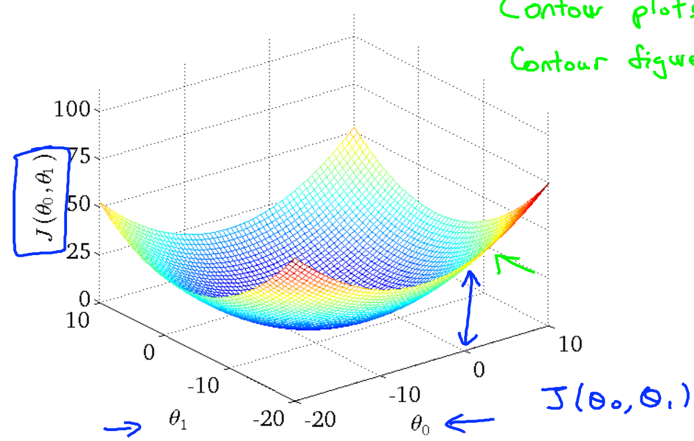
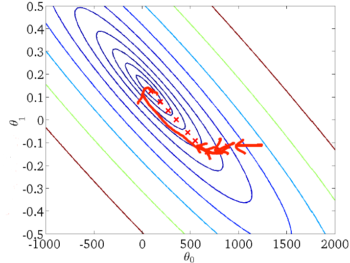
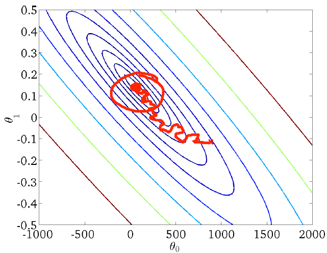

# Large Scale Machine Learning

## Gradient Descent with Large Datasets

### Learning With Large Datasets

#### Lecture Notes

+ Machine learning and data
  + Why do we want large data set?
    + This is evident when we take a low-bias learning algorithm and train it on a lot of data
  + Example: how “I ate two (two) eggs” shows how the algorithm performs well when we feed it a lot of data
    + Classify between confusable words
    + E.g., {to, two, too}, {then, than}
    + For breakfast I ate __________ eggs.

  

    

  

  + "It's not who has the best algorithm that wins. It's who has the most data."

+ Learning with large data sets has computational problems
  + $m = 100 \times 10^6$, to sum over $10^8$ entries to compute one step of gradient descent
  + Train with linear regression model

    $$\theta_j := \theta_j - \alpha \dfrac{1}{m} \sum_{i=1}^m \left( h_\theta(x^{(i)}) - y^{(i)} \right) x_j^{(i)}$$

  + IVQ: Suppose you are facing a supervised learning problem and have a very large data set ($m = 100 \times 10^6$), how can you tell if the data is likely to perform much better than using a small subset ($m = 1000$) of the data?

    1. There is no need to verify this; using a larger dataset always gives much better performance.
    2. Plot $J_\text{train}(\theta)$ as a function of the number of iterations of the optimization algorithm (such as gradient descent).
    3. Plot a learning curve ($J_\text{train}(\theta)$ and $J_\text{CV}(\theta)$, plotted as a function of $m$) for some range of values of $m$ (say up to $m = 1,000$) and verify that the algorithm has bias when m is small.
    4. Plot a learning curve for a range of values of $m$ and verify that the algorithm has high variance when $m$ is small.

    Ans: 4

  + High variance: adding more training examples would increase the accuracy
  + High bias: need to plot to a large value of $m$ -> add extra features or units (in neural networks)

  

    

  

#### Lecture Video

<video src="https://d3c33hcgiwev3.cloudfront.net/18.1-LargeScaleMachineLearning-LearningWithLargeDatasets.06644550b22b11e487451d0772c554c0/full/360p/index.mp4?Expires=1558310400&Signature=UagqJUiz0nlcgkVQUeEjAjL1ftBBMAxt3~T88w0N7hFjMP7VNlBbFuaasknggorOWQP5VyWaTZv6W0P-nhmf3FgkqOX01iYxj8KA7z7vTlsavZE2qDyHVLj0zFU9enIViuK3VJAOsbp48ogF30~xrm6MU~S2kz1tY8TUC4qM1ns_&Key-Pair-Id=APKAJLTNE6QMUY6HBC5A" preload="none" loop="loop" controls="controls" style="margin-left: 2em;" muted="" poster="http://www.multipelife.com/wp-content/uploads/2016/08/video-converter-software.png" width="180">
  <track src="https://www.coursera.org/api/subtitleAssetProxy.v1/In93d44xSpK_d3eOMdqS3g?expiry=1558310400000&hmac=hqZvlZNj8ZXPVFLvs8trwFnPejSX2NSICfWsqvOic3I&fileExtension=vtt" kind="captions" srclang="en" label="English" default>
  Your browser does not support the HTML5 video element.
</video> 

### Stochastic Gradient Descent

#### Lecture Notes

+ Linear regression with gradient descent

  + Hypothesis and Cost functions

    $$\begin{array}{rcl} h_\theta(x) & = & \displaystyle \sum_{j=0}^n \theta_j x_j \\ J_{train}(\theta) & = & \dfrac{1}{2m} \displaystyle \sum_{i=1}^m \left( h_\theta(x^{(i)} - y^{(i)} \right)^2 \end{array}$$

  + Algorithm

    Repeat {  
     $\theta_j := \theta_j - \alpha \dfrac{1}{m} \displaystyle \sum_{i=1}^m \left( h_\theta(x^{(i)} - y^{(i)}) \right) x^{(i)} \quad (\forall j = 0, \dots, n)$  
    }

  

    

  

  + With large $m$ (said $m = 300,000,000$), sum across all the examples
  + __Batch gradient descent__: observe all the training examples at a time

+ Batch vs. Stochastic gradient descent
  + Batch gradient descent

    $$J_{train}(\theta) = \dfrac{1}{2m} \displaystyle \sum_{i=1}^m \left( h_\theta(x^{(i)} - y^{(i)} \right)^2$$

    Repeat {  
     $\theta_j := \theta_j - \alpha \underbrace{\frac{1}{m} \sum_{i=1}^m \left( h_\theta(x^{(i)} - y^{(i)}) \right) x^{(i)}}_{\frac{\partial}{\partial \theta_j}J_{train} (\theta)} \quad (\forall j = 0, \dots, n)$  
    }
  + Stochastic gradient descent

    $$\begin{array}{rcl} cost \left( \theta, (x^{(i)}, y^{(i)}) \right) &=& \frac{1}{2} \left( h_\theta(x^{(i)}) - y^{(i)}) \right)^2 \\\\ J_{train}(\theta) &=& \frac{1}{m} \sum_{i=1}^m cost \left( \theta, (x^{(i)}, y^{(i)}) \right) \end{array}$$

    + General Algorithm
      1. Randomly shuffle (reorder) training examples
      2. Repeat {  
         for $i=1, \dots, m$ {  
         $\theta_j := \theta_j - \alpha \underbrace{\left( h_\theta(x^{(i)}) - y^{(i)} \right) x_j^{(i)}}_{\frac{\partial}{\partial \theta_j} cost \left(\theta, (x^{(i)}, y^{(i)}) \right)} \quad (\forall j=0, \dots, n) \Rightarrow (x^{(1)}, y^{(1)}), (x^{(2)}, y^{(2)}), (x^{(3)}, y^{(3)}), \dots$  
        }  
        }  

  + IVQ: Which of the following statements about stochastic gradient descent are true? Check all that apply.

    1. When the training set size $m$ is very large, stochastic gradient descent can be much faster than gradient descent.
    2. The cost function $J_\text{train}(\theta) = \frac{1}{2m}\sum_{i=1}^m (h_\theta(x^{(i)}) - y^{(i)})^2$ should go down with every iteration of batch gradient descent (assuming a well-tuned learning rate $\alpha$) but not necessarily with stochastic gradient descent.
    3. Stochastic gradient descent is applicable only to linear regression but not to other models (such as logistic regression or neural networks).
    4. Before beginning the main loop of stochastic gradient descent, it is a good idea to "shuffle" your training data into a random order.

    Ans: 124

  + Differences
    + Rather than waiting to take the parts of all the training examples (batch gradient descent), we look at a single training example and we are making progress towards moving to the global minimum
    + Batch gradient descent (red path)
    + Stochastic gradient descent (magenta path with a more random-looking path where it wonders around near the global minimum) not converge ti global minimum but oscillate around it
    + In practice, as long as the parameters close to the global minimum, it’s sufficient (within a region of global minimum)
    + repeat the loop maybe 1 to 10 times depending on the size of training set
    + It is possible even with 1 loop, where your $m$ is large, you can have good parameters
    + the $J_{train}$ (cost function) may not decrease with every iteration for stochastic gradient descent

#### Lecture Video

<video src="https://d3c33hcgiwev3.cloudfront.net/18.2-LargeScaleMachineLearning-StochasticGradientDescent.bf8834b0b22b11e4960bf70a8782e569/full/360p/index.mp4?Expires=1558310400&Signature=Ydu7JmdsPLPPZVsbOIFK3iOxTQj-XzsbMnMRkoMV-AeTYFl-cKJ2vxM8vDeO2PzznGFaTzWSfrhbrrIcbUEEHmhKZuDld774HOeRUly6yiZLE6o93u6e2iI0BqpLRsqgwb2RAtFq7a2NvSZtJsYOWIFixsvIz3-P0EFBpBO0G3g_&Key-Pair-Id=APKAJLTNE6QMUY6HBC5A" preload="none" loop="loop" controls="controls" style="margin-left: 2em;" muted="" poster="http://www.multipelife.com/wp-content/uploads/2016/08/video-converter-software.png" width="180">
  <track src="https://www.coursera.org/api/subtitleAssetProxy.v1/Ma7B-4oJRqSuwfuKCdakNQ?expiry=1558310400000&hmac=XY-0Yf5CgkNIYvcMgmjOe0XrvCL_FwFdLMev8TS-Jmc&fileExtension=vtt" kind="captions" srclang="en" label="English" default>
  Your browser does not support the HTML5 video element.
</video> 

### Mini-Batch Gradient Descent

#### Lecture Notes

+ Comparisons of gradient descent methods
  + Batch gradient descent: use all $m$ examples in each iteration
  + Stochastic gradient descent: use $1$ example in each iteration
  + Min-batch gradient descent: use $b$ examples in each iteration
    + sometimes faster than stochastic gradient descent
    + $b = \;$ mini-batch size; e.g., $b \in [2, 100]$, typical $b = 10$,
    + Get $b=10$ examples, $(x^{(i)}, y^{(i)}), \dots, (x^{(i+9)}, y^{(i+9)})$, then perform

      $$\theta_j := \theta_j - \alpha \dfrac{1}{10} \displaystyle \sum_{k=i}^{i+9} (h_\theta(x^{(k)}) - y^{(k)}) x_j^{(k)}$$

+ Mini-batch gradient descent

  Say $b=10, m = 1000$  
  Repeat {  
   for $i = 1, 11, 21, 31, \dots, 991$ {  
   $\theta_j := \theta_j - \alpha \dfrac{1}{10} \displaystyle \sum_{k=i}^{i+9} \left( h_\theta(x^{(k)}) - y^{(k)} \right) x_j^{(k)} \quad (\forall j=0,\dots,n)$  
  }  
  }

  + vectorization with $b$ examples
  + IVQ: Suppose you use mini-batch gradient descent on a training set of size $m$, and you use a mini-batch size of $b$. The algorithm becomes the same as batch gradient descent if:

    1. b = 1
    2. b = m / 2
    3. b = m
    4. None of the above

    Ans: 3

#### Lecture Video

<video src="https://d3c33hcgiwev3.cloudfront.net/18.2-LargeScaleMachineLearning-StochasticGradientDescent.bf8834b0b22b11e4960bf70a8782e569/full/360p/index.mp4?Expires=1558310400&Signature=Ydu7JmdsPLPPZVsbOIFK3iOxTQj-XzsbMnMRkoMV-AeTYFl-cKJ2vxM8vDeO2PzznGFaTzWSfrhbrrIcbUEEHmhKZuDld774HOeRUly6yiZLE6o93u6e2iI0BqpLRsqgwb2RAtFq7a2NvSZtJsYOWIFixsvIz3-P0EFBpBO0G3g_&Key-Pair-Id=APKAJLTNE6QMUY6HBC5A" preload="none" loop="loop" controls="controls" style="margin-left: 2em;" muted="" poster="http://www.multipelife.com/wp-content/uploads/2016/08/video-converter-software.png" width="180">
  <track src="https://www.coursera.org/api/subtitleAssetProxy.v1/Ma7B-4oJRqSuwfuKCdakNQ?expiry=1558310400000&hmac=XY-0Yf5CgkNIYvcMgmjOe0XrvCL_FwFdLMev8TS-Jmc&fileExtension=vtt" kind="captions" srclang="en" label="English" default>
  Your browser does not support the HTML5 video element.
</video> 

### Stochastic Gradient Descent Convergence

#### Lecture Notes

+ Checking for convergence
  + Batch gradient descent:
    + Plot $J_{train}(\theta)$ as function of the number of iterations of gradient descent
    + Cost function

      $$J_{train}(\theta) = \dfrac{1}{2m} \sum_{i=1}^m \left( h_\theta(x^{(i)}) - y^{(i)} \right)^2$$

  + Stochastic gradient descent

    $$cost(\theta, (x^{(i)}, y^{(i)})) = \dfrac{1}{2} (h_\theta(x^{(i)}) - y^{(i)})^2$$

    + During learning, compute $cost(\theta, (x^{(i)}, y^{(i)}))$ before updating $\theta$ using $(x^{(i)}, y^{(i)})$
    + Every $1000$ iterations (say), plot $cost(\theta, (x^{(i)}, y^{(i)}))$ averaged over the last $1000$ examples processed by algorithm

    

      

    

      + top left diagram:
        + different learning rate (blue line > red line)
        + smaller learning rate with smaller oscillation
        + the difference of cost values sometimes will be negligible
      + top right diagram:
        + different size of examples (1000 vs 5000)
        + red line (5000) having a smoother curve than blue line (1000)
        + slower with bigger example size
      + bottom left diagram:
        + blue curve looks like not learning at all
        + increase example size might see the slightly decrease curve (5000 - red curve)
        + sometime the increasing size of examples not learning much for whatever reason (magenta curve), then either changing learning rate, the features or something else about the algorithm
      + bottom right diagram:
        + blue curve is divergent
        + use smaller learning rate ($\alpha$)

+ Stochastic gradient descent
  + Cost functions

    $$\begin{array}{c} cost \left(\theta, (x^{(i)}, y^{(i)}) \right) = \frac{1}{2} (h_\theta(x^{(i)}) - y^{(i)})^2 \\\\ J_{train} = \dfrac{1}{2m} \displaystyle \sum_{i=1}^m cost(\theta, (x^{(i)}, y^{(i)})) \end{array}$$
  
  + Algorithm
    1. Randomly shuffle dataset
    2. Repeat {  
       for $i = 1, \dots, m$ {  
       $\theta_j := \theta_j - \alpha (h_\theta(x^{(i)}) - y^{(i)}) x_j^{(i)} \quad (\forall j = 0, \dots, n)$
      }  
      }

  + Learning rate $\alpha$ is typically held constant.  Can slowly decrease $\alpha$ over time if we want $\theta$ to converge. (E.g., $\alpha = \dfrac{\text{const1}}{\text{iterationNumber + const2}}$)

  

    

  

  + Which of the following statements about stochastic gradient descent are true? Check all that apply.

    1. Picking a learning rate α that is very small has no disadvantage and can only speed up learning.
    2. If we reduce the learning rate $\alpha$ (and run stochastic gradient descent long enough), it’s possible that we may find a set of better parameters than with larger $\alpha$.
    3. If we want stochastic gradient descent to converge to a (local) minimum rather than wander of "oscillate" around it, we should slowly increase $\alpha$ over time.
    4. If we plot $\text{cost}(\theta, (x^{(i)}, y^{(i)}))$ (averaged over the last 1000 examples) and stochastic gradient descent does not seem to be reducing the cost, one possible problem may be that the learning rate $\alpha$ is poorly tuned.

    Ans: 24, 3x - decrease

#### Lecture Video

<video src="https://d18ky98rnyall9.cloudfront.net/18.4-LargeScaleMachineLearning-StochasticGradientDescentConvergence.6dc93c00b22b11e4beb61117ba5cda9e/full/360p/index.mp4?Expires=1558310400&Signature=SEtskzx3bfqycqsoYJhB8M7Swii1gdqDyyHJCRGaFCr-sjzQCkd5Vk0JLM6nDd2yu-5p3RXE0Mh2elO1U4PK53Ugjaihh~cxYyiA~jSryFlDqKTK-dc8e-x~P1JEvJLC1SXnorPGehyiJzRAplIqIqXvayshVAsHSwtV7-gcZKM_&Key-Pair-Id=APKAJLTNE6QMUY6HBC5A" preload="none" loop="loop" controls="controls" style="margin-left: 2em;" muted="" poster="http://www.multipelife.com/wp-content/uploads/2016/08/video-converter-software.png" width="180">
  <track src="https://www.coursera.org/api/subtitleAssetProxy.v1/_wDawd-uRV-A2sHfrgVftA?expiry=1558310400000&hmac=K4cbT9Ba7AFoW0kwlVzhukAEAV2TC6GD8RR3b1hhW1k&fileExtension=vtt " kind="captions" srclang="en" label="English" default>
  Your browser does not support the HTML5 video element.
</video> 

## Advanced Topics

### Online Learning

#### Lecture Notes

+ Online learning
  + Shipping service website where user comes, specifies origin and destination, you offer to ship their package for some asking price, and users sometimes choose to use your shipping service ($y = 1$), sometimes not ($y = 0$)
  + Features $x$ captures properties of user, of origin/destination and asking price.  We want to learn $p(y=1 | x; \theta)$ to optimize price ($x$).
  + Model wih logistic regression

    Repeat forever {  
     Get $(x, y)$ corresponding to user  
     Update $\theta$ using $(x, y)$: [$(x, y) \leftarrow (x^{(i)}, y^{(i)})$] 
     $\theta_j := \theta_j - \alpha (h_\theta(x) - y) x_j \quad (j=0, \dots, n)$  
    }
  + Can adapt to changing user preference

+ Other online learning example
  + Product search (learning to search)
    + User searches for "Android phone 1080p camera"
    + Have 100 phones in store.  Will return 10 results
    + $x = \;$ features of phone, how many words in user query match name of phone, how many words in query match description of phone, etc.
    + $y = 1\;$ if user clicks on link.  $y = 0\;$ otherwise
    + Learn $p(y =1 | x; \theta) \quad \rightarrow$ learn predicted CTR (click through rate)
    + Use to show user the 10 phones they're most likely to click on.
  + Other examples:
    + choosing special offers to sho user
    + customized selection of news articles
    + product recommendation
    + ...

+ IVQ: Some of the advantages of using an online learning algorithm are:

  1. It can adapt to changing user tastes (i.e., if $p(y|x;\theta)$ changes over time).
  2. There is no need to pick a learning rate $\alpha$.
  3. It allows us to learn from a continuous stream of data, since we use each example once then no longer need to process it again.
  4. It does not require that good features be chosen for the learning task.

  Ans: 13

#### Lecture Video

<video src="https://d18ky98rnyall9.cloudfront.net/18.5-LargeScaleMachineLearning-OnlineLearning.3ff92d30b22b11e48fb04b0729dc3316/full/360p/index.mp4?Expires=1558310400&Signature=Xb9SpnWpI2bcbHh9j3w7KDnzSYGhGqe5FOXqnb~h4a66bM7KxE8mXEhlMwizNIUZeKMdufX1lVF3sDmbkYafNQRHgv80WHg89yrYL4v0HNYke7EULl~JbI9GLdWLGbGPc16~Zu8ZeOFM3bawUJEhvwz0KM~WRGqxSnMLXJJZ29o_&Key-Pair-Id=APKAJLTNE6QMUY6HBC5A" preload="none" loop="loop" controls="controls" style="margin-left: 2em;" muted="" poster="http://www.multipelife.com/wp-content/uploads/2016/08/video-converter-software.png" width="180">
  <track src="https://www.coursera.org/api/subtitleAssetProxy.v1/O-SCTzzyTNmkgk888tzZRQ?expiry=1558310400000&hmac=0bJYLxl0YMZQ_HF0My37rFvi6JgDcZ-3IvHUX9jvEC4&fileExtension=vtt" kind="captions" srclang="en" label="English" default>
  Your browser does not support the HTML5 video element.
</video> 

### Map Reduce and Data Parallelism

#### Lecture Notes

+ Map-reduce
  + Batch gradient descent: $m = 400$

    $$\theta_j := \theta - \alpha \dfrac{1}{400} \displaystyle \sum_{i=1}^{400} \left( h_\theta(x^{(i)} - y^{(i)}) \right) x_j^{(i)}$$

  + Map-reduce gradient descent
    + Training set: $(x^{(1)}, y^{(1)}), \dots, (x^{(m)}, y^{(m)})$, said $m=400$
    + split the training set into different subsets for servers, said 4 machines
    + Machine 1: use $(x^{(1)}, y^{(1)}), \dots, (x^{(100)}, y^{(100)})$

      $$temp_j^{(1)} = \sum_{i=1}^{100} \left( h_\theta(x^{(i)} - y^{(i)}) \right) x_j^{(i)}$$

    + Machine 2: use $(x^{(101)}, y^{(101)}), \dots, (x^{(200)}, y^{(100)})$

      $$temp_j^{(2)} = \sum_{i=101}^{200} \left( h_\theta(x^{(i)} - y^{(i)}) \right) x_j^{(i)}$$

    + Machine 3: use $(x^{(201)}, y^{(201)}), \dots, (x^{(300)}, y^{(300)})$

      $$temp_j^{(3)} = \sum_{i=201}^{300} \left( h_\theta(x^{(i)} - y^{(i)}) \right) x_j^{(i)}$$

    + Machine 4: use $(x^{(301)}, y^{(301)}), \dots, (x^{(400)}, y^{(400)})$

      $$temp_j^{(4)} = \sum_{i=031}^{400} \left( h_\theta(x^{(i)} - y^{(i)}) \right) x_j^{(i)}$$

  + Combine Machine 1~4:

    $$\theta_j := \theta_j - \alpha \dfrac{1}{400} (temp_j^{(1)} + temp_j^{(2)} + temp_j^{(3)} + temp_j^{(4)}) \quad (j = 0, \dots, n)$$

  

    

    

  

+ Map-reduce and summation over the training set
  + Many learning algorithms can be expressed as computing sums of functions over the training set.
  + Example: for advanced optimization, with logistic regression, need:

    $$\begin{array}{rcl} J_{train}(\theta) &=& - \dfrac{1}{m} \displaystyle \sum_{i=1}^m y^{(i)} \log(h_\theta(x^{(i)})) - (1 - y^{(i)}) \log(1 - h_\theta(x^{(i)})) \\\\ \dfrac{\partial}{\partial \theta_j} J_{train}(\theta) &=& \dfrac{1}{m} \displaystyle \sum_{i=1}^m (h_\theta(x^{(i)}) - y^{(i)}) \cdot x_j^{(i)} \end{array}$$

+ Map reduce and neural network
  + Suppose you want to apply map-reduce to train a neural network on 10 machines
  + In each iteration, compute forward propagation and back propagation on 1/10 of the data to compute the derivative with respect to that 1/10 of the data

+ Multi-core machines
  + split training sets to different cores and then combine the results
  + “Parallelizing” over multiple cores in the same machine makes network latency less of an issue
  + There are some libraries to automatically “parallelize” by just implementing the usual vectorized implementation

+ IVQ: Suppose you apply the map-reduce method to train a neural network on ten machines. In each iteration, what will each of the machines do?

  1. Compute either forward propagation or back propagation on 1/5 of the data.
  2. Compute forward propagation and back propagation on 1/10 of the data to compute the derivative with respect to that 1/10 of the data.
  3. Compute only forward propagation on 1/10 of the data. (The centralized machine then performs back propagation on all the data).
  4. Compute back propagation on 1/10 of the data (after the centralized machine has computed forward propagation on all of the data).

  Ans: 2

#### Lecture Video

<video src="https://d18ky98rnyall9.cloudfront.net/18.6-LargeScaleMachineLearning-MapReduceAndDataParallelism.351e6600b22b11e49c064db6ead92550/full/360p/index.mp4?Expires=1558310400&Signature=OKG9SXJyJlWrAEiJq51qFhb44IUQuos0XGHooomP9Jjej6zHFZqO~24T4CgJ7pvG2YLMAR-hwEXm5ikbkr-rGS~ZQF6RDezOiRAAofKBNJ1EqXGqo~MIdKjSj3bm6uBUDeL2jIOQOqOaCqUq0APgaPVy6bKF~0mc93vqbiUOclg_&Key-Pair-Id=APKAJLTNE6QMUY6HBC5A" preload="none" loop="loop" controls="controls" style="margin-left: 2em;" muted="" poster="http://www.multipelife.com/wp-content/uploads/2016/08/video-converter-software.png" width="180">
  <track src="https://www.coursera.org/api/subtitleAssetProxy.v1/mSG_ceh3RWGhv3Hod5Vh3w?expiry=1558310400000&hmac=bb7PXpeti6iMB-DRb-w-2gOKOwfmb38kwUkvFRmAc3w&fileExtension=vtt" kind="captions" srclang="en" label="English" default>
  Your browser does not support the HTML5 video element.
</video> 

## Review

### Lecture Slides

#### Learning with Large Datasets

We mainly benefit from a very large dataset when our algorithm has high variance when m is small. Recall that if our algorithm has high bias, more data will not have any benefit.

Datasets can often approach such sizes as m = 100,000,000. In this case, our gradient descent step will have to make a summation over all one hundred million examples. We will want to try to avoid this -- the approaches for doing so are described below.

#### Stochastic Gradient Descent

Stochastic gradient descent is an alternative to classic (or batch) gradient descent and is more efficient and scalable to large data sets.

Stochastic gradient descent is written out in a different but similar way:

$$cost(\theta,(x^{(i)}, y^{(i)})) = \dfrac{1}{2}(h_{\theta}(x^{(i)}) - y^{(i)})^2$$

The only difference in the above cost function is the elimination of the m constant within $\dfrac{1}{2}$.

$$J_{train}(\theta) = \dfrac{1}{m} \displaystyle \sum_{i=1}^m cost(\theta, (x^{(i)}, y^{(i)}))$$

$J_{train}$ is now just the average of the cost applied to all of our training examples.

The algorithm is as follows

1. Randomly 'shuffle' the dataset
2. For $i = 1\dots m$

  $$\Theta_j := \Theta_j − \lambda (h_{\Theta}(x^{(i)}) − y^{(i)}) \cdot x^{(i)}_j$$

This algorithm will only try to fit one training example at a time. This way we can make progress in gradient descent without having to scan all m training examples first. Stochastic gradient descent will be unlikely to converge at the global minimum and will instead wander around it randomly, but usually yields a result that is close enough. Stochastic gradient descent will usually take 1-10 passes through your data set to get near the global minimum.

#### Mini-Batch Gradient Descent

Mini-batch gradient descent can sometimes be even faster than stochastic gradient descent. Instead of using all m examples as in batch gradient descent, and instead of using only 1 example as in stochastic gradient descent, we will use some in-between number of examples b.

Typical values for b range from 2-100 or so.

For example, with b=10 and m=1000:

Repeat:

For $i = 1,11,21,31,\dots,991$

$$\theta_j := \theta_j - \alpha \dfrac{1}{10} \displaystyle \sum_{k=i}^{i+9} (h_\theta(x^{(k)}) - y^{(k)})x_j^{(k)}$$

We're simply summing over ten examples at a time. The advantage of computing more than one example at a time is that we can use vectorized implementations over the $b$ examples.

#### Stochastic Gradient Descent Convergence

How do we choose the learning rate α for stochastic gradient descent? Also, how do we debug stochastic gradient descent to make sure it is getting as close as possible to the global optimum?

One strategy is to plot the average cost of the hypothesis applied to every 1000 or so training examples. We can compute and save these costs during the gradient descent iterations.

With a smaller learning rate, it is __possible__ that you may get a slightly better solution with stochastic gradient descent. That is because stochastic gradient descent will oscillate and jump around the global minimum, and it will make smaller random jumps with a smaller learning rate.

If you increase the number of examples you average over to plot the performance of your algorithm, the plot's line will become smoother.

With a very small number of examples for the average, the line will be too noisy and it will be difficult to find the trend.

One strategy for trying to actually converge at the global minimum is to __slowly decrease $\alpha$ over time.__ For example $\alpha = \dfrac{const1}{iterationNumber + const2}$ 

However, this is not often done because people don't want to have to fiddle with even more parameters.

#### Online Learning

With a continuous stream of users to a website, we can run an endless loop that gets $(x,y)$, where we collect some user actions for the features in x to predict some behavior y.

You can update θ for each individual (x,y) pair as you collect them. This way, you can adapt to new pools of users, since you are continuously updating theta.

#### Map Reduce and Data Parallelism

We can divide up batch gradient descent and dispatch the cost function for a subset of the data to many different machines so that we can train our algorithm in parallel.

You can split your training set into z subsets corresponding to the number of machines you have. On each of those machines calculate $\displaystyle \sum_{i=p}^{q}(h_{\theta}(x^{(i)}) - y^{(i)}) \cdot x_j^{(i)}$, where we've split the data starting at $p$ and ending at $q$.

MapReduce will take all these dispatched (or 'mapped') jobs and 'reduce' them by calculating:

$$\Theta_j := \Theta_j − \alpha \frac{1}{z} (temp^{(1)}_j + temp^{(2)}_j + \dots + temp^{(z)}_j) \qquad \forall j = 0, \dots, n$$

This is simply taking the computed cost from all the machines, calculating their average, multiplying by the learning rate, and updating theta.

Your learning algorithm is MapReduceable if it can be _expressed as computing sums of functions over the training set_. Linear regression and logistic regression are easily parallelizable.

For neural networks, you can compute forward propagation and back propagation on subsets of your data on many machines. Those machines can report their derivatives back to a 'master' server that will combine them.

### Quiz: Large Scale Machine Learning

