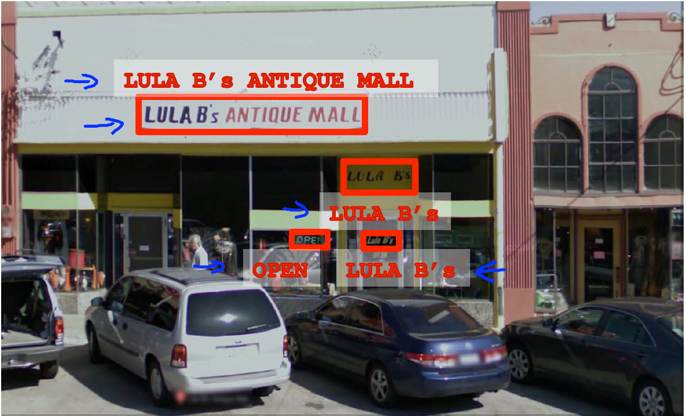
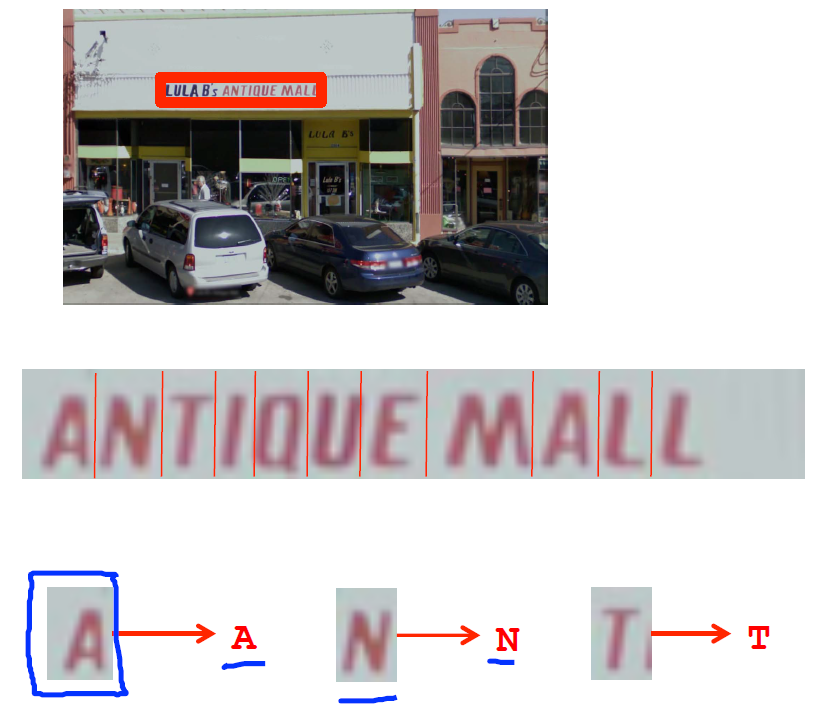
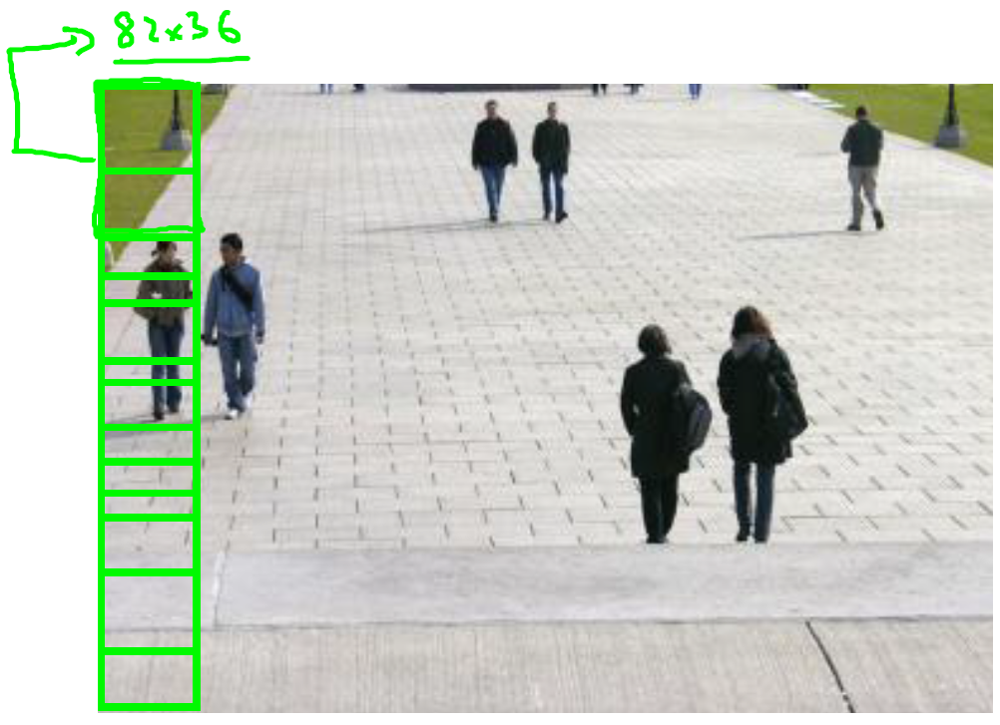
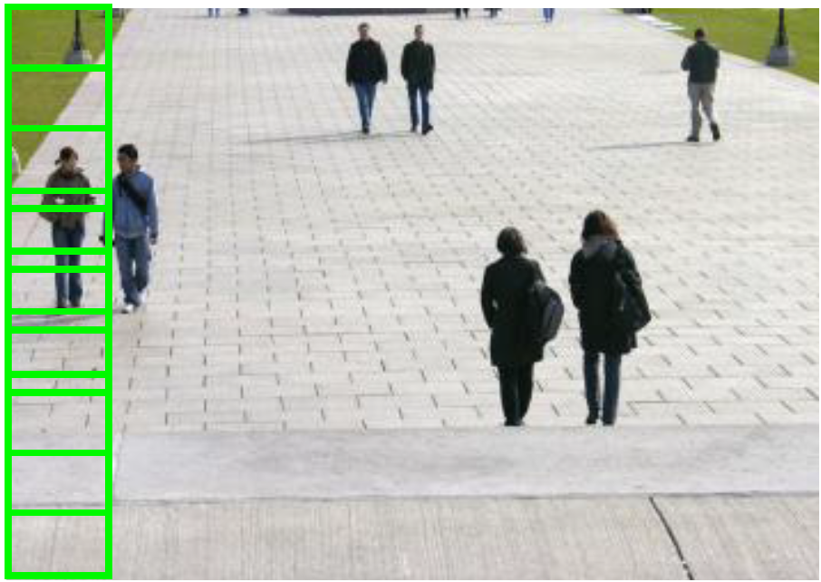
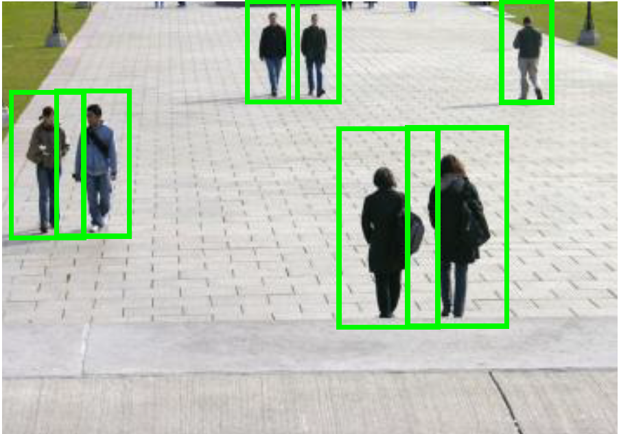
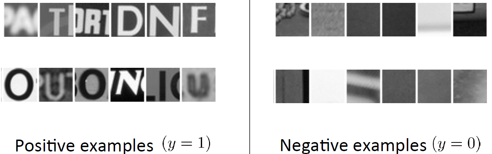
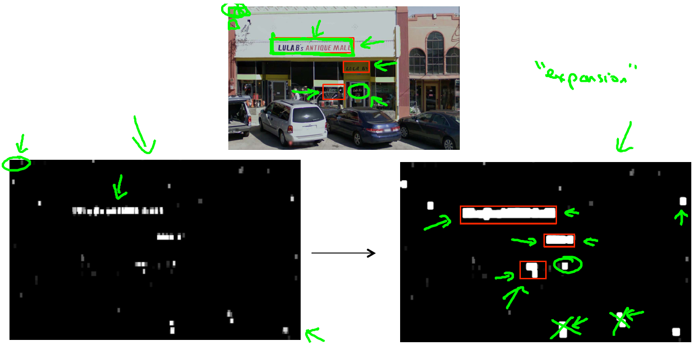

# Application Example: Photo OCR

## Photo OCR

### Problem Description and Pipeline

#### Lecture Notes

+ The Photo OCR (Optical Character Recognition) problem
  1. Given picture, detect location of text in the picture
  2. Read text at the location

  

    

  

+ Photo OCR Pipeline
  1. Text detection
  2. Character segmentation: Splitting “ADD” for example
  3. Character classification: First character “A”, second “D”, and so on

  

    

  

  + IVQ: When someone refers to a “machine learning pipeline,” he or she is referring to:

    1. A PhotoOCR system.
    2. A character recognition system.
    3. A system with many stages / components, several of which may use machine learning.
    4. An application in plumbing. (Haha.)

    Ans: 3

+ When you design a machine learning algorithm, one of the most important steps is defining the pipeline
  + A sequence of steps or components for the algorithms
  + Each step/module can be worked on by different groups to split the workload

#### Lecture Video

<video src="https://d18ky98rnyall9.cloudfront.net/19.1-ApplicationExamplePhotoOCR-ProblemDescriptionAndPipeline.465d8770b22b11e4bb7e93e7536260ed/full/360p/index.mp4?Expires=1558310400&Signature=L6tHa85rIFuUOUljU8jM19U8WuRlJbhPwmNvHWWLQMxsrozIRA22aIgC2KwFH-zrJs6BBGrxYuRxNOgm0aCwYHQR4OnZCl9kJw0XCv~uynF3WZODwjMVCcxPvne2mbew63vZlKfhynMvR4bkkFYrtIH89WFN707qPCi4z4Wp4O4_&Key-Pair-Id=APKAJLTNE6QMUY6HBC5A" preload="none" loop="loop" controls="controls" style="margin-left: 2em;" muted="" poster="http://www.multipelife.com/wp-content/uploads/2016/08/video-converter-software.png" width="180">
  <track src="https://www.coursera.org/api/subtitleAssetProxy.v1/2bdOXjhCSW23Tl44QvltBQ?expiry=1558310400000&hmac=os66HSqQ1uxSorn5N4f3sVjiaquoslSf2S44AOO9nGY&fileExtension=vtt" kind="captions" srclang="en" label="English" default>
  Your browser does not support the HTML5 video element.
</video> 

### Sliding Windows

#### Lecture Notes

+ Text detection & Pedestrian detection

  

    

  

  + identify pedestrians easily because the aspect ratio of most pedestrians are pretty similar
  + 

+ Supervised learning for pedestrian detection
  + standardizing the image: x = pixels in 82 x 36 image patches
  + train model with given positive nad negative classified image patches

  

    

  

+ Sliding window detection for pedestrians
  + slide a green box (82 x 36) with a defined step-size/stride
    + usually step-size/stride = 1 performs the best
    + step-size/stride = 4/8 or more pixels are more cost efficient
  + continue sliding the window over the whole image
    + slide the window row by row with the given step-size/stride (row-wise & column-wise)
    + take a large box and sliding window again
    + resize the larger box to 82 x 36
    + way to train a supervised learning classifier to identify pedestrians

    

      

    

+ Text detection
  + Positive examples ($y = 1$), patches with text
  + Negative examples ($y = 0$), patches without text
  + Run a sliding window classifier on the image
    + the bottom left: white areas that indicate text areas
    + Bright white: classifier output a very high probability of text in the location
  + If we take one more text by taking the output of the classifier and apply an expansion operator
    + It takes the white region and expand them
    + If we use heuristics and discard those with abnormal height-to-width ratio
  + 1D Sliding window for character segmentation
    + classify the patches with two characters (some whitespace in the middle) as positive examples and others are negative examples
    + using the sliding windows with positive examples to segment the characters
  + Character classification with the segments

  

    

  

  + IVQ: Suppose you are running a text detector using 20x20 image patches. You run the classifier on a 200x200 image and when using sliding window, you “step” the detector by 4 pixels each time. (For this problem assume you apply the algorithm at only one scale.) About how many times will you end up running your classifier on a single image? (Pick the closest answer.)

    1. About 100 times.
    2. About 400 times.
    3. About 2,500 times.
    4. About 40,000 times.

    Ans: 3

+ Photo OCR Pipeline
  1. Text detection
  2. Character segmentation: Splitting “ANTIQUE” for example
  3. Character classification: First character “A”, second “N”, and so on

  

    

  

#### Lecture Video

<video src="https://d18ky98rnyall9.cloudfront.net/19.2-ApplicationExamplePhotoOCR-SlidingWindows.05487510b22b11e4901abd97e8288176/full/360p/index.mp4?Expires=1558396800&Signature=HAIhv~ZkTHjUDMTsqeGqeyWTaWa3nf1PA6FFeSIPawFmlb5LEx8VAKyjFS~Z15rp3Jq7iuY~jMUzALNG-ROcczb-sAJcl33w3gBUVkpzm0T3hEA-XU94YbzPOz-~ijinty8rPlHBf0RDo9~79vLvtJcmGWLJRgqh-o8kt6MTaPE_&Key-Pair-Id=APKAJLTNE6QMUY6HBC5A" preload="none" loop="loop" controls="controls" style="margin-left: 2em;" muted="" poster="http://www.multipelife.com/wp-content/uploads/2016/08/video-converter-software.png" width="180">
  <track src="https://www.coursera.org/api/subtitleAssetProxy.v1/2cmqYan8TYmJqmGp_L2Jtg?expiry=1558396800000&hmac=XEAw2LOGxZe6mrHwB3YE98LL278Ln94oOYSXuyRfE5E&fileExtension=vtt" kind="captions" srclang="en" label="English" default>
  Your browser does not support the HTML5 video element.
</video> 

### Getting Lots of Data and Artificial Data

#### Lecture Notes

+ Artificial data synthesis for photo OCR
  + Creating data from scratch
  + having a small training set, turn that into a large training set
  + take free fonts, copy the alphabets and paste them on random backgrounds
  + Right diagram: synthesized image

  

    

  

+ Synthesizing data by introducing distortions
  + distort existing examples to create new data
  + the way to distort is through warping the image
  + Distortion introduced should be representation of the type of noise/distortions in the test set
    + Text: distortion as shown in diagram
    + [Audio](www.pdsounds.org]): background noise, bad cellphone connection
  + Usually does not help to add purely random/meaningless noise to your data
    + $x_i =\;$ intensity (brightness) of pixel $i$
    + $x_i \leftarrow x_1 +\;$ random noise

  

    

  

  + IVQ: Suppose you are training a linear regression model with m examples by minimizing:

    $$J(\theta) = \frac{1}{2m}\sum_{i=1}^m(h_\theta(x^{(i)}) - y^{(i)})^2)$$

    Suppose you duplicate every example by making two identical copies of it. That is, where you previously had one example $(x^{(i)}, y^{(i)})$, you now have two copies of it, so you now have $2m$ examples. Is this likely to help?

    1. Yes, because increasing the training set size will reduce variance.
    2. Yes, so long as you are using a large number of features (a “low bias” learning algorithm).
    3. No. You may end up with different parameters $\theta$, but they are unlikely to do any better than the ones learned from the original training set.
    4. No, and in fact you will end up with the same parameters $\theta$ as before you duplicated the data.

    Ans: 4

+ Discussion on getting more data
  1. Make sure you have a low bias (high variance) classifier before expending the effort to get more data
    + Plot the learning curves to find out
    + Keep increasing the number of features or number of hidden units in the neural network until you have a low bias classifier
  2. How much work would it be to get 10x as much data as you currently have
    + Artificial data synthesis
    + Collect/label it yourself: # of hours? E.g., $10 \text{ secs/example }$, how about $m-1,000 \rightarrow m=10,000$?
    + Crowd source: Hire people on the web to label data (amazon mechanical turk)
  
+ IVQ: You’ve just joined a product group that has been developing a machine learning application for the last 12 months using 1,000 training examples. Suppose that by manually collecting and labeling examples, it takes you an average of 10 seconds to obtain one extra training example. Suppose you work 8 hours a day. How many days will it take you to get 10,000 examples? (Pick the closest answer.)

  1. About 1 day.
  2. About 3.5 days.
  3. About 28 days.
  4. About 200 days.

  Ans: 3 (10000*10/3600/8)

#### Lecture Video

<video src="https://d3c33hcgiwev3.cloudfront.net/19.3-ApplicationExamplePhotoOCR-GettingLotsOfDataArtificialDataSynthesis.43feafe0b22b11e49c064db6ead92550/full/360p/index.mp4?Expires=1558396800&Signature=TaigUdBetNMjqxBZTAyOZ3aqB5JmwiCThiwPWLdqdWHmMCzQ-mK9DGEEsPN3bEWHEpVUPke~AdwlMuEw7zikcNrw~yfE-PImF8OEiAPqc7ktZHKqp79xt0679PD2~0ovWp0kWxzBQjQfNUiki3XzEN9A-cv6p6O5p35uzLLpNqw_&Key-Pair-Id=APKAJLTNE6QMUY6HBC5A" preload="none" loop="loop" controls="controls" style="margin-left: 2em;" muted="" poster="http://www.multipelife.com/wp-content/uploads/2016/08/video-converter-software.png" width="180">
  <track src="https://www.coursera.org/api/subtitleAssetProxy.v1/R9_8S6LbRxGf_Eui25cRTA?expiry=1558396800000&hmac=oVw6Je4vP687b1Fucnu6i2z0czPjsFaNtURFDDveyTA&fileExtension=vtt" kind="captions" srclang="en" label="English" default>
  Your browser does not support the HTML5 video element.
</video> 

### Ceiling Analysis: What Part of the Pipeline to Work on Next

#### Lecture Notes

#### Lecture Video

<video src="url" preload="none" loop="loop" controls="controls" style="margin-left: 2em;" muted="" poster="http://www.multipelife.com/wp-content/uploads/2016/08/video-converter-software.png" width="180">
  <track src="subtitle" kind="captions" srclang="en" label="English" default>
  Your browser does not support the HTML5 video element.
</video> 

### Review

### Lecture Slides

These are the [lecture slides](https://d18ky98rnyall9.cloudfront.net/_cff4fea7eaf5ad373734488ae70dc3dd_Lecture18.pdf?Expires=1558310400&Signature=guhnF5heyev0~-d61PqcpGW-~w0MLG3hiGPT3QCcCwZigqQyoqshqITbD16T79m0253jn9VZBQ1ZJeIfZ1eyggquUnm0E9LhXFjA-5Ke~d-GFEHwyqA1Mlzb9w4QcqBphaalSKY7SZL1gb69o9f2irL-sATgpNVx0SwlTKqHbws_&Key-Pair-Id=APKAJLTNE6QMUY6HBC5A) from this unit. It would be helpful to review them prior to taking the quiz.

### Quiz: Application: Photo OCR

