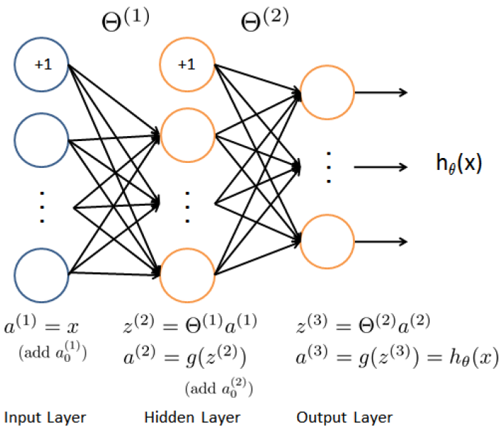

# Programming Assignment: Multi-class Classification and Neural Networks

## Multi-class Classification

+ Use logistic regression and neural networks to recognition handwitten digits (from 0 to 9).

+ Automated handwritten digit recognition

+ One-to-all classification


### Dataset

+ ex3data1.mat: 5000 training examples of handwritten digits
    + each training example is a 20 pixel by 20 pixel grayscale of the digit
    + each pixel is represented by a floating point number indicating the grayscale intensity at that location

+ A 5000 by 400 matrix $X$ where every row is a training example for a handwritten digit image

    $$X = \begin{bmatrix} - & (x^{(1)})^T & - \\ - & (x^{(2)})^T & - \\ & \vdots & \\ - & (x^{(m)})^T & - \end{bmatrix}$$

+ a 5000-dimensional vector $y$ that contains labels for the training set


### Visualizing the data

+ randomly select 100 rows from $X$

+ The function maps each row to a 20 pixel by 20 pixel grayscale image and displays the images together.


### Vectorizing Logistic Regression

+ using multiple one-to-all logistic regression models to build a multi-class classifier

+ The cost function in (unregularized) logistic regression

  $$J(\theta) = \dfrac{1}{m} \sum_{i=1}^m \left[ -y^{(i)} \log(h_\theta(x^{(i)})) - (1 - y^{(i)}) \log(1 - h_\theta(x^{(i)})) \right]$$

  + To compute each element in the summation, compute $h_\theta(x^{(i)})$ for every example $i$, where $h_\theta(x^{(i)}) = g(\theta^T x^{(i)})$ and $g(z) = \dfrac{1}{1+e^{-z}})$ is the sigmoid function,
  + Define $X$ and $\theta$

    $$X = \begin{bmatrix} - & (x^{(1)})^T & - \\ - & (x^{(2)})^T & - \\ & \vdots \\ - & (x^{(m)})^T & - \end{bmatrix} \quad \text{ and } \quad  \theta = \begin{bmatrix} \theta_0 \\ \theta_1 \\ \vdots \\ \theta_n \end{bmatrix}$$

  + Computing the matrix product $X\theta$,

    $$X\theta = \begin{bmatrix} - & (x^{(1)})^T\theta & - \\ - & (x^{(2)})^T\theta & - \\ & \vdots & \\ - & (x^{(m)})^T\theta & - \end{bmatrix} = \begin{bmatrix} - & \theta^T(x^{(1)}) & - \\ - & \theta^T(x^{(2)}) & - \\ & \vdots & \\ - & \theta^T(x^{(m)}) & - \end{bmatrix}$$

  + Property: $a^T b = b^T a$ if $a$ and $b$ are vectors.
  + Compute the products $\theta^Tx^{(i)}$ for all examples $i$ in one line of code.
  + No loop with fully vectorized approach to calculate $\theta^Tx^{(i)}$
  + Hint: use element-wise multiplication operation (`.*`) and the sum operation `sum`

+ The gradient of the (unregularized) logistic regression cost is a vector where the $j^{th}$ element defined as

  $$\dfrac{\partial J}{\partial \theta_j} = \dfrac{1}{m} \sum_{i=1}^m ((h_\theta(x^{(i)}) - y^{(i)}) x^{(i)}_j)$$

  The partial derivatives explicitly for all$\theta_j$

  $$\begin{array}{rcl} \begin{bmatrix} \frac{\partial J}{\partial \theta_0} \\ \frac{\partial J}{\partial \theta_1}  \\ \frac{\partial J}{\partial \theta_2} \\\vdots \\ \frac{\partial J}{\partial \theta_n} \end{bmatrix} & = & \dfrac{1}{m} \begin{bmatrix} \sum_{i=1}^m ((h_\theta(x^{(i)} - y^{(i)}) x_0^{(i)} \\ \sum_{i=1}^m ((h_\theta(x^{(i)} - y^{(i)}) x_1^{(i)} \\ \sum_{i=1}^m ((h_\theta(x^{(i)} - y^{(i)}) x_2^{(i)} \\ \vdots \\ \sum_{i=1}^m ((h_\theta(x^{(i)} - y^{(i)}) x_n^{(i)} \end{bmatrix} \\\\ & = & \dfrac{1}{m} \displaystyle \sum_{i=1}^m \left((h_\theta(x^{(i)}) - y^{(i)}) x^{(i)} \right) = \frac{1}{m} X^T (h_\theta(x) - y) \end{array}$$

  where

  $$h_\theta(x) -y = \begin{bmatrix} h_\theta(x^{(1)}) - y^{(1)} \\ h_\theta(x^{(2)}) - y^{(2)} \\ \vdots \\ h_\theta(x^{(m)}) - y^{(m)} \end{bmatrix}$$

  Note that $x^{(i)}$ is a vector, while $(h_\theta(x^{(i)}) - y^{(i)})$ is a scalar (single number).  Let $\beta_i = (h_\theta(x^{(i)})- y^{(i)})$

  $$\sum_i \beta_i x^{(i)} = \begin{bmatrix}  \mid & \mid & & \mid \\ x^{(1)} & x^{(2)} & \cdots & x^{(m)} \\ \mid & \mid & & \mid \end{bmatrix} \begin{bmatrix} \beta_1 \\ \beta_2 \\ \vdots \\ \beta_m \end{bmatrix} = X^T \beta$$

  where $\beta_i = (h_\theta(x^{(i)}) - y^{(i)})$

  Compute all the partial derivatives without any loops.  

+ Regularized logistic regression, the cost function

  $$J(\theta) = \frac{1}{m} \sum_{i=1}^m \left[ -y^{(i)} \log(H_\theta(x^{(i)})) - (1-y^{(i)}) \log(1 - h_\theta(x^{(i)})) \right] + \dfrac{\lambda}{2m} \sum_{i=1}^n \theta_j^2$$

  Note that not regularizing $\theta_0$ used for the bias term.

  The partial derivative of regularized logistic regression cost for $\theta_j$ defined as 

  $$\begin{array}{rcl} \dfrac{\partial J(\theta)}{\partial \theta_0} &=& \dfrac{1}{m} \sum_{i=1}^m (h_\theta(x^{(i)}) - y^{(i)})x_j^{(i)} \qquad \text{ for } \; j = 0 \\\\ \dfrac{\partial J(\theta)}{\partial \theta_j} & = & (\dfrac{1}{m} \sum_{i=1}^m (h_\theta(x^{(i)}) - y^{(i)})x^{(i)}_j) + \dfrac{\lambda}{m} \theta_j \qquad \text {for } \; j \geq 1 \end{array}$$

  + Index into the matrices to access and update only certain elements
    + `A(:, 3:5) = B(:, 1:3)` replace the column 3 to 5 of A with the column 1 to 3 from B
    + `end` keyword in indexing: seclect columns (or rows) until the end of the matrix
    + $A(:, 2:end)$: elements from the 2nd to last column of A
    + Using 'end' keyword with `sum` and `.^` operations to compute the sum of only the elements interested in =, e.g, `sum(z(2:end).^2))`


### One-vs-all Classification

+ Implement one-vs-all classification by training multiple regularized logistic regression classifier, one for each of the $k$ classes in dataset

+ handwritten digits dataset: $K=10$

+ Complete the code in `oneVsAll.m` to train code classifier for each class

+ Code should return all the classifier parameters in a matrix $\Theta \in \mathbb{R}^{N \times (N+1)}$where each row of $\Theta$ corresponds to the learned logistic regression parameters for one class.

+ $y$ argument: a vector of labels from 1 to 10, where the digit 0 to label 10

+ Notations:
  + $k\;$: classes of the classifier for class $k \in \{1, \ldots, K\}$
  + $y\;$: a $m$-dimensional vector of label, where $y_j \in \{0, 1\}$ indicates whether $j$-th training instance belong to class $k \;(y_j = 1)$, or if it belongs to a different class ($y_j = 0$)

+ Octave tip
  + logical array: array containing binary (0 or 1) elements
  + `a == b`: a vector `a` (of size $m \times 1$) and scalar `b` will return a vector of the same size sd `a` with ones at positions where the elements of `a` are equal to `b` and zeros where they are different.

+ After training, use to predict the digit contained in a given image.

+ compute the "probability" for each input that it belongs to each class using the trained logistic regression classifiers

+ One-vs-all function: pick the class for which the corresponding logistic regression classifier outputs with the highest probability and return the class label ($1, 2, \ldots,$ or $k$) as the prediction for the input example.

+ Using the learned value of $\Theta$ in `predictVsAll.m` to get 94.4% accuracy

+ Post: [dataset in one vs all](https://www.coursera.org/learn/machine-learning/programming/Y54Zu/multi-class-classification-and-neural-networks/discussions/threads/yjJRR5IPEeilTQqSo4EGMg)

  X is the 5000 x 400 matrix of images you mentioned originally. If you vectorize you don’t need x, but if you follow the lecture the x would be an individual image. You make x by taking a row of X and turning it into a column matrix. It is important not to confuse X and x.

  y is a 5000 x 1 column vector whose values are the categories (digits) corresponding to each image of X. During the assignment you convert the y vector to the 5000 x 10 y_matrix. Each column of the matrix is a 0 or 1 with a 1 only in the column that corresponds to the digit in y (digit 0 has a 1 in column 10).

  The data is based on the [Stanford MNIST](http://yann.lecun.com/exdb/mnist/) dataset but is reduced in image size and encoded differently. Information about the encoding can be found at “Tips for classifying your own images” in the programming notes for week 5 and “Bonus: Tutorial on How to classify your own images of digits” in the lecture notes (both in the Resources section) . There are some [MATLAB tools](http://ufldl.stanford.edu/wiki/index.php/Using_the_MNIST_Dataset) for handling the Stanford data directly.

  How much you want to understand is up to you. Feel free to ask questions but don’t post solution code.

  If you haven’t already read the tutorials in the Resources section, I suggest you do so. The vectorized approach there is clearer and less error prone than the loop based approach described in the lectures and ex4.pdf, and much faster.

+ Discussion Post: [Tutorial: ex3 oneVsAll()](https://www.coursera.org/learn/machine-learning/programming/Y54Zu/multi-class-classification-and-neural-networks/discussions/threads/sLIsSJU1EeW70BJZtLVfGQ)

  all_theta is a matrix, where there is a row for each of the trained thetas. In the exercise example, there are 10 rows, of 401 elements each. You know this because that's how all_theta was initialized in line 15 of the script template.

  (note that the submit grader's test case doesn't have 401 elements or 10 rows - your function must work for any size data set - so use the "num_labels" variable).

  Each call to fmincg() returns a theta vector. Be sure you use the lambda value provided in the function header.

  You then need to copy that vector into a row of all_theta.

  The oneVsAll.m script template contains several Hints and a code example to guide your work.

  The "y == c" statement creates a vector of 0's and 1's for each value of 'c' as you iterate from 1 to num_labels. Those are the effective 'y' values that are used for training to detect each label.

  Type these commands in your workspace to see how to copy a vector into a matrix:

  ```matlab
  Q = zeros(5,3)      % create a test matrix of all-zeros
  v = [1 2 3]'        % create a column vector
  Q(2,:) = v          % copy v into the 2nd row of Q
  ```

  The syntax "(2,:)" means "use all columns of the 2nd row".


## Neural Networks

+ Logistic regression cannot form more complex hypotheses as it only a linear classifier.

+ implement a neural network to recognize handwritten digits

+ neural network able to represent complex models that form non-linear hypotheses

+ Implement the feedforward propagation algorithm to use wights for prediction


### Model representation

+ 3 layers Neural Network: 
  + input layer, hidden layer, and output layer
  + image size: $20 \times 20 \quad \Rightarrow \quad$ 400 input layer units (excluding the extra bias unit)
  + a set of network parameters: ($\Theta^{(1)}, \Theta^{(2)}$)
  + hidden layer: 25 units
  + output layer: 10 units (corresponding to the 10 digits)

  <div style="display:flex;justify-content:center;align-items:center;flex-flow:row wrap;">
    <div><a href="https://www.coursera.org/learn/machine-learning/programming/Y54Zu/multi-class-classification-and-neural-networks">
      
    </a></div>
  </div>


### Feedforward Propagation and Prediction

+  complete the code in `predict.m` to return the neural network's prediction

+ implement the feedforward computation that compute $h_\theta(x^{(i)})$ for every example $i$ and return the associated predictions

+ the prediction from the neural network will be label that has the largest output $(h_\theta(x))_k$.

+ Implementation Notes:
  + matrix $X$: containing the examples in rows
  + need to add the column of 1's to the matrix
  + matrices Theta1 and Theta2: containing the parameters for each unit in rows
  + the first row of Theta1 corresponds to the first hidden unit in the second layer
  + compute $z^{(2)} = \Theta^{(1)} a^{(1)}$, be sure that indexing (and if necessary, transpose) $X$ correctly so that you get $a^{(l)}$ as a column vector

+ `predict` function using the loaded set of parameters for Theta1 and Theta2 and the accuracy is about 97.5%.


## Debugging Tip


